# P29：RL方法 - RL解决方案 - 讨论与示例 - 兰心飞侠 - BV14P4y1u7TB

现在是总结我们迄今为止得到的结果的时候，前提是没有强化学习解决方案。

应用于期权定价和对冲的MGP模型。

我们可以从两个方面总结它。首先是将其视为强化学习问题，其次是考虑我们在此开发的模型的金融方面。

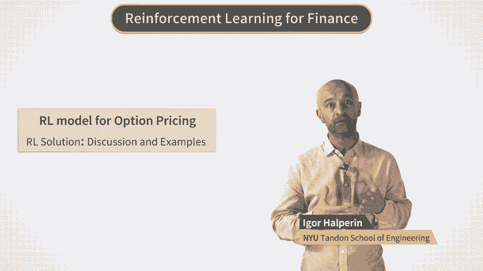

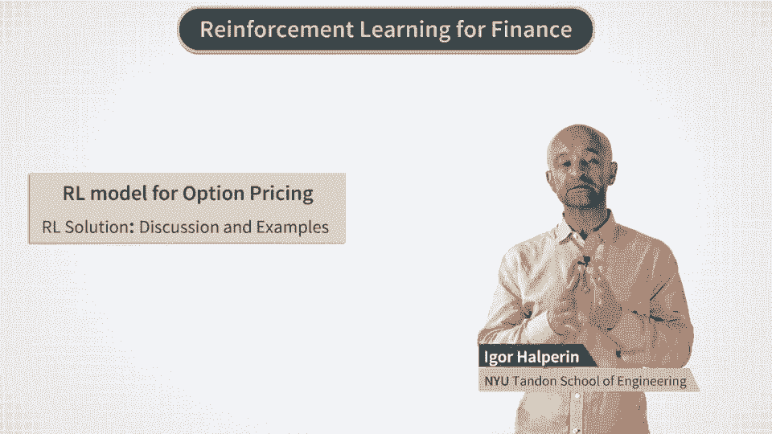

让我们从强化学习和机器学习方面开始。对于机器学习，我们将离散时间的黑-斯科尔斯模型表述为马尔可夫决策过程模型。然后我们为这个模型提供了两种解决方案。第一种是动态规划解决方案，当模型已知时可以应用。

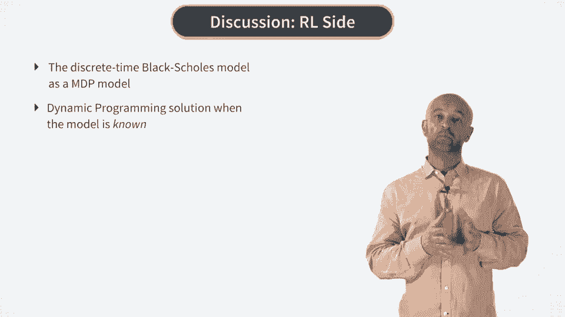

我们在蒙特卡洛设置中实现了这个解决方案，首先模拟股票的路径，然后通过反向递归来解决最优控制问题。

使用基函数展开来近似最优行动和最优Q函数的函数逼近。这为我们提供了贝尔曼最优性方程的基准解决方案。我们还可以检查，使用这种动态规划方法得到的解决方案是否能在时间步长非常小且风险厌恶因子λ趋近于零时重现经典的黑-斯科尔斯模型结果。

然后，我们转向完全基于数据驱动的模型独立求解方式来解决相同的MGP模型。因为我们的模型可以使用Q学习来求解，并且它的更实际版本是批量强化学习方法，称为拟合指导，因此这种数据驱动的模型解决方案实际上是可行的。这意味着该模型可以使用实际的股票价格数据以及获得的数据来进行。

来自期权交易台。因为Q学习和拟合指导是离策略方法，这意味着记录的检测和奖励数据不一定对应于最优的行动。算法也可以从次优的行动中学习。但是现在我们MGP模型的一个非常好的特性是，它可以通过动态规划进行求解。

编程和强化学习方法。因此，动态规划解决方案可以作为基准，我们可以用来测试任何强化学习方法，而不仅仅是拟合指导方法。此外，尽管到目前为止我们仅考虑了单一股票模型，但我们可以扩展这个框架来包括更复杂的动态。然后，在这种设定下，动态规划解决方案可以用作基准，以测试各种强化学习算法。

对于单一风险因素，我们可以扩展这个框架，以包括更复杂的动态。在这种设定下，动态规划解决方案可以作为基准，测试各种强化学习算法。

关于强化学习和 DP 解法在该模型中的另一个优点是：

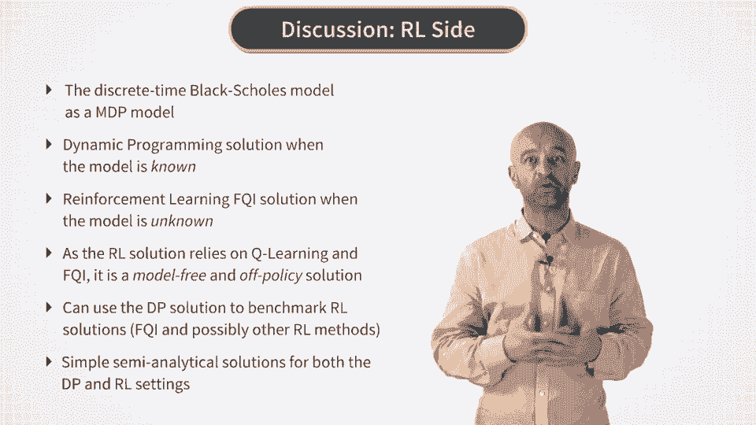

它们两个都非常简单，只涉及简单的线性代数。因为该模型非常简单，所以两种解法都可以通过解析方法进行优化，这使得模型运行速度相对较快。现在，讨论完这些机器学习方面的内容后，我们来谈谈金融建模。

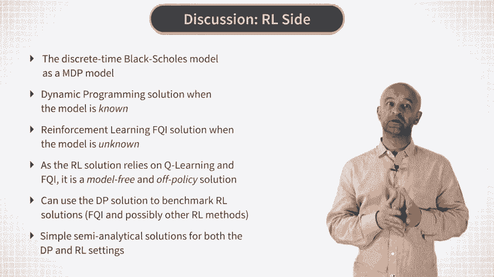

我们 MGP 模型的各个方面。

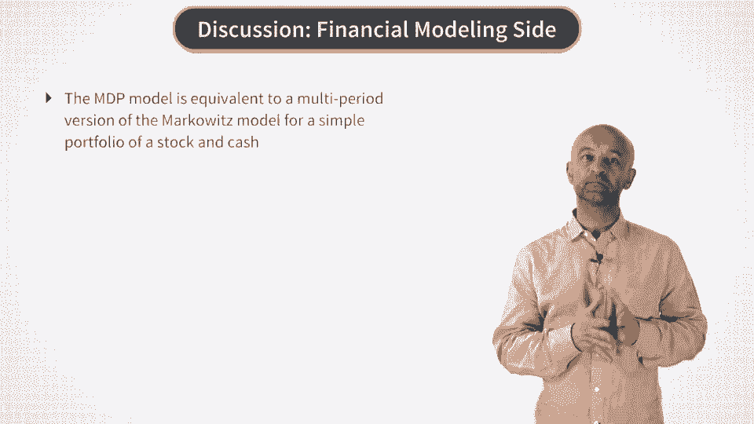

在金融方面，我们发现著名的 Black-Scholes 期权定价模型可以理解为另一个著名金融模型——即 Markowitz 投资组合的连续时间极限。

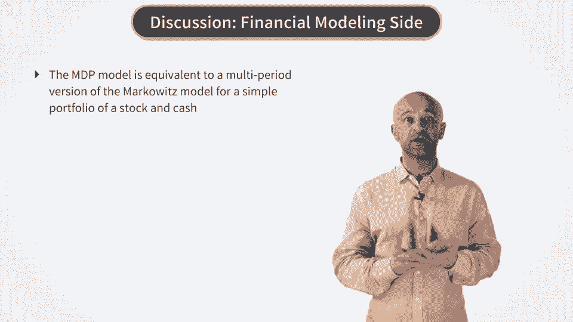

尽管该模型应用于一个非常特殊的环境中。 这是因为在我们的 MGP 问题中，存在期权的最佳对冲和定价问题。

这相当于 Markowitz 理论的多期版本，其中投资组合非常简单，只包括一只股票和现金。

在这个模型中，假设世界的动态是对数正态分布，就像在 Black-Scholes 模型中一样。现在我们发现，如果这个投资组合在期权到期时能够匹配期权的收益，那么期权价格和对冲策略可以通过对这个投资组合进行动态优化来计算，就像在经典的 Markowitz 投资组合中一样。

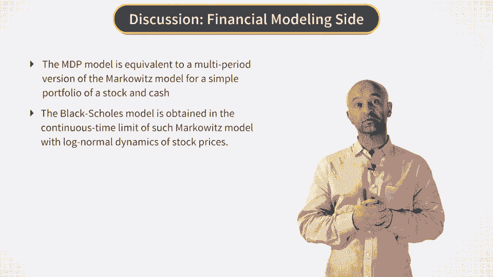

理论。通过使期权的复制投资组合达到 Markowitz 最优，我们在时间步长趋近于零和风险厌恶系数 lambda 的极限下重现了 Black-Scholes 模型。因此，在这个极限下，经典的 Black-Scholes 模型得以匹配，这很好，但目前的模型不仅仅是重现了 Black-Scholes 模型，或者说比其他更复杂的模型做得更多。

数学金融模型确实如此。我们的 MGP 模型不仅生成期权的价格，还给出包含最佳对冲策略的期权定价。

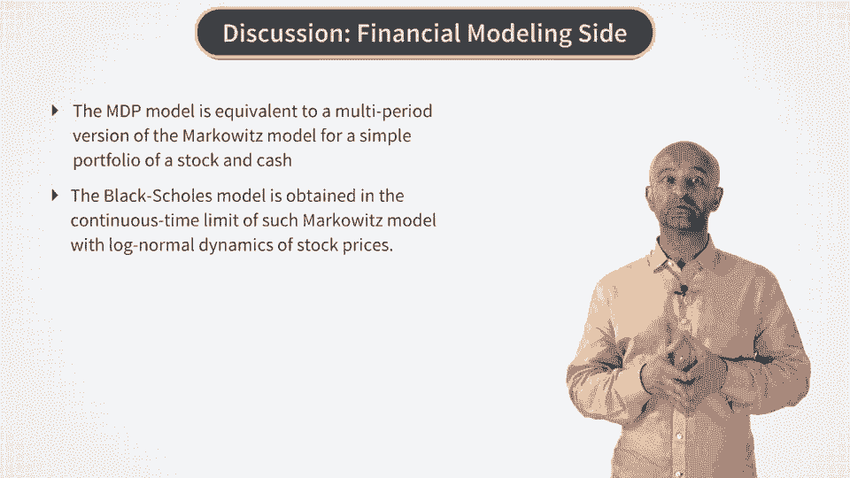

期权中的实际风险总是存在的，因为期权从未重新对冲。

持续进行。 数学金融模型如 Black-Scholes 模型或各种局部或随机波动性模型专注于所谓的公平或风险中性期权价格。鉴于对冲误差是相对于对冲的预期成本的二阶效应，而该成本在此模型中正好等于公平期权价格。

但现实是，在许多情况下，二阶效应和一阶效应一样大，期权中的风险在这些模型中成为了一个重要的因素。

这里表示的MGP模型以模型无关和数据驱动的方式捕捉了这种风险。更重要的是，在这种表述中，定价和对冲是一致的，因为它们都是通过相同的方式获得的。

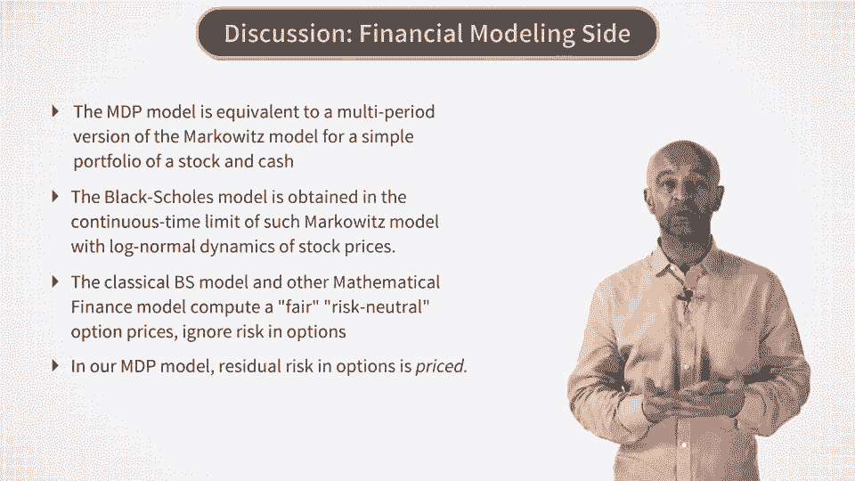

来自同一目标函数最大化的结果。这样的结果一致性非常重要，特别是考虑到许多先前的离散时间风险期权定价模型并未提供期权价格与期权对冲之间的明确联系。因此，不同的期权价格可能对应相同的对冲方法。但在我们提出的框架下，风险期权价格与风险解完全一致。

最小化期权对冲。此外，因为我们的方法是模型无关的，它使我们无需构建和校准某些复杂的股票动态模型，而这实际上是传统数学金融模型的主要目标之一。好了，现在让我们总结一下MGP期权定价模型，并看看一些示例。

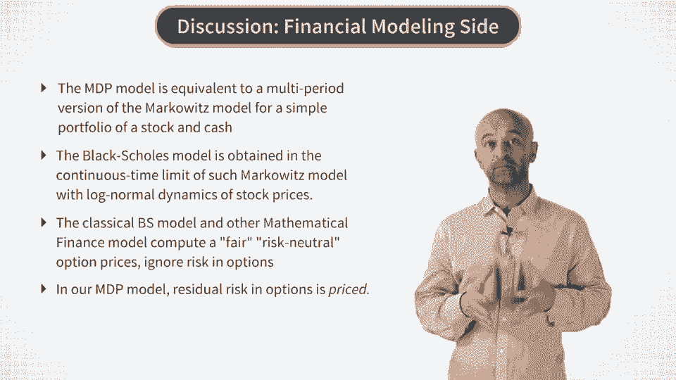

在第一组实验中，我们测试了拟合数据在策略设置中的表现。在此情况下，我们简单地使用通过动态规划获得的最优对冲和词汇。

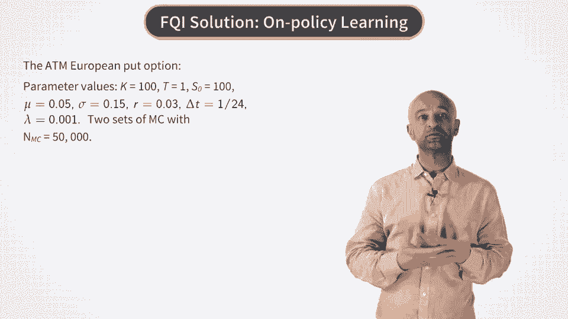

作为拟合数据的解决方案。

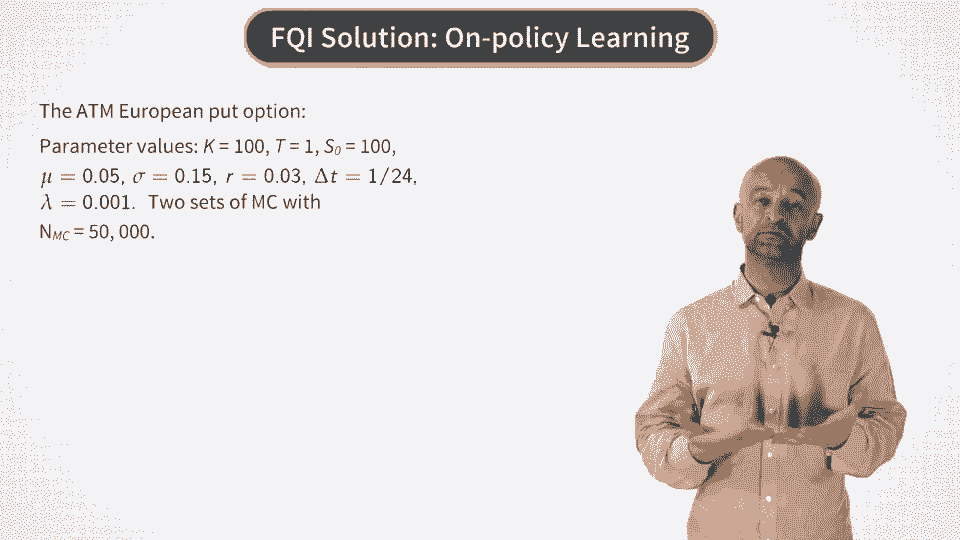

结果显示在这些图表中，分别展示了两组蒙特卡洛模拟结果，左列和右列中各自显示。因为我们这里处理的是在策略学习，因此图中显示的最优Q函数及其最优值QT*和A*，几乎完全一致。该示例中使用的这些参数值的选项价格为490正负。

第12点与使用动态规划方法获得的选项值相同。此情况下的区块浅滩选项价格为4.53，并且通过减少风险厌恶系数lambda的值，可以恢复此数字。我们还可以测试拟合Q迭代在离策略学习中的表现。

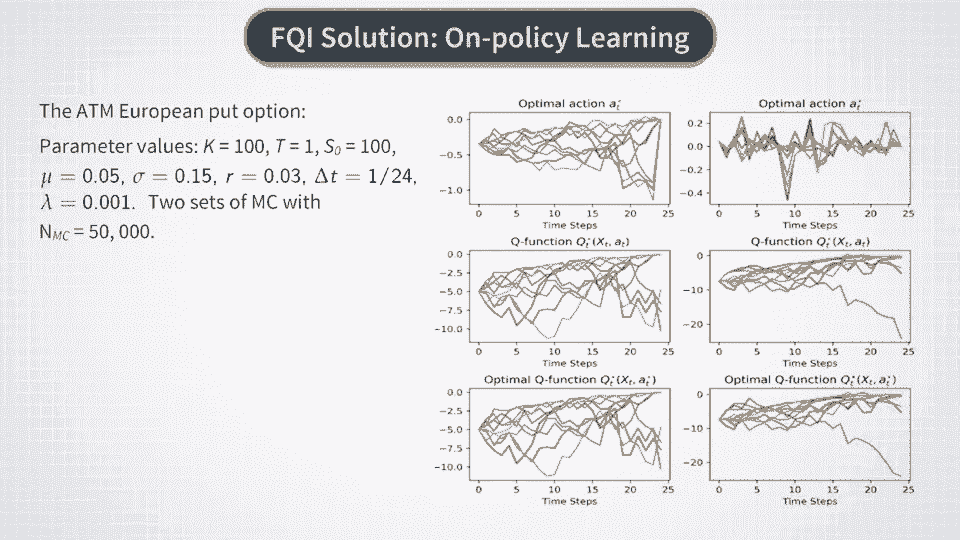

为了生成离策略数据，我们将通过DP解决方案计算的最优对冲乘以一个位于1-eta到1+eta区间内的随机均匀数，其中eta是控制数据噪声水平的参数，介于0和1之间。

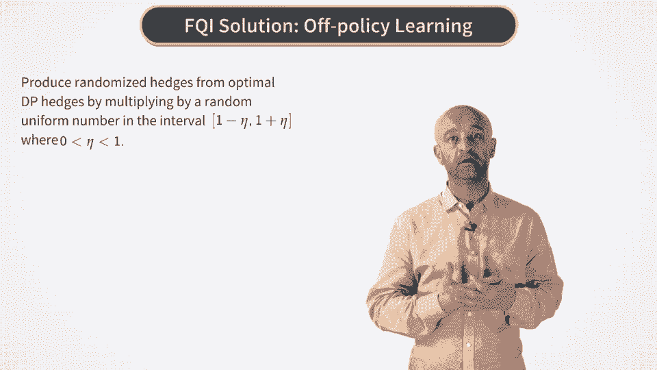

在我们的实验中，我们考虑了eta等于0.15、0.25、0.35和0.15的情况来测试。

我们算法的噪声容忍度。在这张图中，您可以看到在不同子最优动作情境下，使用50%的η值进行离策略学习所获得的结果。我们在这些图表中观察到一些非单调性，但这是由于情境数较少所致。但请注意，记录数据中子最优动作的影响是相对。

至少对于动作噪声的适度水平而言，这种影响是轻微的。这是可以预期的，因为拟合Q迭代是一个离策略算法。这意味着当数据集足够大时，我们的MDP模型甚至能够从纯随机动作的数据中学习。而且特别地，如果世界是块正常的，它甚至能够学习黑盒模型本身。

因为Q学习是一种无模型方法。所以这就结束了我们课程的第三周，在你们的作业中，你们将实现拟合Q迭代，并评估该算法在离策略和在策略设置下的表现。

祝你在这项工作中好运，下周见。[ Silence ]。

