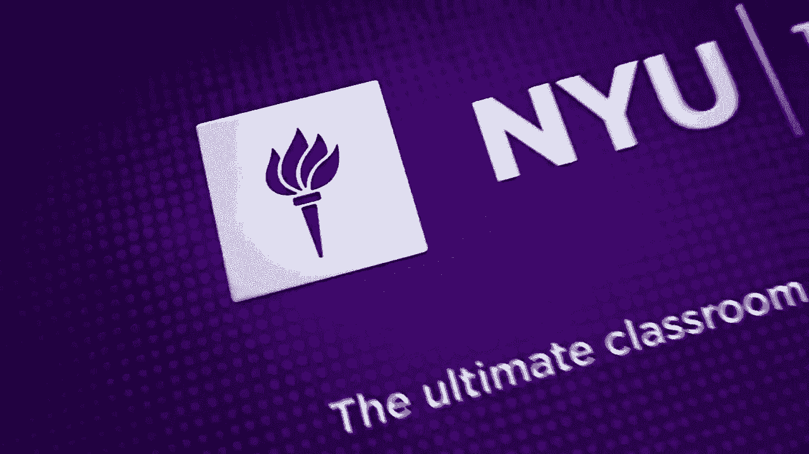
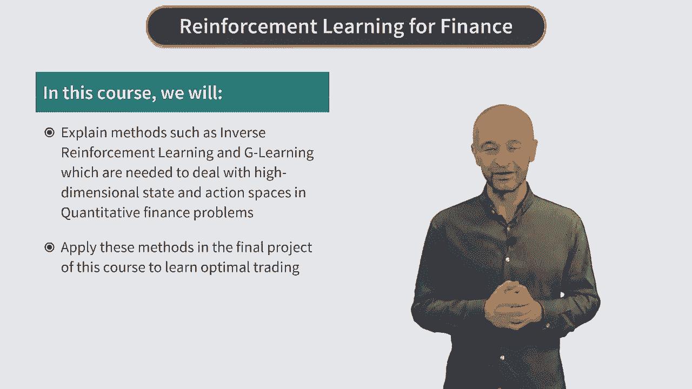

# P3：Introduction - Welcome to the Course - 兰心飞侠 - BV14P4y1u7TB

欢迎来到Cousera机器学习在金融中的应用这套课程中。

第三门课，这门课中我们讲强化学习，机器学习中最令人兴奋的领域之一，更令人兴奋的是，这门课会，从头开始专注于讲述强化学习在金融领域的应用，也就是说，我们不会花任何时间来。解释金融领域之外的任何强化学习的例子，很多其他强化学习课程，是为在机器人领域工作的人设计的，因此讲解强化学习使用的例子，通常是井字棋游戏、，迷宫问题、或是？问题，因为时间有限，我们会跳过这些例子。并且直接从金融问题中来学习强化学习，而不是其他的例子，这会让我们更快地达到学习目标，如果你对其他问题很感兴趣，比如如何用强化学习解决迷宫问题，在学习完强化学习如何应用于金融模型之后。你也能明白这是怎么做的，这门课会衔接上门课程的末尾，但这次会更加深入且节奏更快，因为在这门课中，我们会学习强化学习算法的具体细节，课程中会用到更多的数学，请同学们多多包涵，如果有些数学上的细节看不懂。

请回忆，我们在前面课程中和论文上介绍的数学部分，如果你看视频的时候觉得一些点难以理解，可以任何时候暂停，停下来思考，或是推导一些黑板上的式子，我也会提供文献链接。他们可能对理解课程、完成作业和编程作业有所帮助，接下来介绍这门课的主要内容，第一周我们会，谈到量化金融中最经典的问题之一，也就是期权定价问题，（股票期权），这个话题有大量的相关研究。开山鼻祖是Black-Scholes和Norton的著名论文，如果你对期权不熟悉，我会提供背景材料，我们从，期权而不是股票开始讲解强化学习是因为，从强化学习的角度来看。第一周我们解决的期权问题（比起股票）来说更简单，第一周我们会将BS模型，转化为离散时间的问题，在接下来的课程中我们会看到，这样的模型可以，被转化为一个具有特定奖励函数的马尔科夫决策过程（MDP）。

我们会讲解如何用这个模型进行期权定价和风险管理，这与原始的BS模型不同，因为我们接下来会讲到，原本的BS模型没有奖励函数来进行最大化，第二周，我们会用动态规划方法来解决MDP问题。我们会建立数值求解方法，你会在作业中对比BS模型的解法和这个数值求解方法，接下来第三周，我们会学到强化学习的重要算法，首先是Q learning，这是强化学习最重要的算法之一。接下来介绍Q learning的延伸，叫做Fitted Q Iteration，第三周的作业中，你会用到这些算法，并且理解他们如何用于期权定价，从强化学习的角度，第四周，我们会研究强化学习在。股票投资组合管理中的应用，这里我们不仅仅谈到一个问题，而是许多经典的量化金融问题，例如Markowitz最优投资组合或是最优交易方法问题，我们会看到，这些问题比简单的期权定价更加复杂。

并且需要一些新方法，这些新方法，对于处理高维度问题非常必要，这些方法包括逆向强化学习，还有其他方法例如，G学习，还有其他有趣且有效的方法，我们在最后一周学习这些方法，你在最终的课程项目。最优股票交易中会应用这些方法。

