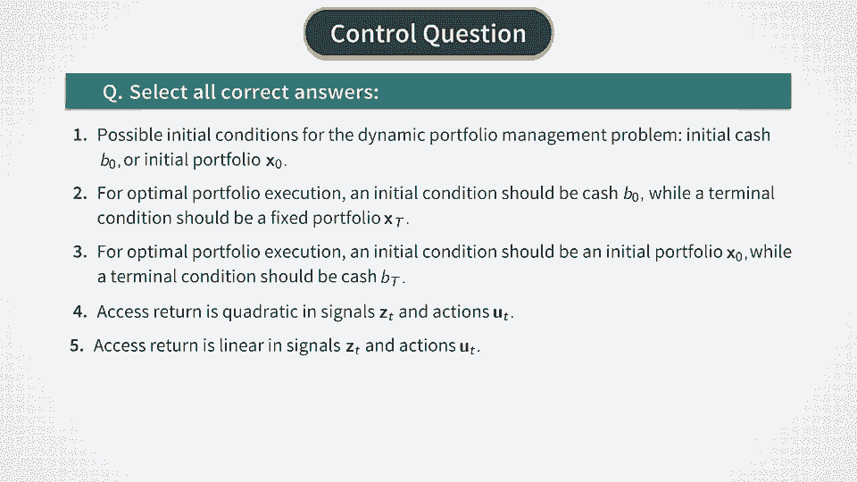

# P32：RL股票交易 - 投资组合模型 - 兰心飞侠 - BV14P4y1u7TB

现在我们将开发一个简单的股票投资组合模型，我们将在强化学习方法中使用它。

我们假设一个由最终股票组成的宇宙，或者可能是其他资产，如ETF。并将时间T时刻的价格向量表示为P sub T。因此，向量P T的大小为N，且所有元素均为正值。投资者可以投资股票，并且还可以将财富存放在无风险的银行账户中，即现金账户，该账户赚取无风险利率RF。

我们将这个现金金额表示为B sub T。现在，一个向量X sub T将描述所有资产中的美元头寸，因此它的大小也为N。不同股票的数量可以通过将向量X T的各个分量除以市场价格P T，并四舍五入到最接近的整数来得到。向量X T的负分量表示股票的空头头寸，正分量表示多头头寸。现在，向量U sub T将描述在时间步T开始时的操作。

操作后，向量X T的位置值是即时确定的，因此操作后的新值X T加上上标+，仅仅是X T和U T的总和。这个模型中的操作有成本和市场输入，我们将在稍后指定。现在，投资组合的总值就是向量X T所有分量的总和加上现金金额。

我们将所有分量的和表示为1向量和向量X T的点积，如方程2所示。如果我们在这里将X T和B T的值替换为它们的后续操作值X T plus和B T plus，我们可以计算出操作后投资组合的价值，如方程3所示。现在我们假设所有股票头寸的变化只能通过现金头寸来融资。

这被称为自我融资的投资组合。由于交易存在成本，我们将增加交易成本，稍后会补充。然而，目前我们使用如方程4所示的自我融资条件。这个条件的意义在于，投资组合的价值不能仅仅通过在现金和股票之间重新分配财富而瞬间发生变化。

它仅作为投资组合中股票的随机回报的结果发生变化。投资组合的变化在这个模型中描述如下：在时间间隔C开始时进行一次重新平衡，接着进入投资期，直到间隔C结束。

我们以通常的方式定义这一期间资产的回报，如方程6所示。下一个周期开始时的向量X T plus 1，与当前周期结束时相同，如方程7所示。请注意，我们在这里使用了元素级的乘法，也称为Hadamard积。

在这个方程中通过一个圈起来的点表示。接下来，我们需要为向量 R T 指定一个资产回报模型。我们将使用这个幻灯片上公式 8 中所示的一个非常简单的参数化。这个方程的意思是，超额回报，即 R T 和 R F 的差值。

等于一个由我们称之为 Z T 的预测器向量和时间 E T 时刻交易向量 U T 的线性组合，带有某些权重。权重 W T 代表了预测器 Z T 的权重矩阵，而矩阵 M T 则是交易的市场输入矩阵。最后，epsilon T 是一个残差向量，均值为 0，协方差为 sigma T。

现在我们可以计算时间 T 加 1 时的新的投资组合价值。这个计算在公式 10 中给出。我们只需将向量 X T 乘以一个由 1 组成的向量，并使用 X T 加 1 的表达式，这就给出了公式 10 中的最终表达式。现在我们可以计算投资组合在超出无风险增长部分的变化。

这在公式 11 中进行了计算。这里我们从 VT 加 1 中减去 1 加上 R F 乘以 VT 的项。并利用自融资条件，这就得出了公式 11 中的最终表达式。这个关系可以应用于任何时间步，除了最后一个时间步。对于最后一个时间步，我们必须施加适当的终端条件，以适应我们想要解决的情境。

例如，如果我们处理指数跟踪或类似的基准匹配问题，那么终端值 X T（带有大写字母 T）应该与基准投资组合的给定值 X sub B 匹配。例如 S&P 500 投资组合。这可以用来确定最后的操作 U T，如公式 12 所示。这样，最后的操作是确定性的，因此它从操作优化问题中消失。

需要求解剩余的操作 U0 到 U sub T 减 1。对于其他情况，我们可以制定不同的终端条件。例如，对于一个最优投资组合，我们可以对 X sub 大写 T 施加零终端条件，意味着所有股票头寸将在 T 时刻被换成现金。

这些条件并不意味着我们必须在 T 时刻真正关闭所有头寸，而仅仅是这个条件作为一种方式来表示股票的价值，以现金值的形式表达。对于最优投资组合清算问题，我们还会对 X sub 大写 T 施加零终端条件。

最后我们可以讨论问题的初始条件。这将根据我们所考虑的特定设置而有所不同，通常涉及一般的投资组合优化问题。例如，如果我们处理的是最优股票执行问题，那么初始条件将是我们需要卖出的若干股票的初始美元价值。如果我们处理的是投资组合清算问题，那么初始条件将由初始投资组合给出。

对于最优投资组合管理问题，初始条件可以是全现金的初始头寸B0，也可以是从某个初始投资组合X0开始。最后，对于指数或基准跟踪问题，初始条件也可以设定为全现金或给定的初始投资组合X0。

[BLANK_AUDIO]。

