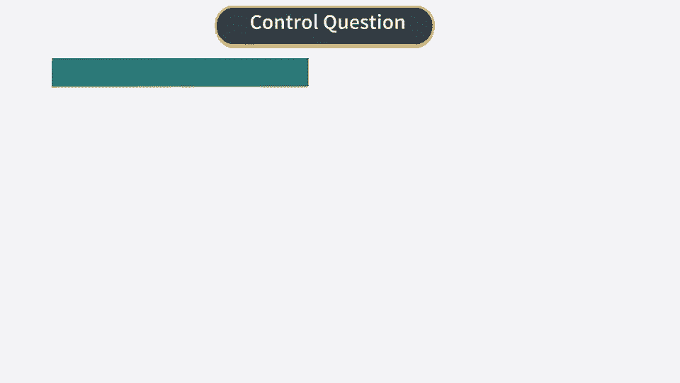

# P34：RL for Stock Trading -Forward and Inverse Optimisation - 兰心飞侠 - BV14P4y1u7TB

 Now when we defined one step risk adjusted and cost adjusted rewards for our problem。 we can move on and define an objective function for our portfolio optimization problem。 This objective function is shown in equation 23。 As usual it's given by an expectation of a sum of discounted one step rewards from all future periods。 Here gamma is a discount factor which is a number typically close to one。

 We can take it to be a risk-free discount factor for a time step and our portfolio problem。 The most important thing in this formula is that the single step reward shown here is quadratic in states xt and action actions at。 The optimization problem amounts to maximizing this expression in actions at from t = 0 to t = capital T - 1 under certain constraints。 One constraint is that both components a + and a - should be non-negative by the meaning of our construction。

 In addition we might have other constraints for a portfolio。 We can use a general notation at for a set of constraints on the action that are called trading constraints。 We can also have constraints from a set zt that would be constrained on new holdings in different assets。 Please note that the sum does not include the last step t as the action at the last step is deterministic as we saw in the last video。

 Now we can see that the word function that we have in our problem is a convex function of xt and at。 Therefore if in addition the set of constraints at and zt are convex the whole problem is convex and can be solved by a means of convex programming。 This setting was suggested in a very nice tutorial style paper called Multi-period Trading via context optimization by Stephen Boyd and Coathers。 This paper shows that many practically interesting settings of portfolio optimization can be considered within such convex optimization framework。

 I will refer you to this paper for more details and show you just a few examples of such convex constraints。 For example pension funds cannot short sell assets so for them a long only constraint shown here would be appropriate。 Another example would apply to institutions that can short sell。 For such case often there are limits on new positions xt plus u team which give limit constraints。

 A constraint on the total amount of short positions can be expressed as a leverage constraint。 This constraint is shown in a third line here。 It involves a sum of absolute values of all positions。 The amount it exceeds a sum of all positions is called the leverage。 Finally I would like to mention a minimum cash balance constraint shown in the last line here。

 All these would be examples of convex constraints that keep the problem tractable even for high dimensional portfolios。 Alright so let's summarize this framework that we will call forward portfolio optimization。 In this approach our task is to find an optimal portfolio trading strategy。 We are given an objective function constraints and initial and terminal conditions for the portfolio。

 This is a typical problem of dynamic optimization that can be solved using dynamic programming if a model is known。 But if a model in this case involves a forecast for predictors zt and this is a hard part because any errors in a forecast directly translate into errors in the optimal portfolio allocations。

 To illustrate how this all works let's consider a special case of this formalism when the number of steps equals just one。 So that we talk about one step portfolio optimization。 In this special case things get simpler as expected。 Instead of a dynamic trading strategy we only need a strategy for one step only。

 In this case people in finance usually speak of asset allocation so the other name for asset allocation would be a single step policy。 Again we need to optimize an objective function given constraints。 If we apply this one step setting for a one step portfolio optimization problem we will obtain the celebrated market its portfolio model of 1959。 The market's model is probably one of the most important and widely used models in all of finance。

 Practitioners using the market its model know very well that one of the main challenges in the plan in practice is exactly the same problem that we already mentioned above。 The model depends critically on accuracy of our forecasts for future values of predictors zt。

 Now there exists a very elegant way to resolve this issue by flipping the optimization problem on its head。 And this is called inverse optimization。 Inverse optimization works as follows。 Imagine we already know the optimal portfolio allocation。 This means we already know a solution to the optimization problem。

 Now we can ask what are the parameters of the objective function that produced such optimal allocations。 For the specific case of one step portfolio market its optimization it also means that we take a portfolio and invert formulas for the market its optimal portfolio so that we get values of forecasts for predictors zt that are implied by observed optimal solution。

 And this was essentially an approach of the famous black literman model of 1992。 Black and literman applied the market its portfolio optimization problem to the market portfolio。 For example the S&P 500 portfolio and then inverted it。 That gave them insights into how the market itself forecasts future values of predictors zt。

 The original black literman model was not formulated as inverse optimization but such a formulation was suggested in 2012 by Bertzmas and co-workers。 Both these papers and other researchers showed how the black literman framework can be used to assess a value of private signals zt that are known only to an investor but not to the rest of the market。

 Now we can generalize the same inverse optimization approach to a dynamic and multi-period setting。 In this case we are given not just one time optimal allocation but rather a sequence of such reallocations。 That is we are given a history of actions。 The task is to find one step reward or in the parametric setting parameters of one step reward。 The other task would be to find an investment policy that corresponds to observed actions。

 Now we can discuss two possible settings for such dynamic inverse optimization of the portfolio。 In the first case we deal with the proprietary portfolio and actions of a particular trader or broker。 In the second case we look at the market portfolio。 For the second case Sashi approach generalizes the black literman analysis to a multi-period setting and can be used for the same purposes as the original black literman model。

 For the first case the same approach can be used to build a model of a trader。 Now for both cases it can be used in the same way to the black literman model to assess a value of private signals zt that are known only to an investor but not to other participants in the market。

 But the difference is that now we do analysis of impact of predictors zt over an extended time period instead of one step black literman formulation。 And this should be a good thing because multi-step portfolio performance is an ultimate objective of portfolio managers。

 If they can observe the working of their signals over an extended period of time this smoothed out noise in such estimations and may help to find the more stable estimation of a value of signals。 Now at this point you could notice that the above problem of dynamic inverse optimization sounds very similar to the objective of reinforcement learning or may be inverse reinforcement learning。

 And this is indeed the case which means that dynamic inverse portfolio optimization can be done using tools from reinforcement learning and inverse reinforcement learning。 We will discuss such approaches in our next video。

 [ Silence ]。

