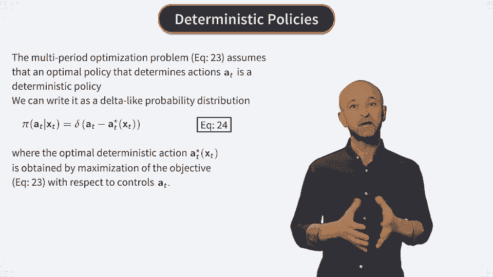
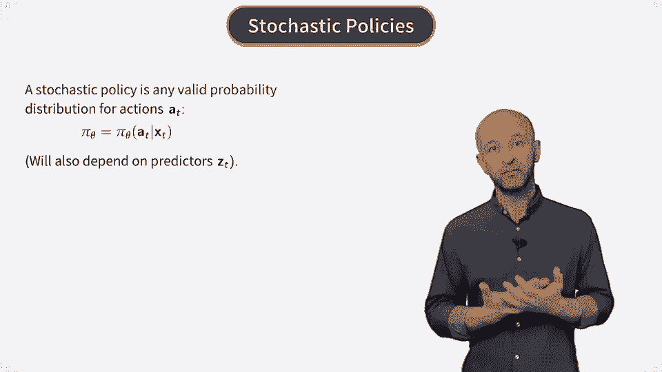
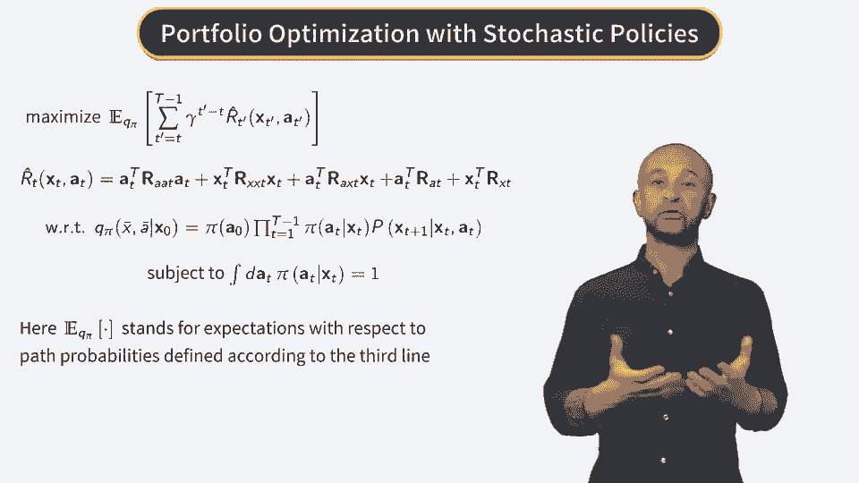
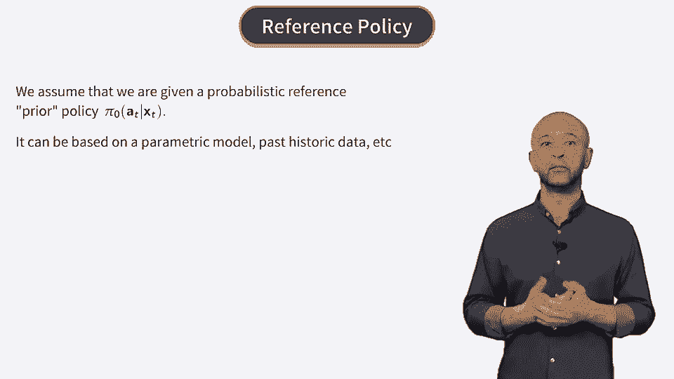
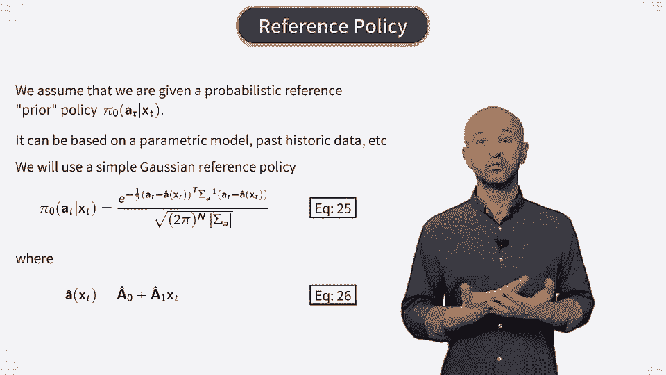

# P35：股票交易中的强化学习 - 投资组合的强化学习 - 兰心飞侠 - BV14P4y1u7TB

好的，我们在之前的视频中已经定义了动态投资组合优化的问题。

我们将其表述为一个马尔可夫决策过程，其中包含一个二次一阶奖励函数。

正如我们在这个专业课程中多次提到的，只要我们有一个MGP问题，我们就可以使用动态规划中的模型方法来解决，或者我们也可以使用强化学习，通过数据样本来解决模型。在这两种方法中，我们都在寻找一个最优策略，我们将其定义为一个函数，表示从状态空间到行动空间的映射。

状态空间到行动空间的映射。所以这样一个函数会给你每个可能状态对应的一个固定数字，这个值就是该策略所规定的行动。现在在强化学习中，这种策略被称为确定性策略。我们可以将确定性策略视为由狄拉克单位冲击函数给出的概率分布，如公式24所示。在这里，A t star 是一个通过解决投资组合优化问题得到的确定性最优行动。

确定性最优行动是通过解决投资组合优化问题得到的。显然，称我们有一个确定性策略等同于说我们有一个随机策略，其分布是单位冲击函数。但我们也可以考虑更多的情况。

更有趣的概率分布，而不是单位冲击函数，用于描述随机策略。

唯一的问题是为什么我们要这样做。这个问题的答案是，实际上，确定性策略几乎不存在，因此几乎与金融无关。让我解释一下。

你可以这样理解这个说法。首先，假设你有一个确定性策略π，它由一些参数θ来参数化。现在，因为这些参数是从有限的数据样本中得出的，它们本身就是随机的。因此，任何确定性策略的结果实际上都是随机的。一个很好的例子是我们上面提到的马尔可夫兹投资组合模型。

马尔可夫兹最优投资组合配置依赖于预期的随机变量项。因为这些项是从数据中估计出来的，所以这些估计本身就是随机的。因此，马尔可夫兹投资组合配置实际上是随机的，即使模型本身并没有明确指出这一点。所以因为世界是随机的，考虑这一点将是一个非常好的想法。

还可以对模型推荐的资产配置有一定的不确定性或置信度评估。如果一个模型仅给出一个数字，那么你就无法知道模型对这个数字有多大信心。使用随机策略的另一个原因是，大多数情况下，任何真实数据都不是严格最优的，有时甚至可能是次优的。

这种做法相当次优。示范数据次优的原因可能有很多，例如模型错误规格、模型时间延迟、人为错误等等。如果我们坚持使用确定性策略，那么在这种模型下，这样的数据的概率将为零。但因为这样的近乎最优或次优数据无处不在，我们最好。

我们应该使用工具来处理这种不完美的数据，而不是坚持要求世界匹配我们的不完美模型。那么，强化学习中的随机策略是什么？随机。

策略是任何有效的动作概率分布 pi，它依赖于当前状态 x 团队，并且通常可以通过某个参数向量 theta 来参数化，如公式所示。此外，策略 pi 还可以依赖于外部预测器，团队，在此我们省略了对于这种情况的说明。那么，通过使用这些新的见解，我们可以得到什么呢？

随机策略而不是确定性策略？随机策略带来的新见解正是因为它们是随机的。随机策略 pi 意味着我们有一个概率分布。

这些可以用于传递数据以建立数据的概率模型。但同样，因为这是一个概率模型，我们也可以使用该模型进行模拟来生成未来数据。换句话说，概率模型是生成模型。

现在，让我们看看如果我们使用随机模型来进行行动，如何改变我们的投资组合优化问题。

策略而不是确定性策略。一个新的优化问题公式已显示。

在这些方程式中。让我们一一过一遍，看看与某些变化相比，有什么不同。

使用之前的公式。首先，我们再次有一个关于某些折扣未来奖励的期望，和之前一样。但这次，期望符号不同。此次的期望值。

这是关于整个路径概率 Q pi 的计算，公式中的第三行给出了这个值。在这里，我们对于每个时间步骤都有一个项的乘积。对于第一个时间步骤，我们有零的动作概率 pi。然后，对于每一个后续步骤，联合概率被分解为动作概率与到下一个状态的过渡概率的乘积。

步骤，下一状态 x t+1，条件是前一个状态和动作。因为 pi of a t 应该是一个有效的概率分布，我们应该为 pi of a t 添加归一化约束条件。因此，通过这种概率论的公式化，我们做了以下操作。

听起来相当激进。我们将函数空间中的优化替换为概率分布空间中的优化。当然，主要问题是如何在概率空间中进行这样的优化。我们稍后将讨论这个问题。但在此之前，我们需要介绍另一个重要概念——参考策略的概念。

那么什么是参考策略？我们可以将参考策略视为在看到任何数据之前会考虑使用的先验策略。这是贝叶斯统计和贝叶斯方法中的一种常见方法。

学习的过程是从数据的先验分布开始，然后使用数据对其进行更新。

在这里，我们将做同样的事情，稍后我们将构建一种方法，修改先验或参考策略，使得更新后的后验策略与数据一致。现在，为了保持结构性，我们将使用非常简单的高斯参考策略，我们称之为 pi zero。该策略的均值是 a hat，这是状态 x t 的线性函数。你可以通过两个步骤找到它。

系数 a zero 和 a one 与协方差矩阵 sigma a 一起。在原则上，系数 a zero 和 a one 可以依赖于信号的变化。但这并不是必须的，因为这种依赖关系将作为贝叶斯更新的结果出现。正如我们稍后将看到的那样。因此。

我们可以保持简单，只为先验设置常数系数零和一。

对于协方差矩阵 sigma a，我们也可以使用一个简单的矩阵。例如，使用相同的矩阵。

方差和所有股票相同的相关性。在这种情况下，整个矩阵将只由两个数字来参数化。好了，现在我们拥有了所有需要的工具。在下一个视频中，我们将看到如何使用随机策略，以及参考或先验策略在此过程中是如何出现的。

好的，开始吧。你，[BLANK_AUDIO]。

