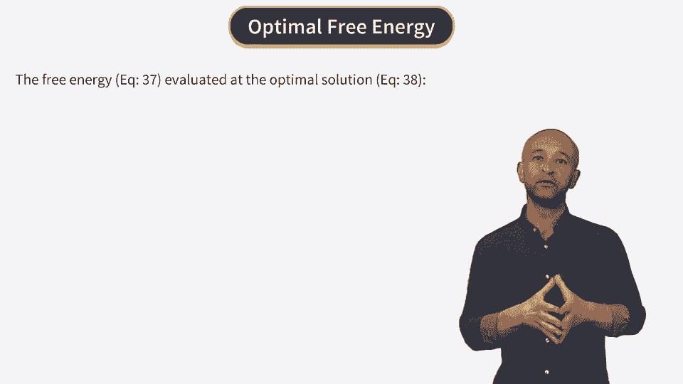
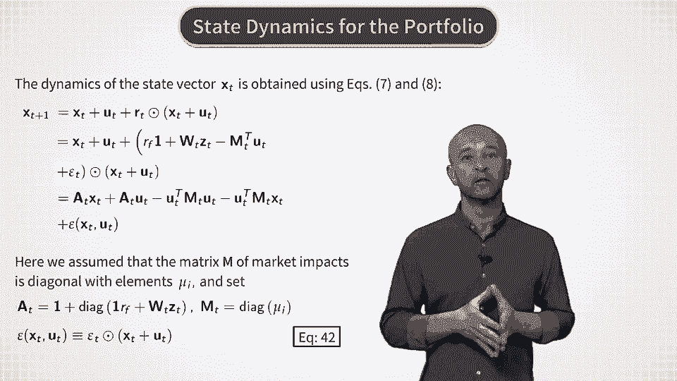
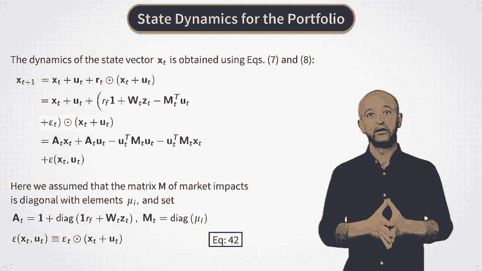
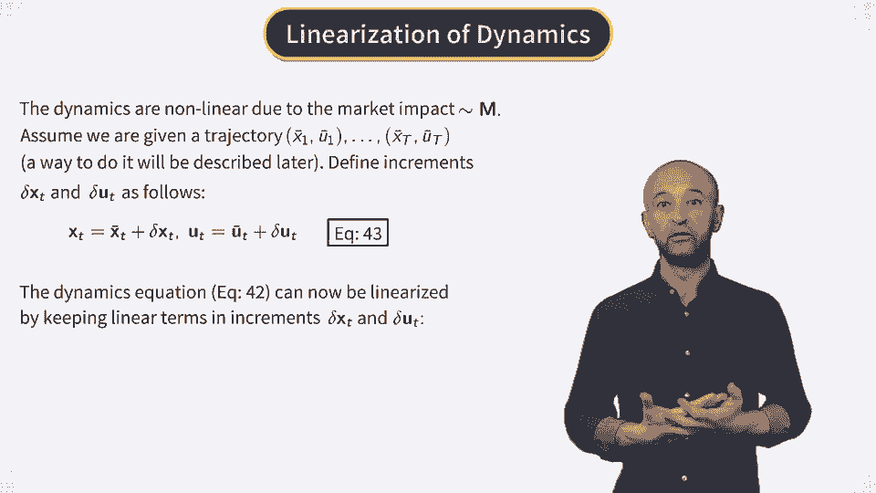
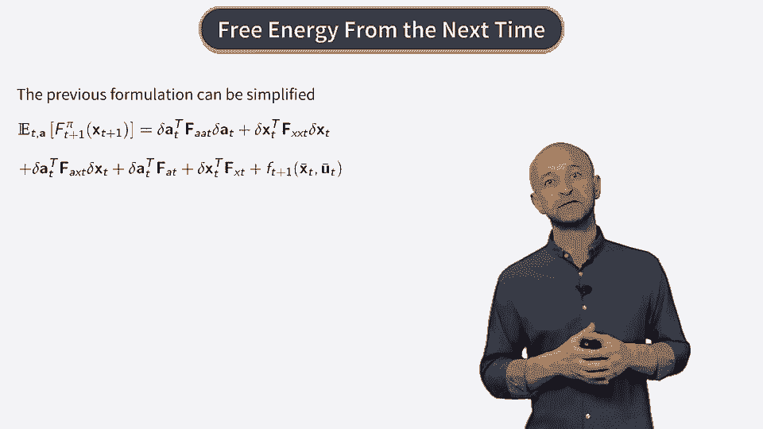
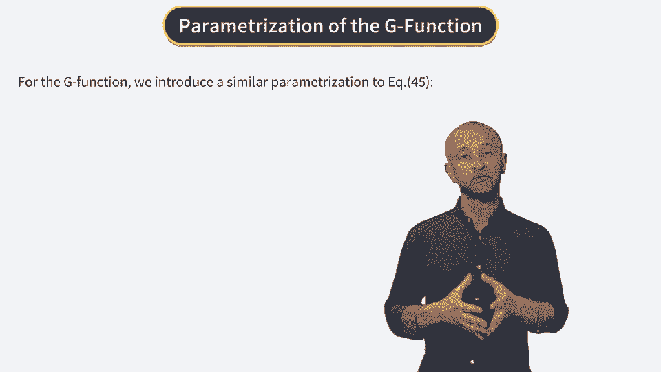

# P37：股票交易的强化学习 - 强化学习方程 - 兰心飞侠 - BV14P4y1u7TB

现在我们可以将迄今为止所有内容组合在一起，推导出 G 和 F 函数的自洽方程组。

在上一期视频中，我们已经得到了 G 函数和 F 函数之间的明确关系。

我在这里的第一行再次给你展示这个方程。现在这是一个关于策略 pi 的泛函。我们可以针对策略 pi 进行最大化。这将产生方程 38 中显示的表达式。该表达式由先前的策略 pi zero 乘以 beta 乘以 G 函数的指数，并除以一个归一化因子 Zt。

这个归一化因子就是将分子对所有可能值 18 求和的结果。

因此，整个表达式如果我们对所有值的 18 求和，将产生 1。这意味着 pi a 是一个适当归一化的分布。如果你熟悉变分法，你可以轻松地从第一个方程推导出第二个方程。但如果你不熟悉，你可以简单地将变分对 pi 的求导看作是对字母 pi 的常规求导。

通过做这样的形式化求导，你也可以从第一个方程推导出第二个方程。

现在，如果我们将这个最优策略 pi 插回到自由能 F 的之前表达式中，我们将得到方程 39 中显示的最优自由能。

所以这个方程意味着 Zt 的对数等于 beta 乘以 F 函数。因此，我们可以将 Zt 在最优策略表达式中替换为该表达式的指数，并将最优策略 pi 以方程 40 中显示的形式表示。现在，最优策略依赖于 G 函数和 F 函数。此外，这两个函数彼此之间是相互关联的，正如我们刚才所看到的那样。

现在我们可以总结并将所有内容放在一起。我们有三个方程，分别是三个函数 G、F 和 pi，它们应该被自洽地求解。这应该在反向递归的每个步骤中完成，从 T 等于大写 T 减一开始，一直到 T 等于零。

一般来说，这是一个相当复杂的方程组。在 Tichbian 和同事的原始论文中，这个系统是在离散空间的表格设置中求解的。但在这里，我们处理的是一个高维连续空间和连续行动问题。尽管如此，事实证明，对于我们的简单投资组合模型，这个方程组可以相对容易地求解。

让我简要说明一下这是如何完成的。我将跳过很多细节，但你会在本周参考的论文中轻松找到它们，以及接下来我要展示的所有系数和矩阵的显式形式。

比这组系数的具体形式更重要的是，我现在要描述的计算方案的整体结构。

第一个观察是，如果我们将e-torns的方程代入之前得到的x sub T加一的方程中，我们将得到本幻灯片中第一个方程所示的动态方程。

它有两个线性项a t乘以x t和a t乘以u t，但最重要的是它有两个二次项，与市场输入矩阵m成比例。

因此，我们的模型具有非线性，准确来说是二次动态。因此，在存在市场输入的情况下，它不能精确求解，而应通过近似求解。

这是通过对动态进行线性化来完成的。假设我们给定了一条确定的轨迹，我们将其表示为上标条，如x bar和u bar。给定一条轨迹，我们就有一组x t bar和u t bar的对，适用于所有t值。接下来，我们定义增量delta x t和delta u t，如方程43所示。

现在，我们可以将这些关系代入x t加一的动态方程中，并保留增量delta x和delta u的线性项，假设二次项在围绕给定轨迹展开时较小。

这给出了线性化的状态方程44。由此我们看到，如果我们以增量delta x和delta u表示动态系统，我们可以得到关于增量delta x的线性化方程。

现在，我们将所有内容以增量的形式表示。我们假设f函数是delta x的二次函数，如方程45所示。它由矩阵dt向量h t和标量f t参数化，这些都可能依赖于x bar。现在在规划视野t时，终端状态x t是固定的，因此我们可以用它来固定所有这些系数的终端值。

对于所有其他时间，我们通过从t减一开始，向后递归，依次进行t减二等操作来进行回溯。

因此，我们对任何此类t值所做的第一件事是计算下一期f函数的期望。

这可以很容易地完成，并且会生成此幻灯片底部显示的表达式。重要的事实是，这是一个关于下一周期增量delta x期望值的二次函数，我们在这里将其表示为delta x t加一的估计值。

现在，如果我们使用之前的方程，我们可以用先前的表达式写出这个方程。我们可以将这个方程写成当前时间增量delta x和delta u的二次函数，系数为f在f x t、f x t、f x t、f u t以及一个自由项f sub t加一。

现在，这些系数可以根据之前计算的系数明确计算出来。

在下一步，我们引入一个类似的g函数参数化，将其表示为delta x和delta u的二次函数。

但是这时，这个展开式的系数是未知的，接下来会计算。最后，我们也可以通过其显式形式表达奖励，使用增量形式。这给出了问题47，如此处所示。同样，这个表达式是增量的二次函数。

现在，一切都准备好设置递归方案，以计算g函数和f函数及其系数。

我们所做的是取贝尔曼方程，针对g函数再次在方程48中显示，代入所有关于g函数、奖励和f函数的先前表达式，然后将所得表达式中delta x和delta u的各项系数进行等式比较。

这产生了g函数系数的关系，如此处所示。

现在，如果奖励是可观察的，那么这些方程右侧的所有项在时间t时都是已知的，因为右侧f项中的系数在时间t加一时已知。因此，这些关系为我们提供了时间t时g函数的系数。

现在，当我们计算了时间t时的g函数后，我们可以计算时间t时的f函数。为此，我们使用了我在顶部行中重复的方程39。

我们将得到的g函数表达式代入这里，并计算所有a k的和，实际上这不是一个和，而是一个积分，因为我们使用的是连续动作。

但这里非常重要的一点是，在我们的模型中，这个积分是高斯型的，因此可以轻松计算。当我们计算这个积分并简化后，我们得到f函数的方程49，它现在与之前的形式相同，但这次所有的系数都已固定，如下面的公式所示。

[BLANK_AUDIO]。

