# P37：RL for Stock Trading -RL Equations - 兰心飞侠 - BV14P4y1u7TB

 Now we can put together everything that we produce so far and derive a self-consistent system of equations for the G and F functions。

 We have obtained in the last video the explicit relation between the G function and the F function。

 I show you this equation again here in the first line。 Now this is a functional of policy pi。

 We can maximize it with respect to policy pi。 And this produces an expression shown in equation 38。

 It is given by the prior policy pi zero times the exponent of beta times the G function and divided by an harmonization factor Zt。

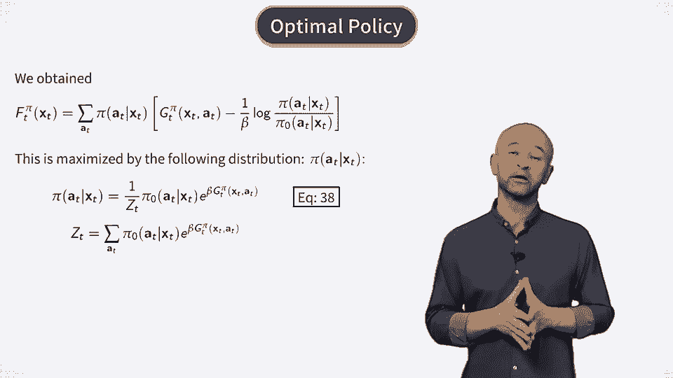

 This harmonization factor is just the sum of the numerator over all possible values of 18。

 Therefore the whole expression will produce one if we sum it over all values of 18。

 which means that pi a is appropriately normalized distribution。

 If you're familiar with variational calculus you could easily derive the second equation from the first one。

 But if you not you can simply think of variational d with respect to pi as a usual d with respect to a letter pi。

 By doing such formal differentiation you would also be able to derive the second equation from the first one。

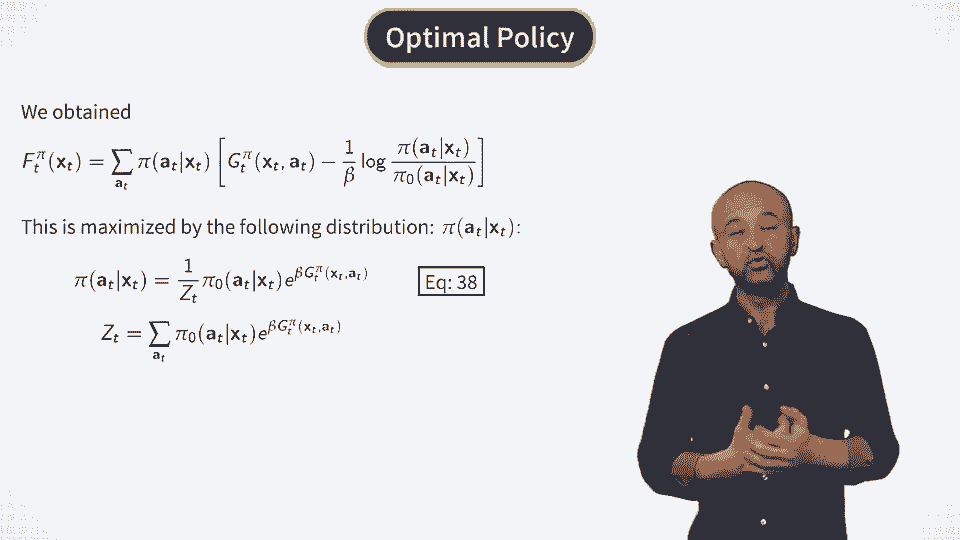

 Now if we plug this optimal policy pi back into the previous expression for the free energy F we will get the optimal free energy shown in equation 39。

 So this equation means that the log of Zt is equal to beta times the F function。

 And therefore we can replace Zt in the optimal policy expression by an exponent of this expression and put the optimal policy pi in the form shown in equation 40。

 Now the optimal policy depends on both the G function and the F function。

 And in addition these two functions are related between themselves as we just saw before。

 Now we can summarize and put everything together。 We have three equations for three functions G。

 F and pi that should be solved self consistently。 This should be done a teach step of the backward recursion starting from T equal to capital T minus one and going all the way down to T equal zero。

 In general this is a rather involved system of equations。

 In the original paper by Tichbian co-workers this system was solved in a discrete space tabulated setting。

 But here we deal with a high dimensional continuous space and continuous action problem。

 Still it turns out that for our simple portfolio model this system of equations can be solved relatively easy。

 Let me give you a brief sketch of how this is done。

 I will skip many details but you will find them easily in a paper referenced for this week along with explicit forms of all coefficients and matrices that I'm going to show you next。

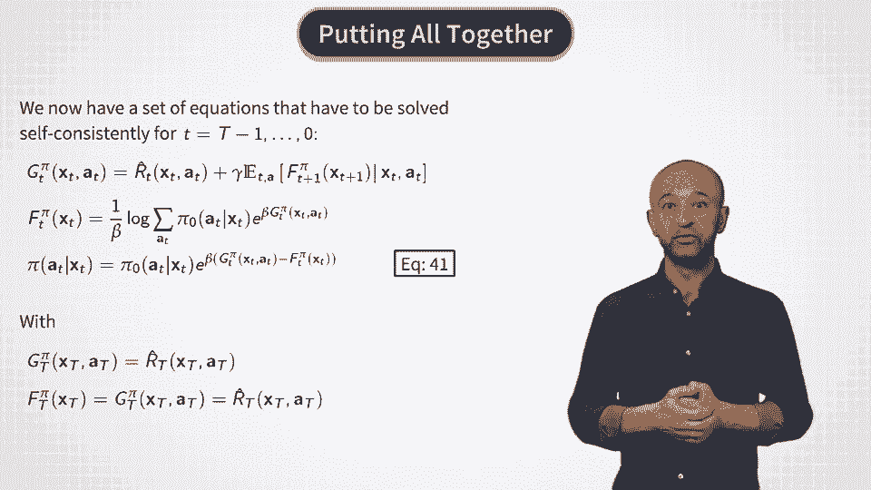

 What is more important than a specific form of this coefficients is the general structure of a computational scheme that I'm going now to sketch。

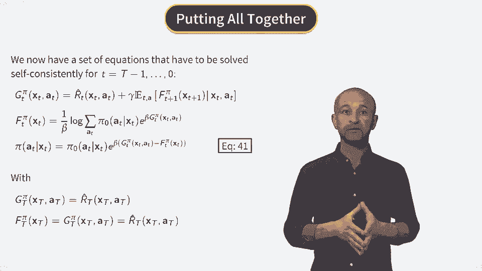

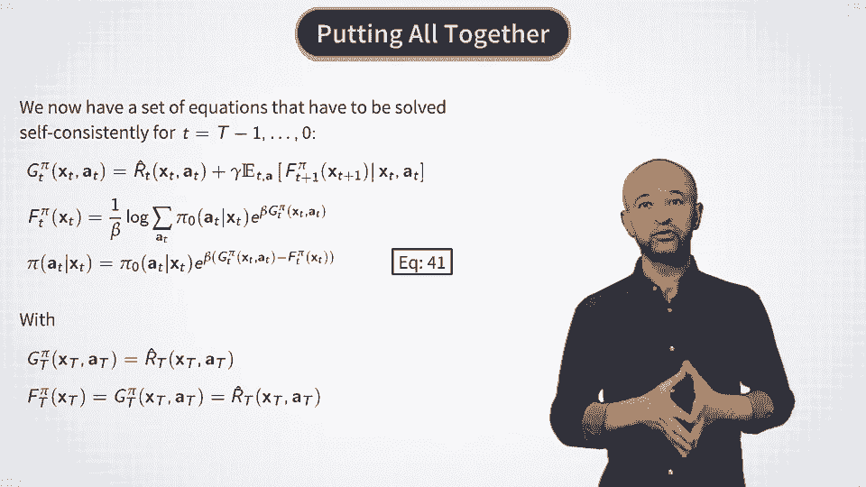

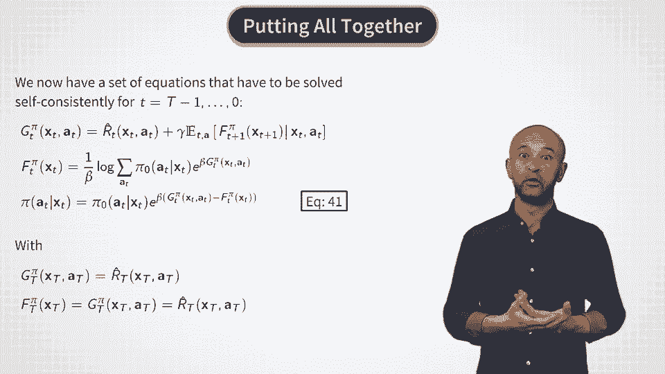

 The first observation is that if we substitute the equation for e-torns into the equation for x sub T plus one that we obtained before we will get the dynamics equations shown in the first equation in this slide。

 It has two linear terms a t times x t and a t times u t but most importantly it has two quadratic terms proportional to the matrix of market inputs m。

 Therefore our model has nonlinear and more exactly quadratic dynamics。

 Therefore it cannot be solved exactly in the presence of market inputs but rather should be solved approximately。

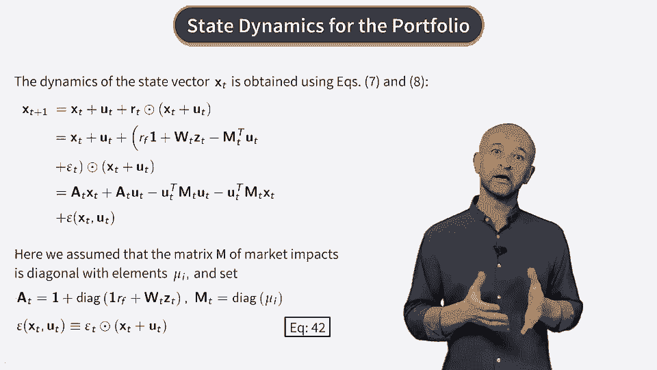

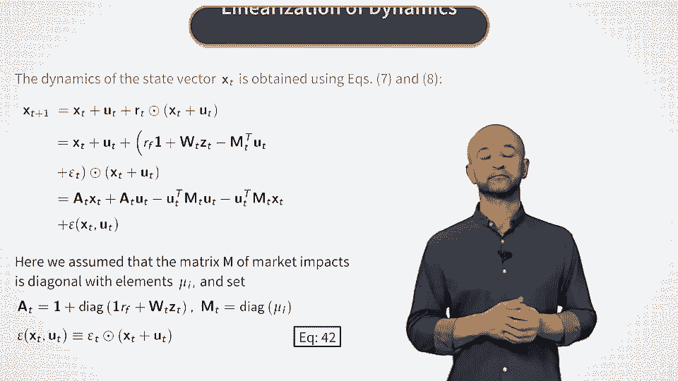

 This is done using linearization of the dynamics。 Let's assume that we are given some deterministic trajectory that we will denote by upper bars like x bar and u bar。

 So given a trajectory we have a set of pairs x t bar u t bar for all values of t。

 Next we define increments delta x t and delta u t as shown in equation 43。

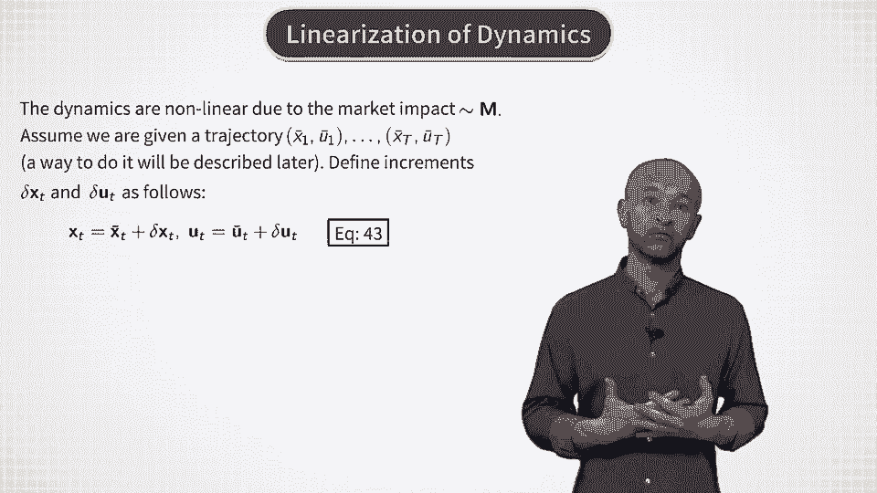

 Now we can substitute these relations back into the dynamical equation for x t plus one and keep on linear terms in delta x and delta u assuming that quadratic terms are small as we expand around a given trajectory。

 This gives us a linearized state equation number 44。

 So what we see is that if we express the dynamics in terms of the increments delta x and delta u we can get a linearized equation for the increment delta x。

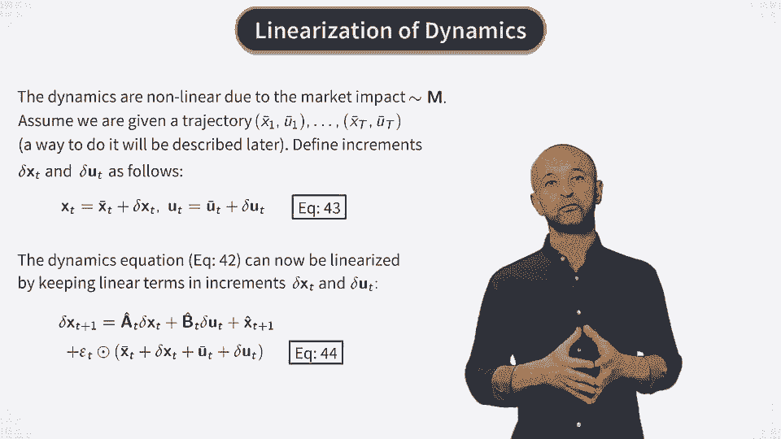

 Now we express everything in terms of increments。 We assume that the f function is a quadratic function of delta x as shown in equation 45。

 It's parameterized by a matrix dt vector h t and a scalar f t that can all depend on x bar。

 Now at the planning horizon t the terminal states x t are fixed therefore we can use it to fix the terminal values of all these coefficients。

 For all other times we use backward recursion by going backwards in time starting from t minus one then t minus two and so on。

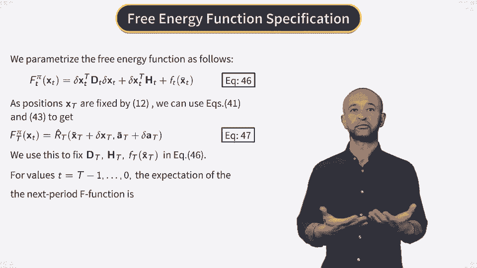

 So the first thing we do for any such value of t is to compute the expectation of the next period f function。

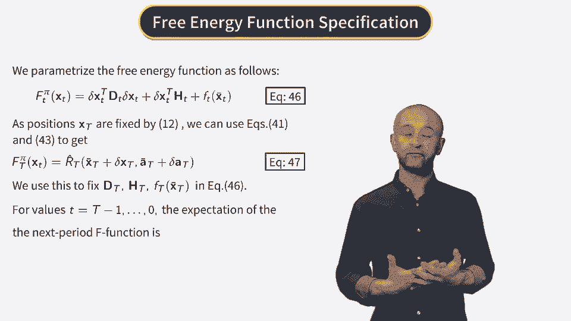

 This can be easily done and it produces the expression shown at the bottom of this slide。

 The important fact is that it's a quadratic function of expected value of the next period increment delta x which we denote it here as delta x t plus one hat。

 Now if we use the previous equation then we can write this equation using previous expressions。

 We can write this equation as a quadratic function of current time increments delta x and delta u with coefficients f at f x t f x t f x t f u t and a free form free term f sub t plus one。

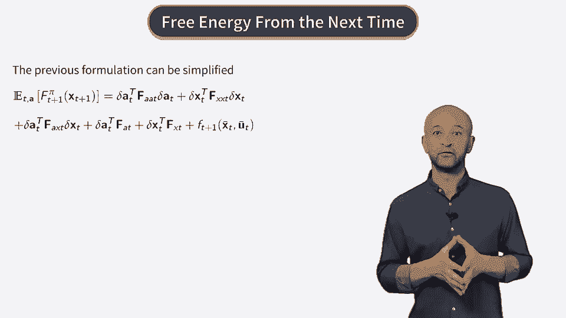

 Each of these coefficients can now be explicitly computed in terms of previously computed coefficients。

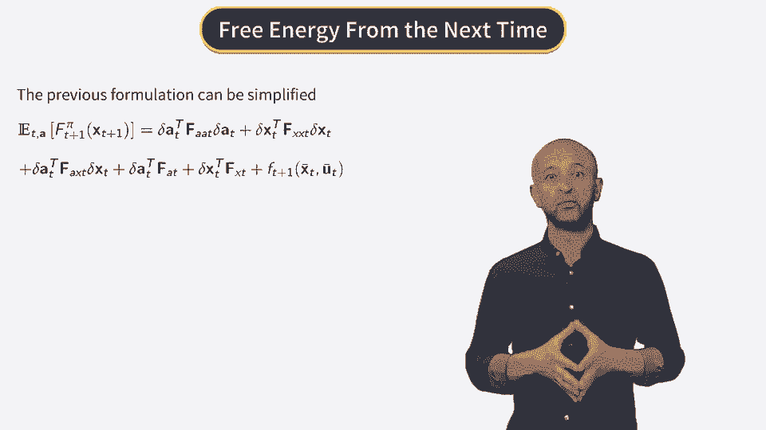

 At the next step we introduce a similar parameterization of the g function as a quadratic function of delta x and delta u。

 But this time coefficients of this expansion are unknown and will be computed next。

 The last thing we can also express the reward in terms of the increments using its explicit form。

 And this gives a question 47 shown here。 Again this expression is a quadratic function of the increments。

 Now everything is ready to set up a recursive scheme to compute both the g function and f function in terms of their coefficients。

 What we do is take the Bellman equation for the g function shown again here in equation 48。

 plug all previous expressions for the g function reward and the f function and then equate the coefficients in front of the like powers of delta x and delta u in the resulting expression。

 And this produces the relations for coefficients of the g function that are shown here。

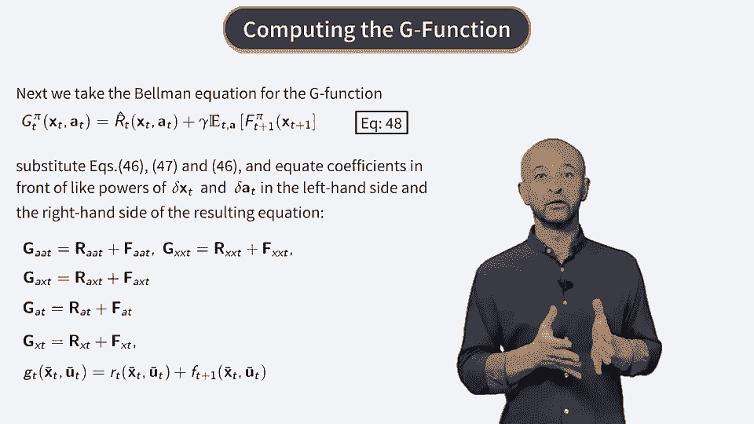

 Now if rewards are observable then all terms in the right hand side of these equations are known at time t because the coefficients in f terms in the right hand side are known from time t plus one。

 Therefore these relations give us coefficients for the g function at time t。

 And now when we computed the g function at time t we can compute the f function at time t。

 And to do this we use equation 39 that I repeated here in the top line。

 We plug the resulting expression for the g function here and compute the sum over all a k which is in fact not a sum but an integral because we work with continuous actions。

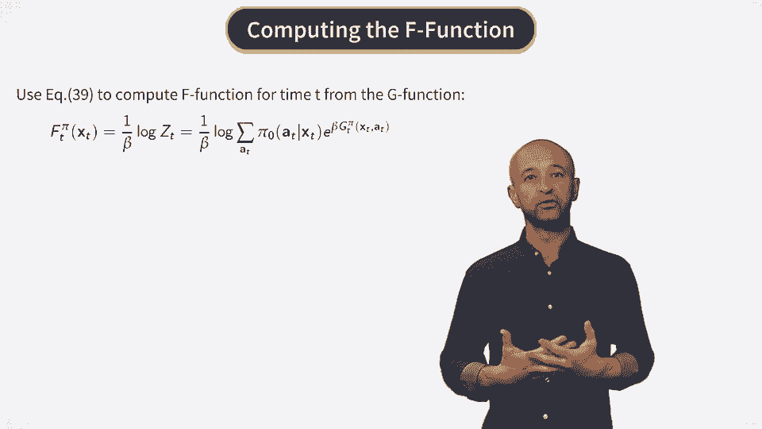

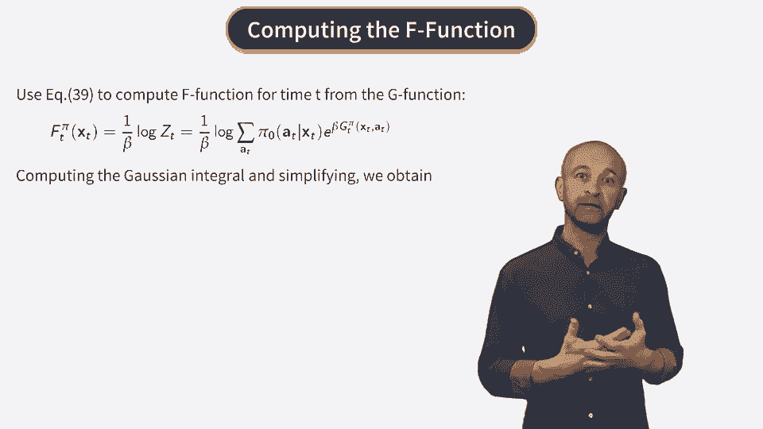

 But what is very important here is that in our model this integral is Gaussian therefore it can be easily computed。

 When we compute this integral and simplify we get equation 49 for the f function which now has the same form as before but this time all coefficients are fixed as shown in the formulas below。

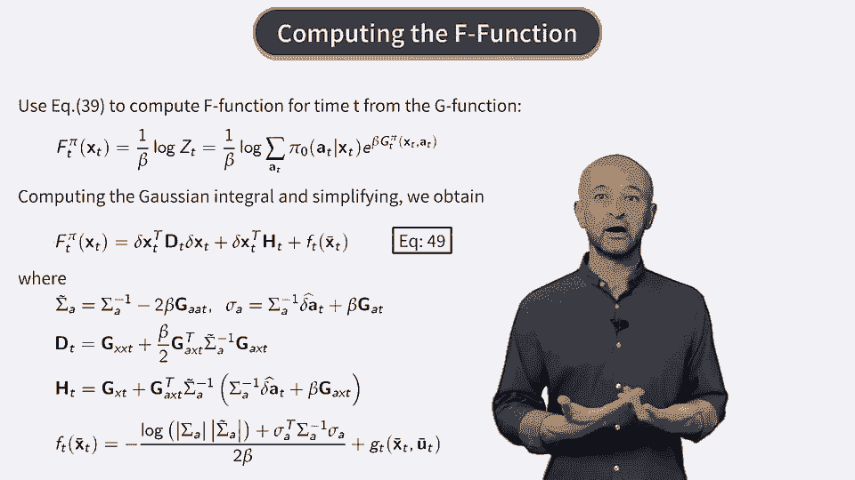

 [BLANK_AUDIO]。

