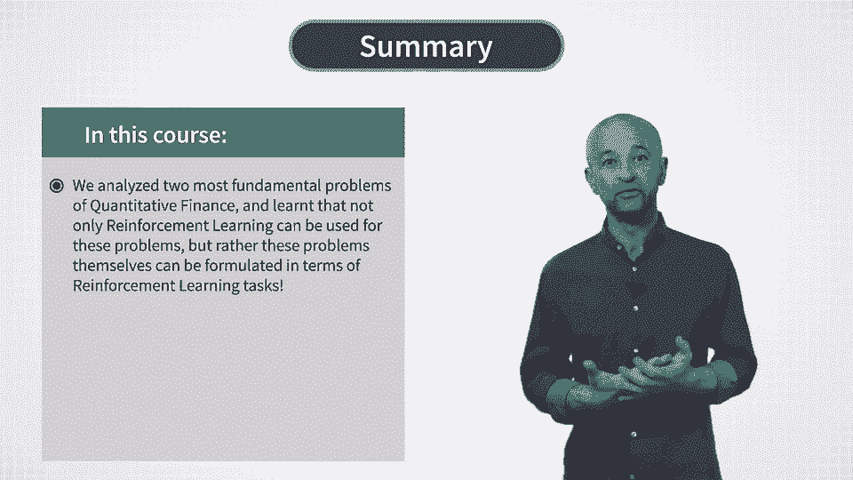
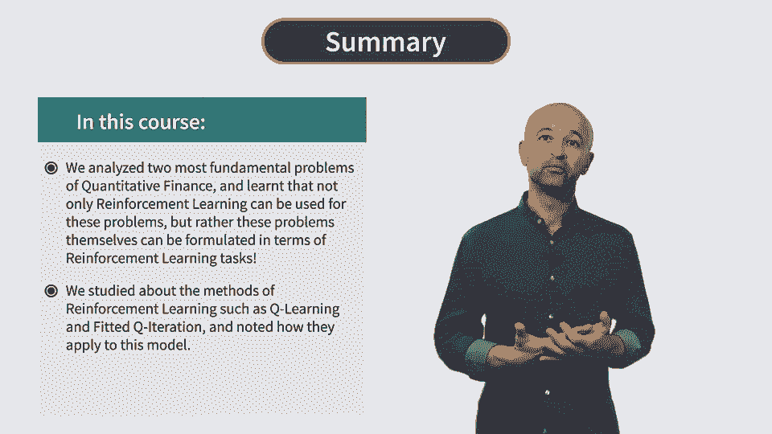
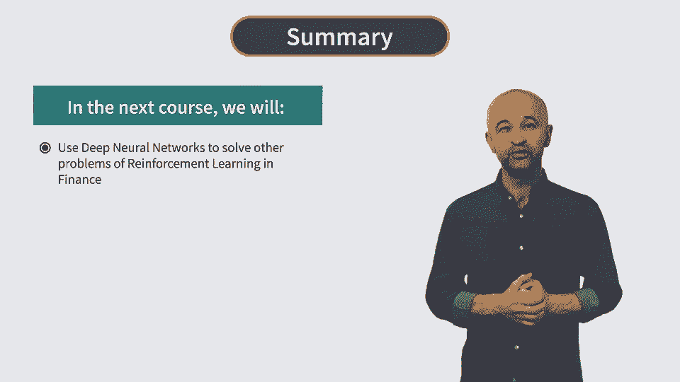

# P39：课程总结 - 兰心飞侠 - BV14P4y1u7TB

现在，让我们总结一下我们在这门课程四周中所学到的内容。

在这门课程中，我们讨论了两个最基本的量化金融问题，并展示了强化学习不仅可以应用于这些问题，而且这些问题本身可以用强化学习任务的方式来表述。

我们从期权定价和对冲的问题开始，展示了如何解决这个问题。

可以重新表述为一个离散时间的马尔可夫决策过程。然后，我们学习了强化学习的方法，如Q学习和拟合Q迭代。

并且它们如何应用于该模型。我们发现，在单一选项的情况下，整个方案在计算上相当简单。为了计算期权的最优价格和对冲，我们只需要一堆线性回归，其他什么都不需要。这个模型直接从期权的复制投资组合的交易数据中学习，因为它是一个强化学习模型。我们使用了基于模型的强化学习，其中奖励函数是一个二次函数。

它的参数，使得模型变得非常易处理。特别是，在这种简单的设置下，我们不需要像神经网络这样复杂的函数逼近方法。然后，在本周的课程中，我们研究了一个非常大的投资组合优化问题类。我们再次首先构建了一个简单的投资组合模型，可以应用于所有此类任务。

包括最优投资组合清算、最优投资组合和指数跟踪。通过这个模型，我们学习了强化学习本身的新话题，包括随机策略和熵正则化强化学习。这种熵正则化强化学习在学习和噪声环境中非常有用。

这在金融中几乎总是适用。最后，我们看到了如何通过相同的动态投资组合模型进行逆向强化学习，以及如何使用它来提供市场观点和私有信号的价值，这与著名的Black-Lieterman模型的精神非常相似。由于模型相当简单，我们再次能够在不调用其他复杂方法的情况下推进这个模型。

复杂的函数逼近方法，例如神经网络。正如我们将在下一门课程中看到的，强化学习在金融中的其他问题确实使用了神经网络，特别是深度神经网络，从而产生了深度强化学习。我们将在这门课程的下一部分详细讨论深度强化学习。

目前，祝你在课程项目中好运，下一门课程再见。

