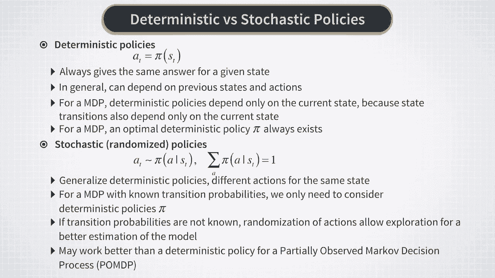
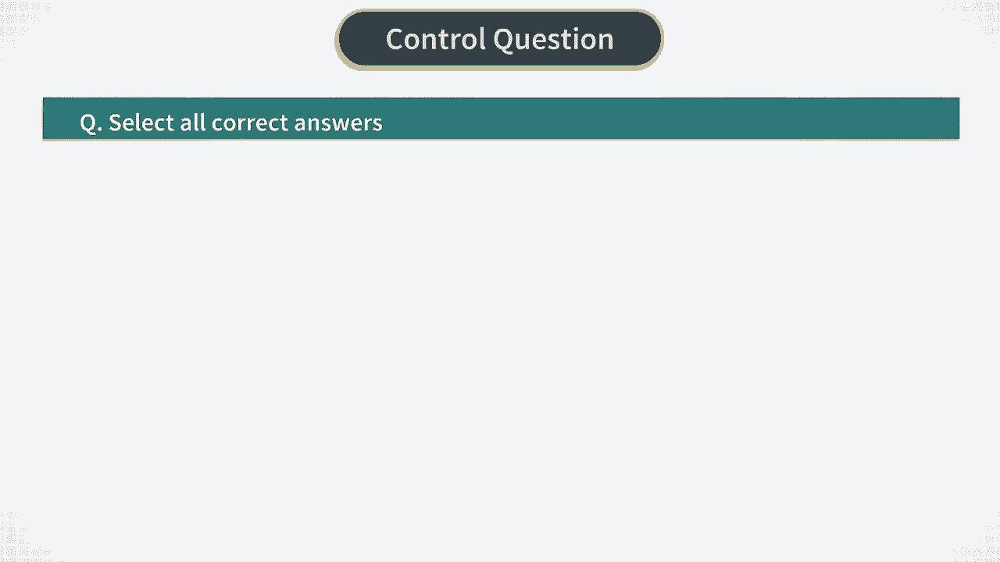

# P5：MDP 和 RL - 决策策略 - 兰心飞侠 - BV14P4y1u7TB

现在，让我们谈谈如何才能真正实现。

最大化马尔可夫决策过程的预期总回报的目标。

我们已经提到，强化学习的目标是最大化。

未来所有操作的预期总回报。由于这个问题现在必须解决，但将来会执行操作。为了应对这个问题，我们必须定义所谓的策略。策略是一个函数，它根据当前状态 S t 输出一个动作 A t。换句话说，该函数将状态空间映射到马尔可夫决策过程中的动作空间。如果系统当前处于由 S t 描述的状态，那么下一个动作 A t 由策略函数 pi 给出，S t 是其参数。如果策略函数是 S t 的常规函数，那么它的输出 A t 就是一个数字。例如，如果策略函数是线性的，如 pi(S) = S/2，那么对于每个可能的 S 值，我们将采取相应的行动。这种策略被称为确定性策略，但实际上这不是唯一的选择，我们还可以为马尔可夫决策过程定义其他策略。我们还可以考虑随机策略。在这种情况下，策略由概率分布而非函数定义。让我们更详细地看一下这两种策略规范之间的区别。

首先，让我们谈谈确定性策略。在这种情况下，采取的行动 A t 由下式给出，应用于当前的策略函数 pi 的值，状态 S t。如果钢筋方向被找到，并且系统处于相同的状态 S t 不止一次。每次它都会以完全相同的方式行事。现在，它的行动仅取决于当前状态 S t，而与之前的状态历史无关。这个假设是为了确保一致性，体现系统动力学特性，其中特定未来状态的概率只取决于当前状态，而与任何以前的状态无关。实际上无法证明，对于马尔可夫决策过程，始终存在最优确定性策略 pi，因此我们的任务只是识别所有可能的确定性策略。因此，只要是这样，确定性策略似乎就能解决所有问题。我们永远需要解决马尔可夫决策过程。但是，事实证明，第二类策略，即随机策略，也常常对强化学习非常有用。对于随机策略，pi 变成了一个概率分布，用于描述可能的行动 A t。这种分布可能取决于。

将 S t 的当前值作为这种分布的参数。因此，如果我们使用随机策略而不是确定性策略，代理再次访问相同的状态时，它可能会采取与上次在相同状态下采取的行动不同的行动。那么，为什么我们要考虑这种随机策略呢？好吧，如果我们知道马尔可夫决策过程中的转移概率，我们可以推测，只有确定性策略才能找到最优的确定性策略。为此，我们只需要求解我们在之前课程中讨论过的问题，我们将在下一个视频中再次回顾。但是如果我们不知道转移概率，我们必须通过数据估计它们，并再次利用贝尔曼方程来解决问题，否则我们就必须依赖于强化学习方法的样本。在这种情况下，随机化动作，遵循一些随机策略，可能会提供一些探索的空间，以便更好地估计模型。我会马上回到探索的概念，但首先让我提到还有第二种情况，当使用随机策略时可能是可取的。发生这种情况时，我们处理的环境并不是完全可观察的马尔可夫环境，而是部分可观察的环境。

这种情况被称为部分可观察马尔可夫决策过程，简称 POMDP。在本课程中，我们不会深入探讨 POMDP，但了解它们的存在是有帮助的，尤其是考虑到金融领域中的许多问题可能是这种设置的良好实例。然而，这种情况在数学上比 MDP 设置复杂得多。因此，我们将首先专注于 MDP 的基本情况。好了，现在让我们回到探索的概念，讨论我们为什么需要它。

探索的概念出现在强化学习中，通常被称为探索与利用的困境，指的是在采取行动时需要考虑不同的可能情景或策略。这种困境是强化学习特有的，在监督学习或无监督学习中并不常见。原因是，在监督学习或无监督学习中，动作通常是固定的，而强化学习中，在每一步，代理需要从众多可能的动作中选择一个。我们的最终目标是最大化总回报。但在学习的某个阶段，如果环境尚未完全了解，我们可能并不知道所有可能遇到的状态。或者，代理可能需要在已见过的状态下尝试不同的操作，因为采取不同的行动可能会影响环境的变化，从而产生更高的回报。因此，我们可能需要尝试不同的动作并探索不同的状态。这就是所谓的探索。我们通过不时采取随机行动来寻找好的动作和状态。但如果我们过于频繁地这样做，可能会导致较低的最终回报，因为。

在试错法的探索中，代理可能访问到许多低回报状态。另一种方法是依赖于利用。当代理重复执行它以前成功的状态时，这就发生了“利用”，它会访问那些以前带来较好回报的相同操作。但这种方法显然有选择“好的”行动的风险，因为这些行动不一定是最优的，可能存在其他回报更高的行动和状态。然而，如果只依赖于已知的动作和状态，最终的回报可能就会受到限制。这就是为什么这个问题被称为“探索与利用的困境”。在每一个时间步，代理需要决定，在某个状态下是否应该选择探索还是选择利用。但它不可能同时做这两者。理想情况下，强化学习应该将探索和利用结合起来，例如通过在不同的时间步之间切换它们。具体如何做到这一点取决于实际情况，并且没有关于如何解决“探索与利用困境”的通用答案。但重要的是要注意，这种困境只与在线强化学习有关，即代理与环境进行实时交互时。另一方面，在批处理模式下的强化学习中，我们已经从其他代理的行为中收集了数据。

这意味着其他代理已经在某种程度上解决了探索与利用的困境。虽然这种方法可能不是最优的，甚至可能是一个不太理想的方法。例如，数据可能是通过纯随机选择动作而收集的。但无论如何，这些固定的数据集就是我们所拥有的。在批量强化学习的设置下，代理无法访问实时环境，因此不能进行任何探索。相反，它必须依赖于固定的数据集，仅根据该数据集学习最优策略。

