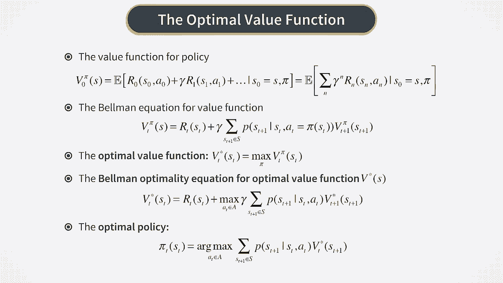
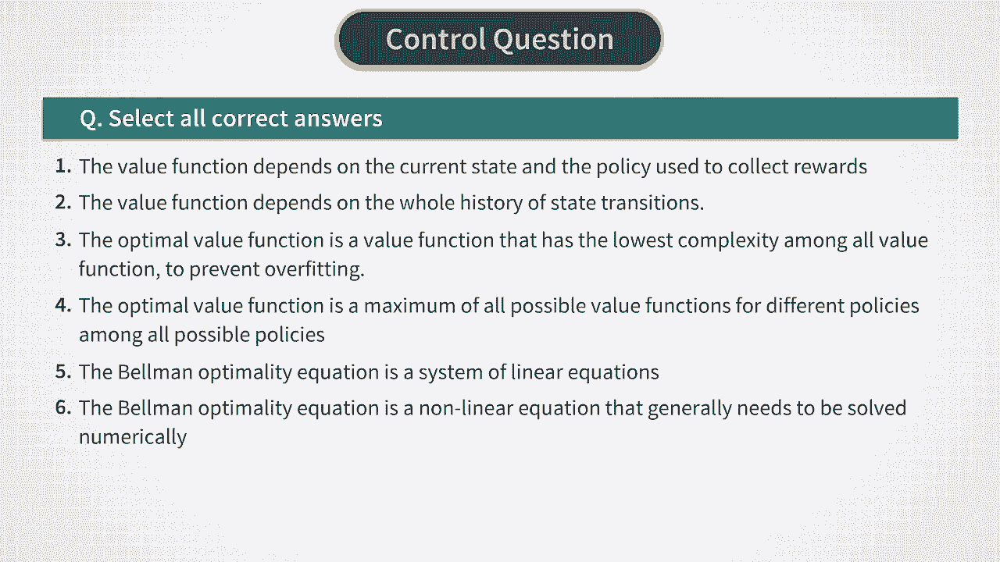

# P6：MDP & RL- Value Function and Bellman Equation - 兰心飞侠 - BV14P4y1u7TB

We said that the goal of。

Markov decision process model is to maximize the expected total reward。

Because this problem has to be solved now，but rewards will be obtained in the future。

this problem is solved in terms of a policy that it gives a rule。

of what actions should be taken in any possible state of the world。But how can we。

quantitatively compare different possible policies for the same MDP problem？

We simply compute the expected total rewards，the same quantity that we want to maximize。

but with one important addition。

Namely， in this calculation we condition on the current state of this system， ST。

This is done in recognition of the fact that we can get。

different total rewards if we start with different initial states of the system。

Such conditional expectation of，the total cumulative framework is called the value function。

For each possible state， ST，the value function gives us the value of the state for。

our ultimate task of maximizing the total reward using policy pi。

This data sees therefore an argument of the value function。In addition。

 the value function V has an upper script pi to，emphasize it's dependence on the policy chosen to accumulate the rewards。

Finally， it has a lower index that specifies the time at which the system has，the state vector S。

 We use a discrete notation，for time as we work in discrete time with Markov decision processes。

And therefore， in this formula we show the value function defined。

for time zero by using the lower index of zero here。Next。

 let's see how we can evaluate this expression。Let's separate the first term from the sum and write it。

as the first term plus a similar sum，but starting with the second term in the original sum。Next。

 we replace the expectation of the sum with the sum of expectations。Now。

 the first term is just the rewards from the current step。But the second term is the expectation of。

the same value function at the next time moment when the two。

have some other state as prime as it's arguments，multiplied by the discount， the factor Gamma。

We can now replace the expectation sign in this term by。

an explicit sum that involves probabilities of，transitions to all possible next states from the current state。

And this produces a recursive relation，for the value function that is called the Bellman equation。

It was proposed in 1950s by，Richard Bellman in the context of his pioneering work on dynamic programming。

We will encounter a few other equations a bit later that also carry the name of Bellman。

so it will be important to understand the differences between them。Now。

 a slightly more general version of the same Bellman equation that I just。

presented refers to the case when the reward R depends on the next state。

All that is needed for such case is to put the reward inside。

the expectations so that the Bellman equation takes the form shown here。

Now， a special case arises when，Markov decision process is。

such that time does not appear in it as an independent variable。That means that for。

such MDP transition probabilities and reward cannot explicitly depend on time。And the final time，T。

 is infinite in the problem。So， there is an infinite sum in the definition of the value function。

In such case， the value function will also be independent on time，and therefore。

 we can drop the time index from it in this cases。The Bellman equation for such case becomes a simpler。

a system of linear equations，one equation for each possible state as T。 So。

if our discrete set of states has N states，we will have N such linear equations。

If transition probabilities are known，we can easily solve this linear system using methods of linear algebra。

Next， we introduce an optimal value function called V-star。

The optimal value function for a state is simply，the highest value of function for the state among all possible policies。

So， the optimal value function is attained for，some optimal policy that we will call V-star。

The important point here is that，an optimal policy V-star is optimal for all states of the system。

This means that V-star should be larger or equal than the with，any other policy and for any state S。

 Now，we can express the optimal value function in terms of itself，similarly to how we derive。

the Bellman equation for a value function with a fixed given policy pi。Formally。

 it can be done by simply applying，the max operator to both sides of the Bellman equation。

Then in the left hand side we will have V-star by definition。

while in the right hand side we will have，the same optimal value function at the later time。

But in addition to replacing the by V-star in the right hand side。

we also have to make sure that the current action at time T is also optimal。

This expresses the famous Bellman's principle of optimality。

which states that optimal cumulative rewards，should be obtained by taking an optimal action now。

and following an optimal policy later。Therefore， by following this principle we obtain。

the Bellman optimality equation for V-star shown in this slide。Now。

 because of the max operator standing in the right hand side。

this is now a non-linear equation that usually needs to be solved numerically。

In the next video we will talk about，simple numerical algorithms that can be used to descent。

But before that， let's discuss how we can find，the optimal policy if we already know the optimal value function。

This part is easy。 The second term in the Bellman optimality equation involves taking the。

maximum among all possible choices of the action at time T of this term。

But this separation is exactly what should be described by the optimal policy itself。

And this gives us the way to find the optimal policy，for a given state and time as they choice of。

action for this state in time that gives，a maximum to the second term in the Bellman optimality equation。

So， let's take a quick look at questions for，this video and move on to。

