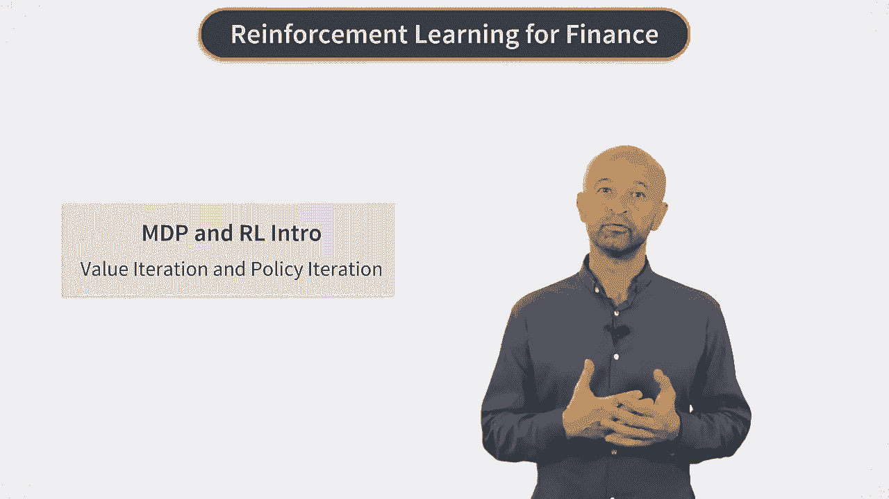

# P7：MDP & RL- 值迭代与策略迭代 - 兰心飞侠 - BV14P4y1u7TB

现在，让我们回顾一下我们在上一课中所说的内容。

关于求解贝尔曼最优方程的两种经典方法。我们可以将这些方法应用于时间均匀的市场决策过程。正如我们在上一个视频中看到的，对于这样的过程，价值函数变得与时间无关。因此，在这种情况下，贝尔曼最优方程变成了单一函数的非线性方程，可以通过简单的数值方法求解。这样的一种方法被称为值迭代。只要状态-动作空间是离散且较小，值迭代就能为问题提供简单而快速的解决方案。

它的工作原理如下，我们从初始化开始，设定所有状态的初始价值函数。通常，所有状态初始化为零即可正常工作。然后我们不断迭代计算，使用贝尔曼方程本身的价值函数进行更新。对于每次迭代，我们使用上一次迭代的结果来计算该等式的右边。现在，有几种方法可以在这种值迭代中更新值函数。一种方法是遍历状态空间中所有状态并计算价值函数，然后立即更新所有状态的价值函数，这被称为同步更新。另一种方法是即时更新价值函数，这意味着每次计算后立即更新，这称为异步更新。现在，无论采用这两种迭代方式中的任何一种，都可以证明算法最终会收敛到最优值函数。我们将再次重启算法，并且发现重启后，我们可以使用相同的公式找到最优策略。所以基本的算法非常简单，正如我们所说的，只要你的状态-动作空间是离散且状态较少。现在，还有另一种经典方法，我们也在上一过程中提到过，它叫做策略迭代。在这种方法中。

我们从一些初始策略 π₀ 开始，通常是随机选择的。在那之后，我们重复执行以下循环，每一步进行两次计算，直到收敛。第一个计算叫做策略验证。在这个计算中，我们为当前策略计算价值函数。我们可以使用 V 的贝尔曼方程来完成这个计算，而不是贝尔曼最优方程。因为 V 的贝尔曼方程只是一个线性方程，解决这一过程相对直接。循环的第二次计算叫做策略更新。这个步骤通过应用贝尔曼方程右侧的 `arg max` 运算符来完成。现在请注意，这些计算必须在策略迭代中重复执行，它们的计算负担是完全不同的。策略更新是直接的，可以通过标准优化算法完成。然而，策略评估步骤涉及求解贝尔曼方程。因此，当状态空间的维度很大时，重复进行策略评估可能非常昂贵。

另一方面，许多实际的最优控制问题，尤其是在大型离散状态-动作空间，甚至是连续的状态-动作空间下，动态规划和算法方法，如值迭代或策略迭代，已经不再适用。在这些情境中，强化学习就成为了解决问题的关键。

我们将在下周看到它是如何工作的。

