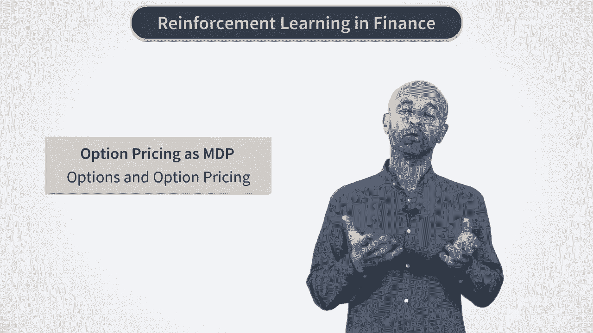
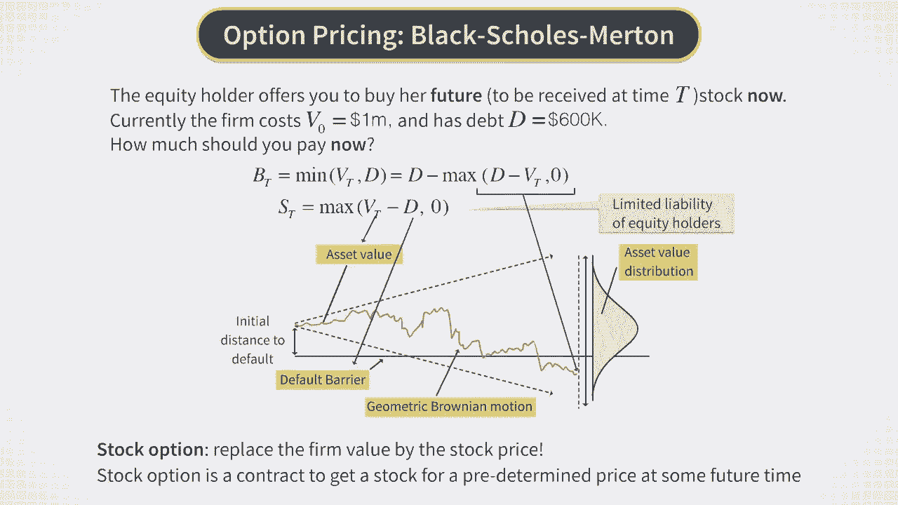
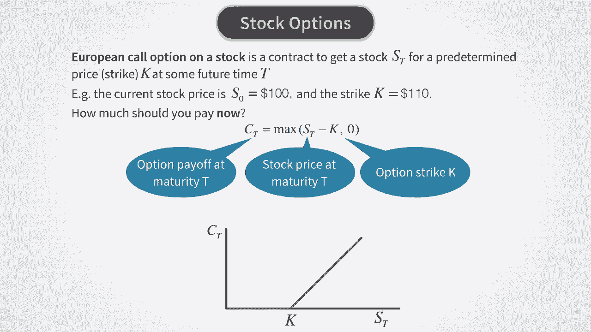

# P9：BSM - Options and Option pricing - 兰心飞侠 - BV14P4y1u7TB

 In the previous lesson we spoke about market decision processes and about how reinforcement learning can be used to find optimal policies for MDPs。

 We also looked at the pole balance in problem as one of the most classical test cases for reinforcement learning algorithms。 Such test cases are very useful as they not only let us see how a particular reinforcement learning algorithm works in this setting when we know what to expect。

 but also can compare different algorithms in terms of their performance。

 Though the physics of a card pole system deals with continuous variables such as positions and velocities。 these variables can be discretized。 Upon discretization。 the system is mapped onto a mark of decision process problem with a discrete state and action space。 All methods that we outlined before plus many other methods of reinforcement learning for MDPs can be tried in such setting。

 Therefore， the test case is often used to illustrate and benchmark different reinforcement learning algorithms。 But because in this course we deal with finance， it would be good to have a setting for finance that would be as simple as the pole balancing problem。

 Such a simplest but not a simpler one setting could be useful financial applications of reinforcement learning as a testing laboratory for exploration and benchmarking of different RL algorithms for financial applications。 In this lesson we will construct such a testing environment for reinforcement learning and finance。

 As we will see later it's very flexible and extendable。

 In particular it will let us benchmark both discrete action and continuous action reinforcement learning algorithms。 On the side of finance it offers a look into the problems of hedging。 trading and pricing in financial markets。

 All the main elements of many financial tasks but in a controllable and well understood environment。 And last but not least it has a chance to be extendable upon appropriate generalizations into practically useful methods。

 To this end we suggest to use the famous Blackshoes Merton or BSM model。 a cornerstone of modern quantitative finance。 I mentioned this model to you in our first course on supervised learning when we talked about Merton's model of corporate defaults。 So let's start with a quick recap of the Merton model for defaults。

 The Merton model offers a simplified view of a firm that has a single asset called the firm value that is modeled as a geometric Brownian motion with a diff。 If the firm value is below the level of debt at that maturity time t and equity holder defaults on your payment to a bond holder that finances the firm。

 In this case she hands the firm asset to the bond holder and the stock becomes worthless。 Otherwise the stock value at time t is equal to the difference between the firm value t and the debt level k。 We discussed the implications of the Merton model to predict corporate defaults and said that a particular expression obtained in this model for a default probability can be viewed as a structure。 A model based a default model that corresponds to very specific assumptions about the dynamics of the system。

 Now the Merton model for corporate default gives the default probability and also computes how much both the debt of the firm and the stock of the firm are valued now。 But what if the stock holder offered you to pay her now in order to be able to buy her future stock from her at the later time key。

 Right after she gets it。 For some fixed price k that is fixed now。 Satch financial contract is called an option or a financial derivative。 Both names explain the nature of this instrument。 First it is an option and not an obligation which means that you will not have to pay a price k at time t to get the stock if you see by that time that the stock does not perform well。 It's also called a derivative because its value is derived from a value of the stock。

 What I just described is a most simple type of a stock option called the European call option on the stock。 To reiterate such a financial contract works as follows。 A buyer of such option gets a right to get the stock at a later time t for a press specified amount k。 also known as the option strike。 The strike k is set contractually at the start of the option。

 Now the value of the option at the maturity time t is given by the formula shown here。 It is a maximum of the difference between the final stock price S at t and the strike k and zero。 The meaning of this is simple。 If the final stock price S at t is above the strike k then it makes a perfect sense for a buyer of such option to get the stock。 The stock can be immediately sold for the market price。

 The profit to the option buyer in this case would be the difference S at t minus k。 But if the terminal stock price is below k then exercising such an option would not make sense for a buyer。 So the option payoff is zero in such case。 This option payoff at maturity time t is shown on the graph here。 The payoff is zero for any terminal value ST below k and grows linearly for values of ST above k。

 Okay， this is how much the option works at the final time t。 But what about its price now when we don't know the final stock price？

 The celebrated Black Sholes-Merton model also referred to as the Black Sholes model was developed to answer exactly this question。 It was developed around the same time as the Merton corporate default model in 1973 by Fisher Black。 Myron， Scholes and Robert Merton and was awarded a Nobel Prize in Economics in 1997 to Scholes and Merton。 three years after Fisher Black died of cancer in 1994。

 The model is commonly referred to as the Black Sholes model and sometimes says the Black Sholes Merton model or BSM model。 We will be using both names interchangeably。

 So what is the BSM model and what does it do？

 Let's talk about this model in our next video。 [ Silence ]。

