# Reinforcement Learning in Finance - New York University 金融强化学习 - 纽约大学 - P35：RL for Stock Trading -Reinforcement Learning for Portfolios - 兰心飞侠 - BV14P4y1u7TB

 Okay， we have defined in a previous video the problem of dynamic portfolio optimization。

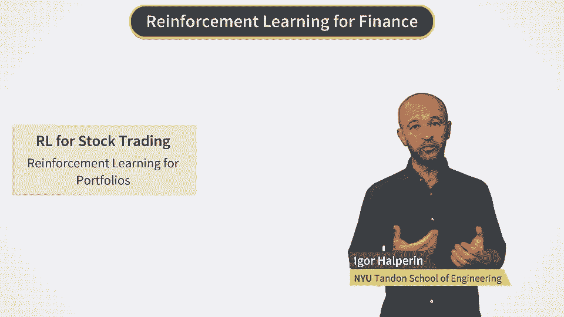

 which we formulated as a mark of decision process with a quadratic one-step reward function。

 And as we said many times in this specialization， as long as we have an MGP problem， we can。

 solve it using a model as in dynamic program and approach， or we can use reinforcement。

 learning and solve the model using samples from data。 In both these approaches we looked。

 for an optimal policy， which we defined as a function that is a map from the space of。

 states onto a space of actions。 So such function gives you one fixed number for each possible。

 state and this value would be the action prescribed by this policy。 Now in reinforcement learning。

 such policies are called deterministic policies。 We can view a deterministic policy as a probability。

 distribution given by a Dirac delta function as shown in equation 24。 Here A t star is a。

 deterministic optimal action that is obtained by solving the portfolio optimization problem。

 Clearly saying that we have a deterministic policy is equivalent to saying that we have。

 a stochastic policy whose distribution is a delta function。 But we could consider more。

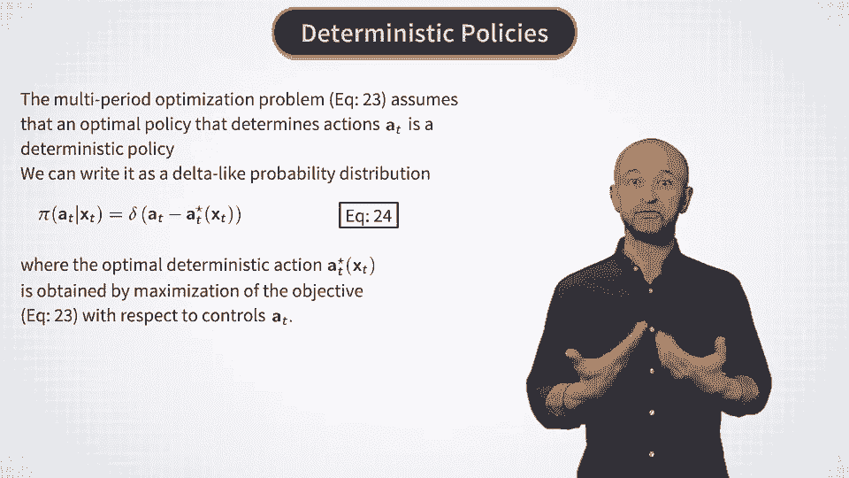

 interesting probability distributions than delta functions to describe stochastic policies。

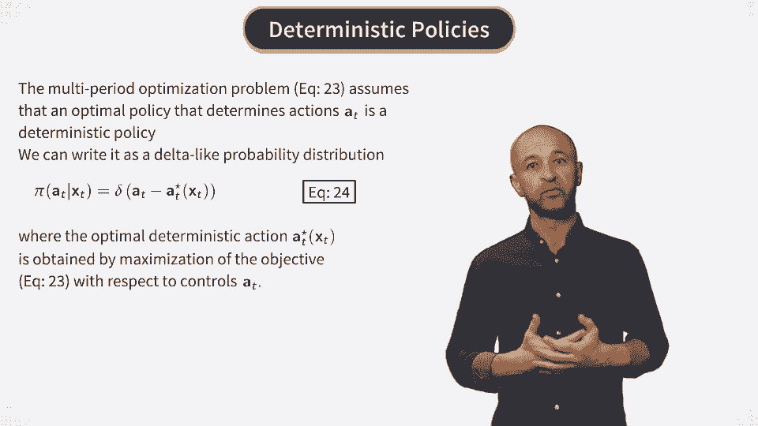

 The only question is why we should do this。 And the answer to this question is that truly。

 deterministic policies hardly exist and therefore hardly relevant for finance。 Let me explain。

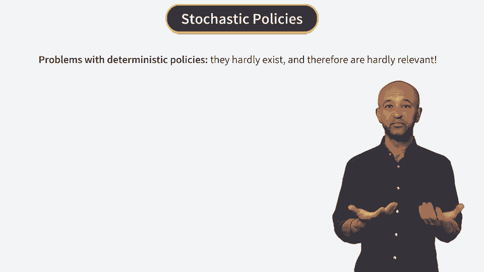

 you this statement。 First， assume that you have some deterministic policy pi， parameterized。

 by some parameters theta。 Now because these parameters are found from a finite sample of， data。

 they are themselves random。 Therefore any result in deterministic policy would be， random de facto。

 A good example is given by the same Markovitz portfolio model that we， mentioned above。

 Markovitz optimal portfolio allocation depends on expected stochlear， terms。

 Because they are estimated from data， these estimates are themselves random numbers。

 Therefore the Markovitz portfolio allocation is in fact random even though the model itself。

 does not explicitly stated。 So because the world is random， it would be a very good idea。

 also to have some measure of uncertainty or confidence in model recommendations regarding。

 asset allocations。 If a model gives you just one number， you have no idea how confident。

 the model is regarding this number。 The other reason to work with stochastic policies is。

 that most of the time， any real data is not strictly optimal and sometimes may be even。

 quite suboptimal。 There might be many reasons why demonstrated data are suboptimal。 For， example。

 a model mis-specifications， model timing legs， human errors and so on。 If we。

 insisted on deterministic policies， such data would have probability zero under such， models。

 But because such nearly optimal or suboptimal data are everywhere， we better。

 should get tools to work with such imperfect data rather than insist that the world should。

 match our imperfect models。 So what are stochastic policies in reinforcement learning？ Stochastic。

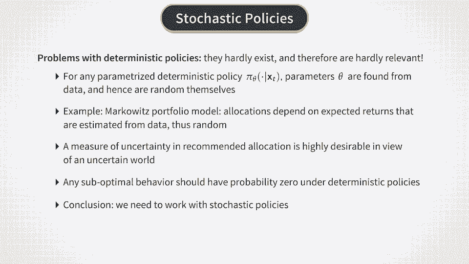

 policy is any valid probability distribution pi for action 18， which is conditional on the。

 current state x team and in general can be parameterized by some parameter vector theta。

 as shown in this formula。 In addition， the policy pi can depend on external predictors， the team。

 which we omit here for braids。 So what are new insights that we can get using。

 stochastic policies instead of deterministic policies？ New insights are possible with stochastic。

 policies precisely because they are stochastic。 Stochastic policy pi means that we have a probabilistic。

 model for actions。 And these can be used for pass data to build a probabilistic model of， data。

 But again， because this is a probabilistic model， we can also generate future data using。

 simulations with this model。 In other words， probabilistic models are generative models。

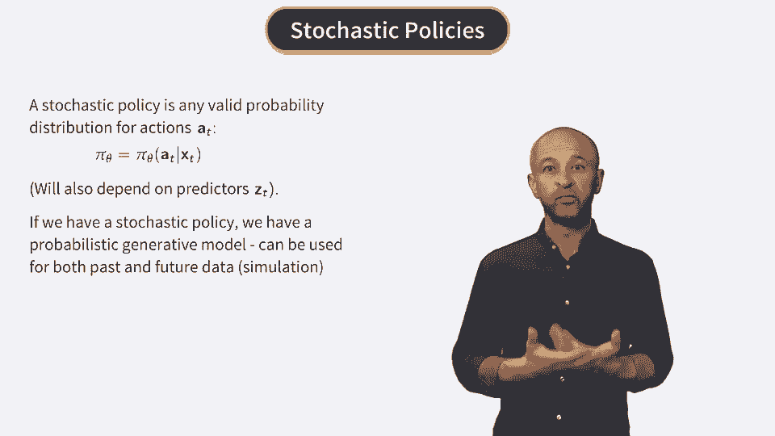

 Now let's see how we can change our problem of portfolio optimization if we use stochastic。

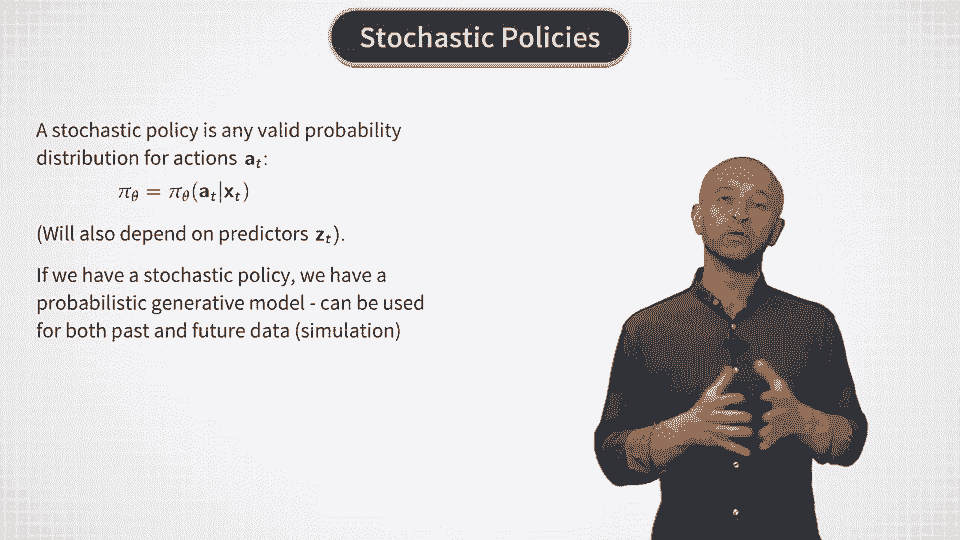

 policy instead of deterministic policy。 A new optimization problem formulation is shown。

 in these equations。 Let's go over them one by one and see what changes some hate in comparison。

 with the previous formulation。 First， we again have an expectation of some of discounted future。

 rewards as before。 But this time， the expectation sign is different。 The expectation this time。

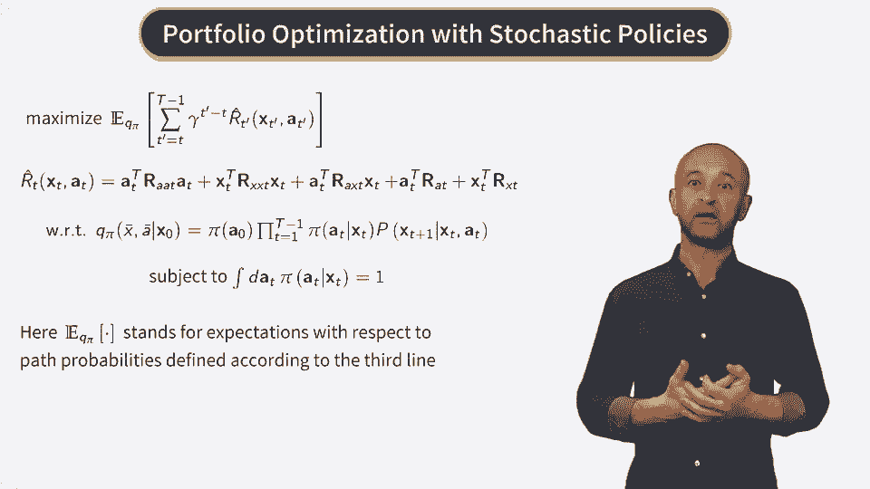

 is done with respect to the whole path probability， Q pi， which is given by the third line in this。

 equation。 We have a product of terms for each time step here。 For the first time step， we have。

 the action probability pi of a zero。 And then for each next step， the joint probability is。

 decomposed into a product of an action probability times the transition probability to the next。

 step， next state x t plus one， conditional on the previous state and the action。 And because。

 pi of a t should be a valid probability distribution。

 we should add the normalization constraint for， pi of a t to this optimization。

 So what we did with this probabilistic formulation is。

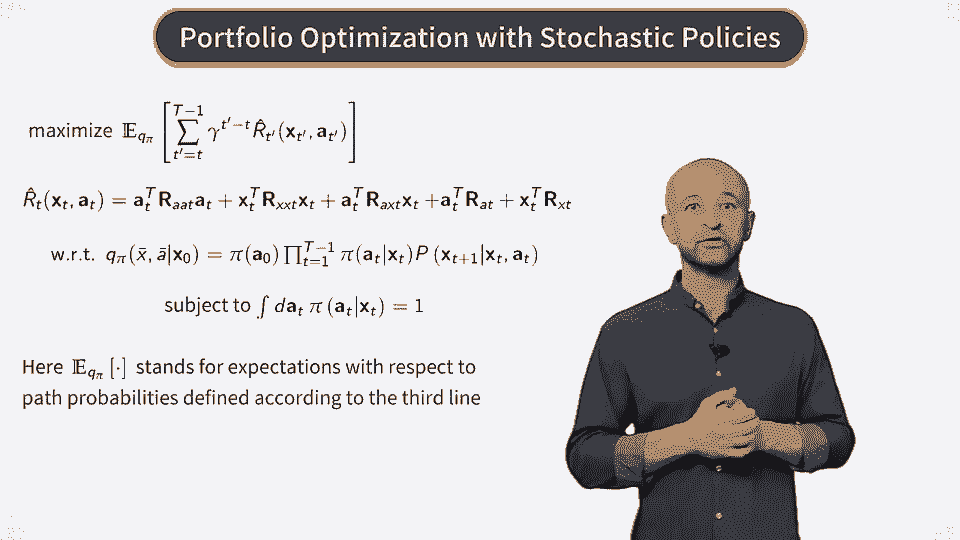

 sounding pretty drastic。 We replaced optimization in a function space by optimization in the space。

 of probability distributions。 Now， of course， the main question is how to do such optimization。

 in probability spaces。 We will discuss this shortly。 But before doing that， we have to。

 introduce another important concept here， which is the notion of a reference policy。

 So what is a reference policy？ We can think of a reference policy as a prior policy that we would。

 be thinking of using before we see any data。 A common approach in Bayesian statistics and Bayesian。

 learning is to start with a prior distribution for data and then update it using the data。

 Here we will do the same and later we will build a method that modifies prior or reference policy。

 such that a new updated posterior policy will be consistent with the data。 Now， to keep things。

 structural， we will use very simple Gaussian reference policy， which we will call pi zero。

 This policy has the mean a hat， which is a linear function of the state x t。 You find by two。

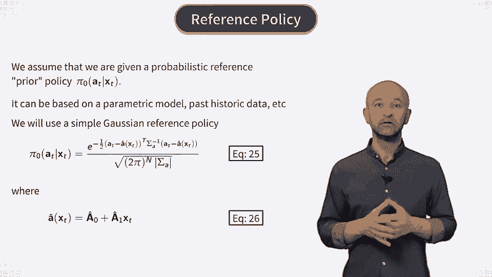

 coefficients a zero and a one with the covariance matrix sigma a。 In principle。

 this coefficient a zero and a one could depend on the signals as a team。 But this is not necessary。

 because such dependence will appear as a result of Bayesian updates。 As we will see later。

 Therefore。

 we can keep things simple and take just constant coefficients a zero and a one for the prior。

 For the covariance matrix sigma a， we can also take a simple matrix。 For example， use the same。

 variance and the same correlation for all stocks。 And in this case， the whole matrix would be。

 parameterized by just two numbers。 Okay， now we have all the tools that we need。

 And in the next video， we will see how we can work with stochastic policies and how the reference or prior policy appears in。

 this procedure。

 Okay， so， let's go。 You， [BLANK_AUDIO]。

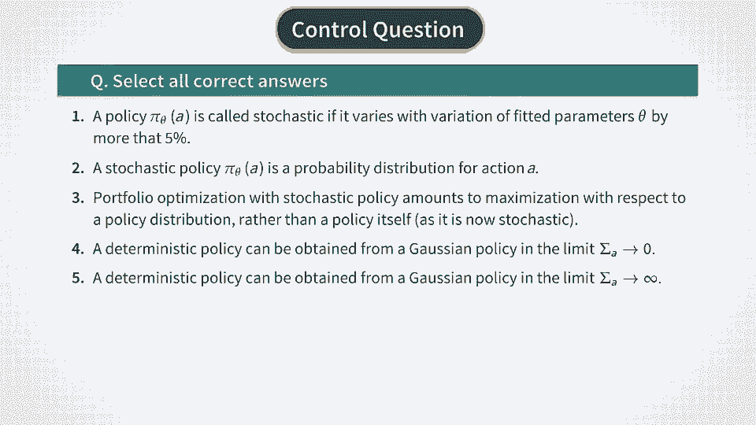