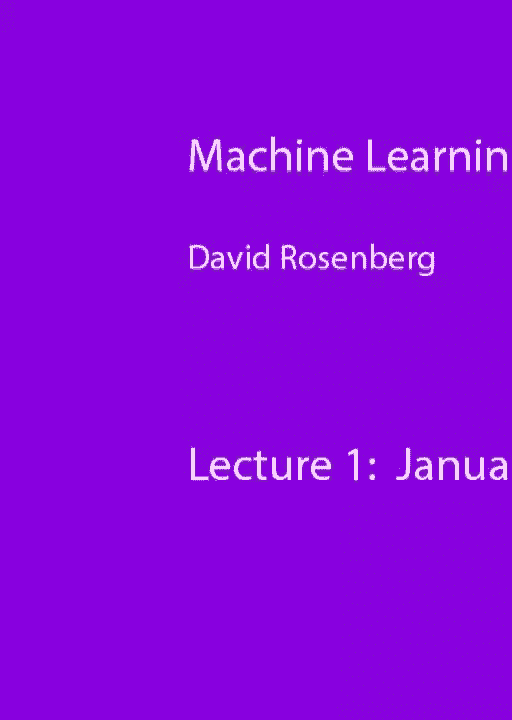
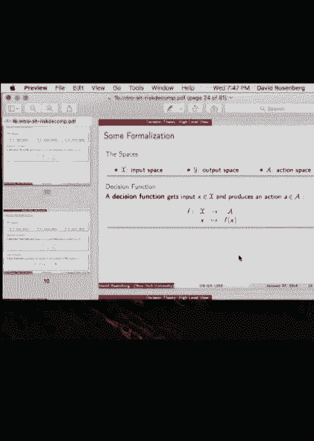
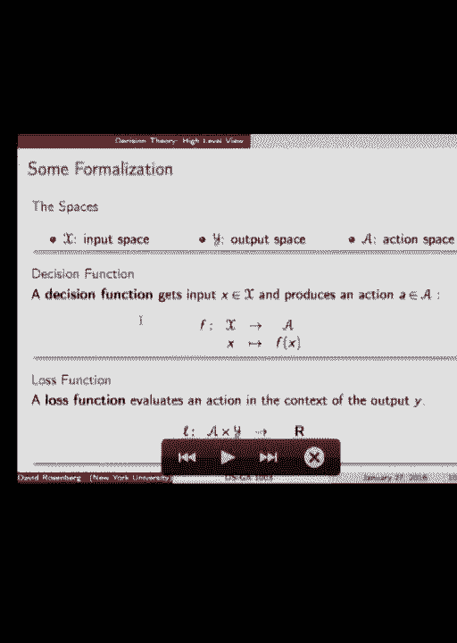
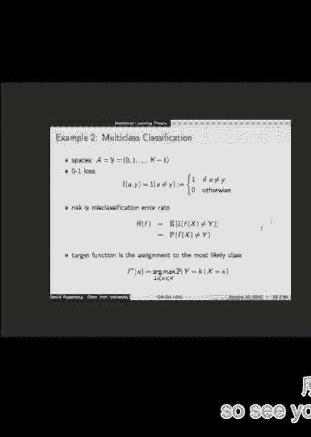
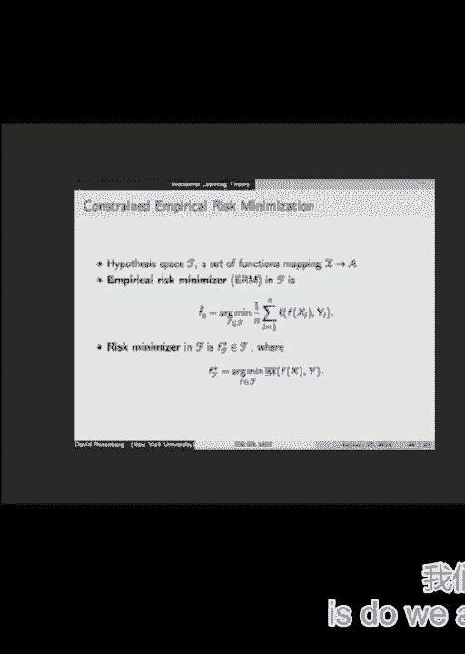

# P1：1.Machine_Learning_Jan_27th_Lec - Tesra-AI不错哟 - BV1aJ411y7p7

嗨，大家好，欢迎来到机器学习课程，DSGA1003。

我是David Rosenberg。这学期将是你们的讲师。我们将首先介绍一些关于后勤的幻灯片，以及核心结构的一些内容，不会太多。然后我们将进入一些教材内容。我们会讨论一些非常抽象的东西，也会涉及一些非常具体的内容。或许这就是本课程的基调，事实上。好奇的话，可以举手看看。

有多少人是数据科学中心的硕士项目学生？好的，是什么样的情况？50人左右吗？

好的。那么有多少人是来旁听的？或者是来看看？也许你们会选这门课？在等候名单上吗？好的，不是很多。好的，调查结束了。那么，首先，课程网页已发布在GitHub上。你们应该花时间阅读它。我不会在这些幻灯片中覆盖所有信息。

课程的很多细节可以在网站上找到，特别是课程大纲和一些重要的日期，比如考试。这个学期我们将使用Piazza。我敢打赌你们中的许多人已经使用过Piazza了。它是一个非常好的网站，可以用来发布问题，从同学和教师那里得到答案。

从评分员那边得到的反馈。去年效果很好，这是一个很好的方式，可以快速获得帮助或开展讨论。因此，应该把它作为提问的首选方式。你们需要发送邮件给评分员或我，只需直接在Piazza上发帖，我们会非常密切地监控它。接下来是课程安排。

课程时间通常会准时在7点10分开始（按iPhone时间）。周三我们上课的时间是7点10分到9点。周四我们称之为“周四时段会议”，这是为了历史原因命名的。实际上它只是一个额外的课程。所以这两个都是必修的。至于实验课，有些会由我主持，有些会由助教主持，我稍后会介绍。

主要是讲座，通常会扩展周三课程上讲解的内容。有时会涉及一些补充内容，比如数学主题。大多数主题都会涉及一些数学内容，比如关于向量的微分，这将对你们的微积分学习有帮助。我们的其中一场考试会安排在实验课期间，然后我们会看到实验课的安排。

用于与导师的会议。所以我们在这门课上有一些项目，而一些导师会议会在实验课期间举行。所以实验课是各种类型会议的混合体，而周三的讲座都是标准的。至于我们的讲座，好的，那么课程工作人员。首先让我介绍一下我们的助教，Levant-Sagoon。他是从先修课程1002中被高度推荐的。你想说几句话吗？

我明天有个评分员。我们有四个评分员，你们会在网站上看到小图片和简短的介绍。我们还为课程的项目安排了一些项目顾问，这些顾问都是数据科学领域的专家，他们通常会为大约每组八个学生提供建议，这通常是一次非常有价值的经历。那么，课程是如何评分的呢？

大约会有八个作业，它们总共占40%的分数。会有两个考试，一个短的和一个长的，总共占40%，然后项目将占20%。这主要基于你的最终报告。会有一个海报展示环节，所有加起来是100%。也有一些额外的加分机会，表现为可选问题。

作业上，主要是这样。有什么不同的是，作业上的加分并不会提高你的作业成绩，它是一个完全不同的类别。所以你一定要先完成常规的作业题目。可选问题是想要深入学习更多材料时的选择。

如果你有额外的时间，想深入钻研数据科学，我希望给你们提供所有机会来学习尽可能多的内容。这也是为什么会有这些可选问题的原因。即使你不做这些问题，阅读它们也可能是值得的，因为有时我们会介绍一些新的主题，这些主题不是必修的，但无论如何可能会引起你的兴趣。

另外，如果你在Piazza或者课堂讨论中是一个积极的贡献者，这也有助于提升你的最终成绩。但总的来说，额外的加分最多只能提高你的最终成绩半个等级。例如，B+提高到A-，A-提高到A等等。

到目前为止，有关评估或者其他方面的问题吗？好的。那好，第一份作业明天会发布，截止日期是一个星期后。作业提交使用NYU的课堂系统，我假设你们都熟悉。如果遇到任何问题，可以在Piazza上发帖，我们会回复你。

有人已经注册了这门课程但还没有加入Piazza或者没有收到Piazza邀请吗？你应该能在网站上找到它。如果你有NYU的邮箱地址，应该能在Piazza上注册这门课。如果没有，直接给我发邮件，我们会解决的。接下来这是一个重要的点。

我们希望所有作业都以PDF格式提交，作业上会明确标注需要包含哪些内容。但请确保你在作业截止前至少五分钟知道如何生成PDF文件，因为延迟政策很简单。我们会接受迟交作业，但会扣除20%的分数。所以我们最好避免出现那种“哦，我做完了，但我没法提交PDF”的尴尬情况。

一起做吧。看，时间戳已经标好了，提前完成，这样就不会有这些尴尬的情况。合作是可以的，只是当你写解决方案时，要确保是独立完成的，你可以和别人讨论好的想法，没问题，但确保你自己写下解决方案，并且标明你合作的对象。

这是一次严肃的合作。所以项目不会只做几个月，我不会说太多，但项目是以三人小组进行的，你可以开始考虑一下你可能想与谁合作，以及你可能想做什么。现在开始考虑并不算早。事情会在春假期间真正开始。会有一个项目提案和与导师的会议，大概是在三月左右。

我们可以在学期后期再回到这个话题。好了，课程的前提要求是这样的：课程 1001 和 1002。这些里面有一些数据科学，也有很多数学内容。如果你没上过这些课，基本上你需要知道的内容包括多变量。

微积分主要是微分学，比如梯度。矩阵代数，线性代数。还有一些来自概率论的内容，一些来自统计学的内容。也许每个科目在本科阶段学一个学期就足够了。然后在编程方面，我们都是用 Python 和 NumPy。

作业的支持代码是用 NumPy 写的，希望这对你们有帮助。好了，关于掌握学习和表现学习的这个大致概念，我只想鼓励你们在做作业或复习讲座笔记时，牢记这一点。所以，当你读到某个内容时，你应该问自己。

我真的是理解了吗，还是我只是稍微理解了一些，足够回答这个问题？我希望你能走得更远，挑战自己真正完全理解。我的大学数学老师之一曾经说过，"差不多理解"是对真正理解的敌人。所以就像是，“我差不多懂了。”

这表明你其实没完全理解，需要继续努力直到完全理解为止。好了，有多少人听说过 L1 和 L2 正则化？嗯，好像有一半人，可能从课程 1001 来的？那我们为什么要使用 L1 正则化呢？

答案是什么？稀疏性，对的，没错。所以当你运行带有 L1 正则化的线性回归时，它叫做 Lasso，你可以得到稀疏的系数。所以如果这是一个面试问题，假如面试官是个聪明的人，但没听说过 L1 正则化，他可能会问，这是什么 L1 正则化。

全是关于稀疏性的，哦，它因为稀疏性而好。然后他们可能会问，为什么你在乎稀疏性？这是个好问题。大家有什么想法吗？

是的，最小化问题更容易解决。如果考虑稀疏解，它更容易解决。确实，更容易解决最小化问题。好吧，所以你说如果有稀疏解，最小化问题更容易解决。好，我们将在计算的意义上看看，解决最小化问题是不是更简单。

那么，其他的想法呢？稀疏性减少了预测的方差。很有意思，可能是其中的一部分。是的，请讲。好的，可能底层的模型是稀疏的。实际上证明它是稀疏的，并且你想强加L1正则化来恢复这种稀疏性。很好，是的。好的，某些应用需要稀疏解。

所以就是压缩感知。好的，太好了。那么如果有人说，我没有这些约束条件。我应该关注L1正则化吗？我不关心模型是什么。我不在乎，只想要它的表现好。那么L1比L2在性能上更好吗？好的，我们会研究这个问题。下一个问题是，你能解释一下L1正则化是如何给出稀疏解的吗？

你们认出这张图了吗？这是一张标准的图。我昨晚在看这张图时，想鼓励你们每个人都知道如何解读这张图以及其中的每一部分。这里有一个圆圈，它对应的是什么？如果有一条线，它对应的又是什么？

然后我意识到我实际上并不理解这张图，因为当我看到这张图时，这些线应该是椭圆形的，我意识到这其实是来自一个问题，我甚至不知道这张图是否解释了什么。因此，当我们下周讲解L1正则化时，我想再回到这张图，我们将讨论这张图是否有意义。好吧，接下来是课程内容。

我们将从课程的主要部分开始，涵盖标准的机器学习频率主义方法。今天我们将开始讨论经验风险最小化。几周后我们将讲解支持向量机。我们还会讲解核方法、集成方法（如提升法）和随机森林等。

这些都是非常先进的方法。神经网络可以归类为这一类。然后我们将进入概率模型的部分。在这种情况下，我们可以做的不仅仅是预测一个数字，在回归中，通常你预测一个数值。而在概率设置中，你可以超越这个。

你可以预测整个概率分布，而不仅仅是一个数字。高斯混合模型可以作为聚类的一种方法。EM算法是当你有缺失数据时学习模型的一种方式。我们将讨论贝叶斯方法在机器学习和统计中的应用。

如果你对你的模型应该是什么样子有一些概念，在开始之前会非常有帮助，这样你可以进行实践。最后我们会选择一些杂项话题，也许是降维或协同过滤。这可能会进入他的讨论。好吧，让我们简单概述一下。在我们开始机器学习之前，你们有任何问题吗？

好的，好吧。今天我们要讨论统计学习理论。这是机器学习的核心理论基础。哦，好的。那么在数据科学中，我们解决的是什么类型的问题？

数据科学中有许多类型的问题，但我们通常有一个一致的核心，就是做出决定、采取行动或产生某种输出。这在数据科学问题中是非常一致的。此外，除了采取某种行动或产生某种结果，我们还有一种正式的方式。

评估我们所产生的结果，这在机器学习和评估中至关重要，标准。所以让我们从行动部分开始。我们可以将行动定义为系统产生的任何结果。典型的例子，我们可以有一个分类问题。在这种情况下，我们产生一个零一分类。那可以被称为一个行动。

经典统计学中，我们有假设检验，行动是要么拒绝零假设，要么未能拒绝零假设。我们可以采取的两种可能行动。语音识别怎么样？我们得到一个音频信号，而我们产生的行动是，嗯，我们的行动是产生一些与音频信号相对应的文字。就是这个行动。

计算机视觉怎么样？问题是，这张图片昨天有动物吗？

我们可以产生一个概率。我们可以说有0.8的概率这张图片包含一个动物。那可能是一个行动。还有什么呢？假设我们在做风暴追踪，并且我们有一些当前时间段的数据，我们想预测风暴将在三小时后到达哪里。我们可能想产生什么样的行动来表达风暴将到达的地方？坐标。

就像是地球上风暴的纬度、经度坐标。太好了。如果我们想将其固定到一个点怎么办？我是风暴，我在四处移动，所有的风和我可能在三小时后到达这里，或者风可能改变方向，我可能会到达这里。有没有办法表达这两种可能性？向量场。向量场。

向量场表示从每个位置物体将要移动到哪里，我想知道。它将在三小时后到达哪里。一个密度。太好了。所以你在地球上产生一个密度函数，这将像一个概率分布，表示你认为风暴会在哪里。听起来不错。好。

对于风暴追踪，你可以预测地球上的概率分布。虽然这是一种不寻常的分布支持，但它完全有意义。自动驾驶怎么样？

自动驾驶问题会是一个动作吗？是的。踩刹车。是的。加速踏板压了一英寸。是的。右转45度。是的。这些都会是自动驾驶问题中的动作。很好。我希望你们能非常广泛地思考一下动作空间可能是什么样的。非常深刻。

我们不会覆盖这么广泛的内容，但所有这些都符合决策理论的框架。这就是我提到它的原因。那么什么是决策理论呢？

我们首先讨论的是决策理论，然后稍微限制一下统计学习理论。所以决策理论就是在各种优化标准下，找到最优的动作。相当通用。当然，这取决于你的评估标准。所以让我们稍微谈一下数据科学的另一个部分，那就是评估。

所以如果我们在做分类问题，评估可能是非常明确的。分类正确与否？

完成。这就是评估。正确的得一分，错误的得零分，或者类似的东西。对于语音识别来说，文本转录的内容是否与实际说出的话完全匹配，是否符合人类听力的判断，或者类似的标准。所以这也可以是二元的。是的，你成功了。不是，你没有成功。那么我们是否应该给这个问题一些部分的评分呢？

音频转录会有误差的程度吗？可能会。所以你可能需要在语音转录的评估标准上做一些工作。要评分一个没有完全匹配的转录文本并不一定那么直接，但有很多方法可以做到。概率呢？

所以我们预测图像中有一只动物，概率为80%。我们怎么评估这个预测的准确性呢？让我们来看一个具体的例子。当它展示给你一张图片，里面有一只动物。我预测80%的可能性它有一只动物。好吧，图片里确实有一只动物，所以80%的预测比错的要更准确，但有没有什么方法可以。

评估80%。所以一个解释是，当我说80%时，我想表达的是，80%的时间我想正确地预测图像中有一只动物。这就是所谓的良好校准的概率。评估这个有很多方法。好的。在一个现实生活中的商业场景中，通常会有某种问题呈现给你，第一步就是将问题形式化，定义一个动作空间。

你将采取什么样的行动？另外一个部分是评估标准。而你会发现，实际上很多时候问题中最有趣的部分是做这个形式化的工作。很多时候它是一个迭代过程，对吧？比如说我们在做风暴预测问题，我们的第一次尝试是去预测。

一个单一的点，可能有很多经度。也许我们预测的是我们认为风暴最有可能出现的地方，如果非得预测一个地方的话。然后我们在一段时间内进行处理，结果我们发现，这并没有捕捉到我们所拥有的信息，有时它就像是一个硬币抛掷，要么会出现在那边，要么会出现在那边。两个不同的地方，彼此分开，可能各占50/50的概率。

所以如果我们只是为一个行动生成一个点，这并不能捕捉到问题的本质。我们希望能够生成一些更具结构性的内容，可能是一个概率密度。类似地，在评估方面，如果我们预测了一个点，评估可能是清晰的。风暴实际上在哪里？它距离我们预测的点有多远？

这将是一个非常简单的评估。但当我们进入概率分布时，评估变得不那么明显。我们在地球上有一个概率密度。风暴最终出现在某个特定的地方。我们怎么说我们的预测有多好或多坏呢？因此，评估可能是一个有趣的问题。所以最重要的两个部分是行动空间和评估。

这实际上就是你开始所需的。我们处理的大多数问题都有两个其他要素。第一个是输入。所以它们通常被称为输入，在统计学中的机器学习中也常这样称呼。它们被称为Colverius。在其他环境中，它们被称为侧面信息。我们已经给出了一些输入的例子。例如，一张记录风暴历史位置的图片。

搜索查询可能是一个输入。所以所有输入也是非常常见的。最后，我们通常在这个图像中也会有一个输出或结果。所以在“这张图片里有动物吗”是与否的例子中，输出就是我们所谓的输出，实际上是图片中是否有动物。所以就像是事实一样。

如果是风暴的位置，输出将是风暴最终实际发生的位置。在某种意义上，输出就像是我们希望能够产生的行动。但至少在某些情况下是这样。在搜索场景中，如果你展示了一些URL，用户实际点击的内容将是输出或结果。根据场景的不同，有时“结果”这个词更合适。

有时输出在数学上我们是在讨论同一个概念。所以这里是机器学习或数据科学场景中的一个典型事件序列。所以我们首先观察输入X。你可以说，有时人们会说大自然给你X，世界展示给你X。我们接受X，思考它，然后采取行动A。

世界给我们X，我们回应A并采取行动。然后世界说好，这里是结果Y。所以有输入X，我们采取行动A，然后有结果Y。接下来我们需要评估我们的行动有多好。我们的行动与实际结果Y相比有多好。这是形式化的，它被称为损失函数，我在这里写的是L A Y。

其中A代表行动，Y代表实际结果，然后通过我们评估标准的某些神奇方法，我们评估该行动有多好。所以这是一个有趣的思考点。结果Y通常是独立于我们采取的行动A的。风暴将去哪里？我做出预测，这就是我的行动。

风暴并不在乎我预测风暴会去哪里，它会无论如何地去往它自己想去的地方。所以在这种情况下，结果和行动是独立的。那么什么时候不是这样呢？

这是我们的几个例子。我们有几个对吧？自动驾驶。没有，当你踩下刹车时，结果是汽车减速，汽车的状态发生变化。你还有其他想法吗？胸部。胸部增益。胸部增益。胸部增益。胸部增益。好吧。如果结果是响应动作，那么是的，你的行动会影响响应动作。

另一个想法？分类问题，假设展示了一张图片。我说知道图片里没有动物，而它可能有动物，无论我说什么，它的内容都不受影响。所以是独立的。好了，接下来我们开始形式化这些想法。我们将捕捉输入的空间，可能接收到的输入。

我们能采取的行动空间，以及可能发生的结果空间，然后我们写下这个脚本x、脚本a和脚本y。那么让我们做一些概念检查。还可以看看你们对初级数据科学的记忆。线性回归。输入空间是什么？特征。很好。我们可能将它们表示为一个D维实数向量。

好的，那将是一个输入空间。R D可以是输入空间。输出空间呢？

行动空间。所以再次强调。把这些分到类别里。对于线性回归来说，在线性回归中，我们取一些输入特征，并生成一个数值。所以行动空间将是。一个多样性。哦，这很有意思。你说我们生成的是模型的参数。那实际上是学习算法的结果。

我们稍后再讨论这个问题。实际上采取的行动是预测一个数字。所以回归就是输入某人的身高，我预测某人的体重。所以输入是一些实数向量R D的实数向量，我们将生成一个实数。那就是经典回归。回归的意思就是我们预测一个数字。

按定义，当我们谈论回归时，我们真正指的是从实数中生成某些东西。所以行动空间是实数。而回归中的结果空间或输出空间，也是实数。很好。接下来，概念检查。逻辑回归。输入空间。你们可以说出来。一样的输入空间。是的。向量实数。很好。行动空间。是什么？再来一次？二元。二元。可能是。

我们当然可以生成一个二进制的。零一。概率。概率。是的。我认为逻辑回归的更常见输出是概率。好吧，概率是已经被解释过的东西。它作为一个值是什么？

它在计算机科学中的类型是什么？就像计算机程序一样？说什么？它是实数。它是实数，并且被限定在零和一之间。所以我会说，逻辑回归的动作空间是区间零到一。是的，我们喜欢把它解释为一个概率。但也许我们搞砸了训练方法，它实际上并不是一个真正好的概率。

但至少它是一个介于零和一之间的数字。逻辑回归的输出空间。好的。零或一的实际值。是的。是的。实际的零。没错。对。所以逻辑回归的输出空间是零和一。尽管名字是逻辑回归，但它实际上是用于分类的。

所以结果空间是一个二分类类。一个二元 L，包含两个元素的类别集。所以它可以是 0、1、正负。它有两个元素。太好了。所以已经有一个初步的例子，展示了动作空间和输出空间的不同。支持向量机。你们记得什么？

你见过支持向量机吗？好吧。我们有一个 SVM。是一样的。太好了。输出空间。好吧。好吧。那让我问一下，忘了我问了什么。我们有一个 SVM。SVM 的实际空间是什么？我们产生什么？好吧。所以我们要么产生一个类别，一个硬分类，知道吗，0 或 1，要么我们预测一个得分。

其中，正数代表正类，负数代表负类。得分的大小表示我们有多自信。这就是它的解释。所以支持向量机的动作空间再次是所有实数。而结果空间是分类。所以它仍然是一个二分类集。好了。

有什么问题吗？好的。好了。所以我们有了我们的三个空间，现在它们被正式化评估和预测函数。它有一个叫做决策函数的东西。决策函数就是正式地接受输入 X 并返回动作 A。

所以这就是我们的策略的结晶和总结，用于根据输入生成一个动作。好了。它是一个将输入空间 X 映射到动作空间 A 的函数。我希望你们已经见过这种符号。所以这个箭头指向的是左边的线。

哇。好的。所以这表示我们从大 X 空间映射到 A 空间。

这是一种表示任何个体元素 X 被映射到 F(X) 的方式。好了。这就是我们的决策函数。然后，另一个主要部分是损失函数。

哎呀。好的。所以我们。损失函数是接受一个动作 A 和一个结果 Y，并返回一个实数，评估我们做得如何。所以一个好的损失是小损失。损失是坏事。我们不想失败。所以一个好的损失是小损失。一个坏的损失是大损失。通常损失函数是非负的。所以当你真的做对了，得到了完全正确的动作。

损失通常会是零。然后，越错越多，你得到的损失就越大。我没有将损失限制为非负数，因为有时你可能需要处理可能为负的损失。这是可以的。但通常损失是零或正的。好吧，没问题。那么，假设这是现实生活中的情况，你有一份工作，你是数据科学家。

有人向你提出一个问题。你做的第一件事是弄清楚行动空间和你正在做的评估。太好了。那么，有人必须先向你提出问题。这通常是……他们有时叫做利益相关者，或者商业负责人。所以这通常是一个有问题的业务人员，想让你帮忙解决问题。

他们大致知道他们希望你解决什么问题。通常他们会知道一些关于行动空间的事情。对于给定的输入，他们知道希望你输出什么。那就是行动。他们通常也有一个大概的评估方法，但往往没有正式的表述。

精确地说。通常数据科学家得自己弄明白什么是一个好的评估方法。有时他们已经知道，但往往没有。但他们绝对希望你能输出的是这个决策函数。决策函数就是将输入映射到行动的函数。那么，为什么他们希望你提供决策函数呢？为什么不直接给你发送……

为什么不让大家直接给你发送数据输入，然后科学家再把该采取的行动返回给你呢？

这是因为它的可扩展性不好。但通常他们希望你能解释这个决策函数是如何工作的。然后，他们希望你把它交给工程师，交给编码人员。他们会编写这个决策函数并部署它，以便它可以在云端或其他地方以高速度运行。当然，并非总是这样。

很多地方的数据科学家都是优秀的编码员，能编写自己的代码。但有些地方，数据科学家负责制定决策函数，而工程师则负责实际部署它、编写代码并确保其生产质量。这取决于你所在的地方。那么我们现在进展到什么阶段了？

我们已经设定好了结构，并讨论了如何评估单一行动。我们有一个损失函数。有一个输入。我采取一个行动。有一个输出，可以用来评估这个行动在损失函数上的表现。这很好。那么，如何从整体上评估一个决策函数呢？

因为这才是我们系统中实际运行的内容。所以我们有一个做预测的系统，它每分钟处理上百万个请求。我们怎么知道它表现得如何？我们如何评估它呢？

基本上是一个整体。这把我们引入了统计学习理论框架。所以我们将做一个简化的假设。这样就回到了我们之前讨论的，行动是否能对结果产生影响的问题。现在为了简化，我们将限制当前情况，假设我们所采取的行动对结果没有影响。

结果。这包括了所有传统的机器学习问题，如分类、预测、排序。股票市场预测呢？

这个情境包括股票市场预测吗？看到一些人举手了。我看到一些人举手了，是吗？我的意思是，你的实际预测应该不会影响结果，但你对这个预测的行动很可能会影响市场的其他部分。好吧。如果你说我要投资美国银行，市场很可能会听从。

给你们，可能是跟着这些问题走的。太好了。所以答案是，你对股票市场做出的实际预测，可能完全不会对股票市场产生任何影响。为什么会呢？股票市场根本不知道你预测了什么。除非你告诉别人，否则没有人知道。但是，如果你基于这个预测采取行动，比如你投资或者宣布你的预测，那就可能会对股票市场产生影响。好吧。

所以这里可能有一个微妙的区别。好吧。那么你可能会觉得不太好。比如说，自动驾驶那类更复杂的问题怎么办？在这种情况下，你的行动确实会影响结果？那些是不是不能考虑的情况？

并不是完全没有关系，因为当你阅读这方面的文献时，很多他们做的是将这种更复杂的问题——即你的行动会影响输出——简化为一个问题，在这个问题中，行动与输出没有关系。所以如果你想了解这个内容，可以查阅“上下文赌博者”文献。作为一个快速的理解，与其说你的行动是你实际采取的行动，不如说它是...

你可以，比如说，尝试预测如果你采取某个特定的行动，结果会是什么。这是一种元预测问题，在这种问题中，你会说，如果我采取某个特定的行动，我认为结果会是什么？而你的训练数据将是你在历史情境中采取该行动并观察实际结果的数据。现在，问题就变成了如何将其他人的反应等因素纳入考虑。

好吧。但是总的来说，在本课程中，我们不会过多担心这种情况。好吧。那么统计学习理论的设定是怎样的呢？我们假设有一个数据生成分布，我们用Pxy表示。好吧，我们观察到的所有输入输出对，都假设来自这个分布。

那么我们想要什么呢？我们想找到一个决策函数，该函数给定从这个分布中生成的一个x对，能够产生一个x的动作f，且该动作在某种意义上对于结果y来说表现良好。换句话说，我们想要一个决策函数f，使得我们对x采取的行动，即f(x)的损失相对于输出y在一般情况下是小的，某种意义上来说。

这就是一般的概念。我们希望在某种典型意义上具有小的损失。所以现在我们需要形式化这个想法。我们为此已经设定了框架，它被称为风险。决策函数的风险是该决策函数的预期损失，其中期望是基于随机选择的输入和输出对。

这就是我们假设存在数据生成分布的原因，虽然我们并不知道这个分布。如果我们选择一对随机的输入输出对，比如一张随机的图片，以及图片中是否有动物，然后我们对它应用我们的决策函数，这就会产生一个动作。

在这种情况下，可能是一个动物出现的概率，导致的损失在期望上是小的。对此有问题吗？

期望是你对一个随机变量做的操作。为了明确一下，这个表达式中有什么是随机的？EL f(x, y)，x 是随机的，y 也是随机的。它们都是随机的。好的，明白了。好了，提醒一下，这就是我们评估决策函数的理想方式。现在，这就是我们最终的目标。

但提醒一下，我们并不假设我们知道这个分布，因此我们实际上不能直接评估它。尽管如此，这就是我们所设想的标准目标。因此，当我们试图为特定问题找到最佳决策函数时，这就是我们所追求的目标。我们追求的是具有最小预期损失的决策函数。

所以这样的决策函数有一个名字，叫做贝叶斯决策函数。它与贝叶斯或贝叶斯规则无关，尽管是贝叶斯规则，但不涉及贝叶斯统计学。贝叶斯决策函数，f*，是实现所有可能决策函数中最小风险的函数。

所以决策函数具有最小的预期损失。有时它被称为目标函数，因为在我们的机器学习中，这就是我们希望得到的结果。这就是我们要追求的目标。好了，接下来让我们举几个例子，然后休息一下。

那么让我们在这个框架下构建一些经典问题。首先，从最简单的最小二乘回归开始。正如我们之前讨论的，动作空间和预测空间都是实数。我们会将平方损失作为损失函数。那么，预测的动作与实际输出之间的差异就是我们的损失。

1/2 平方。所以给定 f 的风险，即我们的预期损失，仅仅是 1/2 的预期平方距离。好。我们希望最小化，我们希望找到一个 f 来最小化 f 的风险。实际上，在你们的第一次作业中，你们会有一个问题来找到这个风险的最小化器，结果会是 f*。

所以贝叶斯决策函数 f* 只是给定 x 的条件期望 y。这是非常直观的，对吧？你们有看过条件期望吗？

我有一个强烈的前提概念。所以从概念上讲，条件期望的意思是，嗯。一种解释正好是这里所说的。所以，给定一个x，条件期望是在均方误差意义上对于一个生命最好的预测。它也是给定x的条件下y的条件分布的均值。

所以这是作业中的一个步骤。比如例子二，多类分类。在这种情况下，我们不做概率计算，我们只是产生实际的类别。假设有k个类别，我们将选择一个数字，那个就是我们要输出的结果。损失函数，我们只需要这样做。

这叫做零一损失。如果我们预测正确就没有损失，若错误则损失为一。所以，我想强调这个符号是1，好的。它叫做指示函数。我们将会经常使用它。实际上，它就在这个幻灯片上定义。所以当我写1（a ≠ y）时，这意味着这个表达式会计算。

如果a不等于y则为1，否则为0。指示函数的值要么是1，要么是0。它为1如果括号里的谓词成立（称之为谓词），如果该谓词为真，则表达式为1，否则为0。好了，所以风险就是期望损失。因此，我们在指示函数前面加上了期望。

事件指示函数的期望是什么？是的，事件指示函数的期望就是该事件的概率。这很容易手工计算。所以我们决策函数的风险正是我们预测不正确的概率。这是一个合理的决策函数风险定义。

那么你会说，最小化这种风险的决策函数是什么？

显而易见的是什么？预测任何x的最可能类别的决策函数是那个会有最小错误概率的函数。所以，如果我们将f*（x）设置为在所有类别中，对于该类别给定x的条件概率的最大值。也就是说，选择具有最高概率的类别，条件是x。这就是我们希望实现的贝叶斯决策函数，许多机器学习方法都会使用它。

学习是我们如何尽可能接近目标的过程。好了，在我们休息之前，有什么问题吗？

是的，请讲。我喜欢哲学。所以你称之为统计学习理论。有时候也有一种竞赛，你可以将它做得更远。所以问题是，我说这是统计学习理论，但还有另外一件事，计算学习理论，它们是如何联系的？

我不认为它们完全是同义词。我认为计算学习理论首先涉及一些可计算性的问题。我认为还包括算法本身的复杂性，但我不是那个领域的专家。所以我不完全确定。还有其他问题吗？好吧。我们休息 10 分钟。稍后 10 分钟后见。

如果你们还没有注意到，讲座幻灯片会在线发布。

网站。正如我之前发布的——所以到目前为止，幻灯片和去年差不多。如果你们想提前阅读内容，它们会被上传。然后，随着我更新新的版本，我也会发布那些。不过通常我会编辑到最后一刻。所以如果你们在电脑上进行学习。

确保在讲座开始时刷新页面。好吗？我们已经讨论了风险，也就是我们的——是的，请。那只是随便的，我不一定非得加上那一半。有时候人们在定义损失时前面加上那一半，有时候则没有。人们可能喜欢加上那一半的原因是，当你取导数时，那两个就会相互抵消。

用一半，你什么也没有，也许有人觉得那样看起来更漂亮。这是相当随意的。好了，我们已经谈到了风险，也就是期望损失，这是我们最终用来评估决策函数的方法。当然我们实际上不能做到这一点，因为我们无法计算期望，因为我们……

我们不知道生成数据的分布。我们能做什么呢？

所以在机器学习、统计学或数据科学中，我们可以始终假设我们有一些数据。我们假设我们拥有样本数据。这就是我们在机器学习中获得进展的基础。所以我们将其写作 dn。这是来自数据生成分布的样本序列，是独立同分布（iid）序列。

要弄清楚怎么得到这个——所以我们想计算——我们想得到这个期望。我们想评估这个期望。我们知道我们可以精确地做到这一点。我们想要近似它。我们将如何近似它呢？所以让我们从著名的大数法则中获得一些启发，你们在概率论中应该了解这个。让我们回顾一下它的形式。假设我们有一些随机变量。

z1 到 zn，它们是独立同分布（iid），并且它们有某个期望值，很容易得到。那么，如果我们对所有 z 的平均值进行求和，取 n 个 z 的平均值——所以对这些随机变量求和——并且让 n 趋于无穷，随着序列变得越来越长，它会收敛到 z 的期望值。明白了吗？

一堆独立同分布的事物的长期平均值会收敛到期望值。太好了，以概率 1。这就是大数法则。所以这或许能给你一些关于我们如何估计这个期望值的启示，对吧？

我们拥有的是所有这些独立同分布（iid）的数据。这个对是 f 和 y。如果我们能将某些东西写成这些从分布中独立抽取的样本的总和，并且如果它们是独立同分布的，它们会收敛到期望值。那么，如果我们能找到某个东西，它的期望值就是这个风险，那么我们可能就能有所作为。

根据大数法则。让我们探讨一下。这个叫做经验风险函数。决策函数 f 的经验风险是它在数据集 dn 上的平均损失。好吧？所以我们取 x1，y1。我们一次取一个数据点。假设它们是独立同分布的。我们写下决策函数 f 在特定输入输出对上的损失。

然后这会给我们一个数字。我们为所有从分布中抽取的 n 个样本计算损失。这样我们得到 n 个损失值。然后我们把它们一起平均。所以 r 和 r 的帽子 n（f），即 f 的经验风险，是 f 在从我们分布中随机抽取的 n 个数据点上的平均损失。好吧？明白了。

所以我认为--我不确定我们之前是否用过这个。注意，r 上有一个帽子。每当你看到帽子时，这意味着它是数据的函数。它通常还意味着这个帽子--帽子所加的对象是用来估计没有帽子的那个对象。所以在这个案例中。

r 和 f 上的帽子表示我希望它估计 r(f)，也就是我们的风险。这个--表示法有点不正式。最后部分则表示我们的样本有多大。那么我们对这个总和知道些什么呢？这些和 a 是什么？首先，这个损失是啥对象？它是概率吗？是数字吗？是向量吗？

它是一个数字。很好。大于或等于 0，但通常是实数。好吧。它是随机的吗，还是非随机的？非随机的，或者是随机的，或者是有点棘手的。好吧。如果我们把 xi 和 yi 看作随机变量，而不是实际的数字和数据，但如果我们把它们当作随机变量来看，那这个总和里的东西是随机的吗，还是非随机的？当然是随机的。

它是随机变量的函数。它是随机的。所以我们可以把整个平均值看作是一个随机变量本身。它是随机的。因此，它有一个期望值。这个 r 的帽子的期望值是多少？再说一次？r，r，r f。我同意。为什么是这样呢？因为它是这些损失的平均值，而这些损失的期望值正是 r(f)。

因为如果你把期望放在那个损失前面，那正是 r(f) 的定义。明白吗？损失 x, y 的期望。x 和 y 有下标 i 并不重要。它们是独立同分布的样本。所以 xi，yi 就和 x，y 一样，和 x1，y1 一样。因此这个总和的期望值正是 r(f)。

当你在对一组期望为r of f的事物进行平均时，期望值依然是r of f。所以，是的，r hat n of f的期望是r of f。这个有一个术语。或者说，估计量的期望值等于它试图估计的值。你们知道这个术语吗？无偏。无偏。很好。

所以r hat n是r of f的无偏估计量。很好。那么我们的“大数法则”怎么样？

这适用于这里吗？我们需要什么？我们需要独立且同分布的随机变量来进行平均。所以这些损失表达式，你说它是随机的。它们独立吗？

它们是独立的，因为它们依赖于自身独立的随机变量。它们是同分布的吗？是的，原因相同。我们有一组独立且同分布的随机变量的平均值。所以大数法则说它们在n趋近于无穷大时会收敛到那个值。

期望值。很好。好了。所以大数法则适用。这很好。那么这告诉我们什么呢？让我们稍作总结。所以有人给你一个函数F，一个决策函数，他们说，你能评估这个吗？你能告诉我风险吗？不，我不能。我不知道概率。但如果我取一个足够大的数据样本，一个足够大的集合D。

我可以让你尽可能接近，用我的经验风险估计真实风险。所以只要数据集足够大，我们就可以得到尽可能好的风险估计。我们无法做到完全精确。所以对于评估一个特定的决策函数来说，这听起来不错。但这仍然不是真正的机器学习。那还不是全部。

因为我们需要找到一个能做得好的决策函数，而不仅仅是评估一个特定的决策函数。这是一个额外的步骤。好了。那么，我们如何找到基础决策函数呢？我们最小化风险。基于这个原因，也许我们应该尝试最小化所有函数F的经验风险。让我们看看这怎么运作。

所以定义，F hat是一个经验风险最小化器，如果它是经验风险的最小化器。在这种情况下，我已经写出了所有可能的函数F，所有可测函数F。好了。好了。让我们举个例子。因为我认为这种方法可能不会非常有效。所以我设计了一个数据生成分布，一个完全退化且微不足道的分布。

但我们必须考虑这个。于是X的分布在零和一之间是均匀的。而Y的分布是完全相同的，为1。退化的。所以我们采样的任何点都会落在这条蓝线上。你可以把这条蓝线看作是我们从这个分布中抽取的一堆点。

它们覆盖了整条线。这就是我们的数据生成分布。我们从这个分布中抽取一个样本。所以有三个红点。现在让我们为这些数据提出一个决策函数。这里是一个提议。如何看待这个函数：除了三个数据点外，它始终为零？而在那三个点上，它是1。

好的。那么这显然对这个分布来说非常糟糕。我们来评估一下。风险是什么？

好吧。首先我们的损失是什么？我们使用零一损失。那么我们要么完全正确，要么完全错误。所以，除了三个点外，所有的X都会有一个损失为1，因为我们是错的。而且由于X是均匀分布，这三个点的概率为零。所以期望损失是1。

期望损失对于这个预测来说是最坏的情况。所以即使F帽子在数据上的表现完美，它在实际风险中的表现却是最差的。所以好的经验风险是零，在数据上完美拟合。风险是1。好了，那么这个术语是什么？过拟合。

这就是所谓的过拟合。那么这里出了什么问题呢？我的意思是，很明显，F帽子在某种意义上有点像是记住了数据。看起来我们不指望函数会像那样跳跃。如果它们真这么做了，我们实际上就没有希望学习它们了，这才是问题所在。

所以，机器学习的很大一部分就是弄清楚如何将你观察到的信息从这些点传播到你还没有观察到的、邻近的空间区域。所以，机器学习建模的很多方式就是将你关于这个点X的信息传播到附近的点。这可以是你拟合函数时的约束，或者是一些方法，像是向邻近点传播信息。

事实是Y在这里是1，所以它可能应该是1或附近接近1。这些是我们希望纳入我们机器学习方法中的类型。因此，我们需要一种方式来平滑这些内容，这样就不会出现过拟合。而一种方法，实际上是我们将使用的主要方法，是带约束的经验风险最小化。

这是一个新的部分。现在它是一个约束，而不是最小化所有可能函数的经验风险，我们将对一个受限的函数集进行最小化，这个受限集被称为假设空间。所以假设空间的想法是，我们将关于最终函数应该是什么样子的概念融入到假设空间本身中。所以如果我们认为，哇。

这个问题的答案是，对于这些数据，正确的决策函数应该永远不会像这样跳跃。它应该是稍微平滑的。我们来构建一个假设空间，只包括那些具有我们期望的平滑性的函数。这就是假设空间的概念。你在空间本身中构建了对函数类型的约束。

我们希望最终能得到什么？好的，正式地说，假设空间F是一个从输入空间到动作的函数集合。它与决策函数是相同类型的对象。假设空间是可能的决策函数集合。

通常它比所有可能函数的空间要小得多。所以我们正在寻找能够捕捉我们期望的平滑性并且也容易操作的假设空间，因为在指定我们的假设空间之后的下一步就是最小化整体假设空间。我们必须在假设空间中的所有决策函数上最小化我们的经验风险。

所以我们希望它是一个可管理的空间，而不是太难操作的空间。好的，你们已经有一些机器学习背景了。你们曾经使用过一些假设空间的例子。线性函数，直线。我们有一个输入空间，可能是一个向量空间，Rd，线性函数，设置所有线性函数。

那会是一个假设空间。很好。那其他的呢？

我们大部分工作都是线性的，但一定还有其他的东西。再说一遍？好的，输入的多项式函数。很好。还有其他的吗？某些？好的，一般化线性模型。很好。所以这里的动作空间是不同的。一般化线性模型中的动作空间是一个概率分布，而输入空间是实数。很好。很好的例子。那么树呢？那些差异很大。假设空间。

树空间中的一个函数是常数的，然后它是分段常数的。所以它覆盖空间的不同部分，对于一个区域是常数，另一个区域是不同的常数。这与我们到目前为止提到的任何一个都非常不同。所以课程的很大一部分内容将会是探索不同类型的假设空间，并查看它们的相对关系。

优点。好的。所以这里我们有受限的经验风险最小化器。F中的经验风险最小化器，这个假设空间现在看起来完全相同，但最小值是在假设空间F的集合上。那就是我们的约束。相应地，还有一个实际的风险最小化器和期望损失，它也是受约束的。

到集合F。所以现在我们最小化，我们有另一个东西F星F，它在假设空间上最小化期望损失。所以它是在假设空间中的最小风险。所以我们有。在假设空间F中，我们有最小的经验风险最小化器。我们有经验风险最小化器，也有风险最小化器，受约束的假设空间。

空间F。总体来说，通过足够的约束F，我们就不会出现过拟合。好的，我在这个话题上先暂停一下，看看你们有没有问题。我接下来会讲一讲实际操作方面的内容，这对你们的作业非常重要。这就像梯度下降，随机梯度下降。

如果还有时间，我们会回到这些幻灯片上，否则我们下周再看这些。 好的。 当然。 早些时候我说过，让我们考虑动作 F of X 不影响 Y 的情况。 那么你为什么这么做呢？ 因为除非你使用了这个假设，你认为这是个很好的工作时机？ 哦，问题是我们是否已经看到了做出这个假设的原因？

我认为做出这个假设的原因在一开始就已经有了。 当我假设所有的 X，Y 对是从一个分布中生成时，这就是假设的来源，而动作不能影响输出，因为如果是这样的话，我看到 X 并产生一个动作 A。 如果那影响了 Y，那么 Y 的生成分布。

必须依赖于 X 和动作。 所以一旦我说 X，Y 就成对生成，这已经排除了动作对输出的影响。 是的。 好问题。 好的。 好的，其他问题吗？ 好的。那么你们之前见过梯度下降法吧？ 随机梯度下降法呢？ 好的。那么。

哎呀。 好的。 好的，让我们从这个具体例子开始。 线性最小二乘回归。 我们拥有的最基本模型。 输入空间 RD，输出空间和动作空间是 R。 损失函数，是预测与实际之间的平方差。 假设空间。 这是我们第一个具体的假设空间，之前提到过。 这是 X 的线性函数。

我们输入的线性函数。 看到 F of X 等于 W 转置 X。 所以这些函数是通过 RD 中的向量 W 来参数化的。 这就是我们可以处理这些函数的方式。 假设我们有来自某个分布的 N 个样本数据集呢？

让我们在这些线性函数的假设空间中找到经验风险最小化器 F hat。 好吗？ 你们认为答案会是什么？ 我认为这将给你们带来普通的回归方法。 可能是的。 好的。 所以，目标函数。 经验风险。 这是平均平方，哦，我漏掉了 1/2 或 9。 好的。

所以这是样本上的平均损失。 这里的损失函数是平方损失。 我们喜欢最小化这个 Lipschitz 空间 F 上的损失。 所以这个问题有一个封闭形式的解，实际上你们明天会研究不同的方法。 很好。 我还将用这个作为迭代解法的例子。 你们知道什么是封闭形式的解吗？ 封闭形式意味着用通常的矩阵和向量运算表示的显式表达式。

这给了你一个答案，你可以直接把它写入编程语言，按下回车，答案就出来了。 好的。 所以。 对于线性回归的具体问题是最小化这个关于 W 的函数，整体上，W。 我们将退一步，通常回顾一下梯度下降法是如何作为动机工作的。

对于随机梯度下降，然后你就可以开始优化你的经验风险了。所以，设定。假设我们有一个可微分的目标函数F。我们想要找到它在R.D定义域上的最小值。这里有一个叫做梯度的对象。当你有一个可微分的函数时，它在某个点x0处是可微分的。

这个叫做梯度的对象是一个特殊的东西，因为它指向函数增长最快的方向。好的。现在我们在这里尝试最小化函数。所以假设这个函数从R2映射过来。我们可以说地面是函数的定义域，也许函数的值就像是地面上的高度，函数的值就是你可以想象的地面上方的高度。

我们想要找到这个函数的最小值。所以我正在做一个迭代下降算法，我从一个随机选择的初始点开始，计算梯度，而梯度指向这个方向。梯度是定义域中的一个向量。所以梯度是R2中的一个向量。这个点位于R2中的某个地方。假设它指向这个方向。

所以这是最陡峭上升的方向。我想要最小化。所以如果我朝相反方向走，我就朝着最陡峭下降的方向走。那我就是梯度下降。我朝负梯度的方向迈出一步。多大的一步呢？

现在我们就叫它eta。对吧？Eta就是步长。所以这就是一次梯度下降。我们朝着最速下降的方向走。这里是梯度下降算法。初始化点。我们找到梯度。我们朝梯度的负方向走。乘以某个步长。重复直到完成。

对吧？非常直观。只是缺少一些细节。有问题吗？随便。那么这里是四个梯度下降的步骤。每次都是直线，改变方向直线，再改变方向直线。所以还有两个问题需要解决。我们该走多大一步？何时停止？这里有一些答案。

从经验上看，你可以尝试一个固定的步长。例如，每次将你的梯度乘以0.1。一个固定的步长。这样也能正常工作。更好的方法是使用某种方法——嗯，不是固定步长。所以找步长的一个方法叫做回溯线搜索。

这其实会是作业中的一个问题。回溯线搜索的想法——看我能不能在一分钟内总结出来。假设这是我的负梯度方向。梯度不仅仅是一个方向。它是一个量。它告诉你在该方向上每单位步长，函数会下降多少。

对吧？假设我的梯度，梯度的大小，预测每单位步长，函数应该下降10个单位，10个单位，无论函数是什么。所以我迈出一步，发现我的函数只下降了1个单位。像是每单位步长下降了1个单位。而我想，嗯，那有点奇怪。

梯度集应该每单位下降10。所以也许我采取了一个太大的步骤，因为如果我知道我采取一个无限小的测试步长，下降量应该是每个步骤10。所以那是一个太大的步骤，因为下降量没有预期的那么多。我打算回溯一点。好吧，现在它是5。好吧，5离10很接近。那够好吗？

我不知道。如果我想要的话，我可以采取一个更小的步骤，然后最终逐渐接近10，这是由梯度预测的数值。所以这里有一个权衡——如果你采取非常小的步骤，虽然每次减少的比例会很大，但步伐非常小。所以通常你做的是，你说。

我想找到那个步骤，它能得到梯度预测下降量的50%。这是一个调节参数，你可以设置。那就是回溯线搜索的精髓。你可以在作业中学到更详细的内容。我参考了维基百科。至于停止规则，有很多方法。一种方式——虽然不是完全开玩笑——就是你可以跑到你感到无聊为止，因为有时。

性能即使在较长时间后也会继续改善。但更严肃的是，你可以观察何时函数的减少量小于某个值。你可以设定在一定的周期数内，当梯度低于某个阈值时，采取不同的方法，这些方法都相对简单。这里真的没有什么魔法。

你可以做的一件不同的事情是，你可以拥有一些留出的数据，并评估你的模型在一些不用于训练的数据上的表现，你可以看到何时不再下降。好吧，但这些话题有点跑题了。所以对于线性回归，我们可以做梯度下降。

我们对这个平方目标函数取梯度，发现它是残差的某种平均值，并且我们在每次迭代时计算这个梯度。所以我们从一个点开始，计算梯度，沿着那个方向走一段时间，再重新计算梯度，梯度会指向一个稍微不同的方向，然后再迈出一步。

然后我们重新计算，可能它会带我们朝着一个稍微不同的方向走，迈出下一步。这里我想强调的是，方向不断变化，我们并不是总是朝着最优解的直接路径前进。好吧，我们稍后再回到这个话题。首先，我想问的是，这种方法在我们的训练规模上是如何扩展的？

数据？所以计算梯度，这里是梯度的表达式。我们必须触及每个数据点一次，因为我们在对数据点求和。所以对于小数据集来说完全没问题，但如果我们在运行一个有着上亿数据点的数据集，那么仅仅为了确定一个步骤的方向，这就是一个庞大的操作。

所以对于巨大的数据集，这个方法并不适用。而我稍后会论证，使用这种方法可能本身就是多此一举。那么问题是，如何在不查看每一步的所有数据的情况下，推进我们的步伐？这就是关键问题。为了回答这个问题，让我们退后一步。

所以我们在做的是最小化经验风险。这就是我们的——这就是我们满足的目标。我们将要最小化经验风险。让我们回到最初的目标问题。让我们思考如何最小化风险本身，期望值。看起来有点疯狂。我们可以评估这个问题。让我们来做一些数学推导。

假设这个函数空间由w参数化，那么我可以对w进行微分，而不是对f进行微分。这稍微简单一点。我们能用这个期望的梯度做什么呢？哦，期望的梯度。嗯，可能你听说过一个叫做在积分符号下微分的东西。就是我们交换导数和积分。期望值本身就是一个积分。

梯度就是一个导数。是的，这没问题。是有理论依据的。所以我们可以交换期望和梯度，得到风险梯度的一个等效表达式。好了，现在我们把期望放在外面。这是我们今天早些时候用过的技巧。

当我们有一个我们不知道如何评估的期望值，但我们会满足于一个近似值时，我们能做些什么？再说一遍？对，没错。那么我们之前做的大数法则论证是，好的，我们不知道它是否是一个期望值，但我们有这个数据样本，平均一下就行。

对样本数据的期望值。然后当样本足够大时，它应该收敛到期望值。这正是我们想要的。所以让我们朝这个方向努力。这里是我们对样本的平均值，表示损失的梯度。我在这个上面加了一个帽子，表示这是我们用作估计器的东西。

正如我们之前所论证的，你可以检查这是一个无偏估计器。所以它的期望值就是实际风险的梯度。这很好。根据大数法则，它是一致的。哦，一致性这个术语意味着，一个估计器是一致的，指的是它试图估计的量。如果样本增长到无限大，估计器将收敛到它所要估计的目标。

这就是一致性。嗯，接下来有意思的是，这个表达式正是我们之前讨论的经验风险的梯度。所以有两种方法可以得到经验风险的梯度。一个是直接这么做，另一个是说，我确实想取风险的梯度，但我不知道，所以我要用数据集上的梯度平均值来近似它。

好的。那么这很有趣。这很有趣。但我想问的是。如果我们不使用所有数据点，会发生什么？

它仍然是期望的估计吗？是的。所以如果n是1亿，我不知道。如果我们用了百万、十万、百个或者十个，情况会变得更糟，但你明白我的意思。如果我们使用一个数据子集，它至少对我们实际想要的梯度仍然是无偏的。好了。

所以，这是一个权衡。更大的数据集能更好地估计梯度，另一方面，更大的数据集计算起来更慢，因为我们要处理更多的数据点。好的。那么我们需要多大的数据集？不过这里还有一个问题。所以，无论我们的方向有多好，梯度下降都需要多个步骤。

所以我可以取平均值——我可以对所有1亿个点的经验风险计算梯度，并得到一个非常精确的步长方向，然后我可以朝那个方向走。然后我接下来还会继续沿着这个方向走，再进行一次长时间的计算。我直观地向你提议的是，如果在1亿数据点时步长方向是这样的。

它在一百万时有点偏差，在一千时偏差更大，在十时偏差更大。也许这并不太重要，因为我们接下来会再次调整。因为我们会不断重新计算梯度。我认为这就是为什么这种方法有效的直观理解。我们在每一步后都能进行修正。所以，几乎可以说，你要尽可能快地进入修正阶段，而不是。

浪费时间去精细调整一个本来就偏差很大的初始步长。好的。所以这里有几种可能性。使用所有数据获取梯度的估计。使用一小部分数据获取梯度的估计。然后在极限情况下，使用单个数据点获取梯度的估计。这确实可行。它真的有效。

这是术语。如果我们使用完整的数据集，那叫做批量梯度下降。如果我们使用一个较小的数据集，大小为M，那叫做小批量梯度下降，因为通常子集使用较小的。神经网络领域的一位专家，约书亚·本吉奥，给出了一些特别的建议。如果他说了什么，你应该相信。

首先，M的范围在1到几百之间，这是通常考虑的范围。他说32是一个很好的默认值。将它稍微调大一点，例如10，是有计算上的优势的。这有点像是对你的代码进行矢量化。当你一次做多个事情时，事情会变得更快。

所以在同样的思路下，设置一个批量大小不为1，可能是10或20，或者是20，你可以获得一些加速效果。最后，随机梯度下降是使用最小批量大小为1。在这种情况下，你实际上使用一个单独的点，并通过它选择你的步长方向。因此，这些方法在计算上更高效，特别是在大数据的情况下。

这绝对是神经网络社区中的首选方法。所以我认为一般来说，强烈推荐使用随机梯度下降或小批量梯度下降。这里是算法，正是你所预期的。选择M个点。你可以随机选择它们，或者把它们分成几个批次，按批次大小为M进行迭代。

你计算这M个点的平均损失。这些M个点的平均梯度。然后你沿着负梯度方向更新步长。最后，这里也有一个额外的问题，那就是步长应该设多大。这对于随机梯度下降来说要稍微复杂一点，稍微有点尴尬。

至于小批量或随机梯度下降，原因在于我认为，尽管在实践中，人们有一些效果非常好的方法。你可以看到我这里有一些链接指向 Leon Bow 2，他是神经网络领域的另一位大师。他也有一些关于如何设置随机梯度下降步长的好建议。

Yoshua Benjio 有他的推荐方法。那我为什么担心这个呢？

因为它仍然感觉像一种艺术或魔法，或者有一些技巧来设置步长。而在研究方面，理论方面，定理方面，我们能确定地知道什么关于各种步长的结论呢？它落后于实践。这是一个非常前沿的研究领域。所以也许我们会在这个学期稍后发布一些有漂亮定理的论文，给出一些结论。

有一些指导原则，有一些关于如何随时间调整步长的理由。但为了给你一些帮助，这里有一些经典的条件，称为 Robins Monroe 条件。它们是在某些情况下收敛的必要且充分条件。即在时间t，正确的第t步，步长应同时满足。

这两个约束条件。一个是步长必须是平方可和的，且不可和，所以它不是逐渐趋向无穷大。你可能还记得你的分析课程中，这基本上包括那些像 1/t 这样的下降方式，但它必须比1/√t下降得更快。这是一个随时间调整步长的设置方法，已经有一定的理论依据了。

这不完全是人们在实际操作中所做的，但它至少是一个方向。这里还有另一篇论文的链接，其中有一些不错的建议，称为步长的设置技巧。对这些内容有什么问题吗？关于随机梯度下降或梯度下降？是的。[INAUDIBLE]，好的。所以问题基本上是，是否有某个定理证明随机梯度下降是有效的？

好。那么假设我们处于凸问题的情况下。我们还没有讨论这一点，但假设我们的目标函数是凸的。那么是的，如果我们对步长有这些条件，是的？[听不清]，我没听清。小批量。小批量和？[听不清]，哦，随机梯度下降。

正如我所定义的，这是小批量的一种特殊情况。并且小批量的大小恰好是1。是的。是吗？[听不清]，我们怎么从所有数据中抽取样本？[听不清]，好。我们到底是怎么从——所以你有一个数据集。它在你的计算机上。[听不清]，哦，是的。这是个好问题。那么我们是不是需要遵循某种分布来拉取数据？

所以很多理论——经典理论假设你每次从整个数据集中均匀随机选择一个数据点。好。实际上，人们有时会先洗牌一次数据，然后再遍历它。最近的结果，甚至一些理论——嗯，我还不知道理论的部分。

它表明，也许在每次遍历后重新洗牌是有益的，尽管我认为在实际操作中，人们通常不会这么做。我认为人们——再次强调，人们在这方面有不同的方法。还有别的什么问题吗？嗯？[听不清]，好。那么问题是，我们能否将其应用于流式设置？

换句话说，你没有一批数据在你的计算机上，供你选择函数时使用。你有一个持续不断的新的数据流进来。好。所以如果你处于数据生成分布不变的情况，那么我认为就没有什么特别之处。随机梯度下降算法本质上假设你是从——你。

可以假设你基本上是从数据生成分布中抽样。所以这没问题。是的。如果分布发生了漂移，那就会引发其他问题。还有其他问题吗？好。让我们——我们看下时间。现在，让我们今天提前几分钟结束，我们将从风险分解开始。

下周三见。谢谢，Asim。[听不清]，谢谢，Asim。[听不清]，[空白音频]。
