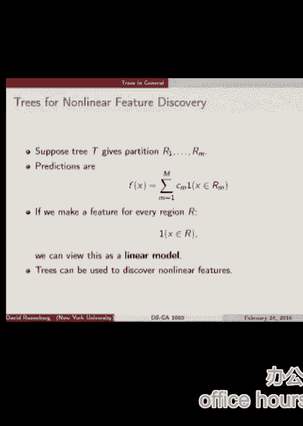

# P10：10.Feb_25_Lab - Tesra-AI不错哟 - BV1aJ411y7p7

好了。

所以今天我们要讲的是回归树，而不是分类树。你们有看过一些树吗？有些人看过？有些人没看过。好吧。那么，尽管今天是实验课，但实际上今天是一个重要的日子，因为这是我们第一次要做一个本质上是非线性的方法。对吧？

我们已经通过把非线性特征放入特征集的方式做过非线性了。但今天是我们第一次要做一个本质上非线性的模型。对吧？

预测函数不像W转置X或W转置ψ(X)那样。这些是完全不同的。所以，今天只讲回归树。我们将在下周初讲分类树。计划是这样的。好了。我们之前已经大致讲过这个。在回归树中。

你从一个输入X开始，一般一次只查看一个特征。所以，假设我们的输入是表示一张图片的向量。虽然这些决策问题不一定现实，但直观地看，第一个问题是：顶部部分是否是蓝色？如果是，往右走；如果不是，往左走。就是这样。

你通过在每个节点回答一个问题，逐步向下走树。每个圆圈都是树的一个节点。如果答案是“真”，就往右走；如果是“假”，就往左走。当你到达底部时，你会得到这些叫做叶子节点或终端节点的东西。在每个终端节点或叶子节点中，都会有一个单一的预测。所以。

任何输入如果最终到达相同的终端节点或叶子节点，就会得到相同的预测。不管怎样，如果是回归问题，预测值会是相同的数值。如果是分类问题，预测结果会是相同的类别。好了。明白了吧？因此，这和回归非常不同，因为在任何线性分类中。

你永远不会得到这种在某些区域内恒定的预测。它总是随着一些线性函数变化。所以，这些预测是分段常数的，因为在每个节点，你都在预测相同的东西，一个常数。当你跳到一个相邻节点或区域时。

它会跳到另一个值。所以它是间断的，并且在某些部分是常数的。好了。那么今天我们考虑的树是二叉树，分裂总是将空间分成两个部分。而且，这些分裂是基于一次只查看一个特征。所以我们不会有复杂的问题，始终是。

是一个特定的特征值，至少对于连续型数据来说，特征值小于或大于某个阈值。这就是我们要开始的内容。好了。正如我们在第二讲中提到的，这种类型的决策树会将空间划分。使用空间划分成不同的区域，每个叶子节点对应空间的一个不同区域。

为什么这些单独的区域都是矩形的，并且其边与坐标轴对齐，清楚吗？明白了，太好了。好，一旦我们有了这些区域，节点的划分，做出的决策就给出了我们的区域。然后对于每个区域，我们需要分配一个值。所以在回归中，我们将为每个区域分配一个数值。

在分类中，我们将分配一个类别。很好。那么这里是回归的一个示意图，在每个区域中，我们有一个不同的值，正在进行预测。注意这些区域内的值是恒定的。好，我们来稍微正式化一下。决策树将输入空间划分为若干个区域，我们将这些区域称为R1到RM。

所以我们处理的是M个区域。提醒一下，划分是一个不相交的并集，这意味着这些区域彼此没有交集，但是当你将它们全部联合起来时，得到的就是整个输入空间。好，模型的预测函数有一种方式是我们需要写下这个预测函数。

f(x)。一种写法是对所有区域求和。如果我们取一个点x，我们写下这些指示函数，指示x是否在区域M中。这个函数在区域内为1，其他地方为0。所以，显然，一个点只能位于一个区域，因为这些区域是互不相交的。

所以当我们对这些函数求和时，只有单个M对应的函数为1，其余为0。然后，f(x)的值将只是C(M)，即C子M，其中M是对应于x所在区域的编号。明白吗？你会如何描述一个特定的区域RM？

你会怎么写？它的形状是什么？对，它总是矩形的，或者在更高维度下是平行六面体，且其边与坐标轴平行。所以你可以写下这些区域中的任意一个，比如x1在3到7之间，x2在-5到5之间。假设我们已经给定了这些区域，我们如何选择C值来进行预测呢？

我们需要一个损失函数来确定我们如何进行预测，设定平方损失，因为我们处于回归场景中，这是最标准的做法。所以我声明，如果我告诉你空间的划分区域，很明显应该选择哪个C值来最小化总体的平方误差。你所要做的就是

我希望这点能清楚，一旦你把它与你们做过的一些作业问题联系起来，你们的做法是，查看某个特定区域（比如RM）中的所有训练点，然后对所有落在该区域的点的y值取平均，这样可以最小化平方误差。

这些区域中的点。明白了吗？这样清楚吗？

那些点的平均值最小化了y的平均值，从而最小化了预测y时的平方误差？这和你第一次作业时找到最小风险预测的计算完全一样，而你发现那是条件均值。好吧，均值就是一个平均值。

所以那是相同的计算。清楚吗？当然，对吧？对。这个是在Piazza上组成的。如果你不明白的话。假如有人给我们一个分区，我们知道如何得到CMs。那是一些点的平均值，在我们构建预测函数的模型中，我们通常在复杂性和拟合之间做权衡。

所以树的问题在于，如果我们做了大量的区域，那么我们可能会出现过拟合。假设你能在每一个点周围都有一个区域。如果没有重复点，你可以把每个训练输入点放在它自己的单元格和分区里。然后你当然可以把所有这些点都做得完全准确。你将获得零训练误差。

但是那样可能会导致过拟合。那么，我们如何去限制树的复杂度，避免树以那种方式过拟合呢？

所以一种方法是找到一个衡量树复杂度的指标并加以限制，或者可能对树的复杂度进行惩罚。所以我们通过树的叶节点数量来衡量树的复杂度。这个是非常合理的。因此我们将其写作t的范数。如果t是一个树，我们可以把它称为t的大小，比如说，它是终端节点的数量。

所以一种方法是设定一个最小复杂度的条件，比如说我希望树最多只有20个终端节点，那么在这个约束下，我希望找到一个最小化训练数据误差的树，尽量减少损失。所以这是一个很好的方法，我认为。只不过在计算上，我们无法解决这个问题。结果表明。

那我到底是什么意思呢？我们无法找到一个确切的某一大小的最佳树。所以，在计算上，这是一个算法性的问题，人们还没有弄清楚如何做到这一点。事实上，人们已经证明，几乎可以证明你不能高效地做这件事。那么我们要做的就是提出一个由这个思路激发的算法。

在找到最佳的某一大小的树时，情况也是如此。但我们不可能真正最小化，我们无法找到一个最佳的某一大小的树。好吧。所以我们采用所谓的贪心算法。基本上我们将一次构建这棵树，逐步添加一个新的节点。

一次做出一个决策。我们不会进行任何预判。那就是贪心算法的意思。好吧。假设我们的输入空间是D维的。好吧。每次我们分割时，我们选择一个坐标或特征，比如，X3之类的。所以我们选择一个特定的坐标，X3，然后我们会找到一个阈值。

或者我们称它为分裂点 S。 任何大于 S 的值我们将其分配到左侧，任何小于 S 的值我们将其分配到右侧。 好的。所以我们需要找到一个变量来进行分裂。 我用相同的几个词来描述同一件事。 变量、特征、坐标。 我说的都是 D 维输入向量中的条目。

好的。对于每个分裂，我们需要找到分裂点 S 中的变量。 所以让我们做一些符号表示。 让我们写下 R1，对于给定的 J 和 S。 J 是变量，S 是分裂点。 那么让我们让 R1 表示分裂左侧的所有内容，R2 表示分裂右侧的所有内容。

所以这将指代由特定的分裂变量和分裂点给出的分区。 好的。 那么，给定这个分裂和分区，我们知道如何找到每个分区的最优预测，对吧？

这是最终进入每个分区的 Y 值的平均值。 我已经在这里写下了。 所以 C1 hat，C2 hat。 这将是我们对 C1 的预测，表示进入 R1 的点。 C2 将是我们对 C2 的预测，表示进入 R2 的点。 对于一个特定的，任何给定的。

我已经将其写成 J 和 S 的函数，这样我们就可以将其作为函数复用。 有问题吗？ 符号表示。 好的。 好的。 好的。所以这是我们需要最小化的目标函数。 让我们盯着它看一会儿，确保我们理解它。

我们正在查看当我们对给定的分裂变量、分裂点和实际预测值 C1 hat 和 C2 hat 进行预测时，我们将犯的总误差。 所以我们对位于两个区域中的所有点进行求和。 所以在左侧，我们对区域一中的点的平方误差求和，右侧同理。

右侧是区域二中点的平方误差。 你会看到在第一个求和中我们预测的是 C1 hat，而在第二个求和中我们预测的是 C2 hat，因为这是两个不同的区域。 然后将它们加起来，我们得到整个联合区域的预测总误差。

这两个区域。 好的。 好的。有问题吗？ 好的。我来画个图。 好的。那么，假设我们已经选择了分裂变量。 好的。 那么，在这种情况下，问题是单维的。 一旦我们选择了分裂变量，假设我们选择了第一个坐标 X1。那么我可以这样画 X1。 好的。现在我们想要查看所有点在 X1 上的 Y 值。

所以假设我们有一些点像这样。 我将 Y 画成仅是 X1 的函数。 所以。 清楚吗？ 所以也许我们的原始输入向量是 100 维的，但我们选择了一个分裂变量，假设是第一个 X1。 所以我只画了每个点的第一个坐标，然后在 YX 上我画出了我们试图预测的值。 好的。

所以我们需要找到一个拆分点以及C1的估计值和C2的估计值。那么我的拆分点应该在哪里？

好的。好的。我的预测值应该是多少呢？嗯。好的。这是C1。这是R1。这是R2。这是C1的估计值。C2的估计值。好的。太好了。所以我们是通过眼睛做的。给大家的问题是，你们怎么实现这个呢？有没有办法高效地实现它？

我们如何找到拆分点？换个方式说，我们是否必须检查所有可能的X1作为拆分点？为什么不呢？是的，因为它在各个点之间是一样的。如果我们将拆分点放在这里、这里、这里、这里，预测值或者损失并不会发生变化。对吧。所以拆分点。

唯一需要检查的可能拆分点是，当我们进行拆分时，正好在某个数据点上。好吧。所以，如果有结束数据点，我们需要检查可能的拆分点。但也许这并不太糟。一旦我们选择了拆分点，怎么找到平方损失？这其实很容易。我们有一个拆分。预测值。

我们需要预测值。所以，这就是所有左侧点的平均值，右侧点的平均值。现在你可以想象，从我的计算机科学角度来看，可能有高效的实现方法。比如，可能你想对这些数据进行排序，从左到右遍历，可能这样计算会更简单。

它们的平均值随着点的移动而变化。总之，如果你要实现一棵树，可能需要考虑或者Google一下高效的实现方法。但关键的思想是，只需要检查数据点是否存在可能的拆分点。好的。所以这个过程告诉我们如何找到一个拆分。我们做了X1的拆分。

然后你会做的是，对X2进行处理，对X3进行处理，一直到X100，然后试一试所有点，看看哪一个给出的平方损失最小，那就是你选择的拆分点。这样就解决了这个最小化问题。所以我们做了一次，得到了第一个拆分点，然后呢？

好的，现在我们已经获取了所有数据，并将其一分为二，部分数据现在在R1中，部分数据现在在R2中。接下来发生的是，你递归地重复相同的过程。你说，好吧，让我取R1中的所有点，然后做完全相同的事情。也就是仅对落在R1中的点子集进行拆分并继续处理。

递归地，然后对于R2做同样的处理。然后唯一的问题是，什么时候停止？

所以有几种方法。一个方法是，你在某个点停止，以避免树变得过于复杂。如果你去得太深，那么你会得到一个非常复杂的树，可能会出现过拟合。那是一个可行的方法，你可以找到实现它的方式。我们将采用另一种方法，那就是建立一颗非常深的树。

太大，超过了第五个节点，但然后你修剪它，抛弃一些分裂点。这通常被发现更有效。因为它是一个两步过程，所以需要更长时间，但这个方法叫做CART（分类与回归树），效果相当不错。好的，这就是我为你表演的递归过程。

所以我们将使用的方法是，先建立一棵非常大的树，然后再修剪它。例如，停止标准可能是将树构建到每个区域有不到五个点为止。所以继续分裂，直到我们得到少于五个点为止。这个术语中，内部节点是分裂节点。

终端节点是叶节点，它们对应于我们讨论过的分类预测节点。但现在，子树是什么呢？如果 t0 是我们的完整树，向外延伸直到每个节点最多有五个点，那么 t 就是它的子树。这只是意味着我们将区域合并在一起。所以如果这是一个完整的树，你可以看到它变得非常小，并且这些分裂位于底部。

所以子树会是，比如说，如果我们将所有这些区域合并起来，并且只做一个决策去向左。也就是说，合并这些决策，告诉自己不，再也不进行最后一次分裂了。我会把这些区域里的任何东西都合并在一起，并且对所有这些内容做出相同的预测。那就是子树。

所以它实际上就像是这些分裂的内部节点的一个子集。这就是子树。所以我本应修剪一棵大树 t0。让我们回到之前提到的经验风险概念。所以我们的经验风险是你训练数据上的平均损失。我们可以根据经验风险来评估一棵树，是的，请。你能再说一遍吗？

子树包含这些内部分裂节点。我的意思是，每棵树总是会最终达到叶子节点。我的意思是，数据中的内部节点仍然是子树。如果我们还想要左侧的第二个节点。是的。如果我们保留这个分裂节点，那么我们仍然会有右侧的这两个叶子节点。你没有左侧的四个叶子节点。没错。这样也没问题。这就是子树。

那是一个子树。它是当我们去掉底部的部分时形成的。子树总是去掉底部的东西。你能再说一遍吗？你保留了根。对的，你。 所以子树总是会保留根节点。有时候它会继续向下延伸。这个概念是，树的上半部分是最重要的部分。

然后当你深入下去时，它在做精细的处理。所以你可能想丢掉这些精细的处理，因为这些低层次的内容可能会导致过拟合。是吗？

所以这个子树应该仍然覆盖整个输入空间。是的。在任何层级上，我们总是覆盖整个输入空间，因为任何一个点总是要么向左，要么向右。所以它总是会出现在某个地方。是吗？为什么这棵树这么不平衡？

为什么他们这样画？我也在学同样的东西。我不知道。我想是因为他们没有特别为这本书画图。他们可能用了某个不太好的树形图绘制软件。或者可能它很棒，确实有某种优秀的原因，为什么他们是这样画的。

但是我不太了解那个原因。那是一个相当随机的问题。好吧。还有其他问题吗？

好的。那么，t-hat 是树 t 的经验风险。假设我们在做平方误差。好。那么让 t 是 t-not 的一个子树。当我们取一个子树时，经验风险是会上升还是下降？经验风险会增加，因为我们去掉了底部的细分。

你有越多的分裂，你就能得到更好的预测。所以如果我们把这些去掉，经验风险会稍微变差。我们的 t-hat 比 t-not 稍微差一点，如果 t 是 t-not 的一个子树。好吧。那 t 的大小就是我们衡量复杂度的标准。所以我们有了复杂度的衡量标准，也有经验风险。所以我们觉得我们可以做常规化，对吧？

这就是这个成本复杂度标准。我们有 t 的 t-hat 加上 alpha，我们的正则化参数，乘以 t 的大小。所以这是……我们称之为 T-conoff 正则化或者惩罚经验风险最小化。所以有一个问题，因为我们之前做了什么事情呢？

我们的第一步是尝试最小化这个梯度，对吧？梯度下降。通常我们有一个 W 向量的参数，我们在这里对它进行求导。这里有一个 T 到树。我们可以对树进行求导。预测器的空间不是连续的。

所以这种方法行不通。好的。所以这个方法基本上是先建立一棵大树，然后每次去掉一个节点进行修剪。每次我们去掉一个节点，它就变得稍微小一点，变成一个子树。我们看——所以会发生两件事。当我们移除一个叶节点时……

当我们去掉一棵树的一个分裂时，复杂度是——当我们从树中移除一个分裂，复杂度是增加还是减少？对的。经验风险增加，完全正确。那么，我们可以继续这样做，直到我们移除每一个节点，一直到根节点。这会给我们一个树的层次结构。那么，这个是怎么工作的呢？

我们的第一步是找到一个子树 T1，它最小化 T1 减去 T0 的经验风险。那是什么意思？所以我们想找到一个比 T0 小的子树，但是它具有最佳的经验风险，并且仍然小于 T0。基本上，这意味着你移除一个单一节点，一个单一的分裂，而这个分裂你移除的是……

对你的经验风险造成最小的损害。所以这就是 T1。然后我们继续，我们找到 T2，以此类推，直到我们只剩下一个节点。这是树的层次结构。然后你可以查看——例如，每棵树在验证集上的表现。

这些树并选择表现最佳的那棵。这就是一种方法。是吗？

[听不清楚]，我们使用贪心算法来构建树。[听不清楚]，那么问题是。我们放置节点的顺序，和它们打印出来的顺序一样吗？不。首先，我们放置它们的方式没有顺序。所以我们做了一个拆分。我可以选择先拆分右侧或左侧。是的，所以拆分没有顺序。

是的。好的。好的。我们得到了这一组树，它们是嵌套的。因为我们一次删除一个节点，所以每棵树都是我们刚刚得到的那棵树的子树。所以 T sub n，这是原始的——不。T sub 0 是原始树。T sub 1 是——我们删除了一个节点。T sub 2 是删除了两个节点。

如果有 n 个节点，我们就会得到 n 棵树。然后有一件非常了不起的事情。比如 Leo Brimen，他是一位统计学家，也是树的发明者之一，他还发明了随机森林，稍后我们会讲到。我们证明了这个相当惊人的事情，就是我在这里写的这个目标——所以，找到一个能够最小化这个目标的树，针对特定的 alpha 总是会给你。

在这组树中的一棵树。所以这是我在数学中写的内容。对于所有树的论证，其中 T0 是完整的树——T0 的所有子树，这个 alpha 惩罚的经验风险，无论你设置哪个 alpha，你总是会得到。最终会得到一棵树，它在这个修剪的树的层次结构中。

所以这证明了——如果你相信这种方法，就是通过节点的数量来惩罚，假设惩罚是节点数量的 alpha 倍。那么我们可以尝试不同的 alpha。好吧，这就等同于做这种贪心的——是的，这种贪心的节点修剪，并且选择，那个——所以在这些树之间选择是一样的——选择表现最好的。

这就等同于选择一个 alpha，使得在验证集上表现最好。对此有任何问题吗？

是的。[听不清楚]，哦，我明白了。所以这个定理是关于我们如何修剪树的。所以你从树开始。你可以按照自己想要的任何方式构建它。然后这种修剪方法，通过逐步修剪一点点，尽可能少地损害经验风险，这给你一个树的层次结构。是的。

具体来说关于这个方法。这里有一个小的图，类似我们之前见过的正则化类型曲线。在 x 轴上，我们有两个标签。我们有 alpha，这个惩罚正则化项和我们最终得到的树的大小，对于特定的 alpha。而在 y 轴上，粗略来说，我们有误分类率。

所以在这种情况下，随着树的增大，误分类率变小。所以我有点困惑——对我来说，这个曲线挺有意思的，而且有点。让我感到惊讶。有人知道为什么我对这个曲线有点惊讶吗？

所以这个应该是绘制测试误差的图。是的，我会期待它最终会过拟合并上升。挺有意思的。也许是数据集的某些特性或者——我不确定。我可能会去查看一下，看看那里的情况。挺有趣的。这是《Hasty Tiptroni Friedman》一书中的内容。顶部的数字是什么？是的。

所以这些是alphas。alpha是我们惩罚树大小的程度。所以大惩罚，alpha为176对应的是一棵非常小的树。而小的alpha则是完整的树。是吗？

它们如何映射回alpha？它们如何——你知道数字，你知道树的大小。好的，问题是——你选择alpha，然后你找到——你可以遍历这组树。对于每一棵树，你查看其代价复杂度标准。所以我们评估——你可以挑选每一棵。你设置选择一个alpha。

然后你将每棵树都通过这个表达式运行，并评估其C alpha T。这会给你一个数字。你选择具有最小值的树。这就是在训练集上的训练数据中对该alpha值最优的树。不，好的，明白了。那么，我们跳过分类树的部分。

关于回归树，有问题吗？[听不清]，[听不清]，是的。问题是划分变量是否可以重复？完全可以。是的。[听不清]，是的。问题是划分变量是否可以重复？完全可以。是的，嗯。是的。[听不清]。没错。问题是，如果我们使用贪婪方法，那我们就是这么做的。

第一步的划分选择，那个从第一步看起来最好的划分，可能会导致一个整体比选择其他划分更差的树。虽然在第一步不是最好，但出于某些原因，整体的树却更好。是的，这完全正确。没错，这正是我们不知道如何操作的地方。

找到最优解，所以我们改为使用这种贪婪方法。是的。[听不清]，嗯。这是一个计算问题。有没有什么计算新预测的捷径？每个终端节点根据划分来进行？这是个好问题。我不知道是否有办法做得更优化。我不确定。[听不清]，我是说。

事实是，一旦你——我不知道是否有更好的方法，因为你在查看划分某一特定点集时。这是你第一次仅仅查看这一点集。所以你必须查看每一个点来决定如何划分它。

所以当你进行搜索时，你会有平均值。无论如何，正如你所说，为了分割数据，你已经在计算你想要的值。无论如何都会对这两个分裂进行预测。是的。不？好的。是的。[听不清]，不，我不知道。并不完全是。所以，嗯，现在，我是说，我称之为“嵌套树序列”。但是，我不知道它是否。

我不知道更高或更低，我的意思是，我会说更高或更低的复杂性。但也许是。更多问题？是的。[听不清]，哦，这是个好问题。所以你认为这可能比我们使用过的其他方法更贵吗？[听不清]，好的。这个问题很好。你们有任何想法为什么你们可能想使用树吗？

[听不清]，好的。所以是非线性的。所以这是我们发现的第一个为我们发现非线性的方法。这很好。它可能是可解释的。你可以看一棵树并且说，你可以向某人解释它，对吧？我们有这个。如果他们玩耍的年数少于4.5年，我们会预测5。

11，并且它小于100，17.5，你可以看一棵小树并理解它。现在树必须足够小，才能在任何实际的方式中做到这一点。所以很多人把可解释性作为树的一个优势，但另一方面。在许多数据集上，当你实际尝试一棵树时。

最好的树通常是很大的，并且并不太具有可解释性。所以这个是值得质疑的。但是至少一棵小树是非常具有可解释性的。好的。那么，也许还有一两个我们稍后会讨论的原因。还有其他问题吗？是的。[听不清]，是的。[听不清]，好的。那么问题是。

我们可以使用测试数据来决定分裂吗？嗯，如果你考虑一下，那基本上就是用测试数据进行训练。[听不清]，最佳分裂。所以这是一个折衷。所以你说，我不理解。那么对于每个变量，你是什么意思的最佳分裂？

每次，最佳的分裂变量或他们的分裂，最佳的分裂点，或者你有什么想法？

[听不清]，好的。[听不清]，好的。[听不清]，哦，你是说这个？好的。我想我明白了。所以你是说构建你的树，直到测试误差开始减少？[听不清]，好的。这个是一个有趣的停止条件。那可能是合理的。另一种方法是，你可以基于测试数据对树进行修剪，也许。是的。

总是有一个棘手的权衡，关于你想使用多少测试数据来选择你的模型。或者我一直在说测试数据，它实际上是指验证集，对吧？所以你使用的越多，你就越容易导致验证集过拟合。所以有一点。

这有点像是权衡。是的。对。[听不清]，你打算用哪个？[听不清]，不。我是说，我并不决定是否要重复它。每一次我都会寻找最佳的选择。如果恰好是我以前使用过的那个值，也没关系。[听不清]，是的。所以我在这里处理的是找到一个特定拆分变量的拆分点。

所以我们找到最佳的拆分点和预测结果。然后我们尝试下一个变量。这是X1。然后我们尝试X2。一直到X100。所以我们尝试了所有一百个拆分变量。然后我们找出那个给出最佳损失的变量。这个过程相当昂贵。对吧？好的。好的。所以，一件人们喜欢树的原因，另一个人们喜欢树的原因。

是因为你有一种相对合理的方式来处理缺失值。好的。那么到目前为止，我们还没有讨论当缺失某个值时该怎么做。缺失某个特定特征的值。好的。那么树有一种方法，这是内嵌在树的定义中，人们在描述树时提到过的。所以，好吧。那么一般来说，缺失特征时该怎么办呢？你可以做的一件事就是直接说。

好的，这个输入示例不可用。它缺少一个特性。所以我们将其丢弃。好的。还有一件事你可以做的，或许可以说是一个不错的做法，就是填补缺失的值。填补缺失的值意味着猜测它是什么，然后直接填入一个值。所以你可以用很多方法来做这件事。最简单的方法就是替换掉缺失的值。

用该特征在其他具有该特征的数据点中的所有其他值的平均值。树有另一种方法。你可以做一种叫做代理拆分的方法。所以基本上，代理拆分是针对每一个拆分变量。每一个拆分，假设我们选择了x1作为拆分变量。现在我们进行代理拆分，这意味着找另一个变量来代替它。

在树的同一位置，我们将其作为备选方案，以防x1缺失。那么这意味着什么？我们希望，假设我们已经搜索并找到了树中特定节点的最佳拆分。那么在此之后，我们就会说，好，现在我们需要制定备份计划，处理x1缺失的情况。所以我们再次搜索所有变量，然后从x2开始，假设是这样。

然后我们将看看如何利用x2在尽可能接近我们从x1得到的拆分的情况下，进行拆分。明白了吗？基本上我们有x1的拆分，所以某一组数据点在右边。现在我们使用x2，并说，好吧，我们能用x2得到多少接近于x1的拆分？

或者我们可以用x3吗？你看看每个变量在近似拆分时能得到什么样的结果。你按这些近似拆分的好坏来对它们排序，这就是你在处理缺失特征时使用的顺序。这是一个概念的框架。你试图复制数据点的拆分吗？是的，试图复制拆分。是的。这个过程会检查所有特征吗？是的。是的。

你检查所有特征，看看哪个特征能够提供最佳的分裂近似。是的。所以那就几乎更像是一个分类问题，对吧？

我们需要找到一种方法，将所有之前向右移动的特定点，通过我们正在划分的这个其他变量，继续向右发送。好的。好的。那么，先生，很多实际应用中，你可能不会经常自己构建树形结构的软件。但是，大多数树形算法软件已经内置了平滑处理缺失数据的功能。

那么，未来我们将通过提升方法（boosting）和随机森林（random forest）构建树的集成。因为它们使用树作为基本单元。当你将树进行组合时，只要你使用的树能够处理缺失值，这些集成方法也能够以相同的方式处理缺失值，这点很好。

好的。好的。那么，从有多个常数点开始。我是说，代理分裂，你必须做一些工作来找到最佳的代理分裂。所以一些树形算法会在某些情况下这样做。是的，我跳过这个。是的。[听不清]。我没听清楚。你能重复一下吗？[听不清]，如果我们知道f(x)的范围，那么我们...

然后我们可能会使用树形算法。[听不清]，我们决定了有y值。[听不清]，每次分裂时我们都会遍历整个数据集。所以是的，我们确实需要知道每个分裂部分的范围以及平均值。是的，我们一直在触及这些y值。肯定的。是的。好的。

这里是树形算法和我们之前做过的其他方法之间的另一个重要区别，可以说是一个关键区别。它们能够轻松执行哪种类型的预测函数？我说的“轻松”是什么意思？“轻松”指的是低复杂度。所以如果我们通过树的叶节点数量来衡量复杂度，那么我们来看一下这张图。上面两张图，我们有两个区域。

这仍然可能是一个回归问题，所以绿色可以是1，黄色可以是负1。所以在使用线性模型时，很容易有一个预测函数，你可以想象一个预测函数——。我们说它是支持向量机（SVM），所以我们对预测函数进行阈值处理。这样，预测函数就可以轻松地匹配这条线，并且完美地分隔这两个区域。

但是，用树形算法得到这条对角线是非常困难的。它必须进行很多次分裂，才能近似地划分这个类别之间的对角线。而在线性模型中，处理这些框形区域时，线性模型很难将区域分开。它会产生错误，而使用树形算法则能够准确地分开它们。所以，是的，没错。

所以确实有可能存在对树和线性模型都很难处理的区域。是的。所以——嗯。我的意思是，这就是另一种类型的非线性。你只需要——你可以通过树的多个划分来近似它。对于线性模型，你只有在输入空间中构建更多非线性特征时，才能获得非线性效果。

所以——好吧。那么总结一下——我们讨论了可解释性作为人们喜欢树的一个原因。这里有另一个原因。树可以用来发现你想在线性模型中使用的非线性特征。这很有趣。那么假设你拿到一些数据，构建了树，并且它很慢，花了很长时间。但最终，你会得到这个预测函数，它把我们的空间划分成了这些区域。

所以，你可以将这些区域作为线性模型中的特征。对吧？

所以这些区域中的每一个都可以作为二元特征使用。这个X是否在由树的坐标不等式序列描述的区域RM中？

那将是一个特征。你可以把所有这些非线性特征拿出来，或者挑选出你认为最有用的特征，然后把它们丢进Lasso回归或其他方法中。这是一种自动构建非线性特征的方式，而这些特征可能实际上对你的问题非常有用。

但是接下来将它们放入线性分类器中。那么，为什么下次我们可能要这样做呢？

我们快结束了。为什么你可能想这样做呢？也许对所有数据进行训练对于树来说太昂贵，因为树很慢。好的。那么，也许可以取一部分数据，构建你的模型，并获取一些有用的非线性特征。然后将这些特征放入Lasso回归中，利用全部数据进行训练。这是一个可能的应用场景。好吧，好的。我想今天关于树的内容就讲到这里，反正时间也快到了。

所以，如果你要继续待在下班后，我到时候见。

否则，我将在星期三见到大家。[BLANK_AUDIO]。

