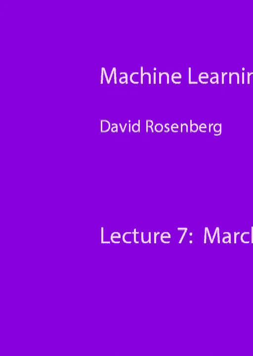
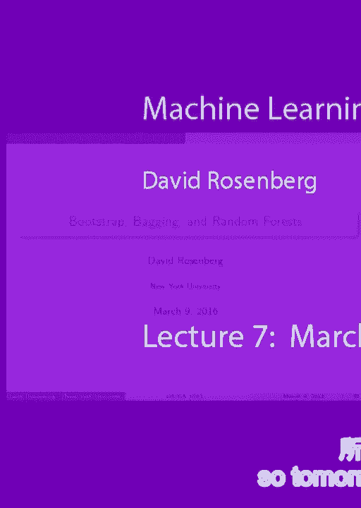
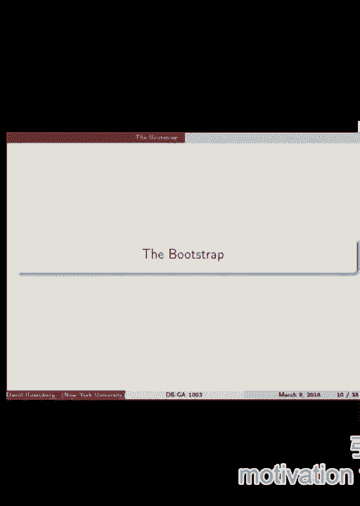

# P12：12.Mar_9_Lecture - Tesra-AI不错哟 - BV1aJ411y7p7

好的，明天将是第一次与项目顾问的会议。

你们现在应该都知道自己的项目顾问是谁了，要么通过Piazza发布，要么通过邮件。Brian D'Ausandro他实际上不在城里，所以他会通过Skype或视频聊天安排单独的预约。希望你们小组与Brian之间有一些沟通。自然。

Chin不在国内，所以你将与他进行视频聊天。但其他三位顾问都在这里，明天你将与他们见面。这将是一个五分钟的想法陈述。你会得到即时反馈。如果你必须在八点离开，请提前告知大家，以防有延迟。

你可以先来。好的，关于明天的项目就说这么多。现在让我们讨论一下今天的话题——集成方法。今天的重点将是随机森林，我们可能会稍微谈到一些boosting技术。但在这个过程中，我们会讨论一些叫做bootstrap的统计技术。

这就激发了bagging方法，实际上我们会讲到的随机森林方法。好了，我们从回顾偏差和方差开始。首先，什么是参数？

现在我们进入统计框架和统计词汇了。参数是分布的一个函数。所以我们有一个概率分布P。我们希望估计这个分布的一些特征。我们知道分布的哪些特征？是的，均值、方差、中位数、偏度。

分位数。整个分布本身也可以是一个参数。它仍然是分布的一个函数。好的。我们把这些称为参数。我们可以用μ = μ(P)来表示，表明μ是作用于分布本身的一个函数。

统计学的许多内容都是关于估计参数的。好了，那么什么是统计量？如你所料，在统计学中，我们总是有这个数据集，记作D。所以我们有一个样本，比如说，独立同分布（IID）来自分布P。统计量就是数据的一个函数。所以统计量S是我们数据样本的任何函数。好的。

如果一个统计量的目的是估计一个参数，那么它就有了一个特别的名字。我们说统计量是点估计量，例如μ帽（mu hat），它是数据的一个函数。它是μ的点估计量，而μ是生成数据的分布的一个函数。μ帽大约等于μ，但可能略有不同。

如果我们把μ帽（mu hat）当作μ的估计量，那么我们说它是μ的点估计量。给大家普及一点非常基本的术语。好的，假设我们有一个实值参数。我们提到的大多数内容都是实值的。均值、标准差，这些都是数字，实值。它们不一定非得是实值的。

一个参数不仅仅是一个实数值。它本身可以是一个函数。它可以是一个数字对。无论如何，但在这种情况下，实值参数。mu hat 是 mu 的实值估计量。当我们有实值估计量和参数时，我们可以做一些事情，比如讨论偏差和方差。所以我们定义 mu hat 的偏差。

你们应该知道，这个是估计量的期望值与参数的真实值之间的差异。这有意义吗？

所以 mu hat 的期望在某种程度上依赖于 mu，对吧？

Mu 是我们在计算期望时使用的概率分布的一部分。所以这些东西，期望就是 mu 的作用所在，mu hat 的期望等于 mu。然后我们就处于一个叫做无偏的情况。所以零偏差。好吧。mu hat 的方差就是估计量的方差，方差的定义。好的。

无偏是指偏差为零。所以这是我想要说明的一点。就是偏差和方差都不依赖于特定的数据样本。并不是说我们从概率分布中抽取了一个数据集，然后我们说：“哦，这个数据集的偏差是多少？方差是多少？”不。

偏差和方差依赖于函数是什么，mu hat，统计量是什么。点估计量的实际函数是什么，分布是什么，P。所以，这一点之所以会体现出来，是因为在偏差和方差中，没有直接引用 DN，我们是在对数据集进行期望运算。好的。

所以期望是随机的，而不是数据集是随机的，或者我们是在对数据集进行期望运算，就好像我们将在下一张幻灯片中看到的那样，当我们讨论如何估计它时。好的。那么我们如何估计 mu hat 的方差呢？

你会看到它包含了 mu hat 的期望和 mu hat 的平方期望。所以我们来估计这些东西，然后我们只需要相减就能得到方差。好的。好的。那么我们通常怎么做呢？当我们想要估计经验风险时，我们该怎么做？

它是预期损失，对吧？所以我们有这个期望，并且需要根据某种概率分布来计算它，但我们并不知道概率分布。所以我们有一个技巧，对吧？

这不是技巧。这就是统计学中发生的事情。是的。好的。所以我们会有我们的数字。我们没有分布，但我们有从分布中抽取的样本。所以我们称之为 D。所以这里 DN 是样本量 N。现在我们就来对一堆数据取经验平均值，并说我们将进行估计。

期望值。好的。让我们看看如何在这里应用这个推理。所以，代替一个单一的样本**D sub N**，假设我们实际上有B个独立的样本，每个样本大小为N。所以我们可能有一个生成分布。我们从这个分布中抽取一个大小为N的样本，称之为**D1 sub N**。再来一个，称之为**D2**。我们取B个这样的样本。好的。那么我们想要的是。

所以**μ hat**的期望值是从**μ hat**中得到的期望值，假设是从随机选择的D中得到的，但我们通过随机选择B个数据集并取平均来估计。好的。那么这看起来是什么样的？

**μ hat**的期望值大约等于B个数据集上**μ hat**的平均值。明白了吗？那么，**D sub N superscript I**中有多少个元素？那是什么？对吗？这个**DI sub N**本身是从分布中抽取的大小为N的样本。我们有B个这样的样本。好的。

好的，明白了。所以这是我们如何在一个假设的世界中估计**μ hat**的期望值的方法，这个世界里我们从这个分布中获得了B个重复样本。我们可以估计**μ hat**的期望值。类似地，我们可以做**μ hat**的平方。好吧。然后我们得到了这个公式来估计**μ hat**的方差。那么估计我们估计量的方差有什么用呢？为什么这有意思？

对统计学家或任何人来说呢？所以我们有一个想要估计的**μ**。我们有这个点估计量，这个点估计量的公式说的是，给我一些数据，我会告诉你如何得出**μ**的估计值。这就是数据的**μ hat**。那么我们为什么关心**μ hat**的方差呢？对吗？

如果我们只是想看置信区间。那么它不仅仅是，**μ hat**是一个点估计量。但是有时候我们需要的是所谓的区间估计量或置信区间，在这种情况下，我们不仅仅说**μ hat**，而是给出一个范围，比如说，它是**μ hat**加或减5%，加或减任何值。所以正是这个加或减给出了范围，让我们可以有一个把握。

这就是我们为什么关心方差。所以，**μ hat**的加或减大概是多少，涉及到**μ hat**的方差？

所以应该是**μ hat**加或减。好的。那么1.96或什么的，乘以什么？

**μ hat**的标准差是什么？就是说，涉及到方差的平方根。好的。那么**μ hat**的方差并不是我们需要的单位。我们需要的是**μ hat**的标准差，也就是方差的平方根。好的，明白了。好的。那么我们有了这个估计量**μ hat**，我们稍微谈了一下我们可能如何处理它。

以某种方式得出**μ hat**的方差。如果我们想要理解某个估计量**μ hat**的整个分布，该怎么办？

好的。那么我们该怎么做呢？好吧。假设我们在这张图中看到的是我们抓取了1000个数据集，每个数据集的大小是100。好吧。所以你得到一个大小为100的数据集，这就是其中之一。我们这样做了1000次。对于每个数据集，我们估算这个点估计量，现在是alpha hat。好吧。现在是alpha hat。对于那个特定的数据集，alpha hat有一个值。

所有的数据集都是由相同的概率分布生成的。好吧。所以alpha hat我们试图估算的是alpha of P，即我们要估算的概率分布的参数。这个每次都是相同的。由于我们抽取的数据集是随机的，alpha hat会每次稍有不同。

然后我们可以绘制从所有不同样本中得到的所有alpha hats的直方图。所以这就是这个直方图所展示的内容。所以粉红色的那条中间紫色的线，就是alpha的真实值。然后我们看到，它围绕真实值有一些分布。好的。那么如果我们有了这个，我们能否估算标准差？是的。大致是这样的。

但关键是，这比仅仅使用标准差或方差提供了更多的信息。这是alpha hat整个分布的估算。好吧。好的。那么一切都很好。我们沿着这个路径走，使用大小为N的重复样本。但在现实生活中，我们通常只得到一个大小为M的样本。

所以你知道，如果我们想获得方差估算，我们可以例如将样本大小为N的数据集分成B组。然后对每个小组进行估算，再得到方差。但问题是，如果我们把这个数据集分成...

如果我们拿样本大小，然后将其分成小组，确保它们是独立的，那是没问题的。问题是，单独的小组很小，如果我们能一次性使用整个大小为N的数据集，我们会得到更好的估算。所以我们一次性使用它，但我们没有显而易见的方法来得到方差。

如果我们将它分成小组，我们可以得到方差的估算，但这个估算是基于非常小的组。所以听起来并不太好。那么问题是，我们能否以某种方式得到两全其美的结果？你可以从整个大小为N的数据集中获得一个估算，并且还能够有一些关于它的方差的估算。是的。

好的。好的。所以bootstrap方法，这就是bootstrap的动机。没错。是的。

好的。

你的问题。那么会发生什么呢？所有这些每个点下划线的直方图是基于大小为100的样本的alpha hat值。那么问题是，如果这个样本的大小是10,000，会发生什么？我非常喜欢这个问题。那么在这种情况下，这个直方图会是什么样子？

好的。所以很多东西会变得更窄。它会选择一个变异，这个分布的标准差变得更窄。是的。对。为什么？那是什么原因？想一想，估计更好了。是的，估计变得更好了。估计趋向于你期望的值。希望如此。这就是一致性。是的。还有其他问题吗？在这种情况下。

我们怎么说自助法的标准差是多少？

所以如果你找到了数据的数量，如果每个都不同，它们不会像那个一样快。好的。是的。所以这是每个样本的大小是100。如果你想要它，如果你的原始数据集大小是100，你就有了你的估计。你对该数据集有了你的点估计，alpha hat为100。

现在你想知道这个的方差是多少？好的。现在，为了做到这一点。你可以想象你取了更多大小为100的样本，然后你查看这些样本的方差。这个回答了你的问题吗？我的意思是。如果我有最大小，10,000，然后我使用它，我有两个项。

这个数据集大小是100。不是。你说10,000。不是，不，我认为是10,000个随机数据集，每个大小为100。好的。所以自助法大小为10,000。不，没错。10,000。B等于10,000。是的，B等于10。好的。所以像我用10,000，他用了100,000。是的。好的。不。那么会发生什么呢？当n变大时，这个东西会变得更窄。所以这个100被替换为10。

000。当B变大时会发生什么？我们有更多的自助重抽样。你们认为这时这个直方图会发生什么？再说一遍？是的。是的，还是一样，但更平滑。所以基于100大小样本的alpha hat的分布，那与什么都没关系。那只是一个分布。我们通过取很多相同大小的数据集来估计这个分布。

我们取更多相同大小的数据集时，我们对该分布的估计会变得更好。所以，如果我们有一个更大的B，我们可能会把这些箱子做得更小，它会显得平滑。这就是发生的情况。好的，问题很好。好了，接下来是自助法。首先让我定义一个自助样本。一个来自数据集DN的自助样本。

是一个大小为N的样本，从DN中带放回地抽取。所以想象一下一个装有你在原始数据集中所有样本的桶，最初样本的大小为N。然后你伸手进去，抓一个并记录下来，然后把它放回去。然后你再次伸手进去，随机抓一个，记录下来，然后放回去。

然后你做N次。这将给你从原始样本中得到的所谓的自助样本。所以使用自助样本会发生一些有趣的事情，因为它们是带放回的抽样。所以我们会有重复，是吧？

我们也会有原始样本中的项，在我们的重抽样中从未被抽取出来。我们可以计算这种概率。让我们来做吧。所以原始样本中的每一项，每次我们伸手去抓它时，都有一个概率我们没有抓到它。一减去1除以N。对，没错。每次我们伸手去抓它。

这是一个独立事件。所以我们永远不抓到它的概率，在N次尝试中是1减去1除以N的N次方。好吧，那是什么？对，差不多。是的，完全正确。没错。随着N趋向于无穷大，这个值会收敛到1除以E，约等于三分之一。完全正确。回到最后。所以，未被抓到的球的预期比例大约是。

每个自助样本中三分之一。所以这些自助样本肯定是有一些多样性的。每次我们去抽时，可能大约有70%的重叠，但不是完全的重叠。好了，这就是自助法。这是它的一个简短示意图，尽管我认为已经很清晰。如果原始数据集在左侧，数据集大小为三。

三个关于X和Y的观察值。第一个自助样本重复了第三个观察值两次。第二个样本完全缺失。第二个自助样本包含了所有的观察值。所以这完全相同。最后一个样本则有两个重复的三缺失。所以B等于三。三个自助样本，是的。

那么为什么我们要选择与原始数据相同大小的样本呢？好吧，我认为之前的讨论中动机已经很明确，因为在这里，我们有一个固定的数据集大小。它的大小为100。我们想知道，在大小为100的数据集上，alpha hat的表现如何。因此，我们所做的是从原始分布中抽取多个大小为100的数据集。

基本上，它们大小相同这一事实是从整个讨论中得出的。而现在，我们不再说这里，而是说我们是从原始分布的数据集中抽取样本。我们并不是说这样做，而是说，我们实际上做不到这一点。于是我们决定从样本分布中抽取自助样本。

还有别人对此感到困惑吗？为什么它是等价的？

为什么讨论自助样本大小与原始样本相同有意义？

对。你基本上通过有放回抽样来保持概率分布，但仍然抽取大小为n的样本？我们希望回到这个，仍然保持相同的抽取概率，或者其他什么的。这就是放回去抽取大小为n的意义吗？好的。那么，首先，为什么我们要选择大小为n？首先假设我们希望样本大小为n。

你需要放回去，否则你每次都会得到完全相同的东西。如果你不放回去，你得到的就是整个数据集，不是一个不同的样本。它和原始数据集是一样的。明白了。好的，那么问题是，为什么样本大小是n呢？我猜。

哦，我是在说，这就是为什么你会把替换和样本大小n结合起来。尝试得到正确的分布。我们希望样本大小是n，但也希望有一点多样性，因为我们希望假装自助样本就像是从概率分布中抽取的一个新样本。虽然它实际上是从样本中提取的自助样本。

所以，是的，这就像是在模拟，我们希望假设自助样本大致相当于从原始分布中抽取的一个新样本，大小为n。这是目标，虽然这个想法看起来不完全令人信服，但也许是合理的。你是在说，生成一个样本从原始分布中抽取会更有效吗？

哦，明白了，这很有意思。所以如果我理解正确的话，你是说，你拿到样本，然后建立一个模型，将模型拟合到样本上，然后再从模型中生成数据。对，这个方法有个名字，叫做参数自助法。很有意思。好的，不过那是不同的，是另一回事。对的，但那确实是一个实际的方法。好吧，明白了。

所以自助法我之前提到过。自助法是指你通过从样本Dn中使用B个自助样本，来模拟从分布P中得到B个独立样本的情况。好的，这一讲的整个第一部分就是如果我们能从概率分布中得到B个独立样本，我们就能做一些很酷的事情，比如估算方差。

我们之前说过，我们并没有真正的B个独立样本，而自助法的意思是说，这可能没问题，为什么不直接从原始分布中抽取B个自助样本，然后把它们当作是从原始分布中独立抽取的样本来处理。好了，我们有了原始数据Dn，我们制作了B个自助样本，我已经写出来了。

这里的D不是脚本D，而是常规的D，用来表示自助法。然后对于每个自助样本，我们计算一些函数，应该是统计量。我们就把它们当作是从P中独立同分布地抽取的样本来处理。所以惊人的地方在于，这通常能非常接近从原始数据分布中得到的新样本的结果。

这一方法之所以有效，我觉得很令人惊讶。它的理论依据既有通过实验的经验验证，也有通过相当复杂的数学理论支撑，虽然我们不会深入讨论这些。不过作为一个实用工具，它非常有效。接下来是一个插图。

所以我要重复一下我们之前讲过的内容，在我们有直方图之前的内容。所以左边的直方图是我们最初的直方图，就是我们从原始分布中抽取了1000个大小为100的独立样本。那就是这个。中间的直方图则是与其不同的，我们不是用1000个真实的独立样本，而是用了1000个自助样本。

从我们原始大小为100的样本中进行自助法抽样，然后我们绘制这些估计量的直方图。我们得到一个蓝色的直方图，眼看上去挺接近的。在右边我们有数据的另一种视图。那个框子是所谓的盒式图，反正就是箱型图。好吧，这就是我们展示自助法有效性的示例。

如果你想深入了解的话，你可以进行一些统计分析。你可以根据真实数据集提出问题。你可以根据真实数据集计算度量。或者根据真实数据集的大小是n，对吧？是的，真实数据集的大小是n。

你做自助法没有任何改变，并且你要求基于大小为n的数据集来计算e-homes。是的，我们确实是从大小为n的自助法样本中进行计算。那为什么呢？是因为它们都是基于数据集的大小来计算的吗？

是的，一切都是基于大小为n的数据集来计算的，没错。如果你只对真实数据集进行一次计算，它会计算出该数据集的e-homes。没错，我们可以在原始数据集上计算一次，然后对每个自助法数据集做B次相同的计算。没错。

所以问题是，你已经在原始数据集上得到了μ帽了。那为什么还要对自助法数据集进行B次计算呢？有人能回答吗？

那是很多答案。再说一遍？是的，例如，第一个动机是我们有这个估计量μ帽，它基于数据集，但我们想要给它加上误差条。我们想知道它有多少变动性。也许我们拿到另一个数据集，它的值不同，我们希望能够。你知道的，当你给出估计时，通常会说：“哦，这是温度。”

今天的温度是80华氏度，误差范围是正负半度。虽然这个例子不太好，但当你做民意调查或抽样时，你的估计也有误差范围。但如果你仅仅取μ帽作为你的数据集估计，你就无法得到一个误差范围。你还能做什么呢？你可以查看这些估计值的实际分布，以估计标准误差。

你原始估计的偏差。所以我不确定。你说我做了B次计算，得到了B个独立的估计，那会更好吗？那是什么使得它更好呢？

也许如果你将它们平均在一起，可能会更好。我们进行B个单独的计算，是因为我们想估计不同数据集之间的变化程度。就是这个原因。这还不是在提高结果，而是在估计它的变动性。所以我们会有一个n的一半，一个n的一半。

比如说，如果你想让每个样本的生成量为一半n，并且n的数量相同。没错。原因是我们要估计方差，而方差可能在另一方面发生变化。是什么呢？是的。好的。好了。假设我们有一个均值为mu的概率分布。我们抽取一个标准差为1的状态。好的。

所以我们从正态分布mu 1中抽取一个样本，样本大小是n。我们想要估计mu。我们不知道它是什么。好的。那么一个好的估计器是什么呢？好的。mu hat除以数据。好的。好的。那么mu hat的方差是多少呢？好的。好的。好的。好的。你们可以得到1/n平方的方差，常数乘以变量的方差是该变量的平方。

常数乘以变量的方差。太好了。现在我们进入求和部分。求和时方差会发生什么变化？我们什么时候可以将方差移到求和里面？

X i 是独立的。太好了。无关性就足够了。所以我们可以写出每个x i的方差之和除以n平方。x i的方差是多少？太好了。好了。所以这是1。我们对1到n求和，结果是多少？最后的结果是。好了。好的。所以mu hat的方差是1/n。这就是n的依赖性。太好了。

所以现在——，[背景声音]，所以通过数学推导。我们刚刚得出mu hat的方差是1/n。问题是，很多时候你会遇到一个估计器，我们无法进行这个计算。我们不知道如何计算它的方差。

我们不知道如何做数学计算以封闭形式计算它的方差。所以boost trap是一个计算方差的方式。但我在这里写出来的原因是因为，是的。所以mu hat的分布——现在我所说的mu hat的分布是什么意思？我的意思是，每次你抽取一个样本。

你得到一个mu hat。然后你再抽取另一个样本，大小为n，你得到另一个mu hat。然后你把这些mu hat做成直方图。好的。那么这个直方图的标准差大概是多少呢？是1除以n的平方根，对吧？好的。所以如果你算出这个值，它会变得非常小。于是，嗯，比如说，n等于100。n等于1,000可能看起来——好的。

所以当我们改变n时，我们估计的分布形状会发生变化。所以我们想要得到——我们想要——我们通过获取样本点来估计这个分布。并且我们必须从相同的分布中抽取样本点。这意味着它们必须使用相同大小的数据集作为估计器。就是这样。

好的。这有帮助吗？是的。哦，太好了。所以基本上，如果你处于一个策略中，这是一个基于单个样本计算或估计统计量分布的方法。我喜欢这个表述。所以这个策略是一个基于单个样本估计统计量分布的方法。我觉得挺好的。好的。有问题吗，还是——我不太了解。

但有一种叫Jacknite的技术。这是不是同样的问题？另一个问题是，这种估计方法是最适合这种情况的吗？这是针对这个策略的。第三个问题是，如果我们的样本之间有某种依赖关系呢？

有没有一种变种的自助法（bootstrap）可以解决这个问题？好的，逆序来说。

是的，的确有自助法的变种，但我认为它们很具体地依赖于数据的依赖性。

接下来的问题是，这个方法是做我们正在描述的事情的最佳方法吗？

这是我知道的最佳方法。这是最好的方法——对，就是这样。所以——这是我今天来告诉你们的最好的方法。是的，自助法是一项重大的发明。在此之前，Jacknite的确是用来做类似事情的另一种技术。但——我记得那是怎么回事。

不管怎样，自助法基本上取代了Jacknite。现在几乎没人再使用Jacknite了。它偶尔会出现在习题集里，因为可以用它。但——还有其他问题吗？没有。好的。[听不清]，好的。那么，如果你画了——你是说你抽取了一个样本大小为N？那么它的思路是什么呢？

那么，如果跟着这个做，你可以得到一个更小、更窄的分布。但你仍然只是使用你已经拥有的相同数据。好的，明白了。那么，我想你想表达的是——好吧，对于——如果我们想假装这是一件大事，我们在试图得到一个真正好的估计器。

为什么不直接取一个大小为2N或者10N的样本，然后——嗯，直接得到一个更好的估计值呢？

在这种情况下，你需要每秒运行sigma和xi，因为——为什么？为什么？Xi会是40。我是说——好的。那么——我们做的假设——这里的信任跳跃是，我们将Buschap样本当作来自原始分布的真实独立同分布（IID）样本来处理。我这么说，是因为以这种方式处理会得到合理的结果。

对于像方差估计这样的事情，能理解你的意思。但对于这种情况，基本原理并不适用。所以——这很好，因为如果适用的话，那就太疯狂了。好的，还有其他问题吗？是的？当然。[听不清]。好的。那么，问题是如果你知道你的数据是嘈杂的，我理解为高方差，或者——有异常值之类的情况。好的。那么，问题是你是否希望通过抽取一个较小的样本来获得一些鲁棒性？

[听不清]，好的。那么，这很有趣。首先，这种方法是沿着“让我们做一个新的估计器”的思路走的，而Buschap的动机是“让我们找出给定估计器的方差”。所以，这个估计器是“我将计算这个函数，应用于大小为n的数据集”。

现在，我想使用 Buschap 来计算该估计量的方差。你现在建议让我用一种新的方式来估计，通过从小于 n 的样本中进行子抽样，然后在小于 n 的数据上计算我的值，因为也许这样我会更幸运，避开离群值什么的。好的。那么。

我不知道这种方法的极限是什么，可能就是只取非常小的样本。显然，在使用所有数据之间有一个权衡，数据中可能有一些噪音，或者使用较小的子集，这样你能用的东西就更少。所以，我不知道那是否——我不认为那会有所帮助。

但是，也许外面有一些奇怪的分布，实际上——我是说，确实有。分布是疯狂的。存在一些分布，如果你从分布中取一堆样本——如果你从分布中取样，并平均这些点，你对期望值的估计其实比你只取一个点作为期望值的估计还要差。

所以，有一个——这种疯狂的分布，在这种情况下，你所说的实际上是正确的解决方案。就像，别取 n 个点。你拿的越多，越容易被离群值弄乱。只取一个。但这是一个非常不寻常的场景。

这与分布的尾部非常非常重有关。所以，非常可能会得到一个非常大的数值。例如，有些分布没有方差，也有些分布没有期望。所以，商数分布是——它有很多这种奇怪的性质。好的。是吗？[听不清]，不。没有。没有假设这个分布——

是的。[听不清]，这是一个好问题。到目前为止，我并不清楚。所以，我想——我可以再回来给你答复，我可以查一下。没有什么特别突出的地方。所以，也许理论上会有一些——好的。好吧。所以，到目前为止，我们讨论了 bootstrap。接下来我们将讨论为什么你可能会想做这样的事情。

对你的 bootstrap 样本进行平均。好的。那我们——我们把它放进去。好吧。那么，让我们从一个场景开始，做一个我们称之为劣质或坏的估计量。假设我们有——我们现在重新开始。好的。我们有 z 的 1 到 n。它们是独立同分布，来自某个分布。它们的期望值是 mu，然后我们的 dvn 是方差 sigma。

squared。好的。我们想估计 mu。那么，一个特别差的 mu 估计量是 z one。z one 会发生什么？z one 的期望是什么？它是？z one 的期望是 mu。所以，它是一个无偏的 mu 估计量。这是一个好的开始。z one 的方差是多少？Sigma squared。z one 的方差是 sigma squared。好的。所以，我们可以用 z one 来估计 mu。

我们留下了很多数据在桌子上。但它是一个估计器。所以，方差是sigma平方。但关键是，通过平均，我们可以比sigma平方做得更好。所以，平均值——如果我们取z one到z n的平均，它实际上就是我们刚才做的那个特征。它有相同的均值，mu，很好。

但是现在方差已经下降了n倍。所以，标准差下降了n的平方根倍。所以，这就是我们为何取平均值的原因。因为方差下降了1除以n的平方根。那么，问题是，我们能否利用这一现象来帮助我们做机器学习？

这是一个非常简单的参数点估计器。我们可以用这个来帮助我们做机器学习吗？我们有预测函数，马赛特等东西？那么，让我们回到最初的想法。假设我们现在有B个独立的训练集，对吧？它们来自相同的分布。我们有一个学习算法，给我们B个决策函数。那么。

现在我们有F one hat和F B hat。清楚吗？

我们有一个决策函数，基于在每一个B个不同的训练集上训练我们的算法，样本来自同一分布。很好。那么，我们接下来想做什么——假设这是回归问题。你会想如何处理这些F hats？是的，我会想把这些F hats进行平均。所以，在回归问题中，平均预测函数就是这样。

只需对我们从每个独立集得到的F hats取平均。然后你会预计F hat的方差会比单个预测函数的方差小。好吧，作为一个概念检查，这里什么是随机的？

这个描述中有什么是随机的？训练集是随机的，没错。那个X，这只是为了表示我们有函数。它不是随机的。它可能是随机的，但在这个情境下我们并没有说X是随机的。好吧。那么，平均值——我们将固定某个X。平均预测函数是这样定义的。

然后因为X是固定的，我们可以认为每一个F，X的平均值，那是一个数字，对吧？函数不再是实际的。所以，这就是一个随机变量，对吧？

它是随机的，因为它是随机的。它是一个随机训练集。所以，如果一个随机变量被移除，那么我们就有右边这些随机变量的平均值。所以，这几乎正是我们在第一组幻灯片中遇到的情境，我们有这些估计器，mu hat。

我们在独立的数据集上计算了它们。我们有独立的随机变量。所以，现在我们再次拥有独立的随机变量，这就是决策函数在固定的X上的预测。我们预计，对于特定的X，F hat平均值的方差也会下降，像什么呢？

在这种情况下是B的平方根的倒数。好的，明白了。好了，我们在休息前再花几分钟时间。好了，看起来很不错。我们有这个方法。我们可以拿一堆数据集并求平均，减少方差，而期望值是相同的，就像之前一样。所以，看起来这是一个胜利的策略。

但当然我们实际上，回到了我们之前讨论的同一个问题。或者我们只有一个训练集，那如果你想降低方差该怎么办呢？

你将数据拆成若干部分并求平均，但每部分的数据量更小。那么，我们有可能的解答。是的，正是如此。所以，我们可以。不是假设我们有B个独立的训练集，而是试试用B个自助法训练集。

在每个训练集上训练然后求平均。好的，我们休息一下，10分钟后见。

发生了什么？

太棒了。

好的，开始吧？好的。那么我们刚才讨论的想法是，哇，如果我们有B个独立的训练集会有多好。我们在每个训练集上计算我们的决策函数，然后将它们结合起来。比如在回归问题中，通过求平均，你将获得较低的方差，相同的期望值。

听起来不错，但我们没有这些复制数据集。怎么回事？

我们试试自助法复制，并在每个复制集上训练，然后求平均。所以，这种方法有个名字，叫做袋装法。我们再更精确地分析一下。首先，从原始数据集D中获取B个自助法复制集，大小相同。我省略了下标，让F1^hat到FB^hat表示这些复制集的。

基于在每个训练集上的训练，得到的实际决策函数。然后，我们有一个叫做袋装决策函数的东西。它基本上是将所有这些东西结合起来，某种方式组合成我们称之为袋估计器的东西。

但让我们想想如何将这些东西结合起来。这里有一些情况。我们如何在回归问题中合理地结合它们？平均。对，太好了。那对于二分类预测呢？比如每个F^hat给出0或1。那你会怎么做？多数原则对我来说是显而易见的。

一种叫做众数的平均方法。我们可以这样做。好了，如果预测值是概率呢？平均似乎是合理的。数值上结合一下。对于多类硬预测呢？对，最多票数的类别。你知道的，哪个类别票数最多就选哪个。对的。那我们该怎么做，能否将我们从那里检查出来的权重平均呢？好的。

所以问题是，你想要，嗯，我建议将预测结果结合起来，而你在建议，那权重怎么结合呢？

实际上，预测函数本身。我们是否应该将它们结合起来？

这很有意思。所以，类似的事情有时会在你做并行计算或并行学习时发生。但那会是完全不同的方法。是的，至少从概念上讲，它确实是完全不同的方法。在某些情况下，它可能最终是相同的。是的，对于线性方法来说。

看起来是这样，适用于线性回归。 好的，没问题。 你对如何组合这些内容有一些想法，听起来不错。 这是1996年Leo Brimann提出的一种方法，他是著名的统计学家，做了很多机器学习的研究，弥合了统计学和机器学习之间的差距。这就是Leo Brimann。他还发明了随机森林。今天的讲座几乎可以说是他的。

他并没有发明自助法。那是斯坦福的一个人发明的。是的。在这种情况下，是否有办法区分这些函数，并根据它们的预测表现做一个加权平均？嗯，这是一个非常有趣的问题。为什么不行呢？不行。所以问题是，做某种形式的加权平均是否有意义？

基于F hats表现如何的某种估计，做一个加权平均？对吧？

我喜欢这种直觉。你有没有什么方法来估算F hats的表现？

我一直在想，如果我真的是从理论上来看，是否能这样做。所以，是的，我真的能将其转回去。好吧，一个可行的方式是，如果你有大量数据，你可以估算每个F hat在某些保留数据上的表现。

但你通常不会有这么多数据。你不会使用训练性能，至少不会使用，显然，因为，我是说，这取决于情况，但通常F hats可能会对训练数据过拟合。所以它们在训练数据上的表现可能好也可能不好。

这是一个很好地指示，能够表明它们在新数据上的表现。你能将交叉验证与自助法技术结合起来吗？

目标是找到F hats的权重吗？是的，这很有意思。我认为我们接近这个的内容是下一个主题——提升方法。提升方法确实有这种根据预测函数表现来组合的味道。好的。那么我们就谈谈回归的集成学习方法，先讲一分钟。

我把下标写对了，所以这里的集成学习是对回归函数预测结果的平均。如果自助法样本实际上是独立抽取的样本，而不是提升法样本，而是像真正的独立抽样一样，从原始分布中抽取的样本。

那么F hat的集成方法将具有任何单一决策函数相同的期望值，太好了，它还会有更小的方差，这非常好。所以从经验上看，集成学习通常会得到类似的效果，但有时没有效果，有时集成学习会带来巨大的好处。那么，为什么呢？因为自助法样本并不是独立的样本。

真实分布。它们是自助法样本。所以没有保证它一定会有效，但有时它确实有效。我们将在接下来的幻灯片中提供更多直觉，讨论它可能有效的情况，或者人们说它可能有效的情况。使用袋装法有一个很酷的地方。记住每次我们进行袋装自助法抽样时，某些事情会发生。

比如数据集的37%没有包含在自助法样本中。对吗？好。所以如果我们在剩下的63%上训练，我们可以对那37%进行预测，这将是该特定决策函数的外部样本预测。所以每个决策都有一个内建的测试集。

我们在自助法样本上训练的函数。清楚吗？对。无论自助法抽样后，剩下的是什么，我们就没在这次决策函数上训练过。所以我们可以利用这些剩余的数据来估计一个性能。但是我们再扩展一下这个想法。

现在让我们来看一下每个训练点。所以我们将让 S of i 代表第i个训练点所在的集合，出自 n。我们将让 b 代表所有不包含第i个训练点的自助法样本的索引。好吧。

所以我们得到了大写字母B的自助法训练集。大约37%的数据点将不会出现在第i个数据点的自助法样本中。我们来收集这些，收集预测函数 F hat i。我们来收集那些没有在该数据点上训练的样本对应的预测函数。然后通过其表现来评估预测性能。

下一张幻灯片。好吧，我们称之为外部袋错误估计器或外部袋预测函数。基本上，我们将在 xi，第i个训练点上进行预测，以估算我们在 xi 上进行外部样本预测时的表现。我们查看所有没有在第i个数据点上训练的 f hat b。

我们对这些函数的预测结果进行平均。所以 f hat o 就是我们可以查看它在 xi 上的预测情况。而在该数据点上的表现某种程度上是合法的，属于外部样本的表现。对此有任何问题吗？这是否清楚？有些人觉得很清楚。再说一遍。好吧。

我想我可以。那很有趣。我们想想这个。好吧。好了，有人有问题要问吗？好吧。好吧。所以这是一种估算测试误差的非常好的方法。它几乎是使用这种方法的附带好处。实际上，它是——你懂的。

如果你有数据，最好使用验证集。通常来说，它更准确。好吧。好了，这是一个袋装树发生时的示意图。我们如何袋装分类树呢？我们已经讨论了两种方法。这是一个分类问题，所以你可以选择多数投票或者。

类别的多数构建，或者你可以对预测的概率进行平均。好的。这里有五棵不同的树——我们有一个大小为30的样本。然后我们在这个样本上构建了一棵树，得到了左上角的这棵原始树。现在我们又拿了五个新的章节样本，大小同样是30，并在每个样本上构建了决策树。

我们得到了五棵新的决策树。很有趣的是，决策树通常是非常不同的。所以它们的结构不同。你们能看到这些变量吗？

这里的第一个变量在x1、x2、x3、x4上进行划分。在第一个——根节点中，它们在不同的变量上进行划分。树的分类方式有很大的不同，基于不同的自助采样。这种数据集变化带来的不稳定性——一些。

数据集中的轻微变化——通常被称为高方差。它是一种高方差方法，训练集中的一个小变化可能会导致最终预测函数的重大变化，或者至少是它的结构变化。我们稍后会指出，人们通常说方法。

比如说，当你有这样的——任何给定的树都有很大的方差，很多变异时，bagging方法效果最好。bagging有助于减少这种变异性。好了，下面是使用两种不同方法的bagging树的图示。所以每一棵树，当然，你可以很容易地得到基于概率的预测，或者基于共识方法的硬分类预测。

叶节点中类别的相对比例。x轴上是我们使用的自助采样的数量——我们把这些样本平均在一起，得到我们的bagging估计器。所以最左边我们有一个。就是来自原始数据的单个样本。

然后，随着我们使用更多的样本，测试误差——这是基于所有自助采样的平均表现——最初下降得非常好，然后逐渐趋于平稳。这有点道理。因为总有一些误差是由于以下原因造成的。

数据集——你的数据集里有一些随机性。更多的误差来自于你有一个小数据集。我会这么说。好了，最终你会发现，从这个自助重采样中获得的好处会达到一个极限。可以看到，样本之间的差异不大。

这是黄色的共识方法和绿色的概率方法。对此或者上一张幻灯片有问题吗？[听不清]，对。这个图看起来可能更稳健一些。它因情况而异。所以最好尝试两者，并做一些交叉验证。

验证或者其他什么的。对不起。什么是共识？

这是“多数”或“多数派”的另一个说法——即哪个有最多的票数。共识真正的意思是每个人都同意，所以那不算是真正的共识。但——因为接下来的故事是少数派说服了大多数人，使得大家达成一致，最终形成了共识。

好的。所以很多时候人们——偏差和方差有一个技术上的定义——是每个人都同意的。这就是我给你讲的定义，就是你预测一个真实值时，你有一个期望值。

方差以及整个故事没有争议。但人们希望在更广泛的场景中使用偏差和方差的术语，比如在讨论分类而不是回归时——所以我想给你一些人们在那些场景中谈论偏差和方差时的思路。这与估计误差和近似误差有关，但我会在这里将它们分开讨论。所以——好吧。我们有一个假设空间。我们总是有一个假设空间。我们称之为 F。所以仅仅引入假设空间我们就会使用它。

术语偏差适用于拟合，即它是对拟合的偏差。你最终得到的拟合必须来自于这个假设空间吗？这就是一种限制。在这种情况下，偏差就像是你可以得出的预测函数的限制。你知道，有人进来说我想使用一个不同的假设空间。好的。

你只是偏向了不同的东西。当你有一个大的假设空间时，这就是一种偏差的层次；如果你让它变得更小，那可能是更偏的。好的。你只需要习惯这种偏差术语的用法。你可以说你偏向简单模型。是的。

你可以在某种程度上偏离最佳的训练数据拟合。对吧？这就是防止过拟合的基本思想。你可能能够完美拟合数据，如果使用无偏估计器，但这会导致过拟合，所以你需要拉回估计值。

你把它偏离某个方向，朝着你认为可能更好的方向偏移。比如有小权重或小L2范数，或者小L1范数，或者一棵不太深的树。这些都是不同的偏差。好的。这个应该清楚了。好的。那么完全未修剪的决策树，你将它们完全构建出来。

直到每个叶节点只有一个元素为止。那一般人会说那几乎是无偏的。那么如果你构建得尽可能深，最终出来的决策树的预测函数会有什么偏差呢？对吧？嗯。

高级算法就像是记忆数据。所以这将意味着没有偏差。树确实在预测函数的结果上记忆数据。除非有重叠，否则它会遍历每个数据点。例如，如果两个完全相同的输入有不同的输出，但让我们忽略这种情况。

所以如果每个输入都有不同的输出，那么它应该覆盖所有数据点。是的。它不是来自一个连续的分布。所以这些输出会像锯齿一样不平滑。很好。决策树中剩下的偏差是，最终的预测函数是分段常数的。在每个叶节点，它预测一个常数值，仅此而已。

这或多或少就是对这些矩形边界的表述，基于算法的设计。这会有一定的偏差。但这就是偏差的味道。我们偏向于选择那些分段常数的函数。

相比之下，如果我们采用核方法，我们可能能够精确拟合数据，但它会更平滑。它会是一些高斯核函数的和之类的。好的。那么当剪枝决策树时，我们引入了偏差，偏差是：你不能有太多的复杂性。你只能到达一定的深度。

你只能有有限数量的叶节点之类的东西。好了。那么方差。人们在更深层次上说方差时是什么意思？

所以它可以描述在使用不同的随机训练集时，拟合的变化程度。这是表征方差的一种方式。所以我们观察的这些树在这方面有很大的方差，因为不同的自助采样可能会显著改变树，而线性回归在进行自助采样时变化不大。

所以自助采样线性回归。集成学习（bagging）对线性回归并不会起太大作用。好的。好了。那么关于集成学习有帮助的传统观点。之所以提到传统观点，是因为我找不到任何关于这个主题的确凿定理。如果有人遇到相关的理论，我很乐意听听。

但一般的观点是，集成学习对消除偏差没有作用。没关系，集成学习的重点是减少方差。所以当我们拥有相对无偏的基础预测时，集成学习帮助最大。所以能够带来一些偏差的线性回归，会有很大的偏差。

高方差的情况意味着事物具有很大的变异性，这种情况最能通过集成学习（bagging）得到改善，因为集成学习可以减少变异性。那么这是否正确呢？我不知道，但我认为人们之所以会这样理解，是因为集成学习对于树模型效果很好。所以树模型具有高方差和低偏差。

所以这至少是一个数据点，支持这一普遍观点，这个观点经常被提到。那么尝试一下，你的结果可能会有所不同。是的。所以考虑你想选择 B，这样你就能触及每个数据点，就像我们有多个尝试一样，而且你有一定的限制。

计算量的问题，但是否还有其他考虑因素，比如选择B？

对我来说，选择B这么大似乎不太重要，导致你很可能覆盖每一个数据点。我认为关于B有一些经验法则。B为100是一个常见的经验法则。有些人说50，而另一些人认为100更好。就是这样，这是经验法则，完全是基于经验的。那么关于bagging有任何问题吗？

现在我们来谈谈随机森林，它实际上是一个相当小的变体，但它是一个重要的变体。它在实践中具有出色的表现。那么让我们回顾一下bagging的动机原则。它源于假设我们有这些IID样本。来自原始数据分布的这些IID训练集。

当然，bootstrap样本不是独立的。bootstrap样本不是独立的，可能会有一些问题。所以，它可能限制了我们能够获得的方差减少量。例如，假设所有的bootstrap样本都是完全相同的。这在实践中不会发生，但假设你每次都重复使用完全相同的数据集。

所以所有的F帽子完全相同，平均它们没有任何效果。所以这就是完全相同的bootstrap数据集的极限情况。Bagging对你没有任何帮助。好的，明白了。那么，也许我们可以做些什么来减少方差，或者说减少相关性，相关性，那个。

不同bootstrap样本之间的依赖性。所以这正是我们在做随机森林时试图解决的问题。让我们首先反转这个数学结果，使其变得具体。所以我们假设你有N个独立同分布的随机变量。我们已经多次看过这个了。

方差以1/N的比例下降。平均值的方差。如果我们说Zi之间是成对相关的，会发生什么呢？好吧，你实际上可以得到类似的结果。那么，如果Zi是相关的呢？

假设所有的Zi和Zj的相关性为row。那么平均值的方差是这个表达式。假设row为1，它们是完全相关的。右边会发生什么呢？row为1时，第二项变为零。所以方差是sigma平方。这就回到了当你只有一个例子时的情况。

另一种极端情况是什么？没有相关性。row为零。好的，这个项就会消失，然后我们得到1/N * sigma平方，这正是我们期望的独立性结果。这就是我们从独立性中得到的。所以随着相关性的变化，你会看到这种滑动变化——这一点。

这是sigma平方和sigma平方除以N之间的权衡。所以这是我们数学上的动机，试图去去相关化，尽量让每个FI尽可能不相关。好的，明白了。那么这是随机变量的情况。随机变量就是你采取这些袋装决策树。

你在使用决策树，进行自助法（bootstrap）复制，并且你在对它们进行集成（bagging）。所以以某种方式将它们结合起来。但你要修改我们构建树的方式。好吧。我们实际上是进入这个树的算法，并且对它稍作修改。所以随机森林的关键步骤是，在构建时。

树，我们处在一个节点，需要选择一个分裂点的变量。分裂变量的选择，首先受到选择一个随机子集变量的限制。这个随机特征子集大小固定，但不是整个集合。所以，典型的做法是，如果你有D个特征，每次。

节点我们选择一个随机子集的平方根D特征。如果有100个特征，那么在任何给定节点上，我们随机挑选其中的10个，然后从这10个中选择最好的变量。然后当我们走向左边时，我们从这100个特征中再做一个不同的随机子集，大小为10，然后我们在其中一个上进行分裂。这个想法是。

其他部分保持不变。所以这个想法是，现在我们在树中引入了相当多的多样性，因为，首先，即使是非常重要的第一个根节点，它在最终的树结构中，几乎不可能与要选择的平方根D特征样本重叠。好的。那就是。

这几乎就是关于随机森林算法的所有内容了。我们可以再多谈一点。但这就定义了它。如果P是特征数量，平方根P是典型的，但值得尝试其他方法，比如P除以2。你可以更激进，也可以更保守。

然后你可以根据交叉验证选择你想使用的特征比例。大致是这样。嗯。>> 你一开始可能会有些困难。>> 所以再来一次。>> 一开始你可能会有些困难。你只改变了什么？>> 是的。你也会进行随机抽样。所以让我们从头开始演示。这里是完整的数据集。好的。

所以我们将称之为第一次自助法样本。现在我们构建一棵树。选择平方根P的特征来决定根节点。然后，依此类推。然后我们构建整棵树。还有一件我没有提到的事情是，在随机森林中，通常。构建的树是非常深的。直到每个节点可能只有五个数据点之类的。

一棵深树。深树在偏差和方差方面会发生什么变化？偏差非常低。没错。是的。由于我们进行了随机特征选择，我们的树比通常情况下的波动性更大。所以我们大大提高了方差。通过构建深树，我们保持了低偏差。好的。我们就这样构建了整棵树。

一棵深度树。完成了那棵树。现在我们获取一个新的自助抽样样本，并重复这个过程。是的。然后我们——， >> 然后你再碰一下。 >> 然后你就会得到一大堆树。千棵树也不算什么。然后你以某种方式将它们组合起来。是的。 >> 你之前说过，在选择节点时，要限制变量的集合。

如果你仅仅限制每个自助抽样样本的变量集，实践中会有什么不同吗？ >> 所以问题是——， >> 所有的都在树上。 >> 是的。那么我们能否使用这种算法的一个变种，其中我们——。在每棵树开始时固定一个子集，比如说大小为10的子集？

然后我们必须只使用这10个特征而不是400个特征来构建一整棵树。这是一个新的变种。那么，好的。你发明了一个新的算法。那么问题是它是否有效？

它有直觉吗？我们是否有直觉认为它至少在最坏的情况下会更好？我不确定。你可以试试。那有什么含义吗？任何一棵树都不会很强大。在这种情况下，每棵树只能访问10个特征，而实际上应该有100个。所以你是在限制——那么就偏差和方差而言，这种方法会发生什么？

>> 增加偏差。 >> 增加偏差，因为我们说你提出的任何函数必须仅依赖于10个特征。所以从某种意义上讲，这就是对依赖于特征集有限的函数的一种偏向。所以我不会把所有的钱都押在这个上，但——我并不是说——， >> 这可能值得一试。 >> 是的。

>> 你是如何将不同的树组合在一起的？ >> 好吧。这里所说的树是——这些树是分类器。问题不在于树本身，而在于它们所产生的结果。因为我们组合的是它们作为函数所产生的预测结果，而不是它们的内部结构。那么你会如何组合这些类呢？ >> 一张图表。

>> 多数。 >> 是的。你如何组合概率？ >> 平均。 >> 是的。那支持向量机（SVM）呢？

支持向量机（SVM）产生什么？有一个硬决策，但也有一个得分，一个数字。是的。好吧。这就是问题所在。你们可以思考一下。是的。 >> 好的。 >> [听不清]。 >> 好的。这很难知道。这就是我的问题。 >> [听不清]， >> 好的。 >> 所以——， >> [听不清]。 >> 好的。这很难知道。这大多数是直觉。它——。

只是因为我们之前讨论过树的不稳定性和变量性，事实上——树的相关性真的是个问题吗？我们就假设它在树上能很好工作。所以从某种意义上讲，这不应该是个大问题。是的。

我的意思是——这里没有任何定理。所以从某种意义上讲，这一切都是直觉，你可以试试看它是怎么工作的。而你今天听到这些的原因是因为它——有效。是的。 >> [听不清]。 >> 有没有什么情况，你会选择使用bagging树而不是随机森林？

有没有什么情况，你会选择做bag树，而不是随机森林？

实际上，我会说不是。这不是定理，而是一个实践中的经验观察，你应该使用随机森林。是的，没错。也许你不...好的。所以可能有实际原因使用bag树。但就性能而言，我不确定。是的。>> 除了观察外，是否有其他原因说明为什么p的平方根是一个好的选择？

有没有什么原因在背后呢？ >> 我没有直觉。我会说现在对我来说，它是一种比特征数量少得多的类别。所以不像p除以2那样，另一个类别。看起来p的平方根效果更好。我不是说没有更好的直觉。

我没有这个答案。这个问题很好。好了，这里有一些例子。看这些经验结果，对吧？我们看三个不同的子样本率。我们有p。所以当m等于p时，这只是bag树吗？如果我们的样本量相同，如果每个节点考虑的特征集是全集，这只是bag树吗？是的。好的，是的。

p除以2，以及p的平方根。然后是基于树木数量的性能曲线。我们正在进行平均。首先，让我们看看整体趋势。就像我们在bagging中看到的那样，最初有一个大幅度的下降。然后随着树木数量的增加，曲线趋于平稳。还有什么？

在这张图中，p的平方根表现更好。看到了吗？证据。[笑声]，好吧。好了，这就是我关于随机快速的所有内容。是的，那个电影。但它有500兆，我下载完都没下完。抱歉。[听不清]。这是个好问题。我们是不是在说，我们实际上是在组合很多树？

这有可能是过拟合吗，我们仍然能得到结果吗？很好的观察。那么我们看看树木的数量。当它真的很小的时候，它会超过一半，至少对于某些情况。首先，基于我对随机快速的描述，这有意义吗？[听不清]。

所以你会看到，在最左边，我们的错误率超过50%。对于二分类问题来看，这似乎很疯狂。你不应该有超过50%的错误。如果有的话，你的训练数据就过拟合了。这是测试误差。所以如果你得到超过50%的错误率，那听起来像是你真的过拟合了数据。这里有一部分不在随机森林的官方规范中。

快速，但它通常是如何实现的，也就是构建非常深的树，这种树往往会过拟合。确实如此。所以如果树的数量非常少，你将对过拟合的结果进行平均，而你仍然会过拟合。但是是的，当你足够多地平均这些树时，

单独来看，可能会出现过拟合数据，但组合起来效果却相当好。是的。那么接下来我们要看的是提升方法（boosting），在这里我们是将树进行组合。非常简单，非常小，叶节点数非常少。但在随机森林中，我们组合的是非常深的树，这些树可能会过拟合。

我想我可能会对树的袋装（bagging）做同样的处理。是吗？[听不清]。很多人建议袋装使用100棵树。所以随机森林在实施过程中可能会更有趣。我通常会用超过100棵树来训练随机森林。但是实际上，这里并没有差别，是吧？

你是在指出它与100一致吗？另一个证明。是吗？

树之间的网络是否一致？在随机森林中，有不同的方式来终止树的构建。所以有时你可以通过确保每个叶节点最多包含一定数量的元素来终止，也有其他不同的方式。你也可以通过限制树的深度来终止。但你可能不会有相同的深度。是的，你应该这么做。我的意思是。

你将为所有树设置相同的终止条件。是的。这也引出了一个关于随机森林的好问题，我不知道你们——嗯，对于计算机科学家来说，你们应该看到一件事。这是实现方面随机森林的一个优点。是吗？[听不清]，好的。

所以可能会有一些加速，因为你每次看的特征更少了。好吧，也许是这样。但那是在非常细节的层面，实际上这里还有一个更高层次的东西可以进行操作。[听不清]，是的。从某种意义上来说，这是一个尴尬的并行化，因为你可以构建所有500棵树。

同时，如果你有500个处理器，树之间是相互独立的。所以这是非常适合并行化的。好吧，那么这是一个——是吗？[听不清]，可以吗？[听不清]，好的。很棒的问题。我们如何对随机森林进行正则化？[听不清]，再说一遍？[听不清]，[听不清]，[听不清]，所以一种方式是通过修剪树来对每棵树进行正则化，或者。

你知道吗，其他约束树复杂度的方法。是的，这也算是一种方式。[听不清]。是吗？[听不清]，如果你从某个特定特征的末尾开始选择，某些特征集合中的特征永远不会被选择，然后你开始抓取这些特征。[听不清]。所以如果某个特征不太可能被随机选择，那么就有可能——。

[听不清]，不，那些特征从来不会被随机选择。它不会从——被随机选择后再被选择。哦，作为划分的标准。是的，好的。那么问题是什么？哦，不。是同样的。它会有一系列的正则日志。但是你没有控制它。这只是算法没有做到，是吧？嗯。

说到如果这是避免特征被随机选择的一种方式，那是一个快速的过程。哦，好的，没问题，可能就是说——好的。你是在说，这些东西的构建方式可能导致我们最终没有在任何树中包含某个特征，从某种意义上来说，这个特征就被排除在外。

那就是——特征层叠是一种正则化方法。好的。通常，正则化是对方法上施加的某种限制。对，没错——不，我是说，是的，确实有一些方法，但我认为——。这里的一个参数是m，对吧？所以，m的正则化是明确的。

m越小，从某种意义上说你就越受限制——嗯，之间是有权衡的，不是吗？如果你愿意等得足够长，无论m有多小，只要你足够幸运，每一个分裂点都能得到一棵树。所以，树的数量和m之间有某种权衡。

好的，我认为我们——所以你们仍然可以问关于随机森林的问题。

但我觉得我们——是的，我们没问题。问题？随机森林？是的。伸展一下。没有？好的。我们从提升方法开始，这个方法很有意思，然后下次我们再继续。 [听不清的发言]，是的。[听不清的发言]，你能再说一遍吗？ [听不清的发言]，不。对于随机森林是有一些理论的。[听不清的发言]，是的。

这个理论基于某种近邻算法。这是我对它的直觉部分。可能还有提升的理论，但它并不——我更倾向于bagging，但它不像——不是那种偏差方差的风味。那类东西。好的，这是个好问题。

为什么我们在随机森林中使用深度树？[听不清的发言]，好的，偏差小。那么直觉上，如果你愿意相信的话，就是，bagging（随机森林就是一种bagging方法）在你有低偏差的单独预测函数时表现最好。你应该理解为，模型非常适合数据，且可能具有较高的方差。

这就是大家的集体努力。所以，深度树代表低偏差。非常适合数据就是低偏差。深度树，是的。[听不清的发言]，是的。[听不清的发言]，尤其是因为子采样的原因。是的，尤其是。[听不清的发言]。还有更多紧迫的问题吗？好的。好，接下来我们介绍提升方法。

这是一个独特的技术，非常有趣。所以它涉及到——我在一开始提到过，今天我们讨论的是集成方法。它有两个广泛的类别。一个是并行集成，另一个是顺序集成。现在，仅仅是并行集成方法，这是我们今天讨论的内容。

这是每个模型独立构建的地方。所以bagging，我们构建B个模型，然后以某种方式将它们组合起来。随机森林也是这样做的。好了，另一个是顺序式的。所以在顺序集成方法中，模型是顺序构建的。我们先构建第一个模型，然后看它的表现如何。

然后我们尝试构建一个新的模型，来弥补第一个模型的失败。好的。所以我们构建一个模型，然后我们看到，这个模型在这里和这里表现得不太好。让我们构建一个新模型，试图在这些地方做得更好。接着我们不断地构建更多的模型，以便将结果更接近理想状态。

这就是提升的一个例子。所以提升有一个经典问题，出现在统计学习理论和机器学习领域。这个问题叫做提升问题。问题是这样的：假设你有一个叫做弱学习器的东西，它是一个分类器。

在这里是分类问题，它的表现略好于随机猜测。所以如果是二分类问题，我们有一个分类器，它能超过50%的正确率。这个要求相当轻松。所以这就像是经验法则。你可以说，好吧，一个来自朋友的电子邮件可能不是垃圾邮件。一个线性决策边界。

它是一个非常简单的预测函数。它可能不太准确，但它是一个经验法则。它可能超过50%的随机猜测。所以这些就是弱学习器的例子。问题是，我们能否将一组弱学习器结合起来，形成一个能做出准确预测的单一分类器？

好的。这是一个正式的声明，精确的。即使是一组表现超过50%准确率的分类器，你能否将它们组合起来，得到一个误差率极小的分类器？

这个问题由 Michael Curran 和 Leslie Valiant 在80年代末提出。问题在1990年由 Raupe 的研究解决。解决这个问题的算法叫做提升（boosting）。第一个解决方案并不是特别实用。但一年或两年后，后续的算法仍然被今天使用，并且效果很好。它叫做 Adebust。

这是一个问题。好的。在 Adebust 设置下，我们处于分类场景中。类别为负一和一。我们假设有一个弱学习器，现在——哎呀，对不起。假设我们有一个算法，可以从一些数据中生成一个分类器，且性能优于 50%。所以在实际应用中，我们通常使用的是像决策树桩这样的东西。

决策树桩是一棵只有根节点的树。好的。所以它就像是基于一个特征对数据进行划分。或者也许一个浅层树是另一个典型的弱学习器。一个线性决策边界，另一个典型的弱学习器。所以它是一个典型的弱学习器。因此，Adebust 基于重新加权训练样本的概念。

所以记住我说过，你先拿到第一个分类器，看看它做得不好的地方，然后重新训练这些地方？这就是这里的关键所在。无论第一个预测失败的地方，它得到了错误的结果，我们会加大这些训练样本的权重，让它们变得更加重要，以便在第二轮中，分类器尝试正确预测这些样本。

依此类推。所以通过重新加权这些例子，这是我们如何顺序地调整我们的预测函数表现的方式。为了真正达到这一点，让我们定义一下通过在例子上加权来训练的意思。这里有一个训练集。我们有 W1 到 WN 给例子加权。假设它们不是负数。这样我们就有了加权的经验风险。

所以我们在每个例子上都有损失，但我们通过 WI 对其加权。我们通过权重的和来进行归一化。我们需要的是一种能够处理加权例子、最小化经验风险的分类方法。我们讨论的大多数方法都能做到这一点。如果不能，也没关系。

你能想到我们可以用什么技巧吗？假设我有一个黑盒学习算法？

它只是接受数据集，不接受加权的例子。我只能给它输入一个数据集 D。你能想到什么方法来让它基本上拟合一个加权的训练例子吗？

再说一遍？是的，复制记录。这绝对是正确的思路。假设一个特定的例子的权重是 2，其他所有例子的权重是 1。就把这个例子重复两次。这就是直觉。很好。如果你的权重是整数，这就完全没问题。如果是分数呢？

仍然有一种方法可以做到这一点。好吧，有什么想法吗？线性组合，对吧？对吧？对。按权重的比例对每个例子进行抽样。很好。所以我们拿所有的 W，然后重新归一化，使它们的总和为 1。现在我们有了一个例子的概率分布。根据这个概率分布抽取一个样本，大小可以是 2 或其他。

无论如何，这是一种反向处理加权、最小化加权训练误差的方式。很好。好的。那么，我会给你大致描述一下提升方法（boosting），然后也许就到此为止。好了，我们有一个包含 n 个例子的训练集。我们从所有权重都等于 1 开始。然后按照这种方式重复进行。我们有一个弱分类器，叫做 G 在第 m 步的分类器。

gm 将是我们得到的类别。我们将其拟合到加权训练点。首先使用均匀权重。然后我们将在 gm x 错误分类的点上增加权重。如我所说。然后重复 m 次。最后你将得到 m 个不同的分类器，每一轮一个。那么我们怎么得到一个单一的分类器呢？你可以进行平均。

你可以进行加权平均。再说一遍。对，结合它们，使用一些系数。所以我们结合它们的方式不一定显而易见。这是算法的一部分。好的。所以是的，我们要使用这个 alpha m 对 gm 进行线性组合，加上你的 gm 输出。它们不是得分。我们严格处理输出 -1 或 1 的分类器。

所以我们对于每个 x 都在进行负一和一的线性组合。然后我们取符号，设定阈值来得到预测结果。好了。那么缺失的部分是什么呢？这些权重是什么？首先，alpha m 的值不是负数。这里有一个粗略的，粗略的，粗略的说法。 当 gm，即第 m 个分类器的表现较好时，alpha m 的值会较大。

它很好地拟合了数据，并且在训练误差方面具有较小的加权数据。所以当你问是否可以通过某种方式根据它们的表现来结合它们时，这是我们今天能做到的最接近的做法，即看看它们在训练数据上的表现，在训练数据的过程中。所以，用训练数据来评估分类器的好坏似乎有些冒险，因为你可能会过拟合训练数据。

但是在提升方法中，我们通常使用非常弱的分类器。所以单个分类器的过拟合问题并不是那么严重。好吧。好了，我们到这里停止，因为接下来会变得更复杂，而我们只剩下几分钟时间。

关于提升方法的内容，有什么问题吗？是的，当然。很好。是我一个人讲吗？

我们只是和顾问开会吗？明天只是和顾问开会。所以如果有其他教授在你自己那边，你就不必来了。如果明天你的顾问不在，你需要另行预约。你不必明天来。好的，谢谢您的讲座。

[空白音频]。
