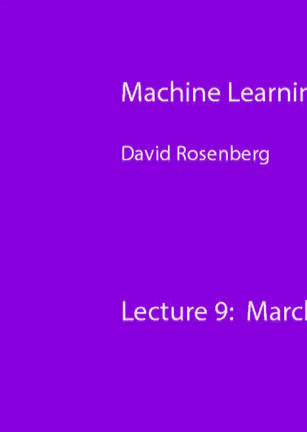
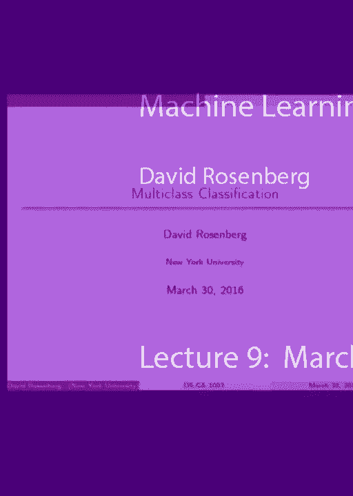
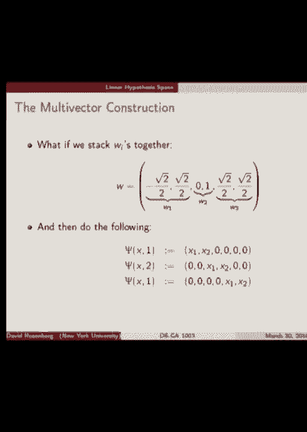
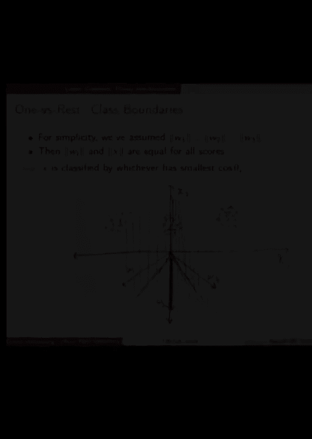
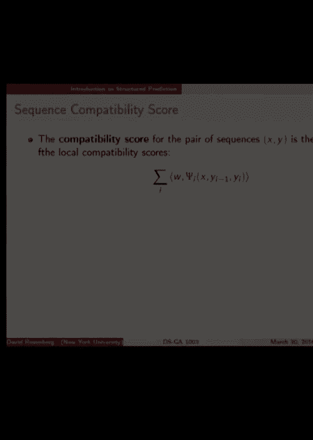

# P15：15.Mar_30_Lecture - Tesra-AI不错哟 - BV1aJ411y7p7

好的，我们开始吧？

好的。那么今天的主题，主要主题是多分类。它为更加高级的话题如结构预测、排名问题等提供了一个很好的基础。你可以将它们看作是多分类的实例。所有的实际方法都有一些不同。所以在多分类的设置中，输入空间是任意的，X。

我们的输出空间现在是一个离散的类集，从1到K。最初，我们没有对输出空间1到K中的元素之间的关系做任何假设。稍后，我们可能会添加一些假设。到目前为止，我们讨论的唯一方法是树，决策树。

分类树。在那些情况下，将问题转化为多分类是非常容易的，而不仅仅是二分类。通过树扩展，我们可以做随机森林。到目前为止，这些都是用于多分类的方法。但今天，我们将讨论一种为多分类设计的线性方法，它从头开始就是为多分类设计的。所以首先。

让我们谈谈从二分类得到多分类的一种简单方法。它叫做归约方法，即你将一个问题转化为另一个你已经有的、更简单的问题来解决。那么假设我们有一个二分类器，我们如何用它来解决多分类问题呢？就是这样。

也许你以前见过这个，一类全部，一类休息。是的，这是一个简单的想法。所以在这张图中，我们有三个类：加号、减号和圆圈。我们在这里做的就是拟合了三个不同的线性分类器。每个分类器将一个类与其他类分开。所以这个w0分类器。

w0将圆圈与加号和减号分开。减号分类器将减号与加号和圆圈分开，以此类推。那么我们该如何处理这些分类器呢？假设我们得到一个新的点。那么，有很多方法可以结合这些分类器。一种方法是，理想情况下，如果你在这个空间中找到一个点，只有一个分类器说这个点属于我。

所以如果你处于这个区域，那么唯一一个说这是我的空间的分类器是减号分类器。所以我们预测为减号。问题出现在你处于这个区域时。现在有两个分类器想要认领这个区域，减号和圆圈在那个角落区域。你必须找到一种方法来解决这个问题。好吧，这就是大致的思路。

那么我们来稍微更数学化地写一下。所以我们将使用k个二分类器，每个类一个，每个分类器训练来将一个类与其他类分开。我们用h1到hk来表示这k个分类器。它们可以输出硬分类或分数，无论它们做什么，我们。

我们最终的预测是，根据哪个分类器给出 x 的最大得分。好吧，所以用 i 来表示类。我们将查看每个 i 分类器的预测，每个类都有一个分类器。无论哪个得分最高，我们将使用那个作为预测结果。如果有平局，你可以随意打破平局。

这就是一种方法。关于这个一般设定，有什么问题吗？好吧。好的。那么我们来看看这个方法是否有效。但在此之前，我想让大家回顾一下如何理解线性分类器的一些直觉。好吧。我们回到二分类的情况。假设我们有 R^d，欧几里得输入空间。

我们的输出空间是 -1 和 1。我们的线性分类器得分函数是。今天我使用这个符号，因为我参考的书籍用了这个符号，就是 W 和 x 的内积，或者说 W 的转置与 x 的内积，意思是一样的。它产生我们对正类的得分，用于二分类。记得吗？所以这是一个得分函数，二分类中大于零表示预测为 1，小于零表示预测为 -1。

0 对应的是 -1。好吧。很好。如果我们想做硬分类，我们可以这样做。好吧。那么从几何的角度来看，我们知道 x 和 W 之间有什么关系呢，当我们预测为 +1 与 -1 时？再说一遍？那么我们来看一下。x 和 W 是向量。

那么我们来写一下这个想法。好吧。它们的余弦相似度是正的。我喜欢这个。我们来深入探讨一下。其实我在考虑买一个带有触控笔的 iPad，这样我就能为你画出漂亮的画。但它……好吧。那么我们这里有什么呢？我们有 W，代表我们的分类器。这里有一个向量 x，它是我们的输入。好吧。那么 W 和 x 的预测是什么？

什么是得分函数？W 和 x 的内积。假设 W 不为零。好吧，这很合理。并且我们假设 x 大于零，x 的模长大于零。那么 x 就不为零。你应该记得你在某些数学课上学过，W 和 x 的内积是 W 的模长。

x 的模长乘以余弦值。对吧？太好了。那么什么时候这个值大于零？嗯，W 和 x 的模长都大于零。所以如果余弦值大于零，这个整个值就大于零。这就是你所说的。那么，什么时候余弦值大于零呢？

对于 theta 来说，角度在 -90 度到 90 度之间。好吧。那 theta 究竟是什么？

Theta 是 x 和 W 之间的夹角，两个向量之间的角度。所以如果这个角度在负 90 度到 90 度之间，那么得分，即内积将是正的，得分为正，预测结果是 1。所以在这条线的这一侧，这条线是什么？这条线是 W 的法线，对吧？

W 与这条线垂直。这就是由 W 表示的实际分隔超平面。分隔线。所以我们将负类 1 放在线的左边，正类 1 放在右边。好的，复习完毕。现在我们来考虑一个三分类的例子。我本来也可以用粉笔。现在我有三类。我用小 x 画出了这些点。

让我们看看在这里我们能用单一分类器做什么。所以首先，让我们指定我们的基本假设空间。这个空间就是我们将在其中使用单一分类器的空间。所以我们将使用线性分类器，W 转置 x。就像我们之前说的，但重要的是，注意这里没有偏置项。因此，这个分隔超平面将始终，什么？

经过原点。始终包含原点，就像这里一样。零与 W 始终是正交的。所以，好吧。那好，分隔超平面在 1 和其他类别之间是什么？

你可以很清楚地看到，可能看起来像这样。这是我们在 1 和其他类别之间的分隔超平面。现在我们将其他类别放进来。好的。所以现在我画了三个边界。让我们分析一下 2 的边界。这里发生了什么？我们试图将 2 从其他类别中分开。所以 W2 向下指向。

那么，这条蓝线的哪一侧是在分类为 2 的正类？是在分类为 2 吗？

在这条线下面。对，任何在 W2 向量 90 度范围内的东西都会被预测为 2。所以在这个例子中这不是很好，因为它把所有的 2 都预测错了。另一方面，它正确地预测了所有非 2 的类别。为什么选择将这个平面的下半部分归为类别 2，而不是反过来？对，因为通过将类别 2 放置在这里，它能够正确预测更多的例子。

在下面，因为这意味着非 2 类别在上面，并且它正确预测了 1 和 3 中的所有点。并且它在 2 中预测错的点远不如之前那么多。所以这是分隔的方式。对此有任何问题吗？好的。那么让我们利用这个机会来理解这个空间的哪些区域是被分配的。

对每个类别，是吧？那么让我们再玩一次得分游戏。所以我们需要一个给定类别的得分。假设类别 I 的得分，我们有 WIX 之间的内积，好的。再次是，||WI|| ||X|| cosθ。或者 θI 现在是 X 和这个特定 WI 之间的角度。好了。现在我们将预测得分最高的类别。

所以我们做一个稍微简化的假设。注意，分隔超平面在正常的 W 下不会变化，对吧？所以如果我们假设 W 的范数都相同，什么都不会改变。我们就这么假设。然后 W 的范数都相同。X 始终相同。所以唯一在这些得分之间不同的是角度的余弦值。好的。

那么我们将根据角度为X分配哪个类别呢？好的。那么X是类别5，但无论哪个类别的余弦值最小。我们将会有三个分数，每个类别一个。如果我们写出来，前两个因素和所有三个分数都是一样的。因为WI。

我们假设所有的范数相同。X始终相同。所以我们只剩下余弦θ。1余弦θ，2余弦θ，3。得分最高的是余弦θi最大的地方。余弦θ何时达到最大值？什么时候？当θ等于0时，余弦θ达到最大值，即无角度。所以当X和W之间的角度为0时，这是肯定的。

我们将根据X之间的角度进行分类。基本上，X与哪个WI在角度上最接近，就与哪个类别进行分类，使用余弦距离或其他方法。好的。所以我画了这个。看这里的W。让我们看看W1和W2之间的分隔值。所以这里稍有偏差，但任何与W1角度更接近的，都必须...

将红色分配给标记。任何与W2的角度更接近的都分配给蓝色。所以你可以使用这种方式将平面划分为不同的类别，以进行预测。清楚吗？我刚才画了一个这样的角度二分法，分隔了每个WI。好的。所以你可以实际上将这个看作——作为一个实例——它是一个决策函数。

它输出三个级别。在这张图中，它输出红色、绿色和蓝色。如果我们能将其编码，它就输出一、二或三。输入空间是平面X。这是我们假设空间的一个实例，算是——不是我们的基本假设空间，而是我们最终的多类假设空间。这是该空间的一个预测函数实例。

好的。那么这种方法似乎在这个例子中效果不好，对吧？

这完全错得太离谱了。有任何想法如何修正吗？好的。加一个偏置项。那么这能让你做什么？这将允许你，比如——让我用光标标出这里。画出像这里这样的分隔，对吧？或者这里。偏置项如何帮助你将两个分开？

我不明白。我们还能做什么？有没有—但这是个不错的方向。你建议改变假设空间，即基本假设空间。我们能朝那个方向做点什么吗？好的。那么再次提到，核—其他的呢？新特征。创建一个非线性的假设空间。对。没错。这是一种可能性。

我们可以为得分函数或基本假设空间创建一个圆圈，比如围绕2做出划分。这就是一种方法。我们可以使用绝对值或其他方式。对。这是一种方法。那么问题是我们是否需要这么做。让我们来谈谈我之前提到的假设空间。

所以我们有这个基础的假设空间，是线性评分函数。我们最终生成的是这些不同评分函数中的最大值。我们预测一个——好吧，这是我们的最终假设空间。那么，在这个假设空间中，预测函数的行动空间是什么？

记得什么是行动空间吗？是的，从一到K。行动空间包含通过预测函数生成的一组事物。所以是的。在这种情况下，我们生成的是从一到K的一个数字，即K类中的一个。很好。那么这定义了我们正在处理的假设空间。这里有个问题。

这种一对多方法在我给出的例子中失败了。这是因为假设空间的问题，还是使用一对多方法的问题，或者两者都有问题？这是我们的问题。好的。那么再说一遍？[听不清]，好的。那么你是说假设空间本身应该没有问题。

这个设置应该是足够的。不是很确定。不是很确定。还有其他想法吗？是的。[听不清]，好的。那么你是在说，这样有什么不对吗？嗯，意思是，仅仅看这个，怎么将二与一、三分开是很明显的。并不是说没有方法。只是从视觉上看，似乎非常明显，你知道，二是这个区域，一是。

这个区域是二，三是这个区域。所以如果我说我们在某种非常明显的意义上发生了欠拟合。那你是在说，好吧，这可能是这个假设空间能做的最好了。这就是问题。就是这个问题。好的。那么这个呢？不，不是那个。那这个呢？发生了什么？所以我有三个新的W。它们都没有指向下方。

它们都指向各自的类。我画了这些类边界。首先，我们是否同意我画的类边界是正确的？所以在一和二之间。我看了角度距离，所有红色的都更接近红色的W，而不是蓝色的。而所有绿色的都更接近绿色箭头，而不是蓝色箭头。

好的。那么你同意我画的边界，决策区域吗？好了。这能得到完美分类。它来自相同的假设空间吗？是的还是不是？

我认为是的，因为我们有三个线性评分函数。评分函数都是线性的。它们都是W转置X。我们正在取这些评分函数的最大值。所以是的，这是来自相同的假设空间。区别在于这不是一对多训练的结果。好了。所以一对多在这个例子中失败了，但假设空间得到了验证。

它仍然起作用。所以我们今天接下来要讨论的是，如何获得像这样的东西？

我们需要做的事情不仅仅是**降维**到二分类。问题？>> 是的。我想知道当你在做中心化的远程分组时会发生什么。所以在那种情况下，两个类会被称为零向量。那么如果你想把它变换成一个糖评分或者。好的。那么。

我想问题是，如果你打算使用这个**降维**的方式。是否有更聪明的方法，比如只对数据进行平移，改变其“味道”？

我知道我的想法是，意思是，这个例子可能是一个很好的例子，如果你。如果你限制假设必须归于原点，那么移到原点并不会让你区分整个类是否在原点处被**截断**。那样就不太奏效了。>> 所以，我不确定。我不确定。

这是一个有趣的问题。为了方便解释图片，我们让所有的W长度相同。实际上，W的长度不需要相同。如果我们改变假设空间中的W的长度，事情会有何变化？我最初的观点是，如果你改变W的长度，什么也不会改变。我真正想说的是，你改变了W的长度。

**分离超平面**没有改变。但那就是分离超平面。这是一个二分类问题。对吧？当我们有时，看到。这些是二分类问题中的分离超平面。在这个场景中，我们没有分离超平面。我们有不同类别的区域。所以现在在这个设置下。

W的**范数**，W的范数重要吗？好的。如果我们让W1变长，会发生什么？

那么它的类别1的区域会发生什么呢？是的，它会扩展。对。没错。好的。那么。我们的假设空间比我在这里所暗示的要更广泛，因为。你可以在不同的光照条件下有不同的W。举个例子，假设其中一个假设是W等于0。对。好的。是的，拜托。好的。那么在这个设置下，我们有三个W。

每个都会引出一个分数函数。分数函数的思路是这样的。这是W1。所以我们有一个X，然后我们计算W1与X的内积，这会给你一个数字。数字越大，越偏向于类别1。好的。对于类别2和类别3也是一样。现在在空间的任何一点。

我们可以通过W1与X的内积、W2与X的内积和W3与X的内积来得到三个分数。每个内积都会给出一个分数。而红色区域是所有X的区域，其中W1给出的分数最高。蓝色区域是W2给出的分数最高的区域，绿色区域是W3给出的分数最高的区域。你是怎么得到的？

谢谢。这是，嗯，这是下一个部分。是个好问题。是的。我只是到目前为止在尝试证明假设空间，但并没有告诉你如何得到它。什么。那是下一步。>> 这也是你认为作者在喊分数更高的原因。>> 正是如此。当你让W变长时，分数增大。因此，红色区域变得更大。

没错。 >> 而且你有一个3，就像是，这里没有一个因素被其他的预期。 >> 嗯，是的。这些，它们不是圆的，它们是角度的。是的。没错。是的。 >> 你是说我的图不准确吗？等，等，等，再说一遍。问题在哪里？

>> 我们画的蓝色区域，蓝色的方向。 >> 是的。 >> 蓝色变换可以是最大值。 >> W转置X在W向量的方向上最大化。是的。 >> 我们往外走。 >> 是的。 >> 它减少了。 >> 分数下降了，正确。 >> 所以。当我们朝着负轴的方向移动时。 >> 向下，好吧。 >> 然后我们从。

从另一边也可以。 >> 你是怎么做到这一切的，这个，这个，这个，嗯。 >> 你是指这里吗？你是指我画手的地方？ >> 是的。 >> 我们该怎么解决呢，你是问这个吗？ >> 我稍微读了一点我们看到的东西。 >> 是的，任意打破平局。 >> [听不清]， >> 这不在我的假设空间里。是吗？嗯。

当然，这并不是没有偏差。你说的三条平行线就像是这里和这里。是的，这不是，不是一个假设空间。我们做不到这一点。这个回答了你的问题吗？好。是的。 >> 问题是，如果你的向量错了，为什么空间仍然存在？我的意思是，我不在这里。我是说。

这种视频必须在，[听不清]，写出来吗？ >> 我怎么知道这个区域是红色的？

>> 是的。 >> 哦，因为在角度上它比绿色向量更接近红色向量。 >> 你同意吗？这是之前论点的延续，你看。 >> 所以这些点它们离新光线更近。 >> 这些点，是的。 >> 是的，那么。你打算把它变成三角形吗，不会有区域吗？

>> 你是说没有分类吗？ >> 不。 >> 但就在轴的左边，确实是更接近红色向量，右边则更接近绿色。 >> 确实所有的分数函数都是负的，但红色的仍然有。通过其负值的最小大小，获得了arg max。 >> 哦，谢谢。

我没有从问题中跳出来。 >> 所以，这个问题是问题吗？好吧，那为了重申一下。那是一个相当不错的声音，不过万一你没听到的话。 >> [笑]， >> 所以，在这下面。这里的这个特定三角形里，所有的分数都是负的。这个点很好。但没关系。因为我们是用最高分来预测的，分数是正是负并不重要。

正的还是负的。是的。 >> [听不清]， >> 哇，那很有趣。 >> 是的。 >> [听不清]。 >> 很好的提醒。好吧。我们来谈谈这个。很好的点。就是，当分数是负的时，增加w的范数会使它更负，这会使其被选中的可能性更小。但如果是正的。

这样会更有可能被选择。这是一个非常好的观点。 想一想。 很好的观点。 是的。 或者有问题吗？ 问题是，我能举个例子说明何时会出现假设空间的问题吗？ 也许我们稍后会讨论这个问题。 是的。 好的。 好的。 所以。 让我们讨论一下我们如何实际操作——更多问题吗？ W 转置 x，点乘 w。 是的。 >> [听不清]。

>> 是的。 不，不。 是一个。 当 x 和 w 之间的角度大于 90 度时，它就是负数。 所以，举个例子——， >> [听不清]， >> 是的。 所以，这个向量和这个向量之间的角度超过 90 度。所以，它是负数。 对的。 是的。 酷。 好的。 所以，我们现在准备稍微重新框架一下，来为一些更先进的方法做准备。 所以，现在我们有了我们的基础假设空间。我现在把它做得更通用了。

没有线性。稍后我们会再引入线性。所以，我们有一个 h 的假设空间，以及我们的多类假设空间。它正在预测一个实际的类别。它将是这些单独评分函数的 argmax。我们有 k 个它们。 k 个评分函数。好的。为了寻找正确的类别。

我们评估 h1 到 hk。看哪个最大。所以，我们将它稍微调整一下，转为一个框架，至少能够包含其他框架。现在假设我们有一个一般的输出空间 y。好的。所以，一个例子可能是 k 个类的离散集合。但我们就称它为一般的空间 y。

而我们的基础假设空间现在，不再仅仅是从 x 映射到 r，它还接受 y，来。 好的。所以，这将为我们提供一种思考新事物的方法，而不是仅仅将它视为某一类的评分函数。现在，我们将把这个 h 看作是给出 x 和 y 之间兼容性分数的函数。

提供的 x 和提供的类别 y。 好的。所以，这是一种新的对象类型。它接受输入 x 和输出 y，并预测这个对的分数。 所以，这并不是一个巨大的变化。之前我们为每个可能的 y 有一个独立的函数来给出分数。现在，我们有一个单一的函数，它接受 x 和 y。

不同之处在于，现在 y 可以是一个更大的空间。也许我们不想要有一百亿个不同的函数。我们只想要一个，并且你可以提供任何与该函数相关的 y。好的。所以，现在最终的假设空间，不再是对你的类别进行 arg max。

我们有 arg max，它不再是对 i 从 1 到 k 的求最大值。所以。 我们有 arg max 对一个输出空间中的元素进行求值，然后我们评估 x 和 y 之间的兼容性，哪个兼容性更高，哪个就是我们的胜者。 那就是我们预测的 y。 这样清楚吗？ 这不是一个大的变化，而是一个微妙的变化。

好的。这就是我们今天将使用的框架。好的。那么，我们如何进行学习呢？

让我们来做个问题。我们如何从这个多类空间中选择这些基础假设或这个假设呢？好吧。所以，我们现在有了基础假设空间，带有 x 和 y。我们有一些训练数据。因此，学习过程，我不确定我是否曾经定义过学习算法。学习算法是某种接受训练集并产生结果的过程。

假设空间并从假设空间中选择假设。没错。那么，我们将有一个学习过程从假设空间中选择 h。问题是我们想要什么类型的 h —— 我们怎么知道找到了一个好的 h 呢？

这是我想问你的问题。我们怎么知道找到了一个好的 h 呢？

假设这是我们进行预测的方式。那么，对于一个单一的训练点 x 和 y 呢？

假设我们有 x 和 y。我们怎么知道 h 在 x, y 上表现得好不好？好吧。那么，给定函数 h，我们什么时候会预测 x 的 y 呢？是的，当 x 和 y 之间的兼容性得分很高时。对吧。如果我们想根据 x 预测 y，那么 x 和 y 之间的兼容性得分应该很高。实际上。

它应该高于 x 与所有其他类别之间的兼容性得分，对吧？

因为这将决定我们最终选择的预测值。无论哪个兼容性得分最高，那个类别就是我们预测的类别。好吧。所以，我们希望 h(x, y) 很大，实际上它要比 h(x, y') 大，其中 y' ≠ y 或其他的值。好吧。下面是数学形式。所以，h(x)。

y 只有在正确地分类了特定的训练示例 x, y 时，才会成立，也就是当 h(x, i, y) 大于 h(x, i, y) 对所有 y ≠ y_i 时。对吧？好吧。那么，从这里开始，我们几乎可以开始看到一个好的目标函数是什么了。所以，等价的形式就是简单地 h(x, y) 大于正确组合的 x 的得分。

y，i。应该大于所有其他得分中的最大得分。这只是写法上的等价方式。好吧。所以，如果我们希望左边的东西大于右边的东西，并且我们想把它作为目标函数来处理，那么。

我们可以将右边的东西移到左边并取差值。然后我们希望这个差值大于零。也许我们可以有一个损失函数，当差异较小时给予惩罚。因此，我们正在考虑一个类似于这样的目标函数。括号里面的东西是我们希望它变大的部分，对吧？因为 h(x, y, i)。

我们希望这个兼容性要比另一个大得多。所以，这个值应该很大。我们可以在这个上面加一个损失函数。因此，损失函数应该在这个差异较小时给予惩罚，而在差异较大时则较小。这个是否让你想起了什么？

就像我们处理过的其他问题一样，比如分类。使用边距的情况。是的。hinge损失具有这种性质。如果你取hinge损失，当它的参数值很大时，损失很小。所以，当边距很大时，损失小，而当参数值很小时，边距为负时，损失就很大。所以，你可以想象，使用像hinge损失这样的损失函数，或者其他边距损失。

基于边距的损失并将其应用于这种对象。这似乎是正确的方向。好的，我们稍后会回来再讨论这个。好吧。那么到目前为止我们有什么？我们有了一个，我们有一个兼容性函数的基础假设空间的概念。

然后我们知道如何将这些兼容性函数转换为最终的类预测。现在我们要讨论的是一些更实际的内容。我们如何生成这些兼容性函数？我们如何生成这些线性兼容性函数？

因为我们之前从未做过这种事。我们所有的函数都是基于输入的得分函数。所以我们创建了x的特征。但是现在我们有了x和y的函数。那么我们是应该创建x和y的特征，还是说这里到底发生了什么？

这是我们面临的问题。好的。所以我们定义了一个线性的类敏感得分函数。所以不仅仅是得分函数。现在我们也把类加进去了。类敏感得分函数有hxy和某个参数向量w的内积。这个新的实体psi(xy)就是类敏感特征映射。

它是特征向量的类比，只不过在该特征向量中还包含了有关类y的信息。所以我们有x，也有y。然后我们以某种方式生成一个特征向量，接着用它与参数向量w相乘，得出我们的预测结果。

x和y之间的兼容性得分函数。 这让人困惑吗？[听不清]，好的。我们建立了一个模型。这是什么意思？我们建立模型意味着——嗯，两个部分。我们必须定义这个类敏感特征映射。然后我们要学习w。好的，我们已经做到了。然后我们有一个新的数据形式，我们不知道y是什么，怎么做。

很好的问题。好的，我们已经确定——我们已经找到了w，并且定义了psi。好的。然后我们有了一个新的x。我们如何确定要预测的y？

你尝试每个y并将其代入hxy，看看哪个具有最高的兼容性得分。然后就是你预测的内容。如果尝试每个y很难，正如我刚才所说，可能是因为y的数量太多，我们就需要另一个方法。这就是结构化预测这个概念的作用所在。

我想我们会在最后提到。对。[听不清]。所以这里有趣的是问题本身，我将其写成了RDE。所以记得在那个特征讲座中，我们——直到特征讲座之前，我们都说，哦，x是一个RDE的元素。然后在特征讲座中，我们说，你知道吗，假设。

x 是任意的，在任意的空间 x 中。我们引入了一个特征映射，将 x 映射到 RDE。现在我们所做的是让输入空间和输出空间都可以是任意的。x 和 y 是任意空间，我们要求特征映射映射到 RDE。好吧。好了。所以问题是，这个类敏感的特征映射应该是什么样的？

有什么策略？R 是什么？我们有哪些选择？

这就是我们刚才描述的最终多类假设空间。很好。所以不管怎么说，特征向量必须表示——必须以某种方式表示 y 与 x 的匹配程度。更精确地说，我们必须取这个特征向量，并通过对 psi 特征的线性组合来实现。

我们需要得出分数。所以特征向量并不需要完成所有的工作，去判断 y 与 x 的匹配程度。但它必须足够接近，以至于我们只需要对这个特征向量的元素做线性组合，就能得出一个好的兼容性得分。

这只是一个线性方法的问题。好了，所以这是对三类有效的分类，对吧？

那我们怎么将这段代码嵌入到我们的新框架中呢？因为我们已经把它编码成了 w1，w2，w3。那么我们如何将它放入需要 x 和 y 的分数函数中呢？

所以让我们写下实际的向量 w1，w2 和 w3。角度稍微偏离了一些，但这就是正确的思路。我们已经讨论过这个——好的，我们已经讲得够多了。这是我们的最终预测函数。那么问题是我们怎么将它映射出去？

这看起来像这样吗？不是对 1、2、3 做 argmax 操作，带着 3 个 w，而是我们有一个单独的 w 和这种新的特征向量类型。有想法吗？其实并不难。虽然有点搞笑。那么如果我们把所有的 w 堆在一起，形成一个巨大的向量会怎么样？

所以这就是我在这里做的。我取了 w，然后把 w1 放在前面，然后是 w2，再然后是 w3。所以现在 w 在 r246，r6 里。好了，这就是 w。那么如果我们把特征向量做成这样呢？所以——第二个？第二个？对，第三行应该有 3，谢谢。也许你可以发封邮件给我，告诉我这个修正。

稍后再说。那会很有帮助。好了，所以我们必须制作这个类敏感的特征向量。如果我们有——所以 x 在 r2 中。x 在 r2 中。它由 x1 和 x2 表示。那么这里发生的事情是，当我们插入带有类别 1 的 psi(x) 时，我们将把 x1 和 x2 放在前两个位置，然后把 psi(x2) 放进去。

我们将把 x1 和 x2 放在后两个位置。然后 psi(x3)，应该是 3，我们把它放在第三个位置。那么这样可行吗？这是胡说八道还是行得通？

如果我们计算w和ψx1的内积会发生什么？嗯，ψx1的最后四个条目是0。所以唯一相关的就是w1与x1、x2的内积，这正是我们需要的，依此类推。所以这个ψ的定义，作为从x和y到r6的映射，而这个r6的参数向量可以重现相同的效果。

我们在其他设置中所用的东西。所以这个策略，我们把我们的轴增加。我们的特征空间--，如果我们原始的特征空间大小是2，在这种情况下，且我们有三个类别，我们将3乘以2得到新的空间。我们就按照类别数复制特征空间。太好了。问题，嗯？

你说ψ(x, y)将类别包含到特征带中。那么它在哪里与协同特征相交？看到这里的这个数字了吗，1，2，3。那就是ψ(x, 空格)。这个空间是特征，类别在其中。看到ψ(x, y)了吗？所以这是类别的槽位。那么它是如何表现出来的？

根据这里的类别，我们将x1和x2放在不同的位置。更多问题？

是吗？[听不清]，好的。这个等价于--，抱歉，我再说一遍？

所以这太好了，所有的x和y的组合。x和y的所有特征组合。以及所有不同的uy类别。是的。是的，好的。那么接下来，你--。你基本上得到了1和0。1，你说x，然后。类别，所以y是正确的组合。好的。然后强回归是uy交互的，y的顶部，主要的，开口。好的。

所以，是否可以建议我们做类似逻辑回归，或者其他什么？或者线性回归。我们试图预测的响应是什么，是0还是1，取决于--。我是说1或者-1。1或者-1。好的。如果我理解你在建议的内容，纠正我如果我错了，那么如果我们把我们的这个问题重新表述成如下形式，会怎样。

每个xy对都会重新构建，xy作为输入。输出是+1，因为这个xy实际上发生了，+1。也许你会制造一些虚拟的xy对，其中是xy'。标签将是-1。然后你尝试将发生的与未发生的分开。是的。

[听不清]，特征是这个非常明显的交互作用。原始特征和类别之间的交互。因此，特征空间肯定是原始特征和类别之间的交互。那是肯定的。现在，是否等价，我实际上还没有完全定义我们--。

我们还没有定义学习方法，所以我不能说它是否等价。我会根据我们在此设置中所做的负面示例来判断。它可能不是等价的。[听不清]，对，嗯，我不认为--，我是说，也许吧。我不认为-- 我不一定看到那种情况。也许它是。很有趣。好的。

这仍然取决于你最后的模型是逻辑回归还是线性回归。对吗？

[听不清]，[听不清]，那是什么？你说“一体适用”？是的。其实，你有一个最终的解，要为超平面写出，因为每个常数都会按你解算的方式应用，所以你大致是对的。它会应用W加上——会按3/4应用，这也是你最优的解，对吧？好的，所以你是在谈论找到这个W。

是的。好的，继续。你可以应用，例如，W1给我的2、3、4。它也是你最优的解，对吧？是的。因为你有一种类型的解。是的。所以假设你运行一次你的算法，而你的W1的延迟是1如果是1。在另一种情况下，是真的。它可能改变W的长度。然后你可以根据模拟结果改变得分。

因为你在使用你自己的品牌SEM算法。你有一个关于W1、W2和W3的旧诗。你说W1、W2和W3。哦，我明白了。所以你是说你的SEM求解W，而你说你无法控制W1、W2和W3的值，如果它是——好的，这是真的。它们不会像这里一样全是1。但如果你改变——你知道，第一次的时候。

你说得对，如果W1的长度可以是10，然后另一个可以是20，再另一个可以是30。那么你怎么比较呢？因为通过模拟，可能会有不同类型的成本力？所以你是说——所以问题或主张是我们可以运行——我甚至还没有指定方法。

但是假设最终我们有一个优化问题，我们将通过最小化某个目标函数来找到W，就像我们通常做的那样。你说的是——好的。你说，因为单独的W1、W2和W3的长度对——不重要，对吧？

这已经不完全正确了，对吧？因为当我们改变这些的长度时，区域会发生变化。是的，这正是我在说的，因为我可以通过举例来看，像是点点点 10 到 10，乘以 10，你知道吗？你可能会有不同的解，但它是相同的。分隔的超平面——但是——是的，这些不是——嗯，这就是关键。

这些是不会基于分隔超平面来找到的。那——是的，这就是我们在这里讨论的东西。嗯，回到分隔超平面的幻灯片。所以——总之，我认为我们达成一致。好的。我们不会找到分隔超平面，因为那——是的。

它不起作用。好的，我们休息一下，除非在此之前有其他问题。好的，休息。

[听不清]，[听不清]。

[听不清]。

[听不清]。

[听不清]，[听不清]，[听不清]，[听不清]，[听不清]，[听不清]，好的。所以我们有——我们已经通过了一种方法，每个向量足够快速地实现——所以我们称它为——书中也称它为——它被称为多部门。没错。就是这样。来自自然语言处理。所以在这里，我们的输入空间是——。

将它们都放在一起，然后我们再放到一起。任何输出都将是数量的一部分——现在我要把它加到那个上面，粒子将会——，[听不清]，[听不清]。[听不清]，[听不清]，好的。所以，输入空间是所有可能的单词，输出空间是这六个词性。我们为 x 制作什么样的特征？

你们可能在作业中做过类似的事情，可能。你们会为单词使用什么特征，如果这是你的目标？

也许母语者应该至少有一些想法。好的，我有一个想法。什么？

字符 n-gram。字符 n-gram。好的。哇。比我打算说的还要好。把所有字符 n-gram 放进去，长度是多少？长度 1、2、3、4、5。太好了。这是正确的方法。我本来打算说一些非常启发式的东西。比如。单词以 LY 结尾，或单词以 NESS 结尾？但是你的方法更好。好的。所以特征。

你可以把单词本身作为 x 的特征。你怎么表示它？你可以使用 a。我们刚才在讨论它。它们叫什么？告诉我变量表示。可是如果单词是 hello，特定的维度就会得到值 1，否则它会得到值 0。这就给你一个高维空间。

但这是自然语言处理中的一个标准。好的。所以我们有一些特征的结束部分。我们有单词本身。那是一个单词特征吗？

所以这些是 x 的特征。然后，好的，我们希望得到 x 和 y 的特征。所以我们将使用我们的多向量方法，并且只考虑它们之间的交互。因此，我们可以将 x，y 的 psi 表示为单独特征函数的形式，psi 一到 psi d。每个函数决定特定特征的值。所以这里有几个例子。比如 psi 一。

第一个条目，可能是单词是 apple，类别是名词。好的。单词是 run，类别是名词。这些是依赖于 x 和 y 的特征。单词是 run，类别是动词。好的。那么这些每个都有一个参数，对吧？

对于每一个类别依赖的特征向量条目，我们在参数向量中也有一个条目。所以当你考虑 w 一时，w 的第一个条目应该对应于 psi 一。它会大还是小？

这个，嗯，是的。好的。经过大量的手势描述，我们可以说它会很大，因为它是正确的。也许 run 和名词，run 可以是名词，但可能比动词少见。所以也许这个数字比这个小。这一点并不准确，因为当你构建模型时，可能有其他方法可以得出相同的信息。

所以仅仅因为这是正确的，并不一定意味着它会得到正权重，因为它可能在其他地方给出了正权重。预测起来有点困难，但至少直观上我们认为正确的权重应该更高，错误的权重应该更小。好的。

好的。我只是想确保我们百分之百清楚。我觉得我们已经清楚了，但我只是想确保我们百分之百清楚如何实际使用这个东西。所以假设我们已经做了训练，虽然我们还没有完全说明我们将如何进行训练，并且我们已经学会了参数向量w，假设它是这样的，你知道的。

我们有参数向量的实际数字，某人给我们输入，apple。X等于apple。那么我们如何实际上得出最终的预测呢？

我们将通过计算w与类特定特征向量的内积来计算这些兼容性分数。所以我们有apple名词的ψ，apple动词的ψ，apple副词的ψ。每一个都会给我们一个向量。我们将每个向量与w进行内积。这些内积给我们分数。

我们查看哪个分数是最高的。那就是我们使用的类别。这就是方法。好的。我只是想确保。好的。那么我将谈论一种不同类型的特征。我是说，你在这里会注意到，这个特征空间的大小是你原始特征空间的大小乘以类别的数量。

你有多少个类别。所以如果你的类别数量非常大，你的特征空间真的会膨胀。所以现在我们要谈论一种不会这样膨胀的特征。我们在其中一个作业中提到过它。那就是可选的TFIDF特征。所以这里的一个自然问题是，我们有一篇新闻文章作为输入。

我们想从一组主题中找出它属于哪个类别。好的。所以我们的方法是查看单个单词，某些单词会指示某些主题，而不会指示其他主题。例如，可能“White House”是政治主题的标志，因为它主要出现在政治领域。

可能在其他领域中出现得不多。而“the”这个词，嗯，它在所有这些主题中都会出现很多，所以它并不是非常具有预测性。我们怎么捕捉到这一点呢？

所以TFIDF是一种方法。TF代表词频，这不过是一个词在特定文档x中出现的次数。所以Wx的TF就是这个词出现的次数。然后我们要控制某些词在所有地方都出现得很多这一事实。所以我们必须对其进行归一化。因此，有一个东西叫做文档频率。

这是一个关于单词和类的函数。一切都可以是x和y的函数。所以这里，这是一个计数，表示不属于类y的文档中有多少包含单词W。那么我们怎么弄明白这一点呢？我们必须查看我们的训练集。如果我们找到了这个特征，我们必须查看训练集，这有点有趣，但也是公平的。

你可以随意操作训练集。很明显。所以当我们测试Wy的文档频率，TF或Wy时，我们会查看训练集中的所有不属于y的文档。然后看看有多少这些文档包含了单词W。所以最终的特征几乎是一个比例。

它是术语频率（TF）。所以单词在文档中出现的频率越高，这个单词的投票就越强。然后我们通过该单词出现在其他文档中的频率来进行归一化，从而降低这个单词的影响。好的，这种方法在文本分类问题中经常被使用。其实就是这样。

这实际上是，我从来没有见过这种特定的TF思想。这是教材上说的。虽然通常情况下，有很多不同的变体。你可以去维基百科，它会给你列出25种不同的TF思想变体。不同的归一化方式之类的。但这个捕捉了核心思想。所以，接下来是一个问题，看看我们是否理解了。

假设我们的词汇表中有D个单词，且我们有K个类。我们为每个单词都有一个TF思想特征。那psi的维度是多少？

那么我们有多少TF思想特征？向量的维度是多少？是的，所以我们想说是D乘以K。但实际上，这里是单个单词的TF思想定义。你会看到它只是一个数字。我们不需要为每个类设置一个单独的维度。我们将类Y代入这个函数，就能得到一个数字。

而且这个数字会根据我们使用的类而变化。所以特征向量中的一个特定条目会随着我们尝试不同的类而变化。所以这种条目衡量的是特定单词与每个类之间的兼容性。代表兼容性的类会随着你将不同的Y代入特征函数而变化。

所以我这里打算用另一种类型做个类比。我们回到我们的NLP风格的特征函数。这里对于每个类和每个单词，我们有一个不同的维度，要么是1，要么是0。所以X是“run”且Y是名词，X是“run”且Y是动词的指示器。

我们代入了不同的Y。没错。但这里的特征向量在不同条目和不同坐标的开关是0和1。所以类比一下，如果我们做一个TFIDF风格的特征，我们会有——那是一个bug。所以我们有这个——我们会有一个特征函数叫做X的运行，然后我们会说，当我们代入不同的Y时。我们会有——有一个分数，这个分数会根据“run”与类Y的兼容性而变化。

所以这将是最接近TFIDF在这种类型特征中所做的类比。那么为什么它会进入TFIDF的IDF部分？这是关于Y的信息吗？

它位于TFIDF的IDF部分。IDF取决于Y。是的，IDF取决于类别部分。没错。所以，是的，类别——Y部分仅在归一化和DF中进入特征。文档频率部分。好。好的。是吗？[听不清]。所以参数是X和Y，一个特定的Y，和一个特定的X。[听不清]。

这个下标的事？是的，抱歉。所以这是——这有点让人困惑。抱歉。所以我正在创建一个特定的特征函数，并且我命名它——那个函数的名字是X等于run。所以单词是run。然后那表示——像是——。我要在我的特征向量中有一个单一维度，代表X等于run。

而这将——它将是一个数字评分，就这样。好的。好的。那么这里有另一种更直观的方法。假设我们有大量的类别。所以。比如，广告。输入是用户，也许是用户所在的上下文。然后我们会展示很多广告，我们想看看他们点击了哪些。好的。

所以可能有一个巨大的广告空间，我们甚至没有时间去了解每个广告，因为我们不断会有新广告。所有广告都会消失。因此，另一种方法是特征化——为广告做一个特征化表示。所以，不仅仅是把广告称为，像，广告编号七或广告编号二十八。

这有点像我们处理词性的方法。所以我们只是一些互不相关的实体，除了它的特定类别编号或类别名称，我们对它们一无所知。在这里，我们说我们实际上可以以某种方式表示——描述标签本身。所以。例如，特征一的输入会是，好的，用户X和广告Y。

比如广告编号或类似的东西。如果用户对体育感兴趣，特征可以是1，这些信息来自我们关于用户的一些元数据，并且广告Y与体育相关，对吧？所以这个特征我们可以从很多广告中学习它的重要性。任何与体育相关的广告都会触发这个特征。任何对体育感兴趣的用户都会出现在这个特征中。

所以这是我们能够在特征向量表示中利用标签本身的特征的地方。好的。对此有任何问题吗？如果有人问你如何做广告定位，这可能是一个不错的思路。比如，你有一些关于广告的信息，也有一些关于一个人的信息，你想看看它们是否兼容。帮助描述广告和人。这是[听不清]，好的。

如果你的类别不是——所以在这里——我们的类别现在是互斥的。如果——是的。那么问题是，如果类别不是互斥的怎么办？

那通常你可以将其重新构架为互斥类别的集合。然后你的Y就是一组集合，或者类似的东西。然后唯一的问题是，如何评估一个集合在逼近另一个集合时的表现。这样你就能理解像多标签问题。你可以看到多标签问题，我可能正要提到它，作为多类问题的一个复杂实例，唯一不同的是标签本身是事物的集合。

好的。好的。好了，你们准备好多类SVM了吗？好的。首先我们可以——SVM有这个边际的概念，我们可以将边际的概念推广到多类框架中。所以我们将思考正确类和每个其他类之间的边际。对吧？

现在，因为我有很多类。所以我们可以说，当预测Y时，预测函数H在第i个样本上的边际。xi，yi。我们输入xi。我们想预测yi。Yi是正确的事物。那是对的。然后我们要看正确事物yi的分数与可能是错误的y的分数之间的边际是什么。对吧？这个Hxiy我们希望它是最大分数，而这个xiy我们希望它较小，当y不等于yi时。

所以差异，就是我们将称之为边际的东西。我们不仅仅在一个特定的样本上有边际。我们在一个样本和一个替代y之间有边际。所以你在下标中有y。所以m sub i是示例编号，用来告诉我们使用哪个xiy对。

Y是我们正在比较的对象。超边际是，H是我们的预测函数。我们是否也应该对y进行求和？是否应该对y进行求和？是的。我们可以对y求和，然后你是在说要惩罚那个吗？这是建议吗？不。我是说这一切都是开放的领域。我们可以自行设计目标函数。是的。

我们可以发明一些东西，所以有一个提议是，让我们惩罚这些差异的总和。这已经被提出过了。对此有一篇论文。还有其他可能性吗？是的。那么，让我们关注最坏的情况差异。最坏的情况差异是什么？

最小的差异是坏的。嗯，对于y不等于yi，对吧？所以y等于yi时是零。我们来看下一个最差的差异，接下来那个。它最接近，让我们尽量把它弄得尽可能大。边际速度大。所以你可以直接最大化，你可以使用任何其他可能性的和。好的。那么，我们希望这个边际对于所有y不等于yi的情况都足够大且为正。好的。

所以在我们的线性空间中，我们可以只通过内积来重新写h的形式。通常的做法。好的，让我们记住二分类SVM作为灵感。我们有W和R D。我们有L2正则化项。我们有这个边际上的合页损失的平均值。这是二分类。嗯，这是边际，然后我们有边际上的合页损失。

记住这个加号，我稍后会介绍它。这基本上是取正的部分。好了，接下来我们尝试为多类问题做一个类似的类比。多类 SVM 版本一看起来非常相似。我们有这个间隔概念，然后现在我们为每一个可能的 y 都有一个间隔。所以让我们考虑所有可能的 y 中的最坏情况铰链损失。好。

这就是我们的平均损失，然后我们将其与……我们对其进行正则化，这就是 SVM 版本一。嗯。多类 SVM。还有更多吗？

好的，接下来让我们继续。嗯，你们将再次思考这个问题，因为我们现在有了一个稍微不同的版本。那么，另一个与二分类的不同之处在于，二分类问题中，似乎显而易见的最终目标是零一损失，对吧？

你要么做对，要么做错，这就是你希望在测试集上得到的结果。但当你有多个类别时，情况就不那么明显了。也许某些错误比其他的更严重，对吧？也许，如果你，嗯，你可以想象某些类别之间混淆的惩罚比其他类别更大。

因此，我们可以引入这个 delta。delta 取实际标签和你预测的标签 A（在动作空间中的标签），然后它映射到一个损失，也就是你的目标损失。所以这个损失可以是零一损失，也可以是更一般的损失。然后我们可以将这种目标损失作为我们要最小化的目标间隔。所以二分类铰链损失，我们试图使我们的间隔至少为 1，因为大于 1。

没有惩罚。记得吗？好了，接下来我们将相同的做法应用到多类问题中。但现在我们有了一种方法，可以为每一对类别调整目标间隔。所以我们可以看，代替一个常数1，我们可以放入这个目标损失或目标间隔 delta yi y。这就是多类支持向量机（SVM）的一个更标准的形式。

人们希望让它更具普适性。嗯。[无法听清]，嗯。那么，这有什么用例呢？我先给你一个弱的用例，然后再告诉你一个更重要的用例。首先就是你有六个类别，其中两个类别非常相似且难以区分，即使你把它们弄混，也没有太大问题。好，令 delta 较小。然后还有另一个类别，它和其他类别有很大区别，混淆它是个严重的错误。

你不希望那种情况发生。令 delta 较大。这是用例一。我不知道在大多数实际情况中，我并不常看到人们有强烈的意见，想要调节 delta。对于这种简单的类别分类来说。 但我们可能稍后会讨论结构化预测。现在你的输出空间非常大，呈指数级增长。

一个例子是，假设我们处理词性标注问题。但我们一次处理整个句子的词性标注。所以如果你的句子有十个单词，而我们有四十个词性，实际上在词性标注问题中更常见，那么我们输出空间的大小是多少？四十的十次方。因为每个。

对于每个单词，我们需要从四十个词性中选择一个词性，那么如果句子有多长呢？

这句话有十个单词，那么我们有十个不同的词性来组合。所以我们生成的输出可能集合是四十的十次方。这个数字真的很大。好吧。现在，我声称在这种情况下，错误的好坏更容易看出。比如说，更容易明显区分出好的错误与坏的错误。例如。

假设你有真实的词性标注。一组十个词性的序列，然后你预测的结果完全相同，只是在一个位置上有所不同。我会声称，这种损失要比你在每个位置都预测错来的要小得多。好的。所以这是一个更加明显的情况，你希望根据你预测的结果和实际情况来调整 delta。

你理解了吗？这个说服任何人了吗？现在我想，嗯，我想那样说。除非你有其他跟进问题，否则我们之后再讨论。好的，再说一遍。是的。所以我们基本上在寻找每个可能与 yi 混淆的 y。我们……对它有一定的不良影响，并且我们希望确保边际能怀疑到这种不良影响。

好的。所以这仍然有点几何讨论。预测。再次强调，我们正在预测 W 和我们的类别敏感特征向量之间内积最大的那个。很好。并且这个内积，预测是不会因我们对 W 进行归一化而改变的。对吧？因为所有内积都按相同的比例缩放。如果我们将 W 替换为 W 除以 W 的范数，那也没问题。

所以假设 W 的范数是 1。我喜欢这样假设，因为这样内积只是一个投影。对吧？W 的范数是 1，常数就消掉了，我们得到 psi x y，psi x y 的长度乘以 cos θ。所以这是 psi x y 在 W 上的投影。我为你画了张图。这里是 W，长度为 1。这里是 psi x y。我们先停一下，思考一下这个。

所以，psi x y 基本上是接受一个输入和一个输出，并将其嵌入到与 W 相同的空间中。对吧？所以这是 R2。psi x y 就是嵌入在 R2 中。然后，psi x y 乘以 cos θ。这是这个东西的长度。所以我写了 S。好吧。所以如果 W 的范数是 1，假设这是合理的，那么分数就是 psi x y 在 W 上的投影长度。好的。

所以看看这个。这里我，已经从书中拿出来了。它看起来非常专业。所以我们这里有三类，y，y prime和y double prime。我们为每一类评估psi x y。然后我们在特征空间中得到了三个不同的点，对吧？所以这是三个不同的嵌入点。现在我们有了W向量。

然后分数是，基本上是我们从原点在W向量的方向上有多远，所以是投影。而他们在这里画的是psi x y，这是正确的。那么，为什么这是正确的预测？

然后这里是y prime，这是第一个错误的预测。我们希望它们之间的间隔至少为delta y y prime。所以delta y y prime是目标边距，我们的目标损失。而y double prime应该更大。所以，我不确定。

直观上，我想的是你有这个方向向量W。当你将所有x和y的嵌入投影到W上时。y的排序是自然的，对吧？那个在W的正方向上更远的，就是你要预测的那个。你要预测那个问题吗？

你将预测那个，这里是我的猜测来源。你将预测沿着W方向最远的那个。所以我们预测y，这样很好。然后其他的有一个排名的层级。我们要确保这个排序是正确的。

而且这个间隔是相对于我们所拥有的类密度和损失函数的。有什么问题吗？是吗？

[听不清]，好的，稍等。归一化特征。特征。所以使特征向量如此它们可以很好地被包含。所以越接近W，我是这样看的。你在特定方向上给y点定向，W也指向特定的方向。所以通常我们会认为psi x y也会更接近W。

但即使是psi的大小，我是说正常的psi x y正在使向量，所以它们不应该相关。你不希望它成为一个因素。你可以按任何你想的方式设计psi x y，但一旦你设计好了。你不再归一化输出。就像你可以在psi的定义中加入归一化，但之后你固定psi，然后学习W，之后不再归一化psi。明白了吗？好的。做线性回归或任何回归时也是一样的。

如果你想对特征进行归一化，可以，但你需要在训练模型之前完成，并且你只在训练数据上使用归一化的基础。好的。好的。有什么问题吗？我想我们有足够的时间来介绍结构预测，我觉得这很酷。

是吗？是吗？它不是受它的启发，而是尽管如此。它是替代它的。但是，就像。你是在尝试对比两边与其他所有的吗？

我们试图弄清楚哪些类别是正确的类别。因为当你使用音乐的进度时，你是否会比使用特征向量和扩展特征向量，比较所有类别的那种方法更好？

对，好的。问题基本上是，我通过说我提出了一个强有力的论点，说明这个一对多方法（one vs all）失败了，因此我们要找到更好的方法来激励今天的讨论。你提出的建议是，有其他方法可以将多类分类降维为二类分类。

我只举了一个例子。另一个例子叫做全对全方法（all vs all），你需要把所有类别的每一对都拿出来，为每一对类别建立一个分类器。然后你可以投票或做类似的操作来将结果合并成一个单一的预测结果。

另一种更高级的方法是用一种叫做纠错码的东西来编码这些类别，然后你使用不同的二元分类器来预测表示类别的每一位纠错码。这很酷，有时效果很好，但这些都是降维方法，我不知道是否有哪种方法是有效的。

我不确定他们是否找到了一种与多类分类一样好的降维方法。我不确定，这个问题很好，但肯定我们展示的方法并不是，所有对的方式也不是。好的，问题很好。有人知道答案吗？好的。那么，开始举个我之前口头讲过的例子。

这就是你在NLP课程的第二讲中会遇到的实际词性标注问题，我建议你可以花些时间去学习它。这是非常有趣的内容。所以输入是一个句子。我们在句子开始时有一个特殊的标记“start”。他吃苹果。输入是X。我们用X1到X3来表示单个单词。我们想要的输出是我们要给出的标签。

这次也是一个标签序列问题。而且这是一个词性序列问题。所以输出是Y，它也有，我们可以把它看作是一个从Y0到Y3的序列。好的，明白了。你应该注意的是，输出空间非常庞大。所以词性的数量是n次方，n是句子的长度。

所以我只给了几个词性。经典的词性问题是像40个词性这样的东西，因为它们将事物划分为子类别。我的意思是，确实是排他性的。好的。那么，什么是结构预测问题？

结构预测问题，大致来说是一个多类问题，其输出空间非常庞大。我们还假设它有一定的结构。正是这个结构使我们不必对40的十次方个不同类别进行评分函数的评估。

我们可以通过使用动态编程来解决这个问题。所以这是动态编程部分，今天我们没有时间讨论它。但是这不仅仅是这样的问题。结构问题是这样的，词性研究中的结构问题基本上是我们认为大部分需要使用的信息是关于某些输入的。第一个词性通常接近受害者的特定标签。

这是受害者的另一个特定标签吗？所以我们正在尝试为句子中的一个单词找到词性。最有可能忽略接下来五个单词的情况。好吧，给我一些信息。但是，一个结构假设是为了生成这些数据。没错。所以这是我们如何构建一个结构到状态类型的方法。我们获取所有信息。

这些被称为本地片段。那实际上只是我的定义。也许它不在那里。然后书中将其称为类型的"out-of-the-sky"类型一。类型一本地片段功能。所以类型一本地片段。唯一的区别是记住这些东西现在是文本片段和空白。我们已经转到了这里的部分。所以类型一取决于单一维度的标签。

我们说白眼。我们将标签类型。并且什么会产生一个十字事故。那是区别。所以好吧。那么这里是我们如何构建一组单词的。这里是我们如何构建一组单词的。这里是我们如何构建一组单词的。这里是我们如何构建一组单词的。这里是我们如何构建一组单词的。

这些是唯一那些查看某种类型单词的人。为了查看我们通常需要的任何单词，X-O-M-N-T-X-I-Z。然后这些标签是第一个。这些是第一类型。然后第二类型是我们查看两个相邻标签的位置。例如。

我们就用theta一。会有一个，如果3DS标签被处理并且被处理成有点那样。这里是一个3DS标签，它已经被处理。你怎么看？呃，如何处理这个动词组合的参数呢？在swab中。世界上很少有两个动词出现在一起。好吧。

所以它留下了类型二片段，编码了相邻标签之间的某种联系。动词很少会紧挨着出现，这是一个信号。如果有某个看起来像是，例如说，计算机程序，你可以称之为，你知道，程序的运行。

然后我可以说，哦，run run，对吧？所以那实际上是。那不是动词，或者即使你只看“run”和“run”这两个词。它不仅仅是几个我的引用单词，但是当我说"the run runs"时。我知道实际上第一个是，现在是动词。这个事实是，第二个是动词。

我们可能会有一个参数列表。就像，是的，的确是。反对这从未发生过。正是这让我推断出run run不是动词。现在。[听不清]，对。所以我们定义本地片段有些像1，也有些像2。它与一个长本地片段的反向作用。

所以你实际上可以添加一些局部的饮食片段。它确实查看它想要的任何动作，但它只查看我在其中一个维生素的位置。这是我选择的局部片段。所以我们的局部兼容性在D中有效。大部分情况或者说很好。你只需从我们在这个世界中将要做的标准练习中进行乘法运算。

这基本上是在局部中，X和Y的兼容性如何看待。所以，其中一部分。即便是X和Y也想弄清楚标签的兼容性。为什么它是输入？

然后，这句话的意思是，嗯，我不清楚总体情况如何，但就看一下位置Y。在那个区域X和Y的关系，看，我们怎么才能把它移到最底层的最底层的最底层呢？

所以我们添加了最底层的最底层。那么，我们如何将其存储到第三个序列中呢？

其中一些会在较低的一侧更高。另一些会在最终部分。那么，怎么在最终部分处理其中一些呢？现在我们有这些X的局部片段。所有这些X的片段都在我们的E中。你得到其中的一些，你就能得到一个E中的向量。你会得到另一个在下面的。我们可以称之为侧面。

这就是整个序列中的向量部分。整个序列中的向量部分是X局部片段的和。而这就是X和Y的和。现在我们正好处于多类别场景中。没有任何局部的部分了。我们有Y作为我们符号片段的特征，它将我们的比较对照成一个输出。

我们可以给它一个常规，然后我们可以给它一个常规和一个常规以及一个类别的问题。关键是给定一个X，找到其中一个Y。我们必须给出一个X的R，包含所有可能的序列。这是我们无法通过新课程的方式做到的。但是你是否曾经和Google或者Facebook进行过面试，或者看过实际的电影？

你会发现，更多的，或者说如果你认为这些问题是动态编程的发布。假如你曾经准备过这种新颖的设置，解决这个非一致性问题的方式是非常直接的。所以这里我有一些新的科学背景。非常简单。好了，现在我们来讨论派对序列框。你会想，为什么我们希望GELP对于不同的字符有不同的处理？

我们能够做到不去想，哦，真的很好。这仍然是个手段。我们有这个Y在序列中，以及Y在解决方案中，时间上的差距有多大？一种简单的讨论方式是，有多少条件，有多少不同的区域。我们看10这个点，观察这两种不同标签，它们有多少个是相邻的。

然后就是这样。就是这样。我们将其设置为一个目标，作为环境的一部分。为了将这一点推广到具有实际不同惩罚的情况。所以我们看到，它说困难的部分是从目标掩码中脱颖而出，为什么它是正确的词。我们看到它坐在我们的设置中，允许我们解决这个问题。

侧面可以分解为局部部分的总和，我们依赖于第二个字符。这就是我们能够使用动态处理的原因。这里有多少人是准备做这件事的？

我不知道。发生了什么？太好了。那么这个地方就真的能学到这个。面对展示。也许我们会做。我们会做的。这就是答案。那么有任何问题吗？这是我最后一个问题。是的。你们想要怎么样。谢谢。谢谢。[听不清]，[听不清]，问题是让我们都能行动，并在这该死的轨道内加载一些东西。

所以我们可以接触到X的指数级不同子集，但我们不需要全部使用。事实上，通常只使用X周围的一个小窗口。你可以找到类似科幻帽子这样的东西。

还有问题吗？

[听不清]。

