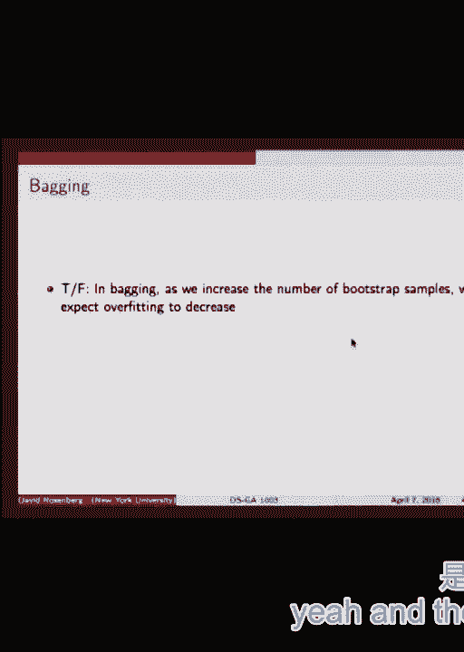

# P18：18.April_7_Lab - Tesra-AI不错哟 - BV1aJ411y7p7

好的，那么今天我们来复习一下考试内容。

我准备了一些幻灯片作为讨论点，但我们可以先回答你们的问题。可以混合进行。如果你们问我一些问题，我也可以问你们一些问题。直接提问，大家有什么问题可以随时提，我会记录下来，看我们是否能过滤出一些大家关心的话题。Piazza上有人问了一个随机条形提升的问题。

让我稍微讨论一下这个。好的，如果没有问题，我就开始了。首先，考试内容是什么？

主要是集中在我们迄今为止讨论的内容上，这些内容没有出现在第一次考试中。这是重点。直到昨天的讨论为止。基本上你应该知道似然函数，以及如何构造一个目标函数，使其在某些数据上具有最大似然。我认为大多数人在来之前就已经知道了这些内容，无论如何我们已经讨论过。

关于昨天的内容。那部分将是考试的范围。好的，那么我认为我们做的最后一个、上次考试没有涉及的主题是核函数。所以我记下来了一些。当你想到核函数时，你应该肯定明白我们所说的核技巧是什么意思。有人能用不同的方式表述一下核技巧的概念吗？我想试试。

假设你有一个机器学习算法，你可以将目标函数完全写成什么形式？好的，非常好。是输入X的内积，或者某个特征映射输入X进入某个特征空间的内积。所以只要目标函数中有X，它的形式一定是Xi转置Xj，或者Xi和Xj的内积。绝不会只是Xi单独出现。好的，明白了。

那么当你把目标函数写成这种形式，即核化形式时，会发生什么？

那个形式将会是核化的。而核技巧就是你可以替换掉那个内积。所以如果你写下Xi转置Xj，那就是标准的欧几里得内积。你可以将其替换为任何你想要的其他内积。好吧。所以我们基本上讲了两种方法来构造新的内积。

所以假设我们有Xi转置Xj。那么我们可以做的第一件事是，永远可以这样做，就是用一个新的特征映射替换它。所以它可以是phi of Xi phi of Xj的转置。好吧。当我们以这种形式出现时，通常方便将其写成我们所谓的。

一个核函数。你可以写下它等于a。我在这里想写什么？

它有两个参数。Xi，对吧，和Xj。所以核函数接受输入空间X中的参数。核函数将输入空间X的元素映射到实数。X可能根本不是Rd。X可以是我们想要的任何类型的空间。但是核的输出是实数。类似地，特征映射接受输入空间的任意元素，这些元素可以是任何。

输入空间的某种映射，它把输入映射到 Rd 或 R 中的某个东西。好吧，嗯。所以，制作核函数的两种方法，一种是想出一个你喜欢的特征映射，一个新的特征映射，然后使用标准的欧几里得内积。另一种方法是直接写出一个函数，并证明它具备相应的特性。

一个核函数需要具备的特性。它基本上是由内积的性质派生出来的。关于核的内容有问题吗？树。于是我挑了一个你应该了解的树的特性。它们不关心某一特征的具体值。它们只关心值的相对排序。所以如果我问问题，你知道。

这里在输入空间中，我们有一个特征是温度，单位是摄氏度。然后有人建议进行对数变换，出于某种原因。你应该意识到，这对树模型的作用没有任何影响。因为树模型不关心这个，它不会改变相对值。

所以这并不重要。好吧，树还有什么其他好处？

树还有什么有趣的地方或者问题？树把你的输入空间进行了划分，对吧？输入空间的每个小区域对应着树的一个叶节点。每个叶节点有自己的预测值。还有什么呢？关于取叶节点的技巧呢？

指示函数是用来表示输入空间中哪个叶节点或哪个区域包含当前输入。并且将其作为其他分类器中的一个特征。记得这个概念吗？

所以我们可以在某个数据集上运行一棵树。然后我们可以把树将输入空间划分的所有区域作为特征编码到数据中，然后通过 Lasso 或其他方法进行处理。好了，我有一个真/假问题。你有问题吗？

这是什么意思？叶节点是特征。可能一半的同学会问，幸好你问了。好吧，输入空间是 X。好吧，树做了切分。假设有两个特征。第一个切分可能在这里。接着第二个切分把数据放到左边，接着第三个切分把数据放到右边。然后我们觉得无聊就停下来不再构建树了。好了，最后我们在这里有一个预测结果。

A1 和 A2 在这里。你知道我的意思吗？这些区域中的每一个对应树的一个叶节点？

好吧，这是一个区域，我声称你可以编码一个 X 的函数。这个 X 映射到某个值，当 X 在这个区域内时，该函数值为 1，否则为 0。这个就是在 W0 处的切分，这个是 W1。然后我们可以将 X 映射到指示函数。所以这是 X1 轴，这是 X2 轴。现在我们可以说，X1 我该怎么做才能让这个区域的值为 1？

好的，X1小于或等于W0，X2小于或等于W1。所以这是一个特征映射。这个映射为X提供了一个特征，当X处于这个区域时，它是1，否则是0。好的，我们可以为这些区域中的每个区域制作另一个这样的特征。所以这是X的一个非线性特征映射。它以一种方式表示X，我们现在可以创建你以前无法做到的预测函数。

只使用线性回归来产生。假设你尝试构造X1和X2的线性函数。那么我们只能做到像这样的事情。但如果我们取这些特征函数，并对它们进行线性回归，我们就能得到这些类型的边界。这样做的好处是，那么为什么你要使用这个呢？

假设你有一大堆数据。数据多到需要一些可以非常快速运行的数据算法。那些可以非常快速运行的算法通常是线性算法。岭回归，很多回归，这些东西。树会慢很多。梯度提升慢得多。所以我们可以选择走线性方向，使用我们所有的数据，或者走非线性方向，只使用一个。

子集或永远等待。好的，那这个怎么样？

如果我们对数据的一个子集进行非线性处理，然后从这个非线性事物中提取一些新的特征，这些新特征是非线性特征，像这些东西。那么，取这些非线性特征作为输入传递给我们的线性模型，现在我们可以在所有数据上运行，但是最终的预测函数是非线性的。这个问题很有意思。

所以问题是，这个我们能以某种方式将其视为boosting吗？

让我想一想。嗯，我不知道。Boosting就像是你构建一个模型，然后看看哪些地方做得不好，然后你再构建另一个。这是一个两阶段的过程，而boosting是多个阶段，但我不确定它是否会深入到更深的层次。好的，如果我们的弱学习者有某种联系呢？

比如单位置的树桩，然后我们将它们与线性组合结合在一起，ada-boost然后你的决策区域可能看起来有些相似，但我不认为这是一个非常紧密的联系。是的，的确很接近。我们有一个非线性模型，从中提取了一个特征映射的想法，然后将这个特征映射用于线性模型。是的，我也有点担心。

好的，所以我并不太担心树会过拟合太严重，因为我所要做的是，我会将这些特征放入我已经知道如何很好地正则化的线性模型中。所以我使用L1正则化，你知道使用一大堆集合来确保我不会过拟合。

所以我并不太担心树会稍微过拟合，但你有什么具体的想法吗？不，我是说我使用单棵树来决定哪些特征可能会被四分之一使用，或者不使用，所以可能这就是我使用的特定树的最差情况。你的意思是因为它是一个随机子集？

是的，树是我们所拥有的这个东西。嗯，我明白你说的意思。你是说，这棵树的叶节点是基于数据的随机子集。如果我有一个新的随机子集，它会非常不同，确实是这样，但……那些真正重要的节点应该大多数树上都会出现，或者什么的。

这与核方法（kernel）有关吗？因为看起来你在尝试构建一些新的特征。那很有意思。与核方法有直接关系吗？因为在核方法中，我们有点像是在创建一个新的特征映射。好吧，在某种程度上，针对核方法，我是说取你的 xi，xi 的转置，并且交换成一个新的特征映射，但也许仅仅是这样。但它确实是在生成新的特征。

学习数据的结构。我不太明白那是什么意思。我不确定这是不是那个意思。我不清楚。我是说它并不是在可视化数据，因为我画的是二维的，但通常情况下，它可能是非常高维的。其实这不是你能直接可视化的东西，但从粗略的角度来说，我让树来……

对数据进行第一次切分，选取一个数据子集，然后我就从中提取一些东西。我猜是这样，嗯。对于那个要点，我没必要质疑它。那完全是树。好吧，那我们来谈谈袋装法（bagging）。神经袋装法是这样的。我们有一个数据集，大小为 N。我们通过有放回抽样从中抽取样本，通常是大小为 N，尽管如果你看过 Piaf 上的讨论，那里有一个很好的分析。

它是否真的需要保持在 N，或者可以更小或更大，但是标准的袋装法是，你从数据中抽取一个有放回的样本，这个样本叫做自助样本，然后你在这个随机样本上训练一个模型。然后再取另一个大小为 N 的样本，训练另一个模型，再来一个，直到你觉得无聊为止。

你的预测是每个模型预测的平均值，基本思想是，这样可以降低方差，平滑你的预测，并且通常会帮助你在不同的情境下做出更好的预测。那么针对这张幻灯片上的问题，袋装法中，随着我们增加自助法样本的数量，我们会期望过拟合减少吗？

所以如果你做那个重采样的过程并且不断往你的集成模型中加入更多的函数，你会只是取这些函数的直接平均值。你会认为加入更多的函数会导致过拟合，还是说它会让过拟合变得不太可能呢？这是对的吗？对，错。对的话就意味着我们认为不断地加入更多的函数是有益的。

如果你不断地往这个平均值里添加更多的函数，它不会过度拟合。所以你明白了。你觉得如果我们将这个过程无限进行下去，会怎样？我不太理解，我也不确定这到底是什么意思。但我不确定。为什么你认为它会在某个迭代次数后开始过度拟合？

所以担心的是我们可能最终会多次得到相同的样本。这为什么是个问题？我们有相同的函数多次。那么它就会进入平均值多次，但我不认为这是一个问题。是的。我在想，当你做随机抽样时，这就像是从样本中拿取数据。

样本量越大，花更多的时间来做，它就越具有代表性。好的，所以我们每次都取相同大小的样本，然后对结果进行平均。所以对我来说，是否变得更加具有代表性并不完全清楚。哦，你是觉得它因为收敛到期望值或类似的东西吗？

所以问题在于这里没有，我没有关于这个的精确定理。不确定是否存在，或者可能存在，但我无法找到，无论是在教科书还是论文中。所以这更像是，实际上它是可以验证的，直觉上它也非常合理。是的，没错。是的。好的，让我能不能重新问一下这个问题。

我可以只是把它改成我们期望过拟合不会变得更糟吗？所以你认为什么都不会改变。我看不出这些不同的东西在你做出预测时会如何影响。我会说这没有任何影响。你不喜欢当你对多个样本取平均时方差会减少这个观点吗？

函数。我找到了一些非常有说服力的例子。所以我们有一堆预测函数，期望的预测是正确的，但是由于样本中的随机性，存在一定的变异性，当我们将这些东西平均起来时，我们预期预测的变异性会减少，但偏差应该保持不变。因为所有样本都是独立同分布的。因此，bagging的直观解释是，预测的方差减少了。

但是偏差保持不变。所以减少偏差会减少。在这种情况下，减少方差会减少过拟合。什么是减少方差？

减少方差。因为如果你的特定国家实际上只是你试图预测的国家中的一个轨道，减少方差是为了减少未来的错误预测，并且你只是在得到一个新的或更新的预测。如果你对每个样本的所有预测都在过拟合，那么你只是在尽力做到最好。等一下，等一下。好的，让我们考虑对单个输入X的预测。

我们只关注这一点。所以我们画一些随机数据，然后在其上构建模型，称之为F1。然后我们在X上评估它。所以它等于Y1。现在这是基于数据的随机样本，因此我们也可以讨论F1在X上的期望值。我们把它称为Y1。现在我们称它为Y*。Y1*。好的，明白了。

现在我们有另一个问题。Y2，首先在这个期望中，什么是随机的？

总是一个好问题要问。什么是？我们为F取样的训练数据。所以在这里，什么是随机的？我应该下划线标注什么才是随机的？是什么？

哦，普遍来说是不正确的。再猜一次。F是随机的。为什么F是随机的？很好。继续思考。我们需要一个理由。为什么F会是随机的？是的。F是从随机数据样本构建的预测函数。X在开始时是固定的。我选择了一个输入X。我说我们来集中讨论X等于这个图像。

然后，每次我们从训练数据中抽取一个自助采样时，我们会得到一个新的F。所以F在这种情况下是随机的。好，没问题。现在我们抽取另一个样本，得到另一个F。我们得到了另一个F，因为F是随机的，每次我们抽取一个新的自助采样时，我们都会得到一个新的F，而每次我都保持X不变。好，F2相对于X的期望值是多少？

这也是为什么它是一个星号。还有X。是的。

所有F的期望值。

每一个我们随机生成的F都会有一个期望值。好的。但是当我们将这些值平均在一起时呢？这个东西的期望值？依然是一样的。但是这个东西的方差呢？它减少了多少，或者方差减少了多少？

我们想要在平均值下进行这个操作。所以，方差在平均值下。是的。好，你可以计算平均值的方差。它是F的倒数。是的。期望值等于F，并且它远离了π。不是，等等。我为F绘制的训练数据样本，每个样本都是以相同的方式生成的。

所以我做了训练数据的抽样。所以你想说，如果F不是。我并没有说F得到了Y的正确值。我说的是它得到了Y的一个特定值。这仍然可能是有偏的。所以它并没有减少偏差，但它没有改变偏差，却改变了方差。是的。我可以看到方差减少了，但为什么？

好吧，忘掉过拟合这个词吧，因为正如我所说，过拟合并不是为了。所有的都很好。我们就说是为了做更好的预测。我们能这么说吗？这就是我想要声明的。不是的，但如果你的所有“快乐”都来自过拟合，你只是在试图得到平均过拟合的点。我是说，我们的看法更依赖于你的学习器是什么，而不是这种情况。

因为如果你的学习器只是一个过拟合的学习器，例如你有更多的迭代。那么每个F，F Y，F MX，它们都是过拟合的，那你只是在试图获取所有预测的平均点，这也是过拟合。为什么一个过拟合的东西的平均值也是过拟合的？我不同意这个说法。

我声称它会更合适，因为。这是我的问题，为什么它在我自己这里？因为它结合在一起，它会更合适。所以我们有一个过拟合的情况，对吧？我们有一棵拟合得太好的树，但也许。它并没有偏向任何一方，所以期望值仍然是正确的。但有时候它会混淆，并且过于关注错误的事情，不管它有什么。

任何特定的实例都会因为过拟合而有一些误差，但如果我们把这些一起平均，它仍然是无偏的，但方差已经减少了。那么，我能说我可以看到这些东西的平均值比某些 F X 更好吗？但也许更多的某些东西。你不能说平均值比它们所有的都好。

我不能准确地说这是什么。我是说这个是准确的，但这甚至不是关于这个的。这是我们实际上会用来做预测的东西，我说的是，我给你一些关于这个作为随机变量、作为随机实体的方差。我们只能得到其中的一个。所以我说这个东西的方差是减少的，但实际上我们只有一个。

这个平均的实例，所以一般来说，我们期望它是很多平均值都不好，或者不好。为什么平均不好，或者不好呢？我看不明白。好吧，那这个呢？

所以，F1 X 的方差是 100。预期值是零。好吧。好的，我甚至不知道真实值是什么。没关系。所以我生成一个随机的 F，它预测一个随机抽取的 F1 X 的典型预测值。那将是预期的预测值。零是可能的，但不太可能。

它可能会偏离零一段距离，大约多少？十。所以一个随机抽取的 F 会偏离零大约十。好的，那么它可能预测，也许是六，也许下一个是负五。所以如果真实值是零，如果这是无偏的，那么这将是典型的预测值。

每个预测的误差。现在，如果我们取其中两个的平均值呢？

如果我们取这十个的平均值呢？你会期望偏离期望值的典型偏差会减少吗？

这就是重点。所以那个偏差就是误差。但是其他的，你是偷的。能问你一个关于我们如何做到的问题吗？

好的，让我们继续，谈谈 sumpcata。也许对这个问题已经说得太多了。我是说，关于过拟合的部分，是的，我应该问的是，您会期望拟合会改善吗？

替代过拟合，过拟合并不是一个非常明确的术语。好吧，既然如此，使用袋装法（bagging）我们如何在仍然使用所有数据进行训练的同时，获得测试性能的估计呢？所以是的，这是袋外法（out-of-bag method）。在每一轮的袋装法中，我们取一个自助样本（bootstrap sample），大约你记得的那个比例。

多少百分比？大约 30 多。是的，大约 30 多，像是 1/E 左右的比例没被采样，所以这些东西是那个特定预测函数的外样本。所以任何类型，你可以把这些点作为测试数据，供任何涉及这个特定函数的集成使用，而这个函数并没有在这些数据上进行训练。所以基本上你做的是，你取。

这是你的原始样本，原始数据。你从中取出一个点，看看所有在没有使用这个点作为训练数据时生成的函数。然后将它们平均，看看它在这个点上的表现如何，这就像是一个关于你在这个点上表现的“外样本”评估，你可以这么做。

对于每一个点，值得回顾一下。那么，随机森林是仅仅通过树进行的袋装法，正确/错误？那么额外的部分是什么？

每次你澄清这一点时，你是否需要确定特征的样本？

好，每次你进行拆分时，你是在从一个特征的随机子集当中进行选择。典型的数字，典型的特征数的比例。有时你使用特征数量的平方根，有时你使用特征的数量，这个是一个调节参数。好，跳过。我会说，方法的发明者在他的论文中非常坚决地声明。

没有证明随机森林永远不会过拟合。而他所指的是，袋装法不会过拟合。总之，不，这个说法是错误的，或者是未决的，如果你只想相信已被证明的，因为我们还没有证明。但总的来说，没关系。好，外部提升。正确/错误，我们可以使用回归树作为外部提升的基础分类器。不能。我们需要用什么？使用外部提升时的一个关键要求是什么？

好，所以有两件事。我们需要它输出，必须是一个硬分类器，-1 或 1，这个是内建在算法中的。现在，还有一个关于收敛到最优解的定理，像是训练集上最好的可能值，但要做到这一点，定理要求它是一个弱分类器。

做得比 50% 更好。我会说，但实际上在实践中你无法知道你是否有一个弱分类器。这不是你能知道的东西，你可以希望，但你不能知道。所以，这更多是在理论方面的内容。在实践方面，我们需要基础分类器给出硬分类，-1 或 1。我们可以使用 SVM 作为外部提升的基础分类器。正确/错误。正确/可能。

如何使用 SVM 作为基础分类器？取符号。对，SVM 通常会返回一个分数，一个实数，然后取符号。是的，如果你想特别小心的话，零的符号是零，传统上如此。所以，如果你真的想小心一点，你得确保将零映射到某个值。

但是，是的，这很好。通过我们刚才讨论的内容，没错。这不会是一个测试题，因为它太模糊了，但你必须知道。如果你取你的 SVM 输出并将其转换为 -1 或 1，那么是的，我们可以使用外部提升作为一种方法，通过前向阶段加法来最小化指数损失。

建模。什么？是的，没错，这就是作业问题，Ann在讲座中也提到过。那么，指数损失有哪些问题呢？没有稀疏性是对的。我不知道，这不一定是个问题，对我来说也不是问题，有些人对此抱怨。我不介意。是的，一个问题是它会对错误的答案进行非常严重的惩罚，因此它将会。

会受到非常大的影响，但它会受到异常值或噪声数据的强烈影响。好的，梯度提升。所以我们已经有了关于梯度提升的作业。一定要复习梯度提升，为什么？因为在梯度提升中很容易出问题。所以我会为此做准备。那么，这意味着什么？

这意味着这是一个损失函数。也许我会告诉你，做梯度提升需要哪些要素。如果我说你编写这个梯度提升算法，你会说好的，我需要知道X和Y，我需要告诉你做梯度提升需要一个损失函数。你还需要别的吗？是的，你需要一个基本假设库，好的，那基本学习器需要什么样的？

这个过程是从假设库中选择，并且需要什么样的假设空间，或者说需要什么样的学习器？对于我们讨论的梯度提升版本。假设空间应该是什么样的，好的，让我们先回顾一下。假设空间包含决策函数，决策函数接受输入并生成。

某种输出，这些决策函数应该为一个实数值输出什么样的结果？没错，输出实值的东西就是回归函数。所以我们的黑箱方法需要是回归。好的，我们称之为回归，这些内容在上节课的空间中讨论过。是的，没错。

有什么问题吗？好的，继续。我真的不记得H了，但是在梯度提升中，我们得出一个向量，这个向量就是未约束的梯度，我们需要将它投影回我们的弱假设空间，我们这样做，通过最小化L2距离来进行投影，因此我们通过找到一个预测值接近L2的函数或假设空间来做到这一点，那就是回归。

好的，是的，那些就是我们称之为的函数。好的，好的。多类别分类，你应该知道这些要素，并且对它们感到熟悉。所以我们有这个类别敏感的损失函数。如果我预测是3，但实际上是4，那可能是2的损失；如果我预测是2，但实际上是。

3，或者其他反过来是5的损失。这里有一个类别敏感的损失函数概念。我是说，你会把它画成一个表格，对吧？

所以A表示动作，Y表示真值，0 1 2 0 1 2，我们会在这九个单元格中计算损失，通常你会期望正确答案的损失为0，所以这就是典型的0 0 0。你可以在这里有5，这里是3，不能一定对称，所以这就是delta。我们有我们的特征映射，在多类情况下，它接受x和y，你可以认为。

可以把它看作是对x和y之间兼容性的编码，然后我们的线性评分函数。它是一个单一数字，用来评分x和y的兼容性。我们只讨论了线性多类，你的最终预测函数是选择具有最大分数的那个。我们其实讨论了两种损失函数，实际上是一天内讨论的一种——多类逻辑回归，我在幻灯片上做了展示，但我很想有一篇文章讲更多参数的情况，但我还没见过。

hinge损失，你现在有这项作业，所以你应该已经很熟悉了。那是什么？好的，这也是我们昨天讨论的内容——多项式逻辑回归。损失函数，它也是一个多类损失函数，你可以把它理解为最大化给定的多类多项式逻辑回归的似然。

或者最小化负对数似然，但这也是我们可以用于多类的另一种损失函数。所以我建议从昨天开始，回顾一下我提到的四个条件似然的例子。我们讨论了二项式、多项式，还有相同大小的例子，包括泊松回归和高斯回归，我想我也讨论了泊松回归。

我认为这样你会掌握它。我总是这样考虑，我们有一个具有相同参数的参数化家族。theta，我们的模型首先输入x，然后我们把它映射到一个单一的数字，对吧？使用线性方法，我们得到这个值，最后我们希望将其映射到theta，而theta可能有一些限制范围，对吧？所以我们可能会有theta在0到1之间。

在0到无穷大之间有theta，因此这会映射到f(w转置x)，我们把它当作theta。是的。你不希望它们出现在考试里吗？我昨天说了这个。是的，我改变主意了。抱歉，是的。一个参数中询问的选项是什么？好问题。除了一个示例的多项式，我从未在任何教科书中见过这方面的内容。

好问题。所以这不是问题，我只是在任何给定的示例中都没见过这种情况，那么在那种情况下我们该怎么办？

我们会将x映射到w转置，其中一种方法是将x映射到w1转置x，再映射到w2转置x，然后f返回两个参数，或者类似的东西。是的，你可以这么做，只是我除了在一个多项式示例中从未做过。我的重点是，我想能够引用似然，所以我不。

我预计会比较难，但我不认为这些内容真的很难。如果你复习一下，其实并没有什么神奇的东西。好了，我们还剩两分钟，大家还有什么问题吗？我会把这些幻灯片发给大家，有其他问题可以问，或者关于测试的我也可以回答。是的，在随机森林中，我们喜欢使用非常深的树，这没错。

是的，深度树有较低的偏差和较高的方差。对，所以这里的想法是，当你做集成学习时，你是在降低方差，因此如果你一开始偏差较低，即使方差很高也没关系，因为集成学习会减少方差。说到这个，这也引出了为什么我们可能会怀疑，随机选择特征可能有助于改善结果。

因为你不希望树之间有太多的相关性。我们希望树尽可能地不相关。所以当我说将多个结果进行平均可以减少方差时，这在特征不相关的情况下是完全正确的，但在集成学习中，特征并不完全不相关，这就是为什么这并不能算作是一个严密的证明。

我认为我们在特征层面并不太关心这些，我们更关心最终的预测结果，关心的是树与树之间的预测应该尽可能不相关，要具有多样性。我们希望通过在路径上随机选择特征来实现这一点。

当我们生成随机树时，我们会得到一组更加多样且相关性较低的树，从而进行平均。所以我想我们就到这里吧，现在是8点，我会在这里回答问题，如果你们大多数人需要离开的话，但接下来会有一个关于条件概率模型的例子，会涉及这些内容。

我会发这些幻灯片。很棒，是吧？[听不清]

（笑）

