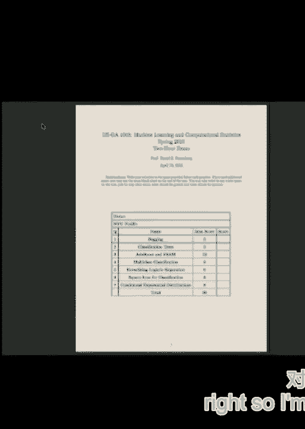
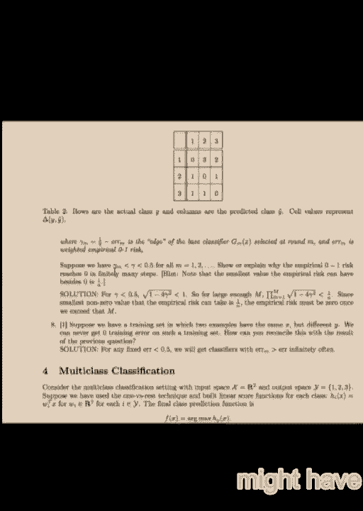
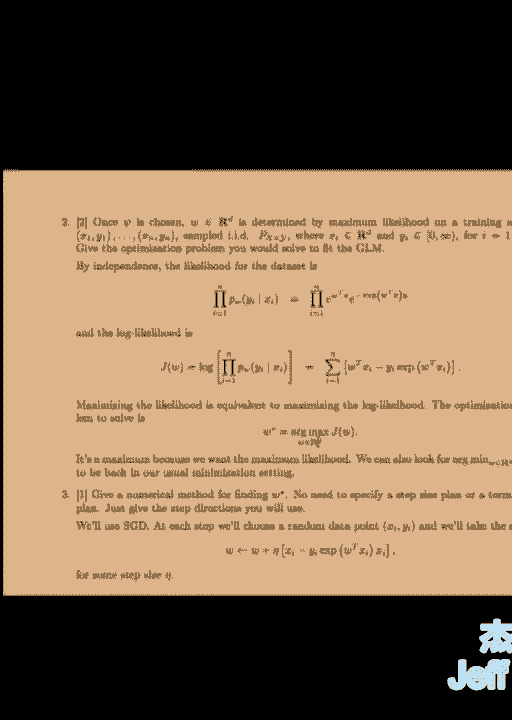

# P20：20.Lab_April_21 - Tesra-AI不错哟 - BV1aJ411y7p7

好的，那么考试是怎么进行的？怎么样？太简单了吗？太短了吗？太长了吗？但不难，对吧？

好的。你能读懂这个吗？看起来不是很清晰，对吧？所以我会尝试。

好的，大部分问题都非常自描述，如果你注意到文本，你就能掌握解决方案。文本会引导你找到解决方案。这也是一个问题。第一个问题告诉你我们从已有数据中采样，然后查看我们预测的平均值。然后我们比较预测的平均值和实际值有什么不同。

而不是只有一个预测。所以一方面我们有F，另一方面我们有N个来自D的不同样本，并且我们会得到N个不同预测的平均值。所以这些是相同的样本，并且它们的大小也相同。所以它们具有相同的统计特性。这个问题中的所有FIs具有相同的统计特性。

那么显然，某个东西的平均值的期望值就是单个事物的期望值。在这种情况下，平均值是F-hat，单个事物只是其中一个F。通过这个等式，我们得到Z-bar的期望值等于Z的期望值。为什么？

因为期望值是线性的。在问题中？第二部分。那偏差呢？

对我们来说，它只是我们预测的期望值与真实值之间的差异。所以它看起来像是一个线性量。观察Z和Z-bar的偏差，你会发现它们真的很酷，因为第一部分。它们的期望值真的很酷，mu是一个不变的真实值，无论你在方程的哪一边，它都不会改变。

所以你得到了相同的值。大多数问题都有简单的一行答案。第三部分问的是方差。现在在这种情况下，方差不是线性算子。那部分可能有点棘手。但问题中给出的所有必要信息都很明确。打破叙述的是提示中的第一个公式：如果你将变量乘以常数，那么它的方差是常数的平方乘以原方差。

然后，利用这一点，将1/m提取出来，得到1/m平方乘以和的方差。现在你可以使用提示中给出的第二个公式将和拆开，得到m倍的一个随机变量的方差。我记得在分母中有1/m平方，所以一个m会抵消，得到Z的方差除以m。第四部分你会选择哪个？选择方差较小的那个更合适。

如果是你来选择的话。第6部分仅仅是随机力的描述。所以在第5部分，由于常识推理的一般原因，你会选择那个方差较小的。在第5部分，这个方程告诉你，如果你有相关性，你通常会有更高的方差，所以你想选择那个相关性较小的。因为你想选择那个方差较小的。方差越小越好。就这样。

仅仅因为你选择了那个方差较小的就足够回答问题了。分类树记得我们有这个简单的树。而我们想要的是什么，我看到一些论文在这个问题上感到困惑，不知道该看什么。我看到的第一部分是，有些答案把包含四个项的数据分成了过去的距离和开放的空间。

但真正被问到的主要问题是该地点是否是期望的。所以这就像是投掷硬币，你有四个硬币，结果要么是正面，要么是反面。在这种情况下，结果是该地点是否是期望的。然后你有一些其他的属性，比如硬币是偏的，或者硬币像一枚镍币或四分之一美元硬币。

你需要看其他属性。最主要的是是否是所期望的。所以这里的每个PI实际上应该指的是该地点是否是期望的概率。所以，给定样本中有四个元素。某个特定地点是期望的吗？它是二分之一的概率。

有两种可能的结果。是或不是？这就像一个二元问题。所以你得到的是两个事物的总和。第一个项是“是”的项。第二个项是“不是”的项。然后每个PI是二分之一，因为根据你提取的数据，你得到的概率信息就是一。因为二的对数一二分之一也是一。那么，当你使用公式熵时，你想说它不是为大小设置的是什么意思？

是的，太好了。所以就像在同样的情况下，投硬币的概率。硬币是正面还是反面。所以你的Ω是H或T。这就是它所指的。这里Ω的大小是二。如果我看的是两次投硬币。是的。所以就像你的事件是投硬币的事件。你可以投掷任意数量的硬币。结果将是正面或反面。你的样本空间。

对吧？因为你只投掷一次。你不会投掷两次。所以在一排中投掷两个硬币就意味着买两套公寓。你不会这么做。你的样本空间就是这样，然后你从中抽取样本。我认为我们很多人都会从这里进入分析阶段。你得到了大小的大小。抱歉。

回来了。好吧。我以为你会进入计算的部分。是的，但从某种意义上讲，这是在测试基本的概率知识。那么，如果我给你五次投硬币的结果，你该怎么做？你的N是五吗？不。不是的，因为你的样本空间是已知的。样本空间的大小是已知的，如果你手头有数据。

所以你并没有提出问题的概率模型。不，我理解这个。但是它的书写方式有点让人困惑。嗯，我认为问题的描述还是很清楚的，因为它强调你应该集中关注目标列。目标列只有两个元素。要么是“是”，要么是“否”。里面没有其他的。对吧？

我以前是这样做的，因为在作业中，他们定义了N作为你在节点中拥有的元素数量。是的，这里也是一样。这里有“是”节点和“否”节点。对吧？所以是的。那里有两个。那么你如何做这个“是”的数量呢？“是”的元素数量，是所有元素总数的一部分，位于节点的末端。

所以你将根据二分之一的方式进行，或者二分之一的方式。在那一边，你可以做得更长。可是它给出的答案是错误的。不符合解答。它没有给出正确的解释。对吧？

然后你会得到每个版本需要满足的条件，例如一半一半，一半一半，一半一半。是的，但这会让两件事变得混淆。其实，第一部分是这样的，你知道的，我读到过，叶子节点之间没有分隔，对吧？

你只有一个集合，且有四个样本。所以在这个问题中，即使在开始分隔数据之前，你首先从父节点开始。在父节点中没有分隔。然后你集中精力处理父节点，并且需要计算父节点的熵。现在你甚至没有，甚至没有拆分数据。

在父节点中，你有四个样本，从这四个样本中你获取概率，因为你不知道实际的分布，因为这四个是你唯一看到的。这就是为什么第一部分要求你集中关注目标值，因为那是你要关注的主要内容。

然后查看你将用来分隔的特征。接下来是叶子节点。所以将会有三种不同的数据分隔方式。每种方式都会看不同的特征，对吧？这些特征，你知道，问题的文本某种程度上强迫你去理解，你知道的。

目标值不是特征。目标值是我们最终关注的东西，对吧？

我们将用来分隔的特征是宠物的距离和开放空间。所以这就是为什么这两部分，你知道，它应该是一个提示，第一部分像是介绍，第二部分则是包含三个子部分的部分。你知道，强迫你去解决这个问题。因为即使你按照某些人的方式做了第一部分。

那么你如何在第二部分继续呢？第二部分要求你计算父节点的熵减去加权平均的子节点熵。你打算如何得出权重呢？那么权重是多少？

如果你通过观察期望能力开始分离，你如何计算w1和w2？对吧，这样会让一切变得不清楚。但其实并不不清楚。所以你可以以某种方式逆向推导问题，来修正第一部分。别误会，超过一半的人答对了这个问题。

但那些没有答对的人是这样。聚焦于单个样本，你会得到像1/4乘以log 1/4这样的概率，且有四个项。但很多人也得到了部分分数，所以并不算大损失。但我希望你能理解这里的主要问题。第三部分C中的第二题，你不需要做任何计算。这样就够了。

所以如果你在第一题做错了计算，一些人也会得到部分分数。但如果在其他部分同样发生错误，你将获得满分，因为你不希望因为一个错误而被多次惩罚。所以即使你在C部分做错了A和B，你也说它介于A和B之间，你仍然会得到满分。因为关键是，它将会是。

它将携带比某个特征少的信息，同时又比另一个特征携带更多的信息。所以它的信息量应该介于两者之间。你不需要进行计算。而第三部分只是从看三个数字的结果中得出的一个明显结论。同样，你可能会算错数字，但解释正确，仍然能获得满分。

第三题，第一部分是显而易见的。实际上，当你到这一步时，你会看到预测是0的可能性。正确的方法是？不，这里给出了从Rd乘积到-1到1的范围。是哪个？

在这三题中，G of X，使用零值且没有参考。这里。[听不清]。但G是返回平均值的函数。在第一部分中，它问你什么是基础分类器的返回值。基础分类器就是GM，对吧？所以这有点复杂。一旦不是演示的例子，就有点难以导航。所以看。

基础分类器就是这个。这里有一个打字错误。所以这个GM不是GM。当然，它是GM Xi不等于Yi的指示函数。所以它是零一函数。它在相应章节的幻灯片中有提到。另一个是预测的线性组合。现在。

阿尔法（alphas）是通过算法的方式计算的。然后到最后，你只需要取它的符号。也就是常规操作。如果你做过作业或者看过幻灯片，你可能会记得它。我认为大多数人都答对了。第四部分，当然你做了，但很难记住。所以描述在文本中给出。关键在于优化部分。

H和V被选中以最小化经验风险。所以你只需要选择H和V。你只需要写出损失函数，然后找到它们的两个参数。那也是作业的一部分。作业的其中一部分，是作业的可选部分。即使你没解决，作业的文本也在告诉你，作业的标题是，如果你在FSAM中使用指数函数。

它给你带来了另一种提升。它们相互对应。所以你只需要写出指数损失，你就可以开始了。第六部分是判断题。你怎么看？嗯？是的，我是说现在你看到了，但在考试中你怎么想？

这是错误的，因为假设空间不同。右边的是由V参数化的假设空间，它是V乘以X，V的转置乘以X。另一个则是它的组合，给你的是一个更大的空间。所以不容易恢复。第七部分只是一个估计问题。

在考试中我们修正了一个拼写错误。我希望这没有让你感到沮丧。所以这个拼写错误延续到了这里，还是没有修正。关键不在于gamma m小于0.5。重点在于gamma m远离零，并且严格远离零，所以gamma m必须严格远离零。这样就有了一个间隔，我们为什么需要这个间隔呢？首先，如果我有一个积，我怎么让它趋近于零？我必须让它的各项小于1，但我必须让它的各项严格小于1。

因为如果我有这个从山到无穷大的am的积，那么如果我知道am收敛到1，我不能保证这个积会收敛到零。这就是为什么我需要gamma严格远离零。你需要写的第一个点是这个平方根小于1。

但它严格小于1，因为它严格小于1减去4倍gamma的平方。所以它不会首先达到1。第二点是要注意函数可以取的值的范围是离散的。它可以是零，1/n，2/n。所以一旦它小于1/n，这将会发生，因为它会收敛。

你只需要证明它收敛于零，那么它就会是零。它会达到零，并且会在有限的时间内达到零。是的。如果gamma是零的话，我得坚持下去。例如。是的。它小于一半。是的。你有很多个1相乘。是的。而且永远不会达到零。是的，没错。然后它就不起作用了。

这就是为什么gamma必须远离零。这是一个固定的数字。它远离零。可能是你的信心很难接受。这是固定的。所以这一行，假设我们有gamma m小于gamma小于0.5，这不再成立。正确的版本是，假设我们有零小于gamma小于gamma m。并且gamma小于一半。是的。

你能解释为什么在训练后，你能提升测试表现吗？

这不是问题，但我们想知道我是否能得到它。它并不能保证，对吧？

它并不能保证测试的任何结果，对吧？通常是的。这就是泛化问题。像机器学习中的泛化问题通常指的是，是否在训练集上找到的最小值能在测试集上也找到最小值。

有时不能。我们知道它不能，因为有一种现象叫做过拟合。有时你会找到更低的点，它会给你更高的错误。你也许不该这么做。也许你应该在损失开始增加之前控制你的测试集或验证集。你记得典型的训练曲线底部是这样的，测试曲线则是这样的，某个地方会发生这种情况。

这就是泛化问题。泛化问题对不同问题有不同的影响。在这种情况下，我不想给出任何原因。它只是增加了。而且它就在这里。但它并没有。这可以趋近于零。

这是。所以我不理解当你得到零误差时，是什么机制允许你继续。

但是一旦你在训练集上得到了零误差，你就记住了数据。我记得，也许我记错了，但你曾认为我记得有些情况是，即使你的训练数据标签完全正确，仍然可以继续改进。

哦，是的，你可以。你可以完美地分开数据，但根据损失，你的损失仍然可能会减少。所以这是不同的，因为我觉得你在问：“假设你有这些数据，完美地分开了数据。”但根据你的损失，这个函数可能会有一个更低的损失值。所以，分开数据并不意味着你找到了最低的训练成本。

你的训练成本仍然是参数化的，取决于你在何处设置精确的边界线。它可能在参数域中呈现出某种类似这样的景观。它的值将是损失值。也许这能分开你的数据。但也许在这里找到另一个局部最小值会给你一个更低的损失。

而这可能会有更好的泛化，也可能会有更差的泛化，具体取决于你的数据。

这样能澄清你之前的问题吗？所以它的第八部分是，当然，如果你遇到的是相同的混合数据，但处理方式不同，那么发生的情况就是，你将不会有这种非收敛到1的现象。你曾经保证这个因素不会收敛到1，但现在不再是这种情况。所以前一部分的假设失败了，因此结果也仍然成立。对吧？

抱歉问你，Matt。你在整个站点上说过，你会让 u 在有限的时间内达到零。这意味着是吗？是的。但只有当你等于零时才行，对吧？对，没错。所以是无限的，不是有限的。是的。那为什么它会收敛呢？很多人没有明白。强调一下为什么它会趋于有限？

即使我们需要让 M 趋向于无穷大，才能让那个函数趋向于零。那个函数可能取哪些值呢？我们正在关注经验风险，对吧？是的。风险是离散的。它可以是零，1，1 以上，直到一。所以我知道随着 M 趋近无穷大，它会趋向于零，我知道有一个有限的 M。

假设 M 很大，我不知道多大，但它足够大，直到某一点，它将是一个介于零和 1/M 之间的正数。好吧，对。是的。一旦我证明经验损失小于一个介于零和 1/M 之间的数字，那它能是什么呢？它必须是零。它必须是准确的零，因为它不会取任何其他值。

这个范围是有限的。但那个函数可以取的值的范围，M 函数试图进行界定。如果我证明它小于这个值，那么有三个可能的值。这是零，这是 1/M。我告诉你有一个 M，有一个足够大的 M，使得那个函数小于这里的某一点。

如果它小于某个点，它可以是任何介于其中的值。它也可以是那个点。它必须是零。这个大 M 就是你在寻找的有限数。在多类分类中，我们必须构造函数 C，C 是 x 交 y，x 在 R2 中。我们的样本在 R2 中抽取。而 y 是只有三个元素的集合，1，2，3。

当然，D 在这种情况下将是六。它只是 C 的一个简单表示。而这个 F 只是对这里内容的重写，那么这部分内容就足够了吗？在第二部分，delta 函数在表中给出。我的意思是，只需要把东西放到位然后做计算。所以你可以把 i 取为 1 或者 1 取为 i，这没关系。

这只是 h 对我们手头的样本 x 的输出。所以如果你把它叫做 x1，那么我们可以计算这个核心函数，因为我们知道 delta，我们知道 h，对吧？

我们可以计算它们。所以一旦我们计算，它会是零、二，那么在我们计算之前，它会预测正确的类别吗？是的，因为 h 的 arg max，h 的最大值是 2。这个最大值是在预测 y 时获得的，预测为 1。而它实际上来自于第一类，因此它会给我们正确的答案。

然后看一下表格，查看这里给定的值，直接写出函数。哦，损失函数，你的损失值将是二。第三部分使用相同的参数化形式，涉及 c 并对 n 个样本求平均。最后一部分是次梯度的计算。所以在寻找次梯度时，

我们这里的一个问题是最大值。必须以某种方式绕过最大值，而最大值在提示中给出。那么，如何去除最大值呢？既然你知道梯度 fk 中的 g 隶属于梯度 f，那么如果你找到 fk 的一个次梯度就足够了，对吧？

你可以通过代入一个特定的 y 值来实现，这个值是给定的，位于这一行。就在这里，直接代入这个 y 头 i 来去除最大值。一旦去除了最大值，你就能够写出次梯度。由于第一部分不依赖于 v，只有这一部分依赖于 v，且该部分的梯度仅仅是简单的线性代数。

归一化的逻辑回归。将所有内容重新组合在一起，就像文本中给出的那样，你知道你的函数，假设空间是线性假设空间，v 和 cx 的内积。你需要平方损失函数。所以你写出 v 的参数的范数平方。并且有一个正则化参数。

就把它放在前面。然后剩下的当然是未正则化的损失函数，它是数据损失函数的平均值，损失函数如上所示。只需将 n 替换为，这里给出的 y 乘以 f(x)，而 f(x) 来自假设空间。所以 f(x) 就是 v 乘以 cx。将所有内容结合起来，写出这个项。

所以我们调用一个 mid-1。这里的 c 除以 m，我们会看到。如果 c 是常数，那没问题，但如果 c 是参数，那就没有了，对吧？我们这里没有那个参数。但如果它是常数，那么没问题。现在，我们想在下一部分使用表示定理。我们希望这两种形式看起来相似，所以我们做的是将 r 作为平方函数。

它取 x，给出 x 平方乘以某个长度。重点是 x 平方满足表示定理的假设，即它必须严格递增。那么我们该怎么做呢？

如果我们知道定理的假设成立，我们就能找到给定的解。这在定理的正文中有所描述。所以我们只需要将候选解写成 c 的线性组合，然后代入内积中。一旦代入内积中，我们可以把求和符号拿出来，因为内积是每个变量的双线性函数。所以我们可以以相同的方式将常数和求和符号提取出来。

这给了我们仅仅包含c的内积，因此我们去掉了，你知道的，把系数提取出来。那个内积是什么？那个内积就是核。它再次在问题的主体部分给出。所以我们只是。线性法则只是一个符号上的区别。这是xi x的核，我们把那部分核化。

我们继续第三部分的问题。现在我们想要把所有的东西都写出来。记得V的J是这个。现在我们想要用新的符号来写出这里看到的所有内容。现在，你知道，我们只是将一切重新公式化为x就是V的平方，V的范数。我们有x的范数就是x和x的内积开方。

你可以用内积表示范数。这样就得到了J的第一项。对于J的第二项，我们需要什么？我们需要写出这个内积，V乘以c。所以我们将V代入那部分，再次提取系数，核化是在第二部分。我们就得到了我们想要的损失表示，用α表示，用系数表示。

这应该是直截了当的。有什么问题吗？[沉默]，[沉默]，好的，那么第六题。分类的平方损失。我们有平方损失为真实值减去预测值的平方，显然如此，但在这个接受概率中，我们会根据数据来查看它，所以它是给定x之后再求期望。所以你在这个问题中应该知道的一点是，[沉默]。

那么，是什么东西最小化了平方损失呢？

你们有些人还记得上过课堂，损失和这些内容吗？

你可能记得，期望值，期望。条件期望最小化了平方损失。但是，我是说，你并不需要知道这些内容来考试，但它，重要的是要提醒自己。那么，这里，我们有什么呢，我们有，问题再次自我描述。

我们必须计算给定x的平方损失的期望值，把它写出来。对y-hat求导并求解你想要的参数。为什么它是一个随机变量？所以，给定x，y有两个值，它可以是1或者-1。所以给定x，我可以写出，哎呀。给定x，如果有两种情况。

y的值要么是1，要么是-1。如果是1，它以概率p为1。那么它是p乘以1减去y-hat的平方，这就是里面的函数。加上。另一个选项是y是-1，这里在第二项中是y减去1。这发生的概率是1减去p。这就是这里的函数。

随机变量的函数的期望值是以相同的方式计算的。所以这里，也许是概率事实，如何计算这个期望值。f(x)的期望值可以通过x的分布来表示。一旦你找到这个表达式，其余的就更直接了。你要找到参数，所以你只需对其求导。

只需要取y-head，然后将其设为0，解出y-head。Y是2p减去1。这里的p，在解法中为了简化，表示的是x的pi。所以你实际应该写出的解是f star of x等于2 pi x减去1。然后，最后一步就是解pi为f。这个只是简单的代数运算。第二部分。所以。

我展示了平方损失是基于边际的损失。边际是y-y-head。l-fam是1减去m的平方，那么接下来怎么做？

你得到的损失是y减去y-head的平方。如果你展开，你得到y乘以y-head的项。所以你可以按y乘y-head的形式分组。可能棘手的地方是，意思是，提示这里告诉你，y的平方始终为1，因为它要么是1，要么是-1。这部分没问题。我们不需要处理这个，因为这已经是m了。

我可以用m来表示它。再一次，我可以将y-head的平方写出来。你知道为什么吗？

由于y的平方是1，我可以用任何我想要的东西乘以y-head的平方。所以y的平方乘以y-head的平方是。我可以加上这个因子，将其写成m的形式。关键是找到一种方式在方程中提取m。然后我得到1减去m的平方。条件期望。给定我们拥有的函数族。

给定从W到lambda的映射。有问题吗？从W到T。X到lambda。所以给定X，我的参数lambda可以用参数V来表征，V转置乘以X。然后我可以替换这里的函数，lambda乘以e的负lambda y。通过给定X的情况下lambda的值，即重新写出这个函数。

将lambda替换为指数的W转置乘以X。第二部分。给定数据，给定像这样的多变量样本，它们是独立的。所以我可以将联合分布写成它们各自分布的乘积。这就是独立采样假设。通常你只需写出。

由X给定的V参数化的y。它们是向量。但是如果你知道它们属于这个族，你可以将映射因子化并相乘。在乘法中，你用第一部分找到的表达式替换它。再次强调，似然函数仅仅是求似然，但在似然函数中重要的是你总能去掉那些不涉及你的参数的项。

你记得在高斯情况下，如果你看似然函数，你会看到1除以根号2 pi的各个因子的乘积。所有这些在你的似然函数中并不重要，因为你并不关心似然函数的值。

你关心的是最大化似然函数的域中的位置。这就是做最大似然估计的全部意义。取对数只是让微分变得更容易。作为一个信号，表明该对数函数的值并不重要。

点在领域中的位置很重要。对你来说这才是关键。而这体现在你所关心的是RD中JFW的argmax。

你用了什么数值方法？最小化优化应该是好的。这描述了Schrasse梯度作为一个示例，因为我们只是从整个总和中取一个样本。然后我们写下那个样本的导数，然后我们朝着该特定示例的梯度的负方向迈出一步。乘以一个正的步长。这就是Schrasse梯度下降的描述。

我本可以使用那个和成分下降相关的总和。你不必找到整个算法。只是那个步骤。再次地，用相同的方法。这是函数方法。现在它是指数中的某个函数。只需写下J。再次地。对F求导。几乎就是对变量求导的相同方式。

如果你对你的函数进行参数化，那么你可以使用链式法则来使用这个公式，并将其应用于链式法则，以找到你为编码目的所拥有的所有参数的原始表达式。然后以同样的方式，就是在你的损失函数的假设空间中取参数。

损失函数的梯度。我猜这就是考试的结束。没有更多的页面了。关于考试还有其他问题吗？我认为有一些拼写错误。一旦修正，David可能会在线发布它。他可能不会在线发布，但如果不发布，他会把它放在PESA上。这样他就能访问到它，但我认为最好是考试不要像公开课堂访问那样。

但我不知道视频是否可以访问，所以我们可能已经弄坏了那部分。你对后面的部分有什么期待？我的意思是，如果你想的话，让我想想。希望下周在课堂上见，或者也许其他时间，如果你不介意的话。有时候下周，我相信。[大声笑]，你。

