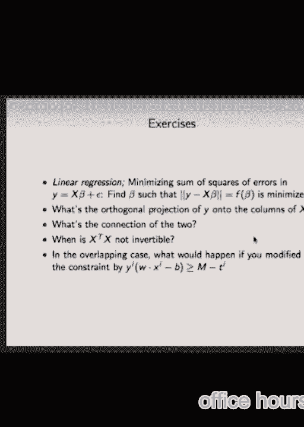

# P6：6.Feb_11_Lab - Tesra-AI不错哟 - BV1aJ411y7p7

什么样的分离器？

抽象的东西。那些是从哪里来的？是的。所有那些方程式。目标函数。是的。但你知道，你开始了吗？所以这门课的目标将是从零开始构建支持向量机的目标函数。从一开始就构建。这样，到最后，如果你忘记了，知道，损失函数是什么，你也能开始自己解决问题。

到了这个步骤，我认为你自己就能设计出损失函数了。那么，主要的问题是什么？为什么我们需要像支持向量机这样的东西？边距呢？为了什么？

优化。优化是为了什么目的？分类。分类。当他们进行分类时，我们有一堆散布在云中的点。然后他们对这些点进行分类。所以我们想找到一个分离器。我们找到了一个实际能给我们带来好结果的分离器。那我们实际需要从分离器中得到什么呢？

什么是一个好的分离器？因为你可以有很多东西来分离两个不同的类别或多个类别。那么，如何量化一个好的分离器呢？损失函数。损失函数就是衡量成本的标准。你想减少它，因为你想付出更少的代价。但你可以设计出一些损失函数，让你付出低代价。然而，

它在清晰化点时可能表现不佳。[听不清]。所以，如果你有输入，可以做统计比较。好的，这是一个想法。还有其他的想法吗？

是的。是的，你可以找到一个决策边界。如果数据是可分的。这意味着它们的凸包不会相交。什么是凸包？

包含所有数据点的最小凸体。如果这些凸体没有相交。这意味着我可以找到一个超平面，分离这两个数据点。分离这些簇。那将是我的决策边界。超出那个边界，我将分配类别A，边界附近，我将分配类别B。

这将是完美的分离。如果数据是线性可分的，那就是我想要的。大多数情况下，它不会是线性可分的。但即便如此，这似乎是一个很好的起点。所以如果我们有数据。好了，让我们来看一个例子。这是一个线性可分的数据。它的凸包不相交。这个凸包从这个边界一直延伸到这里。

这个数据有一个像这样的圆。看起来蓝色簇中有一些离群点。尽管如此，它的凸包仍然没有相交。所以我可以找到一个完美分离这些点的决策边界。有很多这样的边界。我该选择哪个呢？

哪个看起来是更好的候选者？这个看起来不难。那这个呢？

那个看起来不太像边际。那么，什么是边际呢？你在上节课定义了它。Y 乘以 F 的 X。那么 Y 和 F 和 X 是什么呢？所以边际是 Y 乘以 F 的 X。Y 是什么？

实际的输出。它取什么值？-1 或 1。这些都是假设。我们刚才讲的所有这些都是我们自己定义的。所以边际也是我们定义的。现在，当然我们想定义边际为两个凸包之间的距离。如果我有一个像这样的聚类，那么凸包将会。

最小的凸包将具有这种形状。对于另一个体，另一组数据点将是这样的。所以我们想找到它们之间的最小距离，并称之为边际。Y 是 F 的 X，这是我们特定公式的结果。

我们设计问题的方式是让边际变成 Y 乘以 F 的 X。这里的 X 不是一个任意点。X 是我选择的距离决策边界最近的点。最后，在优化之后，这就是你会发现的。而且为什么是中点呢？

因为如果你稍微再移动一点，你就不会在最大化边界了。你离 A 类的距离小于离 B 类的距离。如果你向另一个方向移动，你离 B 类的距离就小于离 A 类的距离。所以中点似乎是直观上最大化两个聚类之间边际的那个点。

如果你有多个聚类，它不必是中点。那么，在我们的设计之后，为什么边际会变成 Y 乘以 F 的 X？在讨论这个之前，我们先从一个超平面开始，你如何表示一个超平面？你如何表示一条直线？

一条直线只是一个简单的预备微积分方程。Y 等于 M 乘以 X 加 B。M 是斜率，B 是交点，即 Y 轴交点。用稍微更线性代数的术语，我们可以将其重写为矩阵模型中的这种形式。通过这种向量点积的方式。我们想要将其推广。因此，我们不必一直使用 M 和 -1。

这似乎是标准的预备微积分公式。我们想把向量表示成它的分量。因此这些向量看起来是在 R2 空间里。所以我们会说 W1，W2，而不是 M 和 -1。它们的关系非常简单可以计算。但我们以这种形式书写，它使我们能够理解什么是超平面。

所以你可以从这个方程 W1，W2 点乘 X1，X2 推广到 N。假设我们有 Rn 中的向量。那么这个方程就变成了 W 点乘 X 加 B。然后超平面就变成了这个函数的水平集。这个函数只是一个将领域中的一个点映射到一个值的函数。

记住在前面的例子中，理性情况，直线是由一组函数描述的。即右侧的函数，当它等于零时。所有使左侧函数等于零的 X 的集合描述了我们的一条直线。类似地，所有使我们的点积加 B 等于零的 X 的集合描述了一个超平面。

这些概念是相当类似的。方程式是非常简单的可以推广的。然后我们还有什么其他东西？这个V似乎有一个特殊的性质。即V在这个L中的X等于V点X加B，它是正交于L的。这意味着什么？

正交是什么意思？垂直？垂直于什么？是的。通常的情况是，如果我这里有一条直线，V向量大概会是这样的。这将是与之垂直的。它将垂直于我从L中选取的任何V向量。但这个例子有点特别，因为它通过了原点。

如果它稍微偏移了一点，如果我有一条不经过原点的直线，我该怎么做？如果我在这里取一个向量，这个向量，假设是。 这是一个正交向量V。我再取这个V'上的一个向量。它们彼此正交吗？这个向量与那个向量？不，它们不是。

即使这个点是从这条线选择的，但仅仅选择一个点是不够的。我选择的向量应该是——应该存在于这条线中。所以我必须选择两个点，V和V'，并相减以得到一个与线对齐的向量。然后这个向量将在计算中与V正交。

这似乎是常见的陷阱之一。在这个图中，看起来很清楚。但当计算稍微复杂一点，特别是在更高维度时，它可能会变得有点反直觉，因为你说你在R3中，遇到了一个平面。然后你把这个平面稍微移动了一下。你错误地在平面上选择了一个点，认为那个向量就位于平面上。

它实际上是那个点，但它不是一个存在于其中的向量。它实际上是从零点开始并延伸到那里。所以整个向量，如果你把它当作线段来看，它就在那个平面之外。然后点积不为零，所以它必须存在于那里。这就是我所理解的正交。

这将是一个先前的性质。然后因为它是一个线性函数，并且由零集描述，它将给这里的集群A和这里的集群B分配两个不同的数字。或者用这个符号，给集群C1和集群C2分配不同的数字。由于它是一个线性函数，我总是可以对它进行重缩放。我总是可以根据需要随意乘除。

那么，我希望L在不同集群中分配什么值呢？在这一张幻灯片中，蓝色和红色来自这个例子。所以我只是点了一个点，并说让我们给蓝色的分配正值，给红色的分配负值。并且有可能我可以任意选择顺序反过来。L是否有可能为这些点中的足够多的点分配零值？

什么时候 L 会给数据点分配零值？当它在这条线上时。当数据点在这条线上的时候。所以这就意味着一个完美的分离是可能的，是可以实现的。通常，我希望不变的，损失函数是正的。所以我希望某些东西在符号上不会改变。

所以如果我给红色组分配负值，给蓝色组分配正值，那么通过查看 yi 乘以 L(xi)，它将始终给我一个正值。对吧？是吗？

[听不清]，你也可以使用向量。这似乎是，比如在失忆字符识别中，手写数字分类，你使用的是向量，十个在 Rn 中的向量。但数字被限制为零和月份输出，它们代表猜测的概率。所以一个简单的输出就像是98% 0。如果输入图像是零，那么它被训练出来了。

其余的九个条目加起来是 0.02%，只是随便编的，总和为 1。对吧？

[听不清]，是的，我可以随意移动 B，对吧？这将是一个部分。那将是一个很好的问题。这将是优化过程的一部分。所以我现在要固定的任意参数，将是灵活的参数。而其余的参数将通过优化方法本身来调节。

训练将处理这一点。所以如果我知道数据是完全线性可分的，那么我可以找到一个超平面来分开这两个类。这个超平面可以用一个线性函数的集合来描述，正如之前所描述的那样。一旦我有了这个，y 乘以 L(x)，这与 L = F 在这里是相同的，y 乘以 F(x)。

边际将始终是正的。然后我将最大化边际。所以最接近这条线的点，它们会很重要，对吧？

所以当你谈论一个点靠近一条线时，我们需要讨论一个点到这条线的距离。你怎么找到一个点到一条线的距离？是吗？对。对，你取投影。那么你把投影投射到哪里？投射到… 投射到… 当你把投影投射到这条线上时，为什么不这么做呢？这个向量是什么？有一个东西。

当一切交叉零时，计算很容易。但当它发生偏移时，假设这是零。这是线。这是给定的任何一点。假设你知道线的方程式，即 L(x)，即 x 加 b 为零。你如何找到投影？

有什么猜测吗？假设我取了线上的一个任意点，X'。将 x 作为向量取是不行的，因为那会给我这个向量。这似乎与任何东西都不对齐。就像它没有太多的价值。所以如果我取了线上一个点，我能做的是构建这个向量。

但那是一个任意的点。当然，我可以选择任何我喜欢的点。那么这个向量的长度不会给我距离。那么如何找到 x 到 L 的距离呢？

是的。所以有一个正交于它的向量v。如果我将这个向量投影到w向量上，那么我将得到所需的距离。还有其他问题吗？是的？是的，你可以这么做。这样做是鲁棒的方式。它是在冷却中。如果你筛选它。

你几乎可以选择你的零点并将所有东西移动到这里，再选择你的零点。通过取x向量。所以它们只是冷却过程。哪个？

大写的L还是小写的l？小写的l是函数。当该函数等于零时，我得到超平面。但这个L只是一个从R到R的线性函数。该函数的零集描述了一个超平面。但由于它定义在整个R^n上，它赋予了各种各样的值。

但我知道的是，由于它是一个线性函数，在超平面之上和之下，它有不同的符号。这就是我能将这些点分开的原因。超平面当值为零时，函数的值为零。在红色簇中。

该函数的值为负数。在蓝色区域，L函数的值为正数。由于我适当地选择了分类，红色部分为负，负一。蓝色部分为正一。通过设计，通过这种特定的选择，通过乘以LI，当我有一个完美分离数据的超平面时，值始终为正。

清楚吗？什么是超平面，什么是函数？

这个函数只是一个在线性函数，它定义在远端。它的零集是超平面。是的。[无法听清]，我们能证明什么？哦，是的。到目前为止，我们假设数据是可分的。接下来我们会看到如果数据不可分，我们如何进行修改。好的。

通过投影，让我们继续讨论SBI。再一次，让我们标记数据，它分为两个簇。假设其中一个是C1，然后我们看到两个。像往常一样，我们有分隔两个簇的超平面。让我们对V的范数设置约束，因为它是线性的。我们可以缩放。

假设，如这里和之前提到的，假设我选取离给定直线最近的点，离给定超平面最近的点，然后我计算这些点到超平面的距离。所以这些点，当然，距离也可以通过YI，L乘以XI来计算。对于所有点，当我计算YI，L乘以AI时。

这将始终大于最近两个点的最小距离。这是当你找到最大化间隔的超平面时，它总是在彼此最接近的两点之间的原因。我们称之为M，一旦它处于中间。所以这个距离是M。

这个距离将是M2。总的距离将是2M。然后我们可以重写最大化间隔的过程。M在上面定义，唯一的约束是V的范数将是1。所以W参数被称为球面上的强度。它受以下条件的限制。

Yi乘以函数L的值，评估在数据点上的结果将大于M。为什么它会大于M？因为它将始终大于间隔，因为间隔定义为最小的这种距离。所以我要最大化的东西，就是这个距离。所以一旦我碰到超平面，这个距离将是M。这就是当我有Yi乘以L的Xi时，Xi是这个点的情况。

所以如果我取任何其他点，它会给我一个更大的数值。这就是我计算出来的自然约束。对于这个聚类中的任何其他点，Yi乘以L的Xi将会更大。所以这将是下界。这将是我的第二个约束。如果这一点清楚的话。

接下来的步骤将是对这个过程的重新表述。到目前为止，我们从这个假设开始。如果它们不可分，那么我们将根据这个假设修改程序。是吗？

如果我们有功率飞行器的观测数据会怎样？是的。这将改变线条，也会改变成本。但在目前的数据中我们没有这种情况。即使我们在数据中有异常值，我们仍然假设从完美可分的数据开始。所以很快，经过两步操作。

如果我们有越界的异常值，我们会允许这种情况。我们会为此留出一些空间。对于那些确实越过边界的异常值，虽然它们目前不在这里，但它们很快就会出现。是吗？

计算我们想要的下界有意义吗？因为这是一个线性函数。我可以根据需要缩放它。所以限制函数类是一个自然的假设。不，我的关键是yi。xi的根将像yi的一半。这就是L函数所赋予的值。观察结果是，如果我有一个完美可分的数据。

在数据点上，yi乘以xi的L值将始终保持相同的符号。所以如果我从这里去掉这个yi，那么就没有了这个符号的确定性。我可能会得到负值，这我不希望看到。这个函数与时间差的距离有关？是的。所以让我们记住这一点。

这个过程，让我们修改它。所以如果我有任何收益，那么我们就可以继续。所以我想从给v加约束开始。然后我想从加约束开始。接着我想把这个带约束的问题转换成最大化n的等价问题，转化为最小化v，放松这个范数为1的约束并最小化v。我该如何做这个转换？

我将使用与我能够对 v 的范数施加约束的相同理由，这就是线性可扩展性。然后，这将使问题从一个最大化问题转变为一个范数最小化问题。范数最小化问题源自这个小小的技巧。如果我取任何点 w_b。

然后当然我可以计算 n。然后我通过将 w_m_g 除以 n 来重新调整比例。那时会发生什么，如果我将新的成对值 w_prime 和 v_prime 代入方程，而不是这里。我将每个部分都除以 m，除以 m，这个除以 m。所以这个不等式将大于 1，而不是大于 m。因为在这个方程中。

w 的范数被限制为 1，最大化 n 从而转化为最小化 v_prime。到目前为止有任何问题吗？通过仅仅对事物进行缩放，缩放 w_m_g 变量。我能够将问题从方程 1 和 2 改变为方程 3 和 4。这是一个简单的减法步骤。现在这里，如果你的观察顺序正确，w_prime 的范数。

我们新的 w 将是 1/m。这就是最大化问题为什么会变成一个最大化问题的原因。你的边际最大化问题变成了范数最小化问题。这个问题是凸的。在二次方程中。现在我们将讨论聚类重叠的问题。如果我们有重叠的聚类，会发生什么？所以会发生的情况是，我们将为每个点提供一些空间，让它穿越边界。

之前我们有了聚类，但我们不允许。那是一个严格的限制。那是一个严格的约束，要求它们至少要有一定的距离远离分隔它们的超平面。所以我们当时有的是。这个宽边界是清除任何点的。现在我们允许其中一些点偷偷通过。所以如果聚类一的某个点偷偷通过这里。

它会偷偷通过多少？它将偷偷通过这么多。你知道，就是这么多。我们就称这个为这么多。如果这是点 i，这个距离将是 ti。对于每个数据点，我们会允许这个点可以偷偷通过多少。而这个允许的空间，每个点的小余地，将称为 ti。

它们被称为松弛变量。我们不希望它们过多。否则我们的预测将偏差太大。但我们会允许它们有一点空间突破。所以我们怎样用松弛变量修改第一个公式？

记得第一个公式吗？我们保持方程五不变。第一个。现在你不需要在其中加入任何 ti 了。但第二个，方程六。通过引入松弛变量，我们可以将其表示为八。所以，而不是将那个函数。那个乘积被从下方限制在 m，我们将它从下方限制在 m 乘以 1 减去 ti。

所以从原始问题来看，ti在这种情况下不是一个加性距离，而是一个乘法空间。我们本可以做两者的结合。所以就像我们在这个设置中做的那样，我们将问题从下界的m进行了修改，变成了一个最大化问题。记住，我们把最大化问题改为了最小化问题。

让我们在这里做相同的事情。使用新的方程，重叠聚类的新的方程。因此，一旦我们执行相同的程序，寻找等价的形式化，基于范数最小化，并且与之前的案例类似，我们得到中间的那个，修改后的等价过程。如你所观察到的。

方程九和方程十一保持不变。但是在重新缩放后的版本中，方程十和方程十二从方程十修改过来，允许添加一个ti，给变量留出空间，以便它们进入边界。[听不清]，是的。 所以在这里，最近的点的值是m，y i 乘以 x i 的 l 值。所以对于所有其他数据点。

我希望这个值大于m。但我想缩小这个值。我希望允许点有一些空间。所以如果它们不再大于m，如果我乘以一个小于1的常数，那么我实际上是在缩小边界。所以边界最大化问题是第一行。它仍然保持不变。就是这样。

我对数据点施加的约束在第二行。这就是为什么我保持边界最大化问题不变。所以边界仍然在同一个位置。边界的边界仍然在同一个位置。但稍微修改第二个方程，我允许一些变量通过。通过多少？

不是大于m，我允许它们尽可能接近直线，接近m乘以一减去ti。是的。对，这种情况下，不， 因为它只是一个乘法因子。稍等一下。很好的问题。那么，如果ti大于一会发生什么？如果ti大于一，我允许它稍微负一点，但不会太负。

所以它实际上可以越过另一侧。是的，确实。对，我认为没有规定ti必须小于一。所以它可以大于一。我们可以允许聚类穿过另一边。是的，太好了，问题。还有其他问题吗？

是的。[听不清]，这允许它们位于边界内。[听不清]。离区域太远了？[听不清]，我不确定我完全理解这个问题，但如果数据点在另一端，那不是问题，因为它们已经被分开。所以另一部分的异常值不干扰我，因为我关心的是这两个区域之间的边界。

如果那回答了你的问题。好的。那么现在，重叠聚类我们修改后的过程。方程11和方程12是修改问题的最终版本。这是我们在重新缩放后得到的。所以我们从边界最大化修改为范数最小化。我们改变了第二个约束，以允许一些空间供数据点进入。好的。

到目前为止一切都好。但请注意，由于在方程式 11 和 12 中我将 W 缩放为 W'，所以我不必一直使用 W' 和 B'，它们和其他地方的符号一样。我可以回到原始的 W 和 B 符号。我可以忽略背景中的 M，方程 11 和 12 的一边和细微部分。

然后我可以，不想让太多点穿越另一侧，或者进入边际外面。或者穿越它们不应该穿越的界限。所以我要引入的约束条件是限制那些松弛变量的和。因此 TI 的和应该小于 C。这似乎是另一个合理的约束条件。

我可以将范数最小化问题与松弛变量和小于常数的约束问题结合起来，放入一个方程式中，形成方程式 13 中引入的紧凑形式。因此，优化问题。最小化这个问题，即一半的范数 W 平方加上 C 倍松弛变量和，将会解决。这样我就可以最小化我想要的范数，同时它会限制松弛变量的和。

方程式 14 与方程式 12 相同，除了 W 和 B 的撇号被去掉。当然，在方程式 13 中，我们仍然有 W 在 Rn 中，TI 是实数。所以让我们看看这看起来像什么图。我们从可分情况开始。这是左边的第一张图。这张图取自这本书，符号稍微有些不同。

这里有一个我写的参考，beta 将是我一直使用的值。所以 beta_0 是 B。beta_0 是平移量，W 是范数。我们想要最小化的参数，那个我们希望最小化范数的参数。所以如果你从可分情况开始。记住，beta 是 W 的值，W 的范数是 1/M，这在理论中也是如此。

所以这似乎是我们所做的正确转换。边际是两个距离我们找到的完全分隔数据的超平面等距离的直线。在第一个情况下，我们不允许任何点位于边际中。但我们希望它们在边际的边界上触碰。那是因为最大化原则。是吗？

[听不清]，这里？所以在这个例子中，它希望拥有这个点，这个绿色的点。有两个绿色的点触及到这条线。这就固定了一条线。如果没有那个点，我们要怎么选择呢？

那么在什么情况下你可以有多条线，它们给你相等的边际？似乎不太可能出现完全相等的边际。但确实可以有这种情况，出现不同的线条却有相等的边际。所以我们需要考虑另一种情况。在这种情况下，问题是凸的，因此有一个唯一的最小值。如果它有一个唯一的最小值的话。

这意味着你实际上会找到一个单一的超平面，将这两个部分分开。你没有太多空间去获得同一优化问题的多个结果。会有一些情况，优化过程会是非凸的，你会得到一些等效的结果。也许不是完全相同，但优化过程会给你两个。

三个不同的超平面。在这种情况下，它将是一个凸的，但决策边界是相同的。在这种情况下，你通常不会找到所有的。你找到其中一个，然后说，好吧，这就行了。在非凸的情况下。但在这种情况下，实际上有一个解决方案。是吗？第十项。九和十。九和十是一样的。九和十只是三和四的副本。

三和四只是对一和二的重缩放。后者是哪一个？三和四。所以你将如何构建右边的目标，并开始一个优化过程？

从计算的角度来看，最小化范数比最大化边界更简单、更方便。或者说，所有其他点的一个点。然后你可以找到一个和两个之间的偏差。仅仅量化这个偏差。这是个很好的问题。我们从1和2到3和4的简单代数变换。

这个简单的代数修改很容易解决这个问题。我会考虑一下。我认为TI只适用于负学习，我们通常会强调一些技术实例。是吗？所以它们应该是无效的。我们并没有说TI是负的。如果你问TI能不能大于1？哦。如果TI大于1，那么y倍的函数就会有一些负值。

所以在这个例子中，举个例子，看看C5。C5就像TI，并且它比M大。在这个尺度版本中，它将大于1。是吗？

那么我们应该怎么看，如何降低理论性而不超过较大的边界？是的。所以你不想一一控制所有的边界，而是想控制其中一些。而且很多情况下，它们会过大。这一点在30的第二项中得到了体现。所以我想在这两者之间进行选择。是的。所以如果你限制它们的总和。

其中没有任何一个可以过大。是吗？所以我们根据可分性定义它们的集合。让我困惑的是，一旦你进入一个非潜水方程，它们的意义是什么。好问题。数据是可分的吗？所以你设置了这个问题，设置了归一化问题。就好像数据是可分的。但一旦你让一些数据有这个T方式。

它的结果是相同的。所以这就是为什么这里的图像是一样的。就像边界存在于可分情况中，宽带。但引入额外的松弛变量允许它们进入。所以这里的方程13就像是将边界最大化转换为范数最小化。

但它还有一个额外的好处，就是可以帮助某些要点得到更好的理解。好吧，我还有一些进一步的问题。如果你有时间，请考虑一下这些问题。如果有任何疑问，欢迎来办公时间咨询讨论。谢谢。[BLANK_AUDIO]。

