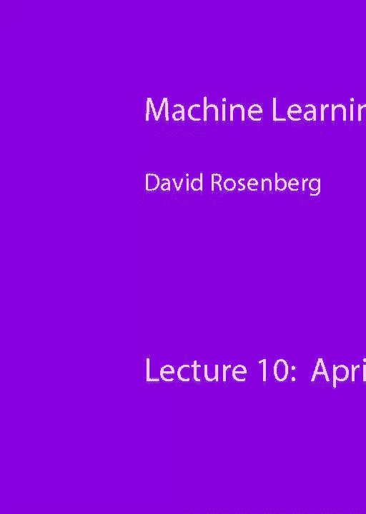
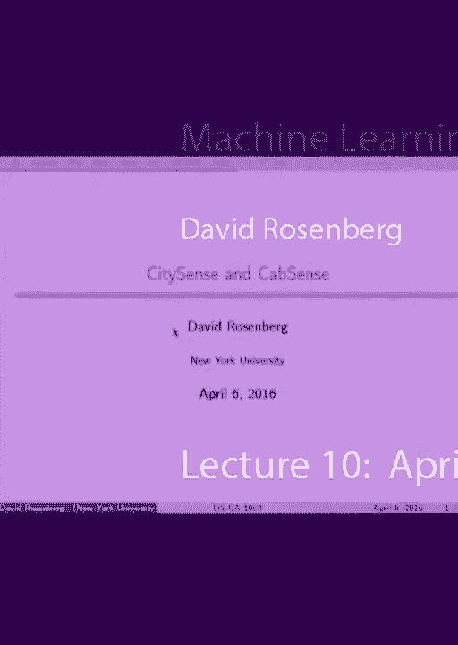
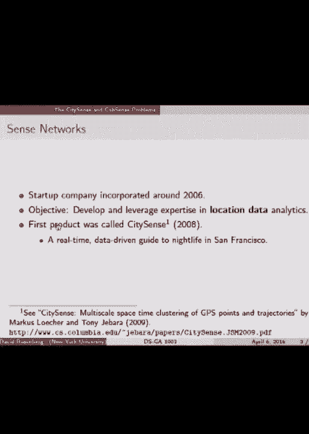
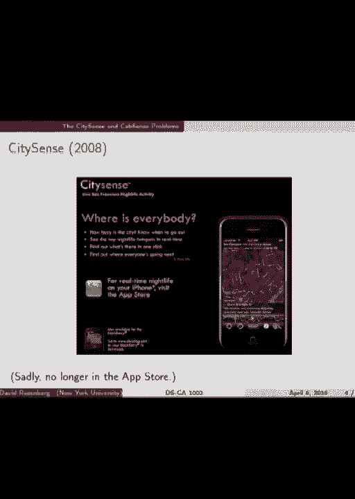
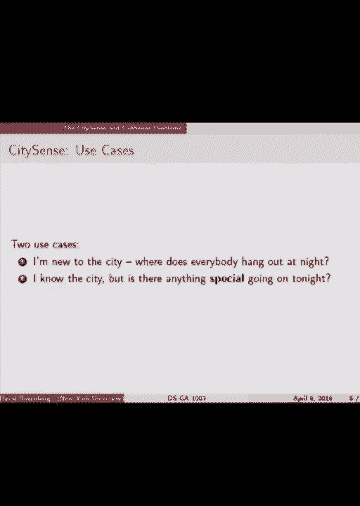
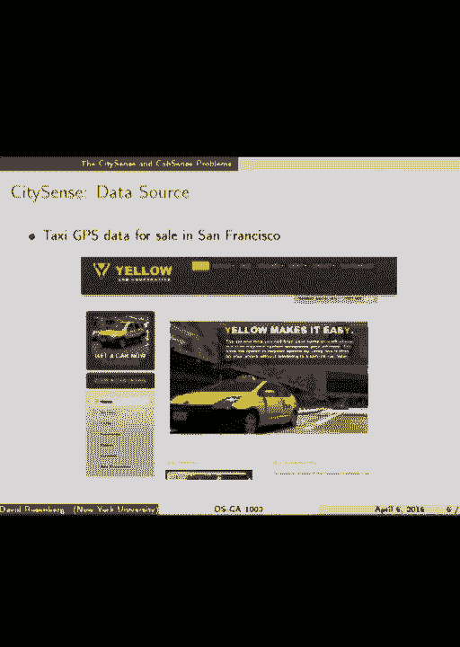
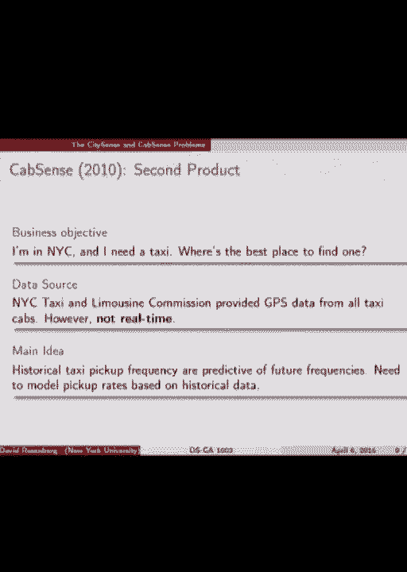
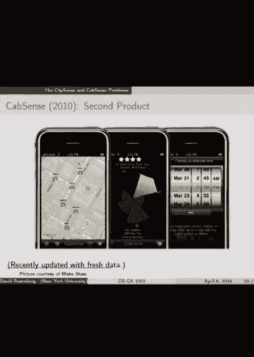

# 知乎推荐-纽约大学机器学习公开课 DS1003 Machine Learning - P17：17.April_6_Lecture - Tesra-AI不错哟 - BV1aJ411y7p7

所有权利。

到目前为止，我们已经讨论了几种不同类型的动作空间，假设空间有很多决策函数，每个决策函数都从我们的输入空间中获取一个输入，并在我们的动作空间中给出一个输出，到目前为止，我们讨论过的动作空间是真实的。

回归实线，硬分类负一，上周，我们谈到了多类，所以动作空间是，从1到K好的，我们用数字给他们贴上标签，所以基本上，离散集的元素，有限集，好的，我们甚至在最后谈到了作为多类的一个例子。

但是多类对于类的数量是巨大的，在此场景中，您需要在，在输出类中，从潜在的指数大类集中进行选择，所有的权利，这些就是我们讨论过的动作空间，今天到目前为止，我们正在引入一个新的行动空间。

也就是输出上的概率分布，所以假设我们做多类，因此，不是输出单个类，而是输出类集合上的概率分布，我们以前确实做过一次，我们以前什么时候做过一次，我们有一个模型，它输出了许多类的潜在概率，是啊，是啊，树木。

是啊，是啊，因为在每个叶子节点中，在树的每个叶节点上，我们可以建立一个直方图，或者每节课出现多少次，当我们预测这是类的概率分布时，所以我们之前已经谈过了，但现在我们要更系统地打击它。

作为做这种事情的动力，我要谈谈我实际参与的一个项目，或者几年前我和一些同事在一家创业公司工作过，它被称为感觉网络，始于2006年，这个想法是成为位置数据的专家。

我们在28年推出了第一款产品叫做"城市感"所以不久前，城市感的概念是，它将是旧金山夜生活的指南，但不像孤独星球，或者不像有指导的评论，而是一个实时告诉你的应用程序，行动的地方，行动在哪里。

人们要去的地方，你初来乍到，或者你只是去镇上，你想知道今晚什么是热的。

当时异常流行的是什么，好的，这就是应用程序的样子，它给了你一张城市地图，然后你有这些热点，有两种模式，一个就像现在真正热的是什么，就像，或者通常在这个时候，然后是异常流行的，所以我的意思是。

这里的数据科学问题是，当某样东西在任何时候都异常流行时，你如何决定，对呀，我们转移到其他事情上。

所有权利。

所以我们的数据集是出租车，我们找到了一家出租车公司愿意出租或出售他们的数据给我们，他们在每辆出租车上都有全球定位系统跟踪，你可以实时看到税收上限在城市里移动。

所以我们用的是，他们还规定了每次出租车的接送地点，所以我们决定利用出租车的下车地点，作为有人去那里的标志，所以人们在旧金山不坐出租车，就像他们在纽约一样，但至少这是一个代理，你需要从一组数据开始。

所以这个想法是用它来引导，那么这意味着什么呢，所以说，如果有人把应用程序放在手机上，他们使用它作为交换，以便能够使用该应用程序，他们必须同意与我们分享他们的位置数据，所以一旦他们使用它。

然后我们可以从应用程序中获得位置数据，所有的权利，所以数据科学，有什么问题？我们需要建立典型行为的模型，城市任何地区的典型出租车下车次数，在一天中的不同时间或一周中的几天，甚至一年中的季节。

然后我们需要实时观察实际发生的事情，并找出什么是不寻常的，也许有一场意想不到的音乐会什么的。

所以这是第一个产品，第二个产品更多的是实际上还在应用商店里，它更关注纽约，它更简单，从某种意义上说，它是在曼哈顿的任何一个街角告诉你，你能指望接多少辆出租车，人，有多少税帽提货。

你能指望发生在纽约市的任何一个街区，根据一天中的时间或一周中的某一天，其实很简单。

这仍然是一个建模问题，好的，但我们将重点讨论城市感知异常检测问题，从数据科学的角度来看，这有点多汁，但仅仅因为纽约市更有趣，我们要看看纽约市的出租车数据，我们也有，嗯，因为我们住在这里，你可以自己下载。

如果你有兴趣，所有的权利，今天我们要讨论概率模型和，特别是，预测概率分布作为你的行动，所有的权利，这些就是我们到目前为止讨论过的所有事情，所有不同的动作空间，今天我们要讨论一个由概率分布组成的作用空间。

在Y上，在输出空间上，我们为什么要这么做，好的，如果输出空间是实数，那么它是这样的，那么实数的输出空间是多少，这是什么问题，所以是的，输出空间是真实的，这意味着它在回归，这就是回归的定义。

回归表示输出空间，是我们的真实数字，你的数据在输入x和输出中得到了什么，那是真正的倒退，所有的权利，所以我们在考虑一个回归问题，我们想要取一个输入x，输出给定x的y上的概率分布，所以这就是。

那是我们生产的，我们生产分布，所有的权利，那么我们可以用这个分布做什么，所以说，例如，假设我们有另一个损失函数，我们真的很感兴趣，像平方损失这样的东西，典型的回归，如果我给你这样，我得到一个X。

然后我给你一个关于y的分布，y上的预测分布，我想预测一个使平方损失最小化的数字，你会怎么做，所以再一次期望值很大，所以如果你有你的分布，我们已经做了，我想在习题集一，该分布的期望值使平方损失最小化。

在期待中伟大，如果损失是1个绝对损失呢？是的，中位数，你取分布的中位数，所以如果你有分布，你可以立即预测平方损失的最优值，绝对损失的最佳事物，事实上，任何你想要优化的损失函数。

你可以得到你能得到的最多的信息，给定x，y的条件分布是，好的，所有的权利，那么我们还能用分布做什么，所有的权利，所以我们有一个分布，假设我们在预测，会有多少出租车接送，所以这是一个帐户权利。

你应该记得一些，从一些概率类中，计数数据的一个非常简单的分布族是泊松，假设我们给我们的模型一个x和一个输出，再加上四十，什么是一汤匙？四十，泊松的期望值是多少，四十个分配，它给了所有实数的概率。

所有大于或等于零的整数，我们把x推入，假设x指定了一个特定的区域，r和一个特定的时间，比如晚上九点到十点，模型返回泊松40作为其预测分布，所有的权利，所以假设那个小时出租车接送的实际数量。

在那个地区有一百个，所以我们可以说这一百个是多么不寻常，根据模型，例如，一个标准的统计方法是看尾巴，所以我们可以说好吧，嗯，一百是多少？那很大，看起来比平均水平大，那么我们如何量化这有多不寻常。

我们可以看看，看到一百辆皮卡的概率有多大，或者更多的标准统计方法，你可以在假设检验中看到，所以在给定x的情况下，y大于等于100的概率，然后我们可以简单地对给定x的y的概率从1到无穷大求和。

这是根据模型衡量的，我们看到一百辆或更多皮卡的可能性，所以我们可以说，哦，那真的很少见，那不到百分之一，或者我们可以说这并不罕见，所有的权利，所以如果用预测的分布，你可以做，你可以做得更多。

你可以做一些事情，比如测量某个事件有多反常，还有什么好玩的，你可以得到预测间隔，同样的想法，所以预测间隔是，这很自然，这有点像，就像置信区间，但为了预测，所以给定一个输入，x，我会说好的。

我觉得95%的可能性，你不会说置信区间，但对于预测间隔，您可以这样说，在这个场景中，我想有95%的可能性，根据我的模型，就会有，五十七辆出租车，好的，那是一个预测间隔，1。你是怎么做到的？如果你有分布。

这是相当微不足道的，你就会发现两个值，a和b，这就是y在这两者之间的概率，根据你的预测分布是九点五，所以你可以用分位数来做到这一点，嗯，等，就这样，你知道的，有另一种方法可以做同样的事情，分位数回归。

这是你使用不同的损失函数，就像，而不是我们用来得到第五百分位数的损失函数是什么，你知道百分之五十是什么吗，它有另一个名字，中位数好吧，你知道什么损失函数，我们以前得到百分之五十，是啊，是啊，绝对值。

好的，所以绝对值有一个修改，一种移位垂钓，这是另一个损失函数，它会给你不同的分位数，而不是介质，所以你可以用，那只是与今天的讨论无关的另一种方法，让我们多谈谈这个问题，因为你们现在正在做你们的项目。

这几乎是一个很好的机会来指出一些进行数据分析的技术，所有权利，所以在我们的场景中，我们有一辆出租车，我想在这个问题上，我们说的是接送而不是送货，所以出租车接送发生在一个特定的位置，在特定的时间。

空间是连续的，是纬度，经度，对呀，这有点难处理，时间几乎是连续的，是的是的，我们在几秒钟内指定了它，有很多次，所以我们把它们弯曲起来，所以我们把空间和时间分成桶，我们称它们为网格细胞，而我们。

所以我们把纽约市分成大约40万个网格单元，我们分成几个小时的时间，这样我们就可以，所以这里，比如说，是单个网格单元，你知道，宾夕法尼亚车站在哪里，我写下来了，好的，所以大概有那么大，不到一个街区。

另一种观点，你可以看到出租车在那里排队，这是最，纽约的网格单元，那里有最频繁的出租车接送，好的，至少在那个时候好吧，这应该很熟悉，就在外面，所有的权利，这只是为了让你了解网格单元的规模。

现在让我们来看看一些数据，这就是我们在这里看到的，单个网格单元，宾夕法尼亚车站旁边的那个，我们在看一个特定的星期，一周的数据，我们绘制了一小时内出租车接送的数量，让我们看看，秒耶，整个星期，周日至周六。

我不知道有什么要注意的，就像周六的模式和周一到周五的模式很不一样，星期六和星期天不一样，可以看到周六和周日并不是只有一个高峰，而周一到周五似乎至少有两个高峰，去人们去工作，那么我们想做什么，是啊，是啊。

这是一个星期的吗，还是这是一个星期，无聚集，是啊，是啊，好问题，所以这里是分开绘制的四周，你可以开始看到一周又一周的变化，我们想在我们的分布中捕捉这种变化，对呀，所以如果给我一个x。

让我们假设我限制在一个特定的网格单元，有人说告诉我这周我们能期待什么，小时，关于这个，一百零，所以好吧，嗯，过去四周发生了什么，所以这里有一些上上下下的蔓延，所以也许我们想要一个至少有正确平均值的分布。

以及捕捉传播的方差，这就是我们要找的，所以这里，这是两个七周的总和，但不平均，我们做了一些方框图，它显示了每小时的传播和变化，嗯，穿过这里是三天，星期日，两个七周的星期一星期二。

所以这里有一个更好的想法，我们想预测什么，我们希望能够捕捉到这种类型的传播，是的，是的，我们看到差异在一周的不同时间发生变化，对呀，那就很好捕捉了，所以说，这都是分配的一部分，好的，这里还有一个地方。

这是最新的，这是一个星期，你可以看到大多数时间都没有接送，有时你知道有两个，它是非常离散的，这一周我们一小时内最多接送两单，所有的权利，星期天到了，好的，现在，这是两个七周的总和，平均数而不是平均数。

这是什么啊，这是盒子点，4。这是我们按小时计提的车辆数，你仍然可以看到零是，你知道很常见，然后有时我们得到两个五，具有完全不同特征的完全分布，所以也许你知道这些分布，我不知道。

也许你可以把它建模为一种粗略的，它就像一个高斯，在不同的地方有不同的变体，不同点的不同平均值和不同变体，也许吧，但在这里不可能，都是离散的，全是零、一、二，高斯根本不会很好地捕捉到这一点。

也许加上会很好，所以预测问题在本例中更详细地说明了，所以有人在一周内查询网格单元，我们想告诉他们会发生什么，我们想生产分销，好的，所以大约有40万个网格单元，大约有一百六十个，一百六十八周小时。

一周小时，所以这是你可以想象的输入，在某个时候添加更多的功能，不仅仅是一周，时间和地点，但也是度假吗，下雨了吗，有特别活动吗，诸如此类的事情，或近代史，在动作空间，皮卡上的分布是。

然后我们可以观察到实际的拾取数量，其帐户，好的，我们将回到一个问题，我们预测分布，我们怎么知道预测有多正确，我们用来测量预测分布质量的损失函数是什么，这是数据，这就是标签训练数据的样子，网格单元，周。

小时，和观察到的伯爵，所以有一天我们会，今天晚些时候我们将讨论如何评估，但是我们如何设置问题，将这些数据分成训练和测试的好方法是什么，我有大约50周的观察数据，这就是数据的样子，每个数据都有时间戳。

每行都是时间戳，所以说，我知道是什么时候发生的，嗯，所以当你想分成训练和测试时，标准的事情是，你知道随机对吧，做事随意是很重要的，但这在这里可能不是个好主意，你们觉得，好的，好的，所以说。

你担心这不是因为事情会随着时间的推移而改变，这是看不，这是标准的，其实，因为在一个问题中，你得到输入和输出，对于不同的输入，您有不同的输出，你，它们来自x x y上的分布，没关系，也许我确实有些担心。

但我不是，也许这是一种感官上的意思，但我不确定这是不是你的意思，好的，是呀，按时间顺序排列，那么你认为潜在的问题是什么，好吧，当我们实际应用这个模型时，为了捕捉你所说的话。

情况是我们有到目前为止看到的所有数据，我们可以预测，我们必须预测接下来会发生什么，所以当我们通过分开训练和测试来模拟这种情况时，我们需要确保只对发生在某一点上的数据进行训练，嗯。

当然我们需要确保我们的例子只关注在那一刻之前发生的事情，我们在做预测，嗯，但拿着，你知道的，训练之类的，在以后的时间里，有什么问题，如果你上周的数据都很稳定，那就会有争议，因为你以前不会看到所有的东西。

或者反过来，这一切都是从你的数据集的第一周开始的，那不会代表未来，对呀，所以你担心几周之间的差异，是啊，是啊，我也担心几周之间的差异，所以一年中可能会有趋势，就有季节性，冬天坐出租车的人可能比夏天多。

也许反之亦然，我甚至不知道，嗯，也许你知道，还有其他种类的东西在一年中不是静止的，为了安全起见，因为在实践中，当你实际运行这个模型时，你没有在未来发生的任何事情上接受训练，对呀，你只训练过去发生的事情。

所以当你想分开你的火车，什么时候让你的火车和测试台，至，为什么你的训练集不应该是某一点上的一切，你的测试集应该在那个点之后，所以你应该说是，你应该在时间上分开，是啊，是啊，这就是耶，拜托了，是啊，是啊。

所以我也想说季节性，所以我想知道，如果有一个，至少，也许做一些加权平均，最近几周更重要，还是继续训练更好，就像上次一样，是啊，是啊，大问题，所以好吧，到目前为止，我只是在说训练一个模特。

但如果你愿意每周建一个新模型，然后对它来说就有意义了，对我来说，体重更重是有意义的，最近发生了什么，所有的权利，让我们来谈谈分层，所以说，全分层，这意味着我们是我们所说的最小单元。

在收集我们的数据方面是网格单元和小时，就我而言，就是这样，现在，那是全分层，分层是将您的数据分成，我们在x轴上看到的是，嗯，计算星期二从当前开始的接送次数，晚上七点到八点，好的。

所以让我们从白色直方图或白色条形图开始，所以这是测试集的，这是观察到的计数，多少天或星期二晚上7点到8点之间，在这种情况下，没有皮卡，这是一辆皮卡，两辆皮卡，三辆皮卡，等，所以这是经验上的过程。

我不知道，如果这是两个七周，这些计数的每个数字中有多少是，当时这个地方有多少皮卡，那是，那是白色的，那是在测试集上，所以我们在训练集上有一个类似的桌子，我们用三种不同的型号来适应它们。

泊松负二项式直方图估计，这确实很重要，所以你可以看到各种适合，嗯好吧，为了确保你们知道我在说什么，如果我是这样，我建立了一个模型，作为输入，我说，当前星期二七点到八点，m，输出会是什么样子。

所以这些曲线中的每一条都像是我的模型的输出，因为这些曲线中的每一条都是计数数的概率分布，好的，所以是的，这只建立在该网格位置的数据上，是啊，是啊，这是仅建立在晚上7点8分之间的电流上的数据，星期二。

我们刚刚看了数据，没错，你可以想象我们为每个网格单元建立了一个模型，一周中的每一个小时，那是四十万次，一百六十八个独立的模型，好的，每个输入x一个，你不是，你不能像，哦，住宅区真的空荡荡的。

也许在市中心，你为每个人创造了一个单独的模型，所以，所以这当然是正确的，用这种方式我描述了，我们根本不会那样做，嗯，那是因为这被称为全分层，完全分层意味着我们在分层中建设得很好。

我们为每个阶层建立一个单独的模型，我们把数据分成的每一块，全分层意味着我们根本没有把东西结合起来，是啊，是啊，可以添加模型吗，除了地点和时间，看看过去一个小时的数据，所以如果你知道喜欢。

你会预测大约五个，但如果你注意到我的过去，因为也许发生了什么事，而你还在继续，当然，当然，你当然可以把它转换成一个更多的时间序列模型，你有近代史的地方，你有一个模型试图预测接下来会发生什么。

根据近代史和史料，是啊，是啊，那将是另一种模式，在这种情况下，我们不能这样做，因为我们没有近代史，此数据集，所以我们有一个固定的数据集，就这样，是啊，是啊，如果不是创建一个模型，你刚才估计。

你说的估计分布是什么意思？你如何估计分布，所以好吧，所以我给你，数据看起来很像训练集中的直方图，这将是实际计数，你是这个意思吗，好的，这正是红线直方图，估计量，这正是那是如此，至少你，是啊，是啊。

我认为一个模特，为什么红线和直方图不匹配，这是个好问题，所以红线是在训练集上训练的，也就是最初的十四个星期，白色条形图是接下来13周的结果，所以我们在这里看到的是一些，一些变化，是呀。

数据中的一些非平稳性，这意味着事情会随着时间的推移而变化，Y条，Y条，是测试数据中实际观察到的直方图，这是分层的一个小定义，它把我们的输入空间分成几组，我们分别对待每一组，我们为每组建立一个单独的模型。

没有跨群体的信息共享，这是分层的，与分层相反的一种叫做桶形或桶形，你带的地方，你知道的，不同的数据子集，你把它们组合起来，所以这将是，比如说，说着，当前的网格单元就在当前的另一个网格单元旁边。

我们没有太多关于这两个网格单元的数据，如果我们在制作模型时将这些网格单元组合在一起会怎么样，那么我们就有了更多关于那个地区的数据，好的，那将是颠簸，所以就偏差和方差而言，会扣篮吗，增加或减少差异。

扣压会减少差异，桶化本质上增加了您拥有的数据量，这会减少你的方差，那么偏见呢，偏见会增加，为什么偏见会增加，因为你知道，这里的一个网格单元格是当前东北角的，可能与它旁边的那个略有不同。

对但是当你把它们放在一起的时候，你的输出有点偏向于两者的平均值，所以你把它从真正的东西拉向其他东西，偏见的一般概念，如果你想象成一个模型，这实际上决定了我们要发生多少计数，然后那个未知。

就像平均计数或其他东西一样，它是真正的，所以这只是一个，我应该给出更多的答案吗，还是仅仅承认这是一个很好的观点就足够了，我们这样看，假设你观察这些街角十年，好的，嗯，这就是你真正想知道的。

你想知道十年来街角的平均皮卡数量，这就是你希望你知道的，但不幸的是，你只观察了七个星期，好的，所以真正的数字是十年的平均值你的观察是七周，这就是我所说的真正的喜欢，这将是思考真实数字的一种方式，现在。

假设这个网格单元的十年平均值是十个拾音器，这个网格单元的十年平均水平是每小时8次拾音器，好的，所以当我们拉这两个东西的时候，两个网格单元，我们预计会有多少辆皮卡，九亲网格A，所以我们偏向九。

假设我们看看数据，我们就像，哦，所有的工作日看起来都差不多，我们为什么不把工作日结合起来呢，所以这是一个桶，所以我们在这里把周一到周五结合起来，晚上七点到八点，让我们在这里快一点，但你也可以说，哦。

晚上6点到7点，晚上7点到8点，只是偏差方差，权衡，获取更多数据减少，所有的权利，所以这是得到这个，这和我们说的差不多，但在宾夕法尼亚车站，您可以看到测试分布与分布有很大不同，从训练中学到了。

所以这里发生了一件大事，事情变了，这就像是需要调查一下，也许有人有很强的时间戳，或者确实考虑到了夏令时，什么的，到目前为止，我们谈论的是桶形和分层，就像我们的机制一样，在偏差和方差之间进行权衡。

但是到目前为止我们所做的所有建模，他们一直在偏差和方差之间权衡，我们用建模工具在偏差和方差之间进行权衡的不同方式是什么，假设，例如，岭回归，正则化项本质上是交换偏差和方差，我们对岭回归有什么偏见，是啊。

是啊，我们对什么有偏见，参数值为零，对呀，我们惩罚任何搬走的人，那不是零，我们正在把事情拉向零，所以在我们的脊回归中，我们倾向于零，会是一种说法，或者向零收缩，人们也说好吧，添加更多功能，添加更多功能。

可能会，嗯，应该减少偏差，但在某种意义上可能会增加方差，因为很难估计更多的特征，但你可以通过正则化更多来纠正这一点，所以好吧，但关键是还有其他方法来处理偏差和方差，除此之外，相当当然，分层或桶形。

所以让我们的问题是，我们能用我们的建模工具来做这个偏差吗，预测概率分布的方差权衡，所以我们可以一秒钟，所以我得到了一些桶时间框架，像你一样增加了偏见，但如果你像网格细胞一样。

然后你只保留那些更大的网格单元，并预测这些会，你们实际上都减少了偏见，现在你有了一个更大的区域，你试图预测的，好的，所以问题是，嗯，你会减少偏见吗你真的会减少偏见吗，如果将两个网格单元格合并在一起。

所以，你是什么你说的是好的，如果我也改变问题呢，所以我的输入只是更大的网格单元，所以否则就扣篮，只是为了减少方差，这是正确的，所以这个想法是你知道这两个输入是不同的，但我只是没有足够的数据来变得足够好。

每个单独网格单元的估计值，所以即使有希望，我需要把它们合并在一起才能好起来，我可能知道他们并不平等，但我可以说，就像你知道他们已经足够近了，就像，比如说，假设，我们在许多网格单元计数为零的情况下。

对然后一个，你知道，十分之一的人有计数，有一个到达，所以你知道，如果它们都一模一样，平均数是十分之一，预计每个人都有一些皮卡，但如果你不泳池，那么你将预测每一个都为零，你不知道，再说一遍内核。

什么样的内核，你什么意思，所以从邻居那里得到信息，好的，所以不是内核，从我们所说的意义上说，但从某种意义上说，你在给定的点上的预测，是你周围发生的事情的加权组合，是啊，是啊，哦。

我想你可以在这个意义上使用RBF内核，是的，不同的方式，这就像一个模型，我们正在走向，是啊，是啊，有没有类似的时间序列，这就是你可以用来喜欢的工具，在我们使用这些技术之前，先把山弄平，顺势而为，是啊。

是啊，比如一个时间，因为我们假设它会像数据中的某个时间趋势，你能说一些，你能再说一遍吗？一段时间三假设，也许它不像是自然生长的，喜欢时间趋势，哦，好的，哦，比如时间序列分析工具，你需要喜欢走出趋势。

在你应用这个之前，所以我们在这里的方法是每周每小时单独建模，你在指出，好的，但如果随着时间的推移有一个长期趋势呢，我们怎么解释呢，如果你的模型太弱而无法解释这一点，在我们开始并摆脱趋势之前，所以是的。

你可以，例如，我是说有标准的时间序列方法可以做到这一点，就像潮流一样，季节性和近代史就像是标准，基本时间序列模型中的三件事，这样你就可以提取趋势，也许季节性也是，与初始拟合，那可能是。

这可能是一个很好的预处理步骤，更多的问题是，训练测试的最佳实践是所有时间序列，我的意思是你必须运用常识，你需要按时间顺序拆分，是啊，是啊，你必须使用常识，常识是什么指南，你到底要怎么用它。

你需要确保你设置训练的方式，你的测试尽可能相似，当您实际部署时会发生什么，你不是喜欢桶，反过来做，也许有一个曼哈顿的大广场，然后开始做我们做这个决定时做的事情，好的，所以听起来，嗯。

听起来你想动态地把事情拆散，我在想你有多爱，因为我不知道你可能有一个正方形，一半在那里，另一半很危险，所以你可以有很多眼睛，所以也许问题是有没有办法选择你的水桶，以最大限度地减少偏见的方式，让你。

你猜你看数据，你就像，哦，这些东西看起来很接近，让我们假设他们很接近，这些东西肯定不一样，让我们确保他们不一起去，我想我们得从一个很小的开始，那就非常，一个计算，他们超出了我所想的范围，现在。

我只想找到一些可以作为好模特的东西，所以你没事吧，更像是分层，水桶可能从更大的图景开始，然后递减，而不是从更小的开始，哦，好的，所以我想归根结底是同一件事的两个方面，你最终会得到一个数据分区。

或者纽约的请愿进入不同的空间，另一个问题是如何到达那个分区，好的，你可以以后再问，所有的权利，所以休息前几分钟，但让我们，我猜你们想休息一小时，或者十分钟后，好吧，好吧，现在休息，一个意见规则。

如果有人想拿回他们的测试，我今天又把它们带来了。

有些人在问，呃，家庭作业六六延伸，我不在乎，其实，当家庭作业的到期日是六号，它可以是你想要的任何东西，然而，我们只能在它，所以如果你想看看解决方案，全部，我是说，我们很乐意讨论解决方案。

但如果你想真正看到，测试前的解决方案，这将是一个做，我猜，星期一，所以我不知道你们是否想发布民意调查什么的，那很好，嗯，但情况就是这样，你们的家庭作业做得怎么样了，如果你看了这么远，所有的权利。

我们还没谈过呢，但我们现在正在谈论它，关于输出空间y上的概率分布，y，未知，我们想估计一下，让我们假设它要么是一个概率质量函数，要么是一个概率密度函数，所以我们已经讨论过的典型谎言。

所以学习理论中我最喜欢的部分机器学习是评估，就是弄清楚如何评估你所生产的东西，我想我想这是最重要的部分，因为你真的哪儿也去不了，直到你知道如何评估你想出的东西，所以有人给你一个概率分布估计。

让我们写那个P帽，这就是你的模型产生的，我预测出租车到达人数的分布，我们如何评估，有多好，那是我们面临的问题，好的，所以我们希望这个P HAT是对未来数据的描述，如果我们想在野外使用它。

这就是重点的一部分，它有，它一定很有用，它必须预测接下来会发生什么，标准的思考方法是定义他们所说的可能性，可能性，对于预测分布，所以假设我们从，P HAT的可能性是一个预测分布，所以我们看到。

数据的可能性，我们观察到的d是这样定义的，这是什么，这是分配给数据d的概率或概率密度的表达式，在我们的样本中，所以我们有独立的ID样本，它分解为我们观察到的每一件事的概率。

所以这是数据D的p hat的可能性，所以如果是这样，我们已经制作了我们的P帽，我们得到一个新的样本D，我们评估可能性，我们希望它真的很大，如果我们有很多模型，我们会比较，我们会最喜欢的。

这给了新数据最高的可能性，评价很清楚，有什么问题吗？这是一个符号，我们可以把可能性写为l减去d，嗯，所以P帽子在括号里，人们更喜欢谈论它的方式是，你知道的，数据的模型，而不是你进入的数据的可能性。

为什么，下次吧，嗯，这就是可能性，你可以想象你可以用同样的想法来拟合，对呀，如果你想，您可以尝试拟合您的模型，以最大限度地提高一些训练数据的可能性，这实际上是最大似然估计，但首先也是最重要的。

这就是我们如何评估，它如何适应新的数据好吧，所以我们将处理参数概率模型，你可以想象你的模型产生非参数的东西，比如直方图，但我们要处理参数模型，所以参数模型是一组概率分布，会像这样写py。

每个分布都是通过参数设置来索引的，θθ来自某个参数空间，分析通常从这样的事情开始，我们说假设数据是由一个分布产生的，在这个特定的参数族中的某种分布，那么下一步就可以了，让我们弄清楚是哪一个。

所以这是一种框定问题的方法，在那里，你知道你在做什么，你说得很好，我知道这个世界不太喜欢这种参数分布，但为了我的目的，我会这样近似，所以我假设数据是从家庭中的一些东西产生的，并相应地工作。

所以我们不会说结果可能相似，但我们不会这么说，我们将以不同的方式看待它，所以从我们的角度来看，这个参数模型是什么，我们正在考虑，就像我写在这里一样，我这么做是为了问我们所有的空间，参数模型适合哪一个。

我认为它，这是我们讨论过的空间之一，可能是两个中的一个，其实，它是一个输入空间吗，输出空间，行动空间，这是一个非常通用的函数空间，它是一个分布参数的空间，如果我们试图用一个单一的概率模型来拟合一些数据。

那么我们产生的是概率模型，所以如果输入是这样，在拾取预测的情况下，如果我们的输入是x，输出是，是参数族的概率分布，那么把这个参数模型称为动作空间就有意义了，因为我们正在制作一些应用程序。

当我们的决策函数从模型空间产生参数模型时，另一方面，我们可以，如果我们，如果我们没有任何投入，我们只是想把一些数据，尽可能适合它的分布，那我们就只生产这些，所以你可以把它看作是从假设空间中拉出一个分布。

所以你可以把这个参数模型看作是一个假设空间，所有的权利，为了让你思考参数模型，我只是放了几张幻灯片来提醒你，有泊松家族，它给出了计数的分布，所以零，1至无穷大，它有一个参数，你可以叫它lambda。

这通常被认为是加号的平均值，有一个beta家族，它在间隔零一上得到支持，它有两个参数，你就有了一些东西，你可以控制均值和方差，所以它的中心在哪里，东西分布的距离有多远，零到无穷大间隔上支持的伽马族。

可以再次控制均值和方差，好的，所以我们有一些参数族要记住，所以最大似然估计假设我们有一个参数模型，我们有一个样本D，我们将在这个模型中找到θ的最大似然估计器，作为给定d的θ可能性最大化的θ帽。

所以似然是观测数据的概率或概率密度，对于与模型中参数θ相对应的分布，因为我们假设数据是IID，它将分解为每个单独点的概率，只是标准的东西，好的，所以在实践中我们经常，如果我们想最大化这个产品。

相当于最大化日志，因为产品的日志很好地分成了一些日志，经常这样，这个底部表达式更容易通过梯度最大化，采取渐变或类似的方式，好的，所以最大似然估计是找到最大化这个日志的θ，数据的可能性或数据的可能性。

我们可以，所以可能性是一个函数，它是θ的函数，对数似然是θ的函数，当我们改变参数时，我们得到数据的可能性会增加或减少，和最大似然，我们想找到给出数据最大可能性的θ，对给定数据有最大可能性的。

所以这是一个优化问题，有时我们可以找到一个封闭的形式解，具有高斯分布的高斯极大似然，你可以用微积分找到，最大似然估计，或者有时你只需要用数值方法，就像我们知道的随机梯度下降，或牛顿梯度下降法。

有很多选择，嗯，在一两周或更多的讲座中，我们将讨论EM算法，这是另一种在更复杂的情况下试图获得最大似然的方法，但这里有一点要记住，最大似然并不总是存在的，但很多时候这是有充分理由的，所以我只想给你几个。

至少要记住一个例子，较小，所以让我们考虑一个高斯分布族，我们有如此单变量，这是卷轴上的高斯，所以我们有一个均值和方差两个参数来拟合，假设我们有一个单一的观察，你说你是十，那么你认为最大的可能性是多少。

哦十，所以观察是十个，所以最大似然平均值是10，是的，最大似然方差是多少，零右，所以问题是，当我们把方差设为零时，可能性是多少，嗯，不完全是这样，我们的数据显示我们有一个10点的数据点，所以假设这是。

我不知道，这是方差，这是标准差，嗯，好的，所以在这个下面观察到的可能性是10，不管这个数字是多少，这是可能性尺度，所有的权利，所以如果我们减小标准差，我们必须让曲线下的面积保持在1。

所以以标准差缩小它使它更尖，好的，所以这是方差较小的可能性，较小的标准差，当标准差减小到零时，在点十的可能性上升到无穷大，所以没有最大的可能性因为方差不可能为零，这不是真正的分配，所以说零的人也不对。

但没有错，因为真的没有方差为零的分布，你可以说，哦，它只是把它所有的重量都放在十，好的，但这实际上不是高斯分布，一种高斯分布的极限，所以你必须小心，最大可能性并不总是存在的，这是一个更简单的例子。

所以我们至少要看看加号的最大可能性，只是作为我们回头参考的基础，你们可能在另一堂课上解决过这个问题，所有的权利，所以你应该回忆一次观察的泊松对数似然，这是概率质量函数，什么是，其中哪一个是我们的参数。

我们有k和lambda漂浮在周围，E是参数，lambda是参数，它是期望计数数的平均值，变量的种类是k，好的，这是概率质量函数的表达式，这是lambda分布上k个数的概率，这是对于单个观测K。

如果我们有多个观测，我们只是独立地将这些数字相乘，得到所有这些，我们可以拿着圆木，结果是，这个求和很好地分成了一个和，然后拟合模型，我们只需要最大化这个表达式，试着用一些微积分来精确地解决这个问题。

没问题好的，好的，所以lambda是计数的平均数，很好，因为期望值是有意义的，所以这是一个闪回，城市，税收上限提货，所以现在我们有了对数似然的概念，作为预测分布拟合程度的度量，所以说，嗯。

宾夕法尼亚车站的数据集，我们在那里做出预测，使用直方图模型，负二项式和泊松，嗯，所以在右边，我计算了测试的可能性，抱歉，打扰一下，这些模型中每个模型的测试日志似然，所以所有预测的平均对数似然。

这是一种评估数值不同模型的方法，测试中，需要有一个像引擎盖一样的街区，接近200，所以问题是，负200的对数可能性是什么意思，好的，好问题，所以可能性基本上有两种，有时可能性只是概率的另一个词。

什么时候会是这样，是啊，是啊，当我们的时候我们的时候我们的时候，我们在处理概率质量函数，我们实际上被分配，我们实际上是在最大化像高斯这样的东西的概率，我们有密度的地方，我们试图最大化。

当我们说连续分布的最大似然时，我们实际上是y轴，不是单位，我们很容易解释，我不知道，密度单位什么的，当你整合的时候，等于1，嗯，所以可能性不是你可以用绝对的意义来解释的，除非有可能，否则只是一种可能性。

所以如果这是一种可能性，这些是与概率有关的吗，或者这些不在这个场景中，再说一遍不，我是说，是啊，是啊，所以你认为这就是我说的对数可能性，这实际上是对数概率吗，是啊，是啊。

这是因为我们只是在预测有实际概率的离散事物，那么我们如何从这个数字到概率，把e带到这个号码，所以当你把这些数字中的每一个都很小时会发生什么，是啊，是啊，好的，为什么它们超级小。

因为你所知道的每一个观察都可能有一定的概率，就像，哦，我们有十项指控，我在这个特定时刻的概率，我预测得到十个计数的概率是十分之一，所以它很小，但不是真的很小，但现在我们有了，你知道吗，我不知道。

我不记得我在聚集什么，但说像两个七，现在肯定不止这些，就像一千次观察，每一个都有预测的概率，就像你大约十分之一什么的，或者五分之一、百分之一，你把所有的相乘在一起，你得到的数字很小。

这就是为什么你的日志可能性通常是负的，在那种范围内，所以我们也可以得到，这是总对数似然，但得到平均对数似然也是有意义的，这将使数字更有规模，我们习惯了，再说一遍，是啊，是啊，我们希望它尽可能大。

那么这里哪个最好呢，负二项式是最好的，是啊，是啊，一些问题，是啊，是啊，关于我要使用的模型的公共解决方案的信息，因为如此，比如说，你可以用，正确，但是模型有什么限制吗，不是对所有人都有效。

就像去布和任何伟大的问题，所以我们用参数概率模型是安全的，非参数概率模型，在测试中评估性能总是安全的，使用可能性，这很好，你只需要总是小心你如何适合你的模型。

有时一个巨大的假设空间上的最大似然可能会过度拟合，所以一个几乎可以适应一切的非参数模型，可能效果不太好，但你仍然可以用可能性来评估它在测试中的表现，我认为可能性是相当普遍的一种方式，是啊，是啊。

非参数概率模型的一个简单例子，你想要一个简单的例子，当然可以，我能想到的最简单的例子是我得到一堆数据点，我预测的概率模型假设我有n个数据点，我预测的概率模型把离散质量的权重1/n放在每个点上，我观察到。

清楚了吗，不仅仅是，它在点上是一致的，我观察到，但假设我是高斯分布的采样点，我得到了，所以我想我的数据实际上来自高斯分布，想象一下，我的观点在那里，那里，那里，非参数模型将是，例如，把一个重量。

我不知道你见过这些箭头吗？所以一二，三个，四，在这四个上统一，在这四个点和，这将是一个非参数概率模型，一个愚蠢的，但这很清楚地表明了过拟合，所以假设我们现在有一个测试集，从相同的分布中提取。

所以也许点在这里这里，我们进行测试的可能性有多大？零，我们对测试负无穷大的对数似然是多少，好的，这就是这里发生的事情，所以假设，注意直方图是负无穷大，那是怎么回事，你的第二个，这不是非参数的，但是。

所以如果我们固定垃圾箱的数量，它不是参数化的，但是，好的，所以这个直方图是另一个我们可以预测的预测分布，那么如果我们，是呀，这是基于这样的训练数据和，现在在测试中，假设我们有一点。

它在零模型下的可能性是多少，不管它有多合身，所以没关系，因为概率为零的事情之一，所以整个数据集的概率为零，根据模型，所以对数可能性，负无穷大，没有好处，好问题，还有什么，所有的权利，所以我。

我现在想做的是把这个概率建模的东西框起来，在我们通常的井的统计框架中，非输入空间，但是输出空间，和假设空间，和动作空间，所以说，我们在这里要产生的是y上的概率密度函数。

所以我们想现在我们想出一个损失函数，我们想回到损失函数的旧框架，以及经验风险和风险，诸如此类的事情，所以我们需要一个损失函数来编码，高可能性的想法是好的，那么损失函数的可能性是什么，或者在方向上。

嗯是的，所以我们知道可能性很大，损失函数不好，也许像一些像负可能性，或者一个超过可能性，或者所有这些，你知道我们想把它颠倒过来，因为损失与，就像失去是不好的，可能性好，所以你可以定义损失是负对数似然。

损失函数采取行动，拿我们生产的东西，和实际输出y，这里有一个很好的例子，动作空间与输出空间完全不同，某种概率分布，那是我们的活动空间，世界上实际发生的事情是从输出空间，Y可能是一些计数什么的。

所以我们需要一个损失函数，并评估该分布对观察到的输出有多好，Y应该像计数一样，是我们预测的p下观测的负对数似然，这里有一件事改变了，这可能有点令人困惑，对此我很抱歉，也就是小写的p，这是我们预测的。

p不是真分布，p是我们现在预测的分布，所以说，在我说那是P帽子之前，但现在一切都好了，很抱歉，所以对数p的y，这将是对数可能性，负对数PI负对数似然，所以我们希望这个很小，因为我们想要可能性。

对数可能性大，所以好吧，那是我们的损失函数，现在我们可以谈谈风险和风险最小化，所以如果真实分布是q，好的，所以真正的分布是q，我们预测我们的预测分布是p，那么P的风险是预期损失。

这是y的预期负对数概率或可能性，其中y作为q分布，同样，我们也有经验版本，而不是期待，我们正在对数据进行求和，让我们把负数移到和之外，这正好是数据p的负对数似然，我们制定了我们开始考虑的可能性。

并在谈论最大限度地提高可能性，我们可以把它重新定义为最小化负对数似然，现在它在我们通常的经验风险框架中，所以我们已经讨论过MLI如何过度拟合不同的概率模型，假设空间。

然后我们如何判断哪个假设空间工作得最好，统一，我们真的，如何测试概率模型是很清楚的，如果你喜欢可能性，你只要看看在你的预测模型下测试数据的可能性，所有的权利，所以这些东西是关于用概率模型拟合数据。

但没有输入，只是我们有一些数据，我们想用泊松或高斯来拟合它，但我们最初提出的问题是预测皮卡数量，我们有一个输入，就像位置或时间，这是我们的输入空间，所以现在我们想从仅仅拟合一个模型，只有一个输出空间。

没有输入空间，输入输出设置，所以它被称为广义回归，其中输入是空格中的某个x对不起，应该是小写的，输出是y给定x的概率分布，所以我们将使用参数族来表示分布，我们预测，嗯。

所以这里有一些例子只是为了给你一个范围的概念，所以逻辑回归和遗嘱认证回归都是这个框架的例子，所以在这些情况下，我们总是预测两个类的某种分布，那是伯努利分布，um泊松回归，加法回归是一个特例。

我们预测分配会有好处，线性回归实际上是一个特例，在哪里，嗯，我们预测，你可以把它看成，用固定方差预测高斯分布，3。我想你在实验室的时候已经讨论过这个问题了，广义线性模型，另一个特例。

所有这四个都适合广义线性模型框架，很多时候，如果你想在软件包中做这些事情，你只需要寻找一个广义线性模型，其中每一个都将是一个选项，广义加性模型，我们不在课堂上讨论这个，但它与促进有关。

你可以把它看作是一个连接到，嗯，还有这些梯度增强机，他们对你的损失函数是不可知论的，所以如果你使用一个损失函数，它对应于一个可能性，那么它也是这种东西的一个例子，好的，这里的大局是什么，我们有一些输入。

我们正在产生一个参数分布的元素，从分布的参数族，这是所有这些事情的共同主题，前五个在某种意义上都是线性的，最后两个是非线性的，好的，所以我有输入和输出，现在我们有输入输出对。

它们被假定为来自分布的IID，像往常一样，嗯，作用空间是密度或分布，所以现在我们的假设空间是一个决策函数，现在我们的假设空间由决策函数组成，这些函数接受输入x并产生分布y，所有权利，所以这很有趣。

所以我们得到了一堆数据，当我们需要从假设空间中找到一个预测函数，它将作为输入，一个x和输出一个分布，这是一个比我们以前遇到的更复杂的物体，所有权利，所以符号变得有点复杂，所以让我们谈谈这个。

所以假设f是一个决策函数，所以在回归中，x的f在预测中，x的f是实数，对于硬分类是负一一，和广义回归，什么是，x的f产生什么，这只是重复，我一分钟前说的话，这是一个分布，x的f产生y上的分布。

这就是广义回归的意义所在，好的，所以它是概率密度函数或质量函数，所有的权利，所以x的f就像PDF或PMF，这样我们就可以，如果我们设p等于x的f，然后我们可以做一些事情，比如求y的p，这有点令人困惑。

对吧，好的，你们能处理好的，所以x的f是一个密度或分布，我们可以在y上求值，所以我们也可以这样写，x的f在y上求值，甚至这个括号，括号你见过吗，所以再一次，这是因为p本身是，好的，好的。

所以你以前见过的符号，括号，括号，所有的权利，我们将在下一张幻灯片上看到这个，所以决策函数的风险，风险就是风险，风险是预期损失，我们的损失是什么？我们的损失是负数，对数似然，好的，所以预测的对数似然。

所以我们得到一个X和Y，这是我们的X，让我做这个指针，这是我们的X，我们需要得到那个X，我们预测的概率，那是x的f，现在对于预测的概率，我们需要看看它让Y，我们实际上观察到了输出，我们观察到x y的f。

So f of x y，这是我们的模型赋予观察到的Y的概率，对于给定的输入，X好吧，我们取它的日志，以便更容易使用，然后我们说好吧，随机选择的x和y的期望值是多少，从我们的分发来看。

所以这将是预期的对数似然负，负期望对数似然是，你也会得到，嗯，还没有和，我们在做期望值，这是风险，但是一旦我们得到一个数据集，那么就会有一个总数，就在这里，这是你的总数。

所以经验风险正好是同一事物的数据之和，所以我们需要在我们的假设空间中找到一个f来最小化这个东西，将经验风险降至最低，所有的权利，这就是总体框架，就是这样，这就是我今天要讲的大致框架。

现在我可以举几个例子，有人问逻辑回归，这将是我们的第一个例子或伯努利回归，为什么伯努利回归，因为x处的输入和输出是伯努利分布，Bernoulli分布对两个类都很好，所以如果你想计算一个特定类的概率。

1对0，那是伯努利，所以在这个领域的这个部分，传统的做法是用0和1来代替负的1和1，所以我们遵循零一输入是RD，我们需要一种方法来参数化零上的分布，一个伯努利是一个非常标准的，所以我们让θ只是一个数字。

θ是y等于1的概率，给它所有的权利，所以θ是1的概率，我的θ将是零，好的，那么让我们来谈谈线性概率分类器，所以现在我要说线性适合哪里，所以在一个从x映射到θ的预测函数上，其中θ表示类的概率。

一个θ显然需要在零到一之间才能成为概率，下面是线性方法要做的，这看起来就像我们从rd中的x开始，然后我们把它映射到w，转置x，给我们一个数字的x的线性函数，这有点像分数，这是一个实数。

然后我们把分数转换成零到一之间的东西，传递或反向链接函数f，它只是一个将这个东西映射到零的函数，还有一个有这种名字的，我们可以自由选择我们喜欢的F，你知道吗，F的不同选择给出了不同类型的模型。

然后把概率模型放在一起是这样的，所以概率，y等于一个给定x的预测概率是w的f，转置x是那么清楚吗，所有的权利，那么我们可以用什么来表示f，这里有两个标准的东西，后勤职能，你知道物流功能是什么。

一比一一比一，一个一个，是啊，是啊，一比一，加e到减x，反正它出现在其他幻灯片上，那是红线，然后如果你使用正态累积分布函数，也有正确的属性，那是蓝线，他们有点不同，如果你使用逻辑。

你得到了所谓的逻辑回归，如果你使用普通的CDF，人们在经济学中经常这样做，你得到了所谓的概率回归，在实践中，不清楚一个真的比另一个好，嗯，所有的权利，所以我们现在就写f，只是更简单。

所以我们的假设空间是从x映射到这个的函数集，w转置t的f，所有的权利，w现在将我们的iPod索引到空间，因为每个参数向量w都给了我们一个不同的函数，你明白为什么我们称之为线性吗，所以它被称为线性，因为。

在这种情况下，因为输入x只通过线性组合输入，所以x对输出的唯一影响是通过x的线性组合，所以如果你想做一些更花哨的事情，你必须把那些你必须展示的东西放在这个模型之前，所以它就像x的w转置phi什么的。

如果你想添加一些非线性，幻灯片错误好的，那么我们如何选择，我们可以对这个设置使用最大似然，所以我将开始你，然后我想它会像一个简单的家庭作业一样完成它，所以我们写下一些数据的模型似然，我们有XY对采样。

可能性看起来是这样的，现在这里有一个聪明的诀窍，Y取什么类型的值，零一耶，零一，右，f，w，转置，x，i，这就是概率是多少，y是1对的预测概率，所以我们把它叫做θ，所以如果你是其中之一。

那么这个表情是什么，θ或1的概率，如果y i为零，不，如果你是一个，这个矢量会发生什么，是啊，是啊，如果y为零，如果是兄弟们，为什么一个，这个指数是零，所以这个因素是一个，所以我们只剩下第一块了。

所以如果你是其中之一，这个表达式中的东西是一个的概率，如果y为零，这一块是一个，我们只剩下一个减去那个，也就是概率为零，这被提升到第一次方，所以概率为零，所以这是一个聪明的写作方式，基本上是。

给我我的模型分配给实际发生的yi的概率，那很有用，因为现在当你拿着它的日志，Y的眼睛垂下来，这就变成了一个很容易使用的表达式，你可以，你可以，我想在这种情况下，你可以直接求解你的参数，或者在任何情况下。

你都可以找到梯度，做随机梯度，血统什么的，那么我们在这里试图最大化的参数是什么，只是为了确保你们在跟踪，我们是想最大化还是最小化，首先这个表达式，是的，在左边最大化，我们有很好的原木。

我们想把原木最大化，是的，我们最大化的参数是什么？所以如果我们找到最大化这个表达式的w，这将是一个最大似然估计器，好的，所以如果你想最小化，你也可以取最小值，就像我们平时做的那样，所有的权利。

还有关于逻辑回归的问题吗，我把它放在更广泛的背景下，但是，那个要求者在哪儿？在这种情况下，有没有担心化什么的，哦，好问题，那正规化呢，回答，是啊，是啊，绝对，如果你有，例如，与线性回归相同的情况。

如果你有，你知道，与功能空间的大小或W的大小相比，观察相对较少，现在，是啊，是啊，你有过度适应的风险，你可以用和我们完全一样的方法来正规化，桥回归，虽然可能不清楚你把它放在哪里了，谢谢关心，所以说。

也许我会把这个放在家庭作业里，但你把它放进去的方式，那么你认为你会把它放在哪里，所以说，让我们假设，我们将用W的L 2范数正则化，所以我们要惩罚λ乘以w的两个范数，并将其放入我们的目标函数中。

哪个目标函数，你想把它放进这个里面吗，这就是我们正在最小化的，所以如果我们要增加一个惩罚期，惩罚是你想最小化的东西，所以你增加一个惩罚期限是你想最小化的，所以你会把这个确切的表达，你会加上你的。

还有另一种方法可以结束同样的事情，在贝叶斯统计方面，有先验和其他东西，但这是另一堂课或另一堂课的主题，让我们让我们继续前进，让我们谈谈多项式，因为这符合它有点相关，但它符合我们上周讨论的内容。

所以多项式逻辑回归，这是模拟，我们有多个班级，所以这里我们有K类，所以现在我们需要预测，我们需要在K类上产生一个分布，这可以呈现，例如，由和为1且大于零的k个数字，和数字。

这些数字可以看到所谓的分类分布或多多新，有点好笑，这也许应该被称为多新逻辑回归，所以对于每个x，我们希望在k类上产生一个分布，我们想生产这种Theta，所以让我们把它说清楚一点，一种谈论的方式。

这是对每一个x和每一个类y，呜呜，那应该是K对不起，我想产生一个概率，他们，所以我们观察到的概率，我们得到了我们想要预测Y类的类，我们被分配到Y类的概率，对于给定的x，将是θsuby，好的。

那么我们如何将其纳入我们的logistic回归风格框架，所以现在我们得到x的输入，然后我们生成x的线性组合向量，所以w一个逗号x到wk逗号x，我们每节课都有不同的W，我们取这些类的内积。

特定的魔杖我们的输入x，所以我们有一个由k个不同的数组成的向量，输入x的线性函数的线性组合，所以这让我们想起了上周的评分函数，对呀，就像每节课都有分数一样，对于给定的输入，所有的权利，所以我们有。

所以这些数字中的每一个都可以是卷轴中的任何东西，我们应该把它映射成概率分布，变成多新分布，到我们的θ中，这些θ与1相加，都大于零，所以这个技巧被广泛使用，它在神经网络中被大量使用，这是经典的和统计的。

我也是，叫做软最大值函数的东西，这可能是最简单的，你能想到的做这项工作的最简单的事情之一，我们需要取这个数字向量，并将其映射到另一个数字向量，这些数字加起来为1，并且都是非负的。

所以现在你自己检查一下它是否有那个属性，首先呢，让我们看看是不是阴性，指数总是大于等于大于零，分母是大于零的指数之和，所以每个条目肯定大于零，当我们把这些人加起来会发生什么，它是1。

因为和正是我们在分母中得到的，所以这和一，这种转换被称为SoftMax，这是一个很好的了解所有权利，所以我们得到一个X，我们计算每个类的线性分数，然后我们运行一个软最大值，我们得到一个概率向量。

所以如果我们把它放在一起，这是多项式，这就是多弹药Logistic回归预测的样子，所以我们得到一个X，然后我们说，哦，一班怎么样？Y等于1怎么样，你预测一个班的概率是多少，y等于1，所以我给你插上一个。

我计算右边的东西，这就是我预测的结果，注意我们有k个参数向量，每班一个，还记得上周我们也从K W's开始吗，我们有W一W二W三，然后我们说好，那很乱，让我们把它弄得更混乱，把它们都连接在一起，对呀。

所以我们可以对多项式回归做同样的事情，嗯，这就是我所说的压平，因此我们可以引入一个类敏感特性，x的向量PSI，y，嗯，你可以像我们描述的那样做，上次你可以拿X重复一下，你可以有一堆零。

并将X放在特定的类位置，W将是一个巨大的连接，大小D的um w是原来的大小，k是类的个数，所以d次，k是新参数向量的大小，好的，所有的权利，关于多项式的问题，是啊，是啊，我们只是，好的。

我们怎么穿得很好，所以说，我们怎么装这个，是呀，最大似然，或最小化负对数似然，所以我们对每个数据点都有一个这样的术语，把它的日志拿出来，它的负对数，将它们添加到数据点上，好的，关于多民族的更多问题。

使用SoftMax的解释功能非常容易，而不是在次要情况下使用你所看到的，你知道好吧，那么有理由为多项式做SoftMax吗，但在这种情况下，好吧，是二进制情况下的问题。

为什么我们用logistic而不是多项式，我们的一个是另一个的哥哥，所以我想你会发现，如果你看看两个类的SoftMax案例，你应该回去，后勤，回归，你可能会问探测多项式的模拟是什么，这是个有趣的问题。

还有一些问题，所有的权利，几点了？所以我还有两个例子，也许我们不需要经历，现在我们有，加回归，其中输出空间很重要，嗯，我有几个，我很快就会给你看图案，所以再一次输入是x，我们把它转换成x的线性函数。

w转置x，我们现在要输出泊松参数，它是lambda，Lambda住在哪里，什么样的值是lambda，泊松的lambda定义域是什么，是啊，是啊，大于零，对呀。

所以我们需要一个传递函数来把实数映射成大于零的值，所以对此有更好和更坏的想法，嗯，标准的是指数化，实数的e总是大于零，这就是我们对回归加法的传递函数，用最大似然拟合，这是泊松回归，很简单。

一旦你看到图案，制造生产的东西很简单，来自不同参数族的um分布，你可以看到有一种模式在发展，应该有一种通用的版本，而有一般版本的称为广义线性模型，我有一些幻灯片，在最后你可以读，我不知道我是否会掩护。

但是有一种一般的参数族，称为指数族和或规范指数族，这是一个特例，与广义线性模型有关，所以加上一个例子bermeliis，实例多项式，实例伽马，例如，不同的指数族，我们可以用同样的游戏。

这个领域被称为广义线性模型，线性指的是这样一个事实，我们用x做的第一件事，是取它的线性函数，然后可以把它从那里转移到一个概率，好的，好的，所以那是，今天的素材就到这里，对这些东西有什么问题吗？好的。

所以如果嗯，去吧，在广场上发帖，你还有什么问题要问吗，与考试有关的，如果你想提前拿起你的测试，就这样，我喜欢这个，它更像一个老师，所以说，如果有一个城市。

