# P16：nbgrader   A Tool for Creating and Grading Assignments in the Jupyter Notebook - 哒哒哒儿尔 - BV1Cs411A76Y

 [APPLAUSE]， All right， thanks everyone for coming。

 I'm really excited to be here and to finally be talking， to you about "EMBA Grader。

" which has been in development， for almost three years now。 And so it's finally kind of in a state。

 where it's ready to be presented to an audience。 So yeah。

 today I'm going to be telling you about "EMBA， Grader。

" the tool for creating and grading assignments， in the "Jupiter Notebook。"。

 And before I really get started telling you about "EMBA， Grader。

" I just want to thank all of the co-authors on this talk。

 who have really been instrumental in both the origin， and the continued development of "EMBA Grader。

"， and whom， without， I wouldn't be here telling you about it today。

 So let's talk a little bit about notebooks in the classroom。

 People have been using notebooks for education more and more， like almost every teacher I talk to。

 at least within this community， uses notebooks and many even outside of this community。

 And people use them for all sorts of things， such as in-class exercises， lecture notes。

 demos of more sophisticated concepts， and， of course， graded assignments。

 And that's the particular thing that I'm， going to be talking about today。

 is how to actually do graded， assignments in the notebook。

 So I'm not going to talk about these other types of things。

 even though they all are really great ways， to use the notebook in a classroom。

 So the reason why notebooks are particularly， nice for graded assignments is because they really。

 contain all of the components that you might want to include， in a graded assignment。

 So you can have your instructions in the notebook。

 alongside immediately afterwards your coding exercises， where you have the students write code。

 of course， immediately in the notebook。 But then also， you can sort of surround this。

 with a lot of exposition， math， explanation， and then have students write more conceptual questions。

 in the form of free responses。 And this is just a screenshot。 It'll be bigger later， don't worry。

 So in the form of free responses， and so that's really nice that you can sort of include。

 all of these different question types and all， of these different components within the notebook。

 But the notebooks also sort of present， a few fairly unique challenges for actually having。

 these be graded assignments。 So for example， it's not really clear。

 how you should maintain separate instructor and student， versions of an assignment， particularly。

 when the code for solutions might be embedded somewhere， in the middle of the notebook。

 how you actually， maintain these separate versions can get quite complicated。 Similarly。

 how do you actually do auto grading， within the notebook？ For the same reason that your solutions。

 might be in the middle of the notebook， there's a lot of different things going on in the notebook。

 You can't really do traditional auto grading， where you just submit your script to the auto grader。

 and have it spit back out an answer。 So it's sort of a little bit trickier there as well。

 How do you manually grade free responses？ And how do you actually leave visible comments and feedback。

 so that students can actually see it？ So if you just created a new cell。

 and typed in your comments for the students there， it's very likely that they might miss it。

 especially， if there's a lot of other instructions and texts going。

 on in the notebook alongside where you're leaving your comments。

 So these are the types of challenges， that we were thinking about in the development of Enbygrader。

 And so Enbygrader really was developed with these in mind。

 to try to address these head on and make a nice grading， experience for you as an instructor。

 So Enbygrader， as I mentioned， is a tool， for creating and grading these notebook based assignments。

 And it really covers the entire workflow， from the very beginning of your assignment creation。

 all the way to the end of generating feedback for students。

 And the way a typical Enbygrader workflow works， is that you first start out by writing the instructor version。

 So this is the notebook that contains all of the instructions。

 but also all of the solutions and answers， that you might want to have as a reference version。

 of the assignment。 And then from that instructor version。

 you'll use Enbygrader to generate the student version。

 of the assignment where you are automatically， removing all of the solutions。

 and you don't actually， have to maintain these two separate versions。

 So you just maintain the instructor version。 And then once you've generated the student version。

 you release it to students。 They work on it for a while。 You collect their submissions。

 And once you have the submissions in hand， you again use Enbygrader to autograde those submissions。

 assigning scores automatically。 And then you can also use Enbygrader。

 to do manual grading on top of that and assigning， a partial credit。 And then finally。

 once you're done with all of the grading， both automatic and manual， you can。

 generate feedback for students in a detailed manner。

 so they can see the exact breakdown of where exactly they， got things wrong。 And so as I mentioned。

 all of these different steps， are things that Enbygrader handles。

 with the partial exception of number three and four， which。

 Enbygrader may or may not do depending on how you're actually， using it。

 And I'll get back to that in just a second。

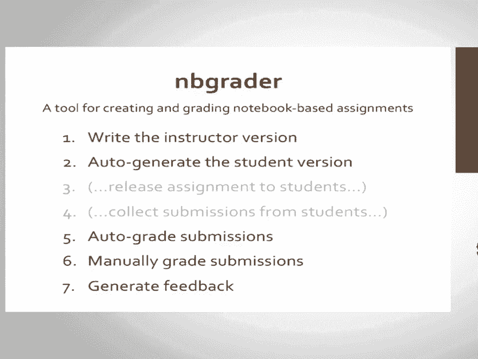

 So I just want to take a quick detour and mention。 Some of you may be thinking。

 didn't I hear this talk already？ Which is because I did give a very similar talk。

 two years ago at SciPy that was on teaching with Jupyter Note， books in Jupyter Hub。 And in fact。

 I did talk a little bit about Enbygrader， in that talk too， though that talk was primarily。

 about how to deploy Jupyter Hub in the cloud for students。

 to log into and work on their assignments there。 The talk today， I'm focusing just on Enbygrader。

 which is the tool for actually creating and grading， those assignments。

 And one thing that I just want to address。

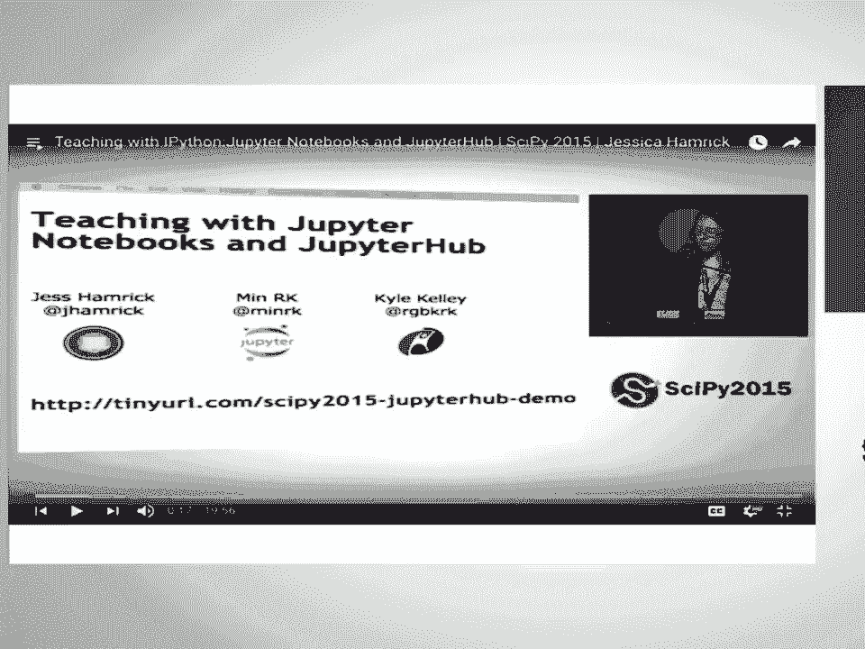

 is a lot of people， I think， as a result of this talk。

 think that Enbygrader implies the use of Jupyter Hub， which it doesn't。

 You can actually use them separately。 And that's-- and so there's sort of actually two。

 workflows that you might use Enbygrader with， one， without Jupyter Hub and one with Jupyter Hub。

 And I'm going to talk about both of those today。 So the first workflow， as I mentioned。

 is the standalone Enbygrader workflow， where you create your assignments with Enbygrader。

 and you grade them with Enbygrader。 But the part in between distributing the assignment files。

 is done manually。 So you either email those files out to your students。

 you upload them to your learning management system， maybe you post them on GitHub。

 whatever you prefer， you can do whatever you want， you just， have to manage doing that yourself。

 And then you can also use Enbygrader with Jupyter Hub。 And if you do that。

 you kind of get a little bit more， of a seamless experience here， where Enbygrader will also。

 manage the releasing and collecting of your assignments， for you。

 so you don't have to deal with all of those files， yourself。

 So it can be kind of a little bit of a more pleasant experience。

 if you're using it with Jupyter Hub， but you don't have to。

 And both of these are equally valid workflows， of using Enbygrader。

 and both are completely supported by us。 So let's jump right into it and actually take a look。

 at what a Enbygrader workflow might look like。 So I have running into background here a notebook server。

 So let's make this a little bit bigger。 Oops。 So hopefully this will not be too bad on the screen。

 So here we have our local notebook server。 It's running on local host， just like you'd normally。

 launch the notebook。 And what we're going to do to work on our assignments。

 is using this form greater extension from Enbygrader。

 But everything that I'm going to show you actually， you can do on the command line。

 It's all working on files just within this directory。 So the source directory， for example。

 contains the source instructor version of the assignments。

 But we're going to do everything through the form greater。

 because it's a little bit easier and a little bit nicer。 So that's cut off a little bit。 Let's see。

 Let's see if I can do that。 And-- OK， there we go。 So this is the new form greater interface。

 This is actually something that was just released。

 a few days ago in the most recent release of Enbygrader。

 And here what we can see in our form greater interface， is we have one assignment already。

 This is a problem set one or PS one。 And we can go ahead and take a look at what's in there。

 So if we click on the name of the assignment， we see the folder containing all of the notebooks。

 within that assignment。 In this particular case， there's just one notebook， which is problem one。

 So we can click on that and see what that looks like。 That looks like just your normal notebook。

 But actually， it has some special metadata that's part of it， that is set by Enbygrader。

 And the way that we modify that metadata， is by activating this Create Assignment Cell Toolbar。

 which， is an extension that comes as a part of Enbygrader。 And so with this cell toolbar， you'll。

 see that each cell gets a toolbar。 And using that toolbar， you can pick what type of cell。

 the cell is。 And that tells Enbygrader how to actually interpret that cell。

 So there's two kind of primary types of cells。 There's autograded answer cells。

 And then there's autograder test cells。 So autograder answer cells are basically。

 where students will write their code， and they will implement their solution。

 And it's also where you will implement your reference。

 solution in the instructor version of the assignment。

 And you can actually denote what parts of the solution， are the actual solution itself。

 So in this case， here we're using these begin and end solution。

 delimiters to mark which part is the real solution。

 And then when we generate the student version of the assignment。

 it's going to remove this whole region， and just replace it with a placeholder saying something。

 like write your code here。 So that's how an autograded answer works。

 And then how it actually gets evaluated， is using autograder tests， which is another type of cell。

 that I have here。 And in the test cell， you basically， are just writing unit tests that evaluate。

 the correctness of the solution。 So ideally， if the student's code is correct。

 and it should get full credit， then the cell， will pass without throwing any errors。

 And if there's something wrong with the student's code， then it'll throw an error。

 So in this case here， we're just checking the correctness， for this one function， squares， which。

 as I mentioned--， or I forgot to mention is this is just a really simple toy。

 example where they're supposed to compute， the squares of the numbers from 1 to n。

 So also in the autograder tests cell， you can include hidden test cases like these。

 And these work very similarly to the begin and end solution， regions。

 where when you create the student version of the assignment。

 it's going to remove those hidden test cases。 So the students won't have access to those。

 But then when you actually do the autograding， embegrader will insert those test cases back in。

 And so they can be used as something for grading， if you don't want your students to actually have full access。

 to all the test cases。 And here you can also input the number of points。

 that that particular cell is worth。 And then so when the autograding happens。

 if this cell ends up throwing an error， embegrader will assign zero points。

 And if it doesn't throw an error， embegrader， will assign however many points you set here。

 So there's no partial credit in this particular case。 It's all or none。

 If you want to do partial credit， you'd， have to either split the cell up into multiple cells。

 for multiple test cases， or you can manually assign partial credit， after the fact。

 which we'll talk a little bit about more later。 Other types of manual grading that you can do。

 as I mentioned， are for free responses。 So here I have-- this is another cell type called。

 manually graded answer。 And you can set that both for text cells as well as for code cells。

 And so this is， again， something you， might want to use if you want students to write some more。

 of a free response for a conceptual question， or derive an equation。

 or in the case of a manually graded， code cell， maybe it's either like a creative solution where。

 every student's code is going to be completely different。

 or it's just a difficult problem to autograde， and you don't want to actually do autograding。

 So in both of those cases， you'll， have to manually assign the score。

 but you still here will say how many points that cell is worth。 OK。

 so that's what the instructor version of an assignment， might look like。

 So we can now go back to our form grader， and look at what will happen when we create the student。

 version of the assignment。

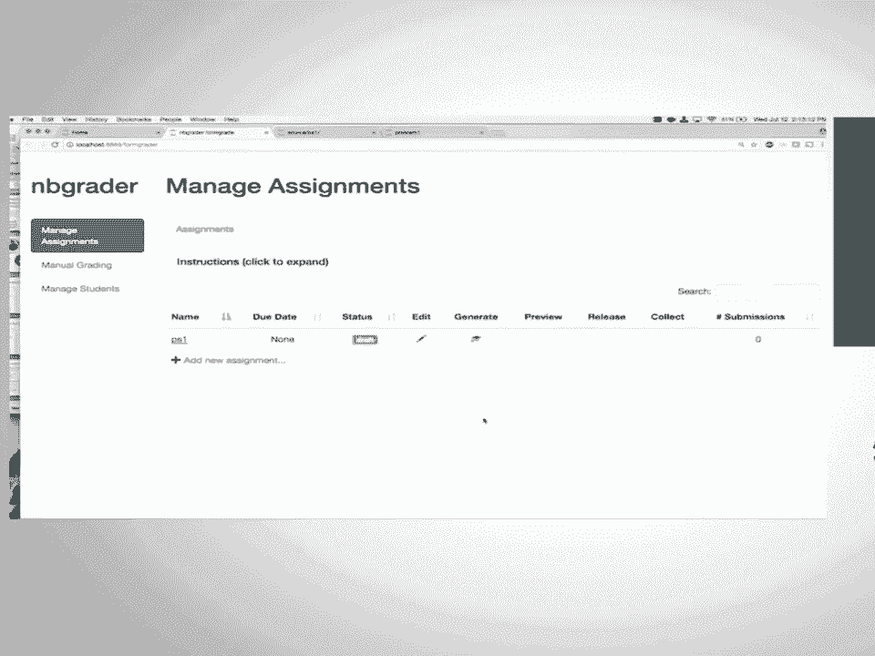

 So to do that， we will click on this generate button here。

 And that will tell us that it has successfully， created the student version of the assignment。

 And what it's done here is， as I mentioned， removed all of those solution regions and stuff。

 And it's also recorded some information， about the assignment into a database。

 so it can keep track of the grades and stuff like that。

 So we can preview what the student version will look like， by clicking on this preview button here。

 And so here we have， again， our problem one。 That's the student version now。

 And we can compare this to the instructor version。

 So if I come back to the original instructor version。

 remember this first cell we had the begin and end solution。

 regions wrapping the solution code coming to the students， version that's no longer there。

 It's been replaced by this thing that says your code here， and then throws an error。

 And what that says specifically is something， you can customize if you want。 Similarly。

 in the instructor version， we had these hidden test cases。 And in the student version。

 those hidden tests are gone。 So it's missing that check for squares of 12。 And also。

 if we scroll down to our written answers， those also get replaced。 So here。

 rather than the solution for that equation， it just says your answer here。

 And this again says your code here with the not， implemented error。

 So that's what the student version of the assignment， will look like。

 And so what you would actually do， is in this sort of standalone workflow with embegraders。

 you would take this notebook and you would send it to students， somehow， either email it。

 upload it to your LMS， post it on GitHub， whatever you prefer。 And then similarly。

 once the students are done working on it， you would collect their notebooks either through email。

 LMS， whichever you're using for your particular workflow。

 So just to kind of mimic what that workflow might look like。

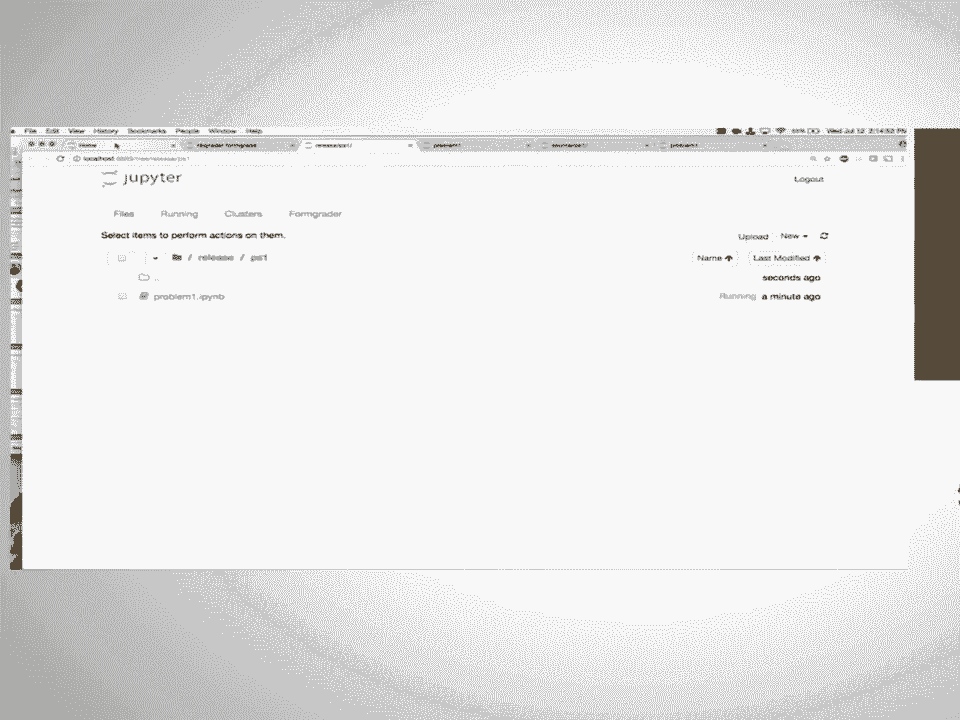

 I'm going to come here and open up a terminal， because I have--。

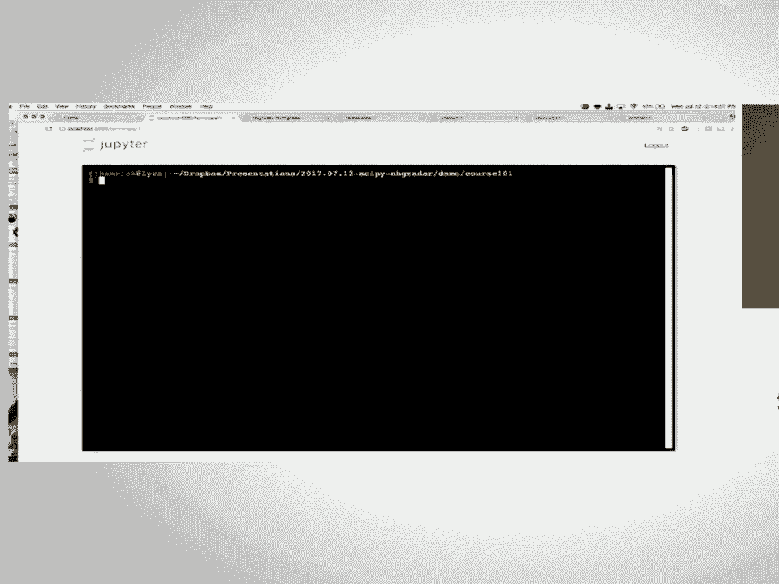

 let's see if we can make that bigger。 I have here in this submitted raw directory。

 a couple of example submissions。 One from a student named Alyssa P。 Hacker。

 and another from a student named Ben Bittetl。 And so these are just in some arbitrary directory。

 that I created。 Embegraders doesn't know where to find them。

 So in order for embegraders to find them， we have to create a special directory。

 that embegraders knows how to look in。 And so embegraders will be looking in a directory。

 called submitted with a subdirectory。 Sorry， that corresponds to the ID of the student。

 So in the case of Alyssa P。 Hacker， maybe her ID is Hacker。

 And then another subdirectory that corresponds， to the name of the assignment， so that's PS1。

 And so we'll do that for both students。 We'll call bit didle bit didle， Ben bit didle bit didle。

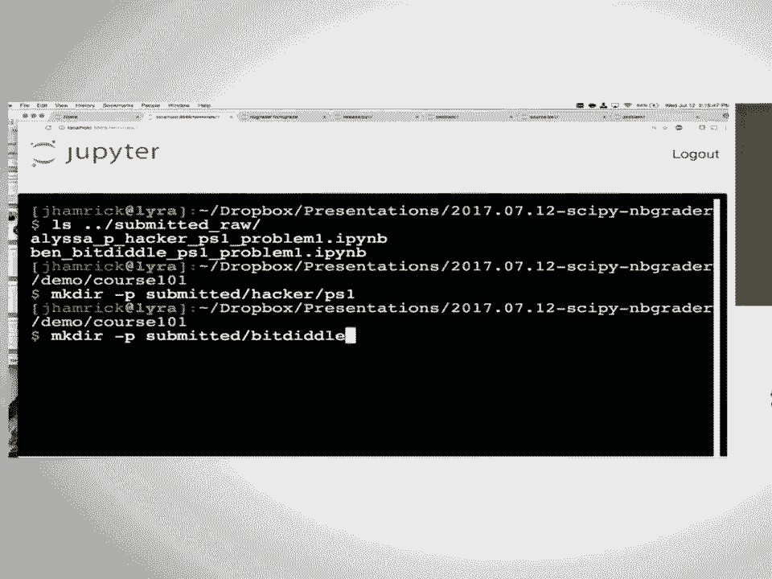

 And now we can copy those files to submitted Hacker PS1。 And then the name of the notebook。

 has to be the same as the original name when， you created the assignment。 So in that case。

 it's problem 1。i py and b。 And the same thing for Ben bit didle。 Problem 1。i py and b。 OK。

 so now that we've copied those files， to the submitted directory， if we come back to our form。

 grader and make it fit on the screen again， if I refresh the page， you'll see now here。

 under number of submissions that there are two submissions。 So we can click on this。 And we'll see。

 in fact， here are the two submissions， that we just copied in。

 There's one for bit didle and one for Hacker。 And MB grader tells us that these both need to be。

 autograted， because they haven't been autograted yet。

 So we can do that by clicking this lightning bolt icon。 And it'll take a few seconds。

 as it's actually executing， the entire notebook。 It gives us some log output about what the autograder was。

 actually doing。 We can do that for both of these submissions。

 And now you'll see that the score is listed that's， been assigned by the autograder。

 But this actually isn't a complete score， because as MB grader also tells you。

 both of these assignments need to be manually graded。

 And that's because we had those manual grade cells， in the notebook。

 And the grader detects that those are there， and tells you that this assignment hasn't。

 been finished in terms of the grading。 So to actually do the grading， we。

 can come here to the manual grading section。 Click on the name of the assignment， PS1。

 Click on the notebook， which is problem 1。 And here we get a list of submissions that are anonymized。

 and also randomized in terms of their order。 This is in an effort to try to reduce bias in grading。

 If you really want to see who the students are， you can click on these little icons。

 You can also find a submission for a particular student， by going to this managed student section。

 But I'm not going to go through that right now。 Let's take a look at the first submission。

 So this is just a rendering of the regular notebook document。 See。

 we can make it a little bit bigger。 The elements don't flow quite as nicely if it gets too big。

 So taking a look at this solution， if we scroll down。

 it looks like this student failed the tests on the first example。 And if we inspect their solution。

 we'll， notice that's because this asks for squares from 1 to n， but they use range。

 which is 0 indexed。 So we could maybe give them some feedback about that。

 So range is 0 indexed rather than 1 indexed。 And this checkmark shows that that's。

 been saved into the database now， that comment。 So maybe we could assign the student half credit。

 since they almost got it right。 They just had an off by 1 error。

 And so we could continue going through the rest of the notebook。

 assigning partial credit if we felt like it was necessary。 And then down here。

 we've gotten to the manually graded answers。 So in this first one， you can see this--。

 the background of this little field is a little bit pink。

 That's sort of to indicate that that doesn't have a grade yet。 So we can assign one。

 Let's just give full credit for this one。 And then I just want to point out this one， which also。

 was a manually graded answer， actually has been assigned a grade。

 And that's because this student didn't change the answer。 And so， embegrader automatically detected。

 that they hadn't given an answer and automatically， assigned them a score of 0。

 So it won't do really any automatic grading， of manually graded cells。

 except in this particular type of case。 So let's move on to the next notebook。 Here。

 it looks like the student implemented it correctly。 So that looks great。 We can go through。

 Here's the manually graded sections。 Let's give them full credit。

 We could also give them some extra credit if we felt like it。

 They did a particularly good job or whatever。 And OK， so now we're done doing our manual grading。

 We can come back to the notebook list。 We'll see that neither of these assignments now。

 are indicating as needing manual grade。 So we're totally done with the grading。

 And so at this point， what you would do， is you'd want to generate feedback to give back to students。

 Now， embegrader doesn't actually provide a way， of doing feedback through the web interface。

 At least not yet。 That's something that's planned for a future release。

 But creating the feedback isn't difficult。

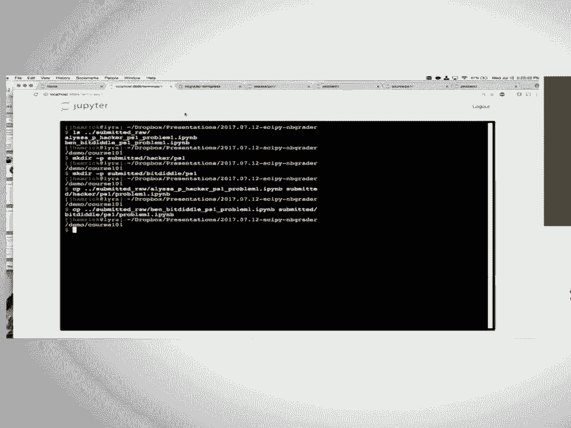

 If we come back to the terminal， what we'll type， is embegrader feedback and just the name of the assignment。

 So we run that。 And what it's going to do is it's going。

 to create an HTML version of each of the notebooks。

 that the students submitted with all of the grades， and comments in them。

 And so we can take a look at what those look like by coming， here back to our notebook list。

 And you'll see there's a feedback directory here。 That's where embegrader plays to the feedback。

 So we can go there， look at maybe Ben Bittdall， problem set 1， problem 1。html。

 The notebook will try to open it in edit mode， as opposed to view mode， which isn't so useful。

 for this particular case。 But it's a little hard to see on the projector。

 But you can change in the URL edit to view。 And then you'll get the HTML view of the notebook。

 And so here we have a little table of contents here， that gives us all of the different cells that。

 are in the notebook， as well as their scores。 It also tells us where there's comments。

 So here we have that comment that we put in， range is 0 index rather than 1 index。

 The scores are at the top of all of the cells。 And I think most importantly， though。

 this shows exactly， the students where the errors occurred during the autograding。

 So they have really detailed feedback about where， they went wrong。

 And I think that that's really rich and valuable feedback， to be able to provide to students。

 And then when you are done generating the feedback， again， you would copy these HTML files。

 and send them to students either over email or your LMS。

 or whichever you prefer。 OK， so coming back to my slides， that's。

 an example of how you would use EnvyGrader as a standalone， tool， so without JupyterHub。

 But as I mentioned， if you are using JupyterHub， you can release and collect assignments。

 with EnvyGrader as well。 So it makes it a little bit easier。 So this is basically the same demo。

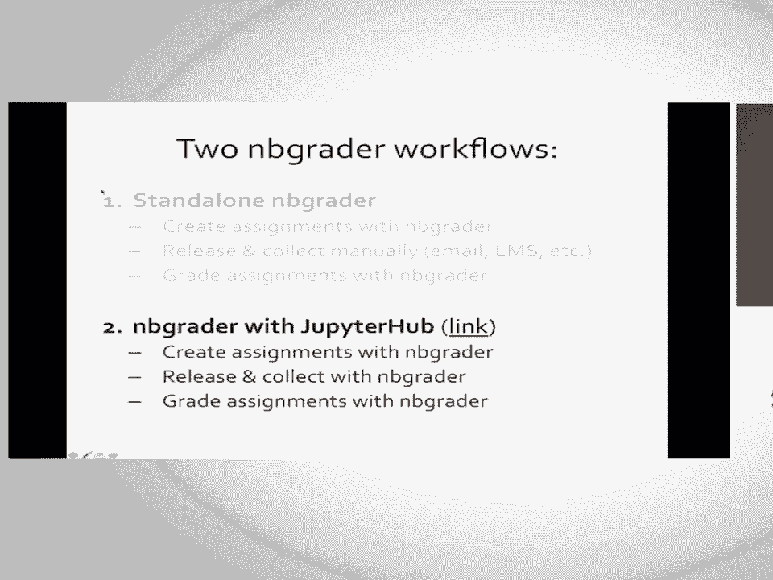

 Just the middle part is different。 I have a JupyterHub server running here in the background。

 So let's go ahead and log in as the instructor。 And we'll open up our form grader again。

 And so here we have the same problem set one， that I showed you before。

 So I'm not going to go and show the notebook again。

 We'll just generate the student version of the assignment。 And then rather than copying those files。

 and sending them over email or whatever， you can use this release button to release the assignments。

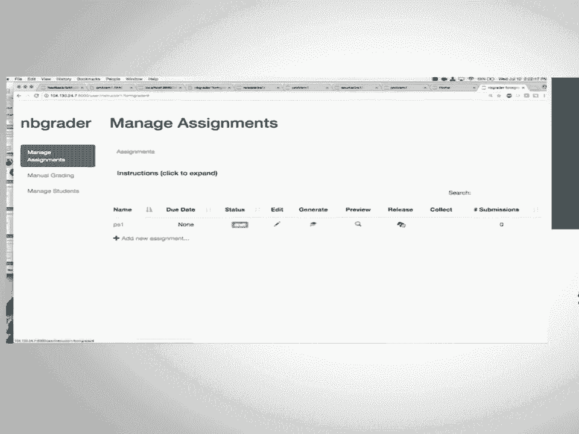

 to students on the JupyterHub server。 And so we click that and it says。

 released as course 101， problem set one。 So that's great。

 And now the students will have access to it。 So just to show you what that looks like。

 let's close the form grader and log out。 And we'll log back in as a student。

 And the students have access to this assignments tab here， which if we click on that。

 we'll show them all， of the released assignments for a particular course。

 So this is the one we just released。 We can go ahead and fetch it。

 And now the student has access to it。 They can edit the notebooks just as they normally would。

 Just for the sake of example， we could say return， the solution here。

 which is x squared for x in range 1， to n plus 1。 We can run that。

 verify that it passes the first few test， cases。 That looks great。

 Let's save it and come back to our assignment list。 One thing that the students have access to。

 is this validate button， which will tell them， if they've failed any of the test cases or not。

 In this case， we didn't actually complete the assignment。 So it's saying this cell failed。

 You didn't provide a response to this one。 So it's just a way for students to kind of make sure they。

 didn't forget anything before they turn the assignment in。

 And then when they are ready to turn the assignment in， they'll click the Submit button。

 That'll submit it back to the instructor。 And students can submit as many times as they want。

 When we go to collect the assignment's， any grader will use the most recently collected version。

 of the assignment。 So let's log back out and log back in as our instructor。

 And so here back in our form grader， we can now click。

 this collect button， which will tell us that it has。

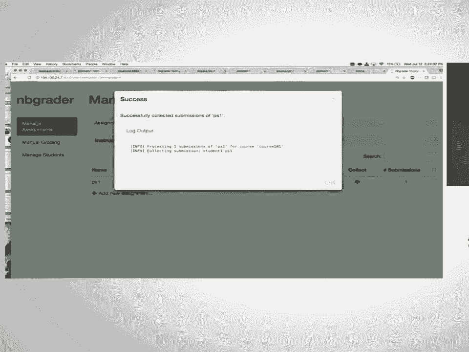

 collected a submission for student one， problem set one。 That looks great。

 So let's click on the number of submissions too。 And voila。

 there we have the submission from student one， that we just submitted。

 And so then the rest of the workflow would be the same。 You would do auto grading。

 you would do manual grading， and then you generate feedback。 There isn't a way currently on Jupyter。

 have to return feedback back to students。 So that's something you'll still have to do manually。

 But that's also something that we have planned， for a future release。

 If you have root on the machine， then you can， of course。

 always copy the feedback files directly to students' home。

 directories if you have access to do that。

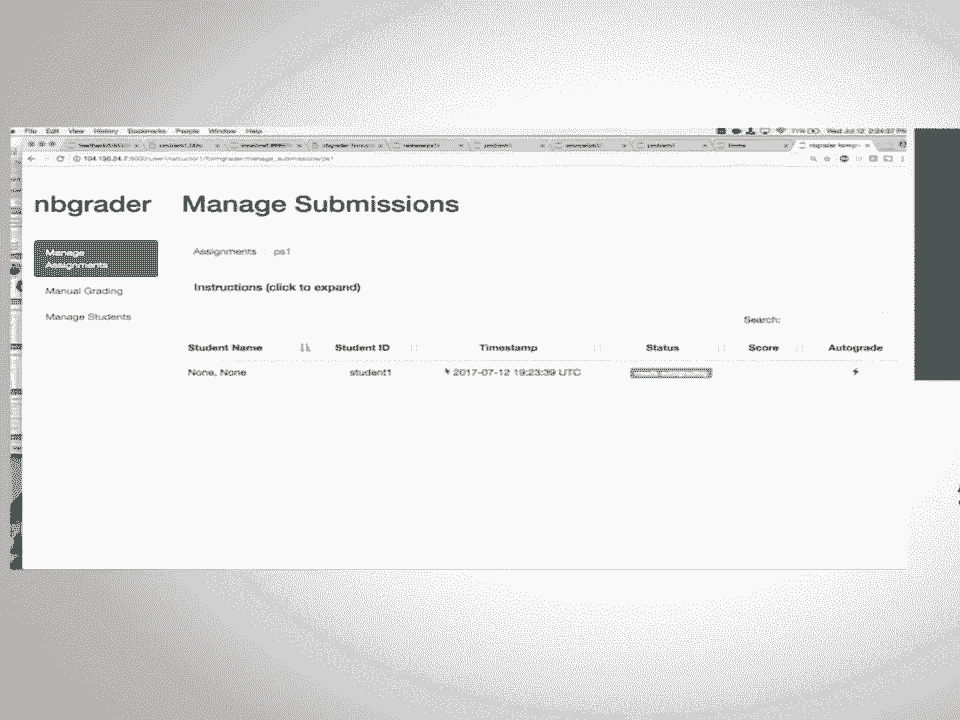

 OK， so that's just a quick overview。

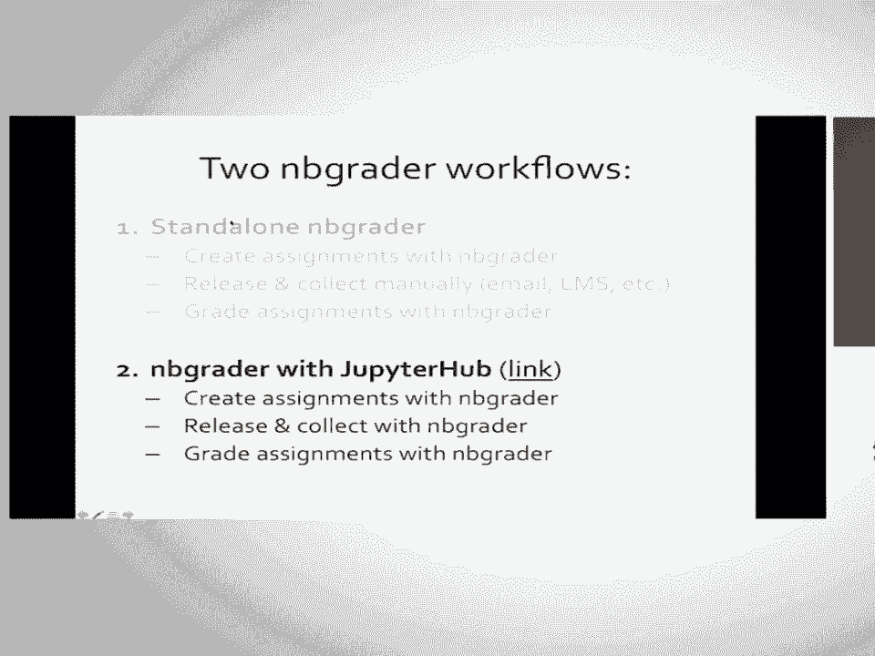

 of what Embegrader might look like with Jupyter have as well。

 So I showed you both of these workflows。 They're really similar。 Really。

 the only difference between them， is kind of this middle step of how you actually。

 get the assignments to students and how you collect， the submissions back。

 But which one you choose is kind of up to you， depending on your class size and whether you want to set up。

 a server or not。 And both are being used by a number of different classes。

 So both are totally supported。 And there's a lot more about Embegrader。

 that I really wish I had time to tell you about， but I don't。 So if you have additional questions。

 I am happy to answer them。 A lot of the things I showed you today can be customized。

 And there's some other nice features that come along， with Embegrader as well。

 So I just want to invite you to the sprint。 If you're going to be around on Saturday。

 we'll be sprinting on Embegrader， trying， to get some issues fixed for the next release， which。

 will happen in a few months。 And also get some more people involved in the project。

 And I also just want to thank the people who have already， been involved in the project。

 All of these people listed have either contributed code， via pull requests or open to issues。

 or just provided feedback in general。 And so Embegrader really wouldn't be where it is today。

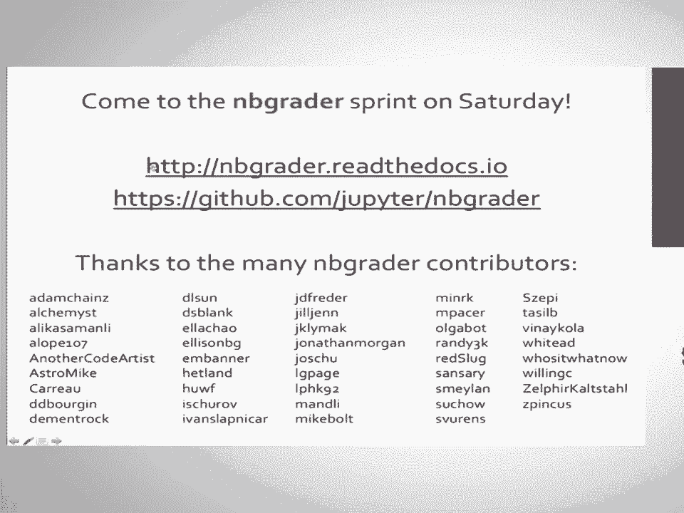

 without the people who are using it。 So thank you very much。 [APPLAUSE]， [BLANK_AUDIO]。

