# P27：Keynote - Coding for Science and Innovation  SciPy 2017  Gaël Varoquaux - 哒哒哒儿尔 - BV1Cs411A76Y

 So really， there's one thing I'd like to add to Prebrii's really moving introduction is。

 SciPy is a family for me in many， many， many， sense， but it's really hard to overstate the。

 impact that SciPy has had on my career。 Prebrii told you I was doing quantum physics and I。

 switch a lot because of SciPy and you know whether it's here or all over the world remotely over。

 internet， SciPy is really a huge amount of friends for me。 When I come here I see friends like。

 Prebrii， like many others and I mean I hope it's the same thing for you because it's such a pleasure。

 to be here to see these people for me。 It's huge。 It's much more than work， much more than work。

 And so thanks a lot for giving me the opportunity to come back here and to see my friends。 It's。

 really， really great。 So moving on to my talk， what I'd like to talk about is I'd like to。

 share a few thoughts on how we code， how I guess I've tried to code for science and for innovation。

 with the goal of the models goal of changing the world， of course。 That's why we do it。

 So when I say science just to set the words， I mean the process of discovering either。

 knowledge or mechanisms and so this is not only in academia， right？

 This can also be in the industry。 And these days computing is central to this process。

 So just to have a 90， let's do a show of hands。 How many people here are from academia？

 How many people here are from the industry？ That's about half and half， I think。

 I know I should ask how many people here don't like raising their hands。

 I'm stealing that one from 9。 So combining science and computers is something that's happening a lot。

 And it's often known as computational science。 So we've heard， for instance， the application。

 to nuclear physics。 Do we have any nuclear physicists in the room？ I get， "Yay， yes we do。"。

 Free dynamics， computational free dynamics。 Yay， grabbers as a computational free dynamics。

 Can I miss any computational chemist？ Anybody for the psychology？ Don't be shy。 Yay！ Awesome。

 Am I pushing it by asking for a psychologist to be at a computer computational science conference？

 Well， you might think so， but I don't think so because if you think about marketing。

 the biggest impact on marketing those last years has been data science。 So basically。

 crunching data on your customers to understand them better。

 So the traditional fields of computational science are expanding， I like to say。

 So the CEO of the American Association for the Advancement of Science had to remind Congress recently that I'll read this。

 Science is not a political construct or belief system。 Scientific progress depends on openness。

 transparency， and the free flow of ideas and people。 So quite clearly。

 the way we do science is becoming an important issue because it's been discussed in Congress。

 The thing is this progress is not always working as well as it should be。

 And so to give you an example， there was this paper published in Economy a few years ago entitled Growth in Time of that that basically argued that in the presence of strong debt。

 they would hinder economical growth。 And it was used as a basic for public policy。

 things like blaming public debt for the financial crisis。

 It turns out that this paper is considered as wrong these days。

 and this was found by analyzing the exel spreadsheet that was used to base the conclusion of this paper。

 Another example is autism and vaccines。 So just to stress it， vaccines do not cause autism。

 There's no scientific evidence that vaccine cause autism。

 There was one study that was published in the Lancet that has been shown after the fact to be forged。

 and not saying wrong， I'm saying forged。 The consequences， however。

 is that in some highly educated countries， there has been a drop in vaccination。

 And as a consequence， there have been outbreaks of diseases that should by now be eradicated from the planet。

 And it can be directly traced to the claims that autism codes， that vaccines cause autism。

 that is forged signs。 So the point I'm making here is that the loss of trust in science is extremely costly。

 And I think we're undergoing it currently。 So to talk about innovation。

 I'd like to say that innovation is about putting the right technology to the right use。

 And if we think about the light bulb， did you know that it was actually invented by Linsey in 1835？

 But extra progress was needed to make it viable。 There was good vacuum pumps that were needed。

 So that took a little while。 And then the breakthrough really came when it was economically viable。

 which means that there was a， mobility of electric power。

 And that's when it is in company whom we all know。

 and whom we all credit for the light bulb took off。 Another story。

 another interesting story is the story of Adbox。 Adbox was a company that was based out of Austin。

 and that digitized physical mail。 So it would scan the mail that you would receive。

 It would take it from your mailbox and scan it。 The thing is Adbox was told by the US Postal System that the USPS customers were not the citizens。

 They were the people who sent the mail， including the junk mailers。 Hence。

 Adbox was interfering with the business of the USPS。 Hence， the USB is a Photobox， and eventually。

 drive it to the ground。 My point here is that there is much more to innovation and technology。

 There is economics， there is power balances。 We as technologists tend to focus on the technology。

 but we need to understand that it is embedded in a wider world。 So。

 to come back to the title of my talk， Coding for Science and Innovation。

 I would like to claim that computing is the new electricity。 It is a current。

 strong driver for change。 And with the new data sources。

 it is able to reach way beyond physics and engineering。

 And this is what has been known these days as data science。

 and I think it is having a huge impact on society。 So。

 I would like to first take the point of view of the scientist and to look at how I feel about coding。

 and then to take the point of view of the person who built software and then to look at our ecosystem。

 So， coding as a scientist， and this is me， displayed on the slide。 I shaved this morning。

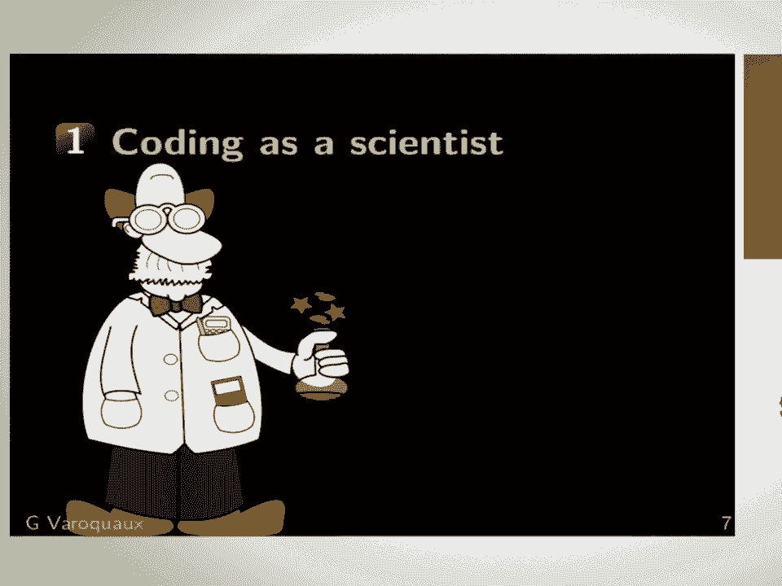

 So， over the last few years， I have been interested in the impact of data on brain sciences。 So。

 brain sciences are interested amongst other things in our mental world。 So， things like， condition。

 emotion， or corresponding pathologies， autism， depression。

 This has been historically studied by verbal interactions， and this is basically psychology。 Now。

 one thing has changed over the last few decades is that we know can image brain function。

 We can get quantitative recording of what is happening in the brain。

 And this is having a slow but deep impact on psychology and cognitive science。 So。

 I think it is a very interesting place to be at。 And so。

 we've been looking at what data processing can do to these fields and processing medical images。

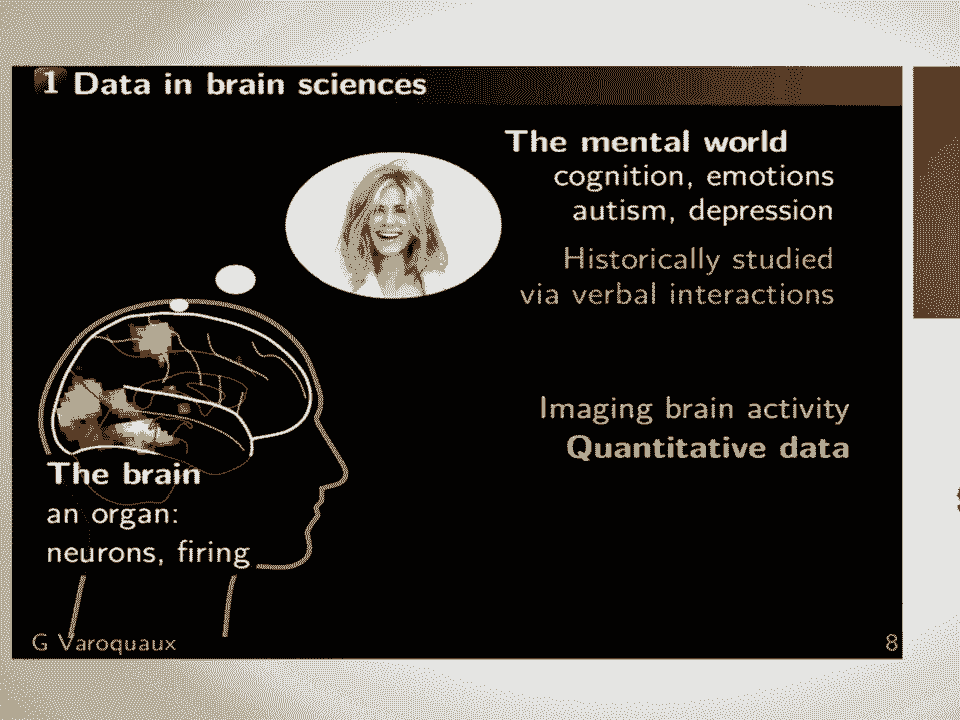

 So， to give you an example of a work that we've done， we've been interested in biomarkers of autism。

 So， can you look at the brain of someone and conclude whether that person is likely to have autistic syndrome or not？

 And so， the way we work is basically we're going to compare the brain activity of many。

 many different subjects。 And then we're going to use supervised machine learning。

 so basically computers to learn how to discriminate autism from control。

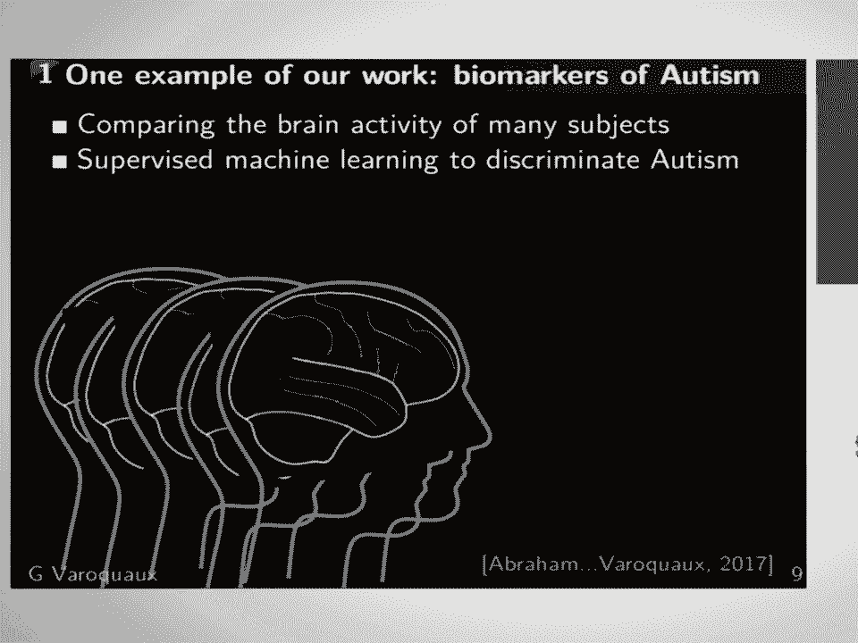

 So， in practice， to give you a bit of an idea of the engineering that goes behind this。

 the first thing that we're going to do is that we're going to extract brain networks。

 We don't know what this is， but what really matters for computation is that we're doing unsupervised feature learning。

 and that we're fitting a fairly complex model， much more complex than a logistic regression to one terabyte of data。

 So， there's a bit of a computational challenge or a great make challenge。 Then， once this is done。

 we're going to look at how we can parameterize the per-subjects brain connectivity。 And so。

 this is when I get to pretend I'm a mathematician and to talk about things like information。

 geometry， and knee algebra。 If you're interested， let's talk about this offline。 And then basically。

 we do supervised learning on this。 So， we just take scikit-learn and apply it because this is what supervised learning for us is。

 So， this works， but there's strong limits to the impact that we're having on psychology or psychiatry。

 The first one is we cannot， by construction， outperforms the clinician that defined autism or control。

 Because these are the people who are giving us the definitions。 So， by construction。

 we can't do their job better than themselves。 The thing is。

 the psychiatrists are not happy with their current definition。 So。

 brain disorders are defined by symptoms。 It's an incurrence-fortable situation。

 To define a pathology by symptoms， you would like to define it by the attack to a tissue or by a mechanism。

 However， they're not ready to accept our black box algorithmic definition。 We can tell them。

 you know， I can predict whether somebody is a test ticker or controlled。 They won't accept it。

 And maybe they're right。 Maybe they shouldn't trust the black box algorithm。

 Because it has a lot of moving parts。 So， the challenge that we face in the long run in this field is。

 can we get the practitioners to make their tools theirs？ Because if we can do this。

 I think we'll have a deep impact on psychiatry。 If we can't do this， the question is open。 So。

 as I said， science faces a quest for trust。 And this is often being labeled as reproducible science。

 So， Victoria Stodden says that if it's not open and veryifiable by others。

 it's not science or engineering。 So， people in this field and in computational science have been talking a lot about computational reproducibility。

 The idea being that if you automate everything and control the environment。

 things should be reproducible， right？

 So， let's automate everything。 And as my boss once said， you know。

 it's just a simple matter of programming that boss sitting right here。 Now， of course。

 it's a bit more challenging。 And the reasons are that some operations work much better with a human in the loop。

 So， labeling some insights on data。 So， basically people， there are humans in the loop。

 Science has humans in the loop。 The other and related challenge is that scientific research is an iterative process。

 So， we have a tension between the desire for quick and easy interaction and the need for automation and replay。

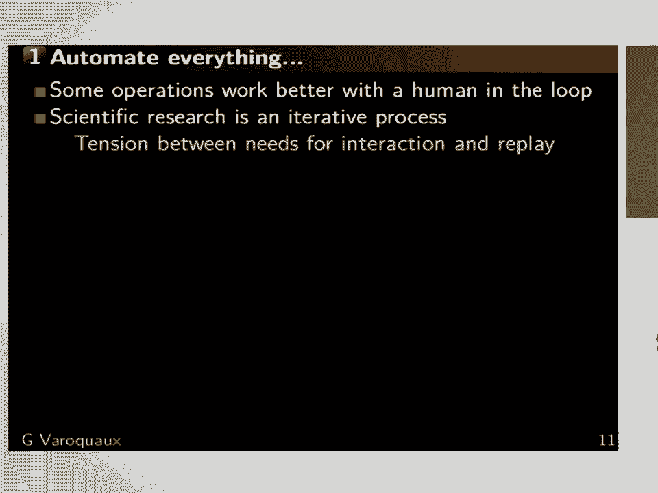

 And I think everybody feels it in this community。 So， a long time ago。

 when we were working on 3D data visualization with Prabhu on my AVI。

 I think the way we tackled it is that my AVI's code base creates a strong link between it's an internal object model。

 and the dialogues it exposes。 So， the code looks like the dialogues。

 The code doesn't look like the visualization but like the dialogue。 So。

 we thought that was good but that wasn't enough。 So。

 then Prabhu added a fantastic feature which is the record mode。

 You would click on the record button and then you would change things on the visualization and the corresponding lines of code would pop up。

 So， that's one way of going at it。 So， trying to basically record what people are doing。

 Another interesting thing that's happening is what's happening in the space between code and interaction around the Jupyter notebook。

 and all those ideas of mixing widgets and code。 So。

 I think there's going to be a lot of experimentation that's going to happen here。

 and I'm not exactly sure what's going to come out but maybe this will help reconciling the need for interaction and the need for automation。

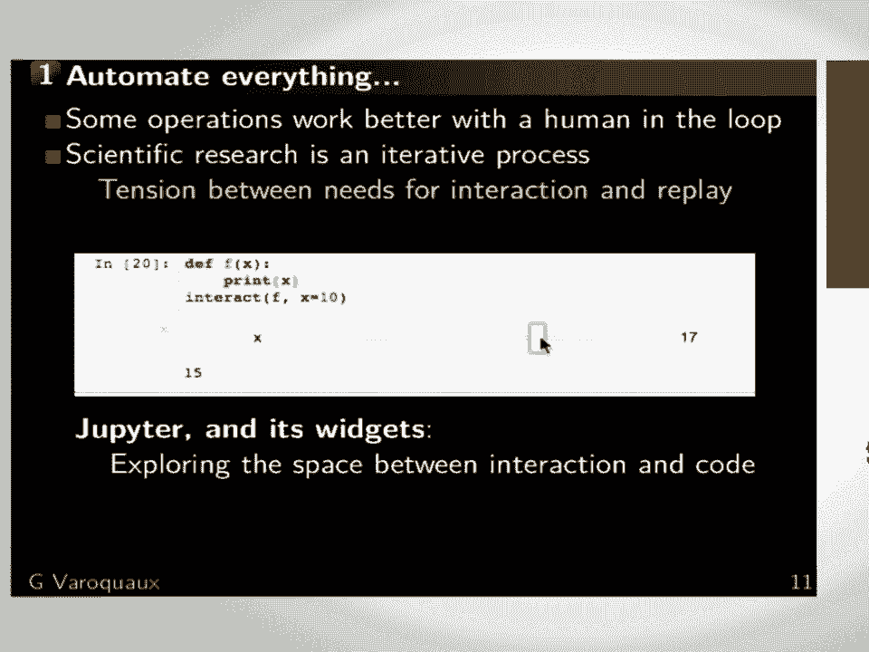

 So， if we make every computational step reproducible just good science will emerge， right？

 There's recently been a study that estimated the reproducibility of psychological science。 So。

 that's the title of the study was published in science and what they found is that 36% of the published effects reproduce。

 Only 36。 And if you look at the problems， well the number one problem is statistical challenges。

 There are many ways you can analyze the data。 If you analyze the data in all the possible ways and you choose your best conclusion。

 your favorite conclusion， you will not control your error rate。 That's basic statistics。

 It's easy to forget it when you think you're right。 I always think I'm right。 So。

 I'm going to analyze the data and at some point I'll confirm the fact I'm right。

 And that you know that couples in the fact that they're fairly weak incentives in academia。 So。

 you have to publish if you want to survive。 And even the most honest people get fooled by this。

 I got fooled by this。 So， you end up， so the problem is the following。

 In the published literature you have more false positives。

 more false finding that you think you have， just because there's a selection bias。

 It's an instance of winners' curse。 So， if you look at the problems here。

 very seldom is it a computational reproducibility problem。 So。

 we like to pick up the small numbers of cases where it's been a computational reproducibility problem。

 But the problem of science is not only computational。 I guess that doesn't surprise you。

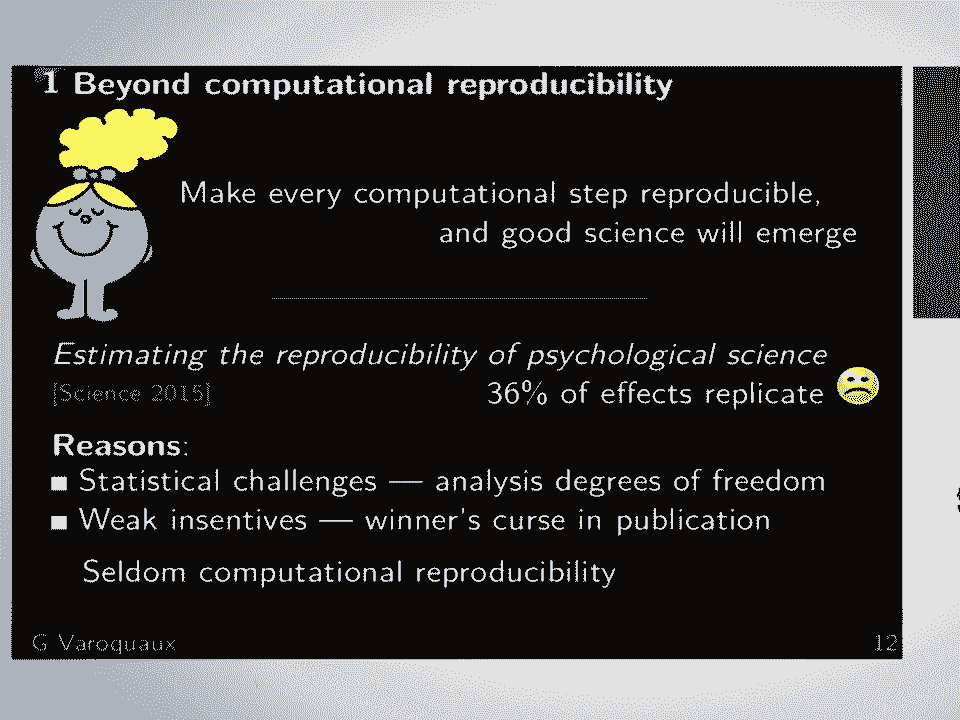

 So， I think that reproducibility is a misnomer or maybe just a too small concept。

 And for computational science， what matters is that operations are verifiable to build trust。

 And ideally， reusable。

 That said， if we want to improve research， to improve science in general。

 the best way to do it is to use the right tools， whether they're the right software tools or the right conceptual tools。

 and to get people to use the right tools。 It's a hard problem， by the way。

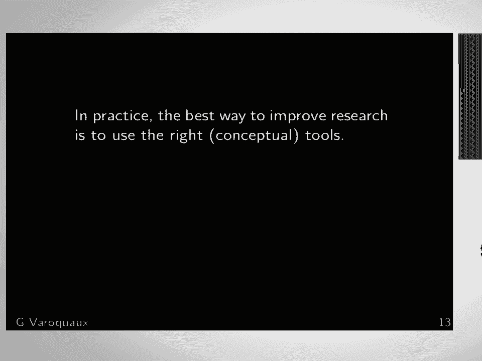

 The reason it's hard is that a research environment is so complex from a sociological standpoint and from a technical standpoint。

 The real roadblock that people face is really cognitive load because researchers combine concepts from many different fields。

 If on top of this， they need to combine tools that are all different。 You know， shell scripts。

 matlab， python， stan， bugs。 You probably don't know all these tools。 I don't。 So。

 if you're sitting in this space trying to combine all these complex tools with all the corresponding complex。

 theoretical concepts， well， the chances that you get it right are small and the chances that you find the right tool for the right job are even smaller。

 So， to summarize a bit， coding as a scientist， I think that the final code should be auditable in some way。

 This is hard and ideally reusable and this is also hard。

 There's quite clearly a tension between interactive computing and automating and I think the main enemy is cognitive overload。

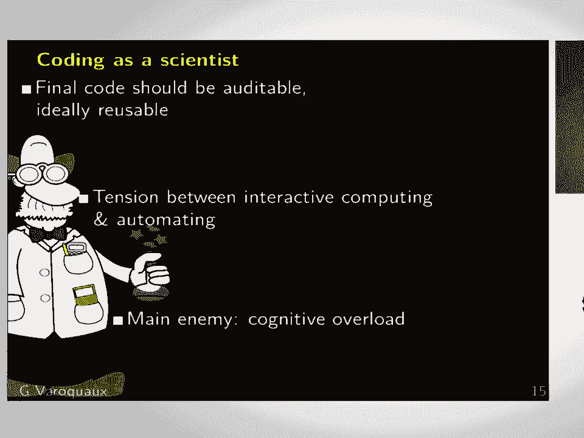

 Is that very different from the industry？ I don't really think so。 So。

 the Silicon Valley has a bit of an attitude that， hey， if it doesn't work， if it works。

 you don't really need to know how it works。 I mean， it just， what matters is it works。

 I've sold the problem。 That's partly true。 It's not true for every field of application。

 but it's also harming the Silicon Valley because there is more and more resentment against the Silicon Valley。

 And I don't want to go too much into this， but maybe the law of selections are related to this。

 One thing that the industry has and that academia does not have is when it has a problem。

 some industries can just shove more money to it。 So， they can hide some of those problems。

 but they're just shoving money to it。 The problems are still there。 So。

 just to give you an idea of how I think about my work as a scientist using code。

 I have a very iterative way of working。 And this is the list of steps that I apply one after the other。

 The first thing I do is I use a good editor and some form of linter in it。

 Why do a few people do this？ So， the idea being if you do a typo in a script that you're going to run。

 and it's going to run for 24 hours， and the typo is at the end when you're saving the results。

 You've just lost 24 hours of computation。 It costs just about nothing to add the linter to an editor。

 so I think you should do it。 Something that's also very cheap is coding conventions。

 You've got to get in the habits， but I try no longer to name my variables single letters。

 so x and y。 And if you use like a learn， you may have noticed that we use x and y a lot。

 That's historical。 Sorry。 Version control is quite cheap。

 You should see the comment messages in my scientific repositories。

 I think 99 of them are called iter。 But it's better than no version control。

 If you want to scale up and build good tool or good science at the scale of a lab。

 then reading each other's code is very important。 Code review， that's well known。

 One step further unit testing， because really， Spring shows that something that is not tested is either broken today or tomorrow。

 That's just true。 And if you want to go one step further and share your results。

 then you can make a package with control dependencies and compilation and everything。

 So there's an increasing cost here。 It's really important to avoid premature software engineering。

 As Katie mentioned in her talk yesterday， I don't think everything should be reproduced。

 I'd like to measure the amount of stupid ideas that I have compared to the amount of good ideas。

 but I don't think it's a good ratio， by the way。 You don't want to reproduce my stupid ideas。

 So it's a trade-off between overengineering and underengineering。

 The fourth goal is to generate insights or if you're into innovation to move into new spaces。

 So experimentation is great for insights and proof of concepts that develops new ideas。

 As those ideas become clear， you need to consolidate。 The good news is Python is amazing for this。

 Python allows you to write horribly dirty code and also very clean and robust code。

 The important thing is that you need to progressively move。

 And I say progressively because it takes me years to know whether my ideas are good or bad。 Really。

 it does。 So basically what I do is I make things more and more solid。 And as they become solid。

 I understand them better。 And as I understand better。

 I know whether I want to throw them away or turn them into a package。

 So when everything goes right and those ideas end up being solid。

 so that's like one percent of the things we try， then I think we need to share them。

 We need to make them reusable and we need to turn them into a library。

 And so that's where I take my other hat， which is the hat of a software developer。

 and I worry about building software for science。 Libraries are really important because they enable us to scale。

 because first， abstractions reduce cognitive load， that's crucial， and second。

 they enable code reuse。 So I can use some algorithm that you wrote and that I'm not clever enough to understand。

 and that's crucial。

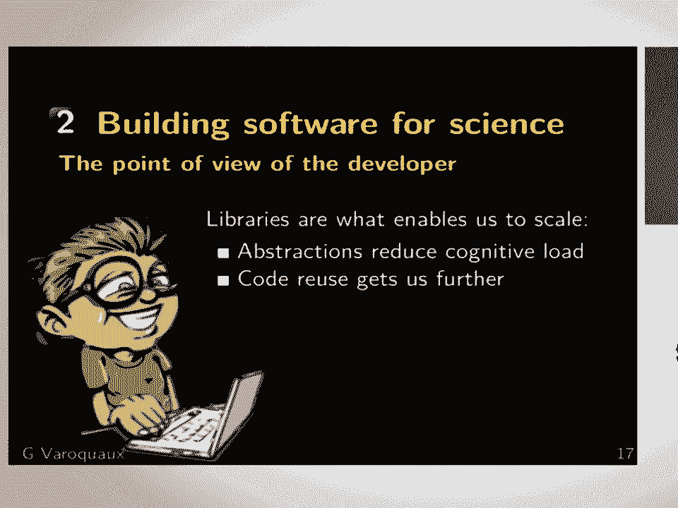

 So examples of libraries I've been involved in， scikit-learn。

 Our goal is to make research in machine learning usable to people who do not understand models and algorithms。

 That's our goal。 I think we're partly successful。 Another library I've been involved in。

 which is a smaller library， is NILern， where our goal is to make it easy to understand。

 to answer new imaging problems， or brain imaging problems with machine learning。

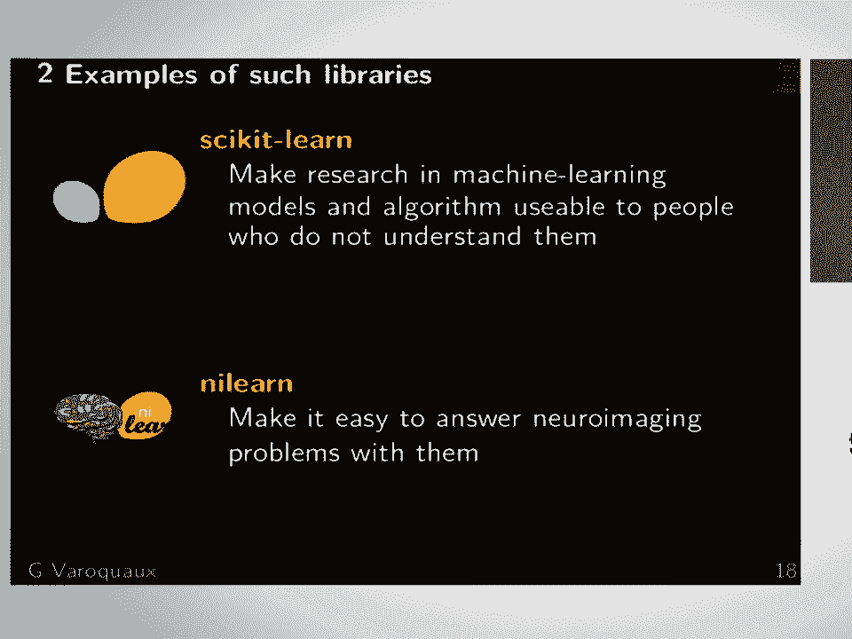

 So the challenge that scikit-learn faces is that the space of machine learning model is huge。

 and it's hugely diverse。 Another challenge is that the coding concepts are the easy one。

 The statistical and machine learning concepts are the hard one。 And in NILern。

 we face a very specific challenge。 A severe， interesting one is that my goal is to onboard technology adverse users。

 And it's a strong goal for me because I think if I want to have an impact on brain science。

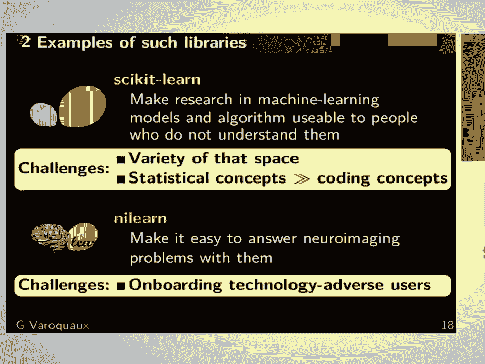

 we need to achieve that goal。 That's very important。

 So we need to design tools that reduce cognitive overhead。 This is really a design problem， right？

 And what I mean， design， I mean industrial design。 I mean designing cars， designing bikes。

 designing forks。 So there's this field of expertise that's called industrial design。

 and it's people that basically sit down and worry how every day tools are going to look like。

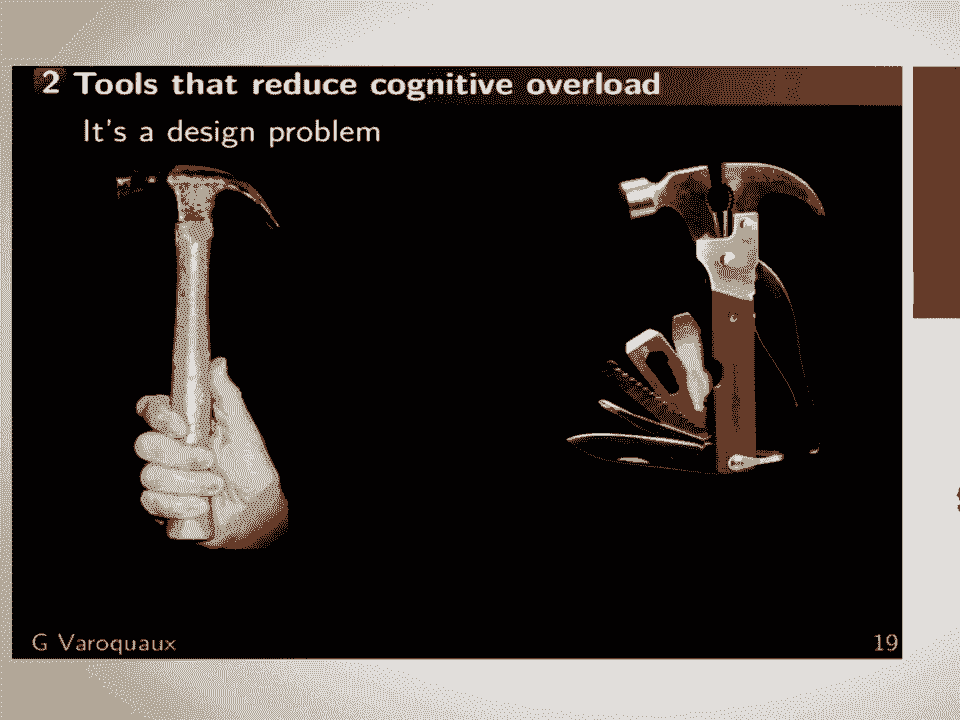

 And so did you realize that the number four person at Apple， Jonathan Ive。

 is an industrial design person。 It's a person who was designing microwaves before he went to Apple。

 or chairs。 So Apple has quite clearly understood the importance of industrial design。

 and you feel it when you use your product。 So I think actually the SciPy community has understood that quite well。

 So I'd like to say， you know， SciPy code different。

 Design is a hard problem。 It's a very hard problem。

 So I'd like to propose a few design principles for the SciPy stack。

 And this is me trying to play the Zenf Python thing so it's bound to fail， basically。

 But I'm going to give it a try anyhow。

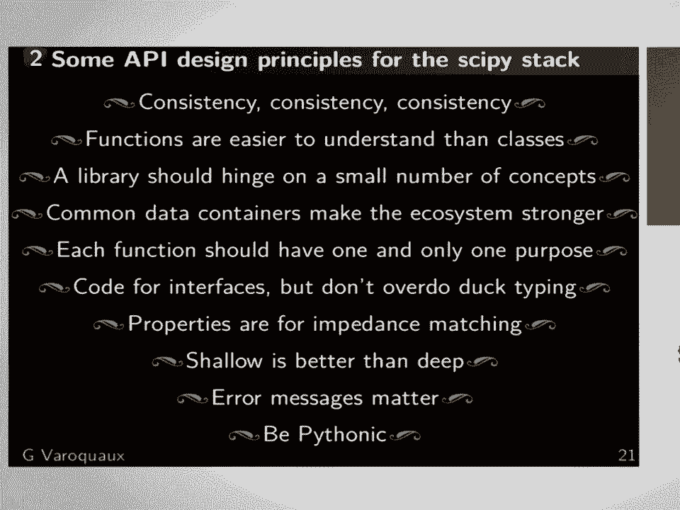

 So the first thing I learned， and I actually learned this with Prabhu， is consistency。 Consistency。

 consistency。 So I remember a poll request where I had written a two word argument with no underscore between the two words。

 And Prabhu was like， this is inconsistent with our coding guidelines。 I was like。

 this guy has so much attention to detail。 But it really matters。

 So if you look at this is not to bash libraries。 When I come up with problems。

 it's not to bash libraries。 I can't come up with these problems in Scikit-learn because we've fought them and we've removed them all。

 But if you look at SciPy， for instance， some of the SciPy optimize functions take maxed iter with。

 no underscore and some of them takes maxed iter with one underscore。

 I need basically to store this in my memory or to look it up each time。

 And I've got a tiny memory so it doesn't work。 So that's an example of cognitive overload。

 Something that's very important to me is that functions are easier to understand in classes。

 Objects have hidden states。 In some situations it's extremely useful。

 If you're doing a graphical user interface toolkit， you have hidden state by construction。

 But that hidden state is something that the user needs to have in mind。

 The other thing is that objects do not have universal interface。

 They have no clear entry point and no clear output。

 So functions are actually much more reusable than objects。

 And if I say this to a software engineering person， that software engineering person will。

 immediately tell me that I don't know how to do object-oriented programming because anybody。

 who knows how to do object-oriented programming properly knows that objects are more reusable。

 than functions。 So I claim I do know because I worked with Prabhura Mshandran。

 So I do know how to do object-oriented programming。

 And the problem is if you're trying to go across library bounds， objects traverse very。

 poorly library bounds because objects come in with their own set of conventions and concepts。

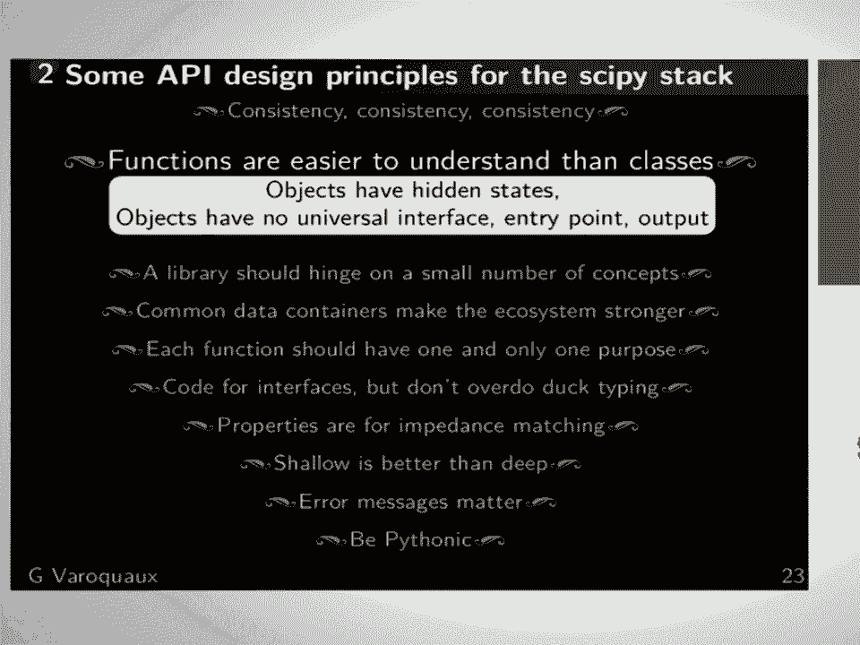

 So relatedly， a library should hinge only on a small number of concepts。

 And what I mean by this is if you've understood how to use one end of the library， can you。

 transfer this understanding to another end of the library。 Now this is a hard design problem。

 I don't think it's something that if I were to start a new library， I can get right the， first time。

 I need to iterate on this。 The question is I need to find out what are the domain concepts。

 the handful of domain， concepts， very useful， that are universal and that I need to hang onto and to move around。

 I'd like to stress that common data containers make the ecosystem stronger。

 So if you have a function that takes as an input， an object that's an Earth-factory model。

 and you're trying to use this thing， you have no idea what an Earth-factory model is。

 And maybe it's nothing more than what could be shown as a dictionary of mapping of the， Earth。

 data mapping the Earth。 And if it was written， this is a dictionary which has this in this input。

 this in this， case or I don't know， a pandemic frame or something。

 but basically if a library defines， its own data containers。

 there's a big cost to switching to this library。

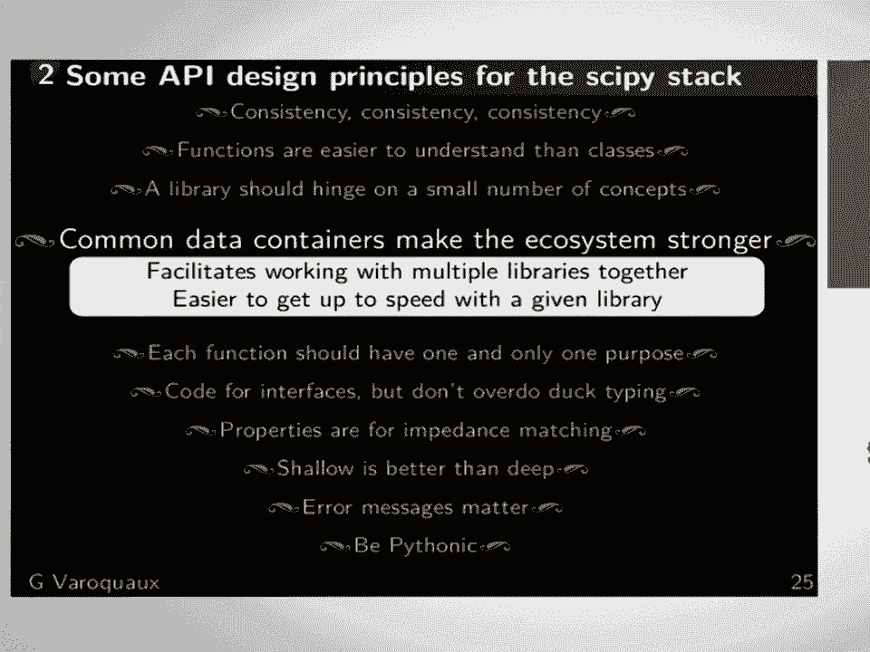

 So each function should have one and only one purpose。

 The most dangerous thing is when there is a change of behavior depending on the input， type。

 And for me， the most obvious example is Git Checkout。

 Depending on whether what goes off to Git Checkout is the name of a branch or the name， of a file。

 it behaves extremely different which creates a very surprising behavior。

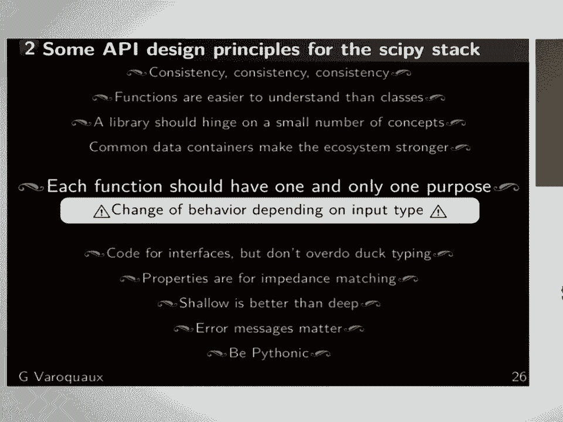

 So it's very important to code for interfaces。 What I mean by this is you're coding。

 expecting objects to expose a set of attributes and。

 methods and this defines their interface and this is how you move objects around and。

 use objects around your library or other libraries。 That said。

 it's also important not to overdo duck typing。 And a good example is the NumPy matrix。

 If you code a function expecting that you're going to get arrays and that function multiply。

 arrays and somebody shoves in this function and matrix， it might very well work for a。

 certain definition of work。 Basically you're wrong answers。

 So that's a good example I think of having gone too far with the IT that you have an。

 interface but different behavior behind this。

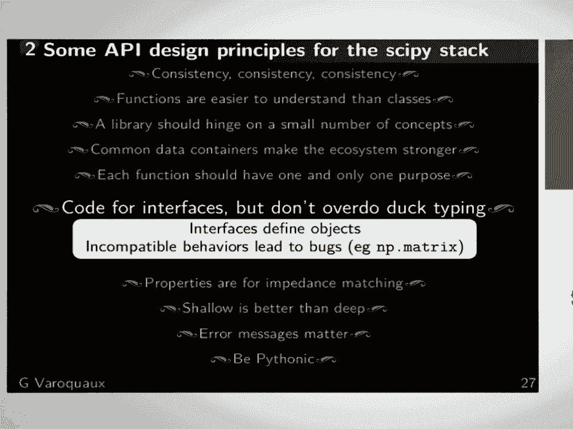

 I think that properties are there for impedance matching and not for anything else。

 I don't really like properties because they obfuscate the data model of the objects and。

 I think that understanding the data model of the object is something important。

 And they can also create hidden compute costs。 So basically if a property has a large computation。

 So I think that properties are things that should be used to fix interface bugs but they。

 shouldn't be used to build an API。 They're notable exceptions to this。

 I mean the end array shape or end array number dimensions are good examples of useful use。

 of properties。 But as a library designer， I worry about using too much property。

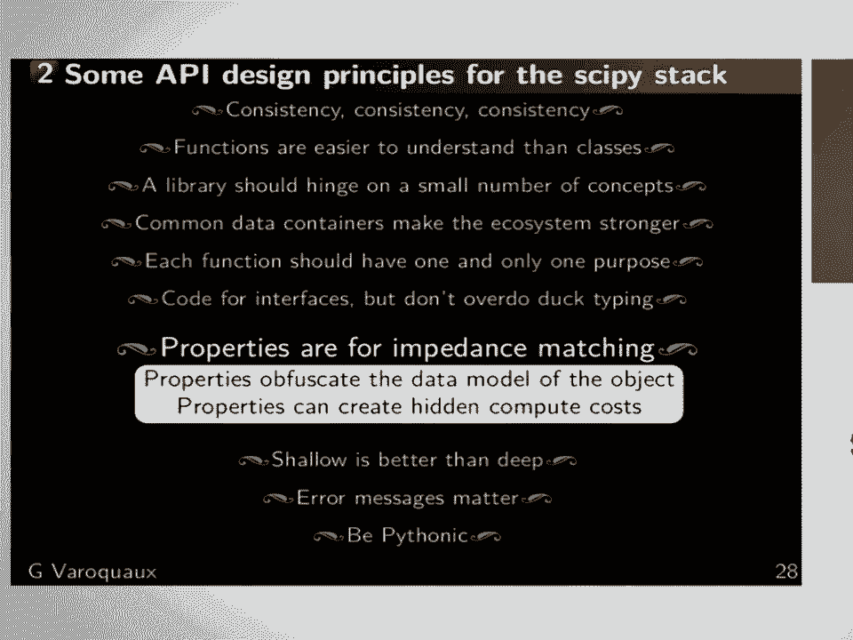

 Shallow is better than deep。 I personally understand an object by using it。

 I don't understand an object。 Sometimes by reading the code。 But if when I use the object。

 I tap complete and there's 163 methods on it。 I have no idea what this object is。

 If I need to go in sub objects， maybe twice down the line to understand how to modify something。

 about my end user problem， it's very hard for me。 So a good air message explains the problem。

 A good air message prints the offending value and the reason you need to do this is because。

 maybe you didn't put this offending value。 Maybe this offending value was read from a file or something like this。

 So you don't understand why it's wrong。 Or maybe there's something in the offending value。

 Maybe there's a UTF-8 character hiding in it。 The other thing that we've learned and many others have learned is that catching errors。

 early is important。 Which is hard and which actually has a tension with the idea of duck typing。

 Because catching errors early means that you're going to start checking basically what comes， in。

 And if you type check to aggressively you're reducing the kind of data that your user can， put in。

 But if you don't type check aggressively enough， the thing is going to break after an hour of。

 computing and deep down the stack。 It's a hard but important problem。 And finally， be Pythonic。

 And what I mean by this is avoid syntax hacks。 It's possible to do crazy things with Python。

 Whether it's overloading operators， whether it's looking at the stack and changing your。

 behavior depending on the stack。 Those things are possible。 Don't do them。

 The reason they're extremely useful， the reason it's extremely useful to have crazy things。

 possible in Python is to have things like profilers or debuggers or basically tools that inspect。

 the runtime to help you understand it。 But I don't like to integrate this in the design of a library because it makes the library。

 surprising and hard to understand。

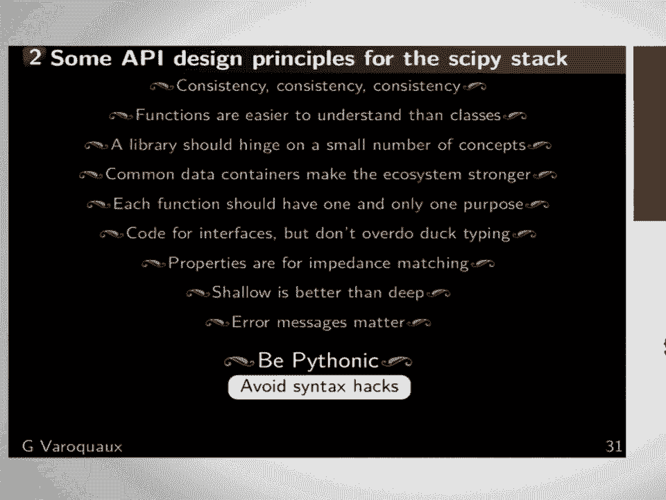

 So I made a scikit-learn cheat sheet because there were other cheat sheets at the conference。

 And here it goes。 To create an estimator， you create an estimator。 To fit the estimator。

 you call the fit method。 To predict with the estimator， you call predict and to transform data。

 You call transform。 Okay。 I'm a bit tongue in cheek here。

 I just wanted to display that with scikit-learn， we thought actually we went through a few iterations。

 on how to make the API as clear as possible。 And it won't be fully clear。

 Some people would like fit to be called train。 Some people would like predict to be called test。

 Depends on the culture。 So there's a strong cultural aspect to APIs。 The estimator is a contract。

 And this is only part of the contract。 It's slightly more elaborate。

 Because we have this strong notion of an estimator that comes with a contract， it has。

 created an ecosystem of packages that live around scikit-learn。

 And some people have said that maybe scikit-learn's biggest contribution was fostering this。

 ecosystem。 Because the ecosystem does much more than what we can do。 The ecosystem， importantly。

 is based on duct-typing and not inheritance。 The idea being that you don't have to depend on scikit-learn to be usable with scikit-learn。

 And that's a great thing of Python。

 Now let's look at NumPy。 NumPy is， to me， the basis， the foundation of our ecosystem。

 What NumPy really is， for me， the NDRA， it's really an abstraction over Python。

 It's really important for the pointers and operations。 And it has one contract。

 which is the memory layout。 So in my opinion， maybe NumPy has gone a bit too far in terms of the number of methods。

 though this is debatable。 The thing is， it added after the array protocol。

 which makes it really easy to create an object， that's usable as an empire in most situations。

 So the array protocol makes it easy to quack like an array。 And I'd like here to plug one thing。

 There are a bunch of developers in the room。 If you're interested in data in Python。

 I think that the ecosystem strongly， strongly， strongly needs categorical D-types in NumPy。

 Because basically NumPy is our universal way of describing data and we can't describe。

 the fact that data is categorical in this universal language。

 So we need to use other ways of doing it， and that's not universal。

 In terms of designing libraries， I think of it as example-driven development。

 So we build our libraries based on examples， and I'd like to say that the three-liner should。

 be the new cool， because it's great to teach others， but it's also great to teach yourself， things。

 So the way we work is that we write examples that solve end-users problem， and then we iterate。

 on those API until we find those examples simple and pretty。 And this can take yours。 With Nylurn。

 it's an ongoing process that's been ongoing for years。

 And the reason is I want to give these examples to psychologists。

 I want the psychologists to tell me that they understand them。

 So I'll ask the psychologists that the N/A/V is。 So if you look at the user flow and the second-learn website。

 people land in a given page， and， then the second page they hop to is the example page。

 The first one is the API documentation。 And on the Nylurn webpage。

 it's actually the first page they hop to。 So quite clearly people are following this。

 For to expose those examples， we use a tool that's called Sphinx Gallery， and the idea。

 is that Sphinx Gallery compiles scripts in an example gallery。

 And so this is an example of an output of Sphinx Gallery， so we try to make it look pretty。

 We welcome Paul Rickris to make it look prettier。

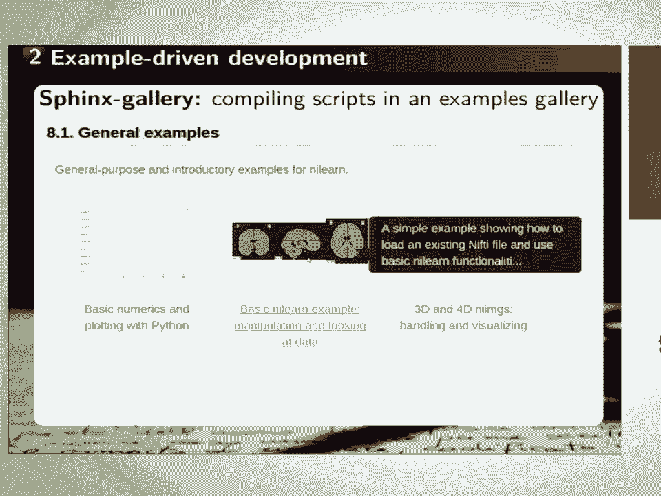

 One thing it does is the scripts are written as Python files， but they have embedded block。

 of restricted text。 So it formats these embedded blocks of restricted text。

 It captures the output of the computation。 It creates jubilant notebooks out of this。

 And the extra little thing it does is it will， in the code examples， it will link the functions。

 to their corresponding document page。 So basically you can hover on the code and click on the function and get its description。

 And the neat thing is you can， it also creates mini-gattories that can then be inserted in。

 the functions documentation to link back to the example。

 So if you land on the functions documentation， you can hop to the example and vice versa。

 So building great documentation is crucial。 It's hard。

 The first reason it's hard is that you need to focus on explaining the concepts and not， the code。

 And so that's a problem of writing plain English。 It's not a problem of writing code。

 The second reason it's hard is that in communication less is more。

 The more you say the more the information is diluted， the harder it is to find it。 Relatedly。

 all code examples need to be extremely， extremely short。

 You might have a longer tutorial that you link to。

 Users do not land where you would like them to land。 They Google， they land in the wrong place。

 So you need gazillion of links everywhere。 One way to improve documentations is to teach with them。

 I teach with my documentations which make me hate them。 So it's hard to maintain docs。

 but it's extremely useful。 We use continuous integrations on our doc。 We check all the links。

 We run the examples。 We run the doc tests。 Having done all this。

 I'd like to claim that scikit learn is the new machine learning， textbook。

 And I think we're seeing this。 People learn machine learning with scikit learn。

 And one day I'd like Nylar to be the new， new imaging review article。 Currently at each comet。

 the continuous integration runs our docs， runs our examples， and reproduces， historical examples。

 So you can run brain reading by following this link that you're not seeing， but the slides。

 will be online。 And just run brain reading at home。

 This is very intensive for the continuous integration。

 So I should thank CircleCI who has been hosting us and been giving us a lot of power。

 We've had to fight with data。 If you want to make good open science。

 the first thing you need to do is make it possible， for everybody to run that science。

 And we've had to fight so much to get good data available。 Getting data available is easy。

 But because you want to demo things that are cool scientific results， you need good data。

 The other thing that we have to fight for is compute time。 I'm a computer scientist。

 I design an algorithm， which means that I always design the fanciest algorithm that。

 always takes longer。 So I need to fight with myself to design better algorithms that are faster and quite often。

 simpler。 This is actually great because it has forced us to distill the literature whether it's。

 in terms of scientific results or in terms of algorithms， basically prioritize and focus。

 on the important things。 So this is just like writing a scientific review。 That's awesome。

 So I'd like to claim that package development consolidates science and maybe moves it outside。

 of the lab。

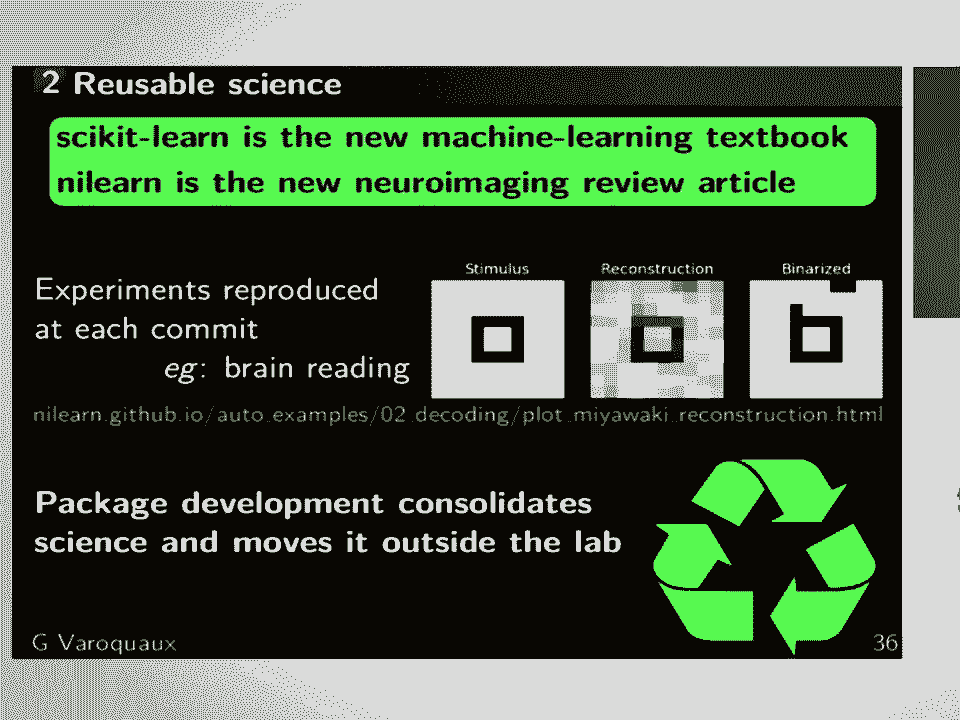

 And before I finish， I'd like to take a small look at our ecosystem at the side by ecosystem。

 The Python ecosystem， which I absolutely love。

 And I've run a little analysis。 Looking at the number of PyPy downloads， it's easy to grab them。

 You can grab them on Google BigQuery and looking at how it's distributed。

 So what I'm plotting here is a number of PyPy downloads sorted。 So that's why it's going down。

 And what you see-- and this is a log， log plot-- and what you see is a fairly common。

 pattern is that a small number of packages are used by many people and vice versa。

 So you have a 1/F distribution。 It's something very universal。

 It can be explained by things like preferential attachment。

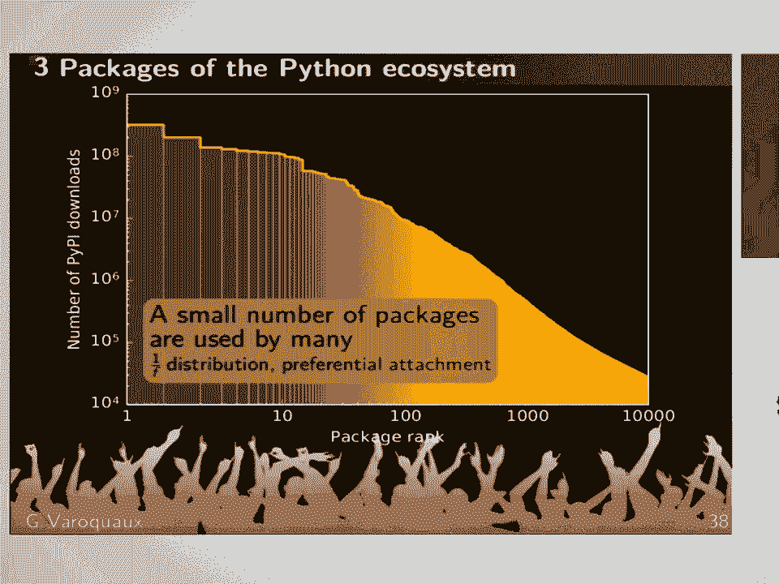

 And these are a few packages that we know。 So the most downloaded package is simple JSON。

 That's interesting。 And NumPy is doing extremely good， by the way。

 So if I'm interested in your imaging machine learning， so I'm interested in Nylurn， I'm。

 basically relying on a bunch of other packages like Joblips， like Hitler and NumPy。

 They're basically my foundation。 So that creates issue。 A few months ago。

 PIP was broken for six hours。 And some people went crazy because some people were using PIP to instantiate their production。

 service。 And so there was a crazy get-up thread where people were basically arguing not too bad。

 actually。 But it's interesting to look at it。 Another example is leftpad。

 So leftpad was a small library to pad strings left in JavaScript。

 One day the maintainer pulled it out of the node packaging manager and it basically broke。

 the internet。 So those core libraries are important if they break， everything breaks。

 And so David Cox is a really cool neuroscientist at Harvard。

 And he says that invention is 90% sorting out the dependencies。 So we as technologists think， yes。

 this is a technological problem。 I can solve it and I'll do a better package manager and all this。

 One of the big problems is that you have many packages that play together。

 How do you ensure that they're correct when they play together？ And it's a problem I have。

 There's a new NumPy update。 It's very hard for me to guarantee。

 even though we have 95% test coverage， it's still very。

 hard for us to guarantee that it's still correct。 So that's one reason why in the package that we maintain we worry hugely about backward。

 compatibility。 Because if you break backward compatibility。

 then you end up in this grid lock of dependencies， that are irreconcilable。

 Other fun consequences is that people do not want to upgrade。 So in response to WannaCry。

 WannaCry was this horrible virus that basically led to。

 a huge loss of money and data in many companies。 So in response to WannaCry。

 this company installed the second antivirus on all desktop， but didn't upgrade Windows。

 That's quite clearly wrong。 But we need to face it。 This is hate upgrading， it's a fact。

 And we need to do it， we need to solve this problem by basically making upgrading smoother。

 So one thing that we can do is we can forget about dependencies and say I'm going to build。

 a big monolithic package。 And that won't work。 Because scaling is extremely hard for two reasons。

 The first one is that complexity grows as the square of the code base。

 The second one is that user support also grows。 So all the major packages of the ecosystem are crumbling under user support。

 And it's much harder to develop in them。 So before I finish。

 I'd like to claim that core software is infrastructure。 Everybody uses it every day。

 so we tend to know it here in the industry and education， research。

 But I realize that people do not know it outside of technology。 Think about it。

 There's a high likelihood that ICBM's missiles run open source software。 I'm not kidding。

 I was sitting in the train with a guy working in missile technology in France。

 And at some point he revealed that they were using open CV。 So it needs maintenance。

 Just like roads need maintenance。 Because when they break everything breaks。

 And last year we had a breakage in open SSL which underlies basically security on internet。

 So security in banks。 That's very expensive。 The problem is that central packages are boring。

 hence they're understaffed and underfunded。 And I would push you to read this fantastic report by NEDAGBEL。

 which is called Road， and Bitches that makes the analogy between modes and software and that goes deeply into。

 sociology of open source software， how it's used， how it's maintained or the excellent。

 talk by Ether Miller。 With this I'll finish。 I'd like to say that to do new science I think there's huge value to bring new methods。

 to a field and that's strongly a social problem and to solve it you need to enable the domain。

 specialist。 In terms of software tools I think what value most of the software tool is can it enable。

 me to reduce my cognitive load？ Because I've got a huge cognitive load and I'm a bit dumb。

 And finally in terms of ecosystem I think that central packages really hold the ecosystem， together。

 It's a power but it's also a risk。 And with this I'd like to thank everybody in this community that's really an awesome。

 community。 Thank you。 [Applause]， [BLANK_AUDIO]。