# P3：Dash - A New Framework for Building User Interfaces for Technical Computing  Sci - 哒哒哒儿尔 - BV1Cs411A76Y

 I'm Chris Palmer。 I'm a co-founder of Plotly and， Today I'm going to present a project that I just released three weeks ago。

 That's called -。

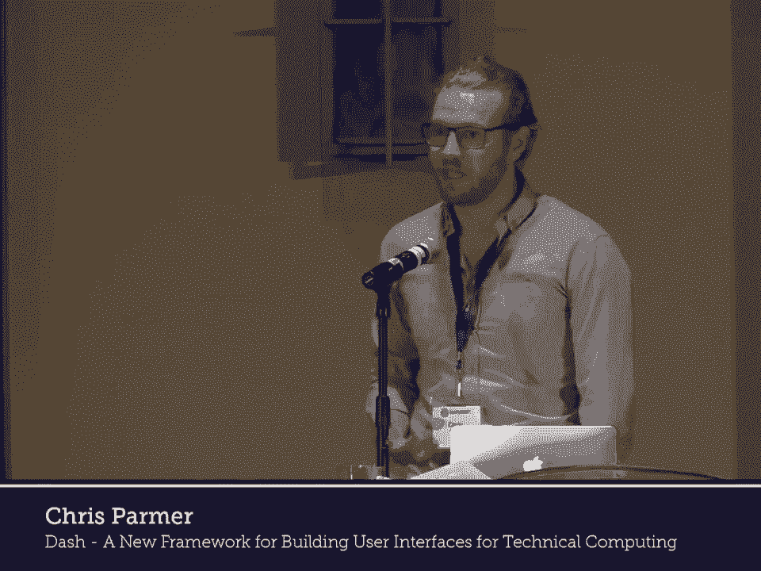

 And it's a framework for building web applications in pure Python。 So no JavaScript required。

 Thanks， So I'll start by just showing you know what - apps look like - apps are web applications。

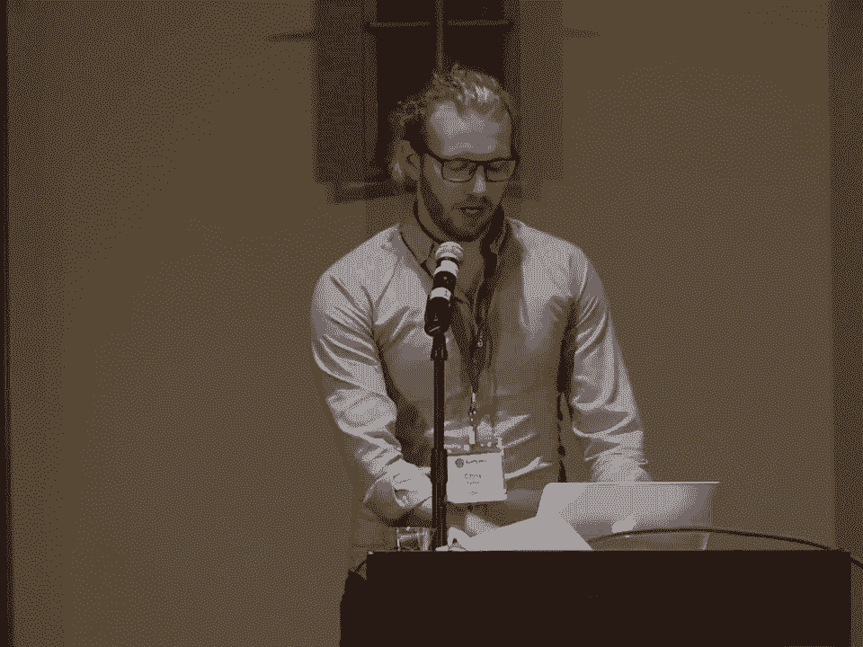

 So you view them entirely in your web browser， This is a really simple - application。

 It's written in maybe I think around a hundred lines of code and it shows in this drop-down all these different。

 Stock tickers and as you select a stock ticker， the application updates with a。

 graph of that stock over time and， As I select a value in this drop-down - is calling my own Python code。

 It's running this computation and then it's sending that graph back up to the web browser where it's viewed。

 by the user， This is another example of a - app， In this example as I hover over values in this scatter plot。

 Some meta information about the molecule that I'm hovering over gets updated in the left。

 I'm showing an image and a link to， More info about that molecule。

 There's this drop-down above the graph and as I select different values in here。

 My graph updates that highlights those points inside the scatter plot and， below all of the。

 Molecules that I've selected in the drop-down are displayed。

 There's these radio buttons above the graph that allow me to view this data in a couple different ways and as a 3d chart。

 can zoom in and pan around， Or as a 2d histogram， I， Wrote this entire application just in Python。

 I don't have to write any JavaScript or any HTML or any CSS to write this。

 and all of the interactivity of the application is totally customized as I'm hovering over values inside this application。

 The the currently selected point that I'm hovering over gets passed into the back end of my dash application。

 I'm looking up， That point inside a pandas data frame and finding some information about it and returning it back to the user interface where I'm updating either the chart or。

 This metadata on the left。 So - is really cool because you can build these really custom user interfaces in it - doesn't make any assumptions about。

 the format of your data or， What your application should look like this whole application was written in I think around 300 lines of code all Python just a single file。

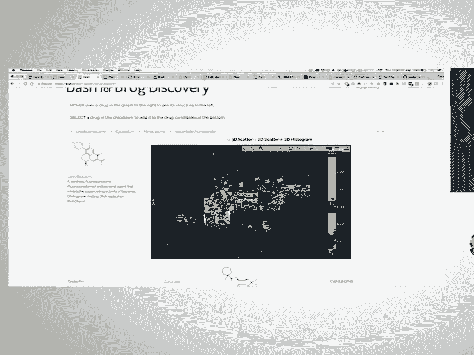

 This is another example of a dash app。 It's， It's formatted to look more like a dashboard。

 And so as I hover over points inside this map on the left。

 My application code is getting called with the currently selected value that I'm hovering over。

 It's looking up that data and a pandas data frame and pulling out a time series as I hover over points this time series on the right gets updated。

 All of these graphs are controlled by the set of， Inputs above there's a slider that controls the number of years that I'm looking at。

 There are these drop-downs that select different filters of my data and all of these filters and all these inputs。

 are composed together and they're used to， Update the underlying data analysis code that - is running inside this example。

 This example is written in around 400 lines of code all Python。

 You can build all types of applications and - - isn't just for building a traditional dashboard like we just saw。

 This is an example of a dash app。 That's formatted to look like a report。

 So I've got these nice full bleed charts that span the whole web page。

 There's markdown text that I'm writing in here， This is a reproduction of a New York Times original。

 And just recreating that New York Times article in pure Python seeing what it would take。

 And you know this application is maybe around 400 lines of code because there's a lot of copy in here。

 There's a lot of text， That's included in this application， You can with since - is。

 Dash apps are viewed in the web browser， You have the full power of CSS available to you to customize the look and feel of your applications。

 Every aesthetic element of a dash app is customizable the colors the positioning of elements。

 The fonts and so this is an example of a dash app that we made for one of our clients。

 that's that's formatted to look like a report and。

 You know it looks just like a PDF report that you might get except that you view it in the web browser。

 So these graphs are now interactive， and these tables that you're viewing， Were generated from data。

 They were generated from pandas data frames， So if the underlying data changes then these graphs would update and these tables would update as well。

 and then， There's this print PDF button that uses the power of of Chrome's incredible PDF generator to。

 To generate a really nice high quality PDF of this application， So this is a pretty technical crowd。

 So I thought I would just kind of do a little tutorial about how to build a dash app and so for the next about 10 15 minutes。

 We're going to create this dash application， It's about it's a few hundred lines of code。

 And there's a few different elements here。 There's this this graph on the left that's interactive as I hover over values in the graph on the left。

 The graphs on the right update with a time series of the point that I'm hovering over。

 There are these drop-downs that update， What data I'm plotting on the y-axis？

 In these radio buttons that update whether I'm looking at this data in linear log format。

 Can everyone read that text I make it a little bit bigger is that okay cool。

 so， So there's two parts of dash applications the the first part describes what the application looks like and that's called like the layout of the app。

 So this is a really simple app。 We've got these three components。

 There's this header element this h1， There's some mark down here。

 Inside this markdown component that updates this mark down here and then there's this graph component。

 Which is hard code some data and draws a bar chart？

 So dash comes with these two component libraries， The first component library is called dash HTML components and this provides a Python abstraction around all of the available。

 HTML elements and for each of the elements all of their available attributes so。

 A really common HTML elements are things like divs which are just kind of general containers。

 as well as headers h1 and h2 and， But you know also contains things like images。

 paragraph elements tables， and in the second， component library that dash comes with is called dash core components and these are set of what's called higher level components so they。

 They are a combination behind the scenes of JavaScript and CSS and HTML。

 And they're combined to make more interactive types of controls those include things like those drop downs that we were looking at or in this case。

 This graph so dcc。graph that's dash core components。graph， So we just hard-coded some data there。

 but you can kind of imagine how you might make your applications a little bit more data-driven。

 So I just changed a couple of lines there instead of hard-coding data。

 I'm importing data from a Panda's data frame and then instead of setting x and y to just a list。

 I'm pulling in a column from that data frame。 So I've got， x is equal to df。

life expectancy and y is equal to gdp per capita， There's text elements on each of these points。

 So as I hover over values， Of each of the points。 I'm displaying the country name at that point corresponds to and then I also added below a table element to display that。

 Panda's data frame as a table， In dash as I mentioned before every element of the application is customizable the colors the fonts。

 The full power of CSS is available to you， So in this case I just updated the style of the background to have that dark gray。

 I changed the color of the text to be white， in the end dash。

 renders this HTML div as an HTML element in the web browser。

 So all of the available HTML properties like style class ID are all available to you as Python attributes。

 In this case instead of style just being a string that you might see if you're writing raw HTML yourself。

 It's a dictionary with key value pairs so I can set color white background color。

 This background color and then I'm I'm centering the text here。

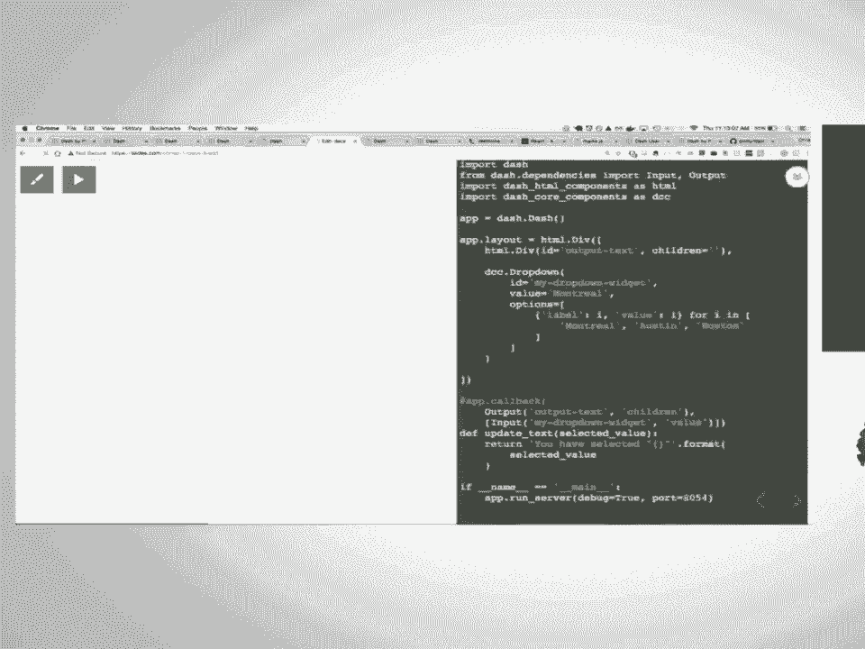

 So that's just the first part of applications。 It just describes what the application looks like。

 It's a combination of HTML and then these higher level components like graphs and drop downs。

 The second part of dash applications describes the interactivity of applications。

 So how do input components update output components in this case the input component is this drop down and I'm going to update。

 The text based off of this input， So in this example as I select different items from this drop down。

 I'm updating this text element above， so in dash you describe interactivity through these callbacks here and。

 These callbacks are these decorators that sort of declaratively tell - how an input element should update an output element。

 The first argument is the output element and you see here。

 There's this string that says output text that corresponds to an ID in the layout called output text。

 So this decorator here says whenever an input component with the ID my drop down widget。

 Which is described above my drop down widget？ Whenever its value property changes and value is the currently selected value of this drop down whenever that property changes。

 Call the function that this decorator is wrapping is decorating and call this function with the new currently selected value。

 So in this case if I change this to Austin my function that I write here is gonna get called automatically by dash with that new value。

 and then dash expects that the value that you're returning is in the right format and it's gonna take that value and it's gonna。

 Update another property of my dash application in this case。

 It's gonna update the children property of my div。

 So all I'm doing here is I'm getting the new value that's selected in this drop down。

 I'm formatting it in this string and then I'm updating that text element。

 So you can imagine how you might make these applications a little bit more data driven。

 in this case， I'm going to pull in that data set that we were looking at before into pandas and instead of。

 Just displaying a simple text of the currently selected value。

 I'm gonna run some computations based off of that value， so。

 This drop down is a list of all the countries that are available inside my data frame。

 I've dynamically updated， The options in my drop down based off of the unique values in my pandas data frame。

 So this is kind of the really cool thing about writing all of your mark up in Python is that you can dynamically update your mark up with。

 values in your Python context in this case， I've got this drop down。

 It's got hundreds of countries and we're just dynamically updating it if the underlying data changed and the underlying data。

 available options in this drop down would change as well and。

 then I changed the the function a little bit to， Run a computation。

 I'm taking the currently selected country and， here inside this。

 There's I'm filtering the the data frame to just return the number the rows that correspond to that country and then I'm computing the mean based off of。

 That's that subset of the data frame and I'm computing the mean of the GDP per capita。

 So as I change values inside this drop down my function is getting automatically called by dash。

 It's computing the statistic and it's returning that statistic to the web browser。

 This is a pretty simple example。 We're just updating a text element。

 but let's instead change that drop down to a slider and， Let's change that text element to a graph。

 So in this case， We have this dcc。slider which is the dash core component slider component and we've got this graph component above。

 And as I select different values inside the slider， My function is getting called automatically。

 I'm filtering the data of my data frame based off of that currently selected year。

 And then I'm drawing a scatter plot based off of that filter data。

 Setting the x data to GDP per capita and the y data to the filtered data frame of life expectancy。

 So this is just one input element updating one output element in many cases。

 We have many parameters， inside our data analytics code and。

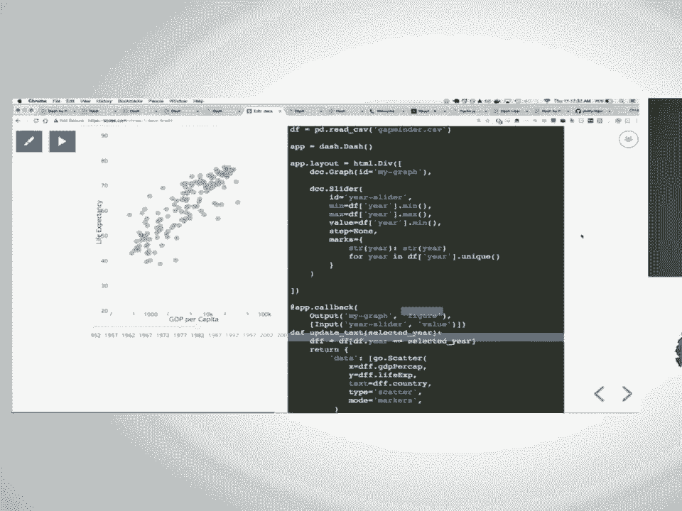

 We may want to set multiple inputs to update a single output， So in this case。

 I have two drop downs two radio items in a slider。 We've got five inputs and。

 I'm just expanding the my， callback， Decorator here to include all of these inputs that are displayed on the page。

 so whenever I change any of these， Elements whenever I select a new value， inside a drop-down。

 Dash is gonna， collect all the currently selected values of all the inputs that I've selected and it's gonna pass that in as。

 positional arguments to the function that I've decorated and then I'm free to do whatever I want with it in this case。

 I'm going to filter my data frame based off of those values and I'm gonna return a new figure property。

 based off of that filter data， If I select linear or log， I'm going to change the axis type。

 So this is kind of one of the cool things about - is that。

 Even though one input is changing at a time not all these inputs are changing at once only one input is changing at a time。

 But - does all of the work to collect all of the currently selected values of all of the inputs and make them available to you。

 so you can write these functions and， You know that the variables that you're getting inside your function represent the current state of the application。

 This is just one output element with five input elements， And if you wanted to have multiple。

 outputs you just write multiple， functions with different decorators and that。

 example can be pretty easily extended to this where we have same number of。

 Input elements two drop-downs two radio items and a slider。

 but we're updating three graphs based off of it， So we have three different。

 functions that we're decorating， The graph here is itself an input element as I hover over values inside this graph。

 It's calling the other decorators to update the time series on the right just doing some filtering of that data with pandas。

 So in a nut in that shell that's -。

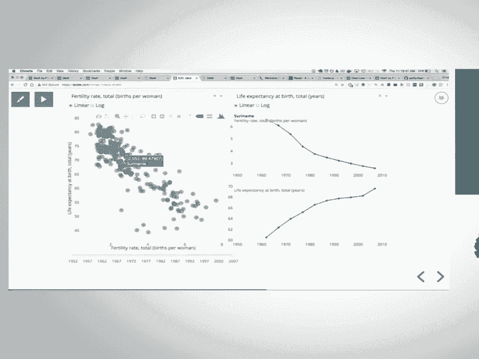

 you can expand these examples to， Create more sophisticated types of applications like we showed before with multiple inputs and multiple outputs you can style them to。

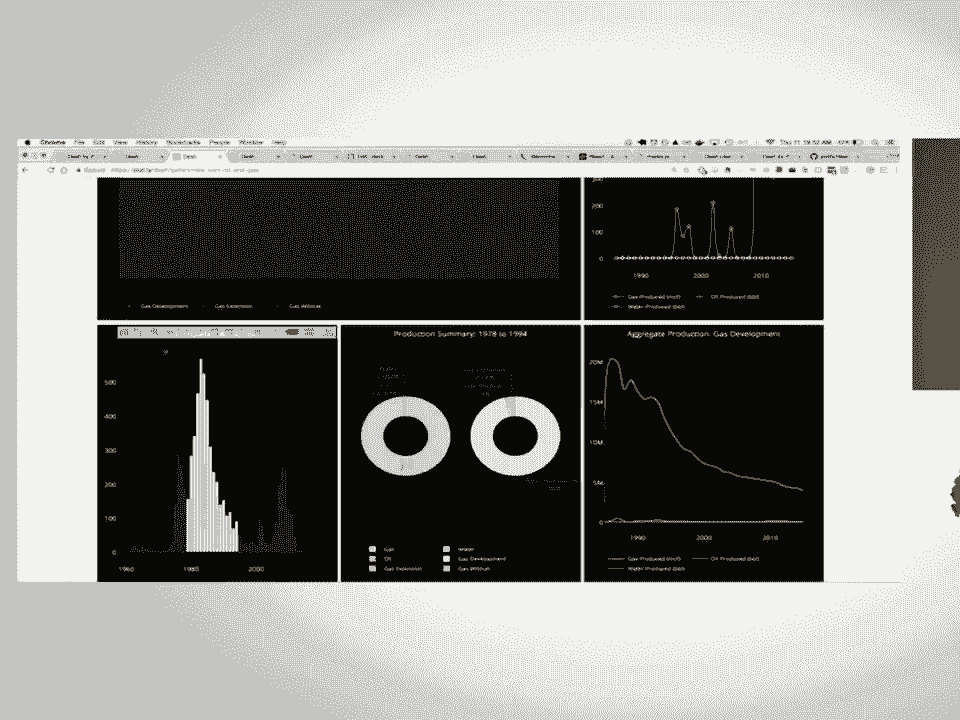

 to look really good， Dash is made possible through a few really core， crucial technologies。

 Dash itself is a web application framework and so the underlying server that we're using is flask and。

 That's available to you as a dash developer， So if you want to do things like add extra roots to your dash application。

 You can access that underlying server instance and add extra roots to it。

 Dash is actually mostly a front-end project。 It's mostly a JavaScript project behind the scenes and all of the。

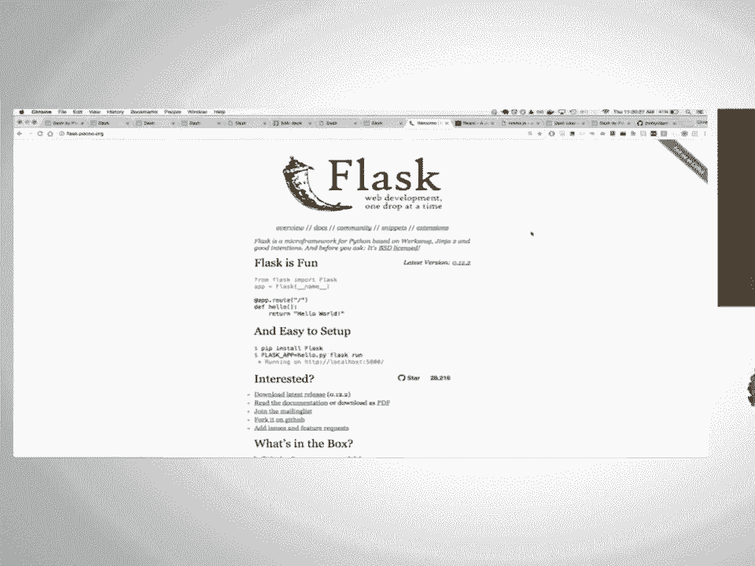

 Components that we're rendering is made possible through this front-end framework。

 That's called react and react is a front-end user interface framework。

 That's built and maintained by Facebook， We use it a lot internally at plotly to build web applications and it's incredible。

 one of the really great things about react is that there's this huge community of。

 Developers that are making these modular components in。

 JavaScript and open sourcing them under really liberal。

 licenses like the MIT license they're available for everyone to use。

 With - what we've done is we've created this tool chain that makes it really easy to convert an existing react。

js， component into a component that's compatible in the dash ecosystem in compatible inside the dash application。

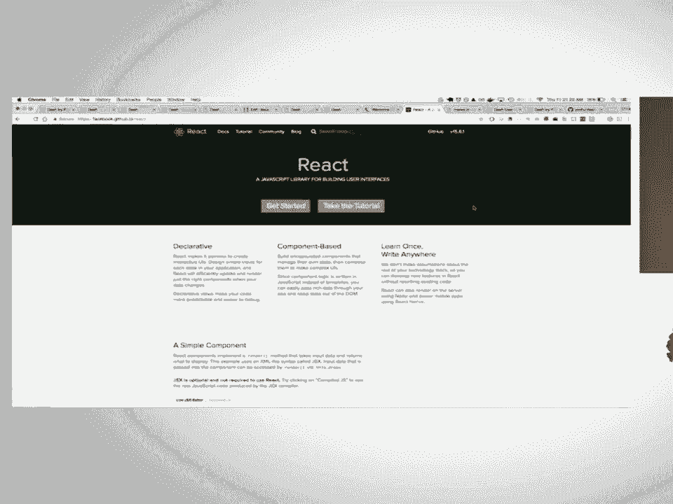

 So for example that slider component that we were looking at earlier。

 We didn't actually I didn't actually write that component somebody else in the open source community wrote that component and maintained it。

 I happened to just find it and it's it's really great， with the。

 Dash react to Python tool chain I was able to convert this component into a dash compatible component with just an extra like。

 10 to 15 lines of JavaScript， It was really easy to convert this component into a dash compatible component。

 So if you think about the future of - we already have available like thousands of really high quality front-end。

 components in the react ecosystem and through this tool chain of converting react components into dash compatible components I。

 Think we'll soon have a really rich set of， components that aren't just maintained by us or by a single person but maintained by the community。

 The tool chain that we use internally for converting these react components into Python dash components is also open source。

 And it's available for anyone else to use so if you want to write a component。

 And convert or existing react component to a dash compatible component。

 You're available to do so and you're using the same tool set that we're using internally。

 If react is new to you and JavaScript is new to you we've also written a really great introduction tutorial on。

 React that's at academy。plot。ly， It's the same tutorial that we use to train our own employees on react。

 And it takes you start and finish through creating a react component in a in a react application in JavaScript。

 This guide for creating from converting， components from react to Python is as part of a chapter in the user guide。

 And it walks you through it step-by-step， Dash itself is open source。 It's licensed under MIT。

 So you're free to use it on your own laptops， You're free to deploy dash apps on your own infrastructure or on somebody else's infrastructure and you deploy and manage dash apps。

 Just like you would a flask application， Plali itself is a private company。 We are venture backed。

 And we're able to fund all of the open source work that we do by licensing enterprise add-ons and enterprise platforms。

 That make it easier for companies to adopt open source software。

 In the case for dash we have developed a deployment server that users can install on their own infrastructure。

 That makes it really easy to upload dash code and spin up servers automatically for you。

 It also adds things like LDAP and Active Directory， Authentication you could of course。

 Do this yourself， We're not locking you into this at all。

 We are just creating some enterprise platforms and enterprise add-ons that make it a little bit easier to do this。

 At the end of the day with this business model of making these enterprise add-ons and these platforms that make it easier to use this software。

 We're able to fund a staff where more than half of our engineers are working directly on open source software that everybody can use。

 That includes dash itself it includes our JavaScript graphing library for those interactive graphics called potley。

js， It includes all of the libraries that use， Plotly JS like our our library and our Python library in Julia。

 So we think it's a really cool model and a way to build software that。

 Will be around for a long time and will be supported by a company for a long time。

 So dash is open source。 It's on。

 GitHub here， Please try it out you can get through the user guide in about half an hour。

 And and I'd love to see you on GitHub。 I'll be here all day and would love to talk to you。

 If you have any questions or are interested in the project， Thanks a lot。

 We have quite a bit of time for questions， Again， there's a microphone there and I'm right here。

 Hi great presentation。 I love this functionality。 It's great for this community， disclaimer。

 I'm a little bit biased I work for continuum， So I'll see the question of a lot of this also looks I think book a server also does all of these things。

 I didn't you'd mention your talk。 I'm curious if you can compare and contrast。

 Why you why use one or the other or the strengths of one over the other？ Yeah， sure， I think that。

 What makes dash unique， It's sort of this reactive framework， And so okay。

 maybe it's not unique maybe， Okay， it does that as well。 Okay， and I think the the react。js core so。

 allowing you to， Add plugins to dash applications from that community is kind of a unique part of -。

 Yeah， I think that's one of the key differentiators， Yeah， and of course with this plugin system。

 You're not limited to using plotly graphs itself like you could use bokeh charts or map plotlib graphs itself。

 Because you can easily plug in these components into -， Another question over there。 Yes。

 so do you does do you have a class that supports directed graphs as well？ We don't。

 Plotly JS itself doesn't natively support directed graphs or network graphs。 Do you mean sorry？

 Do you mean the visual graph or network graph？ Yeah。

 We don't have a native chart type for doing that， but there are many。

 Components in this ecosystem inside the JavaScript ecosystem for creating graphs like that and those could be easily integrated。

 Into - has its own plugin component。 Thank you， Hi， Thank you， that was a really interesting talk。

 You mentioned that you guys have developed sort of a tool chain for taking existing react components and making them - compatible and you said for example your slider。

 Took some existing component added like 10 to 12 lines of JavaScript。 Yeah。

 I'm curious what like what's the content of that JavaScript？

 What additional machinery needs to be added to make something - compatible？ Yeah sure， so。

 Let's just take a look at it， So this is that that slider component and we're importing that open source slider widget and。

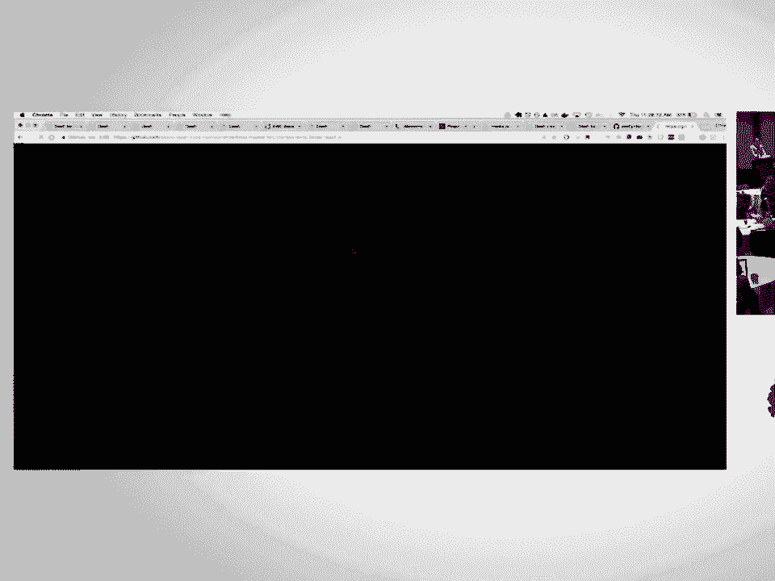

 Then we're just rendering it， And what - adds is there are these two functions that - requires your components to have there。

 this set properties component in this fire event property component and。

 Dash passes in these functions to your components。

 So that you as the component itself changes those changes can get propagated back to the application and then - sort of deals with。

 Sending those components back those new values back to your application code。

 The other part is just adding these， implementation these doc strings to it and this is kind of how - converts the react code to Python classes。

 It uses reacts metadata to scrape these comments and then it uses dynamic programming to。

 Generate Python classes based off of the names of these properties and then it passes in these comments into the doc strings of。

 Dash components themselves， So it's two things it's first adding some comments of course you could you could not add comments。

 But then you wouldn't have rich nice Python doc strings and then it's this second part where you're。

 Passing you're using these functions that propagate changes back to the dash application， Cool。

 thank you， One more question， Hello， this is really interesting thing。

 I was hoping that you could say a couple things about like。

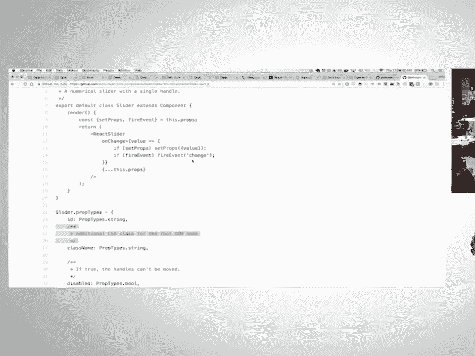

 Accessibility like if you've done anything to sort of make things more accessible or if that's sort of a future thing you're looking to make。

 yeah in terms of， Viewers being able， Accessibility features in the web applications themselves。

 Yeah， that's a good that's a good question。 There isn't anything that is。

 That is native inside the application that addresses that some of the components themselves are accessible and that they are keyboard friendly。

 So that's that's one part of it， And that and then I think the rest of it is sort of up to user land for making the applications accessible with。

 Adding adding text and making the user interfaces。

 In a way that is more intuitive and easier to use， Thank you， Let's thank the speaker again。

 Thank you， [APPLAUSE]， you。