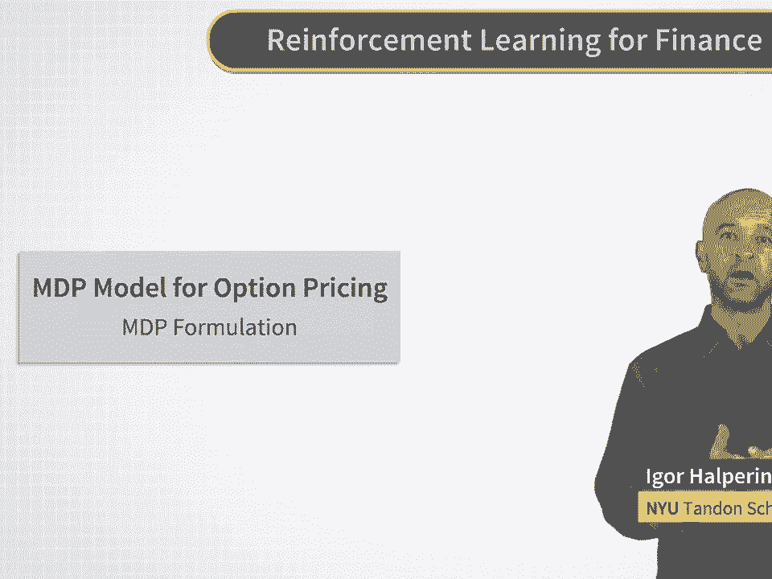
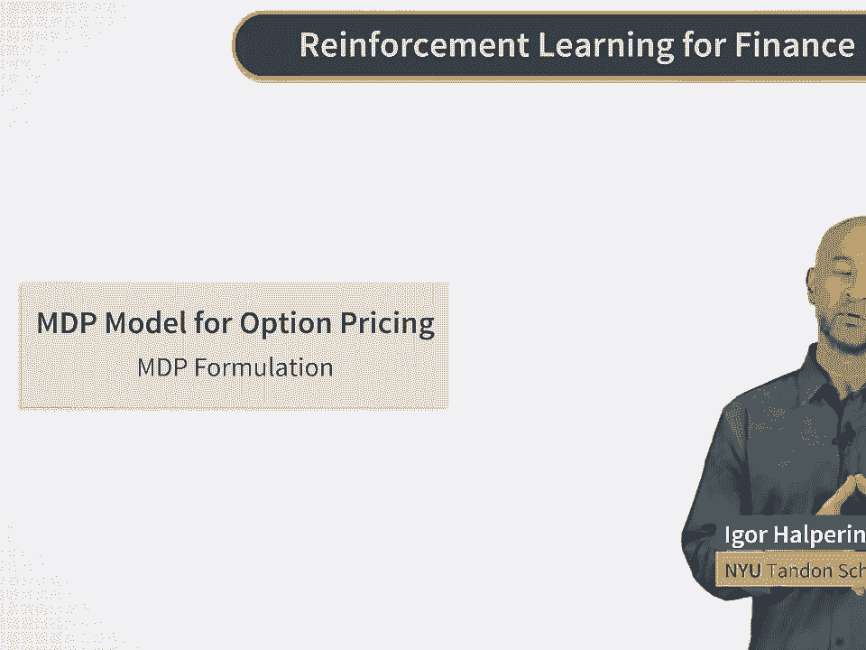
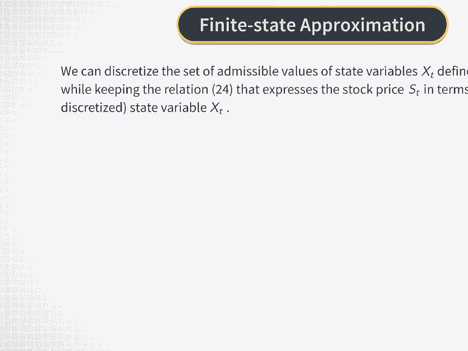
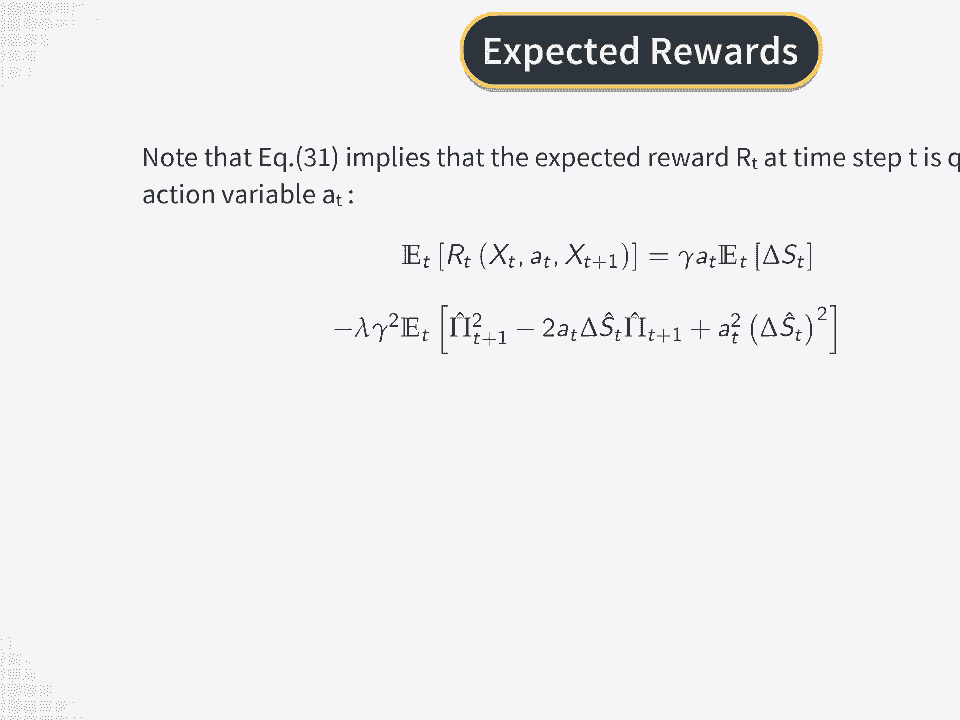

# Reinforcement Learning in Finance - New York University 金融强化学习 - 纽约大学 - P15：MDP for BSM - MDP Formulation - 兰心飞侠 - BV14P4y1u7TB

 Now， we will reformulate the discrete time BSL model as a market decision process or， MDP model。

 This means that now we will take a view of the problem of option pricing and hedging。

 as problem of stochastic optimal control in discrete time。

 The system being controlled in this case will be a hedge portfolio and the control will be。

 a stock position in this hedge portfolio。 This problem will then be solved by a sequential maximization of some rewards。

 As we will see shortly， these rewards are in fact the negatives of a hedge portfolio one。

 step variances times the risk aversion lambda plus a diff term。

 Now when addressing the problem this way we need to differentiate between two cases。

 The first case corresponds to this scenario when the model of the world is known。

 In this case we can use methods of dynamic programming or DP or model based reinforcement。

 learning to solve the problem。 In the second scenario the model of the world is unknown。

 In this case we can use model free reinforcement learning methods that rely on samples of data。

 rather than on the model of the world to solve the problem of optimal control。

 These two situations correspond to two different ways to solve the Bellman-Optimality equation。

 for this model。 So we will start with the formulation that is suited for a dynamic programming setting。

 and then later we will show how it can be adjusted for a setting of reinforcement learning。

 We first define state variables in our model。 It turns out that though we could use stock prices as state variables they are not very。

 convenient to work with because they drift upwards over time creating non-stationarity， of dynamics。

 But this is easy to fix。 To this end we introduce state variables Xt that are related to stock prices ST as shown。

 in the first equation here。 And as the second equation here shows Xt is just a rescaled standard Brownian Ocean。

 And the third equation shows how the stock price ST can be computed of Xt by adding a。

 deterministic drift and exponentiating。 Now I want to digress a bit with a general remark。

 In principle we can consider either discrete state or continuous state problems of optimal。

 control and finance。 While continuous state formulation is more practically relevant a discrete state formulation。

 is easier to understand。 So I would like to comment here how we can go back and forth in the model formulation。

 between the continuous state and discrete state MGP problem。

 In general we will assume that we deal with a continuous state space。

 But if we want to work with a discrete state space we can simply use a discretized version。

 of the black shows model and construct optimal hedges directly in this discrete model。

 This can be done in a number of ways and one of the easiest ones would be to use a Markov。

 chain approximation to the black shows model that was developed by Duann and Sonata in 2001。

 Even though we will not be working with such discretized dynamics in our course I thought。

 it would be a good idea to mention it at least given that discrete space MGP problems。

 simplify certain things。 For example we can use for such systems simple algorithms such as Q-learning which we will。

 be discussing in the next lesson。 So let's just remember that everything that we are discussing here can be formulated in。

 a discrete state space and we want to specify our MGP problem。

 First is our new state variables are Xt instead of St。 We will introduce a new action variable。

 A of Xt。 The original action variables U of St can be obtained from actions A of Xt if we just。

 re-express Xt in terms of St。 Next to describe actions A for different states of the world we introduced the notion of a。

 deterministic policy pi that maps states Xt and time t into action A of t that will be。

 given by the value pi of t and Xt of the policy function。

 Now we are ready to specify the Bellman equation for our model。

 We have already introduced the value function Vt as the negative of the option price and。

 it's given by the first equation here。 In the second line I split the term corresponding to t prime equal t in the sum so that now the。

 sum runs from sum over t prime runs from t plus 1 to capital C。

 But now we can replace the last term in this equation with the future value function V， of t plus 1。

 If we use the definition of V of t plus 1 and three range terms in this relation we can。

 obtain the second equation on this slide。 And in this equation we also introduced a discrete time discount gamma in terms of a。

 continuous time risk-free rate R and time step delta t。

 Now we can substitute the second relation into the first equation。

 This produces the Bellman equation for the value function Vt。

 This Bellman equation is the first equation here and it has the standard form as it should。

 What is specific to the model we have here is the form of the reward function R of X， T， A。

 T and X or T plus 1。 This function is shown in the second equation here。

 As this equation shows there are two contributions to the instantaneous reward Rt。

 The first contribution is proportional to the change of stock price multiplied by the。

 position in the stock。 The second term proportional to lambda is the negative risk at time step t as measured。

 by the variance of the H-profolar time t。 The second line in this equation shows its explicit functional dependence on action。

 at。 In this second equation I expressed variance of random quantity as an expectation of the。

 squared-demint value of this quantity。 So that values with heads here such as pi head or s head stand for demint quantities。

 If we now take the time t expectation of this instantaneous reward Rt， we will obtain。

 the expected reward shown in this equation。 Now there are two things that stand out in this relation。

 First， this relation is quadratic in the action variable AT。

 Therefore it's easier to optimize with respect to AT。

 Second， this formula shows that the quadratic risk reward given by the second term is incorporated。

 as one step expectation。 Therefore once we have this modification to the expected reward we can just use the standard。

 risk neutral MDP approach to solve the problem。 You might remember that in the previous course we talked about inadequacy of the standard。

 risk neutral MDP formulation for financial problems as the later care about risk。

 Now the formulation that we just give here provides a simple cure to this problem。

 We can just include the expected quadratic risk in the reward function and then use such。

 risk adjusted rewards within a risk neutral valuation。

 It's also interesting to know that if we take a lambda to zero in this expression then we。

 see that the expected reward becomes linear in AT in this limit。

 So it means that in this limit there is nothing to maximize anymore if we focus on the expected。

 reward。 There is no more an objective function in the sense of MDP problem but it doesn't mean。

 of course that there is no way to find any optimal H's。

 The optimal H can still be found by a quadratic risk minimization as we just did before but。

 the only thing is that in this limit there is no more link between such risk minimization。

 and any objective function that would be linked to the option price。

 In other words in the limit of lambda going to zero the hedging and pricing problems become。

 decoupled。 Thank you。 [ Silence ]。