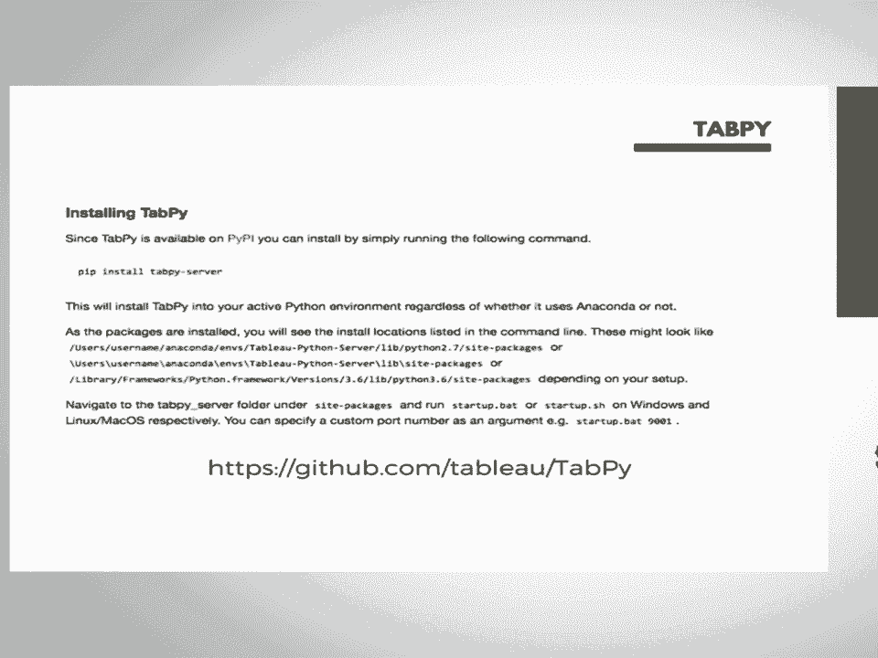
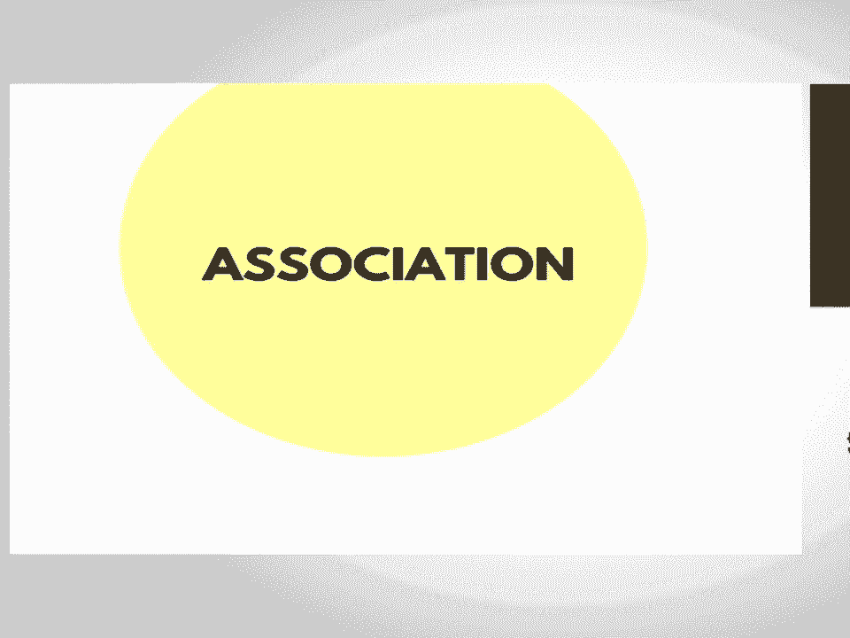
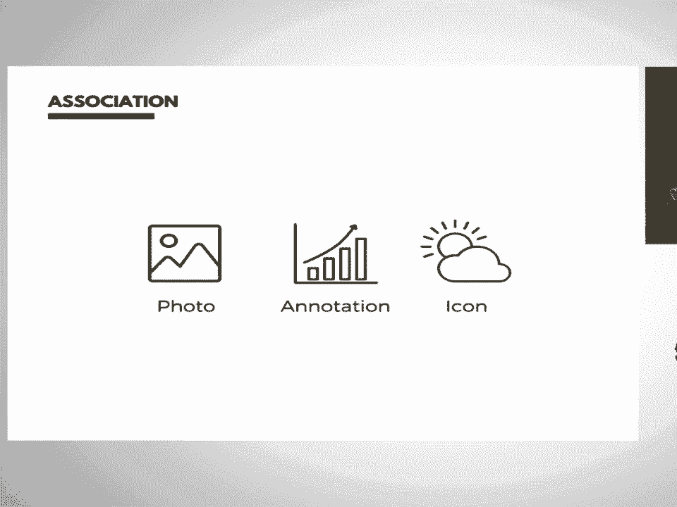
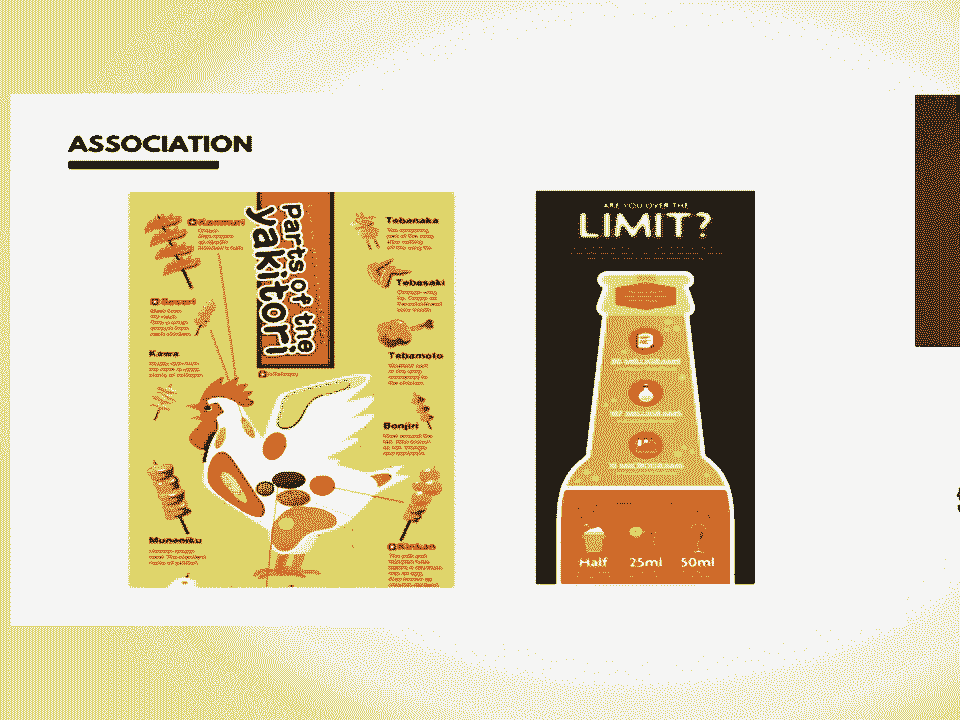
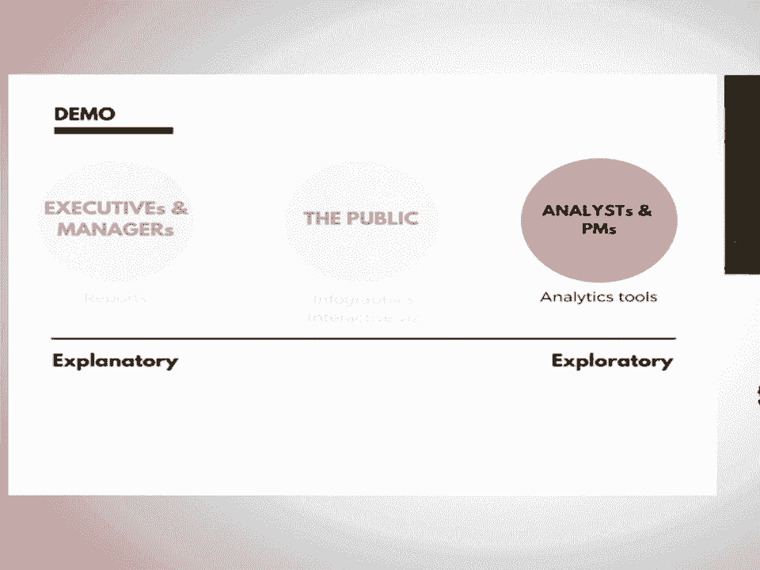
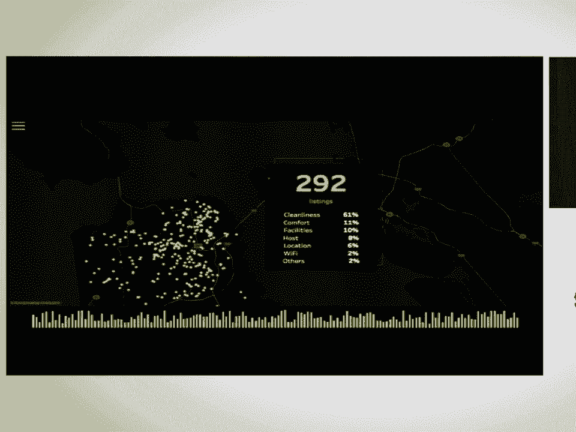
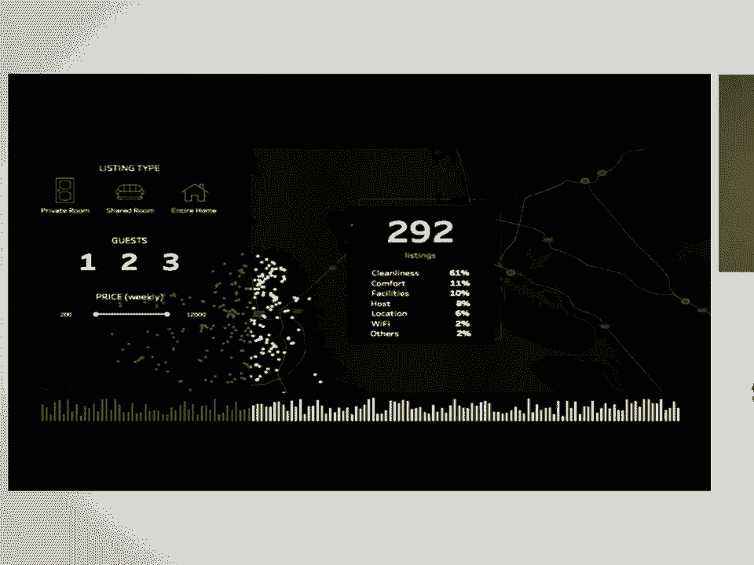
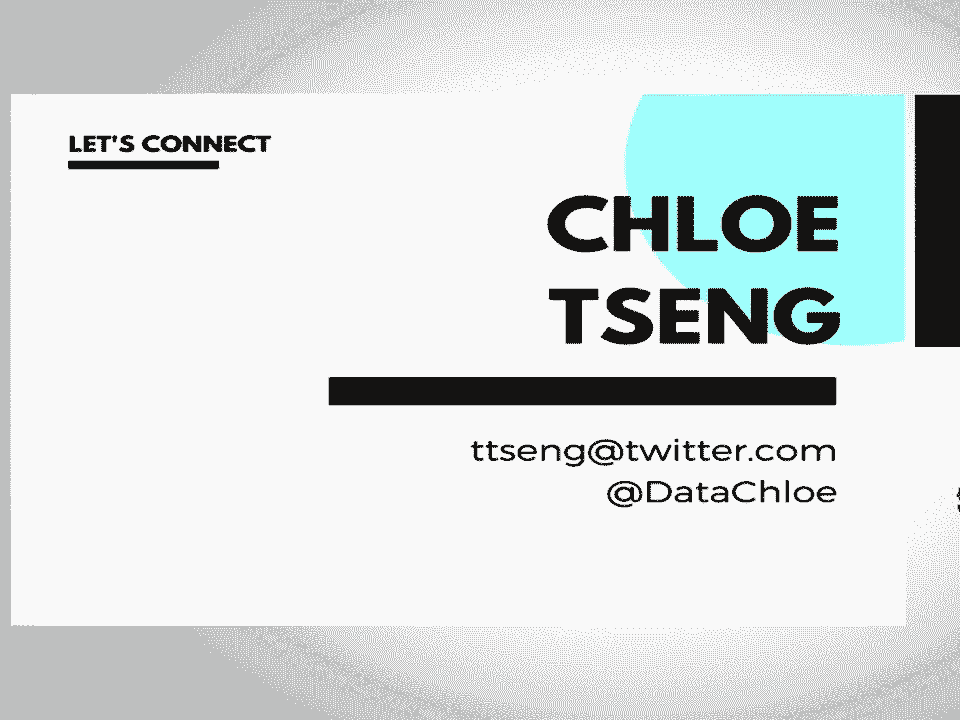

# SciPy 2017（合集） - P11：Python and Tableau   Building an Interactive and Beautiful Data Visualization wi - 哒哒哒儿尔 - BV1Cs411A76Y

 I know everybody here is really excited talking about all the exciting thing about Python。

 but before talking about all the exciting thing and positive thing， let's start with。

 something negative。 Let me complain about something。 So， as a data analyst。

 I love create data visualization。 I create all different types of visualization for my stakeholder for them to use the data。

 understand the data， or based on the data to make business decision。

 But there's one thing really bothers me and frustrate me all the time。

 Anyone want to make a guess what is the thing really frustrate me？

 And I know most of the audience don't like to answer questions， so today I prepared， Twitter share。

 Anyone want to answer this question？ You're going to get this Twitter share。 Hello world。 2016。

 Why 2016？ Because this one is on sale。 So that's why I bought it。 I want to answer my question。

 Twitter share。 Really cute Twitter share。 I'm going to walk around to find someone can answer this question。

 Hi， sir。 Morning。 Do you want to make a guess？ Get this sure。

 I don't think that's where I'm going to fit me。 Oh， doesn't fit you？ Let me find someone。

 What's the size？ Hi， Katherine。 Morning。 Do you want to make a guess？ Hi， Katherine。 Morning。

 Do you want to do the shirt？ I think it--， Thank you。 Yeah， you very well。 Okay。

 so my question is I create a lot of data visualization， but there's a one thing。

 really frustrate me all the time。 What is the thing？ For me。

 the visualizations take so long to load， and usually I can't click anywhere until。

 the visualizations have finished loading。 God， that's your answer。 It's not an answer。

 but congratulations。 Thank you， Katherine。 So I brought a lot of sweat today， so please。

 please answer my question。 So back to my question。

 What is the thing really frustrate me all the time？ As a data analyst。

 I love create data visualization。 I want my stakeholder to engage with my visualization and use it all the time。

 But as a data analyst， I'm also curious about how many times they actually use my visualization。

 Do they come back the report？ Do they use it again， again， again？

 So I'm really curious about the number， so I decided to go back to the server and check。

 the number to see how many times they actually use my dashboard。 And when I look at the server。

 I notice a lot of dashboards only have one view， one impression。

 Meaning that after I created a data visualization， share with my stakeholder。 And then they say。

 "Oh my God， Chloe， I love your data visualization。 I'm going to use it every day and never。

 ever use again。"， What a liar。 So， into this session。

 I'm going to share some of the really interesting data visualization。

 tips with you so that I can help you to create a really engaging data visualization。

 That's your stakeholder will use it again and again， at least more than one。

 So I'm going to talk about three things today。 First， I'm going to talk about Taipei。

 which is Python in Tableau。 This is a really powerful tool to help you to create a really powerful data visualization。

 And the second part， I'm going to talk on the design tips。

 I'm going to walk you through three really basic and important design tips to help you。

 to create really engaging data visualization。 And lastly。

 I'm going to demo you two examples based on those tips and use Taipei。

 So before I jump in and talk about the session， I know most of people have a really deep relationship。

 with your computer and phone and you want to engage with them all the time。 But in my session。

 I'm going to encourage you to do two things today。 First。

 either you're going to really engage with me， listen to me， engage with my content。

 or you're going to engage with your phone。 Take a lot of photo from me and tweet it by mentioning theta-cloy-theta-cloy-a。

 Why you should tweet it is because if you tweet it， I'm going to connect with you after。

 the session and we will be a friend。 So what a good way to start a friendship。

 So tweet as much possible。 Take a lot of picture of me today。 So now I'm going to talk about Taipei。

 What is Taipei？ Taipei is essentially to allows you to use Python very easily in the tableau。

 So you're able to create a really powerful visualization with a lot of other events on。

 the Linux library。 So if we're talking about Tor， there are a lot of different types of data visualization。

 Tor you can use to create data visualization。 So I'm going to walk you through what's the pros and cons。

 So for Python， as you can see in the slides， Python I would say is mostly for internal use。

 because it has a really strong analytics library allows you to do a lot of other events on。

 the Linux。 For example， like a sentimental analysis， clustering， machine learning and so on。

 So it's really good internally used for you to explore a lot of data。

 So Python also provides a lot of really great data visualization library like mipla-lib or。

 a seaboard or a bouquet or a data shader。 For example。

 if you want to create a really simple data visualization with a really field， line。

 you can use mipla-lib。 If you want to use create a much more interactive JavaScript based data visualization。

 you can， use bouquet。 However， there's a downside about using Python is that most of the data visualization setting。

 is not that visually compelling with other tools。 And also for the setting when you create a data visualization。

 you'll the Jupyter notebook， most of the non-technical user is a little bit hard for them to interact with them because。

 it's not that user friendly for those non-technical users。 So on the other side， which is a D3。

 most of people use D3 for public facing data visualization， because D3 is really interactive。

 It's user friendly and also D3 is much more visually compelling。 So you can see here。

 so it's a very， very like web experience。 It's really fun。

 It's a really interesting data visualization。 But the downside about D3 is that。

 as you can see here， if you want to create just a， bar chart。

 it requires a lot of line to create dots in D3。 So you probably never use D3 to explore data。

 You probably will have a really concrete idea of what you want to do and then use D3 to。

 create visualization instead of exploring data in D3。 So that's the downside about D3。

 And Tableau is kind of in between。 If you want to do the analysis。

 it's really easy to do it in Tableau because Tableau is， a drag-drop data visualization tool。

 Allows you to create data visualization very easily and very quickly。

 But the downside about Tableau is this is just an example。 Tableau。

 it creates really user-friendly data visualization interface for your business， stakeholders。

 So it's not like a Jupyter Notebook。 It's much more easy for them to interact with and understand the interface。

 But the downside about Tableau is that it's a data visualization tool。

 So it's not that great in terms of they don't have a really strong analytics tool for you。

 to do other best analytics。 And also it doesn't allow you to do a lot of data preparation。

 So we talk about Python Tableau D3 because Python has such a really powerful advance on。

 the latest tool and Tableau is such an easy way to do data visualization。

 So Tableau is essentially to combine the two really strong things together to allows you。

 to create data visualization using some of the Python library within Tableau。

 So this is what type I look like。 So essentially you can see here if you are familiar with a Tableau interface。

 you're， allowed to do some Python code within the Tableau calculation。

 You can just pass along the code and then it's going to turn that to the external type。

 type server and return the output directly to Tableau。

 So you don't have to do Python outside of Tableau anymore。

 Now I'm going to show you how it will look like in Tableau。

 So now I already connect with the server and this is what Tableau look like。

 As I mentioned it's a really drag and drop tool so it allows you to create visualization。

 very easily。 So I got the Airbnb data and this is the comments from Airbnb user about listing。

 And then now there's a pre-calculation that's like created which is the score for sentiment， score。

 You can see here it's a really simple Python code right here just throw it to the Tableau。

 calculation。 And now I just drag and drop to here and then let it run。

 Maybe for a second and then it will show you the calculated score right here。 So it's really easy。

 Drag and drop and you can create visualization which is something I'm going to show you very。

 soon later。 So this is Tapai if you feel it's interesting and you want to take a look and download it。

 You can go to here it's a github。com/tablo/tapai。 There's a really good documentation for you to install it。

 play it wrong with it and get。

 more information about it。 And one thing I want to mention is for Tapai you are also able to use deploy model just。

 within field code。 So this is an example you can just deploy your model and then call all that model within。

 Tableau。 So this is the Tapai part。 Now you learn how to create a powerful data visualization。

 I'm going to talk to you how to create an engaging data visualization so your audience。

 will use it again and again not just one time。

 So design tips。 I'm going to talk about three tips today。

 First I'm going to talk to you on the attribute what are the attributes you can use in the。

 data visualization so that it's much easier to navigate through the information。

 And second I'm going to talk about the audience how you can identify the right audience and。

 to use the right type of visualization to serve your audience。

 And lastly I'm going to talk about association。 What are the association。

 the visual cues you can use in your visualization so that it's。

 much easier for your audience to memorize it。 So for the attribute now we're going to do I know a lot of people already tired in the。

 morning so we're going to do a quick exercise and this is going to be a competition。

 I know Austin is really hot。 You probably need some water so I prepare water bottle for you。

 So this is a competition you have to pay really closely attention to the monitor to got the， answer。

 So here is the exercise。 Exercise， Chloe pray for pizza。

 So this is a bit more I'm going to show you in the last slide。

 So in the next slide you're going to see a lot of Chloe's bit more and you're going。

 to count how many this Chloe pray for pizza in the next slide and you only have two seconds。 Okay。

 Everybody know the rule？ Got it？ And also don't shout out the answer because this is a competition。

 When I did it there's a one say， "Aye， aye， no don't do that。

 Just keep it in your mind and I will ask。"， Okay， two seconds。 Are you guys ready？ Good？ Okay。 One。

 two。 Anyone have any idea how many Chloe pray for pizza in the last slide？

 Anyone want to make a guess？ Do you need water？ Okay。 There's a guy。 Four very close but not。 Okay。

 Probably this lady。 Five， you got it。 Congratulations。

 So there is a five Chloe pray for pizza in that visualization and as you can notice it's。

 a little bit hard for you to process so many information just in two seconds。 Why？

 Because there's so many information just in one view and for your brand you are not。

 able to process so many information instantly。 But now I'm going to show you a same picture but with a little bit quick now you're going。

 to count how many Chloe's been mochi in that slide one more time again。 Ready？ One， two。 How many？

 Thirty？ Who say thirty？ Bye？ Bye？ Okay。 Bye？ Okay。 Bye。 So this time it's much much easier。 Why？

 It's because this time I use pre-intuitive attribute in my visualization so that for your。

 brand it's much much easily to process everything in just one second。

 So in your visualization when you show a lot of information sometimes it's really hard。

 for your audience to process so many information in just one or two seconds。

 So you will have to leverage this kind of pre-intuitive attribute to navigate through。

 your audience attention to let them focus on the thing you think it's important so that。

 they won't overwhelm by the information。 So for example you can use different shape。

 different hue or different size and so on， so that they can easily to pay attention to the thing you think it's really important。

 And next I want to talk about audience。 Oftentimes I feel like creating data visualization it's just like a building relationship with。

 your friends。 You have to truly understand your friends in order to build out a really good relationship。

 and stand with a data visualization。 You have to truly understand your audience to find out the right type of data visualization。

 to create。 So for example if your friends is in halfway so you can pretty much predict her personality。

 is really mature， it's really stable， it's much easier to get along so you develop the。

 strategy to be friend with her。 But on the other side if your friend is in coloration then that's a totally different。

 story because she has more drama， it's more unpredictable， it's much more emotion so you。

 probably will have to get ready to prepare to handle those kind of emotions。

 So as a friend there's a different type of personality same with your data visualization。

 in your workplace there are different type of audience you have to create data visualization。

 for them。 So for example on the one side there's an executive and managers so there are the people。

 who are really busy they don't really have a lot of time to process their data or play。

 around with your data。 So it's really important just to create an explanatory visualization so that they can。

 get inside right away in the one second what type of insight action or story you want to， tell them。

 So it's really like more static reports and visualization。

 But on the other side you can see there there's an analyst and PM in this type of people they。

 usually want to see the raw data they want to play around with the data they want to。

 interact with the data。 So in this case you want to create more like an analytics tool for them to explore the。

 data。 And for the public it's kind of in between you create either create an infographic with。

 a storytelling visualization or you can create a really interactive visualization for them。

 to explore or get inspired。 So there are different type of audience you have to think about before you create data。

 visualization。 So lastly I want to talk about association。

 Association is a really important concept when it comes to visualization to help you。

 to memorize and recognize visualization。 And now we're going to do the last exercise thing。

 So the exercise now is really simple。 I'm going to show you a series of visualization and some of them are the same visualization。

 When you see the same visualization you just clap like this。 Is that clear to everybody？ Okay cool。

 So now I'm going to show the visualization。 When you see the same one you just clap。

 Okay now I'm going to start。

 Okay。 Okay。 It's like， "HM？"， Okay， so through the exercise。

 you notice some of the visualization is so easy to recognize。 You clap right away。

 but some of the visualization you look at like， "Maybe you clap at it， but， it's a false positive。

 Why？ Why there's a difference between some of the visualization is easier to recognize or some。

 of the not。 Anyone want to share your thoughts？ There's still a larger。

 I guess this is a larger Twitter show。 So for larger people， hopefully。 Anyone want to answer？ Oh。

 this is actually my size。 So any lady？ Any lady want to answer？

 Which one is much easier to memorize or recognize？ Which one？ Or want to share any thoughts， lady？

 Oh， okay。 I like you， lady。 Which one is much easier for you to recognize than why？

 I can recognize one that's very different from the others because it's more noticeable， that way。

 God， that's a which one do you specifically remember？ The beer one。 The beer one？ Okay。

 it's because it's much different than other。 Is there any elements in that visualization and you think it's helped you to memorize it？

 All the others were plots and that one， I just remember there was a beer and then a dark。

 color behind it。 God， I saw there's a visual cue。 Thank you so much。 Congrats。

 So that's the last exercise you guys， you missed the opportunity to get the swag。

 I'm so sorry for you。 So on this analysis really help you to understand the visual cue。

 How visual cue can help you to encode the visualization and memorize the visualization。

 And this is actually a research done by a researcher coming from Harvard， MIT and North。

 Eastern to think about what are the elements in visualization can help you to memorize the。

 visualization much easily and what are the differences。 So as you can see here。

 this is the encoding stage and this is the eye tracking hit map。

 As you can see here for the most memorable one and the least memorable one， it's pretty。

 much the same。 People look through the visualization， there's a center bias。

 start with center and look at， the title and look at the graph。

 So when you try to memorize everything， you look through the visualization， there's not， different。

 not too different。 But when you try to recognize the visualization。

 then it looks really different in this hit， map now。 So if you look at this hit map。

 this is a recognition phase。 So when you try to recognize the visualization， as you can see here。

 for the most memorable， one， people look at the center and right away， they know， hey。

 I seen this before。 But for the least memorable one， if you look at the eye tracking hit map。

 you'll realize， it's not too different from the encoding stage。 Why？

 It's because they can't recognize the visualization。

 They have to read through everything one more time again， try to find the clue。

 So for the most memorable one， as you can see there， they use a strong visual association。

 to help people to memorize the visualization much easily。 So when you create data visualization。

 you can pretty much use these three types of visual， cue。

 visual association in your visualization to help you to memorize the data。 For example。

 you can use photo， annotation， train line， or icon。 This kind of thing。

 it's really visually compelling。 It's really easy for your brand to associate it。

 to memorize it and recognize it afterward。 So for example， in the last exercise。

 we see two data visualization。

 It's much easier for a member because they use a really strong visual association。 For example。

 the chicken one is talking about chicken。 It's a yakitori， Japanese girl。

 It shows a chicken in the middle， which is a topic for you to remember， hey， this is about。

 chicken very easily。 And the other one is talking about alcohol。 So it uses alcohol。

 the beer bottle shape in the middle， so that you can memorize the， topic of visualization much。

 much easily。 So that's the association。

 So for the design tip， I'm talking about attribute， audience， and association。

 Now I'm going to show you two examples， I use these tips as well as top pie to create data。

 visualization。 So I have a two examples today。 One is a Python query in the top pie。

 And the other one is I use a deploy model in top pie。

 So I'm going to show you the differences when you call out those on Python query。

 So the audience here， I want to focus on PM in Airbnb because as a PM， you definitely。

 want to provide a better user experience。 So it's really important to identify what are the lists that keep getting lower sentiment。

 score and what are the reasons。 So based on that， I want to create a data visualization for them to explore data and。

 finding out the problem。

 So here is what the data visualization looks like in Tableau。 So as you can see here。

 I use the pre-intensive attribute。 So when you see the visualization immediately。

 you will be drawn to the yellow。 And which is the thing I want to highlight？ There are 292。

 By the way， do you see the map？ This is actually a map in San Francisco。 So there's a 292 listing。

 Keep getting lower sentiment score， meaning that they got the really negative comments。

 and there's something wrong with those lessons。 And next。

 I want you to see the location to see how they're located in the different。

 location in San Francisco。 And lastly， when you look at the bottom of the bar chart。

 I want you to see the seasonality。 This is the sentiment score over the time。 So that's you know。

 is there any seasonality within this listing。 And lastly， you will see the white part。

 which is the last focus part， which is more detailed， about it。

 So I break it down by different reasons。 What are the reasons why they keep getting lower sentiment score？

 For example， you can see because of Wi-Fi， because of hosts， because of cleanups and， so on。

 I think it's more detailed。 So I want them to focus on that letter。

 That's the reason why I make it smaller and just why。

 And then so I create a proper menu here in the data visualization because I want them。

 to interact with that more to explore the data。 And as you can see here at the top。

 I use some visual association， which is the icon， for them to really easily interact with and process with them。

 So that's the first example。

 And I'm going to show you what it looks like in visualization。 How many times do I still have？

 Fifteen seconds？ Fifteen seconds？ Oh， okay。 Okay。 That's。 I really enjoy like talking with you guys。

 That's so fast。 Okay， I'm going to finalize everything in 20 seconds。

 So this is Python code look like and it's a， it's a， a talk query。 And because of time。

 we didn't get a chance to see another really cool mobile app。 I created in Tableau。

 But if you're interested， you can come to me。 I can show you more。 What's the query look like？

 And today I'm talking about terpy， design concept and demo。

 And hopefully you can use those kind of concept in your data visualization。 Next slide。 And please。

 please connect with me afterward。 Thank you so much。 [ Applause ]。

 [ Silence ]， [ Silence ]， (applause)， [ Silence ]。

