# P13：Parallel Data Analysis in Python  SciPy 2017 Tutorial  Matthew Rocklin Ben Zaitl - 哒哒哒儿尔 - BV1Cs411A76Y

 Good morning， everyone。 We've got to see you here。 So this is the parallel data analysis tutorial。

 So I'm Matthew Rocklin。 This is Aaron Amadea。 This is Ben Zaitlin。 We'll be helping you guys today。

 Today's tutorial is not about any particular tool。

 It's about generally parallel programming and Python。

 I have a few different programming paradigms and try to help you。

 figure out what sort of paradigm tools to use it， which situations。

 So I was thinking of not talking about any particular framework， and any particular tool。

 sort of generally about parallel programming。 If you were in this session last year。

 it's going to be more or less exactly the same。 There is a parallel programming tutorial happening right now in room 105。

 about DASK if you want to go to that。 So here in that situation。 So， okay。 While I'm talking。

 a much better thing to do than listening to me speak， is to go to this page， github。

com/pydata/paraltutorials， and has instructions on how to start。 How we're going to break this up。

 So the first half of the class will be mostly on your laptops。

 And then for the second half of the class， we're going to run a cluster。

 So Google has been generous enough to donate some credits to us。

 So we'll be working on clusters on Google Cloud。 I'm going to talk for the first few sections。

 Then Aaron will take over， then Ben will take over。 You can ask for help。

 So we should all practice waving for help wildly if we have questions。 And someone will come by。

 Most of us are pretty friendly。 So please ask for help。 So， this is these。 So while I'm doing this。

 you guys should be up here downloading this repository。 This will generate。

 this will download a bunch of notebooks onto your machine。

 And we will use the jubyter notebook server to go through the two spectres sizes。

 Later on in the course， it has been mildly changed since like 7， 8 p。m。 or something。

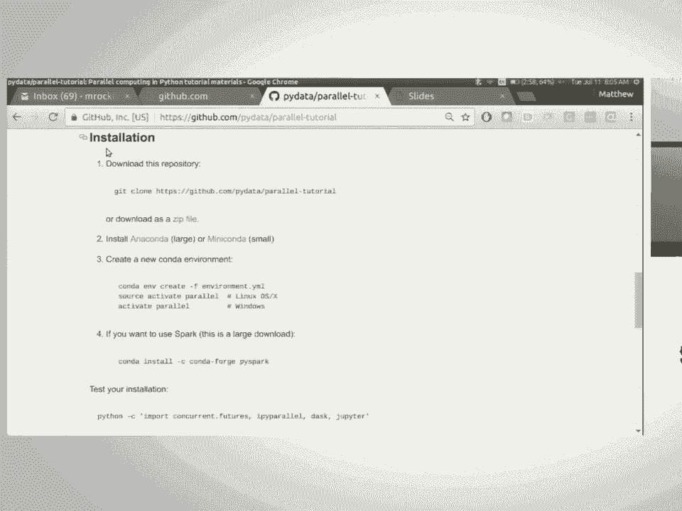

 So in the first part of the course， we're going to use your local machine。 If that doesn't work。

 you'll search the cluster immediately。 That's fine。 For the second part of the course。

 we're going to be using a cluster， which will be this link。 When you go to that link， eventually。

 it'll be a big blue button。 You should press hopefully just once。

 So we want to make people sort of aware this is a very satisfying button to push。

 But please everyone push it one time。 And maybe not yet。 Maybe later on today。 So resist the urge。

 All right。 We would all like you to push the button。 No， no， no， no。 No， no， no。

 I don't push the button。 Just me。 All right。 Don't push the button。 So due to the scheduling snap。

 we're using the same cluster for two tutorials at the same， time。 And so Ben。

 who's in charge of the tutorial， has been sort of sweating pretty constantly。

 for the last 24 hours or so。 So we're not going to press the button yet。 But when you press it。

 if it takes a while， don't press it again。

 Just wait。 But for now， single machine。 So， yeah， there's a lot coming to you。 We should talk about。

 We're using the Slack Room。 I'll try to keep an eye on it。

 So we're going to be using the Slack Room。 I'll keep an eye on it when Matt's talking。

 Matt's going to keep an eye on it when I'm talking。 And that's the only thing I wanted to say。 Okay。

 So， ideally， so again， if you're having trouble setting things up， you should not be at all。

 ashamed of that。 50% of the costs will have problems starting things up。

 You should now start waving your hands wildly at someone like Ben or Ann will swing by and。

 help you out。 You have one person who's having trouble swinging their hands wildly。

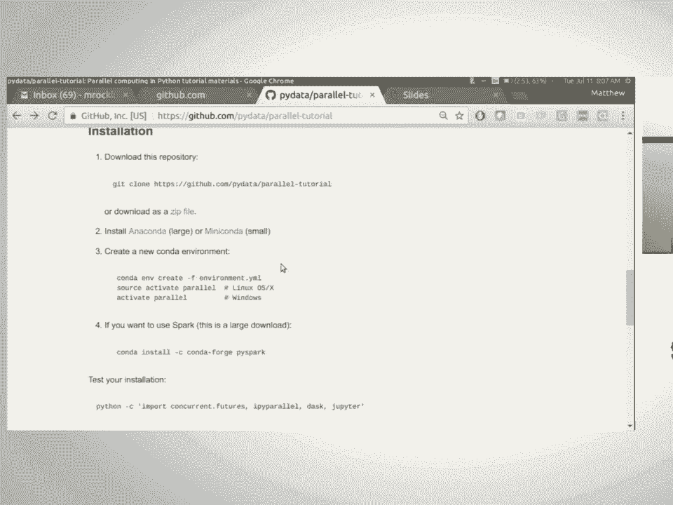

 This is going to be really awkward until someone does it。 Yeah。 Yes！ Great。 That's the second one。

 So， I've downloaded this repository。 And I'm going to follow these instructions to create my content environment。

 which I've。

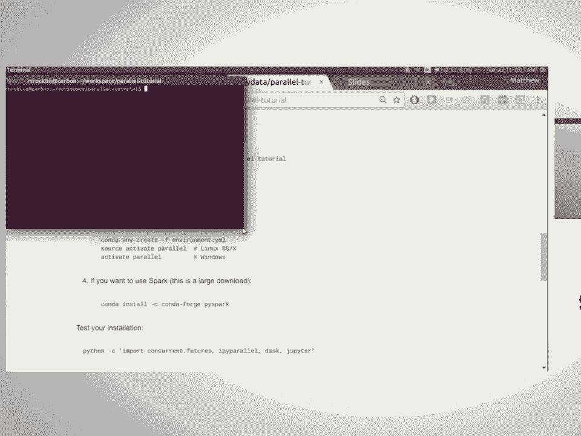

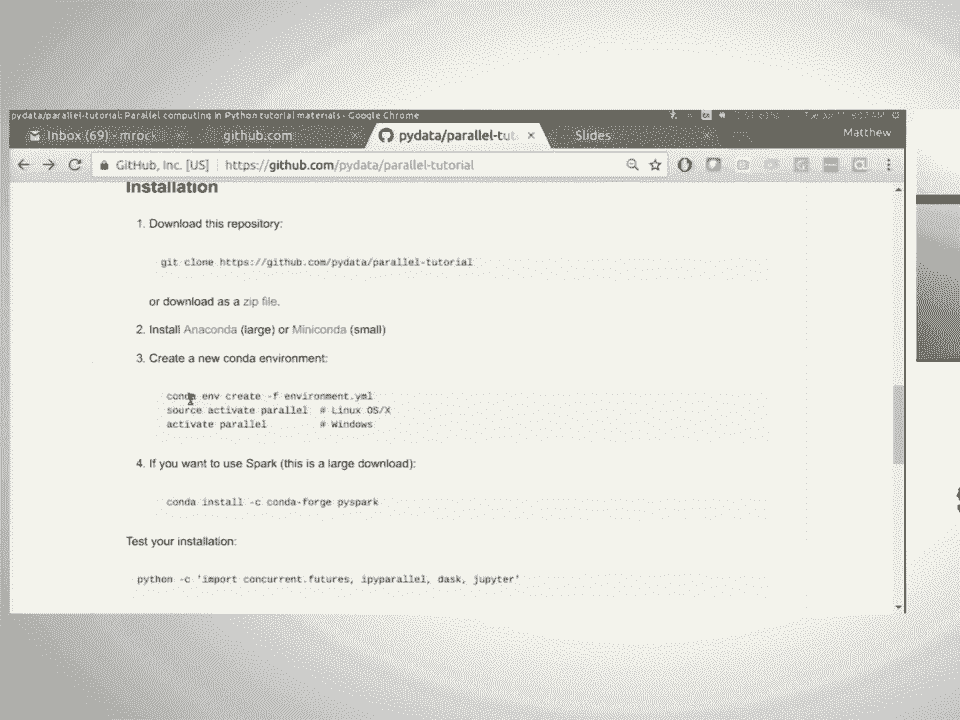

 already done。 I'm going to create -- I'm going to enter this content environment。

 And then from there， I'm going to start up a Jupyter notebook server。

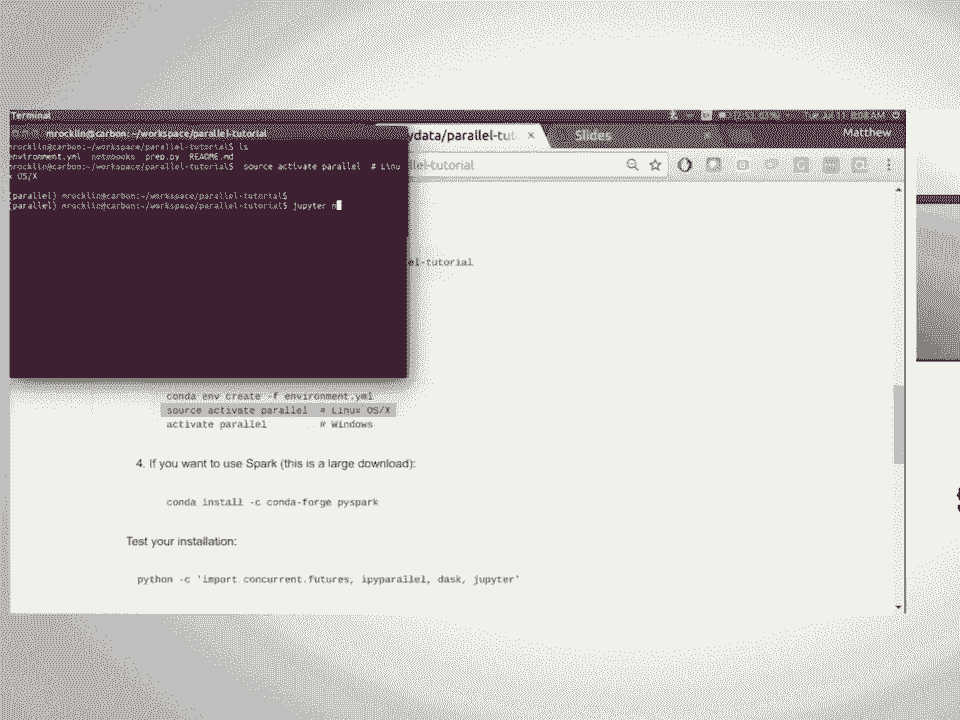

 And then in the notebook directory， there's a set of notebooks。

 We're running through these throughout the course。 We're going to start with this first one map。

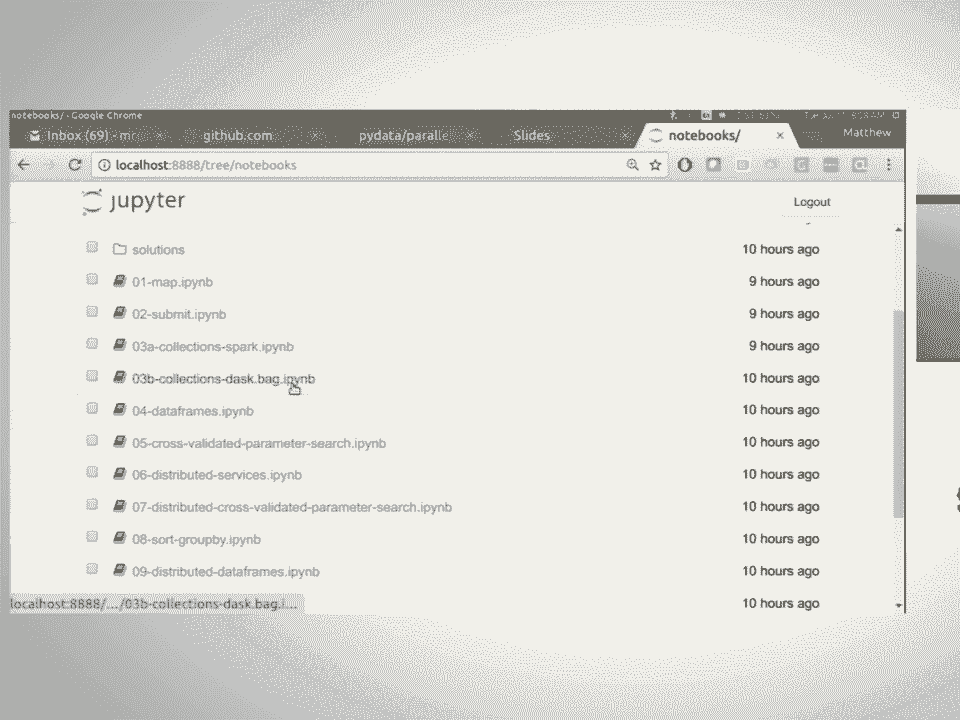

 So， before that happens， a little bit just fundamental material。 So。

 we also made these materials with men who can be here today， but he works on Jupyter。

 and that's similar。 So， okay。 So， the first part of the course。

 we're talking about three ways of programming， something， about embarrassing the parallel map。

 It's a very common case。 I'm going to more flexible task scheduling with submit。

 which is maybe a bit more flexible。 I'm going to be talking about collections。

 Big data collections like Spark or data frames， that sort of thing。 So， with the simplest case map。

 So， you have a function and you have a bunch of data。

 You want to call that function on many pieces of that data。

 It might be parsing many files or it might be running some computation across many inputs。

 coming at you。 Typically in Python， we might write this as a for loop or with list comprehension or with。

 this map function。 So， map， we give it a function and we give it a list of data and it produces for us the。

 listed outputs。 The nice thing about this last option is that we can rewrite map to run in parallel。

 And many programming frameworks have rewritten map to run in parallel。 So， for example。

 there is the concurrent futures thread pool executor or process pool executor。

 And here we make an executor， we give it our function and our list of inputs and it gives。

 us a list of outputs executed in parallel。 This is a very common theme。 So， many。

 many libraries follow this exact same system。 You import some object from some library。

 It could be Python parallel。 It could be job-led。 It could be Spark。 It could be Dask。

 It could be something else。 You call map and you get a list of outputs。 So。

 let's walk through this first notebook。 All right。 So。

 if you don't have the notebook open right now， raise your hand。 So， as part of setting up。

 you are asked to run a Python prep。py script which creates a。

 lot of fake data inside of your repository。 This is daily stock data that we've interpolated to be about a gigabyte in size。

 So， it's easy to download but it takes a little time。

 I forgot to run it so I'm going to sit here for a minute or so while it creates all this， data。

 it writes it down to CSV and it's JSON。 So， it may be less than a gig but somewhere around that size。

 If you run under problems， you should raise your hand wildly。

 This is actually somewhat awkward because I should have done this beforehand。 Any questions so far？

 So， let's take a look at the data that we are generating。 So。

 inside of this directory is generating data for us。

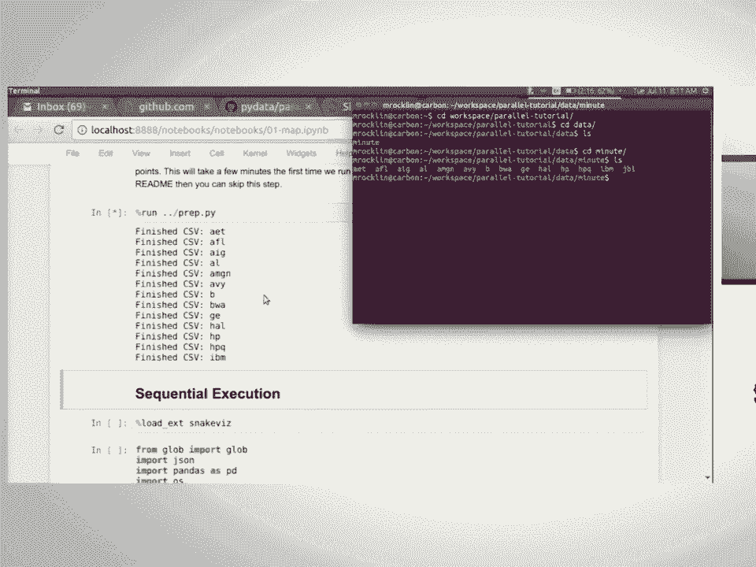

 If we go to say the IBM directory here， we will find many， many CSV files。

 Each of those CSV files is a time series of data with closing prices。

 These closing prices are representative of the kind of things you see in the stock but。

 they are not actual values。 You should not trade the stock market on this data。 But we have many。

 many， many of those files。 This is sort of a common case。

 Here we are looking at the initial time series but you can imagine these coming from a。

 simulation that is running， you have many files and you want to do similar operations on。

 all of those files。 So， what we are going to do with that data is we are going to also generate some JSON。

 data。 For each file name we are going to load in that data as JSON which can be somewhat expensive。

 and write it out as a better format。 If you read the tutorials yesterday you might have seen the HTML tutorial which is a much。

 more efficient format。 So， the sum you want to do。

 we just want to load in data which is expensive and write， it out as a more efficient format。

 This we can do on every file name independently。 So。

 we don't need to do any sort of coordination between these files。 So。

 it is a very good opportunity to use map which is going to exist in this case where。

 you want to do the same function many times in parallel without any coordination between， the two。

 Great。 So， I run my prep script。 I am just going to run through this code and this is sequential code。

 This is code that we have done on our own， our own time using Python。

 Now we are going to try to parallelize this code to make it run faster in the future。 So。

 a lot of these notebooks will have examples that are sequential code and it will be your。

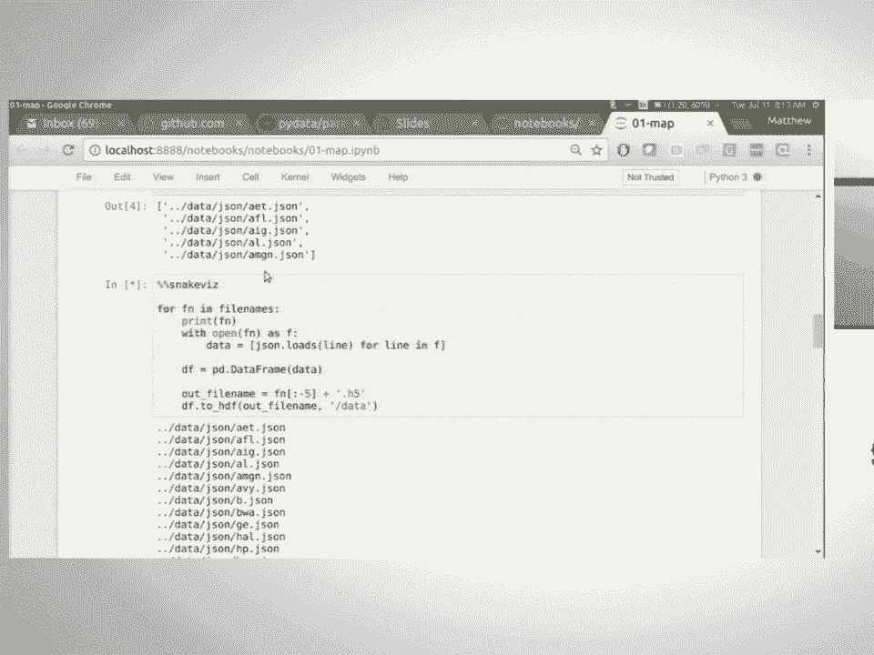

 job to parallelize that code with some of the techniques we are going to play with。

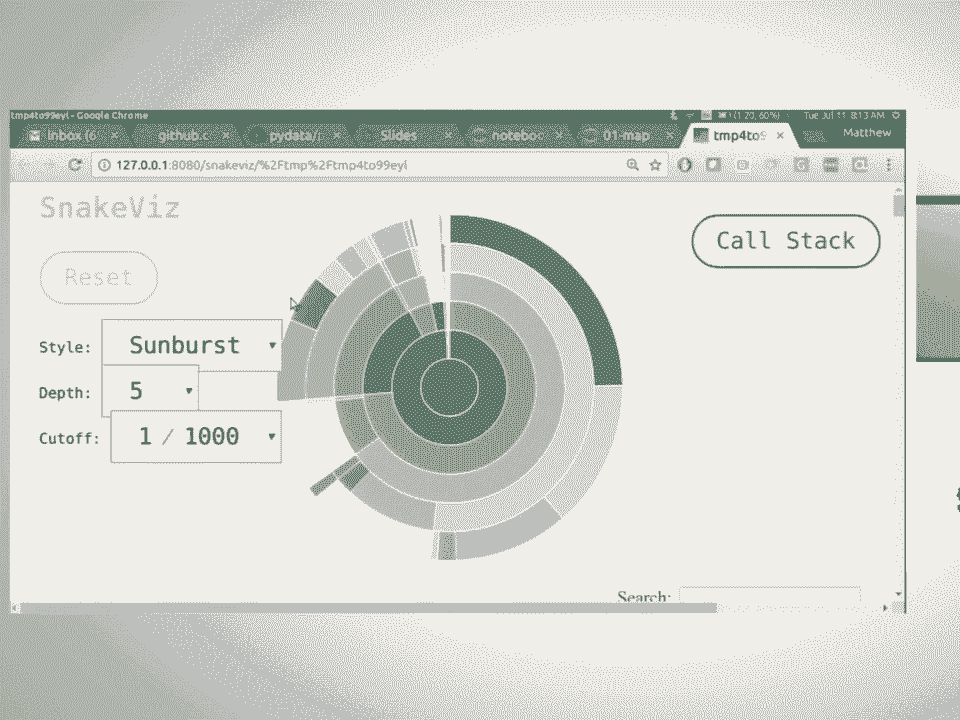

 Okay。 So， that used a library。 So， we ran this code and it ran and we can see it running through all of those JSON files。

 And we are using this snake-vis magic and snake-vis is a profiling tool。

 This helps us understand the kinds of costs that we experienced in running this code sequentially。

 So， before we parallelize anything， it is very， very nice to understand what is taking time。

 We will see more examples of why that is part of the future。 So。

 have people used snake-vis in the past？ Raise your hand if you have used snake-vis。

 It is in like three hands。 So， this is my computation。 This is a visualization of my computation。

 This is the more sort of standard output you would see from say the Python C profile module。

 We are going to visualize that here。 So， the inner circle is my entire computation。

 And that was a function here。 It is exec。 You can see in this area over here。

 That called the function in my module which then called the function， it was a list comprehension。

 which is then called JSON loads。 So， here we are seeing that JSON loads is around 60 to 70% of the total runtime of this computation。

 So， as we go out further and further in different circles， we are seeing the fraction of time。

 that our computation is spending in that circle。 JSON loads called some string decoding functions and some reg X functions。

 And you can see the breakdown of the costs here。 Understanding this breakdown will help you make a lot of decisions about how and which tools to use when parallelizing。

 The other section over here is doing a lot of pandas things。 So。

 this is constructed as converting all of our lists of Python objects into NumPy arrays。

 But the final number is that it took my computer about 13。6 seconds to run through this computation。

 serially。 And so， our objective for this notebook is run through this computation in parallel to accelerate。

 to reduce that total runtime。 From 13 seconds to something lower。 Yeah。

 so snake this should open up automatically for you。 If you have snake business solves。

 which you should， if you are running the client environment。

 And if you are using this percent percent snake business。

 are the people seeing this tab or not seeing this tab？ Who is seeing the tab？

 Who is not seeing the tab？ Okay。 It doesn't actually matter。 It will be totally fine。

 If you want to avoid snake this， you can use the time and magic and that will be less informative but still pretty useful。

 I am using Chrome but it shouldn't matter。 So， we ran that again and took around 10 seconds。 So。

 some variability there。 Okay。 So， we have a problem that we have been asked to parallelize。

 We have a problem that we have been asked to parallelize。

 It has built into the center library and has this map function。 But again。

 map is common in many systems。 So， if we have code that looks like a for loop。

 We can rewrite it as this comprehension or using map。 And if we have code that looks like map。

 it is very， very easy to replace map with executor。map。

 And this allows us to parallelize code in a simple way。 So， we have code that looks like a for loop。

 So， now our goal is to rewrite this code to use something like map and switch in executor。map。 So。

 as an example， here is a much simpler example。 Not our full computation。

 We are going to sleep for a second and then add 10 numbers。 Add one to 10 numbers。

 And this takes eight seconds。 So， to parallelize that， we can import process pool executor。

 We now need to break open all the things that we did in our for loop and make a small function out of them。

 So， here we are making a function slow increment which sleeps for a bit of time and again to simulate work and then returns x plus one。

 And then we use executor。map， calling that function on this list of data。

 And this now runs not at eight seconds but in four seconds。 So。

 it has moved our function to eight for different processes because my computer has four for fours。

 Call the function in each process and it has brought them back together again。 So。

 this sort of the simplest possible thing you can do with parallel programming。 Yeah。 So。

 you may notice that there is this recommendation that if you own windows or even sometimes on Linux and Mac。

 you may be for this other library Loki。 That's because sometimes with using processes。

 it's hard to work with functions that are made dynamically。

 Just based on how Python realizes functions。 Windows users。

 you don't have fork as an operating system level which makes it hard to send these things around。

 But Loki is a great library。 It's a drop in replacement for concurrent futures and it handles all these problems for it。

 So， you just use Loki all the time， you'll probably be pretty happy。 Yeah。 So， if you're on windows。

 you might want to pip install Loki or you have install。 And then you would。

 instead of importing this from concurrent futures， import it from Loki library。

 And that would do just the exact same thing。 Okay。 So， now here's an exercise。 So， again。

 this will be a combination of sort of me talking at you and then you guys doing exercises。 So。

 we have the sequential code from before。 Now， your objective is to rewrite the sequential code and paralyze it using this process pool executor map。

 So， it should be very like， very similar to the example above。

 But now with this more concrete example。 Okay。 Let's come back at 8。30， so 10 minutes from now。

 And in the meantime， we'll work on that exercise。 Any questions， please raise your hand。

 Please wave your hands wildly。 Exercise， and just ready to move on。 Who would like some more time？

 Okay。 It seems like most people are pretty much ready。 If you're not ready。

 so people have different skills， come here with different experiences。 They're different things。

 Solutions are here available for you in these cells that start with load。 So。

 this is how we solve the problem。 We took the -- yeah， so make a solution appear。

 You run the cell that starts with percent load。 And that will load up a file that's in your directory that has all the solutions for you。

 So， I'm going to press shift enter， or if I'm using the notebook buttons， I can press。

 the cell button that will replace that cell with the contents of that file which have a。

 solution for us。 So， we've taken the body of our for loop and converted it into a function which takes in。

 a file name。 So， this looks very much like what was here in this body， this for loop。

 We created a function。 We created a process pool executor。 And now we call it executor。map。

 giving it that function， and then the list of file names， to run that function on。

 And we can time this and we can see if we get any speed up。 And we do， we get about 4。7 seconds。

 about twice as fast as what we saw before。 So， we use four cores and got a 2x speed up。 So。

 it's not perfect parallelism， but we do get some benefit which is nice to see。 So， this is a very。

 very common situation。 A bunch of files， you want to parse them， want to do some arbitrary。

 small competition on， them， we just call executor。map。 I'll give them that function。

 The hard part here tends to be taking our for loop and the body of that for loop and constructing。

 that function out of that body。 However， as an example here。

 parallelism is often a way to accelerate things， but often， not the best。 So。

 we noticed when we were looking at our profile that about 70 to 80 percent of the time was。

 spent in this JSON。loads function。 Now， if we Google around for fast JSON and Python。

 we'll run into this library， you JSON， for ultra JSON。 And so。

 we can run the exact same competition sequentially， using this new JSON library instead， of JSON。

 and it runs again in around five seconds。 We still get about a 2x speed up。

 just as we're starting to a faster library。 So， while parallelism is often a good solution。

 it is sometimes not the best or sometimes even， simpler solutions that are out there。

 Or we can use both。 So， import ujson as JSON。 We can run our parallel programming solution again。

 And we'll run in two and a half seconds。 So， people often reach for a parallelism because it's sort of an attractive tool these days。

 but there are many other situations things you should also look at。 Okay， so we're going to move on。

 So， map is often very good when you have， again， one function applied to a list of inputs。

 Sometimes， you're based a situation that is more complex。 So。

 on sort of the other extreme side of that spectrum of ease， there's cases where you。

 have code that is obviously parallelizable。 So， here we're calling these functions F and G。

 And they can happen in parallel。 They don't depend on each other。

 But it's not clear how to turn this into a map situation。 So， I've got these two nested for loops。

 I'm iterating over two collections based on some predicate on those values。

 I've been calling it function F， function G on those inputs。 Again， this is parallelizable。

 but it's not map。 It's something else。 And so， the question arises。

 how do you handle these situations？ So， we're going to talk about submit。

 which is sort of a counterpart to map。 And if we， many frameworks implement both map and submit。

 here we're going to use concurrent， futures again。

 Although the API will be implemented in many places。 And here we're going to do is we're going to。

 instead of calling a function F on some inputs， we're going to submit that function and those arguments to our executor。

 So， previously， we called F by saying F parenthesis inputs。

 And now we are instead submitting F to run somewhere else。 In this case。

 it's going to run on a separate thread。 But also run a separate process or a separate machine with different executors。

 So， this allows us a lot more freedom when our situation is a bit more complex than just。

 a simple map situation。 After we've submitted all of those tasks to run。

 eventually we want to wait until they've， finished。 And so， for that， we use the result method。 So。

 submit gives us back a future object， sort of a pointer to work that will eventually， be finished。

 And if we want the result， we can call the result method on that future。 So。

 here's another situation。 So， you're going to call submit。

 That's going to immediately submit some tasks to run on some other parallel resource， like。

 a thread or a process。 It immediately gives us back a future。

 We can do other things while we let that thing run in the background。 And then later on。

 we call results to get the finished result。 Those other things we're doing could be submitting more futures。

 This allows us to be parallel。 So， we can， in fact， implement map by just calling submit many times。

 creating a list of， futures， and then waiting all those futures to return。

 The nice thing about this is that it allows us to mimic our sequential code relatively closely。

 even if that's when to some complex。 So， we're going to start with the HDF5 files that we created in the last section。

 So， you're going to run notebook 2。 If this list here is empty， then you need to go。

 This list here is empty。 You need to go back and run notebook 1。

 This is going to be empty by default unless you successfully completed the first notebook。 >> So。

 as part of the first notebook， we ran the sequential computation which created。

 all these HDF5 files。 You don't need to complete the first notebook。

 You just need to run the first few cells。 You then have a bunch of HDF5 files。

 If you don't have those files， you should wave your hands wildly。

 We're going to -- so in order to do our sequential computation， we're going to parallelize it in。

 a moment。 So， we're going to load a time series from each of those files and store it in this dictionary。

 series。 So， series has values that are keyed by a file name like data JSON， 80， HDF5。

 Those are Pandas series and we can plot those。 These are time series for one particular day of data。

 And there are a variety of series in here that all have different reactions to the market。

 over time。 And our scientific objective here is that we want to find a series that correlate well。

 with each other。 We want to find the two stocks that are trended together the best。 So。

 there's a method core for correlation。 Let's do this。 So。

 we're going to iterate over each of our file names， pull out our series， and call the。

 correlation method。 It will find us that there are two series -- there are two stocks。

 AET and LUV that correlate， well together。 The correlation of 95%。 So， let's look at those briefly。

 Indeed， those two stocks do seem to sort of trend similarly。 So。

 this is useful if you're playing the stock market you want to understand how different。

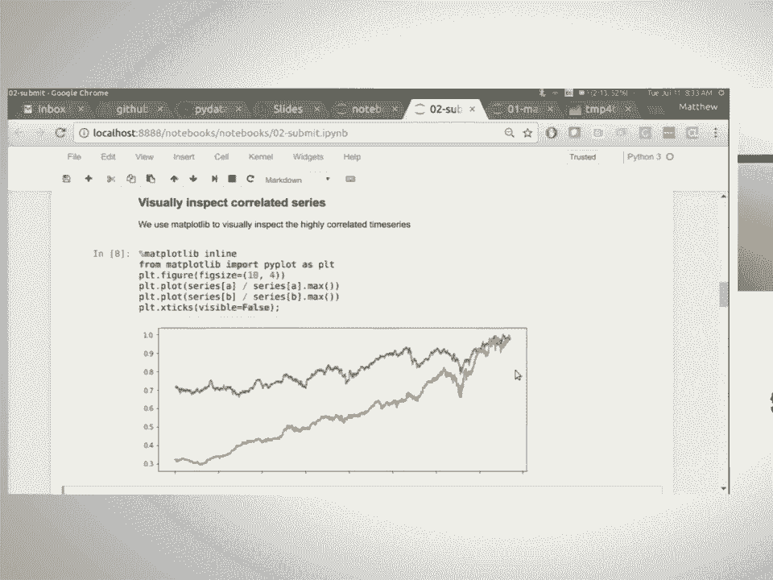

 sectors of the market move together。 So， let's look at that computation for a moment。

 We did an embarrassingly parallel thing。 We could solve this with map if we wanted to。

 We're actually not going to parallelize this， which will leave it as is。

 Then we followed with a doubly nested for loop with an if statement in the middle。 So。

 this is a little bit more complex than a map。 And then finally， we did a reduction。

 We took all of our results and found sort of the single best one。 That's sort of fast enough。

 We're not going to worry about parallelizing it。 We're just going to focus on this middle section here with these two for loops。

 That's what we're going to try to parallelize。 First， we'll look at an example。 So。

 just like our previous example with adding numbers slowly， we're going to look at the。

 adding two numbers in a future on some separate thread。 So。

 you're going to construct it a thread pool executor。

 I've constructed a function that adds two numbers but sleeps a little bit of time to。

 sort of simulate actual work。 And submit you may notice returned instantly。 So。

 if we run that in a separate cell， we did it ran in less than a millisecond。

 Even though the function is going to take a second or more。

 But that future in the meantime has finished。 So， we can now get the result。

 So concurrent futures allows us to submit tasks and then wait for them to finish when they're done。

 So， we have sort of sequential code here like this for loop。

 We're going to call this low-add function 10 times and it's going to take around 10 seconds。

 Or we can submit 10 times and it'll create 10 futures。

 And then we're going to wait for all those futures to finish in this following line。

 And because I have around four cores， I have four threads， I would have 10 elements。 So。

 we're running three seconds。 So， it's just four。 It's the next four that it does the following to at the end。

 [ Inaudible ]， Yeah， so the question is， "Hey， in our example， up here at the top。"， [ Inaudible ]。

 Yeah， in example， here at the top， we're computing the correlation of series A versus series B。

 And later on， we're computing the correlation of series B with series A。

 And that seems like redundancy because we know that correlation is symmetric in that way。 And so。

 we could be much smarter。 We could again， issue parallelism entirely and get a 2x speed up by doing that。

 So， it's a very good point。 We can often be smarter and reduce our compute time not by parallelism。

 but by choosing better algorithms， or being more intelligent about our situation。 So。

 that's an excellent point。 Thank you。 [ Inaudible ]， Yeah。 Hey， folks。

 Who is having an issue where they're getting the key error？ Okay， great。 I have a fix for you。 So。

 for some reason， this first file， A-E-T dot H5， for a bunch of you， is corrupted。 So。

 what we're going to do is all the way up here on the top where you say file names equal。

 sorted on this glob， we're going to try and do a live fix。

 And what I'm going to do is I'm just going to grab everything except that first one。 Okay。

 And then try and execute this next one。 And if you still get that error， raise your hand。

 If it's gone away， raise your hand and give me a look。 That was actually live coding。

 That's not as a fix it for you。 Okay。 Fix it for everybody else？ Perfect。 Okay。 So。

 just grab that first file and check it out。 I don't know what's going on there。 What was that？ Hey。

 Gary。 Okay。 So， here's a simple case in which we've sort of reimplemented map using Futur。com。

 Using Futur。com。 It's in our exercise。 Three， no， two exercises。 Yeah， question。 The question is。

 does the work happen when you call submit or when you result？ When you call submit。

 you're putting that work into a queue and there's a group of threads。

 that are all watching that queue and they're going to pick off work whenever they can。

 Result is going to block until that task has finished。 So， the work happens as soon as is possible。

 But not immediately because you might submit more work than you have threads。 That being said。

 there are many implementations of concurrent futures。 So， this is an API that's in Python。

 It's implemented in the same library。 It's implemented in IPython parallel。

 It's implemented in a project called Scoop。 It implements it。

 And they may all choose different policies depending on if they want to run something on a certain machine。

 Because that's a GPU。 They might make different decisions。 So。

 you're giving control up to some other system to make those decisions for you。 But generally。

 the one as soon as is possible。 That's a great question。 Thank you。 Okay。

 If you're going to do two exercises， one is going to be very abstract using just sort of these slow functions。

 And then one， after that we're going to run on our full computation。

 Let's do this simple one for the next three or four minutes。 I'll come back and give a solution。

 If you finish in time， move on to the next one。 You go to question over here。 [ Inaudible ]， Yes。

 question is can I pass any object into any object back？ In the case of the thread process。

 thread pull executor？ Yes。 You're just calling Python things。

 If you're using something like processes， that function or those objects would need to be serializable。

 Because you're moving them to a different Python process。 You've got to be turned into bytes。

 shipped over a wire， re-cost into an object。 This usually also works。

 but it's sometimes more complex。 But in our case， absolutely any Python thing。

 Make your own classes， you can make your own functions。 It's not going to matter。

 But it's also going to depend on the implementation of concurrent features that you're using。 So。

 it's a great question。 Thank you。 Okay。 So I'm going to briefly the solution to the first sort of abstract problem。

 If you've already moved past this， feel free to ignore me。 So again， here's a sequential version。

 has going to walk through this one to five， twice in a nested for loop。 And if i is less than j。

 they call one function。 If j is less than i， they call another function。

 I'll just take around 20 seconds because we're calling these things about five times four times。

 And so what I'm going to do is I'm going to take this code。

 And instead of calling the function immediately， I'm going to submit that function to run on the thread pool。

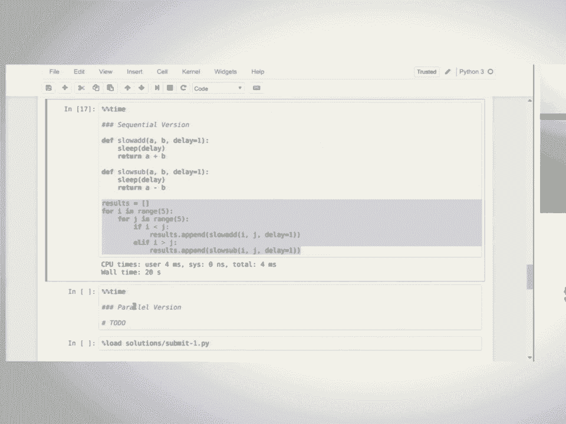

 So I can't use the parentheses anymore。 If I use the parentheses。

 I'm going to call that function right now in my Python process。 I don't want to do that。

 I want to delay that function to happen later。 So I'm going to give the function as an argument to the executor。

 I'm going to do it also down here。 I'm no longer getting results。 I'm not getting these futures。

 I'm going to change my variable to futures。 And that gives me now not my concrete answers with these sort of pointers to remote results that are going to be happening eventually。

 So when I'm going to now wait to all of those finish。

 I have again four threads or four cores running。 So this runs in around four X speed up。 Again。

 the advantage here is that we had code that was not entirely clear how to parallelize it with map。

 But we were still able to get a nice parallel solution just by mostly copying。

 pasting the code and making a few small adjustments。 So submit is very flexible in that way。

 which is pleasant。 And again， if you want to， you always have solutions and will always be there for you。

 How many will just show up hands？ How many of them are already done with the actual exercise for the notebook？

 Okay， great。 Let's take a few more minutes。 So this is an additional challenge for the 12 gazels that are ahead of the rest of the class。

 Try and batch this so that you only submit 10 jobs at a time。

 But then you take all of the results together at the end。 While people are finishing up。

 if you've already finished， something I'm going to try is swapping out your thread pool executor with a process pool executor。

 We'll talk about this a little bit more。 It's the same API。

 You have your choice between using many threads in your same process。

 using many different processes。 If you use a process pool executor in this problem。

 you'll find maybe your solution breaks， maybe it doesn't， and maybe get different performance。

 Maybe you won't。 So it's interesting to try those two。

 The last notebook we use a process pool executor is a thread pool executor。

 And there's anything about why we made those choices。 We'll get to that later on。

 But if you're done right now， something you might want to try out。

 Just sort of experiment a little bit。 Sure。 Yeah。 So the question is。

 what happens when an exception happens？ So let's just try that out。 So let's make a function div。

 which takes two elements， x and y， and returns x divided by y。 Like a future。

 we'll submit the div function on to be one and zero。 So this is like one divided by zero。

 So no things happen so far as far as I can tell。 Look at that future。

 So the future looks like it's finished。 It knows。 And it says， "Hey， I raised a zero division here。

"， So now when I try to get that result of that future， then I actually get my result raised locally。

 So the exception happened on the other thread。 And we didn't get that locally because like there's no way to sort of block your Python process and。

 "Hey， like， an exception happened a long time ago。"， When you try to do something with that future。

 it then alerts you， "Hey， you actually can't do this anymore。"， This future caused that result。

 So if you're in your sort of normal working of your program， you'll want the futures eventually。

 or the errors eventually， once you depend on the results of the future。

 What's nice actually in this case is that you can actually see the trace back。

 Everything sort of looks pleasant。 And actually I'm sort of curious to see if I Python。

 if you can notebook， let me go in and inspect。 Yeah。

 so you can even inspect the state of these things， which is nice。

 Debugging and parallel programming is often hard。 The nice thing about the thread pool executor is happening in the same process as your local system。

 And so you need to share all of the state。 You have to move data around to be very efficient。

 Does anyone try using the process pool executor on your problem？ So what happened？

 It's like five times slower。 Is it slower or faster than your sequential version？

 It's slower than its sequential version。 Yeah， so in that case we're actually moving data between different processes。

 and that can be really expensive。 I think you just handed half the students a sharp knife。 Oh。

 Once you start debug， how do you get out of it？ Yeah， so if you're in this state。

 if you try to do something else， it's just going to block because Jupyter is waiting for this debug thing to finish。

 So if you press Q and then press enter， you get out of that debug session。 Thank you。

 If that doesn't work， just restart your notebook and you'll be fine。 [LAUGHTER]， Okay。

 so let's look at solutions。 So we pulled out， so I saw many people doing， you know， series A。core。

 and that's where they find these methods。 I personally just created a separate function。

 I thought that was a little bit simpler。 And then instead of creating dictionary results。

 we create dictionary of futures。 And instead of submitting， instead of calling our function。

 we submit that function to happen remotely。 When we're done， we find all of our futures。

 which are now in a dictionary rather than a list， and we call results on them。

 Returning back a dictionary that looks exactly the same， here with the dictionary comprehension。

 Let's time this。 So how long did our sequential version take？ Switch over to took 500。

 600 milliseconds， parallel version took around 400 milliseconds。 Not a huge speed up in this case。

 And you can ask questions about why that might be。 In this case。

 we actually weren't very computationally bound。 We're sort of maybe relying a more memory bandwidth rather than CPU bandwidth。

 So we're not getting a whole lot of speed up。 So again， in the last exercise。

 we used processable executor。 This is as we use thread pool executor。

 From our programming experience， they're the same。 They look the same。 They have the same API。

 We operate on them the same way。 They're very different performance characteristics。 With threads。

 they're happening in your local process。 So your IPython program that's running has all of the competitions happening in the same program。

 So they can share data very easily between each other。 They can access the same arrays。

 the same series。 It's all very convenient， the same methods。

 Process pool executor using many different processes。 And there， you have to move the data between。

 from your process over to another process， run the function and then move the data back。

 That can be slow。 But it also would be very good if you need to run it in processes， for example。

 if you want to avoid running into the gill， which is a problem that sometimes plays pure Python code。

 A general word of， and if that doesn't make sense， that's fine。 Generally。

 when you're using NumPy or Pandas or scikit-learn， you should use threads。

 If you're using pure Python things， dictionaries and lists and JSON parsing and text。

 you probably want to use processes。 That's sort of a general rule of thumb。

 and it's more complex than that。 Those are some thoughts。 One also asked， if I'm using threads。

 can I append to a list in my function？ And the concern there is that that list。

 if many threads operating something， you might be unsafe。 So sometimes there are some concerns。

 For example， we call the readHDF function from Pandas。 That function is actually not thread safe。

 The HDF5 library is not thread safe。 So if we use many threads here， we actually。

 it was going to work。 In most versions of HDF5， that would fail。 But I guess HDF5 maybe。

 maybe more and more fixed now。 Okay， so what was the version number？ Okay。

 so a recent version of HDF5 or HDF5 or HDF5 or HDF5 or HDF5 or HDF5。 So HDF5 is now thread safe。

 So last time we gave this tutorial， this exercise broke。

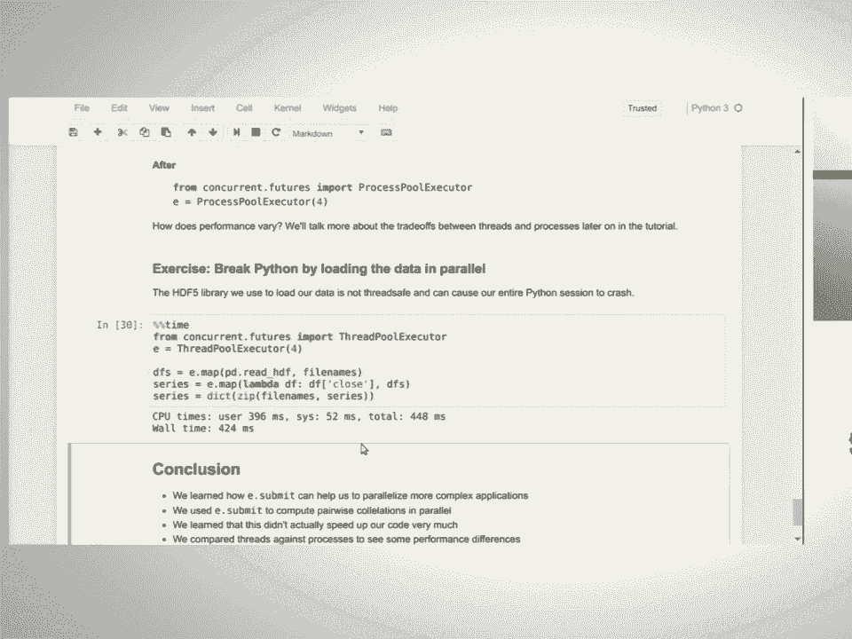

 And it broke in a terrible way that caused the entire Python session to tear itself down。

 There was not an exception or just a side fault。 It's okay。 If we were to down a good HDF5。

 but apparently HDF5 is now been fixed and is now thread safe。 Oh， which is great to hear。

 So I need to make a better example。 But threads are sometimes dangerous。 Okay。

 so we're going to move on。 So we've seen map and we've seen submit。 Map is a very common case。

 but very simple。 Submit is sort of a very flexible tool in any situation。

 A nice middle ground is these big data collections。 So sometimes you're given a restricted API。

 So this might be like with Spark， you get map and filter and group by and join。

 Or it might be an array programming system that's parallelized。

 You have matrix operations like matrix multiply and LU solve and Schlesky factorization。

 Or you might have something like data frames or something like the SQL language。

 And so in these situations， as long as you're able to constrain your programming to these， APIs。

 you are now able to handle all the parallelism for you。 So this is very。

 very good if your problem fits one of these cases。 Because it'll be more automatic。

 Sort of map is sort of one extreme。 They're very simple case。

 There's collections where your computation is more complex than map， but still fits into。

 a regular structure。 And it's like submit for various arbitrary computations。

 So we're going to look at sort of the classic sort of Spark RDD kind of API， which has functions。

 like map and filter and group by and join。 And these operations can be parallelized。

 something like Spark or Dask where it will handle them。 And you can chain them together。

 You can use many of them together to create more complex operations。 So in this notebook。

 there are two versions of this。 You can use this with Spark or with Dask Bag。

 which is sort of a project that looks like， Spark， Dask is many things， but it also does this thing。

 I work on Dask， it's a little bit bad representing it， so I'm going to use Spark here。

 But you can use either one， the notebooks will be more or less identical。

 So you need to install PySpark separately in order to use this。 If you didn't， that's fine。

 use a Dask Bag thing。 The lessons is exactly the same。 Okay， so we have our code from before。

 This is the exact same application we did in the last exercise。

 We're loading a lot of series from HDFI files。 We are then computing correlations between all of these different series。

 And we're finding the maximum element， the best element， the best pair。

 We're going to do that using operations like map and Cartesian or product and filter and， max。

 It will help us build out this computation， but breaking it down into map steps and product。

 steps and other map steps。 So when I'm making something， I'm going to use Spark here。

 So when I start up Spark， I need to create an object。

 It's like a thread pull executor or like a process pull executor， but has different methods on。

 it now。 I can take a list or a Python iterable and create from that Spark RDD or Spark collection。

 And this is now handled somewhere。 These are actually living in different processes。

 maybe on my computer， maybe not in a cluster。 I'm not quite sure。 If I want you。

 I can bring those results back。 So I went from Python list out to Spark thing back down to Python list。

 Now， in the meantime， I can do some computations。 So I can do things like map。

 I can give it some function which will square every element。 And it gives me back another RDD。

 And so now I could do that again。 I could do map and dot map again。

 I can call many different functions in a chain。 Or when I'm done with a computation。

 I can bring that result back。 So I might map something。 Here we're seeing filter。

 What I might decide to map。 And then filter。 So I'm squaring all the elements and I'm bringing back only the even ones。

 And the more operations we chain， the more Spark knows about how to push those together and。

 operate on them on different machines at the same time before bringing them back。

 And then we can avoid a lot of communication by having lots of operations to chain together。

 The operation will be， I think， particularly useful for this exercise later is Cartesian。

 So we have two collections。 So this is list one to five。 This is list one to five。

 And we're going to define the Cartesian product。 So every element of the first pair with every element of the second pair is kind of like a nested for loop。

 You can imagine you have this for loop and printing every element。 So again。

 we can sort of combine these operations together。 We're going to map all the elements。

 We're going to Cartesian product it with the original and then filter out where all of the first elements are even。

 So this is how things like Spark or DASBAG look。 You are given a fixed set of operations。 Again。

 like map， filter， group by， join， Cartesian。 And you combine them together to perform your computation。

 As long as you stay within this world of operations， these projects will paralyze for you。

 In this case， we're using just my laptop， but I can scale it up to a cluster， which is nice。 Okay。

 So the exercise for this section is to do the same computation we did previously。

 Here's our sequential code。 But now we want to do that same computation using Spark RDDs。

 So we're going to have an RDD， which is all these file names。

 And we want to walk through this code and identify， ah， this part looks like a map。

 I can map a function across all those file names。 This part， it's more complex。

 How do I translate this into a bunch of Spark operations？ So let's do that for a while。

 Aaron has kindly set up a checkbox on the Slack channel。 When you finish an exercise。

 one mind checking that box， it helps us understand how people， are doing。 Okay。

 so let's come back to this in a bit。 If you're trying to run Spark locally。

 make sure that you have Java installed locally。 Oftentimes， OSX machines come with Java。

 but there's a few instances that we've seen where it's not installed。

 So someone asks in the Slack channel， is Spark doing all of these group at a time？

 Or is it compiling them and doing all sequentially？

 So it's the same process running through the map and then the filter and the Cartesian， et cetera。

 The Spark is being clever here。 It's for any given group of data and group of file names。

 It's mapping the read-assf function on them。 And it's filtering and it's Cartesianing and it's filtering and it's going down。

 So it's being smart。 And generally speaking， these big collections are good because they can be a bit more smart。

 Something like concurrent futures with submit， it's so flexible that it's very hard for concurrent futures to be intelligent about scheduling your tasks and being very clever about them。

 Something like Spark， because it's restricting itself to a smaller API or SQL， for example。

 because it's restricting itself to a smaller API that it can reason about。

 it can be very clever about where to send computations， reordering computations in some cases。

 Let's look briefly at the solution。 So let's， we ran our code， it ran in about 1。7 seconds。

 It's essentially， we've parallelized this with Spark or DASBAG。

 The exercise will be the exact same except for this term。

 So we have our file names and we parallelize them out to an RDD。

 So now all of our 20 file names are living on different processes in Spark controlled Python processes。

 Early I'm going to ask all the processes to print those file names into series。

 We're going to Cartesian product， those series with each other。 So now we have pairs of series。

 we have every possible pair。 We're going to filter out all of the pairs of the exact same。

 So when I remove those elements we're comparing IBM with IBM。

 Then we map this correlation function and we find the maximum。 So two questions that come up。 One。

 why is this slower than running sequentially？ And then two， you know， this is sort of complex。

 You've got all these sorts of dots， all these sort of method chaining。

 And this is a stylistic question。 You could also have written this as many different individual lines。

 You know， it would be just， I heard you see this， it was this， series。

 So we can also put this on many different lines and that's fine。 This is just a stylistic choice。

 Some people prefer to， for the chain。 Some people prefer to have them all in one， in one operation。

 So， that's just a Python question。 Okay， so that ran， I should have called time on that。

 This is going to take a fair bit longer。 And that's because。

 or does anyone have thoughts on why that might be？ You know， we've paralyzed this。 Why is it slower？

 It took eight seconds。 You already know。 Yeah， also an else answer。

 So sequentially this is ran in about one and a half seconds。 And in parallel it took eight seconds。

 Why did my code slow down when， when I ran it in parallel？ Yeah。 So， is there a lot of setup？ Right。

 so we're starting all these processes。 We're doing。

 calling some sort of spark setup code over there。 Did that take a long time？

 That does often take a few seconds。 In that case， this is not。

 that's not the only thing that's going on。 This is up， what else up there is a thought。 Yeah。

 so the， the answer is what has moved data between workers。 Right， so think about our computation。

 We have all these file names。 It's a very cheap to move around all of our processes。

 We convert all those file names into Pandas series that doesn't require any communication。

 All of those processes now just have series。 But in that Cartesian product step。

 you have to move every series to every other series。 That causes a lot of communication。

 And communication can sometimes be costly。 So moving data between these different processes。

 So spark is really good in that it can scale out to a cluster。 It's。

 it's used to running in a distributed environment where it's always got to move data between different computers。

 But that movement of data can be expensive。 And our local laptops that actually ends up hurting us a little bit。

 And we spend much more time moving data around than we spend in these very small correlation function functions。

 So sometimes， sometimes parallelism can slow us down because there's extra cost or setup cost or communication costs。

 In the DAS bag notebook， you can do the same computation with DAS。

 You can switch out to using threads or single thread and you'll find a speed up。

 Similar to how you snake it or if there are other tools that help you to make a movement with some methods。

 Yes， question is， are there， are there just like how snake this helps us understand the performance in our local Python process？

 Are there other diagnostic tools， be visual diagnostic tools that help us understand performance in a distributed setting？

 And so， yeah， most distributed systems like spark or desk will have some web page you can go to。

 And that will give you progress bars and will also show you， spent this much time realizing data。

 spent this much time moving data around。 We'll see a little bit of that thing that should be sectioned with DAS things。

 but all the projects have something like that。 So。

 visual diagnostics are very important to help you understand performance。

 And you can often shoot yourself in the foot if you don't have some mechanism to figure out why things are costing。

 I think I'm going to hand it over to Aaron to talk about some data science applications。

 This then break。 And then， so we'll do one more notebook。

 I think we'll take a break after that and then we'll switch into the distributed computing section and we'll all play with some clusters。

 Do you want to switch out notebooks or laptops？

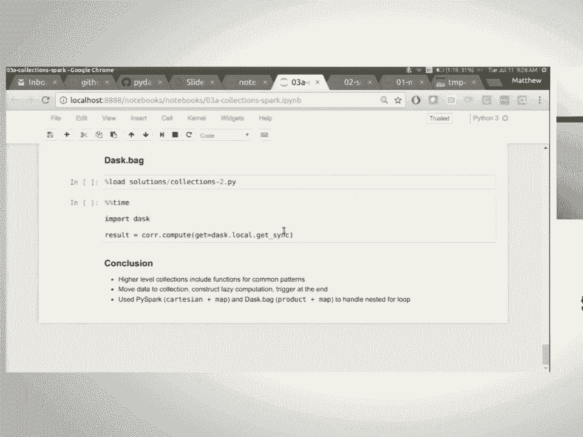

 So， my name is Aaron， I come from parallel computing。 I see at least one Hawaii sticker here。

 I was born and raised in Hawaii。 My first real job was working in the telescope。

 And my very first experience with the travel program was in 2001， where I wrote MPI in Fortran。

 I went back to the Gemini telescope where we did some travel programs there for some adaptive objects models and simulations。

 And I was also done in MPI， but not with the Fortran。

 but the satellite was a substantial improvement。 Eventually I heard on the way that we're good。

 It was not helping the screen。 The screen's up。 The screen's up。 Cool。

 You can press the key on that。 Eventually I found my way to the Python world。

 After much tugging and screaming， I actually came in from the super computing side of things。 So。

 I worked in the super computing laboratory in Saudi Arabia。

 King of the University of Science and Technology。 We worked on several Python programs that we ran in parallel。

 Now I work for Capital One。 I lead a data science team in DC。 We work on several things。

 including voice to text and text analytics。 I still get to do parallel Python。

 but not nearly as much as I do other types of things。

 But everybody on my team gets to do parallel Python， which is fun。

 What we're going to do here is talk about a more rubber meets the road example of using Python and parallel Python in your daily lives。

 Who here considers themselves a data scientist or a machine learning engineer？ Raise your hands。

 You'd be proud of it。 Maybe about a quarter of the audience。

 Who here maybe does something that's data science like but would never want to be called a data scientist？

 Fair computational scientists。 Did I miss another job category？ Software developer？

 Who here does something that is not one of those three categories？ I'm just kind of curious。

 What do you do？ Engineer。 All right。 Perfect。 All right。 Mechanical， aerospace， naval engineer。

 Anything else？ Yes。 OR？ Okay。 Awesome。 Okay。 Yes。 Yes。 Okay。 Wow。

 I must have been shorter and younger and it was about ten years ago。 Okay。 Awesome。 Okay。

 So we're going to talk a little bit about data science and what we're going to do is we're going to build a machine learning model and then we're going to do some naughty parameter tuning。

 Not so naughty， but I want you to understand what trade-offs we're doing as we do that parameter tuning。

 So the first thing we're going to do is we're just going to load this up。

 And since we have scikit learn installed through our Conda environment。

 we have some default data sets that we can play with。

 And we have some default algorithms that we're going to use。

 So we're going to use a support vector classifier。

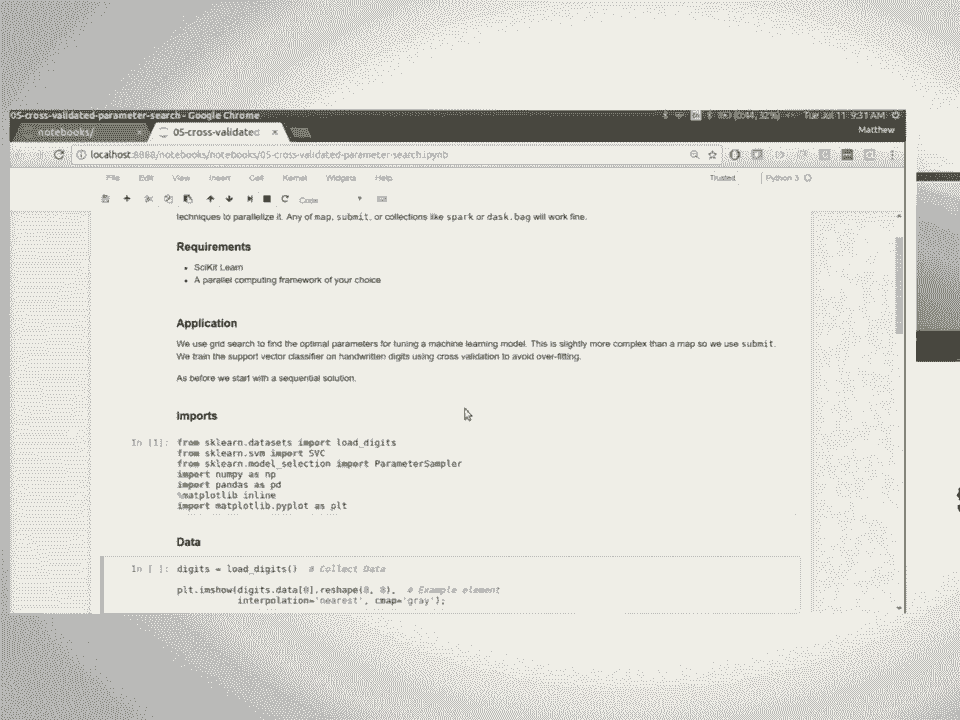

 And we're going to try and solve this problem， which is sort of a classic problem in sort of machine learning AI。

 And that is somebody has given us a set of digits that have been scanned by a computer or a device of some sort。

 And we want to know what those digits actually correspond to as a number。 So turn this image。

 this representation of a number to， oh， that's the character zero。

 This is a big problem actually resolved by the post office because they needed to route zip codes properly。

 And so this is all done in an automated way now。 But before you could imagine this was this process。

 And of course， if you get these wrong， it's a huge deal。 You never want to miss a zip code digit。

 You get misrouted mail and people get unhappy。 So there's this machine learning model that we're going to tune and we're going to try and make it as accurate as possible。

 And of course， we're going to use parallel programming and Python to get there。 OK。

 So we wrote a little bit of code and it's not in the notebook。

 It's in a separate module file called CVParamsDemo。

 And so if you want to go in and look at that code later， you're more than welcome to。

 but I just want to import that for now。 And these functions are fairly simple。

 We're going to do cross validation。 So we're going to split our code between sort of a training set and a validation set。

 We're going to have some code that given a proposed model and given some training data。

 goes ahead and runs that model and then validates it against the second half of the split。

 And then the final thing we need to do is show our results。 So that's the plot results function。

 And here's where we're going to be adventurous or we're going to be exploratory。

 We're going to explore the parameter space of this support vector classifier。 Right。 So， second。

 learn。 If you say， "Hey， I want to select a support vector classifier，" it'll happily give you one。

 If you don't specify any parameters to that support vector classifier。

 it's going to pick some for you。 And how those parameters work for your problem is just going to be slightly random。

 So you're always better off knowing exactly how to tune these parameters for your model。

 So we only have three parameters here， which is not too bad。

 Two of these are sort of more specific to the support vector classifier itself。

 And then tolerance is just basically a more general one。

 which is as we iterate through the model at some point， or as we try to sort of tune the model。

 it's how quickly we decide to stop。 So if you want to spend more time tuning the model。

 you would increase your， or make your tolerance smaller。

 And frequently the two parameters you care about in terms of how they affect the model are over here。

 That's C and gamma。 Okay。 So I'm going to go ahead and continue to execute。 Okay。

 So obviously we're traversing a very high dimensional space。 Right now it's three dimensions。

 And we're taking a log space。 We're looking at C from values of negative 10 all the way to 1000。

 We're looking at gamma parameter values from negative 10 to 1000。

 And then we're walking over the tolerance as well。

 And so you'll see that the numbers that we're traversing here are quite large。

 And so you can imagine that if we pictured this three dimensional space， we're actually very。

 very sparsely sampling from it。 So if there's any sort of interesting structure in here。

 we're not going to catch it。 We're not going to notice it。

 We're just kind of going to have some directional feedback on where maybe the right parameters are。

 So who here can define C and gamma in terms of a support vector classifier？ Okay。 Good one。

 So he's only one person can correct me if I get this wrong。 I had check notes on this。

 C is basically an error tolerance parameter on the support vector classifier。

 If you can imagine the space of what we're trying to solve， we have all of these digits。

 And we want to separate them basically into 10 different classes， the digits zero through nine。 Now。

 every once in a while， our support vector classifier is going to have -- it's going to try and draw lines。

 I think of this two dimensional space where there's a bucket of digits over here and those are probably the zeros。

 and a bucket of digits over here and there's probably ones。 But every once in a while。

 we'll have something that really looks like a zero， but it's actually a one。

 So somebody just drew a loopy one and it's labeled as a one。

 And we need to be able to accept that thing that really looks like a zero is actually a one。

 And for the support vector classifier to do that， we actually have to give it this sort of soft margin parameter that says。

 it's okay to have some errors。 And so you increase that C when you're willing to accept sort of these softer boundaries between things。

 And if you don't think that those exist， you should actually keep your C very， very small。

 If you think that the parameters or the lines between your classes are very， very tight。

 So even though we're treating these things as just random numbers。

 like we're just going to choose one of these， they actually have meanings and there are trade-offs in your model that actually happen as an effect of choosing these。

 So that would see gamma as another one。 Gamma is the choice of the influence of the radial basis functions in the support vector classifier。

 So the support vector classifier is basically this collection of these sort of radial functions。

 So if you're thinking you become from like the finite element method or you're like more of a numerical engineering person。

 think of these as sort of your support。 There's this choice of functions and there's this basis that you're operating over。

 And if you have a high gamma， you've got these really wide support supports or these Gaussian radial kernels。

 If you have a small gamma， they're very small。 And so the way this translates to the way your model works is your bias variance trade-off。

 And so a high gamma is going to lead to a larger sort of variance trade-off。

 So you're trying to almost overfit your model when you increase gamma。

 So those are the things to pay attention to。 Now we're totally ignoring what those parameters actually mean and we're just going to randomly search over them。

 Okay， so first we're going to split our data classically into a training and a testing set。

 And this is sort of a psychic learns way of labeling things。 You'll see this x underscore train。

 x underscore test， y underscore train and y underscore test。 So x is your inputs。

 y is sort of your labels。 So x is the digit picture。

 y is the label and then you have a training set and a testing set。 Okay， and so this is。

 we're just going to turn this into， or it's already been turned into vectorized data for us。

 And now we're going to run this and try it over our entire model。 And lo and behold。

 training model takes time。 So as we go over this space and we parallelize over this space。

 we go and we grab a coffee， we talk to our neighbor about what our favorite new deep learning network setup is。

 And then we come back hopefully around 10 seconds later and we have a set of scores for how our model did。

 Okay， and the sampling here is， you know， these little purple dots， the model did okay。

 And then these yellow dots， the model did quite well。 And as I was kind of hoping。

 the model is doing better in cross validation when we don't overfit it。 Okay。

 so we have over here a higher tolerance for allowing the model to sort of draw lines fuzzy lines。

 So it says， hey， I'm not going to try and capture every nuance of the difference between the classes。

 And on top of that， I'm not going to draw these super wide kernels that have this big impact and also kind of allow me to overfit。

 So that said， I want you to go a little bit deeper into the parameter space。 And so first。

 I want you to parallelize our sort of approach here to searching through the parameter space。

 And then once you do that， I want you to create a more fine grained parameter search than this one over here。

 Are there any questions or are you ready to get started？ By the way。

 you can use any parallel programming technique that you've encountered up until now。

 You are free to choose。 You are not allowed to use MPI。 Okay， great。

 Is there anybody here who's not hit the big blue button or doesn't know what I'm talking about？

 So either check the Slack channel or I'll do it again here。 I can just do it here。

 So if you go to PyCon dash parallel， it's also in the Slack channel or on the GitHub page。

 It's PyCon dash parallel jovian。org。 If you click this giant blue button， click it just once。

 It should take you after a few minutes。 It should take you to a prompt for a password。

 The password is PyData， all lowercase。 It's written here。

 If it doesn't happen for you after like a minute， please let me know。 Jupyter in a book is fine。

 I could be， but I want my Emacs。 I want my vi。 I want my z-shell。 You might use it。

 I'm going to do cross-validated and then you're going to introduce distributed。

 I'm going to do a second version。

 All these cool kids with their alpha versions of their software， I stick to the enterprise release。

 I want you to， if at any point you have problems with the cluster launching that big blue button。

 Wave your hands and/or throw your nearest object at Ben。 Nothing heavier than a pound。

 I don't want to injure him。 He's too valuable。 Let's take a look at a couple of the solutions。

 This is a thread pool executor solution。 The first thing we do is grab -- I'm going to move this up until it's at the top of my screen。

 We just grab this list of parameters。 We're trying to get into something we're ready to。

 execute through or divide up。 We split up the CV split。

 The CV splits are just a list of cross-validated， examples to go through。

 For each of these parameters， we're going to submit that job。 Then we append it。

 What we're doing here is we're using this nice submit architecture。 We could have done a map here。

 Instead， we did a submit。 Then we collect the results at the end。 I'm going to execute that。

 I probably should have executed that while I was talking about it。

 What I'll do now is -- I wasn't too bad。 I didn't bump up the number， the size of the grid。

 You're still not getting a whole lot of interesting solutions。

 We'll do this again and it is distributed with way more。 Here's another solution。

 This is a spark solution。 For those of you who do this， by the way， using spark。

 Let's look at how everybody solved it。 Who here used map？ Raise your hands high。

 Be proud of what you did。 These are all valid solutions。 Who used map？ Everybody who did map。

 Everybody who did submit。 Raise your hands。 Awesome。 The clear favorite。

 Everybody who used spark and was successful。 Great。 Awesome job。 Who used dask？ Yeah。 Cool。

 I think a couple of you solved it more than once。 I counted more hands in votes than I had people in this room。

 Maybe people switched votes。 I don't know。 Here's the spark solution that one of you got。

 We get ourselves a spark context， which is basically our parallel execution environment。

 This isn't going to work if we don't have Java and spark installed on our system。 If it is working。

 we set up these two parallel， what I would call distributed data frames。 there are a way to。

