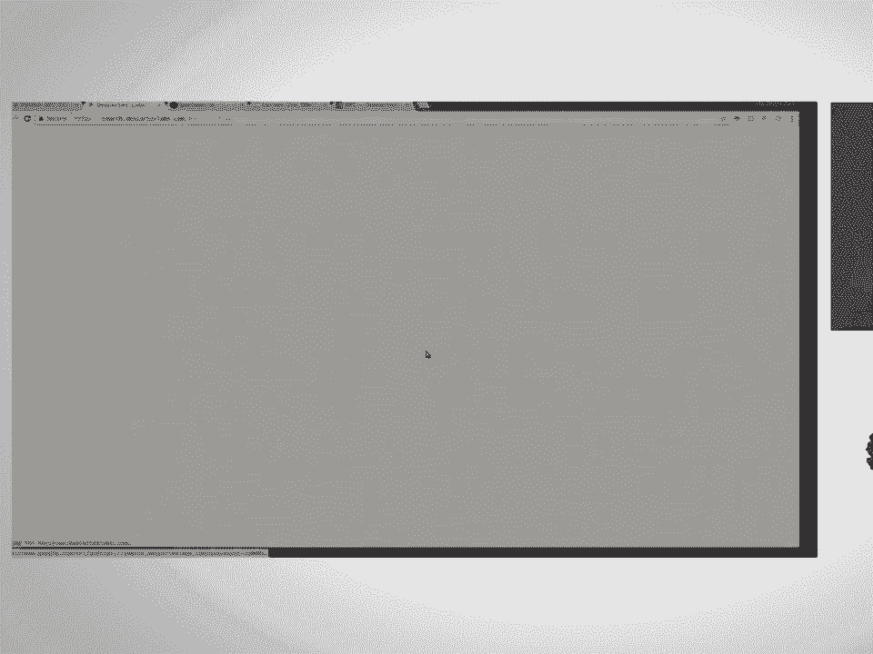
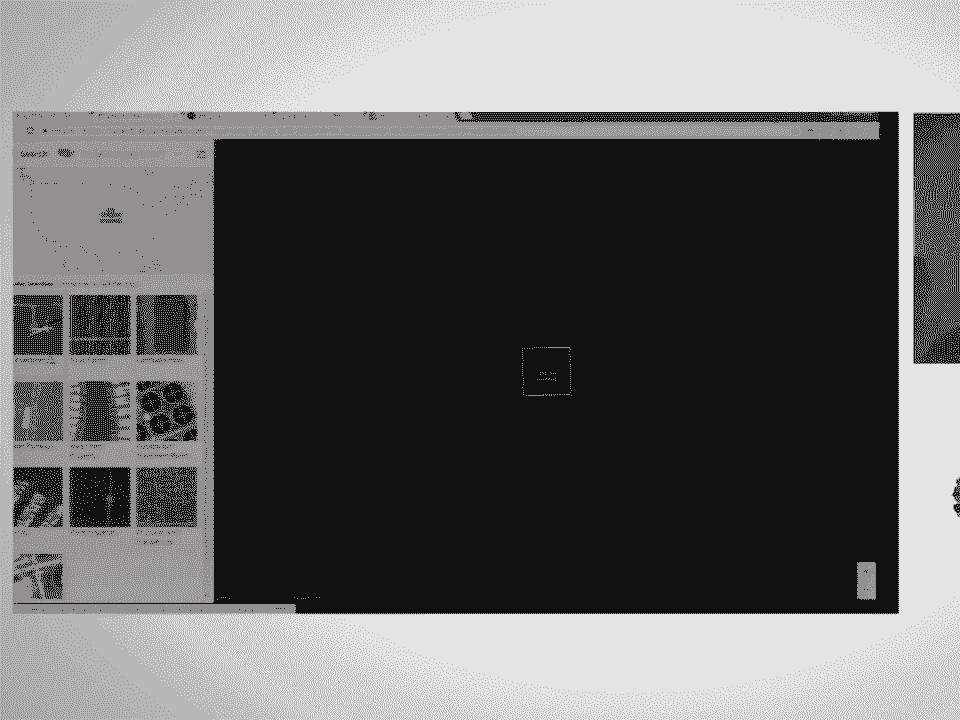
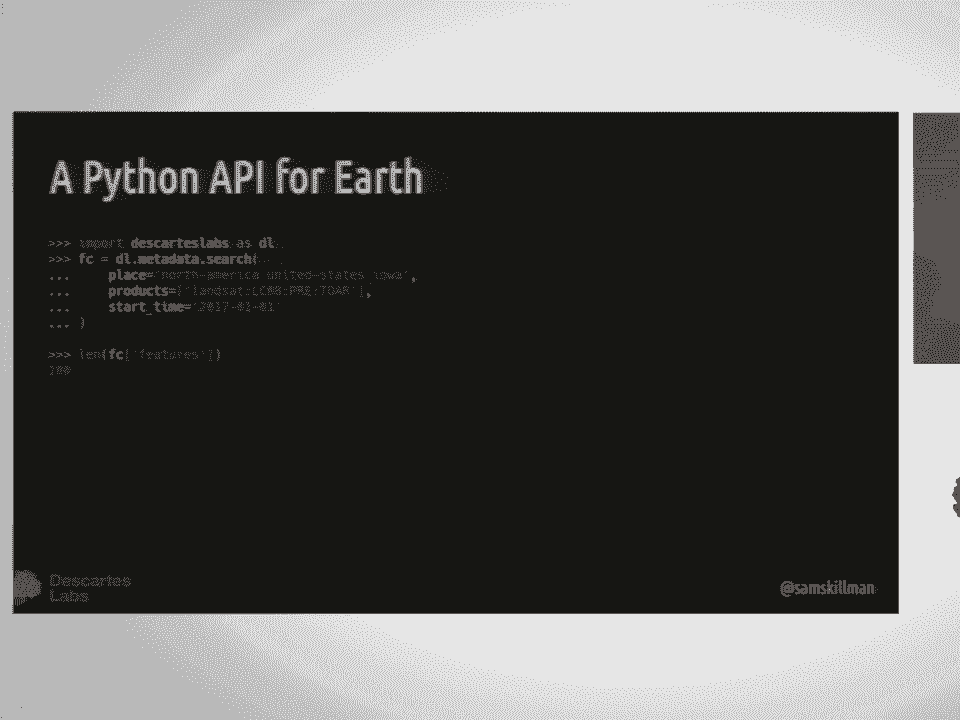
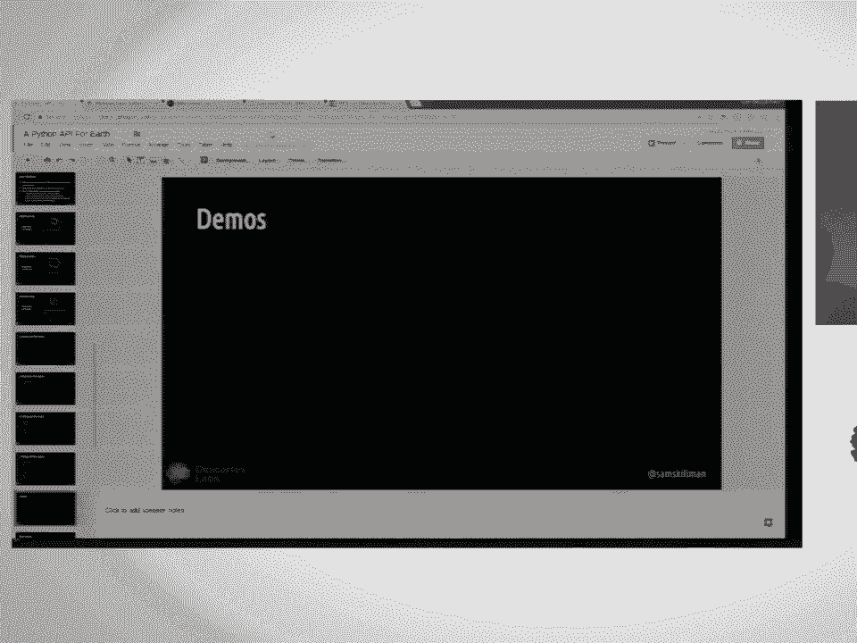
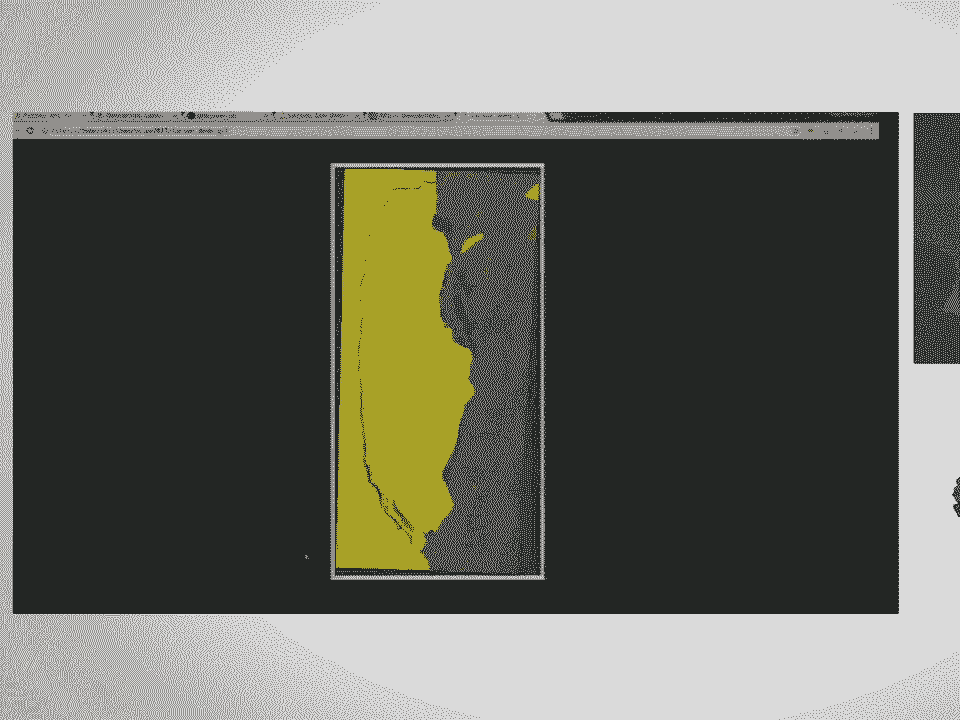
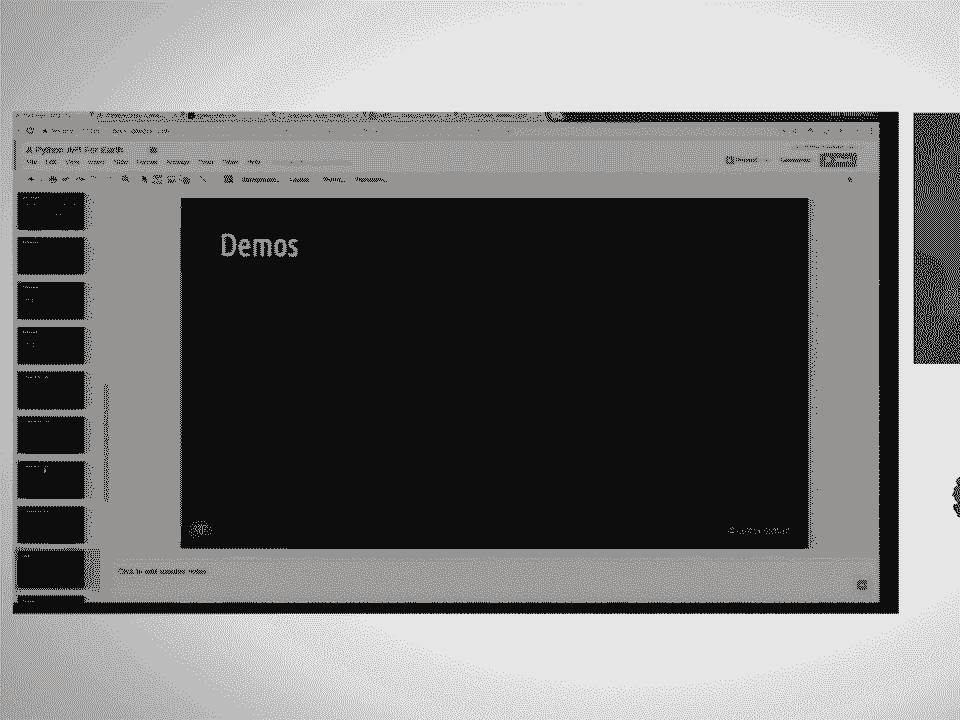

# SciPy 2017（合集） - P15：A Python API for Earth  SciPy 2017  Sam Skillman - 哒哒哒儿尔 - BV1Cs411A76Y

 Good morning everyone。 So I'm Sam Sculman。 I'm a computational scientist and the head of。

 platform at Descartes Labs and today I'll be talking to you about a Python API for Earth。

 So I'm going to tell you a little bit about who Descartes Labs is， a little bit about。

 what kind of geospatial data we deal with at Descartes Labs。 I talk a bit about our。

 platform and show some fun examples。 So Descartes is a venture backed startup that came out。

 of Los Alamos National Lab in late 2014。 Our main drive is to pull in as much geospatial。

 data sets and information about our world， apply machine learning techniques， computer。

 vision techniques on top of that data set and create forecasts for what's going to happen。

 on the surface of the Earth。 So we're composed of a team that's ever growing。 I can't keep。

 track of how many people at this point。 So it's somewhere over 30， I think less than 40。

 but a lot of scientific background minds。 A lot of the founders came out of the lab， but。

 we've added some geographers and software engineers and lots of office canines。 So our。

 first application was creating a real time or near real time agriculture forecasts for。

 the US and globally。 We do this by pulling in imagery every single day。 We pull in something。

 like 30 to 50 terabytes of satellite imagery every day， update our models using a whole。

 breadth of machine learning and numerical techniques。 So they can be very simple or they。

 can be very complex using deep neural networks in some cases。 And that's kind of our MO。 We。

 acquire all this data set， pre-process it to a place where it's ready to go， ready to， be analyzed。

 and then build complex models on top of that。 So the big theme and what。

 really is enabling a company like ours to get going is the fact that geospatial data is， really big。

 I came from an astrophysics background where we thought we had very large simulations。

 and geospatial data is one of those where it is kind of starting to trump what happens。

 in terms of data set size。 So it took Landsat about 44 years to exceed about a petabyte。

 of satellite imagery。 When ESA launched the Sentinel-2 constellation， they're going to。

 collect about a petabyte in just two years。 Then you have a private space company such。

 as Planet which we heard from， I can't remember now， I guess it was yesterday or the day before。

 but they're going to be collecting many petabytes of satellite imagery every year。 And so this。

 field is completely exploding in terms of data set， size， rate， and breadth of types， of data。

 So at Descartes， we pull in all sorts of satellite imagery。 All the classics， Landsat， modus。

 we're pulling in Sentinel-1， 2， and 3。 We have elevation data sets， private satellite。

 constellations， we pull in some of planet's data， we have things like the crop-scape data。

 layer and USDA national aerial imagery。 All of these things vary quite widely in resolution。

 in all dimensions。 So that's spatial resolution， time resolution， and spectral resolution。 And。

 so one of our core beliefs is that by combining all of these data sets together under a single， API。

 we can take advantage of it much more easily， much more quickly， allow us to iterate。

 and build these complex models that we build our products off of。 So things like MODIS。

 you get something that's 300 meter resolution， very high time read allows us to make really。

 nice cloud-free mosaics。 We've got Landsat which provides you this higher resolution look。

 multi-spectral， lots of different wavelengths。 This is a salt line down in the out of common。

 desert。 The national aerial imagery program， this is kind of one meter data set， but you。

 only get access to it about once a year。 Just ingested some of the 2016 data。 So some of。

 that is actually getting down to 50 or 60 centimeters， I think。 But then we also pull in kind of。

 more strange data sets。 So Sentinel-1 is this constellation。 There's now two satellites where。

 they do something called synthetic aperture radar where instead of just collecting the radiation。

 that bounces off the surface of the earth back to the satellite， actually beam down 5 gigahertz。

 radiation and measure the polarization of that radiation as it comes back。 So this is actually。

 the Panama Canal。 And this is a composite over， I think， about a year and a half of Sentinel-1。

 data。 But what you can see is that since ships are very reflective in 5 gigahertz radio， of 5。

 gigahertz radiation， the composite over many images of these shows a bunch of ships kind。

 of waiting in line to get through the Panama Canal。 So it's kind of cool because of different， view。

 It's also nice because it's really not affected by clouds at all。 So it turns out。

 the earth is cloudy。 It's really pesky。 It's like 50% cloudy in， you know， if you look。

 over the average of the earth。 So we also pull in Sentinel-2。 This is Landsat data over New。

 York City。 On top of this， we have， I'll get into this in a bit， ways to calculate on the， fly。

 derived indices so you can get access to NDVI directly through our system where。

 you're combining a red band and a near infrared band to look at vegetative health。 So you。

 can see that like Central Park just lights up like a light bulb in into the gut。 So at Descartes。

 we've used all of this imagery and remote sensing data sets to do a few things that we've shown。

 in the world。 Last year we displayed some， what we think， state of the art， corn yield。

 forecasting for the United States， trying to estimate during the season。 Like right now。

 there's a bunch of corn growing in the Midwest。 Any of you are there。 I'm sure you know that。

 better than I do。 And we make estimates right now for what the corn yield is going to be。

 at the end of the season。 That's very interesting to governments and commodity traders and farmers。

 themselves。 I'm also going to talk a little bit about some of the composites we've done。

 and then a demonstration we call it geovisual search。 So yeah， those corn yields， this is。

 our corn yield forecast last year。 The kind of darker areas here are higher corn yield areas。

 But this required pulling in quite a lot of those data sets that I talked to you about before。

 and iterating very quickly because many of us were not agronomy backgrounds。 And so we don't。

 really understand the biophysics of how corn is growing。 We just try to deduce that through。

 a combination of physical insight as well as this access to massive amounts of imagery。

 Something we put out I guess earlier this year was a set of three global composites。

 This is really a lot of fun。 We took all of the Landsat 8 imagery that has been taken， created。

 a composite out of a surface reflectance version of that data set。 We then took Sentinel-1， the。

 synthetic aperture radar data， which we think is the first global composite of Sentinel-1 that we。

 had seen at least。 And then we did the same with Sentinel-2， which is a Landsat 8-like satellite。

 And we focused in on the red edge bands， which looks a bit at vegetation。 So I just want to。

 show a few of these real quick。 Particularly the Sentinel-1 one is I think pretty new to this space。

 I kind of like looking in at Dubai over here。 You can see these like crazy floating islands that show。

 up。 And then what you can also see are all of the ships and yachts that are floating off the coast。

 But you can imagine looking at sea traffic with this since these ships show up so well。

 There's also all sorts of other signals that you can get out of the synthetic aperture radar。

 Just show the other Sentinel-2 one。 As I mentioned， this is really powerful for agriculture as well。

 So if we come in here to。 I actually don't know where this is。

 but you can see all these crop fields， like just lighting up。

 This is kind of during the summertime last year。 So this was a lot of fun。

 But it really got us ready for what we did next， which was this demonstration called GeoVisual Search。

 The concept came out of a group at Carnegie Mellon and we thought what they did was super cool。

 It was basically the idea of given some piece of satellite imagery。

 find other things that look like it。 This is kind of similar to like the I think Flickr has a similarity search where you can。

 click on a photo， find other photos like it。 So we wanted to do the same thing but out of different。

 scales。 So if we come in here and we look around at wind turbines。

 you click and you see in the results。

 it finds a bunch of wind turbines all across the US。

 And so if we look kind of in this area over here， we'll see if I actually find one that。 Yep。

 And so you come down here and there's a bunch of， wind turbines。

 So this was just like a really cool demonstration of this idea of basically taking。

 a massive amount of satellite imagery。 We process it through a deep convolutional neural net。

 created a feature space and then allowed us to compare features across the world in this very。

 high dimensional space very quickly and find the most similar images。 We did the same thing。

 with a dataset that we got access to from Planet。 So the planet is a company out in California。

 They， I think just launched 48 more satellites about eight hours ago and hopefully we'll be hearing from。

 them soon。 So we have access to this kind of three or five meter global mosaic of China。

 So if you zoom in here， these are some solar panels and if we click on one of these。

 it shows you a bunch of solar panels all throughout China。 And so you can come back in here and out。

 of the middle of this desert， which I challenge you to find the solar fields by just zooming around。

 and panning around on this image。 One of the test cases， like when we were first developing this。

 we clicked on a solar field out in Las Vegas and we found one of these in a desert in China。

 We had no idea。 Actually， we changed our algorithm and it disappeared for a while。

 so I couldn't even， find it for like another week until we kind of dug through it some more。

 Anyways， this was， incredibly fun， but this was an application of taking a pretty complex， you know。

 deep learning， convolutional neural net and using it to find similar places on the surface of the earth。

 So， let's see。 So we're a company we're about two and a half years old。 Through this process。

 we kind of have proven out our internal APIs to the point where we're。

 capable of internally running this really massive global scale analysis。

 And so then the next chapter， in our company is we've been taking some of these internal capabilities and making them externally。

 available。 And so this is driven by the need to have very fast and scalable access to satellite。

 imagery and datasets。 And， you know， what we want is to avoid having to go to each satellite。

 data provider to learn their obscure FTP interface from various governments and kind of work our way。

 through all the pain and struggle just to get an image。 So what we want to provide is a unified。

 interface to many sensors， many data types。 And this is all kind of driven by our experience of。

 needing to iterate very quickly in order to create accurate models。 So our platform is in a beta。

 access mode right now。 If you're interested， please come talk to me after the talk。 But the first。

 things that we're enabling are just the very simple basic concepts of find imagery that you're。

 interested in and download it and get access to it as quickly as possible。

 So define an area of interest， find across all of these satellite constellations the data that you want。

 From those you can create， mosaics， create composites across time if you want。

 A lot of the additional remote sensing operations。

 that you want to do on top of this is left up to the user right now。

 But we're working on better and， cooler algorithms as well。 So what does this look like？

 So we have taken what we do internally， exposed it primarily through a REST API。

 On top of that we provide a Python client that you can， interact with this。 So you can pip install。

 day cart labs， and then import it。 You're going to search， over some location。

 Maybe you're studying Iowa。 You want to look at Landsat data。 We're pulling in。

 Both we pulled in all of the pre-collection data。 All the collection one data is coming in as it's。

 made available。 But this is just very simple search for data that you're interested in。

 What it returns， to you is a feature collection， GeoJSON object that you can go through and pick out the ones that you。

 want。 If you want to get the actual data， we're in Python。 Let's use the， you know， international。

 language of data， which is NumPy NDRA's。 And so just give me an NDRA of that imagery at whatever。

 resolution I want and whatever bands I want。 And that includes the native bands that come with it。

 all the spectral bands， green， square， you know， mirror infrared。 But also give me the drive bands。

 like NDVI or a burned area index or water index。 And that just returns exactly what you'd want。

 It's a NumPy array that acts like every other NumPy array。 And this little meta object here can。

 tell you a bit more about what you just downloaded in case you forgot from your function call one。

 lineup。 So let's do a demo。 There's something happened in the last couple days， which was。

 pretty incredible。 I don't know if any of you have heard about the Larson ice shelf off of。

 Antarctica， but it just fell into the ocean。 I mean， it just detached。

 It's been floating for a while， but they finally confirmed that it detached。 So I was sitting in a。

 I think， the lightning， talks yesterday and I thought， well， maybe we can see this somewhere。

 So that synthetic， capital radar data set from Sentinel-1 is really useful for looking at these types of things。

 So I went on to GeoJSON。io。 I found the Larson ice shelf。 I drew a little polygon。 And so then I。

 you know， import my favorite package， import my other favorite packages。 I， you know， define my。

 area of interest。 I'm going to look over， I sent the one， I'm going to look over just like the last。

 month because I know it happened recently。 Sorry。 Yeah。 So search over Sentinel-1。 This is the GRD。

 It's just like a polarization fraction data set。 There's also interferometric。

 Sentinel-1 data as well。 So we're going to look over the last month。 It returns 30 features。 They。

 they look like， you know， GeoJSON objects that have geometries and other random tidbits of。

 information from the processing pipeline。 I'm going to look at just the descending paths。 And then。

 as this runs， I'll kind of go through this。 So basically， spill it up all of those observations。

 into days。 Then group them by those days， put them all in the same coordinate system。

 ask for 120-meter resolution。 I don't need like 30-meter or 15-meter or whatever。 I think this。

 comes at 20-meter natively。 I look at the VV band， which is the vertical vertical polarization。

 Grab it and start overlaying these。 So for each image that comes in， I just add the next image。

 on top of it so that it creates this kind of time series of imagery。 So started back in 2017。

 June 15th， and we're almost there。 Spent a little bit too much time trying to optimize。

 Matplotlib to write these out really quickly。 And that took a little bit of the lightning talks。

 And I think the last one is -- oop， there's a couple there on July 12th。 I'm going to。

 convert these to our favorite image format， the GIF。 And here's the Larson Ice Shelf。

 over the past month。 This is really cool。 And --， it's a little scary。 Yeah。

 It's pretty impactful when you can just see it happen。 So this is kind。

 of the power that we're trying to expose， allow you to have an idea like I did in a lightning talk。

 I wonder if we can see that。 The answer is yes we can。 And there it is。

 Okay。 I'm running a little low on time。 So I'll just start to wrap up here。 So。

 beta access to this。 Govids are our website。 If you look at platform， you'll find your way。

 We invite people from academia and nonprofits， industry。 You get access to all the publicly。

 available data sets。 If you have relationships with private vendors， we can work with you to。

 get that in as well。 And just come and introduce yourself。 A couple quick questions， like where。

 does my analysis run？ For right now it runs where you download that data to。 And we don't constrain。

 you to use any algorithms or packages on top of that。 This is just a client library right now to。

 get access to data。 We'll have more funding soon。 But for right now， just download it to wherever。

 you like。 If you're up in the Google Cloud， you're going to be right next to the data。

 So it's going， to be that much faster。 But you all should know how to multi-process and make concurrent requests。

 to an API at this point。 So just go at it。 If you want to learn more， we've got documentation。

 There's the -- let's see。 The Descartes Labs Python client is all up on GitHub。

 I have to say I still use Python 2， but it is Python 3 compatible unless we miss something。

 But it's all up there。 Take a look around。 We have API documentation as well。 Things that will。

 help you iterate over larger areas of interest， find locations that you're interested in the first。

 place。 So just the best thing is to start digging around there。 So that's it。 Thank you。

 Please come， chat with me afterwards。 We're also at Descartes Labs hiring if you're interested。

 Thank you。 Any questions？ So the question was when you get access to the imagery。

 do you download it from us or from the， original source？ You're downloading it from us。

 So for many of these things， we've pre-processed， a lot of the imagery。 So we take things。

 for example， from raw radiance values and convert them， into top of atmosphere reflectance。

 In some cases， we also run surface reflectance algorithms or， any additional data cleanup processes。

 And then we store that in a compressed form in Google storage。

 So the bandwidth and rates are just incredible。 We've gotten things like 200 gigabytes a second of。

 pulling imagery off of these resources。 So it's coming from us。 Yeah， that's definitely something。

 The question is， do you have any features that allow you to， monitor and watch for new features？

 That's coming。 So that whole monitoring framework of maybe you're， focused in on this thing。

 You just want to get alert whenever a new observation shows up。 That's， a pretty simple thing to do。

 But it's also something you could easily just script up in a， cron job or something。 So， yep。 Yep。

 Yeah， so the question was， are you looking at getting additional synthetic aperture radar data or。

 passive microwave data for looking through those pesky clouds？ We are interested in collecting any。

 data set that we can get our hands on。 So if you have particular things that are interested。

 that's something we can do。 Yep。 So we experiment。 The question was。

 for the geovatial search was the machine learning process， supervised or unsupervised？

 We have done both with that application。 We've done things like， train based on open street maps。

 labeled data， as well as just look at a abstract feature space。

 that we try to balance in a certain way that kind of break things up。 So I think that we've。

 actually got both going。 Yeah， they're kind of semi-supervised。 Yeah。 If they did。

 I don't know if I could say。 So the question was， do we work with military or DOD-like， things？

 So we do have a grant with DARPA looking at food security in the Middle East and North， Africa。

 And so they're interested in knowing whether or not there's a failed crop might lead， to starvation。

 political unrest， social unrest。 So they're very interested in that。 So that's one。

 interaction that we have with the government。 What types of submeters resolution imagery is an area in other kind of multi or。

 aspects of the imagery？ Yeah， so the question was， what kind of submeters hyper spectral imagery do。

 we have available？ All of the submeters stuff is mostly coming from things like NAIP。 We haven't。

 focused tremendously on the submeters resolution data sets because we started out in agriculture。

 You don't， at least for a lot of large commodity crops， you don't need that。 So but things that。

 you have access to， we're interested in。 And I think that's the red card saying it's all over。

 Thank you everyone for coming。 [BLANK_AUDIO]。