# SciPy 2017（合集） - P26：pomegranate  Fast and Flexible Probabilistic Modeling in Python  SciPy 2017  Jac - 哒哒哒儿尔 - BV1Cs411A76Y

 Hello everybody。 So I'm going to get started a little bit early because I have a little。

 bit more material to cover。 My name is Jacob Schreiber。 I'm a fourth year graduate student。

 and I go big data fellow at the University of Washington。 For the last few years I've。

 been working on this side project， Pomegranate， which implements fast and flexible probabilistic。

 modeling in Python， implemented in Python for speed。 So if there's one thing that you。

 get out of this talk， I want it to just be this。 Pomegranate is more flexible than other， packages。

 It's faster。 It is intuitive to use and it can do everything in parallel。 Hopefully。

 by the end of the talk I've convinced you of at least one of these points。 So Pomegranate。

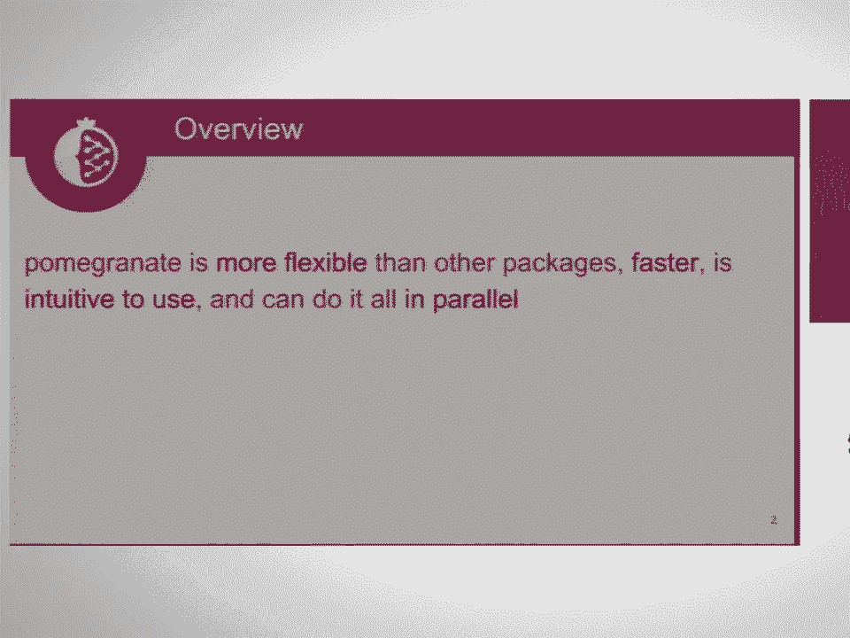

 has six main models that are currently covers and it has two supporting models that help。

 support these models。 The first of very basic probability is distributions。 Things like。

 normal distributions， uniform distributions and like。 Next are mixtures of these distributions。

 In Markov change over sequences， hidden Markov models which are latent factor models for， sequences。

 Bayes classifiers which are an extension of the more commonly known naive。

 Bayes classifier and Bayesian network which are very flexible probabilistic inference techniques。

 However， one of the core tenets of Pomegranate is that even though these are six separate， things。

 they're all kind of really the same thing。 They all kind of just represent probability。

 distributions。 And so we're very familiar with like a normal distribution and what that， looks like。

 But a mixture model is really just a complex distribution。 A hidden Markov model。

 is just a distribution over sequences and a Bayesian network is literally a probability。

 distribution that's been factored along a graphical structure。 This core insight into。

 these distributions informs basically how all the Pomegranate works。 One of the things。

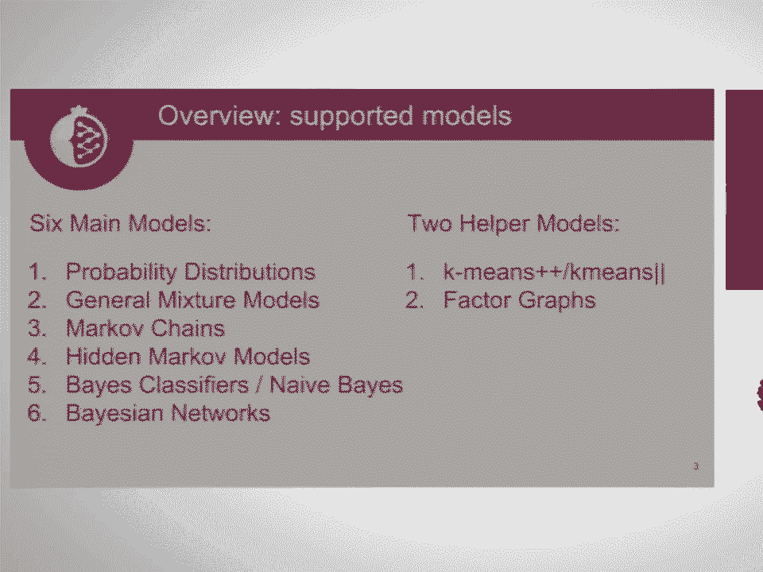

 that allows us to do is stack these models in ways that other packages don't allow you， to do。

 What I have here are the distributions as rows， distributions that you can stack。

 inside other distributions which are the columns。 So on the top row， we have things like you。

 can stack a normal distribution inside a Bayes classifier and get a commonly known Gaussian。

 naive Bayes。 That makes a lot of sense。 Likewise， a more complex model might be that you have。

 a GMM HMM where you put a mixture model as the a message for your hidden Markov model。

 What I have in dark blue here are ways that you can stack models in Pomegranate and in。

 light blue I have ways that I'd like to support soon because the infrastructure is basically， there。

 Some ways that you don't really see other packages supporting are things like if。

 you want to create a classifier over sequences， you might have a hidden Markov model that represents。

 each of your distributions and put your hidden Markov models inside your classifier。 So instead。

 of having a Gaussian naive Bayes， you now have a hidden Markov model Bayes classifier。

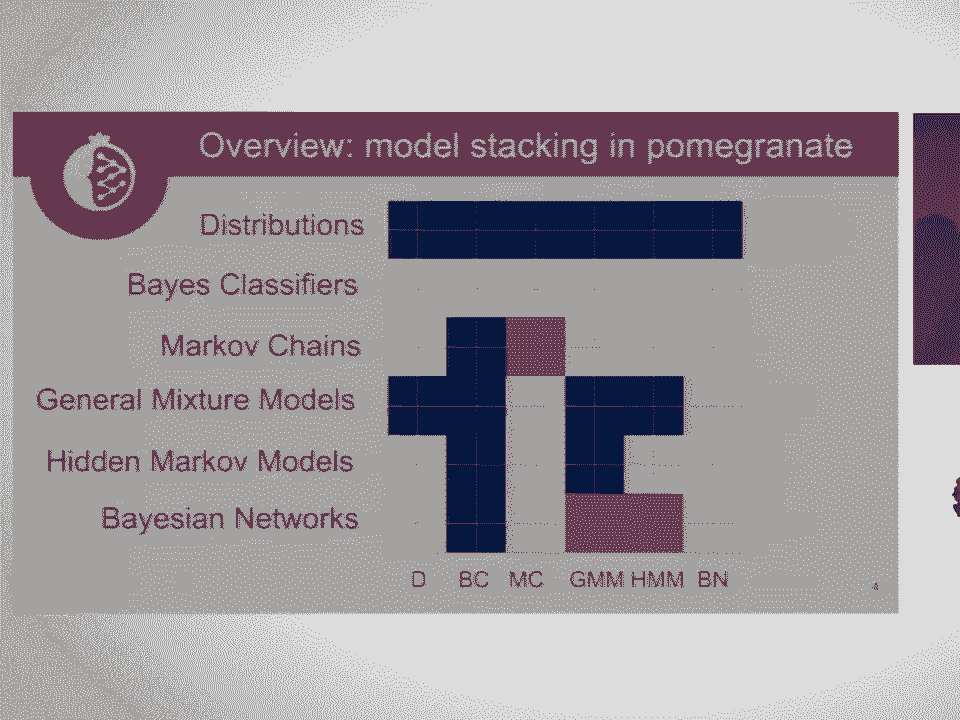

 This is a comparison to other packages that in Orrins I have ways that other packages。

 allow you to stack。 Orrins means that other packages allow you to stack but not nearly。

 as flexibly as Pomegranate allows you to。 And dark red indicates ways that you can stack。

 in Pomegranate that no other Python package to my knowledge allows you to stack。 So for， example。

 just with stacking a simple distribution inside a Bayes classifier that one up here， you。

 can create a Gaussian naive Bayes or a multinomial naive Bayes in scikit learn but in Pomegranate。

 not only can you create an exponential naive Bayes or a Bernoulli naive Bayes or any other， type。

 you can create mix， you can have different types of distributions modeling different。

 features and I'll be showing you that at the end。

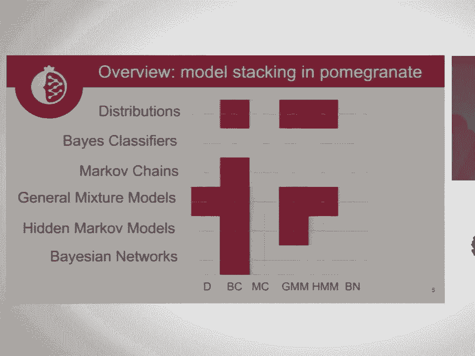

 Given this insight that everything that we're dealing with is essentially just a probability。

 distribution， the API is common to all of the models。 This is the whole thing right here。

 That under each one of these models you can calculate the probability or log probability。

 of a sequence。 You can sample it because these are all generative models。 You can fit like。

 you would in scikit learn。 The summarizing from summaries methods that are highlighted。

 there support the out of core API that I'll show you in a second。 And then if you have。

 compositional models， models that are made up of smaller models like basically everything。

 other than a basic distribution， you have the predict， predict， problem， and predict log。

 problem methods from scikit learn。 Then lastly there's the model dot from samples which I'll get into the different。

 this is， a area where it's Pomegranate and scikit learn differ with the fit in the from samples。

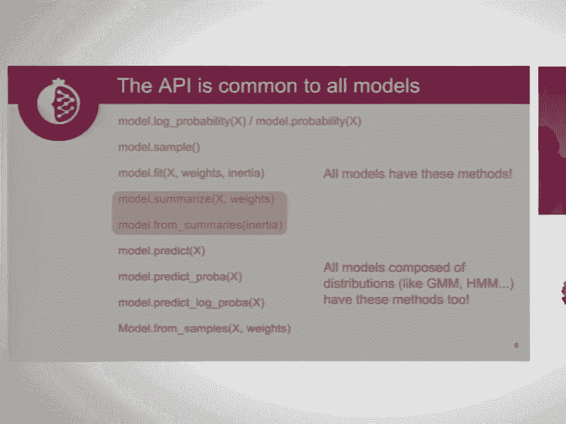

 method。 Pomegranate currently supports a wide variety of different probability distributions。

 I've highlighted the ones that I think are the most common in red Bernoulli distribution。

 normal distribution， multivariate Gaussian。 The way that Pomegranate is structured is very， modular。

 And so this is important because you can create any of the more complex models。

 by simply dragging and dropping any of these simpler models in by implementing a log normal。

 distribution for example。 Now you can create log normal mixtures and log normal hidden Markov。

 models without having to change any of the underlying code。

 So there are two ways of initializing models in Pomegranate。 The first is that if you already。

 know the values that you'd like your model to take， you can just pass those in。 For a。

 simple normal distribution you just need to pass in mu and sigma and you can create a。

 distribution like that。 If you want to create a Gaussian kernel density which is a non-parametric。

 distribution where a sense that you just plop little Gaussian distributions over all。

 the points and the ultimate distribution is just the sum of those little Gaussian distributions。

 you just plop the points and you automatically get your distribution。 As a side note， because。

 there are these non-parametric distributions here， this means that Pomegranate natively。

 supports non-parametric mixtures and hidden Markov models。

 The other way that you can create a distribution is if you know the type of model you want and。

 you have data and you basically want to just infer this type of model directly from your， data。

 In scikit learn you typically just do this by calling the fit method directly but。

 in Pomegranate you would have to do the from samples method like you would see here。

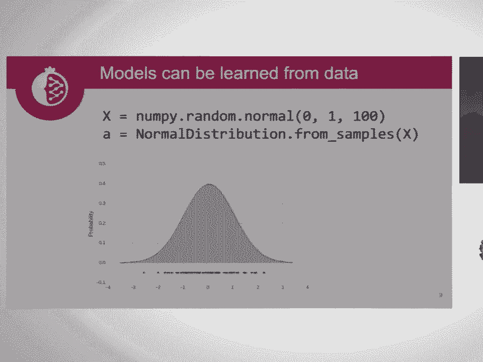

 So to address the first claim， Pomegranate can be faster than NumPy。 Let's say we want。

 to take a simple example where trying to fit a normal distribution to around 1000 samples。

 It's around twice as fast in Pomegranate to do this。 There are a few reasons why but the。

 main reason is because if you're doing this in NumPy NumPy is trying to be as general as。

 possible so you have to first go through and calculate the mean then you have to go through。

 and calculate the standard deviation。 In Pomegranate you know that you're trying to。

 calculate a normal distribution so you can go through the data far more efficiently and。

 only calculate the numbers that you need。 But that doesn't， that seems insignificant。

 Going from 46 microseconds to 22 microseconds， it's barely noticeable。 This speed increase。

 extends to larger models though。 Let's say if we want to fit this multivariate Gaussian。

 into 10 million samples with 10 dimensions， you can see that it's around 20% faster to。

 do this in Pomegranate than it is to do it in NumPy。

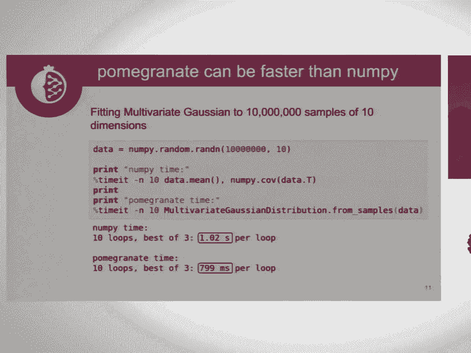

 So I just merged GPU support as well for Pomegranate and what we're seeing is around a four。

 time speed increase across all of the models。 On the left hand side we have a simple multivariate。

 Gaussian distribution with the cyan bars representing the fitting multivariate Gaussian to some。

 data time and the magenta bars showing the amount of time it takes to calculate the probability。

 of samples given the points。 So this is around a four time speed improvement over the values。

 that I just showed you in the previous slides。 This speed improvement extends to mixture models。

 that if you just add in GPU support that you get around a five time speed improvement， four。

 time speed improvement when doing both fitting and calculating probability with this mixture， model。

 This is enabled only because of the modularity of Pomegranate that all I had to。

 do was allow GPU support for the multivariate Gaussian distribution and suddenly all models。

 that relied on it now have GPU support。 Ultimately this uses the package Kupai which is fairly。

 simple to install and is the back end of packages like Chainer。 And so it basically automatically。

 infers whether or not you have a GPU and uses it though you can turn on and off the GPU。

 And to be clear I just merged this into the master branch on GitHub so it's not available。

 yet if you pip install it。 I'm hoping to get to more documentation， unit tests and other。

 GPU support in before I do a four release on this。 But this is currently merged in。

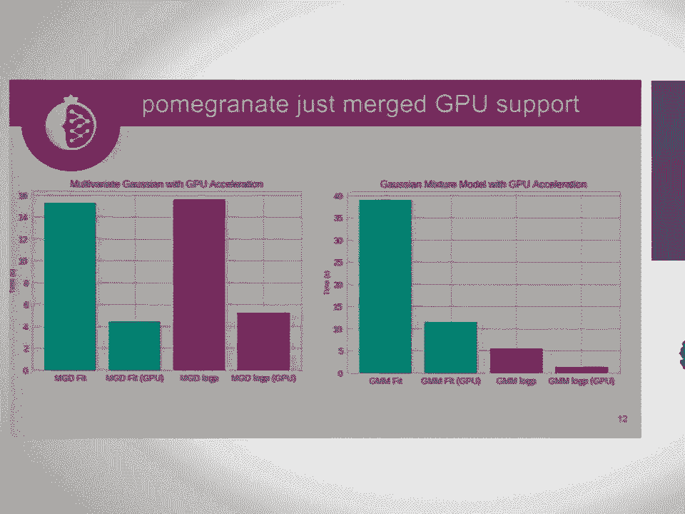

 So like I had mentioned if you know the type of distribution or model you're trying to fit。

 you can do it far simpler than just calculating the mean than calculating the standard deviation。

 For example let's say that you want to calculate the， uh， the calculating normal distribution。

 you need to calculate the mean and the standard deviation。 But you can get an exact update。

 of the mean and the standard deviation going through the data once by simply calculating。

 the sum of the weights， the sum of the weighted points and the sum of the weighted points， squared。

 By calculating these three values you can exactly calculate the mean and the， variance。

 So this means that Pomegranate only has to go through the data once in order to。

 calculate this and for every other model。 A natural extension of these additive updates。

 is that Pomegranate supports out of core learning because there's no reason you have。

 to store all of the data in memory if you're simply adding together these sufficient statistics。

 That you load up one batch， calculate the sufficient statistics and store them， calculate。

 load up the next batch， calculate the sufficient statistics on that and add them to the previous。

 ones and so forth。 This is supposed to be two normal distributions but they're basically。

 identical to machine precision。 The first one is if you just fit directly to the data。

 and the second is if you use the out of core API in order to fit in batches to the data。

 Naturally if you have these types of additive updates parallelism becomes a breeze。 All you。

 need to do is you take your data， you break it into chunks， you assign these chunks to。

 different processes that extract the sufficient statistics from each one in parallel。 You。

 add the sufficient statistics together across each one of the chunks and then you can calculate。

 the new parameters exactly using them。 Pomegranate is implemented pretty much entirely in Python。

 with the global interpreter lock released and so we use multi-threaded processing as opposed。

 to multi-processing which is typically used in Python。 This means that we don't need to。

 be copying our memory across different processes and be far more efficient when doing these。

 types of numerical things。

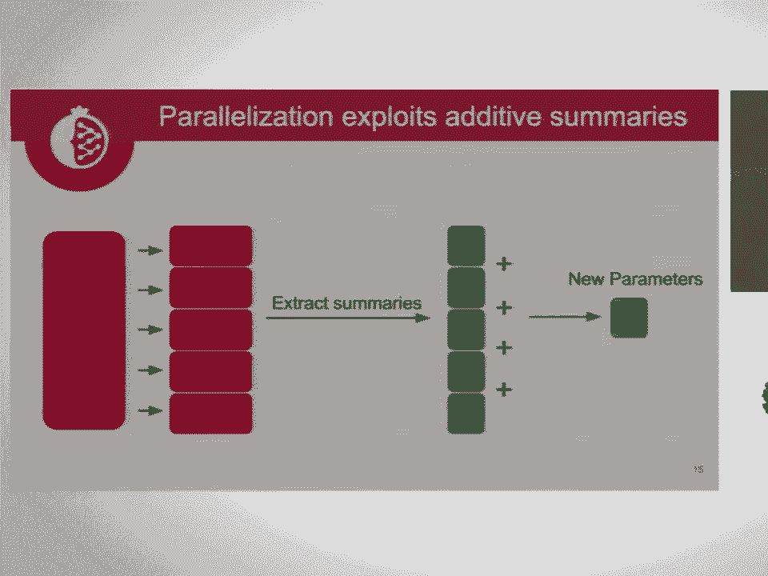

 Another lesson to it of things this supports is semi-supervised learning。 Semi-supervised。

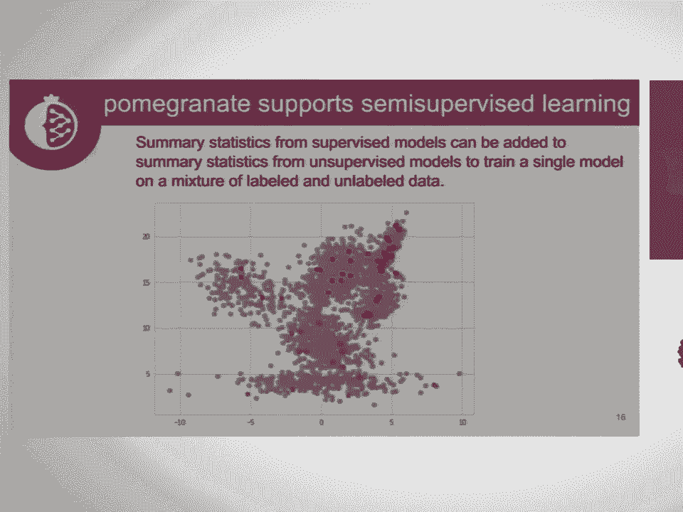

 learning is essentially the task where you have a whole bunch of labeled data and you。

 have some labeled data and you have a whole bunch of unlabeled data。 Frequently this comes。

 up in the field of computer vision。 We have a ton of images on Instagram， mostly of food。

 and of cats and then you have some labeled images but you don't really want to be spending。

 a bunch of money labeling all of the images in the set。 So semi-supervised learning is。

 the idea that we can start off using our labeled data to initialize the model then we can fit。

 a supervised model using the labeled data， an unsupervised model using the unlabeled。

 data and add those statistics together in order to get a better update that uses both。

 the labeled and the unlabeled data。 Since Pomegranate is implementing these types of generative。

 models that use expectation maximization in addition to this being a possibility this。

 also makes a lot of theoretical sense。 We're simply using expectation maximization in its。

 purest form in order to do semi-supervised learning。 So we get a model that is far more。

 intuitive to interpret and it's also about ten times faster than using Scikit learns label。

 propagation。 So what you get is that on the left hand side that's if you use only the label。

 trading data from the previous slide and on the right hand side you get the decision boundaries。

 if you use both labeled and the unlabeled data。 You can see that the boundaries are less， sharp。

 the smoother between the classes when you use the unlabeled data and so you're。

 able to eliminate around half the error by using all of this unlabeled data。 So if any。

 of you are in a situation where there's a bunch of unlabeled data that you could possibly。

 utilize and you've since not utilized it because it didn't have labels you can now。

 use Pomegranate with semi-supervised learning and just send me a cut of the money you would。

 have spent otherwise。 Pomegranate can also be faster than SciPy。 Let's take the task。

 where we want to calculate the log probability of some points under a multivariate Gaussian。

 distribution， a large multivariate Gaussian distribution。 This is 2000 samples with 2000。

 dimensions so very large。 We see that we're around twice as fast if we just do this natively。

 using Pomegranate but if you've already created the distribution object then we're around eight。

 times as fast as using SciPy。 The reason that this matters is because Pomegranate uses aggressive。

 caching over all of its models。 Let's say that we're trying to calculate the value of。

 a point under the normal Gaussian equation。 We have the normal probability equation on。

 the top then we have the log probability equation in the middle。 But you can see that the log， term。

 the term right here， doesn't actually depend on your data but calculating a log is。

 the most computationally intensive part of this equation since it's a transcendental function。

 that requires a lot more computational effort than the rest。 So when we create the object。

 we can simply cast this value because it doesn't depend on the data we're about to see。 Likewise。

 we can do that with the two sigma squared which probably isn't as big a deal but it ultimately。

 means that calculating the log probability of a point under a Gaussian distribution now。

 involves only a handful of summations and multiplications instead of either an exponential。

 function or a log function if you're or both if you have a particularly bad implementation。

 So I've kind of rust over a lot of the features of Pomegranate but I haven't really motivated。

 why someone would want to use probabilistic modeling at all。 So I think at this time I。

 said to go to a real world example that I'm positive that all of us have encountered。

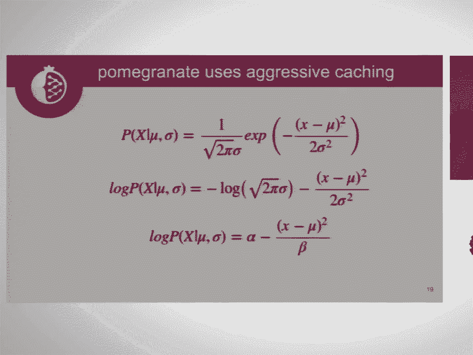

 in our daily life and that is trying to analyze Gossip Girl。 So a few years ago my girlfriend。

 wanted me to watch Gossip Girl with her and from what I could tell it was about a group。

 of angsty teenagers in Manhattan that took turns hooking up with each other and in general。

 just disappointing their parents。 In the background there was this enigmatic figure known as Gossip。

 Girl who sent out these text message blasts at the most inopportune times just to stir， up drama。

 This is drama that of course could be solved if any of the characters talk to。

 each other like human beings instead of you know gazing at each other from a far across。

 a ballroom or glaring at each other to let them know that they're angry at each other。

 So of course naturally I was hooked。 So this was the first blast that was sent out spotted。

 lonely boy can't believe the love of his life has returned if only see knew who he was。

 but everyone knows Serena and everyone is talking wonder what Blair Woda thinks。 Sir there'd。

 be a F。F。 but we always thought Blair's boyfriend Nate had a thing for Serena。 What is shitty。

 thing to say about just like this is over half of the main characters of the show and this。

 Gossip Girl character who presumably is one of the main characters is just dissing them。

 So in a dissing to like you know vagging on whoever this lonely boy character is they're。

 also vagging on Blair's boyfriend Nate for saying that Nate isn't being faithful to his。

 girlfriend。 So the first episode ended with this one。 Why did she leave？ Why did she return？

 Send me all the deets and who am I？ That's the secret I'll never tell the only one。 So。

 at this point I turned to my girlfriend and knocked wanting to let her know that I was。

 actually interested in this type of show。 I said that if she helped me figure out who。

 Gossip Girl is using data science then I would continue watching with her。 So that's， what we did。

 So the first question obviously came up how do we encode these blasts and we。

 figured we'd want to encode these blasts in such a manner that it was either plus one。

 if it furthered someone's agenda at the time or minus one if it went against their agenda。

 at the time and presumably the character who is Gossip Girl is going to be trying to further。

 their own agenda at all points during the show。 So here's an example。 Better lock it。

 down with Nate B。 Clark's ticking。 This clearly isn't supportive of Nate's agenda because。

 Nate is trying to be with Blair but Blair is being non-committal。 So this is you know。

 negative for Blair。 Another one is this just in S and B committing a crime of fashion。 Who。

 doesn't love a five finger discount especially if it's the middle one。 So for those not in。

 the know a five finger discount is stealing。 So this is basically accusing that two of。

 the main characters of theft which works against both of their agendas at the time。

 So you can imagine that at this point you basically have a huge matrix。 Well each one。

 of the characters is a column each one of those corresponds to a blast and you have either。

 plus one or minus one。 So let's take a simple summation in the person with the you know who。

 is most supported by Gossip Girl is Gossip Girl。 Unfortunately that doesn't work out for。

 two reasons。 The first is that no one is unscathed by Gossip Girl that everyone is in the negatives。

 here。 It seems like Blair on the left hand side here is the most negative and so potentially。

 the least likely to be Gossip Girl but Dan， Nate and Vanessa are all tied for most likely。

 to be Gossip Girl under this model。 So we're going to have to use probabilistic modeling。

 in order to snuff out the details of this problem。 So we turn to the beta distribution。

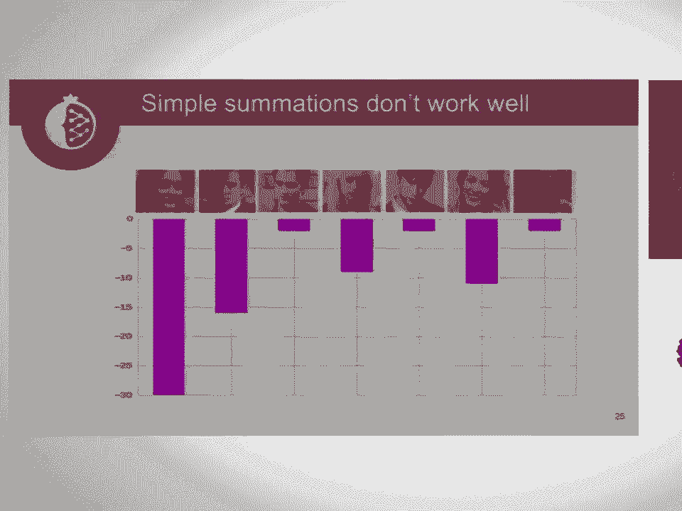

 of course。 The beta distribution essentially represents a probability between zero and。

 one usually modeling rates of things happening。 The canonical example is trying to figure out。

 the probability of a coin coming up heads that if we did this then we would start off。

 with the blue distribution before we've thrown the coin up or down any times。 We don't know。

 anything about it so it's a uniform distribution between zero and one representing the probability。

 of producing heads。 Then we flip the coin twice and we get two tails。 If we use a simple。

 maximum likelihood estimate we're going to say this coin can't produce heads ever because。

 it's only ever produced tails。 That's kind of ignoring the fact that we haven't collected。

 that much data whereas a beta distribution models this nicely by saying that most of the。

 density is about not being able to produce heads but there's still a possibility for。

 it being something else。 Then as soon as we see a single heads the beta distribution。

 does the appropriate thing instead of the most likely thing that it can't produce heads。

 Now there's a zero percent chance that it can't produce heads because you just saw a。

 head it can produce heads。 Then as you collect more data and you get perhaps 25 heads， 25。

 tails this seems to converge as something that looks like a Gaussian distribution around。

 the 50/50 mark in the coin。 So of course we want to model this Gauss-up girl using this。

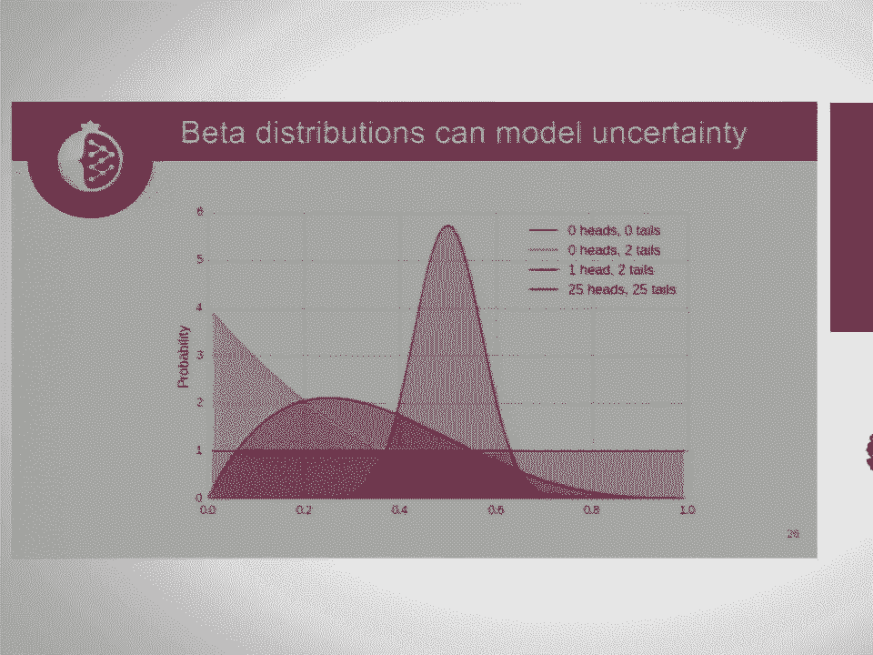

 with the plus ones and minus ones representing the heads and the tails。 After season one this。

 is what our distributions look like with the vertical lines showing our maximum likelihood。

 estimates given the beta distributions。 So it seems like after season one Jenny and。

 Cyann is the least likely to be Gauss-up girl whereas Dan in green is the most likely。

 to be Gauss-up girl。 After four seasons we see the typical things that we would expect。

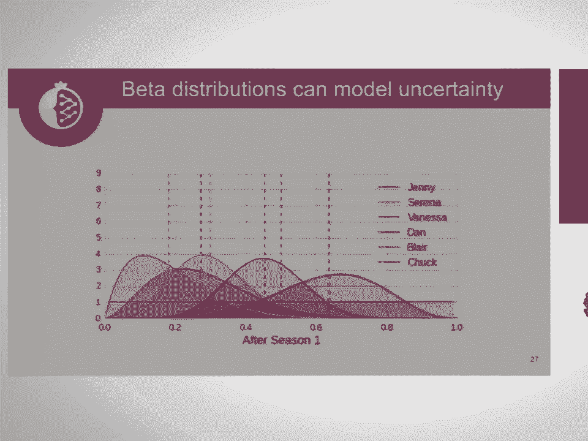

 The first is that these distributions converge as we get more data that the variance of them。

 decreases。 The unfortunate aspect of this is that they all kind of converge together。

 and we are hoping that one of them would go somewhere else。 And this actually matches with。

 the rumors or the Gauss-up per se about the show which is that the producers had no idea。

 who Gauss-up girl is going to be and then suddenly the show got canceled so they had to。

 assign it to one of the characters。 But perhaps they did know what they were doing because。

 spoiler alert according to this model Dan is the most likely to be Gauss-up girl and Dan。

 ultimately ends up being Gauss-up girl。 So this is a reason why you might want to use。

 probabilistic modeling in your life。 Thank you。 So with the time remaining I'm going to。

 go a little bit into a common model that I think that everyone has a little bit of experience。

 with which is naive Bayes。 And essentially this isn't as exciting as Gauss-up girl but essentially。

 what happens is that you can calculate the probability of points using a naive Bayes classifier。

 as the posterior using Bayes rule。 Essentially the posterior equals the likelihood function。

 which you get from like a normal distribution times the prior which represents the class。

 imbalance of the problem divided by some simple normalization。 Naive Bayes makes the assumption。

 though that every feature is independent of every other feature that there's no covariance。

 at all between the features。 And so what you typically get is a decision boundary that。

 looks ellipsoid something like this。 On the left hand side we have pomegranates， naive。

 Bayes and on the right hand side we have scikit learns naive Bayes。 It ends up being some sort。

 of ellipsoid。 Since this is just Gaussian blobs it ends up being spherical where it can be any。

 general ellipsoid。 But let's say that we have data that looks like this where we have segments。

 that come from some sort of time series signal and we want to classify them as either coming。

 from the magenta phenomena or the cyan phenomena。 Well our features don't all follow Gaussian。

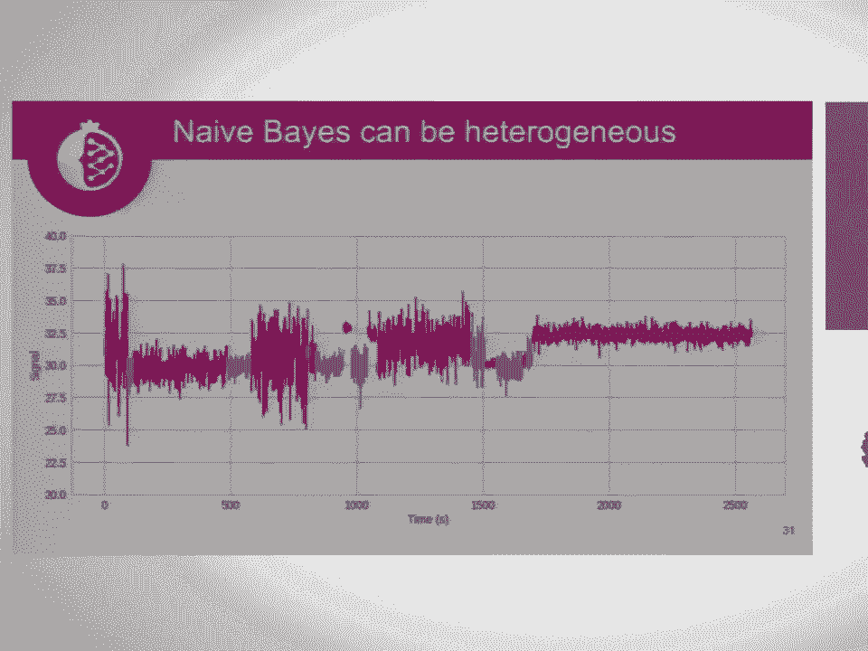

 distributions that the mean probably does but the standard deviation seems like it follows。

 more of a log normal or a gamma distribution and the deviation seems like it definitely。

 follows some sort of exponential distribution。 Simply modeling all of these as Gaussian distributions。

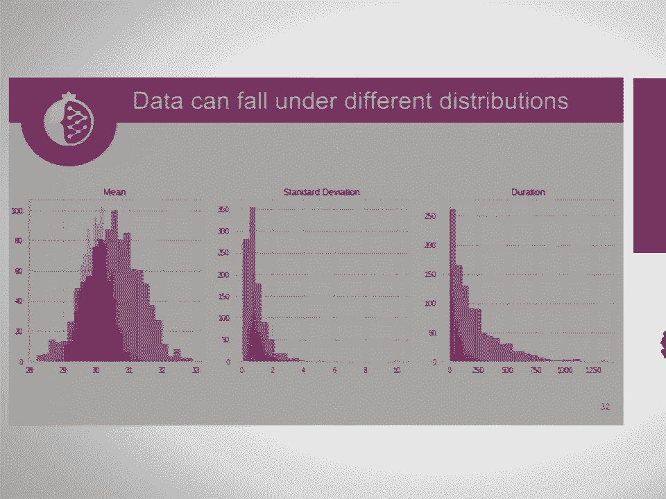

 probably isn't going to be as effective as you would like。 And we can see that just by。

 comparing the first two are implementing naive Bayes， Gaussian naive Bayes using either pomegranate。

 or using scikit learn but in pomegranate we can support different distributions on different。

 features that there's no reason why according to that equation we couldn't because as long。

 as you have some sort of probability function you can just multiply it by each， multiply different。

 probability function across each one of the features。 We can see that by using the normal。

 distribution log normal distribution exponential distribution the appropriate distributions。

 for this task we're able to get around a four to five percent accuracy improvement without。

 getting more data without cleaning the data without doing anything fancy simply by using。

 the appropriate distribution。 This comes at no additional computational cost。 If you compare。

 an increasing size model under pomegranate with an increasing size model on the scikit。

 learn it seems like they basically perform similarly which makes sense because the update。

 steps for naive Bayes are very simple。 So you get this additional flexibility at no。

 computational cost。 But pomegranate goes further and implements general Bayes classifiers。 Like。

 I said naive Bayes has the sum sum that each one of the features is independent from the。

 other features。 There's no reason you have to do that in order to use Bayes wall。 You。

 can't have any arbitrarily complex likelihood function there that has any arbitrary type。

 of covariance matrix。 On the left hand side we see what happened if we try to fit a naive。

 Bayes model to this type of data。 It's not just simple Gaussian and so it doesn't seem。

 like it performs very well。 But if we explicitly model the covariance between the features using。

 the right hand side with a Gaussian distribution with a full covariance matrix instead of a。

 diagonal covariance matrix we get a much better model that seems like it eliminates around。

 half of the errors。 But even further than that there's no reason why you have to use。

 a simple distribution。 You can just use a mixture model as well。 On the left hand side， we have the。

 we basically have this complex data that we might see in the real world where。

 it doesn't fit a single phenomenon very well。 We can see that both of the classes seem like。

 they have several components to them。 And simply modeling it as a single multivariate。

 Gaussian distribution might not be the optimal thing to do。 On the left hand side we have。

 using a single multivariate Gaussian。 On the right hand side we have using a mixture of。

 two multivariate Gaussians for each one of the classes and you essentially get the guy。

 on the fingers can staring back at you。 So to go back to the opening slide。 Pomegran is。

 more flexible than other packages。 It's faster。 I hope that you found it intuitive to use and。

 it can do everything in parallel using the additive， sophisticated statistics that I。

 described at the beginning。 There's documentation available and documentation and an API reference。

 on the read the doc site。 So if you'd like any of the， if you want to read more documentation。

 it's there。 If you want to have a look at tutorials for any one of these models I've。

 written in brief tutorials for all of them and they're available in the tutorials folder。

 on the Pomegranate GitHub。 So I'd like to acknowledge the institutions that I've worked。

 at over the last few years who have provided me with either guidance， knowledge or most。

 importantly travel funding so that I can come here and speak with you。 So thank you。

 I think we have around a few， five minutes for questions。 Yeah。

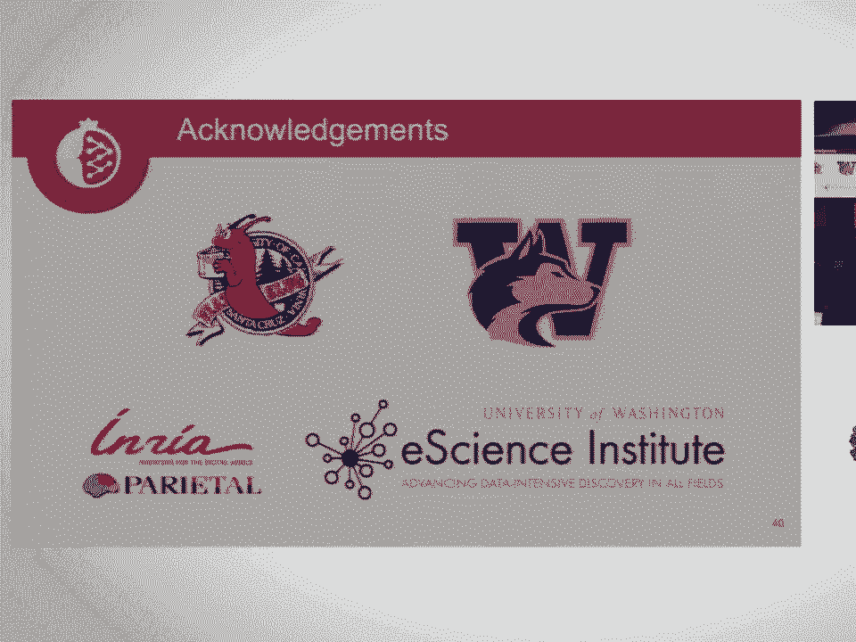

 Yeah。 You're basically asking， does the， article update produce the exact same update that the full fit method does？

 And it does， because of these additive statistics。

 Essentially you are doing the exact same calculations。

 You're just not doing it in the same order as if you do the fit because you're loading。

 up some data and then calculating the update and then loading up some more data as opposed。

 to having to load up all the data and then calculate it。 You get the exact same numbers。

 In fact the back end of Pomegranate the fit function just calls summarize and then from。

 summaries once。 Yeah。 >> What are you using to implement parallelism？ >> I'm using Java。 >> Java。

 >> Yeah。 I'm using multi threading， multi threading oxide and Java。 Yeah。 >> So in your mark of one。

 say you're assuming state to the E， you think you have a state。

 to the E team or if it's a full name？ >> Yeah。 It's a stationary distribution for now。

 >> I think it's a full name。 >> Yeah。 >> Okay。 The second is when you're thinking in this picture using MLAs or micro moment。

 or type of the thing。 >> I'm using MLA。 >> And for the same thing applies for in mark。 >> Right。

 So I'm using expectation maximization followed by MLA on the distribution。 >> At the end。

 for use of the initial condition for me。 >> For initial conditions I use K means。 >> Okay。

 That's the network for those in focus。 >> So it works best for Gaussian but it also has good properties for other distributions。

 because you start off and it performs best for Gaussian but then EM allows it to fit to。

 whatever appropriate distribution you're specifying。

 >> This is true but all models might end up in local minima。 >> Yeah。

 >> Are there any other questions？ >> Yeah。 >> I was curious。

 How's it going back to your client's seat？ >> Yeah。 So this question comes up every time。 >> No。

 it's good because it means a lot of people have the question。

 Essentially they're doing similar things but they aren't identical。

 That I give two good -- two responses to this。 And the first is that Palangana deals formal with discrete latent state but。

 you know， discrete or continuous misin state。 So for example。

 Bayesian networks we have a discrete model。 Whereas PyMC deals with a formal and continuous latent -- where the result is that you need。

 to do sampling based algorithms as opposed to closed form solution。

 The second is that you can essentially think about it that pomegranate models uncertainty。

 in both your prediction -- sorry。 Pomegranate models uncertainty in your predictions。

 PyMC and its friends model uncertainty in， both the predictions and the parameters of the model。

 Yeah。 >> [Inaudible]， >> I think it supports both CUDA and OpenCL。

 I haven't yet tested it which is why I haven't posted a release that has it yet。 Yeah。

 >> [Inaudible]， >> Yeah。 >> [Inaudible]， >> Yeah。 >> [Inaudible]， >> Yeah。 >> [Inaudible]， >> Yeah。

 >> [Inaudible]， >> [Inaudible]， >> Yeah。 >> [Inaudible]， >> [Inaudible]， >> Yeah。 >> [Inaudible]。

 >> [Inaudible]， >> Yeah。 >> [Inaudible]， >> Yeah。 So I haven't encountered that in the data sets live use that have millions of points。

 It is potentially a problem if you have very large Gaussian's。

 I suggest that I have to people is that typically in that situation you can try to normal -- you。

 can normalize your data。 That if all your values are between 10 million and 20 million。

 your values could just as easily， be between， you know， one and two。

 And that would make everything work nicely。 Okay。 Well， thank you。 [ Applause ]， [ Silence ]。

 [ Silence ]， [BLANK_AUDIO]。