# P15：SciPy 2018视频专辑 (P15. Beyond Scraping - How to Use Machine Learning When You_re n - GalileoHua - BV1TE411n7Ny

 I'm Julie Lebau。 I'm going to talk about beyond how to use machine learning when you're not sure where。

 to start。 In particular， how to apply this to the problem of how to extract the publication date of。

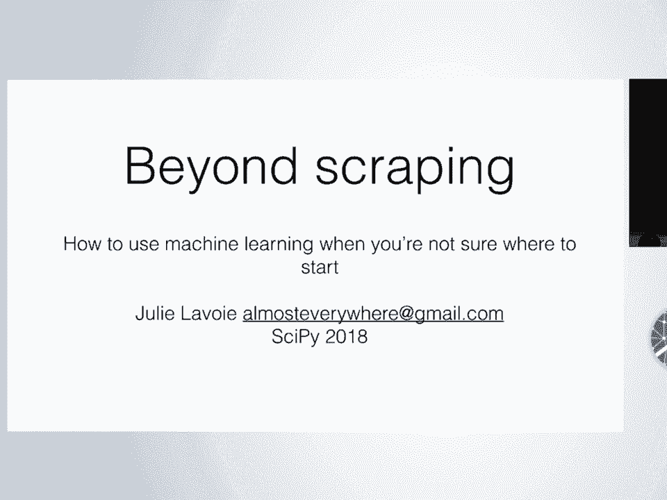

 news articles automatically。

 I'd like to say thanks to SARS Media for letting me speak about work that I did for， them。

 So let's say you want to get the date of one page。

 Like if you've ever done any sort of like web scraping， yes？ >> [INAUDIBLE]， >> Oh， okay。 Can we？

 Okay。 Is this better？ >> Yes。 >> Okay， perfect。 Okay。 If ever you have problems again。

 just let me know。 Okay， cool。 So getting the date of one page is really straightforward， right？

 Let's say you've ever done any scraping。 It's pretty easy to proceed， right？

 You just find the date where it's in the page， use your favorite like DOM inspector or like。

 dev tools， use something like beautiful super whatever and you can really easily get the。

 date out of one page。 This is the New York Times。 I think this might be， I don't know。

 it's Chrome or maybe like Firefox or other things。

 So that's like pretty straightforward。 Then sites typically use templates。

 So if you can extract the date from one page in a site， you can usually get them all。

 I'm like using the keyboard。 Okay。 Extracting the date of a second page is also pretty straightforward。

 So here we have Gizmodo。 You do the same thing， right？ You would write a program that has two cases。

 If it's like New York Times， do this。 If it's Gizmodo， do that。 We do the same thing。

 We see the date is from the first， the 12th of January or whatever。

 You get what kind of like DOM element this thing is in and we just like go。

 I wanted to include the picture but like now I was like oh what if people get upset but。

 he has like really really nice tattoos。 I couldn't put it in the page。 You can't hear？ Oh， that's。

 man， that's hard。 Okay。 Is that better？ Oh man， I can't hold this the whole time。 Sorry。

 I need to do more pushups or something。 Okay。 I'm going to go down here。 Gosh， yeah。

 This is better。 I'm very like mobile so it's going to be tough。 All right。 But let's say， okay。

 so if you want to do the for like one page or two pages， it's really， straightforward。

 I'll just try to speak really loud。 But like， you know， you can do the same thing for like 10 pages。

 15 pages， 15 sites。 You just write a bunch of like case statements， right？ Like if it's like， say。

 I have to do this， if it's like why I do this。 But what about 10，000 sites？

 Are you going to write 10，000 cases？ What about 100，000？

 Like it becomes a different type of problem。

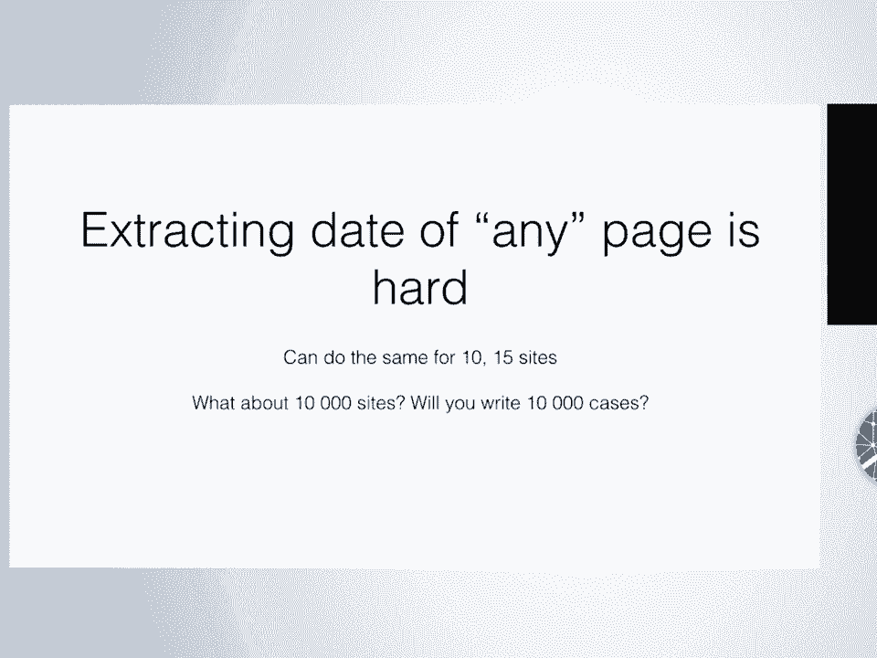

 Well， what now？ So， well， we could get people to do it。

 So we could use something like mechanical Turk。 It has an API。 You can send tasks to real humans。

 It costs maybe like a cent per page or something like that。

 It's pretty cool because you're programming humans， right？ For me。

 I find it very interesting that essentially human cognition in these types of tasks has。

 become just like one sort of part of a bigger competition that's mostly done by machines。

 So that's kind of cool。 The problem is this isn't really scalable， right？

 Let's say you want to process a million or more pages per week。 That's like 10 grand a week。

 It doesn't scale。 And the quality is not the best。 Like let's be， you know， let's be honest。

 For one cent， I'm not putting out my best work either。

 Some foreshadowing is we're going to need this anyways。

 Okay。 Well， what next？ So we could get a programmer to do it。 You can look at the date。

 You can see a pattern。 You write a program。 Come up with some kind of algorithm。

 Let's say you see text that says published。 You extract the date from that。 If you don't find that。

 If you look at for like a div that has a class of like publication date， something like that。

 Solutions like this can be good for approximations。

 But the problem is like patterns can become quickly more complex than a human being can。

 really understand。 Like let's say you take a div that has a class of publication date。 But well。

 what if it's in the comments？ That's not what you want。

 Some foreshadowing is we're going to need this anyways。 Can you guys hear me okay now？ Is it better？

 Okay， good。

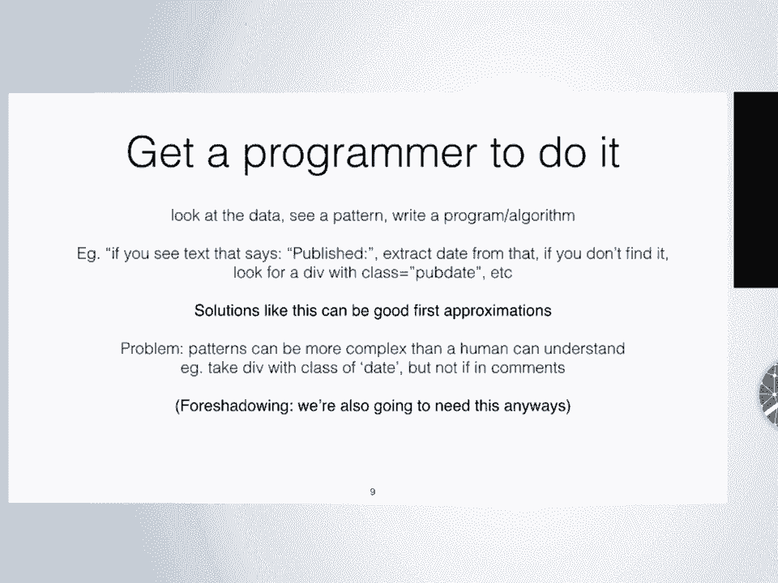

 So okay。 Well， what next？ So we can take out the big guns and we can get machine learning to do it。

 So machine learning is interesting。 Oh man， this like totally stifles me。 I'm just like。

 I don't want to move around。 Okay。 I need like a mic。 That's like here。

 So machine learning is interesting because it can see a pattern that's more complex than。

 human beings can see。 So one thing to note is that machine learning includes both previous solutions。

 So we're going to do what's called supervised learning。

 So we're going to need humans to get examples of pages and crack dates to train the model。

 And we're going to need heuristics to figure out the features to tell the model to pay。

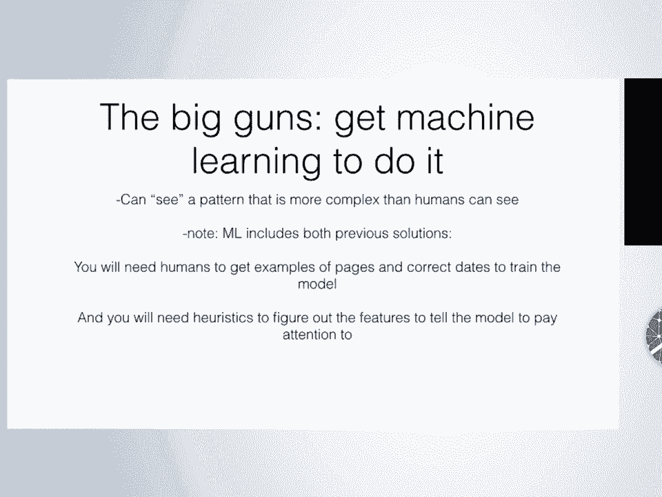

 attention to you。 But machine learning is a giant pain in the， it's an enormous amount of work。

 And we should only really use it if the volume of our data or the problem complexity is too。

 much for the previous solutions。 This is my opinion， obviously。

 So I had a friend who wanted to parse dates and she told me， I was telling her what I。

 was working on and she said， should I hire an intern？ Maybe I should， you know。

 use what you're using。 And asked her， well， how much data do you have？ And she said， well。

 I have 2000 results。 So I said， do you have 2000 total or 2000 every day？ And she said。

 I have 2000 total。 I was like， hmm， for that much data， you should literally just do it yourself。

 Like in the， by hand， like even training an intern or like getting someone else to do， it。

 you're going to have to give them instructions。 You're going to get it wrong。

 You're going to have to clean the data。 It's going to be annoying。

 Like literally just do it by hand。 Like I know sort of like as developers， you think， oh。

 I'm too good to do that kind of thing。 But it's like， hmm， it's honestly。

 it's simpler to do it yourself。

 Oops。 Let's go on with this。 So okay， we've decided to use machine learning。 Where do we start？

 So I think I forgot to mention that this was the first problem at the time。

 This was the first problem in machine learning that I ever worked on。 I had zero experience with it。

 I have a math degree。 I had some like background working on data。

 but I just pretty much hit and I just kind， of got tasked with doing this。

 So of course there's like different ways to think about it。 This is what I did。

 So what I like to do is I like to start by thinking how like this task that I'm trying。

 to conceptualize， how do I think of this as a human， right？

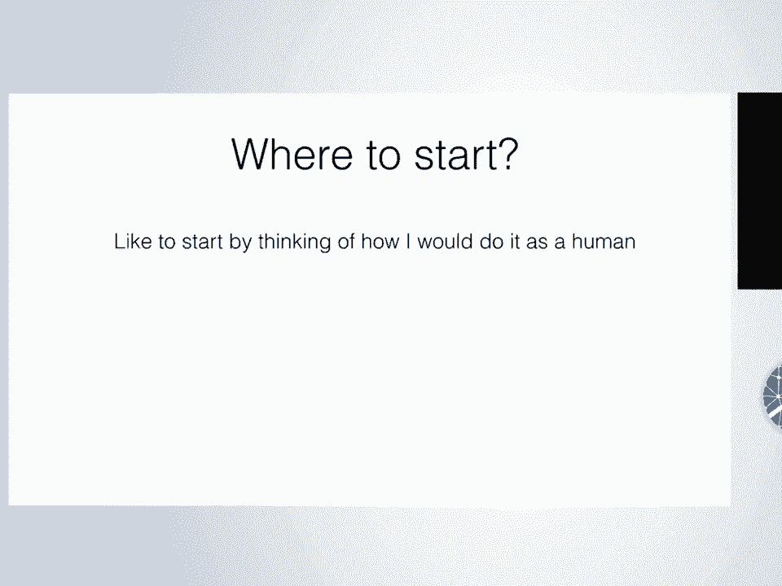

 Before I try to get computers to it。 Well， okay， how do we as humans recognize a publication date。

 right？ Like we've all been like reading since we were kids。 When we look at this， this is from CNN。

 how do we know what's a publication date？ So we see here it says updated 909。

 but we'll go out one stage each 22nd。 So we can see， right。

 the publication date is usually something like close to the title。

 You know something is the title because it's huge。 It's close to the author。

 It's the top of the page。 It looks like a date。 It'll have like date words， numbers， et cetera。

 It's not going to be something that's in the footer。

 It's not going to be something that's in the comments。

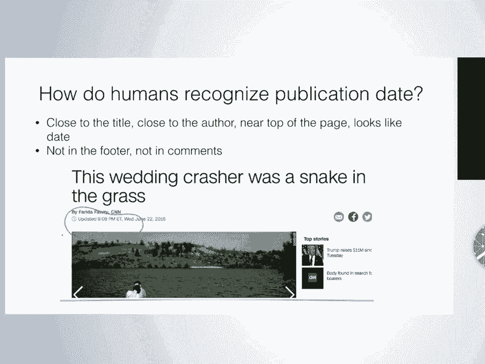

 So there's three different types of cues that we can kind of draw to think about this problem。

 So we have stuff like linguistics cues， like language cues， stuff like updated， published， on。

 et cetera。 We have rendering， presentation cues。 So it's near the top。 It's close to the title。

 close to the author。 If you're someone that was like in web design school or graphic design school。

 they would， teach you these graphical cues， right？

 They would say stuff that's bigger is more important。 Things that are close together。

 usually related。 Things that are the same in repetition or like comments are probably want like a repetition。

 of something that is the same in an enumeration。 So people are taught to speak in this sort of graphical language。

 And we also kind of， since we've been reading， since we were young， instinctively kind of。

 are trained to read this， to know this。 And oh man。 And so we also we have markup cues。

 So typically things that are not really read by humans but are significant to us as developers。

 So things like it's an endib that has a class of pub day。 It's in a time tag。

 It's in like it's a markup that's kind of accompanying the information that will be read。

 by the brat and rendered by the browser。

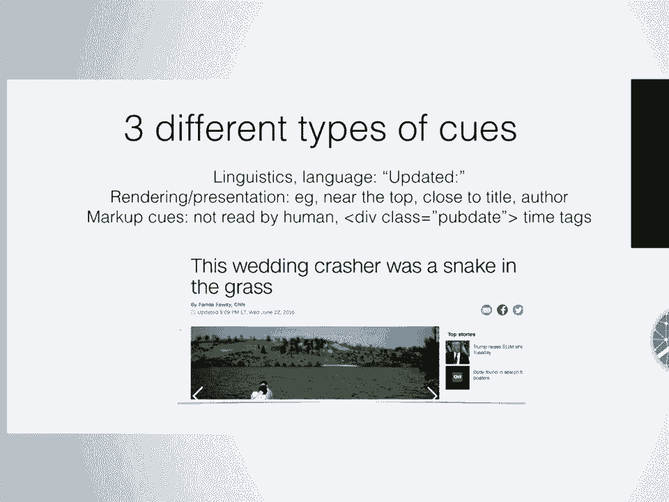

 So these cues are so strong that usually even in a language that we don't necessarily speak。

 we can typically figure out the information。 And so an example of this is I really like cooking Korean food。

 I'm not Korean。 But I have this Korean roommate and he was a terrible roommate。

 But the one good thing he did for me is he set me up with this website where I could order。

 Korean groceries online。 That was usually mostly all Korean people because they would come to my house and deliver。

 And whenever I move， the guy would be like， "Who are you？"， He would just like always freak out。

 But basically the cues are so strong。 I don't speak Korean。 I don't read Korean。

 And it was like a site that had pictures so you couldn't really use Google Chrome to translate。

 But basically these cues of where you put stuff in a basket， where you add things， they're。

 so strong that I have no idea what's going on with anything in Korean。

 But I was able to order groceries and have them delivered to my house， put it in my dress。

 all that stuff， all in Korean。 So， oh， it's all free to come out in。

 So this is a Japanese publication。 And I think the article is about some kind of volcanic corruption。

 Of course， if you speak Japanese or you're trying new characters， it's probably easy， for you。

 But let's say for the rest of us， I have another example for you if that's the case。

 Let's try to figure out where this is。 I think I can show this is like a laser。

 I don't know how to do a laser。 Oh my God。 Okay， never mind。

 So we can kind of see quickly the menu bar。 Like， on top is probably a menu bar。

 We see the social sharing stuff like Facebook， et cetera。 It's like pretty straightforward。

 the pictures。 We're going to take a wall guess at this kind of huge。

 this bigger size text is going to， be the title， right？ And then under that。

 we see between that and the social media， we see 2018， five numbers。

 Let's take a wall guess and say this is probably the publication date of this article， even。

 though probably a great part of us don't read Japanese， right？ And so here's an even harder example。

 This is Thai。 And so to make things more complicated， in Thailand。

 they don't use the Christian year， which， is based on like when Jesus was born。

 They use the Buddhist year， which is based on an oil shift。

 It's like when Buddha was born or when Buddha was enlightened。

 So it's not like the year 20 something in Thailand。 It's the year 25 something。

 And they also use the， like they don't use AMPM。 They use the 24 hour date。

 which you probably don't use here unless maybe you're in the， military， I think。 But even then。

 like let's check this out， right？ You have this title， we're going to take a wall guess。

 This big text is the title。 There's a picture of a bunch of cats。

 I don't really know what they're doing。 There's some like ads。 The Facebook， et cetera。

 is pretty straightforward。 And we see some like under the big text， we see 2561 and then 1702。

 Let's take a wall guess and say this is probably why this article is published。 Okay。

 So now we've thought a little bit about how do we as human beings think about this task。

 So let's bring it back to machine learning， right？ So in my opinion， at least for me。

 the hardest part of machine learning is how do you set。

 up the problem in a way that machine learning can answer。

 So it's kind of like what people say about jokes。 You set them up and I knock them down。

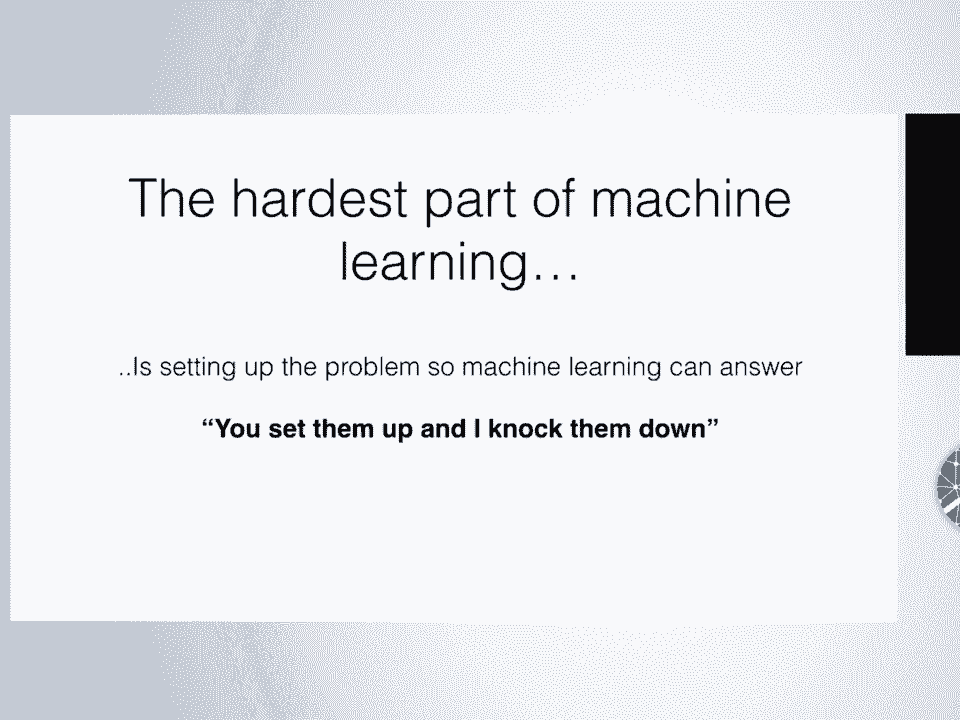

 It's like you have to set up the problem in a way that machine learning is able to knock， it down。

 So for me， at the time， I was like， I had no idea what I was doing。

 And I was really helped by the fact that this CTI was working with， found this research。

 paper and this is what I ended up implementing。 As a side note。

 I do not recommend implementing a research paper and machine learning as your。

 first project。 This was not super straightforward。 So just to give some terminology。

 if you haven't dealt with this before， we're going。

 to do what's called supervised learning and we're going to phrase it in terms of a classification。

 problem。 So supervised learning is we need people to look at pages and say this is when this article。

 is published。 And then classification means -- so this part is a little bit tricky in the sense of it's。

 not enough to say what's a publication in this article。 It's kind of like too vague。

 There's not really a lot in there for machine learning to kind of grab onto。

 Instead we're going to phrase it in terms of does this DOM element contain the publication。

 date for this article or not？ So we're classifying DOM elements and saying we're labeling them what this has the publication。

 date or this doesn't have the publication date。 So that's how we're going to phrase it。

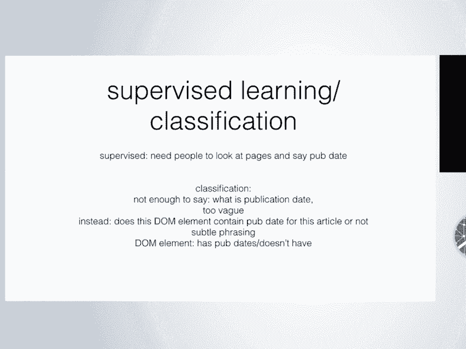

 It's a little bit weird and it's based on how the paper did it essentially。 So okay。

 so just to give you the steps， if this is going to make sense， don't worry。

 I'm just going to go over these in detail。 I'll just give you an idea of what we did。

 So we're going to -- we're going to start by training a model and then we're going to。

 show how to use a model in production。 So to train the model。

 we're going to do is we're going to get some data。

 The data is going to look like HTML and the publication date for it。

 We're going to -- for each of these pages we're going to get the DOM elements and the page。

 that contain a date， which is kind of a little bit this weird intermediate step because the。

 problem is weird。 We're going to calculate features on all of the -- I say chunk because I just get tired。

 of saying DOM element。 That's just like my mental， like， way to think about it。 On all of these。

 like DOM elements， it's going to be stuff like doesn't contain publish。

 it's going to contain a link and then we're going to train the model。

 So let's go over these in more detail。 So step one is getting data。

 So I like this picture because when I started working on these data problems， this is how， I felt。

 I felt like you see this whale， it's kind of a whale， they swim in the ocean and like。

 fish just come into their mouth。 They just need to swim around and eat fish。

 It's like you need to get a whole bunch of data。

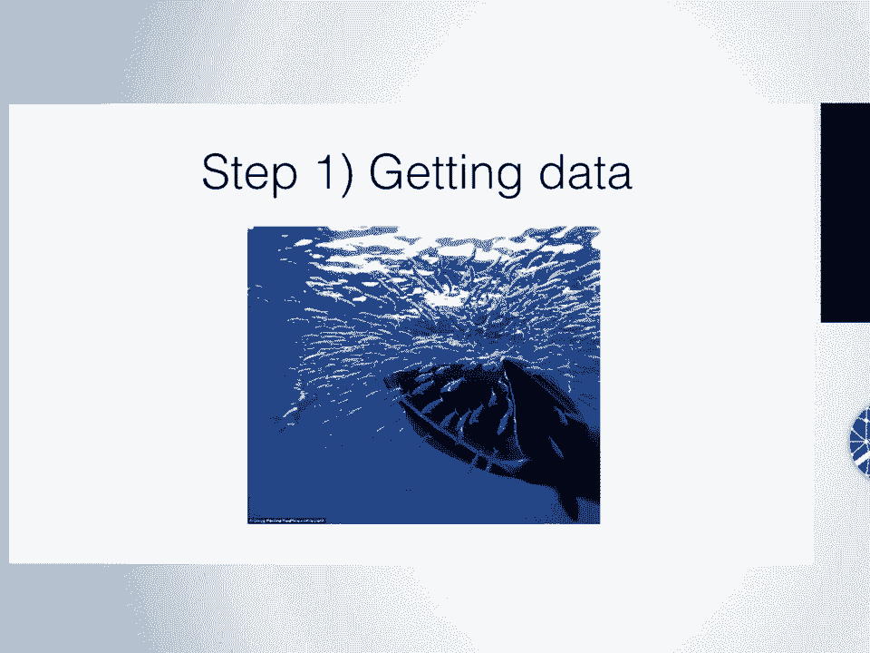

 So I don't just like this picture。 And so if we want our problem to go well。

 we want to start by having a bunch of useful， and correct data。

 So I like this quote that shows that this has been a problem of a very long time。

 This is from Charles Babbage， the father of computer science。 And people ask him， Mr。 Babbage。

 if you put into the machine the wrong figures， will， the right answers come out？

 And this is how I feel when people ask me like really dumb questions sometimes。

 It's like I'm not able to rightly apprehend the kind of confusion ideas that could lead。

 to such a question。 This is kind of like -- this is kind of like saying WTF， like， in 1860， right？

 Like， what's even going on？ So you can see it。 So ever since the beginning of computer science。

 this has been an important part of solving。

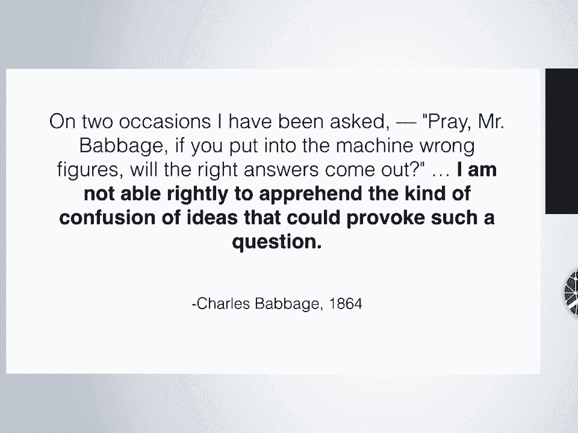

 problems。 So step one is， okay， we need to get some data。 So for this problem。

 what it looked like is I got like this massive CSV， with like a whole， bunch of URLs。

 I got some people on ODAS to look at the page and enter the date in the CSV。

 It was really like a CSV look like this。 Now the URL， it had a publication date。

 I've done all these pages。 I used training data。 People are often wrong。

 So what I ended up doing is I got three people to fill out copies of the same thing， and then。

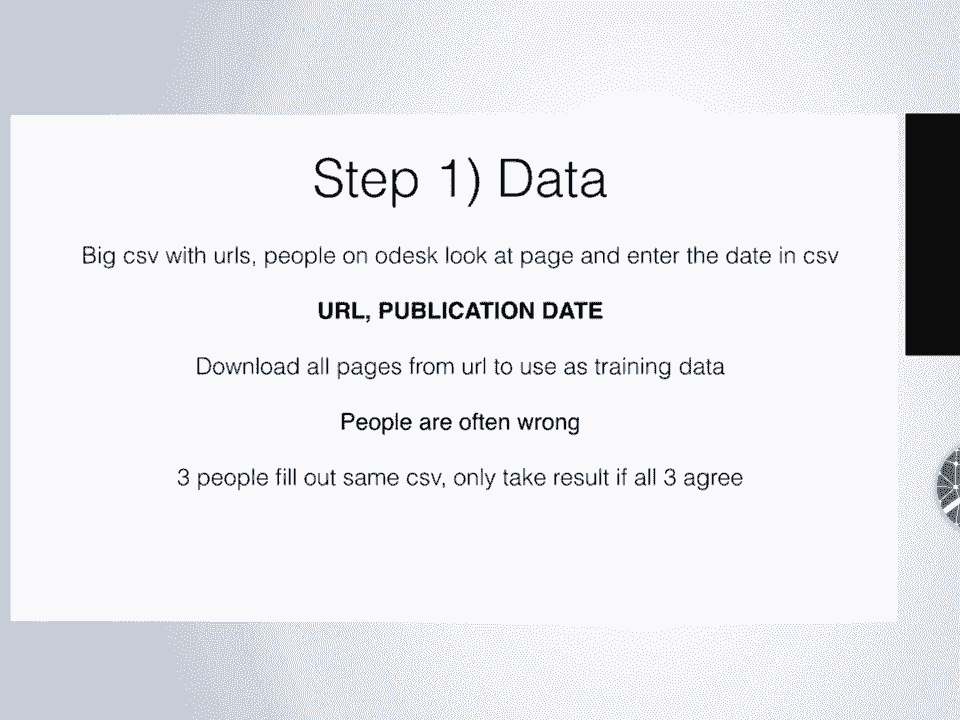

 I only took the result， they followed them and agreed。

 I quickly became familiar with the fact that the more data you're dealing with， the more。

 problems you have。 So here are just examples of how this all went wrong。 After -- it's like。

 who is it？ He was like， everyone has a plan until they get punched in the face。 That's exactly it。

 It's exactly like working on anything。 So I hope that wasn't like too violent。

 I just like that quote。 So basically here are examples of things that went wrong。

 So basically people entered the current publication dates in the CSV and then the web page goes。

 for it。 So we can't find it anymore。 Then when I try to download it， there's no data。

 So of course the thing is wrong。 Articles have publication dates when you look at them in the browser。

 So when people go and look at stuff， there's something they see。

 But then it's something that uses React or some other framework where it needs to be run。

 and buy a browser to have any data。 So then of course when I just download it with requests。

 there's nothing。 Just UTF-8 errors。 I hate UTF-8 with a 5，000 signs。 I hate it so much。

 I can give a whole talk on how much I hate UTF-8。 I'm not even exaggerating。

 Sorry if you've worked on UTF-8。 I'm sure you're a great person。 I just hate UTF-8。 I'm working out。

 I have a problem with UTF-8 right now and I hate it so much。

 So I tell people to write non-applicable if it's some article。

 It's like stock quotes or stuff that's not a news article。

 And then they misspell it in every possible iteration of enumeration of how to misspell， this。

 And they understand everything backwards。 So then I have to go and look at all of these and find all the misspellings of this and take。

 all of those out。 And so the problem with this is I tell people to do that so that I don't ignore that result。

 but then they misspell it so then I don't ignore it so it messes up the data。

 And then people just enter in correct results because they make a mistake or they just。

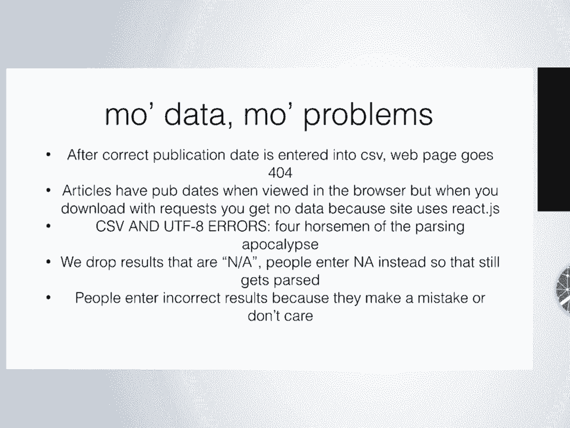

 not care。 Okay， so feature selection。 So a lot of people say feature selection is the hardest part of machine learning。

 I was really helped by the fact that the paper just listed all the features that they use。

 so that's what I implemented。 It's also a good reason why it's a good idea to start with heuristics if you don't have。

 such a handy thing to follow because a lot of features can come from there because heuristics。

 will tell you patterns that are important just maybe not in what degree or so on but。

 it still gives you an idea of like these are things that might be important to pay attention。

 to you。 So examples of features for this problem were contains the word posted， contains the word。

 modified， contains the words published， what's the header level， is it a link， is it bold， or not。

 stuff like pixel distance from the top of the page， pixel distance from the title。

 You can kind of guess like we were looking at as humans these things would correlate， right？

 We're just not sure like to what extent and which ones more， et cetera， et cetera。

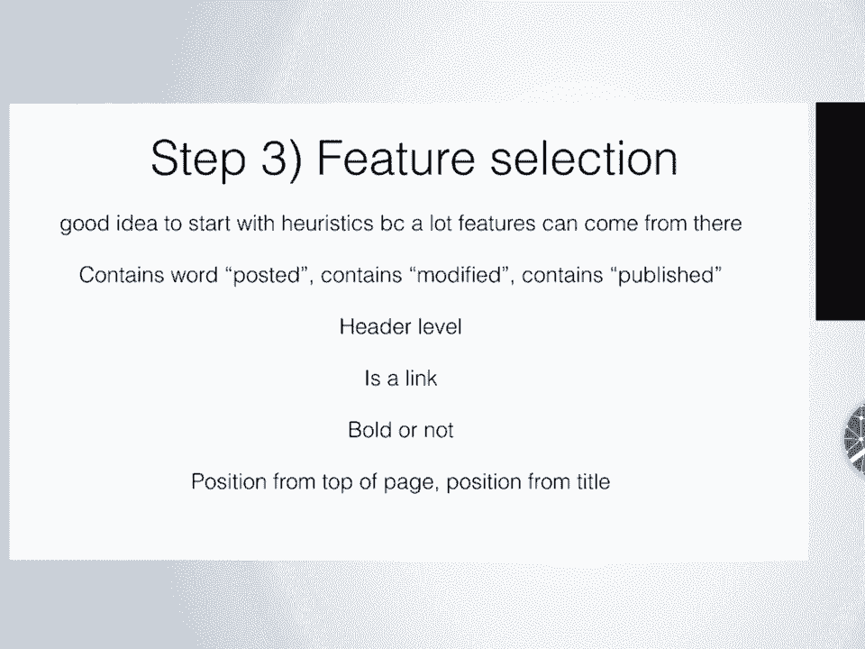

 So next step training the model。 So if you don't allow machine learning just going to laugh at me like this was really。

 my first attempt at this type of thing but it goes to show you like you can kind of not。

 know what you're doing and it still works out great。 Like this thing is in production。

 it makes us money， like it works pretty well。 Basically I ended up using NLTK and naive bays。

 You can use scikit learn of course which is kind of more sophisticated but I still like。

 NLTK for kind of text based tasks personally。 I'm sure there's like a million better solutions in this。

 I think the paper used SVI as an algorithm but for me at the time this was the easiest one。

 to understand。 And my algorithm on what to do and what to use was I looked at the NLTK tutorial and。

 I'm like okay I understand what to do and I looked at scikit learn to do。

 I'm like I have no idea what is even going on with this thing。 Like excuse me。

 sorry to any scikit learn developers but at the time it was very obscure。

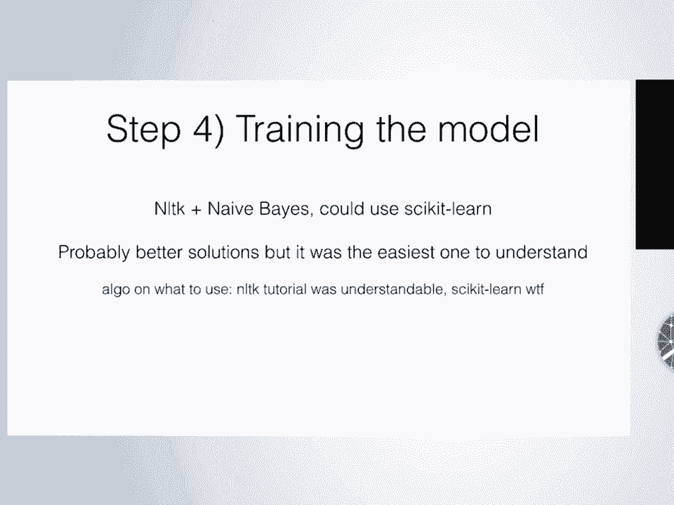

 to me。 And so I don't know if this ever happened to you guys。

 It's like you're trying to learn something new and you sort of like new technique。

 You're like oh I'm doing this tutorial。 This is great。 I totally understand what's going on。

 I feel awesome about my new found knowledge and then any sort of like。

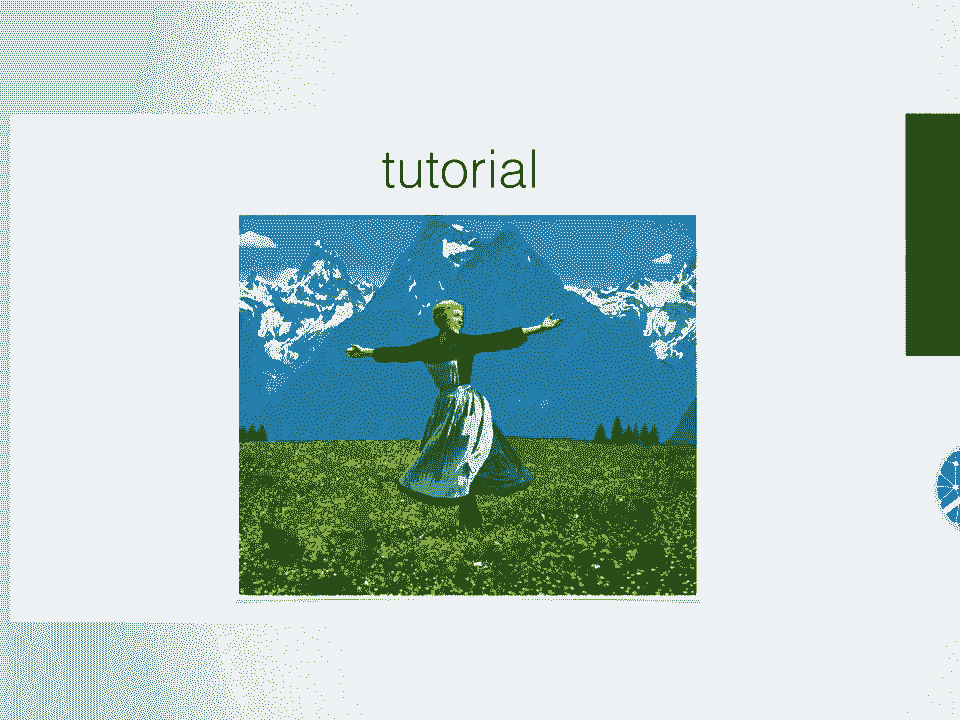

 Yes， like the NLTK tutorial did not prepare me for my actual problem。 Let's just say。

 So I love this problem。 It was very interesting but that is definitely how I felt at the time。

 It was definitely like a challenge。 So I'm guessing I'm not the only one that's had this problem。

 So okay， so now our model is trained and now we can use in production。

 So there's a few more steps because the model can answer the question of does this DOM element。

 contain the publication date for this page but a problem is actually what's the publication。

 date for this page。

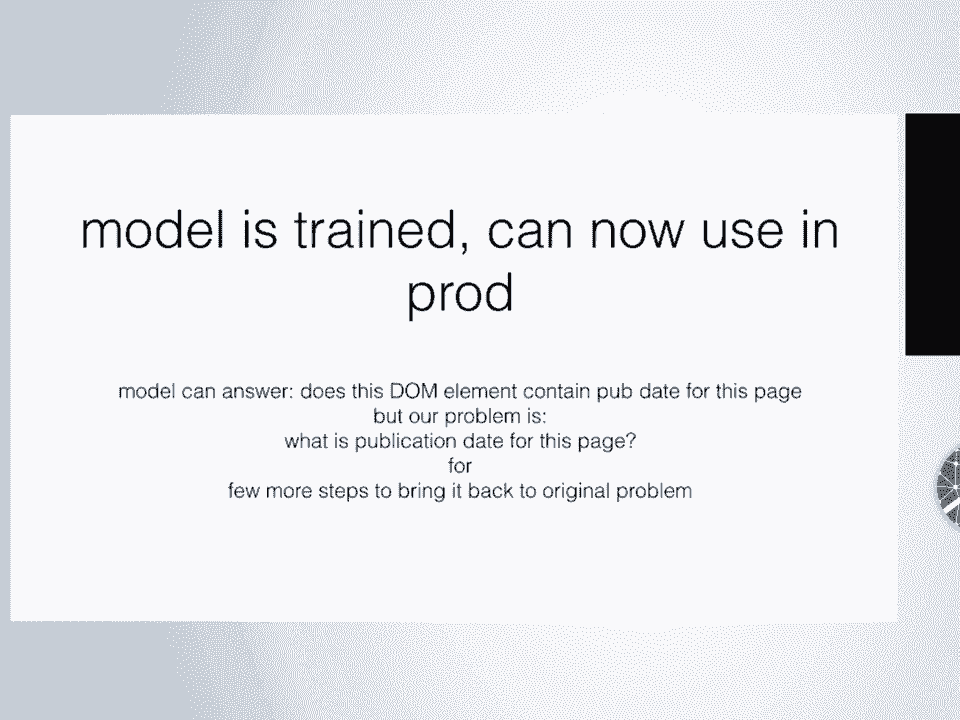

 So we need to kind of do a few more steps to bring it back in terms of our original problem。

 So just to quickly go over this， how do you use our model in production。 Let's say we get a page。

 we're going to split this page into DOM elements and contain the， date， right？

 We're going to extract all the DOM elements of the container date。

 We're going to calculate the features on each of these DOM elements。 Again。

 I see chunks that mean DOM elements， just my own shorthand。

 We're going to pass this feature vector to the train classifier。 We're going to get a label。

 And then these are the kind of last few steps we need to do。

 Let's say you have a few DOM elements that get labeled as yes， this has the publication， date。

 What do we do？ How do we disambiguate this？ And then extracting the date from the DOM elements not that hard。

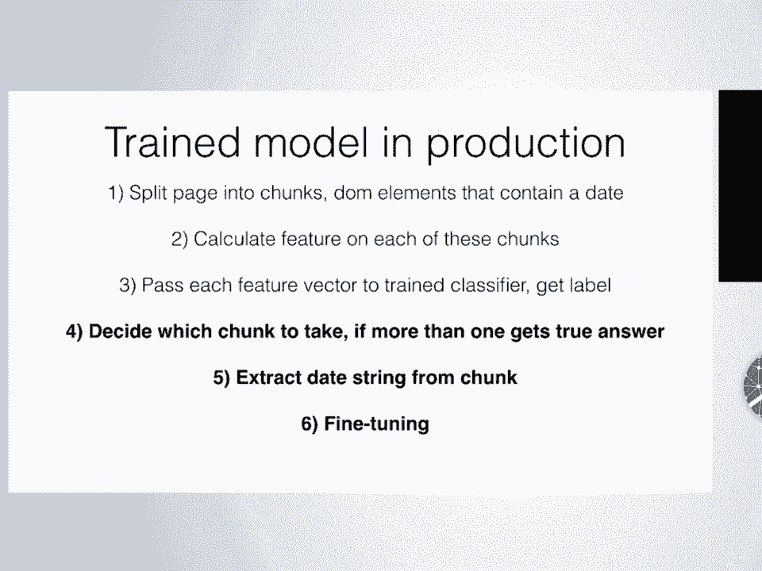

 And then some fine-tuning。 So okay， let's say we get 10 DOM elements that have the date that get labeled as yes。

 this， has the date。 Or three， some of them， I mean。

 it's going to cost us having the date more than one。 How do we decide what chunk they take？

 So I decided I just tried a whole bunch of different stuff。 I tested how accurate things were。

 And it turns out I just picked the first one， which probably is just because it correlates。

 with being at the top of the page， which is the most likely thing。

 Extracting the date from the DOM element is a string。 It's pretty straightforward。 As you remember。

 we're also using the HTML and all the markup and all that stuff。

 But we don't really need it in the end， right？ We just want the string。

 We don't want to say this is published on L。 Like list element class equals a blah blah。

 We just use regular expressions to get out of there。

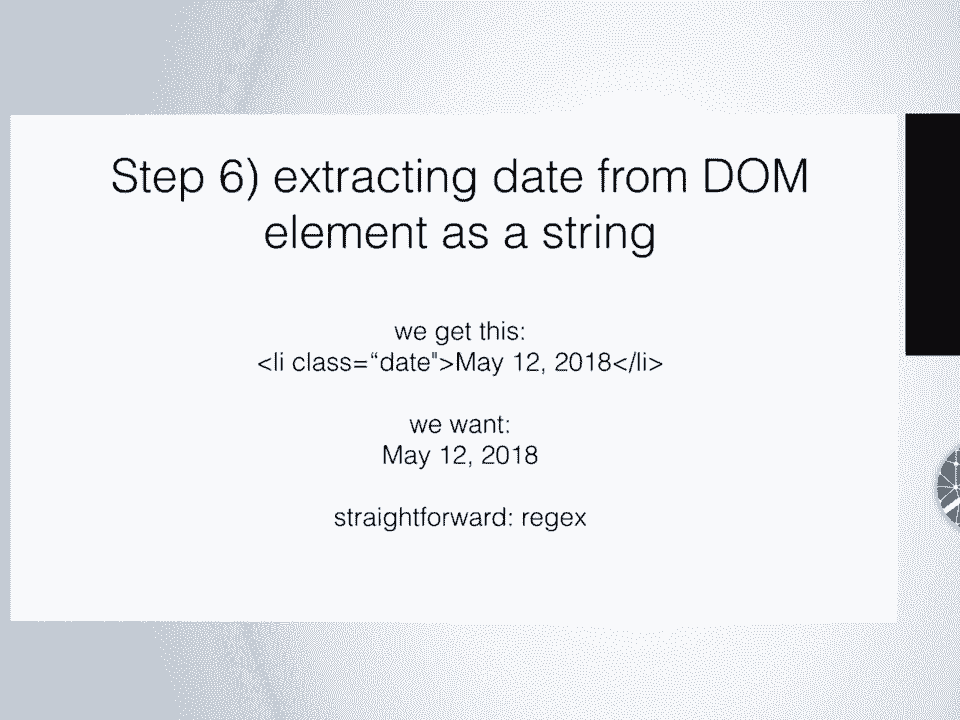

 And so fine-tuning。 This is kind of like a D。I。 and looking at the whole solution。

 What I ended up doing to improve the overall thing was I did a whole bunch of pre-filtering。

 So I ditched DOM elements that lead to false positives。 So like comments。 I just ignore them。

 Five minutes？ Okay， cool。 Comments。 I ignore the footer。 I ignore the JavaScript。

 It has false positives because it has the library publication， like the date for that。

 version of the library。 I do post filtering。 So our move results are wrong。

 So dates are in a future dates in the past。 One got you with that is that publications like New York Times now put historical articles。

 online。 So it is a legit article that is from the 1800s。 They've digitized a ton of stuff。

 So I had to go back and put the cut off to be like ignore stuff from before 1600 or something。

 like that。 Probably to be really safe I should use maybe the beginning of the printing process or something。

 like that or first like newspapers。 But it works well enough， right？ And then hacks。

 So this was just like a blatant hack which of course after doing all of this work， this。

 is when I found out about it， if there's a day in the URL literally just ignore everything。

 I just said all of this work and just take it from the URL。 I'm not joking。

 I probably should actually just test what's the accuracy of just doing that and doing nothing， else。

 But I don't want to know。 I think that would just be depressing to be honest。

 But just this hack was like a 10% increase in accuracy not of the model of the overall， solution。

 So that was like non-trivial actually。 But of course like a lot of these problems it's like you kind of。

 I think in French we， have a saying that's like lepsy vin en amor gens。 It doesn't quite。

 it sort of means like you kind of learn by doing it。

 Like if I hadn't worked on this problem I would have never found this hack。

 It's not like for minute one I would have thought about this and then say myself a ton。

 of time right to kind of learn as you go along。 It's not quite the meaning of the French saying but anyways it's kind of like a bit like this。

 So yeah that was a 10% increase of the overall like accuracy of the whole solution。

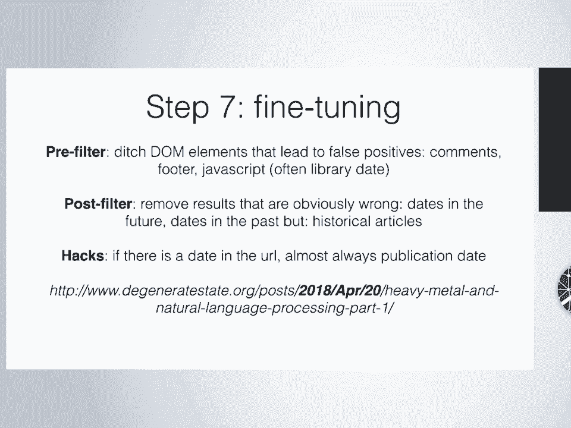

 So results。 So this with a very like you know somewhat naive approach we could say has an 88% precision。

 I'm kind of hand waving here on article sample from basically half a million different publications。

 But people itself had 96% precision on their research data sets are not completely comparing。

 apples oranges sorry apples apples and their data set like had like half Chinese and half。

 English I think。 And so there are several reasons why for this。

 So I think I'm smart hopefully that's true。 I'm not five professors of machine learning。

 That's just a fact you know。 They use SVM which I think probably would perform better for this problem but I just couldn't。

 figure out how to make it work at the time。

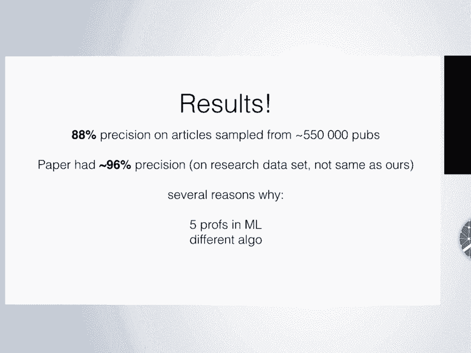

 And then a lot of them some other differences are differences between production and research。

 problems。 So one thing that I didn't implement was a lot of these headless browsers features using。

 things like Calc King the pixel distance from the top from the from the from the author。

 Because it just for us it ended up being too much of a performance hit and we decided not。

 to do it for production parsing。 So that's kind of one difference right it's like you're parsing like hundreds of thousands。

 if not more。 And then you just leave the thing and then you just get the result at the end right。

 Another thing was that I cared more about avoiding false positives so if I wasn't sure。

 about the answer I just returned nothing versus you know getting caring about just getting。

 the exact result at the end。 Okay I'm running out of time so I'm going to speak fast。

 So at the time when I was working on this I was only one I knew working with data。

 I knew bounce ideas off the CTO but he also had no experience with this even though he's。

 a pretty smart guy。 And I had these problems that my friends and web development didn't have right。

 So I watched a lot of like pi data type talks to try to understand like best practices so。

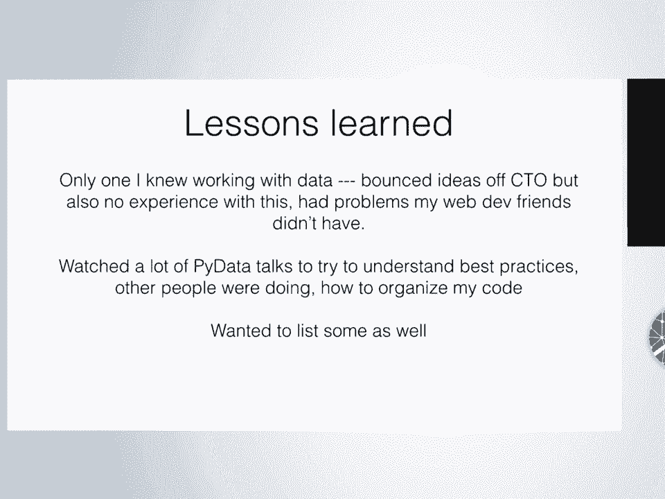

 how to organize my code how to think about my problems。 I just want to quickly list some as well。

 One thing I found really useful was which I didn't do at the time was before you kind。

 of set up these like huge data pipelines for these problems just go through the whole process。

 with a small set of data to make sure stuff is like gets passed in the correct format from。

 one like spot from one kind of like process to another。

 I didn't do this and of course I had to write like a ton of code to like then take all。

 my data transform into a different format。 I was just oh my god。

 With respect to if you ever need to like give people like CSV's to fill out spreadsheets。

 I give examples now I just like fill out you know like they say show them don't tell them。

 I just like fill out a bunch of results and give it to people often English is not the。

 first language of people that do these crowdsourcing tasks so I find it's like really better to。

 give like really clear instructions don't use slang don't use idioms like just be as。

 like simple and clear as possible。

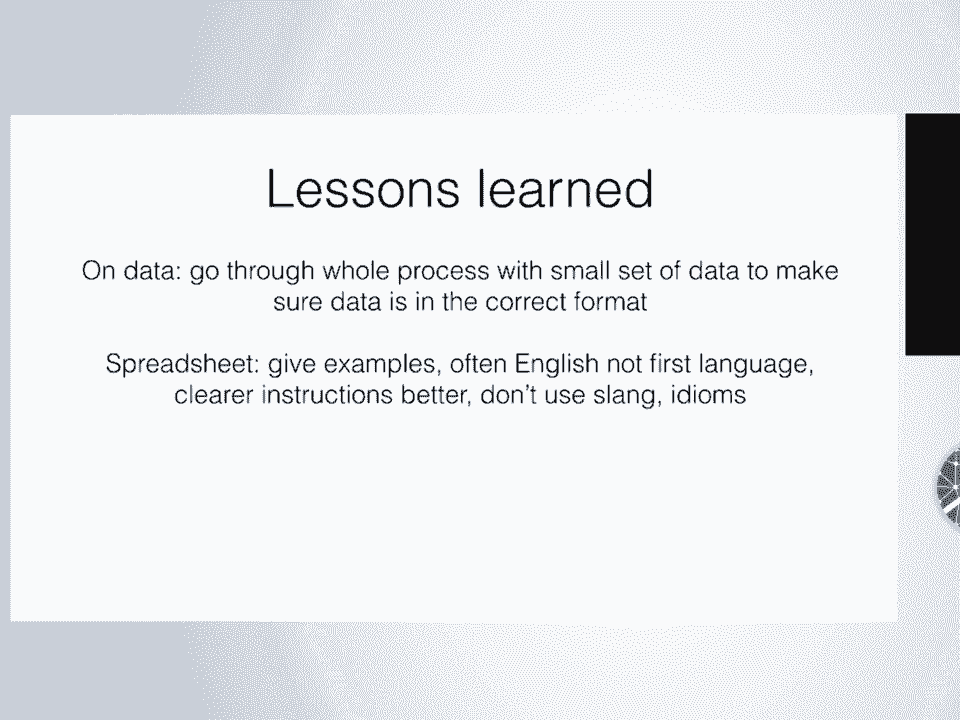

 I found it really useful and I'm still studying this problem to be honest I find it's at least。

 in my opinion not as mature as like say integration testing or unit test or whatever for like。

 say web applications but basically I tried to write tools to look at the data pipeline。

 at each stage gotcha。 So let's say okay I'll let people like maybe read this later but I just found this was like。

 a really important thing so I could easily pinpoint where something is going wrong versus。

 okay something's wrong I don't know where。

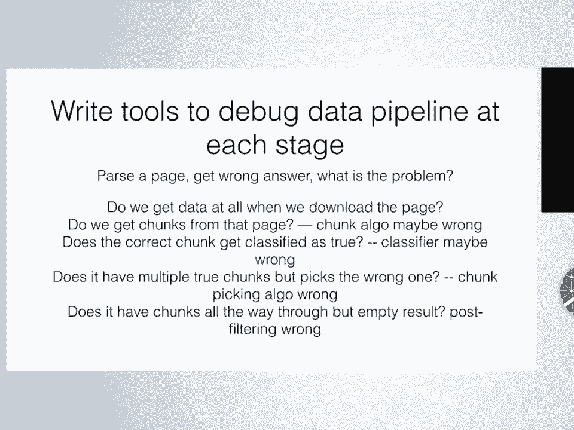

 So just finally one thing that I found I had to change my thinking for working on a。

 type of problem is that machine learning or these types of problems in general is sort。

 of about thinking statistically versus algorithmically let's have 100 pages 99 will have the data。

 at the top right and one will be at the bottom for some inexplicable reason if you write something。

 that's correct for 99 pages you're probably just gonna get that one wrong right because。

 it's like you can't really write something that works super well for both but that's much。

 better than getting one correct in 99 wrong right and so like if you had a sort of traditional。

 computer science background you know you make you write a bunch of test cases for things。

 it's like if you have some edge case where it's wrong your thing is just wrong right。

 you fail to take into account some situation where's here it's kind of a search for what's。

 right most of the time and you try to like push up that most versus something that's。

 algorithmically correct because that's impossible where one wrong thing is a bog in your algorithm。

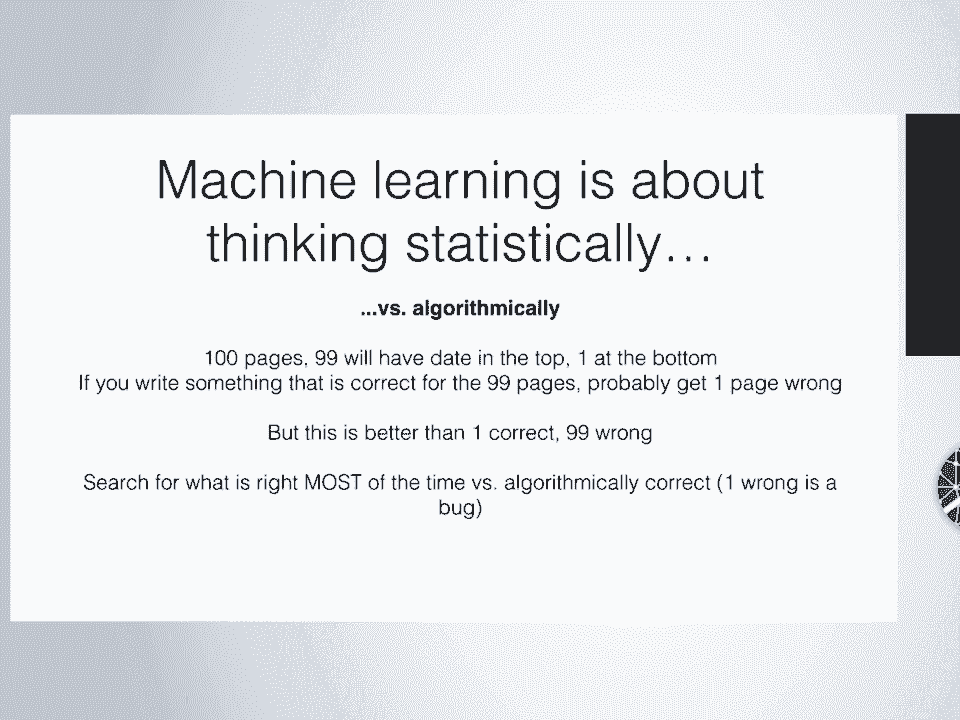

 is wrong you have to start over gotcha okay so thanks to all these people talk to me a。

 lot to me later sorry people well thanks you guys you can come talk to me in the hallway。

 about QA you can come talk to me yourself you're working on and if you're a startup and you。

 have problems you can come talk to me as well thank you， you。 (Applause)， [BLANK_AUDIO]。

