# P25：SciPy 2018视频专辑 (P25. Practical Applications of Astropy _ SciPy 2018 _ David Shup - GalileoHua - BV1TE411n7Ny

 Today I'm going to tell you about some applications of Astropie， in two production environments。

 because I think Astropie is， something that a lot of astronomers use interactively。

 So first I'd like to ask how many people here have an astronomy。

 background or have used Astropie to raise your hand？ Oh great， okay。

 there's a lot more of you here than I had thought。 But let me explain what is Astropie。

 So the Astropie project is a community-driven effort。

 to gather together functionality that's useful for astronomers。

 And that consists of a core package of basic functionality。

 And there's also an extended ecosystem of affiliated packages。

 that have to meet certain standards to be able to be qualified， to be called affiliated packages。

 And there are a number many of the Astropie sub-packages are， relevant for this talk。 There's iO。

FITS for the flexible image transport standard， that is used commonly in astronomy。

 Table coordinates， WCS stands for world coordinate system when we map。

 pixels to celestial coordinates on the sky。 Units and constants。

 and I'll say I'm now a maintainer for astropie。constants。 I finally made it onto the team。

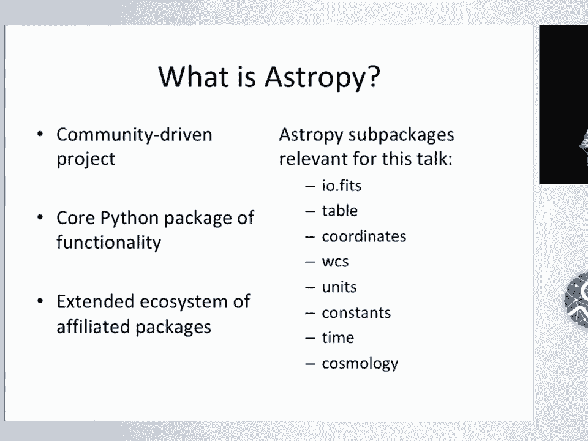

 Astropie。time and cosmology。 So in this talk， I'm going to introduce you to the Zwicky Transient Facility or ZTF。

 I'll talk about how we've used Astropie， particularly to solve problems in ZTF， astrometry。

 I'll tell you what lessons we've learned from using it。

 And then I wanted to cover some other aspects of Astropie。

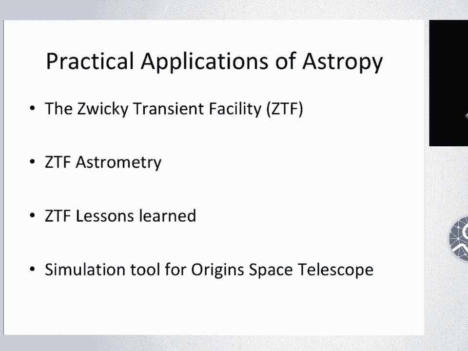

 in a simulation tool for the origin space telescope。

 So ZTF is a survey that's just gotten underway in the last three months。

 We started commissioning last October。

 We started the survey on March 17th， and we're now releasing。

 public alerts from the public part of the survey as of June 4th。

 So it's a robotic survey that's being conducted at Palomar Observatory in Southern California。

 On a long winter's night， we get up to 750 exposures per night。

 It's 47 square degrees in each exposure。

 And we have 16 CCDs that are each 6，000 by 6，000 each with four readouts。

 So we have a 650 megapixel camera that covers a huge field of view。

 We process tens of thousands of images per night。

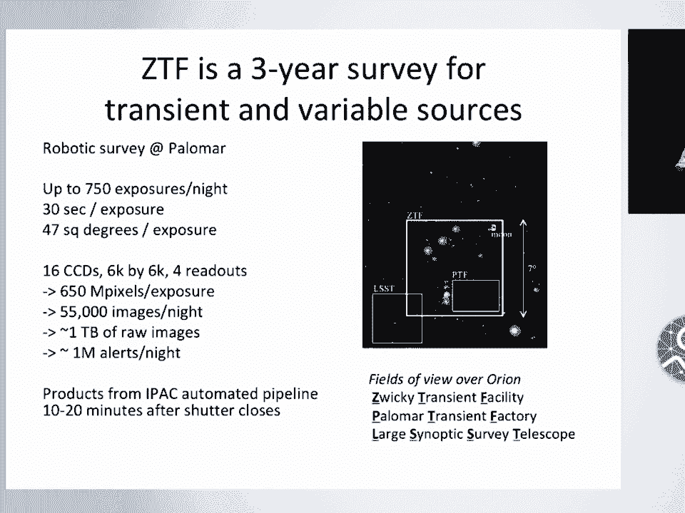

 The raw image data is about a terabyte of raw images per night。

 And we're producing already hundreds of thousands up to a million alerts per night。

 And this all runs in a lights out automated fashion at IPAC。

 the IPAC data center on the Caltech campus。 And we get 95% of the images through within 10 minutes after the shutter closes on the mountain。

 So it's transferred by microwave link down to San Diego and then up to Caltech。

 And on the right here are fields of view for various surveys overlaid over Orion。

 So you get a scale of how big this is with the full moon in the corner up there。

 ZTF is the Zwicky Transient Facility。 That's our new camera。

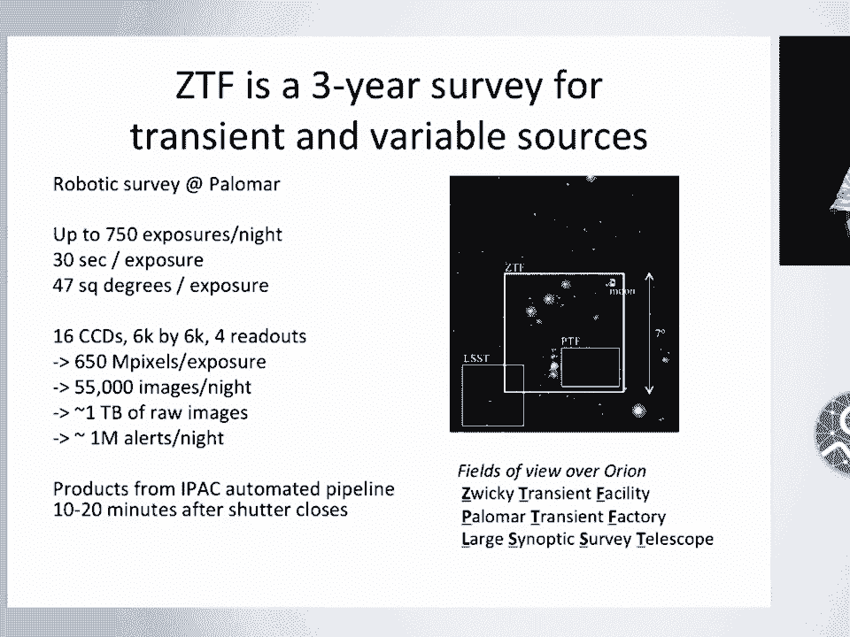

 PTF is the Palomar Transient Facility， which is a predecessor to ZTF that used a different。

 camera from CFHT from the Canada， France， or YE telescope。

 And upcoming is the large synoptic survey telescope that's under construction now in South America。

 And that will start its survey in three or four years from now。

 So ZTF has a much bigger field of view than LSST。

 But of course， LSST has a much bigger telescope， an 8-meter telescope， and a 3。2-giga pixel camera。

 So we're kind of like about 10% of LSST。 But we're using existing telescope facilities。

 so we're only about $22 million for this project for about 10% of LSST。

 So the 48-inch telescope at Palomar has been repurposed for this。

 The 48-inch was originally built to take photographic plates to make objects for the 200-inch telescope。

 at Palomar's Laboratory to look at。 And what we've done with ZTF is to tile that whole area。

 for these photographic plates with the charged couple devices， the CCDs， like a in your smartphone。

 And the name of the game of ZTF for much of the science is searching for transient sources。

 So these three images here show what you would see in one of our alert packets， a little cut out。

 New is a new science exposure。 REF is a reference exposure， which is an average of。

 many exposures taken on preceding nights。 And SUB is the subtracted image。

 showing a source that could be something like a supernova。

 So there are lots of science cases for supernovae， for gravitational wave triggers。

 And I'll note that my colleague Leo Singer is giving it the keynote on Friday morning。

 He's going to talk about that。 It should be very exciting。

 Tidal disruption events near supermassive black holes， variable stars， asteroids and comets。

 And we're actually exercising the LSST alert mechanism through -- these are all processed by。

 the University of Washington。 And I'll have some links at the end。 That's。

 led by Maria Patterson at University of Washington。

 But I'm not going to talk about the alerts today。 I'm going to talk about this part that was a hard problem for us to solve。

 which is getting good astrometry for the pipeline to function。

 So we use the Essex tractor and its related suite of software。 Essex tractor is a very popular。

 source extractor in astronomy。 SCAMP is the astrometric solver for that。

 And SWARP is something that will let you remap your images once you have the proper distortion。

 solution in them。 So we've used SCAMP in the predecessor to the ZTF for PTF。

 And we had problems like you see in the image at the right where we would have good --。

 we would have good astrometry solution over most of the image， but in the corner。

 you're seeing double and triple stars。 And so this is a reference image which is an average of。

 many exposures which past our automated quality checks， but those were obviously not sufficient。

 for this to work。 So you're seeing double and triple stars in the corner。 So -- and as you can。

 imagine that wreaks havoc on an image subtraction pipeline。 You get a lot of spurious and bogus。

 objects。 So we wanted to not only to improve the astrometry， but also to be able to tell very。

 accurately and reject these images and filter them out when we need to。

 And what we've settled on is making an astrometric prior to give to the SCAMP solver to help it。

 find a good solution。 So we're taking a few exposures and doing an offline fitting one time。

 We take match stars with pixel coordinates and we have accurate arrays and decks。 So。

 arrays and decks are our astronomical equivalent of latitude and latitude from the Gaia mission。

 the astrometric mission done by the European Space Agency。 We use the AstroPy World Coordinate。

 System which normally maps pixels to celestial coordinates， but we make one with idealized one。

 degree pixels and we are able to convert the arrays and decks into C and Aida which are plane。

 of projection coordinates。 Then after some fitting we can get pixel offsets。

 Those are the CRPIX1 and 2， the CD matrix and the degrees offset at the center for each one of these 64 quadrant。

 images on the focal plane。 So I have a view graph that explains this in a little more detail。

 We do this calculation in a tangent plane of projection。 So we take the Gaia catalog。

 and transform things back into this C and Aida tangent plane of projection and degrees on the left。

 hand side。 On the right hand side we take our detections from S extractor which are X， Y and。

 pixels and transform them and fit this equation that you see at the top which is really just a。

 linear matrix and some pixel offsets。 And ideally those match but in real life there's distortions。

 which are 2D rep polynomials in this tangent plane of projection。 So that's what the scam solver is。

 doing and then those are represented in the metadata of the images。 So we combine those。

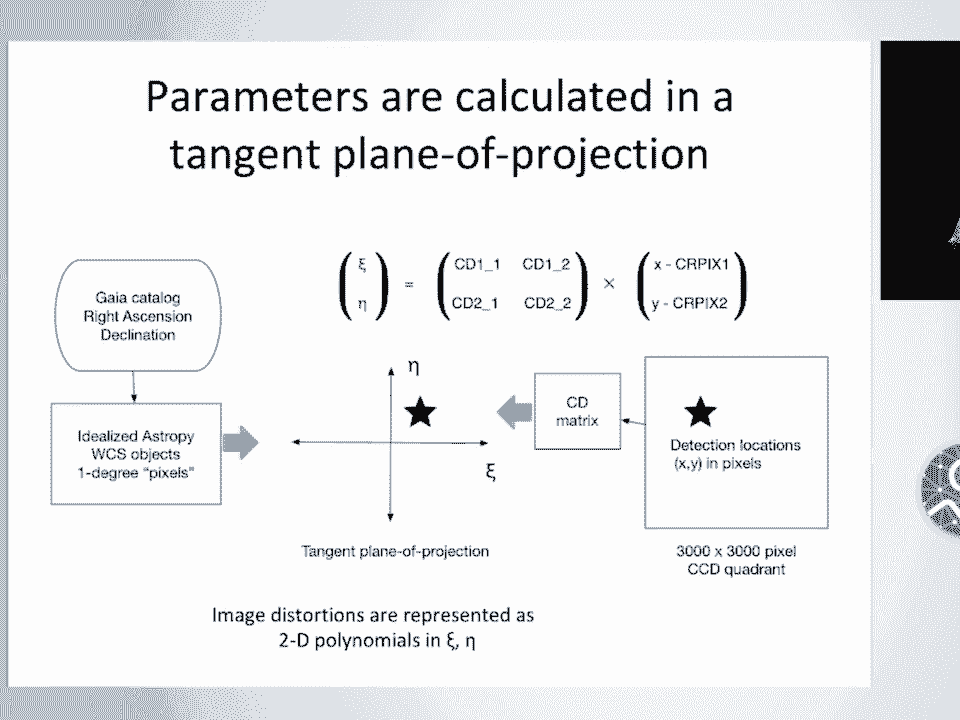

 priors with the telescope pointing to make into a header file with a distortion prior for scamps。

 so astropied handles those kind of header files。 Text files very conveniently。 We also feed in our。

 S extractor detection catalog and the Gaia astrometric catalog to scam。 That produces a header file。

 with the distortion solution in it and also a catalog of the detections with the right。

 ascensions and declinations with the coordinates attached。 And we feed those in to calculate。

 astrometry metrics including scale changes and position differences。

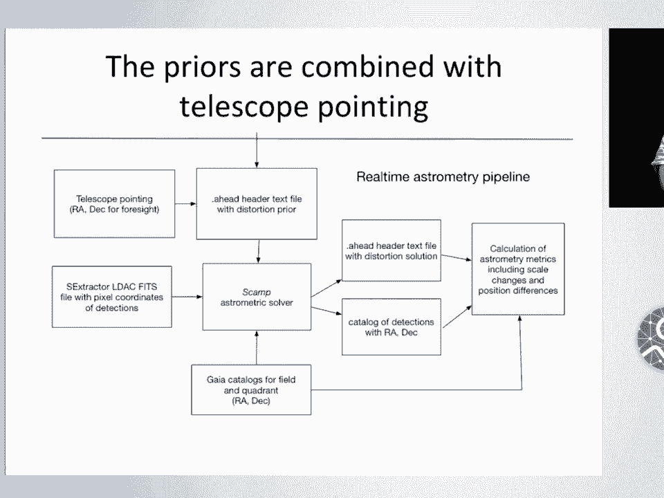

 So once we have the solution we have a number of metrics that we calculate。 Those include。

 statistics for matching the detected stars with the Gaia reference which we use astropied。

 coordinates for and we take the initial header file and the prior header file and calculate the。

 difference in pixel scale。 So like the number of arc seconds per pixel between those two。 And that。

 turns out to be very very well behaved。 Here's a plot of the percent change in pixel scale as a。

 function of air mass。 That's how many atmospheres you're looking through。

 So if you're looking straight， up that's one air mass。 And it follows a model very very well。

 So this gives us a great deal of， confidence that we can weed out any of these problem images where maybe just the corner。

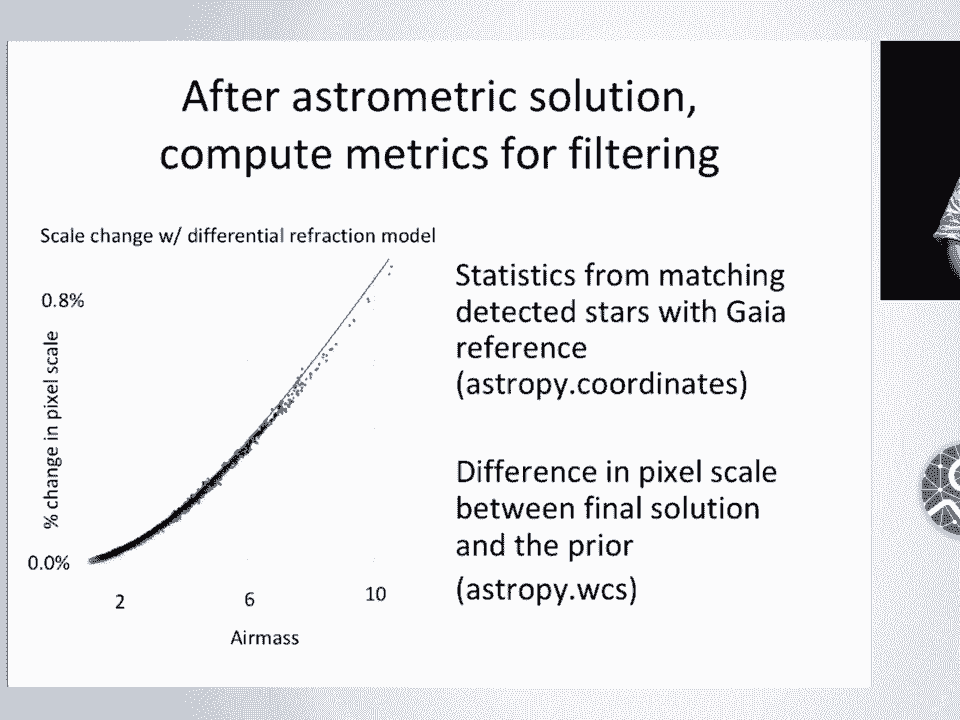

 the distortion solution took off。 Then another problem that we've used astropied to solve is for。

 the variable star researchers they're trying to push the detection of eclipsing sources to。

 tens of minutes or even less。 And you have the eight minute travel time between the earth where。

 you took your observation and the sun。 So to calculate heliocentric dates you have to calculate。

 the light travel time which is dependent on location of your source。 And we have 30。

000 maybe up to 100，000， sources to apply this to。 And it's too slow to call the astropied function to do that one by one。

 So what we do is to use a sky offset frame。 It's this similar idea to the tangent plane。

 A sky offset， frame at the maximum RA deck because of zero crossing problems in RA。

 We can't just take a mean or a， median。 We convert the catalog to that。

 We set up a nine by nine grid and calculate the heliocentric， travel time over that grid。

 And it turns out a two dimensional quadratic polynomial works very well， to solve that。

 So what are the lessons that we learned from ZTF？

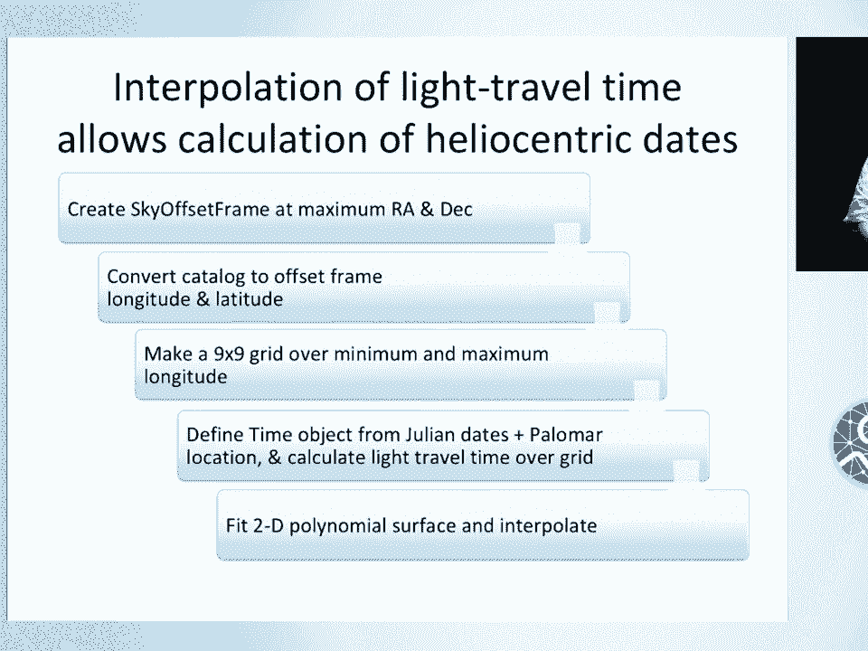

 Astropie has a lot of utilities to conveniently manage the inputs to SCAMP。

 Where you really want to work in fitting the astrometry prior is in the tangent plane。 So。

 convert everything to that plane to do your fitting。 Eliminate network calls as much as possible。

 So， we're running this on a slurm cluster with 66 machines in it and doing offline processing。

 We can run， maybe 1，000 jobs at a time。 So network calls are a real problem。

 So we prefetch the Gaia catalogs， and put them in the format that the SCAMP solver needs。

 We also bypass some network calls that are， made by， for example， AstroPike coordinates。

 Earth location of site。 When you call that， it actually makes a network call to look up where Palomar is。

 So we hard code that sort of thing in。 The SCY offset frames are really useful for avoiding these RA of 360 to zero crossing issues。

 And in general， that -- because we're always working in about a degree patch of SCY because。

 that's what one of our quadrant images is。 Just working in a local coordinate system is very useful。

 And finally， it's necessary to watch out for configuration file incompatibilities。 So。

 we had a problem where we have both Python 2 and Python 3 scripts in our system。 And there's。

 a configuration file that was randomly getting corrupted when we were running a lot of jobs。

 So it turned out that we had different versions of AstroPike in the Python 2 and Python 3 virtual。

 environments。 And one would overwrite the other until eventually the file corrupted。

 So what solved it was upgrading our AstroPike versions。 But this is also a lesson for avoiding。

 technical debt。 We should have bitten the bullet and upgraded everything to Python 3。

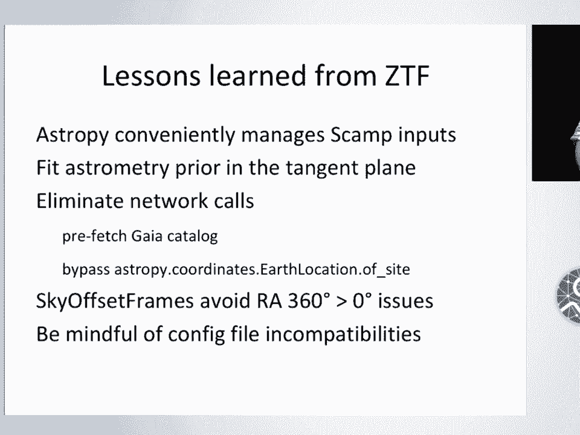

 And last， I'll talk about a tool for simulating spectra from the origin space telescope。

 So origin is an infrared space observatory that's planned for the far future。

 It's understudied along with three other concepts by NASA。 And we wanted to build a simulation tool。

 for the medium resolution spectrometer on that mission。 And we wanted to see trade-offs with。

 telescope aperture， distance to the star galaxy， integration time， and spectral resolution。

 And we chose Plotly Dash for the implementation of this tool。

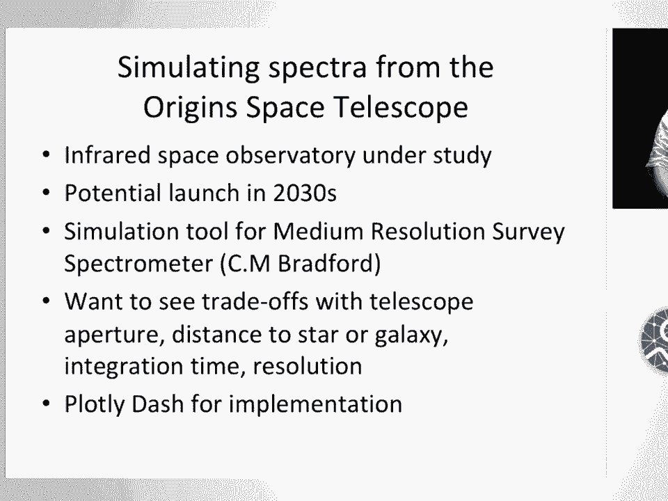

 And here is where AstroPike units and AstroPike constants really came in handy for keeping track。

 of conversions。 Because we were given an ideal routine for calculating the instrument sensitivity。

 from the instrument PI。 And there were a lot of magic numbers in it and comments in what the。

 units were in gigahertz and erg per gigahertz and so on。 So using a units package really helped to。

 eliminate having to keep track of that by hand。 And also we were able to put assertions in the。

 code to make sure that we were getting what we needed when we had a dimensionless signal-to-noise。

 ratio。 We could actually check that it was dimensionless。 So I really urge use of a units， package。

 And it really helped us out a lot。 Now a new thing that I just learned about a couple。

 of weeks ago is the YT community has come out with a standalone units package because there's。

 been talk in AstroPike of it's generally useful so it could be split off into its own package。

 The YT community has actually done that and there's an AstroPH paper by Nathan Goldbaum and。

 company that came out in about four weeks ago。 So I think the AstroPike project is interested in。

 talking with the YT people about how to build on top of that going forward because we'd like it。

 to make it obvious。 You know there should be one obvious way to do things。

 For redshifting the extra galactic spectrum what really helped was the AstroPike cosmology module。

 which has the the plane 2015 cosmology in it so we use that to get luminosity。

 distance as a function of redshift。 And then for interpolating the spectrum that turned out to。

 be a lot harder than I thought it would be。 I thought there would be some other off the shelf。

 things to use but it turned out PysinFote which is not an AstroPike package but the lead maintainer。

 is an AstroPike developer who's here at the conference although I haven't met her yet。

 I actually haven't met her in person so I'm looking forward to met her in person。

 Has utilities for reinterpolating the spectrum which which turned out to be really crucial for this。

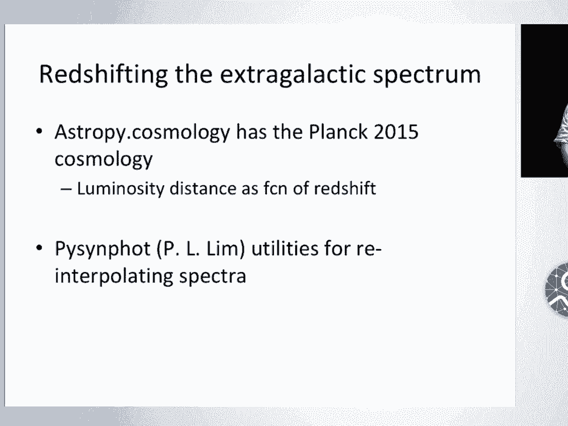

 So I have a movie of this tool that's online。 So this is where it's in the mode of a starburst。

 galaxy and we can select the redshift。 It's and kick it out to redshift of five。

 We can change the integration time from 10 minutes to an hour。 We could change the background。

 We can lower the luminosity and then it's it's possible to zoom in。

 and for each of these lines we have a little tip which gives the rest wavelength of the line。

 the species and the signal to noise ratio and the sensitivity。 So I have to say I'm very happy with。

 plotly dash。 It's worked out very well and I'm looking forward to John Mises talk tomorrow， at 2。

30 on plotly and widgets。 Okay we saw the extra galactic gap。 So what lessons did we learn。

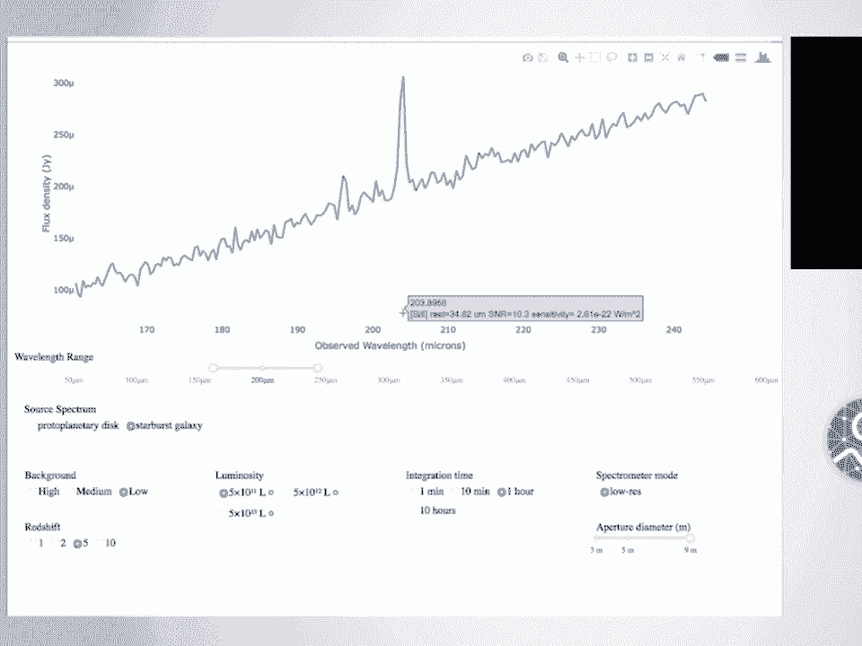

 from the simulation？ So AstroPike units plus assertions really helped a lot in validating this。

 complex function。 AstroPike cosmology very useful for getting the redshifts right。

 Pys info was really good for interpolating the redshifted spectrum。 I do have to say I did have。

 a problem just before we were debuting this tool where I had a one plus I had the wrong factor of。

 one plus Z and since Z is redshift since redshift is dimensionless the units didn't help me out with。

 that one。 That took a lot of painful debugging。 Plotly dash plus hosting it on the Heroku app。

 has worked out really well。 We're just paying 25 bucks a month for that and pre-computing a lot。

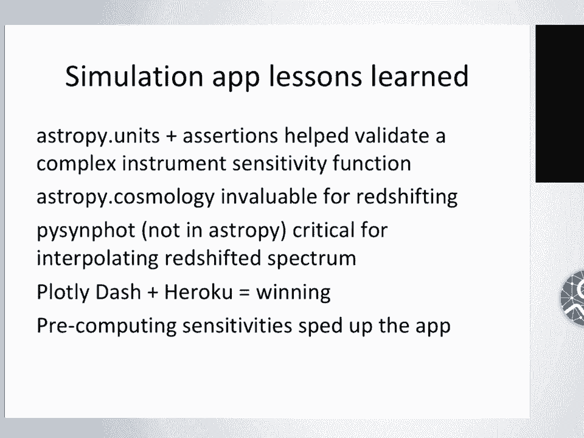

 of the sensitivities sped up the app a lot。 So I have a lot of collaborators on the ZTF project。

 and the PTF project before that these are all the co-authors from the ZTF data system paper。

 that will be out soon and a number of collaborators for the OST tool。

 And I'll leave you with a last， slide with some links for more information on ZTF。

 The public alerts as a stopgap are now actually， available as TAR file at University of Washington。

 There will be brokers that will make it easier， to filter these hundreds of thousands alerts to what you're interested in looking at。

 There are PASP， papers that are close to submission and here's a link for the origins space telescope tool。

 And there's also a conference proceedings paper with the links。 Okay。

 we have a few minutes for questions。 Does anyone have any， what are your questions for David？ Oh。

 Hi， I'm Pelian Lim。 Oh， right。 Okay。 So I'm just wondering your hard coding of the Paloma。

 was it offsite， the function that makes， the network call and you bypassing it。

 I'm just wondering if there is a more graceful way like using。

 the astropie cache mechanism instead of， I don't know exactly how you bypass it。

 I'm just wondering if， the astropie caching mechanism can be of help to you。

 We can probably talk offline about that。 Oh， okay。 Yeah。

 that probably would help because that's very useful for downloading files。 I use a。

 lot for downloading files because it caches the download。 Yeah， what we did was to hard code in the。

 values of the location of Paloma since it's not changing ever in the mission。 But normally you。

 don't want to do that in your code。 Also， another thing is Python foot。

 I refactor it into a different， package just call cinfoot and it use astropie models and units。

 So I don't know if you are looking into， transition。

 make that transition from Python foot to the newer package。 It has all the same， functionality。

 Just the API is a little bit different just because it uses mechanism。

 underlying mechanism is different。 So we can also talk about that offline and cinfoot is。

 a astropie affiliated package。 Oh， okay， great。 Yeah。 Well， now it's worth it for me to come all。

 the way out of here。 Hi， thanks for the talk。 I wanted to ask does astropie have any astrodynamics。

 or orbital functionality？ And if not， do you have recommendations for that in Python？ Yes。

 far as I know， I don't think we have any orbital dynamics in it。 Yeah， I don't know offhand。

 I don't know if， yeah， I don't know offhand which packages are good for that。 Okay， thanks。 Okay。

 and I say one more question。 Did I miss one？ No。 To answer your question。

 there's a package called polyastro that does orbital dynamics。

 in Python based on astropie and astropie coordinates where appropriate。 Okay， well。

 let's thank the speaker once again。

 [BLANK_AUDIO]。