# P31：SciPy 2018视频专辑 (P31. Scalable Machine Learning with Dask _ SciPy 2018 _  Olivier - GalileoHua - BV1TE411n7Ny

 >> Thank you very much。 Hi， everyone。 Here again， it's a。

 continuation of the previous talk because I'm also going to。

 use a bit of Kubernetes for the auto-scaling。 So this。

 presentation was prepared by Tom with the developer of -- the。

 main developer of DaskML and out a bit by working on the， interface between Dask and scikit。

 And so this is a， preliminary presentation of what's currently available through。

 DaskML and what also possible development could have in the。

 future。 So the motivation is that Python is very good for。

 interactive data analysis and predictive modeling。 But。

 problem is that you often hear that it doesn't scale， whatever， that means。

 Or it's not production ready。 So the goal of， the work that we make at this moment is to try to make it。

 easier to enable machine learning on larger data set or。

 larger problems like more CPU usage， basically。 So we use， Dask as the infrastructure for this work。

 And I'm just going to。

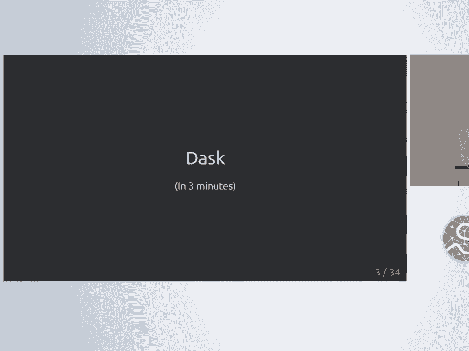

 give you a recap of what is DaskML very shortly。 So Dask is a。

 pure Python high-level API that is very familiar because it。

 builds on tools such as NumPy and Pandas。 And in some of the。

 cases it actually acts as a drop-in replacement in your source， code。

 And it makes it possible to work with a very large data。

 set that doesn't fit in memory on a single machine and even use， a bunch of machines on a cluster。

 And to do that it's managing， basically what we call a scheduler that runs tasks。

 individual chunks of function calls， in parallel in many。

 threads or many processes or many machines on a cluster。 So it's。

 more like an orchestrator and high-level Python API that is， nice for data scientists。

 So for instance， if you are a Pandas， user you can read Parke file into a data frame and do some kind。

 of group by operation。 Then the group by operation you do an。

 aggregation which is a sum on a specific column。 And then you。

 will solve the result to extract the top 10 results， the， highest， for instance， transaction amount。

 employer in， this case。 Here the difference between a Pandas and。

 DASK data frame is the import statement， the fact that you。

 read several files instead of one in the data loading process。

 And the fact that at the end you have a delayed result。 It's not， computed yet。

 It's just a plan on how to compute that， operation on a cluster。 And then you can call compute。

 method on that and you will get back a regular Pandas data， frame in memory on your client program。

 So when you do that， what does that -- it builds a graph which is a symbolic。

 description of individual subtasks and how they can be run。

 in parallel and how they can be synchronized to get to the， final result。

 So the results are not computed immediately。 You， can delay the execution and send the execution over to a。

 cluster。 So the DASK scheduler will identify parallel sections。

 in that graph of operation and we run that on parallel， resources， CPUs or machines。

 So in practice that can look like， this for bigger graphs。 I think this is a linear algebra。

 operation。 I don't remember which one。 You can see that the。

 green -- the red part is something that is being computed。

 is an intermediate result that stays in memory and the blue。

 part are intermediate results that are no longer necessary and， can be garbage collected。

 And this graph can be scaled to， several machines。 So in summary， you write familiar， NumPy。

 Pandas or Python function calls and you chain them and。

 you just write them using a tiny bit of DASK specific API and， then you -- when you execute that。

 that generates a graph and， that graph of computation is executed in parallel by the。

 DASK scheduler。 And in the end， you get some concrete result。

 that you can store on a hard drive or collect back to your。

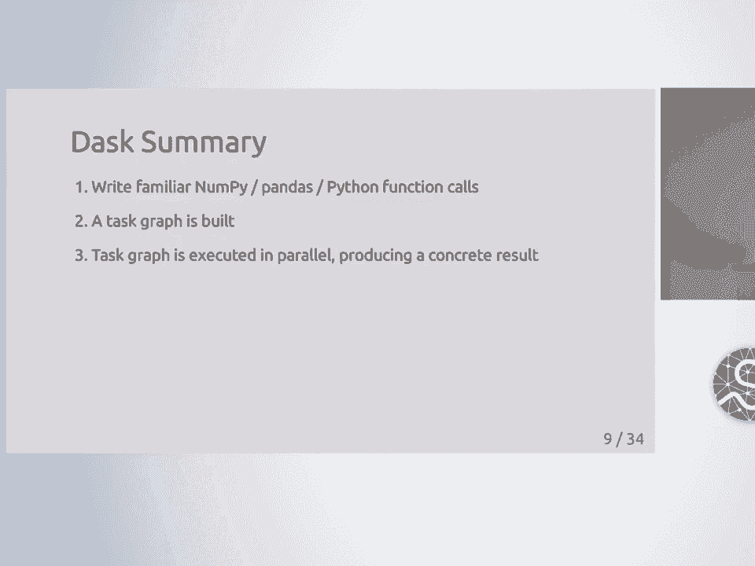

 client application。 So DASK ML specifically is trying to。

 build on top of DASK to make it easier to scale machine， learning workflow。

 So DASK ML provides estimators and。

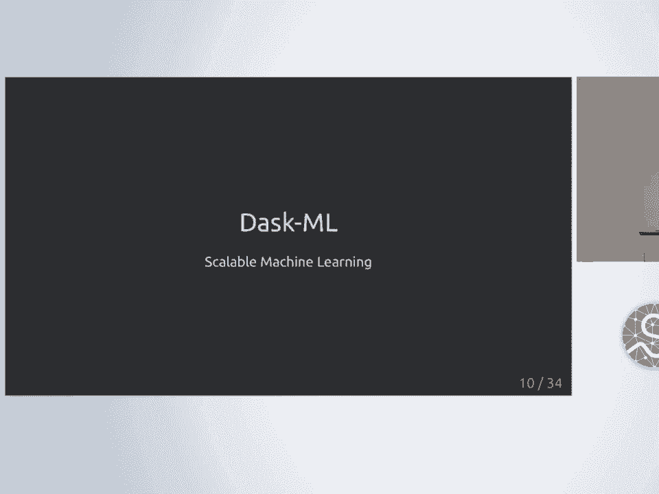

 utilities for machine learning。 They build on DASK and some of。

 them can use DASK specific data structure like DASK arrays or。

 DASK data frame to handle data set that doesn't fit in memory。

 And also the leverage WTT to tap into many CPUs on a cluster。

 for distributed computation when your main workload is a， bottleneck by the CPU。

 And so it also gives you some， flexible task scheduling for our sophisticated algorithm if you。

 want to be more dynamic。 Like if you have iterative， algorithms。

 you have the flexibility not to define the， graph ahead of time but to send some computation。

 get some， back intermediate result， compute if you have convergent or。

 not and risk-eating new computation asynchronously if， you want。 That can be also useful。

 for instance， for。

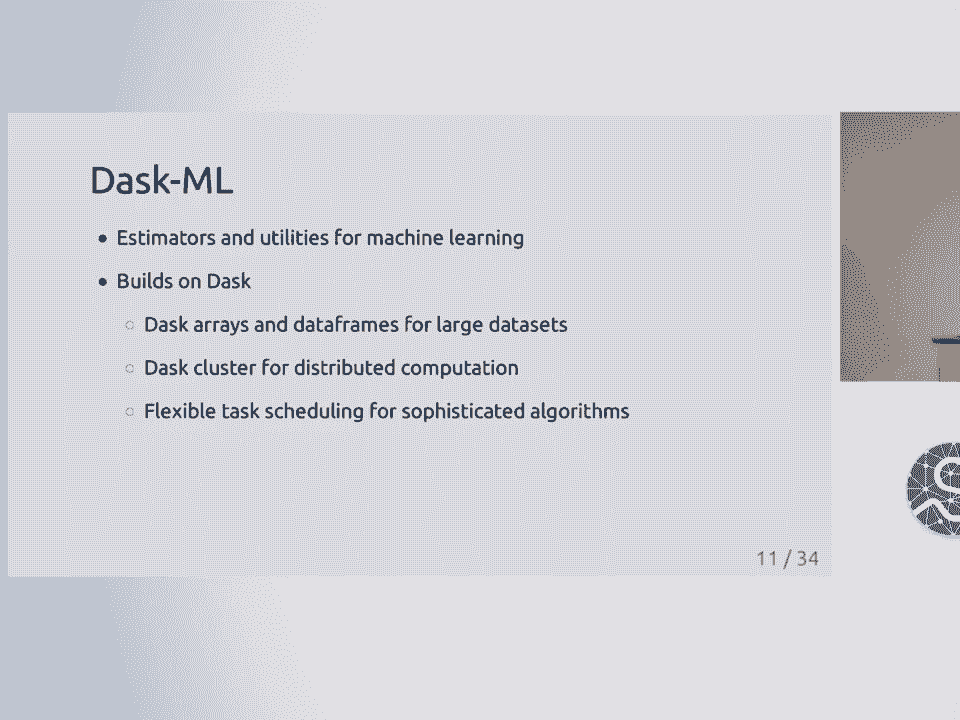

 hyperparameter search。 So there are two different dimensions， for scaling machine learning workflow。

 One is a CPU bound， task and the other one is RAM bound task。 So compute。

 scale and there is an axis for computation and an axis for， data basically。

 So if you use scikit-learn on a single， machine， you might be limited either by the kind of the model。

 complexity。 For instance， if you want to do a big grid search。

 it might require hours of computation on a CPU or a single， CPU。

 Or it can also be limited by the amount of RAM of data， that you can fit on RAM on a single machine。

 Because scikit-learn， works using NumPy as a primary data structure。 So it expects， that the data。

 the full data set， sits in memory for most of， the algorithms。 So you have this kind of。

 generally when the， data set is larger， the computation time is also larger。

 and so you might also be limited。 This is why you have this， kind of triangle。 So first。

 there is a first solution which， is just， if your data is small enough to fit in memory on a。

 single node， what you can do is benefit from several machines。

 where you will copy the same data set， the same training set。

 but run independent models on different machines。 For instance。

 if you do grid search or an ensemble of decision trees， a， random forest。

 you can run them in parallel。 It's an， embarrassingly parallel task。 So for this。

 what you can do is， benefit from what you call distributed scikit-learn， which。

 is basically an integration between the job-l， parallel engine that is built in to scikit-learn to a。

 desk distributed system。 So this is the first integration， option。

 And the second one is to tackle data that doesn't fit， on a single node。

 So the first option is just to sub sample， it and make it fit on a single node and see if it works。

 because sometimes it's enough。 If it's not enough， then you can。

 benefit from out-of-core algorithms using desk arrays or， desk data frames。

 Or you can also implement using desk， primitives， scalable algorithms， or maybe also reuse external。

 libraries like xjboost and use desk more as an orchestrator to， make it easy to integrate xjboost。

 distributed xjboost， into， a standard Python pipeline running on a cluster。 So I will。

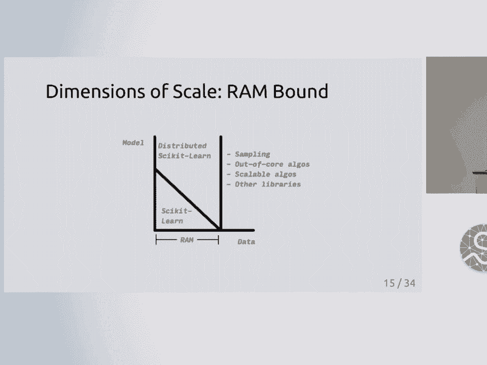

 go into more details for each of those options。 So first。

 let's focus on CPU-bound operations on a smaller， medium。

 data set that fits in a couple of gigabytes or tens of gigabytes。

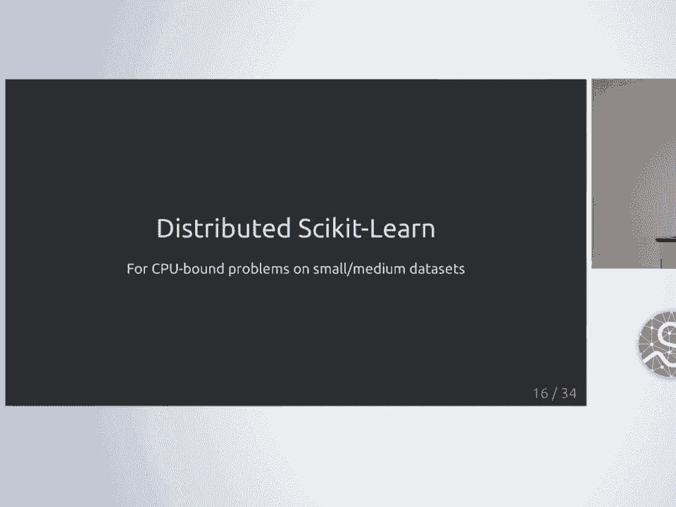

 that fits on a single node。 So a traditional way to do that， in scikit-learn。

 So to plug scikit-learn， we will desk to， achieve this。

 So desk will provide you the cluster computing， scheduler。

 We will load the data in a single numpy array that。

 fits in memory on each of the workers of the cluster。 And， scikit-learn will provide the logic。

 the mathematics of the， scikit-learn estimators。 So the typical way to do that on a。

 single machine using scikit-learn， for instance， if you want to。

 do a hyper parameter search on using research， so this is an， embarrassingly parallel task。

 You define one estimator that， you are interested in， a grid of possible parameters that you。

 want to explore。 And you can tell scikit-learn n-j obstacle， in parallel。

 which means use as much as possible CPU as you can， to run a jobs in parallel。

 And when you call fit， the， scikit-learn will call it into joblib and depending on the。

 kind of task that you are doing， it will use either。

 processes or threads to run on parallel on several CPUs， several cores on a single machine。

 What we have introduced， recently in the last release of joblib is the ability to。

 unplug the default thread base or process-based parallelism。

 mechanism and to talk to a desk scheduler to run on a cluster， of machine。 So to do this。

 you just have to use this parallel。

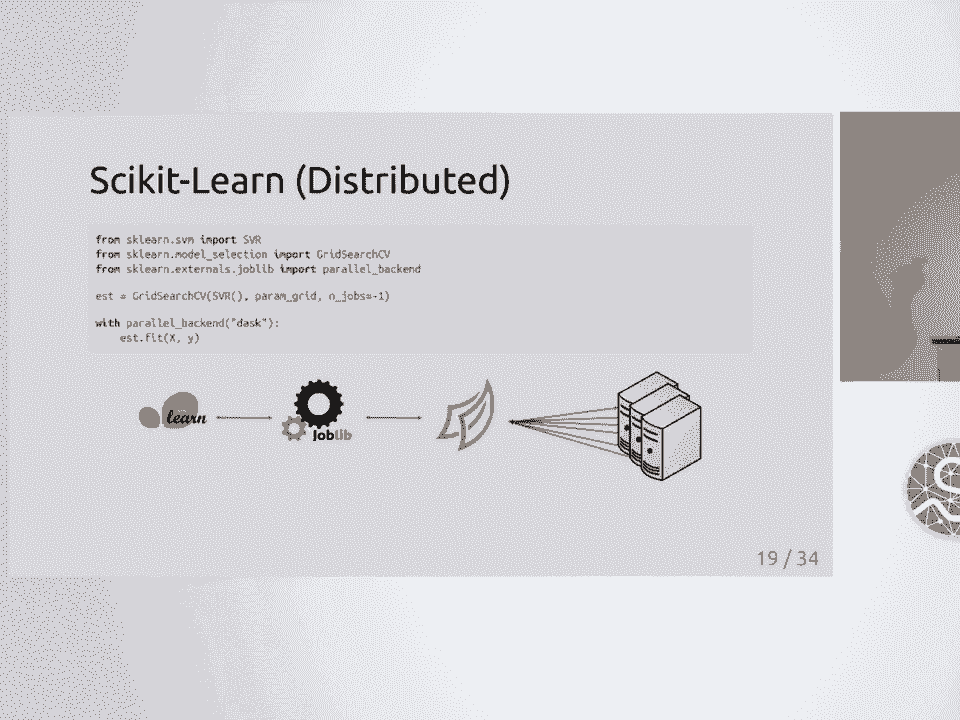

 backend context manager here and -- oops， sorry。 And when I。

 switch between those two slides， you just see there is an。

 additional line here that will contextualize this call to run， using the distributed scheduler。

 And the rest of the code is， the same because it's just using a scikit-learn， it's just。

 using joblib internally， so this is the connection layer。

 So I will just show you a short demo for this。 This is the wrong one。

 So this is a notebook running on a Jupyter cluster。 You can， see here on a Kubernetes cluster。

 you can see here that we are， using the Jupyter Hub setup and the hand configuration from。

 the people at Panjero。 And so here we just define a small， dataset that's on a single node。

 If I run it。 And we can run， using scikit-learn， a single random forest on this small。

 dataset is very quick because the dataset is small。 But if we， want to do parameter search。

 we can run several thousands of， possible combinations of high parameter and it's going to be。

 much longer。 So here I'm using random search CV for one， iteration。

 You see because we do five-fold cross-validation， it's already significantly longer。

 Just one second for one， parameter。 But if you want to explore many of them， that can。

 be thousands of seconds， so you will have to wait a much， longer time。

 So what we can do instead is configure desk to， talk to the Kubernetes cluster to add additional workers。

 And when， we do this， you can see in the bottom right corner that we。

 have automatically in Kubernetes new workers that have been， connected to our session。

 in Jupyter session， we can connect， to the scheduler using the desk API and we tell joblib to run on。

 the cluster and dynamically， as joblib is dispatching the work。

 you can see that desk is talking to Kubernetes to allocate。

 even more compute resources to scale and do the work as quickly， as possible。 And finally。

 once this is complete， it should be， quite fast now because we have a ton of CPUs that have been。

 allocated。 You can load the result of the grid search into the。

 appendix data frame and explore that， for instance， here the。

 high parameters that were the best is do not limit the depth， size of the decision tree。

 do not limit the mean sample leaves， use as many trees in the forest as much as possible and so on。

 And， as soon as you stop， all the， as soon as you restart your， kernel。

 all the resources are released so you don't waste。

 resources on the cluster if you don't need them， even if you're。

 doing interactive data analysis like this。 So the second kind of。

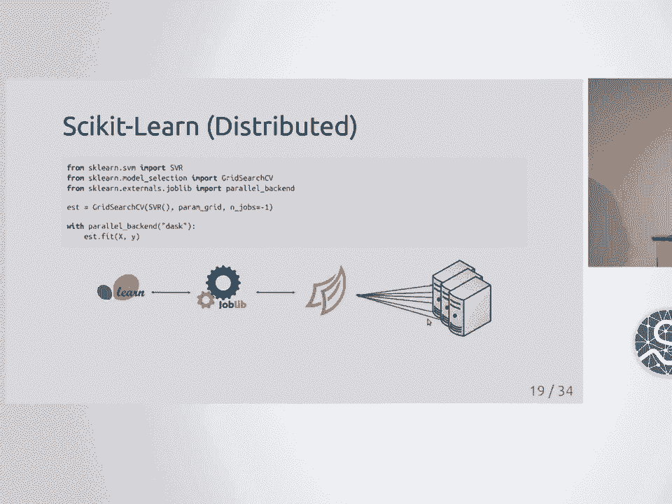

 scaling axis that we can use is how to scale to larger， volumes of data。

 Data that doesn't fit on a single machine。

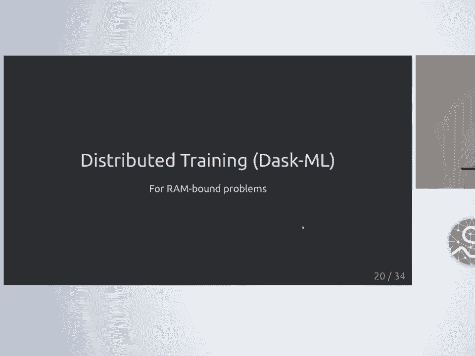

 on a single node in a cluster。 First， do you need to do that？

 Because sometimes if you just sample your data， like you tend， 10% and then 20%。

 you fit two models twice using cross， validation and you will see that the increase in accuracy might。

 be very， very slow， so maybe it's completely useless to waste。

 the compute resources of a cluster if you don't have the right， data。

 So do this kind of sanity check first using a learning， curve in a cycle and it's very easy to do。

 Secondly， do you need， all the data for training sometimes？ Only the inference is。

 very costly because you might have a limited amount of。

 training data with labels and a large amount of unlabeled data， that you need to classify。

 for instance， to detect special， events in astronomy images。 And so what you actually need to。

 scale in that case is the project function， the inference， step。 In that case。

 it's very embarrassingly parallel and， does KML provides an easy way to wrap any cycle-on-estimator to。

 parallelize the project function。 But if you really need to do， distributed training。

 you have two options。 Either you wrap one， of the cycle-learn model that supports partial fit method。

 the incremental learning， and does KML provides you with a。

 higher-level API that wraps the cycle-learn model so that it can。

 run on a desk array distributed on the cluster and the memory on， the cluster。

 Even if the model is sequential， it makes it， possible to scale to out of core computation this way。

 And， secondly， also does KML is re-implementing more and more。

 some estimators to directly internally benefit from the， desk parallelism mechanism。

 But this sometimes requires to， rework the algorithm because we can no longer make the。

 assumption that everything is in memory on a single node。 So to， use the first strategy。

 which is just to wrap a cycle-known model， that has a partial fit method for incremental learning。

 each， estimator is going to train on a block mini batch of data at。

 the time and then can release it and the model parameter will be， incrementally updated this way。

 So， desk collections are already， blocked。 There is already underlying chunked numpy array。

 data structure that is the back end of a desk array。 So we can。

 plug those two concepts together very naturally。 So here is the。

 code if you want to use cycle-learn on a single machine to do， the out of core loop manually。

 You can define a Python object， which is a data stream that is just a nature of numpy arrays。

 So you have to write it yourself in this case。 And here you。

 instantiate the class with the model parameter。 And then you can。

 call partial fit in the loop and for each chunk of data you。

 increment the state of the model until you've seen all your。

 data and as you go you are the garbage collector of Python will。

 release the past chunks of data that are no longer necessary。

 So instead of doing this loop manually what you can do is。

 plug the cycle estimator into the incremental meta estimator of。

 desk ML and then you just call fit as you would do naturally。

 But here x big and y big are actually desk arrays that do not。

 fit on a single node but might be partitioned in the memory of。

 several nodes on a cluster or even on disk if it doesn't fit， in memory。

 So I have also a demo for that。 So let's switch here。

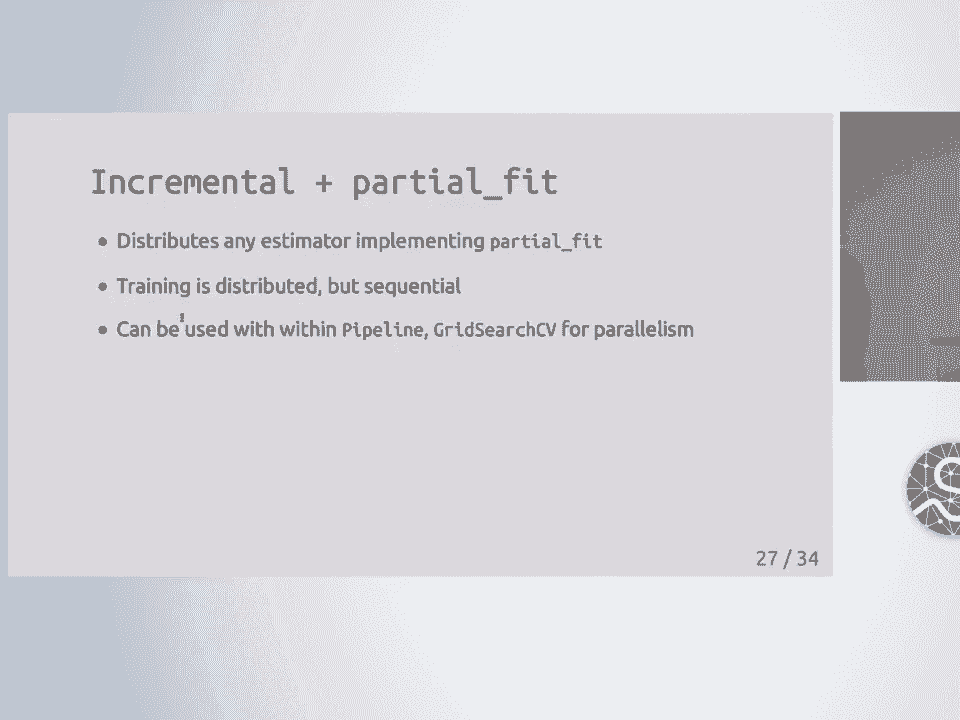

 So quickly。 So here again we start， we connect our Jupyter。

 session to its running on Kubernetes and we already， connected to the desk Kubernetes component。

 So we have a， session that talks to a fixed amount of workers in this case。

 So we have 12 workers and each has two threads。 And you see。

 that the different workers of each of them as a bunch of， gigabyte of RAM。

 So in aggregate we have 72 gigabyte of， RAM on the cluster。 So it's assumed that it's larger than。

 each individual node。 So here we are going to use desk to。

 generate a fake classification problem with the size that we， want。

 And so we are going to allocate a memory to a random。

 classification data with some structure between x and y。 So it。

 looks like the cycle on dataset make classification utility。

 function to just benchmark your algorithm。 This is the same。

 but this time it's going to allocate that on the worker， node in parallel。

 And in total we will use 32 gigabytes of， RAM on the cluster but on the different nodes partitioned。

 over the different nodes。 So here on the right hand side you。

 see the diagnostic page and you see that it's doing the， random generation of the data in parallel。

 It can saturate， completely the CPU on the cluster and you can see also the。

 aggregate memory usage of the cluster。 We now have 32 gigabytes， of RAM allocated in memory。

 persisted in the cluster。 So， if I come back here I define my SGD classifier which has a。

 partial fit method。 I import the incremental wrapper from， desk ml。

 I wrap my cycle on estimator in the incremental， wrapper and then I can introspect from the target class。

 from the target variable how many classes are there in this， dataset。

 And I pass that as an argument also with the x and。

 y which are the distributed arrays that live in memory on。

 the cluster to be able to do the incremental computation。 And。

 here this is quite interesting because here the code is really。

 really sequential like a stochastic gradient descent。 We'll， do one step at a time。

 So on the diagnostic page you can see， the graph of task and the dependencies and you see live。

 the red dot moving around which is basically the partial fit。

 call that is being chained over the different chunks。 If I go。

 back to the task view you can see that one worker is doing one。

 thing at a time and the other worker is doing nothing。 But。

 basically here what's happening is that the model is moving。

 around between the worker because the model is quite small。

 and the data has been partitioned previously。 So it's the。

 model that is jumping from one node to the next。 And sometimes。

 there are data transfers in red here because the y chunk and。

 x chunk might not have been allocated on the same node， initially。

 But you see that very quickly they are collected， together and everything happens very efficiently。

 So here at the， beginning we can saturate on the profile of use。 This is the。

 profile of view that is built in in task。 At the beginning we。

 can saturate all the CPUs of the cluster because here this is。

 the generation of the random data that is able to do that in， parallel。

 We can actually see this is the function apply random， from the disk that is being run。

 And there after in the end you， see that there are very few just a tiny fraction of the CPUs of。

 the cluster that are running but one after the other。 And if you。

 look at the profiling view this is actually the feed binary。

 method from scikit-learn and input validation for each of。

 the chunks from scikit-learn that have been wrapped and run， sequentially on the cluster node。

 If I stop here my kernel what， is really interesting in this view here is that you can see。

 that all the nodes the Kubernetes nodes of the pods are。

 being terminated and garbage collected so you release the。

 resources for all their data scientists running on the same， cluster。

 You completely release the data and make those， resources available to other users。

 So switching back to the。

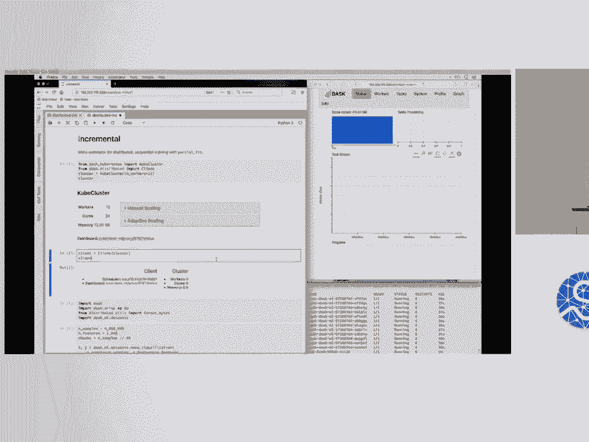

 slide quickly。 So there are also a bunch of distributed estimators。

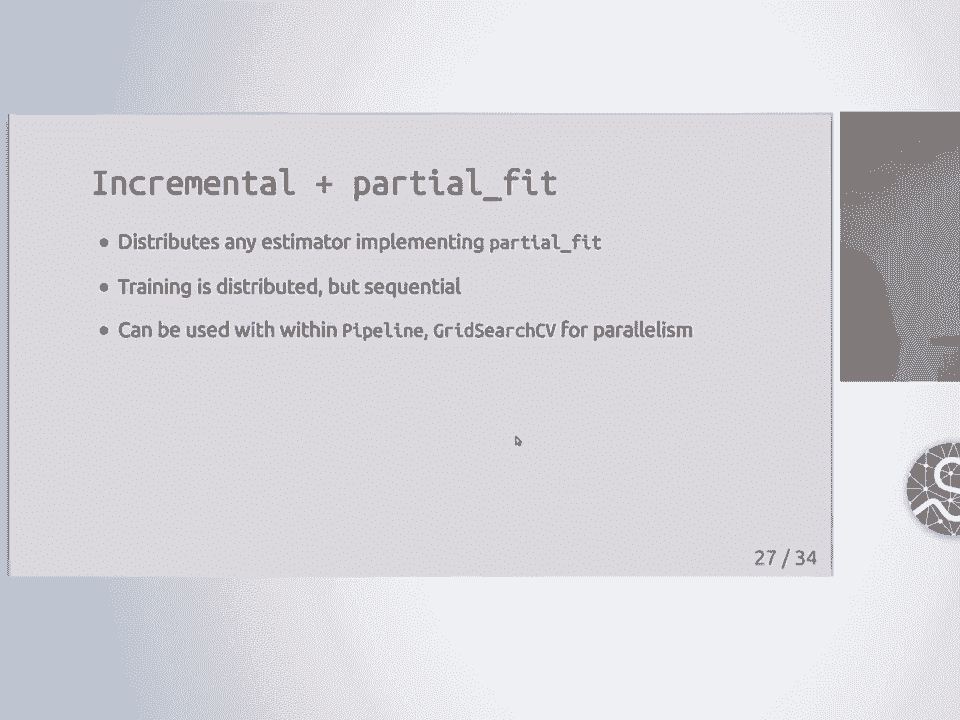

 that have been really refactored basically to work with。

 dask primitive and other hood in the feed method。 So typically。

 use cases are for instance generalised linear models。 For。

 instance there is logistic regression and linear regression。

 that are using dask optimised parallel algorithms like ADMM and。

 LBFGS that are able to fully saturate CPUs on the cluster。

 But be careful because sometimes depending on the data。

 shape and the structure sometimes a sequential algorithm like。

 SAGAR might converge much faster than a distributed algorithm。

 that will use a lot more energy and CPU。 So please stay smart if。

 you can to choose the right algorithm and save a void， wasting energy for nothing。

 But there is also distributed， algorithms like K-means that has a specific initialization scheme。

 that can run in parallel。 This is the K-means parallel， replacement for K-means++。

 And basically this is a strategy， that is also implemented in Spark。 I'm not sure if it's the。

 best or not but we haven't run full benchmark but at least it， can run in parallel。

 And also standard pre-processing stuff， like a quantile transformers standard scalar， robust scalar。

 that can naturally be embarrassingly parallel and work on a。

 dask array even if the data doesn't fit in memory。 And also， more compute intensive steps like PCA。

 linear algebra operation like， SVD that has been reimplemented using a randomized。

 SVD to run distributed on a cluster。 And this was also， built in a dask。

 linear submodule and wrapped as a dask， ml estimator。 And finally there is also a wrapper for。

 exubust to run in distributed mode。 I don't know if you have。

 tried but exubust you can set it up to run on a cluster but it's。

 very painful to configure all the nodes， all the workers to。

 talk to one another and then to call it from Python it can be， quite complicated。

 And so dask ml is also a high level wrapper， where you say I just want to run that on my dask cluster and it。

 will automatically start the exubust worker and say it's a。

 very efficient way to do a large scale gradient boosted trees。

 So I think I will end here and I just have a couple of。

 notes on cluster deployment so if there is a question on that。

 we can talk a bit about that but I'm ready to take some， questions。 Thank you very much。 [Applause]。

 >> All right。 Thank you。 We have time for a couple of， questions。

 There is the standing mic there and I have this， mic。 I can try to jog to you if you have questions。

 I forgot to， say this last time but please ask only one question in the。

 form of a question just as a reminder。 Any questions？ [Applause]。

 >> Thank you for the excellent talk。 I have a quick point of， confusion。

 At what point does the fit method know which client， to use to submit to dask scheduler？

 I didn't notice， anywhere in there。 At which point does it do？ So earlier in。

 the slides you introduced I think it was keep going back。

 It was the first time you used the distributed schedule。

 I see parallel back and dask but what if you have multiple。

 client objects in your session and multiple clusters？ How does， it know which one to use？

 >> Actually， yeah， maybe here， this code would not actually run。 I think we initially need to。

 create a client first。 And basically when you create a。

 client the first time is going to be used as the default client。

 And if you want to plug some specific client you can also。

 pass it as an argument to parallel back and dask here。

 >> If you create one it's going to reuse the existing one。 In general you just need one process。

 >> Okay， cool。 Thank you。 >> I think you for the great talk。 Just curious on general。

 very broad comparisons with Spark and H2O。 Distributed ML。 Just in terms of maturity or。

 algorithm parity。 >> Yeah。 So I think from a。

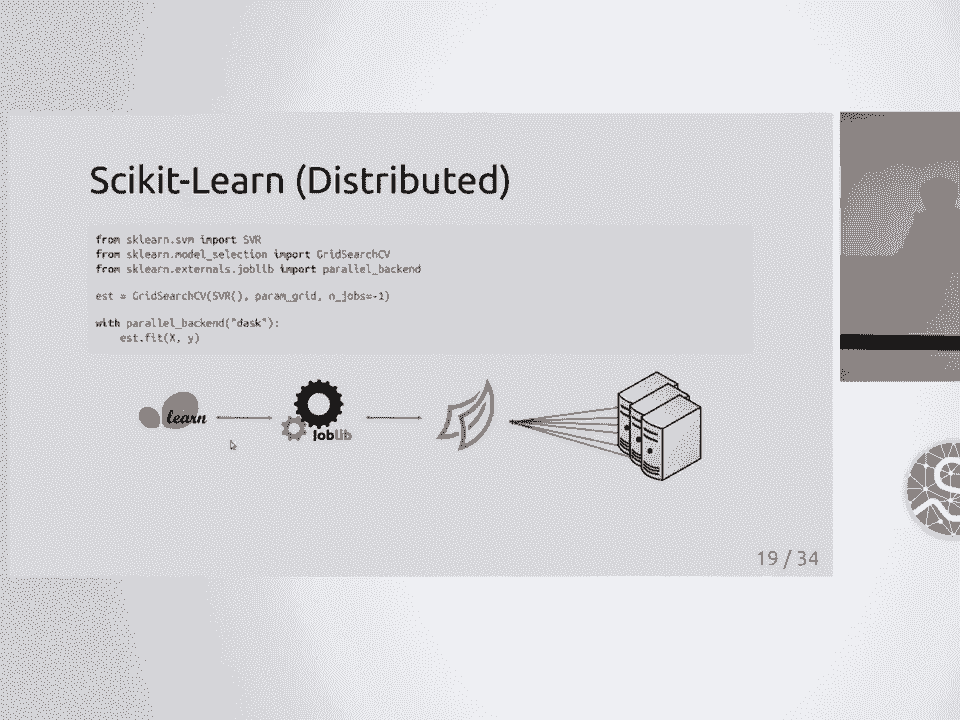

 maturity point of view you can see that right now in dask。

 ML we don't have the full cycle on a zoo available。

 There is just a tiny fraction of them that are available in， fully distributed mode。

 And I think in H2O and Spark they， directly implemented algorithms to be scalable。 So they only。

 focused on the subset of algorithm that they know are very。

 useful to run at scale like gradient-wisted trees， random forest and things like that。

 And out of core at the same， time。 So here we are playing a bit catch up with the， job。

 But at the same time if you also benefit from the full。

 cycle models even those that are not scalable， they might be。

 important at some point in your pipeline。 So I think it's， a different trade-off。

 And over time hopefully we will catch up， and we will have more and more distributed algorithm directly in。

 dask ML。 >> Thank you。 >> Any other questions？ >> If you have a question on deployment， I will see。

 >> Okay。 So I noticed that the stochastic gradient descent was， actually being run in serial。

 So in gradient descent what you do， is you take a mean right somewhere。 And can't that mean be。

 parallelized？ Does it have to be serial？ That mean can be run over。

 multiple machines so it can be CPU optimized。 >> So the。

 problem is here that when we do this SGD for linear model there。

 is very few amount of computation per chunk of data to， transfer between the RAM and the CPU。

 So we are on the RAM， model next most of the time。 So even if we are able to。

 parallelize the compute intensive part of linear model that would。

 be kind of limited in the case of SGD for linear model。 If you run。

 SGD for a nonlinear model like a deep convolutional neural net then。

 just doing the forward pass is take some time and so you can。

 cut your many batches and run that on several GPUs and at the。

 end synchronize the gradient computation。 And in that case。

 it makes sense to parallelize up to some point。 Typically I think。

 it's quite easy to parallelize SGD for a convolutional neural net with。

 tens to hundreds of GPUs beyond that point it's really hard。 It's， open a rare research。 >> Okay。

 I understand。 Thank you。 >> Go ahead。 >> I am truly interested in talking a little more。

 about deployment。 You're going to mention that in the next slide。 >> Okay， so the deployment。

 So in this demo I presented a small， test cluster that is based on the configuration that was developed。

 for the Pangio project， a geo-science platform for scalable。

 analysis using a desk and Jupyter Hub and XRA。 And so we are using this desk。

 and it is a connector that has the ability to do adaptive。

 scheduling and deployment of additional ports based on the， Q in the desk scheduler。

 It's also possible to， run that the same kind of operation on a traditional academic， HPC cluster。

 For instance we are running a SLERM or PBS or， SGD and it's currently under development but there is also this。

 kind of adaptive provisioning of additional workers， live that is being added to this integration。

 And finally there， is also the possibility to run on a Hadoop cluster and so basically。

 use the Yarn application manager to schedule workers also， on a Hadoop cluster。

 I think right now it's static so you have to say the number。

 of workers that you want but in the future it's going to be dynamic as well。

 And so the adaptive scaling I think is very important because。

 when you do interactive exploration using Jupyter Hub for instance。

 most of the time you're writing code or doing a plot of the result and。

 during that time you actually don't need the resources so you can release that。

 And as soon as you launch a complete intensive step that is parallelizable。

 it will dynamically reprovision most of the resource of the cluster that。

 is available to run that as quickly as possible to reduce the latency。

 of your analysis get some results release back the resources so。

 that other data scientists can run on the same cluster even if your。

 workload is not very parallel it makes it possible to share a cluster with different user。

 without having them to run out of memory because you know。

 exactly how much memory you have in your workers。 Alright thank you if you have any other questions you can talk to Olivier outside。

 Thanks。 Thank you very much。

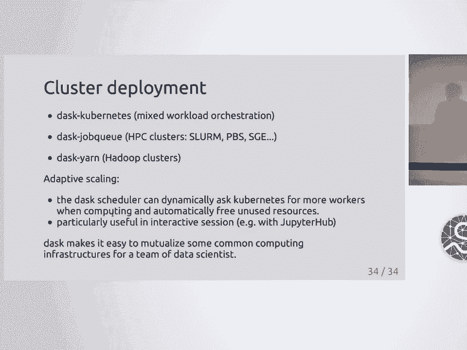

 [BLANK_AUDIO]。