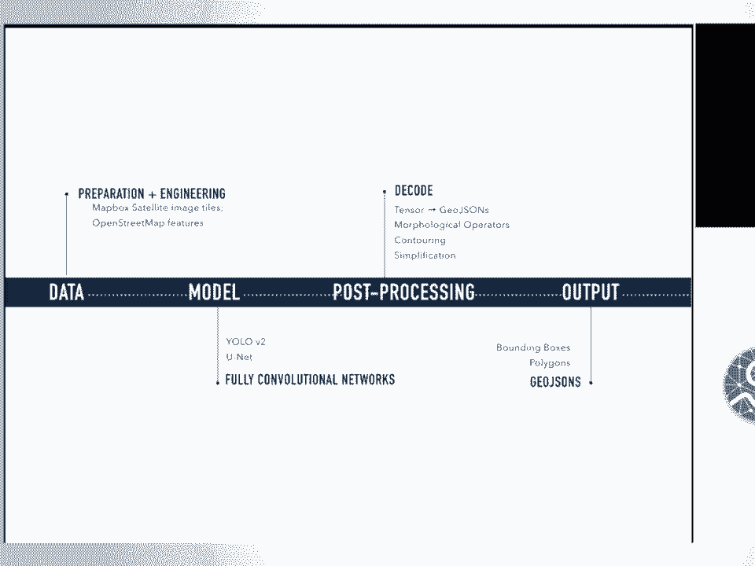
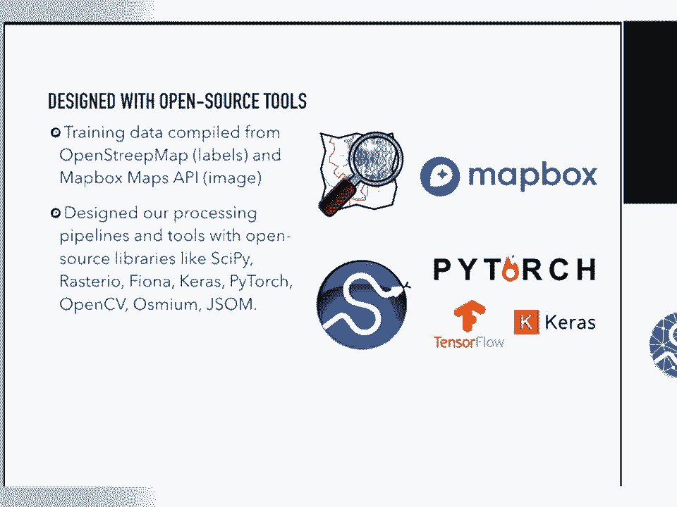
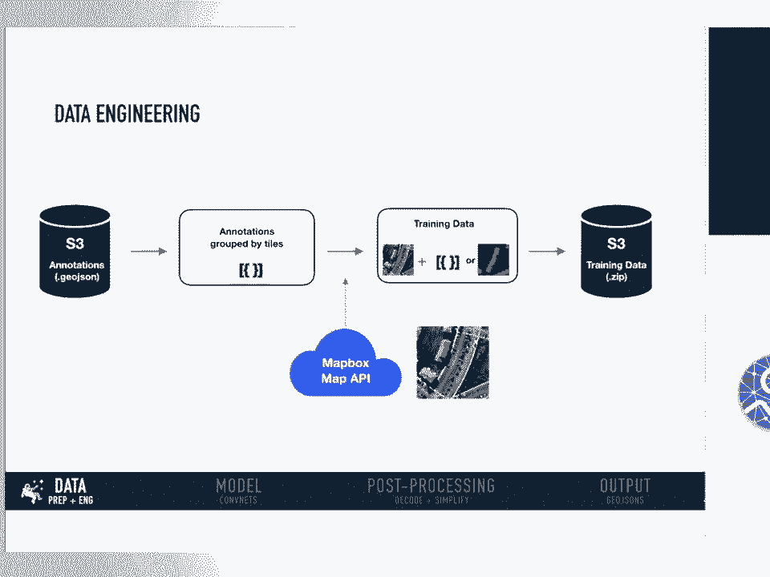
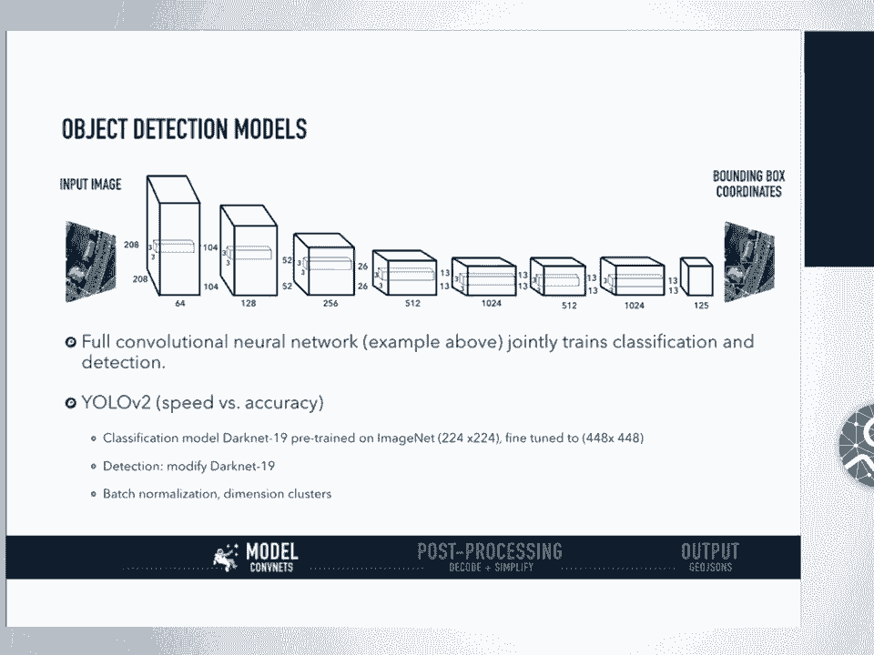
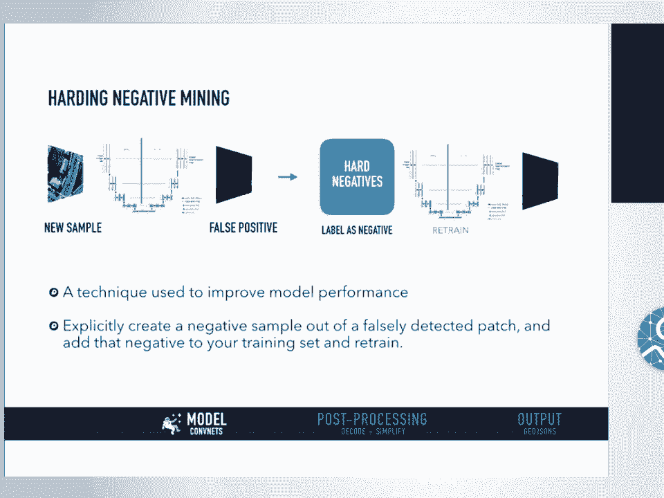
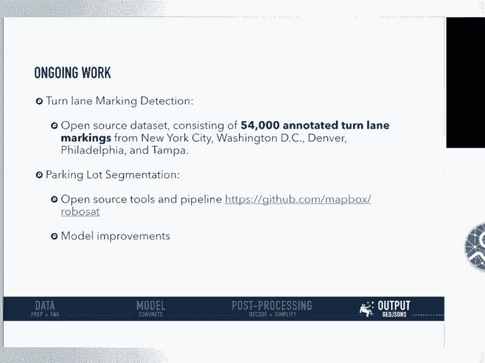
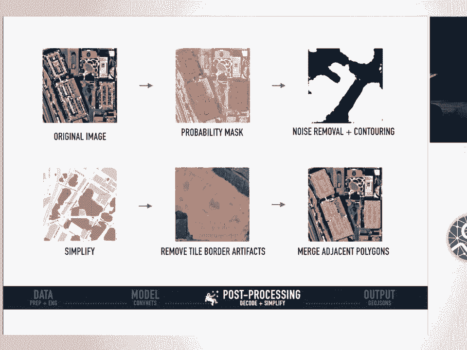
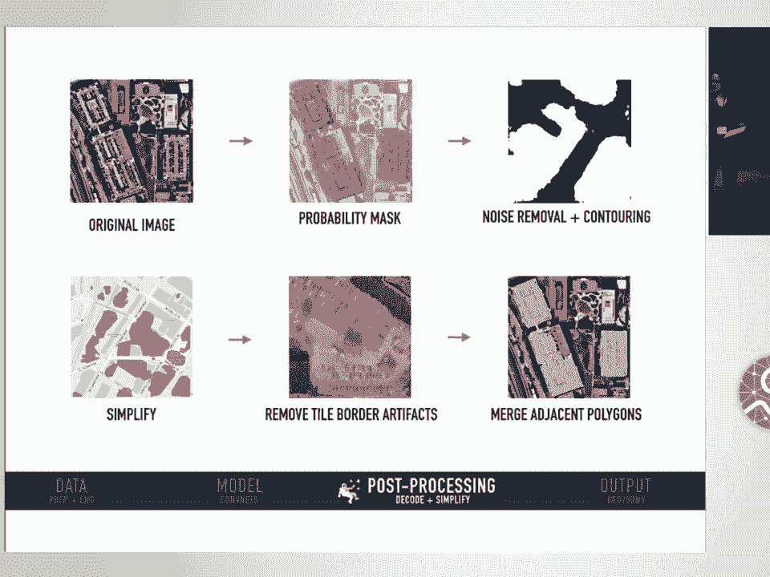

# P63：SciPy 2018视频专辑 (P63. Scalable Feature Extraction with Aerial and Satellite Image - GalileoHua - BV1TE411n7Ny

 >> So before I begin， let me talk a bit about Mapbox。

 We're a location data platform for mobile and web services。

 and we build building blocks for map search， navigation products for。

 developers to easily integrate， these experiences into their own applications。

 So can I get a show of hands of for， those who've worked with imagery data or computer vision in general？

 Awesome， quite a few。 Awesome， so you probably know more than I do in this field。

 Computer vision has been one of the most exciting and rapidly growing fields within deep learning。

 So it powers a bunch of applications and technologies such as facial recognition， augmented reality。

 self-driving cars。 So today I'm going to talk about how it powers our map search and navigation product。

 In particular， our navigation product provides smart turn-by-turn real-time routing。

 So I'll be presenting the steps that we took to build deep learning pipelines and tools that。

 allows us to run object detection and semantic segmentation on aerial and。

 satellite imagery at large scale。 So as you can imagine。

 valuable assets in routing and navigation would include things， like turn-reception signs。

 turn-lane markings， parking lots， roads， buildings， and bridges。

 So the way it works for our navigation product is that we identify and map these navigation。

 assets on OpenStreetMap， which in turn powers our routing engines to determine the most。

 optimal routes。 We've been manually mapping these navigation assets onto OpenStreetMap for years until recently。

 when we started extracting them from imagery and mapping them at scale。

 So this is a typical workflow for our deep learning pipeline。 When we're designing these pipelines。

 we usually keep two things in mind。 The first thing is we wanted to be scalable in terms of the amount of data that we process。

 And we're talking about processing the whole world。 Wherever we have high resolution globally。

 we want to process that。 And the second thing is we want scalability in terms of how easily it is to incorporate。

 new classes or new navigation data assets into our pipelines。

 So when we're designing our pipelines and tools， we also rely on libraries that -- Open Source。

 libraries like SciPy and geospatial raster libraries like Risterio， Fiona， and your。

 usual friendly deep learning libraries， Carras， PyTorch， TensorFlow， and computer vision libraries。

 like OpenCV。 Osmium and JSON are OpenStreetMap data libraries that handle OpenStreetMap specific types of。

 data。 So let's dive into the pipeline。 As you can imagine， with any machine learning project。

 you start by collecting， cleaning， and， pre-processing your data。

 And the outcome of this step would be your training data set。 With object detection。

 the training data would be prepped by combining your imagery and your， labels。

 which is in the format bounding boxes。 So object detection deals with both classifying and locating a variable number of objects within。

 an image。 So the example that I'll be presenting today is a project we did on turn lane markings。

 So this problem， say， deals with classifying the five left turn lane only markings from。

 the two right turn lane markings in our example。 So we're not only interested in classifying what the left turn only looking -- lane markings。

 look like from the right turn ones， but also we want to understand where each of these turn。

 lane markings are located in our image。 So we use tools like Overbast， Pass， Turbo。

 and JLOSM to help us drop these bounding boxes， on each of the turn lane markings。

 We actually annotated over 54，000 turn lane markings for our data set。

 And we included things like turn lane markings of all shapes and sizes， even ones that are。

 partially covered by shadows and cars。 And we made sure to exclude turn lane markings that are completely erased or non-visible to。

 aerial imagery or are completely covered by cars。 So before we find these turn lane markings。

 we query OpenStreetMap to help us understand， where these turn lane markings are located。

 where can we fetch them， and what are the most， common classes for our turn lane markings。

 And we found that things like left turn only， right turn only， straight forward are the most。

 common turn lane markings， and we query them using JOSM。 With semantic segmentation。

 we did a project on parking lot segmentation。 So segmentation is slightly different from object detection。

 where you're trying to understand， the object in an image at a pixel level。

 So a way it works is it uses the pixels that are labeled to learn to identify the local。

 features which are associated with specific classes。

 And then you classify each of those pixels based on which class has the highest probability。

 for that pixel。 An example would be we want to understand parking lots。

 And we not only want to classify the pixels that belong to the parking lot that has a high。

 probability of belonging to a parking lot class， but also we want to delineate the boundaries。

 of our parking lots from its surrounding roads。 So to create the training set for parking lot detection。

 for parking lot segmentation， we combine imagery with a mask overlaying on top of our parking lot。

 So we use a tool called Osmium， which I mentioned earlier， to annotate over 56，000 images for。

 parking lot segmentation。 And we made sure to include parking lots that are not visible to aerial and satellite imagery。

 Examples would be garages， carports。 And the same similar process went through when we're creating the labels。

 We query OpenStreetMap looking for tags that are tagged to parking or when we're doing building。

 segmentation we look for tags that are tagged buildings。 So when we're building this at large scale。

 we build a data engineering pipeline to handle， all the labels and the imagery data that we want to package。

 clean and preprocess。 So this is--this data engineering pipeline actually sits within our larger computer vision。

 pipeline。 And what it does is it streams our labels， which are currently in world coordinates and。

 GOG is on format that we stored on Amazon Simple Storage Service or S3。

 And then we normalize these labels that are in world coordinates and convert them into。

 image pixel coordinates。 We then group them by typical tile web format。

 which is your zoom level and then x， y。 The labels are then joined with imagery fetch from our map box satellite layer。

 So the map box satellite is a global base map containing the most updated and color corrected。

 aerial and satellite imagery available。 So during this step。

 the labels for object detection or for my turn lane markings are， in the form of GOGson objects。

 So I would just keep it as my metadata in GOGson format。

 My segmentation--parking the last segmentation training set on the other hand， the labels。

 are actually in masks or polygons。 So instead of storing them as individual polygons。

 I would create a single channel overlaying， on top of my imagery， which is red， green and blue。

 So once I have my training data ready， I then uploaded back onto Amazon S3 for storage。

 Then whenever my models are ready to use， I can just fetch from the S3 location。

 So the way we scale it up is we first write Python libraries and command line tools to。

 handle each of the steps。 And then we scale it up on Amazon Elastic Container Service or Amazon ECS。

 And we usually run this at scale， usually multiple cities at once。

 For those of you who aren't familiar with Amazon products， ECS is a highly scalable， fast。

 container management service that allows you to deploy and store and manage Docker containers。

 on specific instance types that you specify。

 So once we have our training data ready， the next step is modeling。

 For our turn lane markings detection， we use fully convolution neural networks。 So at my box。

 we found that fully convolution neural networks work very well for both our。

 object detection problem space and our segmentation tasks。

 So this type of network is composed entirely of convolutional layers。

 And it does not contain any fully connected layers or multi layer perceptron typically。

 found at the end of your neural network。 There are a couple of advantages for this type of architecture。

 The first being variable input image size， which means you can virtually give it any。

 input image that you want and it would learn from it。

 And this is because in a typical neural network， your fully connected layer actually expects。

 a certain input size。 If you get rid of the fully connected layer in your network。

 then you're able to apply， the network to virtually any input size。

 The second advantage is actually your spatial information。

 The fully connected layer is typically found in a neural network。

 It generally causes loss of spatial data， spatial information。

 And so this is because by fully connected， we mean all the output neurons are actually。

 directly connected to all input neurons。 So when it comes to doing segmentation。

 there are so many constraints associated with fully， connected layers。 Specifically。

 it constrains the object categories and also the visual variation that you can。

 have when you're doing segmentation。 The third advantage is computational cost。

 the tradeoff between computational cost and， representation power。

 So if you look at the famous AlexNet， 90% of the weights or the representational power。

 actually sits in your convolution layers。 And the computation power is actually only 10%。

 So in other words， you're only using 10% of your computation to get 90% of your representation。

 capacity。 The fully connected layer in an AlexNet actually is opposite。

 It takes up to 90% of your computation power， but actually only contains 10% of your representational。

 capacity。 So researchers over in recent years have moved towards fully convolutional neural networks。

 in particular in the space of computer vision。 So for our turn lane markings detection。

 we actually went with an architecture called， the Olo V2。 You only look once。

 And the main reason is that we found that a lot of our applications actually require and。

 rely on low latency prediction from our object detection algorithms。

 So we felt that YOLO V2 was a good balance between speed and accuracy， giving us around。

 60 MIPs at 90 frames per second on a 416 by 416 imagery。

 So the way YOLO V2 works is it has a classifier model called the DarkNet 19 consists of 19。

 layers of convolutional layers。 And it is pre-trained on a dataset called ImageNet。

 And then for the detection task， it actually modifies and removes the last convolutional layer。

 from your DarkNet 19。 And it adds a few three by three convolutional layers followed by one by ones。

 and then your， number of outputs that we need。 So in our particular class， in our particular case。

 we had six classes of trin lane markings， that we were interested in。

 And so we modified YOLOs for architecture for our own use case。

 So two things to highlight about the YOLO V2 architecture is the first thing is batch normalization。

 which significantly helped us stabilize training， speed up convergence， and regularize our model。

 The second thing is when we were doing clustering analysis on our ground truth labels， the bounding。

 boxes， we found that most of our bounding boxes， as you can imagine， follow a certain， aspect ratio。

 meaning your height and width are very consistent。

 So instead of asking our models to directly predict and learn these bounding boxes， which。

 can be all shapes and sizes， we did the clustering analysis， took those results， and actually。

 used those as anchor boxes or prior to our models。

 So it actually significantly speeds up our training and also stabilize the whole network。

 Because parking loss segmentation， we implemented an architecture called UNET， which is capable。

 of also doing end-to-end classification， detection。

 and localization all in one with very few images。 So we found that it yields more precise segmentations than part state-of-the-art methods such as。

 the sliding window， convolution neural networks。 So the UNET architecture actually consists of a contracting path to capture the context。

 and the symmetric expanding path that enables precise localization。 So in our case。

 in the parking lot segmentation case， we're actually doing binary segmentation。

 distinguishing the parking lots from anything non-parking lots， which we label as background。

 The other architecture that we experiment with is called the Parraments Scene Parcing Network。

 which we found that it was good when the scene was complex， meaning it had when we were trying。

 to segment multiple classes， roads， building bridges all at once， and when the data set。

 had a great diversity in terms of visually。 But when we were applying such a network to our binary case。

 it was definitely an overkill， and it did not understand as well as UNET did。

 So once we had all our models， whether it be an object detection model for trainings or。

 a segmentation model for parking lots segmentation， one process that we do to improve our models。

 is called hard negative mining。 And let me take a step back。 In our training set。

 we actually labeled both negative and positive examples in our binary， case。 So the positives。

 as you can imagine， would include would be parking lots and your negative。

 examples would be non-parking lots or backgrounds。 So after we train a model， the first round。

 it might not come out as good as I expect and， then it may be， what that means。

 it might be throwing a bunch of false negatives。 So it might think some background pixels are actually。

 it's classifying the background， pixels as parking lots。 So hard negative mining。

 a hard negative is when we take a falsely detected group of pixels。

 and then we explicitly created a negative sample out of this group of pixels and then。

 we add this negative sample back into our training set。 When we retrain our model。

 our model with this extra knowledge should perform better。

 and understand the mistakes it had made the first round。

 So it is an expensive process but we found that this has significantly improved our models。

 both for segmentation and object detection。 So a couple of front end visualization tools that my team built to help us understand our。

 model results。 So this is an example of what we built for the trinline markings detection which allows。

 the users to pan around and do instant trinline markings prediction。

 This visualization tool was built for semantic segmentation which helps us understand what。

 our models are turning out in terms of probability and helps us in terms of debugging and do hard。

 negative mining。 So this was built on top of the map ox satellite layer and basically we could do instant prediction。

 over areas that we， over the entire area that we've ran through。

 So once we have our model outputs we're actually not ready to upload those results directly。

 onto open street map。 We do a series of post processing steps so we have our original image and then from our。

 model we get a probability mask。 From the probability mask we actually implement a few morphological operations such as noise。

 removal by dilation， erosion by dilation and then we also want to fill in the holes。

 by dilation followed by erosion。 So we use this technique to fill in mask or holes within our mask。

 holes within our mask， and we also do contouring which joins all the continuous points that have similar color。

 or intensity。 The next step is actually to apply the Douglas puker simplification which takes a curve composed。

 of line segments and find similar curve with fewer points。

 This step actually gives us cleaner and simpler masks or polygons that are more ingestible by。

 open street map。 The last two steps involved neighboring tiles。

 So when we were running this at scale we found that we had significant border artifacts。

 So what we do is we query and we match the neighboring tiles and then we merge， we add。

 an extended mask to it。 And then once we do that we're able to get rid of the artifacts。

 And the last step is actually to merge adjacent polygons。

 So you might see like the lines between one particular polygon and our models are actually。

 detecting two separate masks。 And the last step is actually to merge adjacent polygons to make sure we have one single mask。

 for one open street map feature。

 So once we have our entire， all the tools built and set up we actually run everything。

 at scale on AWS， ECS。 So we start from batch prediction and then we do batch post processing and scale that up。

 city by city。 The final output from our models is actually still in pixel space as you recall。

 So before we upload everything to open street map we need to go through two steps。

 We need to convert our model output from pixel space back into world coordinates in GeoJSON， format。

 The second step is actually we want to make sure we don't dump a whole bunch of duplicate。

 data into open street map which is shown by the community。

 And so we query the existing features off of open street map and then we do a deduplication， step。

 So some of the ongoing work that we'll be doing for our turn lane markings and parking。

 loss segmentation is that we're actually planning on open sourcing our 54，000 turn lane markings。

 dataset which is a huge dataset and so this includes both the label and the image。

 And we got this dataset off of five cities， New York， Washington， D。C。 Denver， Philadelphia。

 and Tampa。 And for the parking lot segmentation we actually open sourced our entire pipeline and all necessary。

 tools associated with it last month。 So it would be really great if you can submit bug reports or try to play with the tools。

 And with this library you can actually bring your own data， you can bring your own network。

 architecture and you can query， you can directly query our energy from MapBox satellite maps， API。

 And so in terms of model improvement we actually were working on swapping out the unit encoder。

 that I presented earlier with a pre-trained resident encoder。

 And we're also replacing the learn deconvolutions with nearest neighbor up sampling followed by。

 a convolution。 So we feel like this would give us maybe more accurate results but we know that it will significantly。

 speed up our training and prediction while lowering memory usage。

 So to sum up this talk was an introduction of how we built deep learning pipelines at scale。

 by combining open street map tags which we use as labels with imagery fetched from MapBox。

 satellite。 And then we run analysis at scale， we also were able to visualize our final model outputs。

 off of MapBox satellite imagery。 So thank you so much。 [Applause]， >> Thanks Virginia。

 That was a great talk。 We have time for a few questions。

 As a friendly reminder please phrase your question in the form of a question and ask， only one。

 Over the side of the room please line up at the mic and I will signal you and I'll run。

 the side of the room with this mic。 >> Hi。 So you said that the turn lane markings data set has been open sourced。

 Is the aerial imagery used to generate that data set also openly available？ >> Yes。

 So the turn lane markings is actually based on salary imagery that we purchased。

 And so it is free for use for research purposes。 For commercial purposes I would encourage you to email my team。

 I'm Virginia at MapBox。com。 I was able to snatch the first Virginia。

 So for commercial purposes you would actually need a license but for research purposes you。

 can just go and freely use our data。 So we will be -- we have not open sourced this data set yet but we will be at the end。

 of Q3。 The library that we have open sourced last month is the segmentation pipeline called。

 RoboSet。 And with MapBox Maps API you can also freely query that data set but unfortunately for。

 licensing agreements we cannot annotate and release the annotated training set。 That makes sense。

 >> Hi。 Thank you。 Great talk。 >> I'm glad right on what you mean by border artifacts in the post processing set。

 >> Yes。 I think -- yes。 So this artifact is actually not uncommon within imagery data that we deal with。

 And it's because mapping companies like Google， MapBox， we usually organize our image tiles。

 with what I mentioned earlier， tile web format。 So you can imagine the entire U。S。

 when you're zooming out it can be zoom level 8 or 9 and， that can be a separate data source。

 When you're zooming in you want higher resolution imagery and the way we organize these tiles。

 we're currently storing it as 512 by 512。 And the artifact actually comes from when we're doing batch prediction the model only。

 sees your individual image tile and it has no knowledge during the modeling set of any。

 neighboring information。 So the artifact comes from your parking lot can span over multiple image tiles and yet。

 your model only understands the actual image that it sees at the current state。

 So after we publish all our results onto the entire map what we see here is these border。

 artifacts that is pretty clear that cuts through our image tile border。

 So what we do is we actually add in a query and matching step to our algorithm so that。

 our post processing step understands what it should learn from its neighboring tiles。

 by extending the mask。

 >> Other questions？ >> So I have a question。 I'm curious that for turn detection did you guys ever saw like if based on the car movement。

 whether you could figure out what the actual turn is even if you didn't have any image or。

 if there are streets where there are no images just from the car movement you could sort。

 of predict what are the possible directions that are legal。

 So was that ever an effort that was done？ >> That's a really interesting question。

 So we have -- so these two projects are what we can open source。

 We have projects that are based on imagery that we've licensed such as street level imagery。

 from Bing imagery called street side。 And that street side -- the street side project is actually street level imagery。

 So the turn lane marking project that I mentioned earlier is actually static satellite view and。

 it is fetched from data that was refreshed earlier this year。

 So even though we say like we're refreshing data earlier this year the imagery itself actually。

 comes from 2017 -- yeah， summer of 2017。 So we're looking at a static view of what the street looks like from a bird's eye view。

 When we're doing street level imagery we're collecting data， we're collecting data at a。

 more frequent rate and also we're collecting metadata such as the location of where the。

 image was taken， the GPS coordinates of the car， of the vehicle while it was driving down。

 the street capturing this image。 So thank you for proposing that。

 We will be looking into how the vehicles are moving relative to the images that are captured。

 >> All right。 Thank you。 Thank you everyone also for your attendance。

 We'll have two more talks tomorrow。 [ Silence ]。