# SciPy 2018视频专辑 - P11：SciPy 2018视频专辑 (P11. Recipe2Vec - How word2vec Helped us Discover Related Tasty - GalileoHua - BV1TE411n7Ny

 Hi， I'm Megan Heinz。 I'm a senior data scientist at Buzzfeed。 My talk today is Residivac。

 or "How Does My Robot Know Which Resis Are Related？"。

 This is basically going to be a case study in how we used Residivac。

 to create a consumer-facing data product for Tasty。

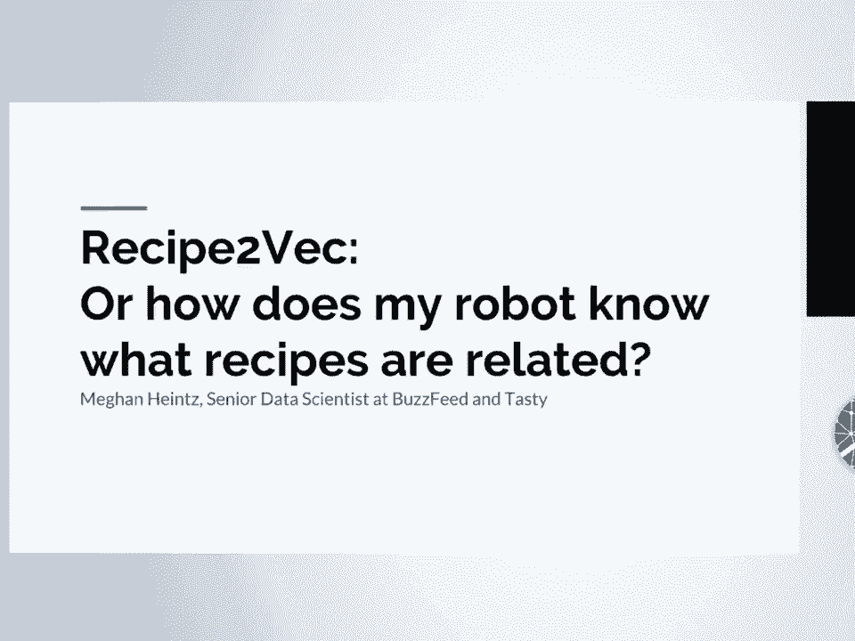

 So if you're not aware of Tasty， this is basically Buzzfeed's cooking brand。 They're these top-down。

 sped up cooking videos you've probably seen on Facebook。

 This basically came about when Facebook made their algorithm change that started biasing towards video。

 Buzzfeed data scientists did a bunch of experimentation and figured out。

 not only was Facebook biasing towards video， but very specifically to 90-second long videos。

 So we figured cooking was a great format for that， and we basically exploited the hell out of that。

 and grew a huge fan base。 So we expanded from our Facebook page to YouTube pages， Snapchat。

 and Instagram。 This was really， really successful for us。

 The general manager of Tasty always says we're like the biggest cooking brand in the world right now。

 I'm not really sure which metric she's using to measure that bi， but it certainly sounds nice。

 But this kind of had two problems for us。 First of all。

 as much as we were able to exploit that initial Facebook algorithm change。

 it's incredibly vulnerable to the subsequent algorithm changes。 So we didn't really own our users。

 They were all out on these distributed platforms。 And the other side of this is that we knew that both through looking at our own data。

 and through user research that people were actually trying to cook these recipes。

 And it was a pretty miserable process for them。 So we would see that people were scrubbing and watching little sections of the video over and over again。

 as they were trying to kind of desperately jot down the ingredients and the preparation steps。

 So that was just not great。 So we decided to remedy that and build two new destinations。

 So both our iOS app and our website so that we can kind of control that experience。

 and give people a really easy way to come in and find these recipes and actually cook them。

 So we knew kind of from the beginning that we wanted to create a related recipes module。

 And we wanted to do this for two reasons。 One kind of selfishly。

 we wanted to be able to recirculate users from our most recently published new recipes。

 to our older recipes。 And then for kind of the user centric reason。

 we saw from our own data on BuzzT。com's video pages。

 that people would tend to look at the same type of recipes in a session。

 So they would look at a couple of dinner recipes or a couple of meal prep recipes or a couple of dessert recipes。

 So we kind of understood that when someone was looking for a recipe。

 they did know generally what they wanted to cook， and that we could help them out by kind of narrowing that potentially exhaustive search to a couple of like related recipes for them。

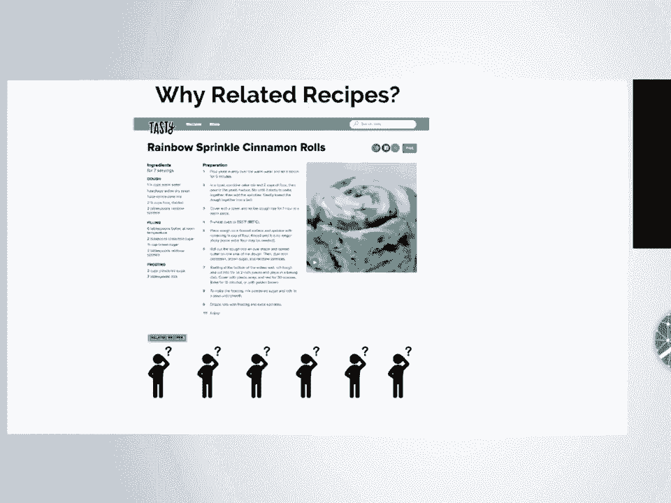

 So that kind of begs the question， why do you even really need a data scientist to work on this？

 Don't we have video producers and chefs that can tell us which of our recipes are related？

 Turns out not really。

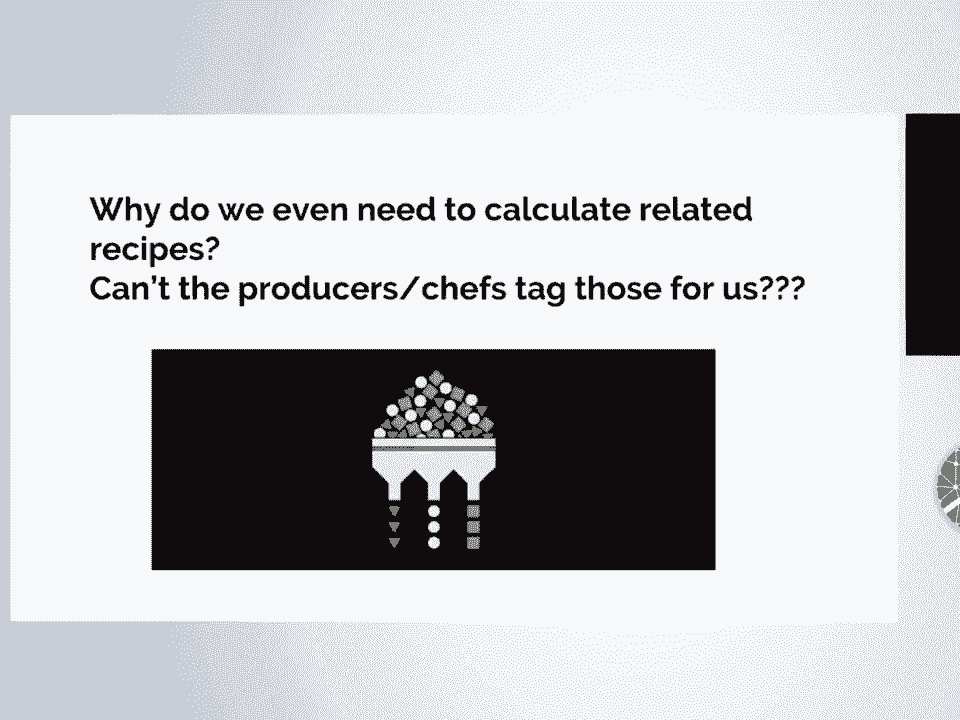

 If you have ever worked with user generated data， you will know that most of the time it is utter garbage。

 We worked to get our producers to tag like what they thought was a dinner recipe or a breakfast recipe or comfort food or dessert。

 And it ended up being like a giant giant giant mess。

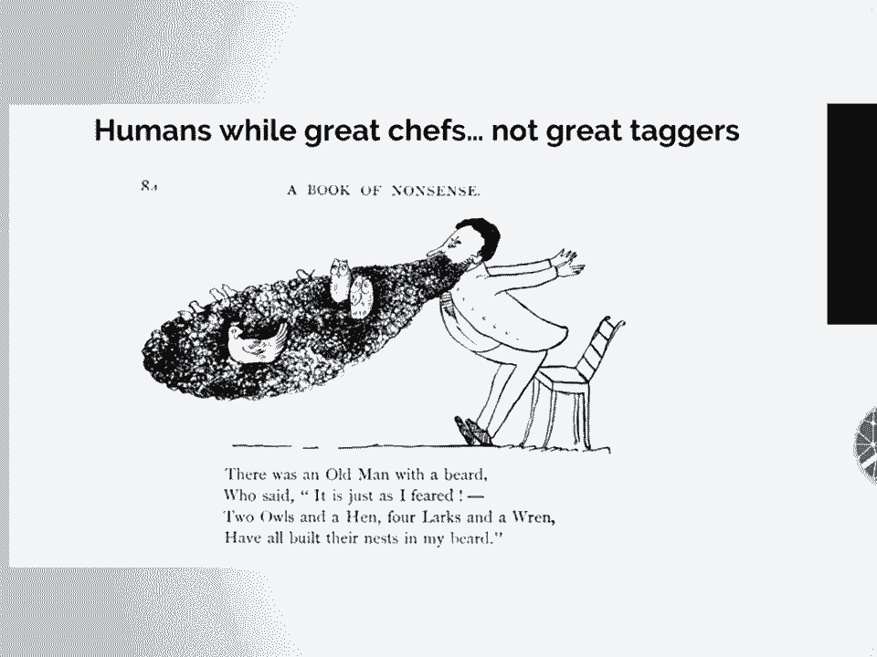

 My favorite example of like really awful human tagging is we had this like list of mocktails which are like yes。

 technically they do not have alcohol in them， but I certainly do not want you recommending that my child drink a Moscow mule。

 Another one that like drove me completely insane was we had these little like cocktail teriyaki meatballs that you would have at like a fancy like cocktail party。

 And they were all tagged as breakfast。 I was like really who is eating this for breakfast？

 So we know that we can't really rely on humans to do this。

 so we are going to have to figure out some way to do this programmatically。

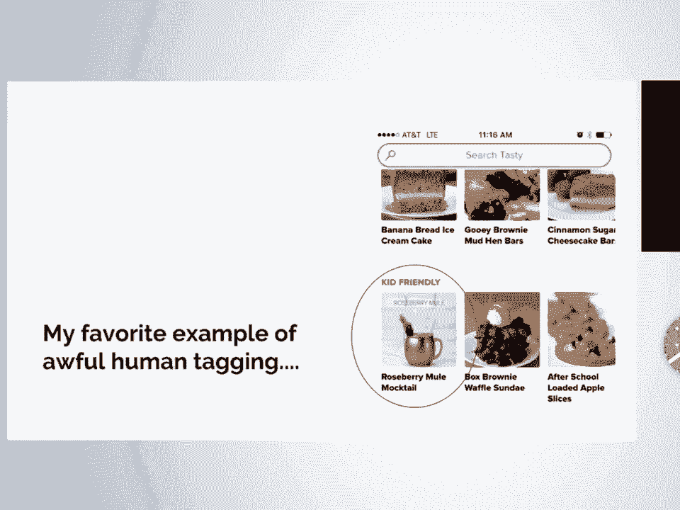

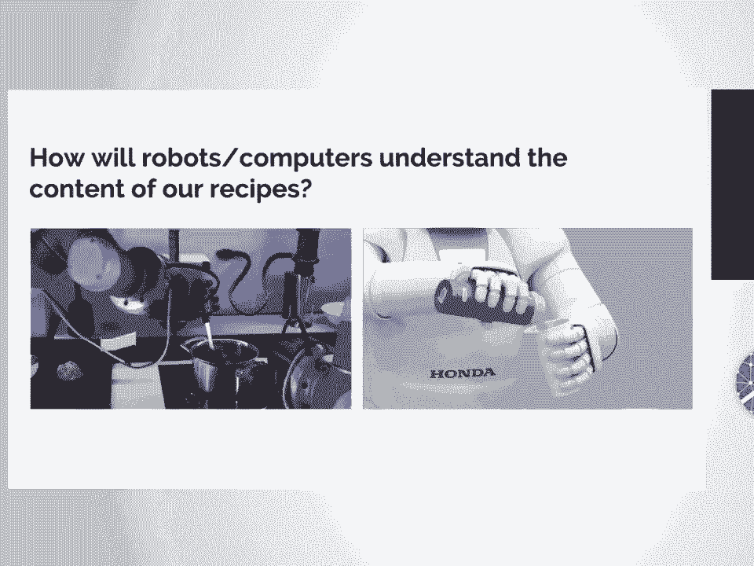

 The first kind of thing we thought about in order to kind of categorize this data was use the list of ingredients。

 So we thought that maybe we could use these as categorical variables。 So first we thought， you know。

 maybe we can use dummy coding。 You might have used this before with pandas。

getdummies which basically takes all of your categories and turns them into a binary dimension。

 So zeros and ones for whether or not the ingredient is present in the recipe。

 The other way that you can do this is label encoding where you take your list of categories or words and you convert them into a list of numbers。

 Both of these methods kind of have issues for us。 In get dummies you're adding a dimension for every ingredient thus increasing the dimensionality。

 We have the cursive dimensionality。 Our data becomes sparser and sparser。

 It's harder to converge on a solution。 For label encoding we have a different issue。

 We're kind of implying that there's some type of order or ordinality in our world。

 And there's nothing in the physical world that tells me that apple should be two and yogurt should be three thousand。

 Both of these methods have the same issue that we had a lot of different ingredients in our recipe space that were very very similar but would be encoded completely differently。

 So things like 2% Greek yogurt and Greek yogurt would be two totally different columns with the dummy coding method and they could be totally different numbers with the label encoding method and not even close together。

 So they might be like ten thousand or like twelve。

 So there's some other more advanced techniques like polynomial and helmet but none of them really like solve these issues for us。

 So we're not going to move forward with this method。

 Instead we're going to take a word embedding approach and for wording beddings you have this raw text of corpus。

 Text corpus in our instance recipes and you create vector representations of the words in the corpus。

 So in this example eggplant ends up being this list of small floating point numbers。

 The kind of intuition behind this is that when you plot these vectors in an dimensional space the similar words will end up spatially closer together than the dissimilar words。

 So like dolphin and porpoise are close together but Paris and camera are relatively far apart。

 There are actually a lot of different ways to make word embeddings but they all kind of coalesce around the same idea that a word is characterized by the company that it keeps。

 One very simple way to make them is through TFIDF term frequency inverse document frequency。

 It basically looks at the frequency of the term in the document versus in the rest of the corpus。

 Kind of gives you an idea that does not that important but maybe the word mango is more important。

 There's another family of word embedding methods that are word to word co-occurrence matrices。

 The most famous of which is glove which was developed at Stanford。

 It's a log b linear model with the way to least squares objective。

 And then there's another family of them in neural networks。

 The most famous of which is word to VEC which is developed at Google and it's essentially a two layer neural network。

 That is actually the one that I ended up using。 Word to VEC has two different implementations。

 One of them is skip gram and one is continuous back of words。

 We're going to talk about skip gram today and I'll kind of throw in how that's different from CBO as we go through it。

 So how we actually implement this is we take a sentence like add sugar vanilla and salt and then beat until very smooth。

 We decompose this into context words and target words。

 Your context words have like a window so in this example we have a window of one word but you probably have something like five or ten words that you're looking at。

 So add and vanilla end up being the context words for sugar sugar and and or the context works for vanilla and so on and so forth。

 Each of these words is initialized with a random vector of very very small values。

 You take those vectors and you try to protect the context words from the target words using a softmax regression classifier which is basically a generalization of logistic regression。

 So in continuous back of words it's actually an opposite。

 You're trying to try to predict the target words from the context words。

 These are basically like tricks to generate additional training samples for your model。

 So the first time around when you make this prediction it's going to be complete garbage because you have totally random vectors。

 But that's okay because you're going to go back and select update your word vectors take a small step in order to maximize your objective function。

 using stochastic gradient descent which is basically a hill-clang method and bought back propagation which updates the weights in your neural networks layer。

 You're just going to do this over and over and over again until you reach some type of stopping criteria be it maximum of iterations or your word vectors stop changing very much。

 And this is kind of what it looks like from a neural network standpoint you have your input vector your hidden layer of linear neurons which you're updating with back propagation and your output softmax classifier which is giving you a probability of each word。

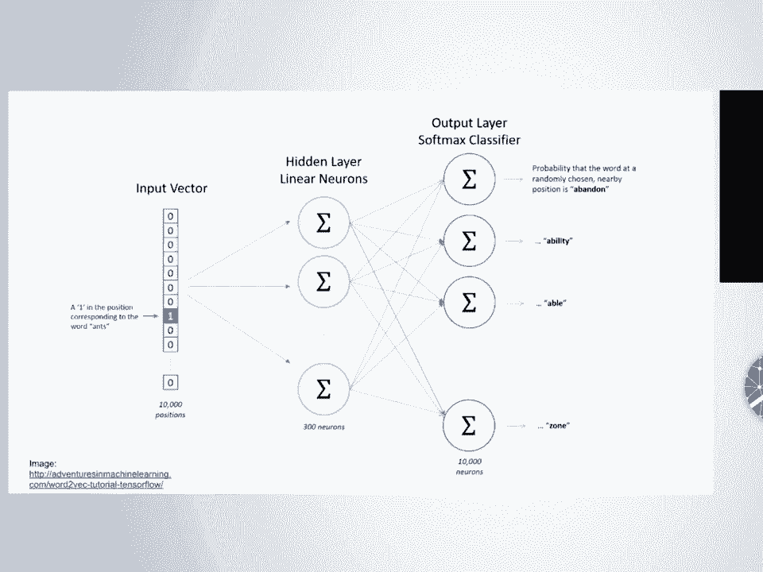

 The way that word to VEC is different from the other neural network implementations are these three things word pairs and phrases sub sampling and negative sampling。

 So in word pairs and phrases previous implementations had just treated every single word as a completely separate entity。

 So the canonical example from Google's paper was Boston Globe now has its own word vector rather than being two separate vectors for Boston and Globe which is important for us because obviously that has a very separate meaning together than it does apart。

 The other thing that happened is the implemented sub sampling basically takes all the really frequent words and decreases their occurrences in the training samples because it really doesn't help us that much to constantly be recalculating the vector for the。

 Another thing that happened was negative sampling。

 So before once you made a prediction you would go back and update the word vectors for all the words that were not the predicted word。

 And that just take takes a lot of time and a lot of computation。

 So instead we're going to just randomly select a couple of words that are not the predicted word and update those rather than updating all the vectors for the entire corpus。

 And then obviously you also update the vector for the positive word which is the word you should have predicted。

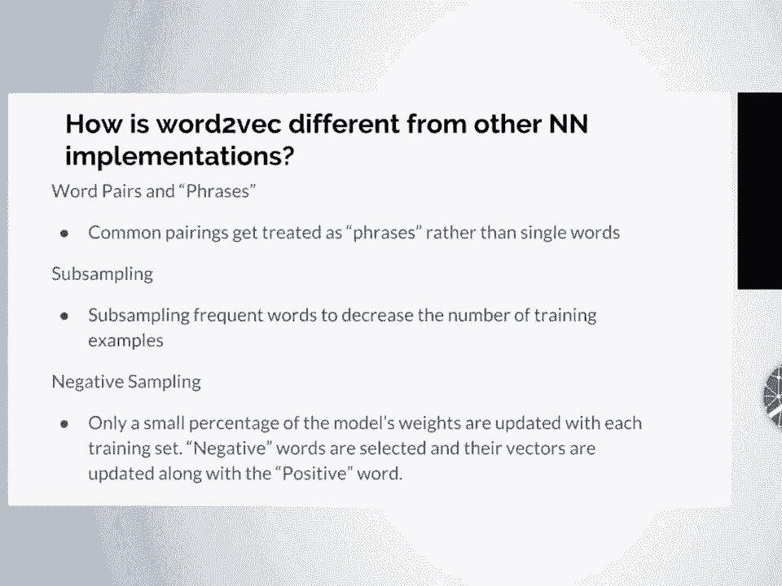

 So once we have these learning beddings how do we actually go about evaluating them。

 These are like 70， 100， 200 dimensions long。 We can look at this cube and see that like as humans we're really not even able to evaluate three dimensions。

 So we're probably going to start with some type of dimensionality reduction technique。

 And there are a couple of different ways to do this。

 I think earlier in the conference we learned about a new one called UMAP。

 But generally we have the matrix factorization methods like principal component else or PCA and the neighbor graph methods like TS and E。

 I kind of find PCA a little more intuitive but we're actually going to use TS and E for this method。

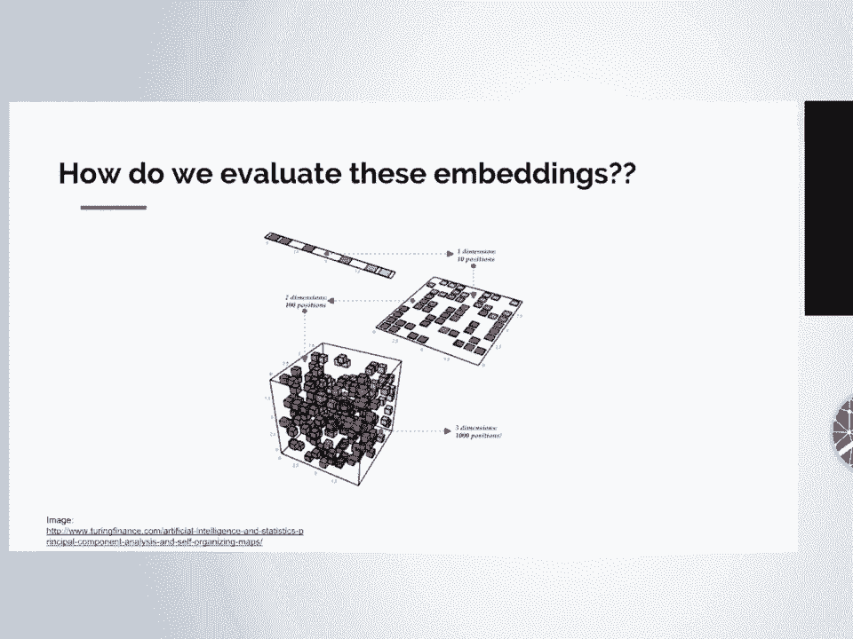

 And that's basically because it's been found to be a little bit better for visualization。

 It won this kind of prestigious Kaggle award and it kind of solves this thing called the crowding problem where all your observations end up in the center of your plot。

 Now it's not a silver bullet though。 It can be a little difficult to interpret these plots。

 First of all， hyperparameters really really matter。

 Perplexity which is basically the knob that tunes whether or not something is a neighbor can really drastically change the output of your visualization。

 So you're going to want to like maybe look at a few different versions of this even with the exact same hyperparameters。

 Every time you make one of these visualizations it's going to come back a little bit different。

 You also don't really want to over interpret these plots。

 So the size of the cluster and the distances don't necessarily mean anything。

 So I went ahead and after training my Word2Vec model on preparation steps and my recipes looked at the word embeddings for I think the hundred most common ingredients in my data set。

 So I apologize the font is a little small here but in blue we see all of our different like pastas like spaghetti and then weeding are together in this purple。

 All of our alcohols like bourbon and gin and whisker together and red is espresso and coffee and up in the top and green is sage rosemary and thyme。

 So we can kind of see that our model is learning something interesting and useful about this food space just from the fact that I'm a human and I know that pastas should be closer together。

 But that's not really enough we want to look at this from another perspective as well so we're going to look at the cosine similarity of these vector embeddings。

 In the original paper the relationship that was used to kind of tune this model was looking at countries and their capital cities。

 Now in the food space we don't really have these like strongly defined relationships where I know like how similar an apple should be to an orange。

 But I do have an idea that salad should be much less similar to cake as tort and guacamole should be much much less similar to chocolate as it is to cocoa and ganache。

 So once I've kind of played around with this and I feel confident that my model is learning something interesting about the food space what do I do with them。

 I don't want related ingredients I want related recipes。

 The nice thing about word embeddings is they're kind of modular you can kind of add them up some of them retain a lot of the same meaning kind of canonical example of this is of course king minus the vector for man plus woman is very similar to the vector for queen。

 So we're going to use that same concept and we're going to sum up all the word embeddings for all the words in our recipes preparation steps in order to create our recipe vector。

 From there we're going to go back to TSNE and evaluate how our recipe vectors are looking。

 So I know that I said that humans are really terrible at tagging but we are showing some tags from our producers where healthy is in blue。

 comfort food in yellow， desserts in green and alcoholic beverages in purple。

 We can kind of see the desserts in green are smeared across the bottom。

 comfort food and healthy food near the top。 They're kind of like mixed in together because to be honest none of Tasty's recipes are that healthy so I'm saying healthy ish。

 But we can kind of see that like we ended up with like all these eggnog recipes together kind of we've got our meal prep recipes close together。

 We have a bunch of like kind of duplicate recipes like turtle brownies and they also ended up together kind of our meal prep recipes are together。

 So we feel pretty good about how these recipe vectors are looking so we're going to move on and work actually going to productionize this and use this as a module on our website。

 So the way that we actually productionize this is we had our MySQL database with our structured recipes。

 We have a queue reader that uses the JIN SIM implementation of Word2vec that pulls in our preparation steps。

 trains our Word2vec model。 We create our recipe vectors and then from there we use cosign similarity to find the 20 recipes that are most similar to each recipe。

 We store that in Redis which is our key value store。

 Tasty API retrieves that and then serves it to TastyCo and TastyApp。

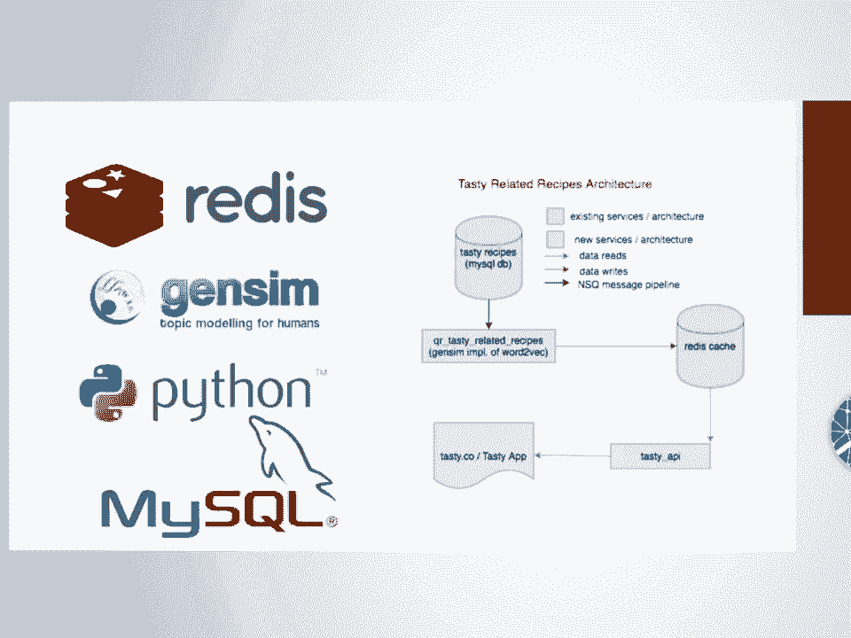

 We're publishing about 15 to 20 recipes a week。 Video production takes a while。

 We apply this model every time a new recipe is created to the stale model and then we completely retrain the model every 12 hours。

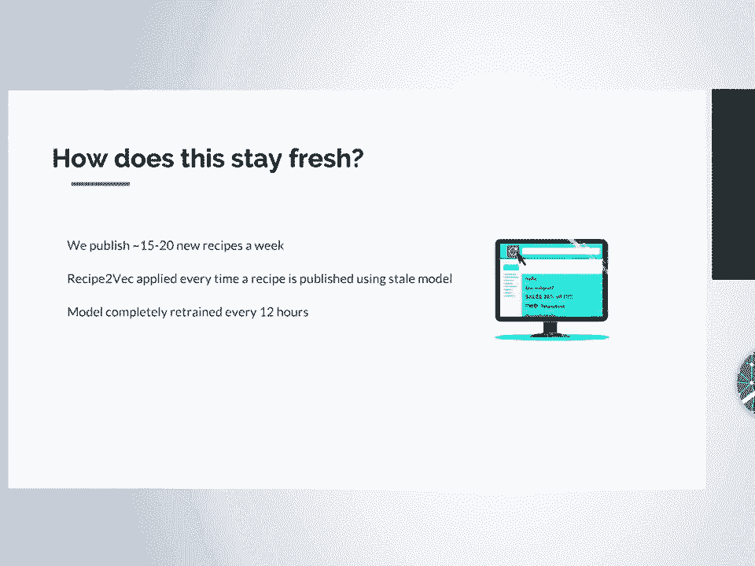

 So this is what it actually looks like on our website today。

 I was really excited when I saw these sample results。

 We have a lot of these like cheese stuffed in meat recipes and we like found all of the cheese stuffed in meat recipes。

 It's not really what I would like to have for dinner but I think a lot of our fans love these recipes。

 Previously we probably would have just had to rely on tags in order to populate this module。

 And I'm going to tell you that about half of these were tagged as healthy so you can see why that would be problematic。

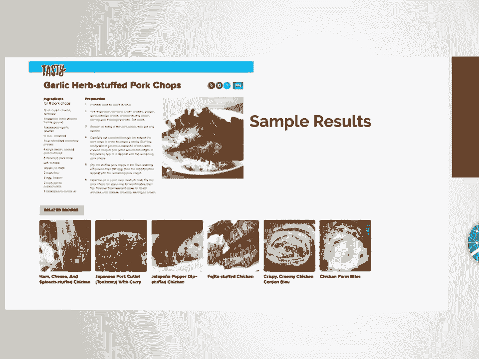

 Another example is this like springberry pie。 We found all these kind of like meringue。

 cheese cakey like fruit desserts to show up。 Previously we would have been able to do show desserts which at least was a little more accurate than the healthy tag。

 Another example with like this broccoli rice stir fry。

 We've got all these kind of like week night like rice and meat dinners together。

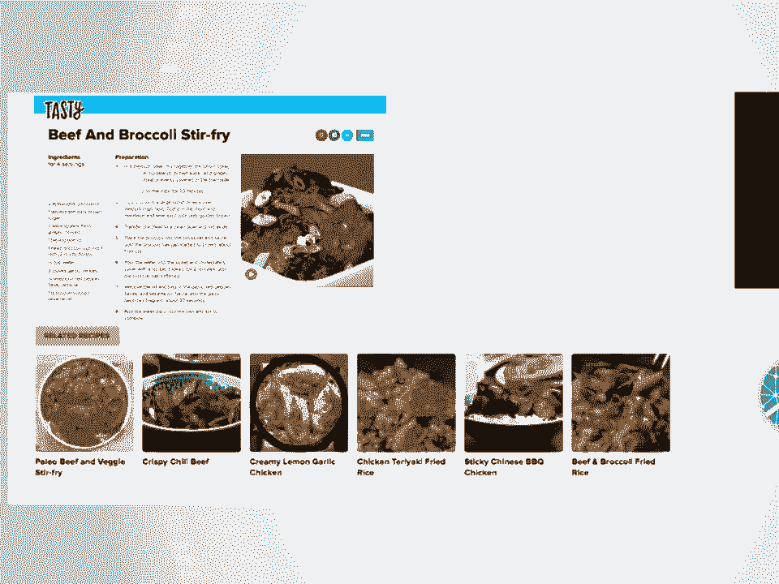

 All of our alcoholic beverages are grouped together。

 There are some like weird quirks in this though。

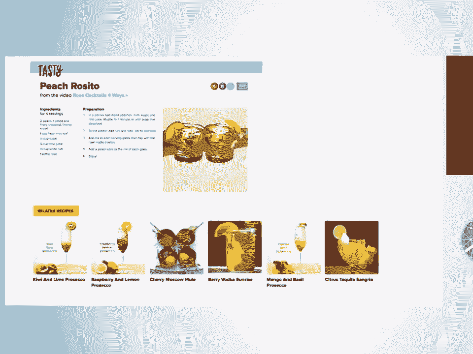

 We do have like things that are very similar with respect to their preparation steps。

 They're actually quite different in their use。 So like this pina colada recipe is very very similar obviously to these smoothie recipes but I would say with respect to user intent。

 We are much closer to the petre rosarita or the berry vodka sunrise。

 One of the other things that came up was actually the scaspacho recipe was also very similar to these smoothie recipes。

 It is basically like vegetable or like a fruit that you like blended in a smoothie so it makes sense that that would happen。

 You can kind of just use some simple heuristics but in general this was like way better than we could ever could have done just using human tags。

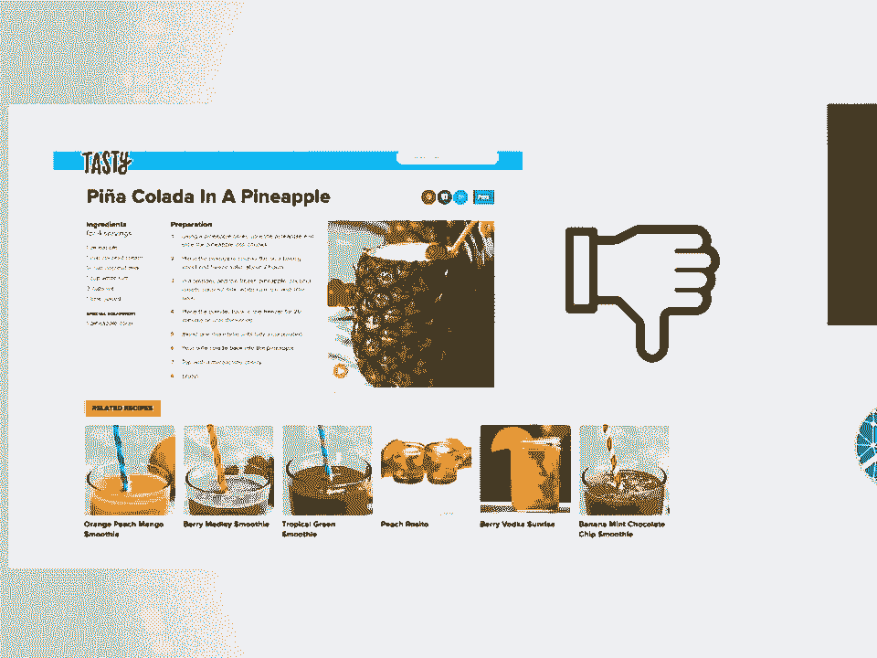

 So these are kind of some other ways that we either are already are or investigating using it tasty。

 So we can try to predict the performance of new recipes based on the performance of older similar recipes。

 create kind of more context aware recommendations kind of combining collaborative filtering with these recipe similarity metrics。

 making recommendations to reduce about what types of recipes they should be making。

 And generally they're very useful in features for our various machine learning applications。

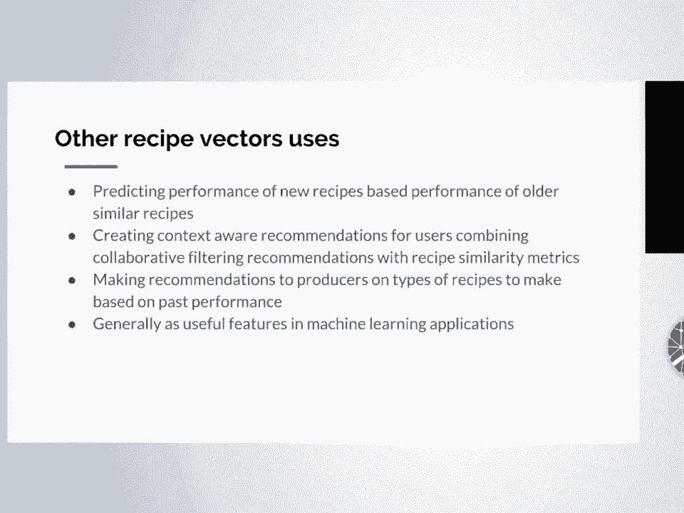

 So yeah that is the end of my talk today。 I'm going to build for questions。 [applause]。

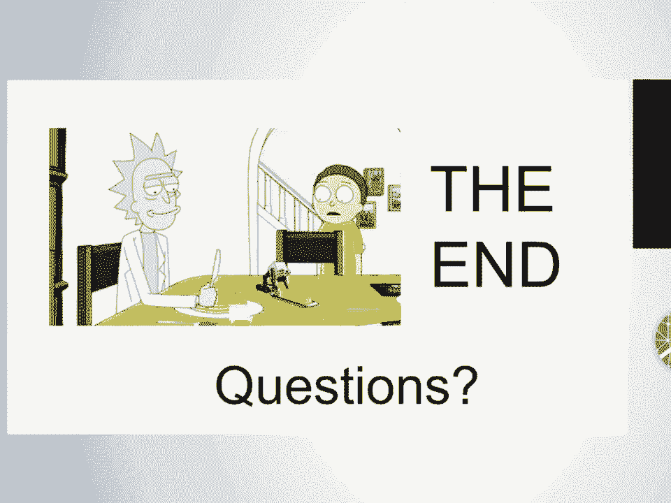

 But speed is also hiring if you're interested。 Get in contact with me。

 We have a mic up here for questions where I can check what we're at。 Thank you。 Great talk。

 Thank you。 So what's your， how big is your training set and what's the dimension of your vector space？

 And what's the dimension after you do the dimension reduction？ Sure。 So we have about 3，000 recipes。

 We augmented that with another 10，000。 We have 70 dimension vectors。

 We kind of played around with different dimensions for that。

 I had just like these giant spreadsheets where I was like pulling my coworkers on what they thought was a good result。

 And I didn't see huge differences moving from like 70 to 100。

 So 70 things did default from Word to Vex paper and we felt that actually worked pretty well。

 I feel like there was another part of your question though。 Yes。 After the dimension reduction。

 Oh just two dimensions。 Just two。 Yeah。 And another question。 For the Word to Vex model。

 the weights of the neural net is updated after each gradient descent。

 And the vectors are also updated。 So I don't understand why this thing actually converges or does it converge？

 So more like the vectors stop changing very much or you say like I'm going to do a thousand iterations and after that I'm done。

 Okay。 So we。 Okay。 Thank you。 If you guys thought about adding nutritional information。 Yes。

 That is a big project this summer。 We have a lot of people who are working on that right now。

 We kind of initially shied away from that because we were looking at these recipes with like a pound of mozzarella cheese and we're like。

 "Yeah it's a lot。 It's going to be a lot of calories。"。

 So we're kind of scared to initially add that in。 But we're working on it right now。

 We have a product design intern who's doing mock-ups and we're looking at different sources of nutritional databases。

 Like there's a couple that New York Times uses and we're trying to figure out which are kind of accurate enough。

 Okay。 Okay。 We'll rotate one over here。 How much of the recipe article is brought in through the Word2Vec algorithm？

 Because I know a lot of recipes sites will have like a couple paragraphs before kind of just chatty about the recipe that don't talk about technical stuff。

 But might impart some wisdom in terms of the user intent like you were talking about without call it beverages。

 So we're primarily video。 So we actually don't have those like long like paragraphs about the recipe。

 And then we actually kind of consider that one of our strengths is like。

 "I know I go to like sites to look at recipes。" And I'm like， "Wow。

 I'm like reading out your whole life but I just really wanted to make these muffins。"。

 So right now we just use the preparation steps。 Okay。 Hey， thanks a lot。

 This is actually kind of a related question。 I'm curious。

 When you split the ingredient list into these context and target words。

 is that a manual process or do you do that sort of thing？ So it's actually not the ingredient lists。

 Or the preparation steps。 Yeah。 We had initially like had all these like random plain text files of these recipes in the last like four years。

 And we structured that into a database for the purpose of making the app and the website。

 So it wasn't a manual process。 We just used MySQL and then kind of munched them in Python。 I think。

 But you need to specify which are context and which are target？ No。

 that's all kind of handled by Jensen's implementation。 Oh， okay。 Yeah。

 And you like one of the important parts of that is setting your window size。

 So you could say like my context is five words around or ten words around and that's like an interesting hyperparameter to play around with。

 So are you trying to predict the next word？ Is that？ So you are in there's two implementations。

 There's continuous bag of words and skip gram。 And skip gram you are trying to predict。

 I believe it's the context words from the target word and then the opposite。

 They're like two different versions where you're trying to predict the target word or you're trying to pick the context words。

 I see。 Okay。 We'll switch again over here。 Have you seen an increase in clicks on recipes and submitting the algorithm？

 So this is a launch feature。 So yes， we have zero clicks。 [Laughter]。

 We initially took this approach because we were building a brand new website。

 So we didn't have any historical data。 So we have other recommendation engines at Buzzfeed that are kind of more typical item to item cloud or filtering。

 But we chose to take a purely context aware approach because we didn't have any historical data。 Hi。

 So I see that you took kind of like an NLP route to try to solve this problem。

 And I'm curious because there's tons of ways of being able to vectorize words。

 What made you settle on word to vet？ Was it just the ease of understanding like how to use it or had you tried multiple methods up to leading up to them？

 That was just the best performing one。 I looked at a couple of different methods and to be completely honest。

 Jinsim's implementation was just so easy to use。 It was like very much the like path of least resistance forward。

 I've kind of thought about using other methods。 I have an intern right now who's looking at Doc2Vec。

 and another intern who's looking at Glove for different implementations。

 But at the time it just like worked really well and we're happy with it。

 And since we're a business there were like tons of other fires to put out at the time。 Fair enough。

 Thank you。 A very interesting idea。 It seems you are trying to create a word to work in using the recipe。

 a corporate right？ And do you think it's reasonable because in word to work you learn from the context。

 So basically the word has a similar context， a similar vector。

 But like for example in recipe for sugar you can have context in coffee and the glina。

 But you can also have the context like fried pork。

 I believe you have something like in Chinese food like the sweet sugar pork。

 So do you think that will create a similar vector for sugar？

 So there is context in that we're using the preparation steps and not the ingredient lists。

 But we do have a very like specific type of recipe that we were training on。

 So I think you're right if we like added some recipe for a totally different culture。

 Probably our vectors would be pretty far off。 But luckily we're only making vectors within this space where there's like the same like 20 people who are writing recipes。

 Okay we have time for one more question before we have this switch over。 Hey great talk。

 I was wondering if you're tracking clicks through the website to like validate whether these recommendations are actually related or not。

 Yep。 You are。 We track everything。 And I guess are they pretty well？

 Well so one of the things is like we have that module and then we have a trending module and we really only show the trending module if we don't have similar recipes。

 So what we are usually using to try to understand if this is working is the recirculation rate and the exit rate。

 So how often is someone actually clicking on another recipe or are they leaving the website entirely。

 And right now it's contributing a pretty substantial portion of our traffic。

 So pretty happy with it。 I think there's still like a lot of experimentation we could do to make sure this is really the best way to do it。

 But right now it works well。

 Alright with that let's thank Megan for an excellent talk。 [APPLAUSE]， [BLANK_AUDIO]。

