# SciPy 2018视频专辑 - P16：SciPy 2018视频专辑 (P16. Building a Weather App using NOAA Open Data & Jupyter Noteb - GalileoHua - BV1TE411n7Ny

 Hi everybody， my name is Philippe。 I'm very nervous to be here and speak in English and， it's 5/10。

 Brazilians are very， very superstitious， but if by any reason I think or I run away。

 my buzz is what here and he knows everything。 He should just pick it up and he can talk， about this。

 I've been collecting how people describe what I do during this conference。

 And these are all titles that people gave me。 Well， this is the one that I actually gave， me。

 I'm a physical sonographer。 But some call me a data plumber， a coach， a mentor， a， CI babysitter。

 or the Amazon dashboard for Condaforge。 That one I heard yesterday。 So this talk is。

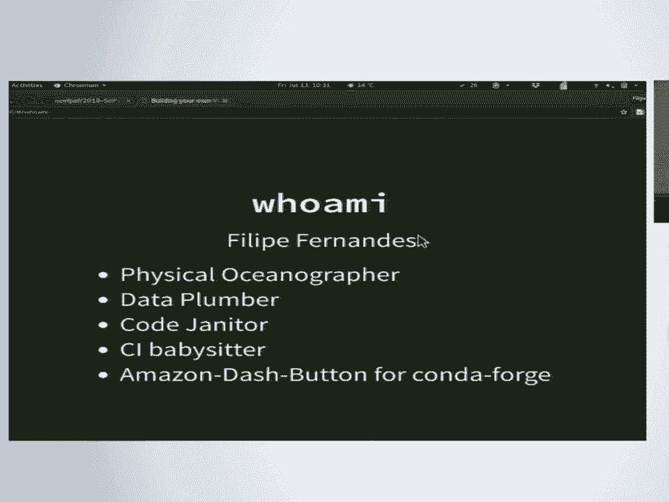

 not new。 There are many， we've been talking about this for a while here。 It's HiPy。 All。

 talks delivered by great rich signal right here。 There was this one on standards that， we're using。

 And another one on how we use that standards to assess ocean models， for， example。

 There is kind of a symmetry here because he was always speaking and he was showing。

 mine those books。 Now， I'm speaking but I'm going to show his notebooks。 So just before。

 we actually dive into the talk， I would like to introduce what this I use。 Micah is over， here。

 Yeah， he's over there。 So if you have a used question you can ask him because I'm。

 just going to glance it over。 I use the integrated ocean observing system。 It's actually actually。

 a community where we try to set up all these standards and a way to make the data go from。

 the data provider to everybody。 We have like a lot of records for gliders， HF graders， ocean。

 models， the receiving animal telemetry who was here on the first lightning talk where。

 Alex showed the animal telemetry network that was pretty cool。

 We also have a code gallery where we demonstrate how to use all these services and data。 So。

 I invite you guys to visit this。 It's all open。 It's all copy and pasteable examples。

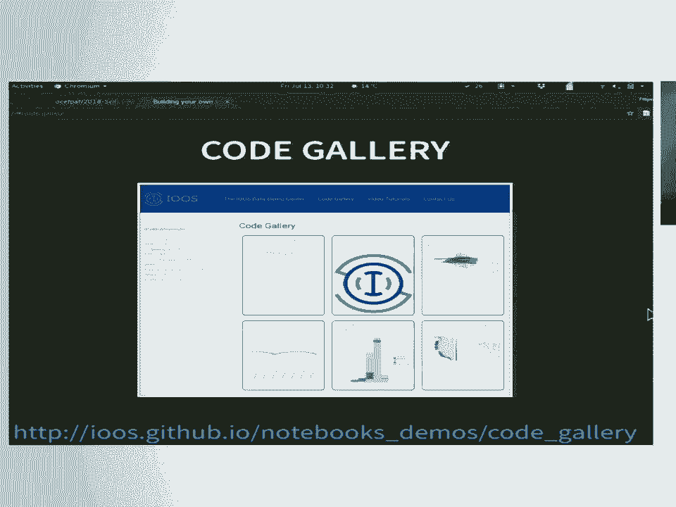

 In fact， this presentation is a little bit of that。 So what are these standards I'm talking， about？

 We try to follow international standards。 The open geospatial consortium， ISO and what。

 we need data to dictate us to use and what we get from that。 We try to avoid customer。

 specific solutions。 We try to implement these standardizations at the data providers of。

 the lowest level possible。 And the model is pretty simple。 People run medical models。

 they collect observations， the data provider apply the standards and they serve the data。

 via web services。 And the end user is happy。 What are these web services？ Depending on。

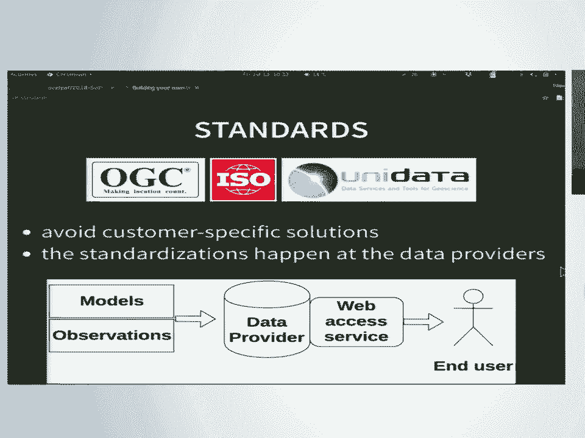

 your data type， it can be the sensor observation system， SOS。 It's an open geospatial consortium。

 We use that for buoys， stations， like time series。 For the grid data， we use OpenApp， who。

 here is familiar with OpenApp。 Almost everybody。 And grid satellites。 And for a restor image。

 we use WMS， which is also an open geospatial consortium standard。 It's the web mapping， service。

 But lately， the community is converging to use ERDAP。 Who heard about ERDAP before？ Not so much。

 So ERDAP is something that I wasn't sold at first。 I didn't like it。 And， after which。

 bang on my head all the time， you have to use ERDAP。 I kind of fell in love， for it。

 I'm going to talk more about it later。 But it's not a -- there is a reason why the。

 community is converging around it。 It's pretty good。 So the sensor observation service， what。

 is that？ Pretty much like all the open geospatial consortium standards， they have a get capability。

 to get the metadata， a describe sensor to describe the instruments and what we really。

 want the get observation to get the data。 This is a typical URL for an SOS service。 But if。

 we had Python 20， it's a period to look at。 Especially if Python 26F is strings。 So we。

 can -- one can envision how to create a service or an app where we just populate those variables。

 with Python and you get， for example， a website where you can just click on the station and。

 see a time series。 Matias said that I should trademark Jupter time because no one used。

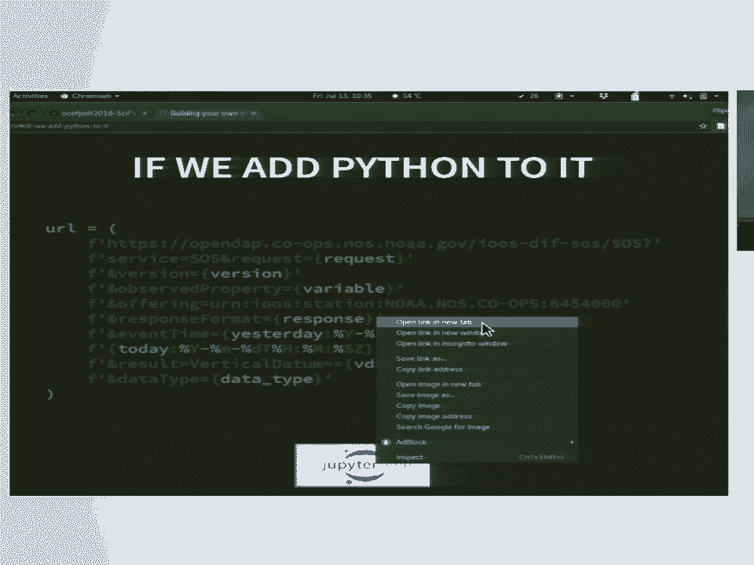

 that before。 So it's Jupter time。 So this is a typical example of how to access an SOS， service。

 I specify a buoy。 And I just wrote that URL on a pandas read CSV and voila， I， get the data。

 It's that simple。 There's particular stations here， Texas。 And we can see a nice。

 diurnal cycle for the tides。 The URL also has a student institute。 So putting it on a map。

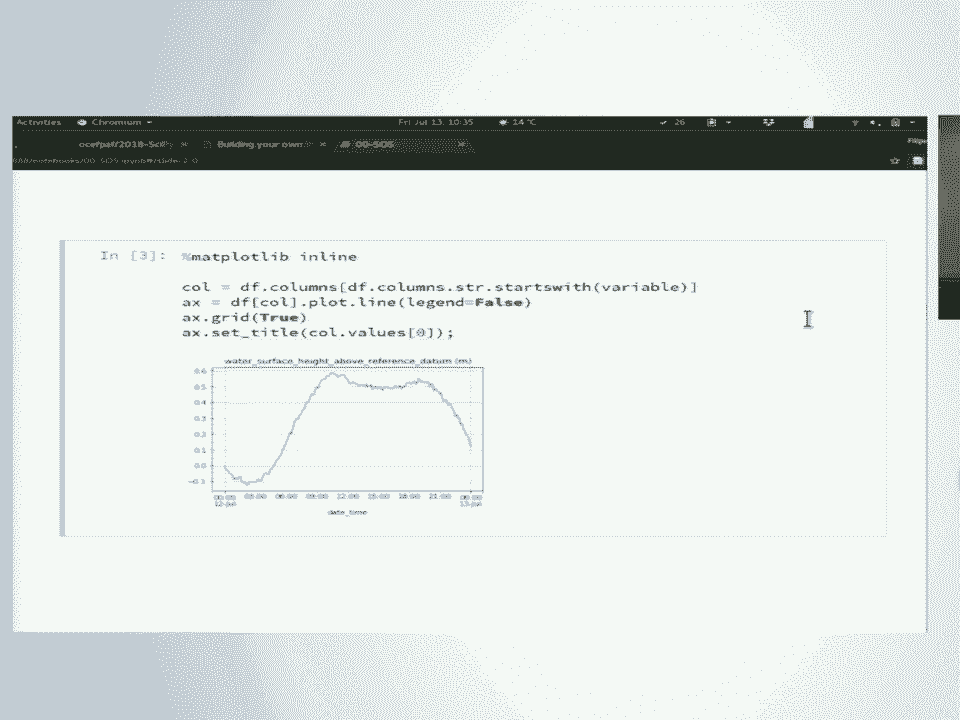

 It's a calveston area。 I'm not really familiar with that region。 But I think it's nearby。

 So the other service is open that。 And open that is kind of tied to the hip to the climate。

 and forecast convention which also allows us to read data in a standardized way。 This。

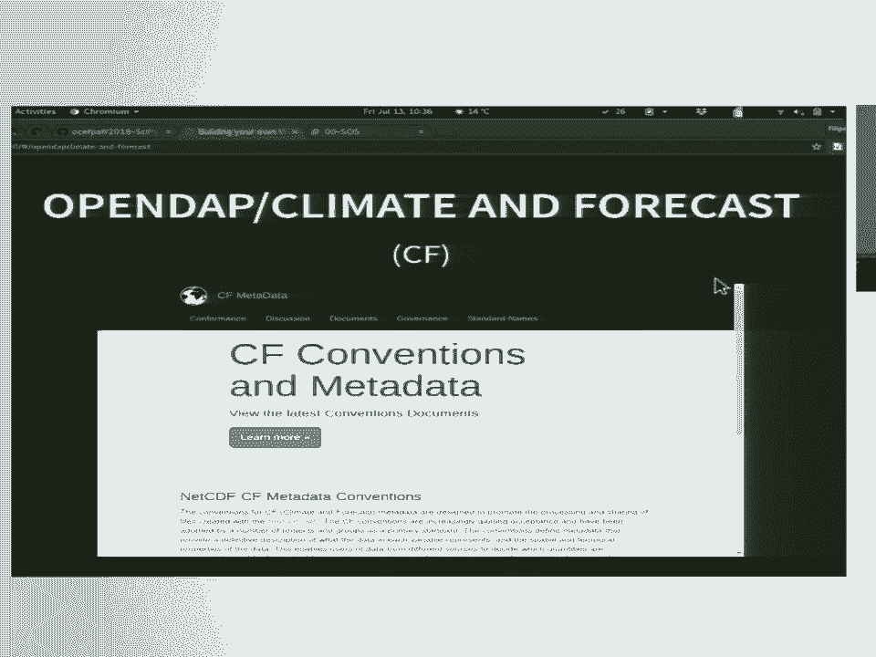

 is a typical CF metadata where you have the variable， the dimensions， the name， units。

 the coordinates where that variable is defined。 Here we also have the known dimensional vertical。

 coordinate which is usually painful to convert to a dimension vertical coordinate。 But CF。

 has all the instructions there to do it。 When it comes to CF， oh， it's Jupter time again。

 Sorry。 That was quick。 So usually in country read CF conventions， I use Iris。 And the reason。

 for that is that even though XR8 is great， XR8 doesn't do CF really well。 I always say， this。

 The best thing about Iris is that's a CF model。 The worst thing about Iris is that's， a CF model。

 So you have all these warnings when your data is not really compliant or sometimes。

 it even doesn't load the data at all。 It needs to be real CF。 But if it is， you get a nice。

 representation of all the metadata and everything that's in there including you get for free。

 derived vertical coordinate which most clients won't do that for you。 You need to complete。

 that yourself。 It's easy to plot and inspect the data。 And again， you have the vertical。

 coordinate there。 So the third one was the WAPIMET service。 It's kind of a simple HTTP。

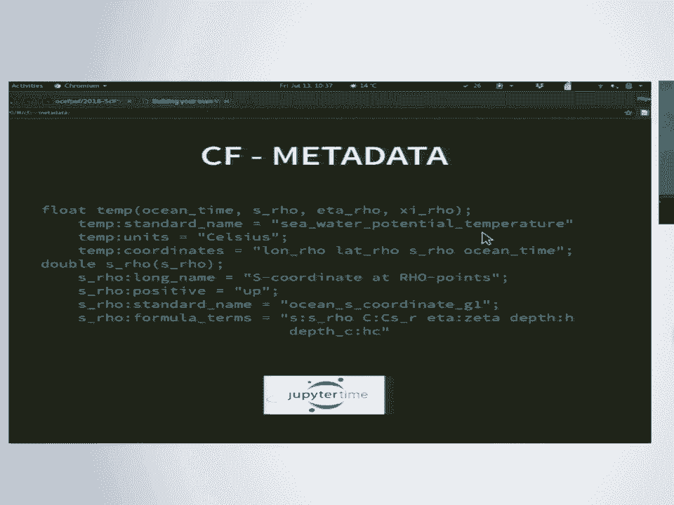

 interface to get geo-restored data。 Like the OGC you have the GAT metadata， the GAT sensors。

 or in this case it doesn't have the answer but in the GAT data you can serve JPEGs， PNG。

 dutives and a typical WMS URL looks like this。 Oh， sorry。 This is the URL。 In this case I'm。

 using some of the MS search like the time interval and the color range。 And that gives me a really。

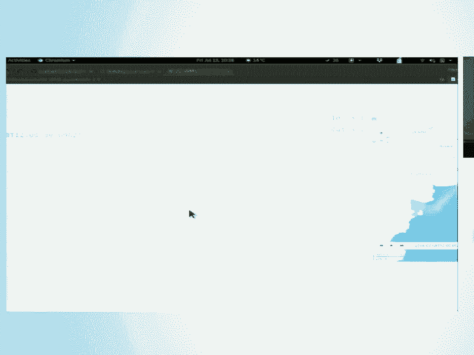

 nice map where I can have a time slider and I can actually tune in what I want to show， there。

 This one I didn't use text as I use my favorite oceanographic feature with the， Brazil。

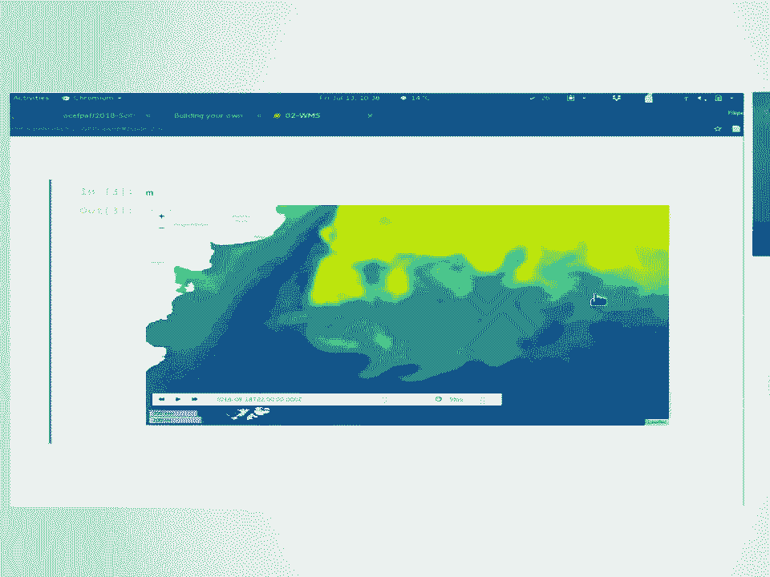

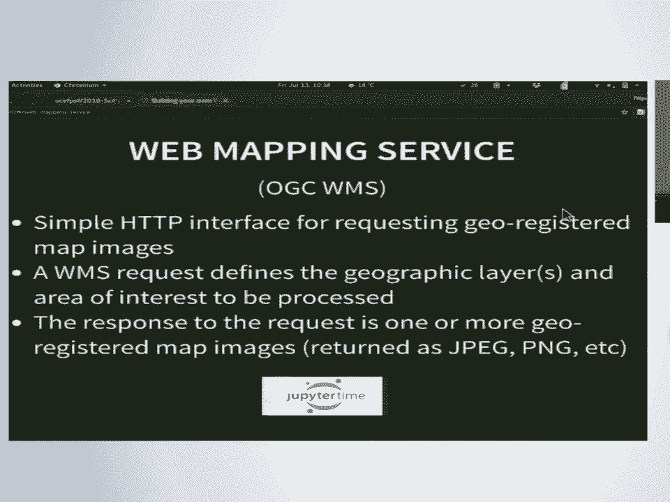

 in there。 You can have restor images， you can have time series， you can have models。 But。

 the best thing is that it's very flexible。 So the responses are multiple。 You can have。

 an HTML table， the areas as we ask and comma separate file， Google Earth， KML， even the。

 open app and that's how I started it because I was kind of a decade to open that。 I only。

 knew how to do open that so I started using every app， the open app。 You can have MATLAB。

 files because we play nice with our neighbors， NetCDF， the ODB text， format， comma separate。

 the files， step separate files， JSON， et cetera。 So all this flexibility is the reason why the。

 community is converging around it。 It has a really nice rest for API。 So everybody here。

 saw Christian thing talks on the website that they did。 That was really great but there was。

 a lot of work there that could be just outsourced to an air-dub server。 Especially because it。

 standardized the time coordinate and it has a server side searching and slicing。 So you。

 don't really send a lot of data back and forth。 You request， I want this time at this region。

 this license happens at the server and you get an image or the data in any of those formats。

 So here's a typical air-dub server。 Here I'm using an air-dub client。 By calling this an。

 air-dub client is an overstatement because of this restful API。 It's just a URL builder。

 And we're just filling with the curves that we want。 Like I want that regional that bounding， box。

 It's the goof of Maxwell if I'm not mistaken。 I want seawater temperature and I want from。

 the beginning of the year up to today and I want trajectory profiles basically because。

 I'm looking for gliders。 And I have the search interface which is really nice because it。

 gives me all the data set IDs available。 So now I pick up one of those data set IDs and I request。

 the variables for data set ID。 And I get a download URL。 In this case I request specifically。

 the MATLAB just to show that it does work。 But they have some convenience methods like。

 two pandas where I just get the comma separated file directory into a pendant data frame。 That's。

 usually quicker and faster for us。 And that's the data。 So it's very convenient。 Very easy to use。

 And here's a lot of that data。 So yeah， I think I was around here。 So this guide was navigating。

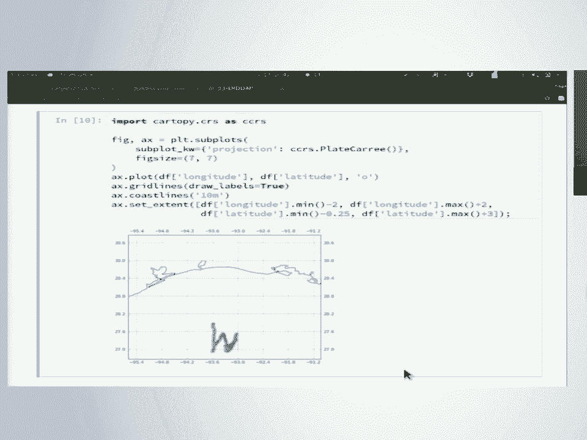

 here and the goof of Maxwell。 So yeah， but if you see there was a pattern。 At first on SIS I had to。

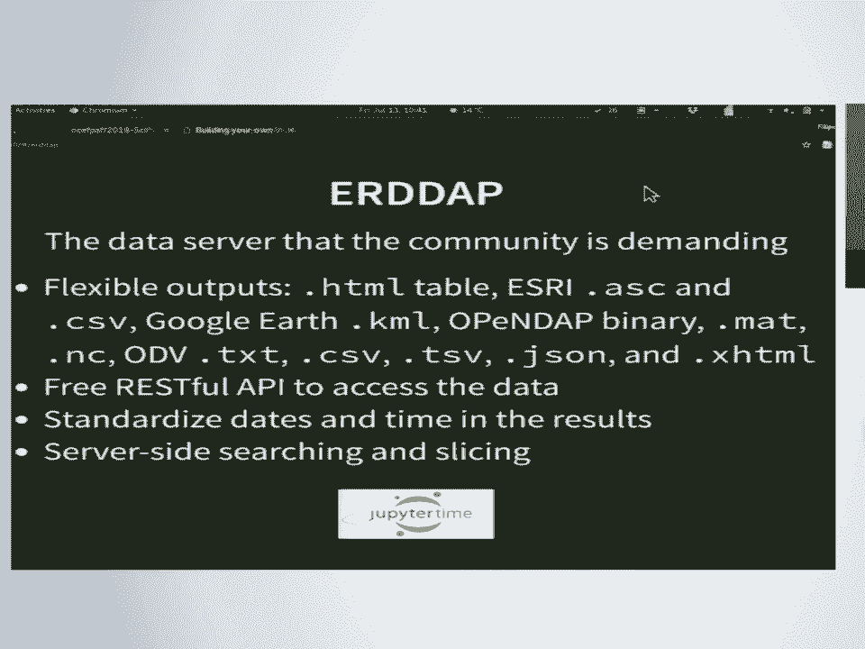

 hard code my stations and then on the open app and I had to hard code my endpoint with air。

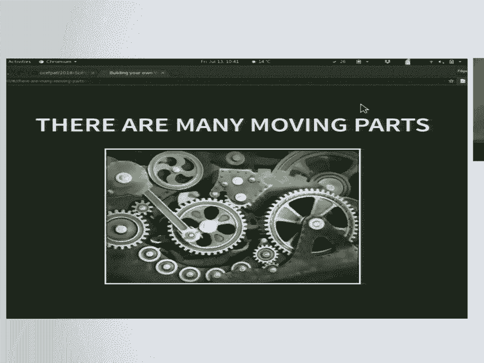

 that I actually didn't hard code the data set ID or anything but I still had one hard code for。

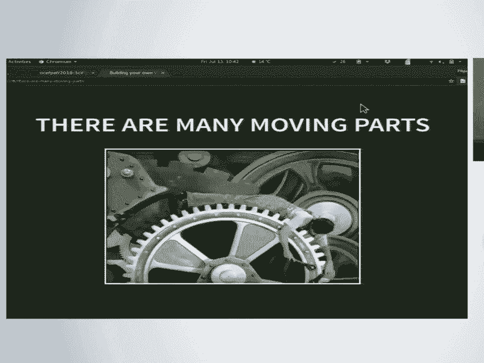

 the server。 There are many moving parts there。 So how to navigate all this？ The catalog。 That's。

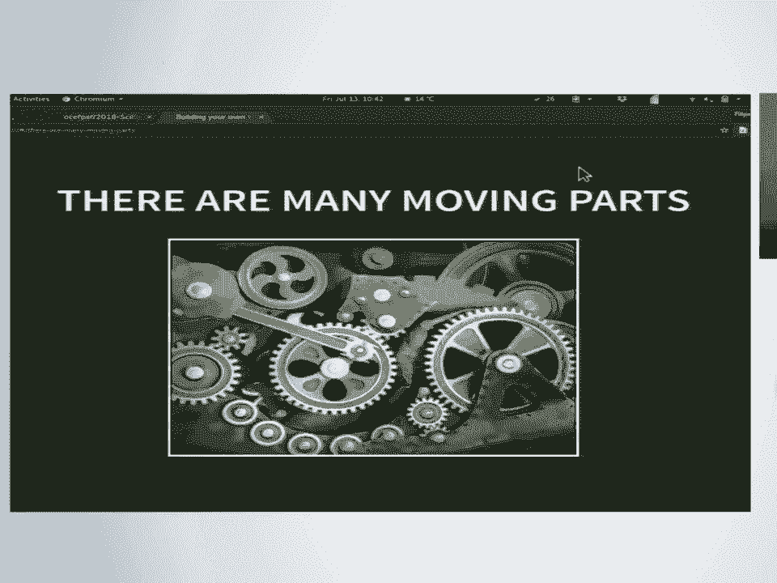

 actually the meat of this talk。 So I use HZGO catalog。 That's a single source to find all these。

 endpoints。 There is a nice Python interface via the OWS sleep catalog service web。

 We can do advanced， filtering use FAS and it's not like open search。

 We can create very complex filters with ores， not， and things like that。

 And it's really the one thing to rule them all。 Like time， all these services。

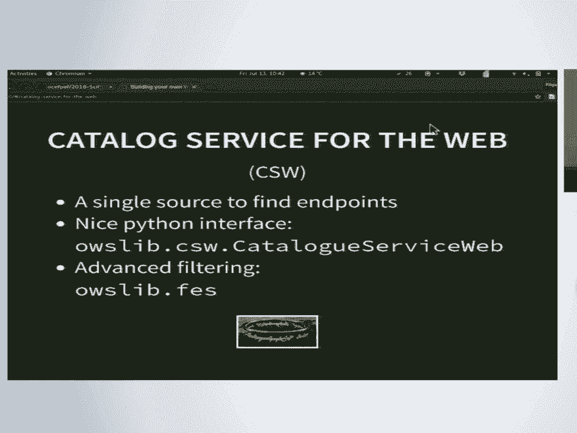

 in a single interface。 How does the catalog work？ We have this register table with all。

 the endpoints that we want to carry。 It can be threads as far as Urdap or Web endpoint。

 There are hovers， mightily。 They are transformed into ISO URLs。 So again。

 an internationally standard。 We didn't come up with anything new。

 We're just adopting what the community is using out there。

 We published that to the IUs regional apps。 We synchronized through the deal portal and we have。

 the catalog。 So how do we navigate the catalog afterwards？ We need to sniff those URLs。 There is。

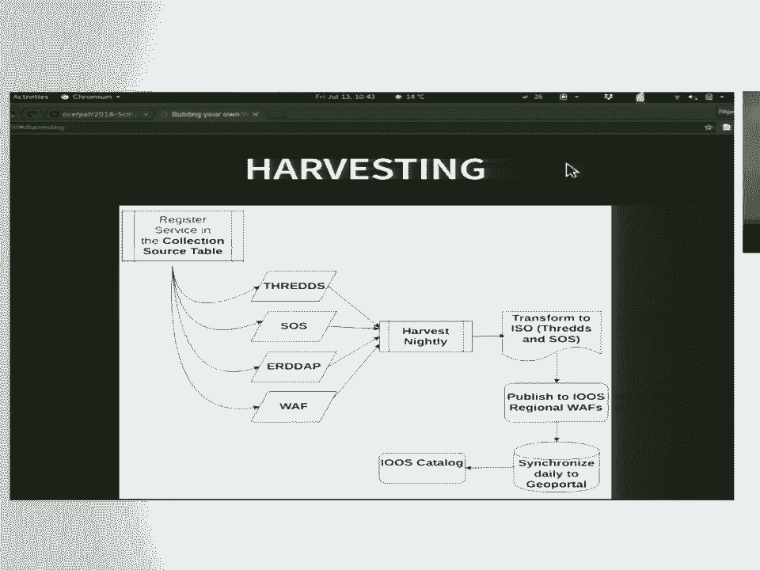

 a Python library for that。 It's called julinks。 Once we find the endpoints， we ask what kind of。

 endpoints do is this？ It's open dap， WMS or Urdap or whatever。

 They have some that we don't really use， that much。 Like KML or the same type of service。

 Just one zip and other one is not。 Jupter time。

 So how do we query the catalog？ It's relatively similar to how we query the Urdap server。 We have。

 a bounding box。 We have a time frame。 But here I can actually use many variables。 In this case。

 I have all the CS names， the client and forecast names for temperature。 And then we create a filter。

 like this where basically I say， hey， I want end that bound box at the beginning end or。

 one of these properties here that's those that are in the CF variable names。 And I don't want。

 anything that has this string CDIP。 So we can construct very complex filters to get only the。

 data that we want。 And then again， using the WMS sleep， we found 127 records for the Gulf of Mexico。

 Here are all the records。 I'm not going to all of them， but virtually all the buoys that we have。

 here we found。 All the I didn't find any models， Rob。 Where are your models？ Sorry。

 So we can go over the metadata to investigate more about what we find and what kind of variables。

 are available。 We can sniff the links and see the services。 Like they're usually all SOS services。

 But I think I found some open-up services。 And it's really nice because you can even find。

 direct links。 Like this is a link for technical report menu。 It's in there in the catalog if you。

 want to read it。 And again， we can just download the data very easily。 I got actually the same buoy。

 from the first plot where I hard coded the buoy。 But in this case， I found that buoy。

 automatically using the catalog。 There I plot sea level surface and here I plotted temperature。

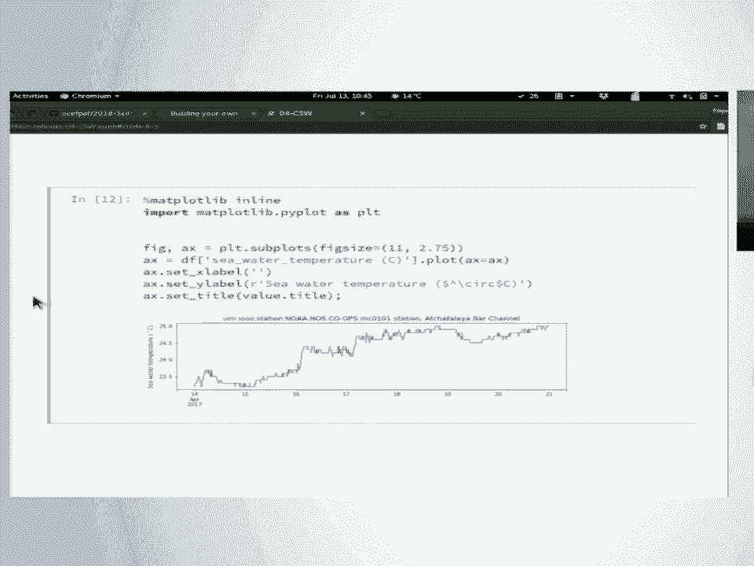

 But the title of the talk is how to build your own app。 And now I'm talking about this， standards。

 standards， standards in how to use those standards。 So now let's go through a real。

 example where we tied all the services together to do something really cool。

 So this one is not actually a presentation。 It's just a notebook that I'm going to go over。

 relatively quickly。 This one we hard-cowed a hurricane code from the National Hurricane Center。

 And this is the only thing that the user needs to set。 After this， it will download all the shape。

 files for the contradiction of the notebook for the hurricane。

 And based on the latitude and longitude， and time span that founds on that shape file。

 it will carry those services and get all the data， available for that region and that time。

 So basically there was a lot of boilerplate， code here to download the files and to create the filter。

 But the user doesn't really need to know， about all that。 He only changed the hurricane code。

 We found all these stations。 I single-out， one plot here just because it's a curious plot because we get the eye of the hurricane where。

 the wind speed went really down and we had the syllabus offers at maximum。 But then we put this。

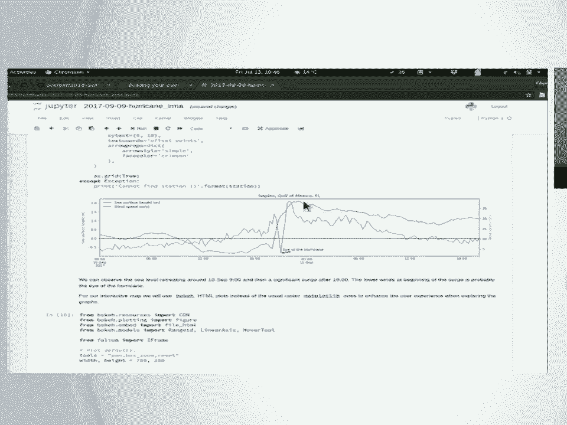

 all together in a really nice map like this one where we have a WMS， a sea surface temperature。

 on the background。 We have all the cones， predictions。

 We have the status of the hurricane in each point。 And if we zoom in。

 we have bulky plots showing all the stations that we found。

 Everything happened automatically just based on the hurricane code。 It's not the best one。

 There's two more。 Wait， there's more。 This one we actually。

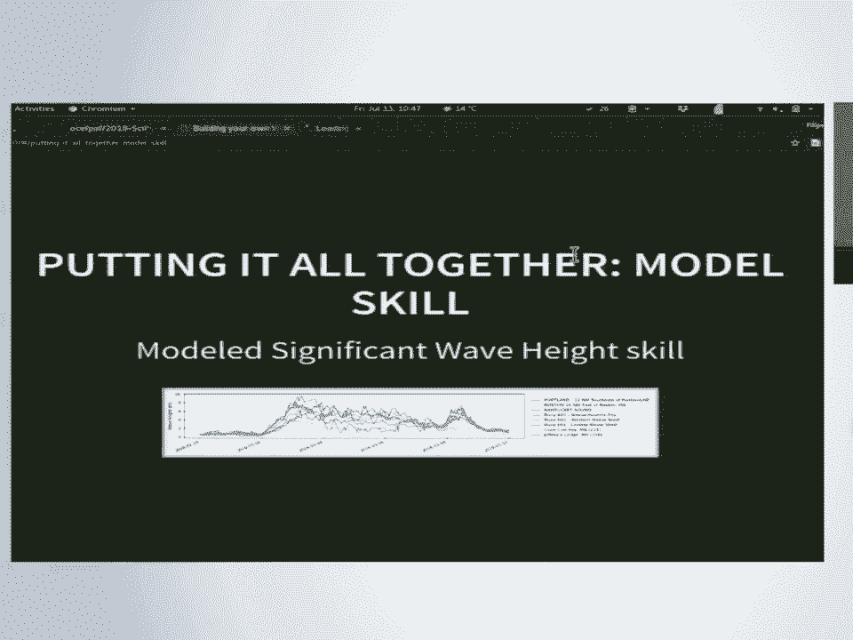

 this one， we just now showed a version of it some years ago where we did a numerical model assessment。

 for temperature and I think it was measures in sept-bay， right？ This one does a similar thing。

 but it's wave height assessment。 And this is how easy to switch applications。 Like in his case。

 he had temperature variables here。 I just switch it to wave variables。

 I tweak the data a little bit， and that's it。 I just rerun it and now I have， usually。

 the same notebook but instead of comparing， observations of temperatures and model temperatures。

 I'm comparing observations of waves and model， waves。

 All the models are found automatically and all the stations are matched to those models。

 automatically。 The only thing that the user changed is this cell right over here where we。

 declare the dates， the variables that of interest and the catalog。 And there is a nice trick here。

 where we standardize the units as well。 So I want everything to be meters。

 So we find something that's， in feet or centimeters。

 it will convert to meters so we can actually compare on the plots。 But that's not the best one。

 The best one is this one because it's the actual title of the talk。

 how it creates your own app using all the services。 So thanks to Binder， one can create a notebook。

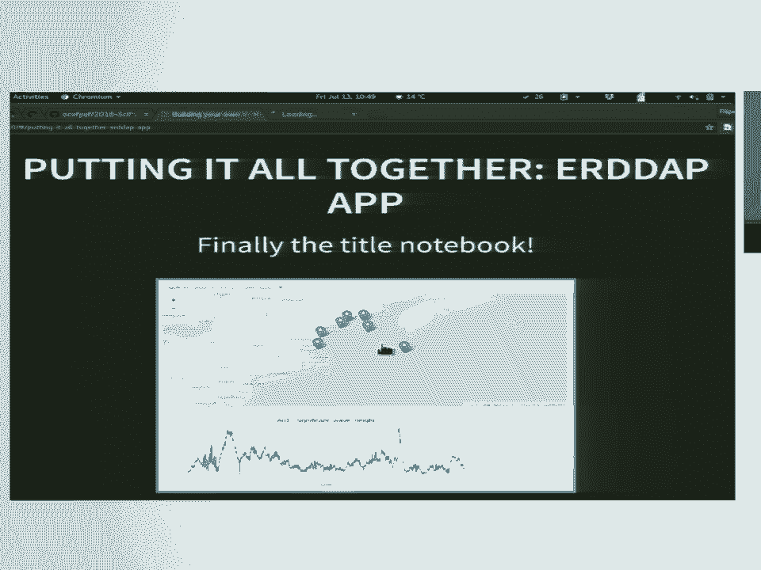

 in app mode。 In this case， we're using the AirTap RESTful interface to do this。

 And you can fool people to think that this is an actual app。 Why it's not？ It's just。

 a jubter widget where someone can click here and have an updated plot of that specific station。

 You can change the variable of interest here in this getting changed to。

 seawater salinity and which is going to be met at me because I didn't fix this。 When you have more。

 than one sensor， it will plot all the sensors together but it's pretty easy to fix。 You can create。

 multiple subplots in there but if someone doesn't know that this is a jubter widget， they're going。

 to think that it's a professional dash app that someone could up like Christian Things website。

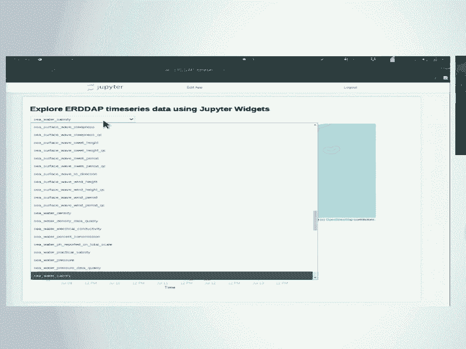

 Of course， sometimes you don't want this。 It's almost like a play toy but you can use that for。

 professional websites。 And this is a really nice example。 It's the Cucura Portal。 Cucura is one of。

 the regional associations for IUs where basically they access all the data that's available using。

 AirTap RESTful APIs and the server-sized licensing to create multiple kinds of。

 visualizations for models， buoys， gliders and whatever they're using there。

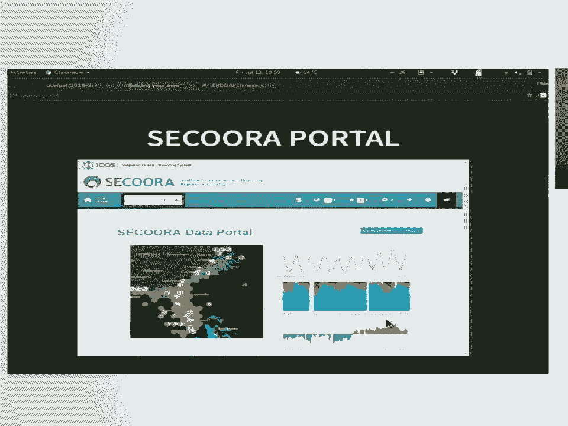

 So in summary， all these standards and web services in the catalog help us to serve the。

 in unified way。 Py2in Jupter is a very powerful tool for us to visualize and explore and fetch。

 this data and widget allows for fancy visualization and exploration。

 So that's what I had for you guys。

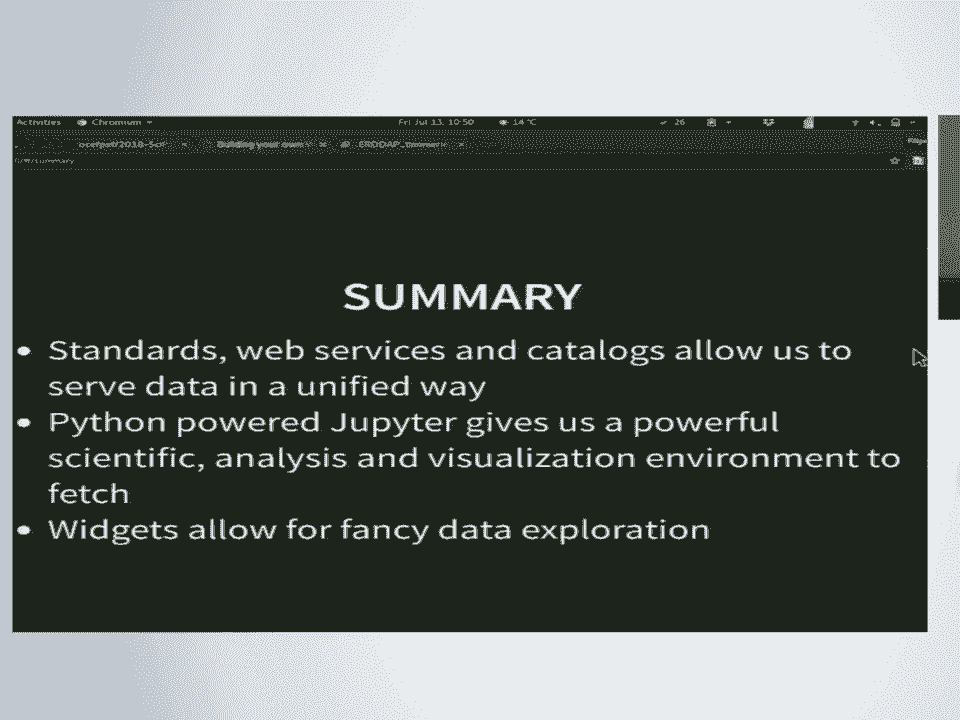

 Hope you enjoyed it and if you have any questions。

 I'm happy to take them and if you want to play with， this， just click on the by the link。

 I'm going to switch these slides and all the links for all the， notebooks。 Questions？

 I'm going to be a few at least。 That was incredibly cool。

 So it's a general idea that people would kind of wrap their own stuff around this or kind of set up。

 their own portal。 That's a general idea。 Yeah， you can create your own portal like。

 your own branding， your own kind of parts。 As you guys open to people like just kind of using your。

 portal for that as well。 As well， yeah。 Okay， great。 I have some projects in my authority。

 It is not only a sonograph data。 I mean， I'm a physical sonographer， soils biased here， but there。

 is way more data in there。 Okay， have it like weather。 I'm pretty sure there is all the weather。

 stations in everything。 Nice。 I just don't care about that。 Sorry， right。 That was great。

 So could you make like a simple flask app that does all that and then spits out。

 the iframe with your folium plot？ You could。 I actually did that。 I recommend trying dash。

 It's a little bit better than flask， but yeah。 At the end of the day， that no matter which。

 web framework you're going to use because it's just RESTful APIs。 And I also recommend， IPILIFLETS。

 not folium because folium is dying。 Sorry。 More questions？ Actually， I was wondering。

 is it built by the， core engineer？ Do you want to take that one， Rich？ Yeah。

 they're serving even sound now because some of the biologists， they need whale sounds。

 for some reason and they're receiving sound。 We have time for one more if anyone wants。

 I don't know。 I'm not sure if Mike Henny is here and there he is。 Do you want to take that one？

 I'm sure it's probably important。 Yeah， you could probably put it in there。 I'm pretty sure。 Okay。

 let's thank our speaker again。

 [BLANK_AUDIO]。