# SciPy 2018视频专辑 - P19：SciPy 2018视频专辑 (P19. EarthSim - Flexible Environmental Simulation Workflows With - GalileoHua - BV1TE411n7Ny

 >> Okay， good morning everyone。 My name is Dharha Spatina。 I work for the Army Corps of。

 Engineers Engineering Research and Development Center。 And I have some things I think will。

 be interesting to quite a few people in the community。 The way this work started was two。

 years ago I came to SciPy and two or three years ago I came to SciPy and Jim Bednar。

 gave a talk on Data Shader。 And I was like， "Who？ I could use that if we added a few。

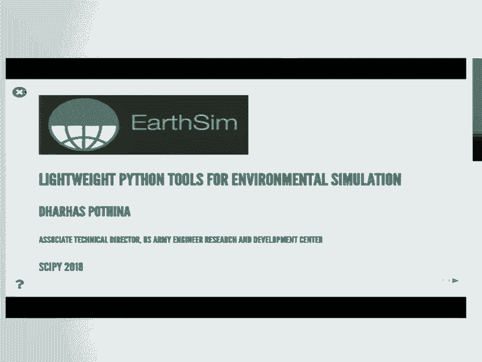

 things。" And this is what happened from that collaboration。 I want to make a point。 EarthSim。

 is not a framework。 It is not something we expect you to download and install。 It is。

 currently a location where we're experimenting with tools and building stuff。 And once they， work。

 we're trying to push them into an existing open source library so that it has more chances。

 staying maintained。 So it's also a place we're putting notebooks and examples of how to use。

 all these libraries and tools that we're pushing stuff into for earth science or simulation。

 workflows。 Currently we're working in Jupyter notebooks but the plan is to be able to use。

 some of these stuff directly in websites without Jupyter in the background， like in dashboards。

 and stuff like that。 We have a website， we have repo。 This talk is actually -- I just。

 pushed it about five minutes ago。 You can kind of follow along but it takes a while to。

 install all the dependencies for EarthSim so you probably won't actually get to that point。

 by the time I hit next。 This is the stack we have。 It's basically the PyVIS stack plus。

 we have released a couple of packages， which does data that goes gets environment later。

 helps you manage it and stuff like that。 And then we've been working with a company called。

 AquaVayo。 They have a very good constrained Elone A Mesher which we use and they have。

 in the commercial product we're pulling it out into an open source library so we can do。

 triangular meshes and stuff。 We've -- a lot of the work which we've done has been pushed。

 back into the data shader， bokeh， geo views， all of you。 I'm very glad I see some PyVIS。

 people here because if you ask me how some of this stuff works， I'm going to say magic。

 But technical questions I'm going to point to Jim Bednar over there。 This is a collaboration。

 between Arctic and Anaconda。 Everyone else on this list except for me actually did most。

 of the work so I just want to make that clear。 I'm just getting to talk about it。 I had lots。

 of slides about innovation and why we did this and all that kind of stuff but I threw。

 them all out yesterday and the entire talk's going to be a live demo so we'll see how that， goes。

 [ Applause ]， Actually I think I picked the wrong one。 Actually I need to get out of this。

 [ Laughter ]， This is the one with the results。 Let me get out to the -- yes。

 That was my backup if -- wait， no。 Okay。 We'll just run it anyway。 Okay。

 So first we're going to do a bunch of imports。 Let me see if I can get this bigger。

 And I'll just talk a little bit about this。 You see， we're basically importing a bunch of packages。

 Hall of views， data things like that。 This， stuff here which is coming from EarthSim is stuff we're still playing around with and。

 we don't have a standard pattern of how it should work or where it should be pushed。 So。

 this is kind of examples of how to use all those tools for doing what we're doing。 If。

 you haven't used Hall of views or G of views before here I've just taken a tile server。

 and a couple of points which are like Houston， Dallas and Austin。 And I'm just plotting。

 them on a bouquet plot and you can zoom around and stuff like that。 That's not very useful。

 Everyone can already do this。 One of the first things we added was what we're calling drawing。

 tools。 And now we basically -- I've got some empty -- you could put points， polygons and。

 paths here but I just put empty ones here。 And connecting them to these new drawing tools。

 and we have a stream object that lets us access the data from Python after we draw things。

 in the map and vice versa。 So we have a two-way connection between Python and JavaScript。 And。

 I'll give an example of this。 I'll just run this。 Now， actually I'm going to have to go。

 down again so I can see the tools。 Okay。 So here now I have a point tool that I can put。

 a bunch of -- of course it doesn't work now。 There we go。 So I can put a bunch of points。

 I can draw a path。 Draw another path。 Then I can draw a polygon。 And this is something。

 you can get in other JavaScript like this。 This isn't really anything super special except。

 it's now in bouquet so you can do it in bouquet。 The part which is cool now is those things。

 we just drew are available in Python。 Or if you want the latular long cubes of those points。

 the latular long cubes of those points。 So where this becomes useful is when you start。

 using those as building blocks。 So for example here， I have a map of Austin。 You know， you。

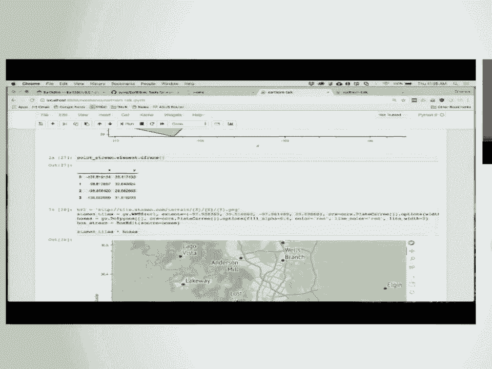

 can zoom around to the usual stuff。 I'm going to use our new bounding box tool to draw a。

 bounding box。 Now here I actually have the bounding box I just drew。 And in this cell。

 I'm going to use Quest or other software to go download some USGS data。 And it's going。

 and downloading the data from the USGS NED elevation server。 And now if this opens up， in a second。

 we've downloaded and merged that data into a single tile。 And we should be able， to see it maybe。

 Give it a second。 So here I'm just using Raster to open it。 And now we。

 have a elevation raster for the bounding box we just drew。 And also we added some extra。

 optimizations into Hall of Views and G of Views。 So this zooms much faster and you know， a。

 dynamically updates resolution so you can kind of go in and out。 So okay。 So then next。

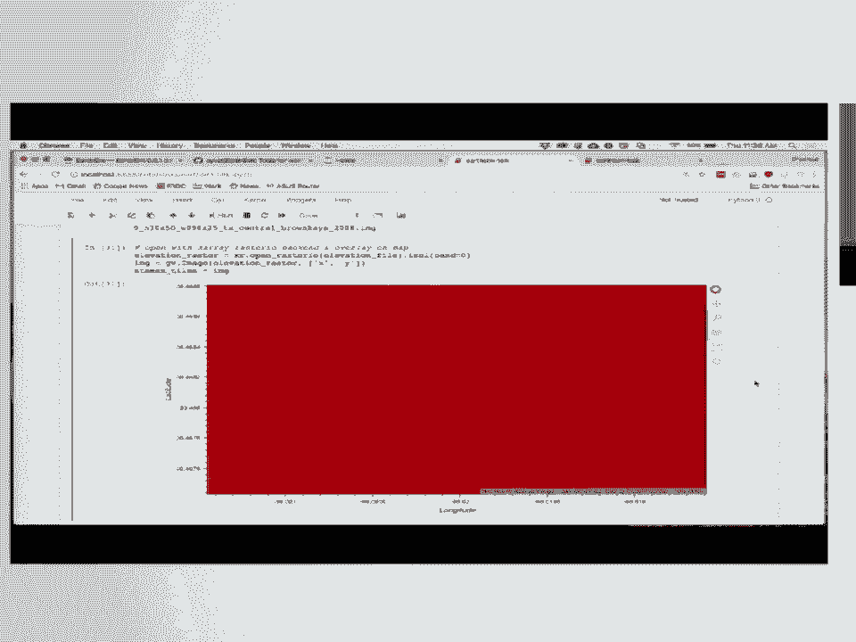

 we started working on what we're calling annotators。 If someone has a better name， we。

 can talk about it。 So here I'm going to draw some， wait， actually let me before that， let。

 me just talk here。 You see in the annotator I've given some columns for polygons。 I've。

 said material types and mesh type。 For the vertex of the polygons I've said I want to， wait。

 And then for the points I want， you know， some columns。 Those are just some random， things I picked。

 Okay， one second ways。 Okay， my mouse doesn't work anymore。 Okay。 So now。

 here I got some points and I'm going to draw a couple of polygons。 And on the second one。

 I'm going to select the polygon so I can see its vertices。 And now underneath I have these。

 tables and I can change these values and you know， or you can start saying you can start。

 annotating these points and you can also select them in the map and it will select the correct。

 rows in the table back and forth。 And so you can start applying data to different polygons。

 or points。 Or down here I don't like this latitude。 You know what， I'm going to make。

 it that and that's going to move the point。 So it's a connection。 So once you put glyphs。

 on the map you can start annotating them with data and then use that later to drive a mesh。

 you know， grid generation or you know set different areas of your mesh as different boundary condition。

 whatever。 The exact， that's what we've been working on。 And for an example， here's putting。

 everything together in a mesh。 So here I'm going to draw， look at my double click doesn't。

 want to work now。 Oh there you go。 So I'm going to draw a polygon of the Texas coast。

 This is a really bad one。 This is not really what the Texas coast looks like。 Kristen。

 can give you a better one from her earlier talk。 But anyway， I'm going to just put a point， here。

 there and a point here and now I'm going to say， actually initially I'll just mesh it。

 And that didn't work。 Let me try running this again one second。 Let me draw a polygon。 Okay。

 just go there。 Okay。 Now let's just try meshing and you've got a uniform mesh。 But。

 now let me stick a dot here and a dot here。 Go down to my annotator and I'm going to say。

 one of them is 5000， actually。 Or they set these as。 And the other one is 50，000。 Hopefully。

 update mesh。 Okay， if you can see this one actually made it dance to that one。 Let me， see。 2000。

 2000 is a good number。 Well no， I changed the result。 I mean， it's a different。

 scale from Vicksburg。 So anyway， if I go to my other one， I can actually show you。 Yeah。

 that's what I was hoping to show you。 You can see the mesh changed based on the points。 Okay。

 this next one is what I originally talked to Jim about two years ago。 And when。

 this started working， I was almost like， okay， we don't really need to do the rest of the， project。

 This was kind of enough。 Is I wanted a triangle of mesh support in data shader so。

 we could do large unstructured meshes in the browser。 And right now I'm going to load a。

 5 million node mesh of Columbia into the browser and dynamically do stuff with it。 And we still。

 have some optimization。 Reading the data in takes a couple of minutes or not a couple， of seconds。

 But once it's in， everything's responsive。 So it's going to take a couple， of seconds to load。

 So all I'm doing is reading the data。 3DM is a data， ASCII data format we。

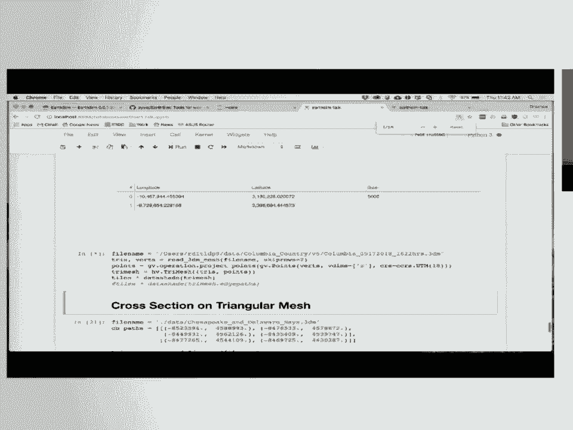

 use。 And we're just making this try mesh object with Hall of Views。 And then we're saying。

 data shade the try mesh object。 And you can also do， right now I'm going to show you the。

 bathymetry but you can also do the edges if you want to actually see the triangles。 I'm。

 going to go to a low resolution for a second so you can see the image。 Okay， so the actual。

 mesh is down here。 And this mesh is 5 million nodes and as you zoom in it's going to update。

 the resolution。 Takes a second。 And so you know you can go to whatever -- the largest。

 mesh -- largest unstructured mesh I've loaded is 20 million nodes。 I don't have that on my， laptop。

 That round on my -- 20 million nodes round on my laptop。 Easily without any problem。

 If you have to ask behind it， potentially you could do whatever size you want。 I'm not going。

 to run -- I'm going to just show you this。 I'm not going to demo it。 If you draw -- in。

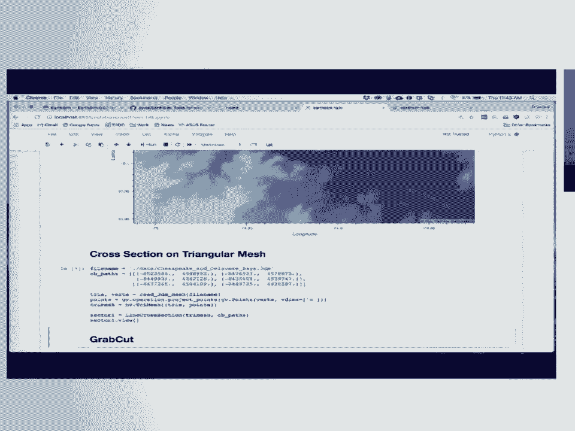

 this case if you draw lines -- if you draw lines over the mesh it automatically pulls。

 up whatever you want to extract the symmetry or whether you can start linking things and。

 start building more complicated dashboards where you're drawing things on one thing and。

 updating something else。 The last one I will go through is what we call -- this is a -- the。

 grab cut algorithm is an algorithm from computer vision。 OpenCV has a implementation of it which。

 you can install easily。 And it's a way to segment images based on foreground and background。

 If you give it information on what the foreground is and background is it will segment it。 And。

 for example is here we have a satellite image of an estuary and I am going to tell it which。

 parts of the ocean or the water just by drawing some background。 And then I'm going to say this。

 is land。 And then I'm just going to say find the contours and it should chug for a few。

 seconds。 And there you have the coast line。 That did not work so well。 So let's actually。

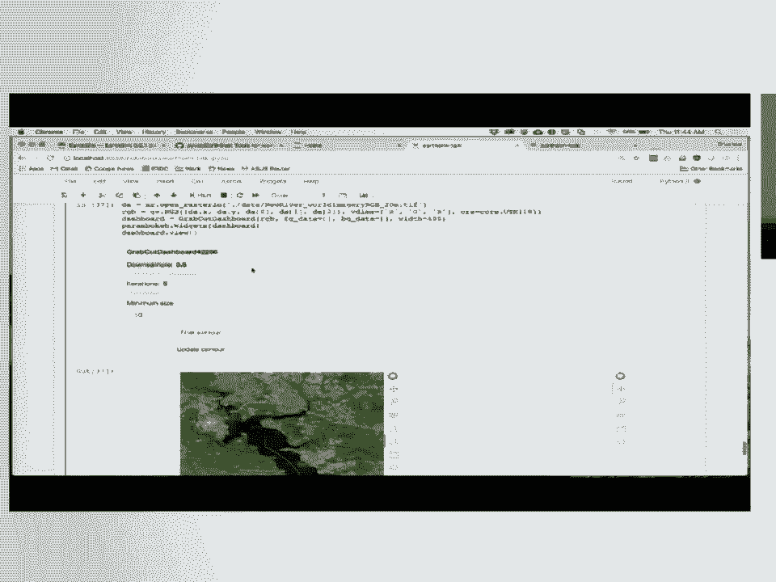

 do this。 Let's say this is also ocean and this is land。 And let's update again。 I reduced。

 the resolution of the image just so it would run faster。 So that might be one of the reasons。

 why we didn't get this part of the coast line。 And it will take a few seconds。 Okay。 We will。

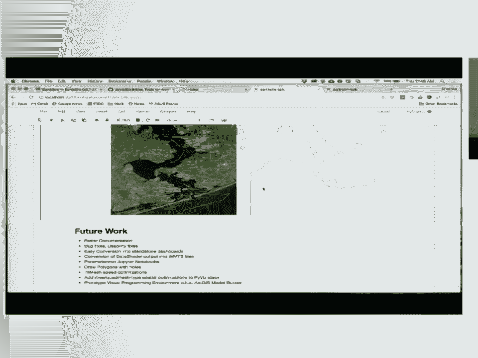

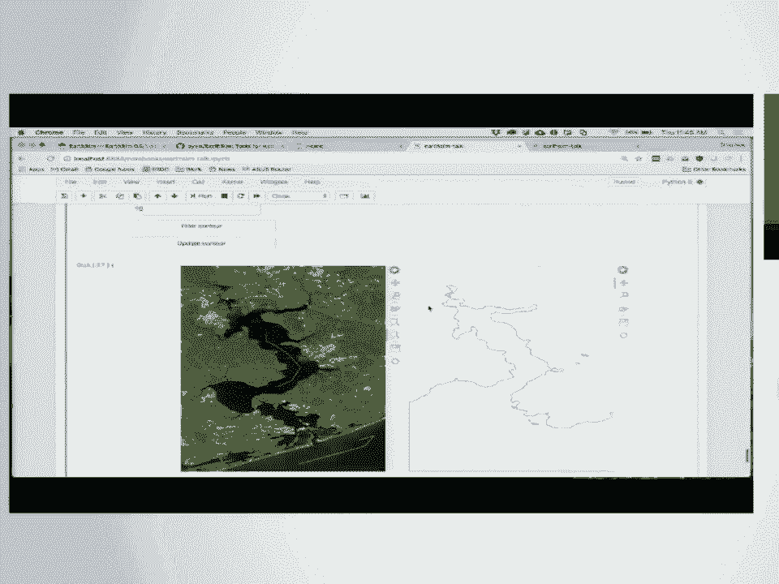

 come back to that and see if it finishes running。 In my other one which I ran three minutes ago。

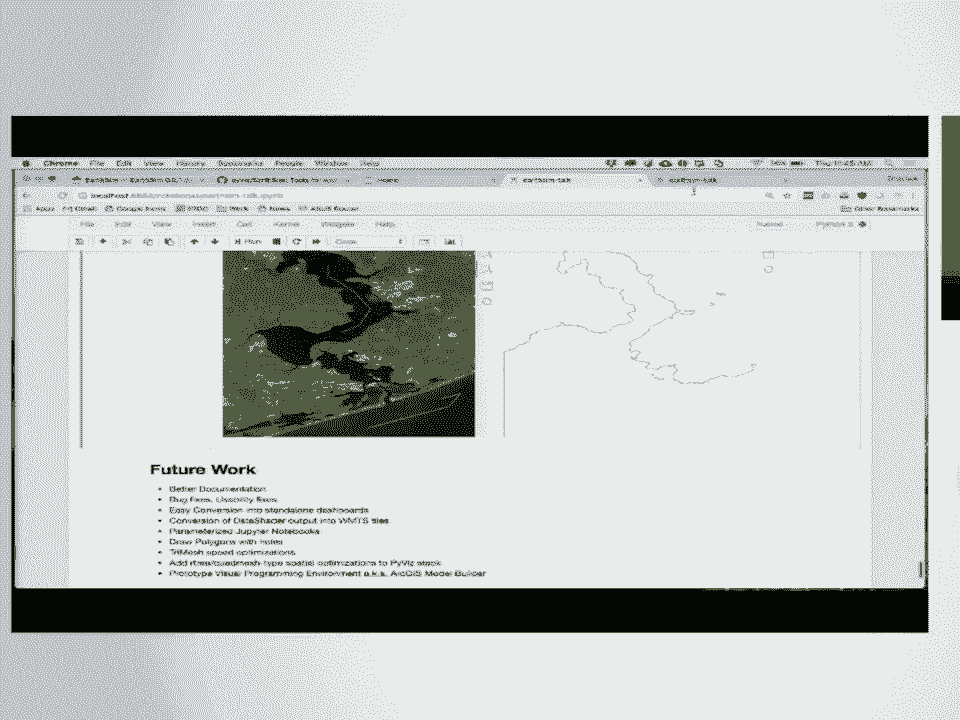

 I got the same thing。 When I did this earlier today I got a really nice coast line。 Oh there。

 you go。 And you can also say filter contours and it will take out the small polygon。 So。

 this is crude but you can see how you can make this into a little more post-post processing。

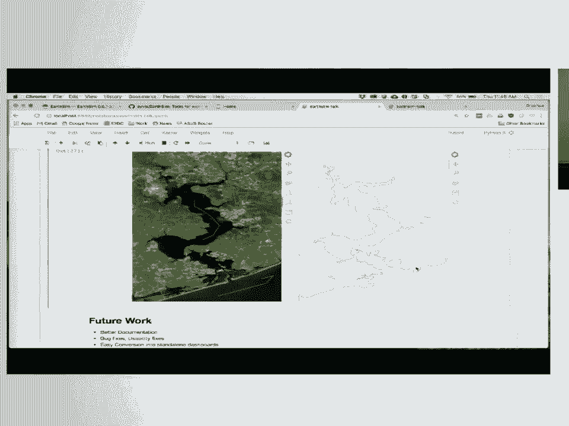

 You can pull out a coast line or a lake really easily。 Future work in building these examples。

 from my talk I realized the documentation needs a lot of work。 So we will hopefully try and。

 make that better。 This is an actively developing project。

 Some of the things like how the annotators， work， how the tables should connect。

 We are changing our minds about how that should work。

 almost daily because someone uses it and says you know what？ It needs to be double click。

 or a single click and stuff like that。 So there's a lot of usability fixes going on。

 We welcome anyone to try it out and tell us you know it's really unintuitive that this。

 key is the key that deletes points。 Things like that。 We have a lot of stuff like that。

 to mess with。 We're also working on once you have something working in a notebook。 How。

 do you rea-- something like what Jupyter dashboards used to do where you could take yourselves。

 and rearrange them and just have it on a website。 The stuff we're building will work without。

 a Jupyter notebook behind it。 So we want to kind of prototype in Jupyter notebooks and。

 then move it to a dashboard or something in a website or put different plots together。

 embedded in different parts of our websites。 So we're working on that。 We're adding more。

 features to Data Shader converting its output into WMTS tiles so you could have it stand， alone。

 Triangular meshes， speed optimizations， adding archery， quadtree， spatial segmenting。

 those kind of things。 We're also playing around with a prototype of something-- if anyone's。

 used RJAS model builder where you kind of connect things together and build a workflow。

 We're playing around with that。 We don't know if it'll be useful or not。 And then other。

 things that are annoying and we just can't do like it's currently impossible to drop。

 polygons with holes in it。 And we wanted to drop polygons with holes in them。 So a lot。

 of stuff like that。 That's the website and the repo。 We welcome participation。 The hope。

 is the repo is more a list of-- if you use our tools to solve a problem and/or you put。

 them together in a way that has something in a dashboard， we'd like to put it on the。

 repo so someone else could look at that code， copy， paste it， do something else with it。

 So that's the hope。 And I actually got through everything。 Okay。 That's surprising。 I thought。

 I'd have more problems。 So this is the website。 We currently have some-- actually we have。

 a user guide with some-- these are all notebooks which go through how to use the tools for different。

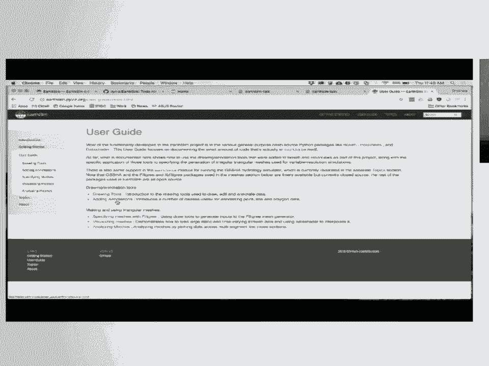

 things。 You know， we can load in shape files and stuff like that。 We've also got-- let me。

 show you one other thing。 Two new windows。 Okay。 Let's see。 So one of the things I did。

 not put in my talk because I didn't think I'd get to it is the ability to kind of do animations。

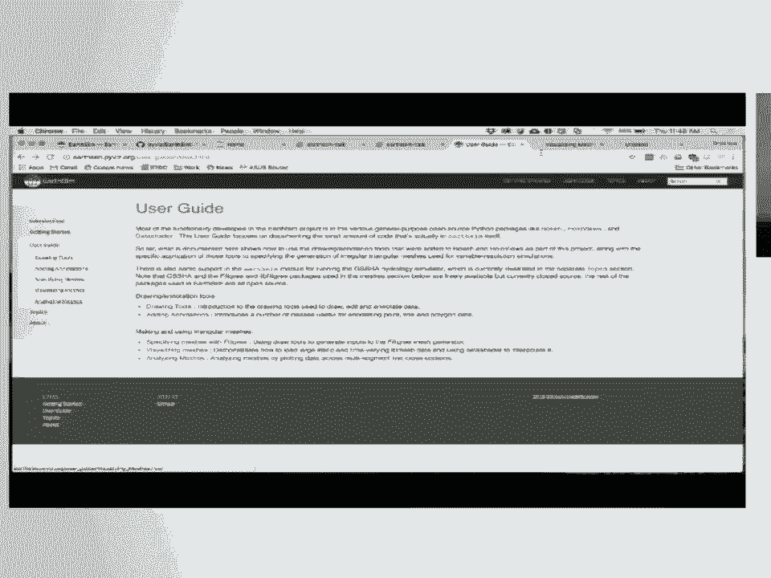

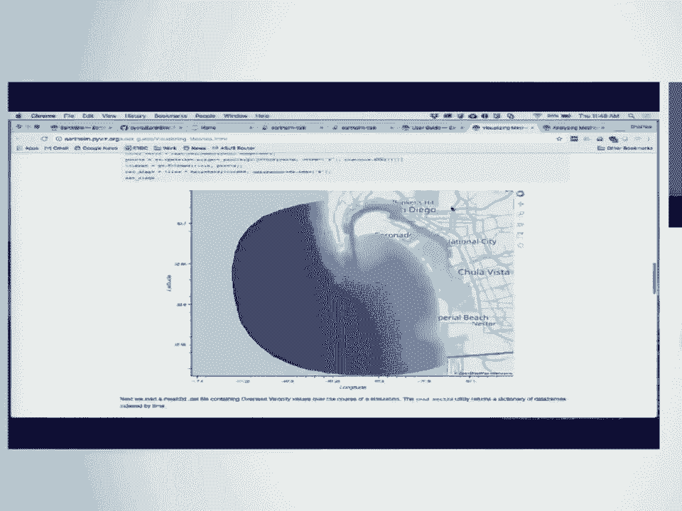

 or there's a thing where you link an animation and the profile tools so you can draw profiles。

 and then animate it and see how the cylindial， bathymetry changes or do cross sections。 So。

 you can start building all these tools。 We have a small set of examples and the grab card。

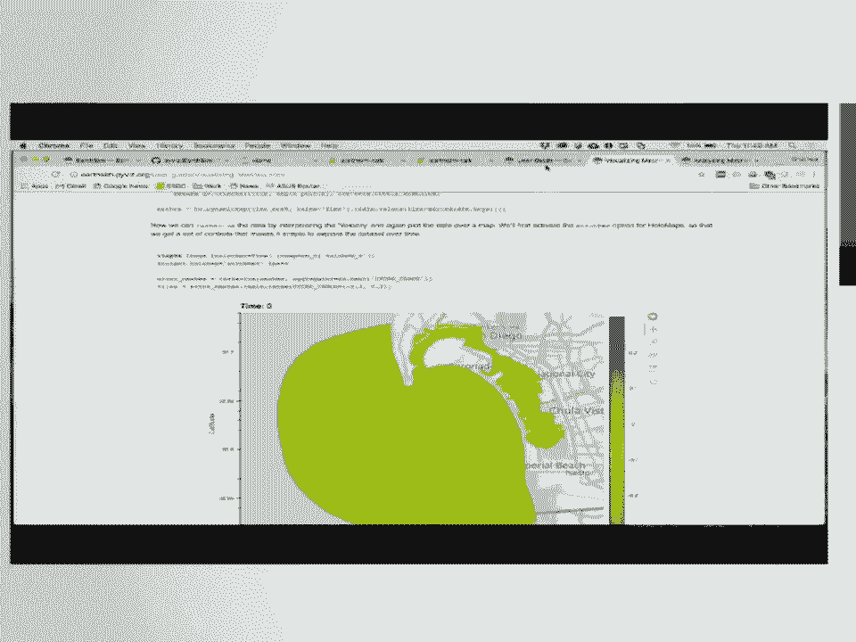

 I showed is here is a notebook。 We're hoping to improve the documentation and internally， at ERDIC。

 We have several workflows looking at-- we have existing meshes。 We were running， hydro simulations。

 We want to draw a track of a hurricane and say this is our pressure， field。

 This is our whatever and then run our models on HPC and visualize it。 So those。

 notebooks are so fragile right now that we're not-- they're not published anyway but eventually。

 we'd like to put more of those notebooks as examples。 And I think that's about it。 I'll。

 take questions。 Totally alive demo。 That was living on the edge。 I'm impressed。 Well， one of。

 the downloading raster data like five minutes before the demo of stop working with the USGS。

 website started messing up。 I was like， "Bread job。 Any questions？"， Yes。 Hi。 Thanks。

 So this looks really cool。 I have a couple questions。 And we maybe talked。

 about some of this before but does this work with quads yet or like non-trying gillies？ Well， yes。

 If you look at-- is it in the hall of views or G of views， the tri-mesh and。

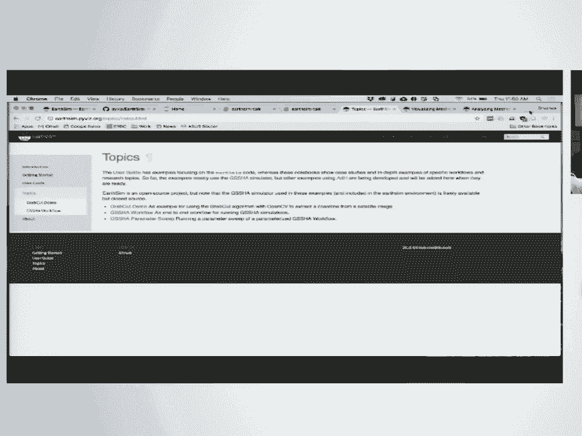

 quad-mesh which-- I don't know。 I think-- so hall of views。 So when we implemented triangles。

 we got quads for free because-- okay， the answer to the question， we can do quads。 What。

 I'm not sure is can we do curvilinigrets without converting it to individual quads？

 Quads right now are represented as two times。 So that-- it works。 If you wanted to directly。

 represent a curvilinigret， you'd have to-- I mean， I don't think that would be difficult， to add。

 It's just that-- 30 doesn't use any curvilinigret model。 So we didn't do it。 Okay。 One other thing。

 So you're talking about looking-- I think you're using data shader。

 to look at the resolution of your mesh since it's so dynamic， you know， changes size。 What。

 from one part to another？ What about looking at any of the model output？ Is that a future。

 thing or can you do that now？ No， you can do that right now。 So how would you imagine， you know。

 you're-- so you have your model-- So you've got to--， To a-- for smaller mesh sizes。

 you can use-- G of views and hall of views directly and， you can have the mesh directly。

 You have everything you want。 For larger meshes， we're。

 using data shader and you can decide how you want to aggregate。 The whole point of the。

 data shader is if you have one pixel， that pixel might have a thousand triangles or quads。

 underneath it。 You can decide if you want to do the mean of those thousand or the max。

 So you can decide how you want to aggregate those thousand triangles into one pixel and。

 as you zoom in， it will re-aggregate at whatever zoom level you're in。 So as you zoom in， you'll。

 get back to-- So we have one example of doing it with data， but since the PyViz team didn't。

 know how to read our data formats， they just perturbed the bathymetry as a quick kind of， example。

 But yeah。 >> There's an example in the analyzing meshes。 >> Is there？ Okay。 Let's see。 >> Yeah。

 So this is-- Well， this is results with an animation and you draw these and it's。

 giving you the profiles。 So this is an animation of the profile， animation of the field。 So， yeah。

 >> It's like errors。 It's a result of the error。 >> Can you play it？ >> Oh， does it work？ Okay。

 It doesn't seem to be doing anything。 This is the website。 This， is not my computer。

 I could launch it。 >> Someone else's problem。 >> Yeah。 >> Let me see。

 >> So I'm glad that you pushed all of this stuff into other libraries that already existed。

 I wasn't totally clear on what libraries everything got pushed into。 Like the polygons。

 it looked like maybe that was geo views， the annotators。

 >> So the annotators are not pushed anyway yet because we still don't have a robust idea。

 of how much of it is common or how much is custom to each type of annotator。 So anything。

 which needs to be inside-- So bokeh is the basic plotting library。 So the ability to draw。

 stuff and everything is inside bokeh。 >> Holoviews is the basic plotting library on top of bokeh and you can also use matplotlib。

 and other backends that gives you a lot of this fancy stuff where I just add the tiles。

 to my plot and it overlays both of them。 Geo views is just holoviews which understands coordinate。

 objects。 So most of the stuff I think is probably bokeh and Holoviews and then making sure geo。

 view still works with all of that。 And there's another project called Parram which lets you。

 automatically have widgets and parameterize objects and that helps you build the dashboards。

 And for example if we found that XRA needed-- I mean one of the things we wanted was the。

 ability to read Rastas and XRA but they already did that so we didn't have to do that。 >> No， no。

 it's in the released version but next to-- in the docstrings it says experimental。

 So you can use it but it says experimental。 But so we don't have anything against pushing。

 things to other libraries if that functionality belongs in those libraries。

 >> So I just wanted to say this is really fantastic。 All the integration with Holoviews。

 and bokeh and all the interactivity is really， really cool。 I just wanted to say you had。

 at the end of your talk you were saying for future work you want to add these features。

 to the tri-mesh that you have in Holoviews。 I wanted to suggest there's another library。

 It's also called tri-mesh but it's not part of Holoviews that you might want to look at。

 that has all of the operations on triangular meshes。 Geometric operations。 Very nice Python。

 interface to several lower level libraries。 >> I'm surprised I haven't seen it。

 >> I just-- like I had a student that was working with triangular meshes and we found。

 it was really， really useful and it did lots of cool stuff。 So it has all those like tree。

 search stuff that we're looking for already。 >> Yes， that would be。

 If we can not write our own code we prefer that。 >> That's why we come to SciPy。 What are we？

 Questions？ This room is a bit three dimensional。 What's the overlap between Earth's and the。

 Earth's sim and Pangio？ They seem to be complementary projects using the same stack。

 >> I would say because I was in the Pangio bar for yesterday。 I would say this stuff。

 would kind of work。 So Pangio's got the HPC stuff and the， you know， all of the desk clusters。

 and all that stuff and one of their front end interfaces would be Jupyter notebook。 So。

 this would give you better interaction on your data from a Jupyter notebook。 And Pangio's。

 a loose collection of tools。 But sim really isn't a tool。 It's more like best practices。

 on how to use the existing tools and a place to experiment with before we walk out where。

 to put a tool。 James has a suggestion。 >> I'm expecting on that is that they have different backgrounds。

 The different people， have got different funding。 >> Yes。

 >> We are in first contact and you can't claim that one is the other。 We are coordinating。

 and we are supporting each other and we hope that there will be a future where everyone。

 is really working together with the same tools or choosing the tools that are appropriate。

 And so the one project is the type of one tool and one project is the type of another， tool。

 These projects are using the right tools for the right time。 >> Well， and with this。

 there's like a whole list of tools。 If you only want to use one， of them， that's fine。

 If you only want to use the drawing tools， just use them。 You don't， it's not a。

 you have to use everything I showed。 >> It's a cloud of tools。 >> Yeah。 >> Yeah。

 I just wanted to comment on that last point。 We have a Pangio instance running。

 on Amazon where we've installed these tools and it's awesome because you have a 9 million。

 node grid。 You can just crunch like the maximum wave height over some period of time and then。

 display that thing with the darces tools here。 It's awesome。 >> And what was your question？

 [Laughter]， >> Yeah。 >> We accept questions and encouragement。 >> Yes。 >> Okay。

 we've got time for one more quick， question。 Does anyone want to have the last word before lunch？

 Anyone who's always too， scared to ask the last question before lunch。 So I think with that。

 we'll thank the speaker。

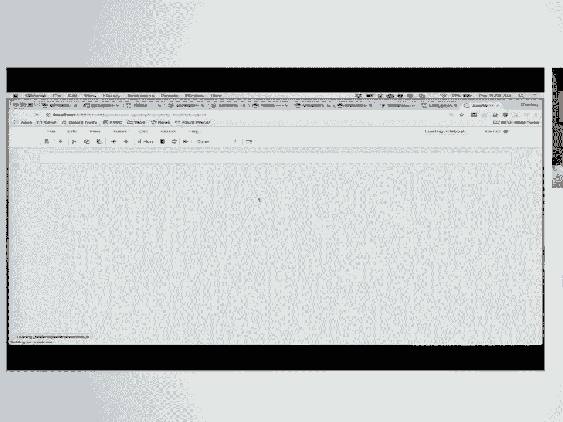

 again and thank all the speakers in the session。 Thank you。 >> Thank you。 [BLANK_AUDIO]。

