# SciPy 2018视频专辑 - P1：SciPy 2018视频专辑 (P1. Binder 2.0 - Next Generation of Reproducible Scientific Envi - GalileoHua - BV1TE411n7Ny

 My name is Chris Olgraf。 I'm a fellow at the Berkeley Institute for Data Science。

 And I also work with the Data Science Education Program， both at UC Berkeley。 And this is Minh。

 Do you want to introduce yourself？ I work on Jupyter and Jupyter Hub stuff at Similarly。

 Research Lab in also in Norway。 So we are here to talk about a project。

 that we've been working on for the last year to call Binder 2。0。

 So really quickly， if you're interested in the slides， for this， it's at this bit。ly link。

 scipy-2018-binder。 And we'll tweet this out and make it easy to find after the talk。

 I'm going to start in three seconds。 So before we go into the talk， I like。

 to put the thank yous at the beginning， because usually we run out of time。

 And then I have to skip through all of this stuff。 So Minh and I are up here talking right now。

 But the binder and broader Jupyter communities， are much larger than both of us。

 This is a small sample of all of the different people。

 that have touched this project in various ways。 And so really。

 everything that we're going to be talking about， wouldn't have been possible without this much larger。

 community that obviously would not fit on the stage right now。 So thank you to all of them。

 So something that you all may have heard before， if you've ever had a conversation with Fernando。

 is this quote from Buckyt and Donahoe。 And I'm going to just read it verbatim。

 because I think it's a pretty interesting and compelling， quote for our community。

 An article about computational science， and a scientific publication is not the scholarship itself。

 It is merely advertising of the scholarship。 The actual scholarship is the complete software development。

 environment and the complete set of instructions， which generated the figures。

 So what's kind of amazing is that they said this in 1995， which is a fair bit of time ago。

 And it was really forward thinking， in terms of how computational infrastructure could。

 interface with scientific and academic publication。 So thinking about this a little bit。

 what are the different kinds of pieces， that you need in place in order to sort of achieve。

 this vision of computational reproducibility？ Well， just off of the top of my head。

 I can open up over the few。 You need the basic tools to do whatever scientific problem， you want。

 which might be packages or base languages。 You need an interface to facilitate。

 the coding and content generation process。 You need a way to communicate your finished work。

 with somebody else， as well as a way to share that work， and allow other people to discover it。

 You also need a way to bundle all of that， along with your environment in order for other people。

 to reproduce it。 And finally， you need to do this in an easy， and accessible manner。

 particularly for people， who are scientists， who are maybe not trained。

 in all of the latest computational science， and coding techniques。

 And I want to harp on that last point a little bit more， and draw， in my mind。

 what's a really important distinction， between technical reproducibility and practical reproducibility。

 So making things technically reproducible， is in many ways fairly straightforward。

 It just means that if you find the right incantation。

 of like Docker files or Ansible scripts or whatever， you'll be able to reproduce a result。

 But that's inaccessible to the vast majority of scientists， that are out there。

 I think that what we should all be shooting for， is practical reproducibility， which。

 means being able to reproduce someone else's work。

 without having four years' worth of computer science， in your background。 So fortunately。

 at this point， we， have a really amazing open source community。

 with lots of different tools that solve most of the things。

 that I just mentioned in the previous slide。 So we have the SciPy community for scientific Python。

 We have the R open Sci community in R， as well as the broader ecosystems around both of those things。

 and data analytics。 We have interactive computing platforms and software， like RStudio。

 like Jupyter Notebooks， Jupyter Lab。 We have platforms online for sharing and discovery。

 such as GitHub and GitLab and Bitbucket。 And then finally， we also have the technology。

 for bundling all of these things together。

 in a reproducible form， like Docker and the broader container， environment around us。

 But in order to get that point that I mentioned before， the practical reproducibility， we still。

 need to have tools that kind of combine all of these things。

 together in interesting ways so that we can achieve whatever， scientific result we're shooting for。

 And before I go any further， I want to quickly say。

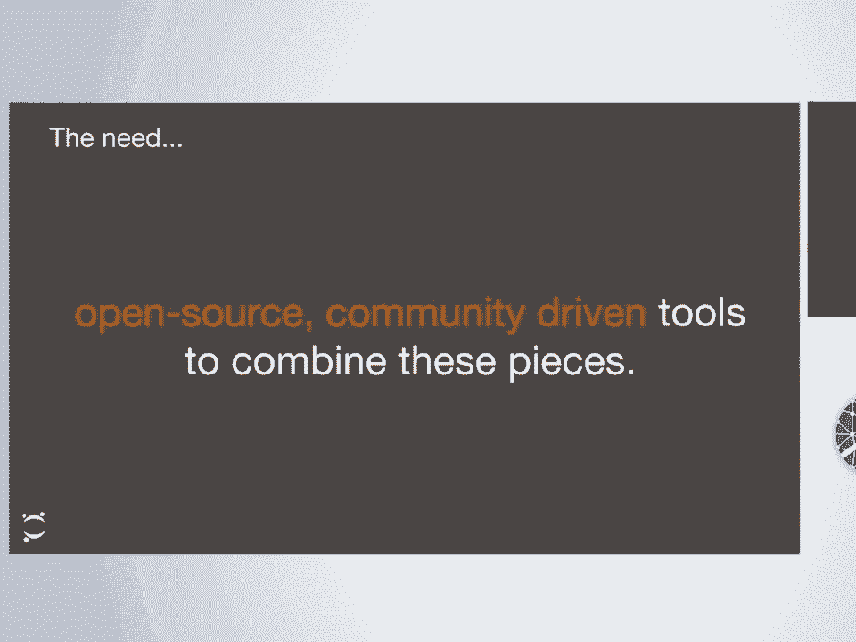

 that the two projects that we just heard about， I think， are pretty cool。

 So thanks to both Wholetail and Pulp， for doing really awesome work。

 It's really exciting to see different organizations。

 and projects that are starting to build the technical stepping。

 stones that are going to get us towards that kind， of reproducible future。

 But what we're going to talk about is another tool， in this space called Binder。

 For those of you who may have attended SciPy， I think， like three or four years ago， Binder 1。

0 was originally， announced by Jeremy Freeman and Andrew Osherman。 They were at the time。

 both at Janelia。 And they kind of introduced this vision。

 for a web service that would live online where people could put。

 their code in GitHub and then connect， that code with a server that would build the environment。

 and then give people interactivity for free。 Since then， the Jupyter team has sort of taken over。

 a lot of the binder development and binder maintenance。 And so what we're going to talk about。

 are changes and upgrades that we have made in the last couple。

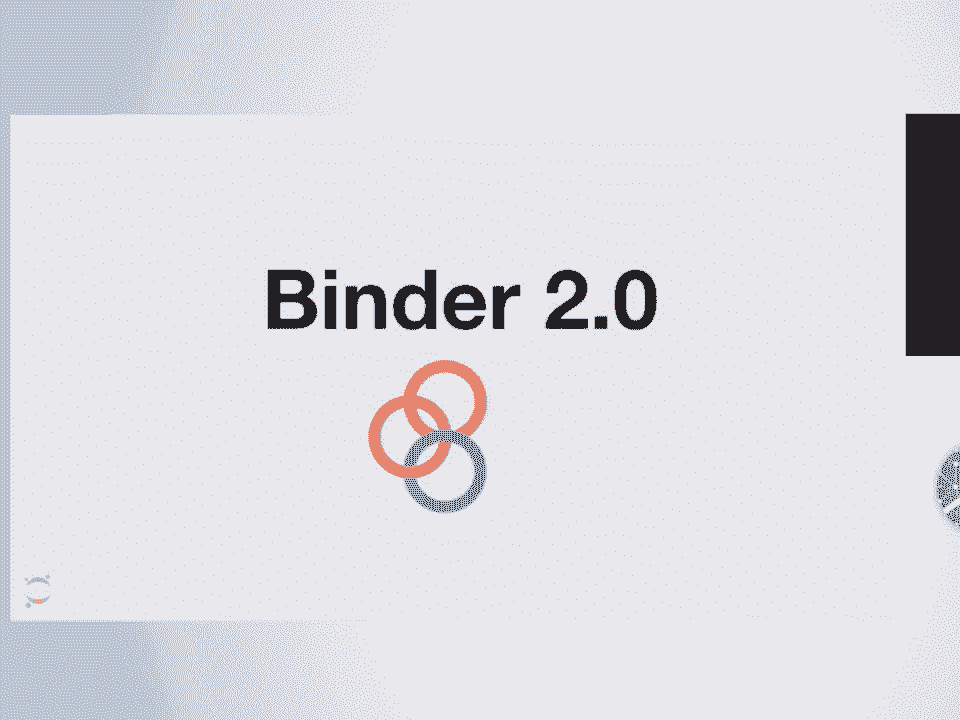

 of years to Binder。 So for those of you who don't know， Binder is 100% open source technology。

 It is forkable and deployable anywhere。 It runs on modern day cloud orchestration tools。

 In particular， it runs on Kubernetes， which is really。

 important because our goal is to give people as much choice。

 and flexibility over the cloud deployments and cloud tools， that they need。

 And it's really designed for researchers， educators， people， analyzing data， and people trying。

 to communicate the results of data analyses out there。 So we have a very kind of tight。

 specific focus， for this technology。 What is Binder and what does it do？

 I'm going to go through a really short list， which。

 is going to be kind of a table of contents for this talk。

 And Min is going to go into a little bit more detail after me。 But Binder is basically three things。

 It's Repoedor Docker， which generates， Docker images from Git repositories。 It's JupyterHub。

 which generates user sessions， and links those user sessions with the images。

 that Repoedor Docker built。 And it's BinderHub， which sort of orchestrates。

 this entire process and provides a user interface， so that people can do this on their own。

 And then finally， we're going to talk about one example， of Binder， which is at MyBinder。org。

 which we run， as sort of a public service and a technical demonstration。

 OK， so what does Binder look like from a user's perspective？

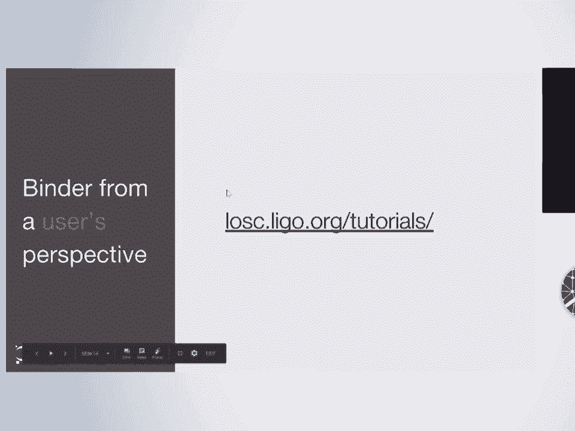

 For those of you who may remember， a couple of years ago。

 the LIGO team published a really interesting paper， on using the LIGO instrument。

 And along with that paper， they published a Binder link， to their code。

 which was online on their GitHub repository。 So I actually， that went faster than I。

 thought it was going to， which I guess is a good thing。

 What you may notice is when I clicked on that link， it took me to a page that said。

 I'm loading your Binder right， now。 And what was happening is Binder found the Docker image that。

 was built using the environment specified in that GitHub， repository。

 It fired up a user session for me on a JupyterHub， and it dumped me into a live session right there。

 So what was inside that GitHub repository？ The main thing that I want to point out。

 are these two files here at the bottom， which maybe I， can blow up the text a little bit。

 So if you look here， there's a requirements。txt file， and a runtime。txt file。 Inside requirements。

txt is just a couple of files that， are pretty common in the Python ecosystem。 And inside runtime。

txt is something that says， hey， I want Python 2。7。 I don't know why anybody would want that。

 but that's what they're using。 If we then open up our index Jupyter Notebook， which they provided。

 what we can see， is that all of this code is immediately runnable。 So I'm just running each thing。

 stepping through the whole， notebook。 And as you'll see， all of the outputs。

 are being generated here。 So we're reproducing all of the figures。

 that the LIGO team puts together as a part of the GitHub， repository， which runs on Binder。

 And it even does things because this， is an interactive session like allow you to produce interactive。

 results。 There's a fun little bit at the bottom， where they actually play the sound of their finding。

 which， is this kind of--， I call it a whoop， but it's sort of a--。

 I'm not going to click it because I don't， have any sound。

 But you can interact with the kinds of results， that people put up here， which allows you。

 to interact with the work that people have put together。

 in ways that wouldn't be possible if they were just。

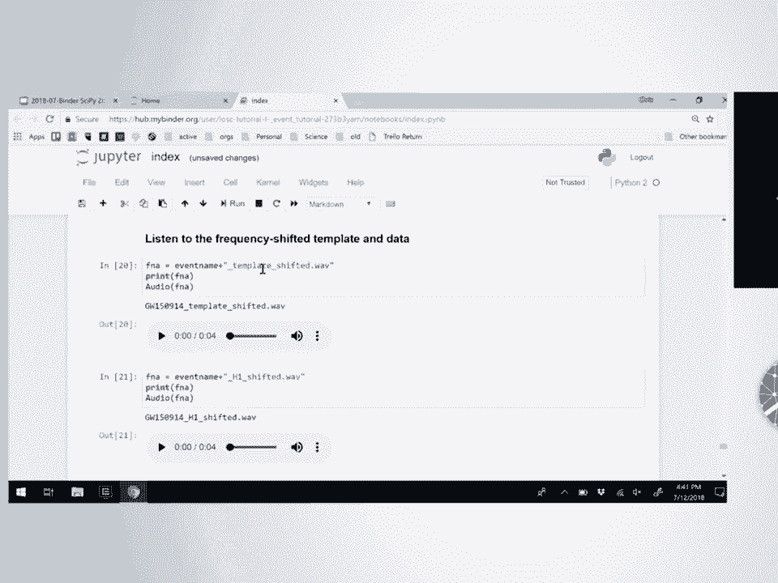

 viewing a static PDF。 OK， so I just explained to you what Binder looks like。

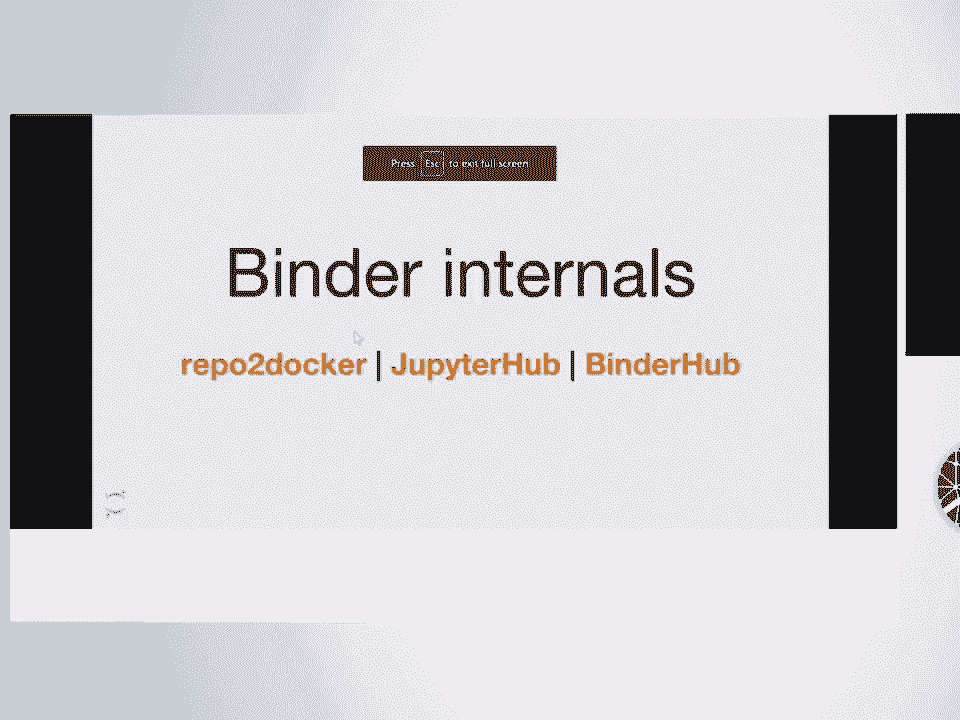

 from a user's perspective。 And now， Min's going to explain a bit about what was happening。

 under the hood while I was doing all of that。 Yeah。

 so I'm just going to go into some of the details， of how Binder does these things of creating。

 an interactive environment based on our repository and all。

 the stuff that happened when Chris clicked that link。

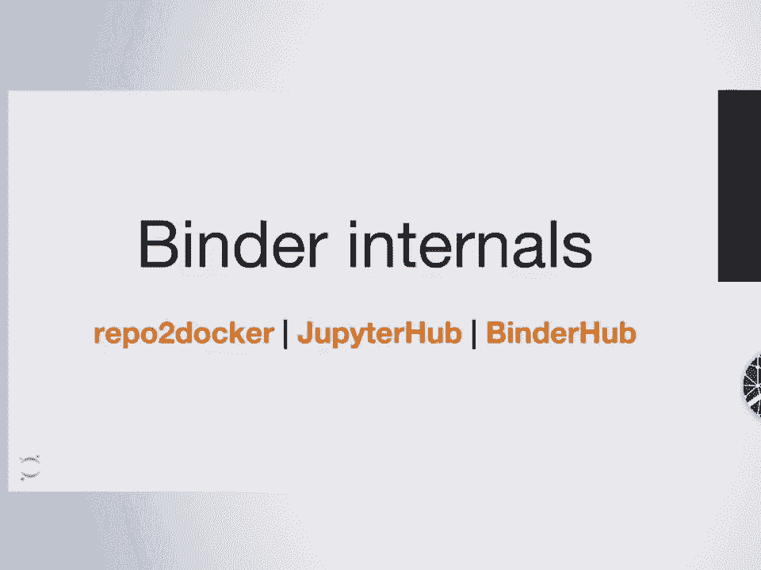

 So Repo to Docker is the heart of Binder， and it's a standalone project。 And as the name suggests。

 it takes a repo， and turns it into a Docker image。 And the idea behind Repo to Docker。

 is to automate the steps that a human would， do for publishing a repository with an environment。

 specification and some content and then， stepping through the process of creating an environment。

 in order to interact with the content。 And the goal is to support a bunch of languages， support。

 Python， Julia， R， and also be a tightly scoped project。

 specifically targeting these kind of data science， reproducible publication environments。

 not a totally generic image building tool。 So what happens when you run the repo to Docker command。

 you type Jupyter repo to Docker， and then you give it， the URL a repository。

 and then a bunch of output comes out， and will go into what those steps mean。

 But the first step when you're given a repository， is you clone it。

 So Repo to Docker is built on what would you do， and then just automating that process。

 And so the first step is clone the repository。 And then once you have the repository。

 you need to look at， OK， what do I need to install， in order to be able to use。

 interact with these examples。 So you might see a requirements。txt file。

 and so you need to install that with pip， an environment。yaml， file。

 So you need to do a conda install。 Or you might see install。r in runtime。txt that say， all right。

 I need to do an r install and set up our studio， and things like that。

 So we identify repo to Docker。 Does this process of looking for files in the repository。

 and figuring out how to build what's， needed in the environment to run this code？

 And once it's figured out what software is needed， to run what's in the repo， it generates。

 a Docker file， which is kind of like a script for setting up， an environment。

 And the first step is setting up the runtime。 So it's in this example， it's setting up a base conda。

 environment。 Or this is the stage where it could， be installing the Julia runtime or installing r studio。

 And then later on in the Docker file， it will do the repo specific step。

 of taking the content of the repo， and adding it to the Docker image。

 and then also doing the installation of， in this case， it found a requirements。txt。

 So part of the Docker file will be running pip install， on that requirements。txt to make sure。

 that by the time you finish building the image， you have all the software you need to run the code。

 And then finally， once you have the Docker file， you build the Docker image and then potentially。

 if you want to share it with somebody or use it later， you might push it up to a Docker registry。

 so it can be downloaded。 So going back to that output and highlighting a few of the steps。

 you can see that the first step is running a git clone。 And then the next step。

 it's saying it found a conda environment。yaml。 So it's using the conda build pack。

 So the build packs are these objects， that determine how to render the Docker file。

 So this is where we pick between r and Julia， and setting up the environment that way。

 And then the rest of the output is the output。 If you're familiar with Docker。

 the rest of the output， is just what you get from Docker build， after rendering the Docker file。

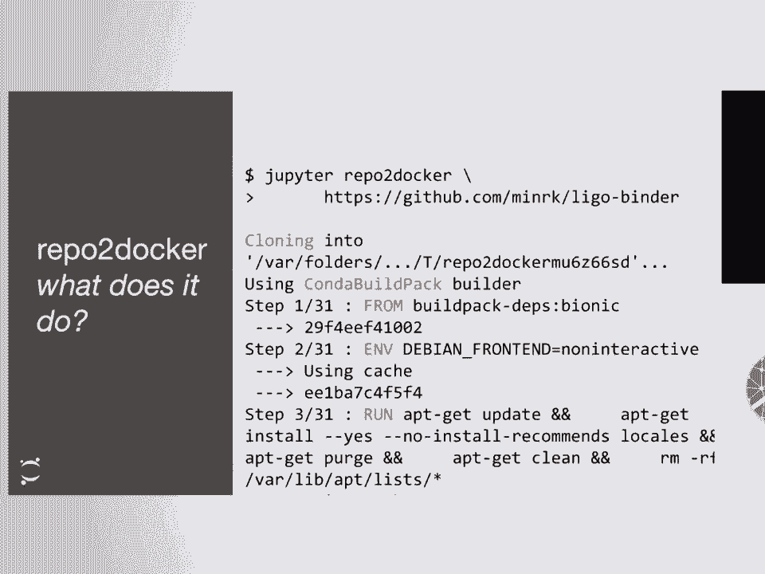

 So these are all the files that we look at for setting。

 for building the Docker file and rendering the environment。

 We do a lot of things for Conda and Pip and Julia and R。

 and also generic Docker files if you don't want us， to do anything automatic for you。

 So what you can do with 3D Bode Docker， you can build Python environments， R， Julia。

 arbitrary Docker， files of your own。 And it can run not just Jupyter notebooks。

 but anything with a web UI。 So anything that runs a web server， such as our studio， or OpenRefine。

 can be built with repo to Docker。 And you can run it anywhere that you have Docker。

 It's a simple pure Python package。 You just install Jupyter repo to Docker。

 and then it generates the Docker file and Docker commands， to do the build and the run。

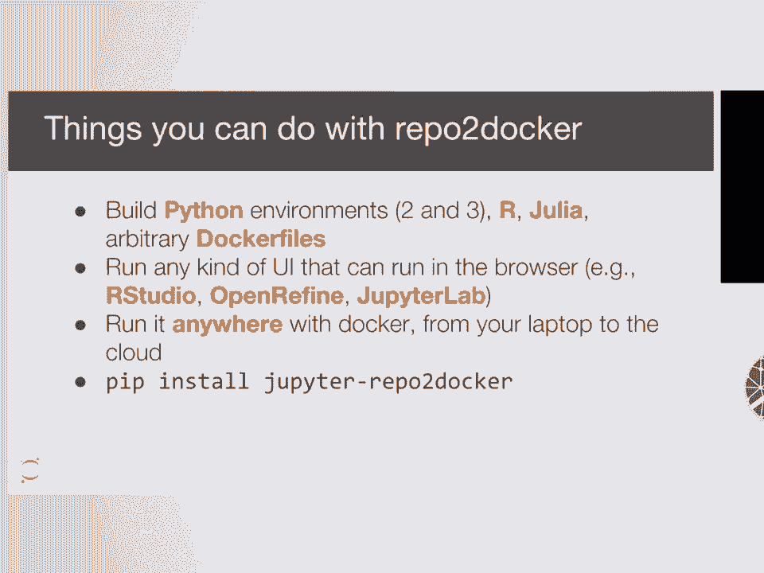

 So now we've got images built with repo to Docker。 The next piece is Jupyter Hub， which。

 is a tool for launching notebook servers for users。 So each user gets their own notebook server。

 And the key in Jupyter Hub is these pluggable authenticator， and spawner pieces。

 So a spawner is an object that says， so you ask Jupyter Hub。

 I would like to start a server for this user。 And the spawner is an object that can-- where you can decide。

 what it means to implement that。 So you can say， I'm going to start a Docker container。

 I'm going to start something on Amazon Cloud。 I'm going to start a local process。

 So there are lots of ways to launch servers with Jupyter Hub。 And relevant to binder is Kubernetes。

 which is an orchestration tool that runs important for us， runs on any cloud provider。

 and is scalable。 Let's use deploy a container-based application， on distributed across many nodes。

 which， is really nice for keeping potentially a large service。

 running and being able to migrate from one cloud provider， to another， for instance。

 And really important， again， for the sustainability of binder。

 is that there's already a rich and active community。

 of people deploying Jupyter Hub on Kubernetes with tools like--。

 so the Kubesponer is the implementation， of a Jupyter Hub spawner on Kubernetes。

 And we have a guide for deploying Jupyter Hub， on Kubernetes called Zero to Jupyter Hub。

 and something called a Helm chart that， makes deploying Jupyter Hub on Kubernetes extra easy。

 And the last piece is binder hub， which， is what's responsible for serving that page， that loading。

 page that you saw when Chris was starting his binder。 And if you just go to mybinder。org。

 you'll see this page， which is just a form where you say， what repo you want to interact with。

 and then a few extra parameters if you， want to be redirected to a particular file。

 But the gist is you specify a repository that you want built， and then a specific version。

 so master or a particular hash。 And binder provides the UI for this application。

 So it's how you arrive。 It also provides an API if you want。

 to request environments via a web API instead， of visiting actual pages。 And it says， all right。

 someone asks for this repo， hey， repo to Docker， please build me an image。

 And then once it's got an image， it says， jupyter hub， please launch a server with this image。

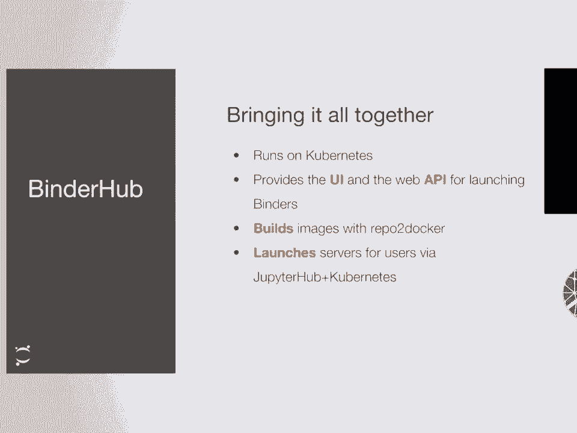

 So what that looks like is the user comes to mybinder。org。 They get a page， and they send my binder。

 They send binder a--， this is the repo that I want to launch。 And binder says。

 have I already built this image？ If not， say， rebooted Docker， please build me that image。

 And then once that's built， it pushes it up to a Docker， registry。 And then once it has an image。

 which， in most of the time， your image is already built。 So you start at this point。 It says， hey。

 jupyter hub， please give me a temporary user。 And launch， for that user， a server。

 with this particular image。 And then jupyter hub says， hey， Kubernetes， please give me a pod。

 which is what Kubernetes calls--， which is what Kubernetes calls containers， approximately。

 And then Kubernetes says， OK， I'm， going to start that process。

 And then Kubernetes tells jupyter hub， OK， now it's running。 And then jupyter hub tells binder， OK。

 now it's running。 And here's the URL。 And then binder hub tells the browser， OK， now redirect you。

 to your running server。 And then from this point forward， the user。

 is interacting directly with their own notebook server， with their full environment。

 and can interact。 And this is what happened in a few seconds。

 that Chris was waiting for his notebook to load。

 OK， so in the last bit of the talk， I'm going to talk just a little bit about MyBinder。org。

 which is a public service that the binder team runs， both as just sort of a free public service。

 for the scientific community， as well as， a demonstration of the binder hub technology。

 that we've been talking about。 Again， the goal of binder is to be deployable anywhere。

 And in our dream， we're going to see， lots of different binder hubs for varying purposes。

 out there in the wild。 MyBinder。org is also interesting。

 because we're running it as a sort of radically open service。

 So we try to create as many data streams as possible。

 And we want to create more without violating things， like user privacy。

 And so any kind of feedback or input， that you all have about the MyBinder。org service。

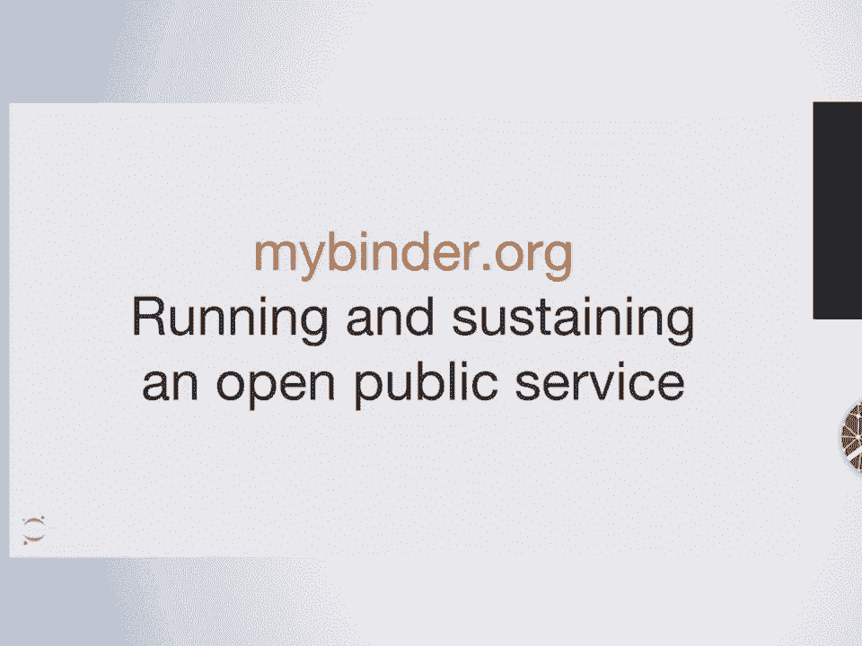

 we would love to hear。 So the first thing to say is that binder， has turned out to be super popular。

 We first released it back in December of last year。 And in the ensuing seven months。

 the number of unique users that hit MyBinder。org， has grown by like three orders of magnitude。

 which， is kind of crazy。 And then on the bottom， what I'm showing you。

 is a distribution of where in the world， all of these users come from。

 And what's really cool is that we have almost every single country。

 in the entire world covered here。 And this ties in with a comment that someone。

 made in the education， Birds of a Feather， which， is one of the main goals of binder。

 is to make these sort of analytics， workflows and learning opportunities accessible to people。

 that would not otherwise have the opportunity to use them。 So in particular， the bottom plot there。

 is something that I'm really excited about。 We also， as a part of our deployment。

 make all of our diagnostics available to the world。 So if you go to grifana。mybinder。org。

 you'll see more information than you could ever， hope to see about what's happening on MyBinder。

org right， now。 So for example， you can see if we ever have an outage。

 and you can go to our getter channel， and tell us that we have an outage。

 You can see how many user pods are currently， built on MyBinder。org or running MyBinder。org。

 You can find popular repositories over the last five hours。

 We try to make as much of this accessible and publicly， available as we can。 And then finally。

 one of our goals， is to find models for sustainable computational services， like these。

 So probably many of you are wondering， A， how much does binder cost and B。

 who's going to pay for these kinds of things？ So one thing that we've done is tried。

 to put a lot of work into making this as efficient as possible。

 And Kubernetes really helps with this， because it's good at scaling things up。

 And hopefully one day， we'll be good at scaling things down。

 We publish all of our billing information， for what we pay currently on Google Cloud。

 for what we pay Google Cloud each month。 And there on the bottom， you can。

 see that we've been doing a pretty good job of getting， the cost per user down pretty low。

 So running MyBinder。org's Jupyter Hub， or binder hub。

 it's at something like 1 to 2 cents per user per day， which isn't too bad。 Obviously。

 that would change if you， were running a binder hub on fancier compute hardware。

 or with a gigantic database or something like that。

 But we think it's a pretty reasonable amount of money。 And really。

 the cost of running something like this， is more driven by the human cost。

 as opposed to the technical cost at this point。

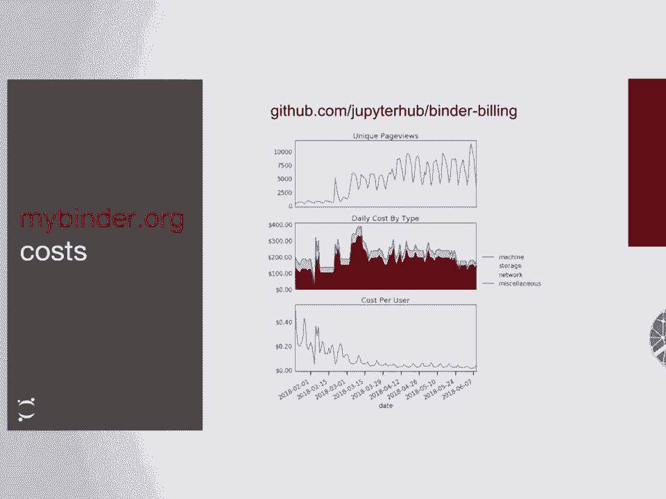

 So in the last bit， I just want to mention， what are two things that we're excited about working。

 on in the next couple of months and a couple of years。

 with respect to the binder community。 The first one is a topic that I think everyone here。

 is interested in， which is how do we make projects， like these sustainable？

 So I've spent a lot of the time， and men， has spent a lot of the time talking about the technology。

 the open source technology behind binder。 And our goal is to see lots of different binder hubs deployed。

 for varying purposes and for many institutions out there。

 There are two main ways in which we envision， this happening。

 One of them is you can deploy a binder hub， or something like a Jupiter hub。

 on shared computing infrastructure。 So for example， Compute Canada deploys a Jupiter hub。

 that people from multiple institutions around Canada， can access。

 And we've been playing around with doing something similar， for binder hub。

 I think the Pangio project has also， been playing around with getting a binder hub deployed。

 so that people can choose whatever environments they want。

 and create these sort of computational narratives that。

 exist on GitHub but still allow other people， to interact with it。

 The second thing that we're excited about， is the idea of binder hub federation。

 So having multiple binders exist in the world， but to have some way of allowing them。

 to know about each other's existence。 So you could hit a binder page and launch your repository。

 on one of a number of binder hubs， maybe with varying resources， or varying authentication models。

 depending， on what organizations or institutions you were attached to。 So you could imagine binder。

berkeley。edu or binder。cypi。org。 And these things could all exist in a sort of distributed。

 but in a fashion where they know each other's existence。

 And from a technical perspective and sort of the project， itself， obviously。

 we're interested in capturing， as many scientific workflows as possible。

 So one of the things that you may have noticed， is that one of the core guiding principles of binder。

 is don't make people learn a new thing。 People already have to learn enough to install。

 the right Python packages or the right R packages。

 What we're trying to do is co-opt pre-existing workflows， in the scientific analytics community。

 One of the things that are still， sort of unsolved problems in this space。

 are things like connecting binder with large data sets， or with super high-powered compute。

 We would love to see patterns for people deploying， this kind of stuff in order to connect。

 to computational resources they would otherwise not， have access to。 And projects， I think。

 like Pangio， are a really great example of that。 So it's possible。

 It's just that we need to see the patterns of people doing it。

 so that they can be replicated elsewhere。 But then finally， I think the most important thing。

 from our perspective is to continue growing community。

 of both people deploying and maintaining binder hubs， as well as a community of practitioners。

 who are packaging their work in such a way， that it can be immediately reproduced or interacted。

 with for either scientific reproducibility， or for things like education or just interactive communication。

 So if you're interested in getting involved。

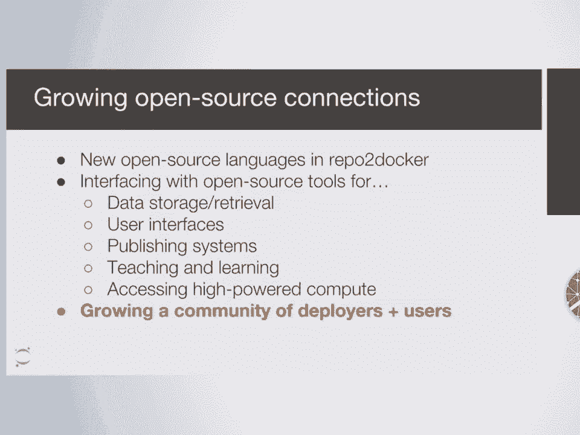

 in any of the stuff that we've just spoken about， here are a couple of links that might be of interest to you。

 On the top， I have these slides。 There are two different gitter rooms， that are of interest here。

 One is for the Jupiter hub repository， and the other one is for a binder specific repository。

 We have lots of people that go in there， and sort of ask how they can get their repos built。

 or how they can deploy their own binder hubs on Kubernetes。 We also have a bunch of mailing lists。

 in this sort of general Jupiter ecosystem， as well as some guides down there at the bottom。

 for how you can get started deploying your own Jupiter hub， or your own binder hub on Kubernetes。

 So with that， we'll open it up to questions， and thanks very much for your time。

 (audience applauds)， - Thanks for a great talk。 I think we'll just take a couple questions。

 'cause lightning talks are coming up right after us。 So I'll start with Lorena。

 and then throw to you。 (audience member speaks)， - I've always wondered， you know。

 once a user launches the binder， they can create a new notebook， and start doing whatever they want。

 and they have access to all Python。 So how do you manage people up using the service， and trying to。

 you know， mine cryptocurrency using free cloud？ - So there's one level of my binder hub。

 as the service for deploying the， the deployment has a bunch of firewall settings。

 and things to limit what you can actually do， once you're there。

 So there's like a whitelist of network ports， and things you can use。

 and then there's also a huge black list， of specifically cryptocurrency things。

 because anytime you advertise free compute， then they show up。

 But there aren't any running right now， so I think we're doing okay。 But it's something that's。

 this is something that Kubernetes helps you with， is it has network policies and things。

 for deciding how many resources people can have， and what they're allowed to do。

 - And another thing you could do， for example， if you're an institute deploying your own binder hub。

 you could set up a wall of authentication in front of it。

 so that it's not just a massive free public thing， but you need to sign in in order to access it。

 - Hi， so let's assume I have my own binder image， so I have put my code， my data。

 everything packaged very well。 Will it still work 20 years from now？ - You wanna answer that？

 It might。 (audience laughs)， Yeah， go ahead。 - I mean， really what Binder's doing is。

 it's using like a GitHub repository， or any repository， it doesn't have to be on GitHub。

 as the unit of reproducibility， as sort of a recipe of what's there。

 And users can make that repository more or less reproducible。

 just based off of best practices in the field。 So for example， in the requirements。txt。

 that I showed in the LIGO repo， there weren't any pinned package versions on that。

 But you can pin those and then you'll make it， a little bit more reproducible。

 I think that reproducibility in general， is not something that we're gonna be able to solve。

 or anyone is gonna be able to solve， with like current existing technology。 Because you can。

 for example， deploy the same container， but on a different hardware that may not have access。

 to the things that are needed to run it。 So what we've talked about is trying to create a set。

 of sort of guidelines and best practices， for defining the level of reproducibility that's present。

 given the information that's in a repository。 And I think we have a couple of GitHub issues。

 about like what are the best ways to do that， to sort of give almost a grade to a repo。

 for being able to be reproduced。 - And one of the important things is you'll need to。

 that you can't do right now with the， as a， the author of the repo that you can't do yet。

 with binder is you'll need to specify the version。

 of repo to Docker that's used to build your image， because as repo to Docker moves forward。

 then like the base environment can change。 And so that's something that will be working on。

 So you can actually pin it all the way down to， every time you run binder， it will produce。

 the exact same Docker file。 And then it's up to your environment specification。

 how long that remains valid。 So if it's pinning absolutely every package。

 then it will last at least as long as the installation， still work。 So for instance。

 the Ubuntu mirrors can go away， after 10 years， something like that， because we only use LTS Ubuntu。

 So with that， yeah。 - All right， we're gonna let go。

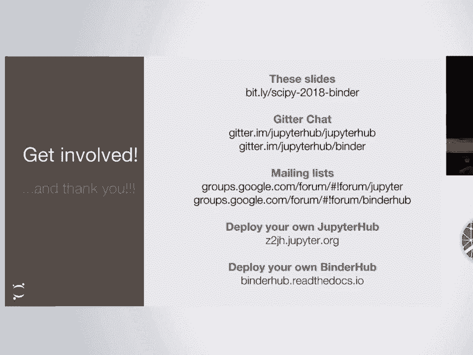

 Thank you so much for a great talk。 And you have your first after question here。 [BLANK_AUDIO]。

