# SciPy 2018视频专辑 - P24：SciPy 2018视频专辑 (P24. Parsl  Enabling Scalable Interactive Computing in Python _ - GalileoHua - BV1TE411n7Ny

 As was mentioned， my name is Kyle Chard， I'm a researcher at the University of Chicago。

 and Argonne National Lab。 I'm going to present the work of many people。

 some of whom I've included here as authors。 I'd like to especially call out the first two。

 Yadu and Anna， who are the lead developers， who have done 99% of the work here。

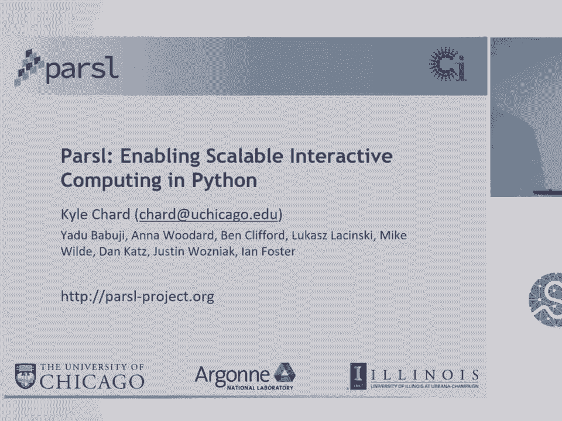

 So in our role at the University of Chicago and Argonne， we deal with a lot of researchers。

 in very different domains， from biomedicine to material science to social science to archaeology。

 And one thing that we increasingly notice is this sort of common story of things that。

 these people need out of cyber infrastructure and distributed computing environments。

 So the first one we hear a lot is， I'm a developer， I'm trying to build an application that I。

 need to link together a bunch of external tools that might do something like genome analysis。

 they might do something like calculating the properties of a material， the direction of。

 particles through whatever。 And I need to link them together in some sort of seamless way with little bits of Python。

 or other functions that glue together these different steps。

 And most often what they're actually asking for is the sort of data flowy type concept。

 This idea of one， the application will execute as the result of the data from a prior application。

 The second thing that we've been hearing over the last probably three， four， five years。

 is I've got this notebook， it works really well on my laptop。

 Now I want to take it to Argonne and run it on a supercomputer。

 And of course that proves to be quite difficult。 Interestingly it started。

 I think a lot of social scientists used to ask us this question， probably several years ago。

 And increasingly over the last couple of years we've got a lot more of these people that are。

 already fairly adept at running large scale analyses on supercomputers who are actually。

 coming to us with their big notebooks saying I need to run this thing at scale。

 And there's not really a very good way to do that at the moment。

 And the final thing I think we hear a lot in our world at least is that I've got these。

 applications， I've run them on some toy data sets on my laptop。

 Now I want to use this several terabyte data set that happens to sit at NERSC or I need。

 to run this other big data set， maybe hundreds of terabytes that sits in some sequencing center。

 somewhere else。 And I want to be able to seamlessly stage that data in。

 compute what I need to compute and， then get rid of it。

 And the final thing that I wanted to call out here is that I want to be able to do this。

 in an interactive way。 I don't want to write a script。

 submit it to someone to actually run on a supercomputer。

 I want to sit there actually engaging with my data， engaging with my analyses as they， go。

 So I thought I would start by summarizing what Parcel is。 So Parcel is a Python。

 it stands for the parallel scripting library， it's a Python based library。

 for supporting the development of these data flow based workflows。 So the idea is fairly simple。

 we've come at it from let's try and stay as close to Python， as we can。

 let's try and be as sort of inobtrusive as possible， allow people to mark up functions。

 that they might wish to run in parallel， adhering to sort of data dependencies that might exist。

 between these functions。 We've got two sort of primary building blocks， the first is a Python app。

 essentially just， any old Python function， put your code in there and you might want to run that in parallel。

 And the second one is a bash app which essentially uses bash to call an external application。

 it could be a script， it could be a binary， it could be whatever you want。

 There are examples there on the right of the screen of what a Python app and what a bash。

 app looks like。 The idea is that these apps return futures。

 I think people are probably well aware of what， a future is。

 it's a proxy for a result that will be coming at some point in the future。

 we don't yet know if it's available but it will be there at some point in the future。

 And these apps can essentially run concurrently。 So once I've defined these apps。

 I string them together with normal Python code calling， these apps， calling them in loops。

 essentially those apps will fire off to a big machine。

 run in parallel assuming there's no sort of shared dependencies between them。

 So the idea is you get this sort of natural parallel programming construct without needing。

 to go through all the hard， low level details of trying to orchestrate that all yourself。

 And one big advantage of Parcel is that the idea of independence in terms of location。

 So Parcel scripts are completely independent of where they run， you can take the same script。

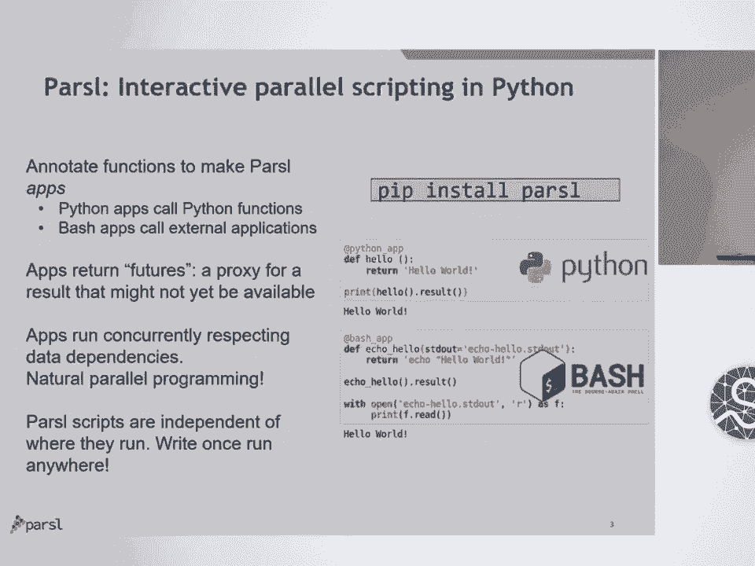

 and run it on your laptop using threads， you can then scale it up to work on a cluster using。

 maybe a pilot job model and then you can even take it to a more extreme scale system using。

 a sort of extreme scale scheduling fabric that our team has developed。

 So another focus I think of research at the moment is that the idea of scientific workflows。

 is no longer just sort of that mini task， HPC， HTC type modality。

 I think we're seeing these types of workflows being developed in a range of different places。

 So these are examples of where I see them， I'm sure you see workflows in very different。

 places than that but I think the sort of common ideas are there。

 So the first one I wanted to call out is online computing。

 So this idea of acquiring data at some source， say the light source at Agon or out here and。

 I don't know what resources you have here。 I'm sure you've got some big instruments in Texas that are producing data very quickly。

 and there's this need to sort of take that data， analyze it in some way so we can help。

 steer experiments and we can work out when there are issues so that we can perform quality， control。

 we can perform center finding， we can perform sort of rudimentary analysis to。

 give feedback to researchers to understand should they be turning samples， should they。

 be changing samples， is there some sort of misconfiguration of their equipment。

 The second one which I think we just heard a ton about is the sort of the need for workflows。

 in machine learning。 So machine learning workflows。

 I think you're saying to see that there's this need to sort， of pre-process data。

 shape it in different ways， run sort of parameters sweeps to try。

 and do hyperparameter tuning and then when you actually come to the prediction phase these。

 are most often sort of embarrassingly parallel predictions where you might want to do so。

 some N by M matrix of materials that you want to run through your prediction model and see。

 what properties you're pulling out of it。 And then the final one is sort of what we're talking about here is interactive computing。

 so this idea of being able to sort of iterate， perform analyses as you go， fire off things。

 that actually might need to run on bigger machines。

 So this example here is an interesting student learning environment where they allow people。

 to basically stand up detectors in their high schools， retrieve the data from those detectors。

 and then build notebooks so that they can actually iterate over those analyses combining。

 the data they've found themselves with data that's published online with data published。

 from other schools。 So here I'd just like to show a quick example of what a parcel script actually looks like。

 So this is a very common example of where an embarrassingly parallel execution protein。

 docking where you've got some number of proteins that are associated with the disease， you've。

 got some much larger number of drug candidates that potentially could be useful for that disease。

 you want to run an analysis of all of those drug candidates against all of those proteins。

 and work out the ones that are sort of the highest probability of actually being useful。

 for further experimentation at the actual biological level。

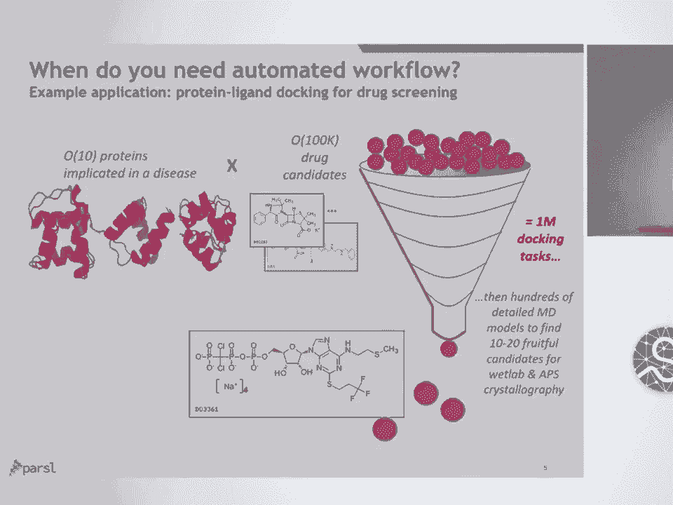

 If we look at how we actually implement that in parcel， basically we define， so this is。

 a bash app here， we define a docking function which essentially just wraps a call out to。

 an external script， some binary application that needs to be executed many times， we define。

 the signature， what arguments need to be passed in and then we can link it together in a。

 for loop where we just iterate over that sort of embarrassingly parallel problem space。

 we say for every protein， for every ligand， go and fill up a 2D array of all of these docking。

 calculations and then we might graph it or look for min or max in that data set。

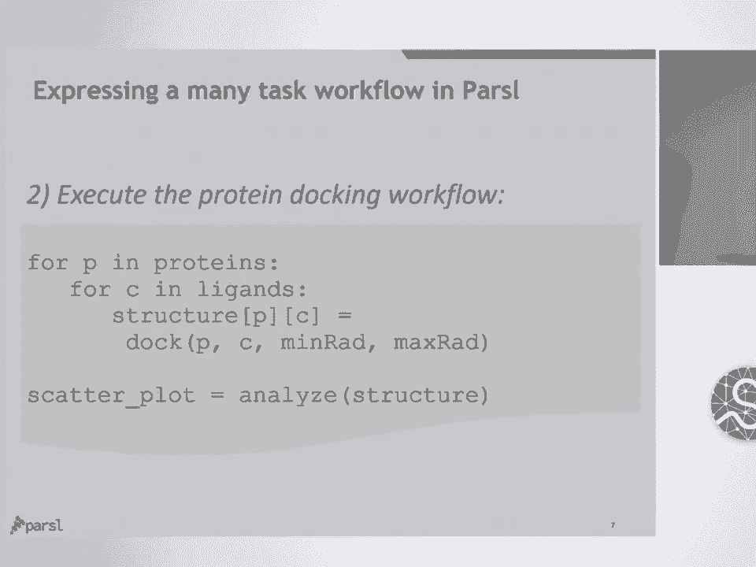

 So in terms of how we got to this point， so our team's been working on parallel workflows。

 for 10 plus years， so in the early 2000s we developed an implicitly parallel scripting。

 language called SWIFT， of course names changed recently because Apple came and developed。

 their own programming language called SWIFT， but you'll see here we have an example on。

 the right of the sort of C-like language for expressing these types of workflows where。

 you essentially like you sort with parcel， you wrap these apps that need to execute in。

 parallel and then you write this domain specific language where everything's implicitly parallel。

 with variable assignments in parallel， every call to an application in parallel and there's。

 this implicit sort of data management， data dependency stuff that goes on behind the scenes。

 to assemble this graph and control execution。 So what we've done with parcel is we've tried to bring the SWIFT capabilities a lot closer。

 to the users by instead of requiring people to learn a new language which is C-like， we're。

 allowing them to basically express their workflows in Python with as minimal of sort of changes。

 as we can。 So now we'll get back to parcel。

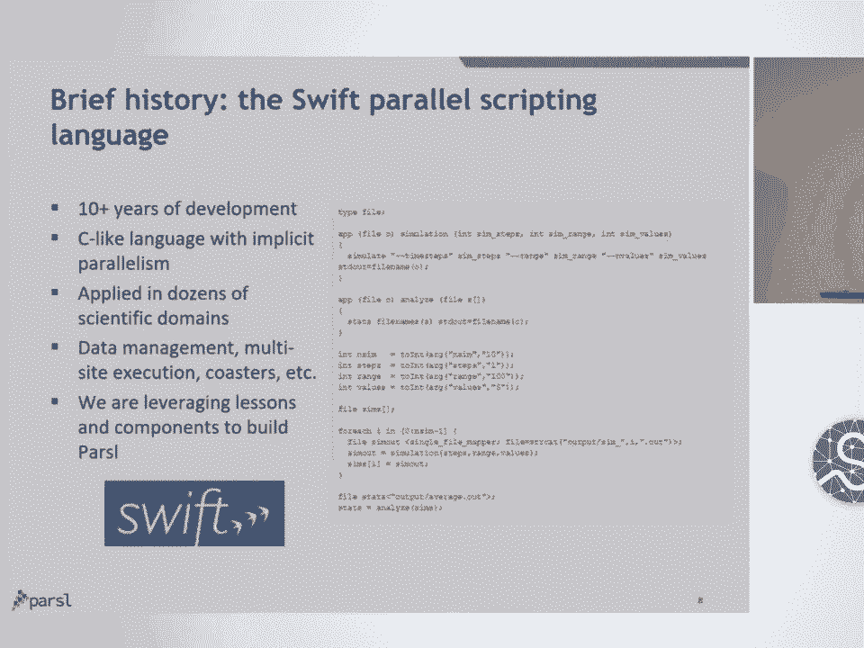

 So if we look at the way parcel actually works， so unlike a lot of workflow systems which require。

 you to sort of pre-compile a graph， they ask you to sort of define a graph of here are。

 all the steps I need to run here are the data dependencies between them。

 We instead have the sort of more dynamic graph model where we allow this graph to evolve。

 over time depending on what results we've had from previous apps。 So an app can spawn more apps。

 et cetera。 So if we look at what this looks like， if we have some Python script up the top which。

 might be in Jupiter， it might be just a Python script that's sitting on a machine somewhere。

 We have some execution resources down the bottom there， blue waters a big machine at， UIUC， Amazon。

 exceed resources and sort of some data staging fabric between them。

 So we have data resources off to the side that may not necessarily actually be resident on。

 the machines in which we want to execute things。 So as this Python script is executing。

 essentially we start to build up this graph。 So every quarter one of these apps will go into the graph where we assign a dependency。

 based on those shared data products from the prior app to the app that actually needs to， execute。

 As soon as any of these apps are seen to parcel， if there are no dependencies， they'll essentially。

 be pushed down to the execution resources to execute。 They'll spin for a while。

 come back with results and then we'll start to complete the rest of。

 the graph that was dependent on those tasks to execute。

 And of course they'll still be pushed down to the execution resources。

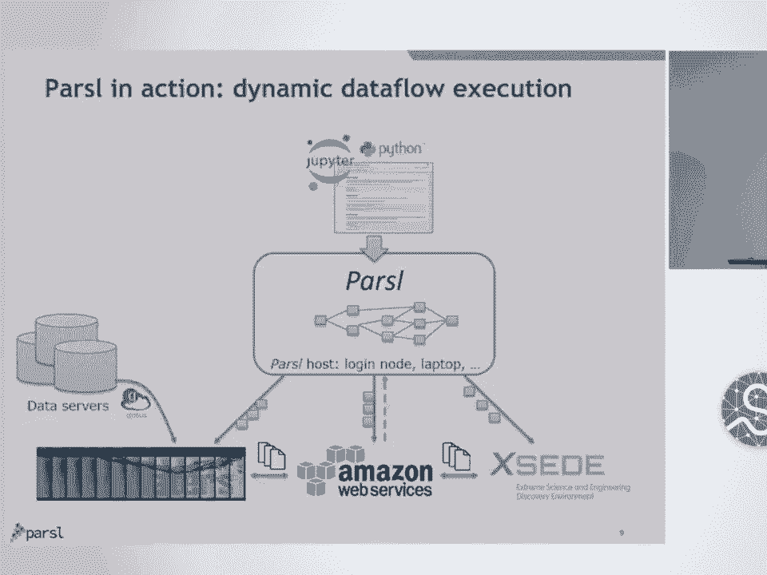

 In terms of highlights， so the first one that I always like to call out to people when。

 I'm presenting parcels is it's pure Python。 So there's no need to install anything else。

 The entire parcel library can be pip installed。 You can plug this into an existing Python script by adding some decorators to your applications。

 or functions that exist in there。 You can use Python libraries natively。

 We handle the staging of Python objects down to the execution resources and Python objects。

 coming back again to you。 So there's no need for you to really go in and cut your code apart and redevelop from。

 scratch。 Instead you're just sort of augmenting what you've already got。

 The second thing I like to highlight is the independence from execution provider。

 So essentially allowing the same parcel script to be run locally on grids， cloud supercomputers。

 works directly with the schedulers。 There's no need to sort of install some HTC model on top of it。

 We can talk to SLIRN。 We can talk to AWS。 There's no need for you to actually install infrastructure there necessarily to execute。

 things。 We can use containers so we can speak to Docker and Singularity containers for wrapping sort。

 of one app that you might want to run in a container but also for spinning up a container。

 and then pumping jobs to it so you don't need to go through that overhead of continually。

 setting up infrastructure to execute。 We found that -- so we built out this capability to speak to a bunch of different schedulers。

 a pure Python library for speaking to schedules and we got asked by many people if we can fork。

 that off so they could just use that bit。 So we've released this little library called LibSubmit which includes wrappers for speaking。

 to different resources。 It's a very simple interface， essentially put job， cancel job。

 find out the status of your， job。 You're welcome to have a look at that and use it for your own needs and I've put an assortment。

 here of some of the resources that we're currently running parcel on， obviously with。

 a slight bend towards some of these sort of leadership class machines that we work with， at Argonne。

 In terms of how we actually achieve the separation of code and execution that's done through a。

 configuration file， we provide some configuration files for machines that we use a lot but it's。

 actually relatively easy to create your own configuration file。 This example here。

 I'm not sure if you can see this with the size， shows how we can combine。

 two types of execution resources that are used by the same script。

 So the top one is using a pilot job model deployed on a cluster at the University of Chicago。

 It includes information saying it uses SLIRM。 Here's how I connect to it over SSH。

 Here's some information about the number of resources that I want to allow parcel to provision。

 where we use an elastic model based on the actual requirements of the workload depending。

 on how wide or narrow that graph gets at the time。

 You can define here's the minimum size of my allocation， here's the maximum size， here's。

 how aggressively I want you to go on provision resources。

 We can put some overrides in there saying in this example that we want to use singularity。

 we want to use Conda， we need to activate a Conda environment to actually have all of。

 our dependencies there。 And then the second executor is just a thread base executor where we're provisioning some。

 sort of threads locally for smaller tasks that we can actually execute locally and we。

 just say we want a couple of threads for that。 When it comes to actually defining the sort of mapping between your apps and those resources。

 you can annotate on the app definition what resources you might be interested in running。

 those things on。 You can say everything， you can say nothing。

 Often people will use this if they have some apps that need to run on GPUs， some apps that。

 need to run on CPUs， some apps that are sort of very quick little tasks that could be run。

 on threads。 And also there's some， I guess， hint based model where users can probably avoid using multiple。

 machines if they know there's going to be a huge amount of data that needs to cross between。

 two apps。 So you might want to co-locate things on the same machine。

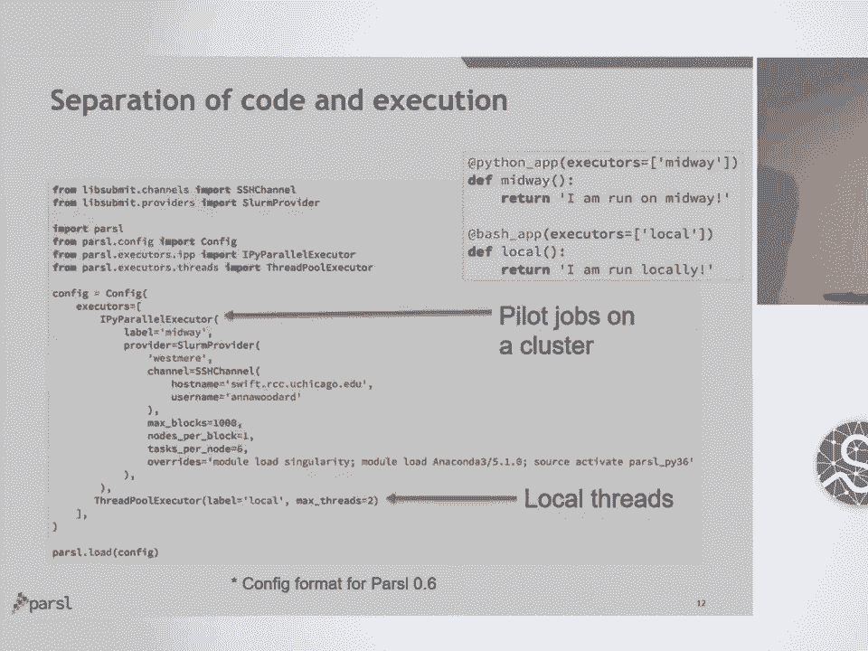

 So one of the big advantages we've found with using Parcel is that it enables people to。

 actually scale their Jupyter Notebooks。 So essentially they can write their Jupyter Notebooks as they do currently。

 they can annotate， the apps in that Jupyter Notebook and then they can submit them from that Notebook sitting。

 wherever it might sit。 We've done a bunch of work trying to support sort of transparent SSH tunneling with an。

 OAuth based model so we can have a sort of native app type model where the Python script。

 can actually go on provision tokens that can then be used to SSH to particular resources。

 One of the big advantages of using Jupyter is the support for visualization。

 So we've had a couple of students spend some time trying to visualize the graph as it is。

 at the time within the Jupyter environment。 So I think I've alluded to this already but we can't just speak to a bunch of different。

 execution resources without also speaking a bunch of different ways of how we actually。

 get jobs onto machines。 So at the simplest level threads being able to run things in multiple threads on one machine。

 a sort of slightly more complicated model is using a pilot job model which I have a little。

 graphic that illustrates。 So essentially a pilot job model works by Parcel submitting a job request to the job queue through。

 the scheduler that will go on provision some block of nodes will then deploy sort of worker。

 functionality on those nodes and then push down tasks directly to the nodes with provision。

 So what this does is it avoids the need for us to go through the queue and provision big。

 block of resources and instead we can sort of provision it and then start pumping it full。

 of tasks as quickly as we can。 And we also support this extreme scale model Swift T。

 So that's a model that our group has， built that's basically you can think of as a distributed decentralized scheduling model。

 where we fan out an MPI job to actually do the job placement and execution on a very， large machine。

 So if you want to actually fill a petaflop machine or more， quite often you can't pump。

 tasks as quickly as you need to to fill up the nodes you've got。

 So being able to distribute that and create jobs through this decentralized sort of model。

 is the only way of actually doing it。 And of course other execution models can be added。

 we're working with some researchers， at Notre Dame to try and add their pilot job model to the system。

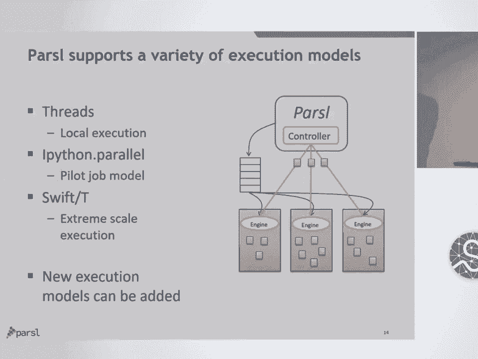

 Authentication authorization， so often when you see talks like this about actually running。

 things on big machines， we'll talk about the easy stuff without talking about the hard， stuff。

 actually being able to submit jobs to leadership class machine is not as trivial。

 as just running a Python script on your laptop。 There's a few barriers。

 a few hoops you have to jump through。 In general I would say authentication authorization is a real pain。

 You've got to deal with two factor。 You've got to deal with X509 certificates。

 you've got to deal with a bunch of junk that， you don't really want to deal with。

 So what we've done is we've integrated a parcel with the Globus Orth fabric。

 So Globus Orth is an OAuth 2 based authentication authorization system。

 Essentially it's trying to rethink the old sort of grid security model into a new web。

 based OAuth model so you can define your parcel script。

 You can go and retrieve sort of OAuth tokens to access Globus services for data management。

 access tokens for submitting to Globus compliant SSH services so that you can sort of try and。

 break down some of those barriers between actually executing workload in various places。

 And following on from that， parcel also provides transparent wide area data management。

 So this is another effort to try and avoid this lock into a particular machine and try。

 and abstract the locale in which you're actually executing something。

 So the idea here is that you can define this parcel file object which may be a local file。

 if you've got a shared file system or running on your laptop。

 It might be a Globus accessible file that sits out there and there's some big storage system。

 that might be at a university， a national layer， might be at a sequencing centre， it。

 might be anywhere。 And parcel will essentially transparently or implicitly perform those staging calls for。

 you behind the scenes。 So when you've actually got a task that needs to execute it's depending on this file that。

 sits out there in China or something it'll actually wire it across to the machine and。

 then execute the task when it's actually ready。 And so this is really useful for running on some of these larger machines that have large。

 scale data transfer node infrastructure for moving in and out large amounts of data。

 We also support HTTP and FTP for direct data download staging to from execution and we're。

 working on more specific caching models to avoid shared file systems hammering away at。

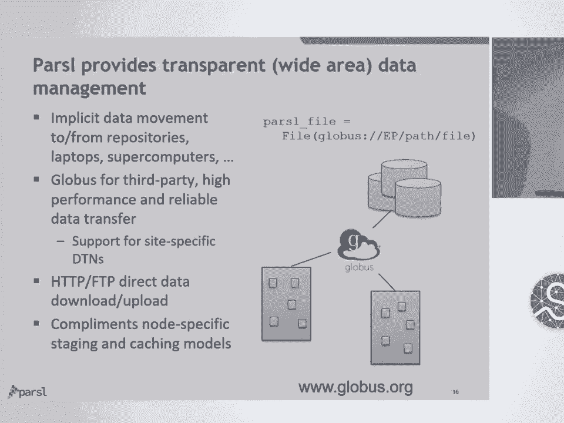

 it if you've got a million jobs that are hitting the same file that tends to pull down shared。

 file systems。 I have spoken to a few people here and I don't think Globus is a well-known technology in。

 this community。 I've included the link at the bottom there if anyone's interested in looking at Globus。

 and it's of support for sort of very large scale data transfer synchronization sharing。

 The final capability I wanted to talk about was app caching。

 So one thing we noticed very quickly when you start running sort of bigger workflows in。

 Jupiter is that you can accidentally shift enter， run cells that might actually be spawning。

 a bunch of different jobs that run in different places。

 So very quickly we added the ability to sort of fit in with the whole check pointing model。

 as well you need the ability to cache things。 But the idea of being able to cache or a memoization of a function so that you're not。

 recomputing results that you've already computed before。

 So this works as you'd expect you basically annotate an app saying I want caching to be， on here。

 Each time we make a call to that app we'll store sort of what the parameters were that， invoked it。

 what the files were or what the objects were that went into it and what the。

 result was and if you were to recall it we look in our cache rather than actually rerun。

 that job which might go and take 10 hours on some machine elsewhere and use up your。

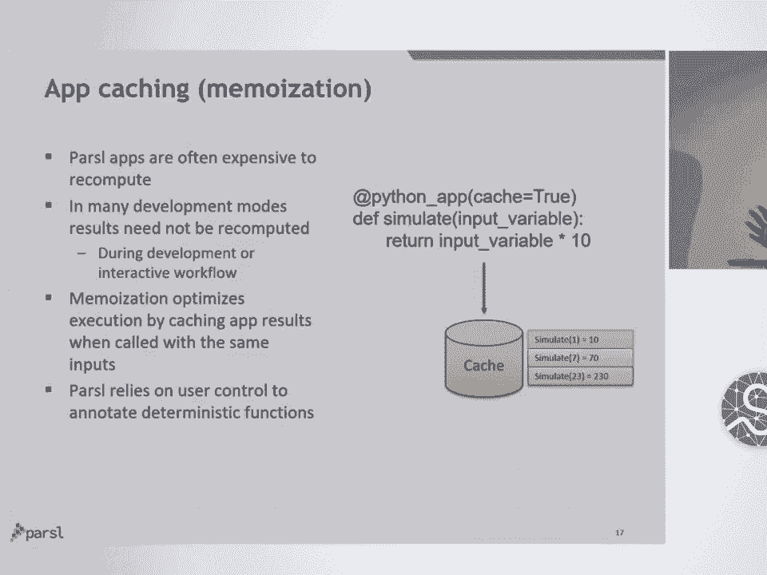

 allocation。 So we've been using pass will probably for the last year or so in production science。

 applications。 I included a few examples here of some of the applications we've been applying it to。

 The first one on the top there is an interesting machine learning application where we're trying。

 to predict the stopping power of electrons through materials and we're done a lot in。

 bio especially with sort of genetic genome analysis workflows， a lot of information extraction。

 materials science based on our association with the APS at Argon， the cosmic ratios which。

 is the example I showed before。 We're very involved in an interesting collaboration as part of the LSST。

 the dark energy survey， where we're trying to build all of their science analysis workflows and parcel。

 The goal there being that instead of sort of keeping those workflows to a small group of。

 people that know how to run them， broadening them to a wide group of users who can actually。

 run and extend these analyses that are being used in production。 So with that I'll finish up。

 So Parcel I think provides this very implicit data flow model in Python that allows for。

 this sort of simple intuitive expression of quite complex applications。

 They're expressed directly in Python so no need to learn another language。

 We've tried to make it as simple as possible with the caveat that of course we do need。

 some information to be able to do this。 We've applied it to a range of workflow models from interactive to machine learning to traditional。

 HPC， HTC。 One of the big advantages of Parcel is that it integrates with the sort of evolving science。

 ecosystem， the SciPy world that I think obviously everyone here is very well aware of。

 The Jupiter environments for actually executing things in interactive modes and then also。

 with technologies like Globus that support 100，000 users to move on the order of 300 petabytes。

 of data over the last few years。 Parcel the code is separate from the specification。

 the computing resources and the location of， the data so this makes your Parcel script very portable。

 We're no longer locked into the single resource that we are using typically。

 And then there are a bunch of other features that I didn't talk about like check pointing。

 like elasticity， containers， more data transfer stuff， etc。

 So with that I'll finish。 The website is there。 We have a 10-pin B environment that I'm sure if you'll go to you'll pull it down so there's。

 also a binder link there if you want to go and get your hands dirty and run some basic。

 Parcel scripts。 So I should also say thanks to our sponsors so particularly NSF has given us a lot of。

 support on this project。 The Department of Energy through Argon as well and our home institutions。

 So thank you。 [Applause]， >> All right。 I think we have time for a few questions。

 So quick reminder if you can have one question per person and please phrase your question。

 in the form of a question。 >> Hello。 So I'm not sure if I can only have just one question but they're quick。

 One is like you said you could basically submit binaries on various compute nodes and you。

 mentioned theta。 I thought that if you launched your code on the back end of theta that they did not allow。

 to like to then submit a or to launch another binary。

 But you're saying through this process you're able to overcome that somehow。

 >> So are you talking about I don't quite get that。

 So you mean you can only submit one binary to a particular job queue is that what you're， saying？

 >> Yeah like through the QSub you see one binary。 >> So that's essentially how the pilot job model helps us。

 So by submitting a pilot job model essentially we're deploying one job which is a worker。

 node on that node with provisioned and then we're pushing arbitrary tasks to that node to， execute。

 Does that answer the question？ So QSub we're never QSubbing individual tasks。

 We're not QSubbing Python function or a wrapper around an application。

 We're QSubbing a job that will deploy this pilot job infrastructure。 >> I think so。 >> Okay。 Thanks。

 >> Another question right here。 For commercial codes that require licensing requirements so there might be a given number。

 of tokens available。 If you provision a node is it aware of those resources？ >> No we hit。

 >> We get away for the schedule to figure that out。 >> Yeah that's a really good point。

 So we haven't looked at all restrictions on licensing for commercial codes。

 >> I mean is that something you're looking at though？

 >> So we're working with a bunch of chemists who have licenses for codes but normally they're。

 not actually sort of hardened rules within the scheduling system so they have their code。

 they have the binaries that they can deploy and it's not enforced at a sort of you can， run a 10。

000 of these at one time sort of model。 So it's not something we've looked at specifically。

 It's interesting because I know certainly people with MATLAB and stuff have those constraints。

 >> Same restrictions yeah。 >> Something we should probably look at。 >> Hi。 Thanks for the talk。

 I'm very curious so I'm coming with a bit of a desk bias。

 I was just wondering whether you've looked at desk and how the desk could integrate into。

 this kind of tool。 >> Yeah so desk is a great tool that I've used myself especially for sort of data analytics。

 things that I've done。 So we have looked a little bit at how we could integrate with desk especially around the。

 distributed piece。 I mean our focus has probably been a little bit different and that we're focused on these。

 more sort of binary execution applications， wide area data staging， heterogeneous sort。

 of compute environments but I think desk is heading in those directions。

 So I think it's something we should probably look at a little bit more especially given。

 the community of desk users and sort of the flexible and easy to use sort of nature of， it。

 >> Any last questions？ There's one gentleman here。

 >> Yeah so thank you very much for the presentation。

 So I have one question this has to do with the caching。 So when you cache。

 if since you're running on an HPC system and you have time constraint， if your job fails。

 do you have， does it， does it， does， are you able to check points such。

 that if you come back and you want to resubmit the job， you start from where you end it？

 >> Yeah exactly。 So part of the reason for building the app caching was to deal with the notebook problems。

 we saw but the other part was to deal with check pointing。 So a lot of applications。

 I mean some of these sort of stochastic analysis algorithms will。

 fail quite frequently and it's just people accept it。

 So we sort of had to bake in that caching so that we could actually periodically check。

 point not only where we were in the sort of DAG so that we wouldn't rerun the whole DAG。

 again but also so that we could interface with applications that would check points。

 So essentially you can loop on that application that's checkpointing itself。

 Application checkpointing is agnostic to parcel but we can support that checkpointing model。

 by being able to loop around them。 So yeah I didn't talk about checkpointing at all but that's a pretty central part of。

 what we provide。 >> Okay so then at what point do you clear the cache？

 Because how long will you keep caching？ I mean you have to manage memory。 >> Yeah。

 >> Yeah so at the moment it's a good question that I actually don't， I don't know the answer。

 to that question。 You can configure where the cache is， you can configure the checkpointing cache。

 you can， configure if you want to share that checkpointing cache between multiple applications but I'm。

 not sure if there's a way， I don't think we have a way as far as I know， I don't think。

 we have a way yet to sort of clear that cache short of you going and deleting the checkpointing。

 file yourself。 That's a good question though， something I should talk about with the team。

 >> Okay thank you。 Any further questions for Kyle？

 He can take out on the hallway and let's all thank Kyle again for the talk。 [ Applause ]。

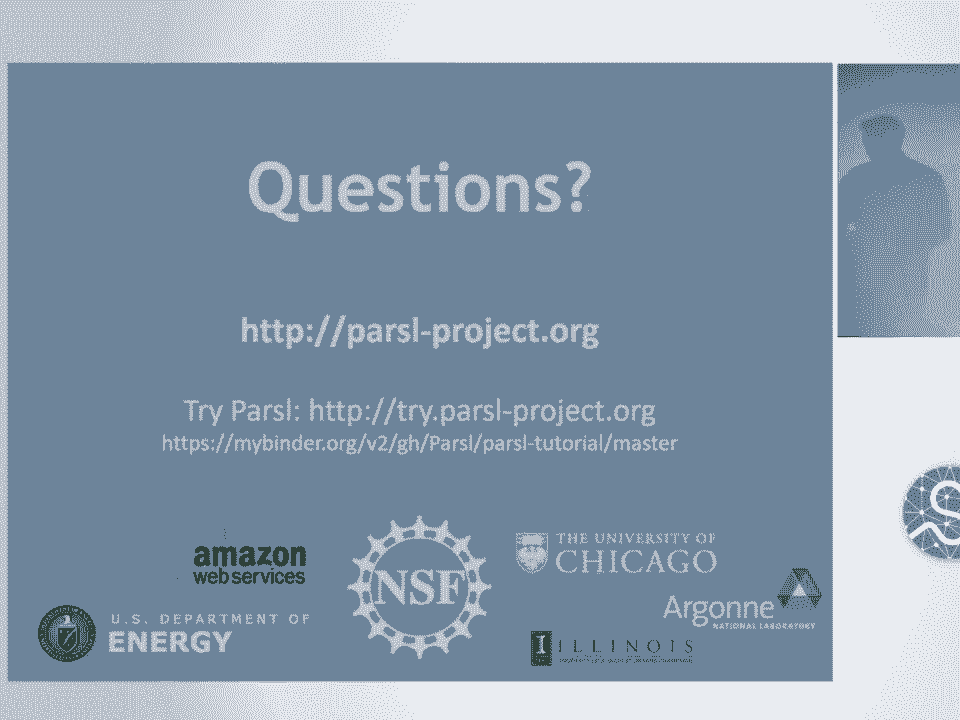

 [ Silence ]， [ Silence ]， [BLANK_AUDIO]。