# SciPy 2018视频专辑 - P29：SciPy 2018视频专辑 (P29. Role of Python in Recent Gravitational Wave Astronomy Break - GalileoHua - BV1TE411n7Ny

 That was a really cool， very personal introduction。

 Speaking of learning C++ on a parent's office mate's computer， anyone who grew up using DOS。

 if you need to format a floppy disk。

 the floppy drive is the third most important drive on a computer， right？

 The most important drive is the hard drive。 Then the next most important drive is maybe。

 I don't know， another， you know， the floppy drive that you don't usually use。

 And then the third most important is the three and a quarter inch floppy drive。

 So if you want to reformat a floppy disk on your mother's office mate's computer。

 that's going to be C， CO and backslash， right？ [ Laughter ]， No。

 I got in a little bit of trouble that day。 Okay。 So， I'm interested in multi-messenger astronomy。

 And so what that means is using two or more of the fundamental physics of nature。

 at the same time to learn something about an astronomical object。

 Or put another way to use two different kinds of particles。 So， for example。

 if you've seen the news from yesterday， there was a big announcement about one of the。

 basically the first ever observation of a single event in， well。

 a single very distant event in both electromagnetic waves and neutrinos。 So。

 my main interest is observing the same astrophysical object。

 in both gravitational waves and electromagnetism。 And hopefully someday also neutrinos。 So。

 I have sort of a day job and a night job。 My day job is sort of data science working with the LIGO。

 and Virgo gravitational wave observatories doing a lot of time series analysis。

 a lot of Bayesian inference。 And my night job is working with a number of different astronomical facilities。

 mostly optical and ground-based to look for the signatures。

 of those same gravitational wave sources。 I'm going to talk mostly about my day job today。 So。

 this guy， Einstein， came up with the theory of general relativity。 About 100 years ago。

 it is the sort of modern picture that we use to understand space and time。 And in a nutshell。

 what Einstein's theory of general relativity says is that massive objects。

 that cause curvature in the fabric of space time。 And that curvature tells objects where to move。

 So， there's this interplay between mass and energy density and geometry。

 A consequence of that is that the theory of general relativity predicts something called。

 gravitational waves。 These are ripples in space time。

 If you have sort of a coordinate grid that tells you how far apart two points in space， are。

 as a gravitational wave passes by， it's going to squeeze space time in one direction。

 and stretch it in the other direction and vice versa。

 Gravitational waves are pretty similar to light in a lot of ways。 They travel at the speed of light。

 They travel in two polarizations， but there are some big differences。 For one。

 gravitational waves are a traveling perturbation of the metric of space time， if， you will。 And so。

 what's oscillating is not electric and magnetic fields， but a strain， a change in。

 length per unit length。 Also unlike light gravitational waves are， well， sorry。

 also like light gravitational waves， are transverse， unlike light they're quadrupole。

 not dipole radiation。

 So Einstein said， Einstein was convinced that we would never be able to detect gravitational， waves。

 In 1916 he wrote， it is obvious that the amplitude of gravitational radiation has。

 in all imaginable， cases， a practically vanishing value。

 So at times he was convinced that gravitational waves were a real physical effect， but he was。

 convinced that they were so weak that we'd never be able to detect them and they'd be。

 completely irrelevant to our reality。 So on this slide I'm showing two ill-conceived gravitational wave generators to show you that。

 the idea of a man-made gravitational wave transmitter just cannot exist。

 So the first one on the left here， this is a gravitational wave signal generator that's。

 sort of a gag device that sits in the theoretical astrophysics meeting room at Caltech。

 And so it has this pair of weights that are spinning on a little pedestal。

 And if you calculate the amount of strain that this produces it's something like 10 to the。

 minus 50。 So a fractional change in length of a part in 10 to the 50。 On the right-hand side here。

 this is sort of the opposite end of making a very large， very high velocity device。

 And so this is actually a centrifuge at NASA Goddard Space Flight Center。

 This was not set up like this to produce gravitational waves。

 This was done to sort of test the rollover stability of these SUVs。

 And if you calculate the emission， the amount of gravitational waves that it would produce。

 it's something like 10 to the minus 46。 However， nature can do much better。

 The best source of gravitational waves is sort of a， is again basically a centrifuge。

 So you take two masses orbiting each other and they need to be moving pretty close to the。

 speed of light and they have to be pretty massive。

 So the best sources of gravitational waves that you can conceive of in nature are binary。

 star systems composed of two compact objects such as two neutron stars or in this case。

 two black holes。 And if you calculate how strong these gravitational waves would be for a source that's sort of。

 in the， you know， in a not too distant galaxy and how strong the gravitational waves would。

 be at Earth， you get a strain of 10 to the minus 21。

 Now we've actually known that gravitational waves are real since for several decades。

 And the strongest evidence that we had for a long time came from binary pulsars。 And so this is a。

 this is a， this is a， the Hulse-Taylor binary which consists of two， neutron stars and we actually。

 and we see the radial pulses from both， both neutron stars。

 as those beams pass through our line of sight。 And because those。

 those radial pulses come at a very， very regular frequency which is， the， we can use them as very。

 very precise clocks to measure the orbit of the binary。 And so we can tell that this， this。

 this binary that's orbiting with a period of about 7。75， hours is losing 76。5 microseconds per year。

 And it's losing it at a rate that is exactly predicted due to the loss of energy and angular。

 momentum to gravitational waves。

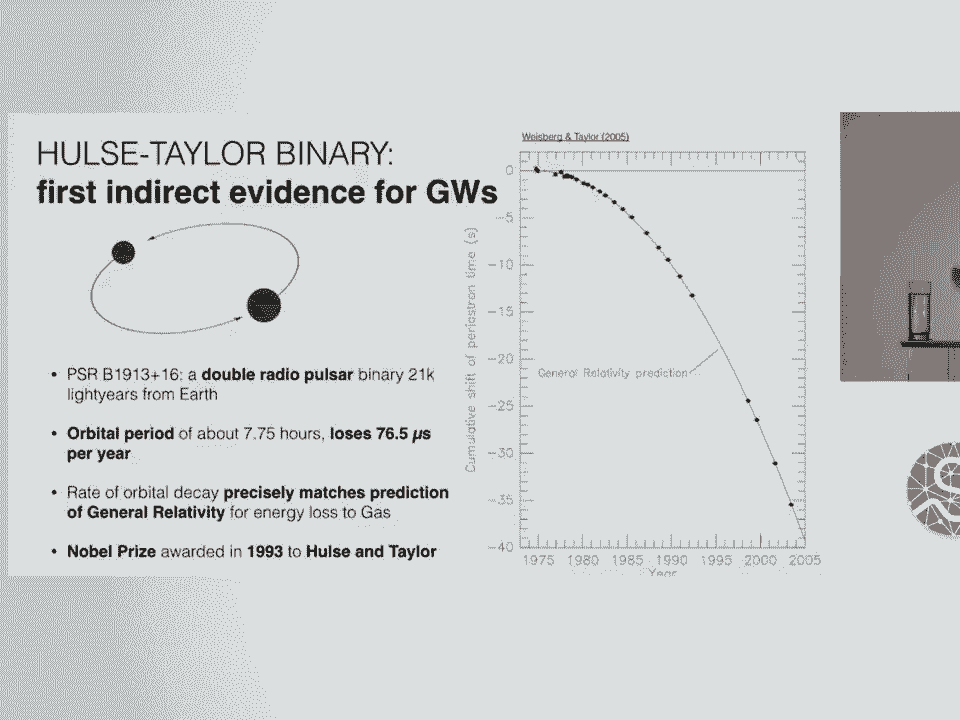

 And Hulse-Taylor won the Nobel Prize in 1993 for demonstrating this。

 Now with LIGO we want to detect those gravitational waves directly。

 And so the way we do that is with laser interferometry。

 I'm going to back this up because I wasn't talking fast enough while the animation was， playing。

 Sorry。 So this is a Michelson interferometer。 So you have a laser that， oops， sorry。

 You have a laser that shines onto a beam splitter and reflects off of two mirrors in two different。

 directions。 Then recombine at the beam splitter and come out at a detector which is this white plate。

 Now depending on the difference in the length of the arms you either get perfect constructive。

 interference and so you see light at the， at the output at the detector where you get。

 perfect destructive interference and you see no light。

 And so you can use laser interferometry to measure， to very， very precisely measure differences。

 in length to precision that is much， much smaller than the wavelength of light that you， are using。

 So because these gravitational waves are so extremely weak we have to do lots of crazy。

 things to make them detectable。 And the first thing。

 the first crazy thing that we do is that we make our detectors enormous。

 So this is LIGO Livingstone Observatory in Livingston， Louisiana。

 In the bottom of the picture you see the vertex station as we call it which houses the high。

 power laser， the beam splitter， the readout optics and four kilometers off in either direction。

 are the end stations with those end mirrors。 Because these detectors are also extremely sensitive they pick up ground vibration from。

 both seismicity and also anthropogenic ground motion and they are sensitive to all kinds。

 of environmental effects。 We have to put them in god awful places。

 So for example this detector is in a logging reservation in Louisiana。

 We actually have huge problems with alligators here。

 And this one which is actually the one I think is even of the two that I visited。

 This is my favorite LIGO Hanford Observatory in Washington state。

 This is on the Hanford nuclear reservation where we manufactured a lot of the material。

 for nuclear weapons during World War II and we did it in a hurry and so we weren't very。

 clean about it。 So it's this amazing desolate nuclear wasteland。 And you know sometimes we'll have。

 we'll actually see blips in our data because of like demolition。

 that's going on on the nuclear site to like clean up after these sort of mad science。

 experiments that we did during the Manhattan Project。

 And we'll have to go out and bail tumbleweed off of these beam tubes to keep them clear。

 But we now have this global network of gravitational wave observatories。

 So LIGO stands for laser interferometer gravitational wave observatory。

 As I said we're going to try to sense fractional changes in length of a part in 10 to the 21。

 With our four kilometer arm length that's equivalent to measuring a change in length。

 of two times 10 to the minus 16 centimeters which is about a one five hundredth of the。

 radius of a proton。 In proportional terms it's like measuring the distance from here to the nearest star to。

 an accuracy of the breath of a human hair。 And we have to play all sorts of crazy techniques on top of making these detectors enormous。

 to make that work。 So these mirrors at the end， so this photograph in the top right is a picture of one of the。

 end mirrors， have to be 40 kilogram chunks of glass that are suspended from pendula that。

 are made of glass threads。 And then that pendulum is hung from another pendulum and another pendulum and all of these。

 pendulums are also actively controlled to further damp ground motion。

 We have to dump huge amounts of laser power into the system because one of our noise sources。

 is just sort of photon counting noise。 And so we take this 20 watt laser and we put it into these arms are actually resonant cavities。

 and so the light makes hundreds of round trips in here before coming out。

 So we boost this up to hundreds of kilowatts stored in the arms。

 With all the power that's being dumped on these mirrors they deform thermally and sort of keep。

 them in just the right shape we have to actually heat them from behind with a completely， with。

 a completely different laser system to cancel that thermal deformation out。

 And the end result is that we can actually have some sensitivity to gravitational waves。

 So this is the signal， the first signal that we've ever recorded from a binary black hole。

 merger on September 14， 2015。 I'm going to play it for you。 You're going to see a spectrogram。

 So on the horizontal axis is time， on the vertical axis is frequency and you're going to hear。

 the signal after we've whitened the data and band passed it to sort of make the astrophysical。

 part of the signal more obvious。

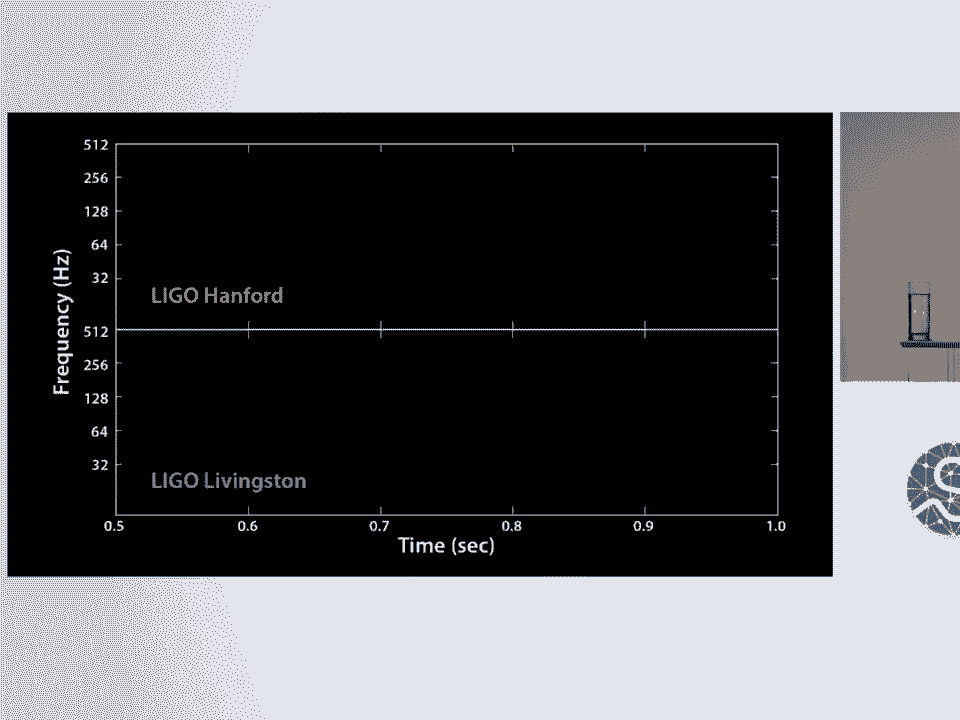

 So you hear that knock？ There we go。 There we go。

 This is the frequency。 So that chirp is the signal of a binary black hole merger。

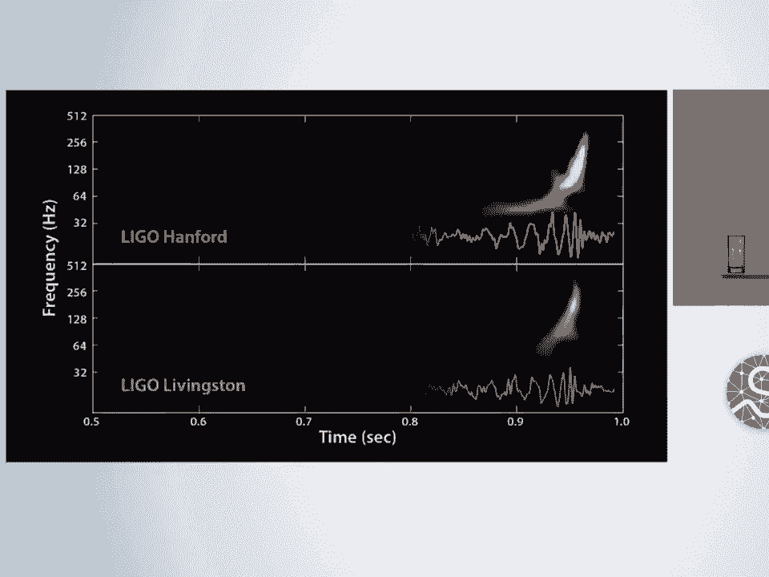

 And so what's happening is you have these two black holes that are orbiting each other。

 And as they get closer and closer， they emit gravitational waves more and more strongly。

 And this is a runaway effect。 And so the amplitude and frequency of the gravitational wave signal goes up and up and。

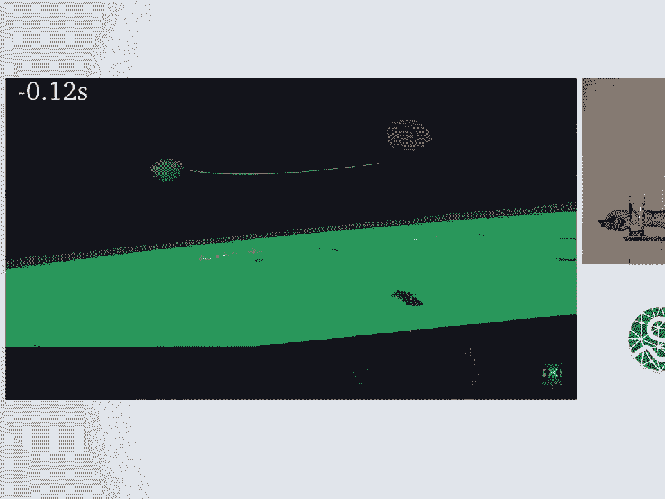

 up， up until merger， which happens in， it's going to slow down here for a moment。

 So these black holes will finally merge， form a single black hole， which will then， come， on。

 ring down and settle down into a nice， spherically symmetric remnant black hole。

 So since then we've detected many more black holes。

 And so we've assembled sort of a rogues gallery of binary black hole mergers that we've detected。

 through gravitational waves。 These purple ones in the lower left corner。

 these are black holes that we've detected， using more conventional means。

 So using X-ray telescopes to look at a black hole that's accreting matter from a donor star。

 And we can look at the X-ray emission from that accretion and we can use that to determine。

 the mass of the compact object。 And so all of these black holes have masses of maybe five to ten solar masses。

 The black holes that we're detecting with LIGO go up to much， much higher masses。

 The heaviest one so far was the first one。 So it was a merger of a 29 solar mass and a 36 solar mass black hole。

 I believe。 And the remnant， or the final remnant was something like 62 solar masses。

 So started out with the two heaviest stellar mass black holes ever observed and we made。

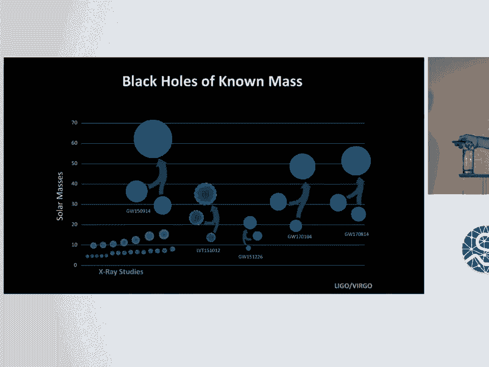

 an even heavier one。 But black holes are cool。 But I think what's much more interesting is neutron star mergers because when you put。

 matter into the system then you can get light。 So here you have two neutron stars that are orbiting in a binary and up until they get。

 pretty close physically it looks a lot like a binary black hole merger。

 But when they get close the two neutron stars start to pull each other apart due to their。

 tidal forces and they form a short-lived sort of accretion disk。

 And that accretion flow is going to be the central engine that powers a range of different。

 types of electromagnetic emission。 So the coolest consequence of this is nuclear synthesis。

 So the way this works is we take two really dense neutron rich objects and we pull them。

 apart so we have a lot of hot neutron rich matter and we're going to synthesize a lot。

 of heavy elements in the process。 And then those heavy elements are going to decay and they'll act as a radioactive heat。

 source that's going to produce a signal that a signature that we call a kilo nova。

 So the dominant nuclear physics process that's going on here is called the R process or the。

 rapid neutron capture process。 And it's called rapid because you're capturing neutrons onto seed nuclei faster than those。

 neutrons can beta decay。 And so this chart here is sort of like the periodic table but it's a chart of the nuclei。

 So on the horizontal axis you have the number of neutrons and the vertical axis you have。

 the number of protons。 So along the diagonal or close to the diagonal here is what's called the sort of the value。

 of stability。 So these are the stable nuclei。 And in a neutron star merger or for or to some extent in a nuclear in a thermonuclear bomb。

 explosion for that matter you'll quickly form very， very neutron rich elements。

 I'm going to see if I can pause this so I can talk to it。 Nope it's not going to let me pause it。

 I just have to talk faster。 So you form neutron rich heavy elements so you go very。

 very far to the right and very， very far to the top right and then you decay back to stability。

 You beta decay back to stability。 But you get this sort of characteristics three peak abundance structure because there are。

 magic numbers of neutrons that give you increased nuclear stability。

 Sort of similar to the way in chemistry where having certain numbers of electrons in the。

 valence shell of an atom gives you more chemical stability。

 And so right around those magic neutron numbers you get pileups of atomic abutances。

 And this process produces basically the heavy elements on the periodic table。

 So every element that's highlighted here in yellow is produced by the rapid neutron capture。

 process。 And that includes sort of jewelers elements like gold， silver and platinum。

 And so some people in sort of popular press like to call these neutron star mergers bling， nove。

 So this is just a really， really cool sort of parable in the interconnectedness of science。

 because we need to， up until last year we didn't really know where in the universe these。

 heavy elements were produced。 For a long time we thought they were produced in supernovae but that doesn't quite work。

 And so neutron star mergers were another very promising candidate。 And there was a， you know。

 before the binary neutron star merger discovery I remember one。

 really cool paper in nature where people had done ocean floor sediment samples and looked。

 at sort of the geologic history of astrophysical events that disperse our process material。

 And so you could actually look in the geologic record and find evidence of some astrophysical。

 event that's producing lots of our process material。

 So this is the signal that we recorded on August 17th， 2017， the day after my birthday。

 So this is going to take a while already because this is a binary neutron star merger。

 So the lighter a system is， the longer it stays in our sensitive band， the slower it evolves。

 through frequency and the higher the final frequency。 So just because。

 so the binary black hole merger emerged at about 350 hertz， this one is going， to keep on going。

 And so just the length of this chirp， I don't even， I'm sorry， I was talking over the part。

 where you would have heard the final whoop。 But you can tell from sort of the track that this makes on the time frequency plane what。

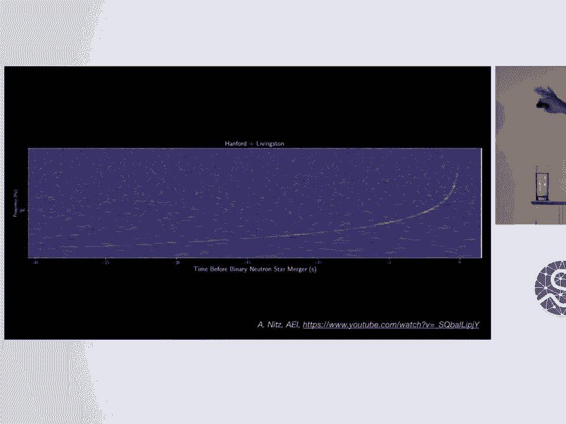

 the masses were。 So this was the first binary neutron star merger ever detected。

 We initially detected it in Lyo Hanford and we could see this chirp track very clearly。

 The chirp was also visible in Livingston but there was also a huge glitch in the data。

 Our detectors are extremely glitchy because of environmental noise sources and also just。

 sort of instrument issues in various subsystems。 So this glitch was caused by saturation of a photo diode。

 And this is one of the worst glitches that we've ever seen in data that we've considered。

 of science quality。 We were able to model that glitch and remove it out and then underneath that we saw。

 we， also saw that nice perfect chirp。 Now that was cool enough but even better， Advanced Virgo。

 our Italian counterpart facility had， just come online in their advanced configuration just weeks beforehand。

 And so for the first time we had a network of， a globally dispersed network of three。

 gravitational wave detectors with astrophysical sensitivity。

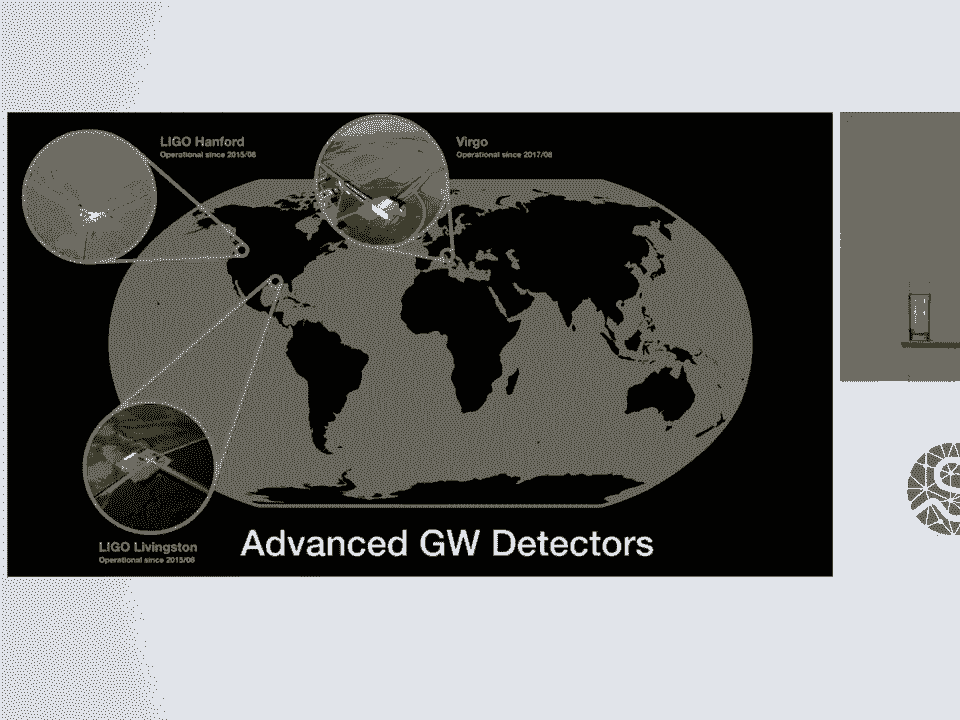

 And that allowed us to do localization very， very accurately with that extra baseline。

 So these are the localizations of binary black holes that we detected up to then。

 And this is GW170817。 So these span areas of like 1，000 square degrees on the sky。

 this is 30 square degrees， on the sky。 And so if you're trying to hunt for some visible light signal。

 you'd much rather deal。

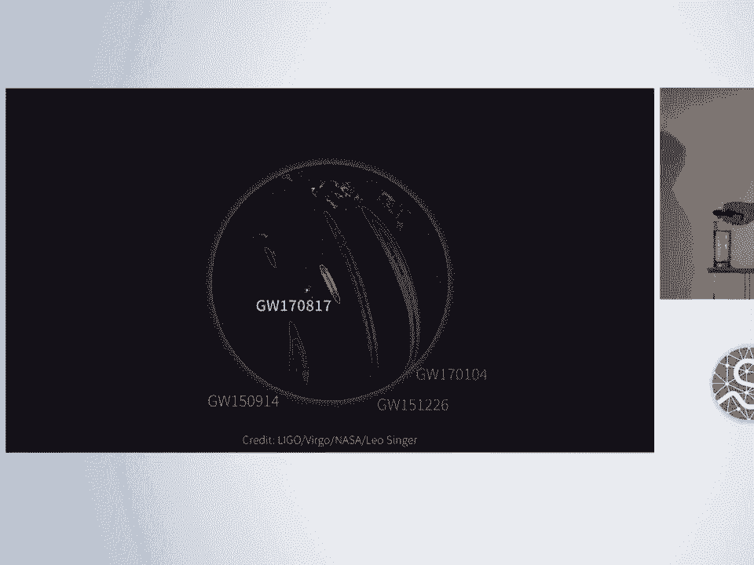

 with something like this than with something like this。 So we were all， everyone was very。

 very happy about this。 And basically every astronomer in the world kicked into high gear for the next month。

 So there was even a coincidence short gamma ray burst。

 So gamma ray bursts are in our intense flashes of hard electromagnetic radiation。

 Half of them are known to be associated with the collapse and death of a certain type of。

 massive star。 And the other half of them were thought to be caused by these binary neutron star mergers。

 And there was a detection， a coincidence detection of a short gamma ray burst by the Fermi and。

 integral satellites that proved at that moment that at least some short GRBs are associated。

 with binary neutron star mergers。 So even better。 Because this source was so well localized。

 we could actually， instead of just， instead， of， we could take sort of many different approaches to finding this counterpart。

 So we could take a very wide field of view telescope and just tile that whole region。

 that whole green region there。 Or we could pick out individual galaxies and look at each of them with a very small field。

 of view but very sensitive telescope and check if anything new had appeared in that galaxy。

 Both techniques were taken。 And there were sort of six teams that almost simultaneously announced the discovery of a。

 bright， rapidly evolving optical transient in our localization region。 One site。

 coincident with a galaxy that was at a distance consistent with what we measured， with LIGO。

 And this is that galaxy， NGC 4993。 What I'm going to show on the left are images of the transient and optical。

 And on the right I'm going to show spectra。 And so， just a second。 Is it playing？ I can't tell。 Oh。

 yeah， it was already playing。 So， the source started off very blue and it faded and became redder and redder over the。

 course of four days and then started when it peaked and then started to drop off。 So。

 this evolved much faster than any known type of supernova。

 The spectra looked nothing like any other type of transient that we know about but the behavior。

 of these spectra and sort of these broad bumps agree spectacularly well with the predictions。

 for what a kilo nova should look like。 And so， this is now the observational prototype of a kilo nova。

 I should add that it was also detected in X-rays and radio and the X-ray and radio emission。

 is extremely important for understanding sort of the bulk properties of the outflow from。

 this event and understanding the geometry but the X-ray and radio are a subject of， could。

 be the subject of a whole talk or a whole conference for that matter。

 But you can actually still detect it in X-rays and radio to this day。 So。

 I don't want to give the impression that we've sort of solved all the problems in this。

 space with this one event far from it。 We've done some really impactful things。 For one。

 we've determined the host galaxy of a gravitational wave source。

 We've measured the speed of light -- sorry， we've measured the speed of gravitational。

 waves and checked that it is in fact the same as the speed of light by looking at the time。

 to lay between the gravitational waves and the gamma ray bursts。

 We showed that binary neutron star mergers are indeed the central engines of short GRBs。

 We've shown that binary neutron star mergers are the dominant site of our process nucleosynthesis。

 in the universe。 And we've constructed the prototype -- the observational prototype of a kilo nova。

 But there's a lot more to do。 There are a lot of things that we would learn from a merger of a neutron star in a black。

 hole。 That's something that we'd like to -- that we hope to do in one of the next few observing。

 runs with LIGO。 We'd like to sort of understand the phenomenology and understand what determines the features。

 that we see in electromagnetic。 We'd like to determine what is the nature of the object that's left over when you collide。

 to neutron stars。 Is it another heavy neutron star？ Is it a black hole？

 Is it a neutron star that spins for a while and then collapses？ We don't know。

 We'd like to characterize the properties of the host galaxies of these sources across cosmic， time。

 We'd like to determine what are neutron stars made of， what's the equation state of state。

 of matter at nuclear densities。 We'd like to measure the Hubble constant which describes the rate of expansion of the universe。

 using gravitational waves。

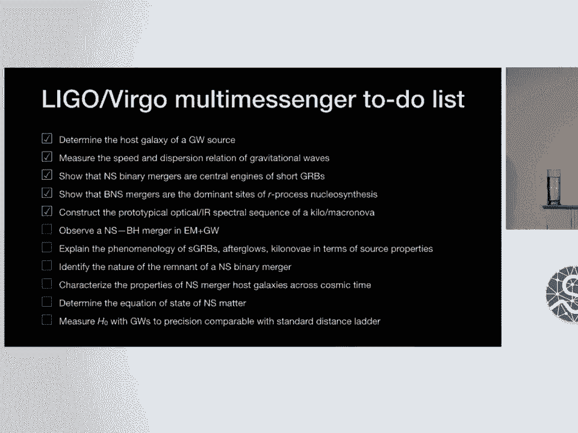

 Okay。 So now I'm going to switch gears and I've sort of covered all the science that I want。

 to talk about。 And I want to show you some of the uses of Python in our project。

 So this is a photograph of the LIGO-handford controller。

 I believe that this photograph was from the first acquisition of Locke。

 So Locke means getting the arms of the detectors， getting the laser light to be resonant in。

 each of the arm cavities of the detectors and then getting the arm cavities in resonance。

 with each other。 And those are the steps that you need to go through to get to astrophysical sensitivity。

 So in this picture， this screen that looks sort of bluish that this woman in the black。

 vest is looking at， that is displaying sort of the graphical user interface that we use。

 to control the interferometer。 It's something called EPICS which is an experiment control software package that's developed out。

 of Argonne National Laboratories and it has a user interface that looks like something。

 out of the early 90s。 But it's pretty common in large physics experiments。

 Now that is what actually talks to the low level hardware which consists of a few million。

 filters that are implemented in FPGAs and various modules。

 But the actual automation of the whole system is done using Guardian which is sort of a distributed。

 hierarchy of state machine automatons and it's used to actually lock the detector and automate。

 transitions between different states of operation。 So it's built using。

 so for each little subsystem it represents a graph of state transitions， using network X。

 Each little worker is running in a tightly managed subprocess using multi-processing and。

 it talks with the hardware through EPICS via some Python bindings。 So LIGO is controlled by Python。

 So next in the control room we're running the detector and now we want to look at the。

 data and see if it looks reasonable。 And so for that we use a tool called GWPy。

 So this is a tool for， it's a package for accessing data， both public data and internal。

 unpublished data， doing basic signal processing techniques and analysis and plotting。

 So it's used to do a lot of quick look investigations in the control room and it's also used to。

 produce our detector summary pages which are live collections of about 800 different。

 figures of merit that we use to look at the health of all the different subsystems。

 So the main use is in the control room and also in detector characterization and data quality。

 as well as science outreach and open data。 And as you would expect it relies heavily on NumPy。

 SciPy， Mat， Putlib and AstroPy。 And this is what one screen of those summary pages looks like。

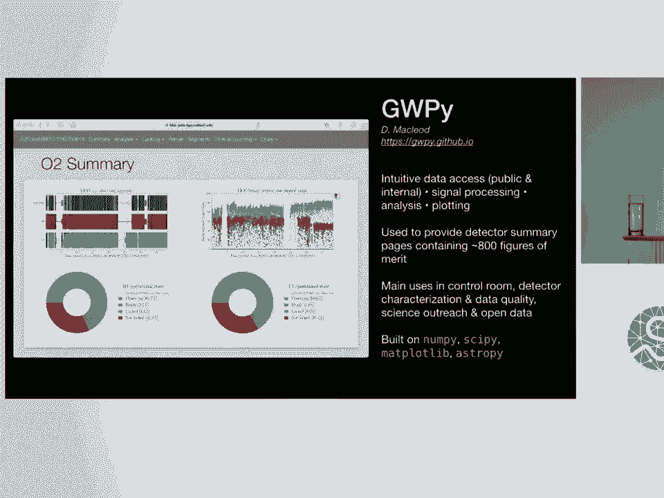

 Next， gravity spy。 This is probably more interesting to a lot of the people at this conference。

 So gravity spy is a project that combines both citizen science and machine learning to。

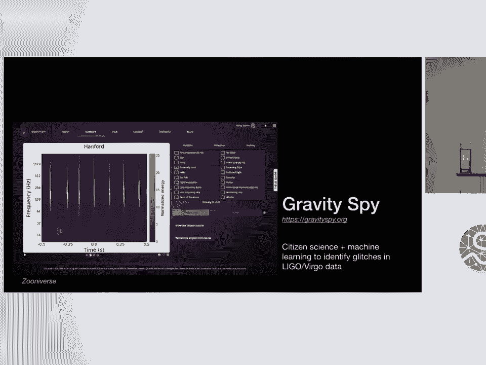

 identify and classify glitches in LIGO and Virgo data。

 So we have sort of a zoo of all different types of glitches。

 We know what caused some of these glitches and other ones we don't。

 What we like to do is remove glitches by identifying some auxiliary instrumental channel that can。

 act as a witness to predict when the science data is going to be affected by a certain type。

 of glitch。 But that only works for some types of glitches。

 And so the idea here is that people can go on to Zooniverse and they can volunteer to。

 classify glitches according to different morphologies。

 And then we use those classifications to train machine learning algorithms。

 And we hope to deploy those machine learning algorithms online in our next observing run。

 And this is just a dimensionality reduced representation of this space of glitches in。

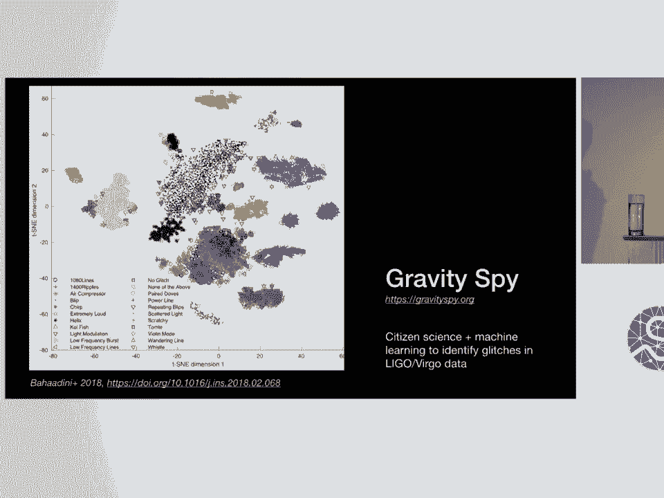

 LIGO data created using the TSNE algorithm。 So we've run the detectors。 We've looked at the data。

 We've post processed it。 We know it's okay to analyze what do we do with it next。

 So next it's going to go out to our computing clusters。 So we have our science channel。

 which is HFT， the strain that we're measuring in each detector。

 So that's a 64-bit double precision floating point time series sampled at 16 kilohertz。

 You collect that for a year。 It's like four terabytes of data。 No big deal。

 You could fit it in one or two SSDs in a briefcase。 But we also record an additional， say， 5。

000 so-called fast channels， which are channels， that are associated with auxiliary sensors or control loops and are sampled at 2 kilohertz。

 or above。 And then about 200，000 slow channels which are sampled at sort of 16 hertz to 64 hertz。

 So depending on what you're doing with the data， you might need just the science channel。

 HFT or you might also need some of these auxiliary channels。

 But you're going to do that analysis on one of our tier one LEGO data grid clusters。

 There are three tier one sites。 The biggest one is Caltech， which consists of 18。

000 CPU cores and a bunch of GPUs and， some Xeon PHY processors as well。

 We have clusters at each of the sites， which each consists of about 2，500 cores。

 And then we have tier two sites which are operated by LIGO scientific collaboration。

 member institutions。 And the three tier two sites are at the Albert Einstein Institute in Hanover。

 which consists， of 42，000 CPU cores and 2，000 GPUs。 There's a cluster at UW Milwaukee。

 which is about 3，400 cores and also some GPUs。 And there's also a cluster at IUCA which is about the same size as UW Milwaukee at about。

 4，000 cores。

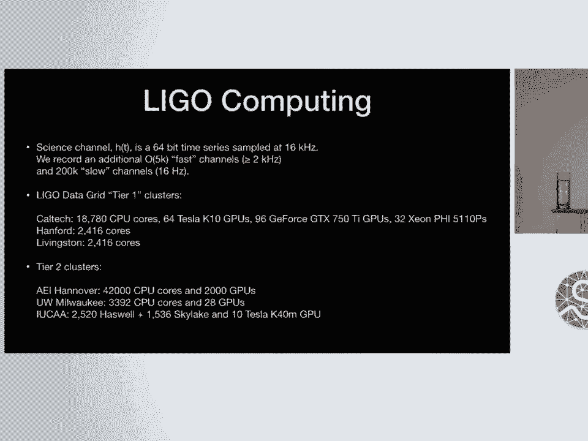

 So what are you going to do with the data on these clusters？ Well。

 we're going to want to compare the data with a bank of model waveforms produced。

 by general relativity or approximations to general relativity。

 And so we're going to do matched filtering。 And then we're going to use Markov。

 Chain Monte Carlo or nested sampling to determine。

 the properties of signals that we detect using matched filtering。

 And these sort of compact binary coalescence analyses take up about half of the time on。

 our clusters and the other half is other types of sources， which I don't even have time to。

 talk about today， but are also really cool。 So underneath it all， there's Laosweet。

 which is among other things our strategic reserve， of forced acronyms。

 Laosweet stands for LSC algorithm library， LST stands for LIGO scientific collaboration。

 If you keep going down the rabbit hole， you'll find that this is a quintuply nested acronym。

 It consists of a lot of heritage C code that's wrapped with SWIG plus some newer Python code。

 Up until about 2011， it was sort of the standard practice that LIGO graduates and graduate students。

 and postdocs would deposit code that they wrote as part of their thesis into Laosweet。

 So it consists of some parts that are extremely highly engineered and then some parts that。

 are sort of a grab bag of different levels of code quality。

 But some of the sub packages of Laosweet are extremely important to our analyses。

 The most important ones are LALFRAME， which is used to read and write a domain-specific。

 binary data frame format that we use for storing HFT。 LAL simulation。

 which consists of a comprehensive library of waveform models。

 So we have various ways of approximately solving Einstein's equations for a compact binary。

 One of those ways is with sort of a series expansion called the post-Newtonian approximation。

 The other way is sort of by fitting phenomenological waveforms to numerical relativity。

 Both of these techniques result in really， really dense code。

 I've put one of the scarier examples here。 This is actually one of the simpler waveforms too。

 But this code is really， really difficult to write， really， really difficult to test and。

 cross validate against other waveform approximings。

 And so this is something that's going to be with us for a long time。

 And finally there's LAL inference， which is Bayesian inference using MCMC and nested sampling。

 So LAL suite used to be a huge challenge for LIGO newcomers to install and use。

 That's improved a lot recently thanks to wheels and mini-linics。 So like I said。

 parts of this are Python and so now you can just pip install it。

 And this is something that I worked out how to do along with Alex Knitz。

 And so I'm posting these to PyPy。 So next we have our search pipelines。

 So one of them is called GSD LAL。 So it's a real time streaming compact binary coalescence detection pipeline。

 It's written using G-streamer， which is a media processing framework for the gnome desktop。

 So you have little signal processing elements that you can plug together into a more complicated。

 pipeline。 And so we use this to implement a bank of 650。

000 match filters that we can evolve with the data， in real time。 And we use Python to assemble。

 monitor and post-post us the output of this G-streamer pipeline。 Then there's PyCBC。

 which is a framework for studying gravitational waves with strong emphasis， on compact binaries。

 It does everything from data conditioning to detection to parameter estimation and visualization。

 It's really， really approachable。 It's very easy to install。

 And there's lots of documentation and tutorials。 It's GPUs through CUDA。 And so this is a very。

 very powerful option and a very easy way to get started as a member。

 of the broader astronomy community。

 Parameter estimation， after we detected the sources， we want to determine the masses and。

 spins and the sky location and distance of the source。

 And so we do that using Markov chain Monte Carlo nesting sampling and also more domain。

 specific techniques that are really tuned to the problem that we have to solve。 And again。

 there's LAL inference， which is a part of LAL suite。 PyCBC inference。

 which is sort of a next generation， almost pure Python replacement。 And also base star。

 which is a code that I wrote as part of my thesis， which focuses。

 on just determining the sky location and distance。

 And also comes with sort of a suite of tools for working with LIGO probability maps。

 So we've determined the parameters and now we need to send an alert to astronomers。

 So we pooled together all of the results from all of our different pipelines using GraceDB。

 which is sort of our central Marshall and clearing house。 And this is written in Django。

 as you would expect。

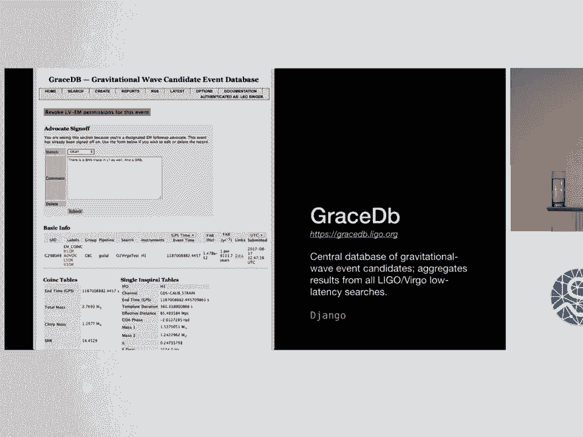

 And then we need to do sort of follow up analyses such as running that rapid sky localization。

 setting candidates and deciding which ones are reasonable to send out。

 And generation of the data products that we want to send to astronomers in low latency。

 And so this is， at this level， you want to， you have a task that has to use 64 cores on。

 a single machine for about 10 seconds and then be ready to accept the next job right。

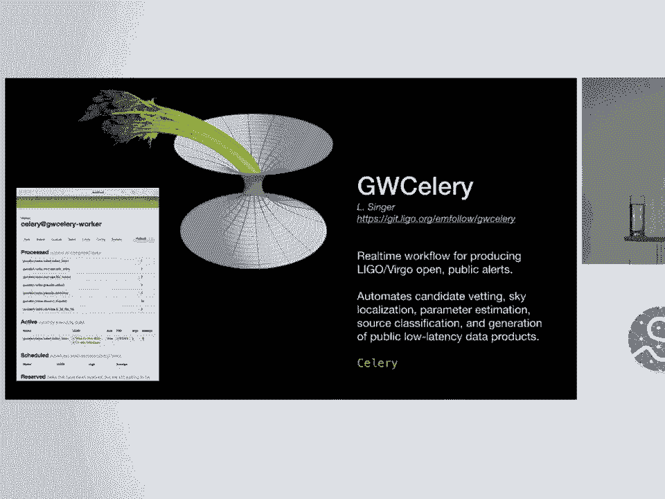

 away。 So we use Celery for that。 So we've sent alerts。

 Now the data is out there in the public and now the people outside of LIGO need to be able。

 to get access to it。 And they do that through the Open Science Center。

 which is a portal for accessing and， analyzing published LIGO data。

 So there's a data archive and a trove of tutorials and Jupyter notebooks that you can。

 download or run in situ on in Binder or on Microsoft Azure Cloud。

 So some conclusions。 Python is integral to every stage of operating LIGO and performing and analyzing gravitational。

 wave observations。 Software in our community is tending toward a more modern， more vibrant。

 mostly pure Python， development model， partly because science outreach is becoming such a very high priority。

 But we have these sort of legacy packages， these C codes that contain all of our waveforms。

 and so on and so forth that we have to work with and distribute in packages。 So that's a challenge。

 But the landscape and the options for doing that are significant has significantly improved。

 in the past several years with options like Conda， Mini Linux， Docker and Singularity。

 And this is changing how we work with our clusters and also how we interface with the。

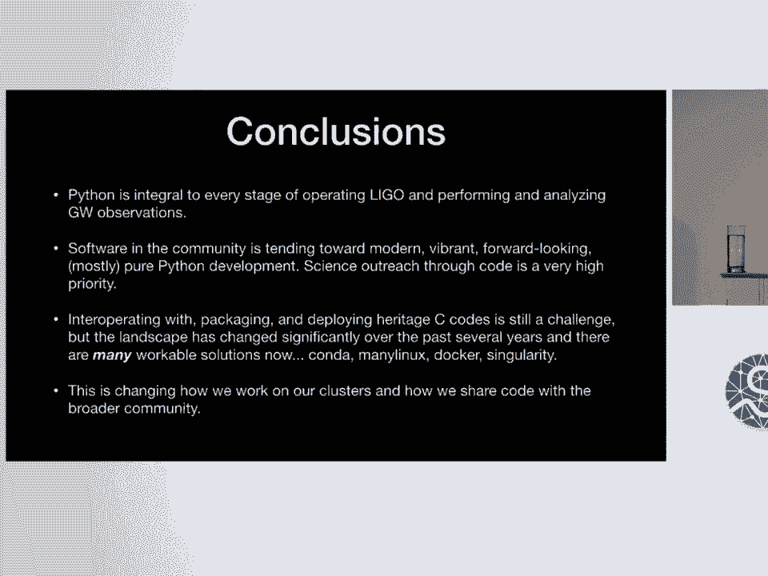

 broader community。 LIGO is a huge collaboration。 It consists of over 60 institutions and almost 1。

000 scientists around the world。 And so what I've had a chance to talk about today is necessarily represents just a small。

 slice of everything we do。 And so please talk to me afterward and ask questions。 Lastly。

 we're going to build bigger and better gravitational wave detectors after this where。

 we'll be able to see out to sort of the edge of the observable universe with the next generation。

 of detectors that we want to build。 And there's a whole unexplored gravitational wave spectrum。

 very analogous to the electromagnetic， spectrum that will probe with future facilities and future missions such as the laser interferometer。

 space antenna which is sort of like LIGO in space with which we'll be able to see mergers。

 of supermassive black holes in other galaxies。 So there's a lot to do and Python has been important for the whole journey and will continue。

 to be so。 And with that， I'll just thank you and ask for your questions。 [APPLAUSE]， All right。

 so I think there's a microphone here。 Yes。 Should we bring up one？ Yeah。

 can you bring up the lights？ [INAUDIBLE]， All right， is this all right？ Yes， yes。 Hi。 I'm here。

 Yeah， please go ahead。 I'm Julie。 Thank you so much。 That was an excellent talk。

 I think it's super exciting that we have observations of the site of the R process。

 So my question is because it's a neutron star binary merger， do you think that this has--， wow。

 that's bright。 Where are you？ [LAUGHTER]， Oh， hi。 Hello。 Oh， no。 [LAUGHTER]。

 Do you think that this has implications for the initial mass function of pop three stars。

 since Supernovae have been sort of ruled out as the main site for the R process？ Oh。

 that's a good question。 So the question is， could we turn on the lights， please？

 Can we have a multi-messenger question and answer session？ So the question is， what do our process。

 as we've learned about it from neutron star， binary， is tell us about population three stars。

 which are the oldest stars。 I don't know the answer to that because stellar evolution in population synthesis is not。

 my area of expertise。 But one of the cool things is that with the-- what am I doing？

 With the next generation of detectors， we'll actually be able to look back far enough that。

 we can see-- we can look at epochs in cosmic history where we expect there to be a lot more。

 population three stars。 And so we can look at-- we can maybe look at the distribution of masses as a function of。

 redshift that we're seeing merge and maybe say something about stellar evolution as a。

 result of that。 Thank you。 Yeah。 Other questions？ Hi。 One of the questions I've had。

 I've seen a few animations。 I've seen a few animations of gravitational black hole merges。

 And one of the questions in my mind is， does the black hole have any shape other than spherical。

 after it merges or in an ideal model does it have a spherical shape right after it merges？ Yeah。

 So right after it merges， it's going to be deformed and it's going to actually ring down。

 and settle down into a spherically symmetric configuration。 So it'll be elliptical for a bit。

 I mean， ellipsoidal to say。 Okay。 Thanks。 Yeah。 Hi。

 I'm curious if you could elaborate a little bit on how you guys deal with the floating。

 point calculations of dealing with the really very small numbers that you have to handle。 Yeah。

 So it's often it's not a problem because one of the first steps in most of our analyses。

 is whitening the data。 So our data has a very， very specific， well， our noise has a very。

 very specific power， spectral density and we need to flatten that out and normalize it before we do match filtering。

 And so normally when you do that， that also takes care of sort of bringing the data down。

 to a more reasonable， you know， to a very limited dynamic range。 One more here。

 Thanks very interesting talk。 Thank you。 It's good to see like， you know。

 how Python is using such a large scientific collaboration。

 and it seems like you've gotten happier over the past few years but if you had one wish。

 from this community， what would it be？ I think that that's tough but I think that I wish that like the skills that you get by。

 interacting with， you know， with big， you know， open source Python projects like how to。

 get a pull request through or， you know， how to， how to interact with， you know， code。

 that's written by someone else or how to package software， how to make it durable and how， to test。

 how to test it， how to do continuous integration。 These are things that you learn by like going out and。

 you know， submitting a patch to Mat， Plotlib but they're not things that， I mean， a lot of people。

 at least in our community， who are extremely proficient in Python still don't have these skills and I'd like there。

 to be like a really approachable way to learn those things。 Ties into yesterday。

 so that's excellent。 All right， well， I guess I'd like to say and about the most understated way possible。

 well， done。 Thank you。 It's truly a maestro effort of orchestrating a lot of really visionary ideas and cutting。

 edge science but also a lot of elbow grease to really make that happen and I'd like to。

 turn to you and say， well done。 I mean， holy cow。 I just kept going through package after package after package on that sheet on your slides。

 and I mean 70% of them are from this room。

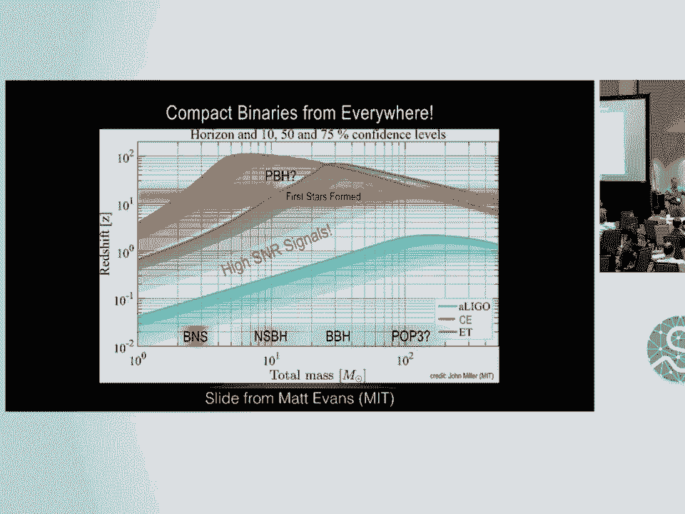

 So amazingly well done and thank you so much for a wonderful presentation。 Let's thank your speaker。

 [ Applause ]， [ Silence ]， [ Silence ]， [BLANK_AUDIO]。

