# P2：SciPy 2018视频专辑 (P2. bqplot  Seamless Interactive Visualizations and Dashboards i - GalileoHua - BV1TE411n7Ny

 >> Thanks， Jason。 Thanks everyone for being here。 Welcome to the data visualization track of which should be the last one of the conference。

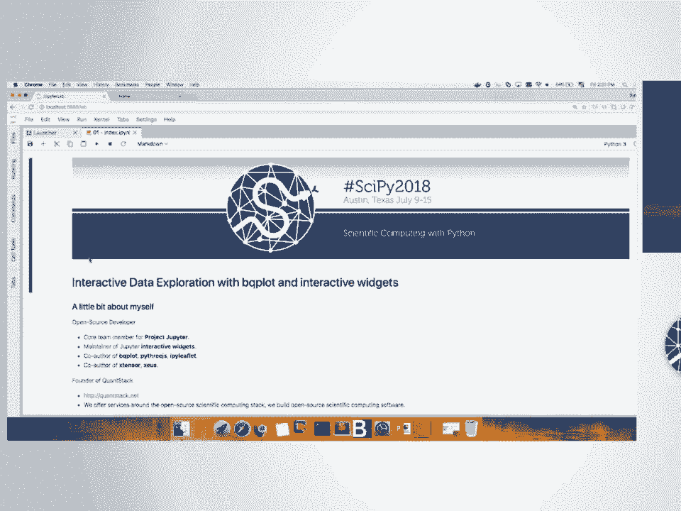

 Before I get to it， I just wanted to tell you a bit more about myself。

 So as an upon source developer， as Jason said， I'm a core team member of。

 Pro-Gibitor。 I mostly work on interactive widgets。 And I'm the co-author of BQ plot。

 PyPGIS and IPILiflet。 I'm also a co-author of the C++ extensor and exoost libraries。

 And I'm the founder of QuantStack。 So QuantStack is a small team of open source developers。

 We are based in Paris and we offer services and support for the sidebar stack。

 We build open source scientific computing software for our clients。 And prior to finding QuantStack。

 I used to be a quant at Bloomberg。 I was working at a shouting distance from Jason who just introduced me。

 And also I was an adjunct faculty in the math department of Columbia and NYU。

 Let me give you a quick intro about what widgets are for those of you who don't know。

 So the initial objective of Jupyter widgets was to reproduce that use case。

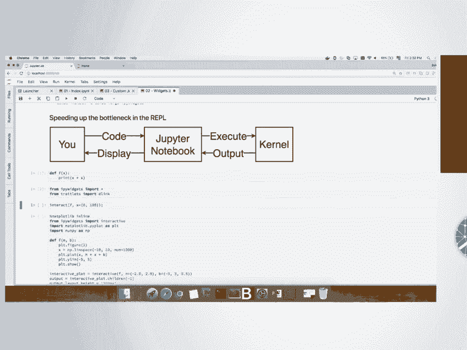

 which is a feature of Sage and Mathematica， which is called Interact。

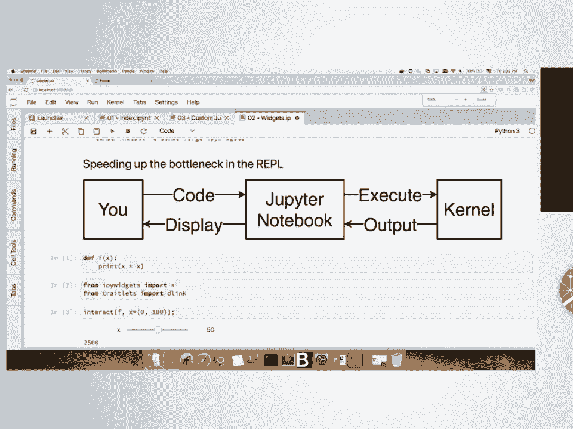

 And what Interact does is that using the introspection features of the Python programming， language。

 you pass it a function and it deduces the types of the arguments from the default。

 values and it's going to produce a small grieve for you to be able to interact with that。

 function and see the outcome with different values。

 You can make more complicated examples with Interact。

 Here's the two parameters function which are real numbers and produce a very simple grieve。

 including a plot and a matric plot in the Jupyter notebook that lets you more quickly。

 explore the behavior of some analysis that you may have done。 But in order to produce that。

 we built something that had a lot more capabilities， the Jupyter interactive widgets。

 And what they are is a special object that when displayed in the Jupyter notebook。

 actually show a graphical component that you can interact with。 Should you show it twice。

 both are going to reflect the same state。 If you modify the state。

 the front end is going to reflect it， and you can read the state from the Python when the front end was interacted with。

 So that by the general communication is key and is really one of the core ideas of the。

 widgets and what is enabling most of what I'm going to show after。 So you can easily bound to。

 to adjust with each other so that you would be able to create。

 small applications with graphical components in the Jupyter notebook。

 So what the way this works is that when you create a widget object， a counterpart。

 widget model object is created in the front end that is automatically synchronized。

 And every time you display it， you have a new widget you display in the Jupyter notebook。

 And the core widget package offers a number of controls like checkboxes， color pickers， etc。 etc。

 for building applications。 Although one thing I really wanted to emphasize here is that more than a collection of controls。

 actually， IPI widgets is a framework that you can use to build custom visualization。

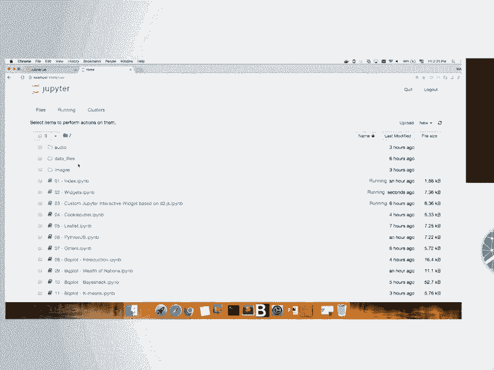

 A couple of years back， I was at the Pyotapere's conference and there was a tutorial on D3JS。

 And D3JS is a wonderful framework for visualization。

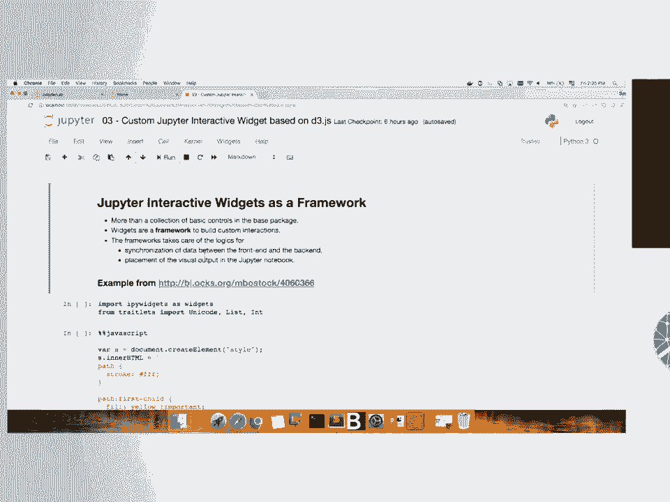

 There are a number of cool examples online on the blocks website where you can see an example。

 of a D3JS visualization and the code snippet that can be used to generate that。

 Essentially copy-pasting that code and tweaking it a bit to wire it with a widget infrastructure。

 I was a bore in a few hundred nights of Python and JavaScript to create the exact same visualization。

 in the Jupyter notebook。 But instead of generating random leader points here。

 I can simply fill it with data from the， Python kernel。

 So if you find a great JavaScript library online that produces a plot that none of the plotting。

 packages can produce at the moment， just use IPI widgets and create a widget package to。

 bring it to the Jupyter notebook。 We also offer a number of tools to facilitate the packaging of that thing into a Python。

 installable Python package that you can distribute in PyPy and Calendar。

 We built a number of widget libraries in the top of it。

 One of the first I wanted to mention is IPI Liflet。

 So IPI Liflet is a bridge between Jupyter and the LifletJS library that allows you to create。

 interactive maps in the Jupyter notebook。 So you can pan， zoom with the map。

 change the tile layer that is pouring the map。 Or you can start doing things such as using the sidecar widget to display the map in a。

 quite paint so that you don't need to scroll back and forth to see the map being edited。

 as you add things。 There are a large number of features in the IPI Liflet。 For example。

 you can read a geojesum dataset and add it to the map。 So there you go。

 Or we support a large number and also we support a large number of Liflet pregens such as the。

 GPT-1 which allows you to do really cool visualization with like a specific velocity on the top of a map。

 And here I read the same geojesum dataset on the top of it。 You should probably remove it。 So yeah。

 that's IPI Liflet。 If you want to know more about it， you can check out the GitHub repository。

 It was recently moved to the GPT-WUJESum organization or just installed it from Kanda by typing Kanda。

 install IPI Liflet-T Kanda FOG。 The second library I wanted to mention before I moved on to BQ plot is IPI Liflet。

 IPI Liflet is a bridge between Jupitr and Liflet。js。 IPI Liflet。

js is a bridge between Jupitr and the 3js library。 And what allows you to do is build really fast WebGL 3D visualization in the Jupitr notebook。

 It's not really a plotting package。 It's more of a scene description package that lets you create anything。

 So a few years back I made a lightning talk where I demoed a flight simulator in the Jupitr notebook built with。

 Py3。js。 So it's a fairly generic scene rendering package that you can use to block pretty much anything。

 Today one interesting fact about Py3。js is that most of the code in Python and JavaScript is actually。

 generated from a spec， JSON spec that is actually describing all of the widgets that exist in the。

 framework。 And there are many others。 One that is of interest for this community is probably Jupitr and MATLAB。

 As you know MATLAB is a Python package for visualization， probably the most popular Python。

 package from a visualization and it does run during the back end。

 So it's not really a many more to web use but using IPI NPR or Jupitr and MATLAB you can。

 bring the interaction of MATLAB to the Jupitr notebook。

 And here I have interactive MATLAB figures in Jupitr lab。

 So you can find the Jupitr MATLAB project on counterforge and it's on the MATLAB organization。

 on GitHub。 Another example of it， of library， it's IPivolium。

 I'm not going to say much about it because there's a full talk right after my talk about， IPivolium。

 I'm just going to show a really pretty 3D plot as a teaser。

 So stay in this room after my talk and attend the talk of Martin。 IPivolium is awesome。

 And there are many others like NGLView for visualizations of proteins and molecules。 So BQ plot。

 So what BQ plot is is a Jupitr diff rejects bridge。 So it's also open source， aperture licensed。

 And it implements the abstractions of Wilkinson's grammar of graphics as interactive Jupitr。

 widgets。 So we provide a bi-plot like API that lets you make simple plots like your line chart。

 scatterplots。 All of these are interactive so you can pan zoom very easily。 Histograms， maps。

 we do a little pie chart even though we are a grammar of graphics package。

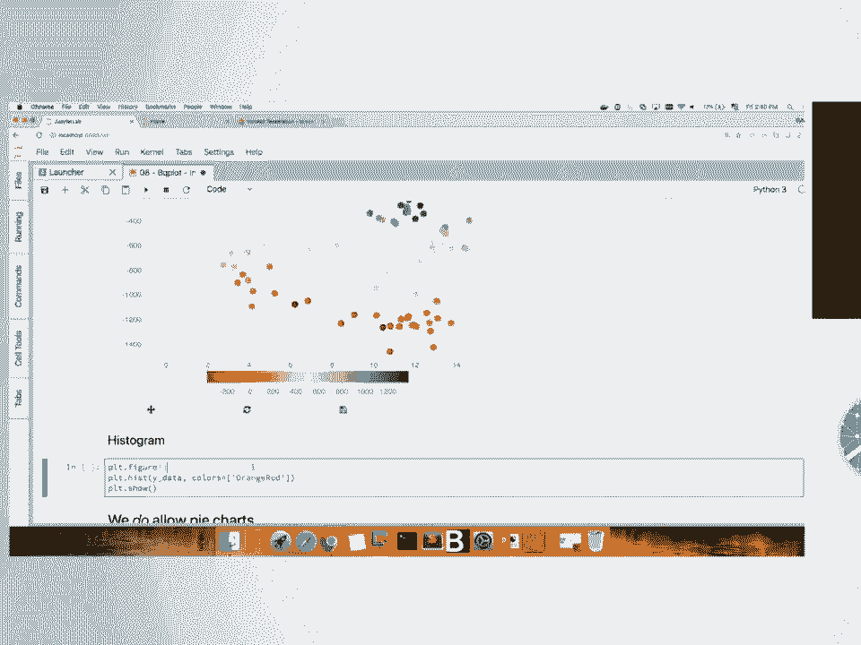

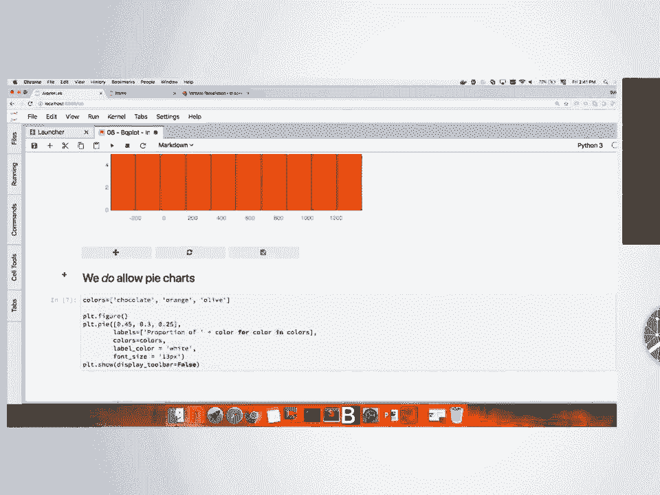

 Hit maps and in the next release actually BQ plot is going to support the varieties and。

 all of the other MATLAB color scales。 Thank you。 Every component of a BQ plot figure is a widget。

 So for example， instead of using this high level routines of pie plot to compose a chart。

 you can use a sample chart yourself by using the constructs of the grammar of graphics such。

 as scales， axes， marks。 Should you change the attributes of a plot like the way attributes of a line is going to be。

 reflected visually right away in the plot。 And scales and domains are going to update automatically。

 Same goes for pretty much anything。 Here this is a scatterplot。

 The editing X and Y is going to be reflected right away。

 You can change other properties such as a type of marker and their colors and everything can be。

 animated。 The same holds for attributes of scales and axes。

 Here I set the minimum of a scale to four and again it's going to create a new view for。

 that thing so that I need to scroll back and forth。 If I set the minimum to six。

 it's going to update the plot， set it back to nine， and， again complete from the data。

 you can edit the chart incrementally with legends and whatever， you want。

 Scales are really at the center of the grammar of graphics constructs。

 Here I'm using two plots that make use of the same Y scale but the different X scales。

 On the left hand side you have different order and left and right hand side you have different。

 order of minitudes for the Y scale。 But they are plotted in the same Y scale so that you can compare them and the domain of。

 that scale is based on the union of the data sets that were plotted using that scale。

 Should I move one of the data sets， all the figures are going to be updated reflecting the。

 new domain。 You can use BQ plot figures as input widgets。

 For example in that case I am using a fast interval selector which is a sort of selector。

 that widens when you move the mouse up and shrinks when you move the mouse down and the。

 horizontal position of the mouse controls the center position of the interval。

 Obviously the selected attributes of all the marks on the figure are updated every time。

 you move the selector。 You can change the interval selector and now in the latest version you can have vertical。

 selectors and this one is a different type。 It's a very classic brush interval selector。

 Or we can have less so and other things。 In this example I am showing another example of an interaction which is drawing and figures。

 Just like in the case of interact should you have an analysis that depends on the function。

 parameter。 You can just draw that function instead of trying to compose it manually with signs and。

 linear components and exponential。 So if you want to see the outcome of your analysis with that shape just draw it in the notebook。

 and it's going to be reflected in all the maps that are bound with it。

 You can also move points around in scatterplots and have callbacks reflect that change。

 So that's basic introduction to BQBrut。 BQBrut was used to make a number of applications。

 So here I am going to show a recreation of Mike Bostock's Wealth of Nation。

 So I am just going to execute all of the cells which are a few hundred lines。

 And this small resulting application is merely a chart with a slider and a play button so。

 that you can easily animate。 So it's a scatterplot of the life expectancy versus income per capita for all the countries。

 of the world or a number of countries of the world。

 You can manually change the date or hover on a country and see where that country is。

 The size of the bubble corresponds to the population。 Since BQBrut， I polyflat， pifu。js， ipy volume。

 I built upon widget， there are really easily， to interpret because they are built on the same foundation。

 Here this example here is an application that we built during 24 hours hackathon called。

 the base hack in San Francisco。

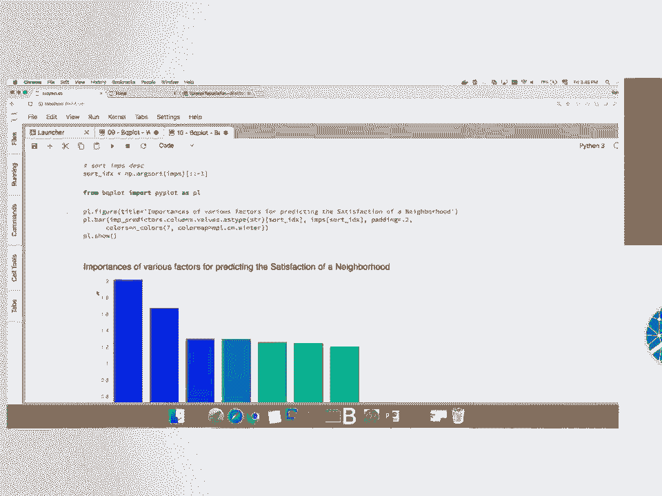

 And using ipy/liflet and BQBrut， we put together that small visualization where whenever you。

 hover on a zip code in San Francisco， you see a plot corresponding to different features。

 of that neighborhood。 So the goal of that study was to try to give a sort of explain the level of satisfaction。

 of self-assess level of residence of a neighborhood based on predictors which are actual features。

 of these neighborhoods。 Quality of environment， availability of labor， cost of housing。

 average distance to a restaurant。 People seem to be pretty happy in that area。

 I don't know San Francisco， I wouldn't know about it。

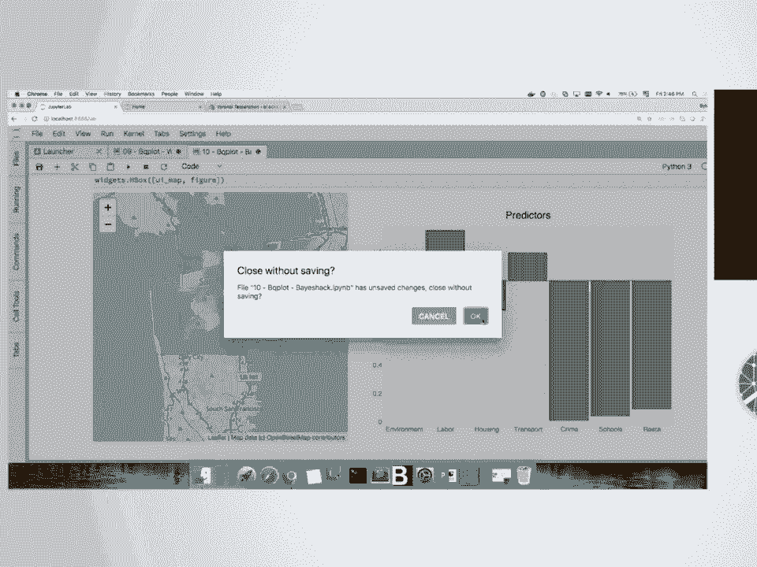

 Other examples of applications， maybe I should talk about the mobile lawsuit patent example。

 which is a recreation from another visualization by Mike Bastock。 If you hover on Apple。

 you see that there are a number of lawsuits involving Apple。

 So Samsung and Apple are both suing each other， Kodak is suing Apple， et cetera， et cetera。

 So you can create these sort of nice applications using BQBrut fairly easily。 What about big data？

 So one of the limitations for a long time of BQBrut is that since we were based on the SVG。

 we could not make scatterplots or visualizations of very large datasets。 So this is changing。

 The next version is going to have the megamarks。 And by megamarks。

 I mean that we can display marks and new types of scatters that involve a lot of points。

 So this is not yet released， but I'm using the latest version from Master right here。

 So here this is a simple scatterplot of 100 points。

 So let's try to change it to be a thousand points。 All right， that still works。 Let's do 10。

000 points， right？ Still for a smooth， right？ Let's go 100，000， right？ That works。

 It was a bit longer。 Let's go a million。 So here， this is taking a bit more time。

 The only reason is that we're still serializing that million data points in JSON。

 but now the widgets infrastructure allows us to serialize using a binary format that should make it really faster。

 And this is already in use in IP volume， so you're going to see that in the next talk by Martin。

 There you go。 A million points。 So， yeah。 Now you can display big data sets。

 bigger datasets in BQ plot。 What if you want to go even beyond millions of points？

 I don't have much time， but I'm going to really quickly show VEX， which is a data decimation engine。

 Maybe I should show this actually in the classic notebook。 And， okay。

 Live demos。

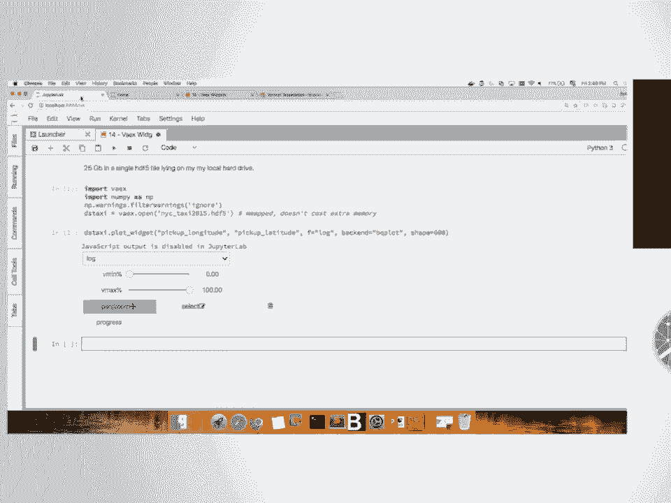

 Okay。

 I won't show the VEX dataset today。 It was working right before the talk。

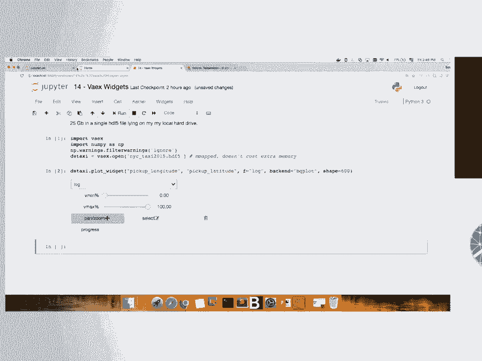

 I'm sorry about that。 How much time do I have？ Maybe three minutes。 Okay。

 Before the end of the talk， I just wanted to talk a bit。

 present a bit what's coming in the widgets world， and especially for BQ plot。

 We have a project called Zeus。 And what Zeus is， it's a C++ implementation of Jupyter protocol。

 It's not a kernel itself， but it's a tool that can be used to make kernels easier。 And with this。

 we actually made a number of kernels。 And our kernel。

 as well as a C++ kernel using the C++ interpreter from CERN。 So。

 it's a quick demo of the C++ kernel at play， where a displaying data， throwing errors。

 interpreting the C++ languages， including functions， classes， doing polymorphism， templates。

 pretty much anything。 We can use the rich data display of the Jupyter book in C++ for whatever main types are supported by the front end。

 So， I hope you appreciate that this is compiled code。 It's being compiled on the fly for every song。

 So， it's not a natural thing to do in C++。

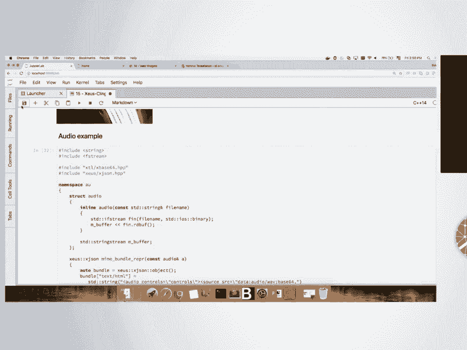

 And then we built upon this and brought a back end for the Jupyter widgets infrastructure called X_quigits。

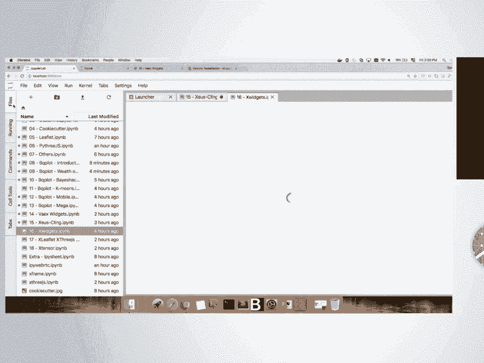

 which allows you to create widgets in C++。

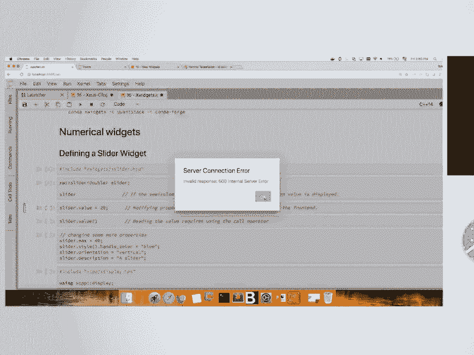

 Okay， it seems that my notebook server is dead。

 Okay。 Seems that I'm unlucky today。 Well， I don't know what's going on。 Well。

 I think this is the end of the demo。

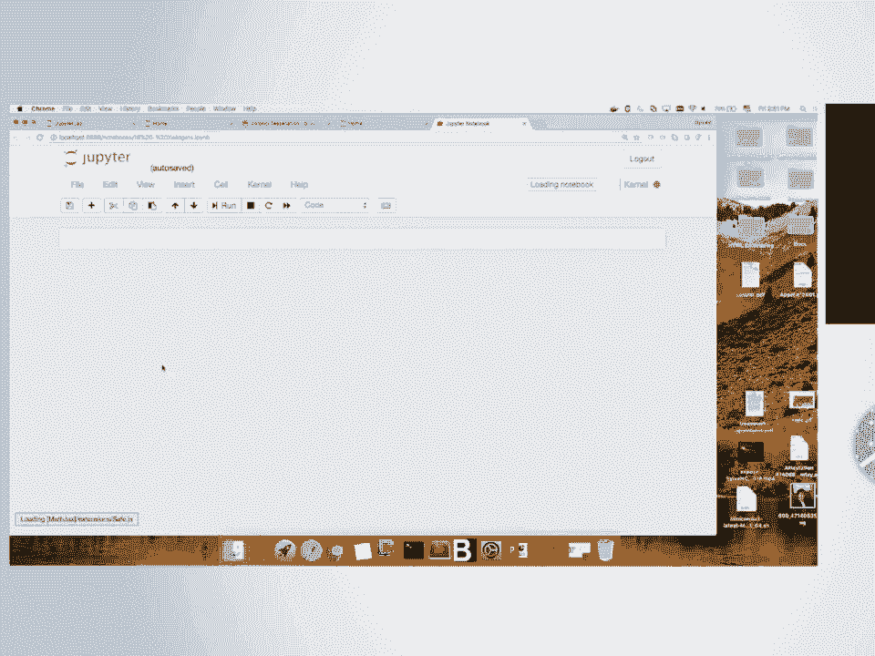

 I'll be taking questions from here。 Questions？ We have a mic up here。 I can walk a mic around。

 Is there any way for the widgets that you're creating with BQ plot to export the code or。

 export them to be embedded into a website without having Jupyter running？ Absolutely。 So。

 there are multiple ways to do this。 As a quick example， I can show you the Jupyter。

org website on the widgets page on the website。 You will see a number of widgets live here。 So。

 here is an IPally flat map。 There is a BQ plot chart here that's live。 So。

 you can display live widgets on web pages in the documentation pretty much anywhere。 Although。

 in this case， you don't have the interactions with the kernel。 So。

 there are other solutions to include interaction with the kernel that are， varied。

 either using binder or any server to provide a kernel。 Back end。 Other questions？ Yeah。

 there is a mic right here。 So， follow up。 Yeah。 So， follow up to the last one。

 If you take one of those pieces out， does it need to call out to other libraries or things。

 on the internet or some kind of jupyter server or is it all self-contained within that page？ So。

 the JavaScript is going to be fetched from a CDN。

 So， you just need to include a script tag to your page that you don't need to host and。

 you're going to have that on your page。 In the jupyter， classic jupyter notebook， if you open a。

 like， if you display a few， widgets like this， well， hopefully， make your analysis back。

 I don't know what happened to a main notebook server， but this never happened to me before。

 But anyways， there is a menu here for widgets that lets you embed widgets。

 What this produces is an embeddable HTML snippet that you can put onto any HTML page。 Okay。 Thanks。

 Yeah。 Just to thank you for making a video available。

 We started to integrate that in our project and it works very well。

 There is a minimum set of dependency and the community is very reactive。 After， like， the same day。

 we submitted some PR and because I'm integrated and it's an awesome project。 That's it。 Thanks。

 Any other questions or ringing endorsements？ I just wanted to show this。

 This is a C++ notebook including a XD flat visualization， which is a back end to ipiliflet。

 We are now writing back ends to all of the main widget libraries， including BQplot， Py3。js。

 i-tivolium， all of them in C++。 The goal is to expose this to all the languages of data science。

 including Julia or et cetera。 And then we have two or three more questions before the break。

 Any other questions？ All right。 We have a 30 minute break。 One question。

 What is the motivation for the Zeus project supporting C++ in an interactive fashion？

 Where did that come from？ So why C++？ This comes from a more general approach that we're having。

 For a lot of the projects we have at Quantstack。 In our opinion。

 C++ is sort of the command div in the divinator between all Python and Julia。

 Writing things once and making bindings to these languages is a good way to not duplicate the。

 implementation for many programming language， but for protocol implementation， data structures。

 all of that。 You can do the job only once。 So Zeus is that implementation of Jupyter protocol。

 And we wanted to showcase Zeus in a non-trivial fashion。

 And we found that project that comes out of CERN called CLIM。

 It's a C++ interpreter that we wrapped as a kernel with Zeus。

 There are other kernels being built right now with Zeus。 One is the Juniper kernel。

 It's a R kernel that supports widgets by Spencer Ayiro。

 And there's the other project out of -- from a kit where it's actually a Python kernel built。

 with Zeus。 And the reason why they didn't use the classical implementation of IPI kernel。

 like the reference， of the Jupyter kernel protocol。

 is that because Zeus has a different model for concurrency that。

 allows you to process control messages as you're running code or to integrate into event。

 loops and things like this。 Yeah。 >> Any other questions？ All right。 We have a 30 minute break。

 Martin Bredles will be talking in 3。30。