# SciPy 2018视频专辑 - P30：SciPy 2018视频专辑 (P30. Safe Handling Instructions for Missing Data _ SciPy 2018 _ - GalileoHua - BV1TE411n7Ny

 This is going to be a bit more of an interactive talk。 It makes it more fun for me。

 So I point during the talk， I'll ask you a question。

 I'll ask you to raise your hand if it's true for you。 So to give ourselves a baseline。

 could I see a show of hands？ How many of you hate raising your hand？ [ Laughter ]， Oh boy。

 your honor， let the record show that everybody， in the room。

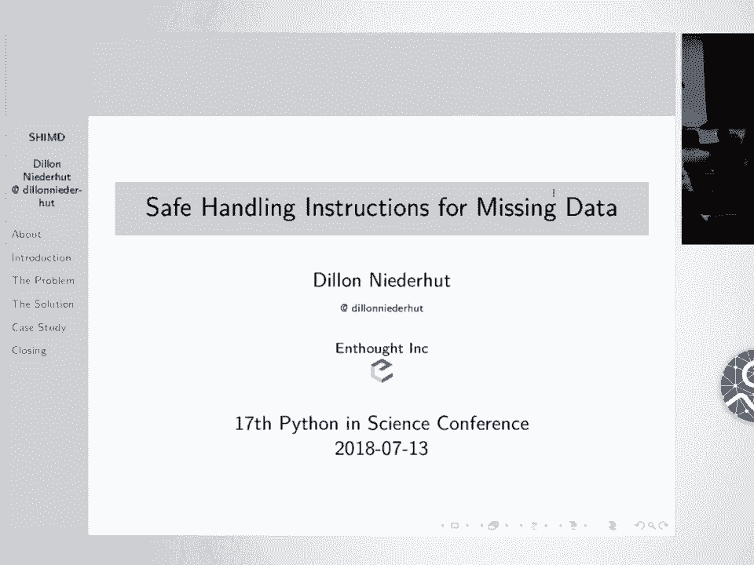

 It's going to be an interesting day。 So my name is Dylan Niederhet。 My pronouns are he/him。

 I work for a company called Enthant， which some of you have， probably heard of before。

 I work there as a trainer， so I help companies transform their。

 workflows using Python for things like reproducibility， for things like repeatability。

 for things like verifiability。 I'm also one of the editors for the SciPy conference， proceedings。

 So if you submitted a paper， you've probably been interacting， with me online。

 Nobody over the past two days has recognized me without my， glasses。 I have glasses in the picture。

 so I'm wearing them today， so， you all know who I am。 If you haven't submitted a paper before。

 like it's little， late now， I would encourage you very strongly to think about， it for next year。

 We're like a legit thing。 We go through peer review。 We can get you a DOI for your paper。

 And then plus you get to talk to me some more。 And we're all about that。

 My academic background is in neuroscience research and， computational semantics。

 And just in case you're interested， one of the recent。

 projects I've been working on is extracting sort of， predicate tuples from natural language。

 And as a proof of concept， I've built a -- and it's like， Wikipedia out of this that I put online。

 The picture here is a little small， I apologize about that。

 But you can go on there and search for Python， for example。

 and see what do people out there in the world when they're， just chatting naturally with each other。

 have you say about， Python。 One of the top things here is that Python has important， which。

 is not syntactically correct， but it's maybe something we， all agree with。 Interestingly。

 the most related word in this corpus that has， the same kinds of relationship patterns as Python is mat。

 plotlib， which notably is the library that's named after， matlab。

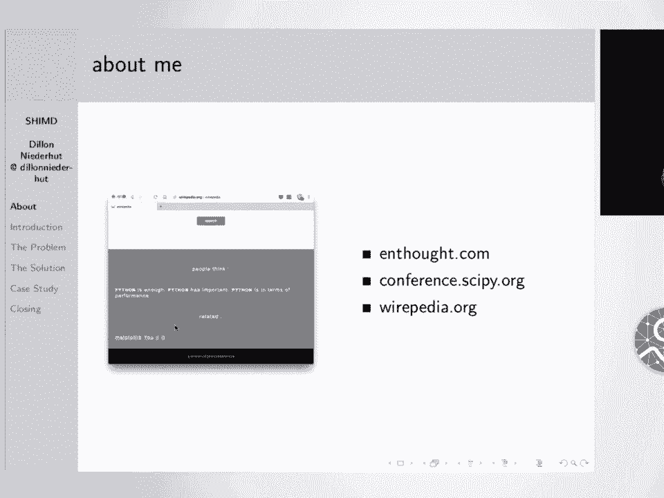

 All right。 So could I see by show of hands how many of us have been in a。

 discussion or an argument with a colleague that you lost， and， then like a month later。

 think I should have said the thing， but， like then it's too late and it feels awkward so you don't。

 bring it up。 You're on or let the record show。 How many of you then wrote that up as a paper and presented。

 it at scipy？ [laughter]， So that's what we're in for today。

 I was having this discussion with a colleague of mine。 This was， I guess， about a year ago now。

 And specifically， I was trying to sort of discourage him from。

 using the mean imputer inside of scikit learn。 And I presented the theoretical argument for it and he was。

 just not buying it at all。 So like a month later， I'm going on a run through Zilker。

 If you haven't been to Zilker Park， it's amazing。 I highly recommend it。

 And it occurs to me like crap， I'm a scientist。 I should have just run an experiment and I could have。

 shown him the data， right？ Because that's what we do。 You can argue with our theory all you want。

 but when we bring， data to the table， this is where we draw conclusions。 So I ran about 3。

5 million of these。 And the basic structure of this is we generate some data， a。

 data that has a known pattern。 So it's a linear relationship or it's a quadratic relationship。

 or some sinusoidal relationship。 And then we're going to knock some data out of that model。

 According to one of three missingness regimes， I'll explain， what that means in a couple of slides。

 We're going to apply one of the standard corrections to that。

 missing data and we'll talk about what some of the usual， options are in a couple slides as well。

 And then finally， we fit a model on it。 And we say， OK， compared to the baseline where I have no。

 data missing at all， how old is it to？ How old is it predicting data with this model score？

 And then also， particularly， what coefficients is it， attaching to each one of those data points？

 And since we control all the steps of this process， we can。

 sort of tweak different parameters and see how that， affects the end result。 Now。

 this talk here is going to be fairly high level。 I'm going to gloss over a lot of the details。

 If you want to see more about this， it's written up in the， proceedings for this conference。

 I tweeted a link to the slides。 You can click on this and it'll actually take you to the， thing。

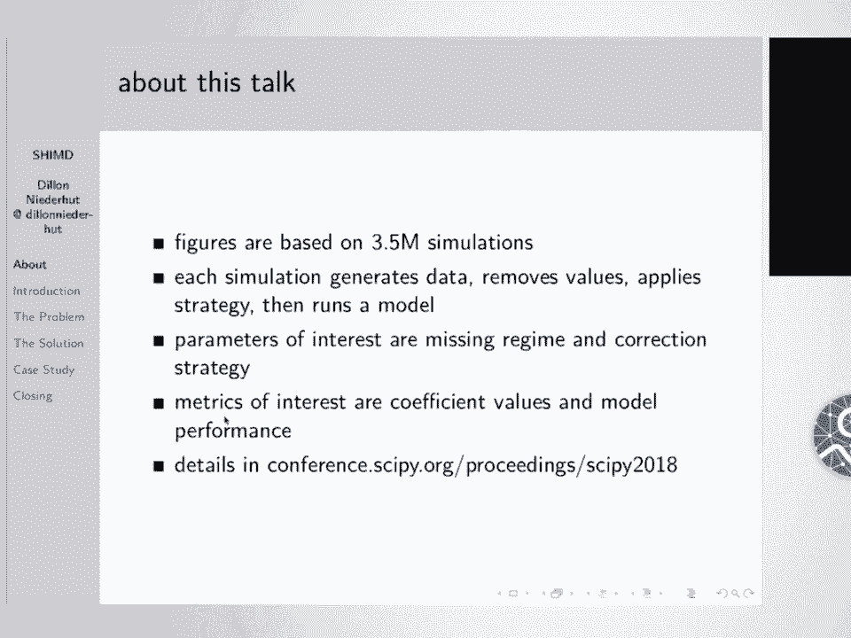

 If you want even more detail， you can find all of the code， used in this online。

 That includes the code that ran the simulation。 So all the simulation code is there。

 The data that I'm presenting， so these 3。5 million records。

 you can download off GitHub and take a look at yourself。 And then also。

 all of the graphs that you see during this， talk， all the graphs in the paper， all the statistical。

 analyses， these are in Jupyter notebooks that you can， run yourself。 Now， one word of caution。

 there's about 10 tunable， parameters that are combinatorial。

 So if you get a little too carried away with all this， stuff you're looking at。

 this can take a long time。 The data that we are presenting here， I say there's more。

 than one person on this day， the data that I am， presenting here。

 took about three months running in a， single thread。 So be forewarned。

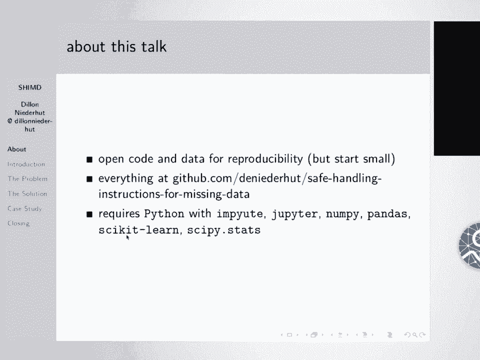

 It's a time investment。 All right。 Can I see by a show of hands， how many of you have seen a。

 table that looks like this？ Most of it is nice， but somewhere in the middle is this， NAN thing。

 This is almost everyone。 Could I see by a show of hands， keep your hands up， if， you've got them up。

 how many of you only receive tables， like this？ It looks like about half of us。 OK， me too， me too。

 Everything I get is missing。 The example on the slide， this is something that we。

 coded up live during the Panjis tutorial on Tuesday。 We made this data up。

 and even it had missing data in it。 So this is not something we can get away from。 It is the norm。

 It is not the unusual thing that's happening。 And there are a lot of reasons why this might occur。

 One of the key ones that people often ignore is that。

 sometimes missingness is actually built into your， research design。

 So if you are calling people ahead of some election to， identify who they're going to vote for。

 your missing data， includes every single person who does not own a phone。

 If you have been collecting data for a month and have been， backed any bit up。

 and the hard drive fails， this is missing， data that was under your control。

 You could have prevented this from happening。 Now。

 we're not going to go over examples from every single， field during this talk。

 because they're pretty field， dependent。 If you're interested in hearing about your field or。

 things that you might do， please feel free to， approach me after the talk。 Now。

 the thing that you might not know about this is all。

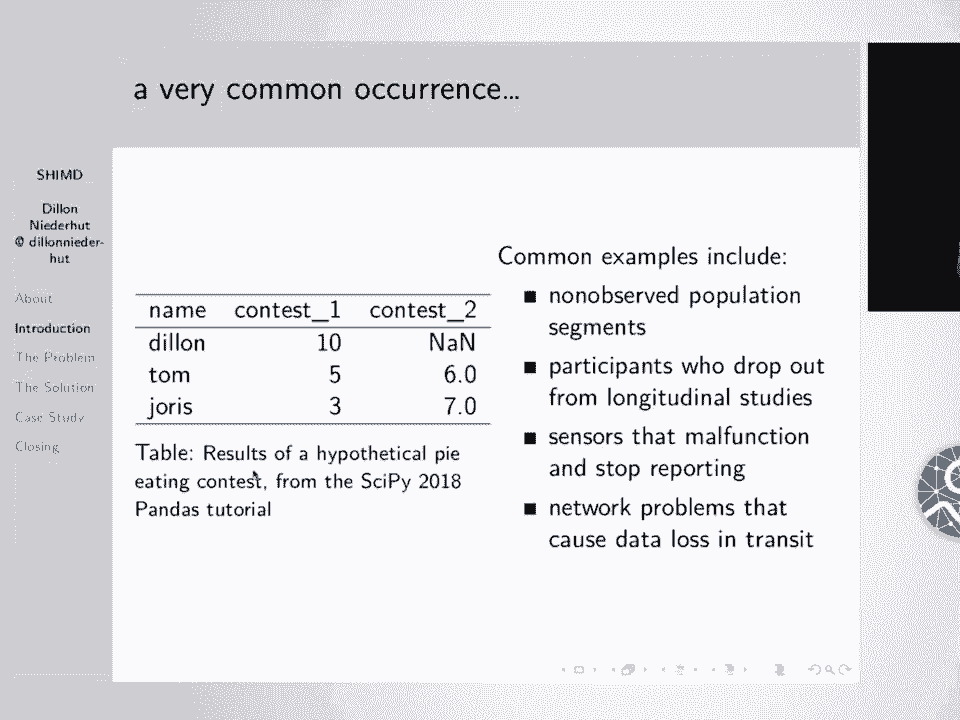

 these tables you have in missing data， those little。

 nan values that are sneaking in are destroying your， research。

 they're destroying your analysis and they're， destroying your results。

 What we're looking at in the slide here on the left-hand， side is a simple relationship。

 So it's y being predicted from x like plus some， Gaussian noise。 When we fit models on it。

 and there's I think 200， models that have been fitted here， the colors are sort of。

 bleeding together on the projector， we get stuff。 It's pretty noisy。 The y is wobbly。

 but it's centered around this， relationship of 1。 So when x increases by 1， y increases by 1。

 Now that wobble around the line， we call that noise， and， that's OK。 If we run enough models。

 if we have enough data that， noise eventually just washes out， and we end up with the， true value。

 What we see on the right-hand side is that same data， the， same model。

 but I have gone in and I have put some nans in， I've sprinkled them in。 And we've refit the model。

 And this is what it produces， these lines on the right-hand， side。 Now。

 one thing you'll notice immediately is that they are， wobbly， and that's true。

 But the crucial thing is that this line is not centered， around the slope of 1。

 Every single one of these is underestimating the true， coefficient of this parameter。

 This is not error。 The word for this is bias。 And missingness is problematic because it introduces bias。

 into everything it touches。 Now， there are some ways that there can be more bias。

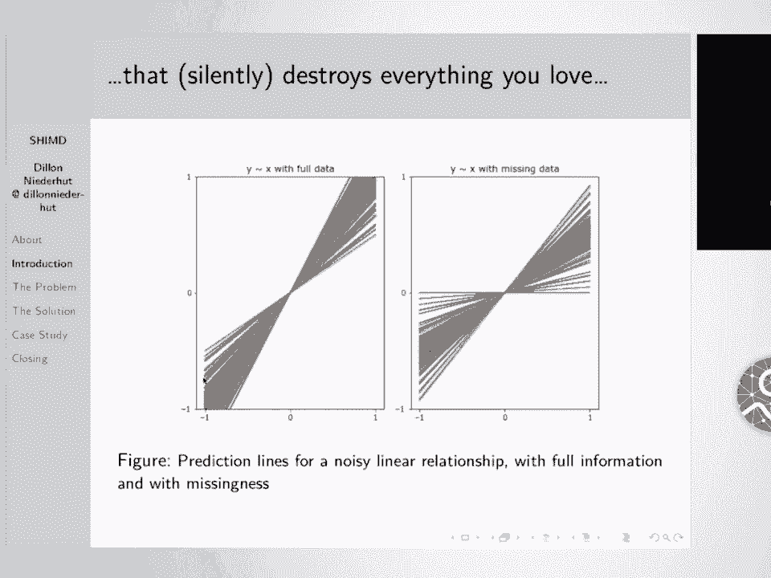

 Now， other kinds of missingness produce less bias。 So specifically。

 if you imagine sort of this process， where your data exists， the real， they're somewhere， and。

 before you observe them， there's some little data demon who， goes in and pulls values out。

 If that demon is pulling values out completely at random。

 so it's got some dice that it's rolling or some coins that， it's flipping。

 this is a truly stochastic process。 And this is the one that is the least likely to introduce。

 errors， introduced bias into your models。 Now， this is called missing completely at random。

 I didn't name that。 That's the word for it in the literature。 It's often abbreviated to MCA or MCAR。

 On the other hand， if that little demon is looking at， stuff that happens in the world and says。

 hey， based on， the fact that today is Friday， I'm going to remove data， specifically to Friday。

 that we're collected on Friday maybe。 So we're looking at something that exists in the world and。

 removing data from the model based on that。 This is rather confusingly called missing at random。

 Where random here is not the same thing as the random in， missing completely at random。

 which means stochastic， and missing at random here is meant in the statistical， sense。

 this is a deterministic function plus noise。 So this is problematic。 This will introduce， we'll say。

 like a medium amount of bias。 It is the single most common way to have missing this in， your model。

 There's this third category here called missing not at， random， which is also not an amazing name。

 We can thank Little one for that back in the 70s。 And this is when you're missing data in your model that is。

 particular to the data itself。 So for example， if what you're measuring is temperature and。

 your thermometer fails constantly at high temperatures， this is missing not at random data。

 Now in practice， we don't really see stochastically。

 missing data unless bit rot in your computer is one way， that will happen。 But in real data。

 most of the things that you'll be looking， at are correlated with each other to some degree。

 So in the real world， almost all missing regimes are missing， at random。

 or there's a deterministic process that， determines it。

 Now the nice thing about this is if we can observe part of， that process。

 we can apply some correction。

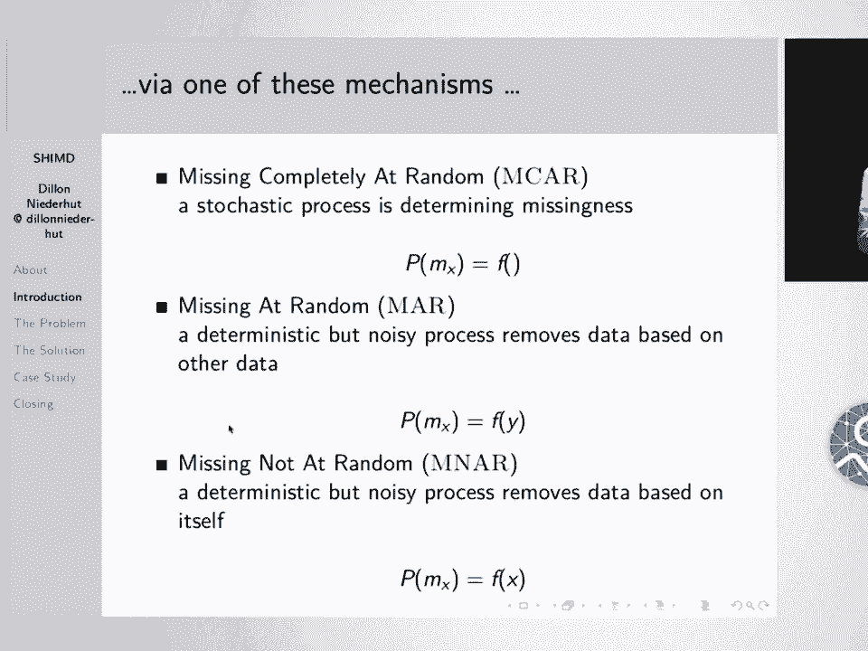

 Now to give you more of an intuitive sense of why this is， the thing that happens。

 here we have on the left-hand side， this is just a quadratic relationship。

 So you probably drew these when you were in middle school。

 The full information model is on the right-hand side。

 A model fitted with a couple of the data missing at random， on the right-hand side。

 And these are the low values of x。 We see it has now been shifted down into the left。

 So this is bias being introduced specifically because I， have some missing process。

 So it's super common。 It's introducing bias into all of our models in some， really insidious ways。

 and we'll see that in just a minute。 And if this has happened to you， how many of us have。

 read somewhere， so by a show of hands， have read somewhere， or had a colleague tell us， oh。

 just collect more data。 That's maybe a quarter of the room。

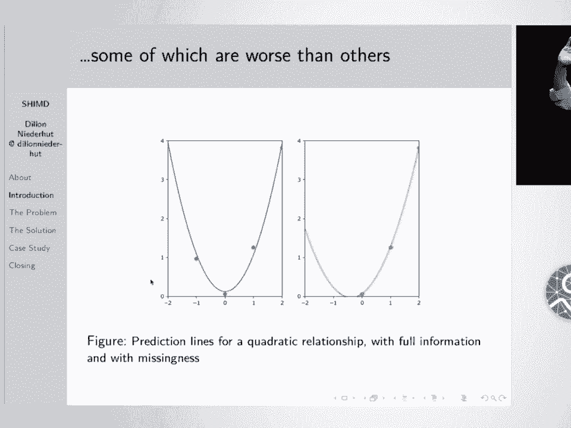

 So that's not going to help you。 And sort of the intuitive explanation for this is if you。

 eat some poisonous food， the solution to that is not to， eat even more poisonous food。

 You look back at the food and say， how did the poison get in， there？

 How can I stop eating food that's like this food？ What we see in the plot here on the x-axis。

 we have the log， size of the data that we're analyzing。 On the y-axis。

 we have a change in the coefficient of our， data。 This is just one of the features。

 Compared to a model that has no missingness in it at all。 As our data get larger and larger。

 we converge closer and， closer on the wrong value。 So the more data you collect。

 the more certain you are about， something that is incorrect being correct。 So not only is it wrong。

 you are very， very falsely confident， about being wrong。 How many of us。

 when we have a table with some missing data， in it， have had a colleague tell us， oh， just drop the。

 missing rose。

 By a show of hands， this is more than half the room。 OK， so you can't do that either。 You can。

 You shouldn't do that in most situations。 So in this particular graph， we have three different box。

 plots。 And each one of these box plots is showing us the difference， in some real coefficient。

 the actual thing that does exist， in the world。 And then what we estimate from our model。

 On the far left-hand side here， this is our control， condition。

 So we see that there is some variation， but we're， centered very nicely at zero， evenly around zero。

 This is noise。 This is fine。 Right next to it， we have a remissing this regime， where。

 you have data that's missing completely at random。 This is the only case。

 the only case where you can use list， wise deletion and not introduced bias into the models。

 that you're training。 And like we said before， it's really， really hard to guarantee。

 that your data are missing completely at random。 Theoretically。

 this is not a possible thing to prove。 In real life， it is just sort of unlikely。

 So you can do this， but only if you can convince the stats。

 chair at your university that the missing is patterns in your， data are completely stochastic。

 If they sign off on it， then it's also OK with me。

 What we see on the right-hand side here is if we have， data that's missing at random。

 this list wise deletion， introduces really， really wild biases into our model， parameters。

 Now in this particular case， what we're looking at is a。

 feature of a model that doesn't have any missing data in it。

 So the missing data is in some other column。 So this is a side effect。

 Missing data in one observation is making me， misinterpret parameters in the rest of my features。

 So a real case example of this， and this is extreme and kind， of silly。

 but if you are trying to predict homicide rates based。

 on temperature and ice cream sales and you're missing， temperature data。

 your model is going to think， oh man， ice， cream is really making people want to murder each other。

 Now to us， the silliness of that causal relationship is， obvious。 To your computer， it's not。

 What's even more difficult is that most machine learning。

 pipelines are going through this enormous feature generation， step， feature reduction。

 You might have dimensionality reduction， but the time， you're training your model。

 there is not a clear one-to-one， mapping between those coefficients and the real thing in。

 the world they represent。 So this might be happening to you right now when you don't， even know it。

 Scary。 Oh， that was too soon。 Sorry。 One last question。 I think this is the last one in the talk。

 Show of hands。 How many of us have had a colleague tell us if you have， missing data in your table？

 Just use the column mean。 About a quarter， that's less than I was expecting。 That's good news。

 So I've seen this all over the place。 This is in documentation for Python libraries that you。

 should be doing this。 And you cannot do this either。 It doesn't matter how your data are missing。

 whether it's， completely stochastically or whether it's at random， and， again。

 random meaning deterministic plus noise。 You are always introducing biases into your model when you。

 do this。 And the data we're looking at here， this is the best case。

 scenario where all of my features are completely orthogonal， to each other。

 So this is the best thing you can expect。 What we'll see in a minute is as bad as it gets。

 So one last question。 Show of hands。 How many of us are tired of me hearing you--， sorry。

 hearing me tell you all the things that you cannot， do？

 We'd like to hear about some things we can do。

 All right， let's do this。 Let's do this。 OK， so step zero。 When you are designing your experiments。

 the easiest way， to not have to deal with missing data is to not have any， missing data。 Now。

 this sounds cheap， right？ That sounds a bit silly。 But we talked about earlier。

 very briefly at the beginning， of the talk， that a lot of the missingness you'll see in。

 your models is a side effect of your research design itself。

 So if you can fix the way you're acquiring data， oftentimes。

 you can get rid of the missing signal you're trying to， correct after the fact。

 So in the slide here， this is Ben。 He's a nuclear physicist who runs the NMR imaging center。

 at Berkeley。 His mantra is always fix the acquisition， fix the， acquisition， fix the acquisition。

 It is always easier to get the data you need than to try to， create it statistically after the fact。

 This is also known as you can't fix it in post。 Now， you will still get missing data。

 So this is sort of an unavoidable thing。 You might have a participant who refuses to respond to a。

 survey。 Participant dropout is a huge problem in longitudinal， studies。

 There is no way you can fix a person such that they keep， responding to your surveys on time。

 So when you start your study， you should plan for， missingness。

 And what we do is we track the provenance of our data。 Which individual person is generating it？

 Where was it stored？ If they're filling out a survey on paper and someone is。

 later entering it into itself by hand， do not throw away the， paper。

 If they accidentally skip something， when they're， entering it。

 you can always go back and recover that data。 And a final thing here。

 your research design itself might be， missing observations sort of on purpose。

 And you don't know it because they don't show up as nans。 The telephone example of this。

 if I'm calling people to find， out who they're going to vote for， is an obvious example of。

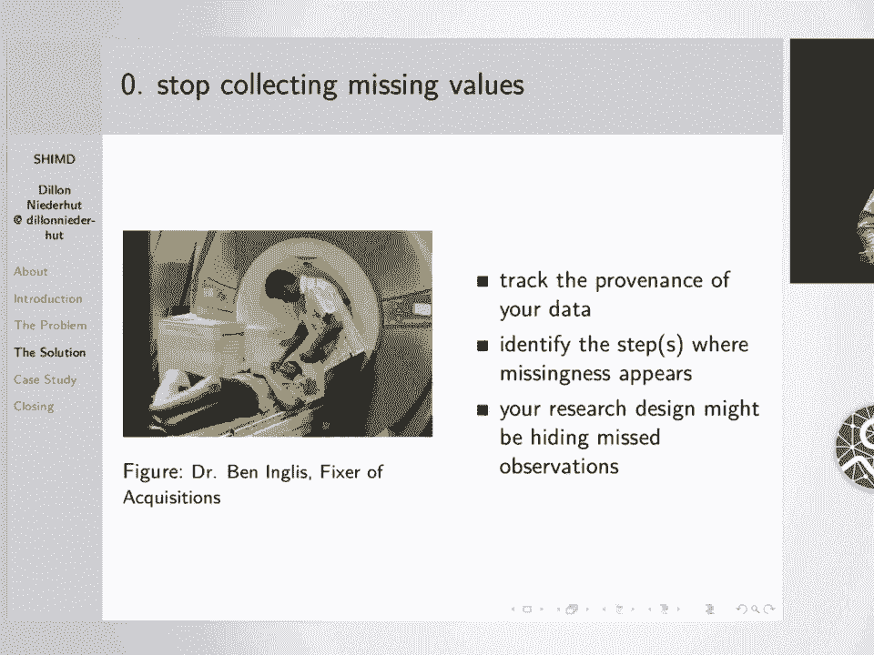

 this。 I'm missing all the people who don't have phones。

 The next thing you should do is collect what are called， auxiliary features。

 So these are variables that you are not expecting to use in， your prediction model。

 You're not going to train on these。 But are known to be strongly correlated with the things。

 that you are interested in。 Now the reason we do this is if the actual feature you want to。

 include ends up missing some data， it is easier to impute a。

 relatively likely value if you know a bunch of things that， it's strongly correlated with。

 So on the slide here I have some sort of simple examples。

 If what you were doing is predicting something based on， people's income。

 people are often very uncomfortable filling， out their incomes。

 they are much more likely to give you， their zip code， an education level。

 And we know that income is very， very strongly correlated， with， for example， where you live。

 The next thing that we have to do is we have to establish。

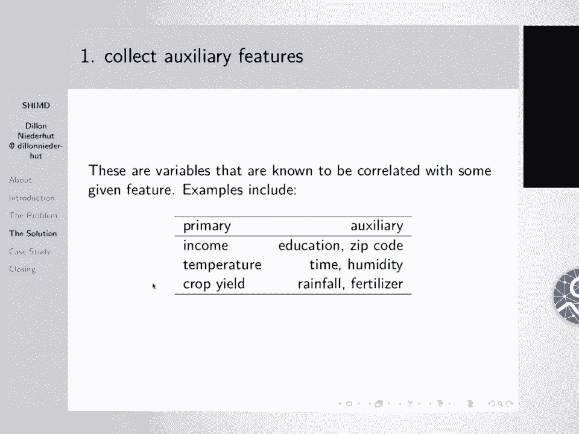

 our missingness regime。 So again， this is almost always missing at random， so。

 deterministic plus noise。 But if it's not， it makes your life a whole lot easier。

 So it's worth checking for。 It lets you know whether that listwise deletion option。

 whether you can actually follow your colleagues advice and， delete those rows。

 Now the second reason that we want to do this is because if。

 you identify a pattern in your missingness and you've been， tracking the provenance of your data。

 you can revisit those， data sources and recollect some of that information。

 And you'll know why it was missing。 So for example， if you were the one who was conducting that。

 telephone survey， maybe what you do， thank you， is going to。

 those neighborhoods with people on feet， boots on the。

 ground， ask them， hey， how are you feeling about the， upcoming election？

 The next step here is to use a modern MI stands for， multiple imputation technique。

 The most common example of these are multiple over， imputation。

 This is algorithm by Hanukkah and King。 Multiple imputations by chained equations。

 You'll see this abbreviated mice。 And then something called misforest， which is just using。

 random forest of decision trees to fill in some， reasonable values in your data。

 Now the key thing here is you don't do this once。 You do this five to ten times。

 And you generate beforehand any derived features you're， planning on including in your final model。

 So examples of this would be if you're using categorical， data。

 you have to apply it in coding first。 If you're using time series data， generate your lags。

 before you start doing this。

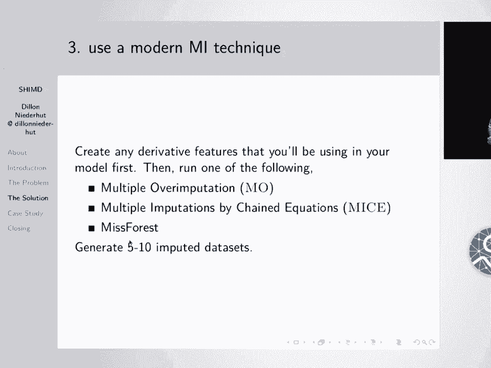

 The next thing we do is run our analysis。 This part is exactly the same as you've always been doing it。

 Just so you have to do this five to ten times more。

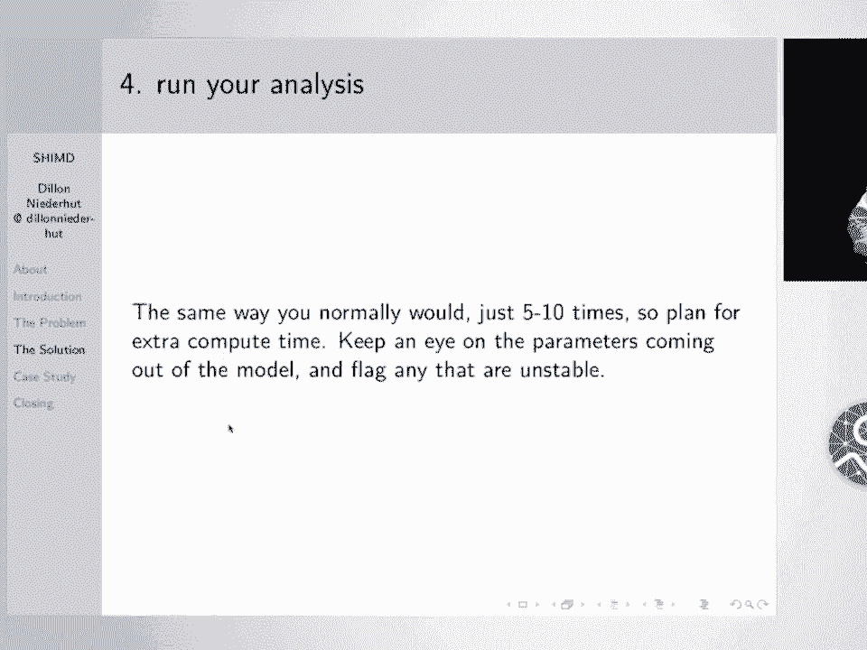

 So be sure that you're planning for the extra， compute time。 Finally here， report all the things。

 So if I'm reading your paper and you don't say anything， about your missingness。

 I'm going to assume that there was， missing data in your analysis and you did nothing to address。

 it and your results are biased。 That is my assumption。

 What I want to see is how many records had missing values， in it。 This matters a whole bunch。

 I want to know what is the regime they're missing under。

 If it's not completely at random and you're using list wise， deletion。

 I'm going to ask you to redo your analysis。 The next thing that I want to see is the imputation。

 technique that you used。 If it's a mean imputer， I'm going to be very， very unhappy。

 I want to see the model parameters， the coefficients， averaged over those five to ten datasets。

 If there's one of those that's really unstable， like in five， of them。

 it's like negative ten and in the other five it's， positive ten。

 you should be reporting that so we know that， this is not a coefficient we can rely on as being meaningful。

 There's something else wonky going on in your model。 All right。

 so let's look at a real world example。

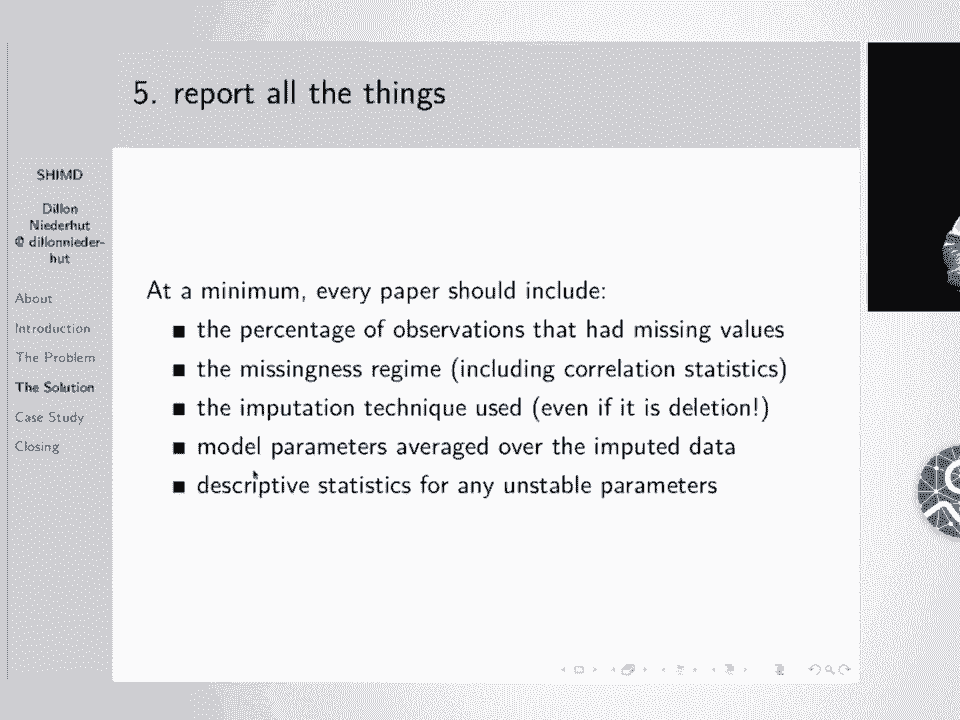

 If you were lucky enough to be here last year， you saw some。

 enterprising research on ranking burritos in San Diego。

 So this is Scott Cole who presented that lightning talk。

 In the dataset there's about 400 rankings of burritos。 After the cleaning。

 the size drops down to about 200。 It's the size of our total dataset。

 The variables that are recorded include things like what are， ingredients in burrito？

 Does it have cheese？ Does it have guacamole？ Does it have avocado？

 How good was the prito on a scale of one to five？ And then some other things like where did you get it from？

 How much did it cost？ So let's say that our task here is we want to know what makes。

 burrito good based on the stuff that's in it。

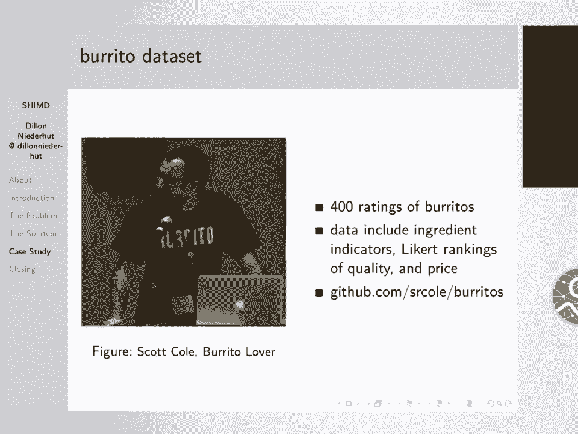

 How good is the meat？ How good are the other things？ So if you analyze these data。

 sort of as they are， which， you come up with， is there are three to four factors， depending。

 on how you threshold what's important and what's not， important。

 that determine burrito quality according to the， 20 or so people who are contributing to this dataset。

 The very first thing is the quality of the meat。 So I don't think any of them are vegetarians。

 The second thing is the price。 The third thing is the quality of the salsa。

 And then finally the uniformity， which I find it hard to， explain what that means。

 So here is a pictographic example up here。 From the famous medium post， "Dear Guy Who Just Made My。

 Burrito。"， All right， and then what I did was I went into this model and I。

 imposed a missingness at random regime。 Specifically， I'm picking out， I think it was the meat。

 quality and removing these high cases。 And if you want to imagine a scenario， maybe they're loving。

 the burrito so much， they forget to write the numbers down。

 When I look at the cross correlations between the。

 number of missing values and the features in my dataset。

 So this is probably way too small for you to read。 Those are the ingredients on the bottom。

 And some of the other ranking scores， this is the， correlation strength on the y-axis here。

 There are three that are very， very strong。 So we see that my missing values are strongly correlated。

 with the meat， the quality of the salsa。 And then also with my target with the overall quality of。

 the burrito。 So since this is missing at random， I can't use， listwise deletion。

 I'm going to go in and use。

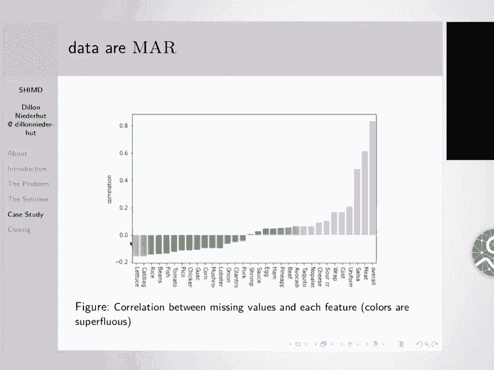

 something like multiple imputations。 So we use an EM algorithm to estimate reasonable values。

 for the data that were not there。 This graph is a little more complicated， so we'll walk。

 through it。 What we're looking at here are three box plots。

 And the y-axis is the score of the model。 So this is R squared。

 The blue line that's going across all of these is the。

 coefficient of determination for the model with no， missing values at all。

 so the fully-attested dataset。 And what we see is that when I use a multiple imputation， technique。

 in this case expectation maximization， I have， a model that definitely is performing worse。

 but the real， model is within our grasp。 It's within the range。 Notably。

 we have at least a fighting chance of having an， R squared that is greater than zero。

 Next to it in the middle is mean imputation。 Sorry， that orange line there， that's the median， the。

 green triangle is the mean of those R squared scores。 And this is nowhere near the real dataset。

 If I had analyzed this， just putting in the column means， we。

 see that a lot of spurless correlations come out。 If I remember correctly。

 all of a sudden like sour cream， becomes important magically。 On the far right-hand side here。

 that's listwise deletion。 So if you're dropping data out of your model， that is how， bad it is。

 At this point， you might as well throw away all of your data。

 and just predict the mean burrito ranking。 Now， because we are good scientists， we are good。

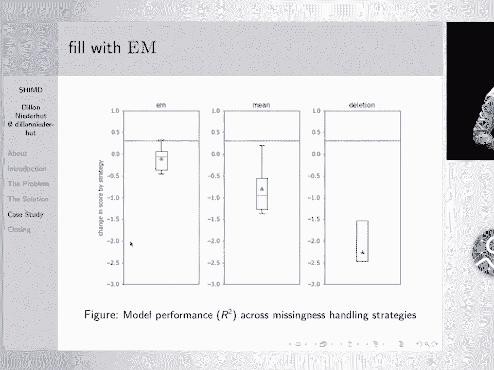

 citizens， we are going to tell everybody what we did。 We'll say that in this particular dataset。

 about 70%， of the observations had at least one value that was， missing。

 My data were missing at random。 I'm going to tell you that the really highly correlated。

 things were things like the meat quality， the salsa。 We imputed five datasets。

 If you are the average coefficients for the end of it， meat super important followed by--。

 I think it's actually supposed to be cost in the salsa。

 I may or may not have been working on these slides， right before the talk。

 So in the future for Python， what I would like to see is。

 Pythonic interfaces to these modern multiple， invitation libraries。 Most of these exist in C++ or R。

 They do not exist in Python。 What I would like to do， what I would like to make happen。

 is to have these best practices be the easiest thing to do。

 And what that means is any library that implements these。

 methods has to have first class pandas interoperability。

 There are two of these that I found on PyPI。 One of them I could not compile correctly。

 The other one only works on NumPy arrays。 And then finally。

 we need to have strong community standards。

 around best practices for handling missing data。 So that's been me。 My name is Dylan。

 If you have questions， I think we have 15 seconds left。 If not。

 you can confine me anywhere in the conference， as long as I'm not asleep。 You can also email me。

 tweet at me。 Thank you so much for listening。 [APPLAUSE]， [INAUDIBLE]。

 Thank you for the presentation。 In scikit-learn， we are currently discussing adding an。

 imputor that can do multivariate imputing somewhat， similar to misforest or mice。

 But one of the discussion we had was about multiple， imputation versus single imputation。

 In the sense that for machine learning purpose， at least， in scikit-learn。

 the default would still be to actually only， do a single imputation if your goal is just to have a best。

 possible prediction and not to do multiple imputation。

 I don't know if you have an opinion about that。 Thank you， yours for the question。 The very。

 very strong consensus from the stats community is， that single imputation should never be used。 Now。

 this will be tricky to implement from scikit-learn's。

 point of view because multiple imputation has to see the， whole data set。

 It's not going to be able to operate on a column by column， basis。

 I don't have thoughts about what the win-win situation is， there。

 but I would love to chat with you offline about this。 When you're applying the imputing techniques。

 are they， more deterministic or are they stochastic？

 So they don't always converge on the same set of numbers if， that's what you're asking。

 So there will be variation between the imputed data sets。

 and this is why we want to make sure that we generate more， than one。

 Occasionally you'll get five or 10 that look good and then one。

 super wonky one for who knows what reason。 I mean。

 this gives you some sort of plausible deniability to， say， hey。

 the rest of these are clustering together around a， reasonable approximation of the data。

 and there is one fluke， when I was running the algorithm。

 So what I was thinking of is when the imputed would come up， with a value or a category。

 some data to fill in that it， might be giving you a distribution around that data。

 where you could then say， hey， it gave me this distribution。

 now I'll randomly draw upon that distribution and assign a， value。 That's a great question。

 And the multiple over imputation algorithm works in， that way。 Specifically。

 what they do is they consider missingness to be， just an extreme example of noise in your data。

 And so it's really your whole data set that gets treated as。

 a probability distribution instead of single point， estimates。

 So I work a lot with time series data， and I'm frequently。

 asked to simply interpolate for to get the missing values。

 And it seems to me that's like a version of taking the mean。

 just between adjacent values and how bad is that。 That's a great question。 So I did not test that。

 I was not treating time series data because it comes with。

 its whole own set of extra things to worry about for this， particular experiment。

 The interpolation question is tricky。 I've seen situations where it works well。 Specifically。

 if your sampling rate is very， very high， interpolation can give you faithful reconstructions of。

 your data。 In situations where your data is spaced far apart and you。

 have no reasonable expectation of smoothness， then you can， get very， very bad behavior from those。

 So that's a really unhelpful answer。 And I'm sorry， but this is going to be a case by case basis。

 Thank you for presentation。 You talked about dropping rows， but you did not talk about。

 possibly dropping actual feature。 If you have a feature that has less than 50% values in it and。

 that proved to not be critical to the result， is it safe to， drop it or do you recommend against it？

 So in this case， I would say that if this is an auxiliary， feature。

 so not something that's crucial to the model you're， trying to test。

 I would feel a lot more comfortable sort of， shooing it out of the model。

 So just because you're collecting all the data you can。

 possibly collect doesn't mean you also have to use all of it。

 If it is something that you expect to be very important in， your predictions。

 then it's not a missingness issue。 There's a theoretical justification for keeping it， even。

 if it's not always observed。 And again， sort of the joke example here is if I'm not。

 measuring the temperature， I think that ice cream causes， homoscience。 Thank you。 One more。 OK。

 Well， so I suppose my question is if what if we don't， impute at all。

 but instead use something like a Bayesian， analysis if it is available for the model？ In that case。

 I'd expect the bias to sort of not creep， into the results。

 but instead you'd have a variances on the， estimation for the inner posterior。 In Christ。

 can you comment on that？ So Bayesian analysis， there's been a lot of talks on it。

 It's not something that I have expertise in。 I would not feel comfortable answering that question in a。

 setting like this。 Thanks。

 All right， with that， let's thank Delafred。 Great talk。 [ Silence ]。

