# SciPy 2018视频专辑 - P32：SciPy 2018视频专辑 (P32. scikit learn and Tabular Data Closing the Gap _ SciPy 2018 - GalileoHua - BV1TE411n7Ny

 So my name is Joris van Nombosser。 I will it's a difficult name to pronounce so， No blame on search。

 I'm。

 From Belgium， I'm a pandas core developer and I'm currently working at the， at anywhere in France。

 but under the University of Paris I cliched for data science and， By working there， Yeah。

 allowed me to also contribute to psychic learn over the last year and it's about those contributions。

 That I will that my presentation is about， if you have seen the。

 Updates on psychic learn in the plenary sessions on Wednesday， and the Miller already。

 mentioned almost everything I will talk about so it's basically an extended summary of his of his five-minute update so。

 What is it about？ the title of my talk is based on a talk that。

 Tom Augsperger another pandas core developer gave two years ago about the difficulties to use。

 psychic learn and pandas， together， So the gap between those two libraries and we have been working on making it easier to bridge。

 this， Music up， but before going to difficulties。 I want to step take a step back and first。

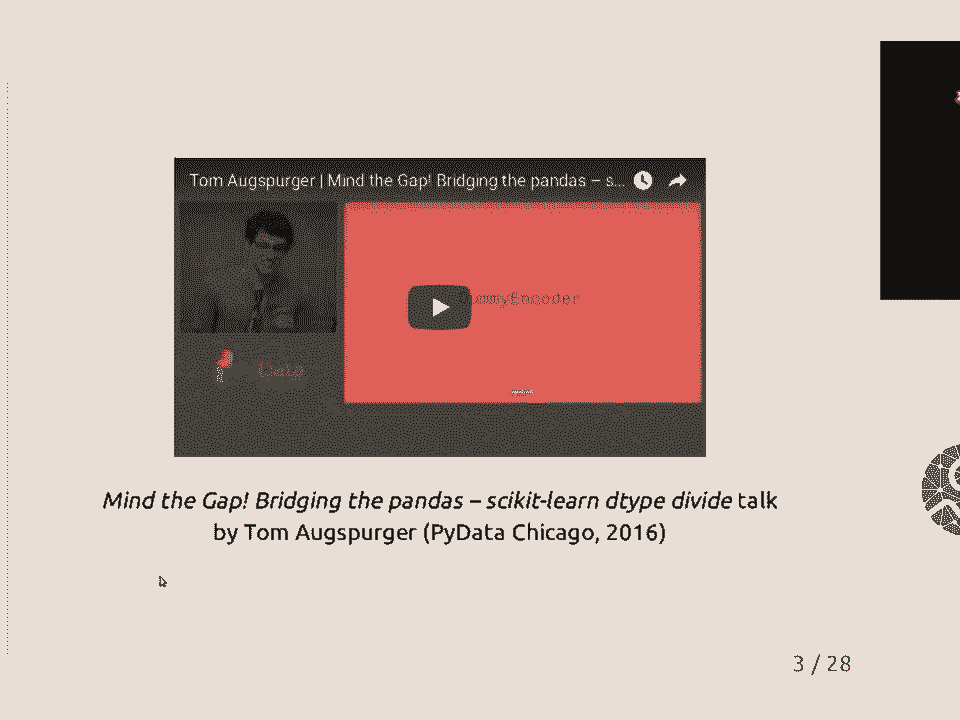

 Look at psychic learn itself。 I don't think I have to introduce psychic learn。

 too much it's a hugely， popular likely used package for machinery in Python probably used by。

 hundreds of thousands or probably millions of， users and one of the strengths of psychic learn is。

 has a great documentation， but also it has a very。

 simple elegant and consistent API and I want to focus a， Little bit on on that last aspect， so。

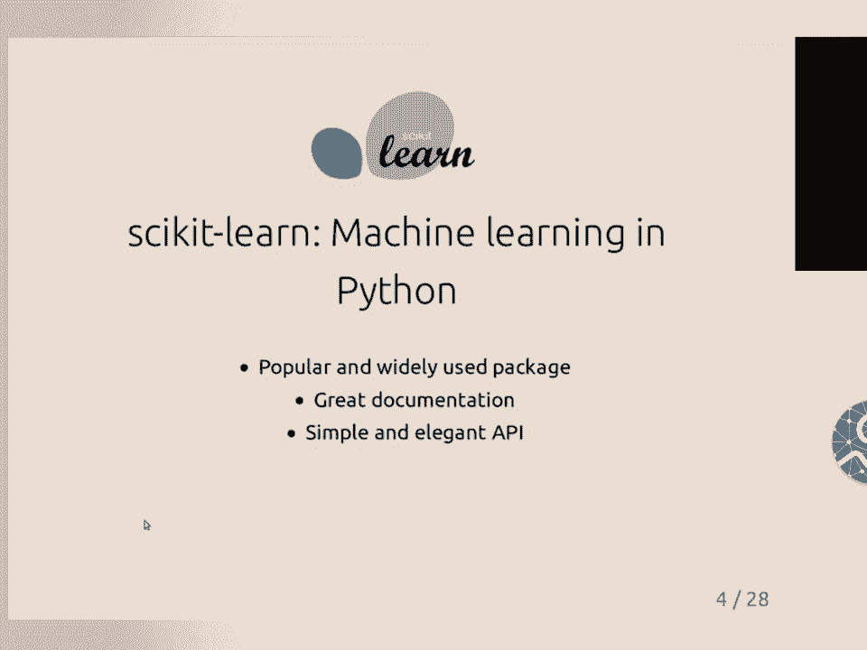

 If you have a model in this case for example random first classifier。

 so the typical pattern is fit predict， using to to feed a model and to then predict on on all the data。

 This is very consistent throughout， The library so you can in this case I use the one first classifier。

 but I can as well use another， classifier for example logistic regression and then the API stays exactly the same。

 So this is for， predicting， Of course often you also want to transform your data。

 So in psychic learn they have the concept of transformers， For example， Sandals scalar is such a。

 Transformer and here the API is not fit predict but fit transform so you fit。

 on your training data and transform your training data and you can also transform your。

 Testing data， In practice of course you both you typically use those two together。

 So here I manually， Put the pre-processing the transformer and the classifier。

 together where we manually， train our， Transformer we fit our both our we transform both our training and testing data and pass that to the model。

 But since this is such a typical pattern， To do to do this fitting transforming and then fitting again。

 Cyclon provides an API to do this much more easily and these are the。

 Pipeline is a pipeline， concept pipeline object of。

 Cyclon so instead of doing this manually with the two steps， I can combine the two in。

 In a single pipeline and I just need to call a single fit and under the hood it will do the proper transformations of my data。

 Fit my transformer I transform the data and fit the actual model， so。

 Pipelines can be used to chain different processing people sitting steps scaling。

 Feature extraction feature selection， Etc with then the final。

 Estimator so why is this important the pipeline first？

 I think by just looking at the code it's much more convenient。

 You don't have to manually keep track of those， multiple steps， but it also results in。

 much more in in in robust pipelines to make sure that the pre-processing is done consistently on your。

 trading data and on the data that you， in the end and want to predict on。

 It's also important for to ensure you don't leak information， so for example。

 then you do cross validation you want to make sure that the。

 In this case the standard scalar that you fit that on the trading data only and not on the full。

 Data sets so if you want to do cross validation with this pre-processing included。

 You can do that in scikit learn by using this， pipeline mechanism， similarly。

 Pipelines and also work in for example grid search if you want to do parameter。

 optimization you can， jointly for both the pre-posing steps and the。

 final model optimize parameters of both those steps， So I spent quite some time。

 highlighting the importance of the pipeline， Because it is I think this one of the key features of scikit learn。

 So and to everybody that is using scikit learn you probably should also be using pipelines。

 however in practice。

 many people have， Tableau data heterogeneous data upon the data frame value of both numeric columns and。

 Catarico columns and it turns out that using this pipeline object is not that easy。

 First going to I show you why it's not easy so at the。

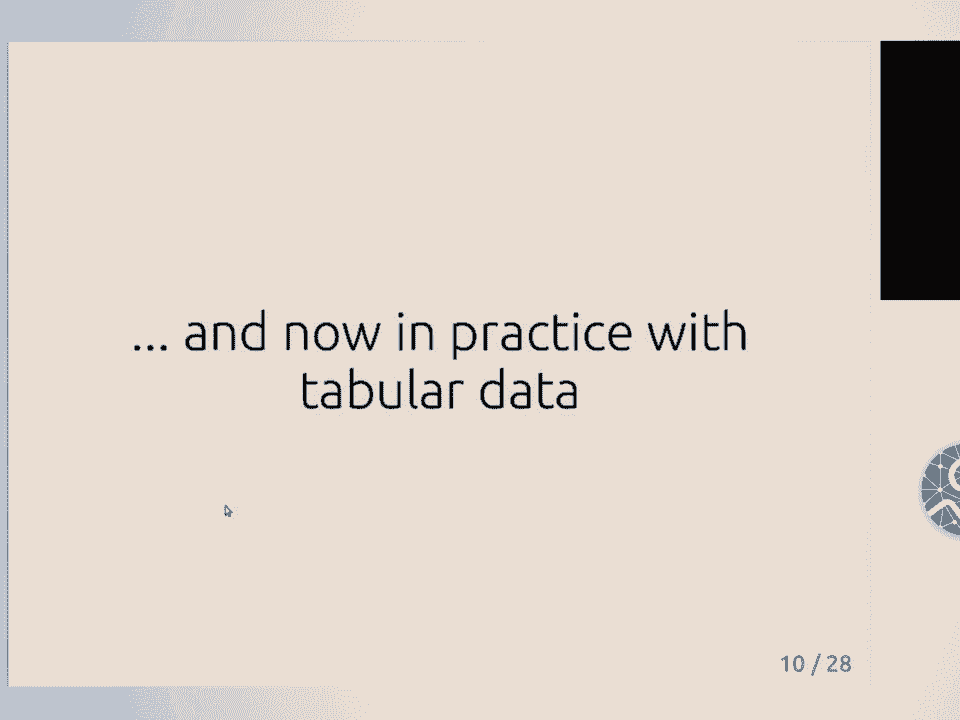

 More a very basic I would say， Using terminology of animal a hello world example for。

 Working with with tableau data and and scikit learn so we have the Titanic data sets。

 We have some columns that are numeric and for example the age and fair we have some categorical columns。

 And now we want to use scikit learn properly using these data sets。

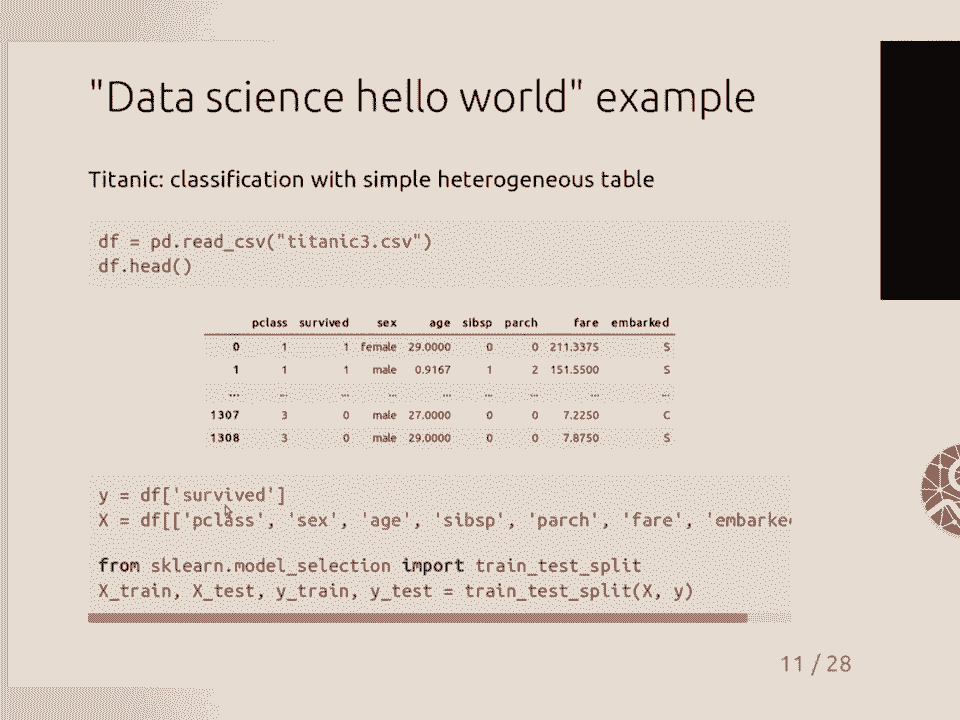

 Naively you can think okay。 I apply my logistic regression to。

 To predict whether the passengers survive survive that knots this doesn't work because logistic regression。

 expects an numeric， input， matrix， Which is not something that we probably are going to change but okay。

 We need to prepose our data so scikit learn has a one-on-ting quarter so we could use a one-on-ting quarter。

 Unfortunately， it doesn't work with string data currently。

 so people try to look for all sorts of walk-around you can try to。

 Here combine labeling quarter one hot encoder which somehow is misusing a bit the API of scikit learn all people。

 fall back to pandas， in this case here in in the second box I use pandas features to fill missing values and。

 We did get Domis function to convert my categorical commas to one-on-ting quarter commas。

 So get Domis is a very powerful and easy to use function。 It would say yeah， okay。

 But the problem I can just do it like this。 I have my input data as I want them to now use my model。

 but in the problem is that， we those walk around aid prevents the correct use of。

 pipelines and which is a problem for all the reasons that I mentioned earlier about the importance of。

 pipelines so to summarize。

 With the current release of scikit learn and we can't fully use those pipelines because scikit learn does not handle categorical columns。

 It does not， It's not easy to apply different transformational different， features。

 In addition and we also lose a lot of information about our。

 Dataframe the row labels the cone labels， So that all makes that it just not really easy to use them together。

 So the rest of my talk is about some new developments with also external packages that try to。

 make this easier。

 So the first step on my list was， handling categorical variables。

 Very short in case you're not that familiar， So we want to convert our discrete features here for example。

 I have some colors in in form of strings to numeric， numerical features and one of the most used。

 ways to do that is one hot or dummy encoding where a single column is。

 Converted to multiple columns with zero seven months。

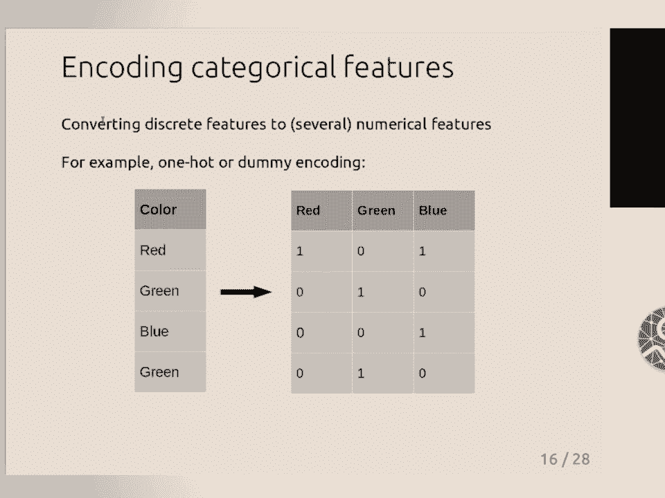

 Cyclone has a one-hotting quarter to do this。 Unfortunately as I mentioned early it doesn't work on strings。

 So what will be in the next release is that the one-hotting quarter now finally can handle？

 categorical string features， properly， So for example with our tightening data sets I can now pass the categorical columns to the one-hotting quarter and transform them to one。

 one-hotting corded， features， Related we also added an ordinal encoder。

 Which also works on I can also work on string features， but which does simply a， interior。

 encoding so converting， Your categorical feature to a single column of where the categories are represented by zero one two。

 etc。

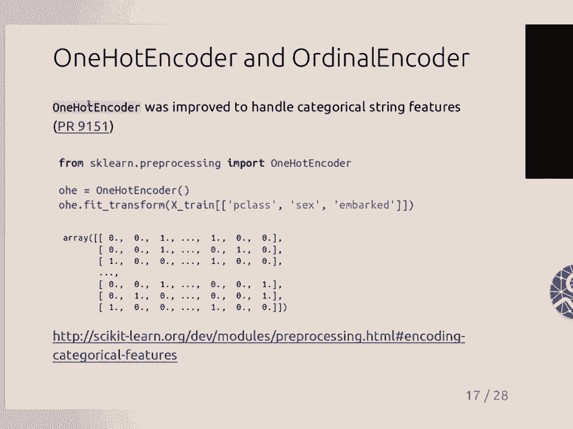

 In this area， I also want to mention， the category encoders。

 Contribute package and which already had one-hotting quarter object that could handle。

 swing features in addition to the current the improved one inside it learned it also has the ability to。

 output a data frame and， Maybe the more interesting part because now the one-hotting quarter will be better in cyclone as well is that they have many more。

 Cateral encoders if you want to explore different ways to encode your features like they have a binary encoder。

 Target encoder and many others， So handling categorical features is already， better。

 but now I still passed very explicitly here， which columns I exactly want to。

 pass to my one-hotting quarter so to be able to do this better。 I want to。

 Apply this in a put it in a full pipeline。

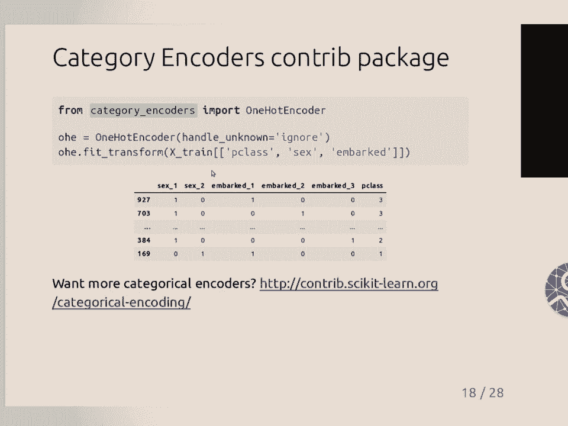

 We introduced the column transformer， So what is a column transformer？

 To apply transformers to columns， but where you can specify on those columns。

 I want to this transformer on those columns another transformer。

 How does it work so with the make column transformer function you have a column selection the column section can be a list of。

 column names it can also be a list of integrals if you work with an empire race。

 But it can also be for example boolean mask， It can for example be created if you do a comparison of the d types and in that way in。

 You can create such a boolean mask， but it can also， you can also pass a function that returns。

 It retrieves the the data passed to the model and it returns either of those so that's very useful if you want to。

 Have this column section dependent on your data for example in automated。

 Pipeline or in setting of outer mail you can also do it like that。

 The transformers then anything that follows the psychic learn API for transformers。

 Or it can also be a pipeline of transformers and it's fully integrated in。

 Psychic learn so you can do cross validation with its parameter of the optimization。

 So any parameter of any of the transformers can be optimized in a for example a grid search。

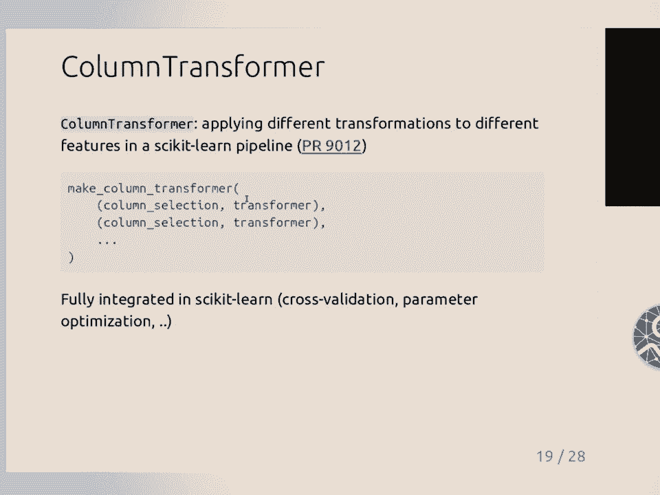

 So how does this look like with our Titanic example？ You write written it fully in in full form。

 so first specifying， Which numerical， features and。

 Which pipe which preposing I want to apply on them so here。

 I use the median imputer and as on a scalar then what are my cathehercle features and how to。

 Proposes them also within imputer and then a one-hotting quarter and then I combine them in a single pre-processor。

 transformer object， Also to note that the imputer has been improved as well to。

 Also support catherical features。

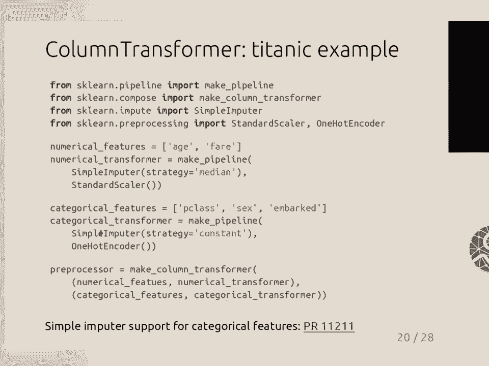

 So now can transform our data you see here that the output now combines。

 the two columns of my standard scaling my numerical original numerical features and。

 The other columns of the one hot and one-hotting coding， In this area， I also want to note another。

 Country packages psychic learn as color and pandas package which already had a similar feature for quite some time。

 But since it is such a core functionality， It's I think it's I really do deserves to be in psychic learn itself。

 The package there that's so the data frame mapper。

 In addition to it so the next I feature that it certainly still has it has the ability to output the data frame instead of the array that you see。

 here。

 So we can now put it in a full pipeline， Combining it with our logistic regression and actually fit our model and predict。

 Some new data look at the coefficients etc， so， the， We can now create it a full pipeline。

 Based on the tabular data， One thing to note and which I mentioned already earlier is that in this case。

 Yeah， you lose some information about the index in the columns of our original data， For example。

 it's it's rather difficult to directly see for those coefficients to which。

 features or transport features today correspondence， Or in the case of the prediction。

 I also don't have the the row labels anymore， so。

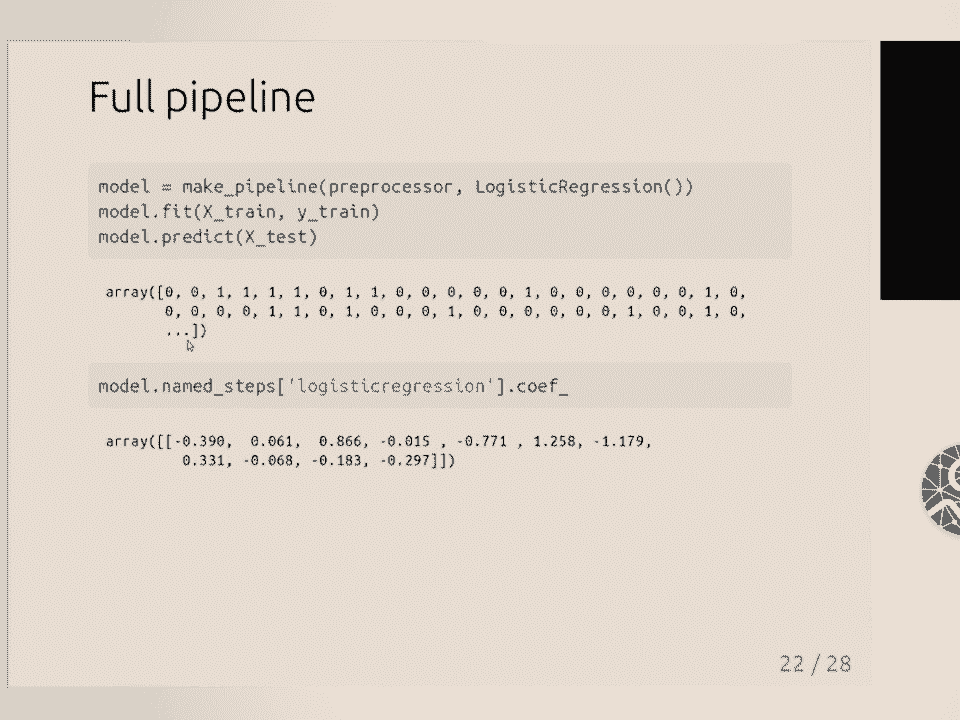

 There is one package I want to mention for that called ibex that tries to amongst other things try to solve。

 Or help with this aspect。 What does it do？ It will kind of on the fly。

 Adapt the all the object of psychic learn to be pandas aware。

 So when it does it wraps it it will catch the the inputs keep track of the columns and indices and when it returns something。

 It will wrap it again， in it so the how does the API look like you import instead of importing from psychic learn that linear model you import from。

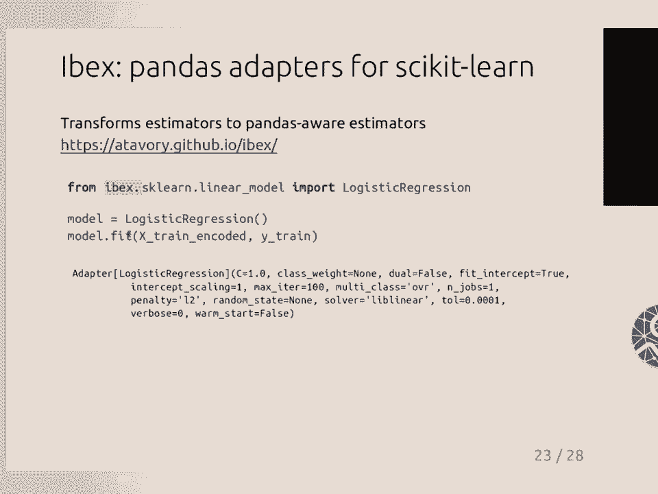

 ibex dot， psychic learn linear model and， then if you do look at coefficients or if you predict and you see that in case of the coefficients the。

 Column names are preserved in the outputs and for the predict that the row labels of your。

 Data frame is preserved， One thing to note here that I didn't use this together yet with the com transformer。

 It's very new so it doesn't work it with the com transformer。

 But with the the data that I manually encoded that's hopefully。

 in the once psych learn is released this will hopefully also be improved， so to， Wrap up a bit。

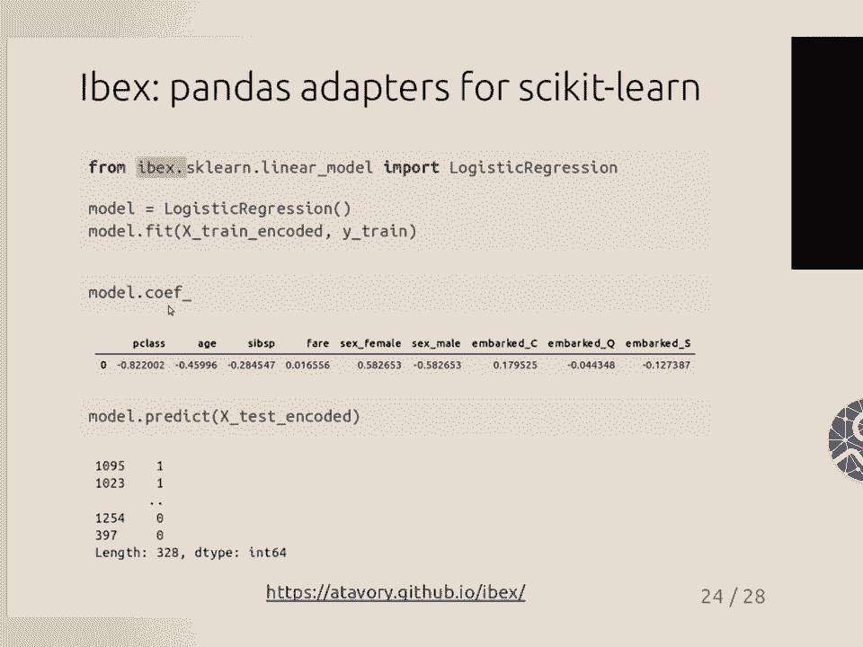

 Our original example so basic example of a tabular data sets。

 Run to do some pre-processing and predict something so it's certainly this with the additional features。

 That will be in a secular in 0。20， which， Hopefully we get to release candidate out after the sprints。

 after the conference， so you can now， Construct a pipeline to do that so in， psychic learn they。

 Often say that they want to make simple things should be simple and complex things should be possible。

 So I would say at least， It is possible now to create a constructed such a pipeline。

 But we can certainly still think about if there are ways to make this more， More simple as well。

 but this is now possible and also very explicit on how to。

 deal with the different columns different features in your data sets so。

 Basic support for catricle features， That's in psychic learn master applying the different transformers that will be in master as well。

 but there， Still many things that we could， Further improve could think about so at least here a few and that's not that they will be in an in a possible next release。

 but I think that we think about or， potentially could be。

 Become so for example something that and the Miller also already mentioned on Wednesday want to have a better get feature names。

 support so that with all with this come transform around and quarters that you that we keep track of the。

 feature names in a better way another thing that we。

 Could think about is for transformers if you pass a transformer to a， scalar for example。

 That the output is also a data frame we could use make better use of。

 Data type information for example in the one-on-tenth quarter if your column of the part of your panas data frame has a cater。

 Hercule d-type and we could make better use of this information instead of。

 recording ourselves the one hunting coding， We could also think on better or more preserving this this information in the index in the columns and。

 What I showed what was possible with ibex it's a question。

 Do you want more of those things also in psychic learn？ Probably certainly not on the short term。

 It's something we could also think about or even more about。

 Automatic definition or detection of catarol columns， I。

 Put them here in a bit decreasing order of likelihood so I think。

 In R for example if you apply a model it will by default。

 I deal with both numeric and uncatrical features， So it could be a question do we want similar APIs in in。

 Psychic learn， but I think on the other hand the the clean and also not magical but very。

 Clean and explicit API of a secular and is also one of the strengths。

 So it is certainly not yet clear how this could look like， following that same， Yeah。

 paradigm of of psychic learn， but to conclude I think that。

 With the next release of psychic learn at least maybe made a big step forward to making it easier。

 to work directly with psychic learn with， tabular data。

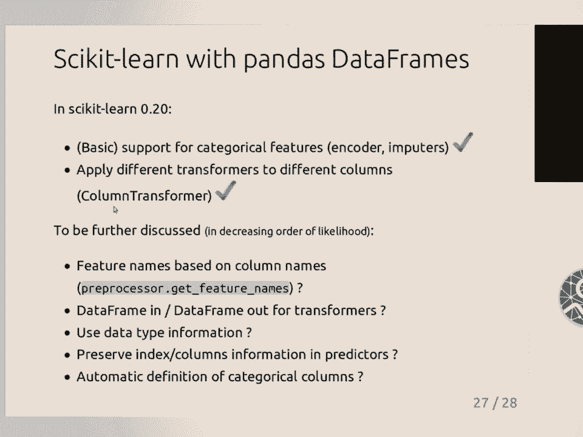

 so， To end I want to thank the psychic learn community。

 It has been really fun to contributing to the community and to the project。

 And also want to thank my employer to be able that I could walk on this。

 So I'm happy to take questions， We have a mic here now run around and hand it off of the people far away from the mic。

 Hi， My presentation thank you。 I have a question about the the one-hot encoder。

 Was it will it now have an option to drop one of the rows to deal with multi-colonarity？ Not yet。

 but it's an open issue and contribution。 I think we would like to add that and。

 contributions are certainly welcome。 So if people want to work on that during the sprint。

 I think that's certainly an option， The questions， A related question that I would have， for the。

 In the clustering some of the clustering algorithms in， scikit learn you can add。

 Pass in an adjacency structure and I was wondering if it's possible to get the labels for the index indices from。

 The adjacency structure as part of this， I'm personally not that familiar with that。

 Because I the that part of of psychic learn so I think you should ask one of the other。

 Very well place persons to ask that yeah， I， Don't know if Andy heard the question。

 So if you're passing in an adjacency structure to the one of the clustering algorithms that takes it。

 Is there a way to get the labels for the indices of the rows and columns of the that structure？

 Yeah the labels， Okay， Other questions， Okay， okay。

 I was just curious more from like a sort of cultural or。

 Really interesting that you have in some ways， Process looks like by which you decide as a project。

 I'm， The fact that I'm as a pan as they've working there is more coincidental。

 But I think the within the psychic learn community there is already for a long time。

 I mean very clear that， There are problems that needs to be solved and it's more。

 Yeah a sort process in finding， Yeah consensus up on to what extent we， we can。

 fully rely on pandas with， all its， Complexities and and and incompatibilities with numpy so that's more and within the community a discussion。

 That goes rather slowly， but I think it's for many。

 People is very clear that we that's a situation that needed to be improved and it's I mean still an ongoing。

 Process very the some of the things I listed are certainly things we want。

 But yeah take some time due to due to those discussions， Right any final questions。

 All right with that let's thank yours， You。

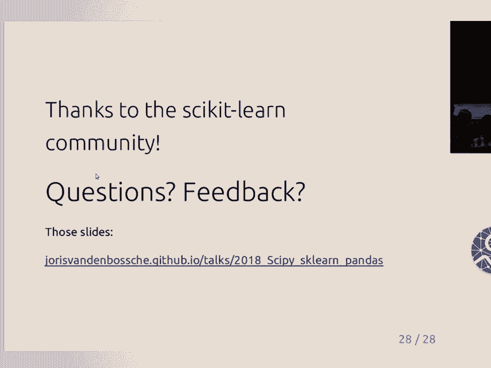

 (silence)。