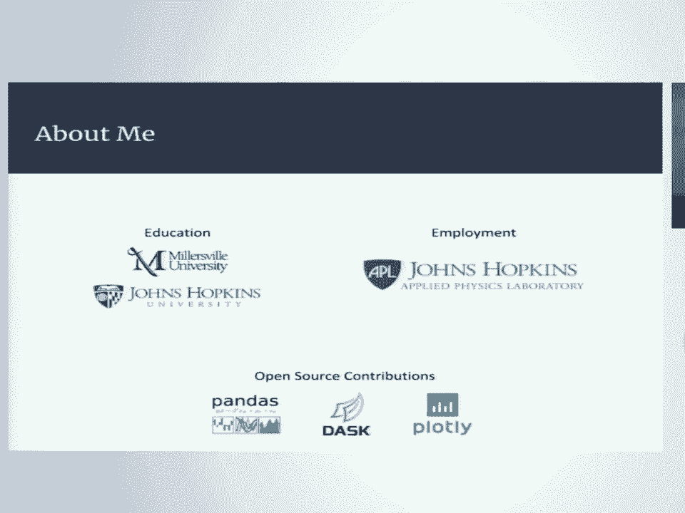
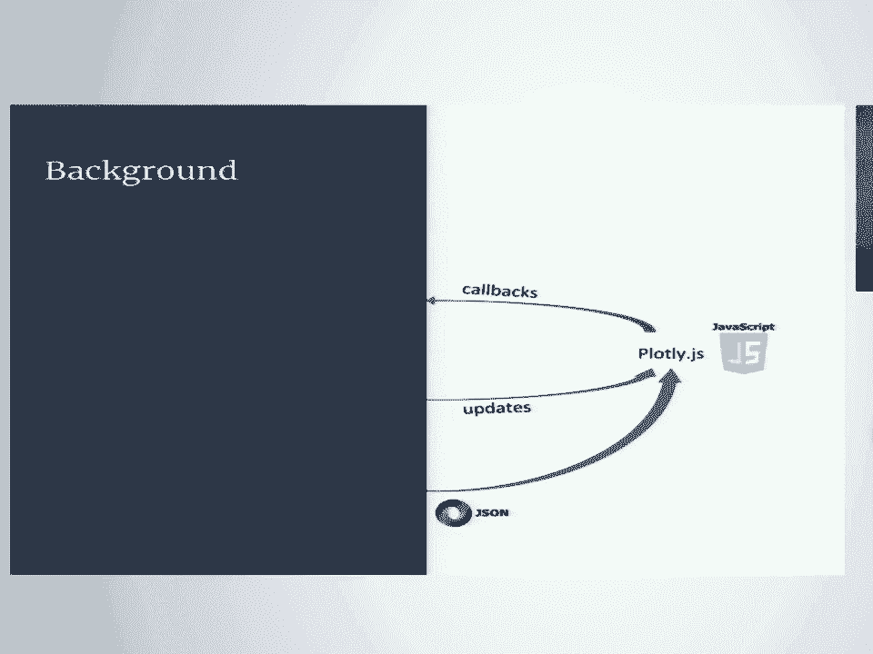
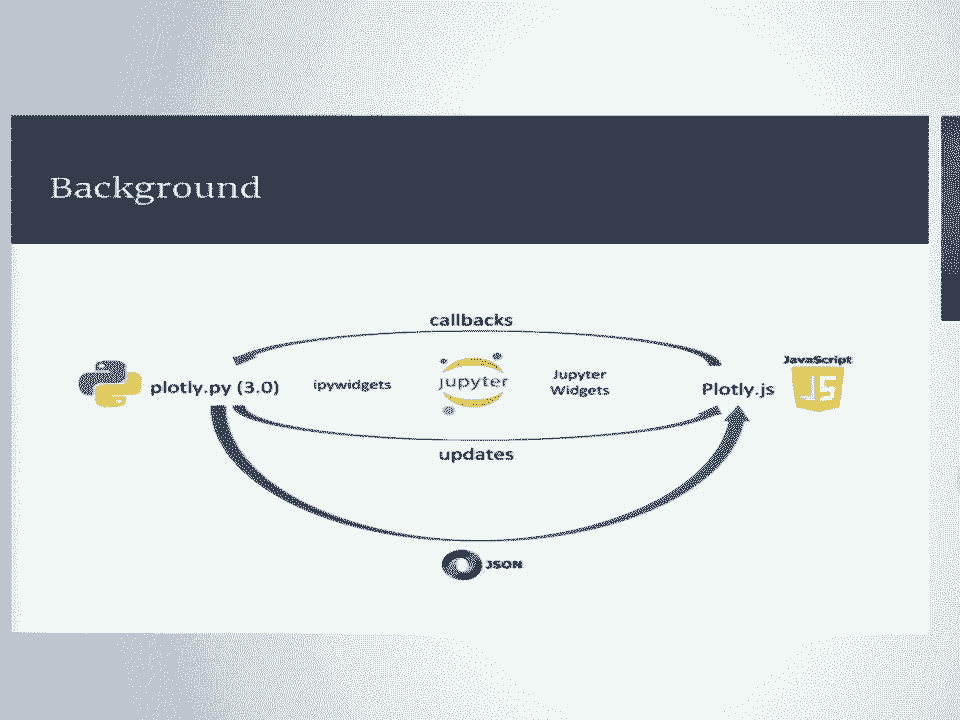
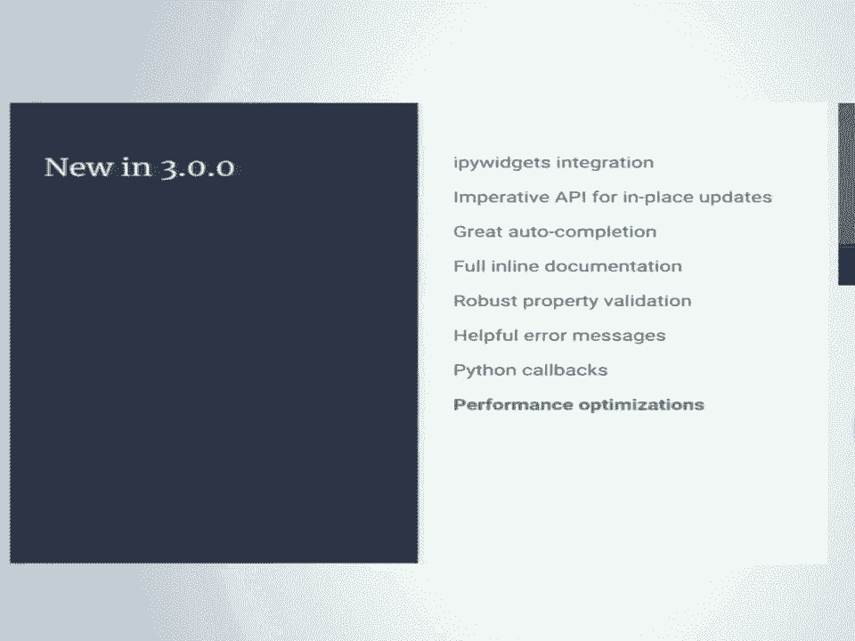
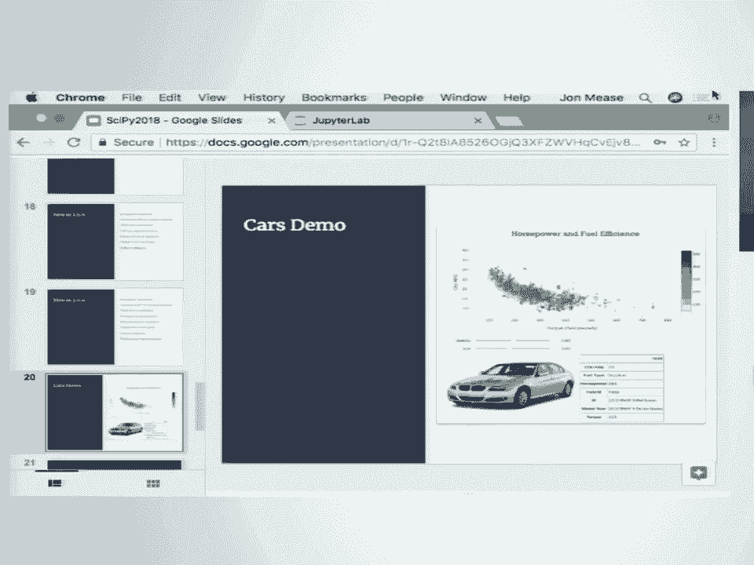
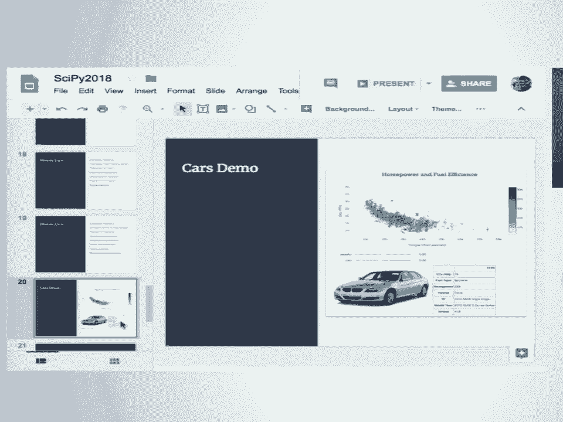
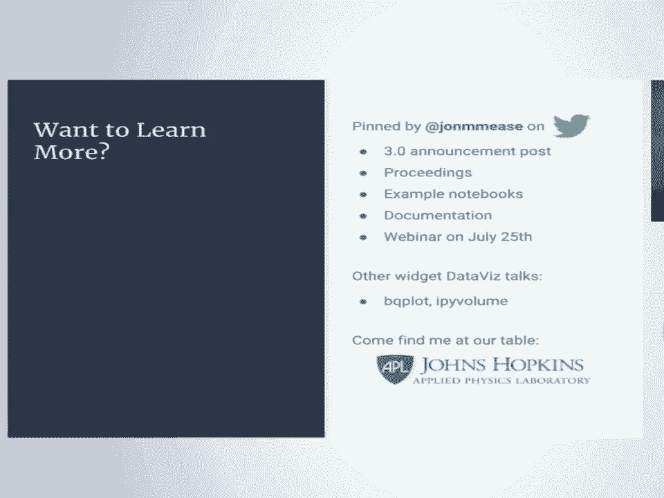

# SciPy 2018视频专辑 - P3：SciPy 2018视频专辑 (P3. Bringing ipywidgets Support to plotly.py _ SciPy 2018 _ Jon - GalileoHua - BV1TE411n7Ny

 So， I'm John Mies， and I'm looking forward to having a chance to talk with you all today。

 about this work to bring up our work to support， to probably。py。

 So to quickly introduce myself， I did my undergraduate studies in physics and mathematics at Millersville。

 University and then my graduate work in computer science at Johns Hopkins University。

 I now work as a data scientist and software developer at the Johns Hopkins Applied Physics。

 Laboratory， and one of my current areas of interest is working to apply what I see as。

 some of the best of the Python open data science ecosystem to some of our most challenging engineering。

 and analysis problems。 To that end， I've become a contributor to a few open source projects。

 including pandas， desk， and now plotly。

 All right， first in background。 My。J。S。 is a JavaScript data visualization library。

 It's based on D3 and WebGL， and it supports a really wide range of visualization types。

 that cover many statistical， scientific， financial， geographic， and three-dimensional use cases。

 This library was initially developed by the company plotly technologies incorporated as。

 a core component of some of their commercial visualization products， but it was open sourced。

 under the MIT license in 2015， and it's been an active development on GitHub ever since。

 So just to be clear up front， everything I'm going to show you today is based on open。

 source technology。 It's totally free， totally self-contained。 It does not require an account。

 and you can use it offline。 The integration that Poly。py does have with the plot to L。O。Y。

 Cloud services is all totally optional。 Okay， so Poly。js is a declarative visualization library。

 And so what that means in this case is that every visualization is fully defined by a JSON。

 specification。 In addition， the library provides a really powerful API for updating existing visualizations。

 in place and also registering callback functions to be executed in response to user interaction。

 events， like click， hover， selection， that kind of thing。

 Now Poly。py， so Poly。py is the Python library for building up these declarative specifications。

 for visualizations， and prior to version three， this was a one-way， one-time proposition。

 You'd use Poly。py to build up the specification， and then you passed that to Poly。js to display。

 the plot。 That would either happen in the notebook output cell or in a standalone HTML file。

 And there was no way to update the display of an existing visualization after you created， it。

 and there's also no way to bring information back from the JavaScript side about the events。

 to the Python runtime。 And that's where the IPY widgets framework comes into play。

 This framework provides really powerful building blocks for supporting the two-way synchronization。

 of properties between the back end Python kernel and the front end Jupyter notebook environment。

 And so what I did was I created a new Python IPY widget for Poly。js， and then with the。

 help of the Poly team， integrated that into Poly。py for version 3。0。

 That's as far as I'm going to get into the technical implementation details in this talk。

 but if you're interested in what it took to pull this off， please check out my paper。

 and the proceedings to go into a lot more detail about the messaging and architecture and， stuff。

 So here's a quick summary of some of the features that in version three I'm going to show you。

 today。 The cornerstone， of course， is the first class IPY widget support。

 This makes it possible to display plots in the notebook and then update them in place。

 And there's a new imperative property assignment API for doing that。

 There's now great auto completion and inline documentation across the entire Graph Objects， API。

 And there's also much more robust property validation and really helpful error messages。

 are now raised on validation failures。 Thanks to the IPY widget integration。

 it's now possible to get information from the JavaScript， front end back to the Python kernel。

 And I use that to add Python callback support。 So in order to support user defined Python functions to be called in response to events。

 like click， hover， and selection。 And finally， this version takes advantage of some of the optimizations in the widgets。

 protocol to greatly improve performance when working with large arrays。

 So my goal for the rest of the talk is to show you what this looks like in the context。

 of a real exploratory data analysis workflow and see if I can spark your interest in incorporating。

 some interactive visualization techniques into your own analysis process。

 We're going to jump to some live demos now。 Let's see how this goes。

 All right。 So I'm going to look at one of the many cars and datasets here。

 This one has information about fuel efficiency， horsepower， torque fuel type， and some other。

 things for around 5，000 vehicles。 And then to make things a little more interesting。

 I did some simple web scraping to pull down， the first Google image search result for the description of each of these。

 So here I'm using an ifi widget image widget to display the search result that came up。

 for the description 2012 Chevrolet Camaro Coupe。 All right。 So I'll make my first figure。

 This is going to be a torque versus miles per gallon scatter plot。

 And I'll do this using the new figure widget class。

 And to show you a bit of the declarative nature of figures， I'm creating this figure。

 widget with a scatter trace in the constructor to start with。 This is a scatter gl trace。

 It's a WebGL accelerated scatter trace。 In past versions of thoughtly。py。

 you would need to display it as an notebook using another， method， a method called iplot。

 But now that figure widget is a widget， and you're using this inside the notebook， it。

 can display itself。 It's own representation is the plot。 So here's the plot。

 We can hover over it and interact with it and I'll show you that in a minute。

 But I forgot to label the axes of the title for this。 So I'm going to fix that。

 And I could go back to the constructor and add more properties to update the label and。

 add axes titles and that kind of thing。 But I want to take advantage of the new imperative property assignment API to do this after the。

 construction of the figure。 So here's the figure's layout property。

 And I can get tab completion now on all of the properties supported by the layout。

 If I accept the title property and the tab completion， I can use shift tab to display。

 a inline documentation for what that property is。 So here I see the sets of the plots title。

 I can see information about the type and the values。 So it can be set as a string or a number。

 In this case， I'll set it as a string。 I just want to grab this one up here。

 And now when I scroll up， I see that the existing figure was updated in place without。

 having to reconstruct it。 I did not have to manually push that change to notebook。

 The great part about which is that it's automatically to keep the front and back in。

 sync at all times。 So I would also want to just check out this title font property。

 I see that I found this in the completion。 This is another compound property。

 I can nest down into arbitrary levels of these properties as a size。

 I want to use the size to increase the size of the title。 So normally when I would do this。

 I would check out this title size and decide， well， maybe I'll try 20 or maybe 30。

 I don't know what the default is。 I'll just pick something and see what happens。

 But with a two-way synchronization， I actually have information about the default values that。

 were chosen by the front end on the Python side。 So I can see that the default value was 17 and use that to make an informed adjustment。

 to what I want to see。 So now I can just decide， okay， it was 17。

 I'll set it to 22 and take a look at the increase in the font size。 And as for fun。

 I'll set the font family to Rockwell。 So you can already see that it's getting a little bit cumbersome to scroll up and down。

 between the code and the figure。 So I want to take advantage of a really awesome feature in JupyterLab that's supported by。

 JupyterLab and iPad widgets。 I can just right-click on the output cell and select Create New View for Output。

 And now I get a new independent view of that figure in a separate panel。

 I can just drag it over here。 And now I have these two views of my figure。

 They both respond responsibly to resizing。 They are both linked together。 So if I pan this view。

 they both update， I can zoom in on this one。 I can reset over here。

 And the widget framework keeps these in sync。 So that's great。

 Because now I can update the axes and just pay attention to the view on the side。

 So I can update the x-axis title， the y-axis title。 And just to double check， they are both in sync。

 But now I can kind of leave this on the side for a while and just focus on my little side。

 panel view of the figure that I'm modifying。 So I'll quickly add the data itself now。

 So this is the efficiency of the cars versus the torque。 There's， I think。

 a fairly intuitive trend between-- from cars with low torque and high。

 efficiency down and out through those with high torque and low efficiency。 But if I zoom in。

 I can see that there is this sort of artificial quantization of the， values。

 They have these sharp jumps and they're not continuous。

 So to help me avoid some over-potting problems， I want to apply a jitter to these values。

 I can do that by just grabbing a reference to the scatter trace object and then doing。

 more property assignment to update the x and y values。

 I'll run this cell and I'll instantly get an updated set of values for those x and y values。

 All right， now I have more over-potting problems。 So let me play with the opacity。

 I can again use tab completion to dig into the marker object。

 This is compound so I can get tab completion to the next level。 All right， there's an opacity。

 I can ask for the documentation string on that。 Okay， opacity is a number between 0 and 1。

 I can evaluate it， see what the default was。 The default was 1， and I'm going to lower it down to 0。

2。 And for the size， I can do the similar thing。 I can go， okay， there's a size property。

 check the documentation。 It's got to be a positive number。 The default value is 6。

 I want to be a little smaller， so it'll go on to 4。

 So I hope you can see this interactive workflow really speeding up the process of honing in。

 on the properties that you want and using it as part of your analysis process to understand。

 the data better。 Or if I hadn't checked the documentation and I just try to hit opacity to 50。

 Well I get a really helpful error message telling me that the received value is 50， but。

 it has to be between 0 and 1。 Or if I set an enumeration property like hover mode to an invalid string value。

 So here I'm told nearest is invalid and the valid values of this enumeration are x， y。

 closest and false。 Well I want it closest， not nearest。

 Or if I set a color property to attempt to set it to fuchsia， I get this error message。

 to explain to me all valid ways to specify colors。 RGB， RGB。

 all these other versions or any of the names CSS colors can scan down through。

 and see trouble was I didn't know how to spell fuchsia。 Now I want to fix that。

 Again changes are updated immediately。 But if I decide I don't like fuchsia。

 I can go back to the default。 And I want to go back to the default shade of blue。

 I can just use none to clear out the value that I set explicitly and the default will。

 automatically be restored。 Alright so back to looking at the density again。

 Poly has a really helpful trace for doing this called the histogram 2D contour trace。

 And I want to add this， this existing figure。 So there's a new set of methods on the figure object that I'll start with add_ and then。

 give you options for adding all the traces that Poly supports。

 So if I just accept completion on histogram 2D contour， I can bring up documentation on， this。

 I can see the description of the trace itself。 I can see descriptions of all of its top level properties。

 These are all done with code generation。 They'll all stay up to date as new versions of the libraries come out。

 In this case， I just want to keep the same X and Y values that I use for the scatter plot。

 so the density reflects the actual distribution of torque and miles per gallon。

 Contour has its own properties so I can dig into its properties。 There's a color scale property。

 I like to customize the color scale so let's see what the available options are。

 There's a named one。 Let me grab hot as an option。 Have the documentation string。 There we go。

 That's a little dark。 I like that。 I'm going to disable the tooltips on the contour trace。

 I like the ability to view the raw data plus the density。

 It's hard to see both at the same time unless you have the marker or opacity and size that。

 just right。 I can keep tweaking this in the cell and adjust it until it looks better to understand things。

 more。 Whenever you find yourself doing this kind of process of tweaking a value in a cell。

 rerunning， it， tweaking again， rerunning it， that's a good clue that you should reach for ify widgets。

 and turn those into options that you can set interactively。 To do that is really straightforward。

 Here's a function that just inputs the two values that I was fiddling with， the opacity， and size。

 It inputs them and sets them。 Then I just wrap this into call to the interactive function。

 For my ify widgets specify the values I want to sweep over and that builds me a little control。

 panel。 I'll just make it a little wider。 Now I can just be using that to dynamically select my opacity and my size。

 It doesn't need to be a big software development effort to do this。 This is part of your flow。

 part of your analysis to help you understand what you're looking， at more quickly。

 I think I have a good handle on the density now。 I'm going to dig in and look at some of the outliers。

 Please zoom in down to this heel here。 There's an outliers here that are a little hard to see。

 I'm going to pass it back up again so I can see them more easily。

 I'd like to understand some more things about them。 The tooltips are nice。 They show you the x。

 y values by default。 I'd like to understand some more than just the x， y values。

 I'd like to understand the rest of the properties and why these might be outliers。

 One easy thing to do is you can customize what's the display in the tool tip。

 I'm going to set the scatter's text property to now display the description of each vehicle。

 in the tool tip。 That's nice。 That's helpful。 But there was a whole table of properties that I might want to look at。

 I want to find a way to show all of them as I'm hovering over these points。 One way to do this。

 this is a pretty quick way， is to use an HTML widget and then populate。

 that with an HTML table that represents all the properties for the row of the point I'm。

 hovering over。 I'm going to build that table using -- I'm going to use the new on hover callback function。

 on scatter traces to register a Python function to be run whenever I hover over a point。

 This Python function is going to extract the index of the point that was hovered over。

 It's going to look up that row in the data frame。 It's going to convert it to HTML using the pandas to HTML method and then update the。

 HTML table with that information。 When I run this。

 I can now hover over points and get a full view of all the properties。

 for these points interactively。 But I also have the images。

 I like to do the same thing for the images。 So for those， I'll just create an image， if I widget。

 and then update my callback function， to now do both the process of updating the HTML table plus updating this widget's image。

 values。 Now I see that I very quickly get the pictures of all the vehicles as I hover around and the。

 tables are still updated as well。 This is all done interactively。

 You've seen all the code to do this now。 It's all in the notebook。

 So you can leave the widgets spread out throughout the notebook like this and just pull them。

 out into their own view as you need them。 Or it's also easy to use the built-in ifi widget containers for layouts to pull them together。

 into a notebook output dashboard。 So here I can just -- I'm at this little dashboard just for this one analysis and I can customize。

 things as I zoom in and out to notice the view。 I can see all the properties to help me dig into this dataset and understand it。

 So I'm personally just really excited by how quick this is。 I mean。

 if you think about what's happening here， as I'm hovering over these points， this。

 hover information is being compared against 5，000 points。 That's happening on the JavaScript side。

 It's triggering a JavaScript callback function which is then passed to the Python side， running。

 some Python code， doing some pan-as operations and computing the new image in the new HTML， table。

 That's all happening as quick as I can hover around here。

 And the reason for that thing is that I didn't do。 And this is the stuff that the ifi widget team。

 the Jupyter team and the Jaa's team have， all done to optimize this to make this so smooth。

 All right。 That was 5，000 points。 Now， I'm going to show you an example of how this can scale to a much larger dataset。

 For that， I'm going to look at a portion of the New York City tax-arise dataset。

 You'll probably see this at various talks over the last couple of days。

 I'm going to look at a subset of the January 2015 dataset。

 I'm going to look at cases with four or more passengers in this month。

 And after I do that filtering， I'm down to about 1。2 million trips， 1。2 million points。

 The first thing I want to look at is the distribution of the trip distances across these。

 sort of carpooled taxi rides。 And I can do that by first creating an empty figure and then adding a histogram。

 So a histogram is a polytrace type that does the bidding for you and the bin selection and。

 the counting。 So add this histogram， take a second or two to pass those 1。

2 million points to the JavaScript， side to perform the bidding and display this plot。

 So that itself， I think， is really quick。 I'm really happy about that。

 And as I make small changes to it， like updating the title， these happen instantly。

 So this shows you how we're only sending over the properties in Python and JavaScript that。

 are actually changing。 This is not reconstructing the entire plot every time you make a change。

 So small updates to large plots can happen quickly and efficiently。

 And then I'm going to do a scatter plot of the actual pickup locations。

 So here I'm constructing an empty trace where I disabled the axes to remove those distractions。

 I'm going to add a scatter gl trace。 So this will be a scatter plot with marker size 4， opacity 0。1。

 And I just got this 1。2 million point scatter plot on the screen， just a handful of seconds。

 This is a real scatter plot。 This is not doing any aggregation in the background。

 This is all being sent to the JavaScript side。 It's all being rendered individually。

 These points are all individually rendered。 And that's on the screen。 But what about interactions？

 So first I'm going to run this to tell the zoom tool to constrain the aspect ratio。

 Probably when I zoom in， it won't let me distort the proportions of the city。

 So I'll switch to my zoom tool。 I'll zoom in。 I get fairly quick interactions of zooming。

 I can then pan around to see the structure of the city streets。 Again， 1。2 million points。

 And let me reset the view。 And then for the finale here， I'm going to pop out this histogram。

 Into its own view。 And I'm going to use the new on selection callback mechanism on traces。

 And we'll do that almost that time。 So I'm going to run that。

 So this will install callback to be run whenever I select points in this 1。2 million point scatter。

 plot。 So as I select the lasso tool， I'm going to select some areas over here and through West。

 Manhattan。 And it works just as it should。 You can see when I was in West Manhattan part。

 I got a unimodal distribution。 Looks pretty similar to the original。

 If I select something over here up in Queens， I get some bimodal distribution。

 I guess I'll select something down here in lower Manhattan and see these differences in。

 the structure of the data throughout the geographical locations of the city。

 I'm about out of time。

 So let me jump here。 So if you're interested in learning more about this。

 I have to pin some links on my， Twitter account。 And on a Miest on Twitter。

 there's a link to the announcement post， the proceedings， an。

 example of notebooks that do this stuff， the documentation for plotlify。

 And I'm also holding a webinar on July 25th if you want to see more examples of this kind， of thing。

 If you're intrigued by this idea of data violations as widgets with automatic to asynchronization。

 of the states from the Python JavaScript side， definitely check out the talks tomorrow on。

 BQplot and IPy volume。 The authors and teams behind these tools are really the ones who pioneered this approach。

 So you really want to check out what they have to say。 And finally， I love talking about this stuff。

 So I'm here at the rest of the conference。 Please come talk to me。

 I'll be hanging out at the Johns Hopkins Applied Physics Laboratory table。 Thanks very much。

 [applause]。

 >> So we have a few minutes for some questions and there's a mic set up there where I can。

 bring this one around since it's a little crowded。

 >> That's awesome with the interactions and everything and the two way。

 So when I last year when I tried to use this， the trouble I got into was it was really hard。

 to update the data， meaning bringing new data。 So based on a couple of clicks or maybe a button or something。

 I want to bring in a new data， set for the graph。 Would this interact to interaction to care about now？

 >> Well， so like the example I had applying the jitter to the X and Y properties， that。

 was adding brand new data to that plot， overriding it was already there。 So yeah。 >> So， thanks。

 >> Any other？ Yes。 >> Great presentation。 I pass off a lot of the stuff that I do in the Jupyter Notebooks to non-Python users。

 in like a 。html format。 Is there widget support for that at all or？

 >> So if you're going to a standalone HTML file， you could still use the existing mechanisms。

 that Polyadopi has to write it out to a standalone HTML file。

 In terms of doing that for the actual widget views， I would need to talk to the Appite。

 widget team a little more。 I don't know how to do it off of my head。

 but Polyad itself has a legacy way that's still， supported to do that。 >> Thanks。 >> Great。

 I have one for you。 So what feature made your workflow easiest or most improved？

 >> The ability to get the hover and selection information back， that's the piece that inspired。

 me to start on this path。 >> Any other questions？ >> I missed the first couple minutes。

 I was wondering where to find the example notebooks you went through。

 >> So you can either check my Twitter account where it's pinned or you can go -- so I'm @JohnnMease。

 on Twitter and also on GitHub。 So it's also my top-level GitHub repository。

 It's called the IPY widget example notebooks。 So John and me， Twitter or GitHub， you should find it。

 Cool。 >> Okay。 This is more of a plotly corporate question。

 What extent is this supported and when will there be documentation？

 >> So I can just say that I did this on the outside。

 But the only reason it's integrated is because they put a lot of work into it。

 So they have supported it already to get it to this point。 If it had been all me。

 it would have been a standalone IPY plotly thing that wouldn't， have been part of a plotly at all。

 So I think the documentation is something we know needs to be done。

 We decided to get the code out when it was ready。 But that's something that we're going to be working on the next few months。

 But agreed。 The documentation needs some work。 >> Yep。 So the first step of that。

 we went through a major everything that's documented now still， works in the new version。

 So that's all set。 And then we'll start adding the new documentation as soon as possible。

 And for support， we have a community forum and a developer support plan。 So can I check that out？

 And it's pretty easy to get started with that。 Any other questions？ Okay。 Thanks everyone。

 [APPLAUSE]。

 Stabilizing。