# P4：SciPy 2018视频专辑 (P4. Data Visualization for Scientific Discovery _ SciPy 2018 _ Z - GalileoHua - BV1TE411n7Ny

 [APPLAUSE]。

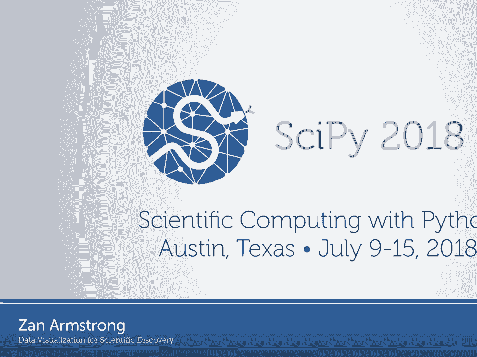

 Thank you so much for being here and making， friends with your neighbors。

 Super excited to see the packed house， and I'm really excited to be here to talk with you all。

 about data visualization for scientific discovery。

 I'm Zann。 I'm a data visualization designer and engineer。

 I'm currently part of Google's Accelerated Science team。

 My goal with that team is to use data visualization， to help a team of scientists， statisticians。

 data scientists， and machine learning engineers analyze our data， and make discoveries。

 So I'm just going to start by telling you everything， you need to know about data is。

 Pie charts are bad， non-zero bar charts are bad， dual-axes are bad， rainbows are bad。

 chart junk is bad， and a high-inch data ratio is bad。

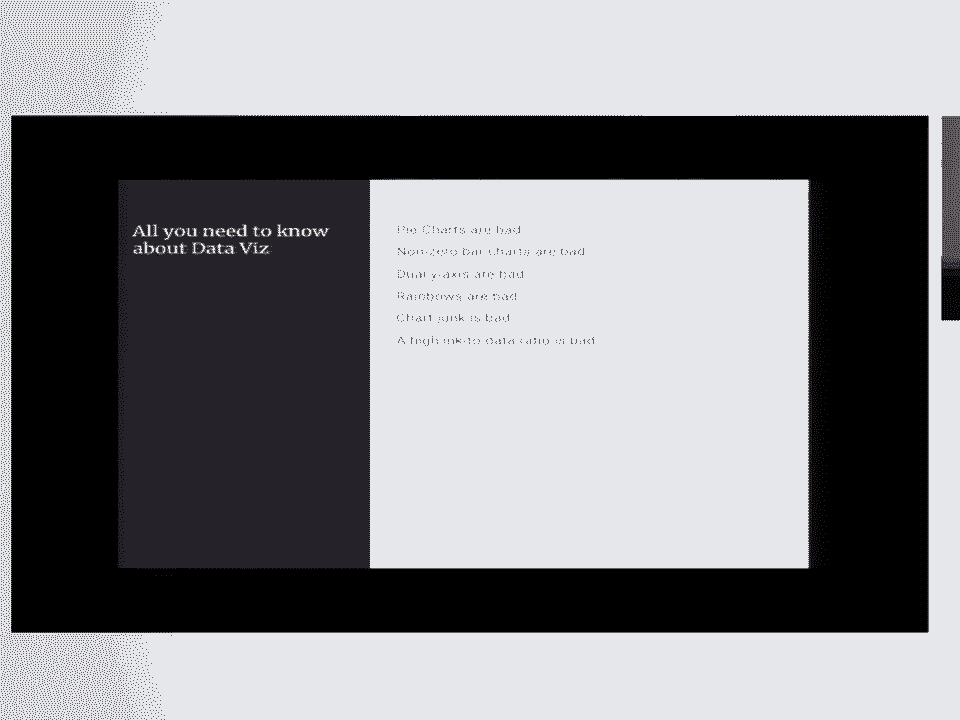

 So well， that's the end of the talk。 I think I've covered everything。

 Any questions？ And these are the off-quoted rules of data vis。

 I have fairly strong opinions on all of these。

 Some of them， I agree with somewhat。 Some of them， I disagree with vehemently。

 But they remind me a lot about how we talk about food。 I don't think they're a very useful way。

 of thinking about visualization。 Everything is bad for you。

 Even things that are obviously necessary， like calories， fat， and salt。

 And I think better to have a few good guidelines。

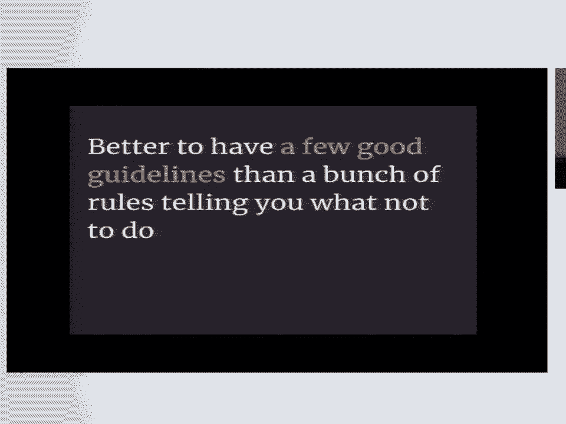

 than a bunch of rules telling you what not to do。 So in the case of food。

 I really enjoy Michael Pollens'， eat food， not too much， mostly plants。 And in the case of data vis。

 I would， like to propose， create small multiples， which， are many related charts。

 Use color intentionally， and optimize your charts， for your time， energy， and attention。

 Maybe not quite as snappy as Michael Pollen， but I'm working on it。

 But before we get into those three specific topics， I want to talk about the bigger picture of it。

 The fact， the question of is it good or bad， depends on your goals， context， and constraints。

 For example， with the case of food， is a candy bar good for me？ Well， it depends。

 Am I at home drinking tea？ Maybe it's not so good for me。

 Am I on a week-long backpacking trip in Patagonia？ Maybe it's fantastic。

 I need that extra sugar to get me， through the next couple of miles。 In the case of visualization。

 these， are two visualizations about when babies are born， based on the same underlying data。

 Which one is better？ Well， it depends。 What's the point of the visualization？

 How much time do I have to create it？ Who is the audience？ Is it made for somebody else？

 Is it made for me？ Do I care about day of week， which， I can only see in one of these？

 Do I care about total values or difference to mean？

 Even this is kind of one's more for communication， one's more for discovery。

 Even in a space where we're thinking only， about discovery， these are two same exact data。

 in both these plots。 This is data from a sensor on the coast of California。

 looking at wind direction and wind speed in December 2017。 Which visualization is better？

 It really depends。 I find the one on the right a little bit more intuitive。

 because you have that sense of circularness and direction， and length being speed。

 But there's a lot of occlusion， a lot of data。 It's harder to see if you really want to dive in。

 see what data you have， what's missing， make more data of comparison。 So it depends。

 And two of the major ways that we break down visualization。

 is for communication and for scientific analysis， and discovery。 And within analysis and discovery。

 we have the exploratory mode of like， oh， what if I try this？ What if I try this？

 What if I try this？ Ooh， that looks interesting。 I want to learn more about that。

 And more of the pipeline mode， where you're， getting a new batch of data， you're。

 going to run your pipeline on it， you're going to do your analysis。

 and maybe hopefully you have some charts as part of that。

 And these types of things beg different fundamental questions。 In communication， things like。

 does it， attract the audience's attention？ Is it true to the data and not misleading？

 Does it get the message across？ And I think this is where a lot of our rules come from。

 is the communication space， especially things like， is it immediately interpretable？

 Will somebody who's never seen that before be， able to interpret it in two seconds？ Which。

 in science， might be less relevant when， you're looking at that same chart every single day。

 For analysis and discovery， I want， to ask questions like these。 How much time and energy？

 If something's important， will you see it？ How long does it take？ How much mental effort？

 How hard is it to ask any question？ Will I use this tool often？ Is a learning curve OK？

 I especially want to point out two of these。 If something in your data is important。

 will you notice it？ In particular， for science， this is so important。

 You don't want to overlook the nugget of discovery。

 And it's OK to risk something looking important that isn't。

 because you're going to do more analysis afterwards。 You're not done at this moment。

 And I would much rather risk something， looking important but not being if it means I'm。

 going to see the important thing， than miss the important thing for the sake of making sure。

 that I never see something that might not be important。

 And your time and your energy is your most limited resource。 In particular。

 this is not the number of charts。 Often having more charts might actually， be easier to interpret。

 And especially for data of its pipelines， where once you make the chart once you get to have it。

 every single time that you run the pipeline， it might be worth that initial investment。

 if you're able to have more charts that are tuned。

 for a specific purpose and make it easier to analyze。 So just to sum up， is it good or bad really。

 depends on your goals， context， and constraints？ And that underlies everything else。

 we're going to talk about today。 Let's now dive in--， oh， I'm sorry， the supplies for food， is。

 and of course it applies for engineering， machine learning， and statistics as well。

 And I think in statistics we know， of course， there's no best algorithm in statistics。

 It depends on what you're trying to do。 The same thing applies for visualization。

 There's no best visualization。 It depends on what you're trying to do。

 So let's talk about those three topics。 Number one， creating small multiples。

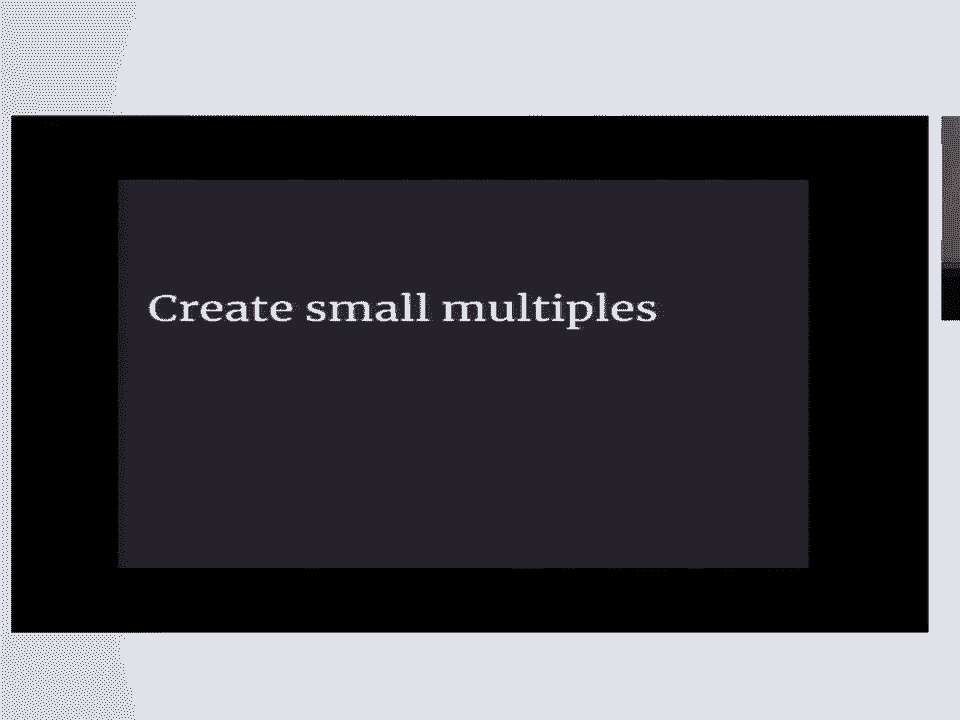

 So what is a small multiple？ Or what are small multiples？ Lots of small charts。

 similar to each other， that you look at at the same time。 Here's an example， three cities in Texas。

 with the wind direction at a 30 degrees and the wind speed， as a heat map。 And why small multiples？

 Because you can't compare things you can't see。 There's a couple of different ways。

 to think about small multiples。 The canonical one is with the same form and related data。

 Let's say that we're interested in the relationship， between wind direction and wind speed in Texas。

 and we have data from a few airports in Texas。 We could make a single chart like this。

 And we can learn something from that。 But I would argue that we would learn a lot more。

 by looking at all three of these cities separately。 Because we started to see， hey， what's coming？

 What do we see in all of them？ Wind coming from the south is pretty common， in all of these cities。

 We might say that there's something， funky in our data in El Paso and we're。

 going to understand more why we have a little bit of a gap， there。 And we can start saying， hey。

 in Austin， sometimes the wind comes from the north。 We're in Houston that's a little bit more。

 in northeast or maybe a little northwest。 We're in El Paso。

 We have this bump in the west that we don't see in the others。

 So start being able to see similarities and differences。

 Gives us a much richer picture about Texas as a whole， than just looking at Texas。

 And I would argue that this is actually， easier to interpret than the previous slide。

 I would also argue that we should create some multiples。

 where the data is actually the same in every graph， and the form is different。 And unfortunately。

 this is not really， a canonical thing to do。 So it isn't really built into a lot of our tools。

 Sometimes you have to work a little harder to get it。

 But hopefully we can change that going forward。

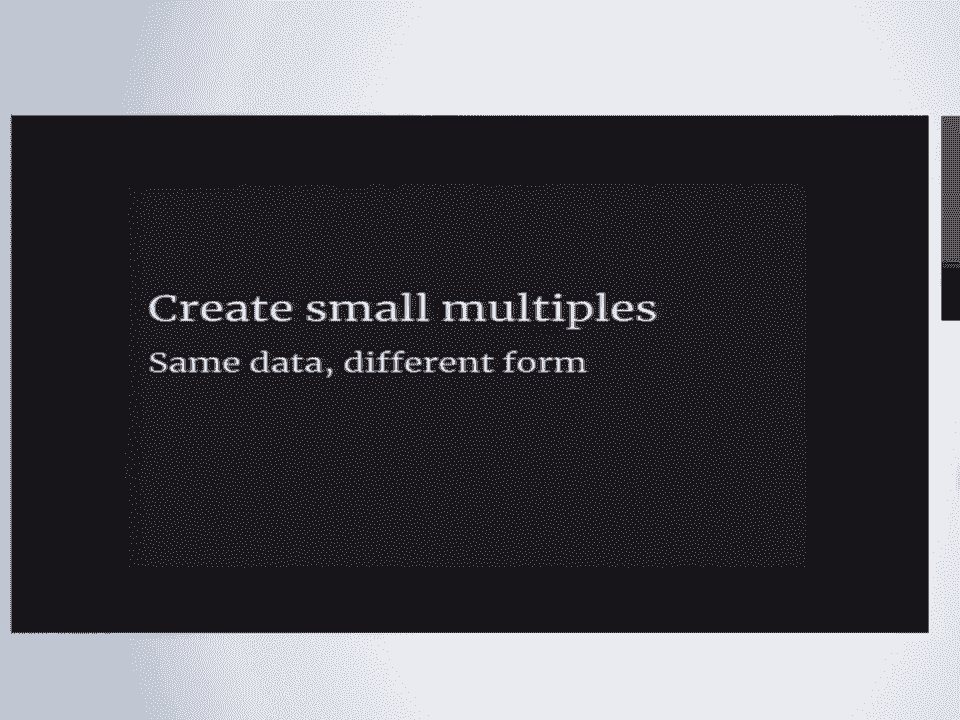

 So what I mean by that is， let's say， that we're interested in the relationship between wind。

 direction and temperature in Austin。 So perhaps we'll look at a chart like this。

 where we have temperature on the x-axis， wind direction， on the y-axis。 We make a scatter plot。

 And then we'll look at it and we're like， you know what？

 We have this is three years of data taken at 15-minute intervals。 We have tons of obfuscation。

 I have no idea if each of those points represents， a single data point or 100 data points or 1。

000 data points。 So I'll do the normal thing of let's throw in some opacity。

 to get a sense of density。 This is point one opacity。

 And I started to get a more robust idea of what's happening。

 the relationship between temperature and wind direction， in Austin。 But why stop there？

 What if I go more and why does look at one？ What if I look at three versions of data at once？

 The top one is full opacity， middle is point one， and bottom is point zero one。

 I'm getting different things out of these charts， in a way that I think is really complementary。

 I don't think there's one best chart。 And maybe when you're ready for publication。

 you'll choose the best one because you're， always constrained。 But in analysis。

 I actually want to see all three of them。 We can do this with histograms instead。

 Here's a histogram for Austin， Houston， and El Paso。 So small multiples， three different cities。

 that we look at at the same time。 We have temperature on the x-axis。

 We can kind of see different shapes here。 Houston is a little bit funny with those bumps。

 So if we'd actually looked at both the five degree， of bandwidth and the one degree of bandwidth。

 it might be more robust。 It might see more in our data。 And you can actually， in Houston。

 something is going on。 My best guess is this is some weird conversion。

 between Celsius numbers getting rounded， and getting converted to Fahrenheit。

 And there's just certain numbers， that you're never going to get if you do that。

 And for more on bandwidth and histograms， we're linked here to some more documentation。

 about the importance of varying your bandwidth。 Resources for this。 On Mat Potlid。

 there's subplots example， seaborn， facet grid， autere， trellis。 I don't know what plotly is。

 I haven't gotten to use plotly as much。

 I'm using color intentionally。 Point number two。 So I'm going to talk a little bit about how we process information。

 The basic visual attributes are actually， perceived without any conscious effort。

 This is called pre-attentive processing。 And this is done in parallel while attentive processing。

 is then serially and therefore much slower。 And I want to emphasize the effort here。

 And I'm actually using pre-attentive processing， to show you the effort by coloring it。

 yellow and making it big。 And this is the part that really matters。

 that I was talking earlier about。 We want to make things easy for ourselves。

 We want the important stuff to pop out at us。 We want to make it easy to see the things that are important。

 And using pre-attentive processes。

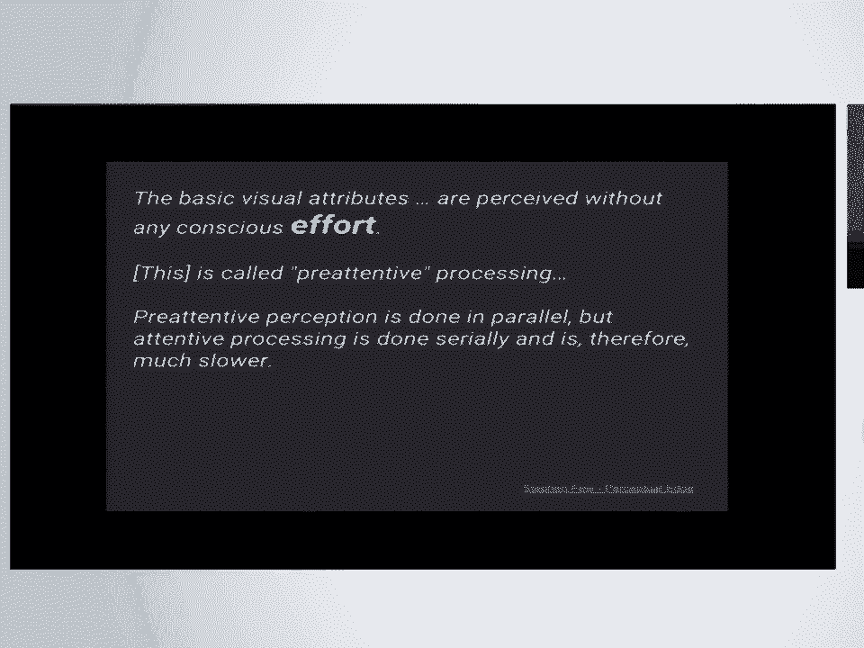

 can help us with that。 And a lot of our canonical visualization forms。

 are based on these pre-attentive processes。 Things like line length is the reason bar charts exist。

 And the reason why it's so important to have zeros， or a meaningful baseline for a bar chart。

 But the thing that I want to talk about today， is the pre-attentive processes that have to do with color。

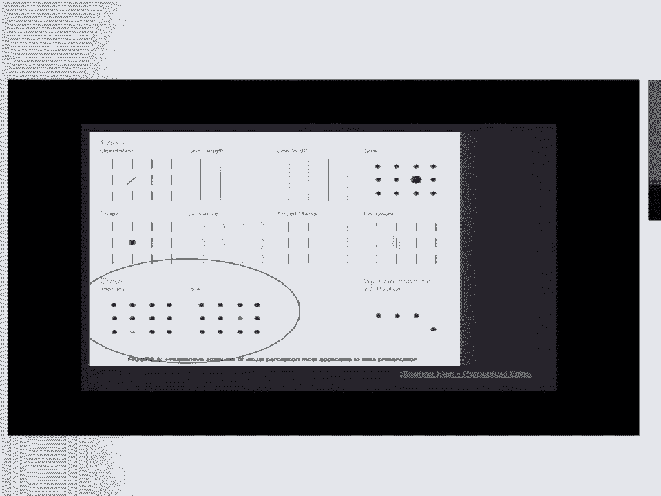

 These are intensity and hue。 And the best way to do this was with an example。 So I'm wondering。

 do you see any interesting patterns， in this set of numbers？ And I can ask a more specific question。

 How many sevens are there？ Does the answer just jump out at you？ Let's try the typical default。

 This is what-- if we have categories in our data， and we throw a color on the categories。

 this is the type of thing that we normally get。 Different colors for every category。 It's easy now。

 right？ But if this is a sequential data set， it's let's throw an ascending color map on there。

 We might start noticing some patterns here， but it's still hard to answer our question。

 Veritas is super popular， so we could use that。 But all I see are the nines。

 Maybe we're interested in extremes。 We could use a diverging color map from 4。5。

 And we might start noticing some interesting things， in our data set here。

 But we still haven't answered our question， and we have a really specific question。

 We want to know how many sevens there are。 So let's just do that。

 And now we can both see the sevens and where they are， in this data set。

 Maybe we're interested in the threes。 There's lots of them。 What about the ones？

 Did anybody notice that it is the loneliest number？ [LAUGHTER]。

 We can also use highlighting with small multiples， bringing it back to our previous point。

 Now we can look at 10 charts at once， with highlighting， focusing our attention。

 on different aspects of the data in each of these charts。 Or for a more general analysis。

 maybe a more general question。 We can look at different color schemes。

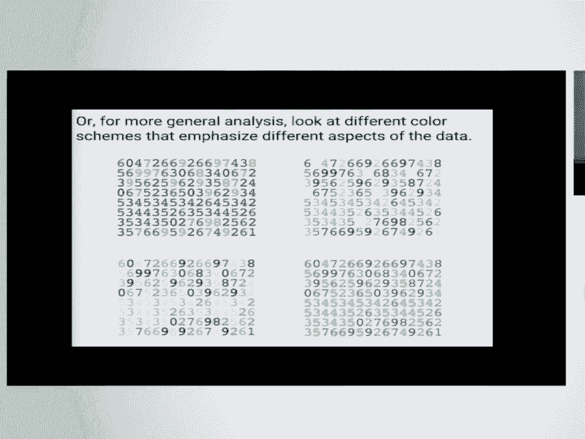

 that emphasize different aspects of the data， and maybe help us notice different things in each one。

 So let's bring this back to some data。 Let's use color intentionally。

 And the way we're going to do that， is we're going to make the mapping from the numeric domain。

 at the color range be meaningful for different definitions。

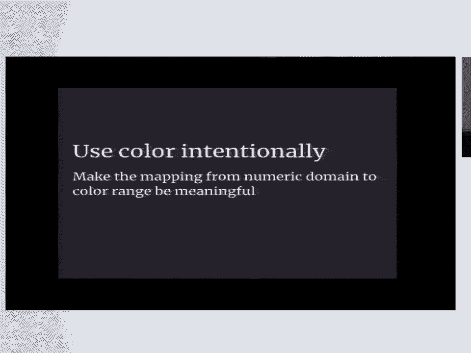

 of meaningful。 I'm going to look at unemployment data by county in the US。 This is， I think。

 circa around 2009。 So middle of the recession， or deep in the recession。

 And I'm using unemployment data because that's something。

 that I think that we can all really connect with in the US。 Obviously， some science has geographies。

 Also， we come across these types of things a lot when， we use heat maps。

 A really common technique in science， is to use a heat map with color on it。

 And so I'm kind of using this also as a proxy， for that whole world of applying color。

 Same thing with scatter plots that we， put color on scatter plots a lot of the time。

 So we have unemployment data by county in the US。 And we're doing the typical default mapping。

 The color range spans from-- it's actually from 0 to the max。 I didn't refresh the slide， sorry。

 From 0 to the max in Altair， this is the default。 And there's that one yellow county and that one green one。

 And maybe there's a little more green here， and a little more green here。

 maybe some more purple here。 But that's about all that jumps out at me。

 And if we look at the distribution， of unemployment rates by county in the data set。

 we're actually using half of our color range from 15%， to 30% for just 4。5% of our data。

 And maybe that's a good idea。 Maybe we want to do that。 But maybe we don't。

 We could choose a color range。 So a really blunt force way of doing this。

 is to change the min and the max to better match， the density of the data。 And to say。

 you know what？ Everything over 15%， that's just a lot of unemployment。 That's just rough。

 no matter how much it is。 Let's call it that yellow。 And everything under--， sorry。

 And everything under 2% will make that the purple。 And everything in between-- now we're。

 going to double the perceptual differentiation， we get between more than double it。

 between 2% and 15%， unemployment。 And if we compare these， I would argue。

 that we start seeing a lot more in that lower one。 We start going to ask more questions。

 But why stop there？ What if we flip the color scheme？ So I'm picking on Veritas a little bit today。

 Veritas is designed to be perceptually even。 And perceptually it is。

 You can tell the difference between the blues and the purples。

 You can tell the difference in the yellows and the greens。 But I don't think it's attentively even。

 I think you notice different things in the top chart， in the bottom chart。

 And the only difference-- the same exact data， same color scheme， same type of linear mapping。

 minus how we've dealt with the max and min's。 The only difference is which direction we're going。

 Are we going min to max or max to min？ And I think I notice different things。

 Different things capture my attention。 I can also try a different color scheme。 This is spectral。

 Do you notice the same things， different things， new things？ Obviously。

 a caveat that this is not a particularly， color-blind， color-confusion safe color map。

 So it won't work for some of your audience。 But perhaps diverging actually makes more sense。

 for this data set comparing to the median value。 Because we want to know what counties are worse than median。

 what counties are better than median， where are we doing better or worse？ So in this case。

 we put white in the middle of the median， purple on one end and dark orange on the other。

 And I think you notice different things here too。 Just a quick note that this creates very dark extreme ends。

 that start to look similar。 We could clamp to a mid-dark max just to prevent this。

 and flood everything above and below where I've set the end， points。

 I'm also using a log scale here for this one。 But why should the middle be 8。5% the median？

 Maybe it makes more sense to use what economists think。

 is the ideal unemployment rate for a healthy economy of 5。5%， which we see in the chart below。

 And yeah， there's a lot of that chart that's dark orange， but there's a lot of that country that。

 is really having a hard time。 And yet in the areas that are actually。

 where there are not enough jobs for the people， we see kind of in the upper Midwest here。

 and can ask different questions about that。 We could put in a hard cutoff to say。

 to highlight areas with greater than 10% unemployment， or hard cutoff at negative 6% or at 6%。

 Different mappings ask different questions of our data。

 The right color mapping depends on what question， you want to ask your data。

 The same way that the right parameters and algorithms。

 and ML and stats depends on what you want to ask your data。

 And my main goal here is just be intentional。 Choose something。 Lastly， many of our color maps are。

 critiqued for not being quantitatively even。 And I want to say that if that's what's really most important。

 in your data set， maybe you shouldn't， be using color as your major feature for mapping it。

 Because color doesn't convey quantitative information， that well。 It's very qualitative。

 So you can try a chart that relies on position rather than， color。 Obviously。

 then you have the problem of， well， where is that stuff happening if spatial organization matters。

 like a map or a heat map？ If you use an interactive something。

 that gives you interactivity like Altair or Plattley， or others。

 you can then kind of get the best of both worlds。 But you can look at things in a really quantitative space。

 and then interact and see where those things are happening， on the map as well。 A few resources。

 CM Ocean Color Skills， and SiViz Color， can help with this and be inspirational。

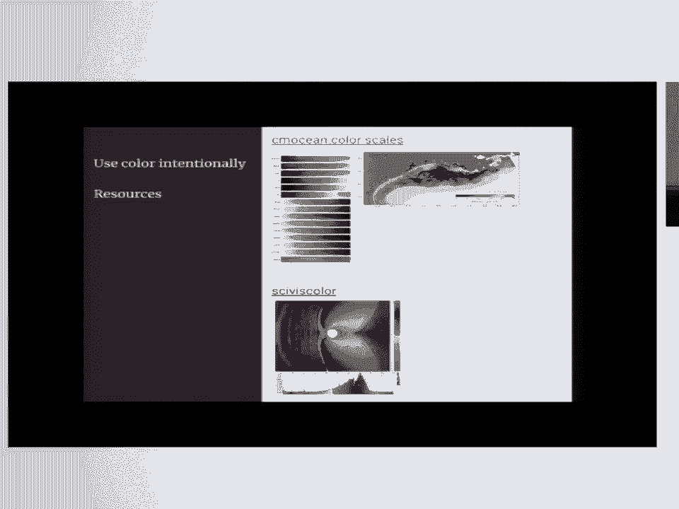

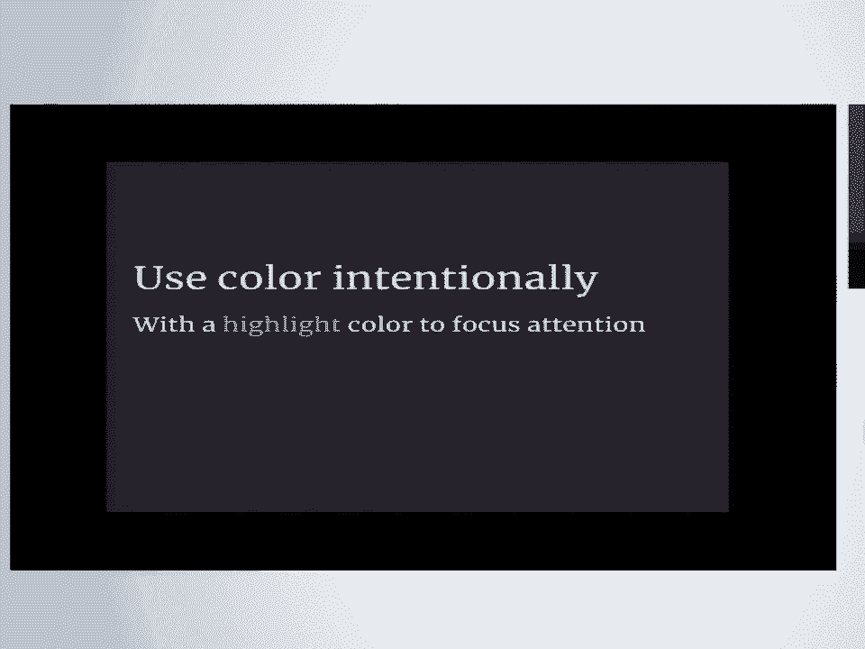

 We can also use a highlight color to focus attention。 Like we saw in this example。

 we can use that for scatter plots， for example， looking at all different types of movies。

 in the background。 Every single point is on every single one of those graphs。

 But we highlight different types of movies， and different graphs。

 We can kind of see that the dramas are all up here， and there aren't that many of them。

 versus the horror movies that have a lot done here。 We can also use interactivity with highlighting。

 as a really powerful combination， because you can save some space。

 but also be able to really get at kind of those details。 And we can combine this also。

 Now we can highlight on us。 More multiples， see our histogram， update， and get that highlighting。

 Each one of the bottom ones only shows that type of movie。

 And you can see how the highlighted region relates， to the density of the entire region。

 And scatter plots are just so important in science。

 So I think this technique's going to be really valuable， for not just movies。

 The last thing I want to talk about， is optimizing for your time， energy， and attention。

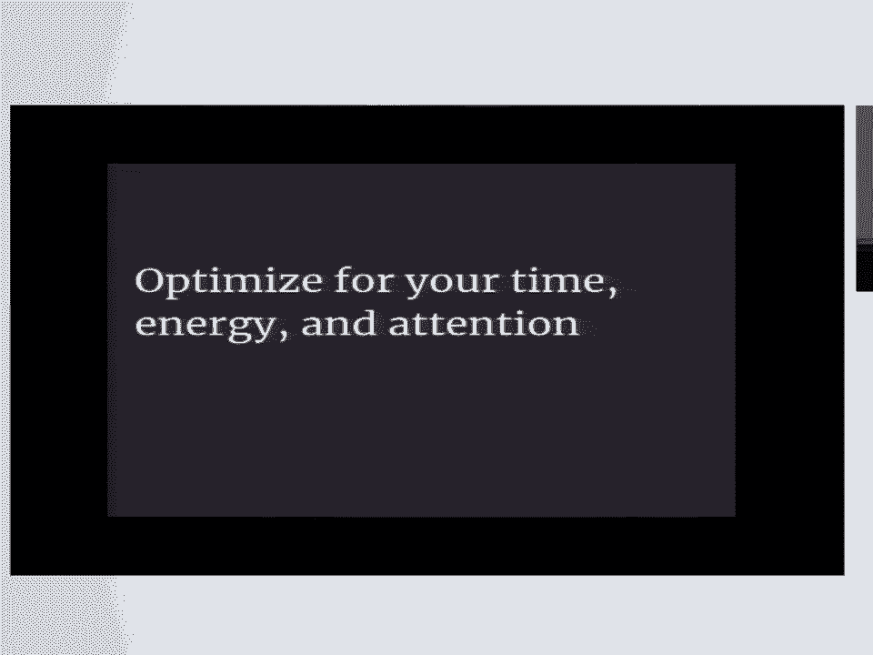

 I'm going to keep this section really brief， but I really want to make sure I mention it。

 because we often have data processing pipelines， processes that you run regularly。

 for similar types of data。 And this is a really fantastic place。

 to really invest in making choices about your visualization， because if you make the choice once。

 you get to reap the benefits over and over and over again。 We often want to know first， is it OK？

 Is it broken？ Did my sensors work？ Did my microscope work？ Did my cells all die？

 And is there anything interesting here？ Is there something that I should dig into more？

 Did I make a discovery？ And in these situations， I say that we should create， many charts。

 mostly boring， important stuff is obvious。 And I think mostly boring。

 I thought I was feeling like I'm going to be foggillity。 Like， oh man。

 there was nothing in that chart。 But if there was nothing in that chart。

 and meant that your data isn't broken， that is great。 [LAUGHTER]， And this is a quick case study。

 This is a collaboration with Google accelerated science， and Caltech。

 We're combining three different things， A， B， and C。 I'm looking for areas of interest， local min。

 max， and slope， changes。 I realize I'm being pretty vague。 But we took this chart。

 which was like not a bad chart。 But we had some issues with it。

 Our max values were more eye-catching than our min。

 It was really hard to see interesting in the mid-color， scale。

 And if we had an extreme value that was twice as large， as everything else， so just completely。

 wash out the color scale。 And often our super extreme values， especially on the max， side。

 just were not reliable。 They were more likely to have a problem in them。 So instead。

 we switched to small multiples。 So instead of one triangle， we now look at five triangles。

 We have an intentional color。 We also have a fallback for color confusions。

 We have a different color map we can use for people， that need that。

 And we optimize for seeing if something important quickly。 So these each have a different mapping。

 We have high to low， low to high。

 just within the first standard deviation， median to min， and max to median。 So in summary。

 if before I get kicked off， is a good or bad depends on your goals， context， and constraints。

 Please create small multiples。 Many related charts use color intentionally。

 Optimize your charts for your time， energy， attention。 And if you're a tool builder， I would love。

 to have this be easier。 Thank you very much。 And thank you to all of you。 [APPLAUSE]。

 Thanks so much。 That was really interesting。 I don't think the mic is--， OK， here we go。 Great。

 So we have some time for questions， and I'll try and bring the mic around since the room's。

 really crowded。 Try not to crush anyone。 Do we have any questions？ [LAUGHTER]， Hi。

 Thanks for the excellent talk， especially for the humor， and the content。 It was great。

 I wanted to know， since just speaking， to the tooling community developers。

 what are some of the tools that you would love， to see that's depth prints on Saturday？

 If there's something that you could ask for the immediate， attention for。

 Am I going to get booted out of the room， if I ask for GG Platt and Python？ [LAUGHTER]。

 And I think actually the second one， would be making it easier to manage color domains explicitly。

 and color domains and ranges and secondly， making it easier to facet by different visual elements。

 not， just by different categories。 And I really-- I mean， I should say。

 I really appreciate all the tool builders。 I use a lot of tools， and I appreciate all the work。

 that everybody's doing to make my life easier。 So this is a question more from the extreme value problem。

 that you were showing。 Sort of one solution， which people often go towards。

 is just take the log of the actual values and then plot it。

 Just trying to see what your opinion on those is， is that， do not go towards those techniques。

 because then there's also the explanation portion。 And then it's not explainable to everyone。

 or it's just that you prefer designing techniques more， which target that problem。

 I think that's a great question。 So the question， yeah， about going to log--。

 I think log makes sense。 It's great when the data is inherently in a log form。

 But if you're just trying to deal with the fact， that you sometimes every once in a while。

 your data usually ranges from 0 to 0。2， and everyone's mind get a 0。4 because there。

 was dust on your microscope， then I'd rather， deal with that more explicitly if most of the data actually。

 is in a linear range。 So I think-- and actually， I didn't talk about it today， but in my own work。

 I often do things， where maybe I'll set the color breakpoints based on the density， of the data。

 so I'll set them at specific percentiles。 So I'll intentionally make something that is not。

 perceptually even to be able to hopefully see differences， where the differences are most important。

 in the densest regions of the data。 Hi。 Thanks so much for that great talk。

 I agree with everything that you've said。 As a follow on， I mean， all day is in front of a computer。

 for most of us， and so visual fatigue is pretty common。 What are your suggestions or your takes on。

 like， what is optimal amount？ Because you really can go overboard， with hundreds of plots。

 But as you said， having small multiples of a similar plot， is always really useful。

 How do you balance that？ Really large computer screens now。 I have four， so yes。 No。

 I think that's a real question。 I definitely often have some scrolling。

 through lots of charts that I've made， and at some point get lost， so try。

 to remember which ones were the important ones， and kind of go through a process of making lots。

 and then culling， and then making more， and then culling it down。 And I would err on the side。

 I think in general， we still don't look at enough of our data。

 so I would generally err on the look at more。 And I think also just kind of in the place。

 of being more intentional， I guess， could also help of really trying to think about， like。

 what about my data？ Do I think is most important？ And can I make visual choices that match。

 that sense of importance？ And using something， I saw the plotly talk before here。

 I thought it was really cool how they're， lowering the bar to changing visual aspects of your data。

 So I think playing with those things， and trying to find a good space and trying to--。

 based on what you think is important， or what you're discovering is important， can kind of。

 that can hopefully help narrow your design， space a little bit， but make more charts。

 So in recommending to you the color， what would you suggest to avoid bias by the analyst。

 in creating colors and pushing the viewers to some direction， that the data may not be suggested？

 I come more from the place that our data is always， biased to begin with。 And I think that--。

 I very much believe in--， it's really important to be honest with the data。

 And I think that can mean--， I think we'll often take that as， like， oh， the do the default thing。

 But the default thing is not often--， is often not actually the most honest to what's in the data。

 So I think， like， go with integrity and do your best。 I mean。

 I think that's where peer review comes in， working with colleagues， trying different things。

 And there's actually some things around--， like， if you try eight different color schemes。

 or different color mappings， and you only notice in one of them。

 is that because you didn't notice it in the other ones？ Or is that because it's not there as much？

 And do more analysis with other techniques， and follow up with stats and do science。 Cool。

 That was really， really great。

 Thanks so much， there。 Thank you all so much。 [APPLAUSE]， [ Silence ]。

