# P50：SciPy 2018视频专辑 (P50. Inside the Cheeseshop - How Python Packaging Works _ SciPy - GalileoHua - BV1TE411n7Ny

 Hey， everybody。

 My name's Dustin。 Like I was just saying， I'm a member of the Python， packaging authority。

 I'm also the director of PROMFWORKS， which is the， software consultancy here in Austin， Texas。

 I'm an organizer of the PyTexas conference， if anyone's， been to PyTexas。

 It's going to happen again this year。 Dates you can be announced shortly。

 I'm also a member of the Python packaging working group， the Python packaging authority。

 like I said。 And I'm also a maintainer of a PyPI， the Python， package index。

 And I kind of had a hard time coming up with the title of， this talk。

 And it's not just because that naming things are hard， even， though naming things are hard。

 The reason I had a hard time coming up with the title of。

 this talk is because I knew that I wanted to talk about， Python packaging。

 But a lot of people have already given talks about Python， packaging。

 There was just a talk about Python packaging right before， me。 So so many people， in fact。

 have given talks that every time， I came up with the title for this talk， it kind of seemed。

 like someone had already done it。 So at first I thought， what is the core of Python packaging？

 I will call my talk Python packaging， getting the code you。

 wrote to the people that you wanted using the same language， that you wrote it in。

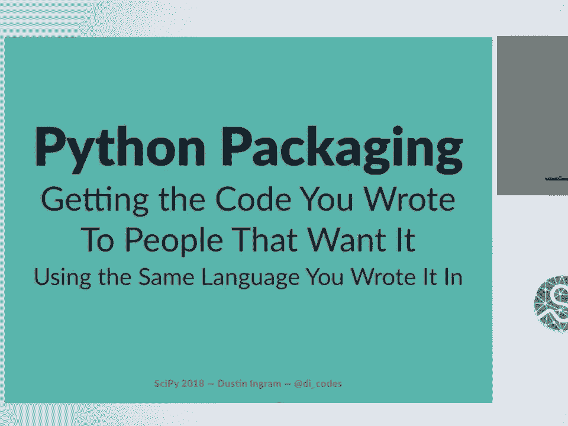

 This talk's already been done。 And that title's pretty long。

 So maybe I should do something a little more clickbaity。

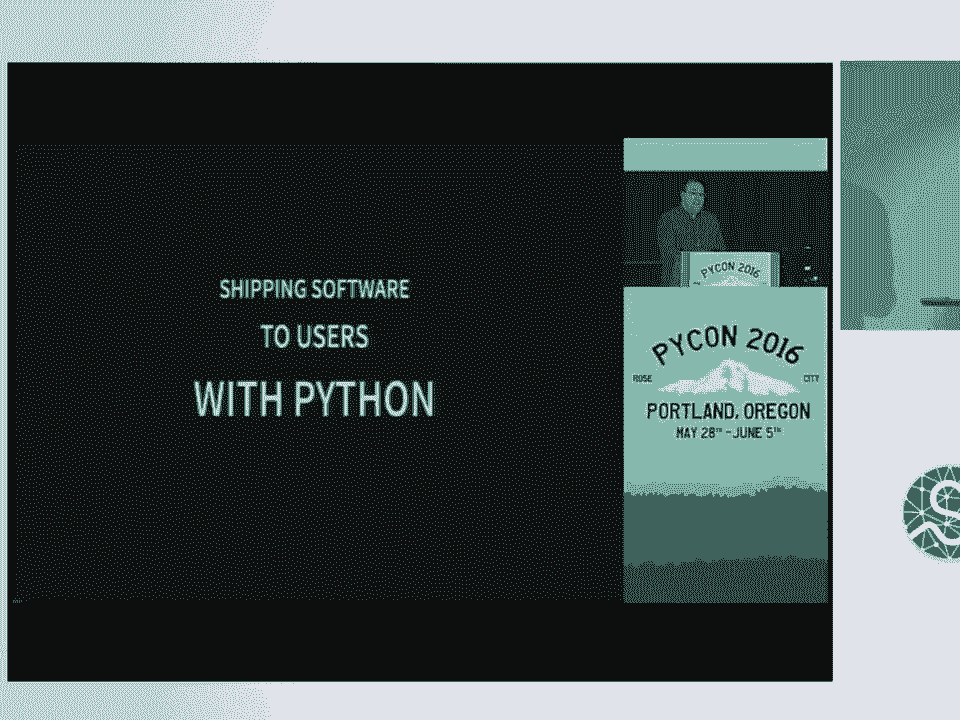

 like Python packaging in just five easy steps。

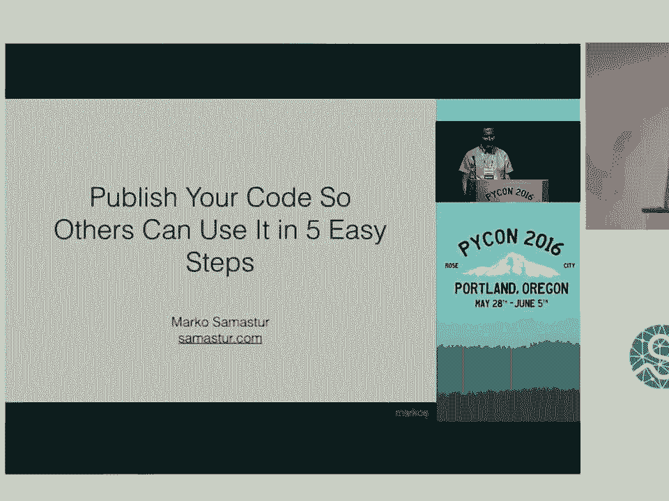

 This has been done。 I thought maybe I could one up his talk。

 I could do Python packaging in just maybe four easy steps。

 He did that as well。 So maybe I should be encouraging about Python packaging。

 Python packaging， it's relatively painless now。 Go ahead and use it。

 This has been done。 But relatively painless is still kind of painful。

 So maybe I should try to instill confidence that Python， packaging is improving。

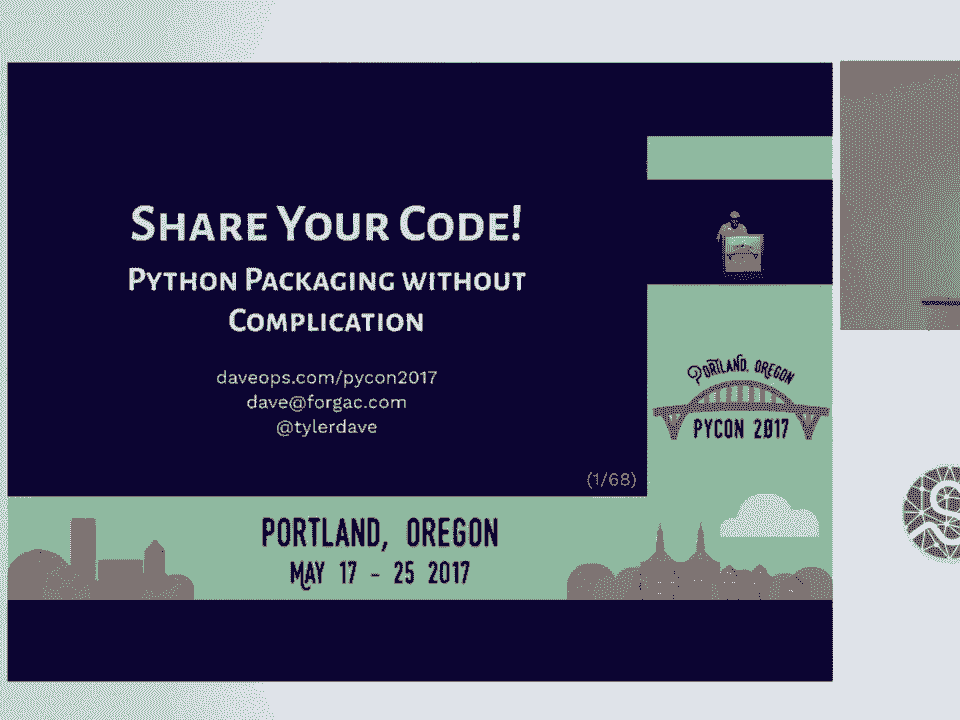

 So I'll call it Python packaging。 We're still trying to make this better。

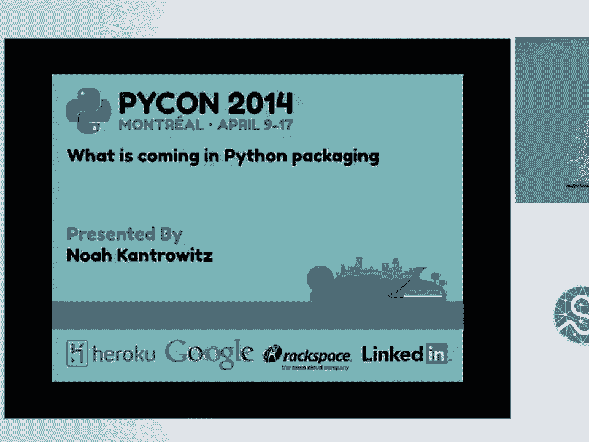

 This has been done。 All right， maybe I should take a stronger approach。 Python packaging。

 let's just throw it all away and start。

 over from scratch。 This talk's been given。 Maybe the problem is that Python packaging has changed too much。

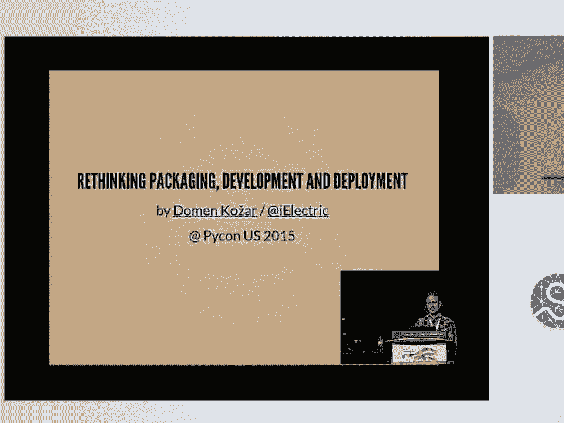

 So I'll say Python packaging， let me just get you up to speed。

 with everything that's changed since the last time this talk's， been given。

 Then I figured maybe not everyone actually cares about， everything in packaging。 I'll give a talk。

 Python packaging， there's a lot of stuff here you might not。

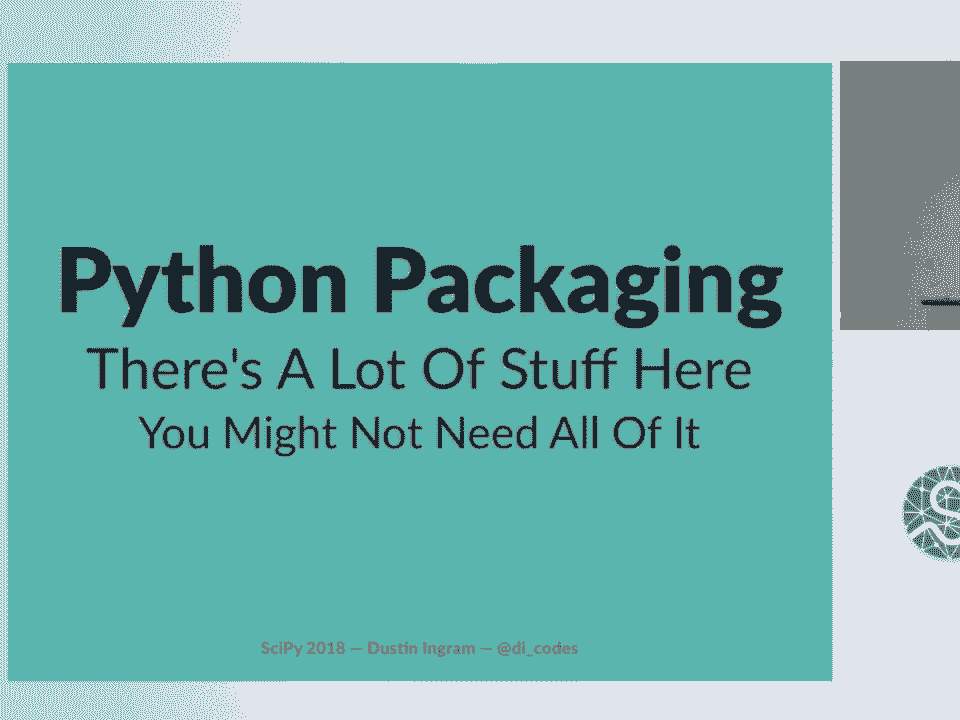

 need all of it。 This talk's been given。

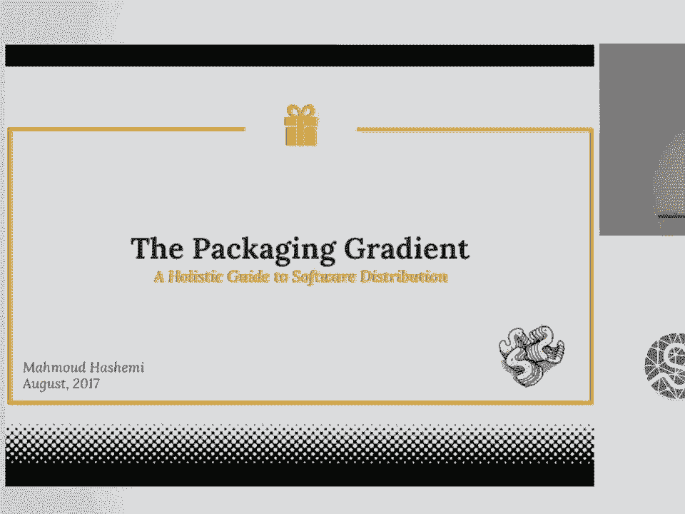

 So maybe I should keep it simple。 Python packaging in the simplest terms possible for anyone。

 that cares。 No， this talk has been given as well。 All right， maybe even simpler。 Python packaging。

 so easy a caveman could do it。 This talk exists。 All right。

 I'm really starting to run out of options at this， point。

 So maybe I should try to stick to something a little closer， to my personal experience。

 So how about hello？ I'm a pipi maintainer。 At the very least。

 I should be able to tell you how to use， pipi， all right？ No， this talk already exists as well。

 All right， one last-stitch effort。 I'll do Python packaging， but I'll make it Indiana Jones， themed。

 and I'll do it in French。 There's no way this has been done before， right？ No。 OK。

 so it really seems like everything that could have。

 been said about Python packaging has already been said。 So let's just wrap this up。

 I'll give you links to those talks so you can go watch them， on YouTube。 The end。 No。 [APPLAUSE]。

 So in the end， I picked this title。 Inside the cheese shop， how Python packaging works， which。

 is a really awful title for a number of reasons。 First of all， it's got an obscure reference。

 to something that makes no sense。 Why am I talking about a cheese shop？

 I don't actually know anything about cheese。 The second is Python packaging is an incredibly broad and。

 complex subject。 Trying to explain how it works is perhaps like kind of a lost。

 cause or a fool's errand。 And third， historically， I'm making the assumption that。

 Python packaging actually works， which has historically been， the biggest complaint about the topic。

 But here's the thing。 I actually think that Python packaging works pretty great。

 And we've actually really just gotten used to how good we， have it now。 So I really。

 truly do want to do some packaging， archaeology with you all。

 And I want to talk about the evolution of packaging。

 through the years to provide some context for why things are。

 the way they are now and about how at each step we had a new。

 problem to solve and a new solution for that problem， which， we got a new problem on and on。

 So let's go back in time。 Back in time when Python was brand new， this is Gito's。

 release message for the very first release of Python。

 Back into a time when everything was new and everything。

 that we're used to today just didn't exist at all。 Back to the time when there was just Python。

 So pretty much as soon as there was Python， there was， something written in Python。

 And let's pretend you're the author of this， totally awesome library。 Nice job。

 But really at the moment， this code is only useful to you。 Right？

 So our first problem is how do you get this code to users？

 And this is really the fundamental problem of packaging， in general。 How do you get code to users？

 Maybe you talk to your friends and you say， hey， I have， this totally awesome library。

 Then you have to get it to them。 So maybe you could email it to someone every time you found。

 a new person at a conference or something that wanted to， use it。

 But obviously that would get pretty quickly become painful。

 And you could put it up on your website somewhere with a， link to download it。

 And this would be nice because you could add some， like documentation。

 but how will people find it if they want it？ Python was first released in 1991。

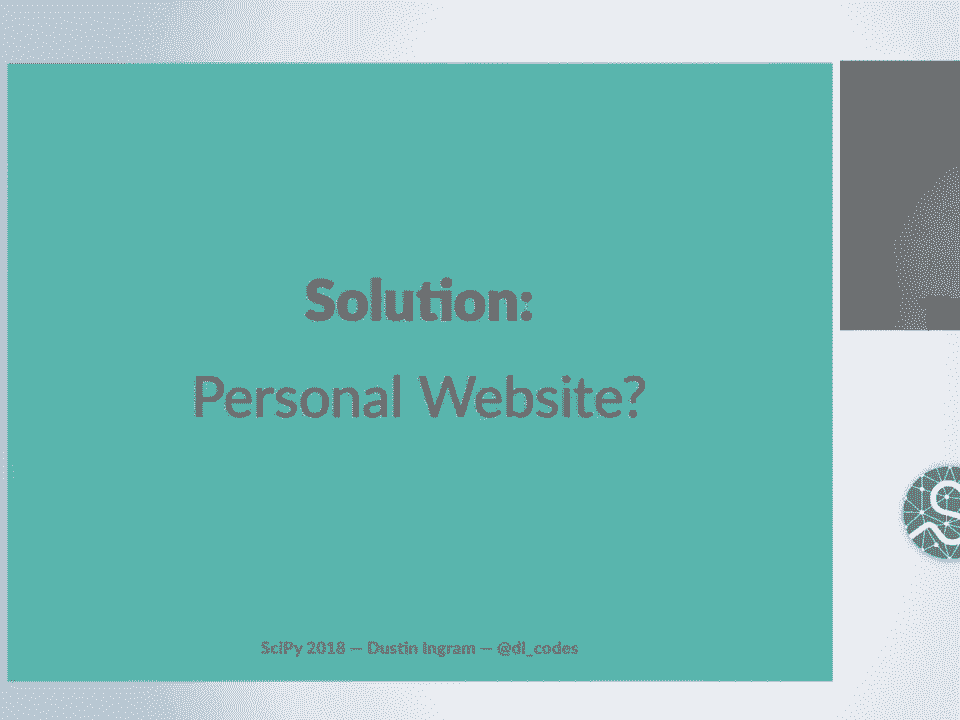

 Google wouldn't be around for another six years。 So this leads us to a new problem。

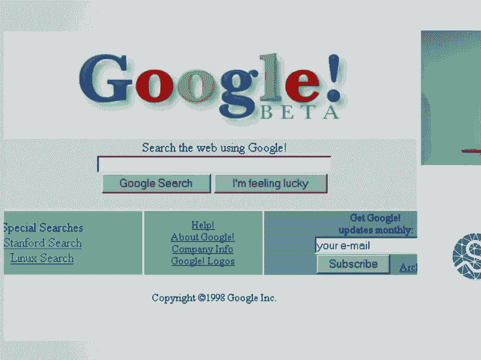

 How do I find Python code？ So what we need is a place where people can go to find。

 interesting Python code。 Some sort of like index for Python packages。

 I think that really will call it the vaults of Parnassus。 So this is the vaults of Parnassus。

 This is the very first index for Python software。 And it's literally an index。

 It just linked to something on someone else's website。

 And I hesitate to use the word package here because at。

 this point what a package is in terms of Python is really， loosely defined。

 So the end result is just whatever people felt like putting， on their website。

 there was no standard or， enforcement of quality or quality level or， anything like that。

 And that leads to a new problem。 At the time every project came with its own special little。

 way to build it。 Maybe there was a Python script。 Maybe there was a make file。

 Maybe it was just like instructions and a text file。

 And this is really painful for users to have to say to， every thing they want to install。

 how do I build this？ So the solution at the 1998 International Python， Conference。

 which would become Python， a little project， got started called Dist Details for distribution。

 utilities。 And this was included in the standard library in Python 1。6， in 2000。

 And this gave us kind of a familiar incantation。 Python set up。py， blah， blah， blah。

 which is probably， really familiar， folks。 And I think some people have actually run this without。

 really thinking about what is going on here。 It's just a Python script， right？ With a little magic。

 thanks to the standard library。 And the idea was why bother to write a new domain。

 specific language or add a new config file when you already。

 have the full power of Python at your disposal。 So we'll just write more Python。

 And we'll see why that becomes a problem in a second。

 So it's really originally designed to just be a build。

 tool to replace all those make files and things。 And the goal was to make something in a consistent way。

 that could then be installed。 This utils also gave us another solution。

 It gave us a way to package up source code for sharing。 And this is a source distribution。

 It's a compressed archive like a zip or a tarball or et cetera。 And this is also called an estist。

 or I like to say it， like a snake-stist。 And this command might be a little more familiar。

 Python set up to pi estist。 But it's quickly pretty obvious that sometimes source。

 distributions weren't going to cut it。 So sometimes source distributions are fine if you have pure Python。

 But sometimes you have so much to do during the build step。

 like possibly compiling C or maybe even 4-tran code。

 that it becomes costly to do this every time you want， to install some dependency。

 And it feels really wasteful if you're， doing it over and over again for the same architecture。

 in different places。 So the solution to this is something called built distributions。

 Instead of a source that's compiled， you take a distribution that's been pre-built。

 for your architecture。 And you just sort of literally copy and paste。

 You drop it in place and there's no build step necessary。

 This is also called a B-diss for built distribution。 And you'd build it like this。

 Python set up to pi B-diss。 There's other ways to sort of do the same thing with the wheel。

 So this too still is pretty great。 And having a consistent way to just build things。

 was immensely helpful。 But it punted on solving two really key problems。

 First problem was how can I do packaging？ And this is just the generic idea of packaging。

 By this I mean， how do I get the user to the state， right before they run the build command？

 How do I get everything they need in place， before they can build？ But it's not put together yet。

 So the original authors of Distutils and Python， they saw this as a solved problem。 In their minds。

 all the platforms， that they wanted to put Python on already， had system level package managers。

 I'm talking about Linux package managers， like RPM or something like that。

 They couldn't imagine developers would ever， want to do development on platforms that。

 didn't have a package manager。 Well， guess what？ Turns out developers love developing。

 on platforms that don't have official package managers， like Mac OS or Windows。

 And so there's another problem with a solution。 Maybe my platform doesn't even have packaging。

 Or maybe your platform does have a package manager， but the packages in a package manager。

 usually lag behind releases because they need， to be built for that particular distribution。

 So once the author has published the code in some way。

 the platform maintainers need to take that package， build it up。

 and put it for the specific platform， put it in that specific index for that platform。

 And as a user， you want that fresh release right now。 You don't want to have to wait for it。

 So the solution was to create a package index that， is just for Python。

 And we call this the Python package index。 This is what it looked like in October of 2002。

 PIPI gave us an official consistent and centralized place， to put Python software。

 And I say put because it still is just linking， to externally hosted files。

 But it has a little more structure。 And like I said， we call this PIPI。 You can say it with me。

 PIPI。 Not PIPI， because that's something totally else。 Like I said， naming things is really hard。

 So PIPI is also sometimes called the cheese shop。 And the cheese shop is a reference to this Monte Python。

 skit， where a man goes in a cheese shop which， has no cheese for sale。

 And the joke is that when PIPI was first created， there was nothing in it。

 So it's not even really appropriate to call it that anymore。

 given the hundreds of thousands of packages it has。 The other problem that the Distutils authors。

 punted on was being able to specify dependencies。 There was no way to say that a given package depended。

 on some other package being installed as well。 And this makes sense。

 They didn't have a centralized index to point to， so they didn't have a way to do this。

 But now that we have a package index， it's possible to not only point to some version of a package。

 somewhere， but it's also possible to distribute something， that does more than Distutils。

 which again was， the standard in the standard library， and came with your Python installation。

 So the solution in this problem is setup tools。 Setup tools essentially monkey patch。

 Distutils in the standard library。 And there are some advantages here。

 It's quicker to ship code to users。 They don't have to upgrade their entire Python distribution。

 to get new distribution utilities。 And there are some disadvantages as well， though， unfortunately。

 Monkey patching is never really a great idea， especially。

 monkey patching things in the standard library。 But once we had setup tools。

 all sorts of other things， could come along with it。 So now that we can specify dependencies easily。

 how can we make them easier to install？ On the problems users are having。

 installing is just too hard。 The solution of this was a tool called EasyInstall。 And this did。

 in theory， make it easier for users， to install various projects。 And when paired with setup tools。

 this would allow users to install dependencies， for a project directly from PyPI。

 And it introduced a new type of build distribution， because the existing ones weren't cutting it。

 This was called the egg distribution。 There are other types of eggs， too。

 but the build distribution type is the important egg， that everyone knows。

 And an egg is just a zip file with some metadata， could contain Python code as well。

 The name comes from Python， Python's lay eggs。 But EasyInstall gave us a whole new set of problems。

 First of all， EasyInstall was a really good installing。 It was so easy。

 It couldn't uninstall packages。 It couldn't tell you what you had installed， on your system。

 And it also mucked around with sys。path， which is generally not a great idea。

 So the solution was a new tool called PyInstall。 And you probably have never heard of PyInstall。

 And this is because pretty much as soon as PyInstall， was created， there was a new problem。

 The name PyInstall is too long。 And typing， "PineInstall install" seems redundant。 Like I said。

 naming things is hard。 So solution was to rename PyInstall to PIP。

 And this happens almost immediately。 And the name PIP isn't an obscure reference。

 It stands for PIP installs packages。 So we swapped redundancy for a recursive back-room。

 And while EasyInstall is still around， PIP soon becomes the preferred installer。

 PIP did a kind of funny thing。 PIP ignores eggs entirely。

 And it only installed from source distributions。 It saw all the problems that EasyInstall was having with eggs。

 and said， we want nothing to do with that。 So at this point， people are using PIP。

 to install dependencies for applications， not for installing dependencies for other packages。

 Essentially， for an application， there， is no top-level project to install。

 So if we want to specify dependencies of an application， what do we do？

 The solution is PIP introduced a file called requirements。txt。

 And this includes pending specific versions， of dependencies at the top-level across your application。

 And this gives us the familiar PIP install。shr， requirements。txt。

 And this allows for semi-reproducible environments。 So now everyone's happily PIP installing。

 Everyone's happily PIP installing。 Things are going great。 But we have a new problem。

 The problem is installing from PIP is kind of slow。 So remember， at this point。

 PIP is still an index。 So when PIP has to install something。

 it has to go crawl PIP and then go to a bunch of other domains。

 And those other domains might not be performant。 The files might not even be there anymore。

 And for that matter， PIP might not be performant either。

 So one of the problems here is that this requires users。

 to trust all these third-party domains where， packages were hosted。 As a package maintainer。

 I don't want， to have to trust a whole plethora of third-party domains。

 What happens when I forget to re-register my domain， and my package is hosted on that domain。

 An attacker could go and register it， put malicious code in its place。

 my users could go and install it， no problem。 So the users are so used to pip installing things。

 that they-- and connecting to random domains all over the place。

 that they'll never actually even notice that this is happening。

 So the solution is problems that PyPI decides。 PyPI will begin hosting releases。

 This was specified in PEP 438。 And now PyPI literally hosts distributions。

 All the files are on PyPI itself， no more third-party domains。 Around this time。

 we start to notice kind of a new problem。 Scientific Python is now a thing。 So somehow。

 we kind of didn't see this coming。 And using Python for scientific computing or data science。

 brings along this whole new set of challenges， that disutils and things weren't expecting。

 One sub problem here is that disutils is just simply， not up to the tax。

 The original authors and contributors to the tools， that you know and love today， they。

 spend a lot of time trying to make disutils work for things。

 that it was never actually designed to handle。 Like compiling extensions that needed for， try。

 and compile libraries。 Another problem is build environments。 The main problem here was this utils。

 has a total lack of a way to define a build environment。

 Everything that needs to be in place before you， can build a project。 Disutils and setup。

py make a lot of assumptions， about what user needs to build and install package。

 They basically are just only thinking， yes， you need Python。 That should be good enough， maybe GCC。

 And disutils doesn't provide a good framework， for modifying these assumptions either。

 If you suddenly decide you need to specify a build environment， it doesn't give you a way to do it。

 Another problem is scientific Python， I need pre-built binaries。

 It's really painful to compile things from source。 And again， at this point。

 we had gotten rid of eggs。 So there was no way to distribute built distributions。

 So if you can nail down an ABI， it， makes far more sense to build at once， distribute the binary。

 But yeah， like I said， got rid of eggs。 No binary distributions either。 The last problem is--。

 or second， last problem。 Maybe you need more than Python。 Maybe you need R， LLVM， and HDFI， MKL。

 These are fundamentally unmanageable by any tool， that is just focused on Python。

 These are all things outside of the Python ecosystem， but inside the scientific computing ecosystem。

 The last problem is maybe you don't even have Python。 Maybe Python is not installed on your system。

 So all of these things are outside the scope of the Python， packaging authority and everyone that。

 had been working on these projects up until this point， which。

 kind of just assume that you have Python or you really just， want to do Python and maybe some C。

 So the solution to this problem is Anaconda and Conda。 Anaconda is， as I'm sure most of you， know。

 a distribution of over 1，000 open source software， packages。

 Conda is a Python agnostic packaging tool installer。 You can install Python things with it。

 You can install non-Python things with it。 Installing Anaconda gives you both Python and non-Python。

 tools that you need all in one shot。 And it satisfies a lot of these use cases。

 including providing a way to ship binary distributions。 Now we have a new problem。

 We need built distributions again。 Back in the regular Python ecosystem。

 we're getting a little jealous of all these binary distributions。

 that the scientific Python community is shipping。 So it turns out we need these and it's still a problem。

 but we don't want eggs。 Eggs are still really poorly defined。

 And file name conventions are not enough to capture all。

 of the possible platforms that an egg could be built for。

 And they've been given a really bad wrap as well。 So the solution is the wheel distribution。

 And this is just another built distribution like eggs。 But it's also just a zip file。

 But most importantly， it has a specification。 There's PEP4 27 that specifies the wheel package format。

 And it has also had the ability to learn from all。

 of the mistakes easy install and egg distribution， was able to make。

 It's the name came from a wheel of cheese。 You put wheels in a cheese shop。

 I really like to think that the authors of the spec really， got the name right， actually。

 because in addition， nobody can actually say they're going to reinvent the wheel。 So at this point。

 a lot of people， are depending on PIPI， we start to become a little more focused。

 on making sure that it's secure。 And we have problems。 PIPI is starting to show its age。

 So this is PIPI in 2007， when it's about four years old。

 And here it is about a month and a half ago。 But these images side by side， this。

 is 10 years in between these two images。 It's kind of like one of those spot， the different schemes。

 right？ So it's not really fair to visually compare PIPI in 2007， with PIPI in 2018。

 One thing that you might not see from this graph， is that the number of packages went from less than 3。

000， to more than 130，000。 In that time， PIPI went from a place to get Python packages。

 to the place to get Python packages， which， included lots of issues with PIPI being down or having。

 outages。 And there were a lot of things that， had to happen behind the scenes that PIPI could continue。

 to work。 The other thing is that by its very nature。

 PIPI predates almost all the packages that exist on it， including all the web frameworks。

 testing frameworks， that you're familiar with。 So it's 15 years old。 It has pretty much no tests。

 Doesn't use a modern web framework。 To run it locally in development。

 you have to go and comment out huge chunks of it。

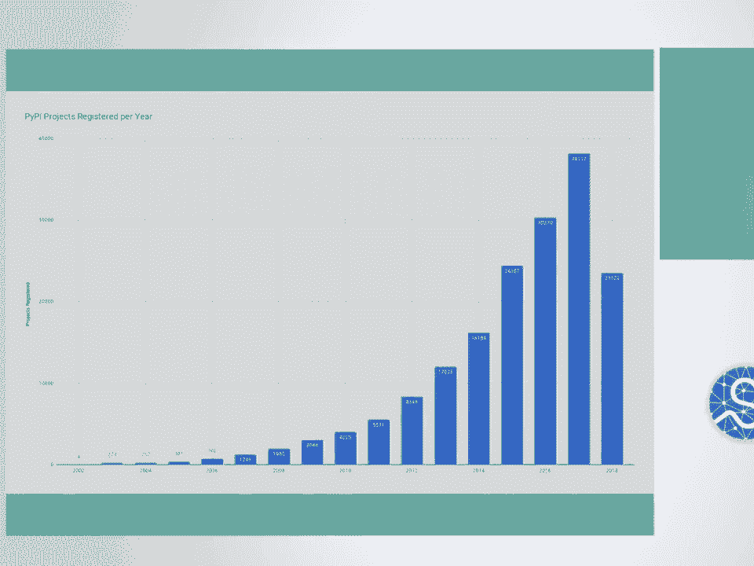

 So what should we do？ Solution， maybe we should rewrite PIPI from scratch。 So normally。

 if you ask me if a full stack rewrite， of a core piece of infrastructure。

 dependent on by hundreds of thousands of users， would ever succeed？ I would tell you no。

 But I don't know if anyone noticed， but this happened。 We got a new PIPI。

 This is also called Warehouse， Warehouse， as in a place to put packages。

 This is a project that started more or less in 2011， and had a number of goals。

 including HTTPS everywhere， using current best practices in modern web framework and tests。

 And it officially became PIPI in April。

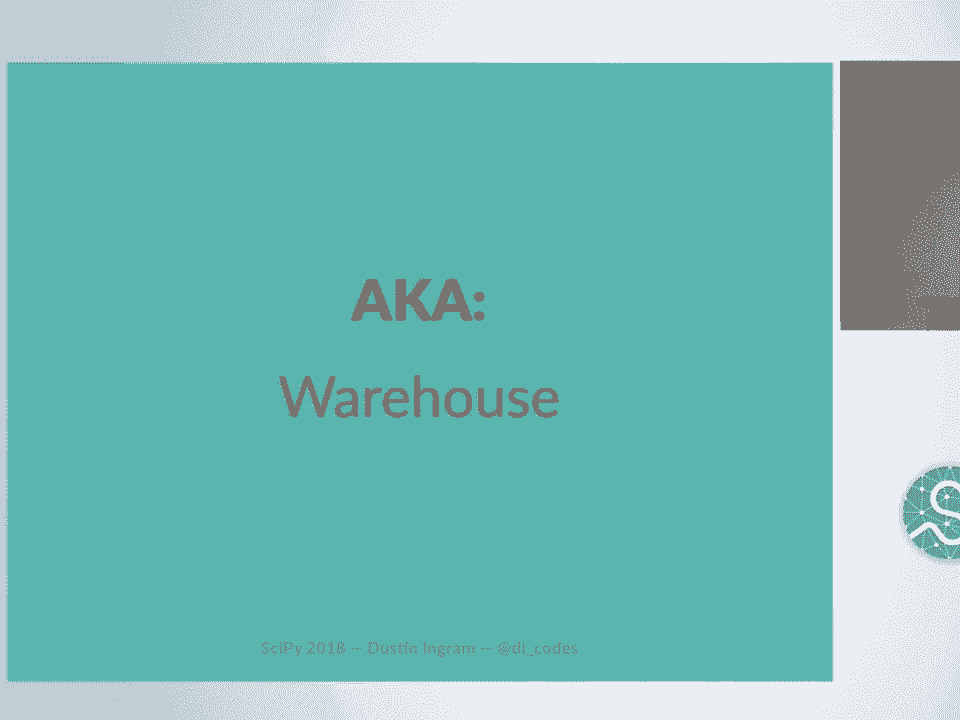

 And I have to say this was a really tremendous undertaking。

 in order to absolutely-- it would have absolutely not， been possible to have been completed。

 in any reasonable amount of time without support， from Mozilla's software foundation。

 All right， so that's it， right？ We launched PIPI。 We solved all the problems。 Good job。 No。

 We still have current problems。 But this is the very nature of software， right？

 Once we build the new shiny thing， we start to realize what it can do， or what the need actually is。

 So one problem we have is packaging is still kind of hard， especially if you're new to it all。

 There are a lot of different tools， and a lot of things you've never heard of， maybe， until today。

 Solution to this problem is the Python packaging guide。

 This is a really carefully crafted and well-maintained guide， to Python packaging。

 And it should walk you through a lot of the steps， for building and distributing Python code。

 Another solution is a sample project。 This is a skeleton project for your Python package。

 It represents best practices for the simplest possible Python， package。

 Another solution is just general care and maintenance。 In general。

 I think these more modern projects， are more well-specified， and they are also easier to maintain。

 And in addition， there is a serious focus， on making these accessible to newcomers。 In fact。

 I would say that we actually have a new problem now。 Packaging is kind of maybe a little too easy。

 I could have called this talk， Python packaging， so easy a spammer could do it。

 Having packaging be hard has actually， had some unintended benefits， namely。

 that folks who aren't truly invested in the community， can't figure out how to use it。

 And unfortunately， this also excludes a lot of people， that don't have malicious intent。

 So while lowering that barrier as a priority， it does produce some new problems， like spam on pi。

 pi， typo squatting， et cetera。 And there's another problem that's， kind of common these days。

 One problem is reproducible environments。 So requirements。txt was a great step。

 towards creating a reproducible environment。 We can use it to specify exactly the versions。

 and the hashes of any dependency for PIP to install。 However， creating a maintain this file。

 can be really challenging。 And we have maybe sometimes multiple requirements， files for deploying。

 testing， documentation， et cetera。 So the solution to this is a new file called pip file。lock。

 This is a single human editable file， and a single generated file with fully deterministic。

 dependencies， which can be shared across multiple dependency， installing tools。

 So if you're coming from another community， this might feel like gemfile。lock or yarn。lock。

 et cetera。 Another problem that we're working actively on right now， is that because setup。

py is just a Python script， you can put arbitrary code instead of the pi。

 And so there's no way to truly predict， what dependencies a package will have without actually。

 going and running it。 And I see questions about this so often that actually。

 read a blog post， why PIP doesn't know your project dependencies。

 The answer is you can do anything you want in a setup。py， file。

 And this makes it really hard to reason about source distributions。

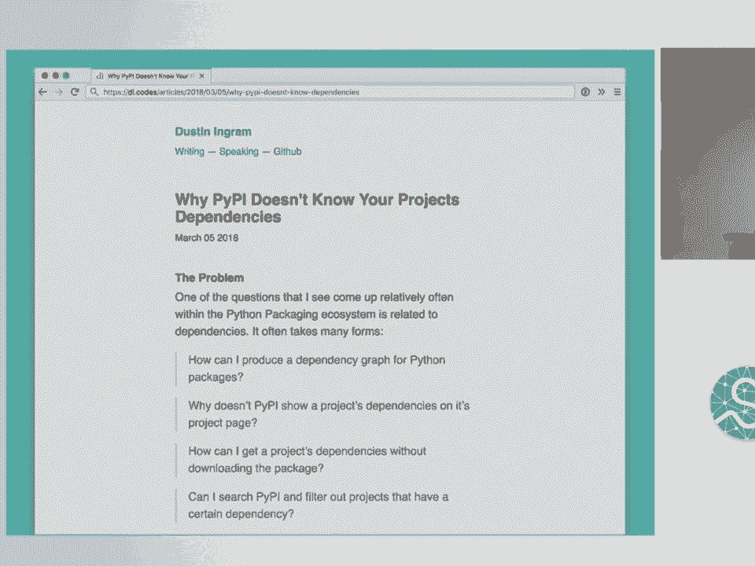

 And there's a digital problem with setup。py as well。

 There's this DistyTills setup tool that's danced。 Extending and maintaining them is really difficult。

 DistyTills because it's in the standard library。 And setup tools because it's old and it's a big ball of mud。

 So while there do exist various solutions to the above problems， they're really hard to implement。

 and they're even harder to maintain。 And also it's very difficult to use anything else。

 They are essentially the de facto standard interface， for building Python projects。

 And changing it kind of becomes this chicken and egg problem。

 The solution to this problem is PIP 517 and 518。 PIP 517 provides a way to specify a build system。

 independent format for search trees。 And 518 adds the ability to specify build system。

 requirements for Python projects。 So this produces a file that allows us to use a file called。

 pyproject。toml， which is a step away， from DistyTills setup tools entirely。

 It allows users to specify their own build requirements， for their project。

 which can then be installed prior to building。 And these requirements couldn't be setup tools。

 Or they could be something else entirely。 If you just saw the talk before， the stuffs talk。

 it could be something like scikit build。 All right。

 That sounds like a lot of problems you might say。 And also consider that unlike a lot of other packaging。

 environments， with only a few small exceptions， Python， packaging is entirely volunteer driven。

 So maybe you would like to help。 Both PyPI and PIP have good first issues， label in their trackers。

 So if you wanted to become a contributor today， you can do it。

 And there's a lot of folks that are ready and able to help， mentor you through that process。

 I told you how to help us。 But here's how we could help you also。 If you're having problems。

 you can， do the following in order from how quickly you need your problem。

 solved from quick to might take a while。 So like I said， the Python packaging guide。

 is a really invaluable tool。 There are issue trackers for each of the individual tools。

 you might encounter in the ecosystem。 The maintainers are generally pretty responsive。

 There's a hashtag PIPA free note channel， that's open to anyone to chat about problems or issues。

 with Python tools。 And there's also a general purpose GitHub repository。

 the packaging problems repository， where you can file an issue about large， bigger problems。

 with the ecosystem， try to drive changes forwards。 You can also talk to me。

 I'm really happy to help。 I'm DI on GitHub， DI Codes on Twitter， and you can email me di@python。org。

 And I love talking to users。 So to summarize real quick， packaging isn't bad。

 There are always going to be problems， that need to be solved here。

 We've made really gradual changes over a period of time。 And each change has been a response。

 to an evolving need。 Comparatively， we used to have it really bad。

 And we might have actually just forgotten or just not， known how hard it used to be。

 So the next time that you are frustrated with Python， packaging， imagine a world with no PIP。

 no PIPI， no Kanda。 And consider making a pull request。 Thanks。 [APPLAUSE]， Thank you， Dustin。

 One minute for maybe one short question。 Is the next speaker here in the room？

 I'll also be outside in the hallway， if you want to chat。

 So that I would like to see the next speaker come up， so that setup can start。 OK， so you。

 All right。 Is there one question？ There you are。 Anthony， go on。 Hi， I'm Anthony Scopat。

 So if I was an enterprising developer， and I wanted to remove and replace packaged resources。

 from the Earth， how would one go about doing that？

 I think you would be able to join a small group of people， to have the same plan。

 I think that's something within-- at least within setup， tools。

 there is sort of a plan to do that work now。 So I could put you in touch with folks。

 that are interested in that。 That would be great。 Thanks。 Cool。 Like I said。

 I'll be out in the hallway。

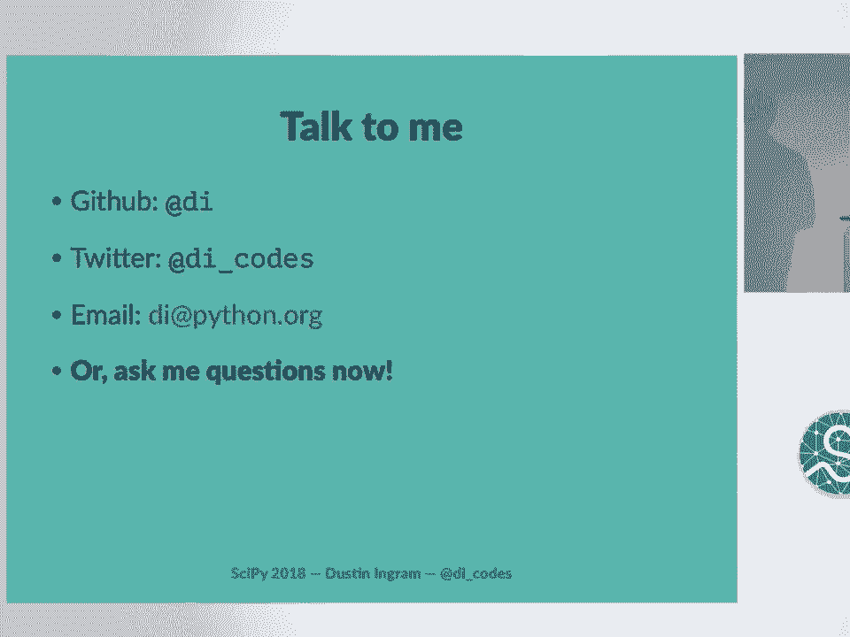

 Thanks again， everyone。 Thanks very much。

 [BLANK_AUDIO]。