# SciPy 2018视频专辑 - P51：SciPy 2018视频专辑 (P51. Intro to Numerical Computing with NumPy (Beginner) _ SciPy - GalileoHua - BV1TE411n7Ny

 So my name is Alexan L'Chabat Le Claire， but you can call me Alex。

 That'll be probably easier for most people。 Dylan here， my colleague， will be the helper。

 So if you need help， I don't have little post-its for everyone。

 but if you go like this or if you shout help， he will come help you。 So our day jobs。

 we work on both of us， and we're Python instructors， scientific Python instructors。

 So we have the pleasure。 We have the answers to the questions， I guess so。 Most questions。

 And the pleasure of teaching NumPy a lot。 So that should be a fun afternoon。

 Who has used NumPy before？ Yeah， then。 Wrote yourself a line of code that uses NumPy。 One， yeah。

 yeah， it was percent。 Who has used someone else's code that uses NumPy？ Okay。

 Who would not consider themselves a Python programmer first？ No。

 it's not identity based or anything， but like who's like a MATLAB user？ Let's say。 Okay。

 I hope that won't last。 Who is an R user？ And full？ I guess who's a JavaScript user？ Hello。

 Anything else？ Fortran， I guess。 SaaS equal？ Yeah， okay。 What about you？ Yeah？ - Stata？ - Stata？

 Okay。 - CnC++。 - CnC++。 All right。 Yes？ - Fortran77。 - Whoa！ - Okay。 Well， good。 Good。

 I'll do the best。 Nice。 So there'll be a little bit of everything for everyone。

 Since there's a good number of MATLAB and Fortran users。

 I'll talk a little bit of like their fundamental differences， in how they store。

 how NumPy and Fortran and MATLAB store memory， and how they think about multi-dimensional arrays。

 So I'll spend a little bit of time making sure that that's clear for everyone。 Yeah。 So。

 ready to go？ Okay。 So I'll be using slides， a mix of slides that you should have。

 I think they were on the GitHub repo。 And I'll also go in the interpreter， type some stuff。

 So interactively build bits of code。 You're welcome to follow along to type along。

 It's like a code karaoke session。 And you're also welcome to interrupt me with questions。

 And if I repeat your questions， it's not because I did not understand。

 this for the benefit of posterity。 And the YouTube listeners who will maybe watch this video one day。

 Chairs should arrive eventually。

 Okay。 I will start off with a little justification， of why we would want to use NumPy。

 So just a quick word here。 I'm using canopy for where I'm going to write the code。

 solve the exercises。 Nothing special is happening here on the right-hand side is just a regular。

 IPython prompt。 On the left-hand side is just a text editor。 If you're doing this in Jupyter。

 you can follow in Jupyter。 It will be fine。 If you're using spider， it will also work fine。

 Or if you're using emax and a terminal， it will also work fine。

 Only when we do the exercises that are in plain Python file。

 I'll show you a trick if you want to solve them in Jupyter。

 so you can import the content of those files through the exercises。 In the most part。

 I'll just be typing in here， and you're welcome to type along。

 So I'm going to start off in a world without NumPy arrays。 So I'll create。

 just for the sake of discussion， a little two lists here of integers。

 Each of them has the same length。 And let's say we want to add those two lists together。

 Because of how the language works， the plus operator does not mean。

 add those two lists element by element， but rather it's a concatenation。 So that won't work。

 If I want to add them together， I have to write a for loop。 So something like this。

 So both of my items that would zip my two lists together。 Oops， I forgot something here。

 So I would have an empty list that would initialize。 I would loop over my two lists。

 And that would do element by element addition of my two lists。 That's kind of verbose。

 You're welcome to type this， but the whole point is that we don't have to type this。

 But if you're working with plain lists or if you're， for some reason。

 you don't want to have NumPy as a dependency or you're not dealing with much data。

 it's like a little project that has to be a single file or something。 That's okay。

 We can make do but it's kind of tedious。 And also in the grains scheme of computing。

 it's kind of slow。 So to give you an example of how slow it is。

 So I'm going to create another list of integers here。 123， so a million integers。

 And I will use an IPython magic。 So it's a command that starts with a percent symbol that is not part of the Python language。

 It's part of IPython itself。 It allows me to basically run a line of code a bunch of times and start a timer。

 run it a bunch of times， stop the timer， and then calculate how long each iteration takes。

 So I'm going to calculate how long it takes to sum this one million integers。

 And it's about seven milliseconds per loop。 So seven milliseconds for us humans is fast enough。

 But it's very slow compared to how fast the computer could do it。 So what I'm going to do。

 I'm going to bring in NumPy and see what we get out of using NumPy， was the benefit。

 both in speed and in sort of expressivity。 So throughout this exercise this afternoon。

 I'll work with NumPy， import it as under the name NP。

 Just a common shortcut instead of typing NumPy。array， NumPy。sum， NumPy。

the various functions we want to use。 The NP prefix is just a nickname for the NumPy module。

 So while we're on the topic of speed， I'm just going to get that out of the way and sort of we're。

 going to have a good argument why we should be using NumPy。 So I'm going to take different。

 in a new variable， I'm going to call it G array。 And I'm going to pass my list G that I created earlier into the array constructor。

 And NumPy is going to take that data from a Python list， put it into an array。

 And then we're going to get into how that works in a little bit。 Instead， let me do it this way。

 I'm going to use the sum function， not the built-in sum function in Python， but rather the NumPy。

 sum。 I'm going to pass in my array。 And there we go。 So a little benefit here。

 Kind of one order of magnitude。 It's not too bad for no effort， basically。

 Just because we're using a different data structure， because we're using arrays， we get extra speed。

 Does anyone know why that's happening？ Why is it faster？ Yeah？

 >> Because NumPy is optimized for single type numbers or extreme because it's all one string or。

 an instance。 >> Yeah。 >> So Python lists。 So this list here。

 basically the way it works is think of it as the container， the list。

 what it contains is a bunch of addresses。 So it's like a notebook or like an address book with your friends。

 The address book itself doesn't contain friends。 It contains addresses of friends and then you can send them emails and invite them to your。

 party。 But that's kind of tedious。 You have a bunch of back and forth scheduling the party。

 that kind of stuff。 You have to get everyone into the room。

 What NumPy does is it takes all of these numbers and puts them all together into one room， into。

 one data structure， into one memory buffer。 So those editors are all together in memory and they all have the same type。

 And NumPy is then able to do very， very fast computations on those numbers because it doesn't。

 have to do type checking， it doesn't have to get access to all the objects。

 It has all of them right there。 So let's talk a little bit more about this expressivity。

 So I'm going to redefine my two arrays A and B。 But this time， instead of defining them， as lists。

 I'll define them as arrays。 So np。array is the array constructor。 Within the array constructor。

 I'm basically putting my list of integers。 So I'm going to do that for A。

 I'm going to do that for B。 So now I have two arrays A and B。 When I look at them。

 IPython shows me the representation of those arrays。 It emits the np prefix。 It just says array。

 But it's how we differentiate between a Python list on line 12， for example， in an。

 umpire array on line 15。 And now if I add my arrays A and B。

 NumPy is basically doing the for loop for me， of， doing the point-to-point operation。

 It will take the first of A with the first of B， add them together， second of A， second， of B。

 third of A， third of B， etc。 etc。 And that kind of point-to-point or element-wise operation works with every single operator。

 So multiplications are also point-to-point divisions。 They're also point-to-point exponentiation。

 Also point-to-point or element-by-element。 All right。 Let me go back to the slides for a second。

 So the slides starts -- so I know this is a tutorial about NumPy， but the slides start。

 with Microsoft。 This is not a good moment。 I'm sort of busy。 [ Laughter ]。

 They start with a section on Matplotlib。 I will cover Matplotlib for five minutes。

 A little bit later， before an exercise， we're going to use it to visualize the arrays。

 So I'll jump over this and go straight to slide 18， which is the introduction of the array。

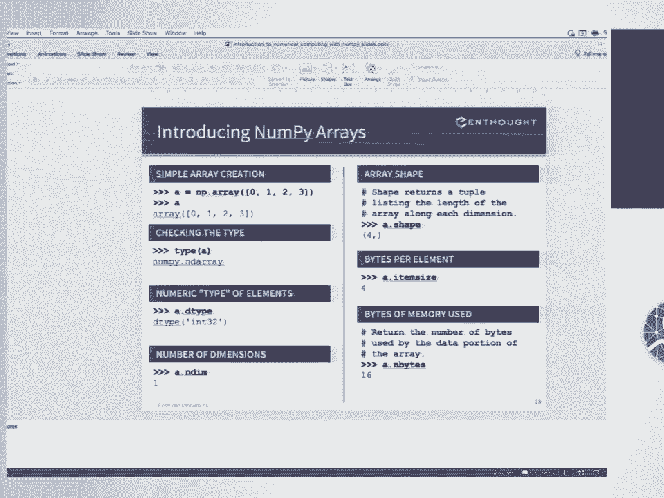

 and what's special about it。 So our array， we start off by just creating a simple array like I've done earlier in the。

 in IPython。 The type of that object is NumPy。nd array。 The Nd stands for n-dimensional。

 multidimensional arrays。 For now， we're sticking to 1D because it's easier to reason about。

 We're going to introduce most of the topics in 1D。 We're going to do a little bit of 2D。

 And then for 3Ds and higher， I'll just explain how it works， but we won't really work with。

 that this afternoon。 So what's particular with our arrays？

 So I mentioned that the array kept all of its data together。 And as our friend over there said。

 what's particular about NumPy arrays is that it's homogeneous。

 It's that every single element of the array is of the same type。

 So every single element is an integer of， let's say 32 bits or it's a floating point。

 of 64 bits or it's a positive integer， an 8-bit unsigned integer， so an value between， 0 and 255。

 And that type is accessible as an attribute in our array called the dtype， short for data， type。

 So in this example here， my array has four integers and the dtype of that array is int， 32。

 The dtype you get by default will depend on the platform you're on。 If you're on Mac or Linux。

 you'll get int 64。 If you're on Windows because of the way Windows works。

 you'll get a 32-bit integer by default。 But we'll talk a little bit later about how you can control that if you want。

 Our arrays， because they can be multi-dimensional， one of the pieces of information that the。

 array will keep track of is its number of dimensions。

 So that's accessible as an attribute named ndom。 So this is 1d array。

 And then it has what's called a shape。 The shape is one of the most important attributes or metadata about your array is what defines。

 how it interacts with other arrays basically。

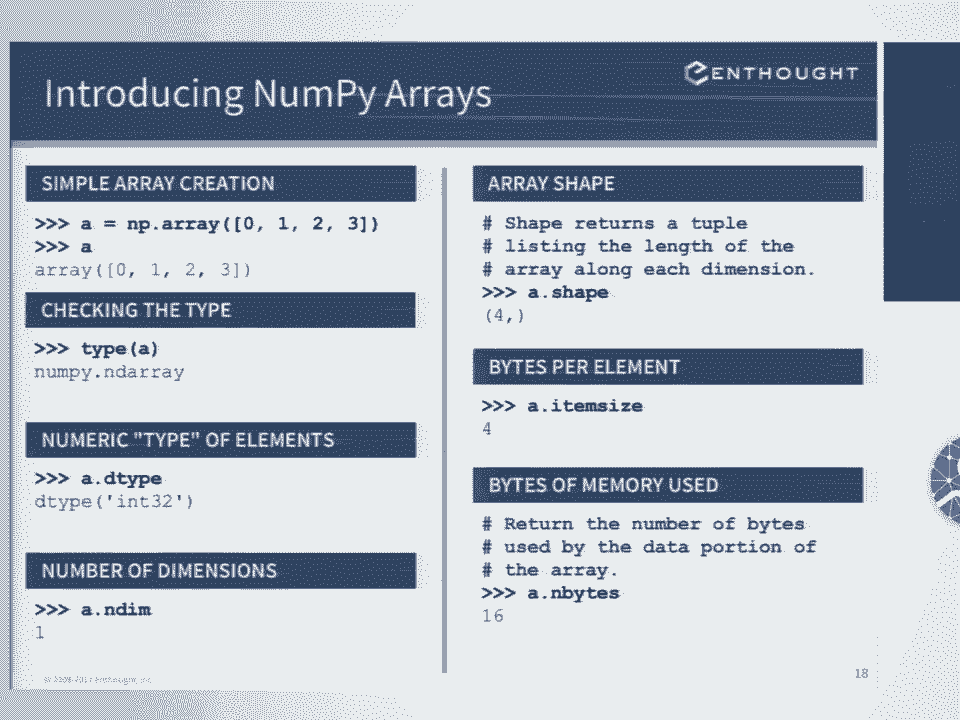

 So I'm going to go back to IPython here。 So my array A， like I said。

 it has a number of dimension and it has a shape。 So shape is an attribute。 It's not a method。

 It's attached to the object but it doesn't take parentheses。 It always returns a tuple。

 So it's one of these objects here with parentheses and the trailing comma。

 This is the number of elements along each dimension。

 So my array here has one dimension and ndom is one。 And that dimension has four elements。

 And we're going to see in a second what happens if we have two dimensions。 Good question。

 So there is a type in Python called an integer。 And there is a type。

 The type of this object F is called a tuple。 But the tricky bit here is that what makes the tuple a common mistake is to think that。

 what makes the tuple a tuple is the parentheses。 But it is not the parentheses。 It's the commas。

 So the number 10 in parentheses is just the number 10。

 But the number 10 with the trailing comma is a tuple。 It's just a tuple with one element。

 The parentheses are there because visually it's easier to group together as a single entity。

 And it's kind of easy to miss the commas。 The parentheses are often there so that when you're visually scanning from left to right。

 you spot the parentheses and then you go further scanning further for the commas。 So yeah。

 the shape will always be a tuple even if there's just one element。 If there are multiple dimensions。

 basically this tuple will have as many elements as you， have dimensions in your array。 All right。

 so my array A here， I have in my array is B， my array B， sorry。

 I have demonstrated that I can multiply them together。 I can also multiply by a constant。

 And NumPy will happily do something called broadcasting。

 It will apply my transformation to every single element in the array。

 So there is a for loop happening somewhere between our fingers and our CPU， but we're。

 not writing the for loop， which is important。 That's one of the reasons why NumPy is fast。

 We can do without the NumPy for loop machine， sorry， the Python for loop machine。

 And the other thing that NumPy brings， so it brings us all of these mathematical operations。

 the array data structure also brings in a bunch of functions to compute things like the。

 sign of an array， which will compute the sign of every single element or the natural exponent。

 of every single element of A or the natural logarithm of every single element of an array。

 These functions， they're also written in C， they're part of NumPy， they're very， very， fast。

 Their name is called a universal function， or sometimes you might see the word you funk。 So np。

log is a you funk。 So whenever you see this， it's a little hint that you're not looking at a pure Python function。

 anymore， you're looking at a NumPy， a NumPy function。 So np。sum is a， well。

 it doesn't tell you you funk here， it tells you where it's from。

 but at least now you get the hint that this function is from NumPy and not from Python， itself。

 So our NumPy， our NumPy arrays， they are what's called mutable， meaning that we're able to。

 change their content， we'll be able to pick an element at a given position， and we're。

 going to be able to set an element at a given position。 So in the upper left here， I'm selecting。

 given this array here of four integers， I'm， selecting an element。

 I'm getting an item at position zero， which is the first element。

 of the array for the MATLAB users over there， over there， everywhere， MATLAB users everywhere。

 So a reminder that NumPy， just like Python， uses zero based indexing， so zero is the first。

 element along a given dimension。 So I can get an item。

 I can also assign to a given position that will modify the memory， in place。 So in this case。

 I'm replacing whatever was at position zero， which happened to be a zero， with the number 10。

 One very， very important piece of information， important behavior is that given the D type。

 of an array， so this array here is an integer array， if I try to assign something that's。

 not an integer， so either by assigning a float here， I'm trying to fill the array with some。

 kind of floating point value will simply be truncated。 So Python is very， very， very， sorry。

 NumPy is very， very strict about the kind of data， you're putting in there。

 If you set it as a float， it'll course anything that comes in to be a float。

 If you define something as an integer， it will course everything to be an integer。 Good or bad？

 Good because predictable， bad because not flexible。 So if you're coming from。

 let's say MATLAB or like arrays are all float all the time， why would I care， sort of。

 I mean the middle， it's neither good or bad， it's just how it works。 So knowledge is power。

 now that you know this， you won't be surprised if your data gets truncated， or it gets， it's typed。

 gets converted。 Yep。 If you define an array， let's say you define a third array。

 like C and you just start typing， elements， does it define the overall array structure by the first error on the door or。

 how does that work？ Because when you define it and you didn't say what the type was but you just put integers。

 in。 Yep。 Good question。 So the question is， when I define an array。

 so let's say I define this array A here， again， I'm going to define a bunch of array A's， I'm sorry。

 How does NumPy decide what the type of the array should be？ So the rule is， it will be sort of。

 if you think of the pyramid of numeric pyramid， how， is it called？ Hierarchy。 Hierarchy of numbers。

 it's also called the pyramid。 So if everything's an integer， the D type of the array will be int。

 If one of them is a float， the array will be a float and if one of them is complex， the。

 array will be complex。 So it's not the first one， it's not the last one， is any of them。

 But we might as well talk about this now。 There's an argument to the array constructor called D type。

 Notice the pattern is called D type as an attribute， it's called D type as a keyword。

 argument where you can enforce a certain type。 So look at this here， I say yes。

 I'm passing in a float but I want to enforce that this。

 array should be int 32 and then NumPy will use that particular D type to allocate the。

 array to create the array。 So you have control at creation type。 Creation time。

 Pay will look like this。 So whenever you have a non-default D type， NumPy will show it to you。

 So if it's in 64 or float 64， it won't show you the D type but if you change it for some。

 reason because you loaded it from disk， result of sudden transformations， I'm casting you。

 will tell you this is not the usual one， you might want to be aware that this is different。

 Good question。 All right， so let's move on to higher dimensions。

 So I'm going to define an array C which has two dimensions and the way to define one of。

 those by hand is basically as a list of lists。 So in most cases we'll get arrays as the result of doing some computations as the result。

 of loading data from disk or we're going to get arrays from places。

 It's not that common to write them by hand but for the sake of keeping it sort of self-contained。

 I'm going to create this array by hand。 So I open two sets of square brackets so I'm going to have one list inside of another list。

 The first list is going to be my first row and my second list with 2021 and 22 is going。

 to be my second row。 So be sure to close all the brackets， close all the parentheses。

 And then when I look at my array NumPy together with IPython are being kind and they're showing。

 to me sort of a nice representation of my array where instead of having it all flat it。

 makes it clear which one's a row which one's a column。 So this array C has a D type， right？

 The D type is something that doesn't depend on the number of dimensions， there's always， one D type。

 So also an integer 64。 My number of dimensions， this time we have two。 And then my shape。

 still a tuple。 And now this tuple tells me there are two elements along the first dimension and three。

 elements along the second dimension。 All right。 So we're learning a thing here， dimension。

 the first dimension or dimension zero is rows， the number of rows。

 And when they have the second dimension or dimension one is the columns。

 So I'm going to just give me a second。 I'm going to draw this on screen on the whiteboard so we have a reference of this for the while。

 Okay。 Okay。 All right。 So what I drew here is basically the array that I have on screen。

 I drew them just as little boxes like kind of like a table。

 And the little arrows sort of the coordinate system in the upper left says dimension zero。

 goes down is the first dimension。 Dimension one goes horizontally across columns。 Your question。

 >> So to the earlier question on the tuple with that structure of having for non。

 Does that mean that that earlier structure was a column that good question？

 The question is if I have a one dimensional object， does it mean that I have a column vector？ No。

 Is the short answer。 So numpy like the sea sort of family of languages is row major。

 So it means that the basic unit of contiguous elements of memory are on the same row。

 This is the total opposite from fortran and its descendants so mainly math lab where the。

 basic unit of memory is a column。 >> Can you switch back and forth and you take a structure that's a row and turn into a column。

 >> Yeah。 Yeah。 Yeah。 Yeah。 We'll talk about that later。 In order to turn a row into a vector。

 I would need that object will need to have two dimensions。

 So basically its shape will become a five， let's say a four comma one。

 And then you can go back and forth。 But if you have a one dimensional object like my array a doing a transpose of it doesn't。

 make sense because there's no second dimension where to go。 It's a tricky thing。

 So the important part here is we're dealing with arrays not with matrices。

 So if you're coming from mat lab where everything's a matrix this is not the case here。

 The basic element is a one dimensional array then two， three， four， five， six but you don't。

 have by default these two dimensions all the time。

 So word of warning speaking of matrices if you read the NumPy docs you'll see that there's。

 a type called the matrix type。 You should not use it。 Even the NumPy docs tell you not to use it。

 They're actually deprecating it I believe to actually they will remove it from NumPy。

 Everything you can do with an array you can do with the matrix but the opposite is not。

 true and there was a bunch of weird behaviors。 So you can forget like wipe from your mind the existence of NumPy matrices just they。

 don't exist but they do but they don't。 All right R2D array what else do I have to cover here。

 So R2D array has two dimensions its shape is two comma three two rows to be columns。

 There's another attribute called size it's not super useful but sometimes useful that one。

 tells me the total number of elements。 So if you want to know how much data you have that could be useful and actually has。

 another friend called n bytes if you're working with very large data and your sort of concern。

 about how much memory you're using the n bytes attribute will tell you the amount of memory。

 taken by the data portion of the array not about the metadata like the shape the number。

 of dimensions etc。 But just the just the numbers basically so all of these all these values here。

 So with our array a we were able to get an element at a given position like this we're。

 able to set an element an arbitrary position using the square brackets notation。

 This also works with two dimensional arrays but the way we're going to do this is by putting。

 all of our indices all of our positions within the same set of square brackets meaning that。

 if I want the first row first column I'll put all of that within the same square brackets。

 Something like this。 This is different than different from working with actual Python lists if I was working with。

 actual Python Python lists I would have to write it this way。

 I would have to chain the square brackets it will work for some definition of working。

 in NumPy but I highly recommend if you want to stay sane and write bug free code that any。

 time you're selecting data or signing data to a multi dimensional array always put all。

 of your coordinates within the same square brackets。

 As if you had a five dimensional array you'd have some value comma another value comma another。

 value comma another value comma another value comma another value so all of that within the。

 same square brackets。 What happens if I do partial indexing so this is getting item at position zero zero so that's。

 row zero column zero if I attempt to do partial indexing where I pass fewer indices than I have。

 dimensions what happens is that NumPy gives me sort of all remaining dimensions again。

 different from the what Matlab does if you're coming from Matlab where Matlab would give you。

 the first element here what you get you can think of it as this gives me the first row。

 in this case or the first inner list so I get all this subset of the data。

 Yeah we're going to come to that in a second the question was what happens if I have a。

 two dimensional array and I want an entire column we're going to cover that right now。

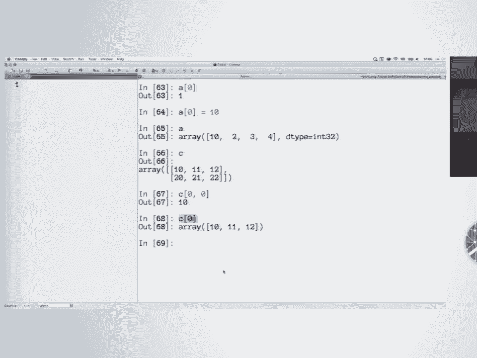

 so I'm going to bring up the slides for this because it's easier to see the before and。

 after so if you're following along it's on page 23。

 So what we're going to talk about here is this operation where we want to subset some。

 data a subset of the array that is called slicing and the idea is that it allows us to。

 specify a lower bound where to start or selection an upper bound where to stop our selection。

 and then an optional step size。 So I am starting off with this array a here again so 10 11 12 13 14 and my first selection。

 is from position one to position three the very important thing here is just like in plain。

 Python the upper bound is not included so this means that when I read this I know this。

 slice this the resulting array will have two elements right three minus one that's two I。

 know I'm going to have only two elements so I get the 11 and the 12 here。

 So there's no difference in one dimension between all the high bound slices。

 No in one do they behave exactly the same way no surprises slicing the question is is。

 it slicing the same in Python lists and non-py arrays in one D and the answer is yes everything。

 you know about slicing lists also works here。 So just like lists negative indices also work meaning that negative indices are positions。

 relative relative to the end of the array so there's no special keyword to specify the。

 last element is just the integer minus one so in this slice here we start at position。

 one so that's the number 11 we do all the way to minus two the upper bound is not included。

 so that also gives us a slice 11 12 for me though it has an entirely different meaning。

 when I read a slice that says one colon minus two I read this as drop the first element from。

 the front and drop the last two from the end and how many elements am I going to get out。

 of the slice I have no idea it depends on the size of a right so these I think of the positive。

 and the negative indices as relative to the edges so the positive is relative from to。

 the left edge of the array and the negative number is relative to the right edge of the。

 array whereas if I if you pass two negative or two positive integers for your slices both。

 of them are relative to the same size same side sorry one and three so I know I'm going。

 to get only two elements out of this and that last one just don't do that so you're going。

 from a negative index to a positive index and it hurts my brain every time I have to think。

 about this so this will work as in like your slice will contain something as long as the。

 minus four is sort of further left than the plus three is right because you're going to。

 get you start four positions from the end and then you go up until you hit the third position。

 from the front even in words it's terrible so so it works it's fair game it's fine it。

 might happen in the weird like if you're doing some kind of window processing and you have。

 like increments on window size or something but this should not be the kind of notation。

 you reach for sort of by default if you do I can't help you yeah then on the right hand。

 side of the slide we talk about what happens if we emit some of these indices so I know。

 that some of you that will say okay if I start from the beginning I'm always going to put。

 the number zero because that's how it works in my language that will work fine but in when。

 using Python and using NumPy is very very very common to emit the indices if they're。

 sort of redundant so in this first slice here where I'm getting the first three elements。

 I'm able to just say colon three instead of saying zero colon three you can save your。

 precious fingers by emitting the zero and maybe I'll seem weird today a little bit less。

 weird tomorrow and within a week or a month you'll just do that all the time you'll see。

 it everywhere so that's a common pattern to emit the lower bound if you want to start。

 from the beginning similarly to emit the emit the upper bound if you're going all the way。

 to the end of the array so this second slice is also a common pattern to say select the。

 last two elements of the array so think of it as sort of a tail tail my rate and then。

 that last one here another common pattern to subset an array but every other element it。

 could be every third element every fourth element etc to say I want to go from the beginning。

 to the end in steps of two and so if you want to yeah skip elements so that's in 1D let's。

 have a look at what happens if we're doing it in 2D so this starts to be fun so what's。

 happening here is we're mixing so we're going to start off with the orange selection here。

 so a within the same square bracket we're mixing a an index so just position 0 so it would mean。

 row 0 and then 3。5 meaning a slice from column 3 to column 5 column 5 is not included that。

 gives us are these two elements here 3 and 4 with the slice here then second one in light。

 blue where we select the bottom right corner of this array this is a four colon four colon。

 meaning from row four until the end from column four until the end how many elements we're。

 going to get out of this depends on the size of a because both of them they go all the。

 way to the end of the array so we in this case we end up with only two by two array third。

 one answers your question how do I select a column so the very common pattern and the。

 right way to do this is to just place a colon here to say I want everything along that dimension。

 so that would means all the elements along dimension 0 which is the rows of column 2。

 so that would select this entire column here so one thing to realize is whenever we do an。

 index in our in our slicing or subsetting operation we end up dropping a dimension right so I start。

 with the first one here in orange I start in 2d I index once so I end up it on 1d in blue。

 I slice twice so I keep all of my dimensions and then in red I slice once I keep that dimension。

 I index once I drop that dimension so one way to reason about this is if you have a Python。

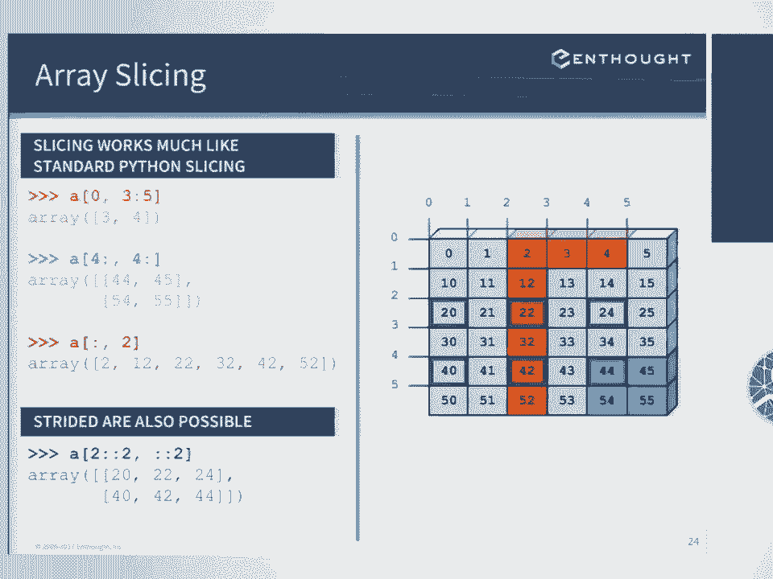

 list just plain Python list I'm going to go to Python for a second so you have a plain。

 Python list like this if I index so if I get one element at a given position I drop a。

 dimension right I go from one dimensional object the list to a zero dimensional object basically。

 just an integer whereas every time I slice even if my slice contains a single object a single。

 element so here colon one because I'm slicing I still have a list I still stay as a one dimensional。

 object right so every time you index like this you drop a dimension every time you slice you。

 keep that dimension so the orange there's an index we go from 2d to 1d the blue we slice。

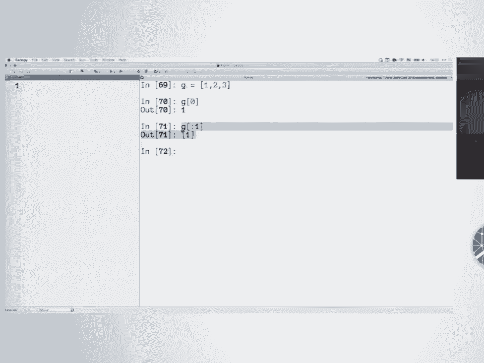

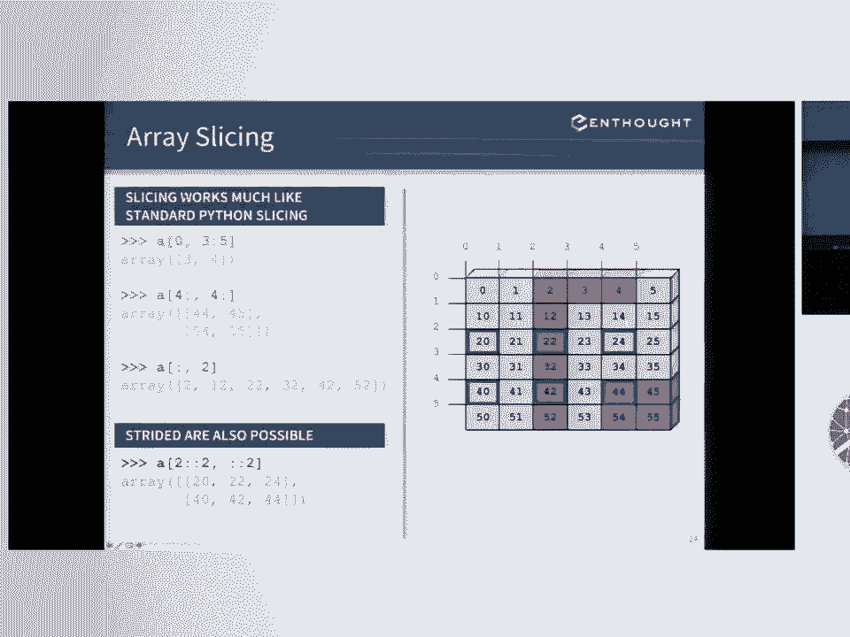

 twice we say in 2d the red we slice an index we drop a dimension we end up in 1d and then。

 the last example here in darker blue is to select this sort of check mark pattern so this。

 means from row 0 until the end in steps of 2 so every other row the other way to say this。

 is every other row starting at row 2 and then for the columns we go from the beginning to。

 the end in steps of 2 so every column every other column starting from the beginning。

 questions before we do a short exercise okay so on the next page 25 I'm going to leave that。

 up so there's a little bit of code at the top to create this array so the idea is that。

 we create an array of 25 integers and then we reshape it to be square to have 5 rows and。

 5 columns and then I'd ask you to select the two columns in red the last row in yellow。

 and then this light blue checker pattern so I'm going to give you about 5 minutes for。

 this and we're also going to take a break so what I suggest is it's 2 15 right now is。

 that right no never mind I'm going to give you 5 minutes and then we're going to look。

 at the solution and then we're going to take a break all righty let's have a look at the。

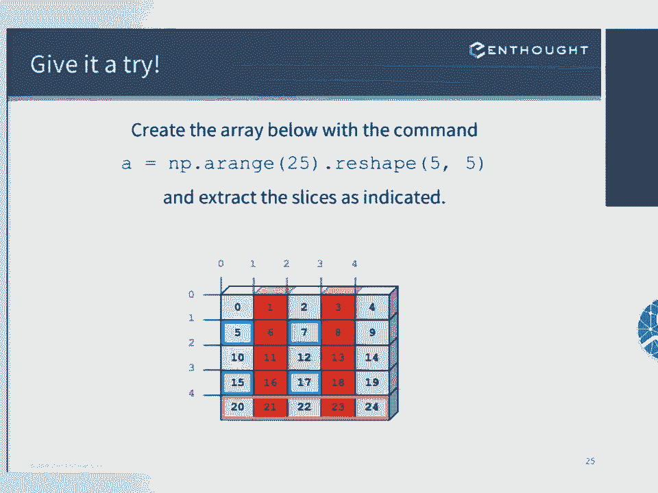

 solution so let's start with the red so red is how many slices do I need to do here one。

 or two two one two I saw a few ones why one okay so for you if I do this it's a slice。

 or not a slice it's actually a good it's a good thing so every time there's a colon it。

 acts as a slice so like the act of slicing is to put a colon basically so the solution。

 is a colon here for the first dimension that means every single element along the first。

 dimension in this case is every row and then what's the slice along the second dimension。

 yeah so let's start from the beginning we don't want the first column which is zero。

 but we want the second one that's a one I need a colon here therefore I'm slicing let's。

 sort of skip over the end index and look at our step size so it's a step size of two。

 do we want to stop before the end or go all the way to the end in this case I would go。

 all the way to the end because like this expressing this slice one colon colon one colon colon。

 two gives me the two columns I'm interested in I could put a minus one in here but it's。

 sort of means something different to me if I put an upper bound it means that will never。

 include the last column whereas if I don't include the upper bound is just keep on going。

 as far as many columns as you have I'm not I'm not picky so I'd be satisfied with this。

 red selection here let me I'll try to make some space so red would be this。

 all right what about yellow there's actually a lot of choice here so I heard someone who。

 said just for and that would work right for is the last so zero one two three four the。

 last row the last element along the first dimension numpy is gonna give me everything。

 remaining along the other dimension so yellow is the right is what I'm looking for oops。

 sorry yellow does anyone have another suggestion for yellow yep all of the above so yellow I。

 can do a minus one that would also work there'll be the last row again it has a slightly different。

 meaning to me the minus one always means the last row row number four always the fifth row。

 and if I have a thousand rows it's not necessarily the last row so depending on your algorithm。

 what you're trying to do the the selection one of them is better than the other is more。

 flexible and someone said I could also slice along the second dimension that's true it's。

 sort of not superfluous it's unnecessary but it has the benefit of conveying to your user。

 your users probably your future self that this array should probably be 2d so it has benefits。

 even though it's not required it's informative and informative is good so all of these would。

 work and obviously the four comma colon would also work too so yellow a four comma colon。

 so these four work perfectly and then what's what's the answer for the blue and the blue。

 selection yeah so that's actually a good point you can start wherever you want when you write。

 it down like if you look at this I know the step size is gonna be to let me figure out。

 later what the offset is so I look at that it's not the first row so I'm not gonna put。

 a zero here is the second row so I put a one do I go out do I go all the way to the end。

 yes so I'm looking along the first dimension here the rows and whether I stop at minus one。

 or I go all the way to the end I'm gonna get the same selection on the other side though。

 when I look horizontally when I select along the second dimension what's my what's my slice。

 here interesting yes so let's start with the thing we agree with so everyone agrees that。

 the step size should be too everyone agrees that we're gonna start from the beginning some。

 people say we start from the beginning I don't need to put anything some people say we start。

 from the beginning so I'm gonna put in a zero some people say I will start with the negative。

 index so that's minus one minus two minus three minus four minus five which is not incorrect。

 but again is the kind of slightly crazy way of doing this so even though it is correct I。

 did not really support this approach so right minus one is the last column minus two minus。

 three minus four minus five is the first column that's too much work for my brain so so that's。

 for the beginning I'll just admit it we start from the beginning for the upper bound we have。

 a little bit of choice so we can do minus one that would work we could do minus two because。

 the upper bound is not included we could do three or we could do four and in this case。

 I really don't have a good argument here for one versus the other it really depends on how。

 you're thinking about your problem so this would work let me just everything here so this。

 one would work forward work minus one and minus two yes。

 the question is what happens if you start grouping these slices and indices and parentheses。

 we're gonna get back to that after the break it's another form of indexing called either。

 masking or fancy indexing or Boolean indexing has a few different names and numpy it's typically。

 called fancy indexing we'll see that after the break gives you a lot of control of selecting。

 arbitrary data anywhere in the room yes yes yes， yes。

 is this slow other selecting roles I mean wouldn't make sense to first close the matrix。

 and then select roles or I mean how fast is it mean as you told it's role based does。

 that mean it has to like collect all these the one the six that evidence or does it have。

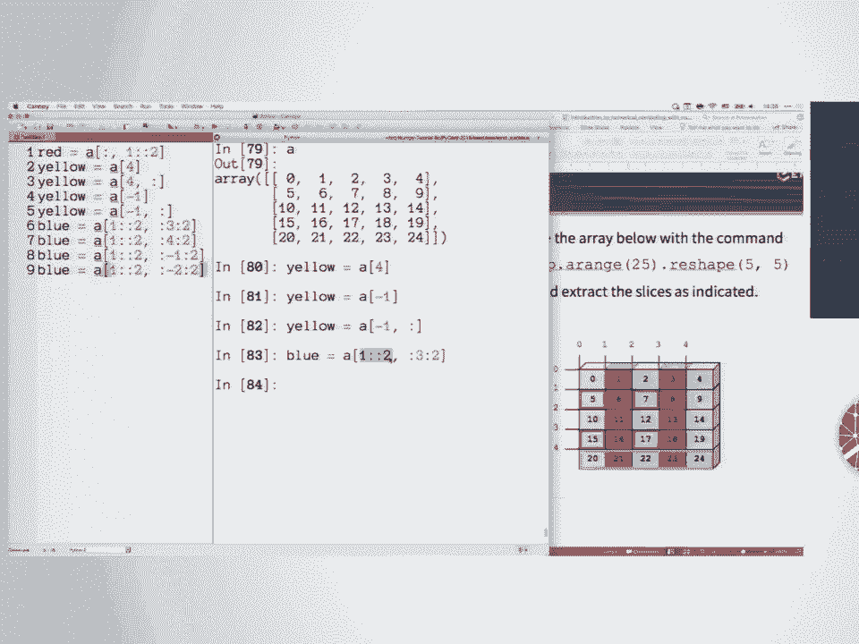

 to like collect it somewhere from memory and then put it somewhere or good point guess we。

 can talk about this now so my red selection which is now five rows two columns I'm going。

 to select the lower right hand corner and I'm gonna put a zero in there right minus one。

 one minus one is last row last columns if I look at red no surprise but if I look at。

 a and I have a zero in here so the question sorry I'm gonna repeat the question is is。

 slicing a column slow compared to slicing a row if the elements on a row are contiguous。

 in memory if they're next to each other wouldn't be like faster if you did a transpose or something。

 like that maybe you need to measure it I don't not enough to matter is probably the。

 right answer you should go for readability first and then measure to see if the bottleneck。

 is whether you're slicing your own or a column it probably means that either your Python is。

 not the right tool for the job or you're doing something strange with your algorithm so you。

 should not worry about this you should just make this slice that makes sense for your application。

 and the other thing the thing that I'm demonstrating here is that whenever you make a slice what。

 Python does is what NumPy does is to give you a view of the same memory buffer so NumPy。

 tries really hard in most cases to not give you a copy it doesn't copy the data it still。

 points to the same location in memory so that means that making a slice of a giant array。

 is really really really cheap because it doesn't require any new memory allocation other than。

 some metadata about the shape and about the number of dimensions if we have some time I'll。

 cover that at the end of the session yes so in Python you have ID operator I doesn't memory。

 you have something similar like that in NumPy so arrays have an ID as well the same way。

 so the array has attributes called flags which is itself a dictionary that tells me whether。

 this array owns the data so this the red which is a slice of the array a doesn't own the。

 data itself is owned by someone else but it also has a dot data attribute which are kind。

 of pointers to the beginning of the the offset so but this is just a boolean can you have also。

 that the memory has to that particular the answer is yes I don't know how offhand but the answer。

 is yes because it's possible to write C functions that act directly on NumPy buffers so you。

 can certainly work with that but in Python in most most most cases it's like rounding error。

 cases you will not act on the memory like you wouldn't not care about that memory buffer。

 but yes you can access it if I change if I directly assign an element of red do I also。

 change the underlying A matrix yes the question is if I assign anything to red do I also modify。

 A the answer is yes I just did it earlier here I basically executed this line of code。

 minus one minus one equals zero and that's what caused this zero here in A if you absolutely。

 want to make a copy of a slice there's a dot copy method on arrays that will copy the。

 entire memory but it's safer but it's also more expensive because memory allocation is。

 pretty pretty expensive alright so let's take a 10 minute break until two fifty when we come。

 back we're going to do an exercise immediately another application of slicing but actually。

 useful not that this wasn't useful yeah and we'll talk about this this thing called fancy。

 indexing that allows us to make arbitrary selection not just like with similar step size。

 alright so see you in 10 minutes so in Python a boolean is a true or a false capital T true。

 capital F false and here we're doing this rather strange dance of building a boolean。

 array by hand which will never happen but it has the benefit of one fitting on the slides。

 to being sort of clear what we're doing here so we're creating an array of ones and zeros。

 and we're using this keyword D type which we've seen earlier which is a way of controlling。

 the data type of arrays we saw the I did an int 32 example that's how you could control。

 the resolution of the array by enforcing it to be bull what Python and NumPy what they。

 do is they turn all the zeros into false and all the ones into trues so that mask here。

 is used below as a way of basically selecting the same data the 10 the 20 in the 50 so the。

 requirement this mask has to be boolean and has to have the same number of elements basically。

 the same shape the same number of elements as the shape of that array so here that array。

 has what is that eight elements and that mask must also have eight elements in most use。

 cases though you'll get these masks not by typing a bunch of ones and zeros but rather。

 by doing some kind of comparison so here would be creating a mask that selects all the data。

 that let that's less than 30 and the nice thing is that we don't have to care about。

 where that data is NumPy will basically look at all the elements for us and create the。

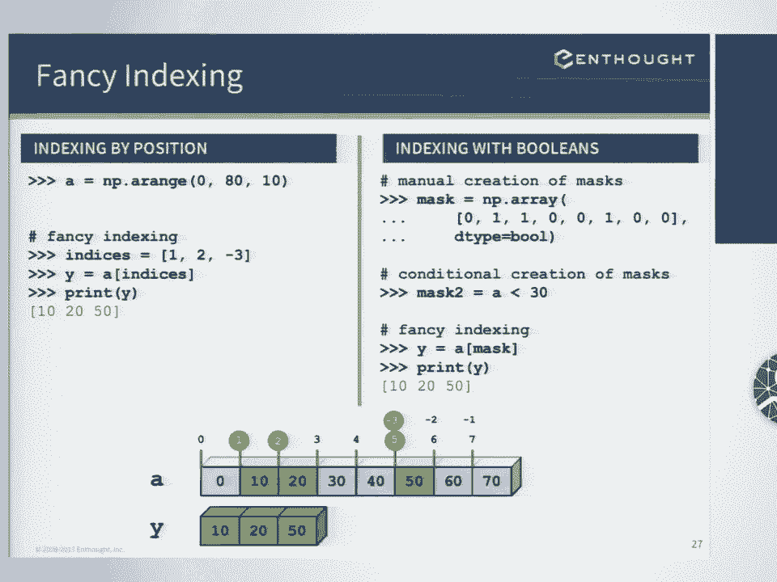

 mask so let me do an example of this I'm going to go to I Python I'm going to create a new。

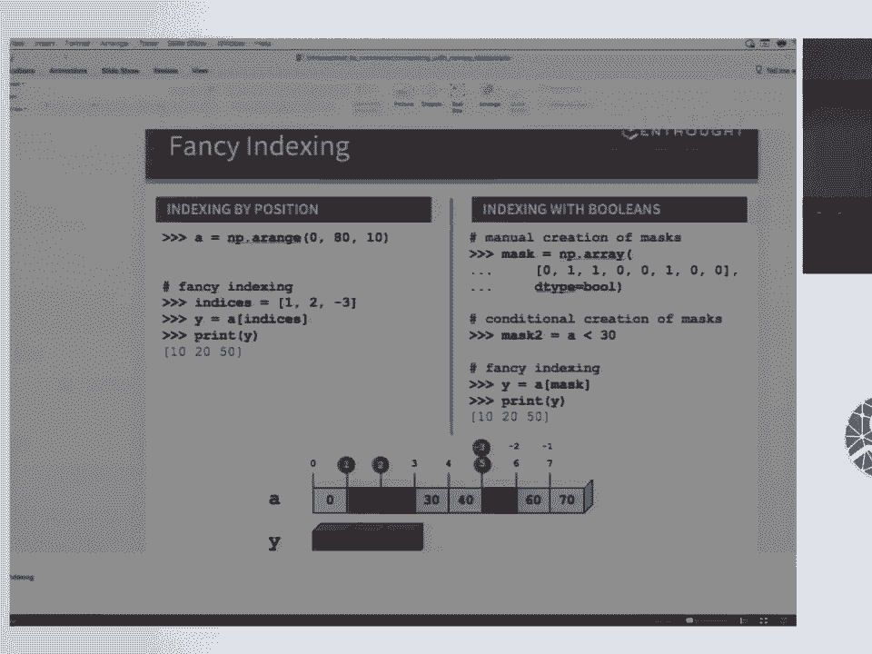

 array a with a three a minus one a zero no a minus two four minus six and an eight so。

 here's my array and let's say I want to find all the negative numbers so I'm going to make。

 a comparison a less than zero this creates a new array of type boolean I could give it。

 a name I'm going to call it negatives I don't have to give it a name but I could give it a。

 name readability it's a bit more readable and then I could use that mask to select a subset。

 of data just the data that's negative I could have in a small context like this I could have。

 put my computed my mask straight inside of the square brackets why one versus the other。

 if I plan on using a mask multiple times then I might as well give it a name so I don't have。

 to recompute it every time but if I it's a one off I just want to select a compute that。

 mask only once then I can do it in line especially if it's a simple mask like this so these masks。

 right now I'm using them as a way of getting item I'm getting data the data I'd given positions。

 but I can also use that mask as a way of selecting element in the array where I'm going to put。

 in a certain value so I'm going to I think of it as sort of I take a big piece of paper。

 I put it over my array and then I check everywhere where there's a where there's a negative number。

 I'm going to cut a square so now I can see through my array sort of like cut out to put a tag on a。

 wall or like a house number on the sidewalk or something like this so I'm going to cut out a spot。

 for all of the places of the array that are less than zero and then I'm going to stick a zero in。

 there and if I look at my array now everywhere where I had a negative number the negative number is gone。

 and it's been replaced with a zero so it does it modifies the array a in place but it doesn't do。

 anything to the shape and we can compute more complex arrays as well so I could。

 select all the data in a that's less than eight another array that's all of the data that's greater。

 than three and now I need to combine them so I'm trying to select this for basically sort of a。

 contrived example but I'm trying to select all the data that's within a certain range bless you。

 so I could try to do something like this so a is less than eight I'm going to do it the other way。

 so a is greater than three and a is less than eight right that's pretty clear what I'm trying to do。

 but it's going to fail with the dreaded truth value of the array blah blah blah blah so if you've used。

 NumPy for a little bit you might have seen this thing saying the truth value of an array with more。

 than one element is ambiguous use a that any or a that all and once you've used NumPy for five。

 years then you know what it means but before that you don't so I'm going to do cut a shortcut through。

 time and we're going to talk about what this means this is caused by this keyword here end the。

 the python operators for bullions the English and the English or the English not they expect。

 in the case of and or on either sides one true or one false not a whole array of them and。

 NumPy when you ask it for this array here so the result of this mask is the whole array of true。

 and false NumPy is like I'm not sure what you mean when you mean true for this array is it is this。

 array true if everything is true or is this array fall true if one element is true so it's giving you。

 the choice it's like a a greater than less than eight there's one false in there but if I say any。

 means this array is true as long as everything is true sorry this array is true as long as。

 long as there's one element that's true then that's fine and we could use the end。

 but even if we make it work even if we use the any or the all it won't do what we want we're。

 going to end up with one true or one false and like that's the moment where you should realize we。

 don't want one value we want as many values as we have elements in the array so this whole dance。

 we don't need it we don't need this Python end and this Python or we need other operators that are。

 called bitwise operators and these operators are I'm going to write out the comment on the left hand。

 side here the n percent which symbolizes an end the pipe the vertical bar which is an or。

 there's a tilde that stands for not and there's also the useful but not as often used。

 carrot that stands for exclusive or and so those are called bitwise operators， and。

 the binary operators are and or and not so very very close very easy to get confused。

 between those two things but very very fundamental difference so the binary operator the。

 yeah the binary operators require one true or one false on each side the bitwise think of them as。

 like the multiplication or the addition with numpy their element by element operations this means that。

 I can do a greater than three and but the n percent this time a less than eight。

 and as I expect there's only one true in there which is at the position of the four so I've。

 combined those two masks together using these bitwise operators and I have to use parentheses。

 here because the bitwise operators have higher precedence than the comparison operators。

 that's how life is， so these bitwise operators super powerful they're used every time you do masking both in numpy also。

 if you're doing the pandas tutorial tomorrow if you use pandas whenever you build these kind of。

 complex mask selections you'll need these bitwise operators。

 yes so the question is are these bitwise operators overloaded for numpy。

 yes and no so I'll open a parenthesis here I'll try to make it quick it's not talking about。

 numpy in particular I'm talking about how python works so if I have two integers。

 when I add them together python actually translates this to a call to a method named dunder ad。

 these methods are called special methods they're part of the python protocol that's how python works。

 so if I do there's a there's a whole lot of them you see there's a dunder end there's a dunder。

 a boolean a dunder is usually a short version of instead of saying under double underscore。

 abs double underscore people say dunder which for some weird association sounds Australian to me。

 probably because of crocodile Dundee my brain is strange but it's basically how all of the python。

 language works it's implemented in terms of these methods so my array a has a dunder end and a。

 dunder abs and and under ad it's there so everything is kind of overloaded if you want to say so yes。

 yeah what xor means so i'm going to do it on screen because if i do it on the whiteboard no one。

 will see it so how do I draw this again and so true false true。

 so much easier on a whiteboard so for a regular or。

 if this is fun so regular or so the the two sides of this table is this is one side of the。

 the operation the vertical is the other side of the operation so the truth table of regular or。

 is this as long as one of the two sizes or the result as long as one of the two sides is true both。

 sides will be the output will be true let me say that again i'm not sure if i said the right thing。

 as long as there's a true the result is true the exclusive or。

 xor has to be one of the two sides that's true and i'm going to try to channel my。

 22 year old self that did logic at university or something and i'm not able to so it's useful。

 yeah if you if you do if true thank you that's the logical equivalent yeah not equal to each other。

 so they have yours is basically different right so different truth value， exactly， yeah thank you。

 yes， so coming back up to the next row back up on the yes yes so you if you did it's greater than three。

 and it's greater than eight and four is marked as true how would you use that to pull out four。

 yes so the question is how would i use this mask that i've built made of two parts in order to select。

 something i could put it in the square brackets like that so the。

 negative negatives and this masks both of them return a boolean array that has a certain shape。

 negatives i computed it as a less than zero at some point earlier。

 how i compute the mask really doesn't matter can be super simple or can be arbitrarily complex but。

 once i have a mask i can put it inside of the square brackets to select my data and like i said。

 you can give it a name if it makes sense if you want to reuse that mask for multiple operations or。

 you can compute it in line here so i could even have split it into three different names like。

 a greater than three another one which is a less than eight and then do them together。

 also give that a name so depending on what you want to reuse how complex they are there's very。

 little cost really to saving the intermediate steps unless you have a lot of data but it can。

 greatly help readability especially if you're a master complex， cool yes。

 just a question on the fancy indexing if you go back up to the red， yes。

 yeah so is there a advantage to doing it this way versus just the colon comma。

 pregnancy one three when we wanted the first two third column。

 so the question is is there a benefit to fancy indexing or to slicing is one of them。

 faster than the other speed is not really the main worry it rarely is unless you're working with。

 lots of data and you shouldn't assume that one of them is faster than the other you shouldn't。

 measure the big difference is whenever you slice you're going to get a view like we did earlier。

 so you're going to get a view of the same memory buffer you're going to see the same data which is。

 really fast we're going to see that in more details later but every time you do fancy indexing。

 you get a copy that that is the real difference and the one that really matters。

 fancy indexing gives a copy all the time slice gives a view all the time。

 so there also method to buy dot deep indexes what is。

 mask good question the question is how can I find。

 the position of the trues in this the where are they there is so there's a function called non-zero。

 where you can pass your array your mask and it it's kind of like shape it always returns a tuple。

 so notice it opens with the parenthesis there's a trailing comma here this array here tells me that。

 position one position two position four there was a true in my mask。

 so if you get a tuple of two arrays that's right， were you a math lab user no okay so it's sometimes useful if you yeah if you care about the position。

 but there's a whole lot of work that you can do， by just using the mask directly so computing the mask to then get the position where that。

 mask is true to then use the position for indexing this extra step in the middle of getting the positions。

 of the the trues it's redundant it's like extra work that you don't need to do because you can use。

 the mask directly cool good questions really， can you say that again are the arrays sorted in memory。

 i'm trying to see where the question comes from they're in the data that they're defined。

 and so like my array there's a three first and then there's a zero a zero or four a zero and an eight。

 if I sort them then yes they're sorted like it's shuffled the memory underneath but。

 it numpy will store in memory the numbers in the order you give it to them does that answer your question。

 okay okay yeah i assume if you have two arrays the same size say a and b。

 mixed billions with them like a less than three yeah good question so what happens if you have two。

 arrays could you do a mask between two arrays very good question so uh a is an array with a 10 a one。

 20 yeah let's keep it simple and b is an array with a two a three and a 20。

 so if i do a comparison between both so a is greater than b in this case i'm going to have one true。

 but i get element wise comparisons just like i got element wise addition element wise。

 subtraction multiplication etc is that was that your question and then i could use that as a mask。

 somewhere else right again what matters is the type of the array like basically everything that's。

 a boolean array i will call a mask because it can be used as a mask and there's nothing special about this。

 boolean array compared to another boolean array or how i got it what matters is the d type of the data。

 how do you find a position of the boolean array which one is true yep you had a non-zero for negative。

 do you have i had the non-zero gives me the position of the true actually so remember um false and zero。

 they're basically the same and true and one are basically the same so you can read non-zero as。

 non-false which is kind of a weird sentence but that's basically what it's doing。

 okay so i'm gonna go back to the slides for a little bit just to see how to happen how it works。

 if we apply this fancy indexing on a two-dimensional array and if we mix and match with slicing regular。

 slicing and also indexing so first one it's kind of funky in yellow we're selecting a diagonal。

 so it is definitely not something we could do using regular slicing all right the step size always。

 changes so we could not express this just with some colons so what i'm doing here is i'm passing。

 two list of integers and think of this as pairwise coordinates for certain point so zero one is row。

 zero column one is that one here then one two is the 12 two three is the 23 two four is the 34 four。

 five is a 45 we're selecting a diagonal just because but there's nothing stopping you for making an。

 arbitrary selection of like the one the 13 the 31 and the 55 right as long as you're passing in in this。

 case it's in 2d pairwise selections if it was in 3d you could pass basically triplet triplets to get。

 a a point in your 3d array then in light blue we're making these three slices here so it's the bottom。

 half of this array of column zero column two and the last column and at first glance we might think。

 oh we're totally able to do this with the slice but notice here there's a step of two and then there's。

 a step of three so we cannot do this with the slice but selecting row three until the end that we can。

 do with the slice so that ends up being three colon so from row three until the end and then we pass in。

 a list of column numbers column two zero two and five then the last one again it's a little bit。

 weird because we're building a boolean mask by hand but again it makes it stand alone so this means。

 first third and last element of this array and we're using that as a subset of our the data we're。

 putting in the square brackets to say we want all the row that are where this mask is true the rows。

 where this mask is true of column two and here notice we use one index one form of。

 fancy indexing so it behaves kind of like slicing so we end up with the one dimensional array so。

 start with yeah so this is 1d 2d here and the result is 1d。

 yep so if uh fancy indexing is creating a copy and you showed earlier how you can set a value。

 using the slice so how do you do that then if you're doing fancy indexing yes so if fancy indexing is。

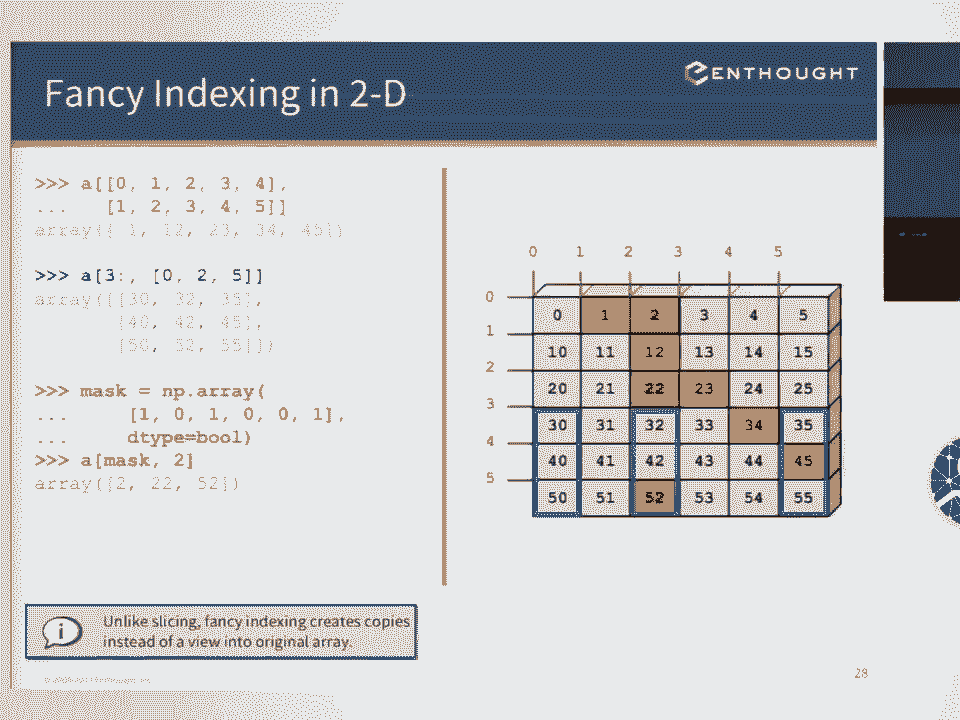

 making a copy how do you assign to a value you let me see if i understand the question correctly so。

 this is my array a i'm going to create a subset which is the array a at position zero and position two。

 so is it 10 and the 20 i can check out my flags so a owns its own data。

 and subset also owns its own data and just to be clear a is not subset right if i wanted to do。

 that programmatically make sure that they don't share data it could do it this way i just created。

 them so i am master of this universe i already know that they don't share data but i'm just。

 demonstrating this so now uh so a subset so if i assign subset position zero equals minus one。

 then i've modified subset an array a doesn't care right it's just on its own over there。

 does that answer your question yeah i think so if you want to go back to。

 a because you want to change something based on the mask you're just using the mask to change it。

 i'm not sure i understand can you try again yeah so if you wanted to let's see go back up to it。

 what a was that a was 10 120 yeah let's say let's say that you're not creating a set that you're doing。

 a mask so the mask is the is creating the subset and you want to change the first value you know of。

 of a based on the mask you didn't then just apply the mask the mask back to the original。

 original array yeah okay let me see if i understand the question so if i have an array a i used fancy。

 indexing to create a subset of that array how do i modify a again you just modify a like the last。

 position i'm going to put a hundred i've changed a there are two separate arrays as long as you keep。

 the name of the array as long as you can still access that array it's a nik that array still exists。

 you can still modify it slice it mask it again do computations on it you mentioned modify it。

 we did that earlier with the negatives um where we assign zeros like this。

 but that creates oh can that actually change that yeah so this assignment here that we've seen。

 earlier negatives here it could be a mask um it could be um a list of positions it could actually。

 be a slice object um that will modify a in place i think of this object here whatever it is as sort。

 of like the cutout that i talked about earlier what this what this contains defines where the cutout。

 is is it like regularly spaced is it arbitrary positions is it computed based on the data in the。

 array okay that's what i'm asking you so it doesn't matter if the fancy is the nasty。

 the fancy index can still modify it yeah yeah the yeah where this data is has no impact here， cool。

 right so let's do this quick exercise so there are two parts the first one。

 i'm not going to ask you to do because it's basically the answer is in the previous slide。

 slide i'm getting confused with my consonants here um so you already know the answer but the。

 second one is interesting i want to select all of the numbers divisible by three in this array here。

 so i'm going to give you five minutes and then we're going to look at the solution。

 yeah so what's the modulo operator someone said the modulo operator is the percent symbol。

 no for loops allowed just just in case someone was tempted to write a for loop。

 i always have to remember no for loops so the the modulo operator is the remainder after integer。

 division or floor division it's like a plus symbol。

 so so percent obviously works on the array also yeah so if you're not familiar with the modulo operator。

 zero modulo two i'm going to sort of it's one of those where i'm going to demo。

 what it does and then hopefully you will infer the actual behavior。

 so the modulo operator is the remainder after the integer division by this number on the right so。

 because i have a two on the right hand side then the answer will always be either zero or one so。

 i will let you expand on that knowledge to find a solution to this exercise， so。

 this is not going to keep me kind of shaped it's just going to give us the number second。

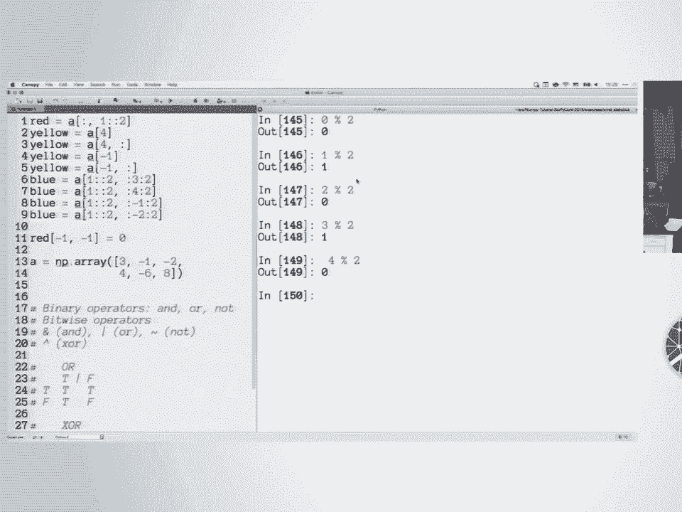

 what does it i mean i'll be second looking at my picture but what does that mean at first one because。

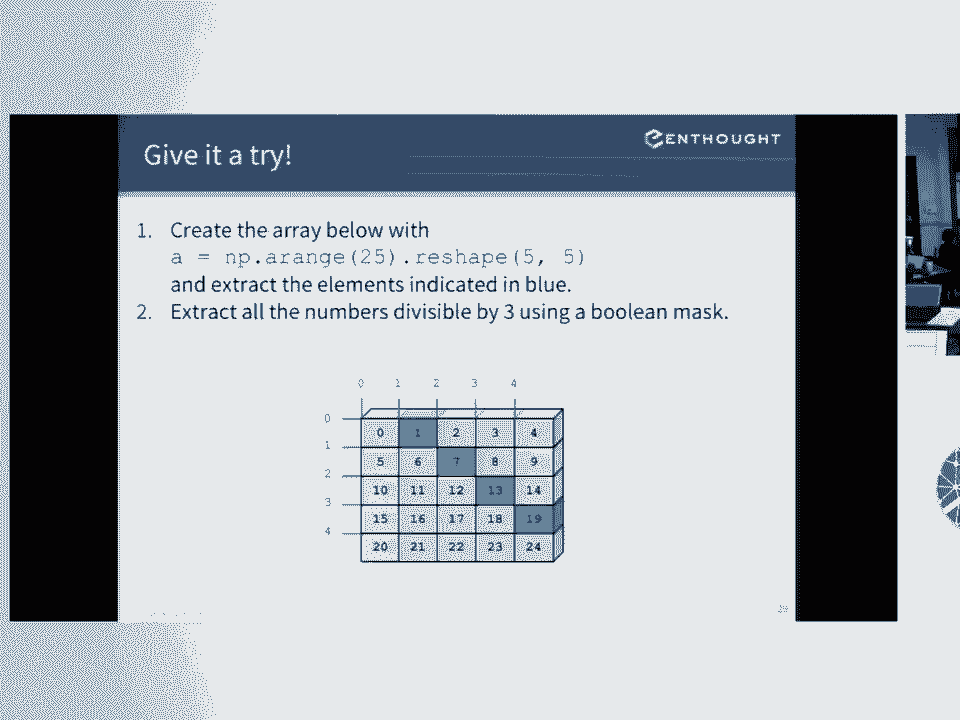

 zero is where your math is true right um yeah yeah it is the answer you're doing the right thing。

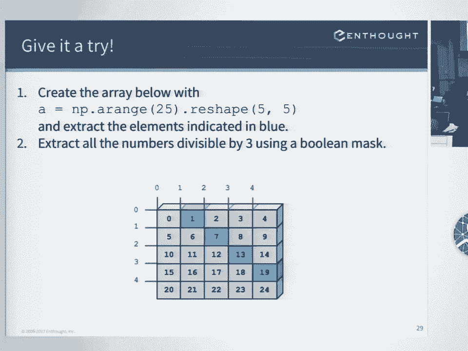

 all right let's have a look， so my array， that 25 you shape it to be five by five here's my array a so um someone said what's the modulo。

 operator which was a big hint that we should probably use the modulo operator so if you use。

 the modulo operator the question is now which number should i use with this and since the question。

 said divisible by three that was another pretty good hint that we should use the integer three。

 so if you compute the the modulo of three the modulo three on all the array what you get is。

 zeros and ones and twos um so those are all remainder after divisit dividing zero by three。

 one by three two by three three four four by three etc etc and every time i see a zero in here it means。

 that that number in the original array is divisible by three so you might be like oh okay so i'm just。

 going to use that as a mask and then something very very strange is going to happen so now i。

 end up with a three dimensional array and you're like no this is not it certainly not um i i can。

 reason about what happened here if i sit down and think really hard it's basically like um。

 but i'm not gonna do it but so what is happening here is because i'm not passing in a mask right。

 i'm passing it lists of integers basically list of list of integers it functions as a form of fancy。

 indexing where i get lists and subsets of lists and columns and that ends up giving me 3d super。

 powerful but definitely not what i want here um so interesting but not quite it what i want is。

 all the positions of these zeros and i can get those if i build a mask how do i build a mask out of this。

 array here yeah i test for equality to a zero in this case and that gives me an array that still。

 has the same shape it's still a five by five it is of dtype boolean and that now that i have a mask i。

 can use that to get those items and numpy doesn't try to keep these elements in a certain position in。

 the array because it doesn't really make sense they could be anywhere so like it's not gonna return。

 another five by five array with a bunch of missing data or with only the elements we want so it just。

 gives us the data that we that we asked for as a one-dimensional array how did that go okay。

 it's easy when you see the solution there， yeah it just a little thing here about the process assuming that you know the ingredients like you。

 know i will need a modulo i'll know i'll need a mask i will typically like unless i know exactly。

 the solution which doesn't always happen i will build it like this in in i go in ipython even if i'm。

 building a large analysis or something or even if i'm in jupiter i'll create a new cell or here i'll。

 just type one statement i look at what it looks like and i will add a clause or an element to my mask。

 i'll build it i'll add a little bit more a little bit more a little bit more until i'm satisfied and then。

 i'll give it a name and i'll keep on reusing it i'll reuse that name in my code but yeah。

 whole question yes why is the result in one d and not a five by five array it's because these。

 this mask could be true or false anywhere like an arbitrary location and there's no like what else。

 would numpy put in the places where it's not divisible by three right it's sort of not clear it could。

 return an array of five by five filled with a value called nan which stands for not a number。

 which is often used to represent missingness um yeah so let's say i wanted to keep that's a good。

 question so let's say i do i want to keep all the number find all the number divisible by three。

 and i want them in a two-dimensional array um this is a this is a good dance actually。

 so what do you the my first question is what do you want in the in the。

 it's called themselves that are not divisible by three do you want to zero do you want a minus one。

 do you want their geologists in the room i'm sure do you want a 999 minus 999。5 or something。

 what what value or do you want a nan this number that represents missingness nan okay um so。

 i'm going to define the trick here it's a pretty common pattern actually。

 i'm going to create a new array， um， you i'm going to make it empty empty is kind of weird but i'm going to make empty like。

 so it's a common pattern in numpy there's a something called array like empty like ones like。

 zeros like and you pass in your input array and what it does is that it creates a new array that。

 has the same shape but these numbers here are not what i want the thing that empty does is that it。

 allocates memory for you and what's in that array is garbage you cannot trust what it's in there is。

 whatever was in the memory before it happens to be now something zeros and ones and twos。

 if i run this again that might not be what i get there we go so that's obviously garbage before it。

 was not obviously garbage yeah but i could never have predicted this ever well never say no never。

 but uh like i could not predict this basically um so my output now i would like to i that's not。

 going to work crap um， so i've now filled my array with nans but i have a whole problem here which is that。

 my output array is an array of integers but nans is a floating point number， yes。

 yeah so what i'm let me do that again um this， so i'm going to make this float all right so this garbage i'm going to fill it with nans。

 so i'm basically trying to create a container that has the same shape as my input。

 all right so a is my i'm going to put it on this side a is my input i created an output i preallocated。

 memory that has the exact same shape as the original and what i'm going to do is i'm going。

 to use my same mask on both sides i would probably assign it to me give it a name my mask is a。

 modulo 3 equal equal zero and i'm going to say the output。

 for the position of my mask is equal to a for the position of my the same the same mask。

 so what's going to happen is is going to uh numpy is going to take the element at a given position in。

 the array a go put it in the same position in my output and now i've have all my numbers divisible。

 by three at their original location in a new array where i have nans where it's undefined so i will。

 put this code down here so you can see it all at once but i changed the type that's right。

 you said keep where yes um what um convince me say that again， can you square yep。

 say mod 3 equal zero a， yes uh this is not something i was planning on covering this would indeed work。

 um so have a look at the documentation from i'll just say what it does so the first argument of。

 where is something boolean it's true or false um and if it's true is going to take an element from a。

 if it's false is going to take an element from b in this case b is nan so wherever it's true is。

 going to take the element from a wherever it's false it's going to take the nan so we end up creating a。

 similar uh similar array yeah good good plan that's true because of the。

 nan that's because there's no um an umpai at least there's nothing there's no value that。

 represents a missing integer so we're sort of stuck so the world's a terrible place。

 thanks for the the where， uh even if you do if there's a nan then the array is float。

 always uh it's it's uh so nan is a valid floating point values you probably know。

 is a valid floating point value that represents missingness for integer in nan pai another。

 libraries there are sometimes ways of representing missingness but not in not in nan pai。

 so that's why you end up with these tricks where like when it's a certain magical number。

 it represents missingness um if you absolutely want to keep it as integers。

 yes so so when i did when i ran a square bracket square bracket mask or output square bracket。

 your bracket mask i got a one-dimensional array how come you have to have output mask equal ams。

 to get the the two-dimensional array what's going on there um let me just explain what's happening and。

 see if it answers your question okay i'm not sure i can reword your question so this line on line 34。

 this creates a new array that has the same shape as a but is of type float i fill it with nans。

 then i compute my mask and i use the same cut out the same masks on both sides so。

 a output and masks are already 2d i'm just taking stuff from one side and i'm assigning that same value。

 on the a side on the output side does that answer your question but if you do output mask or a mask。

 singularly by themselves they both end up being one-dimensional yes uh that's yeah yeah yeah so if i do。

 output of mask or a of mask those are flattened because numpy has no way of。

 doesn't return you doesn't build this basically so the only thing it can do is return these elements。

 that you asked for you have a better explanation for that Dylan then for the the one-D outputs yeah。

 so there's no way for numpy to guarantee that that can be broadcast up in any shape。

 so you can imagine if you start up with a five by five array and the only two elements there's。

 three of them there's no way to cast that into any two-dimensional array other than a three by one。

 or one by three and given which you started with another one of those that's really any more intuitive。

 than just saying like here's the flat value numbers that you want so by having a。

 pms keep blame us don't find it able to determine that it should be a five by five all right so。

 when you have an assignment operator in there all right put it on you're on the spot yeah i'll be。

 i'll be on youtube i'll be famous so when you have that assignment operator in there what really。

 Python is looking at is those locations in memory i don't think it's on dude you gave me a bad。

 microphone can you hear me now all right um so when Python sees an assignment operator that thing on。

 the left hand side is not extracting the values and putting them in some flattened copy those are。

 referring to the actual locations in memory where those values are stored so you can assign into all。

 those locations given that you either have like a single scalar um or an array of the same size and。

 shape um or you can ask for to give you a new object with those values inside of it and that's。

 if you just have that blank expression and it's a little um it's confusing it's hiding a lot of the。

 complexity of what's actually happening um but if you come from a statistical language like um like。

 R or Stata or if you're used to working in MATLAB that kind of distinction between give me just the。

 true values and oh i'm sitting into these locations is something that you sort of internalized even if。

 you didn't know how to explain it thank you thank you。

 time for another break okay we're gonna such enthusiasm so we're gonna start again at four o'clock。

 before we get to actually during actual computation so so far we've created arrays manually and we've。

 sliced sliced and index and the fancy indexing it's super important but in a minute we're actually。

 do we're actually gonna going to do computations on arrays and between arrays and talk a little bit。

 more about what happens there but before we get there i thought we should take a few minutes to。

 reason a little bit about what happens when we have more than two dimensions right so numpy arrays。

 remember the type is called nd arrays the n for variable and more than two any number of dimensions。

 so multi-dimensional arrays so what i have drawn on screen here is four different arrays。

 a one two three and four-dimensional array uh pardon my drawing of a four-dimensional array i have difficulty。

 visualizing the fourth dimension so what i do i just four d is two cubes side by side five d is cubes。

 on top of each other six d is cubes sort of layer back and then seven d is like cubes of cubes of cubes。

 of cubes so i'm sure i'm the only one like this in here um all right so i have these cubes these。

 arrays drawn on screen here on top i have sort of um reference systems coordinate systems where the。

 there's an arrow pointing in a certain dimension so if we start with the first one and the zero is the。

 um the zero refers to in this case with number four which is the first element of the shape。

 then if i go to 2d notice how the reference system sort of rotates where the zero now points down to。

 the first element of the shape meaning that in a 2d array the first element of the shape refers to。

 rows and the second one um the one points to the columns and then when we go to 3d the first element。

 of the shape is now pointing the depth so zero is the depth two is the height four is the number of。

 columns and then when we go to four dimensions the zero is across cubes is the first dimension。

 then the three is the depth of each cube the two is the height of each cube and the fourth is the。

 width or the number of columns so the way to reason about this is that whenever we add dimensions we。

 basically push down existing ones and we pre-pend new dimensions that's a common pattern in row。

 what's called row major libraries or or languages so that's how numpy does it if you're coming from。

 four-trainer matlab which are column major you will your basic element is a column and then you。

 append dimension every time you add dimension you'll add multiple columns deeper columns a cube below。

 the original one basically so the mental model is sort of entirely flipped um so in a row major。

 library like numpy the last dimension is always the columns。

 and these elements are basically always more or less always contiguous in memory as well。

 so you're pushing down dimensions the existing ones um one way that i like to think of this is。

 if i have a one-dimensional object it's kind of like a list and then the 2d object it's a list of。

 lists so here i have two lists in the outermost list and then each of the inner list has four。

 objects then here have three lists each of them has two two lists two rows and each of those has four。

 elements and then that's a list of lists of lists of numbers so the zero keeps on keeps on shifting。

 it's columns first then rows then depth then across cubes etc the second reference system at the bottom。

 uses negative negative values to represent to point to a certain position in the shape。

 and what you observe is that the minus one is always a row right so this is what i said earlier。

 the minus one always represents across columns so the zero and minus one if you have a one-dimensional。

 array they point to the same position in the shape if you have a two-dimensional array minus。

 one is that four here it's always the number of columns in a three-eight-dimensional array the。

 minus one the four here is still the number of columns and same thing in the four-dimensional array。

 so we're going to use that in a little bit when we do reduction operations in our arrays。

 we're gonna have to specify which dimension we want to operate on and sometimes we reasoning in。

 terms of positive position makes sense and sometimes reasoning in terms of negative positions also。

 helps， so i'm if you're following along i'll jump through page 37 so there's a section in here about creating。

 arrays i'll jump over this for now i think having a human sort of walk you through it is less important。

 than having you have human walk you through the how calculation works so on page 37 here we have。

 rules for computations with arrays or between arrays rule number one is super important。

 is that every time you do operations between arrays the first thing that numpy does is to check that。

 their shapes match the rules for this are called broadcasting rules。

 hello good so here are a few examples of shapes that are considered to match so in the simplest case。

 let's say we have two arrays like this so what's the shape of each of these arrays three by two。

 that's right so let's say i add them together here the shapes obviously match because they're the same。

 and what we're going to get is element-wise operation over all the elements of the array。

 another array that's considered to be um compatible is an array that has was the shape of this。

 yes only so this is the part where it's kind of weird to draw on screen on the board but i'm considering。

 this to be a two comma so here's a three comma and a two comma and what's going to happen here is。

 um numpy is going to basically think of them as like aligning those two shapes starting from the。

 right hand side and then he's going to repeat repeat this array he's going to broadcast this array。

 so that each row the row here gets subtracted from each row in the original array。

 so or added in this case so if i do this array i'm going to call it a and this one is called。

 see if i add them together um this array here is going to be added to those two rows added here。

 and added here and numpy is going to do this without allocating extra memory to like make them。

 exactly the same shape so if you have arrays like this that are compatible one of them is smaller but。

 is a subset of the other one basically um numpy is going to be able to operate between those two arrays。

 and do the right broadcasting do the right repetition of the array but without having to。

 duplicate of allocating making sorry making a copy of the memory to make the area the same shape。

 so if i took a three by two array a and added a scale array would add it to the other one。

 yes i'd give it a something that is same shape as the row。

 you're doing row but doing this movement do you mean when you do this do you mean row do you mean column。

 okay so the the third one which will we'll just repeat what you said so if i have a single number。

 here it's another numpy also considers that to be a possible case of broadcasting it would add the。

 two to every single element that one usually people are not too surprised with but this one where you're。

 let's say i have an array that's a four by five by two and another array that's a five by two。

 that will work fine numpy will broadcast this two array four times basically for all of the。

 elements in the order one um i will not go through all of these the details of broadcasting there's a。

 really good um i'll put the link in the slack channel and eventually in the youtube video maybe uh to。

 the numpy documentation that explain broadcasting um but for the for these the exercises we're going。

 to do and for today we're going to limit ourselves through these three cases exactly the same shape。

 one which is an array which is a subset of another one and then a single value yes well i thought he。

 was going to ask what happens if you have a one by three column that you wanted to add to that。

 okay yeah yeah so if you have a three by two and a one by two that's fine because it can repeat。

 the one here is repeatable like you can just do one three times and you're going to get the same。

 thing but if you get a three by two and a two comma one that doesn't work so this one here is actually。

 a column array and that's not a compatible shape， that would work fine yeah if it's a three comma one that's fine。

 just continue on that i think the question is so if it's one single like a two and it needs to be。

 on the roadside will they adjust it so we'll have to make it three by one force it to be three by one。

 so if i haven't uh let just to be it um so you see what's three for example your C is two there right。

 uh here if it's three that's not going to work because this is too big you're going to get a。

 you're going to get something， this is a consequence of the row or of this in other words four by five by two says i have four things。

 each of them is a five by two therefore i can broadcast five by twos throughout。

 or i could say it's a four by five by two and i went in just had something with two in the last。

 dimension that's okay too so in other words it's kind of right to the left the dome is it matches the dimensions。

 so the question is the way the things are right now yeah the if i understand correctly the question is。

 is this broadcasting a consequence of being row major um no there's nothing stopping you from doing。

 this if it's column major but instead of aligning on the right hand side you will align on the left。

 hand side yeah as far as i know matlab has implemented this after seeing it done in numpy。

 uh so the idea is you there's no point in duplicating that memory like the idea of。

 broadcasting is to make things fast without allocating more memory than necessary you're just。

 repeating exactly the same data so what's happening is numpy makes sure the shapes match。

 and it basically does a for loop for us in c instead of creating two arrays of exactly the same size。

 and then do it in four loops it yeah let me just confuse the issue okay four by five by two can i。

 do something with a four by five who broadcast it uh no if you do something with a four by five that。

 will not work but a four by five by one will be okay would be okay as well so。

 four by one by two would be okay um a four by one by one would be okay a one by five by one would be okay。

 yes okay this is the last one so if i have a six by six by six by six and another one that's a six。

 by six how do i know how are they gonna work they always align to the right hand side， yeah okay。

 those are very good questions but i think we should move on so you can come to me afterwards with all。

 of your x by y by z's and we can discuss or you can also just try it um yeah uh。

 i wanted to do do i still have this all right a plus b i just wanted to show you what happens。

 if it does if it's not supported so i have a five by five and a three comma if it doesn't work。

 numpy will fail loudly with the value error and i'll tell you these shapes cannot be broadcast。

 it together it's not supported and then it's for you to decide like oh yeah because i'm not。

 supposed to add them together or oh sometimes it's a hint that like you drop data or you thought that。

 you have data from two sources that actually didn't have the same number of samples but you。

 you thought they did um sometimes it's just frustrating but it's it's preventing you from doing a mistake。

 also that was just rule number one no the other ones are easy。

 so that was rule number one shapes have to match rule number two all of the mathematical operators。

 and the universal functions the uforks ufunks sorry that are just a simple transformation like。

 sign logarithm exponentiation etc they all apply element by element right so if you have two arrays。

 you'll get element wise operations rule number three which is going to be the main focus of this。

 section actually is all the reduction operations like the mean the sum all the statistical moments。

 they apply to the whole array unless we specify and what's called an axis why not call it a。

 dimension i don't know but unless you specify an axis to operate over so this means that by default。

 it will take the entire array and shrink it shrink it into a single value。

 and then rule number four is if there's a missing value in your array so if there's one of those。

 nans that i talked about earlier it will propagate i think of nans a little bit like poison they're。

 very important poison because they simplify something important missingness but um they have the。

 side effect of if you try to add a nan to something the result is nan so if you try to compute the sum。

 of any kind of array with a nan then it'll sort of add to its neighbor and then it'll be nan and。

 then it'll add itself to its neighbor is going to be nan as well and then you end up with just a。

 single nan at the end numpy has a handful of nan functions of reduction operations called。

 nan sum nan max nan min etc that will ignore the nans basically and prevent them from poisoning。

 the well and give you actual numerical values， yes um the question is can you do fancy indexing and then compute a sum。

 certainly so my array a was this we had our， right i want a sum so i have my array a i want the sum of all the numbers divisible by three。

 so this is how everything is done in numpy basically you have an array you make a mask to。

 select a subset of that array and then you do a computation on that subset so yeah。

 so yes i'm getting there。

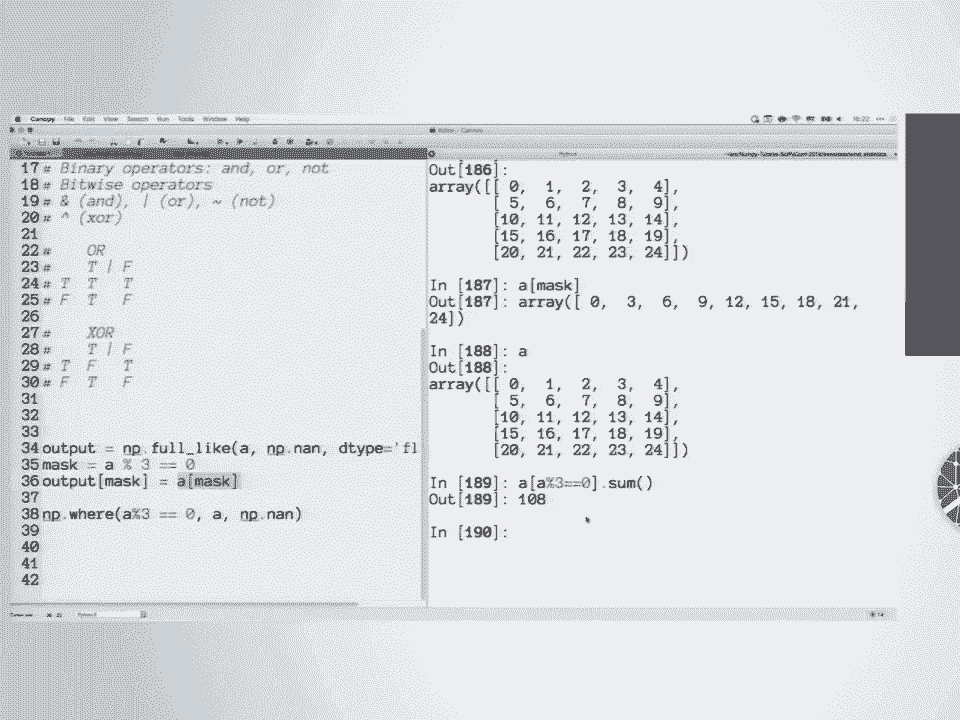

 so let's see the application of this rule number three about the axis keyword so my starting point。

 is this two-dimensional array it's a two by three um and the first call that i make i call a method。

 so who knows what a method is okay cool so quick quick quick lesson on methods versus functions。

 who knows what's the function is okay that doesn't add up to 100% but it'll be okay。

 so my array a has some values in there um so np the np prefix sum is a function that is inside of。

 numpy and it acts only on the data that i am passing to the sum function so that's a function。

 this other sum here i'm calling it a method because it acts on the data stored in the array a and it。

 doesn't itself take any arguments it's attached to my array a and does computation and whatever that。

 array stores store is a loose term here but that's the basic difference the function will act only。

 on what you put in there and the method is attached to an object and it will do computation based on。

 the data that that object contains why use one versus the other doesn't matter so much i tend to。

 use the sum method most or the methods more often than the functions in the beginning of numpy like。

 15 years ago 20 years ago or something there was only functions and then sometimes in the last 10 or。

 15 years they added these methods one is a little bit less typing than the other which gives it an。

 edge i guess um yeah that's a good question can i apply np。sum to two objects so the answer to。

 that is always read the docs um so if i look at the documentation for np。sum it takes one。

 positional argument a one array and then this axis keyword that we're going to talk about and。

 a has to be array like which is a common thing in numpy to mean anything that could be converted to。

 an array so like a list is array like a list of lists is also array like a list of tuples a tuple。

 of lists um etc etc so no it has to be one at a time。

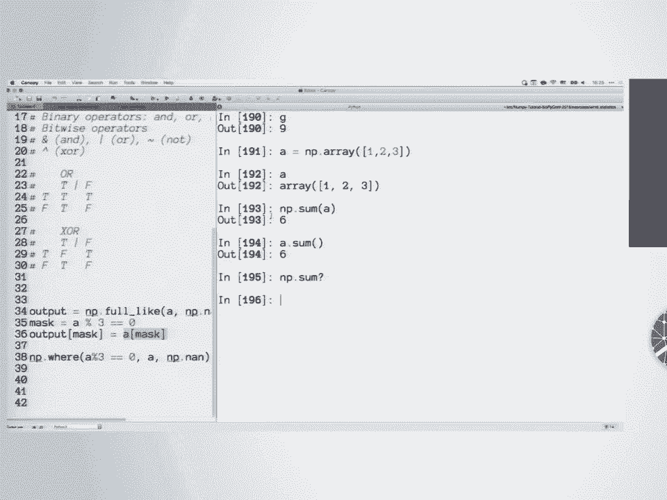

 all right so first first example i'm calling sum on my array a and it by default it takes all。

 the data and collapses it into a single value and the unless here was unless i specify one of these。

 keywords called axis and axis is the dimension that will be collapsed or the axis that will be。

 collapsed so um here i started with an array that's a two by three and i specified axis equals zero。

 so i'm operating along axis zero and that dimension is going to get collapsed i'm going to end up with。

 only three values i'm going to use that in a second and in the second example i'm。

 simplifying a negative axis um just like everywhere else where you would pass an index in python you。

 can pass a positive index from the beginning relative to the beginning or a negative index relative to。

 the end here is specifying axis equals minus one so we're starting from the end of the shapes or we're。

 summing across columns we're collapsing all the columns into a single value。

 hello yes so um a way to think about the axis keyword。

 so if if i have an array that's a two by three and i specify axis equals zero what happens is that。

 axis will go away and i'm going to end up with something that's a three comma。

 if i have an array that's a two by five by seven by two by four i'm starting easy here。

 and i do axis equals zero one two three so that's a three the output of this will be that was a。

 terrible example i'm sorry two five two two four right the one that i'm specifying is the one that。

 goes away i'm going to go back to a smaller one here three by four by five if i say axis equals。

 minus one the result is a three by four yes， can i use a two pole for the axis no it has to be an integer。

 one at a time， sorry axis acts kind of like a group by statement and sequel it's time you're how you want to aggregate。

 the axis is kind of like a group by statement and sequel yeah i never thought of it this way。

 because i'm yeah but um you're gonna like pandas tomorrow。

 yeah sort of um it breaks my mind a little bit because so that the arrays have the requirement。

 of being like it's always full like it's always more like a cube in like a box whereas if you do。

 a group by each group could be a variable size which wouldn't really work but like the the idea is。

 close enough where like if so if you have a table and in a database and you do a group by you're。

 basically take splitting your table into multiple groups it's kind of like reshaping it to say like。

 this is group one is this group b i'm going to put them one behind the other and then i'm going to。

 sum or do whatever that way so i end up with just one table so yes it's kind of like a group by。

 if that helps you it's like a group by yes so the question is so if i have an object that has a。

 shape 2 comma 3 and then i sum over one of the axes where is the result 3 comma or 2 comma。

 where is that comma there it's always a shape it's sorry it's always a tuple and remember。

 is it a comma that makes it a tuple so that's why i'm always writing it with the with the comma i'm。

 talking about the shapes there but is that so you're not saying that it's a three column object you're。

 saying it's a two column it's it's i'm saying it's a three comma which will be a row actually a row。

 object not a column object it's not a three comma one is a three comma is the shape i'm talking about。

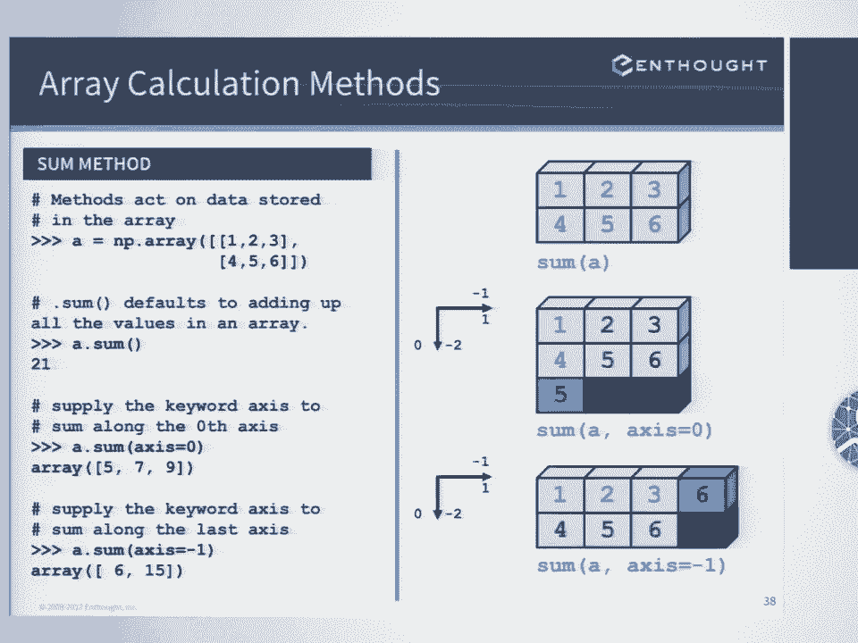

 the shape um so i know you'll walk sorry i know you will walk out of here and we'll forget this。

 this thing that took me years to realize that the axis you specify the axis the one that you。

 specify goes away so for years i i did what i'm about to do here so i'm going to create an array。

 i'm going to make it 24 elements long i'm going to reshape it to be a four uh six by four。

 so what i would do is i would get data from somewhere whatever i needed to i need to work with i did some。

 simulation some audio signal that has a certain number of channels and i would look at the shape。

 of my array and think about it real hard be like okay i have um six audio channels。

 and each of these channels has four samples all right six channels four samples i want the。

 i know the mean value of each channel so how many channels do i have six channels。

 and then i would go axis equals one oops and i look at the shape let me do it again so it's clear。

 and so i want the mean value of each channel i would specify some axis that i'm not sure if。

 is the right one and i would immediately look at the shape and i look at this is this what i expect。

 no i want six values not four values therefore i want axis equals one。

 and then often i would forget to remove the dot shape and i would have an error later because i was。

 working with the tuple instead of an array but i would do something like this and then i would。

 move on with my date so this is you can always fall back to this i still do that all the time if。

 i'm working with really big data we're really big like data that doesn't fit on screen basically。

 so for some people that's big data where there's no point for me to show it on screen therefore i。

 will look at the shape and i'll reason about like what does this data mean how should i work with it。

 so yeah look at the shape before look at the shape after it's one of the most important and。

 useful attribute on on arrays so the question is why。

 why let me try to help you or help me to the why is the axis the one that gets collapsed。

 um it could be the one that is the one that you keep。

 and both of them have or it could be always the last one but then it's not super flexible because。

 you would have to like reshape stuff every time you want to do anything design decision i don't。

 it fits i don't know it's useful yeah he's here this week。

 yeah it might be how another library did it it fits my brain but yeah， so because is the answer。

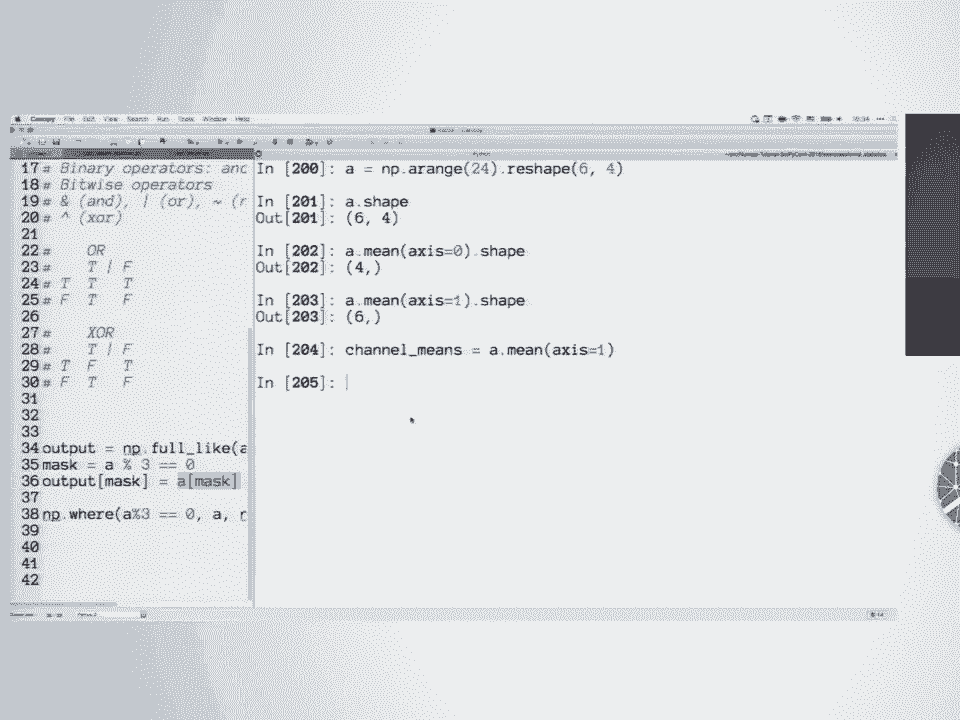

 we're making a good team you and i you and me um all right so we have these methods the access。

 keyword we're going to use again and again uh like i said there are function versions and。

 method versions they work exactly the same way both of them take an access keyword the function。

 version you have to pass in the data you have to pass in the array on the right hand side here。

 is a subset of the methods that exist in numpy there is much more than that but those are sort of the。

 most commonly useful one um， ptp is peak to peak is the extent so is the difference between the max of the array and the。

 min of the array uh speaking the max of min i'll cover that briefly because they're。

 uh a little bit special so they work together basically so min and max they return the min。

 or the max of the array either for the entire array or for a given row or column or along a given。

 axis but they don't tell you where that min or that max is uh argument and arg max or the two。

 other functions that you need to use in order to find the position of that minimum or maximum。

 and again both of them exist as a method on the array and as a function， [inaudible]。

 why index why are again not index again yes we'll have to dig into old commits on some。

 old version control system probably um all right so。

 let's do instead of doing this little exercise here we're going to do a bigger one。

 uh oh um so in the material that you've downloaded there is a folder called exercises。

 a folder called wind statistics and in there a file called the windstatistics。py。

 um so this is um just a python file um so if you're in canopy anyone here using canopy。

 a few people okay so if you're in canopy in order to execute the file there's a little green。

 triangle up there which you can just click and it's going to execute the file for you do percent run。

 um and you'll be able to right your solution in the notebook in the file every time you run the file。

 the output of what you run here will be accessible in the ipython session。

 if there is i didle and i will be walking around and explaining this if you're using jupiter i will。

 create one here， Here。 Yeah， yeah， yeah。 You can do that。

 Let me create a new notebook somewhere else。 So if you're using Jupyter。

 you should navigate to the downloaded materials。 So for me， they're down here。

 And there should be an exercises folder。 Click on exercises， then win statistics。 And in there。

 you'll have the data and the file。 And you don't want to open the file。

 What I recommend you do is go and then open a， sorry， create a new notebook by clicking。

 you in the upper right。 So Python 3， put this on one side， this on the other。

 And then execute a magic called load pi with wind statistics。pi like this。

 And then if you execute this cell， it's going to load the content of the exercise。

 And then you're comfortably in Jupyter， you can copy and paste around and solve the exercise。

 So the file is in exercises， win statistics。 And it's called winstatistics。pi。

 And you're welcome to solve it in any way you want。

 It's a bit tricky to have all this mixed environment。

 So Dylan and I will be working around and make sure that you're all set up to work on this。

 [ Inaudible ]， So there's a function called load text that it tells you to use。

 We've already imported it for you。 And the only thing you need to pass is the name of the file。

 The file is called wind data。 So you can basically， I'm running out of space here。

 This code here on the lower right is enough。 It will load the entire data as an umpire rate that you can then work with。

 So I'm just keeping the important thing in the cell right now。

 Percent load will allow you to load the content of the file in the notebook。

 This will do the import you need。 And then load TXT will load the data that's on disk as an umpire rate。

 And then you should be able to walk through the exercise。 [ Inaudible ]， [ Inaudible ]。

 [ Inaudible ]， [ Inaudible ]， If we want -- it's time if we want to finish on time。 Sorry。

 [ Inaudible ]， All right。 So I'm going to start by loading my data。

 So the function is called load TXT。 My data is called wind data。

 And first thing I do usually when I get new data is I look at its shape。 So it has 6，000 rows。

 That's big data， like I said。 And 15 columns。 This is definitely not going to fit on screen。

 But at the top I had an example saying that the first three columns contain dates or the year month day。

 And then the last 12 columns contain the data。 So I don't want to keep on slicing all the time throughout my notebook。

 So I will start off doing a slice to separate the dates。 So the dates are all my data。

 All the rows of my data， but only the first three columns。

 And all my wins are all the rows of my data from column number 3 till the end。

 And remember slicing gives me a view of my data。 This is super cheap。 I'm not using lots of memory。

 I can make a bunch of slices。 I'm not copying anything。

 But it will make the rest of the code much easier to read instead of seeing data colon comma 3 colon all the time。

 So question number 2， I want the min max mean standard deviation over all locations。

 I want to collapse the whole thing。 So this is the， I'm just going to do the mean here。

 I'm going to show the other ones for now， but for the rest， I'm just going to do one at a time。

 I'm just going to show one to save some space。 So wins dot min wins dot max wins dot STD for standard deviation。

 So this， because I'm not passing any access keyword to mean min max and STD。

 it just collapses the whole array into one。 So if I print this， I'm getting four values。

 Then question number 3， I want， let's say the minimum ever recorded。

 So that's min at each location over all the days。 So I want to collapse the days and I want to end up with a value per location。

 So wins has a certain shape， 6000 rows， 12 columns。 And I think I want。

 so how many values do I want to end up with 12。 So is this axis zero or one？ I don't know。

 It's not one。 So it must be the other one。 All right， again， that's the， it still work。

 This is valid。 This is a valid way of figuring out which axis it is。 It is just try it。

 And reason about the shape， it is it is this， what do you expect or not？

 So it is not axis one that I'm looking for。 It is axis zero。 And then question number four。

 I want one value per day。 And this one， I can reason the same way or I can reason that it's not zero。

 therefore it must be one。 Right？ That's sort of the simple way。 I can。

 it's always good to double check。 So I'm going to access equals one shape， 6000。 Yep。

 that's what I expect one value per row。 Question number five。

 I want the location that has the greatest win speed on each day。 So each day， I want 6000 or so。

 I've already figured out which one is zero， which one is one。 If I have one value per day。

 I want axis equals one。 The question here is what's the method I should use？ Max， min， variance。

 Or arg max， yes， arg max with axis equals one。 And finally gets interesting here。

 I want to find when the greatest win speed was ever recorded。 And that's fun。

 And there are also many ways of doing this。 There are at least three ways。

 I can never remember the fourth one。 I had a student come up with a really clever way。

 but I can't remember。 So let's start with one。 Does anyone have a suggestion？ Someone says mask。

 Someone says arg max。 And someone says arg max of the max。 Alright， let's start from the bottom。

 Arg max from the max。 So wins dot max along which axis。 Yeah， I should be arg max first。

 And then the max within the arg max。 I disagree respectfully。

 Because if I get the max of the arg max， the arg max is going to give me a value between the highest row number or the highest column number。

 And that's the opposite thing。 So if you take the max of each of the columns。

 which is for each of the locations， right？ And then you take the arg max of the vector that should give you the location within that vector。

 So that's arg max of max。 I agree with you say that way。 So I have my table。

 What I'm going to do is I'm going to collapse it this way。 So for every day， every day。

 I'm going to get the max。 Every day， I'm going to get the max。 I'm going to get it with 6。

000 values。 And then I'm going to find the arg max of that。

 which is going to give me the row where that happened。 So I want to collapse the columns。

 collapse along axis one， just sending you check。 Yes。 And the arg max is row 2，161。

 So that's my row。 And the date is in my dates data。 I want the data that particular row。

 which was which is 1966 December 2nd。 So you're inverting if you did it as a function rather than the math that you convert the order to the right。

 Ah， yeah， I see。 Yes。 If it was a function， if I was written as a function， I would have to do np。

arg max of np。max of wins。 Access equals one。 Okay， okay， okay。 Bao。

 Can you back up just to that where you have the row number and then you feed it into dates？ Yeah。

 So， so a row is some value。 My dates is a slice that I've made earlier that contains only the first three columns。

 And I'm interested at a part of a interested in a particular row of which I want all columns。

 which is this selection here。 So that's technique number one。 Technique number two is。

 I don't care about that this array is multi dimensional。 I just want the arg max。

 which gives us this number。 Which is obviously the linear index of the position of this maximum。

 Then you can do this dance to be like， okay， so I can do a floor division by the number of columns。

 This never happens。 I got it right the first time。 This never works。

 You're guaranteed to write a bug when doing this。 But yeah， I got it right。

 But there's a function in numpy that can do this for us called unravel index。

 Which does this neat things where you give it an index or a list of indices and the dimensions or the shape of the array that you want to。

 Where it was taken from basically and it's going to return a tuple of where that number is。

 So I could do unravel index of wins。arg max。 Sorry。

 given that I'm in an array of a certain shape tells me row two thousand one hundred sixty one column eleven。

 And there we call them。 I'm just going to do it here， but I will need to import numpy as NP。

 It hasn't been imported as NP above。 So that would also work。

 And the last one with the mask is arguably the best one。 I'll give you that。

 So the idea is given some wins。 I want to find out where it's equal to wins that mask。 Max。

 This is hard。 And somewhere in here， there must be a true because there must be a max。

 And I can use either。 So NP。where or this other one that we worked with before called non zero。

 They do the same thing in this case。 It returns a tuple of arrays with the coordinates basically of all the maximum。

 So it is the most powerful because it gives you if there are multiple maximum。

 it will give you the position of all of them。 But it is the easiest one。

 the hardest one to understand and like what do I get out of this？ You get a tuple of arrays。

 Those are row indices and these are column indices。

 So I could use this code here to say rows and columns is equal to where。 So I'll just call it row。

 So all three of these solutions would give me December 2nd， 1966。

 Can you put that in square bracket in addition？ Can I put what do you mean？

 Could you call that row by putting that mask in square bracket for addition？ Here。

 so all the variables I called row here， I can use。

 they'll all give me more or less the same response on line 106。

 So you've put like a square bracket mask and pull that row。 I have nothing to give you that day。

 This mask and no， because this mask is 2D， it would give me the value。 It would not give me。

 if I use the result， if I use this， it would give me the masks。

 But that's not what I'm interested in this case。 I'm actually interested in where it is。

 not what it is。 All right， and last but not least。

 I want the average wind speed in January per location。 So we've got to break this apart。 First。

 I need a definition of what's a January。 Thanks， I don't complete。 So January is what？

 Which rows are January rows？ Yeah， so I have two data structures now。

 a dates array and a wins array。 Wins array doesn't know anything about time， not useful。

 Dates array is this guy over here。 And the second column represents the month and it uses one base indexing for the month。

 So I can do dates， all the rows of column two， a column one。 Thanks for catching my error。

 Whenever that is equal to true， then that's the month of January。 So if I look at this mask here。

 it's true， true， true， and then false at the end， even without looking at all the data。

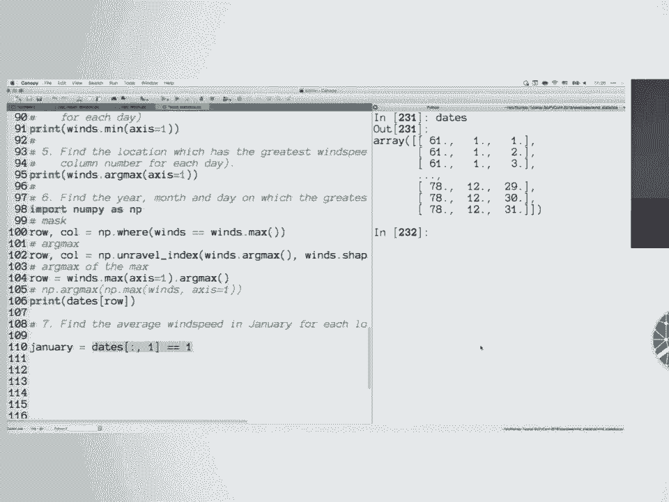

 I'm really confident that it's doing the right thing。 And then， given my wins。

 I can reuse that January mask。 I can do that even though I computed my mask on another object。

 because the mask has the same number of rows as my wins data。 That's fair game。 So all the rows。

 sorry， only a subset of the rows where this mask is true。 All the columns。 And I want the mean。

 This is the last time I will ask you。 The means one value per column。

 one value per location is that should I specify axis zero or axis one？ Yes， zero or one。

 That's zero。 So I want to collapse my table this way。

 This is axis zero is the one that I want to go down to get rid of。

 So I specify axis equals zero here， and I print that。 And that's it。

 So these values here are my average wins speeds in January for the 12 Irish cities where this was measured。

 [inaudible]， Yes， I could use negative two。 That is correct。 Good job。 Yep。 But it's not bad。

 I agree。 Negative two。 Both of them are useful。 Both of them exist for a reason。

 because sometimes you don't know ahead of time how much data you're going to have。

 And sometimes you don't know it might be deeper than you think。 So， or shallower。

 your array might be shallower deeper than you think， have more or fewer dimensions。

 And using negative indices always gives you a relative to the end。 So not a bad idea。 And with this。

 the day is over。 Congratulations。 This should get you a good foundation of reasoning about non-py arrays。

 This axis keyword is everywhere。 Thinking about slicing， thinking about indexing。

 The fact that being aware of what gives you a copy， what gives you a view is also super important。

 There's a little bit more stuff in these slides if you want to look at them。

 And you'll be a little bit about broadcasting。 There's also a little bit of a discussion about how reshaping works and how it's a cheap operation because it doesn't copy data either。

 It just reshaped the interpretation of the memory into a new array。 But yeah。

 that just gives you a solid foundation。 And non-py is one of those packages with awesome documentation。

 So that's also a good place to look at。 So， thanks for today。 I hope you learned a thing or two。

 And I'll be here if you have any questions。 So， thanks。 [Applause]， [BLANK_AUDIO]。

