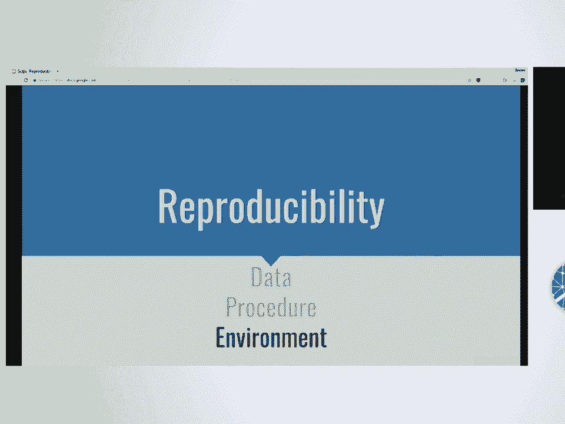
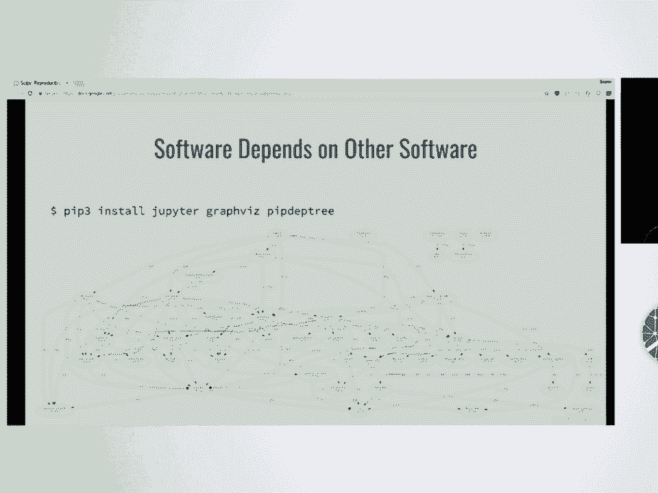
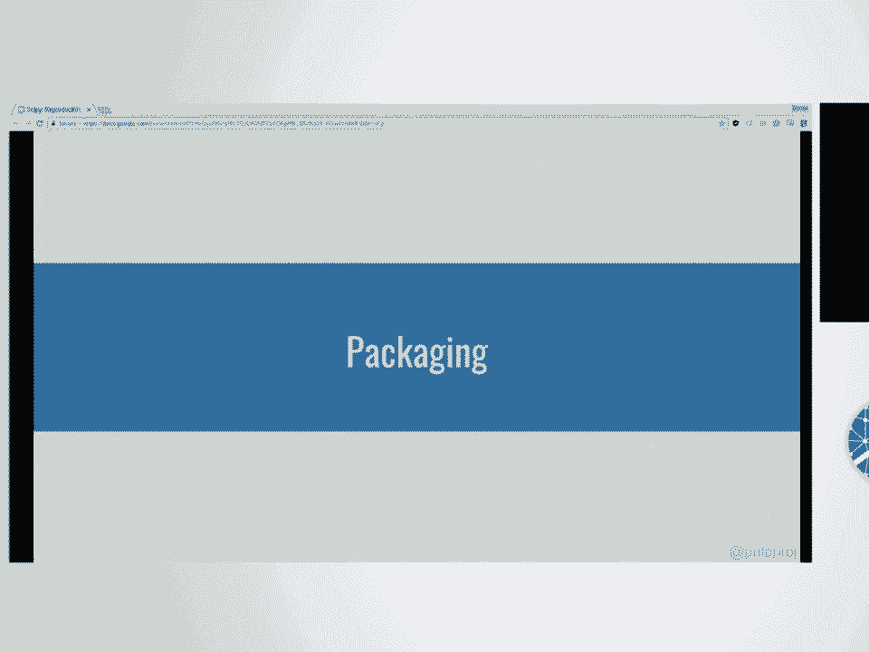
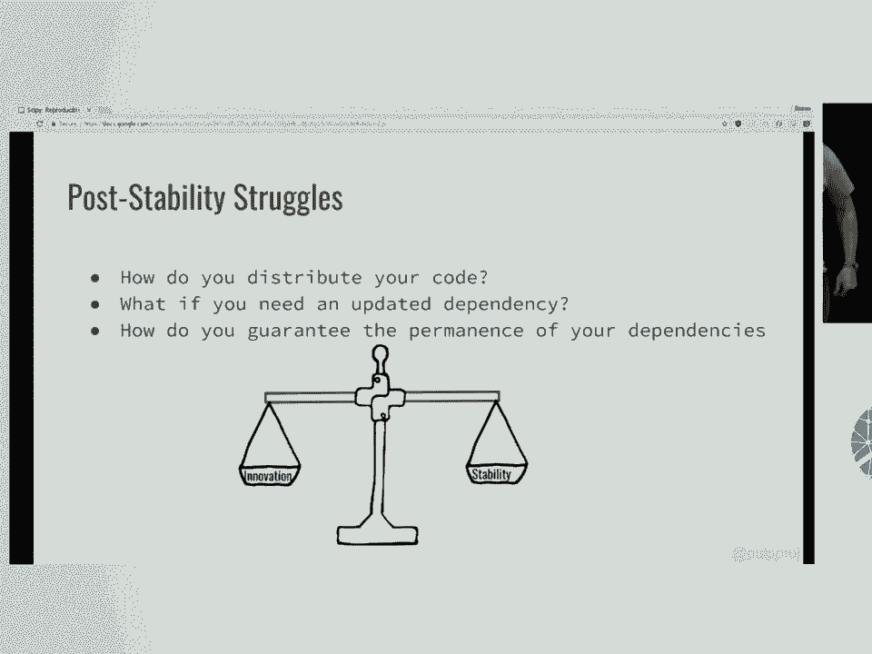
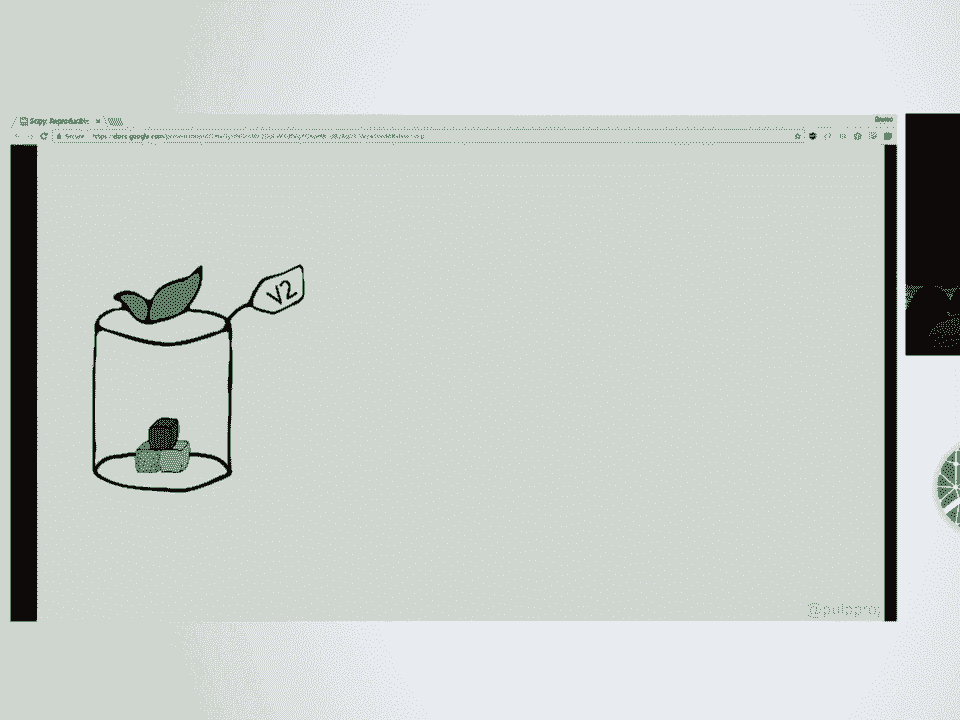

# SciPy 2018视频专辑 - P62：SciPy 2018视频专辑 (P62. Reproducible Environments for Reproducible Results _ SciPy - GalileoHua - BV1TE411n7Ny

 Hi， you guys。 My name is Bee Han Zeng， and I am a software engineer at Red Hat。 I'm Austin McDonald。

 I'm also a software engineer at Red Hat， and together Bee Han and I work on the pulp team。

 We're here today to share how you can use pulp to make science better。 Throughout this talk。

 we'll discuss the problems of creating and maintaining， reproducible environments。

 Part of this talk will be focused on using standard tooling techniques to do that。

 but we'll also introduce more powerful workflows using a repository manager， in this case， pulp。

 So let's talk about what scientific reproducibility is。

 It's taking the provided materials from an original researcher in order to reproduce the results。

 This is really important because it ensures transparency and gives us full。

 confidence in understanding exactly what was done。

 There's a couple of different aspects that go into reproducibility， like the data， the procedures。

 and the environment。 In this talk， we'll focus specifically on creating environments。

 So let's talk about what can go wrong。 We don't have replicable environments。 As a note。

 this problem isn't only in the scientific space。 It occurs a lot in software engineering， too。

 When we have to validate that the same environment that a piece of software is being tested on。

 is the same environment that is in production， because otherwise things can go wrong。

 So having the same code doesn't necessarily mean you get the same results when you run it。

 There's a couple of different reasons why these two people might be running into this。

 It could be that they have a different dependency version。

 It could be that she's working on Python 3。5 and he's working on Python 3。4。

 and they just haven't talked to each other yet。 Or it could be that they have a different system configuration。

 So there's a lot of subtle differences in every system。

 And the reason why this problem is so hard to solve is because software depends on other software。

 So this is the dependency graph for Jupyter， GraphVis and PipDupTree。

 And just as no GraphVis and PipDupTree are used to generate this graph。

 So they're kind of like in that corner over there。 But the Jupyter dependency itself is very。

 very complicated。 So how do you package your code when it has all these complex dependencies？

 And how do you maintain your package after you've created it when dependencies are updated？

 So as Bihan led to， packaging is an inherently difficult problem because it solves messy problems。

 And every software ecosystem does it slightly differently。

 But we can simplify this and talk about it at a high level。

 And so we've divided it into two fundamental approaches。

 How's our way？ There we go。 All right。 So the first approach is the monolithic approach。

 And in this pattern you bundle all of your software with all of the dependencies that it needs。

 And you release it as a single package。 This is commonly used in Windows and OSX。

 I'm sure that you've used this kind of thing before。

 And it comes with its own set of benefits and problems。 So first of all。

 it's awesome because there's only one thing to install。 It's easy for the user。

 It's easy to replicate because you know that you've already got all of the dependencies and all the exact versions already there。

 But it's got problems too。 First they're huge because it contains lots of stuff。

 Probably a bunch of stuff that you， the researcher， don't care about or that you don't know about。

 That's not ideal。 The other problem is that as the packager， you have to。

 if you want to include a dependency update with your software。

 you'll have to repackage it every time one of your dependencies is updated。

 This is a huge tax on developers time and it usually leads to a slow release cycle and outdated updates and possibly code entropy which we'll get to later。

 And lastly， all that extra information means that it's harder for your reviewers to actually look at your code because there's just so much that they have to know。

 So to sum up monolithic style packaging is good for reproducibility but it moves slowly。

 The other approach is the opposite。 You don't bundle your dependencies with your software。

 You just bundle your software by itself and the dependencies are handled some other way。

 Usually by a package manager。 I hope all of you are familiar with this because this is what Python does。

 This is what Linux does。 Yay， open source。 This is the open source way。 But again。

 this is really optimized for software developers and it can have some problems especially in the research field。

 So the pros， as I said， you don't have to rebuild your packages so it's easier to maintain。

 There's less to do。 There's less code so it's easier for your reviewers to have a look at what you're doing。

 But at install time there's more that the package manager has to do。

 And that complexity can lead to issues。 Additionally。

 you'll have situations where you can update a dependency and that will introduce instability。

 This can be very problematic and break your reproducibility and this is a dangerous thing you want to avoid。

 And of course， your dependencies can conflict with each other and we definitely want to avoid that。

 So let me just give you a quick overview of the Python ecosystem and the tools and techniques that it provides that you can use for reproducible environments。

 So quickly overview of the Python ecosystem， Python packages are modular。

 These packages are stored in a centralized repository called the Python package index， PyPI。

 not PyPI。 All packages on PyPI are community contributed。

 There's no curation so the quality of packages can differ。

 And since packages aren't curated together， they aren't guaranteed to interoperate together。

 There are a lot of guidelines for package maintainers on PyPI but they're not always followed。

 So packages might release a backwards incompatible version or it can even be deleted。

 Also that's really rare。 It has a package manager called pip that resolves dependencies during install like Austin said。

 And by default pip installs packages from PyPI but it can interact with other package indexes。

 And no talk can go without mentioning virtual environments。

 So a lot of the problems of modular packaging can be resolved by Zs。

 So these are isolated environments that separate installed packages and dependencies and it can prevent a lot of your dependency conflicts。

 All right so within the Python ecosystem， what can we do to have reproducible environments？

 It's clearly a hard requirement so what do we need to do？ So first of all。

 there's only one way for software to work correctly but there's a lot of ways it can work incorrectly。

 And so naturally over time this leads to code breaking and that's what we call code entropy。

 So the approach that we recommend is while you're developing your software。

 you optimize for innovation over stability。 And you do this by updating each of your packages as often as you can and this will lead you to be ahead of entropy as far as possible when you release your stuff。

 After you've finished development and you start to use it in your research though。

 you need to take the other approach which is to make it more stable， make it more reproducible。

 And so you've got the same packages and what you need to do is lock those packages down。

 You need to make sure that all of the dependencies are going to be installed exactly the same version。

 exactly the same way。 And the typical way to do this in Python is with a requirements file or if you're fancy and up on the latest stuff you'd use pipenv in a pipfile。

lock。 But I recommend reading the Python packaging guide。

 There's lots of great stuff in there that you can do this with。

 So now that we've locked down our dependencies， we've got our requirements。

 we're optimized for stability and reproducibility， we still have some problems。 So first of all。

 how do you distribute your code？ How do you get the code from your machine to your reviewer or your collaborator or the rest of your lab or somebody who's reproducing your work？

 It's very important to do this and you need to include all of the same dependencies as well。

 So what happens if after you've released one of your dependencies has a security bug fix that you absolutely need to include？

 Do you really need to rebuild all your stuff from scratch？ Well， yes。

 you do because if you've locked down your requirements。txt。

 then that's part of your code and you'll just have to rebuild it and redistribute。 And lastly。

 even though it doesn't happen very often， those packages can go away。

 So how can you guarantee that you're depending on something that will be there tomorrow？

 I think all of you have put way too much time to leave it to chance for someone to delete some little package like leftpad。

 So while doing all that， is it possible to balance innovation and stability？ And the answer is yes。

 So Austin and I work on Pope and we hope this tool is a tool that can help you with these problems。

 So let me just give you a quick overview as to what it does。

 Pope is a open source free repository manager and a manager is a lot of different software packages like Python packages。

 generic files， those could be configuration files or any files file in your file system。

 container images and Ansible rows and a bunch of other things。

 So we provide one single API that can be used to manage all these things。

 And it's worth it to know that because we're plug and based any type of content you need to manage。

 you can write a plugin for us。 So if you have custom content， maybe Pope is way to go。

 And plug and writing is really simple and we're always happy to help。

 So Pope organizes these content into repositories。 And every time content is added。

 removed or changed in the repository， we create a new repository version。

 So these repository versions are immutable and preserved。

 And this enables you to go back to any previous version if you accidentally did something wrong or view changes to a repository over time。

 Additionally， each plugin can generate information or what we call metadata about the content in a repository。

 So this metadata is usually used for client discoverability， which I'll get to on the next slide。

 And we call a repository with metadata of publication and it's wrapped in a bow to hand off nicely to clients。

 So publications can be installed， say with pip。 You can pip install and from a pope publication。

 So the key point is that with pope， the code author has the flexibility to choose their own balance between innovative and stable。

 And so the real idea here is that you want to get the best of both worlds。

 You want it to be easy to maintain。 You want it to be clear for your reviewers。 For your users。

 you want it to be very easy to install and definitely easy to reproduce。

 So we've talked about a lot of tools and wow， oh my gosh， what do you do？ Well。

 I'll take it back a little bit and give you those tools in a workflow designed for reproducibility。

 So here's how the fundamental thing that pope offers to researchers is a concept of curated repositories that you manage。

 So if you remember， when you pin your requirements， that's how you got your stability。

 but it came at the cost of flexibility。 You can't update once you've penned your requirements without actually changing the requirements file and bumping your own version。

 In pope， you don't have to pin your repositories。 Or yes， you don't have to pin your requirements。

 Instead， you control your dependencies by curating the repository。 That means that you。

 as the code author， get to control all of the dependencies even after you've released the code。

 And this is extremely useful for that bug fix， the security bug fix that you absolutely have to include。

 even after you've already sent the link to your reviewer。

 So once you've curated a repo in your package within a known good set of dependencies。

 you can update your dependencies without altering your code。 That's the fundamental point。

 And here we have our engineer saying that this is a good set。 It worked for her。

 But that's not quite enough。 In software engineering。

 we typically have a long process about how to release code and how to make sure it's right。

 And so I'll show you this。 We call it life cycle management。

 And the general idea is that you take a known good set， you publish it。

 and from there you can test it。 And only after testing it， you promote it to a publication。

 or a production distribution。 This is very powerful because it allows you to do both at once。

 You can have a production and a testing repository both live at the same time。

 So you don't have to stop work just because somebody's reviewing your stuff right now。

 So this is a very powerful tool to enable both stability and innovation at the same time。

 And as Bihan alluded to， if there's a problem， you can roll back immediately。

 You've got a set of content that worked yesterday。 You updated it。

 And suddenly it broke your friend's environment who just， for some reason， is using Arch Linux。

 and can't seem to install the right stuff。 That's okay。 Just roll back to the old publication。

 fix it in the testing repository， and then promote it again。

 So let me just quickly talk about a couple of other use cases for Pope。

 So one other use case is to create a local mirror。

 So there's a couple of reasons why you might want to use this。

 Having a complete Python package in dex mirror can help you conserve bandwidth。

 especially if you're out of the way research station。

 So you would download all of PyPI to a single machine once。

 and all other updates can be performed from that local network machine。

 Or if you're working for the government， there might be rules about which package you can or cannot pull in。

 Maybe only packages that， or maybe only the only package they're allowed to pull in。

 have to be first validated by a security person。 So this can be done by writing a pope mirror with whitelisted packages。

 Another use is for distributing your own software。

 So maybe you don't want to upload to PyPI or aren't allowed to。

 and pope is a great way to share packages internally in a pip consumable way。

 So now that we've covered reproducing Python environments。

 let's talk about a couple of other things that are very important to full reproducibility。

 Because the Python environment is only the beginning。

 The Python environment is built on top of the system environment。

 and system dependencies and system configuration can also affect how programs behave。

 Because a lot of Python packages rely on bindings to system code like GlibC or OpenSSL。

 So a virtual machine。 So this is the ultimate monolithic package。

 It's a snapshot of a system at a point in time。 And you would think that because it is the exact snapshot that you share with someone else that you're guaranteed to be fully reproducible。

 But there's a couple of subtleties with a virtual machine。 First of all， it's large。

 And that makes it hard to share， but that's not the main issue。 It's also opaque。

 which means that you're giving them an entire operating system。

 How do they know what exact changes you made？ How do they know what configurations you've updated？

 And since the virtual machine is an entire operating system。

 it can have running processes in the background that changes its structure over time。

 When you first share your virtual machine， when someone is spinning up。

 you're guaranteed to be at the exact same spot as a snapshot。 But as time goes on。

 the virtual machine can actually diverge。 Because there's processes running these backgrounds you might not be aware of。

 For instance， it could be doing things like auto detecting time zones。

 Or it could have an auto updater running in the background that can change your system environment。

 So because of OZs variables and it's large and there's no picnus and monolusicness。

 this isn't usually the recommended way。 But luckily。

 there's some other tools that can help with this。 First of all， there's Ansible。 With Ansible。

 you can automate everything and you can do this in a very transparent manner。

 So you can automate installing your system dependencies， setting up your system configuration。

 installing and configuring your package， and installing Python dependencies。

 whether from PyPI or from Pope or from anywhere you please。 So Ansible Script is very transparent。

 A reviewer was Ansible Script can tell exactly what you're telling Ansible to do。

 And you can share your Ansible content on Ansible Galaxy。

 And this is centralized Ansible repository in the sky that manages all Ansible rules。

 But how exactly do you include workflows in this？ How do you curate your Ansible content？

 How do you control the level of stability and flexibility of your Ansible content？

 And how do you promote things from testing to production？ And our answer is Pope。 So with Pope。

 you can manage your Ansible content in repositories。

 You can publish them and you can consume them with the Ansible client。 And of course。

 let's talk about containerization。 So containerization are immutable system images。

 but these are different from virtual machines。 So first of all， they're a lot smaller。

 And they only run a single process。 So you don't have a lot of the different variables that might get in the way of a reputable environment。

 Oh， you have a Docker container is a single process that you're running and that you care about。

 You can see how do you manage your Docker images？ Well。

 Docker files is a transparent way of creating Docker images。 So if you look up Docker files。

 you can see it's basically a list of instructions to create a Docker image。

 And Docker images can be shared on Docker Hub， which is the centralized Docker repository in the sky。

 But how exactly do you have workflows in Docker Hub？ How do you curate your content？

 How do you control the level of stability and flexibility？

 And how do you promote things from testing to production？ And our answer is Pope。

 So it was Pope you can manage your Docker images。 You can publish your Docker images and you can consume them when you're ready with Docker client。

 So the summary is you get the best of both worlds。 You're able to curate repositories。

 which gives you all of the innovation and stability that you need。

 And the versioning to roll back and move forward as necessary。 So a couple of talks ago。

 we talked about， so what has this been used to build？ Is this stable？ Well。

 this has been used in the business community for like 10 years。

 There's 12 or 13 full time people working on this at Red Hat and there's no sign that we're going anywhere。

 And we're actively working on the next major version of Pope。 And we are very pleased with it。

 And you'd recognize many of our customers that are actually paying to use this。

 but you can use it for free。 So with that， I'd like to open it up for any questions。

 But I do want to mention that we have signed up for a room， a room 210 tomorrow at 11。

 And at that time， we'll be happy to answer more questions， help you get set up。

 talk about your particular case。 Maybe you've got something that we don't do and we can write up an issue together。

 But check out our website and check us out on Twitter。 [applause]， Great。

 Thanks so much for that great talk。 I think I'll know the answer to their questions， though。

 Is it Pope？ [laughter]， So that's a great opportunity to talk with you tomorrow， too。

 So I'll start here。 Thank you very much for the talk。 Actually。

 I'm still a little bit confused about the whole thing。 So basically。

 how do you guys actually deal with the situation that you mentioned that some packages got deleted？

 So when you package the thing， do you actually package that package inside your container？ Yeah。

 let me take this one。 So a curated repository is your--let me go back to that slide real quick。

 Wherever it is。 All right。 We need to use this。 All right。

 So your unknown good set includes your package and all dependencies that you need to run that package。

 It's monolithic in that way， but it's also modular because you can pip install your package from it and you can pull into other dependencies。

 Does that--the other key thing to mention here is that you're hosting your own repositories here。

 So you can have your own version of PyPI that you're running locally or that you're running maybe on the cloud or something like that。

 You can have your own Docker hub。 You can have your own Ansible Galaxy。

 Like you're in complete control。 And so you get to host this。

 So even if somebody deletes it over there， you've already got it。 [ Inaudible ]， Hi。

 I've actually worked with some of your colleagues in Houston using OpenShift。 I was just wondering。

 in OpenShift， what we're doing is we're using GitHub repository to pull in our files。

 So is this just another way of actually going ahead and kind of building your container and then managing your container？

 So this is a way of managing your container。 So you upload already built container images into Pope and Pope manages for you by providing all those workflows。

 [ Inaudible ]， So I'm just going to repeat in OpenShift we've been using Kubernetes because OpenShift has set some Kubernetes。

 And this is just a different way of using that without Kubernetes。 Basically， yeah。 [ Inaudible ]。

 There's another microphone， but this is more fun。 [ Inaudible ]。

 So does this currently work or could it work with Kanda？ And how would that。

 would it work the same as Pip， basically？ Yeah， so we were expecting this question。 [ Laughter ]。

 So we don't currently work with Kanda， but like we were saying earlier。

 it's a plugin architecture and we've really gone out of our way to make plugin development really。

 really easy。 So hopefully if you're all Python developers。

 you could probably whip one up in a week or two。 And with a Kanda plugin。

 you'd be able to manage Kanda content。 [ Inaudible ]， Who is over here？ Someone was over here。

 [ Inaudible ]， Maybe， I don't know enough about the sort of packaging and repository field。

 but could you maybe compare and contrast with something like Artifactory。

 which is a place where you can repose。 So we are a free and open Artifactory。

 And Artifactory does support a lot more plugins than we do because we're a development team of 10 people and they're a development team of a lot of more people。

 But we are built completely in Python and at least Austin and I have read all the Python types and we got the space down。

 We were actually at Python and one of the more common feedbacks about Artifactory is it feels like they don't understand Python package management。

 they have some of the metadata wrong。 We got Python packaging down。 We're also free。

 I'm going to see if there's any other。 Anyone else before I --。

 So this is just a quick question regarding to the guy who asked about a Kanda。

 And it's not going to be about pulp， but can't you use Kanda on OpenShift？

 Because I was led to understand that you can go ahead and create a repository。

 get the files that you need in there， create your container and run with it。 Of course。

 that is not free。 I'm not sure about running Kanda on OpenShift。

 It's not a problem I've had to do before。 I suggest posting an email to the OpenShift mailing list。

 Sorry， we work on the open source， pulp project and as far as interaction with OpenShift goes。

 we've used it once。 So putting it out there。 >> All right。 Thanks so much。

 They can take one more question while we swap out。 Is it -- I don't know。 Chris， who's presenting？

 You want to come down and get set up。 I need one more。

 >> Is there an anaconda plug in for pulp？ >> Not yet。

 but I would love to help someone write one if anyone's volunteering。

 [BLANK_AUDIO]。