# P6：SciPy 2018视频专辑 (P6. Interactive 3D Visualization in Jupyter _ SciPy 2018 _  Maar - GalileoHua - BV1TE411n7Ny

 Hello everybody， my name is Matt Bredos and I'm gonna talk about well interactive 3D。

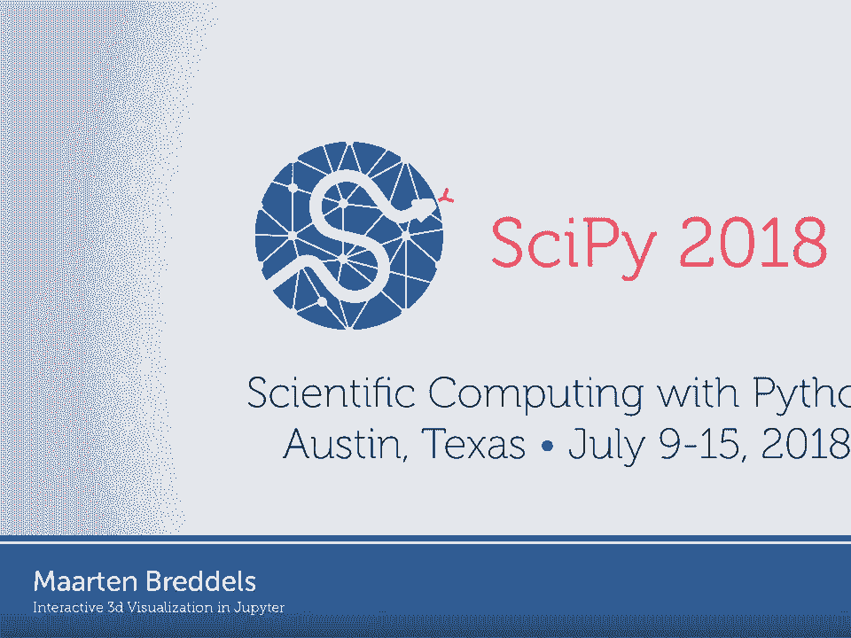

 fish in Jupiter。 So I'm a trained astronomer， I was working on software for big data and。

 visualization facts。 Now I'm a freelancer consultant working on data science work in。

 the Python and Jupiter ecosystem。 I'm also a core Jupiter， which is developer and author。

 of what I'm gonna talk about， IPyvolume and effects。 You can find me on the internet， at Twitter。

 Gmail， get up， I assume probably also get lab and on the web。 So today I want。

 to talk about like a bit of the history why I created IPyvolume。 Some motivation behind。

 it and I want to give some live demos， some more live demos， some more and I'll end with。

 a live demo。 And so after that I'll give some future plans。 So a little bit on the history。

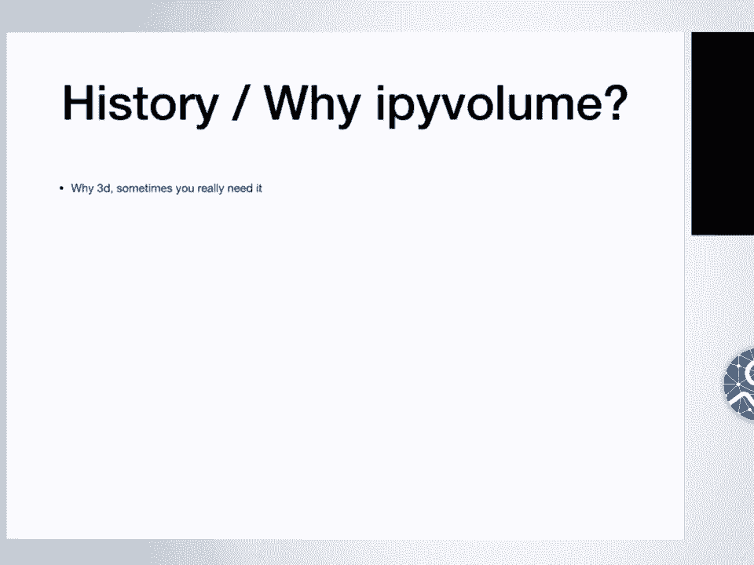

 So let me start with a pre-demo demo。 Actually let me start with a pre-demo demo。 What didn't。

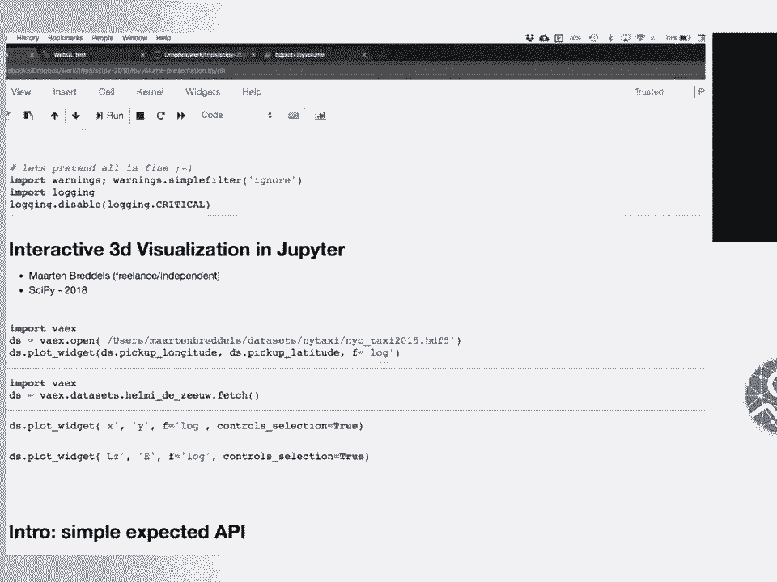

 work with Silfan？ I just want to show that it works with facts。 So this is like a I think。

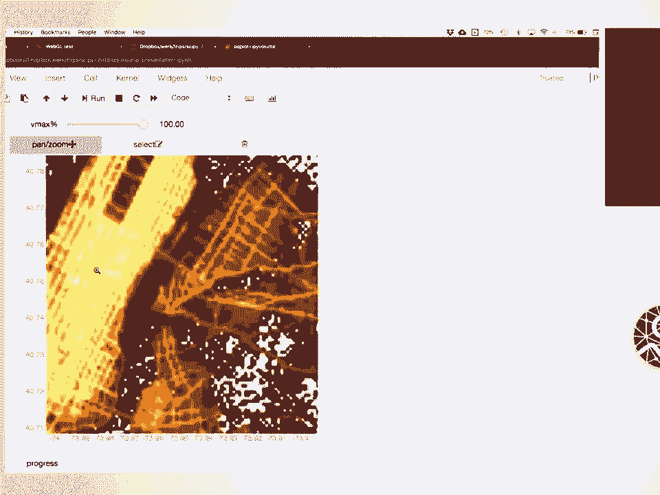

 150 million data points。 But I want to show a data set where we really needed 3D。 So what。

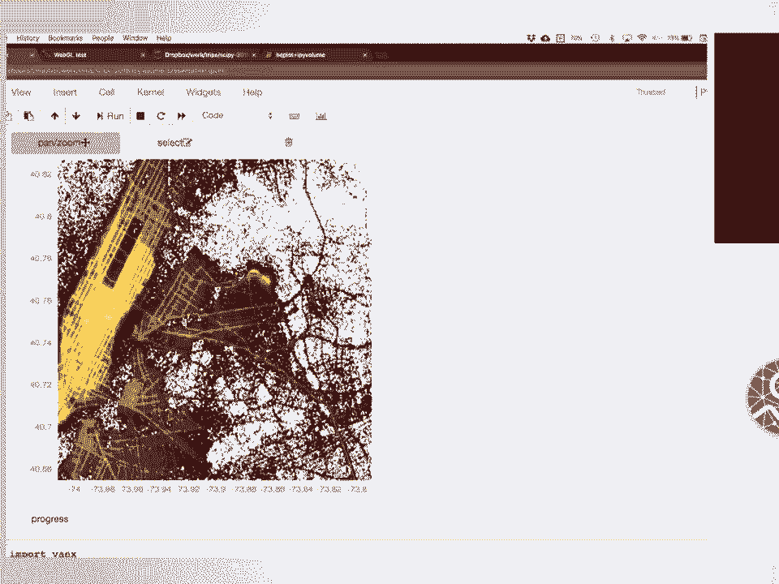

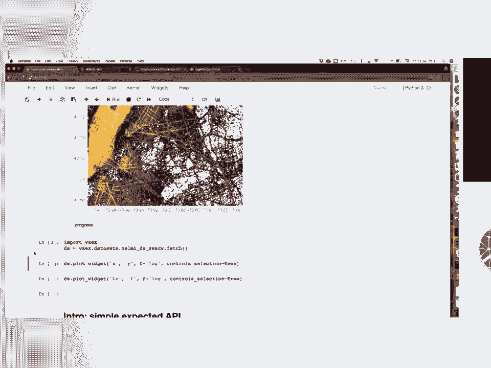

 this is is a simulation of Milky Way Halo， which is like the spherical component of our， Milky Way。

 And what it looks like is like a smooth component。 Well if you look at other。

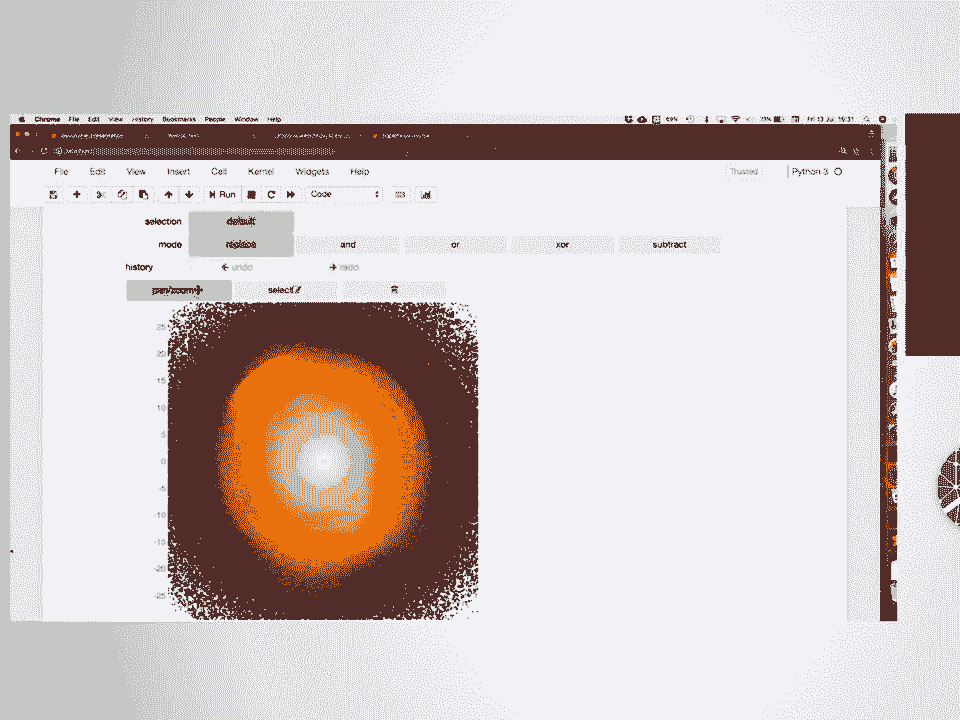

 features， I'm not gonna go into the like the science behind it， you see that it's actually。

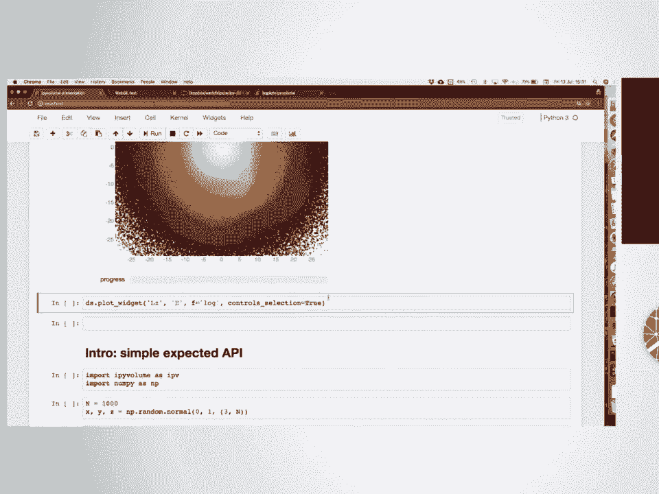

 like a lot of clumps。 And if we try to like isolate one of these clumps， you see that。

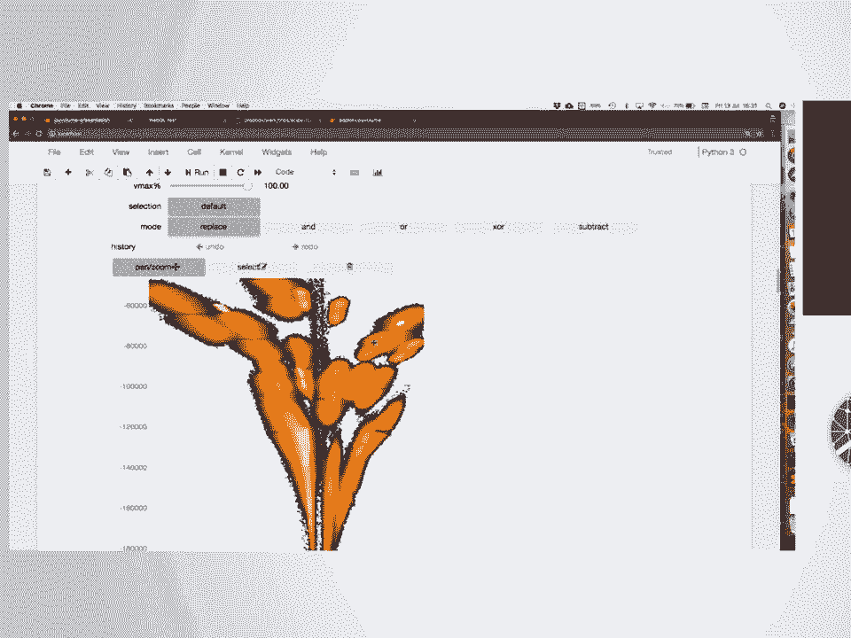

 it's not so smooth。 But this is just like a 2D view so we can look at it at different。

 angles but I'm gonna show you that you really need 3D to take a proper look at this。 So our。

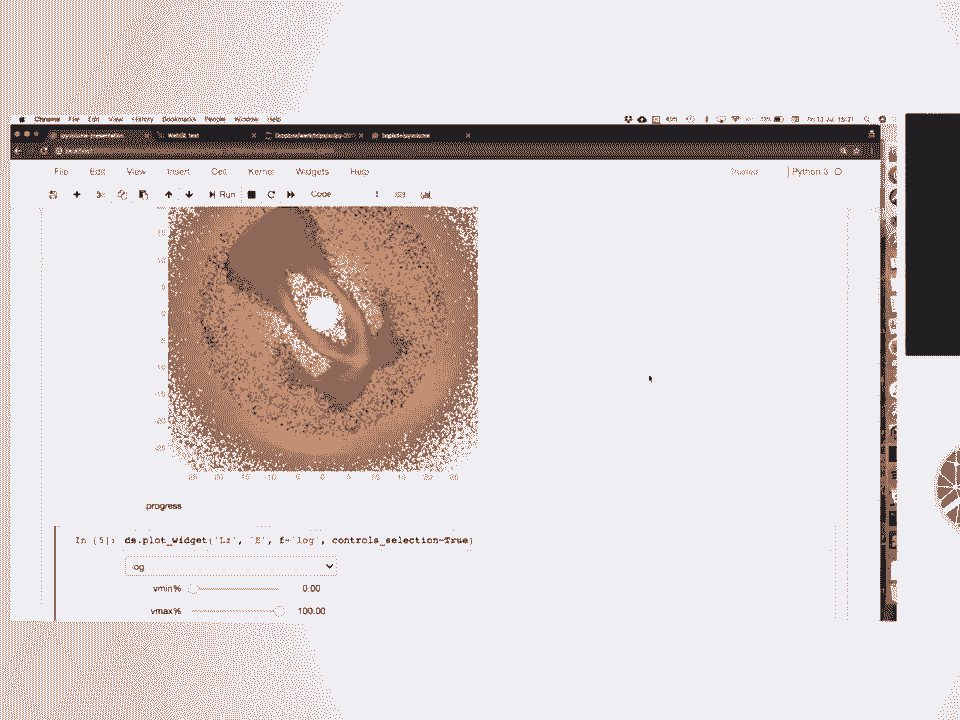

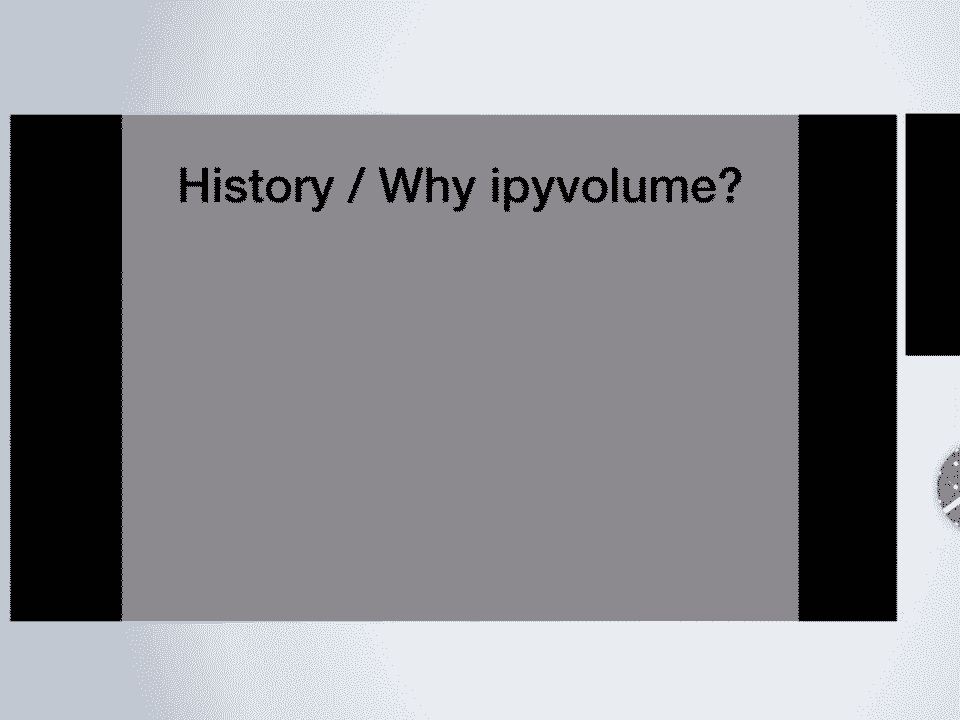

 universe is 3D and our galaxy。 So before IPythonium。

 I had a proof of concept just on a like a webpage。

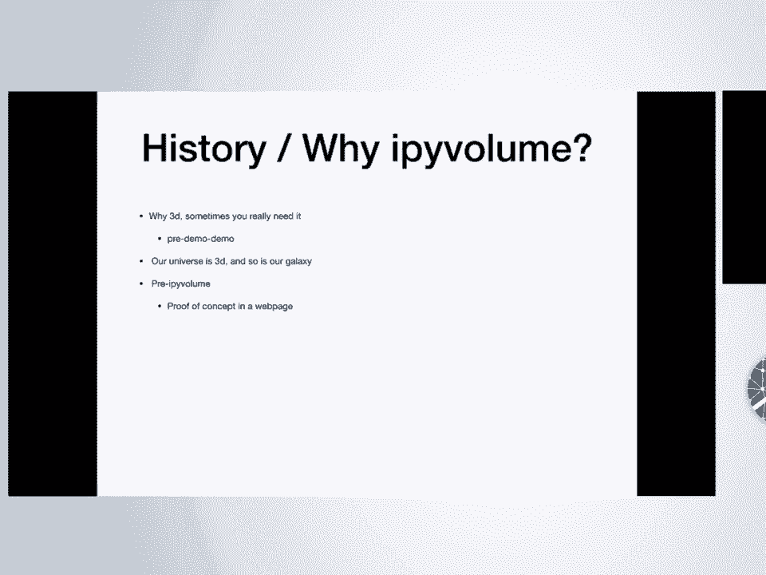

 So let me show you actually what it was。 I thought like can we do this actually on a。

 webpage and just play it around with WebGL and some sliders using jQuery and that looked。

 pretty nice and I thought okay this is something I could do。 So I had a like a really ugly solution。

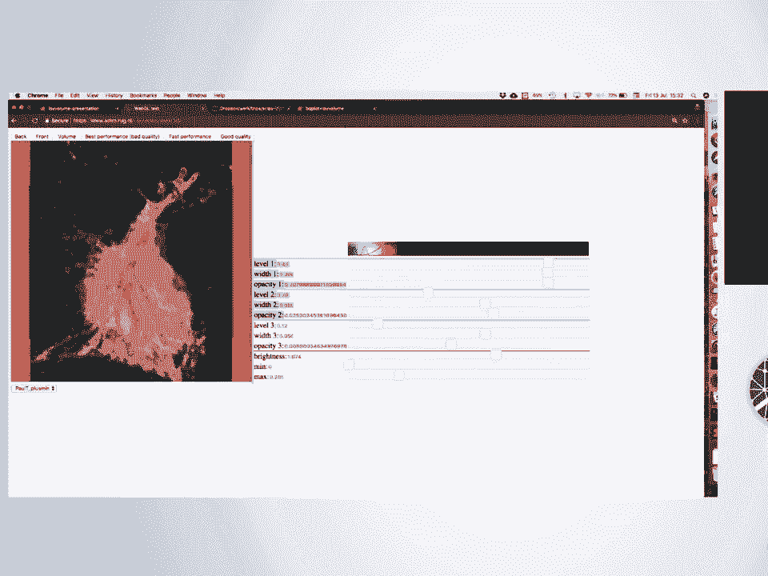

 where I inject JavaScript plus the data into the notebook which you shouldn't do。 And also。

 the sliders。 I mean I was like reinventing the wheel and I thought okay this is not really。

 a good approach。 So instead of reinventing like the whole machinery of the communication。

 and the slider I built it on top of IPython widgets。 And that proved to be really like a。

 key ingredient in the success。 And also realized it was really filling a gap when I was starting。

 working on this because you couldn't find any interactive library for the Jupyter notebook。

 at the time。 At least that I could find。 Later on I found that there was one but it was like。

 impossible to find。 That sometimes happens。 So now IPythonium is for its like niche market。

 It's pretty popular on GitHub and something which also I think makes it like much easier， to use。

 You don't have to do the MB extension enable install。 It's the easiest to install。

 software on the planet。 Just pip install。 And done。 So I don't want to make this a review。

 talk but just to give you some overview of other packages。 So if this package doesn't。

 work for you you can take a look at one of these。 What's important to note is that for。

 me what I'm going to go back to that is that Py3s 3GS is going to be a bit of the backbone。

 for a 3D fish。 So why would you use it？ Well you get really interactive visualizations。

 so you can rotate and it's really fast。 It has bidirectional communication so you can。

 actually get back at a kernel what the status is of the camera and do actions on that。 It's。

 also interactive outside of the notebook so if you can save it to an HTML and bring it。

 on your tablet to show to colleagues。 Performance is really good。 Can up to a million points。

 And it's also all the animations are done in the shader。 So I'll show some of that。 And。

 something which is important to realize is that mostly we work at least I do like local。

 with a local notebook server but the Jupyter ecosystem is really great for bringing your。

 code to the data。 So you just log into a Jupyter hub etc。 Work with the data and then having。

 being in the browser you have the visualization on the client where it's really fast。 So there's。

 really no setup。 We'll try doing that with remote open GL so if you're going to try that。

 you're probably going to cry。 Okay so this is kind of my lucky slide。 So I've never had。

 a failure after this slide so I hope I have better luck。 Okay so for me it's really important。

 especially in the notebook to have a really simple API。 Just a few lines and get a plot。

 And that's also why like modplotlib is so easy to use just a few lines and you have something。

 So let's do the import， create NumPy arrays and just call figure， scatter and show。 You。

 should have something。 So you now have a 3D scatterplot。 And because it's a Jupyter widget。

 you can change some of the properties so I'm now going to change from a sphere to a box。

 and inspired by a BQ plot if you change something it's animated。 And that's really useful if。

 you change something like a model parameter and want to change like okay how does this。

 effect the data produced。 It's not a jump you see how it really affects the data。 And to。

 answer a question from the previous talk you can just like save it to an HTML file and put。

 it somewhere。 Okay so it's built on top of IPy widget so I'm going to take this figure， again。

 So we're now going to change it from a box into a diamond but instead we can like。

 take the IPy widget and have a like a talker button and change it to sphere， box or diamond。

 So it's really easy to create like small GUIs to see what you want。 Or the size of the scatter。

 points you're going to create a slider and tweak the size until you're like happy。 So。

 maybe a sphere looks better this size。 So it's really easy to build up GUIs on the fly with， this。

 So it's going to be a bit dry but I just want to show you like all the things。

 you can do with IPy volume。 So Quiver plots is basically similar to scatter plot except。

 their arrows and they have directions。 And everything's animated so also the angles like。

 if you change the direction you see what's going on if you change something。 Colors are。

 also interpolated so now change it to green。 And again you can change use the color picker。

 of IPy widgets to change the color to what you like。 Or just use NumPy arrays with RGB。

 colors for every individual point。 Meshes so basically you have X， Y， Z coordinates and。

 the triangles that refer to these。 So let's make a tetrahedron。 So I really like the simplest。

 you can do。 Or if you have something simpler like a surface you don't have to define the。

 triangles you simply plot surface。 And again everything's animated so if you change the， color etc。

 So for Meshes you can also do like texture mapping。 So here I have a model of。

 a brain and like you have three views of this brain and you can put a texture map on this。

 still so this could be like brain activity or something which could also be a movie。 I'll。

 show some of that later。 Just to complete like everything you can do line plots。 Again everything。

 animated。 But like the main point of this is this package was the volume rendering。 So。

 I have some like 3D cube and like similar to image show I want to have a full show。 So。

 just show me what is this 3D volume look like。 So this is spherical harmonic which you may。

 recognize and now you can like play with the transfer function etc。 to explore this。 Oops。

 This data set。 ISO surfaces。 This actually comes from SK image。 So this is done on the， kernel side。

 So if you change something like you change the level of the ISO surface it looks a， bit funny。

 That's because it's doing this interpolation but the number of triangles are like moving。

 all over the place。 And if you change like if it's constant it makes sense but you can always。

 like disable it。 Like put that time animation to zero and that changed directly。 So what about。

 performance？ So let's see if we can do a million in hyperfilium。 Yeah。 So interactive and again。

 still all the animations like changing the size or changing like the data is all animated up to。

 like a million you can do to 10 million if you really want to push it。 So back to our galaxy。 So。

 we have all the ingredients to like enable what I wanted to see this like stream and 3D。 So let's。

 go up。 So that was this one。 So what does it look like in 3D？

 So what I'm showing here is a stream you can't see because I'm over plotting like the。

 mean velocities on top of it。 So instead of recreating the plot we just tweak the parameters a bit。

 tweak the levels of the opacity of the transfer function a bit。 And now we have a much better。

 understanding of what the stream looks like in 3D。 And it's really difficult to understand what。

 the stream is。 For instance that there's this gap between here tells you something about the。

 the symmetry of the system。 But facts is all about like large data sets。 So let's take。

 dark matter simulation here with 3。3 million rows。 And you can't make a scatter plot out of this。

 So， that's kind of the idea you reduce this to 3D histogram in this case and show low resolution。

 cube of this。 But let's say we want to look like pick inside。 It has like depth depth of where。

 it knows kind of where the 3D the center is of my cursor。 And you can zoom in and it will do the。

 calculated cube again and show you like the high resolution。 So similar to the 2D like in data。

 shader you can also do it in 3D。 But not everything is like a tabular data。 Sometimes you have like。

 huge cubes from this is an example。 Actually I'm now showing it in Glue Jupyter which is a new project。

 coming out of the Glue Fish project which also allows me to work。 So it's a package I'm working on。

 and also allows me to work on ipive volume。 And it gives a bit of a richer interface at least now。

 with data sets。 So this is an astronomical data cube。 And let's say we have a really bad internet。

 connection so we really can't transfer large cubes。 But we still want to zoom in。 So it will show。

 now it shows like a reduced volume。 And again if you zoom in it's low resolution and then it sends。

 you like the zoom in region。 So you can explore like really large data cubes。

 So shortly on selections， it's pretty basic but you can simply do like a loss of selection。

 And do I have this here？ Oh I， forgot so I have this here。

 So what I'm doing here is I'm observing when the selected property， changed。

 So I did this selection there's something happening on the front end get sent to the kernel。

 and based on this information I can calculate what the mean x of these coordinates are。 So you。

 really have this bi-directional communication which is really important。

 So now I have a data set which， is so x， y， z are not like a one dimensional array but they also have a time component。

 So the first， dimension is time so two net keyframes and three net 13 particles。

 And if you send such。

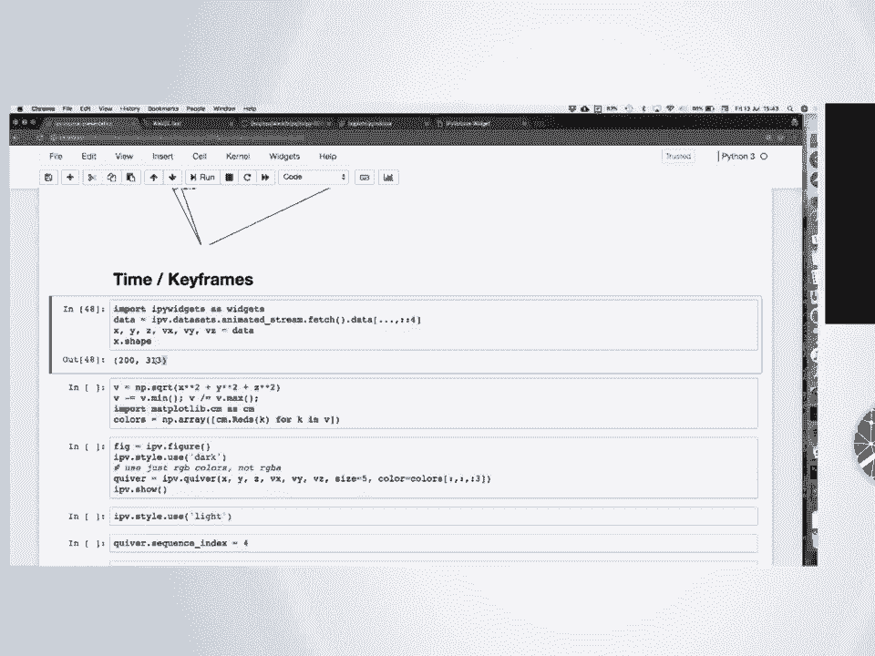

 such arrays to the front end it will assume that the first dimension is time。 So you see this。

 particles here represented as arrows。 Maybe yeah this is a bit better。 And now I can change what。

 what I call sequence index so to the next。 So it takes the next time step。 And now you can。

 and because of the interpolation but course time step it still looks smooth。 Okay we can do better。

 and just use i by widget。 So we have a play widget and a slide and now we can have a。

 like a smooth animation。 So this is similar to this stream but now this is a simulation of a。

 single stream around a milky way like。 And you see this this object being ripped apart。

 So maybe you want to have like spheres instead of arrows。 Do not get a sense of direction。 And I。

 think one of the like killer features is the cataplot in 3D。 But that's not all。 So if you have a。

 a Google cardboard and you want to do like three cats in 3D like VR。 You just save it to an。

 HTML file。 Put it on your phone and use the Google cardboard。 And so on and we have actually we。

 have like a dome。 So like for shows astronomical shows as well。 So I just had to support like these。

 projections so you can have like your cats on a dome。 Or if you want to make like a YouTube。

 movie like in 3D you can have like 3D movie as well。

 So I talk about movies but let's say we want to， like make like a real movie。 Let's not make it 3D。

 Let's do it just like this。 Okay I'm not lost。 No。

 And there's a small like sub-packaging ipive volume。 Okay。 Should have used Jupiter Lab。

 I know no no no。 Let's print out the figure here as well。 Yeah。

 And it's a simple package but just to show what's possible。 Because I built on top of Pi3。js。

 I have access to the camera， the scene。 There's animation support。 So I'm gonna add some keyframes。

 So here and here and here。 Okay。 And do the interpolation to smooth and start this。 So now we。

 have a nice like demo we want to record。 So we use the ipiveivevpartasheet package to make a recording。

 of this。 So we just record a few seconds。 Just to show that we made this recording。

 And this recording you can like download， upload to YouTube whatever or put in your tablet。

 So actually if you I'm not going to go in the depth but just to show you what's possible。

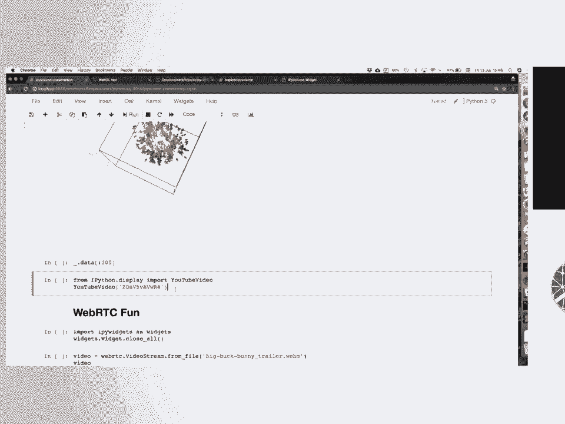

 You can like make it a bit more fancy。 So this is what we did for like after the release of a paper。

 So this is using all of these components。 So it's using the animation， the animation of the camera。

 and the 360。 So if you do this on Google carport you can take look at all directions。

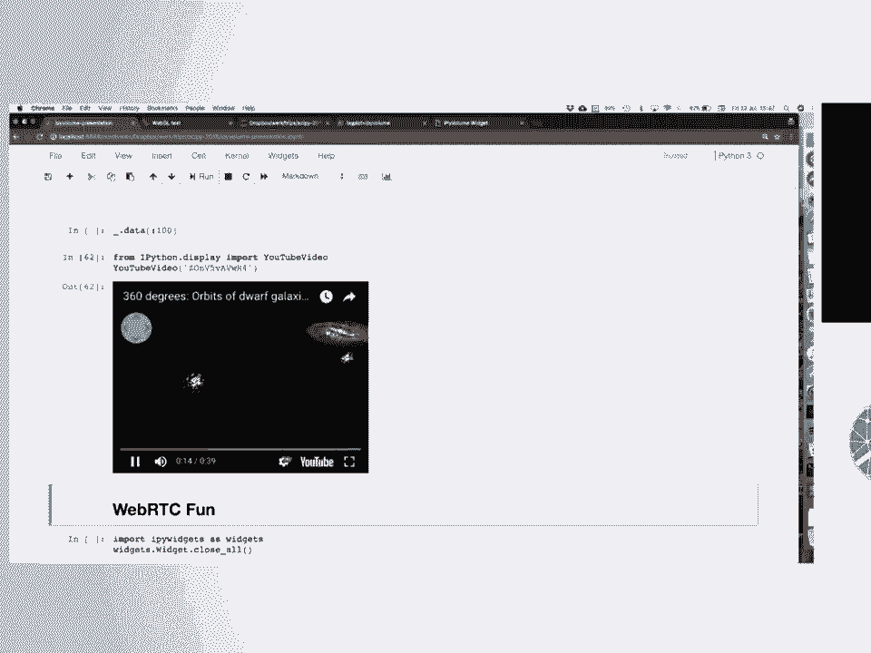

 So yeah， he's done。 Okay。 Now it's gonna be tricky。 Okay。

 So this ipiveivevpartasheet package we want to。

 show you a little bit about it because it's fun and it shows the power of widget。

 So you can have like， widget which is a video。 A widget which is a camera。 Hi there。

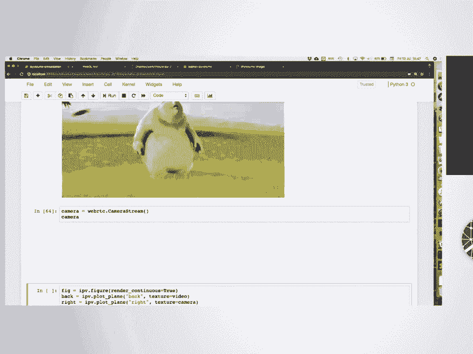

 And these can be used as textures in ipive volume。 And that's not because ipive volume is doing its。

 best。 It's just like in the browser it's such a powerful platform。 You can just like say okay。

 use instead of an image use a video and it just works。 And the nice thing is that。

 so the webGL conference is like a conference and a media stream itself。 So I thought okay does。

 this work？ Can I put itself in itself？ And of course you can。 But webRTC was not designed for this。

 It's actually for doing chats。 So let's make a chat room。 Hi， so fan。 Hey， you sitting there。

 And so are you seeing my plot now？ So actually now I'm not， sending so fan my webcam。

 I'm sending him this my plot。 Hey， so fan you're actually on the plot， as well。

 So now it's your fan is seeing it's on its own， etc。 Okay。 But this is just to show you。

 like the power of widget。 This is not something you would put into a plotting library。 But because。

 we're using the same framework it's kind of nice to be able to combine them。 Okay。 Well。

 my lucky slide。

 A few words on the future。 So the next version。 So actually what I've shown here is master。 So it's。

 like not so stable at the moment。 But the next version is going to be more about Pi3。js integration。

 FIDAR is doing a lot of work on this and that allows you to control like everything like camera。

 lights， fog materials， any animations。 And the idea is to be able to use all of the Pi3。js stuff。

 like make a mesh and put this into ipive volume。 There's someone from the Netherlands as well working。

 on getting multivolium rendering working。 And also in this process we probably can have like order。

 independent transparency which is quite a big thing。 And in the future I hope that we can。

 there's another like volume rendering package called N-Ray that we can use that into in ipive volume。

 or vice versa and like really mix those。 There's also Google Summer of Code student working on。

 for M&E and making whatever needs to be done to ipive volume to make it work。 And so then I also。

 talked about like other languages。 So actually now you can use ipive volume in all the JVM languages。

 So I have an example of doing it like a volume rendering in Closure。 And in the future we hope to。

 have a well C++ support as well。 You can find me at the sprints tomorrow。 Just try Pippenstow ipive。

 volume。 Give it a star if you like it。 Open issues。 Come talk to me。 Thank you。 Great。 Thanks。

 We have some time for some questions。

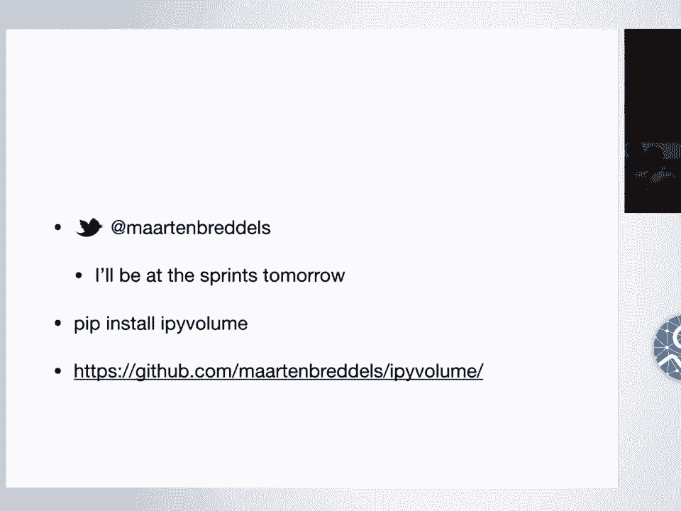

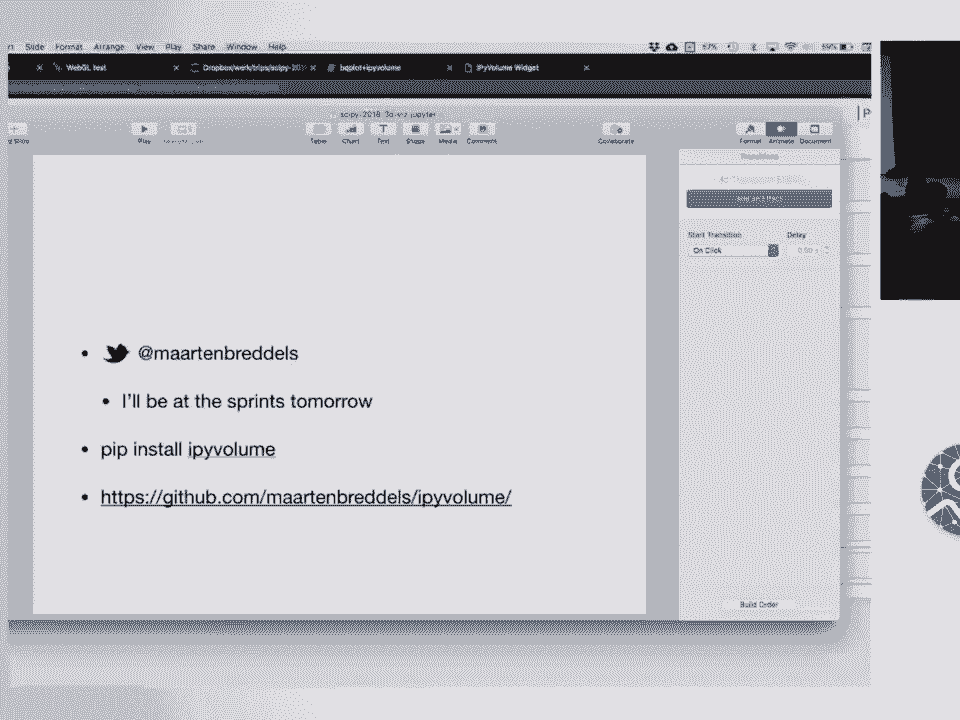

 So can you load a large object like an array， a desk array and view it？

 I don't think you should do that because it's get sent over the wire。 So I think basically what I。

 showed to take like large data sets， large cubes， reduce them to something like manageable and put。

 this into and because of this bi-directional communication if you zoom in you get notified。

 like what has changed like the access of the scales and you do your new computation upload test。

 I think that's the best approach。 There are some limitations to the browser。 If you really want。

 like a large data set you should use like VtK， my RV。 Can you export the output to X3D or U3D？ No。

 but I think tomorrow maybe also with you but we should talk about it。 It would be nice to be。

 able to go from ipivolium to my RV maybe to mopplotlib to have some way of not just having a common。

 API but also maybe underlying models or be able to go from one to the other。 Hi。

 I was really interested in like the VR capabilities of it。

 Is there more functions coming into like exploring your data with VR or any more functions in that area？

 So I don't have any big plans except that I have some VR goggles lying at home that I'm trying to。

 find excuses to use them but otherwise I'm happy to talk to you and accept VRs or think about this。

 but no big plans。 No， but feel free to consume it。 That was great。

 With like the last selection can you do additive selections where you like select。

 something and then？

 I closed all the widgets。 The short answer is yes， the UI is horrible。 You need to know like。

 N% is N etc。 They're only like keys for it but there should be a UI so you can do like a。

 circle selection， subtract like a loss of selection etc。 So yeah。 Thanks。

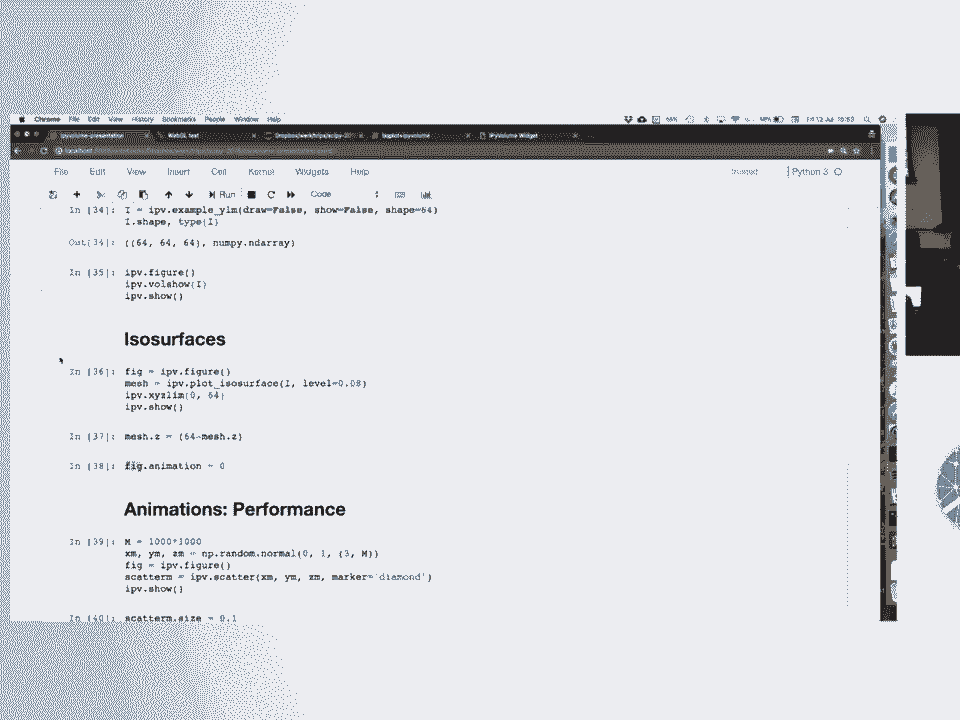

 Thank you all。 (silence)， [BLANK_AUDIO]。