# SciPy 2018视频专辑 - P71：SciPy 2018视频专辑 (P71. UMAP Uniform Manifold Approximation and Projection for Dime - GalileoHua - BV1TE411n7Ny

 Alright， good morning everyone and thanks Michelle for the introduction。

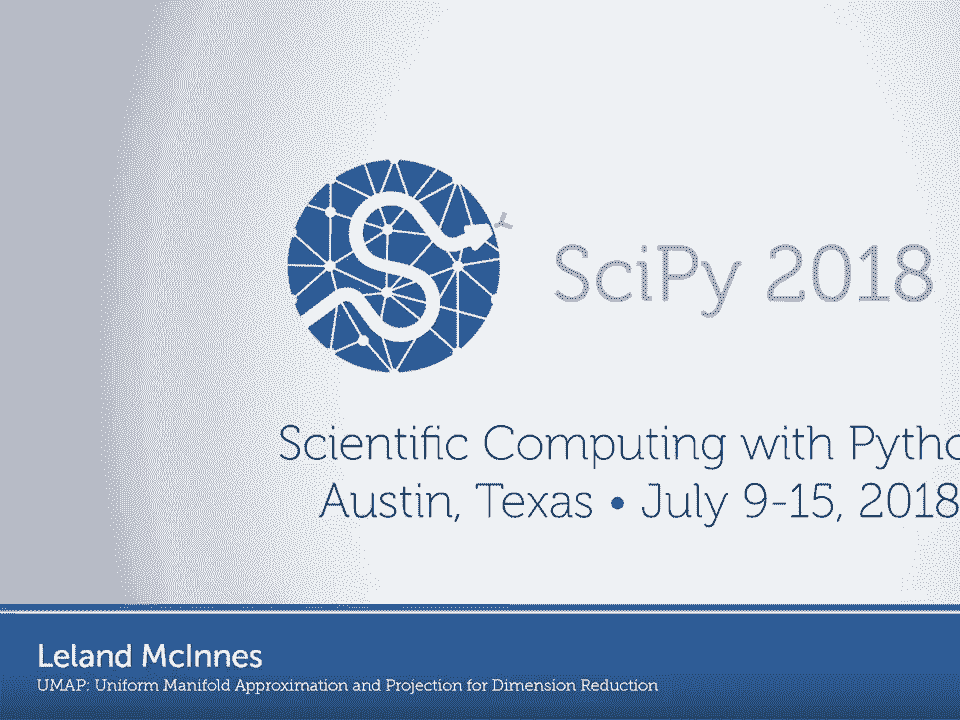

 I'm going to be talking about UMAP which is short for uniform manifold。

 approximation and projection。 It's a dimension reduction technique and we'll。

 get into that as we go。 Okay so first of all just a quick who am I so I'm a。

 research mathematician at the Tutto Institute for Mathematics and Computing。

 My PhD was in really really pure math that I assure you you do not care about。

 And these days I'm trying to bring some of the things that I learned from that。

 topological techniques to bear on unsupervised learning problems。 So I have。

 some great colleagues at the Tutto Institute。 I'm a mathematician and they。

 are the people John Healy， he's in the audience， he's sitting there。 They are the。

 people that know more about machine learning and they help guide some of my， crazy ideas。

 Okay so first of all what is dimension reduction？ Let's just make。

 sure we get everyone on the same page。 So the goal here is to find sort of the。

 latent features in your data。 So why is this important？ Well feature engineering， is important。

 Visualization matters if you can get it down to two or three。

 dimensions you can look at your data this is important。 And often a lot of the。

 dimensionality in your data is just redundant and if you can prune that out。

 that can improve all sorts of other things including further machine learning。

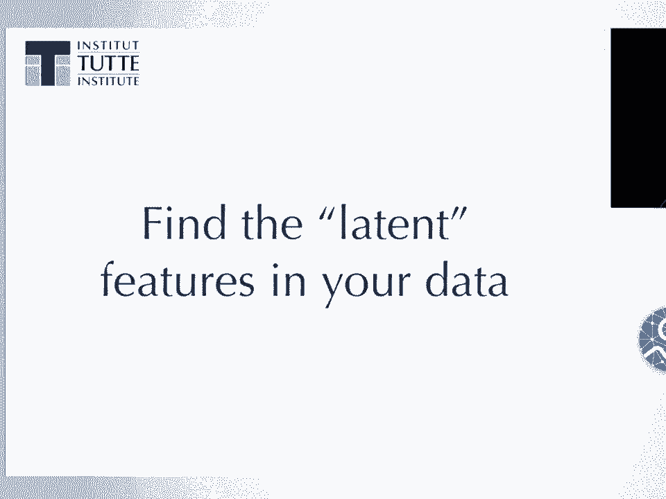

 algorithms。 So this should be familiar to you all by now。 I think many other。

 people have used the MNIST digits data set so here it is you know what it is。 It's。

 784 dimensional though when you unfold those digits into long vectors and we。

 shouldn't really need 784 dimensions to describe a data point in this data set。

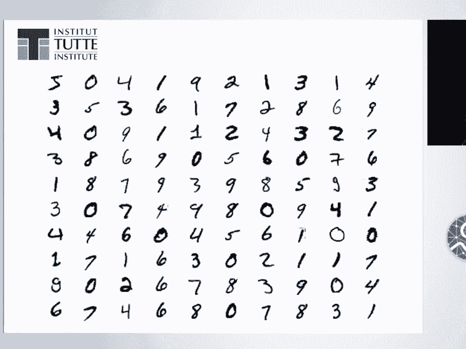

 There should be some much more compact representation。 Here's fashion MNIST which。

 is a convenient drop-in replacement for MNIST where everything mostly works the。

 same but now it's pictures of fashion items so bags， shoes， t-shirts， dresses and， so on。

 And so again 784 dimensional and this one's a little harder than MNIST。

 just so we have a little more challenge but it feels like we should be able to。

 compress that into a smaller number of dimensions and still get meaningful， content out of it。

 So that's our goal with dimension reduction is to take。

 something that's very high dimensional get it down to something that's easier to， work with。

 So when it comes to dimension reduction there's actually only really。

 two techniques。 There's matrix factorization or neighbor graphs。 Now depending。

 on how you do that all sorts of things pop out。 Matrix factorization is。

 everything from principal component analysis to word to VIC and late and， duishly allocation。

 All depending on what matrix you try to factor exactly how， you define your loss。

 There's lots of details but it's a whole slew of， algorithms。

 Likewise neighbor graphs you get everything from isomap to TSE。 These。

 all basically build on the same basic infrastructure and that's what counts。

 So PCA is the prototypical matrix factorization algorithm and if we run PCA on。

 MNIST digits this is what we get。 I've colored the points by the digit that。

 they represent and you can see it's actually captured a lot of the global， structure。

 The zeros and the ones are separated out and there's a nice smear of。

 different digits in the middle。 The global structure is preserved pretty well and。

 the XEs are interpretable。 That's an important one for PCA。 These are the。

 directions of greatest variance in the data。 All right how about on fashion MNIST。

 we get a similar sort of thing。 We've captured a lot of the global structure。

 We've separated out some of the groups to some extent。 It looks good。 So we're， done right。

 This is dimension reduction。 Okay。 There are other alternatives。 What。

 about the neighbor graph approach？ So TSE is kind of the state of the art in。

 neighbor graph based algorithms and what does that do？ Well this is what it。

 provides on MNIST and you can see it's radically different than what PCA would， supply you。

 Here we've captured local structure rather than global structure but。

 that means we've separated out all the digits really cleanly into nice little， groups。

 Here's fashion MNIST with TSE and you can see again it's done a really。

 great job of separating out the classes by looking at the local structure by。

 building this local neighbor graph type approach。 So that's how that goes。 I want。

 to talk about uniform manifold approximation and projection though which is。

 my attempt to take the neighbor graph style approach and try and put it on some。

 firm mathematical foundations because the math side of things is what I'm， interested in。

 So UMAP builds some mathematical theory in the background to。

 really justify these graph based approaches。 I'm going to gloss over some of， the fancier math。

 It's not actually hard but it uses language that mathematicians。

 might like but a general audience may be less so so I'm just going to sort of。

 try and give an intuitive description and we'll just hide the math a little bit， but not too much。

 If you're interested in the math come find me later I'll be， happy to talk about it in more detail。

 So first of all we're going to do a little， bit of math a little bit of topological data analysis。

 I'm going to skim through， this quickly so bear with me。

 So the goal here of topological data analysis or， topology in this sort of approach is that you can have these things that are。

 simplices which are nice easy combinatorial representations of a bit of。

 topological space。 And the key is you get to glue them together into these。

 complexes that can build in practice pretty much any topological space you， care about。

 There are some pathological spaces but they're not going to come up， in data analysis。

 So the key here is that we can take something continuous and。

 complicated like topology and turn it into something really simple and。

 combinatorial with these some partial complex type approaches。 Okay the next。

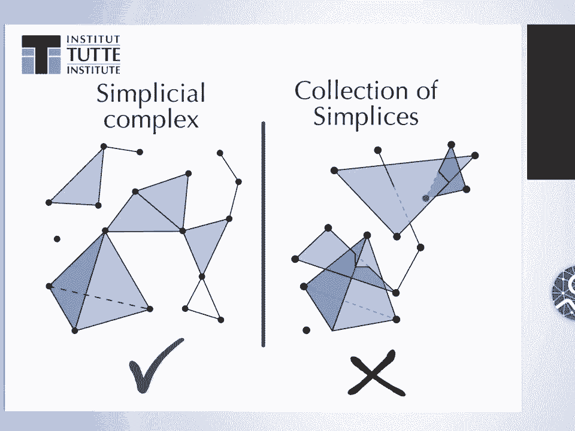

 thing is a picture of a theorem。 I don't expect you to read this。 The guts of。

 this is that there is some really solid math in the background from algebra。

 anthropology that basically says that if we build a simplicial complex out of a。

 topological space in this certain way we can actually recover all the important。

 topology of that space。 So we get to go from something complicated that's all。

 continuous and topological to something simple and combinatorial that we can。

 work with easily and yet we retain all the information we want to care about。

 So let's look at an example in terms of data。 Here's some data。 It's on a， hypothetical manifold。

 You can probably guess what the manifold looks like and。

 what we're going to do is try and build up this simplicial complex。 So the goal。

 is we start off by building a cover and in this case we're just going to drop。

 open balls on each of the points and that's going to cover our manifold and。

 then you take the nerve of the cover to get this simplicial complex and here。

 this is what we get when we do that。 The goal is pretty simple。 A one simplex is。

 formed by a pair of those open sets in the cover that overlap。 If you have a。

 triple intersection you get a two simplex and on out。 So again simple。

 combinatorial it sounds too simplistic to work but the math actually says this。

 all does work very cleanly and nicely and we've actually recovered a lot of the。

 topology of the manifold there。 It's not perfect though。 It has some gaps。 It has。

 some clumps so what went wrong because we had this nice math theory that said this。

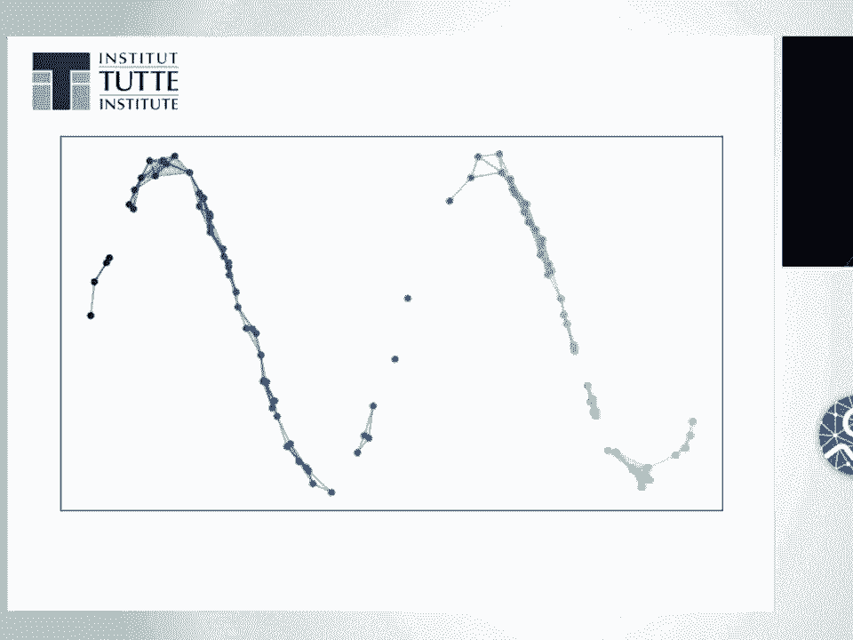

 was going to work。 Well what went wrong was that the data was not uniformly。

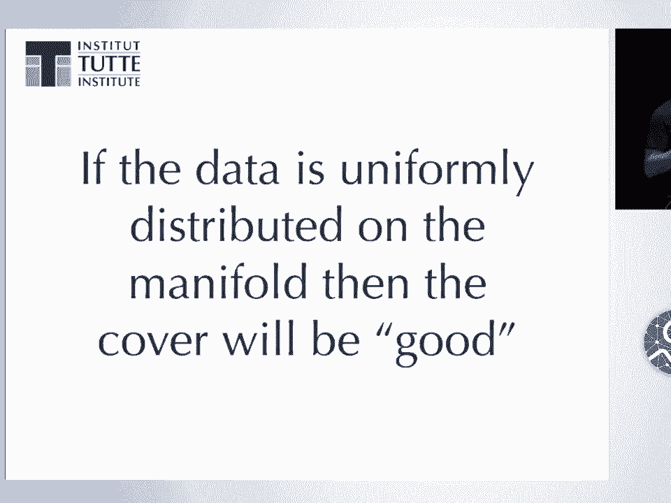

 distributed on the manifold so the cover just wasn't good enough。 If we go back to。

 our cover there are gaps because there are spaces where the data is more spread。

 out and our open ball doesn't meet up with any others。 If we have a nice uniform。

 distribution like this then you can see that this would kind of work perfectly。

 and everything would look lovely and would get exactly the structure we want。 So。

 what we need is this uniform distribution assumption to make all the math work but。

 you know when is real data ever that nicely behaved。 But hey I'm a mathematician so I。

 actually just get to assume whatever I want。 So I'm going to assume it's true。

 Great we're done right。 This is case closed。 Not quite。 So the next catch is that if we。

 assume the data is uniformly distributed on the manifold that has practical。

 implications for the manifold itself。 Now what that means is that we're going to。

 have to define a Rennady and metric on the manifold that makes this assumption， magically true。

 This is maybe slightly deeper math if you're interested we can。

 talk about it later but essentially what we're going to do is vary our notion of。

 distance on a manifold。 So here's a nice textbook picture of what manifold theory。

 looks like but the main thing that I want you to take away is that there's。

 patches here that map down to nice standard Euclidean space and you're。

 going to have these patches all across glued together to make up your， manifold。

 And effectively what we are going to do is have these patches that。

 map to Euclidean space map to Euclidean space on different scales so that there's。

 a different notion of distance further or more compact depending on which patch。

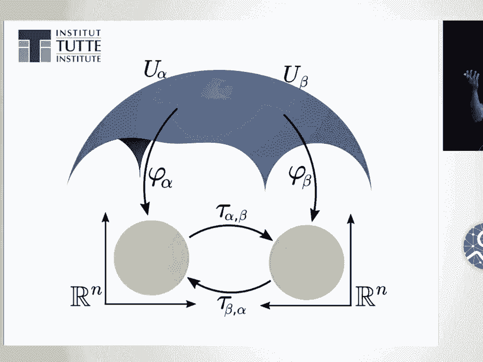

 you're in and that's effectively what's going on。 Okay so this is that data again。

 but this time I've used that approach push through the math and worked out what。

 things should look like with this varying distance at each point on the。

 manifold and each of these balls is actually a single unit ball。 They're all。

 the same size as far as distance on the manifold is concerned。 It's a different。

 distance in the ambient space in Euclidean space that we're looking at here but。

 according to the manifold that we're trying to claim the data lies on these， are all the same size。

 But why choose a fixed radius？ I chose one there。 Couldn't。

 we have something that had a varying radius？ In fact we could sort of have。

 the the radius vary in our confidence of how how much in the set of point is。

 is kind of a fuzzy notion。 Well we could do that with something like fuzzy topology。

 and pull that off so let's do that and have a fuzzy cover。 Now the catch is。

 making all that mathematically justified because I sort of used a lot of， vague words there。

 Here's another picture of a theorem。 You don't need to read or， understand the theorem。

 The catch is that there is this nice theorem that actually。

 defines how to do this in a really clean simple mathematical way。 It just uses a。

 bit of classical algebraic topology and category theory to sort of glue the。

 pieces together and make all of this work。 So this is what we would end up with。

 at least in principle some sort of fuzzy like cover here where the the the set sort。

 of fades out as you get further away。 Okay we're gonna need one more assumption， though。

 We're gonna assume that the manifold is locally connected。 Now that。

 doesn't mean that the whole manifold is connected that there's only one piece。

 There's a whole bunch of pieces potentially but we are not allowed to， have isolated points。

 The manifold can't have a point that is just completely。

 isolated from everything else and that's a very reasonable assumption to make from。

 sort of a topological point of view。 So what does it mean when we apply it here？

 Well it's gonna mean that we should be completely confident in our distance out。

 to the first nearest neighbor and then we can get fuzzy and decay from there。

 And again we can use the math to make that all work out in practice。 Why would we， want to do this？

 Well there's actually some side benefits here。 So here's the。

 distribution of distances to the 20 nearest neighbors for a set of data。

 points randomly selected on a normal distribution in varying dimensions， spaces。

 So the catch here is that you can see as we go up in dimension the sort of。

 average or distribution of distances sort of slides out along that distance。

 scale further and further。 So the catch is if you go and normalize your。

 distances in the high dimensional spaces when we normalize everything back our。

 distributions get tighter and tighter and tighter。 So in higher dimensional。

 spaces everything is approximately the same distance away。 We don't have a nice。

 smooth distribution of distances we have pretty much just one distance and this。

 is the curse of dimensionality that people talk about a lot or at least one， major component of it。

 But if we take our local connectivity assumption and apply。

 it and then normalize this is what we get and actually we've now got。

 distributions that look nice they look very much like the two-dimensional case。

 So it turns out that this local connectivity assumption which was sort of a。

 natural topological assumption to make really helps us solve the curse of， dimensionality problems。

 So great we're done right we've solved all those， problems we missed one all our local metrics are completely incompatible。

 So。

 here's a nice theoretical picture of manifold theory again and in the nice。

 theoretical motion of a manifold we have these maps at the bottom tau。

 alpha beta and tau beta alpha that tell you how to go back and forth between the， overlaps。

 We don't have those because we constructed everything from finite data。

 So we're missing all that information so in practice if we had our graph for。

 our simplicial complex if we could notionally do that we'd end up with。

 something more like this where we have multiple edges between any pair of。

 points with different weights on them because we had different notions of。

 distances coming and going。 How can we glue together all these different metric。

 spaces to actually make a consistent picture to work with？ Well again this is。

 where the math comes back in there's a nice theorem that you can prove that's。

 not so bad that tells you that in practice we can just turn everything into。

 fuzzy simplicial sets and we just get a whole family of them one for each。

 data point and we can just glue them together by taking a fuzzy union。 Now。

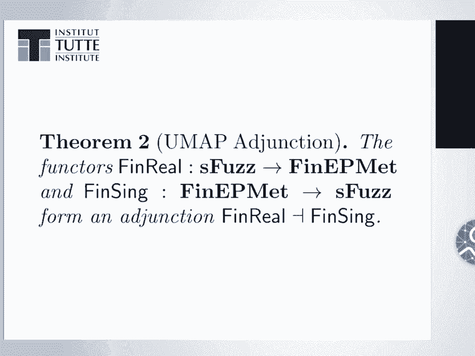

 what does that mean in practice for working with the graph？ We're going to。

 combine the weights of edges together under just this formula and this looks a。

 little weird at first as a thing to do but if you think of it as the weight on。

 an edge is the probability that that edge exists then what we're really saying is。

 we want the combined probability of the two different weights to be essentially。

 the probability that either this edge exists or this edge exists so the sum。

 minus the product is really well justified in a probabilistic sense。

 Okay so this is what we get out after all of that it's a nice graph if we ignore。

 the higher dimensional simplices and so we're good but this is in particular a。

 well theoretically justified graph we know why we want to construct this。

 particular graph in this particular way with these particular weights so we're， done right？

 No we need a low dimensional representation of this。 Okay so suppose。

 we were given some low dimensional representation of the data well we can。

 apply the same process and get a fuzzy graph for that but now it's a little。

 different because this time around we know what the manifold is I know if I'm。

 if I want to embed the data in R2 in two dimensional space I know the。

 manifold it's R2 I don't have to try and infer the manifold but we don't know。

 this correct nearest neighbor distance for that local connectivity thing so we're。

 gonna have to pass that in as a hyper parameter。 Okay so we can get two fuzzy。

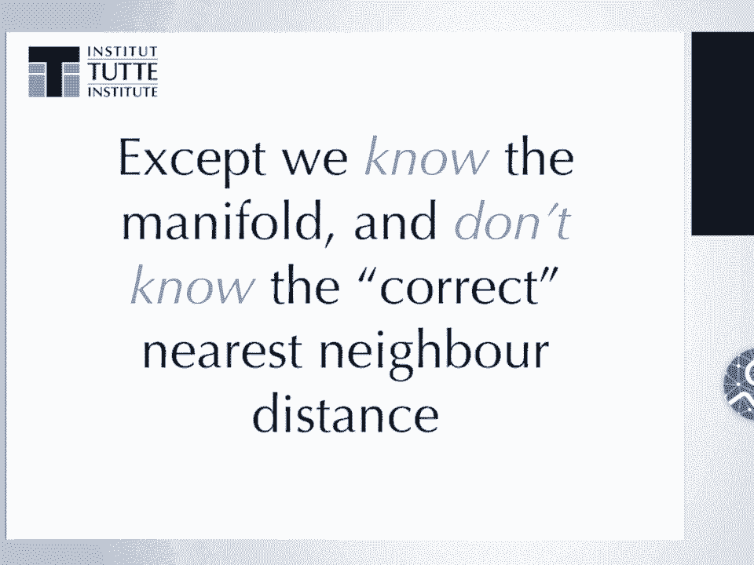

 graphs and we can measure the distance between the graphs using cross entropy。

 and then if we just optimize we get a layout in low dimensions that's going to， solve our problem。

 So cross entropy looks something like this but really we're。

 just doing a force directed graph layout here so you can think of this as the。

 first term is kind of get the clumps right which TSNE does and you'll note。

 that term looks a lot like the callback lubar term in TSNE but then。

 there's also this term which is basically get the gaps right get the gaps。

 between the clumps sorted out and so there's an attractive force and a repulsive。

 force this is kind of classical force directed graph layout type thing it's。

 just a very particular formula that we derived purely from the math so here's。

 what the graph would be embedded like and if we turn that into just points this。

 is what we would get and that's great but it's not quite perfect we've got some。

 some jumps there so what happened well if you look at the original data down in。

 the green in the bottom right there you can see those areas that are just。

 surprisingly dense and our local approximation of density and things like。

 that failed in that case because we just didn't have enough data if we had more。

 data that sort of problem would be cleaned up more so if we have more data。

 on real data what does it look like so here's MNIST digits with UMAM and you。

 can see it gets the nice clean separation of the different digit classes the same。

 way TSNE does but it also has a lot of the spirit of PCA because of that get the。

 gaps right term where it's spread the data out according to spread the clumps。

 out according to sort of more global structure similarly fashion MNIST again。

 much like TSNE we've got the the different classes all picked out nicely。

 but there's more understanding of the differences between the classes so that。

 the shoes and footwear are all cleanly separated away rather than just being a。

 clump mixed in with all the other clumps okay so finally we're done right no。

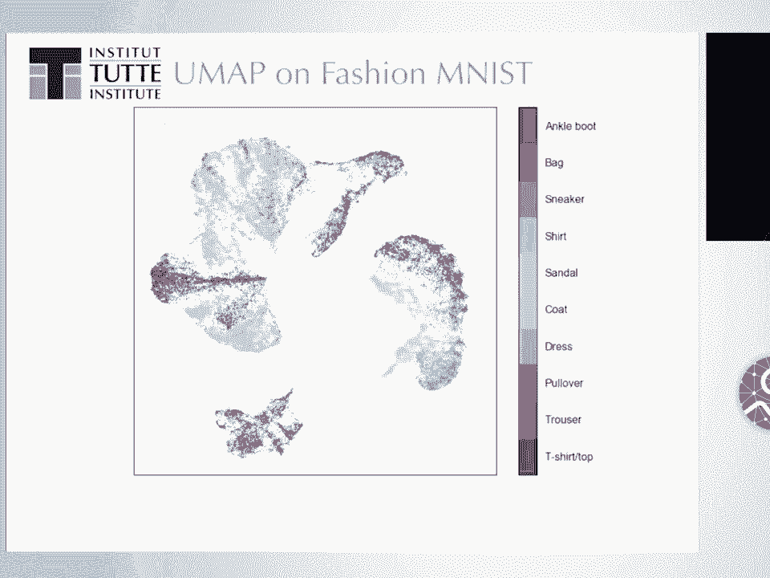

 there's a lot of fancy math there can we actually make that into something。

 practical okay so yes it turns out because at the end of the day what we。

 actually need is a few things one we need to be able to find approximate。

 nearest neighbors and do it very very quickly even in high dimensional spaces。

 that's fine there's random projection trees and nearest neighbor descent and。

 these are wonderful algorithms and if you're not familiar with them you should。

 definitely look them up they will do the job for us and very efficiently then we。

 need to do that optimization of the low-dimensional layout really quickly。

 sub quadratically ideally well stochastic gradient descent and then stealing ideas。

 from word to vacant large viz we can do negative sampling tricks to make this。

 actually quite efficient and as a side benefit that allows us to embed into。

 arbitrary spaces TSNE only really works for two or three dimensions past that。

 the computational complexity gets pretty nasty here we do just fine all right so。

 it needs to be high level but still fast how do I solve that problem I'm a。

 mathematician not a programmer so I'm not gonna write something in C++ that gets。

 all hairy I will write it in Python and then I'm gonna make use of number which。

 is a just-in-time compiler for Python down to LLVM to get the numeric side of。

 it to go really really fast so just as an aside number is awesome and if you're。

 not using it you should be it preuses high performance really really well the。

 code you end up with is clean it looks just like your standard Python code you've。

 just got a decorator at the top of it all and it's got nice features so it。

 actually allowed me to implement custom distance matrix so that a user can。

 define their own notion of distance and as long as they can number JIT compile。

 that function they can pass it in and with no loss in performance everything。

 runs perfectly okay so how fast is it well here's comparison between TSME this is。

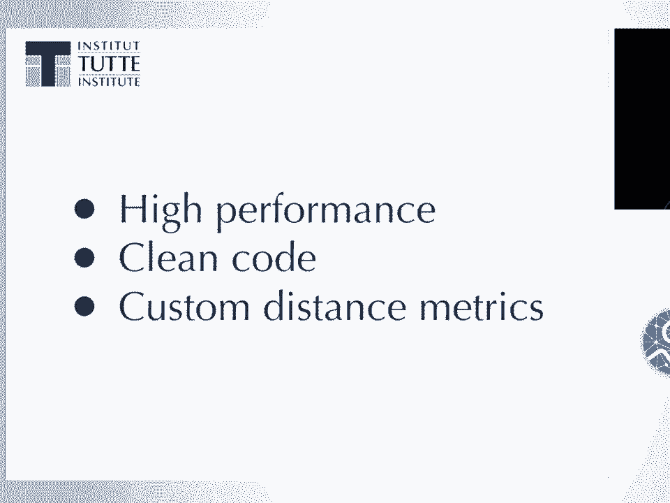

 a multi-core TSME the TSME implementation in SK learn is a bit slower but not too。

 much and you can see UMAP runs a lot faster and as you scale up in data size。

 the difference gets larger and larger the Google News data set here that I'm， talking about was 200。

000 word vectors trained from the Google News we tried all。

 three million word vectors and UMAP did that in a couple of hours it took many。

 days for TSME to manage to do that so if you want to scale up to really large。

 data sets we can do that too okay but where next we have this really nice。

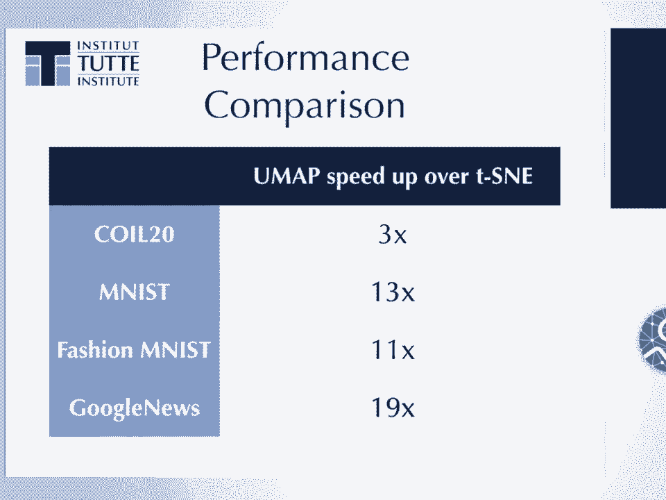

 mathematical foundation there's really clean math behind all of this and that。

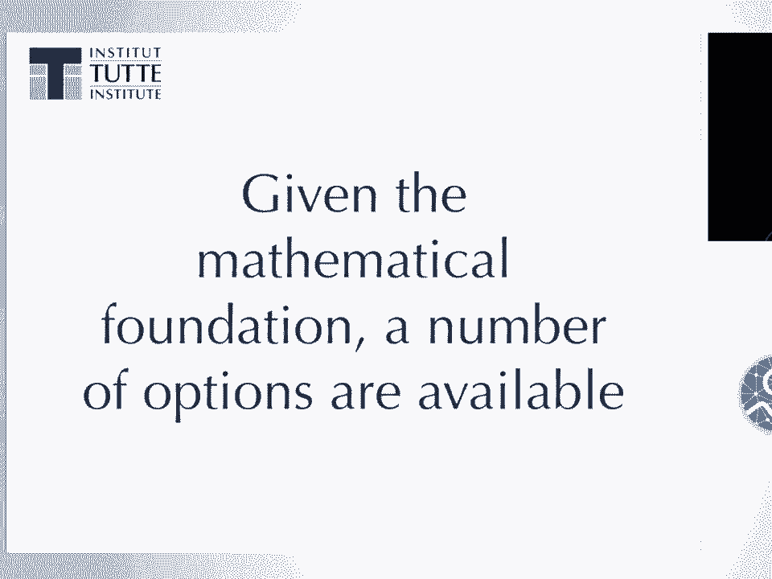

 actually opens up a whole bunch of opportunities to generalize this so one。

 of the things that we can do is we can embed new unseen points into an existing。

 embedding so here's fashion MNIST on the training set with UMAP and then we took。

 the test set and just added that to the existing embedding and that works。

 perfectly well that the advantage of this is it means you can use UMAP with。

 standard SK learn pipelines it's just the transform method everything works is。

 normal so you can you can just stick it in your standard machine learning pipeline。

 as a generic dimension reduction technique but we can do more we can make use of。

 labels and actually do supervised dimension reduction so here's fashion。

 MNIST where I gave UMAP the label information and it managed to make use of。

 that and now we actually fully cleanly separated the classes which shouldn't be。

 that surprising to you we told the algorithm what the classes were but the。

 important thing is we actually retained all the internal structure of each of。

 those classes some of the stripey properties in the green and pale yellow。

 clusters and the overall global structure has also been retained when we do that。

 but we can combine those two things that I was just talking about and do a form of。

 metric learning so here's a UMAP in supervised mode on the training set on the。

 left and on the test set for fashion MNIST on the right and you can see there's。

 some confusion in the test set there but for the most part this has done a really。

 nice job of actually learning a metric space that embeds new data really cleanly。

 and understands the distance is and understands the distances involved we've。

 retained all the internal structure of these clusters and the global structure。

 as well so if you compare that to something like triplet networks this is。

 triplet networks on fashion MNIST you can see there's a similar level of。

 confusion in the test set but the understanding of the internal structure。

 of those clusters is is not the same so there are some potential benefits here。

 for metric learning as well but adding one categorical variable that label value。

 is actually in no theoretically harder than adding many more the theory actually。

 makes this really clean and easy we're just going to intersect with a bunch of。

 extra fuzzy simplicial sets so we can build fuzzy simplicial sets for any。

 sets of distinct data types so we can combine spaces that have different。

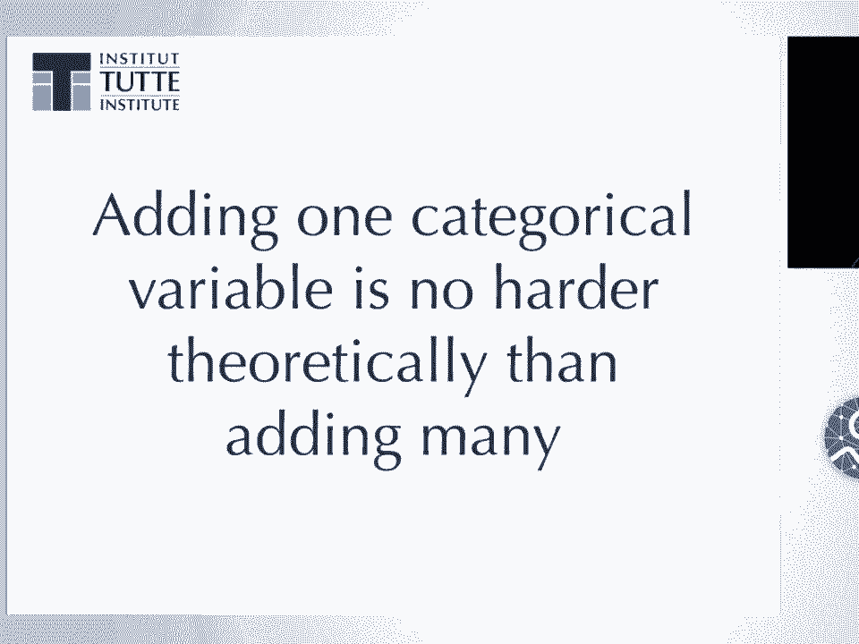

 metrics so if you have some continuous data and some categorical data and some。

 ordinal data and some lat long data that you want to measure with haversign if you。

 have sparse enough data that you want to measure with living shine you can just。

 have each of those work with umap with their own independent notion of distance。

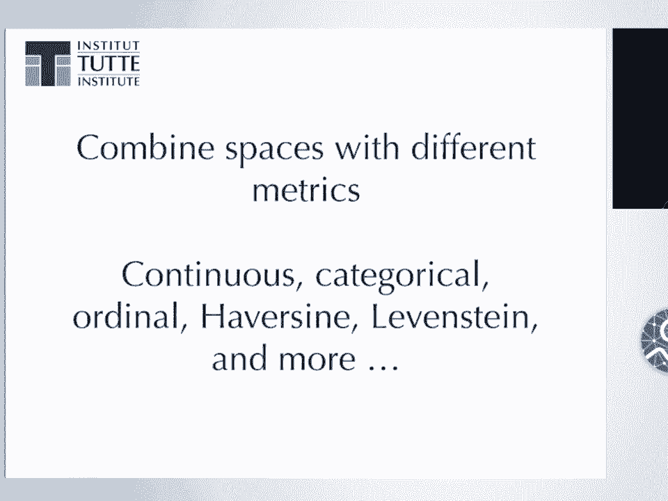

 and we can fold them all together and embed them into one vector space so as。

 long as you can provide a metric for a data type for umap we can at least in。

 principle combine it with other data types so what that means is at least in。

 theory we can you do umap for a generic pandas data frame all right so the code。

 is available on github it's conda installable and pip installable and there's。

 still a lot more work to do so if you're interested in helping out please get。

 in touch with me thank you， my foot is telling you the hog is done thank you that was a great talk we'll。

 take questions please ask only one question and phrase your question in the。

 form of a question I'm gonna work this side of the room with the mic and if you。

 have questions on the left side I'll call on you at that form right there。

 is your approach easily scalable computationally like just out of a core。

 limitation in principle the algorithm is in terms of my implementation it is it is。

 not I was focused on proof of concept implementation and so single core non。

 distributed was was the goal there it would be a non-negligial amount of work。

 to do that a distributed version but the algorithm has nothing in it that makes。

 that impossible oh hi thank you so I noticed on your graph of the like the。

 sine wave shaped manifold where you are illustrating the the more spaced out。

 thing with the larger set circles one consequence of assuming the uniform。

 manifold or creating uniform manifold was that the more spaced out things on the。

 original manifold kind of got drawn together so they ended up uniform on the。

 new embedded manifold so is that a bug or a feature I consider it a feature。

 people could consider it a bug if they were trying to do clustering and were。

 worried about a lot of noise in their data but actually if if you want to。

 chat later I have the same math that does this actually does clustering you just。

 turn everything around if you're a category theorist you can think of it as。

 co-u map it's just everything backwards one more question I just got one in。

 front so I'm gonna go here and back thank you so I have a question is there some。

 place I can go to look for more information about the random tree sampling。

 you do it's not mentioned in the original u-map paper and I had some trouble。

 following the code that you provided for the tree sampling yeah let me go back。

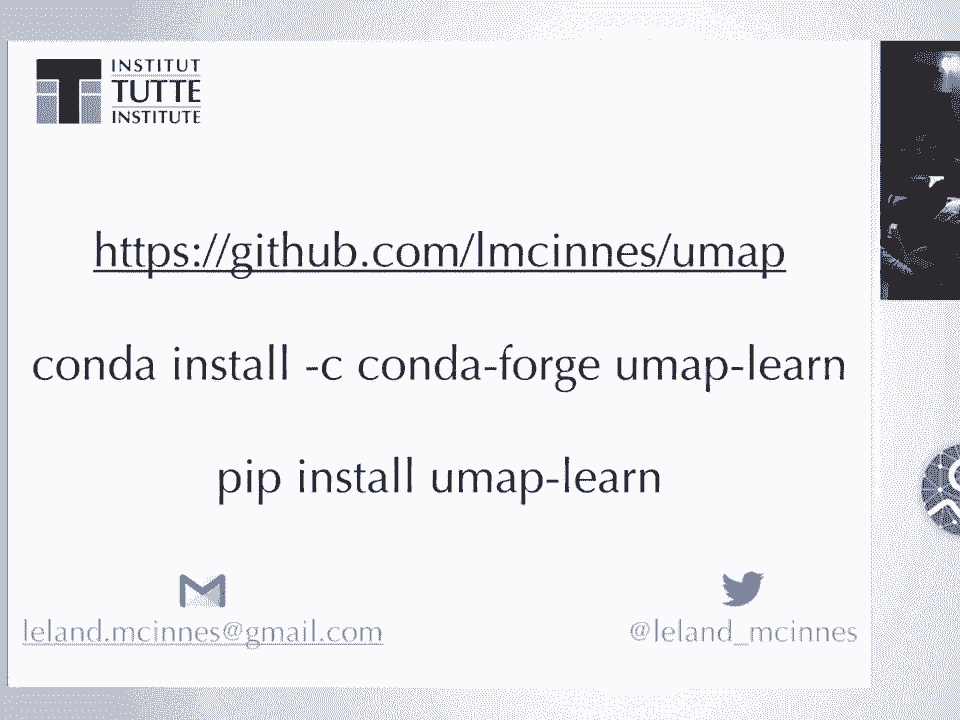

 to the slide there's a reference at the bottom there I think yeah dust goopter。

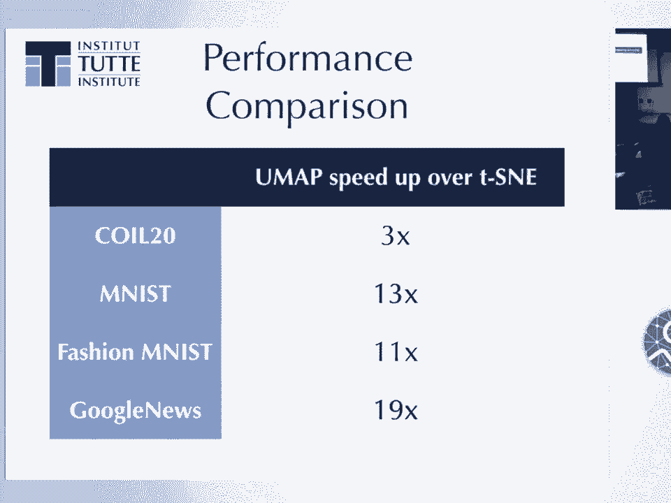

 and front 2008 is the reference I think you want for that。

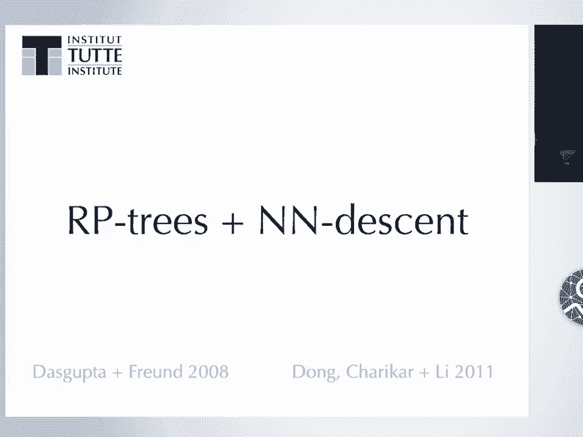

 [BLANK_AUDIO]。