# SciPy 2018视频专辑 - P8：SciPy 2018视频专辑 (P8. KubeFlow - Pythonic Machine Learning at Scale on Kubernetes - GalileoHua - BV1TE411n7Ny

 Excellent。 Thank you so much。 And I think we just have the one mic up here。 So if at any。

 point my voice gets too soft， I'm from Texas， but I don't speak super duper loud。 Somebody。

 just feel free to throw something in my general direction and I'll move closer to the mic。

 So congratulations。 You've lasted through however many days of sci-fi and you're back。

 in the machine learning track。 So who's kind of stuck around this track the majority of， the time？

 Most of the folks here。 Okay。 Excellent。 Today we're going to be talking to you about， cube flow。

 which is machine learning at scale using something called Kubernetes。 And is。

 anybody use Kubernetes in production before or in academic research？ Few hands。 Awesome。

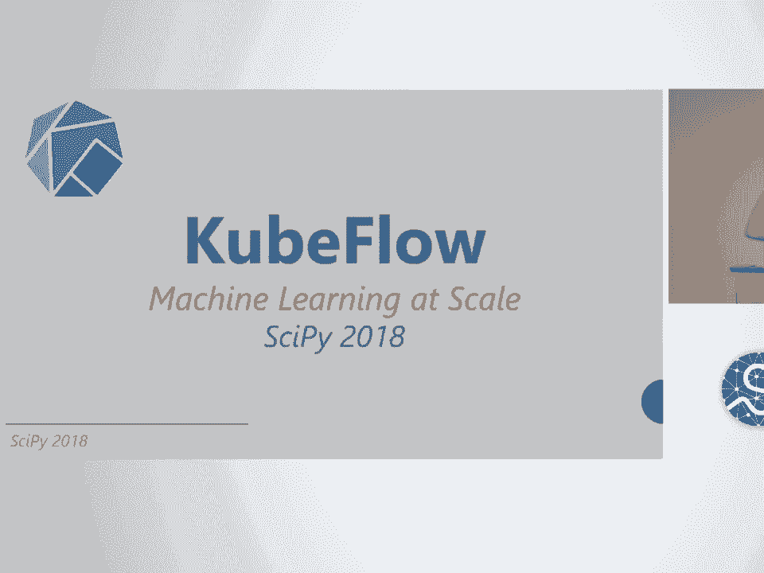

 So I am Paige Bailey。 I work at Microsoft doing things with data science， machine learning， and AI。

 but I am certainly not a Kubernetes expert。 But we do have David and who is also。

 going to be speaking from Google， who is one of the original founders of the Kubernetes， project。

 I believe。 So you'll have a good healthy blend of both of those worlds。 And。

 as a roadmap for this session， we're going to be talking about what is machine learning。

 So dive into that extremely， extremely quickly for people who aren't familiar。 I don't want。

 to bore anybody with like iris data set overviews。 And then we're going to be talking about。

 containers and how you can leverage them if you're not already using them for your machine。

 learning projects。 And then a deep dive into Kubernetes and then finally cube flow。 So， to start。

 what's machine learning？ Right？ And if you go by the buzz words that have been。

 kind of placed in MIT tech review and HBR and all the rest of it， AI is kind of this big。

 broad overarching thing。 This， any technique that enables computers to mimic human behavior。

 And if you go by that， it's been around for a long time。 Since the 60s， the 50s， when we。

 add symbolic AI。 And you had explicit， if felt statements that were hand created， hand crafted。

 by computer scientists of your to give some sort of human behavior to machines。 But AI。

 symbolic AI at least， isn't quite as interesting as machine learning， which is the ability to。

 learn without being explicitly programmed。 So instead of you explicitly defining all of。

 these conditional statements so that a computer can recognize a cat versus a dog， we've realized。

 that that doesn't quite make sense。 And instead you give data to a computer and you give outputs。

 and the computer creates the rules for you。 So again， just to be specific， instead of data。

 and you defining the inputs and receiving some sort of output， you just give data and outputs。

 and you get back those defined rules。 And you can divide things up into supervised and unsupervised。

 categories。 So if you have a classification problem， you're predicting some sort of category。

 If you have a regression problem， you're predicting some sort of numeric value。 So like how many。

 widgets am I going to sell in June of next year？ And if you don't know what answer you're looking。

 for， if you don't have labeled data， then you would do something like unsupervised learning。

 which is kind of clustering of specific information attempting to find patterns in the noise。 And。

 if unsupervised data is also extremely， extremely frustrating and it makes more sense often to。

 pay a grad student or to pay an intern to label data for six months to have a classification。

 problem as opposed to spending a year tearing out your hair out for an unsupervised problem。

 So as an example， if you have a CSV file， a bunch of data about customers that you have。

 for a bank and you want to be able to predict whether or not they defaulted， so your boss。

 gives you that task。 All you would do is kind of look at your existing data and attempt。

 to build out some sort of model。 And really， really， if you're my boss， all you really care。

 about is that last column。 So what is the likelihood of a default from a potential new， customer？

 You could build out a decision tree， you could follow through it each of the nodes。

 with the questions， get some sort of answer。 And the code to do this thanks to the good。

 folks who have created， scikit learn and the like is very， very simplistic。 And of course。

 this is problematic in a lot of ways because your data usually looks more like that。 It's。

 not ever straightforward。 It's not ever in a friendly CSV file。 It comes in a variety。

 of sources so you might need to parse out XML values。 You might need to have some way。

 to deal with streaming JSON。 You might have hive tables， something of that nature。 And。

 then you also might have to be creative with your big smart human brain to find some sort。

 of features， some sort of feature engineering that isn't necessarily existent in the original。

 data set but is exemplified by some combination of features or some feature that you can somehow。

 match with the data that you already have。 So traditional machine learning， extremely， effective。

 it requires a lot less hardware than deep learning。 And if you look in a 90s。

 textbook on data mining， you probably find things like support vector machine's decision， trees。

 the like。 But the cool bit and the bit that we're going to be focused on the most。

 today is something called deep learning。 And deep learning is learning underlying features。

 and data by using something called deep neural networks。 And this， the selling point for。

 deep learning is that it mostly gives you feature engineering for free， even though that's not。

 the case。 But for the most part， instead of you having to hand craft all of your features。

 having to find patterns and relationships yourself， having to guess what might be good。

 information to use for a loan classification problem， you just throw all of your data at。

 a neural network and it somehow seems to find some sort of classification。 And applications。

 really stretch through everything， right？ So you can automatically detect， you can automatically。

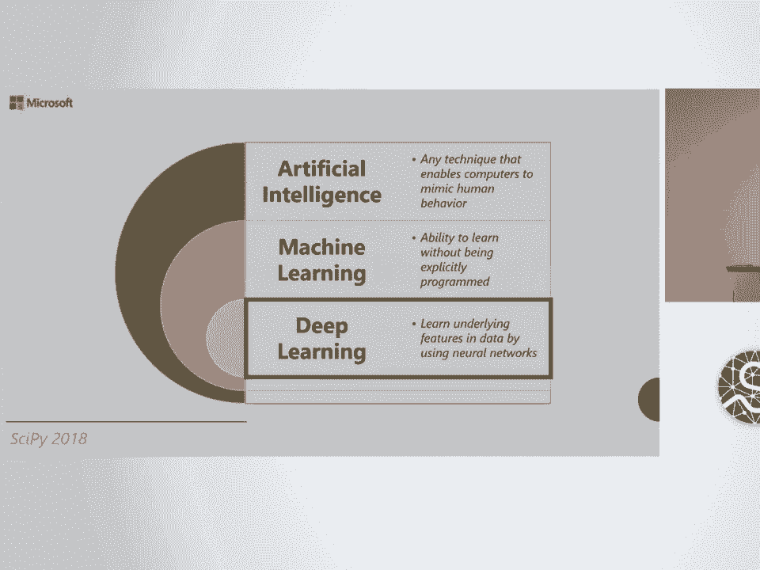

 detect specific entities and photographs， you can detect specific people using transfer。

 learning and only a handful of images with their faces。 You can detect automatically cancerous。

 cells， cancerous tumors and x-rays。 You can do things with text processing。 So these are。

 a couple of examples。 TensorFlow recently put out a tutorial on eager execution to generate。

 Shakespeare text from a corpus of all of the plays and the sonnets that he's written。 There's。

 also a paper from Stanford about creating a chat bot that speaks in the manner of Sheldon， Cooper。

 which sounds frustrating and annoying but also kind of cool。 You have projects that。

 come from the community of sound， right？ So being able to strum out a melody on your guitar。

 and automatically generate drum accompaniments or a bass accompaniment or being able to create。

 a symphony when you're just sketching out a few notes。 You can also do really amazing。

 things with speech to text translation。 So I speak in English， it's automatically transcribed。

 into text and then that text is then translated into Chinese or into sign language。 And suddenly。

 even though you might have a room full of people that are speaking different languages。

 or maybe some people who are even differently abled who would need to use sign language。

 all of that is facilitated through these neural networks in real time， which is kind of amazing。

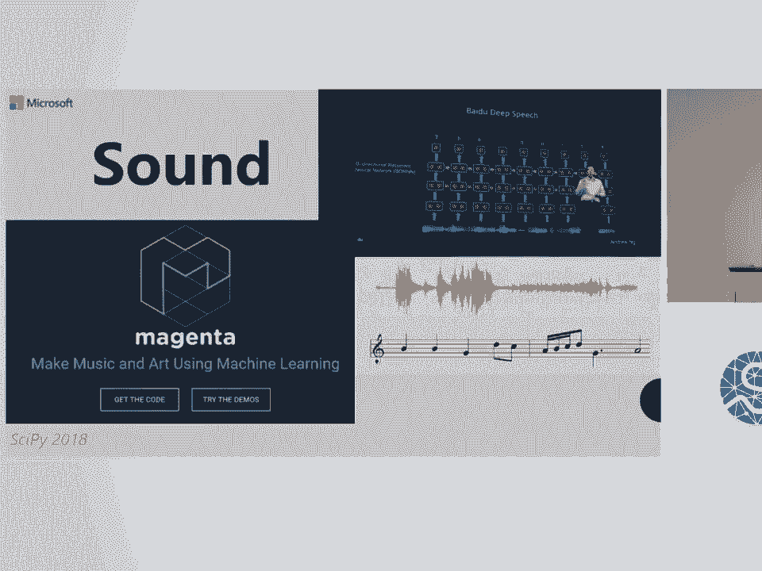

 And there are also a whole bunch of other applications， right？ So being able to take paintings。

 and juxtapose them on top of others， so take the style of Picasso and put it on the Mona， Lisa。

 Being able to beat AlphaGo。 And the example that we're going to be looking at today。

 is taking an academic paper that was put out by MIT recently that was trained on billions。

 of tweets and you have text and it automatically generates some sort of emoji example。 So you。

 input a sentence and you get back the five most likely emojis that would be related to。

 those sentences。 And deep learning has become very popular recently for a number of reasons， right？

 So because we have large amounts of data， sensors everywhere， that's just kind。

 of par for the course。 We also have amazing ability and amazing ability to use very powerful。

 hardware in cloud environments。 So things like GPUs， of course， you know， those have。

 been around for a while， but also new and exciting hardware architectures and custom， basics。

 You're probably heard of tensor processing units where algorithms are actually burned。

 into the silicon or FPGAs which are a little bit more flexible but require a lot more。

 work up front for you to specify the algorithms that are used。 And it's now also more accurate。

 than humans in a number of fields。 So at classifying images， doing language translation。

 detecting specific voices and a room full of noise。 And also at being able to spot fakes， right。

 either through Adobe photographs or photoshopped images， those sorts of things。

 So that just kind of sets the stage。 Machine learning is a thing。 It's a useful thing。 And。

 it's gotten a lot more popular in the recent years due to a combination of hardware becoming。

 freely available。 Software packages like TensorFlow， Cares， scikit-learn being widely distributed。

 widely used and worked on by the community。 And then also， you know， virtue of lots and。

 lots of data。 So instead of having， you know， a thousand records， now we have millions and。

 billions that we're freely able to analyze。 So based on that， what are containers and why。

 would they be useful to a machine learning engineer？ And when you look online at all。

 of the nifty machine learning and deep learning paraphernalia， it gives you this general impression。

 It's like building the model is the hardest thing， supposedly。 You know， like here's the。

 iris data set。 Now let's do， you know， let's try five different algorithms on the iris， data set。

 And obviously it's all going to be just as lovely whenever you put it on your。

 real actual data and your corporation。 But in reality， it looks a lot more like this， right？

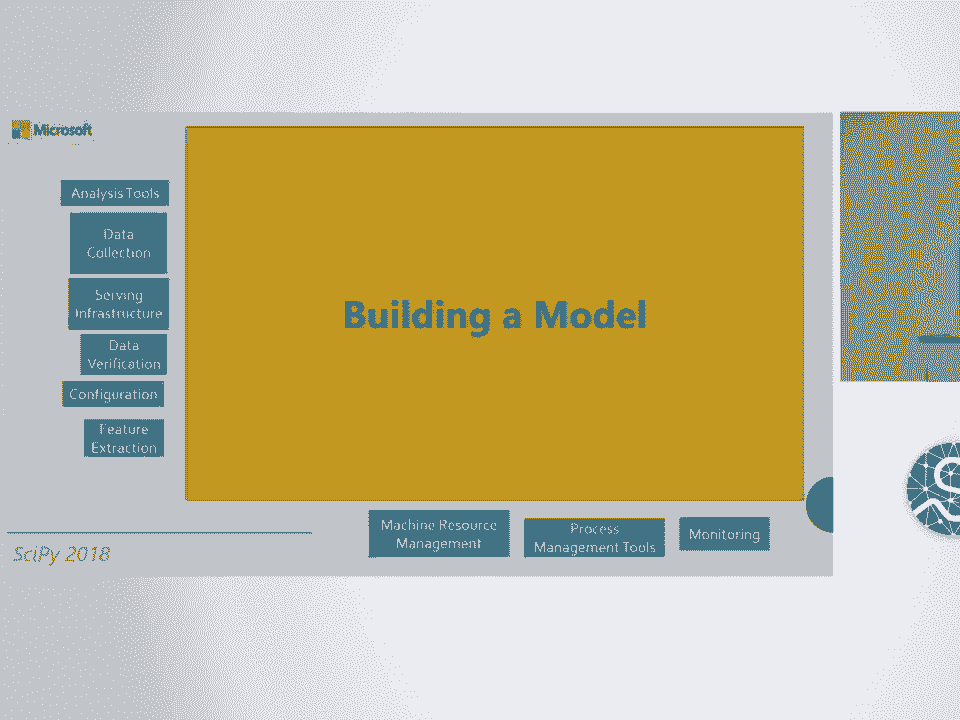

 So you hardly ever talk about the process of data collection or configuration or verification。

 So as you train， as you train your model， as you deploy it， as it goes off into the wild。

 and does its thing， what is the life cycle of that algorithm？ You can't just have it。

 released and expect it to work forever and always。 You have to constantly refresh it with， data。

 You have to make sure that the data that you're using to refresh it is of a consistent。

 format with the data that was used to train your model。 So for example， if you're sampling。

 data once every five seconds， you need to make sure that it's still continuously sampled。

 every five seconds。 And it isn't， you know， suddenly the frequency has changed。 It hasn't。

 changed from an int value to some sort of floating point value。

 It hasn't moved from four categories， to suddenly you have six different categories。

 Because all of those can dramatically impact， the accuracy and can actually make it so that if your algorithm is a mission critical algorithm。

 that's deciding some life or death matter， you want to make sure that it's doing what。

 it's supposed to。 And how do you set up the infrastructure to monitor it？ How do you serve。

 it consistently？ And how do you deal with the resource management？ So if you're spinning。

 it up to retrain， you probably need a different sort of hardware architecture than if you're。

 just serving it up for inferencing。 So all of these considerations are incredibly important。

 and massively complex if you're doing any sort of large scale machine learning。 And they're。

 not ever really discussed in tutorials and they're hardly ever discussed in academic research。

 If you are interested， there are a couple of papers that I can recommend。 One is the。

 TFX paper that was put out by Google。 And the other one is the high interest credit card。

 debt of machine learning， also released by Google。 But they deal with a number of these。

 issues around retraining models， serving them up and making sure that their operation will。

 operating the way that they should。 So for the data science life cycle， it probably looks。

 something a little bit like this。 You start with business understanding， data acquisition。

 and understanding and it's a constant refresh process。 You never really end。 It's the CI/CD。

 situation of most software development。 Tutorials focus on that。 We're going to talk about。

 this for the most part。 And the real magic of being able to deploy as a container is that。

 you can suddenly have a lot more control on how your model is used。 So for example， you。

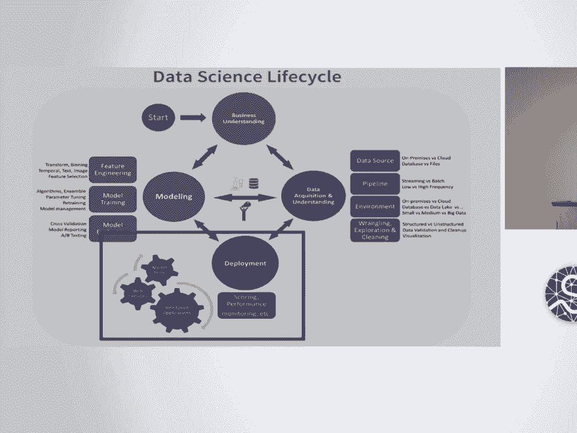

 can build apps on top of your model。 This is an example of something that was created by。

 the original team from MIT， deepmoji。mit。edu that allows them to collect additional data。

 and crowd source their model verification over time。 And if you have this kind of a website。

 how do you scale it？ If you have 100 users， that's fine。 If you have 100 bits of data that。

 are used to train your model。 But what would happen if suddenly the amount of data and。

 the amount of utilization increases？ You would probably need to scale up your hardware infrastructure。

 You would want to do it dynamically without losing any downtime。 And what tools are available。

 to facilitate that？ So creating your own model takes a lot of time， data experience and hardware。

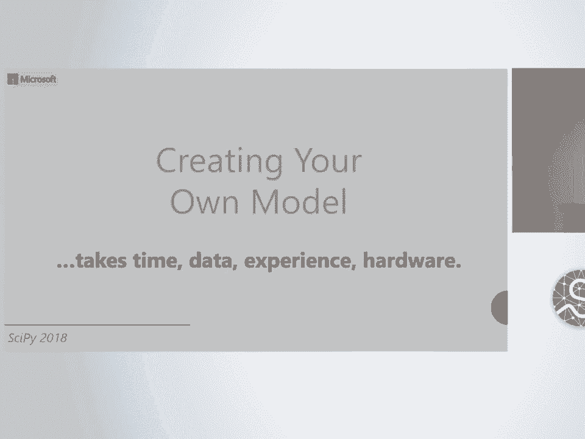

 It's got a lot of complexity。 So you've probably seen a number of these development tools floating。

 around。 And the thing that I want to hammer in today before David comes up on stage is。

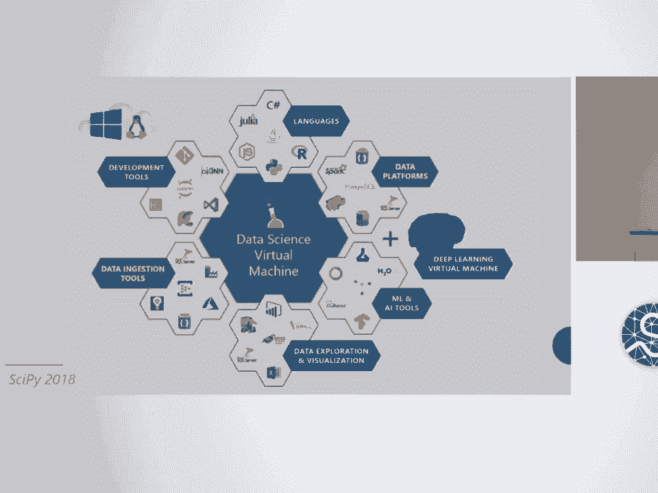

 that everything that we talk about in terms of cube flow isn't specifically related to。

 just tensor flow and Kubernetes。 It's literally any machine learning framework and the Kubernetes。

 infrastructure。 So it doesn't matter if you're using scikit-learn with karat。 It doesn't matter。

 if you're wanting to use MXnet or cognitive toolkit or PyTorch。 All of the practices。

 so the conceptual idea is taking machine learning models and deploying them on Kubernetes。 And。

 it also builds the best practices， builds the reproducibility steps that if you're using。

 a CPU or a GPU and you're using a specific cluster configuration， then you would be able。

 to preserve that。 If you see a really cool paper， like the one that I just showed from。

 MIT talking about emoji detection and emoji suggestion and tweets and you want to replicate， it。

 then you wouldn't have to worry about your data inputs being formatted in a certain way。

 That's just taken care of。 You wouldn't have to worry about if you're using hardware infrastructure。

 from Azure because that's where you got free credits or if you're using it from GCP because。

 you know that's where your research funding comes from or if you're using it on a cluster。

 of machines that you've got accessible in your university， all of those would kind of be。

 defined in the underlying YAML file for your Docker container or for Kubernetes。 Same with。

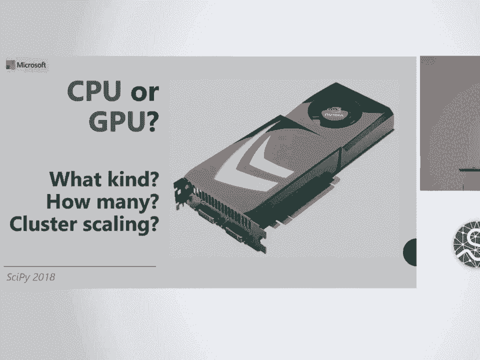

 FPGAs or custom basics。 All of that would be defined for you。 And just in case anybody in the。

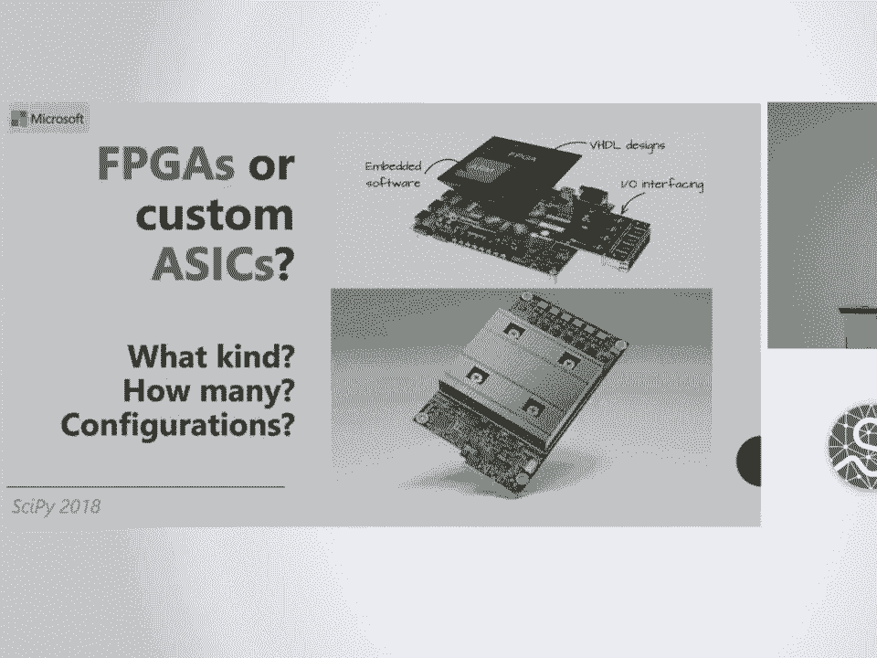

 audience isn't familiar with containers， you've probably heard of VMs。 VMs are just kind of virtual。

 machines that hard allocate resources on a larger scale server。 So you might have one。

 machine with 48 gigabytes of RAM， you divide it up into three separate VMs each with 16 gigs。

 But that's not very efficient because most of the time you aren't using that full size。

 You might just be using a little bit of RAM and why on earth would you need to have three。

 operating systems installed？ Why can't there be a situation where you could just share resources。

 across all the machines and all the instances that you have？ So it's incredibly inefficient。

 to operate this way。 And containers offer a really straightforward and streamlined solution。

 So instead of you having to again just allocate VMs， these containers dynamically resize。 So if。

 you're using four gigabytes of memory and then it scales to eight， then that automatically changes。

 And also all you have to do to define it whenever your container spins up is all of the files that。

 are required。 So Python files， dependencies in terms of packages and also instantiations of any。

 container images。 And all of that whenever you ping a REST API spins up does its thing。

 and then gives you back some sort of respected output。 So when you create your model， all you have。

 to do is define some sort of schema like a schema。json for inputs and for outputs。

 Some sort of script， to initialize and run your model。 And that's kind of it。

 And then whenever you want to call it， you don't have to worry about having a server running forever and always。

 It starts and then it， shuts down after it does its business。

 So you can imagine that the kind of complexity for containers， can get a little bit harried。

 And with that， I would like to invite David on stage to talk about。

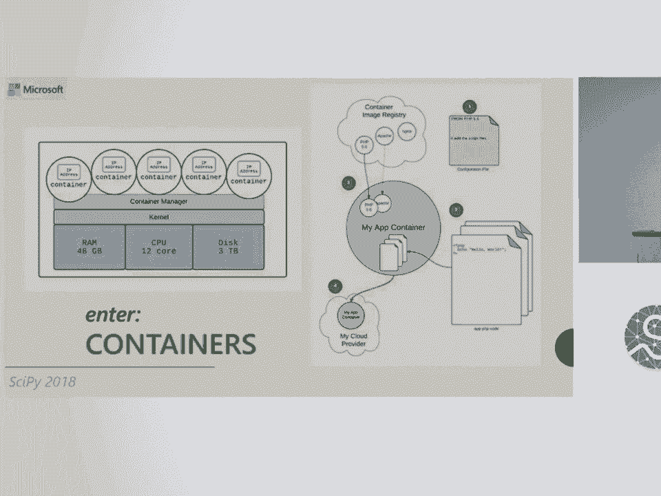

 the motivation for Kubernetes and container management at Google。 So。 Thank you so much。 So yeah。

 exactly like Paige said， containers were a real revolution。

 It's something that Google has been running internally for more than 10 years at this point。

 Actually， I think we're up to 13。 We spent up 2 billion containers a week。 And the real。

 essence of it is exactly like Paige just described。

 It lets you hermetically seal all your dependencies， your description， how much RAM you need。

 how much disk you want。 But then you need a system that。

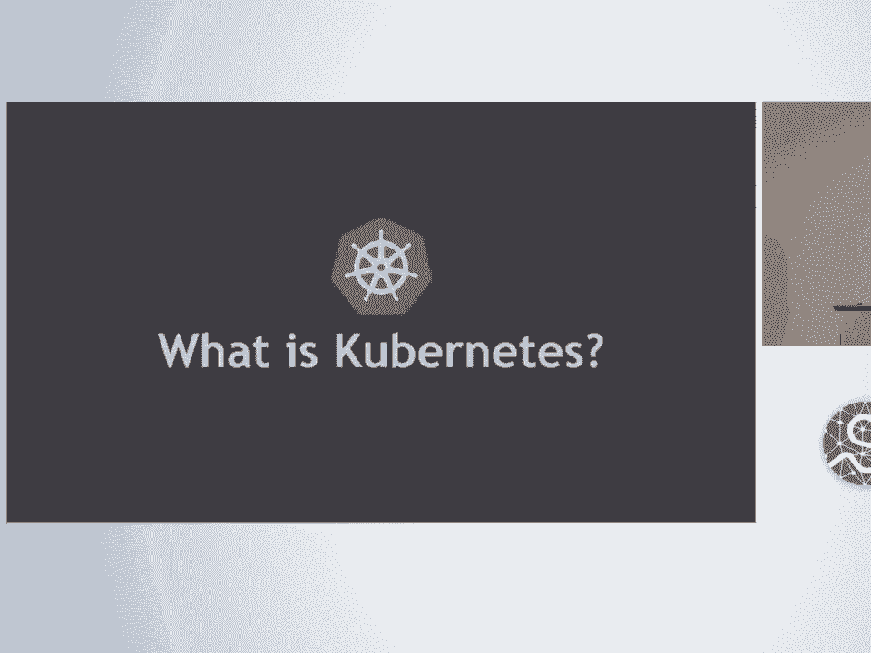

 understands what your entire operation looks like。 How many VMs do you have out there in the world？

 Which ones have space available？ Oh， do I need new ones or what's the criteria？ And today。

 you've had to spend a whole bunch of time using a bunch of different orchestrators。

 keeping track of all those things， doing inventory management and things like that。

 The essence of Kubernetes is Kubernetes understands everything that's out there。

 It understands what， all your workloads look like。 You simply interact with a single API。

 That API says I need X。 And， you know， it goes out and gets it。

 And then it allocates those resources。 And you， as a data scientist， as a machine learning expert。

 don't have to think about anything under the hood。

 That is the essence of what we call cloud native application development。 And Kubernetes really。

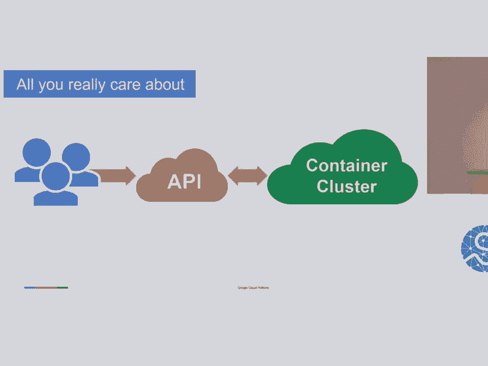

 unlocks it。 And what we need is cloud native machine learning。 So that you don't have to think。

 about all those applications and all those components you mentioned earlier。

 We're really short on time。

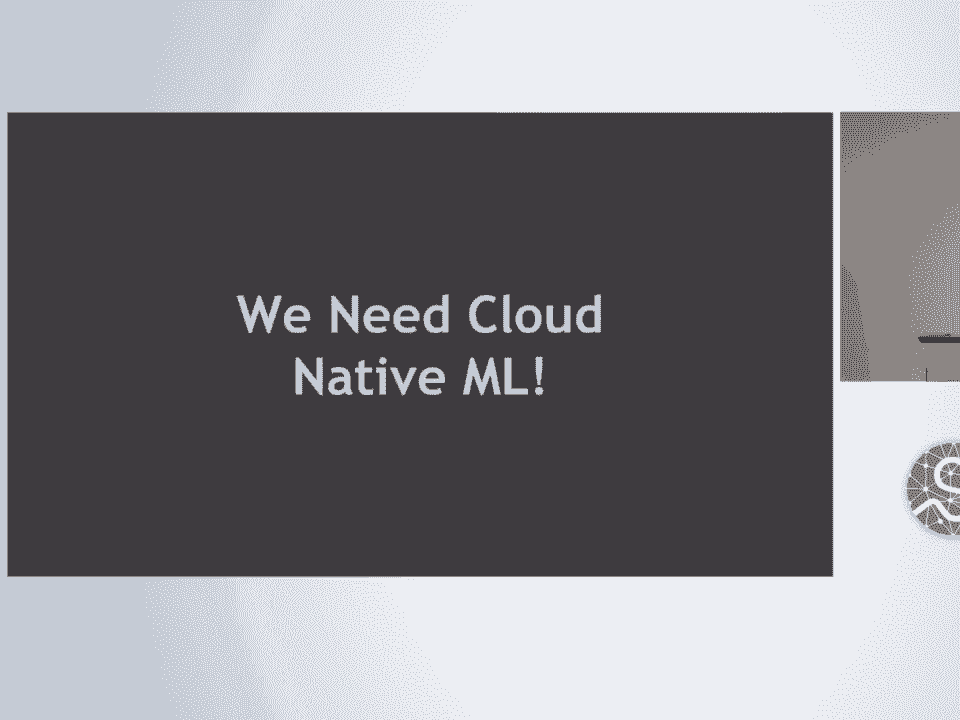

 so I'll try and pre-suit this pretty quickly。 But the essence of it is that it gives you。

 composability。 So all those various tools that Paige listed earlier， you want to be able to pick。

 and choose， swap them in and out。 However， it makes sense to you。 This team uses Python。 This。

 team uses TensorFlow。 Great。 You can do it。 You want to make it portable。 So you can take advantage。

 of， you know， if you have credits here or if you have an on-prem cluster here。 And then you want。

 to make it scalable。 So if you discover that， hey， I have a paper this Friday， I need to spin up。

 you know， a thousand more machines so that I can get this done in two hours， you can do it。

 Like I said， I'll try and breeze through this pretty quickly。 It isn't just about building a model。

 It's about building an entire pipeline just like Paige described。 And having that pipeline be。

 ordered so that when step one finishes， step two kicks off， I mean， we just heard about that。

 from the LIGO demonstration where they're doing this massive data processing and then publishing。

 it out to the world。 We want to enable that。 And so it looks something like， oops。

 something like this。 It's also about portability， as I mentioned before。

 This might be the entire stack of things。

 that you're looking at where that entire pipeline is just the top portion。 And that。

 experimentation is super powerful， but then you want to take that and move that elsewhere。

 Now you may say that doesn't matter to you， but you're wrong。 And I can prove that to you in one。

 statement。 How many of you have a laptop？ All right。 You all are multi-deployment， right？ You have。

 something that you experiment with locally and then you push it out to the cloud or you push it。

 onto a cluster or you push it somewhere else where you're looking to get additional speed or。

 access additional data。 And don't just listen to me。 Here's one of the other co-founders of the。

 Kubernetes project， Joe Beta。 He has this great tweet。 I love to read it。 The way I think about it。

 every difference between dev staging and production eventually will result in an outage。

 And you have， faced this。 Have you seen this？ This little word here， dev。

 I'm going to highlight it for you。 It's very， very important。 Dev is your laptop。

 Dev is the thing that you've run on your local， laptop and you're like， oh， don't worry。

 It'll just run on the cluster。 How many of you have deployed。

 to your staging or your cluster and all of a sudden， oh。

 that library wasn't right or the version of， libc is wrong or， you know， this other cluster。

 this other team stomped on the thing that I was。

 running on。 That's no good。 And it happens all the time。 Your laptop counts。 And just to， again。

 to highlight that first category。 That's all about experimentation。 And then， like I said。

 scalability as well， which I'll breeze through。 So that's what we're really trying to get to here。

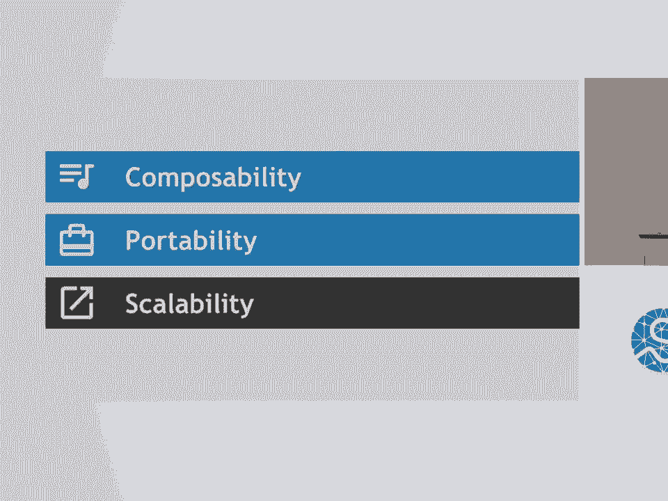

 Containers and Kubernetes gives that to you， except， unfortunately， today， this is what's。

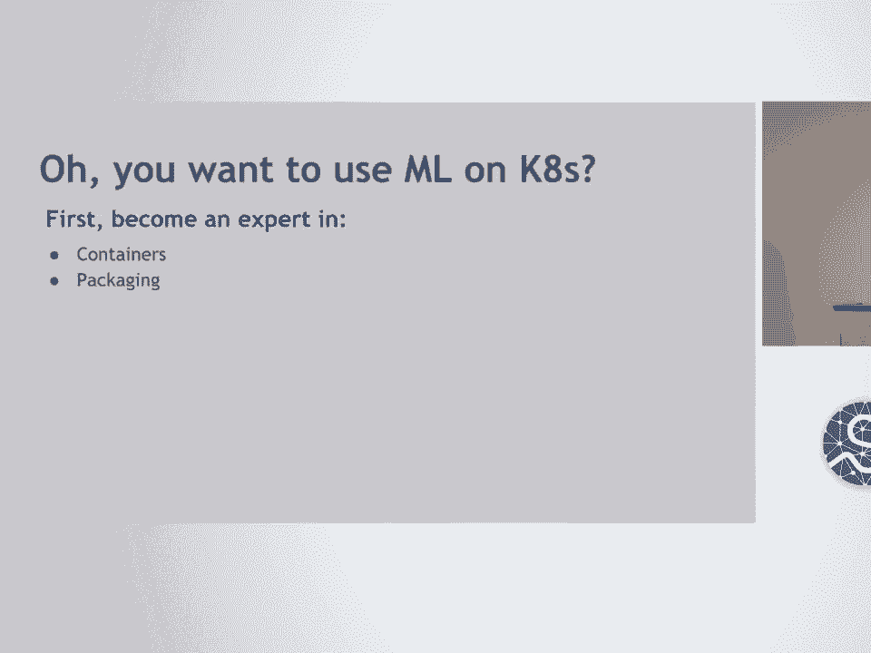

 required in order to use Kubernetes when it comes to machine learning。 Which is not so good， again。

 But this is what we're trying to solve with Kubeflow。 It makes it easy for everyone to develop。

 deploy， and manage portable distributed machine learning on Kubernetes。 And the idea here is that。

 this base layer is provided by Kubernetes。 You can get it anywhere。 You can get it on your laptop。

 Azure， GCP， AWS， VMware， you name it。 Kubernetes is everywhere。 And then you describe in a very。

 small set of code what your deployment looks like。

 What that entire pipeline looks like using Kubeflow， native language。

 And then you're able to stamp that out anywhere you have Kubernetes。 It is just 0。1。

 but it's we have a bunch of things in the box right now。 We have a Jupiter notebook。 We have。

 multi-architecture training。 As Paige said， we already have PyTorch and Cafe and TensorFlow。

 We would love to get lots more things。 XGBoose， I know， is in flight。 We'd love to get R in， SciPy。

 all these various things。 We give you a way to spread out that training across a number of。

 different nodes using Kubernetes native components。 And basically let you swap in whatever。

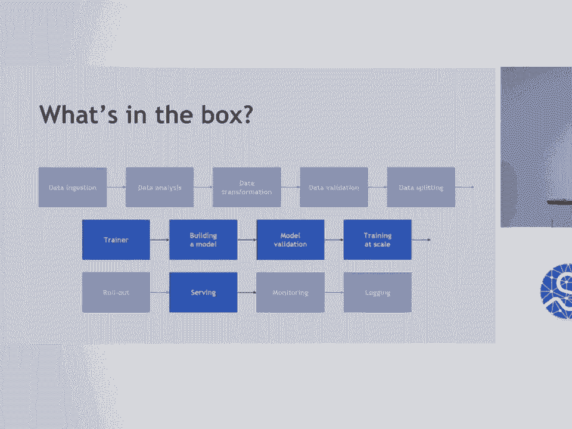

 makes sense to you。 And now with literally one minute I will hand it off to Paige。

 I don't know if we， have enough time for the demo。 But look at the demo。

 And then we can take time for questions。 But so in terms of the demo。

 what I have here is a data science virtual machine running on Azure。

 I also have the same instantiation in Google running on GCP。 So David mentioned before。

 that if you're using Kubeflow， it doesn't really matter what cloud architecture， red card， yes。

 It doesn't really matter what cloud architecture you're using or if you're working。

 on a cluster of machines at your university or your workspace because you know， crazy， crazy。

 security permission data such。 But if you， no matter where you're running it， you should be able to。

 take the resources that you've allocated and defined， lift and shipped it to any cloud or any。

 other source that you have。 And if anybody would like to take a look at the code。

 I will be available， afterwards。 It's also available on my GitHub。

 And it worked because you can see it in the list， the terminal there。 But yes， sorry。

 >> Do you want to swap to the links？ >> Oh， yes。 That would be awesome。 All right。 Thank you。

 Paige and David。 We'll have time for maybe one quick question。

 either at the podium or if you want to flag。 Looks like we've got one already。 >> Yeah。

 Thanks for the presentation。 Just a question。 I don't know if this outside of the。

 scope of Kubeflow or just what insights you'd have on this。 But one of the problems we've had。

 when we've tried to run things on Kubernetes is similar to how you make use of all of your。

 resources very nicely using containers over VMs。 The problem with Kubernetes was always that we。

 need to scale up to some high level of say， you know， 100 machines or something。 But then most of。

 the time it just sits idle。 So our cluster sits idle because we sort of needed on demand。 So you。

 can put in auto scaling groups。 There's a number of ways that we've addressed that。

 But is there a simplified interface for scaling down hardware resources that is part of Kubernetes。

 or maybe would be in the future？ >> So that is ultimately going to be your cloud provider that。

 provides that or if you're using VMware。 So then VMware would do that for you。 But basically the。

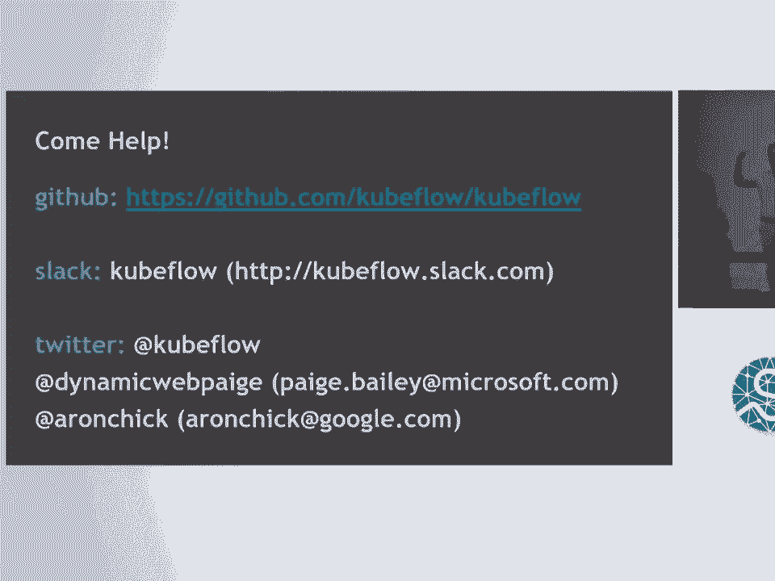

 idea is that your cloud provider and Azure has a great one。 Google has a great one。 Amazon hasn't。

 launched theirs yet publicly but they have one as well。 That will be the thing that dictates it。

 Now what you'll find is that most folks， most cloud providers are very， very cautious about。

 scaling down aggressively because you can end up in a situation where， you know， it was just a。

 teeny little drip blip downward and then all of a sudden now you have to rescale back up。

 So they're， very cautious about that。 You can very aggressively retweet tweak those settings and I'm happy to。

 talk to you about how to do that afterward。 But there's nothing about Kubernetes。

 Kubernetes doesn't， care like how fast you scale up and scale down。

 It just cares about what's there。 And so I'm happy。

 to talk to you about how to do that more aggressively。 >> And also cloud providers。 >> Oh。

 I don't know。 Will you cast something？ >> Yeah。 >> Okay。

 If you have any other questions for Paige and David。

 you can talk to them after outside in the hallway。 Thank you。 [ Applause ]， [BLANK_AUDIO]。

